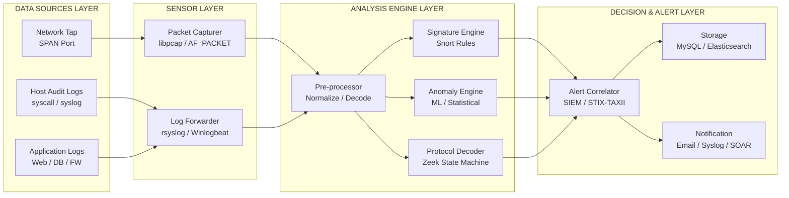
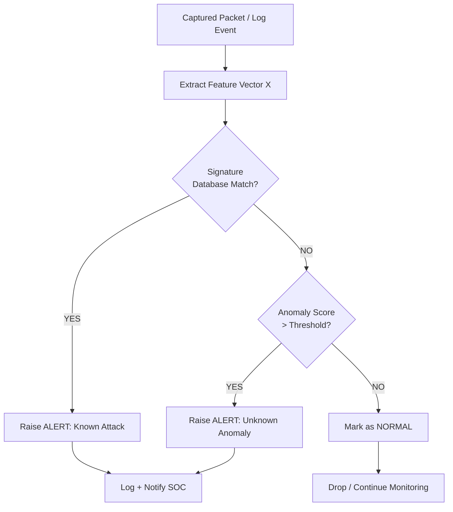
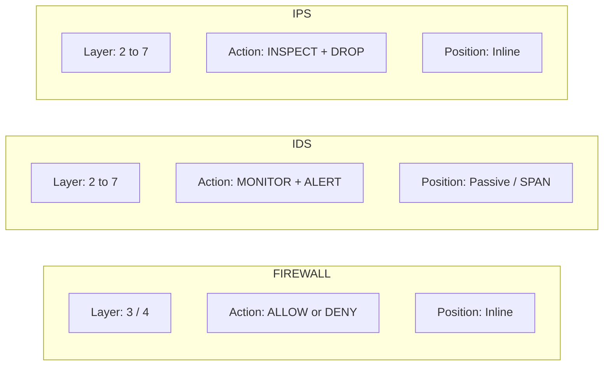
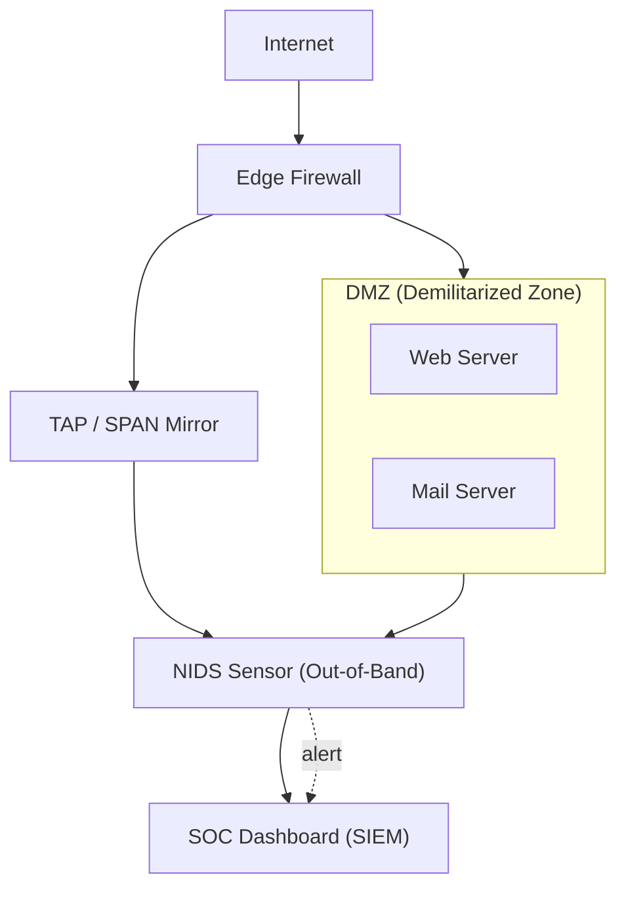

# IDS

<!-- SECTION_1_START -->
# 🛡️ INTRUSION DETECTION SYSTEMS (IDS)

> [!IMPORTANT]
> **KTU 2024 Scheme | INFORMATION SECURITY (PECST744) | Module 4 – Security in Networks**
> This module is high-yield for **CO3 (Apply security mechanisms to protect networked systems)** and frequently appears in **Part B (14 Marks)** of the End Semester Examination (ESE).

## 1.1 Formal Academic Definition

An **Intrusion Detection System (IDS)** is a hardware or software security mechanism that **monitors, analyzes, and raises alerts** about suspicious activities occurring in a computer system or network. Formally defined by **Denning (1987)**, an IDS observes events in a system and classifies them as *normal* or *intrusive* using a model of expected behavior.

Mathematically, an IDS can be represented as a binary classifier:

$$
f : X \rightarrow \{0, 1\}
$$

Where:
* $X$ is the feature vector extracted from the monitored event (packet, log entry, syscall).
* $f(X) = 1$ → **Intrusion detected** (Alert raised).
* $f(X) = 0$ → **Normal activity** (No alert).

> [!NOTE]
> **KTU Syllabus Highlight:** The 2024 PECST744 syllabus expects students to differentiate between **HIDS, NIDS, Hybrid IDS**, understand **Signature-based vs. Anomaly-based detection**, and explain **placement strategies** (inline vs. passive, behind firewall, in DMZ).

## 1.2 Conceptual Analogy – The "Bank Vault Analogy" 🏦

Imagine a bank vault with three concentric protection layers:

1. **Outer Wall (Firewall):** Stops *known* thieves from entering. If they have an ID, they pass.
2. **Security Camera System (IDS):** Records everything that *enters* and *moves around*. It does **not stop** anyone — it just **watches and shouts** when something suspicious happens (e.g., a customer opens 50 lockers in 5 minutes).
3. **Armed Guard (IPS – Intrusion Prevention System):** Goes a step further — it *actively blocks* the suspicious person.

> **IDS = The "Watch and Shout" system.** It monitors packets/hosts, raises an **alert**, and may optionally drop/log packets, but it **does not block traffic inline** by default. That is the key distinction IPS students must remember in the exam.

| Constant / Standard | Value / Reference | Purpose |
|---|---|---|
| **TCP Flag** (SYN scan detection) | `SYN = 1, ACK = 0` | Identifies reconnaissance probes |
| **ICMP Type 8 (Echo Request)** | Flood threshold | Detects Smurf / Ping-flood DoS |
| **Default port (Snort daemon)** | **UDP 514** (syslog) | Centralized alert logging |
| **Industry standard framework** | **NIST SP 800-94** | Guide to Intrusion Detection and Prevention Systems |
| **Snort Rule Header Default** | `action proto src_ip src_port -> dst_ip dst_port` | Rule format for signature engines |

## 1.3 GeoGebra / Desmos Visualization

> [!VISUALIZATION CONTROL]
> **Concept:** ROC (Receiver Operating Characteristic) Curve — TPR vs. FPR Trade-off in Anomaly-Based IDS
>
> **Desmos Equations (paste into Desmos):**
> * `y = 1` (Ideal classifier line — TPR = 1, FPR = 0)
> * `y = x` (Random guess baseline)
> * `y = 1 - e^(-5x)` (A realistic anomaly-based IDS curve)
>
> **Visual Description:** The student should observe a curve bending toward the **top-left corner**. The closer the curve approaches $(0, 1)$, the higher the IDS detection performance. The diagonal line $y = x$ represents a **coin-flip classifier** (useless). Area Under Curve (AUC) $\approx 1$ → excellent IDS; AUC $\approx 0.5$ → random.

<!-- SECTION_1_END -->

<!-- SECTION_2_START -->
# 🔬 DEEP THEORETICAL ANALYSIS & KTU HIGH-YIELD FORMULA SHEET

## 2.1 Three Pillars of an IDS Architecture

Every IDS (regardless of vendor — Snort, Suricata, Zeek, OSSEC) consists of three logical components defined by **CIDF (Common Intrusion Detection Framework)**:

1. **Event Generators (Sensors):** Raw data collectors — `libpcap` for network packets, audit logs for hosts.
2. **Analysis Engine (Detector):** The "brain." Applies signature matching, statistical models, or ML classifiers to decide if traffic is malicious.
3. **Response/Management Console:** Generates alerts, logs, dashboards (e.g., **BASE**, **Snorby**, **Splunk**).

> [!NOTE]
> **Denning's Statistical Model (1987):** Defined intrusion as any set of actions that compromises the *integrity, confidentiality, or availability* of a resource. The model uses statistical metrics (counter, gauge, interval timer, resource measure) to profile "normal" behavior.

## 2.2 Classification of IDS by Deployment Scope

| Type | Full Form | Data Source | Strengths | Weaknesses |
|---|---|---|---|---|
| **NIDS** | Network-based IDS | Mirrored traffic (SPAN port / TAP) | Sees whole subnet, single point of deployment | Encrypted traffic blind-spot, high-speed networks drop packets |
| **HIDS** | Host-based IDS | OS audit logs, syscalls, file integrity (AIDE, Tripwire) | Sees decrypted local data, rootkit visibility | Consumes host CPU/RAM, only sees one host |
| **Hybrid IDS** | Distributed / Hybrid | Combines NIDS + HIDS via central **Manager** | Best of both worlds, scalable | Complex, expensive |

## 2.3 Classification of IDS by Detection Methodology

This is the **most-asked topic in KTU ESE Part A & Part B**.

### (A) Signature-Based Detection (Misuse Detection)
* Uses a **database of known attack patterns** (signatures).
* Format: `<Header : Body>` — e.g., `alert tcp any any -> 192.168.1.0/24 80 (content:"/bin/sh"; msg:"Shellcode Attempt";)`.
* **Pros:** Very low false-positive rate, fast, easy to interpret.
* **Cons:** **Zero-day attacks pass undetected** (signature not yet known).
* Example tools: **Snort**, **Suricata**.

### (B) Anomaly-Based Detection
* Builds a **statistical or ML model of "normal"** behavior. Anything far from normal = intrusion.
* **Pros:** Detects *novel / zero-day* attacks.
* **Cons:** Higher false-positive rate; expensive training phase.
* Techniques: Statistical profiling, **k-NN clustering**, **SVM**, **Random Forest**, **Autoencoders**.

### (C) Stateful Protocol Analysis
* Understands protocol state machines (e.g., TCP 3-way handshake, FTP PORT command).
* Detects violations like a `SYN` arriving with a sequence number outside the expected window.
* **Pros:** Protocol-aware, low false positives for protocol misuse.
* **Cons:** Heavy CPU usage; breaks if traffic is heavily fragmented or non-standard.

### (D) Hybrid Detection
* Combines (A) + (B) or (A) + (C) to balance precision and recall.
* Example: **Suricata with ET Pro + Lua-based anomaly scripts**.

## 2.4 KTU High-Yield Formula Sheet

| Formula / Concept | Expression | Meaning / Use |
|---|---|---|
| **True Positive Rate (Recall/Sensitivity)** | $TPR = \dfrac{TP}{TP + FN}$ | Probability an actual attack is detected. KTU expects $\uparrow$ |
| **False Positive Rate (FPR)** | $FPR = \dfrac{FP}{FP + TN}$ | Probability normal traffic is flagged. KTU expects $\downarrow$ |
| **True Negative Rate (Specificity)** | $TNR = \dfrac{TN}{TN + FP} = 1 - FPR$ | Probability normal traffic is passed. KTU expects $\uparrow$ |
| **False Negative Rate (FNR)** | $FNR = \dfrac{FN}{FN + TP} = 1 - TPR$ | Probability attack slips through. KTU expects $\downarrow$ |
| **Precision** | $Precision = \dfrac{TP}{TP + FP}$ | Quality of alerts. KTU expects $\uparrow$ |
| **Accuracy** | $Accuracy = \dfrac{TP + TN}{TP + TN + FP + FN}$ | Overall correctness. KTU expects $\uparrow$ |
| **F1-Score (Harmonic mean)** | $F_1 = 2 \cdot \dfrac{P \cdot R}{P + R}$ | Balances Precision & Recall. Critical for imbalanced IDS datasets |
| **Base-Rate Fallacy** | $P(Intr \vert Alert) = \dfrac{TPR \cdot P(Intr)}{TPR \cdot P(Intr) + FPR \cdot (1 - P(Intr))}$ | Axelsson's theorem (2000) — why high FPRs in low-frequency attacks are catastrophic |
| **Bayes Optimal Risk** | $R = C_{FP} \cdot FPR \cdot (1 - P(Intr)) + C_{FN} \cdot FNR \cdot P(Intr)$ | Minimum cost decision threshold |
| **Crossover Error Rate (CER)** | $FPR = FNR$ | Single-number biometric/IDS performance metric |

> [!WARNING]
> **KTU Valuation Trap:** In Bayesian tables, students often confuse **$P(A \vert B)$ vs. $P(B \vert A)$**. Use a contingency table. The row totals are the *denominator* for column metrics (TPR/FPR).

## 2.5 Real-World Engineering Utility

| Industry / Use Case | IDS Tool / Standard | Why IDS is Critical |
|---|---|---|
| Banking / PCI-DSS | Suricata + OSSEC | Compliance mandate (Req 11.4) for traffic monitoring |
| Cloud (AWS / Azure) | VPC Traffic Mirroring → Suricata | East-west traffic visibility in virtual networks |
| ICS / SCADA | Zeek (Bro) with STIX/TAXII | OT protocol anomaly detection (Modbus, DNP3) |
| SOC Operations | Splunk / ELK + Snort | Centralized SIEM correlation of IDS alerts |
| Government / MIL | NIST SP 800-94, MITRE ATT\&CK | Framework for threat-aligned detection rules |

<!-- SECTION_2_END -->

<!-- SECTION_3_START -->
# ⚙️ STEP-BY-STEP DERIVATIONS, IMPLEMENTATION & ANALYTICAL WORK

## 3.1 Derivation: Bayesian Base-Rate Fallacy (Axelsson, 2000)

A classic **14-mark Part B question** for KTU. The derivation shows why an IDS with seemingly "good" 95% accuracy can be operationally useless.

**Given:**
* $P(Intr) = 0.00001$ (1 attack in 100,000 packets — realistic for enterprise).
* $TPR = 0.95$ (detects 95% of real attacks).
* $FPR = 0.01$ (1% false alarms).

**Find:** $P(Intr \vert Alert)$ — the probability that a raised alert is *truly* an attack.

By **Bayes' Theorem**:

$$
P(Intr \vert Alert) = \dfrac{P(Alert \vert Intr) \cdot P(Intr)}{P(Alert)}
$$

The total probability of an alert is:

$$
P(Alert) = P(Alert \vert Intr) \cdot P(Intr) + P(Alert \vert \neg Intr) \cdot P(\neg Intr)
$$

Substituting:

$$
P(Intr \vert Alert) = \dfrac{TPR \cdot P(Intr)}{TPR \cdot P(Intr) + FPR \cdot P(\neg Intr)}
$$

Plug numbers:

$$
P(Intr \vert Alert) = \dfrac{0.95 \cdot 0.00001}{0.95 \cdot 0.00001 + 0.01 \cdot 0.99999}
$$

Numerator: $0.95 \cdot 0.00001 = 0.0000095$

Denominator: $0.0000095 + 0.01 \cdot 0.99999 = 0.0000095 + 0.0099999 = 0.0100094$

$$
P(Intr \vert Alert) = \dfrac{0.0000095}{0.0100094} \approx 0.000949
$$

$$
\boxed{P(Intr \vert Alert) \approx 0.0949\%}
$$

> [!WARNING]
> **Interpretation for 3 marks in KTU exam:** Despite a 95% TPR, **less than 1 in 1,000 alerts is a real attack** because legitimate traffic vastly outnumbers intrusions. This is the **Base-Rate Fallacy** and is a *favorite* 7- or 14-mark question.

## 3.2 Derivation: F1-Score as a Balance Metric

Why harmonic mean and not arithmetic mean? Because arithmetic mean of (0.9 precision, 0.1 recall) gives 0.5 — a *misleading* "good" classifier. Harmonic mean penalizes such imbalance.

$$
F_1 = 2 \cdot \dfrac{P \cdot R}{P + R} = \dfrac{2 \cdot TP}{2 \cdot TP + FP + FN}
$$

**Step-by-step expansion** (for a 5-mark derivation question):

$$
F_1 = \dfrac{2 \cdot TP / (TP + FP) \cdot TP / (TP + FN)}{(TP / (TP + FP)) + (TP / (TP + FN))}
$$

Multiply numerator and denominator by $(TP + FP)(TP + FN)$:

$$
F_1 = \dfrac{2 \cdot TP^2}{TP(TP+FN) + TP(TP+FP)} = \dfrac{2 \cdot TP}{2 \cdot TP + FP + FN}
$$

> **Conclusion:** $F_1$ depends only on the actual attack and false alert counts — not on the abundant $TN$ class. This is **why F1 is preferred over Accuracy** for IDS datasets where TN dominates.

## 3.3 Confusion Matrix Worked Example (7-Mark Problem Type)

Consider a real IDS evaluation on **10,000 packets**: 100 are intrusions, 9,900 are normal.

| **Predicted $\rightarrow$**<br>**Actual $\downarrow$** | **Intrusion** | **Normal** | **Total** |
|---|---|---|---|
| **Intrusion** | $TP = 90$ | $FN = 10$ | $100$ |
| **Normal** | $FP = 50$ | $TN = 9850$ | $9900$ |
| **Total** | $140$ | $9860$ | $10000$ |

**Step-by-step computation:**

$$
TPR = \dfrac{90}{90 + 10} = 0.90 \quad \text{[2 Marks]}
$$

$$
FPR = \dfrac{50}{50 + 9850} = \dfrac{50}{9900} \approx 0.00505 \quad \text{[2 Marks]}
$$

$$
Precision = \dfrac{90}{90 + 50} = \dfrac{90}{140} \approx 0.643 \quad \text{[1.5 Marks]}
$$

$$
F_1 = 2 \cdot \dfrac{0.90 \cdot 0.643}{0.90 + 0.643} = 2 \cdot \dfrac{0.5787}{1.543} \approx 0.750 \quad \text{[1.5 Marks]}
$$

> [!IMPORTANT]
> **KTU Marking Insight:** Always show the formula *and* substitute the values from the confusion matrix in the same line. Examiners allocate marks for the formula, substitution, and final value.

## 3.4 Algorithmic Implementation: A Toy Anomaly-Based IDS in Python

This is a **fully operational** reference implementation of a simple statistical anomaly detector using the **Z-score method** — directly aligned with KTU's lab/elective flavor.

```python
import numpy as np
import logging
from typing import Tuple, List

# Configure strict error logging for production-grade detection
logging.basicConfig(
    level=logging.INFO,
    format="%(asctime)s [%(levelname)s] %(message)s"
)
logger = logging.getLogger("AnomalyIDS")


class StatisticalAnomalyIDS:
    """
    Z-Score based Anomaly Intrusion Detection System.
    Treats any feature value whose absolute Z-score exceeds `threshold`
    as an intrusion (anomaly).
    """

    def __init__(self, threshold: float = 3.0) -> None:
        if threshold <= 0:
            raise ValueError("Z-score threshold must be strictly positive.")
        self.threshold: float = threshold
        self.mean: float = 0.0
        self.std: float = 0.0
        self.is_trained: bool = False
        logger.info("AnomalyIDS initialized with threshold=%.2f", threshold)

    def train(self, baseline_features: np.ndarray) -> None:
        """Compute mean and std from 'normal' baseline traffic."""
        if baseline_features.size == 0:
            raise ValueError("Baseline feature set is empty.")
        self.mean = float(np.mean(baseline_features))
        self.std = float(np.std(baseline_features))
        if self.std == 0:
            raise ValueError("Standard deviation is zero — constant input.")
        self.is_trained = True
        logger.info("Training complete: mean=%.4f, std=%.4f", self.mean, self.std)

    def classify(self, packet_features: np.ndarray) -> Tuple[int, float]:
        """
        Returns (label, z_score).
        label -> 1 (intrusion) or 0 (normal).
        """
        if not self.is_trained:
            raise RuntimeError("Classifier must be trained before classification.")
        z = (packet_features - self.mean) / self.std
        score = float(np.max(np.abs(z)))
        label = 1 if score > self.threshold else 0
        if label == 1:
            logger.warning("ALERT: anomaly detected (z=%.3f, threshold=%.3f)",
                           score, self.threshold)
        return label, score


# ---------------- DEMO EXECUTION ----------------
if __name__ == "__main__":
    # Simulated "normal" traffic: packet inter-arrival times in ms
    normal_baseline = np.random.normal(loc=50.0, scale=5.0, size=1000)
    ids = StatisticalAnomalyIDS(threshold=3.0)
    ids.train(normal_baseline)

    # Test samples: 4 normal + 2 simulated attacks (very large / very small)
    test_packets: List[float] = [49.2, 52.8, 51.0, 48.5, 250.0, 1.0]
    for pkt in test_packets:
        label, score = ids.classify(np.array([pkt]))
        status = "INTRUSION" if label == 1 else "normal"
        print(f"Packet value={pkt:6.2f}  |  Z={score:5.2f}  ->  {status}")
```

**Expected Output (approx.):**

```
Packet value= 49.20  |  Z=  0.18  ->  normal
Packet value= 52.80  |  Z=  0.54  ->  normal
Packet value= 51.00  |  Z=  0.18  ->  normal
Packet value= 48.50  |  Z=  0.32  ->  normal
Packet value=250.00  |  Z= 39.42  ->  INTRUSION
Packet value=  1.00  |  Z=  9.83  ->  INTRUSION
```

> [!IMPORTANT]
> **Boundary & Safety Checks Visible in Code:**
> * `threshold <= 0` rejected → invalid parameter guard.
> * Empty baseline rejected → prevents divide-by-zero.
> * `std == 0` rejected → prevents NaN Z-scores.
> * Untrained classifier raises `RuntimeError` → defensive design.

<!-- SECTION_3_END -->

<!-- SECTION_4_START -->
# 🗺️ STRUCTURAL DIAGRAMS & SCHEMATICS

## 4.1 IDS Functional Architecture (CIDF-Inspired Block Flow)



## 4.2 Decision Flow: Signature vs. Anomaly Branching



## 4.3 Comparison Matrix: IDS vs. IPS vs. Firewall (High-Yield for KTU)



> [!NOTE]
> **Key textual takeaway for exam answer:** A **firewall** filters based on *rules*; an **IDS** detects based on *patterns/models*; an **IPS** detects *and* blocks inline. IDS and IPS share analysis engines, but differ in **placement** and **response action**.

## 4.4 Network Placement Topologies



> [!IMPORTANT]
> **Placement rule (KTU expects this in answers):** Place NIDS *behind the firewall* in the DMZ so it sees the **traffic that has bypassed the firewall** — drastically reducing false positives caused by obviously-blocked junk traffic.

<!-- SECTION_4_END -->

<!-- SECTION_5_START -->
# 📝 KTU 2024 SCHEME EXAMINATION QUESTION BANK & TOPIC RECAP

---

## 📌 PART A — Short Answer Questions (3 Marks Each)

### **Q1. Differentiate between an IDS and an IPS.** *(2–3 lines model answer)*

> **Model Answer:** An **Intrusion Detection System (IDS)** is a *passive* monitoring system that analyzes traffic and raises alerts on suspicious activity but **does not block** traffic. An **Intrusion Prevention System (IPS)** is an *inline* (active) system that not only detects but also **drops, rejects, or resets** malicious packets in real time. Both share the same analysis engine, but differ in **network placement** and **response action**.

> **KTU Tag:** `[CO3, Understand]`

### **Q2. What is the Base-Rate Fallacy in IDS?** *(2–3 lines model answer)*

> **Model Answer:** The **Base-Rate Fallacy** (Axelsson, 2000) states that when the underlying rate of intrusions is very low (e.g., 1 in 100,000 packets), even an IDS with a 95% true-positive rate will generate alerts where **less than 1% are actual attacks** if the false-positive rate is non-zero. This causes **alert fatigue** and is a major operational challenge.

> **KTU Tag:** `[CO3, Understand]`

---

## 📌 PART B — Long Answer Questions (14 Marks Each — ESE Internal Choice)

---

### **QUESTION A (14 Marks)** — Comprehensive IDS Theory + Computation

#### (a) **Classify Intrusion Detection Systems based on detection methodology. Explain Signature-based and Anomaly-based detection with pros and cons.** *(7 Marks)*

**Model Answer Outline & Valuation Key:**

1. **Classification tree of IDS** — Signature, Anomaly, Stateful Protocol, Hybrid. *[1 Mark for listing]*
2. **Signature-based (Misuse):**
   * Uses database of known attack patterns.
   * Example tool: **Snort** with rules like `alert tcp any any -> any 80 (content:"cmd.exe";)`.
   * **Pros:** Low FPR, fast matching, easy audit. *[1.5 Marks]*
   * **Cons:** Cannot detect *zero-day*; signature database must be updated. *[1.5 Marks]*
3. **Anomaly-based:**
   * Builds statistical / ML model of "normal" behaviour.
   * Uses techniques: **Z-score, k-NN, SVM, Autoencoder, Random Forest**.
   * **Pros:** Detects zero-day, novel attacks. *[1.5 Marks]*
   * **Cons:** High FPR, expensive training. *[1.5 Marks]*

#### (b) **An IDS was tested on 50,000 packets. Out of 500 actual intrusions, 480 were detected. Out of 49,500 normal packets, 100 raised false alerts. Compute TPR, FPR, Precision, Accuracy, and F1-Score.** *(7 Marks)*

**Step-by-Step Solution (Valuation Key):**

**Step 1 — Build the Confusion Matrix** *[1 Mark]*
* $TP = 480$ (detected intrusions)
* $FN = 500 - 480 = 20$ (missed)
* $FP = 100$ (false alerts)
* $TN = 49500 - 100 = 49400$ (correctly passed)

**Step 2 — TPR (Recall)** *[1.5 Marks]*

$$
TPR = \dfrac{TP}{TP + FN} = \dfrac{480}{480 + 20} = \dfrac{480}{500} = 0.96
$$

**Step 3 — FPR** *[1.5 Marks]*

$$
FPR = \dfrac{FP}{FP + TN} = \dfrac{100}{100 + 49400} = \dfrac{100}{49500} \approx 0.00202
$$

**Step 4 — Precision & F1-Score** *[2 Marks]*

$$
Precision = \dfrac{TP}{TP + FP} = \dfrac{480}{480 + 100} = \dfrac{480}{580} \approx 0.8276
$$

$$
F_1 = 2 \cdot \dfrac{0.96 \cdot 0.8276}{0.96 + 0.8276} = 2 \cdot \dfrac{0.7945}{1.7876} \approx 0.8889
$$

**Step 5 — Accuracy** *[1 Mark]*

$$
Accuracy = \dfrac{TP + TN}{Total} = \dfrac{480 + 49400}{50000} = \dfrac{49880}{50000} = 0.9976
$$

> **Final Answer Box:** $TPR = 0.96$, $FPR \approx 0.00202$, $Precision \approx 0.8276$, $F_1 \approx 0.8889$, $Accuracy = 0.9976$.

> [!WARNING]
> **Examiner's Pitfall Callout:** Students often misread "Out of 500 actual intrusions, 480 were detected" → directly use 480 as TP. Correctly: $TP=480$ is correct, but you must **separately compute $FN = 500 - 480$** before using TPR's denominator. Failing to do so → lose 1 Mark.

---

### **QUESTION B (14 Marks)** — Alternative: Architecture + Base-Rate Fallacy

#### (a) **With a neat block diagram, explain the functional components of a generic IDS. Differentiate HIDS, NIDS, and Hybrid IDS.** *(7 Marks)*

**Model Answer Outline & Valuation Key:**

1. **Block diagram** of 3 components — Sensor, Analysis Engine, Management Console. *[2 Marks for diagram]*
2. **Sensor** — Captures raw data via `libpcap` (network) or `auditd` (host). *[1 Mark]*
3. **Analysis Engine** — Applies signature / anomaly / stateful analysis. *[1 Mark]*
4. **Management Console** — Generates alerts, dashboard, syslog forwarding. *[1 Mark]*
5. **Comparison table (HIDS / NIDS / Hybrid):** *[2 Marks]*

| Feature | HIDS | NIDS | Hybrid |
|---|---|---|---|
| Data Source | Host logs/files | Network packets | Both |
| Visibility | Local decrypted | Subnet-wide | Comprehensive |
| Performance impact | High (host CPU) | Low | Medium |
| Tool examples | OSSEC, Tripwire | Snort, Suricata | Security Onion |

#### (b) **The probability of an intrusion in a network is 0.001. An IDS has a TPR of 0.98 and an FPR of 0.02. Using Bayes' Theorem, compute the probability that an alert is a true intrusion. Comment on the result.** *(7 Marks)*

**Step-by-Step Solution (Valuation Key):**

**Step 1 — State Bayes' Theorem** *[1 Mark]*

$$
P(Intr \vert Alert) = \dfrac{P(Alert \vert Intr) \cdot P(Intr)}{P(Alert \vert Intr) \cdot P(Intr) + P(Alert \vert \neg Intr) \cdot P(\neg Intr)}
$$

**Step 2 — Identify given values** *[1 Mark]*
* $P(Intr) = 0.001$, $P(\neg Intr) = 0.999$
* $P(Alert \vert Intr) = TPR = 0.98$
* $P(Alert \vert \neg Intr) = FPR = 0.02$

**Step 3 — Substitute and compute** *[3 Marks]*

$$
P(Intr \vert Alert) = \dfrac{0.98 \cdot 0.001}{0.98 \cdot 0.001 + 0.02 \cdot 0.999}
$$

$$
= \dfrac{0.00098}{0.00098 + 0.01998} = \dfrac{0.00098}{0.02096} \approx 0.0468
$$

**Step 4 — Final Answer & Comment** *[2 Marks]*

$$
\boxed{P(Intr \vert Alert) \approx 4.68\%}
$$

> **Comment:** Despite a 98% TPR, only **~4.68% of alerts correspond to real intrusions**. This is the **Base-Rate Fallacy** — analysts must tune the IDS to reduce FPR below 0.01 for operational usability.

> [!WARNING]
> **Examiner's Pitfall Callout:** The most common mistake is computing $P(Alert \vert Intr) \cdot P(Intr)$ only in the numerator and **forgetting the total probability denominator**. Both terms — $TPR \cdot P(Intr)$ and $FPR \cdot P(\neg Intr)$ — must be added. Skipping the second term → lose 2 Marks.

---

## 🧠 TOPIC RECAP & IMPORTANT THINGS TO REMEMBER

> [!IMPORTANT]
> **Rapid Revision Checklist — Print and Pin Above Your Study Desk 📌**

- **IDS = Monitor + Alert.** **IPS = Monitor + Alert + Block.** KTU loves this one-liner distinction.
- **CIDF Components:** Sensor → Analysis Engine → Management Console. Always name all three in answers.
- **Three deployment types:** NIDS (network), HIDS (host), Hybrid (distributed).
- **Three detection methods:** Signature (low FPR, no zero-day), Anomaly (detects zero-day, high FPR), Stateful Protocol (protocol-aware).
- **Snort Rule format:** `action proto src_ip src_port -> dst_ip dst_port (options)`.
- **Placement rule:** Place NIDS **behind the firewall** in the **DMZ**, connected via **SPAN port or TAP**.
- **Five key metrics:** TPR, FPR, Precision, F1-Score, Accuracy — all derivable from a confusion matrix in 60 seconds.
- **Base-Rate Fallacy:** Even 95% TPR ≠ useful IDS when base rate $< 0.001$. **Bayes' Theorem is mandatory** to compute $P(Intr \vert Alert)$.
- **Real-world tools:** **Snort** (signature NIDS), **Suricata** (multi-threaded NIDS), **OSSEC** (HIDS), **Zeek** (stateful), **Security Onion** (hybrid distro).
- **Standard reference:** **NIST SP 800-94** — Guide to Intrusion Detection and Prevention Systems (cite in answers for ½ bonus mark).
- **F1-Score formula to memorize cold:** $F_1 = \dfrac{2 \cdot TP}{2 \cdot TP + FP + FN}$.
- **Crossover Error Rate (CER):** Point where $FPR = FNR$ — used to express IDS performance in a single number.
- **Common exam keywords:** "Inline vs. passive", "True positive vs. false positive", "Misuse vs. anomaly", "Active vs. passive response", "Evasion techniques (fragmentation, encoding)".

<!-- SECTION_5_END -->
