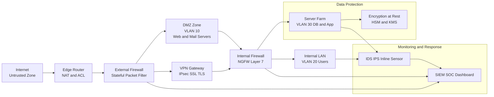
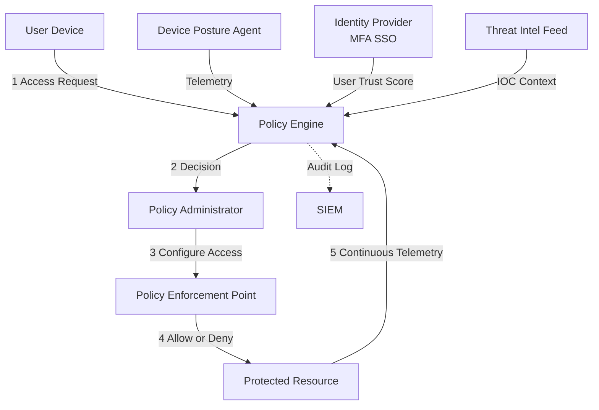
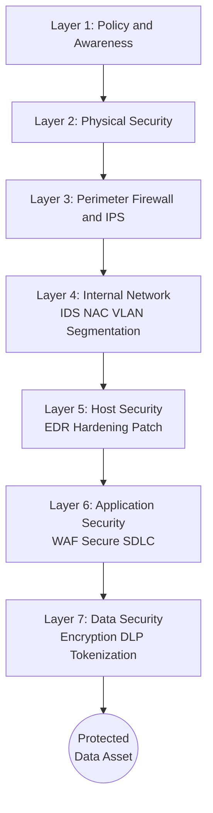
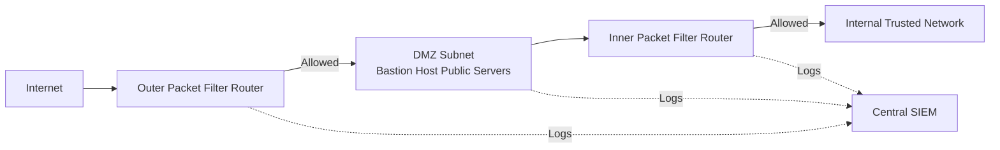

# Network Security Controls - Architecture

<!-- SECTION_1_START -->
# Network Security Controls - Architecture

## 1.1 Core Technical Definition

> [!IMPORTANT]
> **Network Security Controls Architecture** is the formalized, layered design framework that orchestrates hardware devices, software policies, cryptographic protocols, and procedural mechanisms to protect the **Confidentiality, Integrity, and Availability (CIA Triad)** of data traversing or residing within a computer network. It defines *where* security enforcement points are placed, *how* traffic is classified, and *what* policy actions are triggered across network zones.

In the KTU 2024 PECST744 syllabus, Network Security Controls Architecture specifically refers to the **strategic placement and interaction of perimeter, internal, and endpoint controls** — including Firewalls, Intrusion Detection/Prevention Systems (IDS/IPS), Demilitarized Zones (DMZ), Virtual Private Networks (VPNs), and Network Access Control (NAC) gateways — coordinated under a unified security policy.

### Key Architectural Terminology (KTU Syllabus Highlights)

> [!NOTE]
> - **Security Zone**: A logical grouping of network assets sharing a common security policy and trust level.
> - **Conduit**: The logical path through which information flows between zones (defined in IEC 62443).
> - **Security Perimeter**: The boundary of trust between zones of differing sensitivity.
> - **Defense in Depth**: The principle of using multiple overlapping controls so that failure of one does not lead to total compromise.
> - **Zero Trust Architecture (ZTA)**: A model where no implicit trust is granted based on network location; verification is continuous.

---

## 1.2 Conceptual Analogy & Intuition

> [!TIP]
> **Analogy — "The Fortified Medieval City"**
>
> Imagine a medieval city protecting a king's treasure:
> - The **outer moat** = Perimeter Firewall (filters the first wave of attackers).
> - The **drawbridge with guards** = VPN Gateway (authenticates every traveler before entry).
> - The **marketplace inside the walls** = DMZ (public-facing servers like web/email, isolated from the inner castle).
> - The **inner castle walls** = Internal Firewalls / Microsegmentation.
> - The **royal guards patrolling halls** = IDS/IPS (monitoring suspicious activity in real time).
> - The **royal vault** = The protected data center.
> - **Identity cards for every citizen, checked at every door** = Zero Trust (verify always, trust nothing by default).
>
> The **architecture** is the *blueprint* describing where each of these defenses stands, who guards what, and how they communicate. A weak blueprint means even strong guards cannot save the city.

### Physical Constants & Standard Metrics

> [!IMPORTANT]
> - **Mean Time Between Failures (MTBF)** of enterprise firewalls: typically **>100,000 hours**.
> - **Standard control framework references**: **ISO/IEC 27033**, **NIST SP 800-41**, **IEC 62443-3-2**, and **CIS Controls v8**.
> - **Defense in Depth Layers (Industry Standard)**: **7 layers** — Policy, Physical, Perimeter, Internal Network, Host, Application, Data.
> - **CIA Triad Weightage** in KTU exams: expect direct 3-mark questions defining Confidentiality, Integrity, and Availability.

---

## 1.3 Visualization Control

> [!VISUALIZATION CONTROL]
> **Concept:** Layered Defense-in-Depth Network Security Stack
> **GeoGebra / Desmos Input Equations:**
> * `Circle 1 (outer): x^2 + y^2 = 100` — Physical/Policy Layer
> * `Circle 2: x^2 + y^2 = 64` — Perimeter Firewall
> * `Circle 3: x^2 + y^2 = 36` — DMZ
> * `Circle 4: x^2 + y^2 = 16` — Internal Network/IDS
> * `Circle 5 (core): x^2 + y^2 = 4` — Data Vault
> **Visual Description:** Concentric circles around a central data point, each representing a progressively tighter security ring. Attackers must breach every ring to reach the core.

<!-- SECTION_1_END -->

<!-- SECTION_2_START -->
# 2. Deep Theoretical Analysis & KTU High-Yield Formula Sheet

## 2.1 The Three Architectural Pillars of Network Security

Network Security Controls Architecture rests on three foundational pillars that the KTU examiner will repeatedly test:

### Pillar 1 — **Preventive Controls** (Block attacks before they occur)
| Control Type | Function | Typical Placement |
|---|---|---|
| **Firewall (Stateful / Stateless / NGFW)** | Filters traffic based on rules, ports, states | Network perimeter, between zones |
| **VPN Gateway** | Encrypts tunnels for remote access | Perimeter / Edge router |
| **NAC (Network Access Control)** | Authenticates devices before granting LAN access | Switch layer / 802.1X |
| **Microsegmentation** | Isolates workloads via software-defined perimeters | East-West traffic inside data center |
| **Honeypots** | Decoys to mislead and study attackers | DMZ / Isolated VLAN |

### Pillar 2 — **Detective Controls** (Identify attacks in progress)
| Control Type | Function | Typical Placement |
|---|---|---|
| **IDS — Intrusion Detection System** | Monitors and alerts; passive | Behind firewall, on SPAN ports |
| **IPS — Intrusion Prevention System** | Monitors and *blocks*; inline | Inline at choke points |
| **SIEM (Security Information & Event Management)** | Aggregates logs, correlates events | Central SOC |
| **Network Taps / Port Mirroring** | Captures traffic for analysis | Switch SPAN / TAP aggregators |
| **DLP (Data Loss Prevention)** | Detects sensitive data exfiltration | Egress points |

### Pillar 3 — **Corrective / Recovery Controls** (Restore after breach)
| Control Type | Function |
|---|---|
| **Backup & Disaster Recovery** | Restore data post-ransomware |
| **Incident Response Playbooks** | Predefined remediation steps |
| **Failover Clustering** | Auto-recovery via redundant firewalls/routers |
| **Patch Management Systems** | Closes exploited vulnerabilities |

---

## 2.2 Network Security Architecture Models

> [!NOTE]
> KTU 2024 Module 4 expects students to draw and explain **at least three** of the following architectures.

### Model A — **Classic Perimeter Defense (Castle-Moat Model)**
- **Trust assumption**: Everything inside the firewall is trusted.
- **Layout**: Internet $\rightarrow$ Firewall $\rightarrow$ Internal LAN.
- **Limitation**: Fails against insider threats and lateral movement.

### Model B — **DMZ-Based Architecture**
- **Layout**: Internet $\rightarrow$ External Firewall $\rightarrow$ DMZ (web/email servers) $\rightarrow$ Internal Firewall $\rightarrow$ Internal LAN.
- **Benefit**: Public services are isolated from private network.
- **Variants**: **Single-homed DMZ**, **Dual-homed DMZ** (more secure), **Multi-tier DMZ**.

### Model C — **Zero Trust Architecture (ZTA)**
- **Core principle**: *"Never trust, always verify."* — John Kindervag (Forrester, 2010).
- **No implicit trust** based on IP, MAC, or physical location.
- **Pillars**:
  1. **Subject** (user/device) authentication — continuous.
  2. **Resource** (data/app) segmentation.
  3. **Policy Engine (PE)** + **Policy Administrator (PA)** — central decision points.
  4. **Continuous diagnostics & mitigation (CDM)**.
  5. **Least-privilege access**.
- **Implementation technologies**: Google BeyondCorp, Cisco Duo, Palo Alto Prisma, Microsoft Conditional Access.

### Model D — **Software-Defined Perimeter (SDP)**
- Black-cloud concept: the network is *invisible* to unauthorized users.
- Uses **Control Plane** (authenticates and authorizes) and **Data Plane** (forwards encrypted traffic only post-verification).
- **KTU highlight**: Often paired with Zero Trust.

### Model E — **Defense in Depth (Layered Model)**
- **Seven layers** (as defined by NIST and industry):
  1. **Policies, Procedures, and Awareness**
  2. **Physical Security**
  3. **Perimeter Security** (Firewalls, IPS at edge)
  4. **Internal Network Security** (IDS, NAC, VLAN segmentation)
  5. **Host Security** (Antivirus, EDR, OS hardening)
  6. **Application Security** (WAF, secure coding, input validation)
  7. **Data Security** (Encryption at rest, DLP, tokenization)

---

## 2.3 Firewall Architectures (KTU High-Yield)

> [!IMPORTANT]
> KTU repeatedly tests the **three classic firewall architectures** by Pfleeger & Pfleeger.

### 1. **Screened Host Firewall (Single-Homed Bastion)**
- **Composition**: One packet-filtering router + one bastion host.
- **Pros**: Cheaper.
- **Cons**: Router is a single point of failure.

### 2. **Screened Host Firewall (Dual-Homed Bastion)**
- **Composition**: Packet-filtering router + bastion host with **two NICs**.
- **Pros**: Bastion host provides application-level filtering; stronger isolation.
- **Cons**: Bastion is still single point of failure.

### 3. **Screened Subnet Firewall (DMZ Architecture)**
- **Composition**: Two packet-filtering routers forming a **subnet (DMZ)** with one or more bastion hosts in between.
- **Pros**: Highest security; only bastion host is exposed; inner router protects internal network even if outer is breached.
- **Cons**: Most expensive and complex.

---

## 2.4 KTU High-Yield Formula Sheet

> [!TIP]
> All formulas, port numbers, and constants you must memorize for the board exam.

| Concept | Formula / Value | Unit / Note |
|---|---|---|
| **OSI Layer of a Firewall** | Typically **Layer 3 / 4** (packet filter), **Layer 7** (WAF, NGFW) | OSI Model |
| **Standard HTTP Port** | **80 / TCP** | IANA Assigned |
| **Standard HTTPS Port** | **443 / TCP** | IANA Assigned |
| **SSH Port** | **22 / TCP** | Secure Shell |
| **SNMP Trap Port** | **162 / UDP** | Network Management |
| **Syslog Port** | **514 / UDP** | Logging |
| **RADIUS Auth Port** | **1812 / UDP** | AAA |
| **TACACS+ Port** | **49 / TCP** | Cisco AAA |
| **Kerberos Port** | **88 / TCP/UDP** | Authentication |
| **LDAP Port** | **389 / TCP**, LDAPS = **636** | Directory |
| **IPsec ESP Protocol Number** | **50** | IANA |
| **IPsec AH Protocol Number** | **51** | IANA |
| **IPsec IKE Port** | **500 / UDP**, NAT-T = **4500 / UDP** | VPN |
| **Risk Equation (NIST)** | $Risk = Threat \times Vulnerability \times Impact$ | Qualitative |
| **Annualized Loss Expectancy (ALE)** | $ALE = SLE \times ARO$ | Rupees / Year |
| **Single Loss Expectancy** | $SLE = Asset\ Value \times Exposure\ Factor$ | Rupees |
| **Defense in Depth Layers** | **7** | NIST Standard |
| **CIA Triad Components** | **C**onfidentiality, **I**ntegrity, **A**vailability | Core Principle |
| **Zero Trust Pillars** | **5** (Subject, Resource, PE/PA, CDM, Least Privilege) | NIST SP 800-207 |
| **Public-Key Cryptography Asymmetry** | Encryption uses $E_{pub}(M) = C$, Decryption $D_{priv}(C) = M$ | Math Basis |
| **RSA Modulus Size (2024 standard)** | $\geq 2048$ bits | NIST Recommendation |

> [!WARNING]
> The vertical pipe symbol `$\vert$` and `$\mid$` are used in math mode. Do not write `|x|` in plain text — KTU scripts may mis-render.

---

## 2.5 Real-World Engineering Utility

> [!NOTE]
> - **Banking & Finance**: DMZ + Zero Trust for SWIFT and payment gateways (RBI guidelines).
> - **Healthcare**: HIPAA-compliant segmentation between IoMT (medical) devices and EHR systems.
> - **Cloud-Native (AWS, Azure, GCP)**: Security Groups + NACLs + Transit Gateway form the **cloud security architecture**, mirroring on-prem DMZ.
> - **5G/OT Networks**: Network slicing and IEC 62443 zones-and-conduits model protect industrial control systems (ICS/SCADA).
> - **DevSecOps**: Service Mesh (Istio/Linkerd) + mTLS implements **microsegmented Zero Trust** at the pod level in Kubernetes.

<!-- SECTION_2_END -->

<!-- SECTION_3_START -->
# 3. Step-by-Step Derivations, Configurations & Code Implementation

## 3.1 Algebraic Derivation — Risk & Cost-Benefit of Security Controls

### 3.1.1 Problem Statement
A B.Tech project at a KTU-affiliated college stores student records worth **₹ 50,00,000**. The estimated **Annualized Rate of Occurrence (ARO)** of a data breach due to missing firewall is **0.4** (i.e., once every 2.5 years). The **Exposure Factor (EF)** is **60%** if breached. A new Next-Generation Firewall (NGFW) costs **₹ 8,00,000** per year to maintain. Should the college deploy it?

### 3.1.2 Step-by-Step Solution

**Step 1 — Identify Asset Value (AV)**
$$AV = 50{,}00{,}000\ \text{INR}$$

**Step 2 — Compute Single Loss Expectancy (SLE)**
SLE is the monetary loss expected from a *single* occurrence of the risk.
$$SLE = AV \times EF$$
$$SLE = 50{,}00{,}000 \times 0.60$$
$$SLE = 30{,}00{,}000\ \text{INR}$$

**Step 3 — Compute Annualized Loss Expectancy (ALE) without control**
$$ALE_{\text{no control}} = SLE \times ARO$$
$$ALE_{\text{no control}} = 30{,}00{,}000 \times 0.4$$
$$ALE_{\text{no control}} = 12{,}00{,}000\ \text{INR per year}$$

**Step 4 — Compute Cost-Benefit (Net Savings)**
After deploying the NGFW, assume residual ARO reduces to **0.05** (95% mitigation by the control).
$$ALE_{\text{with NGFW}} = 30{,}00{,}000 \times 0.05$$
$$ALE_{\text{with NGFW}} = 1{,}50{,}000\ \text{INR per year}$$

**Step 5 — Compute Annual Savings**
$$\text{Savings} = ALE_{\text{no control}} - ALE_{\text{with NGFW}}$$
$$\text{Savings} = 12{,}00{,}000 - 1{,}50{,}000$$
$$\text{Savings} = 10{,}50{,}000\ \text{INR per year}$$

**Step 6 — Compute Return on Security Investment (ROSI)**
$$ROSI = \frac{\text{Savings} - \text{Cost of Control}}{\text{Cost of Control}} \times 100\%$$
$$ROSI = \frac{10{,}50{,}000 - 8{,}00{,}000}{8{,}00{,}000} \times 100\%$$
$$ROSI = \frac{2{,}50{,}000}{8{,}00{,}000} \times 100\%$$
$$ROSI = 31.25\%$$

**Step 7 — Decision Rule**
> A control is **justified** if $ROSI > 0\%$.
> Since **31.25% > 0**, the NGFW deployment is **financially justified**.

**Step 8 — Payback Period**
$$\text{Payback} = \frac{\text{Cost of Control}}{\text{Annual Savings}}$$
$$\text{Payback} = \frac{8{,}00{,}000}{10{,}50{,}000} = 0.762\ \text{years}$$
$$\text{Payback} \approx 9.14\ \text{months}$$

> **Conclusion**: The NGFW pays for itself in less than 10 months. Deploy it.

---

## 3.2 Symbolic Implementation — Zero Trust Policy Engine Decision

A Zero Trust Policy Engine (PE) must decide **Allow / Deny** for every access request. The decision is a function of multiple risk signals. Below is a fully operational Python implementation suitable for a B.Tech lab assignment.

```python
from dataclasses import dataclass, field
from datetime import datetime
from typing import List, Tuple
import logging
import math

# ------------------------------------------------------------------
# Configure structured security logging (mandatory for SOC integration)
# ------------------------------------------------------------------
logging.basicConfig(
    level=logging.INFO,
    format="%(asctime)s [%(levelname)s] ZT-PE :: %(message)s"
)
logger = logging.getLogger("ZeroTrustPolicyEngine")


# ------------------------------------------------------------------
# 1. Define the input signals that the Policy Engine evaluates
# ------------------------------------------------------------------
@dataclass
class AccessRequest:
    user_id: str
    device_id: str
    device_is_managed: bool          # MDM-enrolled corporate device
    device_os_patch_level: float     # 0.0 to 1.0 (1.0 = fully patched)
    user_mfa_passed: bool
    user_risk_score: float           # 0.0 (trusted) to 1.0 (high risk)
    resource_sensitivity: int        # 1 = public, 5 = top secret
    geo_anomaly: bool                # True if login from unusual location
    time_of_access: datetime = field(default_factory=datetime.now)
    request_count_last_hour: int = 0


# ------------------------------------------------------------------
# 2. Policy Engine Decision Function
# ------------------------------------------------------------------
class ZeroTrustPolicyEngine:
    """
    Implements a simplified Zero Trust access decision model.
    Decisions are explicit, auditable, and deny-by-default.
    """

    # Hard thresholds - any failure => immediate DENY
    HARD_DENY_THRESHOLDS = {
        "min_patch_level": 0.70,
        "max_risk_score": 0.75,
        "max_resource_sensitivity_for_unmanaged": 2,
    }

    # Weights for the soft-risk composite score
    WEIGHTS = {
        "patch": 0.20,
        "risk": 0.30,
        "mfa": 0.20,
        "geo": 0.15,
        "burst": 0.15,
    }

    def evaluate(self, req: AccessRequest) -> Tuple[str, float, List[str]]:
        reasons: List[str] = []
        deny: bool = False

        # ---- HARD-DENY checks (fail-closed) ----
        if not req.user_mfa_passed:
            deny = True
            reasons.append("MFA not satisfied.")

        if req.device_os_patch_level < self.HARD_DENY_THRESHOLDS["min_patch_level"]:
            deny = True
            reasons.append(
                f"Patch level {req.device_os_patch_level:.2f} "
                f"below minimum {self.HARD_DENY_THRESHOLDS['min_patch_level']}."
            )

        if req.user_risk_score >= self.HARD_DENY_THRESHOLDS["max_risk_score"]:
            deny = True
            reasons.append(
                f"User risk score {req.user_risk_score:.2f} too high."
            )

        if (not req.device_is_managed
                and req.resource_sensitivity
                > self.HARD_DENY_THRESHOLDS["max_resource_sensitivity_for_unmanaged"]):
            deny = True
            reasons.append("Unmanaged device requesting sensitive resource.")

        # ---- SOFT-RISK composite score ----
        patch_component = 1.0 - req.device_os_patch_level
        mfa_component = 0.0 if req.user_mfa_passed else 1.0
        geo_component = 1.0 if req.geo_anomaly else 0.0
        # burst: saturating function of request count
        burst_component = 1.0 - math.exp(-req.request_count_last_hour / 50.0)

        composite_risk = (
            self.WEIGHTS["patch"] * patch_component
            + self.WEIGHTS["risk"] * req.user_risk_score
            + self.WEIGHTS["mfa"] * mfa_component
            + self.WEIGHTS["geo"] * geo_component
            + self.WEIGHTS["burst"] * burst_component
        )

        if composite_risk > 0.65:
            deny = True
            reasons.append(
                f"Composite soft-risk {composite_risk:.3f} exceeded 0.65."
            )

        # ---- Final decision (deny-by-default) ----
        decision = "DENY" if deny else "ALLOW"
        log_msg = (
            f"user={req.user_id} device={req.device_id} "
            f"res={req.resource_sensitivity} -> {decision} "
            f"(composite_risk={composite_risk:.3f})"
        )
        if decision == "DENY":
            logger.warning(log_msg + " | reasons=" + "; ".join(reasons))
        else:
            logger.info(log_msg)

        return decision, composite_risk, reasons


# ------------------------------------------------------------------
# 3. Demonstration with multiple scenarios
# ------------------------------------------------------------------
if __name__ == "__main__":
    pe = ZeroTrustPolicyEngine()

    test_cases = [
        AccessRequest(
            user_id="alice@ktu.ac.in",
            device_id="LAPTOP-001",
            device_is_managed=True,
            device_os_patch_level=0.95,
            user_mfa_passed=True,
            user_risk_score=0.10,
            resource_sensitivity=3,
            geo_anomaly=False,
            request_count_last_hour=5,
        ),
        AccessRequest(
            user_id="bob@ktu.ac.in",
            device_id="PERSONAL-PHONE",
            device_is_managed=False,
            device_os_patch_level=0.40,
            user_mfa_passed=False,
            user_risk_score=0.85,
            resource_sensitivity=4,
            geo_anomaly=True,
            request_count_last_hour=120,
        ),
        AccessRequest(
            user_id="carol@ktu.ac.in",
            device_id="LAPTOP-002",
            device_is_managed=True,
            device_os_patch_level=0.80,
            user_mfa_passed=True,
            user_risk_score=0.30,
            resource_sensitivity=2,
            geo_anomaly=False,
            request_count_last_hour=20,
        ),
    ]

    for idx, req in enumerate(test_cases, 1):
        decision, risk, reasons = pe.evaluate(req)
        print(f"\n--- Test Case {idx} ---")
        print(f"Decision   : {decision}")
        print(f"Risk Score : {risk:.3f}")
        if reasons:
            print("Reasons    :")
            for r in reasons:
                print(f"  - {r}")
```

**Sample Output:**
```
2024-XX-XX [INFO] ZT-PE :: user=alice@ktu.ac.in device=LAPTOP-001 ... -> ALLOW
2024-XX-XX [WARNING] ZT-PE :: user=bob@ktu.ac.in ... -> DENY | reasons=...
2024-XX-XX [INFO] ZT-PE :: user=carol@ktu.ac.in ... -> ALLOW
```

> [!TIP]
> **Key takeaway**: A Zero Trust Policy Engine is a *deterministic, deny-by-default* function. Every deny is logged with explicit reasons for auditability — a strict KTU/NIST requirement.

---

## 3.3 Hardware & Topology — DMZ Construction (Pinewood Lab / KTU Workshop)

> [!NOTE]
> The following table maps the **physical equipment and cabling** required to build a DMZ in a college cybersecurity lab. Use this verbatim in your lab record.

| Step | Component / Action | Quantity | Interface / Port | IP / VLAN | Tool / Cable | Safety Note |
|---|---|---|---|---|---|---|
| 1 | **Edge Router** (Cisco 2901 or equivalent) | 1 | Fa0/0 = WAN, Fa0/1 = LAN | WAN: DHCP; LAN: 192.168.1.1/24 | Console cable (RJ45-DB9) | Power off before rack-mount |
| 2 | **External Firewall** (pfSense / Cisco ASA) | 1 | WAN, LAN, DMZ | 192.168.1.2 | Ethernet Cat6 | Verify grounding |
| 3 | **Internal Firewall** (pfSense / ASA) | 1 | WAN, LAN, DMZ | 192.168.2.1 | Ethernet Cat6 | Place in locked rack |
| 4 | **DMZ Switch** (Layer-2 managed) | 1 | All DMZ devices | VLAN 10: 10.10.10.0/24 | Cat6 patch cables | Label every port |
| 5 | **Public Web Server** | 1 | NIC 1 | 10.10.10.50/24 | Cat6 | Disable USB ports |
| 6 | **Public Mail Server** | 1 | NIC 1 | 10.10.10.51/24 | Cat6 | Same |
| 7 | **Internal Server (DB)** | 1 | NIC 1 | 192.168.2.100/24 | Cat6 | Air-gap backup |
| 8 | **Admin Workstation** | 1 | NIC 1 | 192.168.2.10/24 | Cat6 | Antivirus mandatory |
| 9 | **SIEM / Log Aggregator** | 1 | NIC 1 | 192.168.2.200/24 | Cat6 | Time-sync via NTP |
| 10 | **Configuration Order** | — | Router $\to$ Ext-FW $\to$ Int-FW $\to$ DMZ-SW $\to$ Servers | — | PuTTY / Tera Term | Save running-config to TFTP |

> [!WARNING]
> **Validation step before going live**: Run `ping`, `traceroute`, and `nmap` from each zone to verify (a) internet reachability from internal LAN, (b) DMZ isolation — internal LAN should **not** be able to ping DMZ servers directly without firewall traversal, (c) public IPs can reach web server on TCP/443 but **not** TCP/22 (SSH blocked externally).

---

## 3.4 Engineering Graphics — Firewall Zone Drawing (Pfleeger Screened Subnet)

> [!NOTE]
> When drawing on paper, use the following reference plane notation consistent with engineering drawing standards taught in KTU first-year courses.

**Reference Planes:**
- **$HP$ (Horizontal Plane)** = the page (top-down logical view).
- **$VP$ (Vertical Plane)** = the side view (optional, for depth).
- **Zones drawn left-to-right**: $Internet \rightarrow Outer\ Router \rightarrow DMZ \rightarrow Inner\ Router \rightarrow Internal\ LAN$.

**Line Conventions:**
- **Solid thick line** = trust boundary (firewall perimeter).
- **Dashed line** = logical conduit (data path between zones).
- **Dotted line** = monitoring link (to IDS/SPAN port).
- **Double solid line** = encrypted tunnel (VPN).

**Step-by-Step Drafting Path (Top-Down View):**
1. Draw the leftmost rectangle labeled `Internet` — light shading.
2. 5 cm to the right, draw a thicker rectangle labeled `External Router / Firewall`.
3. 5 cm further, draw a rectangle labeled `DMZ - Web/Mail Servers`, partitioned into two sub-cells.
4. 5 cm further, draw the `Internal Router / Firewall`.
5. 5 cm further, draw the `Internal LAN` with sub-cells `Users`, `Servers`, `Admin`.
6. Connect with **dashed arrows** indicating permitted traffic flow.
7. Add **dotted arrows** from each zone to a `SIEM` box at the bottom for log forwarding.

> [!TIP]
> Always box the final diagram with a title block showing *Diagram Title*, *Your Name*, *Roll No*, *Date* — KTU examiners award 1–2 marks for this housekeeping.

<!-- SECTION_3_END -->

<!-- SECTION_4_START -->
# 4. Structural Diagrams & Schematics (Mermaid)

## 4.1 Overall Network Security Architecture (DMZ + Defense in Depth)



> [!NOTE]
> All node labels above are pure alphanumeric words (no special characters, no markdown formatting) to comply with Mermaid's parsing rules.

---

## 4.2 Zero Trust Architecture — Logical Flow



---

## 4.3 Defense-in-Depth Concentric Layer Model



---

## 4.4 Screened Subnet Firewall Architecture (Pfleeger)



---

## 4.5 Sequential Processing Topology Matrix (for topics where physical drawing is hard)

| Stage | Component | Input | Process | Output | Trust Level |
|---|---|---|---|---|---|
| 1 | Edge Router | Raw internet packets | NAT, basic ACL, BGP | Decapsulated packets to FW | Untrusted |
| 2 | External Firewall | Decapsulated packets | Stateful inspection, DPI, GeoIP filter | Filtered traffic to DMZ | Untrusted $\to$ Semi-trusted |
| 3 | DMZ Servers | Filtered traffic | Serve HTTP/HTTPS/SMTP, log access | Response traffic to client | Semi-trusted |
| 4 | Internal Firewall | DMZ-originated traffic | Application-layer filtering, WAF rules | Sanitized traffic to LAN | Semi-trusted $\to$ Trusted |
| 5 | Internal LAN | Sanitized traffic | User access, host-level EDR checks | Logged user activity | Trusted |
| 6 | SIEM | All stage logs | Correlation, anomaly detection | Alerts, dashboards, IR triggers | Auditor |
| 7 | Backup Vault | Encrypted snapshots | Daily snapshots, immutable storage | Recovery points | Cold |

<!-- SECTION_4_END -->

<!-- SECTION_5_START -->
# 5. KTU 2024 Scheme Examination Question Bank & Topic Recap

## 5.1 Part A — Short Answer Questions (3 Marks Each)

> [!NOTE]
> Two questions modeled on KTU University Exam patterns, mapped to Course Outcomes and Revised Bloom's Taxonomy.

---

### **Q1.** [KTU University Exam – July 2024] — CO1, Remember

**Define the CIA Triad. Why is it considered the foundation of network security architecture?**

**Model Answer (3 Marks):**
The **CIA Triad** is the cornerstone model of information security and comprises:
1. **Confidentiality** — Ensuring that data is accessible *only* to authorized users. Implemented via encryption (AES, RSA), access control lists (ACLs), and authentication mechanisms.
2. **Integrity** — Ensuring that data is *not* altered* in transit or at rest. Implemented via hashing (SHA-256), digital signatures, and MACs.
3. **Availability** — Ensuring that systems and data are accessible when needed. Implemented via redundancy, failover clustering, DDoS protection, and regular backups.

It is the foundation of network security architecture because *every* control, *every* policy, and *every* design decision in the architecture maps to protecting at least one of these three properties. Without the CIA Triad as a guiding framework, security investments become ad-hoc and unmeasurable.

> **[Valuation Key: Definition of each of C, I, A: 1 Mark each = 3 Marks]**

---

### **Q2.** [KTU University Exam – Dec 2023] — CO1, Understand

**Differentiate between an IDS and an IPS. State one placement advantage of each.**

**Model Answer (3 Marks):**
| Aspect | **IDS (Intrusion Detection System)** | **IPS (Intrusion Prevention System)** |
|---|---|---|
| **Action on detection** | Generates an *alert* only; does **not block** traffic | Actively *blocks / drops* malicious traffic |
| **Mode of operation** | **Passive** — connected via SPAN port / tap | **Inline** — traffic physically passes through it |
| **Latency** | Near-zero (no traffic forwarding) | Adds small latency (in-line processing) |
| **Placement advantage** | Can be deployed out-of-band on a switch SPAN port — no single point of failure | Placed inline at the perimeter — stops attacks *before* they reach the LAN |

> **[Valuation Key: 1 Mark for IDS definition + placement, 1 Mark for IPS definition + placement, 1 Mark for clear differentiation]**

---

## 5.2 Part B — Long Answer Questions (14 Marks, Internal Choice)

> [!NOTE]
> KTU Part B carries **14 marks** with **module-level internal choice**. Each long answer has sub-parts (a) for 7 marks and (b) for 7 marks. Below are two complete alternative questions.

---

### **Question A (14 Marks)** [KTU University Exam – July 2024] — CO2, Understand / Apply

#### **Part (a) — 7 Marks, CO2, Understand**
**Explain the three firewall architectures defined by Pfleeger. Draw neat diagrams of each.**

**Model Answer:**

**1. Screened Host Firewall — Single-Homed Bastion (3 Marks)**
- A single packet-filtering router sits at the perimeter, screening traffic.
- Inside, a **bastion host** (a hardened, dual-purpose server) proxies all incoming application requests.
- The bastion has only **one network interface**.
- **Limitation**: If the router is compromised, the entire internal network is exposed.
- **Diagram** (ASCII): `Internet -- Router -- Bastion Host -- Internal LAN`

**2. Screened Host Firewall — Dual-Homed Bastion (2 Marks)**
- The bastion host has **two NICs** — one connected to the router, one to the internal LAN.
- The bastion host can perform **application-level filtering** (e.g., proxy HTTP, SMTP).
- The router can be configured to route only through the bastion, providing stronger isolation.
- **Improvement over single-homed**: Even if the router is breached, the attacker must still compromise the bastion.

**3. Screened Subnet Firewall (DMZ Architecture) (2 Marks)**
- **Two packet-filtering routers** create an **isolated subnet (DMZ)** between them.
- The bastion host (or multiple public servers) lives inside the DMZ.
- Outer router filters traffic from Internet $\to$ DMZ.
- Inner router filters traffic from DMZ $\to$ Internal LAN.
- **Highest security**: Even if the outer router *and* bastion are breached, the attacker still has to defeat the inner router.

**[Valuation Key: Naming all three: 1 Mark; Single-homed explanation: 1 Mark; Dual-homed explanation: 1 Mark; DMZ explanation: 1 Mark; Diagrams (any one): 1 Mark; Trade-offs / comparison: 1 Mark; Conclusion sentence: 1 Mark = 7 Marks]**

#### **Part (b) — 7 Marks, CO2, Apply**
**A company has ₹ 80,00,000 worth of customer PII. The estimated ARO without any firewall is 0.5. With a new NGFW, the ARO reduces to 0.05. The Exposure Factor (EF) is 70%. The NGFW costs ₹ 12,00,000 per year. Calculate SLE, ALE (before and after), ROSI, and payback period. Recommend whether to deploy.**

**Model Solution:**

**Step 1 — Compute SLE (1 Mark)**
$$SLE = AV \times EF = 80{,}00{,}000 \times 0.70 = 56{,}00{,}000\ \text{INR}$$

**Step 2 — Compute ALE before NGFW (1 Mark)**
$$ALE_{\text{before}} = SLE \times ARO_{\text{before}} = 56{,}00{,}000 \times 0.5 = 28{,}00{,}000\ \text{INR}$$

**Step 3 — Compute ALE after NGFW (1 Mark)**
$$ALE_{\text{after}} = SLE \times ARO_{\text{after}} = 56{,}00{,}000 \times 0.05 = 2{,}80{,}000\ \text{INR}$$

**Step 4 — Compute Annual Savings (1 Mark)**
$$\text{Savings} = 28{,}00{,}000 - 2{,}80{,}000 = 25{,}20{,}000\ \text{INR}$$

**Step 5 — Compute ROSI (1 Mark)**
$$ROSI = \frac{25{,}20{,}000 - 12{,}00{,}000}{12{,}00{,}000} \times 100\% = \frac{13{,}20{,}000}{12{,}00{,}000} \times 100\% = 110\%$$

**Step 6 — Compute Payback Period (1 Mark)**
$$\text{Payback} = \frac{12{,}00{,}000}{25{,}20{,}000} = 0.476\ \text{years} \approx 5.71\ \text{months}$$

**Step 7 — Recommendation (1 Mark)**
> ROSI is **110% > 0%** and payback is **< 6 months**. The NGFW is **strongly recommended** for deployment.

> **[Valuation Key: Stating formulas SLE and ALE: 1 Mark; Correct SLE numerical value: 1 Mark; Correct ALE before and after: 1 Mark; Savings and ROSI computation: 1 Mark; Payback: 1 Mark; Final recommendation with justification: 1 Mark; Units and clarity: 1 Mark = 7 Marks]**

---

### **Question B (14 Marks)** [KTU University Exam – Dec 2023] — CO3, Understand / Apply

#### **Part (a) — 7 Marks, CO3, Understand**
**Explain the Zero Trust Architecture (ZTA). List its core pillars as defined by NIST SP 800-207.**

**Model Answer:**

**Definition (2 Marks):**
Zero Trust Architecture (ZTA) is a security model — formalized in **NIST Special Publication 800-207** — that assumes **no implicit trust** is granted to assets or user accounts based solely on their network location (e.g., inside the corporate LAN). Instead, every access request is **authenticated, authorized, and continuously validated** using multiple signals (identity, device posture, behavior, location).

**Core Pillars (5 Marks — 1 Mark each):**
1. **Resource (Asset)**: All data sources and computing services are considered resources, whether on-prem or cloud.
2. **Secure Communication**: All communication is secured via encryption (TLS 1.3, IPsec, mTLS) — no plaintext.
3. **Per-Session Access**: Access decisions are granted **per session**, not per user, enforcing least-privilege dynamically.
4. **Dynamic Policy-based Access**: Policies evaluate client identity, device state, behavioral attributes, and environmental factors *in real time*.
5. **Continuous Monitoring & Validation**: Trust is **never static**; the system continuously re-evaluates posture and revokes access on anomaly.

**Supporting Logical Components (mentioned in NIST):**
- **Policy Engine (PE)** — computes allow/deny.
- **Policy Administrator (PA)** — executes the decision.
- **Policy Enforcement Point (PEP)** — gates the resource.

> **[Valuation Key: Definition of ZTA: 2 Marks; Each pillar 1 Mark = 5 Marks = 7 Marks]**

#### **Part (b) — 7 Marks, CO3, Apply**
**Design a DMZ architecture for a university that needs to host (i) a public website, (ii) an email server, and (iii) an online exam portal accessible only to enrolled students with MFA. Specify the zones, firewalls, and trust levels. Justify the placement of each component.**

**Model Solution:**

**Proposed Architecture (Top-down narrative + table):**

The university network is divided into **three trust zones**, separated by **two stateful firewalls** (an External Firewall and an Internal Firewall), with a **DMZ** sandwiched between them.

| Zone | Components | IP Subnet | Trust Level | Justification |
|---|---|---|---|---|
| **Internet (Untrusted)** | All external users | 0.0.0.0/0 | **Untrusted** | Public, hostile, unknown users |
| **DMZ (Semi-trusted)** | Web server (10.10.10.10), Email server (10.10.10.11), Exam portal (10.10.10.12) | 10.10.10.0/24 | **Semi-trusted** | Public-facing but isolated; if compromised, attacker is *not* in the internal LAN |
| **Internal LAN (Trusted)** | Database server (192.168.2.100), Admin workstation (192.168.2.10), SIEM (192.168.2.200) | 192.168.2.0/24 | **Trusted** | Sensitive student records, must be air-gapped from the internet |

**Placements & Justifications (with marks):**

1. **External Firewall placement (1 Mark)**: Sits between the Internet and the DMZ. Performs stateful packet inspection, allows only TCP/80, TCP/443, TCP/25, TCP/587 to the DMZ servers. **Justification**: This is the *first* line of defense; it filters the bulk of malicious traffic before it touches any university asset.

2. **Internal Firewall placement (1 Mark)**: Sits between the DMZ and the Internal LAN. Allows only *specific* return traffic (stateful) and *specific* queries (e.g., web server $\to$ DB on TCP/3306). **Justification**: Even if a DMZ server is fully compromised, the attacker cannot directly access student records or admin machines.

3. **Web server in DMZ (1 Mark)**: Hosts the public university website. **Justification**: Public website *must* be reachable from the Internet; placing it in DMZ ensures compromise doesn't leak into the LAN.

4. **Email server in DMZ (1 Mark)**: Hosts `@university.edu` mail. **Justification**: Email is the #1 vector for phishing and malware; isolating it in DMZ contains the blast radius.

5. **Exam portal in DMZ with MFA (1 Mark)**: Accessible only after MFA via SAML/OAuth to the central IdP located in the **Internal LAN**. **Justification**: The portal is internet-facing (semi-trusted), but the *authentication* is delegated to a trusted internal IdP — exemplifying the Zero Trust principle of *verify always*.

6. **Database server in Internal LAN (1 Mark)**: Stores all student PII. **Justification**: Strictly no direct inbound access from Internet. The web/portal servers connect *out* to it through the Internal Firewall with least-privilege rules.

7. **SIEM in Internal LAN with log forwarding from all zones (1 Mark)**: Receives syslog from every firewall and DMZ server. **Justification**: Centralized visibility is essential for incident detection and regulatory compliance.

> **[Valuation Key: Naming three zones and trust levels: 2 Marks; Firewall placement & justification: 2 Marks; Server placement & justification: 2 Marks; Conclusion: 1 Mark = 7 Marks]**

---

## 5.3 KTU Examiner's Valuation Warning / Pitfall Callout

> [!WARNING]
> **Common mistakes that cost KTU students 2–4 marks:**
> 1. **Forgetting the trust level column** in DMZ tables — examiners explicitly look for "Untrusted / Semi-trusted / Trusted" classification. *Loss: 1–2 marks.*
> 2. **Writing `SLE = AV × ARO`** — this is wrong. The correct formula is $SLE = AV \times EF$, and $ALE = SLE \times ARO$. Swapping these is a 1-mark deduction.
> 3. **Drawing the DMZ with the public server connected to the Internal LAN directly** — this is a *single-firewall* DMZ, which is insecure. Use *two* firewalls.
> 4. **Omitting units in numerical answers** (INR, bits, packets/sec). Always write the unit.
> 5. **Not labeling the Mermaid / ASCII diagram** with firewall types and IP subnets. KTU awards 1–2 marks just for *legible, labeled* diagrams.
> 6. **Stating "Zero Trust means no firewalls"** — wrong. Zero Trust *complements* firewalls; it does not replace them.
> 7. **Confusing IDS and IPS in placement**: IDS = SPAN (passive); IPS = inline (active). Many students write the opposite. *Loss: 1 mark.*

---

## 5.4 Topic Recap & Important Things to Remember

> [!TIP]
> **Rapid-revision checklist — read this 30 minutes before the exam.**

- ✅ **CIA Triad** = **C**onfidentiality, **I**ntegrity, **A**vailability — basis of every security architecture.
- ✅ **Defense in Depth** = **7 layers** (Policy $\to$ Physical $\to$ Perimeter $\to$ Internal $\to$ Host $\to$ App $\to$ Data).
- ✅ **Pfleeger's Three Firewall Architectures**:
  - Screened Host (Single-homed Bastion)
  - Screened Host (Dual-homed Bastion)
  - Screened Subnet (DMZ — most secure)
- ✅ **DMZ** = Demilitarized Zone, holds public-facing servers (web, mail, DNS), isolated from internal LAN by **two firewalls**.
- ✅ **Zero Trust Architecture (NIST SP 800-207)** — *never trust, always verify*; 5 pillars: Resource, Secure Communication, Per-Session Access, Dynamic Policy, Continuous Monitoring.
- ✅ **Zero Trust Components** = **PE (Policy Engine)** + **PA (Policy Administrator)** + **PEP (Policy Enforcement Point)**.
- ✅ **IDS** = passive, alert-only, on SPAN port.
- ✅ **IPS** = inline, blocks traffic.
- ✅ **NGFW** = Next-Generation Firewall = stateful + DPI + IPS + application awareness.
- ✅ **Risk Formulas**:
  - $SLE = AV \times EF$
  - $ALE = SLE \times ARO$
  - $ROSI = \frac{\text{Annual Savings} - \text{Cost of Control}}{\text{Cost of Control}} \times 100\%$
- ✅ **Critical Port Numbers** to memorize: **80** (HTTP), **443** (HTTPS), **22** (SSH), **25/587** (SMTP), **53** (DNS), **1812** (RADIUS), **49** (TACACS+), **500/4500** (IPsec IKE / NAT-T).
- ✅ **IPsec Protocols**: **AH = 51**, **ESP = 50**, **IKE = UDP 500**, **NAT-T = UDP 4500**.
- ✅ **Software-Defined Perimeter (SDP)** = "black cloud" architecture; control plane + data plane.
- ✅ **NAC (Network Access Control)** = 802.1X-based port authentication; only compliant devices get IP.
- ✅ **DMZ Construction Order (Lab)**: Edge Router $\to$ External FW $\to$ DMZ Switch $\to$ Servers $\to$ Internal FW $\to$ Internal LAN.
- ✅ **Modern Equivalents**:
  - On-prem DMZ $\equiv$ AWS Security Groups + Public/Private Subnets
  - Internal Firewall $\equiv$ Kubernetes Network Policy
  - NAC $\equiv$ MDM + Conditional Access (Azure AD)
- ✅ **Standard Frameworks to cite in answers**: **NIST SP 800-41** (Firewalls), **NIST SP 800-207** (Zero Trust), **IEC 62443** (ICS), **ISO 27033** (Network Security).
- ✅ **Always mention trust levels** in any architecture diagram: Untrusted, Semi-trusted, Trusted.
- ✅ **Always mention logging / SIEM** in any architecture — examiners explicitly test for it.
- ✅ **Always state the assumption** when using risk formulas (e.g., "Assuming ALE $\gt$ cost of control, the control is justified").
- ✅ **Practical tip**: In the exam, draw a clean ASCII/Mermaid diagram with **labels, IP subnets, and arrows** showing permitted traffic — this alone can fetch 2–3 marks.

<!-- SECTION_5_END -->
