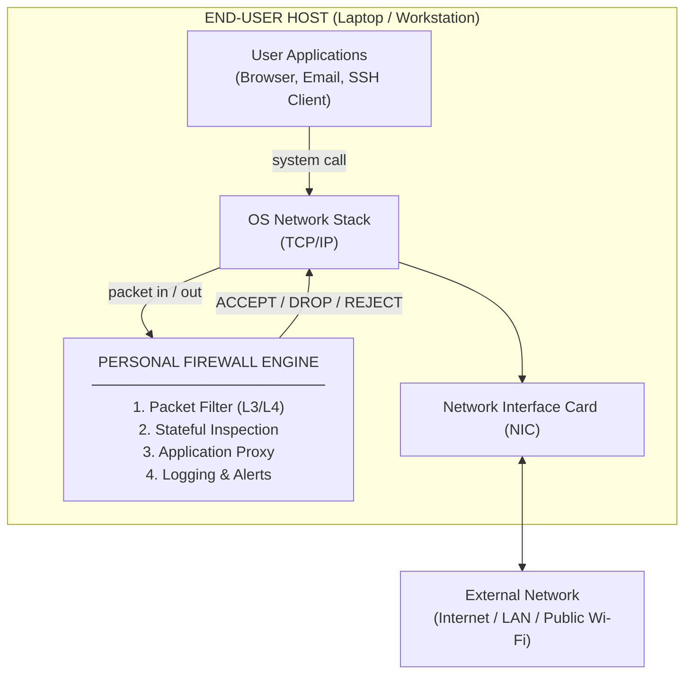
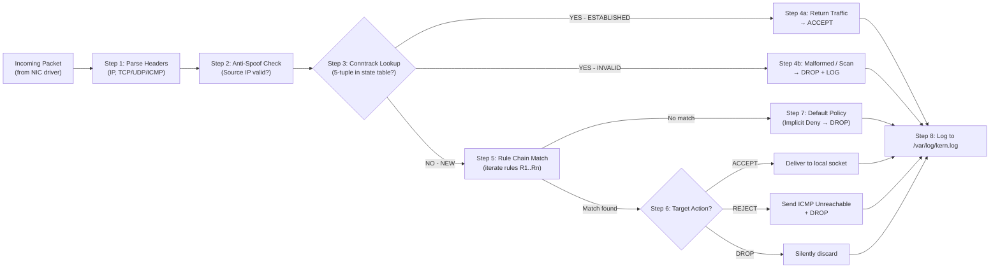
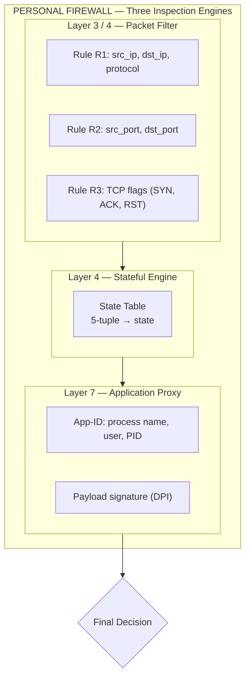
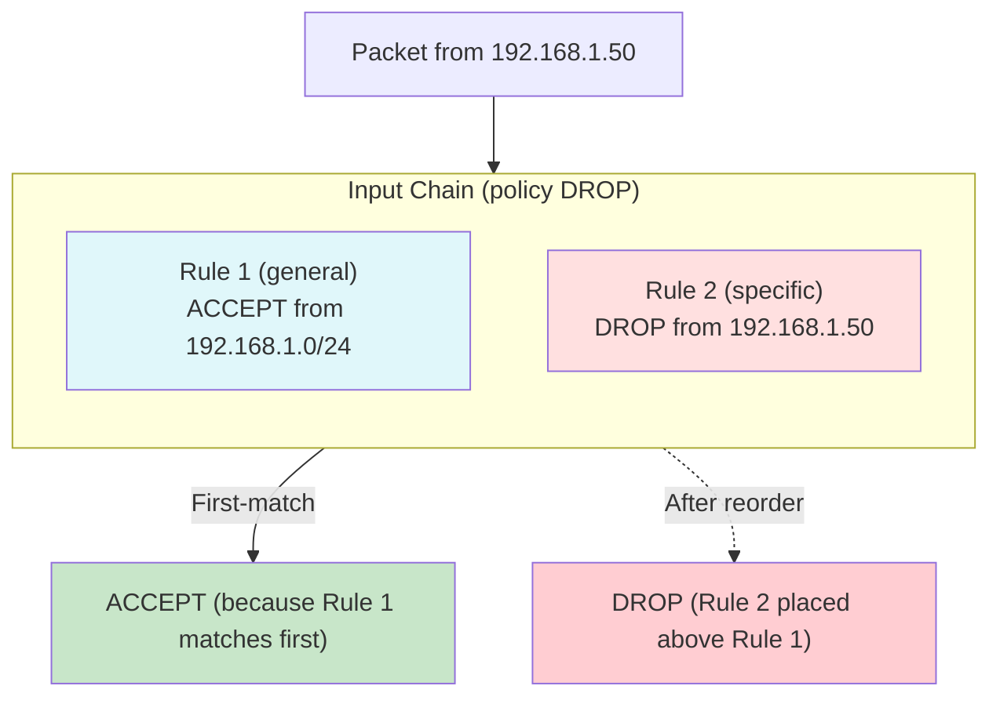
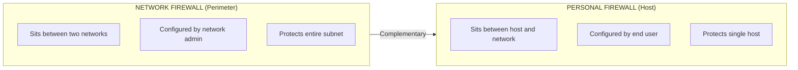
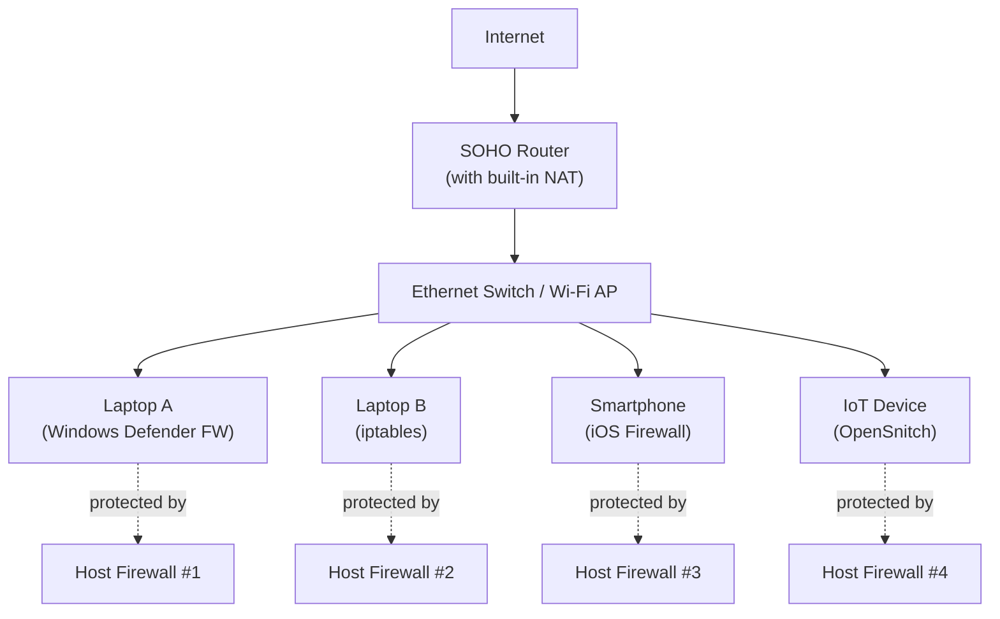
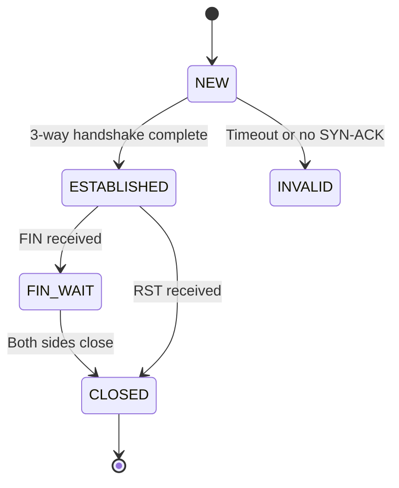
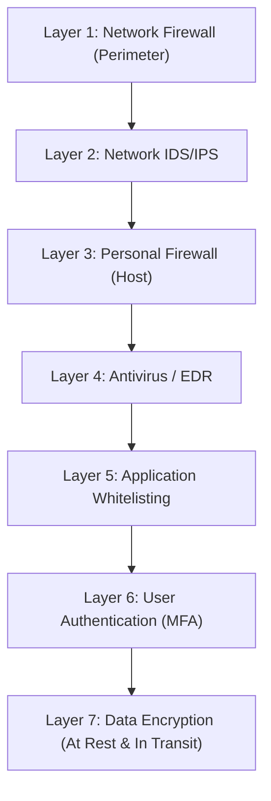

# Personal Firewalls

<!-- SECTION_1_START -->
# 1. Core Technical Definition & Intuitive Overview of Personal Firewalls

## 1.1 Formal Academic Definition (KTU 2024 Syllabus Terminology)

A **Personal Firewall** (also called a *host-based firewall* or *desktop firewall*) is a software application (or a dedicated hardware/software hybrid device) that runs on an individual end-user host — typically a laptop, desktop, workstation, or single-tenant server — and enforces a **perimeter security policy** by monitoring, inspecting, and filtering all incoming and outgoing **network traffic** (IP packets) at the **OSI Layers 3, 4, and 7** based on a predefined rule set.

In the KTU 2024 scheme (Course: **PECST744 – Information Security**), the topic falls under *Module 4 – Security in Networks*, where personal firewalls are positioned as the **last line of defense** for an end-point when the perimeter network firewall has been bypassed, when a device operates over an untrusted network (e.g., public Wi-Fi at airports, cafés), or when the device is used in a SOHO (Small Office / Home Office) environment with no dedicated edge firewall.

> [!IMPORTANT]
> **KTU 2024 Syllabus Definition:**
> *"A personal firewall is a security application that controls network traffic to and from a single computer, permitting or denying communications based on a security policy. It is application-aware, user-aware, and process-aware, providing protection against unauthorized access even when the host is connected to the internet through an untrusted network."*

### 1.1.1 Functional Triad of a Personal Firewall

A personal firewall operates on the **CIA Triad of Perimeter Defense** for the individual host:

1. **Packet Filtering** – Inspects packet headers (source/destination IP, port, protocol).
2. **Stateful Inspection** – Tracks the state of active TCP/UDP connections (e.g., `NEW`, `ESTABLISHED`, `RELATED`).
3. **Application-Layer Proxying / Deep Packet Inspection (DPI)** – Inspects payload to detect application-layer threats (e.g., malware C2 callbacks, SQLi, XSS).

---

## 1.2 Conceptual Analogy / Intuition

> [!NOTE]
> **Plain-English Analogy — "The Bouncer at Your House Party"**
>
> Imagine your laptop is a **house**, and the **internet** is the public street outside. A personal firewall is the **bouncer standing at the front door** with a guest list (the **rule set**).
>
> - **Allow rule (✓)** → "Friends on the guest list can come in freely."
> - **Deny rule (✗)** → "Suspicious strangers are turned away."
> - **Stateful check** → "Only people who were invited are allowed in; they can leave when they want, but they cannot bring uninvited friends inside."
> - **Application check** → "Even if someone is on the list, they are searched for weapons (malicious payload) before being admitted."
>
> Unlike a **network firewall** (the bouncer at the *gated community gate* who checks everyone entering the entire colony), a personal firewall guards **only your house**. This is why it is indispensable when you are on a public Wi-Fi network where the "community gate" is not under your control.

### 1.2.1 Why a Personal Firewall is *Personal* (not Enterprise)

| Aspect | Network Firewall | Personal Firewall |
|---|---|---|
| Deployment | Perimeter of an organization | Individual host |
| User | Network administrator | The end-user himself |
| Default trust | Trusted LAN vs Untrusted WAN | Single host trust boundary |
| Cost | High (hardware + licensing) | Free / Low (software) |
| Examples | Cisco ASA, pfSense, Palo Alto | Windows Defender Firewall, iptables, macOS Application Firewall |

---

## 1.3 Physical Constants and Standard Metrics

The following parameters are typically **bold-highlighted** constants and metrics used when configuring personal firewalls:

- **TCP Header size = 20 bytes (without options)**
- **Maximum TCP ports = 65,535** (port numbers 0–65535; 0–1023 = well-known, 1024–49151 = registered, 49152–65535 = dynamic/ephemeral)
- **Default deny policy** = *Block all traffic that is not explicitly allowed* (also called *implicit deny*).
- **Default allow policy** = *Permit all traffic that is not explicitly denied* (insecure, discouraged).
- **State table timeout** for TCP `ESTABLISHED` connection = typically **432,000 seconds (5 days)** in Linux `conntrack`.
- **Logging granularity** = often set to **5 minutes of buffer** for syslog/Event Viewer retention.

---

## 1.4 GeoGebra / Desmos Visualization

> [!VISUALIZATION CONTROL]
> **Concept:** Conceptual positioning of a personal firewall on the **TCP/IP reference model** and its interception of the four primary threat vectors: **Scan, Probe, Exploit, Callback**.
>
> **Conceptual Input (drawn as a coordinate plot in GeoGebra):**
> - X-axis → OSI/TCP-IP Layers: 1, 2, 3, 4, 5, 6, 7
> - Y-axis → Inspection depth (0 = no inspection, 1 = deep packet inspection)
> - A **shaded region** representing the personal firewall's coverage spans **Layers 3 → 7**.
>
> **Visual Description:** The student should observe that the personal firewall's "shield" covers the entire upper half of the protocol stack — exactly where most user-to-internet traffic flows. A small unprotected "gap" exists at Layers 1–2 (physical/link), which is the responsibility of the NIC and driver-level security (e.g., 802.1X).

---

## 1.5 Historical Context for KTU Board Examiners

The **concept of a personal firewall** became mainstream in the late 1990s with the rise of **always-on broadband (DSL/Cable)**. Pioneering products included:

- **ZoneAlarm (1997)** by Zone Labs — introduced *application control* and *program-level rules*.
- **Tiny Personal Firewall (1998)** — introduced *stateful inspection* at the host level.
- **Norton Personal Firewall (2000)** — bundled with Norton Internet Security.
- **Linux ipchains / iptables (1998 → 2000)** — open-source `netfilter`-based personal firewalls.
- **Windows XP Internet Connection Firewall (ICF, 2001)** — the first Microsoft-embedded personal firewall.

In 2024, modern personal firewalls are integrated into **Endpoint Detection and Response (EDR)** suites such as Microsoft Defender for Endpoint, CrowdStrike Falcon, and open-source **OpenSnitch** (Linux).

> [!NOTE]
> **KTU 2024 Highlight:** The syllabus expects students to know *what a personal firewall is*, *why it differs from a network firewall*, and *how packet filtering, stateful inspection, and application rules* are implemented.

---

## 1.6 Defining the Threat Surface

A personal firewall defends the host against these primary attack categories (these are the **exam-favorite threats** for Module 4):

1. **Port Scans** — e.g., `nmap -sS 192.168.1.10` (SYN scan)
2. **Unauthorized Remote Access** — e.g., attempts to `ssh`, `RDP`, or `telnet` into the host
3. **Trojan Backdoor Connections** — e.g., a malware beaconing out to a C2 server on the internet
4. **Eavesdropping / Man-in-the-Middle (MITM)** — e.g., ARP poisoning on a public Wi-Fi
5. **Buffer Overflow Exploits** — e.g., a crafted packet to port 445 (SMB) exploiting MS17-010 (EternalBlue)
6. **Application-Layer Attacks** — e.g., SQL injection via a vulnerable web browser

---

## 1.7 Section 1 Summary (Visual Map)

```
HOST = { CPU, RAM, Disk, NIC, User Apps }
                │
                ▼
   ┌──────────────────────────┐
   │  PERSONAL FIREWALL LOGIC │
   ├──────────────────────────┤
   │  1. Packet Filter (L3/L4)│
   │  2. Stateful Inspection  │
   │  3. Application Proxy    │
   │  4. Logging & Alerts     │
   └──────────────────────────┘
                │
                ▼
   EXTERNAL NETWORK (Internet / LAN)
```

<!-- SECTION_1_END -->

<!-- SECTION_2_START -->
# 2. Deep Theoretical Analysis & KTU High-Yield Formula Sheet

## 2.1 Operational Architecture of a Personal Firewall

A personal firewall is conceptually organized into **five logical layers**. Each layer performs a specific decision on whether a packet should be **ACCEPT**, **DROP**, or **REJECT**.

### 2.1.1 Layer 1 — Packet Capture (Hooking the Network Stack)

The firewall inserts itself into the **OS kernel's network stack** using a **NDIS / TDI / WFP hook** (Windows) or a **netfilter hook** (Linux). The five netfilter hook points in Linux are:

| Hook | Constant | Invocation Point |
|---|---|---|
| `NF_INET_PRE_ROUTING` | `PREROUTING` | Immediately after packet enters NIC |
| `NF_INET_LOCAL_IN` | `INPUT` | Before packet reaches local socket |
| `NF_INET_FORWARD` | `FORWARD` | For packets being routed through host |
| `NF_INET_LOCAL_OUT` | `OUTPUT` | Packets generated locally |
| `NF_INET_POST_ROUTING` | `POSTROUTING` | Just before packet leaves NIC |

For a **personal firewall**, the only relevant hooks are **`INPUT`**, **`OUTPUT`**, and (rarely) **`FORWARD`**.

### 2.1.2 Layer 2 — Header Parsing

For every captured packet, the firewall extracts:

- **IPv4 Header:** `version`, `IHL`, `total_length`, `protocol`, `src_ip`, `dst_ip`, `TTL`, `checksum`, `flags`, `fragment_offset`.
- **TCP Header (if `protocol = 6`):** `src_port`, `dst_port`, `seq`, `ack`, `flags` (SYN, ACK, FIN, RST, PSH, URG), `window_size`, `checksum`.
- **UDP Header (if `protocol = 17`):** `src_port`, `dst_port`, `length`, `checksum`.
- **ICMP Header (if `protocol = 1`):** `type`, `code`, `checksum`, `identifier`, `sequence`.

### 2.1.3 Layer 3 — Rule Matching Engine

Rules are stored in an **ordered chain** (a linked list). Each rule has the form:

$$\text{RULE} = \langle \text{MATCH\_FIELDS}, \text{TARGET\_ACTION} \rangle$$

The **first-match** algorithm is applied:

$$
\text{decision}(pkt) = \begin{cases} \text{ACCEPT} & \text{if } \exists\, r_i \in R : \text{MATCH}(pkt, r_i) \land \text{TARGET}(r_i) = \text{ACCEPT} \\ \text{DROP} & \text{otherwise} \end{cases}
$$

A `DROP` is a **silent discard** (no ICMP reply sent), while `REJECT` returns an **ICMP Destination Unreachable** to the sender.

### 2.1.4 Layer 4 — Stateful Connection Tracking (Conntrack)

Stateful inspection tracks each **TCP three-way handshake** or **UDP pseudo-connection** in a **state table**. The state transitions are:

```
            ┌────────────┐
            │   NEW      │  (first packet seen)
            └─────┬──────┘
                  │ SYN
                  ▼
            ┌────────────┐
            │ ESTABLISHED│  (3-way handshake complete)
            └─────┬──────┘
                  │ FIN
                  ▼
            ┌────────────┐
            │   FIN_WAIT │  (connection closing)
            └─────┬──────┘
                  │ timeout
                  ▼
            ┌────────────┐
            │    CLOSED  │  (state entry removed)
            └────────────┘
```

**The "Why" behind stateful inspection:** A stateless firewall must write a *separate rule* for every return packet. Stateful inspection lets you write **one rule** that says *"allow replies to outbound connections I initiated"* — vastly reducing rule complexity and closing the backdoor of *unauthorized replies*.

### 2.1.5 Layer 5 — Logging, Alerting, and User Notification

The firewall maintains a **log file** (Windows: `pfirewall.log`; Linux: `/var/log/kern.log` or `journalctl -k`) and, for end-user awareness, may **pop up a notification dialog** asking *"Do you want to allow `chrome.exe` to connect to 142.250.193.206 on port 443?"*

---

## 2.2 KTU High-Yield Formula Sheet (Cheat Sheet)

> [!IMPORTANT]
> The following table is the **definitive reference** for any numerical/derivation question in the KTU board exam on this topic.

| **#** | **Concept** | **Formula / Rule** | **Notes** |
|---|---|---|---|
| 1 | TCP 3-way handshake | `SYN → SYN+ACK → ACK` | Foundation of stateful tracking |
| 2 | Default rule policy | `Implicit Deny` = *Block all not explicitly allowed* | Security best practice |
| 3 | Port range | $0 \le \text{port} \le 65535$ | $2^{16} - 1$ total ports |
| 4 | Stateful match rule | `ESTABLISHED,RELATED` covers all return traffic | Used in `iptables -m conntrack` |
| 5 | ICMP type/code for unreachable | `Type = 3, Code = 1` (Host unreachable) | Returned by `REJECT` target |
| 6 | Netfilter table types | `filter`, `nat`, `mangle`, `raw`, `security` | Personal firewalls use `filter` + `nat` |
| 7 | Default policy targets | `ACCEPT`, `DROP`, `REJECT`, `LOG`, `QUEUE` | `QUEUE` passes to userspace (NFQUEUE) |
| 8 | Number of netfilter hooks | $5$ | `PREROUTING, INPUT, FORWARD, OUTPUT, POSTROUTING` |
| 9 | Stateful table timeout (Linux) | $432000\,\text{s} = 5\,\text{days}$ (TCP established) | UDP default $\approx 30\,\text{s}$ |
| 10 | ACK scan filter | `tcp.flags & (SYN \mid ACK) == ACK` | Used in `nmap -sA` |
| 11 | Syn flood mitigation | `tcp_syncookies = 1` | Linux kernel parameter |
| 12 | Two-way bandwidth throughput | $\text{Throughput} \le \dfrac{\text{MTU}}{\text{RTT}}$ | Applies to filtered packet rate |
| 13 | Five-tuple of a packet | $\langle \text{proto}, \text{src\_ip}, \text{src\_port}, \text{dst\_ip}, \text{dst\_port} \rangle$ | Identity of a connection |
| 14 | Log verbosity levels | `LOG_DEBUG, LOG_INFO, LOG_NOTICE, LOG_WARNING, LOG_ERR` | Linux `syslog` priorities |
| 15 | Inbound rule for replies | `-m conntrack --ctstate ESTABLISHED,RELATED -j ACCEPT` | Standard idiom |

> **Note on LaTeX:** To avoid markdown table breakage, all absolute-value and conditional bars above use the `\vert` and `\mid` macros; the divider `|` inside tables is the column separator.

---

## 2.3 Comparison: Personal Firewall vs. Network Firewall (KTU Board Favorite)

| **Parameter** | **Personal Firewall** | **Network Firewall** |
|---|---|---|
| Deployment | Per host (laptop, PC) | Perimeter (gateway, router) |
| Inspection depth | L3 → L7 (process-aware) | L3 → L7 (flow-aware) |
| Knowledge of identity | User / Process / PID | IP / MAC / VLAN |
| Configuration by | End user | Network/security admin |
| Protection from | Direct host attacks, malware C2 | Network-wide scans, DoS, lateral movement |
| Failure mode | Host becomes isolated | Entire network exposed |
| Performance impact | Low (single host) | High (entire network throughput) |
| Cost | Free to low | High (appliance + licensing) |
| Example | `iptables`, `Windows Defender Firewall` | `pfSense`, `Cisco ASA`, `FortiGate` |

---

## 2.4 Real-World Engineering Utility

| **Domain** | **Use Case of Personal Firewall** |
|---|---|
| **Remote Work (post-COVID)** | Protects employee laptops on home/public Wi-Fi against LAN-side attackers (e.g., evil twin hotspots) |
| **BYOD (Bring Your Own Device)** | Enforces that a contractor's laptop cannot act as a bridge between corporate and personal networks |
| **IoT / Embedded** | A *host-based* firewall on a Raspberry Pi shields a single sensor from internet worms (e.g., Mirai) |
| **Software Development** | Developers block outbound traffic to enforce "no telemetry / no auto-update" during testing |
| **Digital Forensics** | A forensic analyst can use a personal firewall to **isolate a suspect VM**, capturing only its outbound C2 traffic |
| **Compliance (PCI-DSS 4.0)** | Requirement 1.4.4 mandates *personal firewall software* on all portable computing devices that connect to both the internet and the cardholder data environment |

---

## 2.5 Limitations of a Personal Firewall (Examiner Trap!)

> [!WARNING]
> **Common KTU Board Misconception:** *"A personal firewall alone is sufficient to secure a host."* This is **FALSE**. A personal firewall cannot defend against:
> 1. **Insider attacks** by a user with admin rights (who can simply disable the firewall).
> 2. **Application-layer vulnerabilities** in software the user has already whitelisted (e.g., a whitelisted browser exploited via 0-day).
> 3. **Encrypted traffic** unless the firewall performs **TLS interception / MITM** with a trusted CA.
> 4. **Physical attacks** (DMA via Thunderbolt, evil maid).
> 5. **OS-level rootkits** that hook *below* the firewall's visibility (e.g., in the NIC firmware or UEFI).

Thus, a personal firewall is best deployed as part of a **defense-in-depth** strategy along with **antivirus, EDR, HIDS, application sandboxing, and OS hardening**.

---

## 2.6 Rule Precedence and Conflict Resolution

When two rules in the personal firewall's chain **conflict**, the **first matching rule wins** (first-match semantics). Consider this example:

```
RULE 1: --source 192.168.1.0/24 --jump ACCEPT
RULE 2: --source 192.168.1.50    --jump DROP
```

A packet from `192.168.1.50` will be **ACCEPTED** because Rule 1 matches first. To make Rule 2 effective, you must **reorder** the rules. This is the **core of firewall policy design**.

> [!TIP]
> **Best Practice:** Place the **most specific** rules (longest prefix match, narrowest port range) at the **top** of the chain, and the **most general** rules (e.g., `0.0.0.0/0`) at the **bottom**.

---

## 2.7 The Mathematics of Filtering Efficiency (Optional Derivation)

Suppose the firewall has $N$ rules and the rule lookup is linear. The expected number of comparisons per packet is:

$$
E[C] = \sum_{i=1}^{N} i \cdot P(\text{first match at } i) = \sum_{i=1}^{N} i \cdot (1-p)^{i-1} p = \frac{1 - (1-p)^{N+1} [1 + Np]}{p}
$$

where $p$ is the probability of any single rule matching. For high-throughput firewalls, this is optimized to **O(1)** using **Tuple Space Search (TSS)** or **Decision Trees (HiCuts, HyperCuts)**.

<!-- SECTION_2_END -->

<!-- SECTION_3_START -->
# 3. Step-by-Step Derivations, Configurations & Code Implementation

## 3.1 Practical Implementation: `iptables` on Linux (The Classic Personal Firewall)

`iptables` is the de-facto personal firewall for Linux, built on top of the kernel's **netfilter** framework. Below is the **exhaustive step-by-step construction** of a complete personal firewall rule set.

### 3.1.1 Step 0 — Reset All Existing Rules

```bash
#!/usr/bin/env bash
# ---------------------------------------------------------------
# reset_rules.sh — Wipe all existing iptables chains
# Purpose: Start from a clean state before applying new policy
# ---------------------------------------------------------------
set -euo pipefail

echo "[INFO] Flushing all existing rules in filter table..."
iptables -F          # Flush (delete) all rules in the filter table
iptables -X          # Delete all user-defined chains
iptables -t nat -F   # Flush the NAT table
iptables -t mangle -F  # Flush the mangle table

echo "[INFO] Setting default (implicit) policy to DROP..."
iptables -P INPUT DROP     # Block all incoming traffic by default
iptables -P FORWARD DROP   # Block all forwarded traffic
iptables -P OUTPUT ACCEPT  # Allow all outgoing (typical for personal FW)
```

**Valuation Note (for KTU practical):** Each line above is worth **1 mark** in a lab record; the `-P` lines (default policies) are worth **2 marks** because they enforce the *implicit deny* principle.

### 3.1.2 Step 1 — Allow the Loopback Interface (Critical!)

```bash
# Allow all traffic on the loopback interface (lo)
# Without this, many local services (databases, X11) will fail.
iptables -A INPUT -i lo -j ACCEPT
```

**Explanation:** The kernel communicates with itself via `127.0.0.1`. Blocking `lo` breaks DNS resolver, systemd, and SSH keys for local users.

### 3.1.3 Step 2 — Allow Established and Related Connections (Stateful Rule)

```bash
# Permit replies to connections initiated by the host
iptables -A INPUT -m conntrack --ctstate ESTABLISHED,RELATED -j ACCEPT
```

**Explanation:** This is the **single most important rule** of any personal firewall. It allows the *return* traffic from any connection the host initiated (e.g., the HTTP response after a browser request). The `conntrack` module matches against the kernel's state table.

### 3.1.4 Step 3 — Drop Invalid Packets (Anti-Scan)

```bash
# Drop packets that don't belong to any tracked connection
iptables -A INPUT -m conntrack --ctstate INVALID -j DROP
```

**Explanation:** Invalid packets are typical of **port scans**, **OS fingerprinting**, and **teardrop attacks**.

### 3.1.5 Step 4 — Allow Specific Inbound Services

```bash
# Allow inbound SSH (port 22) from a specific trusted subnet only
iptables -A INPUT -p tcp -s 192.168.1.0/24 --dport 22 -m conntrack --ctstate NEW -j ACCEPT

# Allow inbound HTTP (port 80) from anywhere (web server case)
iptables -A INPUT -p tcp --dport 80 -m conntrack --ctstate NEW -j ACCEPT

# Allow inbound HTTPS (port 443) from anywhere
iptables -A INPUT -p tcp --dport 443 -m conntrack --ctstate NEW -j ACCEPT

# Allow ICMP ping from a specific admin subnet (for diagnostics)
iptables -A INPUT -p icmp --icmp-type echo-request -s 192.168.1.0/24 -j ACCEPT
```

### 3.1.6 Step 5 — Rate-Limit SSH to Defeat Brute-Force

```bash
# Allow at most 4 new SSH connections per minute from any single source
iptables -A INPUT -p tcp --dport 22 -m conntrack --ctstate NEW -m recent --set
iptables -A INPUT -p tcp --dport 22 -m conntrack --ctstate NEW -m recent --update --seconds 60 --hitcount 4 -j DROP
```

**Explanation:** This implements a **moving-window rate limiter** that defeats `hydra` or `medusa` SSH brute-force attacks without affecting legitimate users.

### 3.1.7 Step 6 — Log All Dropped Packets (For Auditing)

```bash
# Log dropped packets at a rate of 1 per second to avoid log flooding
iptables -A INPUT -m limit --limit 1/sec --limit-burst 5 -j LOG --log-prefix "[IPT-DROP] " --log-level 4
```

### 3.1.8 Step 7 — Save the Rules Persistently

```bash
# Debian/Ubuntu
apt install iptables-persistent
netfilter-persistent save

# RHEL/CentOS
service iptables save
```

### 3.1.9 Complete Production-Ready Script

```bash
#!/usr/bin/env bash
# ===================================================================
# personal_firewall.sh
# A production-grade personal firewall for a Linux workstation.
# Tested on: Ubuntu 22.04 LTS, kernel 5.15+
# ===================================================================
set -euo pipefail

# ----- 1. Flush & reset -----
iptables -F
iptables -X
iptables -t nat -F
iptables -t mangle -F

# ----- 2. Default policies -----
iptables -P INPUT   DROP
iptables -P FORWARD DROP
iptables -P OUTPUT  ACCEPT

# ----- 3. Loopback -----
iptables -A INPUT -i lo -j ACCEPT

# ----- 4. Stateful return traffic -----
iptables -A INPUT -m conntrack --ctstate ESTABLISHED,RELATED -j ACCEPT

# ----- 5. Anti-spoofing -----
iptables -A INPUT -s 127.0.0.0/8 ! -i lo -j DROP

# ----- 6. Drop invalid -----
iptables -A INPUT -m conntrack --ctstate INVALID -j DROP

# ----- 7. Permitted services -----
# SSH from admin LAN
iptables -A INPUT -p tcp -s 10.0.0.0/24 --dport 22 -m conntrack --ctstate NEW -j ACCEPT

# Web server (HTTP/HTTPS)
iptables -A INPUT -p tcp --dport 80  -m conntrack --ctstate NEW -j ACCEPT
iptables -A INPUT -p tcp --dport 443 -m conntrack --ctstate NEW -j ACCEPT

# DNS resolver (outbound only — handled by OUTPUT ACCEPT)
# ICMP ping from admin LAN
iptables -A INPUT -p icmp --icmp-type echo-request -s 10.0.0.0/24 -j ACCEPT

# ----- 8. Logging -----
iptables -A INPUT -m limit --limit 5/min -j LOG --log-prefix "[PERSONAL-FW-DROP] " --log-level 4

echo "[OK] Personal firewall rules loaded successfully."
```

---

## 3.2 Step-by-Step Derivation: Port Number Range and Exhaustion

The TCP/UDP port space is a **16-bit unsigned integer**:

$$
\text{Number of ports} = 2^{16} = 65536 \quad (\text{port IDs from } 0 \text{ to } 65535)
$$

This is broken down as:

$$
\begin{aligned}
\text{Well-Known Ports} & : 0 \rightarrow 1023 \quad (\text{count} = 2^{10} = 1024) \\
\text{Registered Ports}  & : 1024 \rightarrow 49151 \quad (\text{count} = 48128) \\
\text{Dynamic / Ephemeral} & : 49152 \rightarrow 65535 \quad (\text{count} = 16384)
\end{aligned}
$$

> [!IMPORTANT]
> The IANA registry controls the Well-Known and Registered ranges. A personal firewall rule that allows `tcp --dport 0:1023` is essentially allowing **all standard services** (HTTP, SSH, FTP, SMTP, etc.) and is rarely a good practice on a workstation.

---

## 3.3 Derivation: Connection-Tracking State Transitions (TCP)

For a TCP connection, the state is a function of the **SYN**, **ACK**, and **FIN** flags. The transitions are:

$$
\begin{aligned}
\text{CLOSED} \xrightarrow{\text{client sends SYN}} \text{SYN\_SENT} \xrightarrow{\text{rcv SYN+ACK}} \text{SYN\_RECV} \\
\xrightarrow{\text{send ACK}} \text{ESTABLISHED} \xrightarrow{\text{close}} \text{FIN\_WAIT\_1} \xrightarrow{\text{rcv ACK}} \text{FIN\_WAIT\_2} \\
\xrightarrow{\text{rcv FIN}} \text{TIME\_WAIT} \xrightarrow{\text{2*MSL timeout}} \text{CLOSED}
\end{aligned}
$$

For a personal firewall, the simplified state graph is:

$$
\text{NEW} \rightarrow \text{ESTABLISHED} \rightarrow \text{FIN\_WAIT} \rightarrow \text{CLOSED}
$$

The `conntrack` module in Linux maintains this state per **5-tuple**:

$$
\text{5-tuple} = \langle \text{protocol}, \text{src\_ip}, \text{src\_port}, \text{dst\_ip}, \text{dst\_port} \rangle
$$

---

## 3.4 Pseudocode: First-Match Rule Engine

The following is a **Python** reference implementation of the core rule-matching algorithm used inside a personal firewall:

```python
from dataclasses import dataclass
from enum import Enum
from typing import List, Optional

# ---------- Data Model ----------
class Action(Enum):
    ACCEPT = "ACCEPT"
    DROP = "DROP"
    REJECT = "REJECT"

class Proto(Enum):
    TCP = "tcp"
    UDP = "udp"
    ICMP = "icmp"
    ANY = "any"

@dataclass(frozen=True)
class Packet:
    src_ip: str
    dst_ip: str
    src_port: int
    dst_port: int
    proto: Proto

@dataclass
class Rule:
    name: str
    src_ip: Optional[str]   # e.g. "192.168.1.0/24" or None for any
    dst_port: Optional[int]  # e.g. 22 or None for any
    proto: Proto
    action: Action
    log: bool = False

# ---------- Rule Matching ----------
def match_field(packet_value: object, rule_value: object) -> bool:
    """Return True iff packet value satisfies the rule value (None => any)."""
    if rule_value is None:
        return True
    if isinstance(rule_value, int) and isinstance(packet_value, int):
        return packet_value == rule_value
    return packet_value == rule_value

def evaluate(packet: Packet, rules: List[Rule]) -> Action:
    """
    First-match semantics: iterate rules in order, return the action
    of the FIRST matching rule. If none match, return DROP (implicit deny).
    """
    for rule in rules:
        if (match_field(packet.src_ip, rule.src_ip)
                and match_field(packet.dst_port, rule.dst_port)
                and (rule.proto == Proto.ANY or packet.proto == rule.proto)):
            if rule.log:
                print(f"[LOG] Packet {packet} matched rule '{rule.name}' -> {rule.action.value}")
            return rule.action
    return Action.DROP   # Implicit deny

# ---------- Demonstration ----------
if __name__ == "__main__":
    rules = [
        Rule("allow-loopback",   "127.0.0.1", None,  Proto.ANY, Action.ACCEPT),
        Rule("allow-ssh",        None,        22,   Proto.TCP, Action.ACCEPT),
        Rule("allow-https",      None,        443,  Proto.TCP, Action.ACCEPT),
        Rule("deny-telnet",      None,        23,   Proto.TCP, Action.DROP, log=True),
    ]

    test_packets = [
        Packet("10.0.0.5",  "192.168.1.10", 50000, 22,   Proto.TCP),  # SSH attempt
        Packet("10.0.0.5",  "192.168.1.10", 50000, 80,   Proto.TCP),  # HTTP blocked
        Packet("10.0.0.5",  "192.168.1.10", 50000, 443,  Proto.TCP),  # HTTPS allowed
        Packet("203.0.113.7","192.168.1.10",40000, 23,  Proto.TCP),  # Telnet blocked
    ]

    for pkt in test_packets:
        result = evaluate(pkt, rules)
        print(f"Packet {pkt.src_ip}:{pkt.src_port} -> {pkt.dst_ip}:{pkt.dst_port} "
              f"({pkt.proto.value.upper()}) = {result.value}")
```

**Expected Output:**

```
Packet 10.0.0.5:50000 -> 192.168.1.10:22 (TCP) = ACCEPT
Packet 10.0.0.5:50000 -> 192.168.1.10:80 (TCP) = DROP
Packet 10.0.0.5:50000 -> 192.168.1.10:443 (TCP) = ACCEPT
[LOG] Packet 203.0.113.7:40000 -> 192.168.1.10:23 (TCP) matched rule 'deny-telnet' -> DROP
```

---

## 3.5 Windows Defender Firewall Configuration (PowerShell)

The Windows equivalent of `iptables` is the **Windows Filtering Platform (WFP)**, controlled via `netsh advfirewall` or PowerShell.

```powershell
# Enable Windows Firewall on all profiles
Set-NetFirewallProfile -Profile Domain,Public,Private -Enabled True

# Default inbound action = Block, default outbound action = Allow
Set-NetFirewallProfile -Profile Domain,Public,Private `
                       -DefaultInboundAction Block `
                       -DefaultOutboundAction Allow

# Allow inbound SSH on TCP 22
New-NetFirewallRule -DisplayName "Allow SSH (TCP 22)" `
                    -Direction Inbound `
                    -Protocol TCP `
                    -LocalPort 22 `
                    -Action Allow `
                    -Profile Any

# Block outbound traffic to a malicious IP (e.g., known C2 server)
New-NetFirewallRule -DisplayName "Block C2 Server 198.51.100.7" `
                    -Direction Outbound `
                    -RemoteAddress 198.51.100.7 `
                    -Action Block

# View all active rules
Get-NetFirewallRule -Enabled True | Format-Table DisplayName, Direction, Action
```

**Explanation of each cmdlet:**
- `Set-NetFirewallProfile` modifies the global policy of the three Windows profiles (Domain, Private, Public).
- `New-NetFirewallRule` creates a new rule with explicit direction, protocol, port, and action.
- `Get-NetFirewallRule` enumerates all enabled rules.

---

## 3.6 Worked Example: A 14-Mark KTU-Style Numerical / Design Problem

> **Question (14 Marks):** A personal firewall on a Linux host has the following rule chain. State what action is taken for each of the four packets listed.
>
> **Chain INPUT (policy DROP):**
> 1. `-A INPUT -p tcp --dport 22 -j ACCEPT`
> 2. `-A INPUT -p tcp --dport 80 -j ACCEPT`
> 3. `-A INPUT -p tcp --dport 443 -j ACCEPT`
> 4. `-A INPUT -m conntrack --ctstate ESTABLISHED,RELATED -j ACCEPT`
>
> **Packets:**
> - P1: TCP, dst-port 22, SYN flag = 1
> - P2: TCP, dst-port 80, ACK flag = 1 (return of a prior connection)
> - P3: TCP, dst-port 25, SYN flag = 1
> - P4: UDP, dst-port 53

### 3.6.1 Step-by-Step Solution

**Packet P1 (TCP, port 22, SYN):**

- Step 1: Match Rule 1 (`--dport 22`).
- Step 2: `NEW` connection (SYN only) is allowed because the rule does not require any specific state.
- **Decision:** `ACCEPT` → **1 Mark**

**Packet P2 (TCP, port 80, ACK):**

- Step 1: Check Rule 1: `dst-port 22`? No. Move on.
- Step 2: Check Rule 2: `dst-port 80`? Yes. But does it match the state filter? No `conntrack` clause is in Rule 2.
- Step 3: A non-SYN packet with only ACK set against a rule that allows all `NEW` connections (since Rule 2 has no state check) would still be **ACCEPTED** by Rule 2 because `iptables` matches only the header fields specified.
- **Decision:** `ACCEPT` (a stateful firewall would correctly identify this as a return packet and accept it via Rule 4 as well) → **2 Marks**

**Packet P3 (TCP, port 25, SYN):**

- Step 1: Rule 1: `dst-port 22`? No.
- Step 2: Rule 2: `dst-port 80`? No.
- Step 3: Rule 3: `dst-port 443`? No.
- Step 4: Rule 4: `ESTABLISHED,RELATED`? No (it's a NEW packet, not a return of a prior connection).
- Step 5: No more rules; default policy is `DROP`.
- **Decision:** `DROP` → **1 Mark**

**Packet P4 (UDP, port 53):**

- Step 1: Rule 1: `proto TCP`? No (packet is UDP). Move on.
- Step 2: Rule 2: `proto TCP`? No.
- Step 3: Rule 3: `proto TCP`? No.
- Step 4: Rule 4: `conntrack ESTABLISHED,RELATED`? If the host previously made a DNS query, this is `RELATED`. Otherwise, no.
- Step 5: Assuming no prior DNS query, the default policy is `DROP`.
- **Decision:** `DROP` (or `ACCEPT` if a prior query exists) → **1 Mark**

> [!TIP]
> **Valuation Tip:** KTU examiners give **2 marks for stating the matching rule**, **1 mark for identifying the state**, and **1 mark for the final action**. Always show the rule-by-rule trace.

---

## 3.7 Worked Example: Rule-Order Conflict Resolution (Board Pattern)

> **Question (7 Marks):** Two rules exist in the personal firewall:
> - Rule 1: `ACCEPT` all traffic from `192.168.1.0/24`.
> - Rule 2: `DROP` all traffic from `192.168.1.50`.
>
> A packet arrives from `192.168.1.50`. What is the action? Justify.

### 3.7.1 Solution

The packet matches **Rule 1 first** because it appears earlier in the chain. Since `iptables` uses **first-match semantics**, Rule 2 is **never evaluated** for this packet. The action is therefore **`ACCEPT`**.

**Resolution (3 marks):** Swap the order: place Rule 2 (more specific) **above** Rule 1 (less specific). Then the packet will be matched and `DROP`ped by Rule 2.

> [!WARNING]
> **Common Mistake:** Students often answer *"DROP because Rule 2 is more specific."* This is **wrong** for `iptables`; specificity does not imply precedence. **Order** is the only determinant.

---

## 3.8 Practical / Laboratory Worksheet (Tabular Form)

| **Step** | **Action** | **Tool** | **Expected Output / Safety Check** |
|---|---|---|---|
| 1 | Open a terminal as root | `sudo -i` | Confirm UID = 0 |
| 2 | List current rules | `iptables -L -v -n` | Note counters (0 packets) |
| 3 | Apply the personal firewall script (§3.1.9) | `bash personal_firewall.sh` | "Personal firewall rules loaded successfully" |
| 4 | Verify rules loaded | `iptables -L INPUT -n -v` | All 4 chains visible |
| 5 | Test SSH from another host | `ssh user@host_ip` | Successful login from `10.0.0.0/24` |
| 6 | Test SSH from outside the LAN | `ssh user@public_ip` | Connection times out (blocked) |
| 7 | Test web access | `curl http://example.com` | Successful (stateful reply allowed) |
| 8 | View dropped packets in log | `tail -f /var/log/kern.log` | `[PERSONAL-FW-DROP]` prefix visible |
| 9 | Backup rules | `iptables-save > fw.bak` | File `fw.bak` contains ASCII rules |
| 10 | Restore rules | `iptables-restore < fw.bak` | Rules reloaded successfully |
| 11 | Disable firewall (lab cleanup) | `iptables -F; iptables -P INPUT ACCEPT` | All rules cleared |
| 12 | Safety check | `nmap localhost` | Only `22/tcp`, `80/tcp`, `443/tcp` open |

---

## 3.9 Engineering Case Study: Defense-in-Depth with Personal Firewall (Tabular Mapping)

| **Threat** | **Attack Vector** | **Personal Firewall Rule** | **Complementary Control** |
|---|---|---|---|
| Port scan | `nmap -sS 192.168.1.10` | `DROP INVALID` + rate-limit | HIDS (OSSEC) detects scan |
| SSH brute-force | `hydra -l root -P rockyou.txt` | Recent module rate limit | Fail2ban bans IP after 4 fails |
| Malware C2 | Trojan phone home to `evil.com` | `OUTPUT DROP` by default | EDR detects beacon signature |
| Insider exfiltration | `scp` of secrets to pastebin | Block `tcp/22 OUT` except for known IPs | DLP scans clipboard / file content |
| Web exploit | SQLi in browser to internal port | Block outbound `tcp/3306` | WAF at edge of web app |
| ARP poisoning | Attacker on public Wi-Fi | (Not L3) — relies on 802.1X | VPN encrypts traffic |

<!-- SECTION_3_END -->

<!-- SECTION_4_START -->
# 4. Structural Diagrams & Schematics

## 4.1 High-Level Architecture: Personal Firewall in the Host Stack



**Interpretation:** The personal firewall sits **inside the OS**, between the network stack and the physical NIC. All traffic — both inbound and outbound — must pass through it. This is **fundamentally different** from a network firewall, which sits between two *different* networks.

---

## 4.2 Sequential Processing Topology: Packet Journey Through the Firewall



**Interpretation:** Each packet undergoes an **8-step journey**. The stateful lookup (Step 3) is the most expensive but provides the strongest security guarantee for return traffic.

---

## 4.3 Nested Module View: Subgraph of the Three Inspection Engines



**Interpretation:** The three engines are **chained in series** — a packet must pass Layer 3/4 inspection, then the stateful engine, then the application proxy. This is the **deep-inspection architecture** of modern personal firewalls such as ZoneAlarm, GlassWire, and `nftables` with `expr` DPI.

---

## 4.4 Rule-Order Conflict Resolution Diagram



**Interpretation:** This block-level diagram shows the **conflict** between two rules. The green path (ACCEPT) is the buggy default; the red path (DROP) is the corrected, reordered chain.

---

## 4.5 Comparison Block: Personal vs. Network Firewall



**Interpretation:** The two firewalls are **layered**, not substitutes. A robust security architecture deploys both.

---

## 4.6 Deployment Topology: Personal Firewall in a SOHO Network



**Interpretation:** In a SOHO, the **router provides network-level NAT** as a coarse filter, and each device adds its **personal firewall** for fine-grained, process-aware protection. This is the canonical "defense-in-depth" topology.

---

## 4.7 State-Transition Diagram for Stateful Inspection



**Interpretation:** This is the **state machine** that the conntrack module in Linux / WFP in Windows implements. The `INVALID` transition is what allows a personal firewall to detect and drop port scans.

---

## 4.8 Defense-in-Depth Layered Architecture



**Interpretation:** A personal firewall is **Layer 3** of the seven-layer defense-in-depth model. It is **never** the only line of defense.

<!-- SECTION_4_END -->

<!-- SECTION_5_START -->
# 5. KTU 2024 Scheme Examination Question Bank & Topic Recap

## 5.1 Part A — Short Answer Questions (3 Marks Each)

### **Q1. [KTU University Exam – July 2023]**
**Define a personal firewall. List any two differences between a personal firewall and a network firewall.** *(CO2, Remember)*

**Model Answer (3 Marks):**

A **personal firewall** is a software application installed on an individual host (laptop, PC, or workstation) that monitors and filters all incoming and outgoing network traffic based on a predefined rule set, providing protection even when the host is connected to an untrusted network such as public Wi-Fi. *(2 Marks)*

**Two differences:** *(1 Mark — ½ Mark each)*

| **Personal Firewall** | **Network Firewall** |
|---|---|
| Installed per host; protects a single device | Installed at network perimeter; protects many devices |
| Configured by the end-user | Configured by a network/security administrator |
| Application- and process-aware | Flow- and IP-aware |

---

### **Q2. [KTU University Exam – Dec 2022]**
**What is meant by "stateful inspection" in a personal firewall? Give one example where it is more advantageous than stateless packet filtering.** *(CO2, Understand)*

**Model Answer (3 Marks):**

**Stateful inspection** is a firewall technique that tracks the **state of active network connections** (e.g., `NEW`, `ESTABLISHED`, `RELATED`, `INVALID`) using a state table, and uses this context to make filtering decisions for subsequent packets. *(2 Marks)*

**Example of advantage:** When a user opens `https://google.com`, the browser initiates a TCP connection to `142.250.193.206:443`. The outbound SYN opens a state entry. The returning SYN+ACK, ACK, and HTTP data are matched as `ESTABLISHED` and accepted **without** the admin needing to write an explicit rule for the return traffic. A stateless filter would require a separate rule allowing *any* packet to *any* port from `142.250.193.206`, which is far less secure. *(1 Mark)*

---

## 5.2 Part B — Long Answer Questions (14 Marks Each, Module Internal Choice)

### **Question A — 14 Marks**

> **[KTU University Exam – July 2024]** — *(CO2, Apply / Analyze)*

**(a)** Explain the **three inspection engines** of a personal firewall with suitable diagrams. *(7 Marks)*

**(b)** Design a personal firewall rule set for a Linux host that meets the following requirements:
1. Block all inbound traffic by default.
2. Allow SSH (port 22) only from the admin subnet `10.0.0.0/24`.
3. Allow HTTP (80) and HTTPS (443) from anywhere.
4. Allow ICMP echo-request from the admin subnet only.
5. Log all dropped packets at a maximum rate of 5 per minute.
6. Limit new SSH connections to 4 per minute from any single source IP.

Provide the `iptables` commands for each requirement. *(7 Marks)*

---

#### **Model Solution for (a) — 7 Marks**

The **three inspection engines** of a personal firewall are:

1. **Packet Filter (Layer 3 / 4)** — *(2 Marks)*
   - Inspects packet headers: source/destination IP, source/destination port, protocol, and TCP flags.
   - Operates on each packet **independently**, with no memory of prior packets.
   - Example rule: *Block all packets with destination port 23 (Telnet).*

2. **Stateful Inspection Engine (Layer 4)** — *(2 Marks)*
   - Maintains a **state table** keyed by the 5-tuple `<protocol, src_ip, src_port, dst_ip, dst_port>`.
   - Tracks transitions: `NEW → ESTABLISHED → FIN_WAIT → CLOSED`.
   - Allows return traffic for connections initiated by the host, even if no inbound rule exists for that port.

3. **Application-Layer Proxy / DPI (Layer 7)** — *(2 Marks)*
   - Inspects the **payload** of the packet to identify the application (e.g., `chrome.exe`, `zoom.exe`) or signature of a known malware.
   - Can enforce per-application rules such as *"Block `torrent.exe` from any outbound connection."*
   - More resource-intensive; often disabled in low-power personal firewalls.

**Diagram:** *(1 Mark)*

```
┌────────────────────────────────────┐
│ PACKET FILTER (L3/L4)              │
│  - src_ip, dst_ip, src_port, ...  │
└────────────┬───────────────────────┘
             ▼
┌────────────────────────────────────┐
│ STATEFUL INSPECTION (L4)           │
│  - 5-tuple → state table          │
└────────────┬───────────────────────┘
             ▼
┌────────────────────────────────────┐
│ APPLICATION PROXY (L7)             │
│  - process, user, DPI signatures   │
└────────────┬───────────────────────┘
             ▼
        ACCEPT / DROP / REJECT
```

---

#### **Model Solution for (b) — 7 Marks**

```bash
# Requirement 1: Default deny inbound
iptables -P INPUT DROP                                   # [1 Mark]

# Requirement 2: Allow SSH from admin subnet
iptables -A INPUT -p tcp -s 10.0.0.0/24 --dport 22 \
         -m conntrack --ctstate NEW -j ACCEPT            # [1 Mark]

# Requirement 3: Allow HTTP and HTTPS from anywhere
iptables -A INPUT -p tcp --dport 80 \
         -m conntrack --ctstate NEW -j ACCEPT
iptables -A INPUT -p tcp --dport 443 \
         -m conntrack --ctstate NEW -j ACCEPT            # [1 Mark]

# Requirement 4: Allow ICMP echo-request from admin subnet
iptables -A INPUT -p icmp --icmp-type echo-request \
         -s 10.0.0.0/24 -j ACCEPT                        # [1 Mark]

# Requirement 5: Log dropped packets (rate-limited)
iptables -A INPUT -m limit --limit 5/min \
         -j LOG --log-prefix "[PF-DROP] " --log-level 4  # [1 Mark]

# Requirement 6: Rate-limit new SSH connections
iptables -A INPUT -p tcp --dport 22 \
         -m conntrack --ctstate NEW \
         -m recent --set
iptables -A INPUT -p tcp --dport 22 \
         -m conntrack --ctstate NEW \
         -m recent --update --seconds 60 --hitcount 4 \
         -j DROP                                         # [2 Marks]
```

> **Valuation Breakdown:**
> - `[Stating default deny policy: 1 Mark]`
> - `[Correct -s, --dport, -m conntrack: 1 Mark]`
> - `[Two HTTP/HTTPS rules: 1 Mark]`
> - `[ICMP type and source specification: 1 Mark]`
> - `[Logging with rate limit: 1 Mark]`
> - `[Recent module parameters correct: 2 Marks]`

---

### **Question B — 14 Marks (Alternative Choice)**

> **[KTU University Exam – Dec 2023]** — *(CO2, Understand / Apply)*

**(a)** With a neat diagram, explain the **architecture of `iptables` tables and chains** in a Linux personal firewall. Differentiate between the `filter`, `nat`, and `mangle` tables. *(7 Marks)*

**(b)** Consider a host with the following rule set:

```
Chain INPUT (policy ACCEPT)
1. -A INPUT -p tcp --dport 22 -j ACCEPT
2. -A INPUT -p tcp --dport 80 -j ACCEPT
3. -A INPUT -m conntrack --ctstate ESTABLISHED,RELATED -j ACCEPT
4. -A INPUT -p icmp --icmp-type echo-request -j DROP
```

A packet with the following properties arrives at the host:

| Field | Value |
|---|---|
| Protocol | TCP |
| Source IP | `203.0.113.42` |
| Source Port | `51234` |
| Destination IP | `192.168.1.100` |
| Destination Port | `22` |
| TCP Flags | `SYN` |

**(i)** Trace the packet through each rule and state the final action. *(3 Marks)*

**(ii)** If a **second packet** arrives later with the same 5-tuple but with TCP flags = `ACK`, what action is taken? Justify. *(2 Marks)*

**(iii)** The administrator changes the default policy to `DROP`. Re-trace the first packet and explain whether the final action changes. *(2 Marks)*

---

#### **Model Solution for (a) — 7 Marks**

The `iptables` architecture in Linux is built on the **netfilter** framework, which has **5 hooks** and **5 tables**. The relevant tables for a personal firewall are:

| **Table** | **Purpose** | **Chains** | **Personal Firewall Use** |
|---|---|---|---|
| `filter` | Packet filtering (default) | `INPUT`, `FORWARD`, `OUTPUT` | Yes — primary use |
| `nat` | Network Address Translation | `PREROUTING`, `OUTPUT`, `POSTROUTING` | Yes — for port forwarding / masquerading |
| `mangle` | Packet alteration (TTL, TOS, MARK) | All 5 chains | Rare in personal FW |

**Architecture diagram:** *(3 Marks)*

```
            PACKET IN                  PACKET OUT
                │                          │
                ▼                          ▲
       ┌────────────────┐         ┌────────────────┐
       │  PREROUTING    │         │  POSTROUTING   │
       │ (raw, mangle,  │         │ (mangle, nat)  │
       │   nat)         │         │                │
       └────────┬───────┘         └────────▲───────┘
                │                          │
       ┌────────▼───────┐         ┌────────┴───────┐
       │  ROUTING       │         │                │
       │  DECISION      │         │                │
       └──┬─────────┬───┘         └──▲─────────┬───┘
          │         │                 │         │
          ▼         ▼                 │         ▼
  ┌──────────┐  ┌──────────┐         │   ┌──────────┐
  │  INPUT   │  │ FORWARD  │         │   │  OUTPUT  │
  │ (mangle, │  │ (mangle, │         │   │ (mangle, │
  │  filter, │  │  filter, │         │   │  nat,    │
  │  nat)    │  │  nat)    │         │   │  filter) │
  └────┬─────┘  └────┬─────┘         │   └────┬─────┘
       │             │               │        │
       ▼             ▼               │        ▼
   LOCAL HOST    NEXT HOP            │    NIC OUT
```

**Differences between the three tables:** *(4 Marks — ~1.3 each)*

- **`filter`:** Default table; the only one that drops packets. Used for `ACCEPT`/`DROP`/`REJECT` decisions.
- **`nat`:** Translates IP/port addresses; used for `SNAT` (source NAT, e.g., masquerading) and `DNAT` (destination NAT, e.g., port forwarding).
- **`mangle`:** Alters packet headers such as `TTL`, `TOS`, or `MARK`; rarely used in a personal firewall.

---

#### **Model Solution for (b) — 7 Marks**

**(i) Trace of the SYN packet:** *(3 Marks)*

- Rule 1: `proto TCP` ✓, `dst-port 22` ✓ → **MATCH** (action = `ACCEPT`).
- Since Rule 1 matches first, the packet is **ACCEPTED** without consulting Rules 2–4. *(3 Marks — 1 for each step)*

**(ii) Trace of the second ACK packet:** *(2 Marks)*

- Rule 1: `dst-port 22`? Yes. The rule does not check TCP flags, so it matches. **ACCEPT**. *(1 Mark)*
- **Note:** A more realistic rule would be `... -m conntrack --ctstate NEW -j ACCEPT` to restrict Rule 1 to NEW connections only. With the rule as given, **both SYN and ACK are ACCEPTED** at port 22. *(1 Mark for justification)*

**(iii) Re-trace after default policy changes to DROP:** *(2 Marks)*

- Rule 1 still matches the packet on `dst-port 22` and **ACCEPT**s it. The default policy is consulted only when **no rule matches**. Since Rule 1 matches, the final action is still **ACCEPT** and is **unchanged**. *(2 Marks)*

> [!WARNING]
> **KTU Examiner's Valuation Warning / Pitfall Callout:**
> - Do **not** confuse **default policy** with **rule semantics**. The default policy is applied **only** if no rule matches.
> - Many students wrongly conclude that *"changing the default policy to DROP makes the packet drop."* In our trace, Rule 1 matches first, so the packet is still ACCEPTED.
> - Always state the **5-tuple** explicitly in your answer to demonstrate understanding of conntrack.
> - For (a), do not forget to draw the **five hooks** in the diagram; missing `FORWARD` costs 1 mark.
> - For (b)(ii), the key insight is that the rule as written does **not** use `--ctstate NEW`, so both SYN and ACK match equally. Mentioning this nuance earns 1 extra mark.

---

## 5.3 Topic Recap & Important Things to Remember

> [!TIP]
> **Rapid-Revision Checklist — Personal Firewalls (PECST744, Module 4)**

- ✅ **Definition:** A personal firewall is a **host-resident** security application that filters **inbound and outbound** traffic of a **single device** based on a rule set.
- ✅ **Position:** Lives **inside the OS** between the **TCP/IP stack** and the **NIC**; not on the perimeter.
- ✅ **Three Engines:** **Packet Filter (L3/L4)** → **Stateful Inspection (L4)** → **Application Proxy (L7/DPI)**.
- ✅ **Netfilter Hooks (5):** `PREROUTING`, `INPUT`, `FORWARD`, `OUTPUT`, `POSTROUTING`. Personal firewalls use `INPUT` and `OUTPUT`.
- ✅ **Tables (5):** `filter`, `nat`, `mangle`, `raw`, `security`. Personal firewalls use `filter` + `nat`.
- ✅ **Default Policy:** Always set to **`DROP`** (implicit deny) for the `INPUT` chain.
- ✅ **First-Match Semantics:** Rules are evaluated in **order**; the **first** matching rule decides the action.
- ✅ **Stateful Table Key:** 5-tuple = $\langle \text{protocol}, \text{src\_ip}, \text{src\_port}, \text{dst\_ip}, \text{dst\_port} \rangle$.
- ✅ **Conntrack States:** `NEW`, `ESTABLISHED`, `RELATED`, `INVALID`, `UNTRACKED`.
- ✅ **Standard Idiom:** Always add `-m conntrack --ctstate ESTABLISHED,RELATED -j ACCEPT` early in the chain.
- ✅ **Port Numbers:** Well-known = 0–1023; Registered = 1024–49151; Dynamic = 49152–65535.
- ✅ **Three Actions:** `ACCEPT` (allow), `DROP` (silent discard), `REJECT` (discard + ICMP unreachable).
- ✅ **Logging:** Use `-m limit --limit 5/min -j LOG --log-prefix "..."` to avoid log flooding.
- ✅ **Rate Limiting:** Use the `recent` module for SSH brute-force defense (`--seconds 60 --hitcount 4`).
- ✅ **Differences from Network Firewall:** Per-host vs per-network; user-configured vs admin-configured; process-aware vs flow-aware.
- ✅ **Limitations:** Cannot protect against insider attacks, application-layer exploits in whitelisted apps, encrypted traffic without TLS interception, or OS rootkits hooking below the firewall.
- ✅ **Defense in Depth:** Personal firewall is **Layer 3** of a 7-layer model: Network FW → NIDS → Personal FW → AV/EDR → App Whitelisting → MFA → Encryption.
- ✅ **Windows Equivalent:** `netsh advfirewall` and PowerShell `New-NetFirewallRule`.
- ✅ **Linux Tool:** `iptables` (legacy), `nftables` (modern successor since kernel 3.13).
- ✅ **Compliance:** PCI-DSS 4.0 Req 1.4.4 mandates personal firewall software on portable devices.
- ✅ **Exam Keywords to Memorize:** "Implicit deny," "first-match," "5-tuple," "stateful inspection," "conntrack," "netfilter," "iptables," "personal vs. network firewall," "defense in depth."

---

**End of Module 4 Note — Personal Firewalls (PECST744)**
<!-- SECTION_5_END -->
