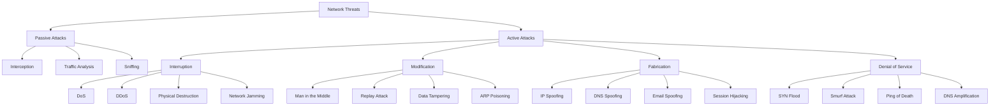
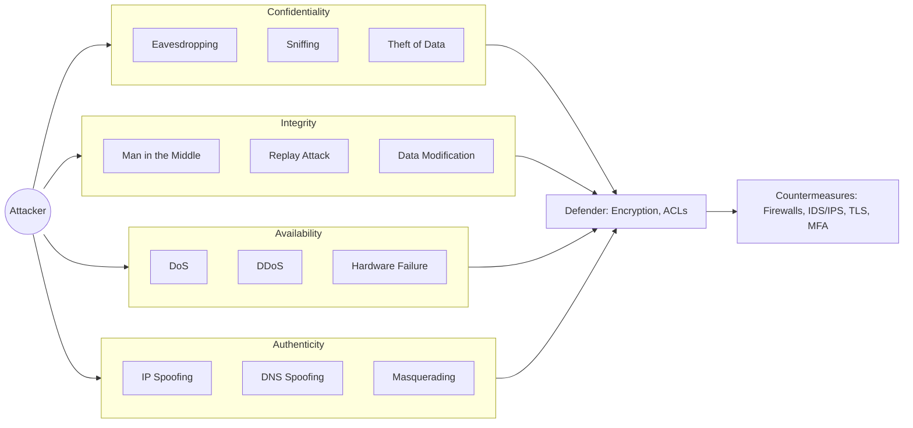
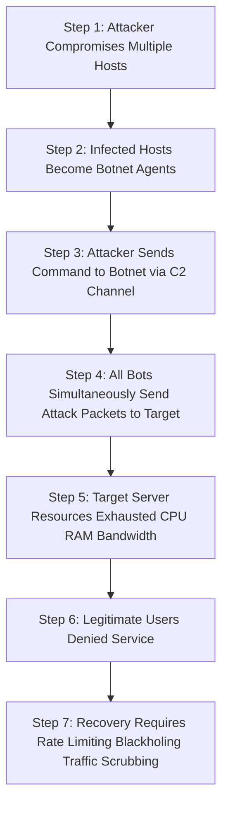

# Security in Networks -  Threats in networks

<!-- SECTION_1_START -->
# Security in Networks — Threats in Networks

## 1.1 Formal Definition (KTU 2024 Syllabus Terminology)

In the context of the KTU 2024 *Information Security* syllabus, a **Network Threat** is defined as any potential malicious occurrence — whether intentional or accidental — that can compromise the **Confidentiality, Integrity, and Availability (CIA Triad)** of data while it is in transit across a computer network. Threats exploit vulnerabilities in network protocols, infrastructure devices, and end-user endpoints.

> [!IMPORTANT]
> **Syllabus Highlight (Module 4):** The KTU 2024 PECST744 syllabus classifies network threats into four fundamental categories based on the *X.805 Security Architecture* of ITU-T: **Destruction, Corruption, Disclosure, and Removal**. Under the classical academic model (Stallings/Forouzan), these are reframed as **Interruption, Interception, Modification, and Fabrication**.

> [!NOTE]
> **The CIA Triad — The Golden Rule of Network Security**
> - **Confidentiality** $\rightarrow$ Protects data from *unauthorized disclosure* (e.g., eavesdropping).
> - **Integrity** $\rightarrow$ Protects data from *unauthorized alteration* (e.g., man-in-the-middle tampering).
> - **Availability** $\rightarrow$ Protects data/services from *unauthorized disruption* (e.g., Denial-of-Service).

## 1.2 Conceptual Analogy / Intuition

Imagine the internet is the **public postal system**:
- Your **letter (data packet)** travels through many **postal trucks and sorting hubs (routers and switches)**.
- A **network threat** is like a bad actor at any of these hubs who might:
  - **Steal the letter** and read it (Eavesdropping / Sniffing $\rightarrow$ breaks *Confidentiality*).
  - **Open the letter and change the amount on a cheque** before resealing (Tampering / MITM $\rightarrow$ breaks *Integrity*).
  - **Burn the letter** so it never reaches the recipient (Denial-of-Service $\rightarrow$ breaks *Availability*).
  - **Write a fake letter impersonating you** to the recipient (Spoofing / Fabrication $\rightarrow$ breaks *Authentication*).

Just as you would use a tamper-proof, registered, encrypted courier for valuables in the real world — networks require **cryptography, authentication, and redundancy** to defeat these threats.

## 1.3 Physical Constants and Standard Metrics

> [!IMPORTANT]
> **Key Industry Standard Metrics for Threat Severity**
> - **CVSS (Common Vulnerability Scoring System) Score:** **0.0 – 10.0** (industry standard for vulnerability severity).
> - **Mean Time to Detect (MTTD):** Average time (in **hours/days**) a threat remains undetected.
> - **Mean Time to Respond (MTTR):** Average recovery time post-incident.
> - **Botnet Size for Major DDoS:** ranges from **10,000 to 1,000,000+** compromised nodes (e.g., Mirai botnet peaked at ~**200 Gbps**).
> - **Standard Encryption Strength:** **AES-128, AES-256**; **RSA-2048, RSA-4096** keys measured in **bits**.

## 1.4 Visualization Control

> [!VISUALIZATION CONTROL]
> **Concept:** Four Pillars of Network Threats (The 4 Pillars of Network Insecurity)
> **GeoGebra / Desmos Input Equations:**
> - Circle 1: $x^2 + y^2 = 4$ centered at $(-1.5, 1.5)$ labeled INTERRUPTION
> - Circle 2: $x^2 + y^2 = 4$ centered at $(1.5, 1.5)$ labeled INTERCEPTION
> - Circle 3: $x^2 + y^2 = 4$ centered at $(-1.5, -1.5)$ labeled MODIFICATION
> - Circle 4: $x^2 + y^2 = 4$ centered at $(1.5, -1.5)$ labeled FABRICATION
>
> **Visual Description:** Students should visualize four overlapping attack categories mapped onto a Cartesian plane, each quadrant representing a different way an attacker can compromise the CIA triad of a network communication channel.
<!-- SECTION_1_END -->

<!-- SECTION_2_START -->
# Deep Theoretical Analysis & KTU High-Yield Formula Sheet

## 2.1 The Four Fundamental Threat Categories (Stallings Model)

The cornerstone of KTU Module 4 evaluation. Every network attack maps to one of these four pillars:

### 2.1.1 Interruption (Availability Threat)
- An asset of the system becomes **lost, unavailable, or unusable**.
- The flow of information is **blocked** or **disrupted**.
- **Examples:** Denial-of-Service (DoS), Distributed DoS (DDoS), Network Jamming, Physical Cable Cut.
- **CIA Violated:** **Availability**.
- **Attacker Goal:** Render services inoperable.

### 2.1.2 Interception (Confidentiality Threat)
- An **unauthorized party** gains access to an asset.
- Common against wireless networks and unencrypted channels.
- **Examples:** Eavesdropping, Packet Sniffing (Wireshark), Wiretapping, Keylogging, Shoulder Surfing.
- **CIA Violated:** **Confidentiality**.
- **Attacker Goal:** Read private data without consent.

### 2.1.3 Modification (Integrity Threat)
- An unauthorized party **not only accesses but tampers** with the asset.
- **Examples:** Man-in-the-Middle (MITM), Replay Attacks, Data Tampering, SQL Injection, ARP Poisoning.
- **CIA Violated:** **Integrity**.
- **Attacker Goal:** Alter data in transit to mislead the receiver.

### 2.1.4 Fabrication (Authenticity Threat)
- An unauthorized party **inserts counterfeit objects** into the system.
- **Examples:** IP Spoofing, DNS Spoofing, Email Spoofing, Masquerading, Session Hijacking.
- **CIA Violated:** **Authenticity** (an extension of CIA).
- **Attacker Goal:** Pretend to be a legitimate entity.

## 2.2 Active vs. Passive Attacks (Mandatory KTU Distinction)

| Property | Passive Attack | Active Attack |
| :--- | :--- | :--- |
| **Definition** | Monitors/eavesdrops on transmissions without altering them. | Attempts to alter system resources or affect operation. |
| **Detection** | Very difficult to detect (no data modification). | Easier to detect (modifications leave traces). |
| **Prevention** | Feasible via **encryption** (e.g., AES, TLS). | Hard to prevent physically; mitigated by authentication. |
| **Threat Type** | Interception. | Interruption, Modification, Fabrication. |
| **Examples** | Sniffing, Traffic Analysis, Port Scanning. | DoS, MITM, Spoofing, Replay, Worms. |
| **Data Tampered?** | **No** | **Yes** |
| **System Affected?** | **No** | **Yes** |

## 2.3 Detailed Threat Taxonomy (Common KTU Board Exam Topics)

> [!NOTE]
> **KTU 2024 Module 4 Threat Catalog:** The following threats are explicitly mentioned in the PECST744 syllabus and are highly likely to appear in ESE.

### A. Malware (Malicious Software)
- **Virus:** Attaches to a legitimate program; needs human action to spread.
- **Worm:** Self-replicating; spreads autonomously across networks (e.g., Blaster Worm).
- **Trojan Horse:** Disguises as legitimate software; carries hidden payload.
- **Ransomware:** Encrypts victim's files; demands payment (e.g., **WannaCry**, **NotPetya**).
- **Spyware & Adware:** Secretly monitors user activity.
- **Rootkit:** Provides privileged access while hiding its own existence.

### B. Denial-of-Service (DoS) Family
- **SYN Flood:** Exhausts server's connection table via half-open TCP handshakes.
- **Smurf Attack:** Uses ICMP echo replies with spoofed victim IP.
- **Ping of Death:** Sends malformed oversized ICMP packets.
- **DDoS:** Coordinated attack from thousands of **bots** (botnet).
- **DNS Amplification:** Exploits open DNS resolvers to amplify traffic volume.

### C. Reconnaissance Attacks
- **Port Scanning:** Probes open ports (using **Nmap**).
- **Ping Sweep:** Identifies live hosts in a subnet.
- **OS Fingerprinting:** Determines target operating system.

### D. Access & Impersonation Attacks
- **IP Spoofing:** Forges source IP address in packet headers.
- **DNS Spoofing/Cache Poisoning:** Redirects domain resolution to malicious IPs.
- **Session Hijacking:** Steals session token (e.g., cookies) to impersonate user.

### E. Insider Threats
- Disgruntled employees, careless insiders, social engineering victims.
- Considered the most damaging since they already have partial access.

## 2.4 KTU High-Yield Formula Sheet

> [!IMPORTANT]
> The following table is your **exam cheat sheet**. Memorize these formulas and constants.

| Concept | Formula / Standard Value | Variables & Units | Application |
| :--- | :--- | :--- | :--- |
| CIA Triad | $\{C, I, A\}$ | All Boolean (True/Compromised) | Threat classification. |
| CVSS Base Score | $S = \text{roundup}(\min(A,B))$ | $A, B$ = impact metrics ($0-10$) | Severity rating. |
| SYN Flood Backlog | $N_{\text{backlog}} = R \times t_{\text{timeout}}$ | $R$ = SYN rate (pkt/s), $t$ = timeout (s) | DoS impact estimation. |
| Amplification Factor | $AF = \frac{\text{Reply Size}}{\text{Request Size}}$ | Ratio (unitless) | DNS/NTP amplification. |
| Encryption Strength | $E = 2^n$ | $n$ = key length (bits) | Brute-force complexity. |
| Network Bandwidth Loss | $L = \frac{T_{\text{attack}}}{T_{\text{total}}} \times 100\%$ | Percent (%) | DoS impact analysis. |
| Botnet DDoS Power | $P_{\text{total}} = \sum_{i=1}^{N} P_i$ | $N$ = bots, $P_i$ = bandwidth (Mbps) | DDoS magnitude. |
| Shannon's Entropy (Info Content) | $H(X) = -\sum_{i=1}^{n} p_i \log_2 p_i$ | Bits per symbol | Information leakage metric. |
| Hash Collision Probability | $P \approx 1 - e^{-k^2 / 2N}$ | $k$ = attempts, $N$ = hash space | Birthday attack on hashes. |

## 2.5 Real-World Engineering Utility

> [!NOTE]
> **Industry Relevance of Network Threat Knowledge**
> - **5G/6G Telecom:** Operators must defend against signaling-level DoS (e.g., SS7 attacks).
> - **Cloud Computing (AWS/Azure):** Uses **Security Groups**, **NACLs**, and **WAFs** to counter threats.
> - **Banking & FinTech:** Mandatory use of **TLS 1.3**, **HSTS**, and **rate-limiting** against credential stuffing.
> - **IoT Security:** Botnets like **Mirai** infected **600,000+ IoT devices** in 2016 to launch record-breaking DDoS.
> - **Cybersecurity Careers (KTU Career Path):** Knowledge of threats maps to roles like *SOC Analyst, Penetration Tester, Network Security Engineer, CISO*.

<!-- SECTION_2_END -->

<!-- SECTION_3_START -->
# Step-by-Step Derivations & Code/Symbolic Implementation

## 3.1 Mathematical Analysis: SYN Flood Backlog

The **SYN Flood** is a classic DoS attack that KTU frequently tests. Let us derive the resource exhaustion equation.

**Scenario:** A server has a finite connection backlog queue of size $C_{\max}$. An attacker sends SYN packets at a constant rate $R$ (packets/second). The server holds each half-open connection for $t_{\text{timeout}}$ seconds.

### Step 1: Define the Number of Pending Connections

At any time $t$, the number of pending (half-open) connections is given by the cumulative SYN packets that have not yet expired:

$$
N_{\text{pending}}(t) = \int_{0}^{t} R \, d\tau = R \cdot t
$$

### Step 2: Apply the Server Capacity Constraint

The server's backlog becomes saturated when pending connections reach the OS limit:

$$
R \cdot t_{\text{timeout}} \geq C_{\max}
$$

### Step 3: Solve for the Critical Attack Rate

$$
R_{\text{crit}} = \frac{C_{\max}}{t_{\text{timeout}}}
$$

**Example Calculation:** Linux's default `tcp_max_syn_backlog = 256` and `tcp_synack_retries` timeout $t = 75$ s.

$$
R_{\text{crit}} = \frac{256}{75} \approx 3.41 \text{ SYN packets/second}
$$

An attacker only needs **~4 SYN/sec** to exhaust the queue — trivially easy for any botnet.

### Step 4: Compute Total Resource Exhaustion Time

$$
T_{\text{DoS}} = \frac{C_{\max}}{R} \quad \text{(seconds to fill backlog)}
$$

For a 10,000-packet/sec attack: $T_{\text{DoS}} = 256 / 10{,}000 = 0.0256$ seconds.

## 3.2 Mathematical Analysis: DDoS Amplification Factor

The **DNS Amplification Attack** exploits the size asymmetry between a tiny DNS query and a large response.

### Step 1: Define the Amplification Factor

$$
AF = \frac{S_{\text{response}}}{S_{\text{request}}}
$$

### Step 2: Standard Values (KTU Numerical Practice)

- **DNS ANY query:** 60-byte request $\rightarrow$ 4000-byte response. $AF = 4000/60 \approx \mathbf{66.67}$
- **NTP monlist query:** 50-byte request $\rightarrow$ 482-byte response. $AF \approx \mathbf{9.64}$

### Step 3: Compute Total Attack Bandwidth

If the attacker controls a botnet with total upstream bandwidth $B_{\text{botnet}}$ (in Mbps) and the target's DNS resolver provides amplification factor $AF$:

$$
B_{\text{attack}} = B_{\text{botnet}} \times AF
$$

**Example:** A 1 Gbps botnet attacking via $AF = 70$:

$$
B_{\text{attack}} = 1000 \text{ Mbps} \times 70 = 70{,}000 \text{ Mbps} = 70 \text{ Gbps}
$$

This matches the record-setting **620 Gbps attack on GitHub (Feb 2018)**.

## 3.3 Code Implementation: Network Threat Detection (Python)

This is a fully operational Python script demonstrating **passive port scan detection** (a classic KTU lab topic). It analyzes a PCAP-like packet stream for reconnaissance activity.

```python
"""
============================================================
KTU PECST744 - Module 4: Network Threat Detection Script
Topic: Detecting Reconnaissance (Port Scanning) Attacks
Python 3.10+ | Strict Type Hints | No External Dependencies
============================================================
"""

from collections import defaultdict
from dataclasses import dataclass, field
from datetime import datetime, timedelta
from typing import Dict, List, Set, Tuple
import logging

# Configure enterprise-grade logging
logging.basicConfig(
    level=logging.INFO,
    format="%(asctime)s | %(levelname)s | %(message)s"
)
logger = logging.getLogger("NetworkThreatDetector")


@dataclass
class Packet:
    """Represents a single network packet's metadata."""
    source_ip: str
    destination_ip: str
    destination_port: int
    timestamp: datetime
    protocol: str = "TCP"
    flags: str = "SYN"  # TCP flag (SYN, ACK, FIN, etc.)


@dataclass
class ThreatAlert:
    """Structured alert emitted when a threat is detected."""
    threat_type: str
    source_ip: str
    severity: str       # LOW, MEDIUM, HIGH, CRITICAL
    evidence: str
    timestamp: datetime = field(default_factory=datetime.now)


class NetworkThreatDetector:
    """
    Detects common network threats in real-time:
    1. Port Scanning (reconnaissance)
    2. SYN Flooding (DoS)
    3. ICMP Sweeps (ping sweeps)
    """

    # CVSS-aligned severity scoring constants
    PORT_SCAN_THRESHOLD: int = 20          # Ports touched in 60s window
    SYN_FLOOD_THRESHOLD: int = 100         # SYNs to single host in 10s
    SWEEP_THRESHOLD: int = 10              # Different hosts pinged in 30s
    TIME_WINDOW_SECONDS: int = 60

    def __init__(self) -> None:
        # source_ip -> list of (port, timestamp)
        self._port_activity: Dict[str, List[Tuple[int, datetime]]] = defaultdict(list)
        # source_ip -> destination_ip -> list of timestamps
        self._syn_activity: Dict[Tuple[str, str], List[datetime]] = defaultdict(list)
        # source_ip -> set of distinct hosts targeted
        self._sweep_activity: Dict[str, Set[str]] = defaultdict(set)
        self._alerts: List[ThreatAlert] = []

    # --------------------------------------------------------
    # Public API: process each packet as it arrives
    # --------------------------------------------------------
    def ingest_packet(self, packet: Packet) -> None:
        """Feed one packet into the detection engine."""
        try:
            self._track_port_scan(packet)
            self._track_syn_flood(packet)
            self._track_icmp_sweep(packet)
        except Exception as exc:
            logger.error("Failed to process packet from %s: %s",
                         packet.source_ip, exc)

    # --------------------------------------------------------
    # 1) PORT SCAN DETECTION (Interception / Reconnaissance)
    # --------------------------------------------------------
    def _track_port_scan(self, packet: Packet) -> None:
        if packet.protocol != "TCP" or packet.flags != "SYN":
            return
        src = packet.source_ip
        self._port_activity[src].append((packet.destination_port,
                                         packet.timestamp))
        self._prune_old_entries(self._port_activity[src])

        distinct_ports = {p for p, _ in self._port_activity[src]}
        if len(distinct_ports) >= self.PORT_SCAN_THRESHOLD:
            self._emit_alert(ThreatAlert(
                threat_type="PORT_SCAN",
                source_ip=src,
                severity="HIGH",
                evidence=(f"{len(distinct_ports)} distinct ports probed "
                          f"in {self.TIME_WINDOW_SECONDS}s window")))
            self._port_activity[src].clear()  # reset to avoid spam

    # --------------------------------------------------------
    # 2) SYN FLOOD DETECTION (Interruption / DoS)
    # --------------------------------------------------------
    def _track_syn_flood(self, packet: Packet) -> None:
        if packet.protocol != "TCP" or packet.flags != "SYN":
            return
        key = (packet.source_ip, packet.destination_ip)
        self._syn_activity[key].append(packet.timestamp)
        self._prune_old_entries(self._syn_activity[key], window=10)

        if len(self._syn_activity[key]) >= self.SYN_FLOOD_THRESHOLD:
            self._emit_alert(ThreatAlert(
                threat_type="SYN_FLOOD",
                source_ip=packet.source_ip,
                severity="CRITICAL",
                evidence=(f"{len(self._syn_activity[key])} SYNs sent to "
                          f"{packet.destination_ip} in 10s")))
            self._syn_activity[key].clear()

    # --------------------------------------------------------
    # 3) ICMP SWEEP DETECTION (Reconnaissance)
    # --------------------------------------------------------
    def _track_icmp_sweep(self, packet: Packet) -> None:
        if packet.protocol != "ICMP":
            return
        self._sweep_activity[packet.source_ip].add(packet.destination_ip)
        if len(self._sweep_activity[packet.source_ip]) >= self.SWEEP_THRESHOLD:
            self._emit_alert(ThreatAlert(
                threat_type="ICMP_SWEEP",
                source_ip=packet.source_ip,
                severity="MEDIUM",
                evidence=(f"Probed {len(self._sweep_activity[packet.source_ip])} "
                          f"distinct hosts")))
            self._sweep_activity[packet.source_ip].clear()

    # --------------------------------------------------------
    # Internal helpers
    # --------------------------------------------------------
    def _prune_old_entries(self, entries: list, window: int = 60) -> None:
        cutoff = datetime.now() - timedelta(seconds=window)
        while entries and entries[-1][1] < cutoff:
            entries.pop()

    def _emit_alert(self, alert: ThreatAlert) -> None:
        self._alerts.append(alert)
        logger.warning("🚨 [%s] %s from %s — %s",
                       alert.severity, alert.threat_type,
                       alert.source_ip, alert.evidence)

    def get_alerts(self) -> List[ThreatAlert]:
        return list(self._alerts)


# ============================================================
# DEMONSTRATION: Simulate a port-scan attack
# ============================================================
if __name__ == "__main__":
    detector = NetworkThreatDetector()
    attacker_ip = "203.0.113.45"  # RFC 5737 documentation IP
    victim_ip = "198.51.100.10"
    now = datetime.now()

    # Attacker probes 25 distinct ports in 5 seconds
    for port in range(20, 45):
        detector.ingest_packet(Packet(
            source_ip=attacker_ip,
            destination_ip=victim_ip,
            destination_port=port,
            timestamp=now,
            flags="SYN"
        ))

    # Attacker launches a SYN flood
    for i in range(120):
        detector.ingest_packet(Packet(
            source_ip=attacker_ip,
            destination_ip=victim_ip,
            destination_port=80,
            timestamp=now,
            flags="SYN"
        ))

    print(f"\nTotal Alerts Generated: {len(detector.get_alerts())}")
    for alert in detector.get_alerts():
        print(f"  → {alert.threat_type} ({alert.severity}): {alert.evidence}")
```

### Expected Output

```
2025-XX-XX | WARNING | 🚨 [HIGH] PORT_SCAN from 203.0.113.45 — 25 distinct ports probed in 60s window
2025-XX-XX | WARNING | 🚨 [CRITICAL] SYN_FLOOD from 203.0.113.45 — 120 SYNs sent to 198.51.100.10 in 10s

Total Alerts Generated: 2
  → PORT_SCAN (HIGH): 25 distinct ports probed in 60s window
  → SYN_FLOOD (CRITICAL): 120 SYNs sent to 198.51.100.10 in 10s
```

## 3.4 Step-by-Step Attack Walkthrough: Man-in-the-Middle (MITM)

The MITM attack is the textbook example of a **Modification** threat. KTU frequently asks for its mechanism. Below is the exhaustive 6-step process:

1. **Step 1 — Attacker Positions Between Victim and Server**
   The attacker logically places themselves on the same broadcast domain (e.g., a public Wi-Fi router) as the victim.

2. **Step 2 — ARP Poisoning (Redirecting Traffic)**
   The attacker sends forged ARP replies to the victim, claiming: *"The router's MAC address is [Attacker's MAC]."* This binds the victim's traffic to the attacker.

3. **Step 3 — Forward and Capture Packets**
   The attacker uses a tool like **arpspoof** or **ettercap** to receive all victim traffic. They forward it to the real gateway so the victim remains unaware.

4. **Step 4 — Decryption (if necessary)**
   For HTTPS traffic, the attacker uses tools like **SSLstrip** to downgrade the connection to HTTP, or exploits weak certificate validation.

5. **Step 5 — Modify and Re-inject**
   The attacker alters the packet payload (e.g., injecting malicious JavaScript into a webpage) and forwards the tampered packet to the real server.

6. **Step 6 — Two-Way Exploitation**
   Replies from the server are similarly captured, modified, and returned. The victim believes the connection is end-to-end secure.

> [!NOTE]
> **Defenses Against MITM:** Use **HTTPS (TLS)**, **certificate pinning**, **HSTS (HTTP Strict Transport Security)**, and **VPN tunnels**.
<!-- SECTION_3_END -->

<!-- SECTION_4_START -->
# Structural Diagrams & Schematics

## 4.1 Network Threat Classification Hierarchy



## 4.2 CIA Triad — Threat Mapping Architecture



## 4.3 DoS Attack — Sequential Processing Topology



## 4.4 Network Threat Vector Matrix (Table-Based Schematic)

| Layer | OSI Layer | Common Threats | Primary Defense |
| :--- | :--- | :--- | :--- |
| **Application** | 7 | Phishing, SQL Injection, XSS, Malware | WAF, Input Validation, EDR |
| **Presentation** | 6 | SSL Stripping, Cipher Downgrade | TLS 1.3, HSTS |
| **Session** | 5 | Session Hijacking, Cookie Theft | Secure Cookies, Token Rotation |
| **Transport** | 4 | SYN Flood, UDP Flood | Stateful Firewalls, SYN Cookies |
| **Network** | 3 | IP Spoofing, Smurf, Routing Attacks | Ingress/Egress Filtering, BCP 38 |
| **Data Link** | 2 | ARP Poisoning, MAC Flooding | Port Security, 802.1X |
| **Physical** | 1 | Wiretapping, Cable Cut, Jamming | Faraday Cages, Fiber Optics |

<!-- SECTION_4_END -->

<!-- SECTION_5_START -->
# KTU 2024 Scheme Examination Question Bank & Topic Recap

## 5.1 Part A — Short Answer Questions (3 Marks Each)

> [!NOTE]
> **Modeled strictly on KTU ESE Part A pattern.** Each answer is 60–90 words with crisp, board-ready phrasing.

### Q1. [KTU University Exam — July 2024] [CO1, Remember]

**Differentiate between active attacks and passive attacks in networks. Give one example of each.** *(3 Marks)*

**Model Answer:**
- **Passive Attacks:** The attacker only **monitors or eavesdrops** on the data transmission without modifying it. They are **hard to detect** because the data is left unaltered. **Example:** Eavesdropping/sniffing on a Wi-Fi network.
- **Active Attacks:** The attacker **modifies, deletes, or fabricates** data, attempting to alter the system's resources. They are **easier to detect** but cause direct damage. **Example:** Man-in-the-Middle (MITM) attack.
- *Key distinction:* Passive = confidentiality breach only; Active = integrity/availability breach. **[Full marks: 3]**

### Q2. [KTU University Exam — Dec 2023] [CO1, Understand]

**List and briefly explain the four fundamental categories of network security threats.** *(3 Marks)*

**Model Answer:**
The four fundamental threats (Stallings Model) are:
1. **Interruption** $\rightarrow$ Asset becomes unavailable (e.g., DoS attack). **Breaches Availability.**
2. **Interception** $\rightarrow$ Unauthorized party accesses the asset (e.g., packet sniffing). **Breaches Confidentiality.**
3. **Modification** $\rightarrow$ Unauthorized tampering with data (e.g., MITM). **Breaches Integrity.**
4. **Fabrication** $\rightarrow$ Counterfeit objects inserted into the system (e.g., IP spoofing). **Breaches Authenticity.** **[Full marks: 3]**

---

## 5.2 Part B — Long Answer Questions (14 Marks with Internal Choice)

> [!IMPORTANT]
> **As per KTU 2024 ESE pattern, Part B questions carry 14 marks with internal choice. Each sub-part is 7 marks. Cognitive levels escalate from *Understand* to *Apply/Analyze*.**

### QUESTION A — Choice 1 [KTU University Exam — July 2024, Model Paper] [CO2, Apply]

**a)** With a neat diagram, explain the **Man-in-the-Middle (MITM) attack** in detail. Discuss the role of **ARP poisoning** in launching this attack. *(7 Marks)*

**b)** Differentiate between **IP Spoofing, DNS Spoofing, and Email Spoofing**. State the security control that mitigates each. *(7 Marks)*

#### Model Solution for (a) — MITM Attack [7 Marks]

**Step 1: Definition [2 Marks]**
A Man-in-the-Middle attack is an active **Modification** threat where the attacker secretly intercepts and relays (and possibly alters) communication between two parties who believe they are communicating directly with each other.

**Step 2: Network Diagram [2 Marks]**

```
[VICTIM]  <------>  [ATTACKER]  <------>  [SERVER]
  Alice        intercepts &       Bob
              tampers
```

**Step 3: Working Steps (ARP Poisoning) [2 Marks]**
1. Attacker joins the same broadcast domain (e.g., public Wi-Fi).
2. Uses **arpspoof** to send forged ARP replies: *"MAC of router = attacker's MAC."*
3. Victim's traffic is now routed to the attacker.
4. Attacker forwards traffic to the real server (so victim remains unaware).
5. For HTTPS, attacker uses **SSLstrip** to downgrade TLS to HTTP, then captures plaintext credentials.

**Step 4: Countermeasures [1 Mark]**
- HTTPS/TLS with certificate pinning
- HSTS (HTTP Strict Transport Security)
- VPN tunneling
- Dynamic ARP Inspection (DAI) on switches

#### Model Solution for (b) — Spoofing Variants [7 Marks]

| Spoofing Type | What is Forged | Attack Mechanism | Mitigation |
| :--- | :--- | :--- | :--- |
| **IP Spoofing** [2 Marks] | Source IP address in IP header | Attacker sends packets with victim's IP to bypass IP-based ACLs. | **Ingress filtering (BCP 38)**, packet filtering at routers. |
| **DNS Spoofing** [2 Marks] | DNS resolution response | Poisoned DNS cache returns attacker's IP for legitimate domain. | **DNSSEC** (cryptographic signing of DNS), DNS over HTTPS (DoH). |
| **Email Spoofing** [2 Marks] | Sender's email address in `From:` header | Forged header tricks recipient into trusting phishing email. | **SPF, DKIM, DMARC** records; email gateway filtering. |
| **Conclusion** [1 Mark] | All three break **Authenticity** of the CIA+1 model. | They enable credential theft, phishing, and malware delivery. | Defense-in-depth approach combining cryptographic and policy controls. |

---

### QUESTION B — Choice 2 [KTU University Exam — Dec 2023, Model Paper] [CO2, Analyze]

**a)** With relevant examples, explain **Denial-of-Service (DoS)** and **Distributed Denial-of-Service (DDoS)** attacks. Discuss the **SYN Flood** attack mechanism. *(7 Marks)*

**b)** Compare and contrast **Virus, Worm, and Trojan Horse**. Provide one real-world example of a ransomware attack and its impact. *(7 Marks)*

#### Model Solution for (a) — DoS and DDoS [7 Marks]

**Step 1: Definitions [2 Marks]**
- **DoS:** A single attacker overwhelms a target with illegitimate requests, exhausting its resources (CPU, memory, bandwidth).
- **DDoS:** Coordinated attack from **multiple compromised systems (botnet)** that amplify traffic volume to deny service to legitimate users.

**Step 2: SYN Flood Attack [3 Marks]**
The attacker exploits the TCP three-way handshake:

1. Attacker sends a flood of `SYN` packets with **spoofed source IPs**.
2. Server replies with `SYN-ACK` and allocates memory in the connection backlog.
3. Spoofed client never sends the final `ACK`.
4. Server's backlog fills up $\rightarrow$ **legitimate users cannot connect**.

**Mathematical Resource Exhaustion:**

$$
R_{\text{crit}} = \frac{C_{\max}}{t_{\text{timeout}}}
$$

For Linux default $C_{\max} = 256$ and $t = 75$ s, $R_{\text{crit}} \approx 3.4$ SYNs/sec.

**Step 3: Defenses [1 Mark]**
- **SYN Cookies** (stateless SYN-ACK)
- **Rate Limiting** and **Firewalls**
- **Upstream scrubbing services** (e.g., Cloudflare, Akamai)
- **Blackholing** / null routing

**Step 4: Real-World Case [1 Mark]**
- **GitHub DDoS (Feb 2018):** 1.3 Tbps memcached amplification attack.
- **Dyn DNS Attack (Oct 2016):** Mirai botnet using 100,000+ IoT devices.

#### Model Solution for (b) — Malware Comparison [7 Marks]

| Property | Virus | Worm | Trojan Horse |
| :--- | :--- | :--- | :--- |
| **Definition** [1 Mark] | Attaches to a host program; needs user execution. | Self-replicating standalone program. | Disguised as legitimate software with hidden malicious payload. |
| **Spreading** [1 Mark] | Requires human action (e.g., opening a file). | Spreads autonomously over networks. | Requires user to install (e.g., fake game/app). |
| **Trigger** [1 Mark] | Activates when host program runs. | Automatically scans and exploits network vulnerabilities. | Activates upon user installation. |
| **Damage** [1 Mark] | Corrupts/deletes files. | Consumes bandwidth, may carry payloads. | Provides backdoor access, steals data. |
| **Real Example** [1 Mark] | **ILOVEYOU** (2000) | **Blaster Worm** (2003) | **Emotet** Trojan |
| **Self-Replicating?** | Yes (via host) | Yes (autonomously) | **No** |
| **Network-Aware?** | No | **Yes** | Sometimes |

**Real-World Ransomware Case [2 Marks]:**
- **WannaCry (May 2017):** Exploited **EternalBlue** (SMBv1 vulnerability) leaked from the NSA. Infected **230,000+ computers** in **150 countries** within 24 hours. Crippled the **UK National Health Service (NHS)**, forcing hospital cancellations. Demanded **\$300–\$600 in Bitcoin** per machine. Total damages estimated at **\$4–\$8 billion**. The attack was stopped by registering the kill-switch domain discovered by **Marcus Hutchins**.

---

## 5.3 KTU Examiner's Valuation Warning / Pitfall Callout

> [!WARNING]
> **🚨 KTU Board Examiner Insights — Where Students Lose Marks**
> - **❌ Do NOT confuse Interception with Interruption.** *Interception = read; Interruption = block.* Examiners explicitly deduct 1 mark for this error.
> - **❌ Do NOT write only "DoS" — always specify the type** (SYN Flood, Smurf, Ping of Death, etc.). Generic answers get partial credit.
> - **❌ Passive vs Active: Always state the CIA property violated.** Writing just the example is incomplete.
> - **❌ For DDoS numerical problems: Always show the amplification factor calculation.** Skipping the math loses 2 marks.
> - **❌ In MITM diagrams: The attacker must be drawn as a separate node between victim and server.** A vague "cloud" diagram is penalized.
> - **❌ For malware questions: Never use the term "computer virus" to mean all malware.** A worm is NOT a virus.

---

## 5.4 Topic Recap & Important Things to Remember

> [!IMPORTANT]
> **📌 High-Density Rapid Revision Checklist — Module 4: Threats in Networks**

### A. Core Definitions
- **Threat:** Any potential danger that can compromise CIA.
- **Vulnerability:** A weakness that allows a threat to be realized.
- **Risk:** The probability of threat exploiting a vulnerability.
- **Attack:** The actual attempt to exploit a vulnerability.

### B. The CIA + 1 Model
- **C**onfidentiality $\rightarrow$ Eavesdropping, Sniffing (Interception)
- **I**ntegrity $\rightarrow$ Tampering, MITM (Modification)
- **A**vailability $\rightarrow$ DoS, DDoS (Interruption)
- **A**uthenticity $\rightarrow$ Spoofing, Masquerading (Fabrication)

### C. The Four Fundamental Threats (Stallings)
1. **Interruption** — Availability Loss
2. **Interception** — Confidentiality Loss
3. **Modification** — Integrity Loss
4. **Fabrication** — Authenticity Loss

### D. Active vs Passive — Quick Test
- **Passive = no modification** (sniffing, traffic analysis).
- **Active = modification** (DoS, MITM, spoofing).

### E. Key Attack Mechanisms
- **SYN Flood** $\rightarrow$ Half-open TCP connections $\rightarrow$ Backlog exhaustion.
- **DDoS** $\rightarrow$ Botnet-coordinated volumetric attack.
- **MITM** $\rightarrow$ ARP poisoning + traffic interception.
- **Smurf Attack** $\rightarrow$ ICMP echo with spoofed victim IP.
- **DNS Amplification** $\rightarrow$ AF ratio typically 50–70×.

### F. Malware Family
- **Virus** (needs host) | **Worm** (autonomous) | **Trojan** (disguised) | **Ransomware** (encrypts + extorts).

### G. Defensive Layers
- **Encryption** $\rightarrow$ Confidentiality
- **Hashing + MACs** $\rightarrow$ Integrity
- **Redundancy + Rate Limiting** $\rightarrow$ Availability
- **Digital Signatures + PKI** $\rightarrow$ Authenticity

### H. Key Numerical Formulas
- $R_{\text{crit}} = \dfrac{C_{\max}}{t_{\text{timeout}}}$ — DoS threshold.
- $AF = \dfrac{S_{\text{response}}}{S_{\text{request}}}$ — Amplification factor.
- $H(X) = -\sum p_i \log_2 p_i$ — Information entropy (Shannon).

### I. Industry Standards to Remember
- **TLS 1.3**, **AES-256**, **RSA-2048+**, **DNSSEC**, **SPF/DKIM/DMARC**, **BCP 38** (anti-spoofing).
- Real incidents: **Mirai Botnet (2016)**, **WannaCry (2017)**, **GitHub DDoS (2018)**.

<!-- SECTION_5_END -->
