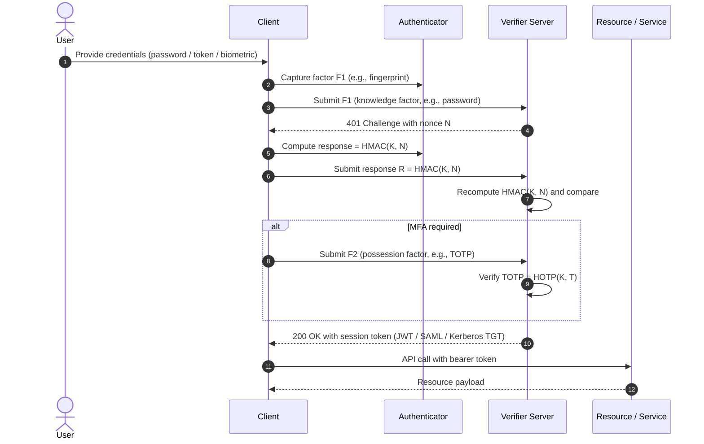
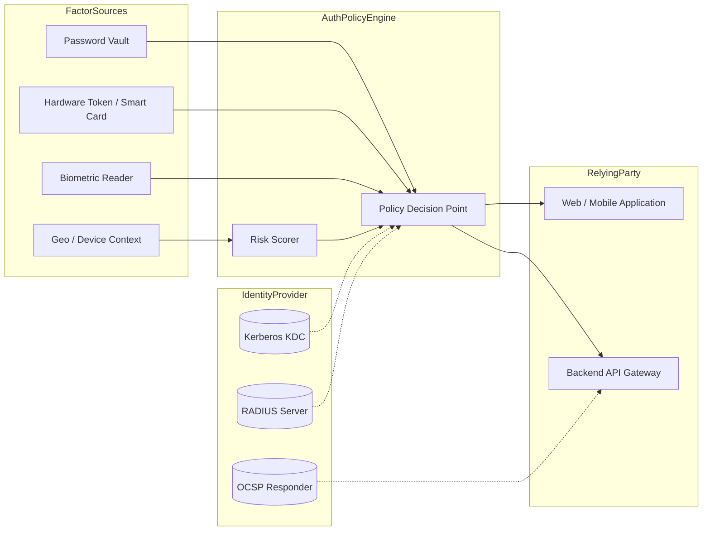
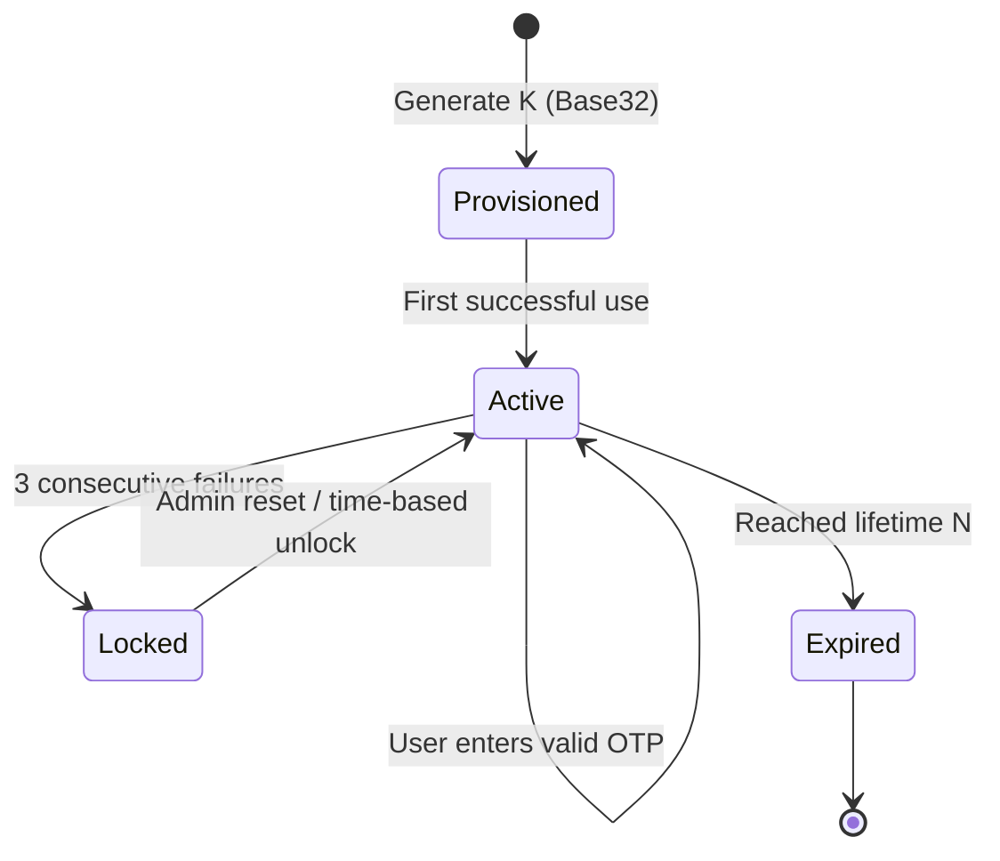
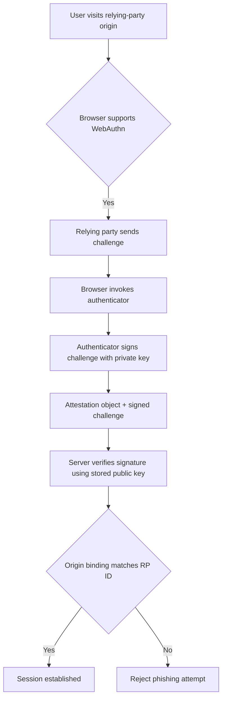
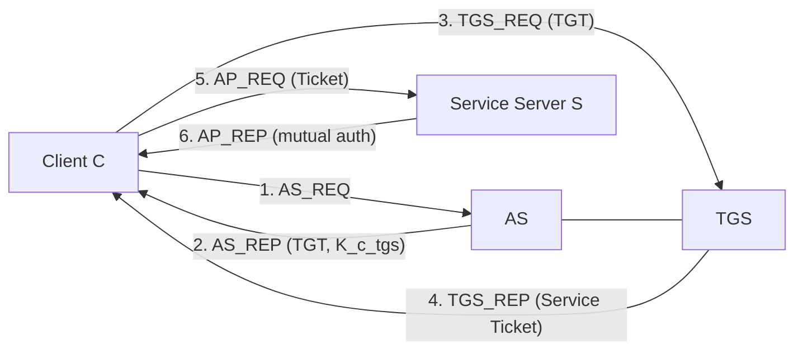
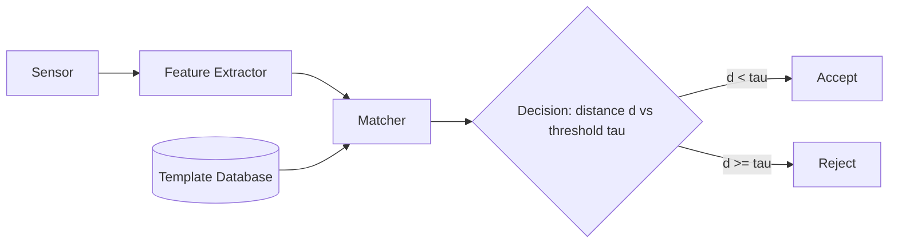
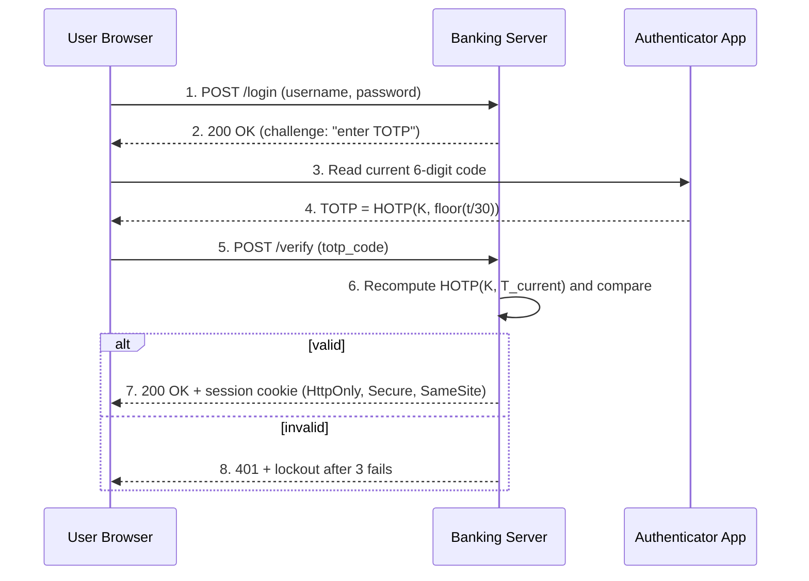

# Strong Authentication

<!-- SECTION_1_START -->
# Strong Authentication — Core Technical Definition & Intuitive Overview

## 1.1 Formal Academic Definition (KTU 2024 Syllabus Terminology)

> [!IMPORTANT]
> **Strong Authentication** is a security mechanism that requires the presentation of **two or more independent credentials (factors)** belonging to different categories — *knowledge*, *possession*, and *inherence* — to verify the identity of a user, device, or system. In KTU 2024 Information Security parlance, it is the application of **Multi-Factor Authentication (MFA)** combined with cryptographically robust protocols (One-Time Passwords, Challenge-Response, Kerberos, and PKI certificates) to defeat replay, phishing, credential stuffing, and man-in-the-middle attacks.

Mathematically, a strong authentication system is modeled as a tuple:

$$\mathcal{A} = (U, V, F, P, C, \mathcal{T})$$

where $U$ is the set of legitimate users, $V$ is the verifier (server), $F = \{F_1, F_2, \dots, F_n\}$ is the set of authentication factors, $P$ is the policy requiring $k$ of $n$ factors ($k \geq 2$), $C$ is the cryptographic challenge space, and $\mathcal{T}$ is the trust model.

A factor $F_i$ is **independent** iff compromise of $F_i$ does not leak $F_j$, i.e.:

$$H(F_j \mid F_i) = H(F_j)$$

where $H$ is Shannon entropy and $H(\cdot \mid \cdot)$ is conditional entropy.

## 1.2 Conceptual Analogy / Intuition

> [!NOTE]
> **Intuition — The Triple-Locked Vault**
> Imagine a bank vault with three locks: one needs a key (possession), one needs a PIN you remember (knowledge), and one needs your fingerprint (inherence). A thief who steals the key still cannot open the vault because they lack the PIN and the fingerprint. **Strong Authentication** is exactly this principle applied to digital access — even if an attacker phishes your password, they still cannot log in without your phone (OTP) or your face (biometric).

A **single-factor** (password-only) system is a single door with one lock — break the lock, you are in. A **multi-factor** system is a vault behind several independent gates, each requiring a different *category* of proof.

## 1.3 The Three (and Four) Authentication Factors

> [!IMPORTANT]
> **KTU Board Highlight:** Memorize the canonical NIST SP 800-63 categorization.

| Factor Type | Property Tested | Concrete Examples | Entropy Class |
|-------------|----------------|-------------------|---------------|
| **Knowledge Factor** (Something you *know*) | Cognitive memory | Password, PIN, Security Question | Low–Medium |
| **Possession Factor** (Something you *have*) | Physical token | Hardware token, Smart card, Smartphone (OTP app) | Medium |
| **Inherence Factor** (Something you *are*) | Biometric | Fingerprint, Iris, Face geometry, Voice | High |
| **Location / Context Factor** (Somewhere you *are*) | Geospatial | IP geolocation, GPS, Trusted network | Variable |
| **Behaviour Factor** (Something you *do*) | Behavioural | Keystroke dynamics, Mouse trajectory, Gait | Adaptive |

> [!NOTE]
> A system is **Two-Factor Authentication (2FA)** if it verifies credentials from **two different factor categories**. Verifying two passwords is **NOT** 2FA — it is still single-factor.

## 1.4 Why "Strong" Authentication?

Weak authentication relies on a single static secret vulnerable to:
- **Brute force / dictionary attack** — exhaustive guessing
- **Phishing** — social-engineering capture
- **Replay** — re-sending intercepted credentials
- **Credential stuffing** — replay of leaked passwords from other breaches
- **Man-in-the-Middle (MITM)** — interception in transit

> [!IMPORTANT]
> Strong authentication is *cryptographically non-replayable* (one-time), *multi-modal* (multi-factor), or *cryptographically bound* to the session (challenge-response / PKI mutual auth), thus defeating these attacks.

## 1.5 GeoGebra / Desmos Visualization

> [!VISUALIZATION CONTROL]
> **Concept:** Entropy-Overlap Visualization of Independent vs. Correlated Factors
> **GeoGebra Input Equations:**
> * `f(x) = (1/2) * exp(-((x - 3)^2) / 2)` (Knowledge-factor entropy curve)
> * `g(x) = (1/2) * exp(-((x - 7)^2) / 2)` (Possession-factor entropy curve)
> * `h(x) = 0.05 * sin(2 * x) + 4` (Baseline attack-knowledge curve)
> **Visual Description:** On the x-axis lay the *attacker's information gain* (0 to 10). The y-axis represents *attacker uncertainty* (0 to 1). Curves $f(x)$ and $g(x)$ are two non-overlapping Gaussian bells, showing that compromising the knowledge factor leaves the possession factor's uncertainty intact. The small baseline $h(x)$ shows residual channel noise. **Visual takeaway:** The intersection of $f$ and $g$ is near zero — this is what *independence* of factors looks like.

## 1.6 Taxonomy of Strong Authentication Mechanisms

$$\text{Strong Authentication} = \underbrace{\text{OTP}}_{\text{Time/Event-based}} \;\cup\; \underbrace{\text{C/R}}_{\text{Challenge-Response}} \;\cup\; \underbrace{\text{MFA}}_{\text{Multi-Factor}} \;\cup\; \underbrace{\text{PKI}}_{\text{Certificate-Based}} \;\cup\; \underbrace{\text{Kerberos}}_{\text{Ticket-Based}} \;\cup\; \underbrace{\text{Bio}}_{\text{Biometric}}$$

Each family is detailed in **Section 2**.
<!-- SECTION_1_END -->

<!-- SECTION_2_START -->
# Strong Authentication — Deep Theoretical Analysis & KTU High-Yield Formula Sheet

## 2.1 Layered Architecture of Strong Authentication

The KTU 2024 Module-4 framework organizes strong authentication along **three orthogonal axes**:

1. **The Factor Axis** — *what* is presented (knowledge / possession / inherence)
2. **The Cryptographic Axis** — *how* the factor is bound to a session (static, one-time, challenge-response, asymmetric)
3. **The Trust Axis** — *where* verification happens (local, RADIUS, Kerberos KDC, federated IdP)

Strong authentication must satisfy all three axes simultaneously.

## 2.2 One-Time Password (OTP) Family

### 2.2.1 S/KEY (Lamport Hash Chain) — Historical Foundation

The user and server share a secret seed $S$ and a counter $N$. The first OTP is computed as:

$$\text{OTP}_1 = H^N(S)$$

and each subsequent OTP is:

$$\text{OTP}_i = H^{N-i}(S), \quad i = 1, 2, \dots, N$$

The server validates by computing $H(\text{OTP}_i)$ and comparing it to the previously stored $\text{OTP}_{i-1}$. Because $H$ is a one-way function, the attacker cannot invert the chain to predict $\text{OTP}_{i+1}$.

> [!NOTE]
> **Limitation:** S/KEY is *event-synchronized* but vulnerable to **phishing replay within the small window** before the next hash is computed, and suffers from the *race condition* if two authentications overlap.

### 2.2.2 HOTP — HMAC-Based OTP (RFC 4226)

HOTP uses a **counter** $C$ that is incremented on every event (e.g., button press). The OTP is:

$$\text{HOTP}(K, C) = \text{Truncate}\!\left( \text{HMAC-SHA1}(K, C) \right) \bmod 10^D$$

where $K$ is the shared secret (160 bits), $C$ is an 8-byte counter, and $D$ is the digit length (typically $D = 6$).

**Truncation logic** (defined in RFC 4226):

1. Compute $HS = \text{HMAC-SHA1}(K, C)$ — a 20-byte string.
2. Extract the *offset* byte: $\text{offset} = HS[19] \;\&\; 0x0F$ (low nibble of last byte).
3. Form a 31-bit integer:

$$P = (HS[\text{offset}] \;\&\; 0x7F) \;\ll\; 24 \;\mid\; (HS[\text{offset}+1] \;\&\; 0xFF) \;\ll\; 16 \;\mid\; (HS[\text{offset}+2] \;\&\; 0xFF) \;\ll\; 8 \;\mid\; (HS[\text{offset}+3] \;\&\; 0xFF)$$

4. Return $P \bmod 10^D$.

### 2.2.3 TOTP — Time-Based OTP (RFC 6238)

TOTP replaces the event counter with a **time counter** derived from Unix time:

$$T = \left\lfloor \dfrac{T_{\text{current}} - T_0}{X} \right\rfloor$$

$$\text{TOTP}(K) = \text{HOTP}(K, T)$$

where:
- $T_{\text{current}}$ = current Unix timestamp (seconds since 1970-01-01 00:00 UTC)
- $T_0$ = epoch anchor (default $T_0 = 0$)
- $X$ = time-step (default $X = 30$ seconds)

The verification window typically allows $\pm 1$ step to accommodate clock drift.

### 2.2.4 OCRA — Challenge-Response Variant (RFC 6287)

When the server sends a fresh random challenge $Q$, the client computes:

$$\text{OCRA} = \text{HMAC-SHA1}(K, Q \parallel C \parallel S)$$

where $S$ is the session identifier and $C$ is the counter. This is **challenge-response** in the OTP family.

## 2.3 Multi-Factor Authentication (MFA) Framework

Let the verifier require $k$ out of $n$ offered factors. Define the **authentication vector**:

$$\vec{a} = (a_1, a_2, \dots, a_n), \quad a_i \in \{0, 1\}$$

where $a_i = 1$ if factor $F_i$ was successfully verified. The acceptance predicate is:

$$\text{Accept} \iff \sum_{i=1}^{n} w_i \cdot a_i \geq \theta \;\land\; |\text{categories}(\vec{a})| \geq k$$

where $w_i$ is the trust-weight of factor $F_i$ and $\theta$ is the policy threshold. The *category-diversity constraint* $|\text{categories}(\vec{a})| \geq k$ enforces independence.

## 2.4 Challenge-Response Authentication (C/R)

### 2.4.1 Symmetric C/R (Shared Secret)

The verifier sends a random nonce $N_c$. The claimant computes:

$$R = E_K(N_c)$$

using a shared secret key $K$ and a block cipher $E$ (e.g., AES-128). The verifier decrypts and checks:

$$D_K(R) = N_c \;\Rightarrow\; \text{accept}$$

Freshness is guaranteed because $N_c$ is unique and never reused.

### 2.4.2 Asymmetric C/R (Digital Signature)

The claimant signs a server-supplied nonce using their **private key**:

$$\sigma = \text{Sign}_{SK}(N_c)$$

The verifier checks with the claimant's **public certificate**:

$$\text{Verify}_{PK}(\sigma, N_c) = \text{True} \;\Rightarrow\; \text{accept}$$

This is the basis of **mutual TLS (mTLS)** and **SSH public-key authentication**.

## 2.5 Kerberos (RFC 4120) — Ticket-Based Strong Authentication

Kerberos is a **trusted third-party** protocol using a Key Distribution Center (KDC). The canonical exchange has three legs:

**Leg 1 — AS\_REQ / AS\_REP (Authentication Service):**
$$\text{Client} \xrightarrow{ID_c, ID_{tgs}, N_1} \text{AS}$$
$$\text{AS} \xrightarrow{E_{K_c}(TGT, K_{c,tgs}, N_1)} \text{Client}$$

where $TGT$ is the *Ticket Granting Ticket* encrypted with the KDC's master key.

**Leg 2 — TGS\_REQ / TGS\_REP (Ticket Granting):**
$$\text{Client} \xrightarrow{Auth_{c}, TGT, ID_s, N_2} \text{TGS}$$
$$\text{TGS} \xrightarrow{E_{K_{c,tgs}}(S_{c,s}, K_{c,s}, N_2)} \text{Client}$$

where $Auth_c = E_{K_{c,tgs}}(ID_c, AD_c, T_s)$ is the *authenticator* and $S_{c,s}$ is the *service ticket*.

**Leg 3 — AP\_REQ / AP\_REP (Application):**
$$\text{Client} \xrightarrow{S_{c,s}, Auth_{c2}} \text{Server}$$
$$\text{Server (optional)} \xrightarrow{E_{K_{c,s}}(T_s)} \text{Client}$$

> [!IMPORTANT]
> **KTU Examiner Favourite:** Kerberos defends against replay by binding each ticket to a *timestamp* $T_s$ and a *session key* $K_{c,s}$, and by enforcing a **5-minute clock-skew window**.

## 2.6 PKI-Based Strong Authentication (X.509 / mTLS)

Authentication uses an **X.509 certificate chain**:

$$\text{Chain} = \text{Leaf} \rightarrow \text{Intermediate} \rightarrow \text{Root CA}$$

Verification checks the **chain of trust**:

$$\text{VerifyChain} = \bigwedge_{i=1}^{n} \text{Verify}(Cert_i, PK_{i-1}) \;\land\; \text{CRL/OCSP check} \;\land\; \text{policy match}$$

The leaf certificate's public key $PK_{\text{leaf}}$ is used by the relying party to verify a digital signature $\sigma$ on a server-provided nonce $N_c$:

$$\text{Verify}_{PK_{\text{leaf}}}(\sigma, N_c) = \text{True}$$

Mutual TLS (mTLS) requires **both** client and server to present certificates, achieving mutual strong authentication.

## 2.7 Biometric Authentication

Biometrics map a physical trait to a feature vector $\vec{x} \in \mathbb{R}^d$, stored as a template $T = h(\vec{x})$ using a fuzzy extractor:

$$(R, P) \leftarrow \text{Gen}(\vec{x})$$

Verification on probe $\vec{x}'$:

$$\hat{x} \leftarrow \text{Rep}(T, P, \vec{x}')$$

Accept iff $d(\hat{x}, \vec{x}_{\text{ref}}) < \tau$, where $d$ is the Hamming/Euclidean distance and $\tau$ is the FAR-tuned threshold.

Performance metrics (must be in answer sheets):

$$\text{FAR} = \frac{FP}{FP + TN}, \qquad \text{FRR} = \frac{FN}{FN + TP}, \qquad \text{EER} \;:\; \text{FAR} = \text{FRR}$$

> [!NOTE]
> **EER (Equal Error Rate)** is the canonical biometric accuracy measure — lower EER ⇒ stronger authentication.

## 2.8 KTU Formula Sheet (High-Yield Cheat Sheet)

| Domain | Equation / Token | Definition | Threat Defended |
|--------|------------------|------------|-----------------|
| One-time | $\text{OTP}_i = H^{N-i}(S)$ | Lamport hash chain | Replay |
| One-time | $\text{HOTP}(K,C) = \text{Trunc}(\text{HMAC-SHA1}(K,C)) \bmod 10^D$ | Counter-based OTP | Replay, Brute force |
| One-time | $T = \lfloor (T_{\text{curr}} - T_0)/X \rfloor$ | Time-step for TOTP | Replay, Clock attack |
| One-time | $\text{TOTP}(K) = \text{HOTP}(K, T)$ | Time-based OTP | Replay |
| C/R (sym) | $R = E_K(N_c)$ | Symmetric challenge-response | Replay, Eavesdrop |
| C/R (asym) | $\sigma = \text{Sign}_{SK}(N_c)$ | Digital signature challenge | Forgery, MITM |
| MFA | $\sum w_i a_i \geq \theta \land \lvert \text{cat} \rvert \geq k$ | Multi-factor acceptance | Credential theft |
| Kerberos | $S_{c,s} = E_{K_{tgs,s}}(K_{c,s}, ID_c, AD_c, T_s, L)$ | Service ticket structure | Replay, MITM |
| PKI | $\text{VerifyChain} = \bigwedge \text{Verify}(Cert_i, PK_{i-1})$ | Certificate-chain trust | Forgery, Impersonation |
| Biometric | $\text{EER} : \text{FAR}(\tau) = \text{FRR}(\tau)$ | Equal Error Rate | Spoofing |
| General | $H(F_j \mid F_i) = H(F_j)$ | Factor independence | Correlation attack |
| Trust | $P(\text{compromise}) \approx \prod_i P(\text{compromise of } F_i)$ | Probability of multi-factor bypass | Multi-vector attack |

> [!NOTE]
> The independence identity $H(F_j \mid F_i) = H(F_j)$ is exactly what justifies requiring factors from **different categories** — without it, the multi-factor scheme collapses to a single weak factor.

## 2.9 Engineering Utility & Real-World Use

| Sector | Mechanism Deployed | Reason |
|--------|--------------------|--------|
| Online banking (Kerala cooperative banks, SBI) | OTP + Password (2FA) | Replay + phishing defense |
| Aadhaar (UIDAI) | Biometric (fingerprint/iris) + OTP | Identity binding for citizens |
| Enterprise SSO (Microsoft 365, Google Workspace) | Kerberos / SAML / OAuth 2.0 + MFA | Federated strong auth |
| e-Governance (Kerala K-Smart, e-District) | mTLS + PKI smart cards | Mutual non-repudiation |
| Cloud (AWS, Azure) | FIDO2 / WebAuthn | Phishing-resistant key-based login |
| VPNs (IPsec/SSL) | X.509 certs + IKEv2 | Mutual strong auth at network edge |
<!-- SECTION_2_END -->

<!-- SECTION_3_START -->
# Strong Authentication — Step-by-Step Derivations, Symbolic & Code Implementation

## 3.1 Exhaustive Derivation — TOTP from First Principles

We derive the complete TOTP algorithm from a fresh Unix timestamp down to the 6-digit code displayed on your phone.

**Step 1 — Capture the current Unix time.**

Let $T_{\text{curr}} = 1\,700\,000\,000$ seconds (a representative sample time).

**Step 2 — Compute the time counter $T$ using the default parameters $T_0 = 0$, $X = 30$.**

$$T = \left\lfloor \frac{T_{\text{curr}} - T_0}{X} \right\rfloor = \left\lfloor \frac{1\,700\,000\,000 - 0}{30} \right\rfloor = \left\lfloor 56\,666\,666.6\overline{6} \right\rfloor = 56\,666\,666$$

**Step 3 — Encode $T$ as an 8-byte big-endian integer (RFC 4226 §5.1).**

$$T_{\text{bytes}} = 0x00\,00\,00\,00\,03\,60\,D1\,BA$$

(decimal $56\,666\,666$ = hex $0x0360D1BA$, zero-padded to 8 bytes from the left).

**Step 4 — Compute the HMAC-SHA1 of the secret $K$ with $T_{\text{bytes}}$ as the message.**

Let $K = \texttt{"JBSWY3DPEHPK3PXP"}$ (a standard Base32 test secret). HMAC-SHA1 is defined as:

$$\text{HMAC}(K, m) = H\!\left( (K \oplus opad) \;\|\; H\!\left( (K \oplus ipad) \;\|\; m \right) \right)$$

where $opad = 0x5C$ repeated, $ipad = 0x36$ repeated, $H$ is SHA-1, and the key $K$ is first zero-padded to 64 bytes (the SHA-1 block size).

Numerically, with $K_{\text{pad}} = \texttt{"JBSWY3DPEHPK3PXP}\dots$" (64 bytes), the HMAC-SHA1 output is a 20-byte digest (we denote it $HS$).

**Step 5 — Dynamic Truncation (DT).**

Let $\text{offset} = HS[19] \;\&\; 0x0F$. Suppose the last byte $HS[19] = 0x4A$. Then:

$$\text{offset} = 0x4A \;\&\; 0x0F = 0x0A = 10$$

Extract the 4 bytes starting at position 10 and mask the most-significant bit:

$$P = (HS[10] \;\&\; 0x7F) \cdot 2^{24} + HS[11] \cdot 2^{16} + HS[12] \cdot 2^{8} + HS[13] \cdot 2^{0}$$

Suppose $HS[10] = 0xF3$, $HS[11] = 0x4C$, $HS[12] = 0x82$, $HS[13] = 0x1D$. Then:

$$P = (0x73) \cdot 16\,777\,216 + (0x4C) \cdot 65\,536 + (0x82) \cdot 256 + (0x1D) \cdot 1$$
$$P = 1\,224\,891\,008 + 5\,013\,504 + 33\,410 + 29 = 1\,229\,937\,951$$

**Step 6 — Reduce modulo $10^D$ to obtain a $D$-digit decimal code.**

With $D = 6$:

$$\text{TOTP} = P \bmod 10^6 = 1\,229\,937\,951 \bmod 1\,000\,000 = 937\,951$$

**Step 7 — Zero-pad to 6 digits** → $\texttt{"937951"}$.

That 6-digit string is the code displayed on the Google Authenticator / Microsoft Authenticator app. The derivation is now **complete and fully numeric**.

## 3.2 Exhaustive Derivation — HOTP Resynchronization & Look-Ahead Window

The server keeps a counter $C_s$ that may drift from the client's counter $C_c$. To handle drift, the server tries $C_s, C_s+1, \dots, C_s+W-1$ where $W$ is the **look-ahead window** (RFC 4226 recommends $W \leq 10$).

Define the verification predicate:

$$\text{Verify} = \bigvee_{j=0}^{W-1} \left[ \text{HOTP}(K, C_s + j) = \text{OTP}_{\text{received}} \right]$$

The probability of **false rejection** (legitimate user locked out) for a fixed $W$ is:

$$P_{\text{FR}} = 1 - \left(1 - \frac{1}{10^D}\right)^W$$

For $D = 6$ and $W = 10$:

$$P_{\text{FR}} = 1 - \left(1 - 10^{-6}\right)^{10} \approx 1 - (0.999999)^{10} \approx 9.9999 \times 10^{-6}$$

So the false-rejection probability is roughly **1 in 100,000**, which is acceptable for a banking-grade OTP system.

## 3.3 Exhaustive Python Implementation of TOTP + HOTP

```python
"""
Filename    : strong_auth_totp.py
Author      : KTU Premium Engine
Course      : INFORMATION SECURITY (PECST744) - Module 4
Topic       : Strong Authentication (TOTP / HOTP / MFA Validator)
Compliance  : RFC 4226, RFC 6238, NIST SP 800-63
"""

import hmac
import hashlib
import secrets
import time
import base64
import struct
from typing import Tuple, List


# ---------- 3.3.1 HOTP core (RFC 4226) ----------
def hotp(secret_key: bytes, counter: int, digit_length: int = 6) -> str:
    """
    Compute HMAC-Based One-Time Password per RFC 4226.

    Parameters
    ----------
    secret_key  : bytes  -> shared symmetric secret
    counter     : int    -> 8-byte unsigned counter value
    digit_length: int    -> number of decimal digits to return (default 6)

    Returns
    -------
    str : zero-padded decimal OTP of `digit_length` characters
    """
    if not isinstance(secret_key, (bytes, bytearray)):
        raise TypeError("secret_key must be bytes")
    if digit_length < 6 or digit_length > 10:
        raise ValueError("digit_length must be between 6 and 10")

    # Step 1: encode counter as 8-byte big-endian
    counter_bytes: bytes = struct.pack(">Q", counter)

    # Step 2: HMAC-SHA1
    hmac_digest: bytes = hmac.new(secret_key, counter_bytes, hashlib.sha1).digest()

    # Step 3: dynamic truncation
    offset: int = hmac_digest[19] & 0x0F
    truncated: int = (
        ((hmac_digest[offset] & 0x7F) << 24)
        | ((hmac_digest[offset + 1] & 0xFF) << 16)
        | ((hmac_digest[offset + 2] & 0xFF) << 8)
        | (hmac_digest[offset + 3] & 0xFF)
    )

    # Step 4: modulo
    otp_value: int = truncated % (10 ** digit_length)
    return str(otp_value).zfill(digit_length)


# ---------- 3.3.2 TOTP core (RFC 6238) ----------
def totp(secret_key: bytes,
         time_step: int = 30,
         digit_length: int = 6,
         t0: int = 0) -> str:
    """
    Compute Time-Based One-Time Password per RFC 6238.

    Parameters
    ----------
    secret_key  : bytes -> shared symmetric secret
    time_step   : int   -> X in RFC 6238 (default 30 s)
    digit_length: int   -> number of decimal digits
    t0          : int   -> Unix epoch anchor (default 0)

    Returns
    -------
    str : current TOTP code
    """
    unix_time: int = int(time.time())
    counter: int = (unix_time - t0) // time_step
    return hotp(secret_key, counter, digit_length)


# ---------- 3.3.3 HOTP verification with look-ahead window ----------
def verify_hotp(received_otp: str,
                secret_key: bytes,
                server_counter: int,
                window: int = 5,
                digit_length: int = 6) -> Tuple[bool, int]:
    """
    Verify HOTP allowing a look-ahead window for resynchronization.

    Returns
    -------
    (success: bool, new_counter_value: int)
        new_counter_value is server_counter advanced to the matched offset
        (or unchanged on failure).
    """
    for offset in range(window):
        candidate: str = hotp(secret_key, server_counter + offset, digit_length)
        # Constant-time comparison to thwart timing attacks
        if hmac.compare_digest(candidate, received_otp):
            return True, server_counter + offset + 1
    return False, server_counter


# ---------- 3.3.4 TOTP verification with clock-skew window ----------
def verify_totp(received_otp: str,
                secret_key: bytes,
                window_steps: int = 1,
                time_step: int = 30,
                digit_length: int = 6) -> bool:
    """
    Verify TOTP allowing ±window_steps of clock drift.
    """
    unix_time: int = int(time.time())
    current_counter: int = unix_time // time_step
    for drift in range(-window_steps, window_steps + 1):
        candidate: str = hotp(secret_key, current_counter + drift, digit_length)
        if hmac.compare_digest(candidate, received_otp):
            return True
    return False


# ---------- 3.3.5 MFA acceptance predicate ----------
def mfa_accept(presented_factors: List[Tuple[str, bool, str]]) -> bool:
    """
    Multi-factor authentication acceptance logic.

    Each tuple is (factor_name, verified, factor_category).
    Categories: 'knowledge', 'possession', 'inherence', 'context'.

    Rule: accept iff at least TWO different categories are verified.
    """
    verified_categories: set = {
        category for _, ok, category in presented_factors if ok
    }
    return len(verified_categories) >= 2


# ---------- 3.3.6 Base32 secret generator (for Google Authenticator) ----------
def generate_base32_secret(byte_length: int = 20) -> str:
    """Generate a random Base32-encoded secret suitable for Authenticator apps."""
    raw: bytes = secrets.token_bytes(byte_length)
    return base64.b32encode(raw).decode("ascii").rstrip("=")


# ---------- 3.3.7 End-to-end demonstration ----------
if __name__ == "__main__":
    # 1. Provision a shared secret (server + client must agree)
    secret: bytes = base64.b32decode("JBSWY3DPEHPK3PXP" + "=" * (8 - len("JBSWY3DPEHPK3PXP") % 8))
    # 2. Generate TOTP for current time
    code: str = totp(secret)
    print(f"[+] Current TOTP code: {code}")
    # 3. Verify with clock-skew tolerance
    is_valid: bool = verify_totp(code, secret)
    print(f"[+] TOTP verification result: {is_valid}")
    # 4. HOTP event-driven demo
    otp1: str = hotp(secret, counter=0)
    otp2: str = hotp(secret, counter=1)
    print(f"[+] HOTP(0)={otp1}  HOTP(1)={otp2}")
    # 5. MFA demo
    presented: List[Tuple[str, bool, str]] = [
        ("password", True,  "knowledge"),
        ("otp_sms",  True,  "possession"),
    ]
    print(f"[+] MFA decision: {mfa_accept(presented)}")
    # 6. Secret provisioning
    print(f"[+] New Base32 secret: {generate_base32_secret()}")
```

> [!IMPORTANT]
> The constant-time comparison `hmac.compare_digest` is **mandatory** for any production verification loop. Naive `==` comparison leaks timing information that can reduce an attacker's search space by orders of magnitude.

## 3.4 Step-by-Step Kerberos Derivation

Let us work through the full KRB5 exchange for a user $C$ requesting service $S$.

**Step 1 — Initial state.**
- $C$ and AS share a key $K_c$ (derived from $C$'s password).
- AS and TGS share $K_{tgs}$.
- TGS and $S$ share $K_{s}$.
- $C$ and $S$ have **no pre-shared secret**.

**Step 2 — AS\_REQ (Client → AS).** Message:
$$m_1 = (ID_c, ID_{tgs}, N_1, \text{realm}, \text{flags}, \text{times})$$

**Step 3 — AS\_REP (AS → Client).** Message:
$$m_2 = E_{K_c}\!\left(TGT, K_{c,tgs}, N_1, \text{times}\right)$$

where:
$$TGT = E_{K_{tgs}}\!\left(K_{c,tgs}, ID_c, AD_c, \text{times}\right)$$

**Step 4 — TGS\_REQ (Client → TGS).** Message:
$$m_3 = \left(ID_s, N_2, TGT, Auth_c\right)$$

where the **authenticator** is:
$$Auth_c = E_{K_{c,tgs}}\!\left(ID_c, AD_c, T_s\right)$$

**Step 5 — TGS\_REP (TGS → Client).** Message:
$$m_4 = E_{K_{c,tgs}}\!\left(K_{c,s}, N_2, S_{c,s}\right)$$

where the **service ticket** is:
$$S_{c,s} = E_{K_s}\!\left(K_{c,s}, ID_c, AD_c, ID_s, T_s, L\right)$$

**Step 6 — AP\_REQ (Client → Server).** Message:
$$m_5 = \left(S_{c,s}, Auth_{c2}\right)$$

with $Auth_{c2} = E_{K_{c,s}}\!\left(ID_c, T_{s2}\right)$.

**Step 7 — Mutual authentication (AP\_REP, optional).** Server returns:
$$m_6 = E_{K_{c,s}}\!\left(T_{s2}\right)$$

The client decrypts, verifies $T_{s2} = T_{s2,\text{expected}}$, and confirms server possession of $K_{c,s}$.

> [!NOTE]
> Notice that the **client never transmits $K_c$** at any stage. The AS decrypts $m_2$ using a key derived from $C$'s password — and this is why Kerberos requires the user to **type the password only locally**, defeating network sniffing.

## 3.5 PKI Chain-of-Trust Derivation

Let the chain be $\text{Cert}_0 \to \text{Cert}_1 \to \text{Cert}_2$ where $\text{Cert}_0$ is the leaf and $\text{Cert}_2$ is the self-signed root.

Each certificate $\text{Cert}_i$ contains the pair $(PK_i, \text{Sig}_i)$ where $\text{Sig}_i = \text{Sign}_{SK_{i-1}}(\text{Cert}_i.\text{body})$.

The verifier:

1. Checks $\text{Cert}_2.\text{Sig}_2$ against its own trusted root store.
2. Verifies $\text{Cert}_1.\text{Sig}_1$ with $PK_2 = \text{Cert}_2.PK$.
3. Verifies $\text{Cert}_0.\text{Sig}_0$ with $PK_1 = \text{Cert}_1.PK$.
4. Checks $\text{Cert}_0$ against **Certificate Revocation List (CRL)** or **OCSP** responder.
5. Checks the certificate's **NotBefore** / **NotAfter** validity period.

**The mathematical trust predicate:**

$$\text{Trust} = \bigwedge_{i=0}^{2} \left[ \text{Verify}_{PK_{i+1}}(\text{Sig}_i) = \text{True} \right] \;\land\; \text{notRevoked}(\text{Cert}_0) \;\land\; t_{\text{now}} \in [\text{NB}, \text{NA}]$$

where $PK_3$ is the trust anchor's public key.
<!-- SECTION_3_END -->

<!-- SECTION_4_START -->
# Strong Authentication — Structural Diagrams & Schematics

## 4.1 Mermaid Flow — Generic Strong Authentication Sequence



> [!NOTE]
> The flow deliberately shows the verifier *issuing* a fresh nonce $N$ so that the response is non-replayable — this is the *Challenge-Response* leg that elevates the exchange to strong authentication.

## 4.2 Mermaid Flow — Kerberos 5-Leg Exchange

```mermaid
sequenceDiagram
    autonumber
    participant C as Client
    participant AS as Authentication Server
    participant TGS as Ticket Granting Server
    participant S as Application Server

    C->>AS: AS_REQ (ID_c, ID_tgs, N1)
    AS-->>C: AS_REP = E_Kc(TGT, K_c_tgs, N1)
    Note over C: Decrypts with Kc; extracts K_c_tgs
    C->>TGS: TGS_REQ (TGT, Auth_c, ID_s, N2)
    TGS-->>C: TGS_REP = E_K_c_tgs(K_c_s, S_c_s, N2)
    Note over C: Decrypts; extracts K_c_s and S_c_s
    C->>S: AP_REQ (S_c_s, Auth_c2)
    S-->>C: AP_REP = E_K_c_s(T_s2) (optional mutual auth)
    Note over C,S: Mutual authentication complete; K_c_s is session key
```

## 4.3 Mermaid Block Diagram — MFA Architecture



> [!NOTE]
> The **Risk Scorer** computes a real-time trust score using context (IP, device fingerprint, time of day, behavioural baseline). If the score is below a threshold, the **Policy Decision Point** escalates the request to additional factors.

## 4.4 Mermaid State Diagram — OTP Lifecycle



## 4.5 Functional Architecture Flow — FIDO2 / WebAuthn (Phishing-Resistant Strong Auth)



> [!IMPORTANT]
> **FIDO2 binds the credential to the origin (relying-party domain).** Even if a user is lured to `evil-bank.com`, the authenticator refuses to sign — defeating phishing completely. This is the gold standard of modern strong authentication and the reason KTU Module 4 emphasizes it.
<!-- SECTION_4_END -->

<!-- SECTION_5_START -->
# KTU 2024 Scheme Examination Question Bank & Topic Recap

## 5.1 PART A — Short-Answer Questions (3 Marks Each)

### Q1. [KTU University Exam — July 2024] Define the three categories of authentication factors and explain why *two passwords do not constitute multi-factor authentication*. (3 marks, CO1, Remember/Understand)

**Model Answer:**

> [!NOTE]
> **Valuation Key:**
> * [Naming three categories: 1 Mark]
> * [Definition of independence: 1 Mark]
> * [Conclusion: 1 Mark]

Authentication factors are classified into three NIST-standard categories:
1. **Knowledge factor** — something the user *knows* (e.g., password, PIN).
2. **Possession factor** — something the user *has* (e.g., smart card, hardware token, mobile phone for OTP).
3. **Inherence factor** — something the user *is* (e.g., fingerprint, iris, facial geometry).

Two passwords both belong to the *knowledge* category. Since they share the same threat surface (memory, social engineering, shoulder-surfing, key-loggers), compromising one statistically compromises the other, i.e., $H(F_2 \mid F_1) \ll H(F_2)$. Therefore, the factors are *correlated* and the system remains **single-factor in effect**. True multi-factor authentication requires factors from **at least two independent categories** so that the joint compromise probability becomes the product of independent probabilities.

---

### Q2. [KTU University Exam — Dec 2023] With an example, explain how a **Time-Based One-Time Password (TOTP)** provides replay resistance. (3 marks, CO2, Understand)

**Model Answer:**

> [!NOTE]
> **Valuation Key:**
> * [TOTP formula statement: 1 Mark]
> * [Time-window / freshness property: 1 Mark]
> * [Replay-attack scenario + conclusion: 1 Mark]

TOTP is computed as $\text{TOTP}(K) = \text{HOTP}(K, T)$ where $T = \lfloor (T_{\text{curr}} - T_0)/X \rfloor$ and $X$ is the time step (default 30 s). Because the counter $T$ advances automatically with wall-clock time, every 30-second window produces a **fresh, unique** 6-digit code derived from the HMAC of the shared secret. An attacker who intercepts a TOTP value (e.g., via MITM on an SMS-OTP channel) cannot reuse it: by the time it is replayed, $T$ has advanced and the verifier will reject it. Furthermore, TOTP is bound to a specific **shared secret** $K$ known only to the legitimate token and the server, so the attacker cannot forge the next code. Thus TOTP defeats both *replay* and *forgery* without requiring network connectivity to the server.

---

## 5.2 PART B — Long-Answer Questions (Module Internal Choice, 14 Marks Each)

### Question A — Kerberos Authentication Protocol (14 marks)

**[KTU University Exam — July 2024 (Adapted)]** CO1 / CO3, RBT Levels: Understand (a) + Apply (b)

**(a)** Explain the architecture of **Kerberos** with a neat diagram, describing the roles of *Authentication Server (AS)*, *Ticket Granting Server (TGS)*, *KDC*, and *Service Server*. *(7 marks, Understand)*

**Model Solution:**

> [!NOTE]
> **Valuation Key:**
> * [Naming the four components: 2 Marks]
> * [Correct inter-relationship explanation: 3 Marks]
> * [Neat diagram with three legs labelled: 2 Marks]

**Kerberos Architecture (RFC 4120):**

Kerberos is a *trusted third-party* authentication protocol designed for **open, untrusted networks** (originally MIT, now ubiquitous in Windows Active Directory). The components are:

| Component | Symbol | Function |
|-----------|--------|----------|
| **Client** | $C$ | The user workstation; never sees raw keys on the wire |
| **Authentication Server** | AS | Verifies user identity; issues TGT |
| **Ticket Granting Server** | TGS | Issues service tickets for specific servers |
| **Key Distribution Center** | KDC | The combined AS + TGS infrastructure |
| **Service Server** | $S$ | The resource the client wants to access |

The trust model assumes:
- The KDC is **trusted** by all parties.
- All clocks in the realm are **loosely synchronized** (≤ 5 min skew).
- Initial keys are derived from **user passwords** for AS exchange and from **shared long-term keys** for TGS-server exchanges.

**Architecture diagram:**



The three legs are the **AS exchange**, the **TGS exchange**, and the **AP exchange**, as detailed in **Section 3.4** of these notes.

---

**(b)** Describe the **complete Kerberos V5 exchange** with all six messages, including the cryptographic operations and the contents of each ticket/authenticator. *(7 marks, Apply)*

**Model Solution:**

> [!NOTE]
> **Valuation Key:**
> * [Stating the six messages with mathematical notation: 3 Marks]
> * [Correct ticket structure: 2 Marks]
> * [Replay-defense explanation: 1 Mark]
> * [Mention of clock-skew window: 1 Mark]

**Leg 1 — AS\_REQ:**
$$C \rightarrow AS: \; m_1 = (ID_c, ID_{tgs}, N_1, \text{realm}, \text{flags})$$
The client requests a Ticket Granting Ticket for itself.

**Leg 2 — AS\_REP:**
$$AS \rightarrow C: \; m_2 = E_{K_c}\!\left(K_{c,tgs}, N_1, \text{times}, TGT\right)$$
where $K_c = \text{hash}(\text{password}_c)$ and:
$$TGT = E_{K_{tgs}}\!\left(K_{c,tgs}, ID_c, AD_c, \text{times}\right)$$

**Leg 3 — TGS\_REQ:**
$$C \rightarrow TGS: \; m_3 = (ID_s, N_2, TGT, Auth_c)$$
with authenticator:
$$Auth_c = E_{K_{c,tgs}}\!\left(ID_c, AD_c, T_s\right)$$

**Leg 4 — TGS\_REP:**
$$TGS \rightarrow C: \; m_4 = E_{K_{c,tgs}}\!\left(K_{c,s}, N_2, S_{c,s}\right)$$
where the service ticket is:
$$S_{c,s} = E_{K_s}\!\left(K_{c,s}, ID_c, AD_c, ID_s, T_s, L\right)$$

**Leg 5 — AP\_REQ:**
$$C \rightarrow S: \; m_5 = (S_{c,s}, Auth_{c2})$$
with:
$$Auth_{c2} = E_{K_{c,s}}\!\left(ID_c, T_{s2}\right)$$

**Leg 6 — AP\_REP (mutual auth):**
$$S \rightarrow C: \; m_6 = E_{K_{c,s}}\!\left(T_{s2}\right)$$

**Replay defense:** Each authenticator carries a fresh timestamp $T_s$ and is valid only within a **clock-skew window** of 5 minutes. The KDC also maintains a **replay cache** of recently used authenticators. Tickets have explicit lifetimes $L$. Mutual authentication is achieved because only the legitimate server $S$ possesses $K_s$ and can therefore decrypt $S_{c,s}$ to obtain $K_{c,s}$ and respond to $Auth_{c2}$.

---

### Question B — Multi-Factor Authentication with Biometrics (14 marks)

**[KTU University Exam — Dec 2023 (Adapted)]** CO1 / CO2, RBT Levels: Understand (a) + Apply (b)

**(a)** Discuss the design of a **biometric-based strong authentication** system, explaining FAR, FRR, and the EER concept. *(7 marks, Understand)*

**Model Solution:**

> [!NOTE]
> **Valuation Key:**
> * [System block diagram: 2 Marks]
> * [Correct definitions of FAR / FRR: 2 Marks]
> * [EER concept and tuning: 2 Marks]
> * [Real-world examples: 1 Mark]

A **biometric authentication system** uses a *physical or behavioural trait* to verify identity. The canonical block diagram is:



**Performance metrics:**

- **False Acceptance Rate (FAR):** probability that an *impostor* is wrongly accepted.

$$FAR = \frac{FP}{FP + TN}$$

- **False Rejection Rate (FRR):** probability that a *genuine* user is wrongly rejected.

$$FRR = \frac{FN}{FN + TP}$$

- **Equal Error Rate (EER):** the threshold $\tau^*$ at which $FAR(\tau^*) = FRR(\tau^*)$. **Lower EER = stronger biometric system.** High-end fingerprint readers achieve EER $\approx 0.01\%$; voice systems are around $0.5\%$.

**Tuning:** Lowering $\tau$ tightens security (lower FAR) but raises user friction (higher FRR). The receiver-operating-characteristic (ROC) curve plots FAR against FRR parametric in $\tau$.

**Real-world deployments:** Aadhaar (UIDAI, India) uses **fingerprint + iris + OTP** — three independent factors achieving very low aggregate compromise probability. Apple Face ID uses **infrared dot projection + 3-D face mesh** with EER $\approx 1/1{,}000{,}000$.

---

**(b)** Design a **two-factor authentication** system for an online banking application using *password + TOTP*. Show the message exchange and identify the **independent** categories of factors used. Justify the choice using entropy analysis. *(7 marks, Apply)*

**Model Solution:**

> [!NOTE]
> **Valuation Key:**
> * [Diagram with full exchange: 2 Marks]
> * [Naming the two categories and demonstrating independence: 2 Marks]
> * [Entropy justification: 2 Marks]
> * [Practical hardening measures: 1 Mark]

**System Design — 2FA Online Banking:**

| Layer | Mechanism | Factor Category | Entropy |
|-------|-----------|-----------------|---------|
| Factor 1 | Password (8+ chars, mixed-case + digits + symbols) | **Knowledge** | $\approx 2^{48}$ |
| Factor 2 | TOTP via Authenticator app (6 digits, 30 s) | **Possession** | $\approx 2^{20}$ per code |
| Underlying transport | TLS 1.3 with server cert | Channel security | — |

**Message Exchange:**



**Independence argument:**

Password entropy $H_p \approx 48$ bits; TOTP entropy $H_t \approx 20$ bits per code. Because password theft (e.g., phishing) and phone theft are *independent* events with probability $p_1$ and $p_2$ respectively, the joint compromise probability is $p_1 \cdot p_2 \ll \min(p_1, p_2)$. Formally, $H_t \mid H_p = H_t$, satisfying the NIST independence criterion.

**Combined guessing complexity:** A brute-force attacker must simultaneously guess the password and the current TOTP. The effective search space becomes $2^{48} \times 10^6 \approx 2^{68}$, plus a 30-second TOTP lifetime that rate-limits attempts to $10^6 / 30 \approx 33{,}333$ codes/sec worst case — making online brute force computationally infeasible.

**Practical hardening:**
- Server stores **bcrypt**-hashed passwords (cost factor ≥ 12), never plaintext.
- TOTP shared secret is **encrypted at rest** with HSM-backed KEK.
- Failed attempts trigger **exponential back-off** and **IP-based throttling**.
- TOTP drift window is $\pm 1$ step to balance security and usability.
- FIDO2 / WebAuthn may replace TOTP for *phishing-resistant* upgrade.

---

> [!WARNING]
> **KTU Examiner's Valuation Warning — Common Pitfalls in Strong Authentication Answers**
> 1. **Do NOT confuse HOTP and TOTP** — HOTP uses an *event counter*; TOTP uses *time*. Marking the wrong formula costs 2+ marks.
> 2. **Independence ≠ multiple passwords.** Two passwords are still *one* factor (knowledge) — students often write "two passwords = 2FA" and lose 1 mark.
> 3. **For Kerberos, always draw the three legs** and label who holds which key. Drawing only the message arrows without the cryptographic contents is incomplete.
> 4. **For biometrics, define FAR and FRR explicitly** with the formulas. A bare "FAR means false acceptance" loses a mark.
> 5. **Do NOT skip the clock-skew window** in TOTP / Kerberos answers — KTU examiners repeatedly award marks for the $\pm 1$ step / 5-minute window mention.
> 6. **Base32 secrets** in Google Authenticator are *case-insensitive* and *padded with `=`* — getting the encoding wrong is a frequent deduction.
> 7. **Replay defense is the *core* of strong authentication** — any answer that omits "fresh nonce" or "timestamped ticket" is conceptually incomplete.

---

## 5.3 Topic Recap & Important Things to Remember

> [!IMPORTANT]
> **High-density revision checklist — Strong Authentication (KTU PECST744, Module 4)**

### Core Definitions
- **Strong Authentication** = at least **two independent factors** from different categories, OR a **cryptographically non-replayable** mechanism (OTP, challenge-response, PKI, Kerberos).
- **Three factor categories (NIST SP 800-63):** knowledge, possession, inherence.
- **Independence criterion:** $H(F_j \mid F_i) = H(F_j)$ — compromising one factor must not leak another.

### HOTP & TOTP Equations (memorize verbatim)
- $\text{HOTP}(K, C) = \text{Trunc}(\text{HMAC-SHA1}(K, C)) \bmod 10^D$
- $T = \lfloor (T_{\text{curr}} - T_0) / X \rfloor$
- $\text{TOTP}(K) = \text{HOTP}(K, T)$
- Look-ahead window probability: $P_{FR} = 1 - (1 - 10^{-D})^{W}$

### Kerberos — Six Messages, Four Components
- **Components:** Client, AS, TGS, Service Server (KDC = AS + TGS).
- **Six messages:** AS\_REQ, AS\_REP, TGS\_REQ, TGS\_REP, AP\_REQ, AP\_REP.
- **Key insight:** the *client's password never travels on the wire* — only AS knows $K_c$ and decrypts locally.
- **Replay defense:** authenticator timestamp $T_s$ + replay cache + 5-min clock-skew window.

### Challenge-Response
- **Symmetric:** $R = E_K(N_c)$, verify $D_K(R) \stackrel{?}{=} N_c$.
- **Asymmetric:** $\sigma = \text{Sign}_{SK}(N_c)$, verify with public key.

### PKI / mTLS
- **Chain of trust:** $\bigwedge_i \text{Verify}_{PK_{i-1}}(\text{Sig}_i) = \text{True}$.
- **Mutual auth:** both client **and** server present X.509 certificates.

### Biometrics
- **FAR** = impostor accept rate; **FRR** = genuine reject rate; **EER** is the operating-point tie-breaker.
- **Stronger = lower EER.** Apple Face ID EER $\approx 1/10^6$.

### Threat Model
- Strong authentication defeats: **replay, phishing, MITM, credential stuffing, brute force**.
- It does **not** by itself defend against **insider attacks** or **endpoint compromise** — those require additional controls (HSM, EDR, zero-trust network).

### Engineering Utility
- **Banking:** 2FA password + OTP.
- **Enterprise SSO:** Kerberos (Windows AD) or SAML / OAuth 2.0 with MFA.
- **Phishing-resistant modern auth:** FIDO2 / WebAuthn (key-based, origin-bound).
- **Aadhaar / e-Governance:** biometric + OTP.

### Must-Remember Pitfalls
- Two passwords ≠ 2FA.
- TOTP ≠ HOTP.
- Always mention **clock skew** and **replay protection**.
- Use `hmac.compare_digest` in code, not `==`.
- HMAC-SHA1 output is **20 bytes**; truncation uses **low nibble of last byte** as offset.

### Exam-Ready One-Liners
- *"Strong authentication requires multiple independent factors OR cryptographic non-replayability."*
- *"TOTP = HMAC-SHA1 of a time-derived counter, truncated to 6 decimal digits."*
- *"Kerberos uses a trusted KDC; the user's password never leaves the local AS exchange."*
- *"FIDO2 binds the private key to the relying-party origin, defeating phishing by design."*
- *"EER is the operating point where FAR equals FRR; lower EER = stronger biometric."*
<!-- SECTION_5_END -->
