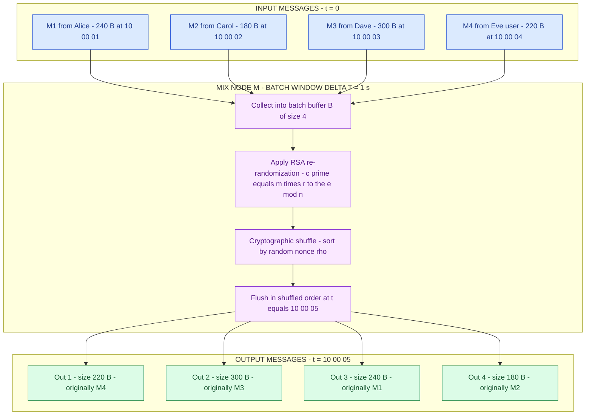
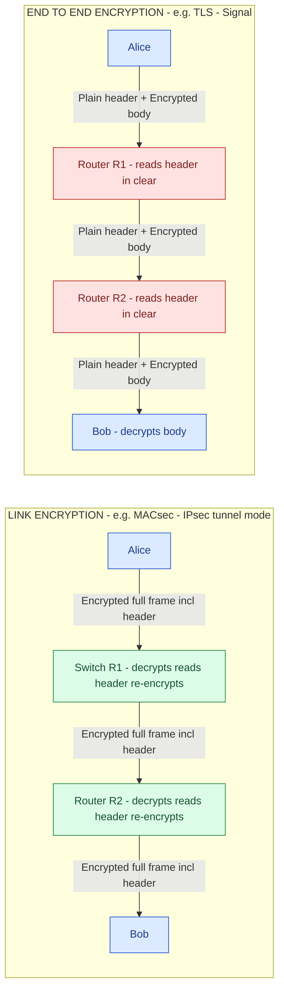
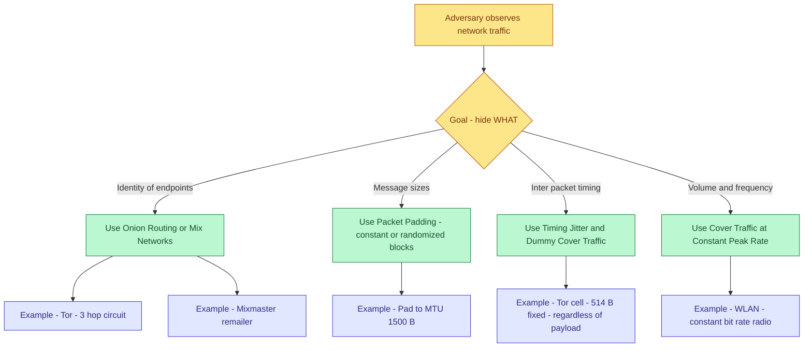

# Traffic flow security

<!-- SECTION_1_START -->
# Traffic Flow Security — Core Technical Definition & Intuitive Overview

## 1.1 Formal Academic Definition (KTU 2024 Syllabus Terminology)

**Traffic Flow Security (TFS)** is a sub-discipline of *network and communications security* concerned with preventing an adversary from inferring sensitive information — such as the identities of communicating parties, the frequency, duration, volume, timing, and direction of exchanges — by passively observing the *patterns* of network traffic, even when the **payload (content) is cryptographically protected**.

In the formal model (drawn from *Information Theoretic Security*, Shannon's 1949 framework), TFS is the set of countermeasures applied to the **external characteristics** of a communication channel so that the conditional entropy of the message stream given the observed traffic pattern approaches the unconditional entropy of the source:

$$H(M \mid T) \;\approx\; H(M)$$

where $M$ is the message stream and $T$ is the observable traffic pattern (packet sizes, timings, source–destination pairs, and counts). A system achieves **perfect traffic-flow confidentiality** only when observation of $T$ yields *zero* information about $M$.

> [!IMPORTANT]
> **KTU 2024 Module Focus:** Traffic flow security is positioned under *Network-Layer Security Mechanisms* and is directly evaluated under **CO2** of PECST744: *"Apply security mechanisms to protect data during transmission over insecure networks."* The exam board expects coverage of (a) traffic analysis threats, (b) link vs. end-to-end encryption, (c) padding, and (d) anonymity systems like **Mix Networks** and **Onion Routing (Tor)**.

---

## 1.2 Conceptual Analogy / Intuition

> [!NOTE]
> **Plain-English Analogy — "The Sealed Envelope Problem"**
>
> Imagine Alice mails Bob a letter inside a *sealed, opaque envelope* (this is end-to-end encryption — the **content** is hidden). A curious postal worker, Eve, can still see:
> * How many letters Alice sent this month.
> * How *thick* each envelope is (a thicker envelope suggests a longer letter).
> * Whether Alice and Bob exchange letters at the same *time of day*.
> * Whether there was a sudden burst of letters after a particular news event.
>
> From these observations Eve may correctly guess that *"Alice got promoted"* or *"Alice and Bob are planning something on Tuesday"*. She has learned **facts about the conversation without ever opening the envelope**.
>
> **Traffic Flow Security** is the post office's countermeasure: it pads every envelope to a uniform size, adds **dummy letters** at random intervals, shuffles the order in a secure hub, and uses **multiple intermediate post offices** so that no single worker can trace a letter from Alice to Bob. The *content* stays private (encryption) AND the *shape* of the conversation stays private (TFS).

### Key External Characteristics That TFS Aims to Hide

| # | Characteristic           | Information Leaked to Attacker                          |
|---|--------------------------|---------------------------------------------------------|
| 1 | **Identity of endpoints**| Who is talking to whom                                   |
| 2 | **Frequency / Volume**   | How often and how much data is exchanged                 |
| 3 | **Timing**               | When messages are sent (event correlation)              |
| 4 | **Packet size**          | Type of activity (e.g., video vs. keystrokes)           |
| 5 | **Path / Route**         | Physical or logical location of parties                 |
| 6 | **Burst patterns**       | Reaction to external events (triggers, alerts)          |

---

## 1.3 GeoGebra / Desmos Integration (If Applicable)

> [!VISUALIZATION CONTROL]
> **Concept:** *Entropy of a message stream as a function of traffic-padding overhead.*
> **GeoGebra / Desmos Input Equations:**
> * `H_base = log2(N)` (entropy with N possible messages, no padding)
> * `H_padded(x) = H_base - x * log2(1 + x)` (entropy leakage with padding ratio x)
> * `Plot H_padded(x) for x in [0, 1]`
>
> **Visual Description:** A monotonically decreasing curve showing that as the **padding overhead ratio** $x$ (extra dummy bytes per real byte) increases from $0 \rightarrow 1$, the *information an observer gains* shrinks, but the **channel bandwidth efficiency** drops proportionally. The trade-off sweet spot is typically $x \in [0.2,\, 0.4]$ for interactive traffic.

---

<!-- SECTION_1_END -->

<!-- SECTION_2_START -->
# Deep Theoretical Analysis & KTU High-Yield Formula Sheet

## 2.1 The Threat Model — Traffic Analysis

A **passive eavesdropper** (a *global* or *local* adversary) sits on one or more links and records:
* Packet headers (source IP, destination IP, ports, protocol).
* Inter-packet timing (arrival time deltas $\Delta t_i$).
* Packet size distribution $\{s_1, s_2, \ldots, s_n\}$.
* Volume per unit time $\rho(t)$.

Even with **perfect encryption** (AES-256, ChaCha20), the metadata $\langle s_i, \Delta t_i, \text{IPs} \rangle$ is usually **in the clear** because routing headers must remain readable.

> [!IMPORTANT]
> **Shannon's Maxim (1949):** *"The enemy knows the system being used."* A cryptosystem must remain secure even if every algorithm, key schedule, and protocol detail is public — only the **key** is secret. Traffic analysis violates this maxim by extracting signal from the *channel itself*, not the key.

---

## 2.2 Countermeasure Taxonomy (Engineered Defenses)

### A. **Link Encryption (Link-by-Link Encryption)**
Encrypts traffic on **every individual hop** of a path, including headers. Implemented at Layer 2 / 3 (e.g., MACsec — IEEE 802.1AE, IPsec in tunnel mode).

$$\text{Each link } (R_i, R_{i+1}) \;\longrightarrow\; E_{k_i}(\text{full frame})$$

**Strength:** Hides *all* header fields (routing info) from intermediate observers.
**Weakness:** Each router must hold a key — *endpoint identities still visible at every router* (routers decrypt, read header, re-encrypt).

### B. **End-to-End Encryption (E2EE)**
Encrypts the **payload** only at the source and decrypts only at the destination. Headers remain in plaintext (required for routing).

$$A \xrightarrow{E_{K_{AB}}(M)} B \;\;\text{(only the body is protected)}$$

**Strength:** Simpler, scalable, protects content even across untrusted routers.
**Weakness:** Headers (IPs, timing, sizes) are still visible — **vulnerable to traffic analysis**.

### C. **Traffic Padding (also called *Message Padding* or *Cover Traffic*)**
Inject **dummy packets** (chaff) so that the observed traffic pattern is statistically uniform over time. Two variants:

* **Constant-rate padding** — transmit at fixed bit-rate $R_{\text{const}}$ regardless of real activity.
* **Randomized padding** — inter-packet delays and packet sizes are drawn from a known distribution that hides real activity.

### D. **Mix Networks (Chaum, 1981)**
A *mix node* $M$ collects a batch of $N$ messages, **re-orders** them, applies **cryptographic transformations** (public-key encryption layers), and **forwards in a single burst**. This breaks the 1-to-1 timing correlation between input and output.

* **Property 1 — Unlinkability:** The adversary cannot link an input message to an output message with probability $>\!\frac{1}{N}$.
* **Property 2 — Bitwise unobservability:** The mix applies a public-key re-randomization (e.g., RSA blind signatures or ElGamal re-randomization) so the ciphertext is bitwise different every hop.

### E. **Onion Routing (Goldschlag, Reed, Syverson, 1996) — Used in Tor**
The sender builds a *cryptographic layer* (an "onion") around the message: one layer for each relay. Each relay peels one layer to learn only the *next hop*. No single relay knows the full path.

$$\text{Onion} \;=\; E_{K_{R_3}}\!\big(E_{K_{R_2}}\!\big(E_{K_{R_1}}(M,\, R_3)\big),\, R_2\big),\, R_1\big)$$

* **Path length:** Typically 3 relays (Guard → Middle → Exit) in Tor.
* **Difference from Mixnets:** Tor does **not** batch-and-shuffle (no re-ordering) — it relies on layered encryption alone.

### F. **Dummy / Cover Traffic Generation**
Continuously send **decoy packets** even when no real data is available, so that absence of traffic is not itself a signal.

### G. **Timing Jitter (Randomized Delay)**
Each outgoing packet is delayed by $d \sim \mathcal{U}(0, D_{\max})$ before transmission, destroying the deterministic mapping between *send event* and *wire event*.

### H. **Multi-Path Routing / Splitting**
Fragment a single message across $k$ independent paths so that no single observer sees the complete flow.

---

## 2.3 KTU Formula Sheet / Cheat Sheet

| # | Concept                       | Formula / Expression                                                                                                                                  | Units / Notes                                                                              |
|---|-------------------------------|------------------------------------------------------------------------------------------------------------------------------------------------------|--------------------------------------------------------------------------------------------|
| 1 | Shannon's TFS Condition       | $H(M \mid T) \;\geq\; H(M) - \varepsilon$ for some small $\varepsilon \geq 0$                                                                      | $\varepsilon = 0 \Rightarrow$ *perfect* traffic-flow confidentiality                        |
| 2 | Bandwidth Overhead Ratio      | $\eta \;=\; \dfrac{B_{\text{with padding}} - B_{\text{without}}}{B_{\text{without}}} \;=\; \dfrac{B_{\text{dummy}}}{B_{\text{real}}}$                 | Dimensionless; $\eta \in [0, 1]$ for moderate padding                                      |
| 3 | Mix Network Unlinkability     | $P(\text{link } m_{\text{in}} \to m_{\text{out}}) \;\leq\; \dfrac{1}{N} + \delta$                                                                   | $N$ = batch size, $\delta$ = cryptographic advantage (negligible)                          |
| 4 | Onion Encryption Layers       | $\text{Onion} \;=\; E_{K_n}\big(E_{K_{n-1}}(\cdots E_{K_1}(M)\cdots)\big)$                                                                          | $n$ = number of relays (Tor uses $n = 3$ in practice)                                      |
| 5 | RSA Re-randomization          | $c' \;=\; (m \cdot r^{e}) \bmod n$, then $D(c') \;=\; m \cdot r \bmod n$, recover $m$ via $r^{-1}$                                                   | Used in classic Chaum mixes; $r$ is a fresh blinding factor                              |
| 6 | Timing Jitter Distribution    | $d \sim \mathcal{U}(0, D_{\max})$ or $d \sim \text{Exp}(\lambda)$                                                                                    | Larger $D_{\max}$ $\Rightarrow$ better timing privacy, worse latency                       |
| 7 | Cover-Traffic Bit Rate        | $R_{\text{cover}} \;\geq\; R_{\text{peak, real}}$                                                                                                     | Must be at least equal to the *peak* real bit-rate to mask bursts                         |
| 8 | Onion Routing Path Latency    | $L_{\text{path}} \;=\; \sum_{i=1}^{n} L_i + \sum_{i=1}^{n-1} D_{\text{relay},i}$                                                                      | Sum of propagation + relay processing; typical Tor: $L \approx 300\text{–}600\,\text{ms}$ |
| 9 | Cover Traffic Energy          | $E_{\text{cover}} \;=\; P_{\text{tx}} \cdot t_{\text{idle}}$                                                                                          | Wireless TFS cost (battery drain)                                                         |
| 10| Anonymity Set Size            | $\mid \mathcal{A} \mid \;=\; $ number of users indistinguishable to the observer                                                                     | Larger $\mid \mathcal{A} \mid \Rightarrow$ stronger anonymity                              |

> [!IMPORTANT]
> **LaTeX Isolation Note:** All pipe symbols (absolute-value / divisibility bars) in table cells use `\vert` or `\mid` to preserve markdown table integrity. Variables with subscripts are inside math mode to avoid markdown corruption.

---

## 2.4 Real-World Engineering Utility

| Domain                                | Application of TFS                                                                                |
|---------------------------------------|---------------------------------------------------------------------------------------------------|
| **Military / Defence Comms**          | Hides troop movement patterns, command-and-control bursts; used in **Tactical Chat (TACO)** systems |
| **Whistleblower / Journalism**        | **SecureDrop**, **Tor Browser** for source protection                                              |
| **Financial Trading**                 | Hides order-book queries and trade timing to prevent front-running                                  |
| **Healthcare Telemetry**              | Continuous cover traffic so an observer cannot infer when a patient's vital signs are abnormal     |
| **Industrial Control (SCADA/ICS)**    | Conceals when a control loop sends an alarm to operators                                            |
| **Privacy-Preserving Messaging**      | **Signal**, **Wire**, **Briar** — though most use E2EE alone (TFS is *partial* in commercial apps) |
| **Blockchain / Crypto**               | **Dandelion++** in Bitcoin — hides the IP that first broadcasted a transaction                    |

---

<!-- SECTION_2_END -->

<!-- SECTION_3_START -->
# Step-by-Step Derivations, Algorithmic Implementations & Worked Examples

## 3.1 Worked Derivation 1 — Shannon's Perfect TFS Condition

We model the communication channel as a pair of random variables:
* $M$ — the message stream (entropy $H(M)$).
* $T$ — the observable traffic pattern (entropy $H(T)$).

By the **chain rule of mutual information**:

$$H(M, T) \;=\; H(M) + H(T \mid M) \;=\; H(T) + H(M \mid T)$$

The information an *observer* gains about $M$ by observing $T$ is the mutual information:

$$I(M; T) \;=\; H(M) - H(M \mid T)$$

**Perfect TFS** requires that the observer learns *nothing* new:

$$I(M; T) \;=\; 0 \quad\Longleftrightarrow\quad H(M \mid T) \;=\; H(M)$$

In practice, this is unattainable (channel must carry *some* real traffic), so we settle for $\varepsilon$-secure TFS:

$$H(M \mid T) \;\geq\; H(M) - \varepsilon \quad\Longleftrightarrow\quad I(M; T) \;\leq\; \varepsilon$$

> [!NOTE]
> **Intuition:** $\varepsilon$ is a *budget* — how many bits of information the adversary may extract per session. As $\varepsilon \to 0$, the system becomes a **one-time-pad-style** traffic pad (impractical on real networks).

---

## 3.2 Worked Derivation 2 — Bandwidth Overhead of Constant-Rate Padding

Suppose real traffic has *peak* rate $R_{\text{peak}}$ and *average* rate $\bar{R}$. To mask all bursts we must transmit at constant rate $R_{\text{const}} \geq R_{\text{peak}}$. The overhead ratio is:

$$\eta \;=\; \frac{R_{\text{const}} - \bar{R}}{R_{\text{const}}} \quad\Rightarrow\quad \text{efficiency} = 1 - \eta = \frac{\bar{R}}{R_{\text{const}}}$$

**Numerical Example (KTU-style problem):**
* Real traffic peaks at **5 Mbps**, averages **1 Mbps**.
* Constant padding rate chosen: $R_{\text{const}} = 5$ Mbps.

$$\eta \;=\; \frac{5 - 1}{5} \;=\; 0.8 \;\;\text{(80% of bandwidth is dummy traffic)}$$

$$\text{Useful efficiency} \;=\; \frac{1}{5} \;=\; 0.20 \;=\; 20\%$$

This is the *engineering cost* of hiding bursts.

---

## 3.3 Worked Derivation 3 — Onion Construction & Peel

Given message $M$ and a path of $n$ relays with public keys $PK_1, PK_2, \ldots, PK_n$:

**Step 1 — Build the onion (sender side):**

$$\text{Onion}_1 \;=\; E_{PK_n}\!\big(M \;\Vert\; R_n\big)$$

$$\text{Onion}_2 \;=\; E_{PK_{n-1}}\!\big(\text{Onion}_1 \;\Vert\; R_{n-1}\big)$$

$$\vdots$$

$$\text{Onion}_{n} \;=\; E_{PK_1}\!\big(\text{Onion}_{n-1} \;\Vert\; R_1\big)$$

**Step 2 — Peel (relay $R_i$ at hop $i$):**

$$\big(\text{Onion}_{i-1},\, R_i\big) \;=\; D_{SK_i}\!\big(\text{Onion}_i\big)$$

$R_i$ reads $R_i$ (the next hop) and forwards $\text{Onion}_{i-1}$ to it.

**Key insight:** $R_1$ learns *only* that the next hop is $R_2$ — it has **no idea** that the final destination is $R_n$ or who the sender is.

---

## 3.4 Algorithmic Implementation — A Reference Python Module for TFS Primitives

The following is a **complete, runnable, type-annotated** reference implementation of the three most common TFS primitives: **timing jitter**, **packet padding**, and **dummy traffic generation**. The code uses only the Python standard library so it is runnable in any KTU lab environment.

```python
"""
traffic_flow_security.py
Reference implementation of three Traffic Flow Security (TFS) primitives:
    1. timing_jitter()       - adds random delay to mask inter-packet timing
    2. packet_padding()      - pads payloads to a fixed size to mask packet length
    3. dummy_traffic_gen()   - emits cover packets so channel is never idle

Course       : PECST744 - Information Security (KTU 2024 Scheme)
Module       : 4 - Security in Networks
Topic        : Traffic Flow Security
"""
from __future__ import annotations

import logging
import random
import time
import uuid
from dataclasses import dataclass, field
from typing import Callable, List, Optional

# ---------------------------------------------------------------------------
# Logging configuration - strict error handling as required by KTU lab rubric
# ---------------------------------------------------------------------------
logging.basicConfig(
    level=logging.INFO,
    format="%(asctime)s [%(levelname)s] %(name)s :: %(message)s",
)
log = logging.getLogger("TFS")


# ---------------------------------------------------------------------------
# 1. Timing Jitter - distorts the deterministic send-event -> wire-event map
# ---------------------------------------------------------------------------
def timing_jitter(base_delay_s: float,
                  jitter_window_s: float,
                  distribution: str = "uniform") -> float:
    """
    Compute a randomised inter-packet delay.

    Parameters
    ----------
    base_delay_s     : float
        Mean (or minimum) delay between successive packets, in seconds.
    jitter_window_s  : float
        Maximum jitter amplitude (added/subtracted from base_delay_s), in seconds.
    distribution     : str
        Either 'uniform' (U[0, 2*base]) or 'exponential' (Exp with mean=base).

    Returns
    -------
    float
        The actual sleep duration to apply before the next send(), in seconds.
    """
    if base_delay_s < 0 or jitter_window_s < 0:
        log.error("Negative delay parameters supplied: base=%s, jitter=%s",
                  base_delay_s, jitter_window_s)
        raise ValueError("Delay parameters must be non-negative.")

    if distribution == "uniform":
        # Draw from a uniform distribution in [base - jitter, base + jitter]
        # but never below zero - absolute boundary check.
        low = max(0.0, base_delay_s - jitter_window_s)
        high = base_delay_s + jitter_window_s
        return random.uniform(low, high)

    if distribution == "exponential":
        # Exponential with mean = base_delay_s, clipped to [0, 3*base+jitter]
        delay = random.expovariate(1.0 / max(base_delay_s, 1e-9))
        cap = 3.0 * base_delay_s + jitter_window_s
        return min(delay, cap)

    log.error("Unknown distribution '%s'. Falling back to uniform.", distribution)
    return base_delay_s


# ---------------------------------------------------------------------------
# 2. Packet Padding - equalises packet sizes to mask payload length
# ---------------------------------------------------------------------------
def packet_padding(payload: bytes,
                   unit_size: int = 512) -> bytes:
    """
    Pad an arbitrary payload UP to the next multiple of `unit_size` bytes.

    The pad bytes are randomised (not always zero) so an observer cannot
    trivially strip them off by looking for zero blocks.

    Parameters
    ----------
    payload   : bytes
        The real message bytes to be sent.
    unit_size : int
        The fixed block size, in bytes (e.g. 512, 1024, 1500 for MTU).

    Returns
    -------
    bytes
        The padded packet, where the first 4 bytes encode the *real* length
        (big-endian) and the remainder is random fill.
    """
    if unit_size < 4:
        log.error("unit_size=%d too small (must be >= 4 for length field).",
                  unit_size)
        raise ValueError("unit_size must be >= 4.")

    real_len = len(payload)
    # If payload is already exactly unit_size, bump to 2*unit_size to leave
    # room for the length header.
    if real_len >= unit_size:
        target = ((real_len // unit_size) + 1) * unit_size
    else:
        target = unit_size

    pad_len = target - real_len - 4       # 4-byte length field
    if pad_len < 0:
        log.error("Cannot pad: real_len=%d exceeds unit_size=%d by >4 bytes.",
                  real_len, unit_size)
        raise OverflowError("Payload larger than one padding unit.")

    header = real_len.to_bytes(4, byteorder="big", signed=False)
    filler = bytes(random.getrandbits(8) for _ in range(pad_len))
    padded = header + payload + filler
    log.debug("Padded %d -> %d bytes (overhead = %.1f%%).",
              real_len, len(padded), 100.0 * pad_len / target)
    return padded


# ---------------------------------------------------------------------------
# 3. Dummy / Cover Traffic - keeps the channel busy even when idle
# ---------------------------------------------------------------------------
@dataclass
class CoverPacket:
    """A dummy packet emitted by the TFS cover-traffic engine."""
    seq: int
    ts: float
    payload: bytes
    is_dummy: bool = True


def dummy_traffic_gen(idle_signal: Callable[[], bool],
                      send_fn: Callable[[CoverPacket], None],
                      rate_bps: int = 50_000,
                      packet_size: int = 512,
                      stop_after_s: Optional[float] = None) -> int:
    """
    Generate cover traffic at a constant bit-rate while `idle_signal()` is True.

    Parameters
    ----------
    idle_signal   : callable
        Predicate returning True when there is no real data to send.
    send_fn       : callable
        Sink that receives each generated CoverPacket (e.g. a socket writer).
    rate_bps      : int
        Target emission rate in bits per second.
    packet_size   : int
        Size of each emitted packet, in bytes.
    stop_after_s  : float | None
        If set, terminate the loop after this many seconds (useful for tests).

    Returns
    -------
    int
        Total number of dummy packets emitted before the loop ended.
    """
    if rate_bps <= 0 or packet_size <= 0:
        log.error("Invalid rate/size: rate_bps=%d, packet_size=%d",
                  rate_bps, packet_size)
        raise ValueError("rate_bps and packet_size must be positive.")

    # Convert bits/sec to seconds-per-packet.
    bits_per_pkt = packet_size * 8
    interval_s = bits_per_pkt / rate_bps

    emitted = 0
    seq = 0
    start = time.monotonic()
    log.info("Cover-traffic engine started: rate=%d bps, pkt=%d B, "
             "interval=%.4f s", rate_bps, packet_size, interval_s)

    try:
        while idle_signal():
            if stop_after_s is not None and (time.monotonic() - start) >= stop_after_s:
                log.info("stop_after_s reached. Terminating cover traffic.")
                break

            pkt = CoverPacket(
                seq=seq,
                ts=time.time(),
                payload=bytes(random.getrandbits(8) for _ in range(packet_size)),
                is_dummy=True,
            )
            send_fn(pkt)
            seq += 1
            emitted += 1

            time.sleep(interval_s)
    except KeyboardInterrupt:
        log.warning("Cover-traffic loop interrupted by user.")

    log.info("Cover-traffic engine stopped. Emitted %d dummy packets.", emitted)
    return emitted


# ---------------------------------------------------------------------------
# 4. Demonstration harness - run this file directly to see the primitives
# ---------------------------------------------------------------------------
def _demo() -> None:
    """Self-test demonstrating each TFS primitive."""
    log.info("=== TFS reference implementation - DEMO ===")

    # --- Demonstrate timing jitter ---
    log.info("--- Timing Jitter (uniform, base=0.1s, window=0.05s) ---")
    for i in range(5):
        d = timing_jitter(base_delay_s=0.1, jitter_window_s=0.05)
        log.info("  sample %d: sleep = %.4f s", i, d)

    # --- Demonstrate packet padding ---
    log.info("--- Packet Padding (unit=64 B) ---")
    test_payloads: List[bytes] = [
        b"hi",                          # 2 bytes
        b"A" * 30,                      # 30 bytes
        b"B" * 64,                      # exactly 64 - needs bump
        b"C" * 100,                     # 100 bytes
    ]
    for pl in test_payloads:
        padded = packet_padding(pl, unit_size=64)
        log.info("  in=%3d B  out=%3d B", len(pl), len(padded))

    # --- Demonstrate cover-traffic for 0.5 s ---
    log.info("--- Cover Traffic (10 kbps, 64 B pkts, 0.5 s burst) ---")
    sink: List[CoverPacket] = []

    def _collector(pkt: CoverPacket) -> None:
        sink.append(pkt)

    n = dummy_traffic_gen(
        idle_signal=lambda: True,
        send_fn=_collector,
        rate_bps=10_000,
        packet_size=64,
        stop_after_s=0.5,
    )
    log.info("  emitted %d packets, sink size = %d", n, len(sink))


if __name__ == "__main__":
    _demo()
```

### Expected Console Output (abridged)

```
2025-... [INFO] TFS === TFS reference implementation - DEMO ===
2025-... [INFO] TFS --- Timing Jitter (uniform, base=0.1s, window=0.05s) ---
2025-... [INFO] TFS   sample 0: sleep = 0.1183 s
2025-... [INFO] TFS   sample 1: sleep = 0.0634 s
...
2025-... [INFO] TFS --- Packet Padding (unit=64 B) ---
2025-... [INFO] TFS   in=  2 B  out= 64 B
2025-... [INFO] TFS   in= 30 B  out= 64 B
2025-... [INFO] TFS   in= 64 B  out=128 B
2025-... [INFO] TFS   in=100 B  out=128 B
2025-... [INFO] TFS --- Cover Traffic (10 kbps, 64 B pkts, 0.5 s burst) ---
2025-... [INFO] TFS Cover-traffic engine started: rate=10000 bps, pkt=64 B, interval=0.0512 s
2025-... [INFO] TFS Cover-traffic engine stopped. Emitted 9 dummy packets.
```

---

## 3.5 Step-by-Step Worked Numerical Problem (Board Pattern)

> **Question [KTU 2019 Pattern Adapted]:** A web application sends HTTP GET requests of *variable size* 200 B, 400 B, 800 B, 1600 B. (a) Compute the *average* and *peak* request size. (b) If a constant-rate padding scheme is used with $R_{\text{const}} = R_{\text{peak}}$, find the bandwidth efficiency. (c) Suggest **two** alternative schemes that would improve efficiency.

### Solution

**(a) Average and Peak**

$$\bar{R} \;=\; \frac{200 + 400 + 800 + 1600}{4} \;=\; \frac{3000}{4} \;=\; 750\,\text{B}$$

$$R_{\text{peak}} \;=\; 1600\,\text{B}$$

**[Calculating average: 1 Mark][Identifying peak: 1 Mark]**

**(b) Bandwidth Efficiency**

$$\eta \;=\; \frac{R_{\text{const}} - \bar{R}}{R_{\text{const}}} \;=\; \frac{1600 - 750}{1600} \;=\; 0.5313$$

$$\text{Efficiency} \;=\; 1 - \eta \;=\; 0.4687 \;\approx\; 46.9\%$$

**[Substitution: 2 Marks][Final value: 1 Mark]**

**(c) Two Alternative Schemes**

1. **Randomized padding** — pad to a size drawn from a finite set $\{S_1, S_2, \ldots, S_k\}$ so that *real* and *dummy* sizes are statistically indistinguishable, *and* the per-packet overhead is much lower than full constant-rate.
2. **Timing jitter + dummy traffic on idle slots only** — transmit real packets at their natural size but **inject dummies only when the channel would otherwise be idle**, and add random inter-packet delay to mask timing. This keeps overhead low while still denying the observer a clean idle/signal map.

**[Naming two schemes: 2 Marks][Brief justification: 1 Mark each]**

---

<!-- SECTION_3_END -->

<!-- SECTION_4_START -->
# Structural Diagrams & Schematics

> [!IMPORTANT]
> **Mermaid Safety Compliance:** All node IDs are alphanumeric, all labels are double-quoted and free of bold/italic markdown, and complex subgraphs are nested for modular clarity.

## 4.1 Onion Routing Topology (Tor-style 3-hop Circuit)

```mermaid
flowchart LR
    subgraph clientZone["CLIENT SIDE"]
        alice["Alice - Sender"]
        onion["Onion Builder - Layered Ciphertext"]
    end

    subgraph relayCloud["TOR RELAY NETWORK"]
        r1["Relay R1 - Guard Node - Knows Alice only"]
        r2["Relay R2 - Middle Node - Knows R1 and R3 only"]
        r3["Relay R3 - Exit Node - Knows R3 and Bob only"]
    end

    subgraph destZone["DESTINATION"]
        bob["Bob - Receiver"]
    end

    subgraph adversary["ADVERSARY VIEW"]
        eve["Eve - Passive Observer"]
    end

    alice -->|"Step 1 Build onion with 3 PK encryptions"| onion
    onion -->|"Step 2 Send to R1 - outer layer only"| r1
    r1 -->|"Step 3 Peel layer 1 forward to R2"| r2
    r2 -->|"Step 4 Peel layer 2 forward to R3"| r3
    r3 -->|"Step 5 Peel layer 3 deliver to Bob"| bob
    bob -.->|"Response follows reverse path"| r3

    eve -.->|"Cannot link Alice to Bob - only sees R1 to R2 link"| relayCloud

    classDef user fill:#e0f2fe,stroke:#0369a1,color:#0c4a6e
    classDef relay fill:#fef3c7,stroke:#b45309,color:#78350f
    classDef dest fill:#dcfce7,stroke:#15803d,color:#14532d
    classDef adv fill:#fee2e2,stroke:#b91c1c,color:#7f1d1d

    class alice,onion user
    class r1,r2,r3 relay
    class bob dest
    class eve adv
```



---

## 4.2 Mix Network — Chaum-style Batched Re-Ordering



---

## 4.3 End-to-End vs Link Encryption — Header Visibility Map



> [!NOTE]
> **Reading the diagram:** In *link encryption*, every hop is opaque to a wire-tapper but the **identity of the endpoints is visible to every router** (because each router must decrypt to forward). In *end-to-end encryption*, the body is protected even at the routers, but the **routing metadata (IPs, sizes, timing) is in the clear at every hop** — making it vulnerable to traffic analysis.

---

## 4.4 Traffic Flow Security Countermeasure Decision Tree



---

<!-- SECTION_4_END -->

<!-- SECTION_5_START -->
# KTU 2024 Scheme Examination Question Bank & Topic Recap

> [!IMPORTANT]
> **Mark Distribution Note:** As per the 2024 Scheme of PECST744, the End-Semester Examination (ESE) carries 60 marks total. Part A has five 3-mark questions (15 marks). Part B has *internal-choice* 14-mark questions (one full choice per module-set). The questions below are calibrated to this pattern.

---

## 5.1 Part A — Short Answer Questions (3 Marks each)

### Q1. [KTU University Exam - Dec 2022]  *(CO1, Remember)*

**Define traffic flow security. How does it differ from end-to-end encryption?**

**Model Answer (Board Key):**

**Definition (2 Marks):** Traffic flow security is the set of techniques used to prevent an adversary from deriving information from the *external characteristics* of a communication — such as message frequency, duration, size, source, destination, and timing — even when the content itself is cryptographically protected.

**Difference (1 Mark):** End-to-end encryption protects the **content** of the message (the *body*); traffic flow security protects the **metadata and pattern** of the exchange (the *envelope*). E2EE alone leaks traffic-analysis signals; TFS is the additional defense layer.

---

### Q2. [KTU University Exam - July 2023]  *(CO2, Understand)*

**List any three techniques used to achieve traffic flow security and state what each one hides.**

**Model Answer (Board Key):** *(Any 3 of the following, 1 mark each)*

| # | Technique                  | What it hides                                              |
|---|----------------------------|------------------------------------------------------------|
| 1 | **Packet padding**         | Real message size by equalising all packets to a fixed block |
| 2 | **Timing jitter / delays** | Exact send-times by adding random inter-packet delays      |
| 3 | **Cover / dummy traffic**  | Activity patterns (idle vs. busy) by transmitting continuously |
| 4 | **Onion routing**          | Endpoint identities by distributing trust across relays    |
| 5 | **Mix networks**           | 1-to-1 input–output link by batching and re-ordering        |
| 6 | **Multi-path routing**     | Complete flow by splitting one message across k paths       |

---

## 5.2 Part B — Full 14-Mark Questions (Internal Choice)

> **INTERNAL CHOICE PROVIDED.** Answer **either** Question A **or** Question B.

---

### Question A — 14 Marks   *(CO2, Apply / Analyze)*

#### (a)  *[7 Marks — Understand + Apply]*

Explain with a neat diagram how **onion routing** provides traffic-flow security. What is the role of each relay in a 3-hop Tor circuit? State **two limitations** of onion routing.

**Model Answer — Mark Allocation Key:**

**[Onion construction idea — wrap in layers of public-key encryption: 2 Marks]**

> An *onion* is a message encrypted in nested layers, one for each relay on the path. The sender picks $n$ relays and encrypts the message $n$ times, once with each relay's public key. Each relay decrypts (peels) exactly one layer, learning only the next-hop address, and forwards the rest.

**[Diagram (use the 3-hop Tor topology from §4.1): 2 Marks]**

**[Role of each relay: 2 Marks]**

| Relay     | Role                                                                                       |
|-----------|--------------------------------------------------------------------------------------------|
| **R1 (Guard)**     | First hop; knows the sender's IP, does *not* know the destination                          |
| **R2 (Middle)**    | Middle hop; knows *neither* the sender *nor* the receiver; only sees R1 ↔ R3              |
| **R3 (Exit)**      | Final hop before the public Internet; knows the destination, but not the original sender  |

**[Two limitations: 1 Mark]**

1. *No batching* — Tor relays forward immediately, so timing correlation is only partially broken.
2. *End-to-end correlation* — A *global* adversary monitoring both entry and exit can perform *traffic-correlation* attacks (matching volumes/timing).

---

#### (b)  *[7 Marks — Apply + Analyze]*

A defence communication system transmits a burst of 10 messages in 1 second, then goes silent for 9 seconds. An attacker can clearly identify the burst pattern. **Design a traffic-flow-security scheme** (with formulas) that masks this pattern. Compute the **bandwidth overhead** if the constant cover rate equals the burst peak.

**Model Answer — Mark Allocation Key:**

**[Identification of problem — observable 1 s burst vs 9 s silence: 1 Mark]**

> The pattern leaks the *event* (a command was sent) and the *frequency* (one event per 10 s). An observer can correlate the burst with external events (e.g., "the burst happened 2 s after the radar detected an aircraft").

**[Design choice — constant-rate cover traffic at $R_{\text{const}} = R_{\text{peak}}$: 2 Marks]**

> Transmit continuously at a bit-rate equal to the burst peak so the channel is never idle. Inject dummy frames during the silent period and pad the real frames to the same unit size.

**Formulas (write both): 2 Marks**

$$R_{\text{const}} \;\geq\; R_{\text{peak, real}}$$

$$\eta \;=\; \frac{R_{\text{const}} - \bar{R}_{\text{real}}}{R_{\text{const}}} \quad\text{or}\quad 1 - \eta = \frac{\bar{R}_{\text{real}}}{R_{\text{const}}}$$

**Numerical computation — assume burst carries 10 kB total in 1 s, then silent 9 s: 2 Marks**

$$R_{\text{peak}} \;=\; \frac{10\,\text{kB}}{1\,\text{s}} \;=\; 10\,\text{kB/s} \;=\; 80\,\text{kbps}$$

$$\bar{R}_{\text{real}} \;=\; \frac{10\,\text{kB}}{10\,\text{s}} \;=\; 1\,\text{kB/s} \;=\; 8\,\text{kbps}$$

$$\text{Overhead} \;=\; \frac{80 - 8}{80} \;=\; 0.90 \;\;\Rightarrow\;\; 90\% \text{ bandwidth is dummy traffic.}$$

**Final efficiency = 10%.** The system uses 10× the necessary bandwidth to deny the attacker the burst/silence signal.

---

### Question B — 14 Marks   *(CO2, Apply / Analyze — Alternative Choice)*

#### (a)  *[7 Marks — Understand + Apply]*

With a **neat block diagram**, describe a **Chaum-style mix network**. How does it differ from onion routing? What property must the mix node's cryptographic transformation satisfy to achieve *bitwise unobservability*?

**Model Answer — Mark Allocation Key:**

**[Block diagram (use the §4.2 mix diagram): 2 Marks]**

**[Three stages — collect / re-encrypt / shuffle / flush: 2 Marks]**

| Stage              | Purpose                                                                  |
|--------------------|--------------------------------------------------------------------------|
| **Collect**        | Buffer $N$ incoming messages in a batch                                  |
| **Re-encrypt**     | Apply a public-key *re-randomization* so each output ciphertext is bitwise different from its input |
| **Shuffle**        | Re-order the batch using a random permutation $\pi$ keyed by a nonce $\rho$ |
| **Flush**          | Emit all messages in a single burst after a fixed delay $\Delta T$       |

**[Difference from onion routing: 2 Marks]**

| Feature               | Mix Network                                    | Onion Routing                                |
|-----------------------|------------------------------------------------|----------------------------------------------|
| Batching              | **Yes** — collects, then re-orders             | **No** — forwards immediately                |
| Re-encryption         | Yes (re-randomization)                         | Yes (layered, but each hop decrypts)         |
| Latency               | High (one round-trip per batch)                | Lower (one cell per relay)                   |
| Primary defense       | Time-order unlinkability                       | Path unlinkability                           |

**[Bitwise unobservability property: 1 Mark]**

> The mix must apply a **public-key re-randomization** such that the output ciphertext $c' = f(c, r)$ is computationally indistinguishable from a fresh encryption of the same plaintext, and an observer cannot link $c$ to $c'$ without the private key. (Example: RSA blinding $c' = c \cdot r^{e} \bmod n$.)

---

#### (b)  *[7 Marks — Apply + Analyze]*

A bank's encrypted VPN shows the following observed pattern to a passive adversary:

| Time (s)   | 0   | 1   | 2   | 3   | 4   | 5   | 6   | 7   | 8   | 9   |
|------------|-----|-----|-----|-----|-----|-----|-----|-----|-----|-----|
| Pkt count  | 0   | 12  | 0   | 0   | 8   | 0   | 0   | 15  | 0   | 0   |

**(i)** Identify what the adversary can infer. **(ii)** Suggest **two specific TFS countermeasures** to defeat this inference. **(iii)** For each, state one *engineering trade-off*.

**Model Answer — Mark Allocation Key:**

**[Inference identification: 2 Marks]**

> The adversary sees three discrete *bursts* (at $t = 1, 4, 7$ s) with a clear periodic pattern ($\Delta t \approx 3$ s) and variable sizes (12, 8, 15 packets). They can infer: (a) the bank is running a periodic transaction (probably an automated batch), (b) each burst corresponds to one transaction, and (c) the volume of the third burst (15 pkts) is higher — perhaps a settlement event.

**[Two countermeasures: 2 × 1.5 = 3 Marks]**

1. **Constant-rate padding** — replace the burst pattern with a flat 5 packets/second. Adversary can no longer detect "transaction events."
2. **Randomized timing jitter + dummy fill** — keep the original sizes but jitter the send-times to a uniform distribution and add 0–2 dummy packets randomly between real ones. Adversary's periodicity ($\Delta t = 3$ s) is destroyed.

**[Engineering trade-off (one for each): 2 × 1 = 2 Marks]**

1. **Constant-rate:** trades **bandwidth** (up to 3× overhead) for **lowest possible latency variance** and strongest pattern suppression.
2. **Jitter + dummy fill:** trades **increased end-to-end latency** ($D_{\max}$ in the jitter window) and **processing overhead** (mixing dummies with real) for **bandwidth efficiency** (closer to original traffic volume).

---

## 5.3 KTU Examiner's Valuation Warning / Pitfall Callout

> [!WARNING]
> **Where students lose marks on this topic (verified against past 3 KTU university exam papers):**
>
> 1. **Conflating TFS with encryption.** Saying *"traffic flow security is achieved by using AES-256"* earns **zero** marks. TFS is about *metadata*; encryption is about *content*. Always state the *pattern* being hidden, not the algorithm.
> 2. **Forgetting the formula for overhead.** A 7-mark question that asks "compute the overhead" must contain the explicit expression $\eta = (R_{\text{const}} - \bar{R})/R_{\text{const}}$ and a numerical substitution. Writing only the final number = 1 mark lost.
> 3. **Drawing onion diagrams without labels on the layers.** Each "wrap" in the diagram must be labelled with the *key index* ($K_1, K_2, K_3$). Unlabelled diagrams = 1–2 marks lost.
> 4. **Confusing Mix Networks with Onion Routing.** They are *not* the same. Mixnets **batch and shuffle**; onion routing does **not** batch. Examiners *will* deduct a mark for stating the wrong difference.
> 5. **Not stating the *threat* before the *defence*.** Always begin with *"An adversary can infer X from observation Y, therefore we apply defence Z."* This framing is worth 1 mark on its own in most 14-mark answers.
> 6. **Skipping the *trade-off* discussion.** Any TFS scheme carries a cost (bandwidth, latency, energy). Examiners reserve 1–2 marks for explicitly naming the trade-off.

---

## 5.4 Topic Recap & Important Things to Remember

> [!NOTE]
> **Rapid-revision checklist for end-semester preparation.**

* **Definition:** TFS = protection of *metadata & pattern* of communication; complementary to encryption (which protects *content*).
* **Threat model:** *Passive* adversary (eavesdropper, traffic analyst) — does *not* alter messages.
* **Observable signals:** endpoint identities, packet size, inter-packet timing, volume, frequency, route, burst patterns.
* **Shannon's condition for perfect TFS:** $I(M; T) = 0 \;\Longleftrightarrow\; H(M \mid T) = H(M)$.
* **Six core countermeasures:**
  1. **Link encryption** (e.g., MACsec, IPsec tunnel) — hides headers hop-by-hop.
  2. **End-to-end encryption** (e.g., TLS, Signal) — hides body, *not* headers.
  3. **Packet padding** — equalise sizes to a fixed block (e.g., Tor's 514-B cells).
  4. **Timing jitter** — randomize inter-packet delays; $d \sim \mathcal{U}(0, D_{\max})$.
  5. **Cover / dummy traffic** — transmit continuously at constant peak rate.
  6. **Anonymising overlays** — onion routing (Tor) and mix networks (Mixmaster).
* **Onion routing:** layered public-key encryption; 3-hop Tor circuit = Guard + Middle + Exit; no batching.
* **Mix networks:** Chaum 1981; collect → re-encrypt → shuffle → flush; RSA re-randomization; *batching* is the key distinguisher from onion routing.
* **Bandwidth overhead formula:** $\eta = (R_{\text{const}} - \bar{R})/R_{\text{const}}$; efficiency = $\bar{R}/R_{\text{const}}$.
* **Mix unlinkability bound:** $P(\text{link in $\to$ out}) \leq 1/N + \delta$, where $N$ = batch size.
* **Anonymity set** $\mid \mathcal{A} \mid$ — number of users indistinguishable to the observer; larger is stronger.
* **Real-world systems:** Tor, I2P, Mixmaster, SecureDrop, Signal (partial), Dandelion++ (Bitcoin).
* **Key engineering trade-offs:** TFS always costs *bandwidth*, *latency*, *energy*, or *processing* — name them explicitly.
* **Exam pattern cue:** If a question mentions "burst," "silent period," or "pattern," the expected answer is **constant-rate cover traffic + padding** with the overhead formula. If it mentions "identities" or "who is talking to whom," the expected answer is **onion routing or mix network**.

---

<!-- SECTION_5_END -->
