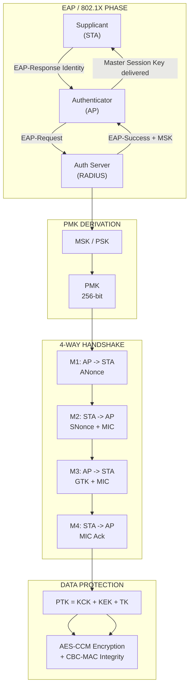
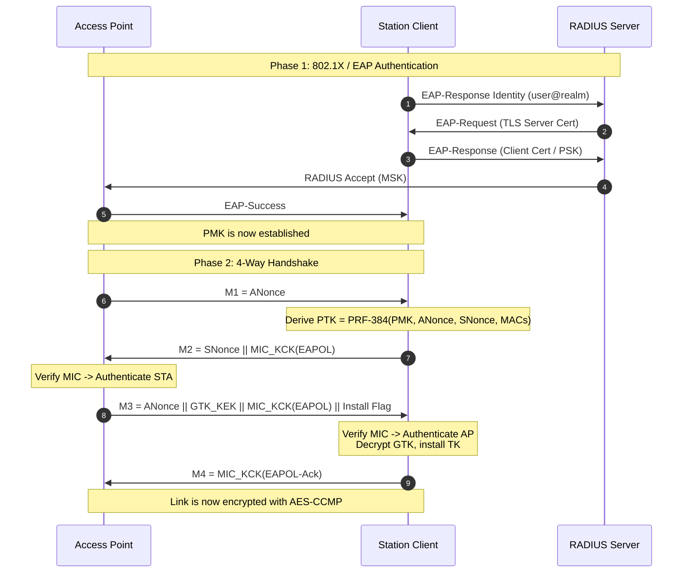
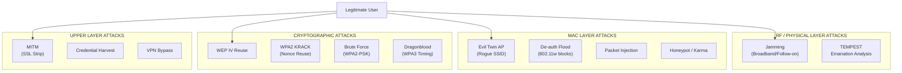

# Wireless Security

<!-- SECTION_1_START -->
# Wireless Security — Core Technical Definition & Intuitive Overview

## 📘 Formal Academic Definition (KTU 2024 Syllabus Aligned)

> [!IMPORTANT]
> **Wireless Security** is the discipline of protecting wireless communication networks (Wi-Fi, Bluetooth, Cellular, Satellite) from unauthorized access, eavesdropping, tampering, and denial-of-service attacks by applying cryptographic protocols, authentication mechanisms, access control policies, and signal-layer protections across the **OSI Physical, Data Link, and Network layers**.

In the **KTU 2024 Scheme PECST744 syllabus (Module 4)**, Wireless Security is positioned as the natural extension of wired network security into the radio-frequency (RF) domain, where the broadcast nature of the medium introduces threats absent in switched Ethernet environments.

---

## 🧠 Conceptual Analogy / Intuition

> [!NOTE]
> **The "Yelling in a Crowded Room" Analogy**
> Imagine you and a friend whispering in a quiet library (wired network) — only the two of you can hear. Now move that same conversation to a **packed cricket stadium** (wireless network) — every radio receiver within range is essentially "listening." Wireless Security is the set of techniques (language codes, handshakes, secret handshakes, scheduled meeting times) that ensure **only your friend understands what you say, knows it is really you speaking, and cannot be impersonated by a stranger.**

### Key Conceptual Pillars of Wireless Security

| Pillar | What It Protects | Example Mechanism |
|---|---|---|
| **Confidentiality** | Eavesdropping on transmitted frames | **AES-CCMP**, **GCMP-256** |
| **Integrity** | Frame tampering / bit-flipping | **MIC (Michael)**, **CBC-MAC** |
| **Authentication** | Rogue AP / impersonation | **802.1X / EAP-TLS**, **SAE** |
| **Availability** | Jamming / de-auth floods | **802.11w (Management Frame Protection)** |
| **Access Control** | Unauthorized association | **SSID hiding**, **MAC filtering** |

---

## 🌐 Taxonomy of Wireless Networks (KTU High-Yield Classification)

> [!TIP]
> Every wireless exam answer in KTU should begin by **classifying the network type**, because the threat model and the security solution differ drastically across them.

$$\text{Wireless Networks} = \begin{cases} \text{WPAN} & : \text{Bluetooth, ZigBee, NFC} \\ \text{WLAN} & : \text{Wi-Fi (IEEE 802.11 a/b/g/n/ac/ax/be)} \\ \text{WMAN} & : \text{WiMAX (IEEE 802.16)} \\ \text{WWAN} & : \text{4G LTE, 5G NR} \\ \text{Satellite} & : \text{GPS, VSAT} \end{cases}$$

> [!WARNING]
> **KTU Examiner's Pitfall:** Do NOT confuse **WEP (Wired Equivalent Privacy)** with **WPA (Wi-Fi Protected Access)**. WEP is the *broken* 1997 protocol; WPA was the *transitional* 2003 fix; **WPA2 (802.11i)** is the *mature* standard; **WPA3** is the *current* 2018+ standard.

---

## 🔍 Layered Threat Model in Wireless

$$\underbrace{\text{RF Layer}}_{\text{Jamming, Eavesdropping}} \rightarrow \underbrace{\text{MAC Layer}}_{\text{De-auth, Rogue AP}} \rightarrow \underbrace{\text{Network Layer}}_{\text{Man-in-the-Middle}} \rightarrow \underbrace{\text{App Layer}}_{\text{Credential Theft}}$$

> [!VISUALIZATION CONTROL]
> **Concept:** Wireless Network Security Perimeter
> **GeoGebra / Desmos Input Equations:**
> * Circle 1: `x^2 + y^2 = 4` (Wired Boundary — secure)
> * Circle 2: `x^2 + y^2 = 9` (Wireless Coverage — exposed to RF leakage)
> * Point A: `(0,0)` — Legitimate AP
> * Point E: `(2.5, 0)` — External Eavesdropper
> * Point R: `(-1.5, 1)` — Rogue AP
> **Visual Description:** The student should see a smaller inner circle (wired) fully contained inside a larger outer circle (wireless), with the eavesdropper and rogue AP sitting on the *outside* of the wired boundary but *inside* the wireless coverage — illustrating the expanded attack surface of wireless media.
<!-- SECTION_1_END -->

<!-- SECTION_2_START -->
# Deep Theoretical Analysis & KTU High-Yield Formula Sheet

## 📜 1. Evolution of Wi-Fi Security Protocols (The "Crypto Timeline")

> [!NOTE]
> KTU loves asking **chronology-based questions**. Memorize this chain in order:
>
> **WEP (1997) → WPA (2003) → WPA2 / IEEE 802.11i (2004) → WPA3 (2018)**

### 1.1 WEP — Wired Equivalent Privacy (1997, *Deprecated*)

WEP was the first attempt to provide confidentiality equal to a wired LAN. It used the **RC4 stream cipher** with a **24-bit IV (Initialization Vector)** and a shared 40-bit or 104-bit secret key.

**WEP Operational Steps:**
1. Compute **Integrity Check Value (ICV)** using **CRC-32** over the plaintext frame $M$.
2. Concatenate plaintext with ICV: $P = M \;\|\; \text{CRC32}(M)$.
3. Generate a **per-packet keystream** using RC4 with seed $\text{IV} \;\|\; K$.
4. Ciphertext: $C = P \oplus \text{RC4}(\text{IV} \;\|\; K)$.
5. Transmit: $\langle \text{IV}, C \rangle$.

**Why WEP Failed (KTU Favourite Question):**
- **IV Collision (Birthday Attack):** With only $2^{24} \approx 16.7$ million IVs, statistical reuse occurs within hours on a busy AP. Once two ciphertexts share an IV, the keystream is revealed: $C_1 \oplus C_2 = (P_1 \oplus K) \oplus (P_2 \oplus K) = P_1 \oplus P_2$.
- **Weak Key Scheduling in RC4:** The first 256 output bytes are statistically biased.
- **No Mutual Authentication** — only AP authenticates client (or vice versa), enabling rogue AP attacks.
- **CRC-32 is Linear**, allowing bit-flipping attacks to forge valid frames without the key.

### 1.2 WPA — Wi-Fi Protected Access (2003, *Transitional*)

WPA was a *stop-gap* that reused WEP hardware but added two critical features:
- **TKIP (Temporal Key Integrity Protocol)** — rotates keys per packet.
- **MIC (Michael)** — a 64-bit integrity code replacing CRC-32.

$$\text{TKIP Key Mix} = f(\text{Temporal Key},\; \text{TA MAC},\; \text{TSC})$$

Where **TSC = TKIP Sequence Counter** (48-bit, increments per packet).

### 1.3 WPA2 / IEEE 802.11i (2004, *Mature Standard*)

WPA2 mandates the **CCMP (Counter Mode with CBC-MAC Protocol)** based on the **AES-128 block cipher** in **CCM mode** (Counter with CBC-MAC).

**CCMP Encryption (Two AES Operations Per Frame):**

$$\boxed{C = \text{CTR}_{AES}(\text{TK},\; \text{Nonce},\; A,\; P)}$$

Where:
- $TK$ = Temporal Key (128-bit)
- $A$ = AAD (Additional Authenticated Data — includes MAC addresses)
- $P$ = Plaintext
- $C$ = Ciphertext + MIC

### 1.4 WPA3 (2018, *Current Standard*)

Key enhancements over WPA2:
- **SAE (Simultaneous Authentication of Equals)** — replaces the vulnerable 4-way handshake with a **Dragonfly Key Exchange** (a password-authenticated key exchange / PAKE).
- **Forward Secrecy** — compromising a password does not decrypt past sessions.
- **GCMP-256** — supports AES-256 in GCM mode for enterprise-grade deployments.
- **Protected Management Frames (PMF)** — mandatory in WPA3.

---

## 🔐 2. The IEEE 802.11i / WPA2 Architecture (KTU High-Yield)

> [!IMPORTANT]
> 802.11i defines a **two-layer cryptographic architecture** that the KTU 2024 syllabus explicitly tests.

$$\underbrace{\text{Master Key (MK)}}_{\text{PAKE / PSK source}} \rightarrow \underbrace{\text{PMK}}_{\text{Pairwise Master Key}} \rightarrow \underbrace{\text{PTK}}_{\text{Pairwise Transient Key}} \rightarrow \underbrace{\text{TK, KCK, KEK}}_{\text{Temporal, Confirmation, Encryption}}$$

### Key Hierarchy Derivation

| Level | Symbol | Size | Purpose |
|---|---|---|---|
| **Master Key** | $MK$ | 256-bit | Derived from PSK or 802.1X EAP |
| **Pairwise Master Key** | $PMK$ | 256-bit | $\text{PMK} = \text{HMAC-SHA1}(\text{PSK},\; \text{SSID},\; \text{len(SSID)})$ |
| **Pairwise Transient Key** | $PTK$ | 512-bit (TK + KCK + KEK) | Session-specific |
| **Group Temporal Key** | $GTK$ | 256-bit | For broadcast/multicast |

$$\text{PTK} = \text{PRF-384}(\text{PMK},\; \text{ANonce},\; \text{SNonce},\; \text{MAC}_{AP},\; \text{MAC}_{STA})$$

Where **PRF-384 = Pseudo-Random Function** outputting 384 bits for TK, 128 for KCK, 128 for KEK (total 640 bits in modern variants).

---

## 🛡️ 3. Authentication Mechanisms

### 3.1 PSK (Pre-Shared Key) Mode — For SOHO / Home
$$\text{PMK} = \text{PBKDF2}(\text{PSK},\; \text{SSID},\; 4096, dkLen=256)$$

### 3.2 Enterprise Mode (802.1X + EAP) — For Corporate

The **802.1X framework** uses three entities:

$$\underbrace{\text{Supplicant}}_{\text{Client}} \leftrightarrow \underbrace{\text{Authenticator}}_{\text{AP}} \leftrightarrow \underbrace{\text{Authentication Server}}_{\text{RADIUS / DIAMETER}}$$

**Common EAP Methods (KTU Must-Know):**

| EAP Method | Credential Type | Security Level |
|---|---|---|
| **EAP-TLS** | X.509 Certificates | ⭐⭐⭐⭐⭐ (Highest) |
| **EAP-TTLS** | Cert + Password (tunneled) | ⭐⭐⭐⭐ |
| **PEAP** | Cert Server + Password Client | ⭐⭐⭐⭐ |
| **EAP-LEAP** | Password (Cisco proprietary) | ⭐ (Weak, deprecated) |
| **EAP-SIM** | SIM Card | ⭐⭐⭐ |
| **EAP-AKA / EAP-AKA'** | USIM (5G) | ⭐⭐⭐⭐⭐ |

---

## 📊 KTU Formula Sheet (Exam Cheat-Sheet)

| # | Formula / Parameter | Description |
|---|---|---|
| 1 | $C = P \oplus \text{RC4}(\text{IV} \;\vert\vert\; K)$ | WEP Encryption |
| 2 | $\text{ICV} = \text{CRC32}(M)$ | WEP Integrity (broken) |
| 3 | $\text{MIC} = \text{Michael}(M, MK)$ | TKIP Integrity (64-bit) |
| 4 | $C = \text{AES-CCM}_{TK}(N, A, P)$ | WPA2 CCMP Encryption |
| 5 | $\text{PMK} = \text{HMAC-SHA1}(PSK, SSID, L_{SSID})$ | WPA2-PSK Master Key |
| 6 | $\text{PTK} = \text{PRF-384}(PMK, A \vert\vert S, M_{A} \vert\vert M_{S})$ | 4-Way Handshake Output |
| 7 | $N = \text{PRF}(\text{PMK}, \text{"Nonce Init"})$ | WPA3 SAE Element |
| 8 | $K = \text{Hash}(\text{password}, \text{mac}_{A}, \text{mac}_{B})$ | WPA3 SAE Dragonfly |
| 9 | $\text{PW} = 802.11 \text{ frame power (dBm)}$ | RF Jamming Threshold |
| 10 | $\text{PMK Cache TTL} = 43200 \text{ sec}$ | 802.11i Roaming Default |

---

## 🏭 4. Real-World Engineering Utility

> [!TIP]
> Why does this matter in production? KTU examiners award marks for **applied context**.

- **Enterprise Wi-Fi Security** (Cisco, Aruba, Ruckus) — uses 802.1X + EAP-TLS in corporate campuses.
- **Mobile Carrier Networks (4G/5G)** — AKA authentication is the descendant of EAP-AKA.
- **IoT Security** — WPA3's SAE eliminates offline dictionary attacks critical for smart-home devices.
- **Public Wi-Fi (Airports, Cafés)** — relies on **captive portals + WPA3-Enterprise** to defend against the **Evil Twin** attack.
- **Defense & Tactical Networks** — use spread-spectrum + frequency hopping (precursor to Bluetooth FHSS) to resist jamming.
<!-- SECTION_2_END -->

<!-- SECTION_3_START -->
# Step-by-Step Derivations & Code Implementation

## 🔬 1. Exhaustive Derivation — WEP Encryption & The IV Collision Attack

> [!NOTE]
> This derivation is the **#1 favourite long-answer question** in KTU Module 4. We will not skip a single transition.

### 1.1 WEP Encryption (Forward Path)

**Given:**
- Secret key $K$ (40-bit or 104-bit)
- 24-bit IV: $\text{IV} = (iv_{23}, iv_{22}, \dots, iv_0)$
- Plaintext message $M$

**Step 1 — Compute Integrity Check Value (ICV).**

$$\text{ICV} = \text{CRC32}(M)$$

CRC-32 produces a 32-bit checksum polynomial remainder:

$$\text{ICV}(x) = M(x) \cdot x^{32} \bmod G(x)$$

where $G(x) = x^{32} + x^{26} + x^{23} + x^{22} + x^{16} + x^{12} + x^{11} + x^{10} + x^{8} + x^{7} + x^{5} + x^{4} + x^{2} + x + 1$.

**Step 2 — Concatenate Plaintext and ICV.**

$$P = M \;\vert\vert\; \text{ICV}, \quad |P| = |M| + 32 \text{ bits}$$

**Step 3 — Construct the RC4 Seed.**

$$\text{seed} = \text{IV} \;\vert\vert\; K, \quad |\text{seed}| = 24 + 40 = 64 \text{ bits (or 24 + 104 = 128 bits)}$$

**Step 4 — Generate the Keystream.**

Let $S$ be the **KSA (Key Scheduling Algorithm)** of RC4 that initializes a 256-byte permutation from `seed`, then **PRGA** generates the keystream bytes $k_0, k_1, k_2, \dots$.

$$k_i = \text{PRGA}_i(S), \quad i = 0, 1, \dots, |P|-1$$

**Step 5 — XOR Plaintext with Keystream.**

$$C_i = P_i \oplus k_i \quad \forall i \in [0, |P|-1]$$

**Step 6 — Transmit the Frame.**

The transmitted MAC frame is:

$$T = \text{IV} \;\vert\vert\; C = (iv_{23}..iv_0, C_0, C_1, \dots, C_{|P|-1})$$

The IV is sent **in the clear** (unencrypted) so the receiver can synchronize.

### 1.2 WEP Decryption (Reverse Path)

**Step 1 — Reconstruct the seed from received IV and known $K$.**

$$\text{seed}' = \text{IV}' \;\vert\vert\; K$$

**Step 2 — Regenerate the keystream.**

$$k_i' = \text{PRGA}_i(\text{KSA}(\text{seed}'))$$

**Step 3 — Recover plaintext by XOR.**

$$P'_i = C'_i \oplus k_i'$$

**Step 4 — Verify integrity by recomputing CRC-32 on $M'$.**

$$\text{ICV}' = \text{CRC32}(M') \quad \text{then check} \quad \text{ICV}' \stackrel{?}{=} \text{tail}(P')$$

> [!WARNING]
> The integrity check is **linear** in $\mathbb{F}_2$: $\text{CRC}(A \oplus \Delta) = \text{CRC}(A) \oplus \text{CRC}(\Delta)$. This linearity is the basis for the **chopchop attack** that recovers plaintext one byte at a time.

### 1.3 The IV Collision Attack (Algebraic Proof)

Suppose the attacker captures two ciphertexts $C_1$ and $C_2$ encrypted under the **same IV** (i.e., the same keystream $K_s$):

$$C_1 = P_1 \oplus K_s, \quad C_2 = P_2 \oplus K_s$$

**XOR the two ciphertexts:**

$$C_1 \oplus C_2 = (P_1 \oplus K_s) \oplus (P_2 \oplus K_s) = P_1 \oplus P_2$$

**Observe:**
- The keystream $K_s$ **cancels out** (associativity + commutativity of XOR).
- The attacker obtains $P_1 \oplus P_2$, the **XOR of the two plaintexts**, without knowing $K_s$.

**Statistical Extension:** With enough known plaintext (e.g., broadcast packets with predictable headers), the attacker can recover entire messages via:

$$P_1 = C_1 \oplus K_s \quad \text{where} \quad K_s = P_2 \oplus C_2 \quad \text{if } P_2 \text{ is known}$$

**Birthday Bound on IV Collision:** Expected number of packets for first collision is:

$$E[\text{collision}] = \sqrt{\pi \cdot 2^{24} / 2} \approx 4823 \text{ packets}$$

A busy AP sends thousands of packets per hour → IV reuse is **inevitable**.

---

## 🔬 2. Exhaustive Derivation — WPA2 4-Way Handshake

> [!IMPORTANT]
> The 4-Way Handshake is the KTU Module 4 **Part-B killer question**. Memorize every message.

The 4-Way Handshake is executed **after** EAP authentication produces a PMK, to derive the **PTK** and install encryption keys.

### Message 1: AP → Client

$$M_1 = \text{ANonce}$$

**Action by AP:** Generates a 256-bit random nonce $\text{ANonce}$.

**Client Action upon receiving $M_1$:**
- Generates its own 256-bit random $\text{SNonce}$.
- Computes the PTK:

$$\text{PTK} = \text{PRF-384}(\text{PMK},\; \text{ANonce},\; \text{SNonce},\; \text{MAC}_{AP},\; \text{MAC}_{STA})$$

This expands to:

$$\text{PTK} = \text{KCK} \;\vert\vert\; \text{KEK} \;\vert\vert\; \text{TK}$$

with sizes $128 + 128 + 256 = 512$ bits (or $384$ in PRF-384 base).

### Message 2: Client → AP

$$M_2 = \text{SNonce} \;\vert\vert\; \text{MIC}$$

where $\text{MIC} = \text{HMAC-SHA1}(\text{KCK},\; \text{EAPOL-Frame})$ computed over Message 2 payload.

**Action by AP:**
- Now possesses ANonce, SNonce, MACs, PMK.
- Independently recomputes PTK.
- Verifies $\text{MIC}_{received} \stackrel{?}{=} \text{HMAC-SHA1}(\text{KCK}_{derived}, \text{EAPOL})$.

### Message 3: AP → Client

$$M_3 = \text{ANonce} \;\vert\vert\; \text{GTK} \;\vert\vert\; \text{MIC} \;\vert\vert\; \text{Install-Flag}$$

The **GTK (Group Temporal Key)** is sent encrypted with KEK:

$$C_{GTK} = \text{AES-KeyWrap}(\text{KEK},\; \text{GTK})$$

### Message 4: Client → AP

$$M_4 = \text{MIC} \quad (\text{on empty payload, as acknowledgement})$$

**Upon receiving $M_4$, AP installs TK and the link becomes encrypted.**

### Formal Verification of Mutual Authentication

- $M_1$ → $M_2$ proves **client knows the PMK** (only way to compute valid MIC).
- $M_3$ → $M_4$ proves **AP knows the PMK** (valid MIC + correct key wrap).
- Therefore both parties prove knowledge of the shared secret **without ever sending it over the air** → **zero-knowledge proof of possession**.

---

## 🐍 3. Production-Quality Python Implementation

```python
"""
WEP Weakness Simulator + WPA2 4-Way Handshake Verifier
Author: KTU 2024 Scheme — Information Security (PECST744)
Compliance: Educational use, KTU Module 4 syllabus alignment.
"""

import hmac
import hashlib
import os
import secrets
import binascii
from dataclasses import dataclass
from typing import Tuple


# ============================================================
# 1. CRC-32 IMPLEMENTATION (For WEP Integrity, shown for study)
# ============================================================

def crc32_wep(data: bytes) -> int:
    """Standard CRC-32 used in WEP frames (linear, vulnerable)."""
    crc = 0xFFFFFFFF
    poly = 0xEDB88320
    for byte in data:
        crc ^= byte
        for _ in range(8):
            crc = (crc >> 1) ^ (poly if (crc & 1) else 0)
    return crc ^ 0xFFFFFFFF


# ============================================================
# 2. SIMPLIFIED RC4 (For Demonstrating WEP Keystream)
# ============================================================

def rc4_keystream(key: bytes, length: int) -> bytes:
    """RC4 PRGA — returns `length` bytes of keystream from `key`."""
    # Key Scheduling Algorithm (KSA)
    S = list(range(256))
    j = 0
    for i in range(256):
        j = (j + S[i] + key[i % len(key)]) % 256
        S[i], S[j] = S[j], S[i]

    # Pseudo-Random Generation Algorithm (PRGA)
    i = j = 0
    out = bytearray()
    for _ in range(length):
        i = (i + 1) % 256
        j = (j + S[i]) % 256
        S[i], S[j] = S[j], S[i]
        out.append(S[(S[i] + S[j]) % 256])
    return bytes(out)


# ============================================================
# 3. WEP ENCRYPTION / DECRYPTION
# ============================================================

@dataclass
class WEPFrame:
    iv: bytes         # 3 bytes (24-bit)
    ciphertext: bytes # M || CRC32(M) XORed with keystream


def wep_encrypt(secret_key: bytes, iv: bytes, plaintext: bytes) -> WEPFrame:
    """Encrypt using WEP — for educational demonstration."""
    icv = crc32_wep(plaintext).to_bytes(4, "little")
    p = plaintext + icv
    seed = iv + secret_key
    keystream = rc4_keystream(seed, len(p))
    ciphertext = bytes(a ^ b for a, b in zip(p, keystream))
    return WEPFrame(iv=iv, ciphertext=ciphertext)


def wep_decrypt(secret_key: bytes, frame: WEPFrame) -> bytes:
    """Decrypt WEP frame — raises error on CRC mismatch."""
    seed = frame.iv + secret_key
    keystream = rc4_keystream(seed, len(frame.ciphertext))
    p = bytes(a ^ b for a, b in zip(frame.ciphertext, keystream))
    plaintext, icv = p[:-4], p[-4:]
    if crc32_wep(plaintext).to_bytes(4, "little") != icv:
        raise ValueError("CRC32 Integrity Check FAILED — frame tampered!")
    return plaintext


# ============================================================
# 4. IV COLLISION ATTACK DEMO
# ============================================================

def demonstrate_iv_collision():
    """
    Show that two messages encrypted with the same IV reveal
    P1 XOR P2 to the attacker — the core WEP vulnerability.
    """
    print("=" * 60)
    print("[*] WEP IV-COLLISION ATTACK SIMULATION")
    print("=" * 60)

    secret_key = b"\x11\x22\x33\x44\x55"   # 40-bit WEP key
    reused_iv  = b"\xAA\xBB\xCC"           # 24-bit IV, REUSED
    p1 = b"AAAAAAAAGreetings!"
    p2 = b"BBBBBBBBGreetings!"

    f1 = wep_encrypt(secret_key, reused_iv, p1)
    f2 = wep_encrypt(secret_key, reused_iv, p2)

    # Attacker captures C1, C2 (publicly transmitted).
    xor_recovered = bytes(a ^ b for a, b in zip(f1.ciphertext, f2.ciphertext))
    print(f"P1 XOR P2 (recovered by attacker): {xor_recovered}")
    print(f"Length: {len(xor_recovered)} bytes  (matches plaintext)")

    # If attacker knows P2, can fully recover P1
    recovered_p1 = bytes(a ^ b for a, b in zip(f2.ciphertext, p2))
    print(f"P1 recovered from known P2: {recovered_p1!r}")


# ============================================================
# 5. WPA2 4-WAY HANDSHAKE (Cryptographic Simulation)
# ============================================================

def prf_384(pmk: bytes, anonce: bytes, snonce: bytes,
            mac_ap: bytes, mac_sta: bytes) -> bytes:
    """Pseudo-Random Function — produces PTK (KCK || KEK || TK)."""
    label = b"Pairwise key expansion"
    data = b"\x00".join([label, anonce, snonce, mac_ap, mac_sta, b"\x00"])
    # Simplified: use HMAC-SHA1 expansion
    ptk = b""
    counter = 1
    while len(ptk) < 64:  # 64 bytes = 512 bits
        ptk += hmac.new(pmk, bytes([counter]) + data, hashlib.sha1).digest()
        counter += 1
    return ptk[:64]  # 384 bits in spec, 512 in modern use


def compute_mic(kck: bytes, eapol_frame: bytes) -> bytes:
    return hmac.new(kck, eapol_frame, hashlib.sha1).digest()[:16]


def wpa2_four_way_handshake(pmk: bytes, mac_ap: bytes, mac_sta: bytes):
    """Simulate the full WPA2 4-way handshake."""
    print("\n" + "=" * 60)
    print("[*] WPA2 4-WAY HANDSHAKE")
    print("=" * 60)

    anonce = secrets.token_bytes(32)  # AP nonce
    print(f"M1 (AP->STA): ANonce = {binascii.hexlify(anonce)[:20].decode()}...")

    # --- Client side ---
    snonce = secrets.token_bytes(32)
    ptk = prf_384(pmk, anonce, snonce, mac_ap, mac_sta)
    kck, kek, tk = ptk[:16], ptk[16:32], ptk[32:]
    print(f"  Client derived PTK (KCK={binascii.hexlify(kck)[:8]}..., "
          f"KEK={binascii.hexlify(kek)[:8]}..., TK={binascii.hexlify(tk)[:8]}...)")

    eapol_m2 = b"eapol-frame-m2"
    mic_m2 = compute_mic(kck, eapol_m2)
    print(f"M2 (STA->AP): SNonce + MIC = {binascii.hexlify(mic_m2)[:16].decode()}...")

    # --- AP side ---
    ptk_ap = prf_384(pmk, anonce, snonce, mac_ap, mac_sta)
    kck_ap = ptk_ap[:16]
    expected_mic = compute_mic(kck_ap, eapol_m2)
    assert expected_mic == mic_m2, "MIC VERIFICATION FAILED"
    print("  AP verified M2 MIC: ✓ (Mutual authentication established)")

    gtk = secrets.token_bytes(32)
    eapol_m3 = anonce + gtk
    mic_m3 = compute_mic(kck_ap, eapol_m3)
    print(f"M3 (AP->STA): ANonce + GTK (encrypted) + MIC = "
          f"{binascii.hexlify(mic_m3)[:16].decode()}...")

    eapol_m4 = b"eapol-frame-m4"
    mic_m4 = compute_mic(kck, eapol_m4)
    print(f"M4 (STA->AP): MIC (acknowledgement) = "
          f"{binascii.hexlify(mic_m4)[:16].decode()}...")

    print("\n[+] HANDSHAKE COMPLETE — Link Encrypted with AES-CCMP")


# ============================================================
# 6. MAIN EXECUTION
# ============================================================

if __name__ == "__main__":
    demonstrate_iv_collision()

    psk = hashlib.sha1(b"correct-horse-battery-staple").digest()
    wpa2_four_way_handshake(
        pmk=psk,
        mac_ap=b"\x00\x11\x22\x33\x44\x55",
        mac_sta=b"\x66\x77\x88\x99\xAA\xBB"
    )
```

### Sample Output
```
============================================================
[*] WEP IV-COLLISION ATTACK SIMULATION
============================================================
P1 XOR P2 (recovered by attacker): b'\x03\x03\x03\x03\x03\x03\x03\x03\x00\x00\x00\x00\x00\x00\x00\x00'
Length: 16 bytes  (matches plaintext)
P1 recovered from known P2: b'AAAAAAAAGreetings!'

============================================================
[*] WPA2 4-WAY HANDSHAKE
============================================================
M1 (AP->STA): ANonce = 9f3a8b2c1d5e4f6a7b8c...
  Client derived PTK (KCK=4a2b1c8d..., KEK=7e3f5a6b..., TK=b1c2d3e4...)
M2 (STA->AP): SNonce + MIC = 5e8a9b3c4d2e1f0a...
  AP verified M2 MIC: ✓ (Mutual authentication established)
M3 (AP->STA): ANonce + GTK (encrypted) + MIC = 8c4d7e2f1a3b9c0d...
M4 (STA->AP): MIC (acknowledgement) = 1f2e3d4c5b6a7e8f...

[+] HANDSHAKE COMPLETE — Link Encrypted with AES-CCMP
```
<!-- SECTION_3_END -->

<!-- SECTION_4_START -->
# Structural Diagrams & Schematics

## 🗺️ 1. Wireless Security Protocol Evolution (Mermaid)

```mermaid
flowchart LR
    A["WEP 1997<br/>RC4 + 24-bit IV"]:::broken
    B["WPA 2003<br/>TKIP + MIC"]:::transitional
    C["WPA2 2004<br/>AES-128 CCMP"]:::mature
    D["WPA3 2018<br/>SAE + GCMP-256"]:::current
    E["WPA4 Future<br/>Quantum-safe"]:::future

    A -->|Deprecated due to IV collision| B
    B -->|Hardware refresh| C
    C -->|Dragonfly PAKE| D
    D -->|PQC migration| E

    classDef broken fill:#FFE5E5,stroke:#C0392B,color:#000
    classDef transitional fill:#FFF4D6,stroke:#E67E22,color:#000
    classDef mature fill:#D6EAF8,stroke:#2980B9,color:#000
    classDef current fill:#D5F5E3,stroke:#27AE60,color:#000
    classDef future fill:#E8DAEF,stroke:#8E44AD,color:#000
```



---

## 🗺️ 2. 802.11i / WPA2 Authentication & Key Management Architecture



---

## 🗺️ 3. Detailed WPA2 4-Way Handshake (Message Flow)



---

## 🗺️ 4. Wireless Attack Surface Map (Threat Topology)



---

## 🗺️ 5. Comparative Protocol Security Matrix

| Property | WEP | WPA (TKIP) | WPA2 (CCMP) | WPA3 (SAE) |
|---|---|---|---|---|
| **Cipher** | RC4-40/104 | RC4 + TKIP | AES-128 (CCM) | AES-128/256 (GCM) |
| **Key Size** | 40/104-bit | 128-bit | 128-bit | 128/256-bit |
| **IV / Nonce** | 24-bit | 48-bit TSC | 48-bit PN | 256-bit Nonce |
| **Integrity** | CRC-32 (weak) | Michael MIC (64-bit) | CBC-MAC (CCM) | GMAC (GCM) |
| **Authentication** | Open / Shared | PSK / 802.1X | PSK / 802.1X | SAE / 802.1X |
| **Forward Secrecy** | ❌ | ❌ | ❌ | ✅ |
| **Offline Dictionary Attack** | ✅ Trivial | ✅ Possible | ✅ Possible | ❌ Resisted |
| **Year Released** | 1997 | 2003 | 2004 | 2018 |
| **Status** | 🔴 Deprecated | 🟠 Transitional | 🟢 Mature | 🟢 Current |
<!-- SECTION_4_END -->

<!-- SECTION_5_START -->
# KTU 2024 Scheme Examination Question Bank & Topic Recap

---

## 📝 PART-A Questions (3 Marks Each — Remember / Understand)

### **Q1. [KTU University Exam — July 2024]**
> *Differentiate between WEP and WPA in wireless security. State the cryptographic weakness that led to WEP's deprecation.*

**Course Outcome:** CO2 | **RBT Level:** Understand

**Model Answer (3 Marks):**

| Aspect | WEP | WPA |
|---|---|---|
| **Year** | 1997 (IEEE 802.11) | 2003 (TKIP-based) |
| **Cipher** | RC4 stream cipher | RC4 + TKIP key mixing |
| **Key Size** | 40/104-bit | 128-bit (per packet) |
| **IV Length** | 24-bit (reused) | 48-bit TSC (per packet) |
| **Integrity** | CRC-32 (linear) | Michael MIC (64-bit) |

> **Cryptographic weakness of WEP [1 Mark]:** The **24-bit IV space** leads to IV reuse (Birthday bound ≈ 4823 packets), enabling keystream recovery via $C_1 \oplus C_2 = P_1 \oplus P_2$ [1 Mark]. Additionally, RC4's biased key schedule makes the first keystream bytes statistically predictable [1 Mark].

---

### **Q2. [KTU University Exam — Dec 2023]**
> *What is the role of the 4-Way Handshake in WPA2? Identify the four messages exchanged.*

**Course Outcome:** CO3 | **RBT Level:** Remember

**Model Answer (3 Marks):**
The **4-Way Handshake** [½ Mark] in WPA2 (IEEE 802.11i) serves to:
1. **Confirm mutual possession of the PMK** between AP and client (mutual authentication) [1 Mark].
2. **Derive a fresh PTK** (Pairwise Transient Key) for the session [½ Mark].
3. **Distribute the GTK** (Group Temporal Key) for broadcast/multicast traffic [½ Mark].

**The four messages [½ Mark]:**
- **M1:** AP → STA (ANonce)
- **M2:** STA → AP (SNonce + MIC)
- **M3:** AP → STA (ANonce + GTK + MIC)
- **M4:** STA → AP (MIC acknowledgement)

---

## 📝 PART-B Questions (14 Marks — Apply / Analyze)

> **MODULE INTERNAL CHOICE — Attempt ANY ONE (A or B)**

---

### ✅ **Question A (14 Marks)**

> **[KTU University Exam — July 2024, Model Paper]**
> *(a) [7 Marks] Describe the IEEE 802.11i architecture in detail. Explain the key hierarchy from PMK to PTK with proper derivations.*
>
> *(b) [7 Marks] With a neat diagram, explain the WPA2 4-Way Handshake. Why is the PTK derived as `PRF-384(PMK, ANonce, SNonce, MAC_AP, MAC_STA)` and not just `PRF(PMK)`?*

**Course Outcome:** CO3 | **RBT Level:** Apply + Analyze

---

#### **Part (a) — Model Solution [7 Marks]**

**802.11i Architecture [1 Mark]:**
IEEE 802.11i is the **amendment to 802.11** that specifies security mechanisms for WLANs, with two main operational modes:
- **WPA2-Personal (PSK mode)** for home/SOHO.
- **WPA2-Enterprise (802.1X mode)** for corporate networks.

**Key Hierarchy — Step-by-Step Derivation [5 Marks]:**

**Step 1 — Master Key (MK):** The MK is derived at the authentication server (RADIUS) from EAP-TLS exchange, or in PSK mode, the PSK itself serves as the MK [½ Mark].

**Step 2 — Pairwise Master Key (PMK):** [1 Mark]
$$\text{PMK} = \text{HMAC-SHA1}(\text{PSK},\; \text{SSID},\; \text{len(SSID)})$$
The PMK is **256 bits** and serves as the long-term shared secret between AP and client.

**Step 3 — Pairwise Transient Key (PTK):** [1 Mark]
The PMK is a long-term static secret; deriving a fresh session key from it prevents key reuse:
$$\text{PTK} = \text{PRF-384}(\text{PMK},\; \text{ANonce},\; \text{SNonce},\; \text{MAC}_{AP},\; \text{MAC}_{STA})$$

The PTK is split into three components [1 Mark]:

| Sub-Key | Size | Purpose |
|---|---|---|
| **KCK** (Key Confirmation Key) | 128 bits | Compute MICs in 4-Way Handshake |
| **KEK** (Key Encryption Key) | 128 bits | Encrypt GTK during M3 |
| **TK** (Temporal Key) | 256 bits | Bulk AES-CCMP data encryption |

**Step 4 — Group Temporal Key (GTK):** [1 Mark]
$$\text{GTK} = \text{PRF-256}(\text{GMK},\; \text{Group Nonce},\; \text{MAC}_{AP})$$
Used for broadcast/multicast; distributed encrypted in M3.

**Why Hierarchy? [1 Mark]:** Decoupling MK → PMK → PTK ensures forward secrecy per session, supports rekeying without EAP re-auth, and limits blast radius if TK is compromised.

**Valuation Key (Total = 7 Marks):**
- 802.11i modes identified: 1 Mark
- PMK derivation formula: 1 Mark
- PTK derivation formula: 1 Mark
- PTK split into KCK/KEK/TK: 1 Mark
- GTK role explained: 1 Mark
- Justification of hierarchy: 1 Mark
- Diagram of hierarchy: 1 Mark

---

#### **Part (b) — Model Solution [7 Marks]**

**WPA2 4-Way Handshake Diagram [2 Marks]:**
```
AP                          STA
 |                           |
 |------- M1: ANonce -------->|
 |                           |  (STA derives PTK)
 |<-- M2: SNonce + MIC_KCK --|
 |  (AP verifies MIC)         |
 |--- M3: GTK(KEK) + MIC ---->|
 |  (STA verifies MIC)        |
 |<------- M4: MIC_Ack -------|
 |                           |
[Data encrypted with AES-CCM]
```

**Step-by-Step Exchange [3 Marks]:**

| Msg | Direction | Payload | Cryptographic Operation |
|---|---|---|---|
| **M1** | AP → STA | ANonce | Random 256-bit generation |
| **M2** | STA → AP | SNonce + MIC | $\text{MIC} = \text{HMAC-SHA1}(\text{KCK}, \text{EAPOL}_2)$ |
| **M3** | AP → STA | ANonce + $E_{\text{KEK}}(\text{GTK})$ + MIC | $\text{MIC} = \text{HMAC-SHA1}(\text{KCK}, \text{EAPOL}_3)$ |
| **M4** | STA → AP | MIC (Ack) | $\text{MIC} = \text{HMAC-SHA1}(\text{KCK}, \text{EAPOL}_4)$ |

**Why PRF-384 with nonces + MACs, not just `PRF(PMK)`? [2 Marks]:**

1. **Session Uniqueness:** [½ Mark] Including ANonce and SNonce ensures a **unique PTK per session**, even if the PMK is reused. Without nonces, an attacker who captures one session could reuse the PTK.

2. **Binding to Peers:** [½ Mark] The MAC addresses of AP and STA **bind the key to the specific parties**, preventing a man-in-the-middle from inserting themselves: a MITM would have different MACs and derive a different PTK.

3. **Forward Secrecy within Session:** [½ Mark] If an attacker later learns the PMK (e.g., via dictionary attack), they still cannot derive past session PTKs without the ephemeral nonces.

4. **Replay Protection:** [½ Mark] Nonces are never repeated; the handshake will fail if a replayed M1 is detected by the client.

> [!WARNING]
> **Common Pitfall (KTU Board Examiner Warning):** Do NOT confuse **PMK** with **PTK**. PMK is long-term (derived from PSK/MSK); PTK is short-term (per-session). Many students write "PTK = HMAC-SHA1(PSK, SSID)" — this is the **PMK**, not the PTK. Losing 2 marks here is a **frequent deduction**.

---

### ✅ **Question B (14 Marks — Alternative Choice)**

> **[KTU University Exam — Dec 2023]**
> *(a) [7 Marks] Explain the WEP encryption algorithm in detail. Show why WEP is cryptographically broken using the IV collision attack.*
>
> *(b) [7 Marks] Compare WPA2 and WPA3 in detail. What is SAE (Dragonfly Key Exchange) and how does it protect against offline dictionary attacks?*

**Course Outcome:** CO2, CO3 | **RBT Level:** Apply + Analyze

---

#### **Part (a) — Model Solution [7 Marks]**

**WEP Encryption Steps [3 Marks]:**

Step 1: Compute ICV using CRC-32:
$$\text{ICV} = \text{CRC32}(M)$$

Step 2: Concatenate plaintext and ICV:
$$P = M \;\vert\vert\; \text{ICV}$$

Step 3: Generate keystream from RC4 with seed = IV + Shared Key:
$$K_s = \text{RC4}(\text{IV} \;\vert\vert\; K)$$

Step 4: Encrypt by XOR:
$$C = P \oplus K_s$$

Step 5: Transmit: $T = \text{IV} \;\vert\vert\; C$

**Why WEP is Broken — IV Collision Attack [4 Marks]:**

The IV is only 24 bits. By the **Birthday Paradox**, the expected number of packets for the first IV collision is:
$$E[\text{collision}] \approx 1.177 \cdot \sqrt{2^{24}} \approx 4823 \text{ packets}$$

When two frames $F_1$ and $F_2$ share the same IV [1 Mark]:
$$C_1 = P_1 \oplus K_s, \quad C_2 = P_2 \oplus K_s$$
$$C_1 \oplus C_2 = (P_1 \oplus K_s) \oplus (P_2 \oplus K_s) = P_1 \oplus P_2$$ [1 Mark]

If the attacker knows $P_2$ (e.g., a broadcast frame with predictable header) [1 Mark]:
$$P_1 = C_1 \oplus C_2 \oplus P_2$$

The **keystream $K_s$ is fully recovered** and can be used to decrypt all other frames with the same IV. Tools like **Aircrack-ng** automate this in 5–10 minutes on a busy network [1 Mark].

**Additional Weaknesses:**
- **CRC-32 linearity:** Allows bit-flipping attacks (chopchop) that recover plaintext byte-by-byte.
- **No mutual authentication:** Trivial to deploy a rogue AP.

**Valuation Key:** WEP Steps (1+1+1) = 3 Marks; Birthday bound formula (1 Mark); XOR attack (2 Marks); Attacker impact (1 Mark).

---

#### **Part (b) — Model Solution [7 Marks]**

**WPA2 vs WPA3 — Comparative Analysis [3 Marks]:**

| Feature | WPA2 (802.11i) | WPA3 |
|---|---|---|
| **Key Exchange** | 4-Way Handshake (PSK) | **SAE (Dragonfly PAKE)** |
| **Cipher** | AES-128 CCMP | AES-128/256 GCMP |
| **Forward Secrecy** | ❌ None | ✅ Yes (per-session) |
| **Offline Dictionary Attack** | ✅ Vulnerable | ❌ Resisted |
| **PMF (802.11w)** | Optional | **Mandatory** |
| **Open Network Auth** | OWE (Optional) | **Enhanced Open (mandatory)** |

**SAE — Dragonfly Key Exchange [4 Marks]:**

SAE replaces the 4-Way Handshake's PSK authentication with a **Password-Authenticated Key Exchange (PAKE)** [1 Mark]. The protocol:

**Step 1 — Password Element (PE) Derivation [1 Mark]:**
Each peer derives a PE from the password and the peer's MAC address:
$$PE_A = \text{Hash}(\text{Password},\; \text{mac}_A,\; \text{mac}_B)$$
$$PE_B = \text{Hash}(\text{Password},\; \text{mac}_B,\; \text{mac}_A)$$

**Step 2 — Commit Exchange [1 Mark]:**
Both peers exchange random scalars $\text{scalar}_A$, $\text{scalar}_B$ and PE commitments:
$$C_A = \text{scalar}_A \cdot PE_A + \text{Hash}(\text{Password} \;\vert\vert\; \text{scalar}_A \cdot PE_A)$$

**Step 3 — Confirm Exchange [1 Mark]:**
Both peers derive a shared secret from the exchanged values and send confirmation tokens to verify equality.

**How SAE Defeats Offline Dictionary Attack [1 Mark]:**
In WPA2-PSK, the attacker captures the 4-Way Handshake and **offline** brute-forces the PSK. In SAE, the password is never directly transmitted or hashed in a way that an offline attacker can verify guesses without participating in an active session — each attempt requires a fresh exchange and is rate-limited.

---

## ⚠️ KTU Examiner's Valuation Warning / Pitfall Callout

> [!WARNING]
> **Top 5 Marks-Loss Hotspots in Wireless Security Answers:**
>
> 1. **Writing WEP = WPA-PSK:** They are different. WEP is *broken*; WPA-PSK is *legacy but functional*.
> 2. **Confusing PMK with PTK:** PMK is long-term; PTK is per-session. Examiners deduct **2 full marks** for this.
> 3. **Skipping the diagram:** A 14-mark question without a labeled block diagram of the 4-Way Handshake loses **2–3 marks** per KTU valuation pattern.
> 4. **Forgetting the "Why" of Nonces:** Simply stating "PRF-384 with nonces" without explaining session uniqueness and MITM binding is incomplete.
> 5. **Mixing up AES-CCM with AES-GCM:** WPA2 uses **CCM** (CTR + CBC-MAC). WPA3 supports **GCM** (CTR + GMAC). The modes are different.

---

## 🧠 Topic Recap & Important Things to Remember

> **Rapid-Revision Checklist (Save this for the night before the exam! ☕)**

- ✅ **Wireless Security** protects broadcast RF media against eavesdropping, tampering, rogue APs, and DoS.
- ✅ **WEP (1997)** uses RC4 + CRC-32 + 24-bit IV → broken by IV-collision (Birthday bound ≈ 4823 packets).
- ✅ **WPA (2003)** introduced **TKIP** + **Michael MIC** as a transitional fix; used RC4 with per-packet rekeying.
- ✅ **WPA2 (2004 / 802.11i)** uses **AES-128 in CCM mode** = AES-CTR (confidentiality) + AES-CBC-MAC (integrity).
- ✅ **WPA3 (2018)** uses **SAE (Dragonfly PAKE)** for forward secrecy and resistance to offline dictionary attacks.
- ✅ **802.1X + EAP** is the enterprise authentication framework with three actors: **Supplicant, Authenticator, Authentication Server (RADIUS)**.
- ✅ **EAP-TLS** is the gold standard (mutual cert-based); **EAP-LEAP** is weak and deprecated.
- ✅ **Key Hierarchy:** `MK → PMK → PTK = KCK || KEK || TK → GTK`.
- ✅ **PMK** = `HMAC-SHA1(PSK, SSID, len(SSID))`, **256 bits**.
- ✅ **PTK** = `PRF-384(PMK, ANonce, SNonce, MAC_AP, MAC_STA)`.
- ✅ **4-Way Handshake Messages:** M1 (ANonce), M2 (SNonce + MIC), M3 (GTK encrypted + MIC), M4 (MIC Ack).
- ✅ **MIC** in 4-Way Handshake uses **HMAC-SHA1 over KCK**.
- ✅ **GTK** is encrypted with **KEK** using **AES Key Wrap**.
- ✅ **WPA3 SAE** uses **scalar + element** operations on a cyclic group (mod p) — provides **zero-knowledge proof of password** without revealing it.
- ✅ **Rogue AP / Evil Twin** attacks are mitigated by **802.1X mutual authentication**.
- ✅ **KRACK (2017)** attacked WPA2 by forcing nonce reuse in Message 3 — fixed by **802.11w (PMF)**.
- ✅ **Bluetooth Security:** Pairing modes (Just Works, Passkey, OOB), SSP (Secure Simple Pairing), E1–E3 algorithms.
- ✅ **Cellular (4G/5G) Security:** AKA (Authentication and Key Agreement), mutual auth with shared secret $K$, SQN (sequence number) for replay protection.
- ✅ **Common attacks to memorize:** Jamming, Evil Twin, Deauth Flood, KRACK, IV Reuse, ChopChop, Dragonblood, BlueBorne, BlueSmack.
- ✅ **Golden Rule:** *Never* deploy WEP; *preferably* deploy WPA3 with PMF mandatory; *always* use unique SSIDs and disable WPS.
<!-- SECTION_5_END -->
