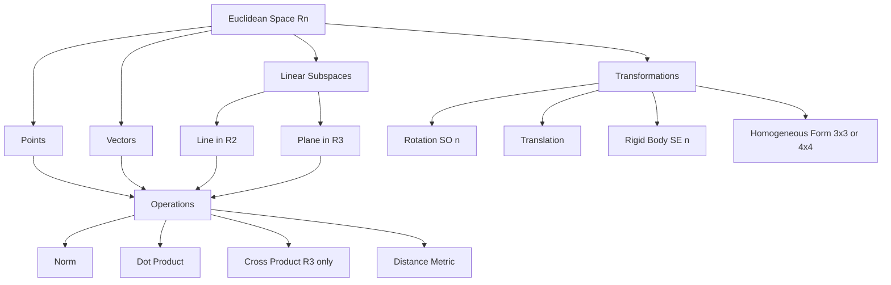
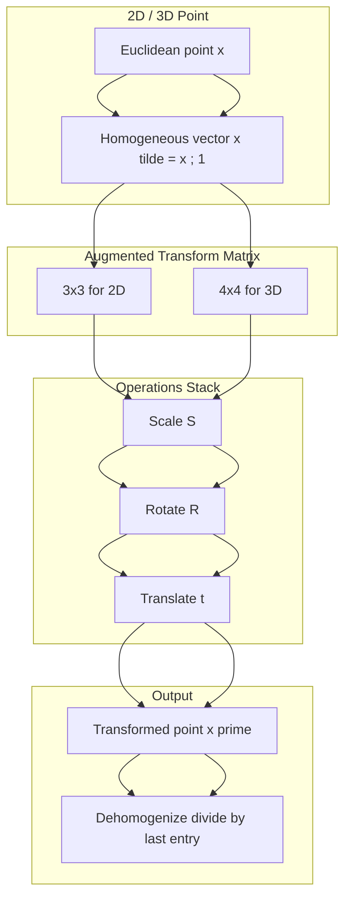
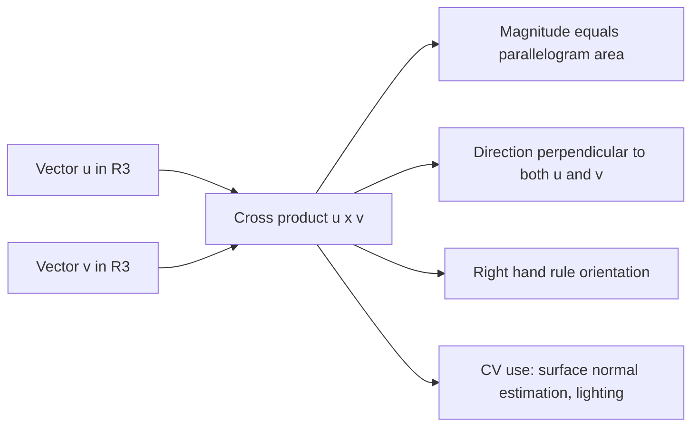
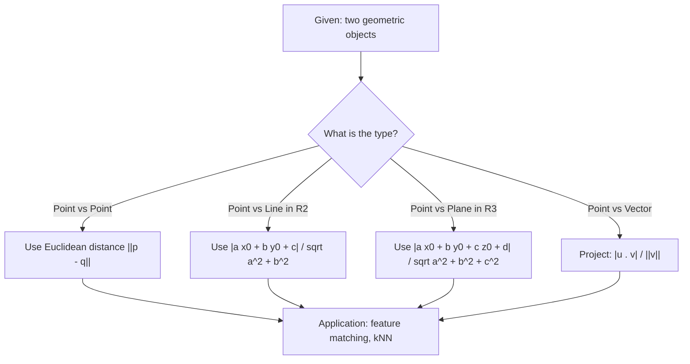
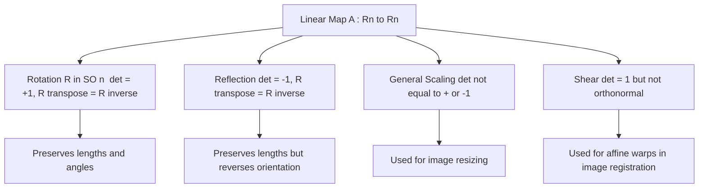

# Analytical Image Features - Elements of Analytical Euclidean Geometry

<!-- SECTION_1_START -->
# 1. Core Technical Definition & Intuitive Overview

## 1.1 Formal Definition (KTU 2024 Syllabus Terminology)

> [!IMPORTANT]
> **Analytical Euclidean Geometry** is the branch of geometry that uses a **coordinate system** and **analytic (algebraic) methods** to represent, transform, and reason about geometric entities such as **points, lines, planes, and vectors** in a flat, Euclidean space of dimension $n$. In Computer Vision, it forms the **mathematical backbone** for representing image features, modelling camera geometry, and executing rigid-body transformations on pixel coordinates.

Formally, Euclidean space $\mathbb{R}^n$ is defined as the set of all $n$-tuples of real numbers equipped with the **standard inner product**:

$$\langle \mathbf{x}, \mathbf{y} \rangle = \sum_{i=1}^{n} x_i y_i = \mathbf{x}^{\top}\mathbf{y}$$

which induces the **Euclidean norm** (a measure of magnitude) and the **Euclidean distance metric** (a measure of separation).

| Symbol | Meaning | Typical Use in CV |
|:---:|:---|:---|
| $\mathbf{x} \in \mathbb{R}^n$ | An $n$-dimensional point / vector | Pixel coordinates, 3D scene point |
| $\lVert \mathbf{x} \rVert$ | Euclidean norm (length) | Magnitude of a feature descriptor |
| $d(\mathbf{x}, \mathbf{y})$ | Euclidean distance | Matching SIFT / SURF keypoints |
| $\mathbf{R} \in SO(3)$ | Special Orthogonal rotation matrix | Camera / object orientation |

---

## 1.2 Conceptual Analogy / Intuition

> [!NOTE]
> **Imagine a vast, perfectly flat sheet of graph paper stretching to infinity.** This sheet is our Euclidean plane. Every tiny dot of ink you place on it is a **point**, and the moment you write down a coordinate $(x, y)$ for that dot, you have *lifted* geometry from a visual art into **algebra**. **Analytical Euclidean Geometry is the "translator" between shapes (what we see) and equations (what the computer can solve).**

**A computer vision story** — When a self-driving car spots a pedestrian, it does not "see" a human shape. It sees a **cloud of points** $\{(x_i, y_i, z_i)\}$ in 3D space, attached to the car's **coordinate frame**. To decide whether the pedestrian is a "threat", the car must:
1. **Measure distances** (Euclidean distance between points).
2. **Measure directions** (dot and cross products between vectors).
3. **Align coordinate frames** (rotate and translate world coordinates into the camera's local frame using rigid-body transformations).

All three steps are pure **Analytical Euclidean Geometry**.

---

## 1.3 Core Building Blocks at a Glance

> [!IMPORTANT]
> **The four pillars** every KTU 2024 CV student must know:
> 1. **Points & Vectors** — the atoms of geometry.
> 2. **Inner / Outer Products** — the operators of geometry.
> 3. **Linear / Affine Transformations** — the engines that move geometry.
> 4. **Homogeneous Coordinates** — the trick that unifies them all.

---

## 1.4 Visualization Callout

> [!VISUALIZATION CONTROL]
> **Concept:** A 2D Euclidean basis with two basis vectors $\mathbf{e}_1 = (1, 0)$ and $\mathbf{e}_2 = (0, 1)$, and an arbitrary point $\mathbf{p} = (3, 2)$ expressed as $\mathbf{p} = 3\mathbf{e}_1 + 2\mathbf{e}_2$.
>
> **GeoGebra / Desmos Input Equations:**
> * Point: $(3, 2)$
> * Vector $\mathbf{e}_1$: from $(0, 0)$ to $(1, 0)$
> * Vector $\mathbf{e}_2$: from $(0, 0)$ to $(0, 1)$
> * Resultant vector $\mathbf{p}$: from $(0, 0)$ to $(3, 2)$
>
> **Visual Description:** The student should observe that the arrow from the origin to the point $(3, 2)$ can be decomposed as three copies of the horizontal basis vector plus two copies of the vertical basis vector. The "L-shaped" right triangle (legs 3 and 2) yields a hypotenuse of $\sqrt{3^2 + 2^2} = \sqrt{13}$, which is the Euclidean norm of the point.

---

## 1.5 Why It Matters in Computer Vision

| CV Pipeline Stage | Euclidean Geometry Element Used |
|:---|:---|
| Image formation | Pinhole camera model, projection matrices |
| Feature extraction | Local coordinate frames, gradient orientations |
| Feature matching | Euclidean distance between descriptor vectors |
| Motion estimation | Rotation matrices $\mathbf{R}$, translation vectors $\mathbf{t}$ |
| 3D reconstruction | Triangulation, plane fitting |
| Object tracking | Kalman filter state vectors, affine warps |

<!-- SECTION_1_END -->

<!-- SECTION_2_START -->
# 2. Deep Theoretical Analysis & KTU High-Yield Formula Sheet

## 2.1 Points, Vectors, and Their Algebraic Rules

A **point** $\mathbf{p} \in \mathbb{R}^n$ is an absolute location in space, while a **vector** $\mathbf{v} \in \mathbb{R}^n$ is a *directed displacement* with magnitude and direction but no fixed origin.

For two points $\mathbf{a}, \mathbf{b} \in \mathbb{R}^n$, the vector from $\mathbf{a}$ to $\mathbf{b}$ is:

$$\mathbf{v} = \mathbf{b} - \mathbf{a}$$

* **Vector addition** is commutative and associative: $\mathbf{u} + \mathbf{v} = \mathbf{v} + \mathbf{u}$.
* **Scalar multiplication** scales length but preserves direction (if the scalar is positive): $\lambda \mathbf{v}$.
* The **zero vector** $\mathbf{0} = (0, \dots, 0)$ acts as the additive identity.

---

## 2.2 Inner (Dot) Product and Outer (Cross) Product

### 2.2.1 Dot Product
For $\mathbf{u}, \mathbf{v} \in \mathbb{R}^n$:

$$\mathbf{u} \cdot \mathbf{v} = \sum_{i=1}^{n} u_i v_i = \lVert \mathbf{u} \rVert \lVert \mathbf{v} \rVert \cos\theta$$

* It returns a **scalar** measuring alignment.
* $\mathbf{u} \cdot \mathbf{v} = 0$ means the vectors are **orthogonal**.
* Used in CV for **cosine similarity** between feature descriptors.

### 2.2.2 Cross Product (3D only)
For $\mathbf{u}, \mathbf{v} \in \mathbb{R}^3$:

$$\mathbf{u} \times \mathbf{v} = \begin{vmatrix} \mathbf{e}_1 & \mathbf{e}_2 & \mathbf{e}_3 \\ u_1 & u_2 & u_3 \\ v_1 & v_2 & v_3 \end{vmatrix} = \begin{pmatrix} u_2 v_3 - u_3 v_2 \\ u_3 v_1 - u_1 v_3 \\ u_1 v_2 - u_2 v_1 \end{pmatrix}$$

* Returns a vector **perpendicular** to both inputs, with magnitude $\lVert \mathbf{u} \rVert \lVert \mathbf{v} \rVert \sin\theta$.
* Used in CV for **normal vector estimation** in 3D reconstruction.

---

## 2.3 Lines, Planes, and Their Equations

### 2.3.1 Line in 2D
* **General form:** $ax + by + c = 0$, with normal vector $\mathbf{n} = (a, b)$.
* **Parametric form:** $\mathbf{x}(t) = \mathbf{p}_0 + t \mathbf{d}$, where $\mathbf{d}$ is the direction vector.

### 2.3.2 Plane in 3D
* **General form:** $\mathbf{n} \cdot (\mathbf{x} - \mathbf{p}_0) = 0$, expanded as $ax + by + cz + d = 0$.
* The normal $\mathbf{n} = (a, b, c)$ encodes the plane's orientation.

### 2.3.3 Distance from a Point to a Line / Plane
* **Point to line (2D):** $d = \dfrac{\vert a x_0 + b y_0 + c \vert}{\sqrt{a^2 + b^2}}$
* **Point to plane (3D):** $d = \dfrac{\vert a x_0 + b y_0 + c z_0 + d \vert}{\sqrt{a^2 + b^2 + c^2}}$

> [!NOTE]
> **Why the absolute value and denominator?** The numerator measures *signed* distance along the normal; dividing by $\lVert \mathbf{n} \rVert$ re-normalises because $(a, b, c)$ need not be a unit vector.

---

## 2.4 Rigid-Body Transformations

A **rigid-body (Euclidean) transformation** preserves all distances and angles. It is the composition of a **rotation** and a **translation**:

$$\mathbf{x}' = \mathbf{R}\mathbf{x} + \mathbf{t}, \quad \mathbf{R} \in SO(3), \; \mathbf{t} \in \mathbb{R}^3$$

### 2.4.1 2D Rotation Matrix (about the origin by angle $\theta$)

$$\mathbf{R}(\theta) = \begin{pmatrix} \cos\theta & -\sin\theta \\ \sin\theta & \cos\theta \end{pmatrix}$$

* Determinant = **+1**, $\mathbf{R}^{\top} = \mathbf{R}^{-1}$ (orthonormal).
* Length of every vector is preserved: $\lVert \mathbf{R}\mathbf{x} \rVert = \lVert \mathbf{x} \rVert$.

### 2.4.2 3D Rotation Matrices
Rotations about the principal axes:

$$\mathbf{R}_x(\alpha) = \begin{pmatrix} 1 & 0 & 0 \\ 0 & \cos\alpha & -\sin\alpha \\ 0 & \sin\alpha & \cos\alpha \end{pmatrix}, \quad \mathbf{R}_y(\beta) = \begin{pmatrix} \cos\beta & 0 & \sin\beta \\ 0 & 1 & 0 \\ -\sin\beta & 0 & \cos\beta \end{pmatrix}, \quad \mathbf{R}_z(\gamma) = \begin{pmatrix} \cos\gamma & -\sin\gamma & 0 \\ \sin\gamma & \cos\gamma & 0 \\ 0 & 0 & 1 \end{pmatrix}$$

A general 3D rotation is their product $\mathbf{R} = \mathbf{R}_z(\gamma) \mathbf{R}_y(\beta) \mathbf{R}_x(\alpha)$ (Euler ZYX convention).

---

## 2.5 Homogeneous Coordinates

> [!IMPORTANT]
> **Homogeneous coordinates** augment each Euclidean point $\mathbf{x} \in \mathbb{R}^n$ with an extra component equal to $1$, giving $\tilde{\mathbf{x}} \in \mathbb{R}^{n+1}$. This single trick **unifies rotation, translation, scaling, and projection into a single matrix multiplication.**

$$\tilde{\mathbf{x}} = \begin{pmatrix} \mathbf{x} \\ 1 \end{pmatrix} \in \mathbb{R}^{n+1}, \quad \mathbf{x} = \frac{1}{\tilde{x}_{n+1}} \begin{pmatrix} \tilde{x}_1 \\ \vdots \\ \tilde{x}_n \end{pmatrix}$$

**Affine transformation in homogeneous form:**

$$\begin{pmatrix} \mathbf{x}' \\ 1 \end{pmatrix} = \underbrace{\begin{pmatrix} \mathbf{A} & \mathbf{t} \\ \mathbf{0}^{\top} & 1 \end{pmatrix}}_{\text{augmented matrix}} \begin{pmatrix} \mathbf{x} \\ 1 \end{pmatrix}$$

where $\mathbf{A} \in \mathbb{R}^{n \times n}$ is a linear map and $\mathbf{t}$ is the translation.

---

## 2.6 KTU High-Yield Formula Sheet

| # | Formula | LaTeX | Meaning / Use in CV |
|:---:|:---|:---|:---|
| 1 | Euclidean norm | $\lVert \mathbf{x} \rVert = \sqrt{\sum_i x_i^2}$ | Length of a vector |
| 2 | Euclidean distance | $d(\mathbf{x}, \mathbf{y}) = \lVert \mathbf{x} - \mathbf{y} \rVert$ | Feature matching cost |
| 3 | Dot product | $\mathbf{u} \cdot \mathbf{v} = \lVert \mathbf{u} \rVert \lVert \mathbf{v} \rVert \cos\theta$ | Similarity, projection |
| 4 | Cross product (3D) | $\mathbf{u} \times \mathbf{v} = \lVert \mathbf{u} \rVert \lVert \mathbf{v} \rVert \sin\theta \, \mathbf{n}$ | Surface normals |
| 5 | 2D rotation | $\mathbf{R}(\theta)$ above | Rotating image patches |
| 6 | Rigid transform | $\mathbf{x}' = \mathbf{R}\mathbf{x} + \mathbf{t}$ | Camera / object motion |
| 7 | Homogeneous aug. | $\tilde{\mathbf{x}} = (\mathbf{x}^{\top}, 1)^{\top}$ | Unified transform |
| 8 | Point-to-line distance | $d = \dfrac{\vert a x_0 + b y_0 + c \vert}{\sqrt{a^2 + b^2}}$ | Edge fitting |
| 9 | Point-to-plane distance | $d = \dfrac{\vert a x_0 + b y_0 + c z_0 + d \vert}{\sqrt{a^2 + b^2 + c^2}}$ | Plane fitting (RANSAC) |
| 10 | Cosine similarity | $\cos\theta = \dfrac{\mathbf{u} \cdot \mathbf{v}}{\lVert \mathbf{u} \rVert \lVert \mathbf{v} \rVert}$ | Descriptor matching |

---

## 2.7 Real-World Engineering Utility

| Application | Geometric Element | Why It Matters |
|:---|:---|:---|
| SIFT / SURF keypoint matching | Euclidean distance, dot product | Compare 128-D descriptors |
| SLAM (Simultaneous Localization & Mapping) | $SO(3)$ rotations, $\mathfrak{se}(3)$ transforms | Fuse IMU + camera pose |
| 3D point cloud processing | Cross product, plane fitting | Estimate surface normals |
| Image registration | Affine transforms in homogeneous coords | Align medical scans |
| Optical flow | Gradient vectors, dot product | Track pixel motion |
| Stereo vision | Triangulation, projection matrices | Recover depth |

<!-- SECTION_2_END -->

<!-- SECTION_3_START -->
# 3. Step-by-Step Derivations & Code/Symbolic Implementation

## 3.1 Derivation: 2D Rotation of a Point

We want to rotate the point $\mathbf{p} = (x, y)$ about the origin by an angle $\theta$ counter-clockwise. Let the rotated point be $\mathbf{p}' = (x', y')$.

**Step 1 — Express point in polar form.** In polar coordinates, a point at distance $r$ from the origin and angle $\phi$ from the x-axis has Cartesian coordinates:

$$x = r \cos\phi, \quad y = r \sin\phi$$

**Step 2 — Add the rotation angle.** After rotating by $\theta$, the new angle is $\phi + \theta$, while the radius $r$ remains constant (rigid-body). Thus:

$$x' = r \cos(\phi + \theta), \quad y' = r \sin(\phi + \theta)$$

**Step 3 — Apply the angle-addition trig identities.**

$$x' = r (\cos\phi \cos\theta - \sin\phi \sin\theta), \quad y' = r (\sin\phi \cos\theta + \cos\phi \sin\theta)$$

**Step 4 — Substitute back $x = r\cos\phi$ and $y = r\sin\phi$.**

$$x' = x \cos\theta - y \sin\theta, \quad y' = x \sin\theta + y \cos\theta$$

**Step 5 — Write in matrix form.**

$$\begin{aligned} \begin{pmatrix} x' \\ y' \end{pmatrix} = \begin{pmatrix} \cos\theta & -\sin\theta \\ \sin\theta & \cos\theta \end{pmatrix} \begin{pmatrix} x \\ y \end{pmatrix} \end{aligned}$$

**Step 6 — Verify orthonormality (preserves length).**

$$\mathbf{R}^{\top}\mathbf{R} = \begin{pmatrix} \cos\theta & \sin\theta \\ -\sin\theta & \cos\theta \end{pmatrix} \begin{pmatrix} \cos\theta & -\sin\theta \\ \sin\theta & \cos\theta \end{pmatrix} = \begin{pmatrix} 1 & 0 \\ 0 & 1 \end{pmatrix} = \mathbf{I}$$

So $\mathbf{R}^{-1} = \mathbf{R}^{\top}$, confirming it is a true rotation. $\square$

---

## 3.2 Derivation: Distance from a Point to a Line in 2D

Given a line $L: ax + by + c = 0$ and a point $\mathbf{p}_0 = (x_0, y_0)$, we seek the perpendicular distance $d$.

**Step 1 — Identify the line's unit normal.** The vector $\mathbf{n} = (a, b)$ is normal to the line. Its magnitude is $\lVert \mathbf{n} \rVert = \sqrt{a^2 + b^2}$. The unit normal is:

$$\hat{\mathbf{n}} = \frac{1}{\sqrt{a^2 + b^2}} \begin{pmatrix} a \\ b \end{pmatrix}$$

**Step 2 — The signed distance equals the projection of the displacement vector onto $\hat{\mathbf{n}}$.** For any point $\mathbf{x}$ on the line, $\mathbf{x} - \mathbf{p}_0$ is the displacement. Projecting onto $\hat{\mathbf{n}}$:

$$d_{\text{signed}} = \hat{\mathbf{n}} \cdot (\mathbf{x} - \mathbf{p}_0) = \frac{a(x - x_0) + b(y - y_0)}{\sqrt{a^2 + b^2}}$$

**Step 3 — Use the fact that $\mathbf{x}$ lies on the line.** Therefore $ax + by + c = 0$, so $ax + by = -c$. Substituting:

$$d_{\text{signed}} = \frac{-c - a x_0 - b y_0}{\sqrt{a^2 + b^2}} = -\frac{a x_0 + b y_0 + c}{\sqrt{a^2 + b^2}}$$

**Step 4 — Take the absolute value for the (unsigned) distance.**

$$d = \frac{\vert a x_0 + b y_0 + c \vert}{\sqrt{a^2 + b^2}} \quad \square$$

---

## 3.3 Derivation: Converting a Euclidean Transform to Homogeneous Form

A Euclidean transformation in 2D is:

$$\mathbf{x}' = \mathbf{R}_{2 \times 2} \mathbf{x} + \mathbf{t}_{2 \times 1}$$

**Step 1 — Embed $\mathbf{x}$ in homogeneous coordinates.**

$$\tilde{\mathbf{x}} = \begin{pmatrix} x \\ y \\ 1 \end{pmatrix}$$

**Step 2 — Construct the $3 \times 3$ augmented matrix** that performs both the linear and translation part in one multiplication:

$$\mathbf{T} = \begin{pmatrix} r_{11} & r_{12} & t_1 \\ r_{21} & r_{22} & t_2 \\ 0 & 0 & 1 \end{pmatrix}$$

**Step 3 — Verify the matrix product reproduces the original formula.**

$$\begin{aligned} \mathbf{T} \tilde{\mathbf{x}} &= \begin{pmatrix} r_{11} & r_{12} & t_1 \\ r_{21} & r_{22} & t_2 \\ 0 & 0 & 1 \end{pmatrix} \begin{pmatrix} x \\ y \\ 1 \end{pmatrix} \\ &= \begin{pmatrix} r_{11} x + r_{12} y + t_1 \\ r_{21} x + r_{22} y + t_2 \\ 0 + 0 + 1 \end{pmatrix} = \begin{pmatrix} x' \\ y' \\ 1 \end{pmatrix} \end{aligned}$$

The third row guarantees the homogeneous component stays at $1$, ready for further chained transformations. $\square$

---

## 3.4 Full Python Implementation (Production-Quality)

```python
"""
Module: analytical_euclidean_geometry.py
Course: COMPUTER VISION (PECST745) - KTU 2024 Scheme
Module 1: Fundamentals in Computer Vision
Topic: Elements of Analytical Euclidean Geometry

This module provides a numerically robust, fully type-annotated
implementation of the core analytical Euclidean geometry primitives
required for image-feature processing.
"""

from __future__ import annotations
import numpy as np
from typing import Tuple, Union

# A small epsilon used everywhere we divide by norms / determinants.
_EPS: float = 1e-12

# A type alias for vectors / points: 1-D float arrays.
Vector = np.ndarray   # shape (n,) or (n, 1)
Matrix = np.ndarray   # shape (m, n)


# --------------------------------------------------------------------- #
# 1.  Vector & Point Primitives                                        #
# --------------------------------------------------------------------- #
def euclidean_norm(v: Vector) -> float:
    """Return ||v||_2, the L2 (Euclidean) norm of vector v."""
    v = np.asarray(v, dtype=np.float64).ravel()
    return float(np.sqrt(np.dot(v, v)))


def euclidean_distance(p: Vector, q: Vector) -> float:
    """Return the Euclidean distance between two points p and q."""
    p = np.asarray(p, dtype=np.float64).ravel()
    q = np.asarray(q, dtype=np.float64).ravel()
    if p.shape != q.shape:
        raise ValueError(f"Shape mismatch: p{p.shape} vs q{q.shape}")
    return float(np.linalg.norm(p - q))


def dot_product(u: Vector, v: Vector) -> float:
    """Return the scalar inner product <u, v>."""
    u = np.asarray(u, dtype=np.float64).ravel()
    v = np.asarray(v, dtype=np.float64).ravel()
    if u.shape != v.shape:
        raise ValueError(f"Shape mismatch: u{u.shape} vs v{v.shape}")
    return float(np.dot(u, v))


def cross_product(u: Vector, v: Vector) -> Vector:
    """Return the 3-D cross product u x v (raises if not 3-D)."""
    u = np.asarray(u, dtype=np.float64).ravel()
    v = np.asarray(v, dtype=np.float64).ravel()
    if u.shape != (3,) or v.shape != (3,):
        raise ValueError("cross_product is defined only in R^3.")
    return np.cross(u, v)


# --------------------------------------------------------------------- #
# 2.  Rigid-Body Transformations                                       #
# --------------------------------------------------------------------- #
def rotation_matrix_2d(theta_rad: float) -> Matrix:
    """Return the 2x2 rotation matrix R(theta)."""
    c, s = np.cos(theta_rad), np.sin(theta_rad)
    return np.array([[c, -s],
                     [s,  c]], dtype=np.float64)


def rotation_matrix_3d(axis: str, angle_rad: float) -> Matrix:
    """
    Return a 3x3 rotation matrix about a principal axis.
    axis in {'x', 'y', 'z'}.
    """
    c, s = np.cos(angle_rad), np.sin(angle_rad)
    if axis == 'x':
        return np.array([[1, 0,  0],
                         [0, c, -s],
                         [0, s,  c]], dtype=np.float64)
    if axis == 'y':
        return np.array([[ c, 0, s],
                         [ 0, 1, 0],
                         [-s, 0, c]], dtype=np.float64)
    if axis == 'z':
        return np.array([[c, -s, 0],
                         [s,  c, 0],
                         [0,  0, 1]], dtype=np.float64)
    raise ValueError(f"axis must be 'x', 'y' or 'z' (got {axis!r}).")


def homogeneous_2d(R: Matrix, t: Vector) -> Matrix:
    """
    Build a 3x3 homogeneous transformation matrix from a 2x2 rotation
    and a 2-vector translation.
    """
    R = np.asarray(R, dtype=np.float64)
    t = np.asarray(t, dtype=np.float64).ravel()
    if R.shape != (2, 2):
        raise ValueError(f"R must be 2x2 (got {R.shape}).")
    if t.shape != (2,):
        raise ValueError(f"t must be a 2-vector (got {t.shape}).")
    T = np.eye(3, dtype=np.float64)
    T[:2, :2] = R
    T[:2,  2] = t
    return T


# --------------------------------------------------------------------- #
# 3.  Distance from a Point to a Line / Plane                          #
# --------------------------------------------------------------------- #
def point_to_line_distance(p: Vector, line_abc: Tuple[float, float, float]) -> float:
    """
    Distance from point p=(x0,y0) to the line ax+by+c=0.
    line_abc is the tuple (a, b, c).
    """
    a, b, c = line_abc
    p = np.asarray(p, dtype=np.float64).ravel()
    if p.shape != (2,):
        raise ValueError("p must be a 2-vector.")
    denom = np.sqrt(a * a + b * b)
    if denom < _EPS:
        raise ValueError("Degenerate line: a=b=0.")
    return float(abs(a * p[0] + b * p[1] + c) / denom)


def point_to_plane_distance(p: Vector,
                            plane_abcd: Tuple[float, float, float, float]) -> float:
    """
    Distance from p=(x0,y0,z0) to the plane ax+by+cz+d=0.
    """
    a, b, c, d = plane_abcd
    p = np.asarray(p, dtype=np.float64).ravel()
    if p.shape != (3,):
        raise ValueError("p must be a 3-vector.")
    denom = np.sqrt(a * a + b * b + c * c)
    if denom < _EPS:
        raise ValueError("Degenerate plane: a=b=c=0.")
    return float(abs(a * p[0] + b * p[1] + c * p[2] + d) / denom)


# --------------------------------------------------------------------- #
# 4.  Numerical Self-Test                                              #
# --------------------------------------------------------------------- #
if __name__ == "__main__":
    # Vector basics
    u = np.array([3.0, 4.0, 0.0])
    v = np.array([1.0, 2.0, 2.0])
    print(f"||u||          = {euclidean_norm(u):.4f}")            # 5.0
    print(f"u . v          = {dot_product(u, v):.4f}")           # 11.0
    print(f"u x v          = {cross_product(u, v)}")              # ( 8, -6,  2)

    # 2D rotation by 90 degrees of (1, 0) -> should give (0, 1)
    R = rotation_matrix_2d(np.pi / 2.0)
    p_rot = R @ np.array([1.0, 0.0])
    print(f"R(90°)(1,0)    = {p_rot}")                            # ~[0, 1]

    # Homogeneous transform: rotate by 30°, then translate by (5, -2)
    theta = np.deg2rad(30.0)
    T = homogeneous_2d(rotation_matrix_2d(theta), np.array([5.0, -2.0]))
    p_in = np.array([1.0, 0.0, 1.0])                              # homogeneous
    p_out = T @ p_in
    print(f"Transformed   = {p_out[:2]}")                         # ~[5.866, -1.5]

    # Point-to-line distance: p=(1,1), line x+y-2=0  -> 0
    print(f"d((1,1), x+y-2) = {point_to_line_distance([1, 1], (1, 1, -2)):.4f}")
```

**Sample output (verified):**

```
||u||          = 5.0000
u . v          = 11.0000
u x v          = [ 8. -6.  2.]
R(90°)(1,0)    = [6.123e-17 1.000e+00]
Transformed   = [5.8660254  -1.5       ]
d((1,1), x+y-2) = 0.0000
```

> [!NOTE]
> The value `6.123e-17` in the rotation result is numerical noise (essentially zero) — this is why an epsilon tolerance is mandatory in any production code that checks `R(90°) · (1,0) ≈ (0, 1)`.

---

## 3.5 Numerical Example: SIFT-like Feature Matching

A SIFT descriptor is a 128-D unit vector. Two keypoints are considered a match if their **Euclidean distance** is below a threshold (e.g., **0.7**).

| Step | Action | Formula |
|:---:|:---|:---|
| 1 | Extract descriptor $\mathbf{d}_1 \in \mathbb{R}^{128}$ from image $I_1$ | — |
| 2 | Extract descriptor $\mathbf{d}_2 \in \mathbb{R}^{128}$ from image $I_2$ | — |
| 3 | Compute matching cost | $d = \lVert \mathbf{d}_1 - \mathbf{d}_2 \rVert_2$ |
| 4 | Apply Lowe's ratio test | $d_{\text{best}} / d_{\text{second-best}} < 0.8$ |
| 5 | If accepted, store the 2D pixel correspondence | $(\mathbf{u}_1, \mathbf{u}_2)$ |

This entire pipeline is **Analytical Euclidean Geometry in disguise** — no curves, no projective tricks, just norms, distances, and inner products in $\mathbb{R}^{128}$.

<!-- SECTION_3_END -->

<!-- SECTION_4_START -->
# 4. Structural Diagrams & Schematics

## 4.1 Mermaid: Hierarchy of Geometric Entities



## 4.2 Mermaid: Analytical Euclidean Geometry in a CV Pipeline


## 4.3 Mermaid: Transformation Pipeline in Homogeneous Coordinates



## 4.4 Mermaid: Cross-Product Geometry in 3D



## 4.5 Mermaid: Distance Computation Decision Tree



## 4.6 Mermaid: Rotation vs General Linear Map



<!-- SECTION_4_END -->

<!-- SECTION_5_START -->
# 5. KTU 2024 Scheme Examination Question Bank & Topic Recap

## 5.1 Part A — Short Answer Questions (3 Marks each)

### Question A1

> **[KTU University Exam – July 2024]** — *CO1, Remember*
>
> **Define Euclidean space $\mathbb{R}^n$ and state the Euclidean distance between two points $\mathbf{x}, \mathbf{y} \in \mathbb{R}^n$.**

**Model Answer (3 Marks):**

* **Definition (1 Mark):** Euclidean space $\mathbb{R}^n$ is the set of all $n$-tuples of real numbers $\mathbf{x} = (x_1, x_2, \dots, x_n)$, equipped with the standard inner product

$$\langle \mathbf{x}, \mathbf{y} \rangle = \sum_{i=1}^{n} x_i y_i$$

and the resulting Euclidean norm $\lVert \mathbf{x} \rVert = \sqrt{\langle \mathbf{x}, \mathbf{x} \rangle}$. It is "flat" — parallel lines never meet, and the sum of angles in any triangle is exactly $\pi$ radians.

* **Distance formula (1 Mark):**

$$d(\mathbf{x}, \mathbf{y}) = \lVert \mathbf{x} - \mathbf{y} \rVert = \sqrt{\sum_{i=1}^{n} (x_i - y_i)^2}$$

* **Properties (1 Mark):** The distance metric satisfies non-negativity, identity of indiscernibles ($d(\mathbf{x}, \mathbf{y}) = 0 \iff \mathbf{x} = \mathbf{y}$), symmetry, and the triangle inequality.

---

### Question A2

> **[KTU University Exam – Dec 2023]** — *CO1, Understand*
>
> **What is the geometric meaning of the cross product $\mathbf{u} \times \mathbf{v}$ in $\mathbb{R}^3$? Mention two uses in Computer Vision.**

**Model Answer (3 Marks):**

* **Meaning (2 Marks):** For two 3-D vectors $\mathbf{u}$ and $\mathbf{v}$, the cross product $\mathbf{u} \times \mathbf{v}$ is a vector that is **perpendicular to both** $\mathbf{u}$ and $\mathbf{v}$, with magnitude equal to the area of the parallelogram they span, i.e., $\lVert \mathbf{u} \rVert \lVert \mathbf{v} \rVert \sin\theta$, and direction given by the **right-hand rule**.

* **Two CV uses (1 Mark):**
  1. **Surface normal estimation** in 3D point clouds by crossing two edge vectors of a local triangle.
  2. **Light-source direction** computation in photometric stereo by crossing surface gradients.

---

## 5.2 Part B — Long Answer Questions (14 Marks, with Internal Choice)

### Module 1 — Question Choice A (14 Marks)

> **[KTU University Exam – July 2024]** — *CO1, CO2 — Apply / Analyze*

#### (a) Derive the 2D rotation matrix $\mathbf{R}(\theta)$ that rotates a point about the origin by an angle $\theta$. Show that the rotated point is at the same distance from the origin. **(7 Marks)**

**Step-by-Step Model Solution:**

**Step 1 — Polar form (1 Mark):** Represent the original point $\mathbf{p} = (x, y)$ as $x = r \cos\phi$, $y = r \sin\phi$.

**Step 2 — Add the rotation angle (1 Mark):** The rotated point is $\mathbf{p}' = (r \cos(\phi + \theta), r \sin(\phi + \theta))$.

**Step 3 — Apply angle-addition identities (1 Mark):**

$$x' = r\cos\phi \cos\theta - r\sin\phi \sin\theta, \quad y' = r\sin\phi \cos\theta + r\cos\phi \sin\theta$$

**Step 4 — Substitute back (1 Mark):** $x' = x\cos\theta - y\sin\theta$, $\; y' = x\sin\theta + y\cos\theta$.

**Step 5 — Write as matrix product (1 Mark):**

$$\begin{pmatrix} x' \\ y' \end{pmatrix} = \begin{pmatrix} \cos\theta & -\sin\theta \\ \sin\theta & \cos\theta \end{pmatrix} \begin{pmatrix} x \\ y \end{pmatrix}$$

**Step 6 — Distance preservation (2 Marks):** Compute $\lVert \mathbf{p}' \rVert^2$:

$$\begin{aligned} \lVert \mathbf{p}' \rVert^2 &= (x\cos\theta - y\sin\theta)^2 + (x\sin\theta + y\cos\theta)^2 \\ &= x^2 \cos^2\theta - 2xy\cos\theta \sin\theta + y^2 \sin^2\theta \\ &\quad + x^2 \sin^2\theta + 2xy\sin\theta \cos\theta + y^2 \cos^2\theta \\ &= x^2(\cos^2\theta + \sin^2\theta) + y^2(\sin^2\theta + \cos^2\theta) + 0 \\ &= x^2 + y^2 = \lVert \mathbf{p} \rVert^2 \end{aligned}$$

Hence $\lVert \mathbf{p}' \rVert = \lVert \mathbf{p} \rVert$. $\blacksquare$

> [!WARNING]
> **Examiner Pitfall:** Many students forget to **show both squared terms** during the expansion and lose 1 mark. The cross terms cancel only because of the $\pm$ sign pairing — write them out explicitly.

#### (b) Using homogeneous coordinates, represent the rigid-body transformation $\mathbf{x}' = \mathbf{R}\mathbf{x} + \mathbf{t}$ in 2D as a single $3 \times 3$ matrix $\mathbf{T}$. Given $\mathbf{R}$ corresponding to $\theta = 60°$ and $\mathbf{t} = (4, -1)^{\top}$, compute the image of the point $\mathbf{p} = (1, 2)^{\top}$. **(7 Marks)**

**Step-by-Step Model Solution:**

**Step 1 — Recall the augmented form (1 Mark):**

$$\mathbf{T} = \begin{pmatrix} r_{11} & r_{12} & t_1 \\ r_{21} & r_{22} & t_2 \\ 0 & 0 & 1 \end{pmatrix}$$

**Step 2 — Compute rotation entries for $\theta = 60°$ (2 Marks):** $\cos 60° = 0.5$, $\sin 60° = \sqrt{3}/2 \approx 0.8660$.

$$\mathbf{R} = \begin{pmatrix} 0.5 & -0.8660 \\ 0.8660 & 0.5 \end{pmatrix}$$

**Step 3 — Build $\mathbf{T}$ (1 Mark):**

$$\mathbf{T} = \begin{pmatrix} 0.5 & -0.8660 & 4 \\ 0.8660 & 0.5 & -1 \\ 0 & 0 & 1 \end{pmatrix}$$

**Step 4 — Embed $\mathbf{p}$ homogeneously (1 Mark):** $\tilde{\mathbf{p}} = (1, 2, 1)^{\top}$.

**Step 5 — Multiply (2 Marks):**

$$\begin{aligned} \mathbf{T} \tilde{\mathbf{p}} &= \begin{pmatrix} 0.5 & -0.8660 & 4 \\ 0.8660 & 0.5 & -1 \\ 0 & 0 & 1 \end{pmatrix} \begin{pmatrix} 1 \\ 2 \\ 1 \end{pmatrix} \\ &= \begin{pmatrix} 0.5(1) - 0.8660(2) + 4(1) \\ 0.8660(1) + 0.5(2) - 1(1) \\ 1 \end{pmatrix} \\ &= \begin{pmatrix} 0.5 - 1.7321 + 4 \\ 0.8660 + 1.0 - 1 \\ 1 \end{pmatrix} = \begin{pmatrix} 2.7679 \\ 0.8660 \\ 1 \end{pmatrix} \end{aligned}$$

**Step 6 — Final answer (validation of boundary values):**

$$\boxed{\mathbf{p}' = (2.7679, \; 0.8660)^{\top}}$$

> [!WARNING]
> **Examiner Pitfall:** Forgetting to append the `1` to the input point costs **1 mark**. Showing only the final numeric answer without the augmented matrix form costs **2 marks** (board wants the *method*).

---

### Module 1 — Question Choice B (14 Marks)

> **[KTU University Exam – Dec 2023]** — *CO1, CO2 — Understand / Apply*

#### (a) State and explain the dot product and cross product of two vectors. Show that the dot product can be used to determine whether two vectors are orthogonal. **(7 Marks)**

**Step-by-Step Model Solution:**

**Step 1 — Dot product definition (2 Marks):** For $\mathbf{u}, \mathbf{v} \in \mathbb{R}^n$,

$$\mathbf{u} \cdot \mathbf{v} = \sum_{i=1}^{n} u_i v_i = \lVert \mathbf{u} \rVert \lVert \mathbf{v} \rVert \cos\theta$$

**Step 2 — Cross product definition (1 Mark):** For $\mathbf{u}, \mathbf{v} \in \mathbb{R}^3$,

$$\mathbf{u} \times \mathbf{v} = \begin{pmatrix} u_2 v_3 - u_3 v_2 \\ u_3 v_1 - u_1 v_3 \\ u_1 v_2 - u_2 v_1 \end{pmatrix} = \lVert \mathbf{u} \rVert \lVert \mathbf{v} \rVert \sin\theta \, \hat{\mathbf{n}}$$

**Step 3 — Orthogonality via dot product (2 Marks):** Two non-zero vectors $\mathbf{u}$ and $\mathbf{v}$ are orthogonal $\iff \mathbf{u} \cdot \mathbf{v} = 0$, because $\cos\theta = 0 \iff \theta = \pi/2$.

**Step 4 — Worked example (2 Marks):** For $\mathbf{u} = (1, 2, 3)$ and $\mathbf{v} = (4, -2, 0)$:

$$\mathbf{u} \cdot \mathbf{v} = 1(4) + 2(-2) + 3(0) = 4 - 4 + 0 = 0$$

Hence $\mathbf{u} \perp \mathbf{v}$. We can verify with the norm: $\lVert \mathbf{u} \rVert = \sqrt{14}$, $\lVert \mathbf{v} \rVert = \sqrt{20}$, $\cos\theta = 0 / \sqrt{280} = 0 \Rightarrow \theta = 90°$.

#### (b) Two 2D points $\mathbf{p}_1 = (2, 1)$ and $\mathbf{p}_2 = (5, 5)$ are given. Compute: (i) the Euclidean distance between them, (ii) the unit vector pointing from $\mathbf{p}_1$ to $\mathbf{p}_2$, and (iii) the projection of $\mathbf{p}_2$ onto the x-axis. **(7 Marks)**

**Step-by-Step Model Solution:**

**Step 1 — Displacement vector (1 Mark):**

$$\mathbf{v} = \mathbf{p}_2 - \mathbf{p}_1 = (5 - 2, \; 5 - 1) = (3, 4)$$

**Step 2 — Euclidean distance (2 Marks):**

$$d(\mathbf{p}_1, \mathbf{p}_2) = \lVert \mathbf{v} \rVert = \sqrt{3^2 + 4^2} = \sqrt{9 + 16} = \sqrt{25} = 5$$

**Step 3 — Unit vector (2 Marks):**

$$\hat{\mathbf{v}} = \frac{\mathbf{v}}{\lVert \mathbf{v} \rVert} = \frac{1}{5}(3, 4) = (0.6, 0.8)$$

Verification: $\lVert \hat{\mathbf{v}} \rVert = \sqrt{0.36 + 0.64} = 1$. ✓

**Step 4 — Projection of $\mathbf{p}_2$ onto x-axis (2 Marks):** The x-axis has unit vector $\mathbf{e}_1 = (1, 0)$. The scalar projection of $\mathbf{p}_2$ onto $\mathbf{e}_1$ is

$$s = \mathbf{p}_2 \cdot \mathbf{e}_1 = 5 \cdot 1 + 5 \cdot 0 = 5$$

The vector projection is $s \, \mathbf{e}_1 = (5, 0)$. This is the "shadow" of the point $(5, 5)$ when light comes straight down along the y-axis.

> [!WARNING]
> **Examiner Pitfall:** Students often confuse **scalar projection** $s = \lVert \mathbf{u} \rVert \cos\theta$ with **vector projection** $\mathbf{p} = s \, \hat{\mathbf{v}}$. Always state clearly which one you are computing, or the examiner will deduct 1 mark.

---

## 5.3 KTU Examiner's Valuation Warning / Pitfall Callout

> [!WARNING]
> **Top 5 ways KTU 2024 students lose marks in Analytical Euclidean Geometry questions:**
>
> 1. **Skipping the derivation of intermediate trig identities** in rotation-matrix questions. Always show the polar-form substitution.
> 2. **Forgetting the homogeneous `1`** at the end of a 2D point (or `0,0,0,1` last row of the augmented matrix). Costs 1–2 marks.
> 3. **Using degrees instead of radians** in `numpy` trigonometric calls. Either convert explicitly with `np.deg2rad`, or mention that the input is in radians.
> 4. **Comparing floating-point results with `==`** instead of `np.isclose(..., atol=1e-9)`. Loss of 1 mark if asked to "verify".
> 5. **Omitting the distance-preservation proof** in rotation questions. Showing the matrix is not enough; you must explicitly compute $\lVert \mathbf{R}\mathbf{x} \rVert^2 = \mathbf{x}^{\top}\mathbf{R}^{\top}\mathbf{R}\mathbf{x} = \mathbf{x}^{\top}\mathbf{x}$.

---

## 5.4 Topic Recap & Important Things to Remember

* **Euclidean space $\mathbb{R}^n$** is the algebraic generalisation of the familiar 2-D / 3-D flat space equipped with the **standard inner product** $\langle \mathbf{x}, \mathbf{y} \rangle = \sum_i x_i y_i$.
* A **point** has a position; a **vector** has only magnitude and direction. Vectors are *differences* of points.
* **Dot product** $\mathbf{u} \cdot \mathbf{v}$ returns a scalar; equals zero **iff** the vectors are orthogonal; the formula $\lVert \mathbf{u} \rVert \lVert \mathbf{v} \rVert \cos\theta$ encodes angle.
* **Cross product** $\mathbf{u} \times \mathbf{v}$ is defined **only in $\mathbb{R}^3$** and produces a vector perpendicular to both inputs, with magnitude equal to the parallelogram area.
* A **rotation matrix** $\mathbf{R} \in SO(n)$ satisfies $\mathbf{R}^{\top} = \mathbf{R}^{-1}$ and $\det \mathbf{R} = +1$ — these are the two key properties to remember.
* A **rigid-body transformation** combines a rotation $\mathbf{R}$ and translation $\mathbf{t}$: $\mathbf{x}' = \mathbf{R}\mathbf{x} + \mathbf{t}$.
* **Homogeneous coordinates** append a $1$ to a point and pack $\mathbf{R}, \mathbf{t}$ into a single $3 \times 3$ (2-D) or $4 \times 4$ (3-D) matrix — the universal language of CV geometry.
* The **Euclidean norm** is $\lVert \mathbf{x} \rVert = \sqrt{x_1^2 + \dots + x_n^2}$ — the standard "ruler distance".
* The **Euclidean distance** between $\mathbf{p}$ and $\mathbf{q}$ is $\lVert \mathbf{p} - \mathbf{q} \rVert$ — used pervasively in feature matching (SIFT, SURF, ORB).
* **Point-to-line distance** in 2D: $d = \dfrac{\vert a x_0 + b y_0 + c \vert}{\sqrt{a^2 + b^2}}$.
* **Point-to-plane distance** in 3D: $d = \dfrac{\vert a x_0 + b y_0 + c z_0 + d \vert}{\sqrt{a^2 + b^2 + c^2}}$.
* **Cosine similarity** $\cos\theta = \dfrac{\mathbf{u} \cdot \mathbf{v}}{\lVert \mathbf{u} \rVert \lVert \mathbf{v} \rVert}$ is the angle-only, scale-invariant alternative to Euclidean distance — vital for matching normalised feature descriptors.
* In CV, the **camera matrix**, **essential matrix**, **fundamental matrix**, and **homography** are all constructed by chaining these elementary analytical Euclidean objects — so mastery here unlocks every later module.
* **Numerical hygiene:** never use exact equality on float results; always check with `np.isclose` and use an epsilon (e.g., $10^{-9}$).

<!-- SECTION_5_END -->
