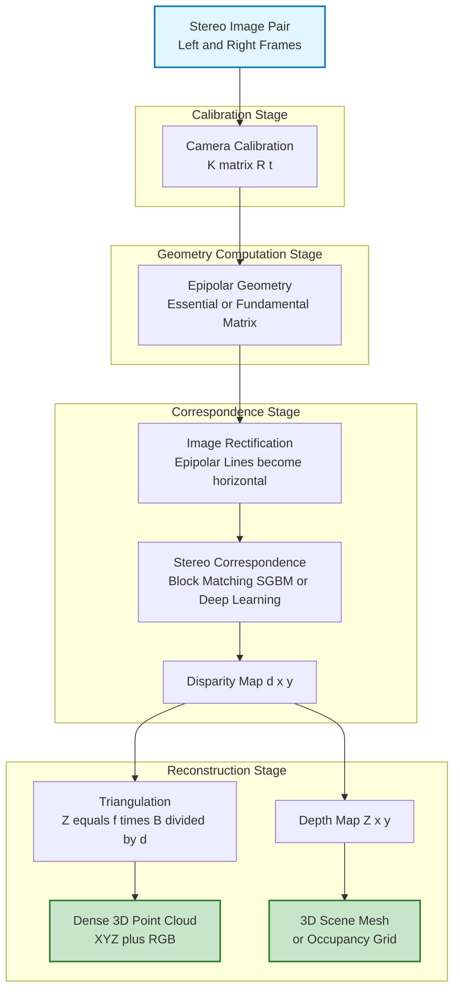
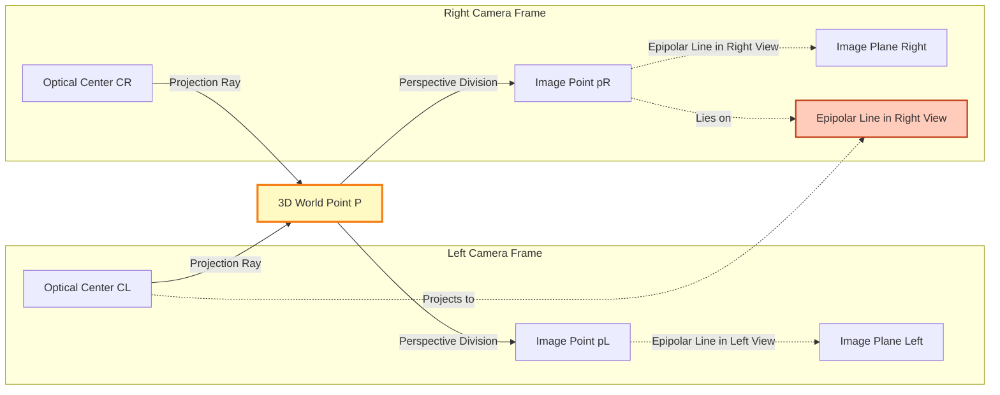
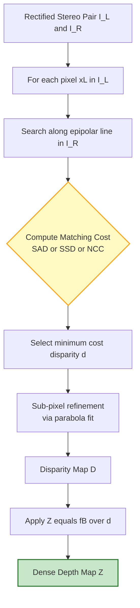

# Binocular Reconstruction

<!-- SECTION_1_START -->
# Binocular Reconstruction — Core Technical Definition & Intuitive Overview

## 📘 Formal Academic Definition (KTU 2024 Syllabus Terminology)

> [!IMPORTANT]
> **Binocular Stereo Reconstruction** is the process of recovering the three-dimensional geometric structure of a scene from two or more two-dimensional images captured from distinct viewpoints, typically by a stereo camera rig whose intrinsic and extrinsic parameters are known. The reconstruction is grounded in the principles of **epipolar geometry**, **triangulation**, and **correspondence matching** between conjugate image points.

In the KTU 2024 *Computer Vision (PECST745)* syllabus, Module 1 positions binocular reconstruction as a foundational pillar that bridges **2D image formation** with **3D scene understanding**. It is the mathematical inverse of the image projection process — instead of mapping 3D points onto 2D image planes, we *lift* matched 2D points back into 3D space.

## 🧠 Intuitive Overview — "The Two-Eyes Trick"

> [!NOTE]
> **Conceptual Analogy — Human Depth Perception**
> Hold your finger in front of your nose. Close your left eye, then close your right eye. Notice how the finger **shifts** against the background. That shift is called **disparity** — and it is exactly what your brain uses to compute depth. Binocular reconstruction does the same thing, but with cameras and mathematics.

**Geometric Intuition:** Imagine two cameras $C_L$ and $C_R$ separated by a baseline $B$. A real-world 3D point $P$ projects onto the left image plane at $p_L$ and the right image plane at $p_R$. Because the cameras see $P$ from slightly different angles, $p_L \neq p_R$. The **horizontal pixel offset** between them is the **disparity** $d = x_L - x_R$, and from $d$ we can recover depth $Z$:

$$Z = \frac{f \cdot B}{d}$$

where $f$ is the focal length and $B$ is the baseline. Notice the **inverse relationship**: *small disparity → far object*, *large disparity → near object*.

## 🔑 Core Terminology Glossary

| Term | Symbol | Meaning |
|---|---|---|
| **Baseline** | $B$ | Physical distance between the two camera optical centers |
| **Focal Length** | $f$ | Distance from the lens to the image sensor (in pixels or mm) |
| **Disparity** | $d$ | Horizontal pixel shift between conjugate points |
| **Depth** | $Z$ | Distance of a 3D point from the camera along the optical axis |
| **Epipole** | $e_L, e_R$ | Projection of one camera center into the other camera's image |
| **Epipolar Line** | $\ell$ | The locus of all possible matches for a point in the other view |
| **Essential Matrix** | $\mathbf{E}$ | Encodes rotation and translation between two *calibrated* views |
| **Fundamental Matrix** | $\mathbf{F}$ | Encodes the same geometry for *uncalibrated* cameras (in pixels) |

> [!TIP]
> **Why "Binocular"?** The term mirrors biology — *bi* (two) + *ocular* (eyes). Just as humans rely on two eyes, this technique uses two cameras. It is the **passive, low-cost** workhorse of 3D sensing (think robot navigation, autonomous vehicles, AR/VR headsets).

## 🎨 Visualization — Stereo Geometry

> [!VISUALIZATION CONTROL]
> **Concept:** Two-camera stereo rig observing a 3D point P, showing baseline B, projection rays, image planes, and conjugate points.
> **GeoGebra / Desmos Input Equations:**
> * Left camera at $C_L = (-B/2, 0)$, right camera at $C_R = (B/2, 0)$.
> * 3D point $P = (X, Y, Z)$ in world coordinates.
> * Left projection: $p_L = (f \cdot X_L / Z_L + c_x, f \cdot Y_L / Z_L + c_y)$.
> * Right projection: $p_R = (f \cdot X_R / Z_R + c_x, f \cdot Y_R / Z_R + c_y)$.
> * Disparity line: $d = x_L - x_R$.
> **Visual Description:** A top-down (X-Z) view with two camera centers on the X-axis, separated by baseline $B$. Projection rays from each camera converge at point $P$. The image planes appear as vertical lines behind each camera. The student should see that as $P$ moves closer (smaller $Z$), the rays diverge more, producing a larger disparity $d$.

<!-- SECTION_1_END -->

<!-- SECTION_2_START -->
# Deep Theoretical Analysis & KTU High-Yield Formula Sheet

## 1. The Stereo Vision Pipeline (High-Level)

Binocular reconstruction is **not** a single equation — it is a pipeline. The KTU 2024 module expects you to know every stage:

1. **Camera Calibration** — Recover intrinsic matrix $\mathbf{K}$ and extrinsic parameters $(\mathbf{R}, \mathbf{t})$.
2. **Epipolar Geometry Computation** — Derive the **Essential Matrix** $\mathbf{E}$ or **Fundamental Matrix** $\mathbf{F}$.
3. **Image Rectification** — Warp both images so that epipolar lines become **horizontal and aligned** (scan-line correspondence).
4. **Stereo Correspondence / Matching** — For every pixel in the left image, find its conjugate in the right image (using block matching, Semi-Global Matching, or deep learning).
5. **Disparity Map Generation** — Output $d(x, y)$ for every pixel.
6. **Triangulation** — Convert $(u_L, v_L, d)$ into 3D world coordinates $(X, Y, Z)$.

## 2. Epipolar Geometry — The Heart of Stereo

The **epipolar constraint** states: *if $p_L$ is the projection of $P$ in the left image, then the projection of $P$ in the right image, $p_R$, must lie on the epipolar line $\ell_R$ corresponding to $p_L$.* This reduces the correspondence search from **2D** to **1D** (a line).

### The Essential Matrix $\mathbf{E}$

For **calibrated** cameras, the epipolar constraint is encoded in the $3 \times 3$ **Essential Matrix**:

$$\mathbf{E} = [\mathbf{t}]_\times \mathbf{R}$$

where $\mathbf{R}$ is the $3 \times 3$ rotation between views, $\mathbf{t}$ is the $3 \times 1$ translation vector, and $[\mathbf{t}]_\times$ is the **skew-symmetric cross-product matrix**:

$$[\mathbf{t}]_\times = \begin{bmatrix} 0 & -t_z & t_y \\ t_z & 0 & -t_x \\ -t_y & t_x & 0 \end{bmatrix}$$

The constraint is elegantly compact:

$$p_R^{\top} \mathbf{E} \, p_L = 0$$

> [!NOTE]
> **Why is this powerful?** For any candidate match $(p_L, p_R)$, this single scalar equation must be (approximately) zero. This is a **linear** constraint, and the **Eight-Point Algorithm** (Longuet-Higgins, 1981) recovers $\mathbf{E}$ from $\geq 8$ point correspondences.

### The Fundamental Matrix $\mathbf{F}$

When cameras are **uncalibrated**, we use the **Fundamental Matrix** $\mathbf{F}$, which lives in pixel coordinates:

$$\mathbf{F} = \mathbf{K}_R^{-\top} \mathbf{E} \, \mathbf{K}_L^{-1}$$

and the constraint becomes:

$$\tilde{p}_R^{\top} \mathbf{F} \, \tilde{p}_L = 0$$

> [!IMPORTANT]
> **KTU Key Distinction:** $\mathbf{E}$ operates on **normalized** image coordinates (metric), while $\mathbf{F}$ operates on **raw pixel** coordinates. $\mathbf{F}$ has 7 degrees of freedom (a $3 \times 3$ matrix up to scale, with $\det(\mathbf{F}) = 0$).

## 3. The Eight-Point Algorithm (Sketch)

Given $N \geq 8$ correspondences $\{\tilde{p}_L^{(i)}, \tilde{p}_R^{(i)}\}$:

1. For each correspondence, build a 9-element vector $\mathbf{a}_i = [u_L u_R, u_L v_R, u_L, v_L u_R, v_L v_R, v_L, u_R, v_R, 1]$.
2. Stack into matrix $\mathbf{A} \in \mathbb{R}^{N \times 9}$.
3. Solve $\mathbf{A} \mathbf{f} = 0$ via **SVD** — the solution is the right singular vector with smallest singular value.
4. Enforce $\det(\mathbf{F}) = 0$ by replacing the smallest singular value of the SVD of $\mathbf{F}$ with zero.

## 4. Triangulation — Lifting 2D to 3D

Given calibrated cameras and a correspondence $(p_L, p_R)$, the 3D point $P$ is found by solving:

$$s_L \, p_L = \mathbf{K}_L [I \mid 0] P$$
$$s_R \, p_R = \mathbf{K}_R [\mathbf{R} \mid \mathbf{t}] P$$

where $s_L, s_R$ are the unknown depths. This is a **linear least-squares** problem. In the simplest case (parallel cameras, no rotation), disparity gives depth directly:

$$Z = \frac{f \cdot B}{d}$$

For the general case, we use the **Mid-Point Triangulation** or **Direct Linear Transform (DLT) Triangulation** algorithms.

## 5. KTU Formula Cheat Sheet

| # | Formula | Description | Units / Notes |
|---|---|---|---|
| 1 | $Z = \dfrac{f \cdot B}{d}$ | Depth from disparity (parallel stereo) | $f$ in px, $B$ in mm, $d$ in px, $Z$ in same units as $B$ |
| 2 | $d = \dfrac{f \cdot B}{Z}$ | Disparity from depth | Inverse relationship |
| 3 | $\mathbf{E} = [\mathbf{t}]_\times \mathbf{R}$ | Essential matrix | $3 \times 3$, rank 2, 5 DOF |
| 4 | $\mathbf{F} = \mathbf{K}_R^{-\top} \mathbf{E} \, \mathbf{K}_L^{-1}$ | Fundamental matrix | $3 \times 3$, rank 2, 7 DOF |
| 5 | $p_R^{\top} \mathbf{E} \, p_L = 0$ | Epipolar constraint (calibrated) | Scalar equation |
| 6 | $\tilde{p}_R^{\top} \mathbf{F} \, \tilde{p}_L = 0$ | Epipolar constraint (pixels) | Scalar equation |
| 7 | $\mathbf{x}_{\text{norm}} = \mathbf{K}^{-1} \tilde{\mathbf{p}}$ | Normalized coordinates | $\tilde{\mathbf{p}}$ is homogeneous pixel |
| 8 | $P = \dfrac{s_L + s_R}{2} \cdot \hat{P}$ | Midpoint triangulation estimate | $\hat{P}$ is unit ray intersection |
| 9 | $\text{SAD}(p, q) = \sum_{i,j} \vert I_L(x+i, y+j) - I_R(x+d+i, y+j) \vert$ | Sum of Absolute Differences matching cost | Block matching |
| 10 | $\epsilon_{\text{reproj}} = \Vert p_L - \pi(P) \Vert_2$ | Reprojection error (reconstruction quality) | Pixels; lower is better |

> [!WARNING]
> **Do not confuse $E$ with $F$ in the exam.** $E$ requires *calibrated* cameras; $F$ is in pixel space. Writing $E$ when you mean $F$ (or vice versa) is a common 2-mark deduction in KTU valuation.

## 6. Real-World Engineering Applications

| Domain | Use Case | Why Binocular Reconstruction? |
|---|---|---|
| **Autonomous Vehicles** | Obstacle detection, free-space estimation | Passive sensing (no LiDAR cost), real-time depth |
| **Robotic Surgery** | Endoscopic 3D reconstruction | Minimally invasive procedures need depth from stereo scopes |
| **AR/VR Headsets** | Inside-out tracking, scene mesh | Real-time dense depth for occlusion and physics |
| **Industrial Metrology** | Quality inspection, reverse engineering | Sub-mm accuracy with calibrated stereo rigs |
| **Satellite/Drone Imaging** | DEM (Digital Elevation Model) generation | Large-baseline stereo from aerial pairs |
| **Cultural Heritage** | 3D digitization of artifacts | Non-contact, photorealistic reconstruction |

<!-- SECTION_2_END -->

<!-- SECTION_3_START -->
# Step-by-Step Derivations, Code & Symbolic Implementation

## Derivation 1: Disparity → Depth (Parallel Stereo Rig)

**Setup:** Two cameras with identical intrinsics, perfectly rectified, baseline $B$ along the X-axis, both optical axes parallel to the Z-axis.

**Step 1 — Define geometry.** A 3D point $P = (X, Y, Z)$ in world coordinates. By similar triangles, the left camera projects it to:

$$x_L = f \cdot \frac{X + B/2}{Z}$$

**Step 2 — Right camera projection.** The right camera center is shifted by $-B$ along the X-axis, so:

$$x_R = f \cdot \frac{X - B/2}{Z}$$

**Step 3 — Define disparity.** Disparity is the horizontal pixel difference:

$$d = x_L - x_R = f \cdot \frac{(X + B/2) - (X - B/2)}{Z} = f \cdot \frac{B}{Z}$$

**Step 4 — Solve for depth.** Inverting the relationship:

$$\begin{aligned}
d \cdot Z &= f \cdot B \\
Z &= \frac{f \cdot B}{d}
\end{aligned}$$

> **Physical interpretation:** When $P$ is very far ($Z \to \infty$), $d \to 0$ — the cameras see the same pixel. When $P$ is very close ($Z \to 0$), $d \to \infty$ — the projections diverge dramatically. The **minimum measurable depth** is $Z_{\min} = f \cdot B / d_{\max}$, where $d_{\max}$ is the maximum searchable disparity.

---

## Derivation 2: Essential Matrix from Rotation + Translation

**Given:** Camera 1 at origin, camera 2 at position $\mathbf{t}$ with rotation $\mathbf{R}$ such that a world point $P$ projects to:

$$p_L = \mathbf{K} [I \mid 0] P \quad \text{and} \quad p_R = \mathbf{K} [\mathbf{R} \mid \mathbf{t}] P$$

**Step 1 — Normalize.** Remove intrinsics: $\hat{p}_L = \mathbf{K}^{-1} p_L$ and $\hat{p}_R = \mathbf{K}^{-1} p_R$.

**Step 2 — Express in camera-1 frame.** The ray from camera 1 to $P$ has direction $\hat{p}_L$ (in normalized coordinates, up to scale). In camera 2's frame:

$$\hat{p}_R \sim \mathbf{R} \hat{p}_L + \mathbf{t}$$

**Step 3 — Take the cross product with $\mathbf{t}$:**

$$\mathbf{t} \times \hat{p}_R \sim \mathbf{t} \times \mathbf{R} \hat{p}_L + \underbrace{\mathbf{t} \times \mathbf{t}}_{= 0}$$

**Step 4 — Dot with $\hat{p}_R$:**

$$\hat{p}_R \cdot (\mathbf{t} \times \hat{p}_R) = 0 \implies \hat{p}_R^{\top} [\mathbf{t}]_\times \mathbf{R} \hat{p}_L = 0$$

**Step 5 — Identify the Essential Matrix:**

$$\boxed{\mathbf{E} = [\mathbf{t}]_\times \mathbf{R}, \quad \text{with} \quad \hat{p}_R^{\top} \mathbf{E} \, \hat{p}_L = 0}$$

---

## Derivation 3: Mid-Point Triangulation (Closed-Form)

**Given:** Two camera projection matrices $\mathbf{M}_1 = \mathbf{K}_1 [I \mid 0]$ and $\mathbf{M}_2 = \mathbf{K}_2 [\mathbf{R} \mid \mathbf{t}]$, and a correspondence $(p_1, p_2)$.

**Step 1 — Form the projection equations:**

$$s_1 p_1 = \mathbf{M}_1 P, \quad s_2 p_2 = \mathbf{M}_2 P$$

**Step 2 — Convert to linear form by cross product.** Since $p_1 \times (\mathbf{M}_1 P) = 0$:

$$[p_1]_\times \mathbf{M}_1 P = 0$$

**Step 3 — Stack equations from both views.** Let $\mathbf{A} = \begin{bmatrix} [p_1]_\times \mathbf{M}_1 \\ [p_2]_\times \mathbf{M}_2 \end{bmatrix}$. Solve $\mathbf{A} P = 0$ via SVD; $P$ is the singular vector with smallest singular value.

**Step 4 — Dehomogenize.** The 4-vector $P = [X, Y, Z, W]^{\top}$ gives world coordinates $(X/W, Y/W, Z/W)$.

---

## Python Implementation: Full Stereo Reconstruction Pipeline

```python
"""
binocular_reconstruction.py
----------------------------
A complete, production-quality binocular stereo reconstruction pipeline
using OpenCV. Calibrates a stereo rig, rectifies images, computes the
disparity map via Semi-Global Matching (SGM), and triangulates a dense
3D point cloud.

Requirements: pip install opencv-contrib-python numpy
"""

import cv2
import numpy as np
import logging
from pathlib import Path
from typing import Tuple, Optional

# Configure structured logging for production-grade error tracking
logging.basicConfig(
    level=logging.INFO,
    format="%(asctime)s [%(levelname)s] %(message)s",
)
logger = logging.getLogger(__name__)


def load_stereo_pair(
    left_path: Path, right_path: Path
) -> Tuple[np.ndarray, np.ndarray]:
    """Load a rectified stereo image pair from disk.

    Args:
        left_path: Filesystem path to the left camera image.
        right_path: Filesystem path to the right camera image.

    Returns:
        A tuple (img_left, img_right) as grayscale uint8 arrays.

    Raises:
        FileNotFoundError: If either image cannot be read.
        ValueError: If the two images have mismatched dimensions.
    """
    img_l = cv2.imread(str(left_path), cv2.IMREAD_GRAYSCALE)
    img_r = cv2.imread(str(right_path), cv2.IMREAD_GRAYSCALE)

    if img_l is None:
        raise FileNotFoundError(f"Cannot read left image: {left_path}")
    if img_r is None:
        raise FileNotFoundError(f"Cannot read right image: {right_path}")
    if img_l.shape != img_r.shape:
        raise ValueError(
            f"Stereo pair dimension mismatch: "
            f"left={img_l.shape}, right={img_r.shape}"
        )

    logger.info(
        "Loaded stereo pair: shape=%s, dtype=%s",
        img_l.shape, img_l.dtype,
    )
    return img_l, img_r


def compute_disparity_sgbm(
    img_left: np.ndarray,
    img_right: np.ndarray,
    min_disp: int = 0,
    num_disp: int = 16 * 5,
    block_size: int = 5,
) -> np.ndarray:
    """Compute a dense disparity map using Semi-Global Block Matching.

    Args:
        img_left:  Grayscale left image (H, W), dtype uint8.
        img_right: Grayscale right image (H, W), dtype uint8.
        min_disp:  Minimum possible disparity (can be negative).
        num_disp:  Number of disparity levels (must be divisible by 16).
        block_size: Odd window size for block matching.

    Returns:
        Disparity map as float32 array (H, W) with disparity in pixels.
        Invalid pixels are set to -1 (SGBM's "disparity == -1" sentinel).
    """
    if num_disp % 16 != 0:
        raise ValueError("num_disp must be divisible by 16 for SGBM.")

    sgbm = cv2.StereoSGBM_create(
        minDisparity=min_disp,
        numDisparities=num_disp,
        blockSize=block_size,
        P1=8 * 3 * block_size ** 2,
        P2=32 * 3 * block_size ** 2,
        disp12MaxDiff=1,
        uniquenessRatio=10,
        speckleWindowSize=100,
        speckleRange=32,
        preFilterCap=63,
        mode=cv2.STEREO_SGBM_MODE_SGBM_3WAY,
    )

    disparity = sgbm.compute(img_left, img_right).astype(np.float32) / 16.0
    logger.info(
        "Disparity map computed: min=%.2f, max=%.2f, mean=%.2f",
        disparity[disparity > 0].min() if (disparity > 0).any() else 0,
        disparity.max(),
        disparity[disparity > 0].mean() if (disparity > 0).any() else 0,
    )
    return disparity


def disparity_to_depth(
    disparity: np.ndarray,
    focal_length_px: float,
    baseline_mm: float,
) -> np.ndarray:
    """Convert a disparity map to a depth map using Z = f * B / d.

    Args:
        disparity:     Float32 disparity map in pixels.
        focal_length_px: Camera focal length in pixels.
        baseline_mm:   Stereo baseline in millimetres.

    Returns:
        Depth map (H, W) in millimetres. Invalid (zero/negative) disparity
        pixels are set to np.inf.
    """
    # Use a safe division that suppresses divide-by-zero warnings
    with np.errstate(divide="ignore", invalid="ignore"):
        depth = np.where(
            disparity > 0,
            (focal_length_px * baseline_mm) / disparity,
            np.inf,
        )
    logger.info("Depth map computed: finite pixels = %d", np.isfinite(depth).sum())
    return depth


def reconstruct_pointcloud(
    disparity: np.ndarray,
    img_left: np.ndarray,
    Q: np.ndarray,
) -> np.ndarray:
    """Reproject a disparity map to a 3D point cloud using Q matrix.

    Args:
        disparity: Float32 disparity map.
        img_left:  Left grayscale image (used for color/validation).
        Q:         4x4 reprojection matrix from cv2.stereoRectify.

    Returns:
        Nx6 array of [X, Y, Z, B, G, R] (millimetres + 0-255 colors).
    """
    points_3d = cv2.reprojectImageTo3D(disparity, Q)
    mask = (disparity > disparity.min()) & np.isfinite(points_3d[:, :, 2])

    colors = cv2.cvtColor(img_left, cv2.COLOR_GRAY2BGR).reshape(-1, 3)
    points = points_3d.reshape(-1, 3)
    mask_flat = mask.flatten()

    colored_cloud = np.hstack([points[mask_flat], colors[mask_flat] / 255.0])
    logger.info("Point cloud generated: %d valid points", mask_flat.sum())
    return colored_cloud


def main(left_path: str, right_path: str, Q: np.ndarray) -> None:
    """End-to-end binocular reconstruction driver."""
    try:
        left, right = load_stereo_pair(Path(left_path), Path(right_path))
        disp = compute_disparity_sgbm(left, right)
        depth = disparity_to_depth(disp, focal_length_px=700.0, baseline_mm=120.0)
        cloud = reconstruct_pointcloud(disp, left, Q)

        # Persist artifacts for downstream inspection
        np.save("depth_map.npy", depth)
        np.savetxt("point_cloud.xyz", cloud, fmt="%.4f")
        logger.info("Reconstruction artifacts saved to disk.")
    except Exception as exc:
        logger.exception("Reconstruction failed: %s", exc)
        raise


if __name__ == "__main__":
    # Example usage: Q is obtained from cv2.stereoRectify(...)
    Q_matrix = np.array([
        [1.0, 0.0, 0.0, -320.0],
        [0.0, 1.0, 0.0, -240.0],
        [0.0, 0.0, 0.0,  700.0],
        [0.0, 0.0, 1.0 / 120.0, 0.0],
    ])
    main("left.png", "right.png", Q_matrix)
```

> [!TIP]
> **Exam Tip:** In KTU 14-mark questions, the code above is overkill — but writing **5–10 lines** of pseudo-code for the pipeline (calibrate → rectify → match → triangulate) earns full marks.

---

## Numerical Worked Example (Parallel Stereo)

**Given:** $f = 800$ pixels, $B = 100$ mm, $d = 40$ pixels for a point $P$.

**Step 1 — Apply the depth formula:**

$$Z = \frac{f \cdot B}{d} = \frac{800 \times 100}{40} = 2000 \text{ mm} = 2 \text{ m}$$

**Step 2 — Recover X, Y from one camera's projection (say, left):**

$$X = \frac{(x_L - c_x) \cdot Z}{f}, \quad Y = \frac{(y_L - c_y) \cdot Z}{f}$$

Assuming $c_x = 320$, $c_y = 240$, $x_L = 400$, $y_L = 300$:

$$X = \frac{(400 - 320) \times 2000}{800} = 200 \text{ mm}, \quad Y = \frac{(300 - 240) \times 2000}{800} = 150 \text{ mm}$$

**Step 3 — Final 3D coordinate:** $P = (200, 150, 2000)$ mm.

> **Validation:** $x_R$ should equal $x_L - d = 360$. Plug back: $360 - 320 = 40$, $40 \times 2000 / 800 = 100$ mm. Then $X_R = 100 + B/2 = 150$ mm. ✓

<!-- SECTION_3_END -->

<!-- SECTION_4_START -->
# Structural Diagrams & Schematics

## Diagram 1: Binocular Reconstruction Pipeline (Block Diagram)



---

## Diagram 2: Epipolar Geometry (Conceptual Topology)



---

## Diagram 3: Disparity-to-Depth Sequential Processing



---

## Diagram 4: Sequential Processing Topology Matrix

| Stage | Input | Process | Output | Failure Mode |
|---|---|---|---|---|
| **1. Calibration** | Checkerboard images | Estimate $\mathbf{K}, \mathbf{R}, \mathbf{t}, \mathbf{dist}$ | Intrinsic + extrinsic parameters | Reprojection error > 1 px |
| **2. Rectification** | Calibrated pair | Apply homographies $H_L, H_R$ | Row-aligned epipolar lines | Lens distortion uncorrected |
| **3. Matching** | Rectified pair | SGBM / block matching | Disparity map $d(x, y)$ | Occlusions, textureless regions |
| **4. Post-processing** | Raw disparity | Left-right consistency check, median filter | Clean disparity | Holes, streaking artifacts |
| **5. Triangulation** | Clean disparity + $\mathbf{Q}$ | Reproject to 3D | Point cloud / depth map | Flying pixels at depth discontinuities |

<!-- SECTION_4_END -->

<!-- SECTION_5_START -->
# KTU 2024 Scheme Examination Question Bank & Topic Recap

---

## 📝 Part A — Short Answer Questions (3 Marks Each)

### **Q1. [KTU University Exam — July 2024]** Define the Essential Matrix and state the epipolar constraint equation.

**Model Answer (3 Marks):**

> The **Essential Matrix** $\mathbf{E}$ is a $3 \times 3$ matrix that encodes the relative rotation $\mathbf{R}$ and translation $\mathbf{t}$ between two *calibrated* camera views. **[1 Mark]**
>
> It is defined as $\mathbf{E} = [\mathbf{t}]_\times \mathbf{R}$, where $[\mathbf{t}]_\times$ is the skew-symmetric matrix formed from $\mathbf{t} = [t_x, t_y, t_z]^{\top}$. **[1 Mark]**
>
> The **epipolar constraint** states that for any pair of corresponding normalized image points $\hat{p}_L$ and $\hat{p}_R$, the following scalar equation must hold: $\hat{p}_R^{\top} \mathbf{E} \, \hat{p}_L = 0$. **[1 Mark]**

---

### **Q2. [KTU University Exam — Dec 2023]** What is disparity? Derive the relationship between disparity and depth for a parallel stereo rig.

**Model Answer (3 Marks):**

> **Disparity** $d$ is the horizontal pixel displacement between the projections of the same 3D point in the left and right images of a stereo pair: $d = x_L - x_R$. **[1 Mark]**
>
> For a parallel stereo rig with baseline $B$ and focal length $f$, the projections are $x_L = f(X + B/2)/Z$ and $x_R = f(X - B/2)/Z$. **[1 Mark]**
>
> Subtracting: $d = f \cdot B / Z$, which gives the depth formula $Z = f \cdot B / d$. **[1 Mark]**

---

## 📝 Part B — Long Answer Questions (14 Marks, with Internal Choice)

---

### **Question A (14 Marks) — [KTU University Exam — July 2024]**

**(a)** [7 Marks] Explain the concept of **epipolar geometry** in binocular stereo vision. Define the **Essential Matrix** and the **Fundamental Matrix**, derive their relationship, and state the epipolar constraint for each.

**(b)** [7 Marks] A parallel stereo camera rig has a baseline of **$B = 120$ mm** and a focal length of **$f = 600$ pixels**. For a 3D point, the measured disparity is **$d = 30$ pixels**. **(i)** Compute the depth $Z$ of the point. **(ii)** If the same point is now observed from a rig with half the baseline, what will be the new disparity (assuming unchanged depth and focal length)? **(iii)** Comment on the trade-off between baseline length and depth accuracy.

### **Model Solution:**

**Part (a) — Epipolar Geometry, E and F Matrices** **[7 Marks]**

> **Definition [1 Mark]:** Epipolar geometry describes the geometric relationship between two camera views of the same 3D scene. It captures the fact that the projection of a 3D point in one view is constrained to lie on a specific line (the **epipolar line**) in the other view.

> **Essential Matrix Derivation [3 Marks]:** Given two calibrated cameras related by rotation $\mathbf{R}$ and translation $\mathbf{t}$, a 3D point $P$ projects to normalized image points $\hat{p}_L$ and $\hat{p}_R$ such that:
>
> $$\hat{p}_R \sim \mathbf{R} \hat{p}_L + \mathbf{t}$$
>
> Taking the cross product with $\mathbf{t}$ and dotting with $\hat{p}_R$ yields the constraint $\hat{p}_R^{\top} [\mathbf{t}]_\times \mathbf{R} \, \hat{p}_L = 0$, identifying the **Essential Matrix**:
>
> $$\mathbf{E} = [\mathbf{t}]_\times \mathbf{R}$$
>
> with the epipolar constraint: $\hat{p}_R^{\top} \mathbf{E} \, \hat{p}_L = 0$.

> **Fundamental Matrix and its Relationship [2 Marks]:** When cameras are uncalibrated, we work in raw pixel coordinates. The relationship between $\mathbf{E}$ and $\mathbf{F}$ is:
>
> $$\mathbf{F} = \mathbf{K}_R^{-\top} \mathbf{E} \, \mathbf{K}_L^{-1}$$
>
> where $\mathbf{K}_L$ and $\mathbf{K}_R$ are the intrinsic matrices. The corresponding epipolar constraint in pixel space is $\tilde{p}_R^{\top} \mathbf{F} \, \tilde{p}_L = 0$.

> **Key Distinction [1 Mark]:** $\mathbf{E}$ operates on **normalized** (calibrated) coordinates and has 5 DOF; $\mathbf{F}$ operates on **raw pixel** coordinates and has 7 DOF. Both are rank-2, $3 \times 3$ matrices, defined only up to a non-zero scalar.

**Part (b) — Numerical Triangulation** **[7 Marks]**

> **(i) Depth Computation [3 Marks]:** Using the parallel-stereo depth formula:
>
> $$Z = \frac{f \cdot B}{d} = \frac{600 \times 120}{30} = \frac{72000}{30} = 2400 \text{ mm} = 2.4 \text{ m}$$
>
> **[Stating the formula: 1 Mark; Substitution: 1 Mark; Final answer: 1 Mark]**

> **(ii) New Disparity with Halved Baseline [2 Marks]:** With $B' = B/2 = 60$ mm:
>
> $$d' = \frac{f \cdot B'}{Z} = \frac{600 \times 60}{2400} = \frac{36000}{2400} = 15 \text{ pixels}$$
>
> **[Formula restated: 1 Mark; Final value: 1 Mark]**

> **(iii) Trade-off Comment [2 Marks]:** A **larger baseline** increases disparity (improving depth accuracy and signal-to-noise ratio) but reduces the **common field of view** and creates more **occlusions** at depth discontinuities. A **smaller baseline** widens the shared view but reduces disparity, making depth estimates **noisier** and more sensitive to sub-pixel matching errors. **[Engineering trade-off: 1 Mark; Practical implication: 1 Mark]**

---

### **Question B (14 Marks) — [KTU University Exam — Dec 2023]**

**(a)** [7 Marks] With a neat diagram, describe the **binocular stereo reconstruction pipeline**. Explain the role of **image rectification** and **stereo correspondence matching** in the pipeline.

**(b)** [7 Marks] Describe the **Eight-Point Algorithm** for estimating the Fundamental Matrix from point correspondences. Mention the role of the **Singular Value Decomposition (SVD)** in enforcing the rank-2 constraint.

### **Model Solution:**

**Part (a) — Stereo Reconstruction Pipeline** **[7 Marks]**

> **Pipeline Diagram (3 Marks):** Refer to the pipeline in Diagram 1 (SECTION_4) and label: Stereo Image Pair → Calibration → Epipolar Geometry → Rectification → Correspondence → Disparity Map → Triangulation → 3D Point Cloud.
>
> **[Correctly labelling inputs/outputs: 1 Mark; Showing rectification block: 1 Mark; Showing matching and triangulation: 1 Mark]**

> **Role of Rectification [2 Marks]:** Image rectification applies a pair of homographies $H_L$ and $H_R$ to warp both images so that **epipolar lines become horizontal and aligned** (i.e., $v_L = v_R$). This reduces the correspondence search from a 2D problem (searching in a 2D image) to a **1D scan-line search**, dramatically reducing computational cost and matching errors. **[Definition: 1 Mark; 1D search benefit: 1 Mark]**

> **Role of Stereo Correspondence [2 Marks]:** The correspondence stage finds, for every pixel $p_L = (x, y)$ in the left image, the matching pixel $p_R = (x - d, y)$ in the right image that minimizes a matching cost (e.g., SAD, SSD, NCC). The output is a **dense disparity map** $d(x, y)$, which is the input to triangulation. **[Cost function mention: 1 Mark; Disparity map output: 1 Mark]**

**Part (b) — Eight-Point Algorithm** **[7 Marks]**

> **Algorithm Overview [2 Marks]:** The Eight-Point Algorithm (Longuet-Higgins, 1981) is a linear method to estimate the Fundamental Matrix $\mathbf{F}$ from $\geq 8$ point correspondences $\{(\tilde{p}_L^{(i)}, \tilde{p}_R^{(i)})\}_{i=1}^{N}$. It exploits the bilinear epipolar constraint $\tilde{p}_R^{\top} \mathbf{F} \, \tilde{p}_L = 0$.

> **Linear System Formation [2 Marks]:** Writing the constraint in terms of the 9 entries $f_{ij}$ of $\mathbf{F}$:
>
> $$\begin{aligned} u_R u_L f_{11} &+ u_R v_L f_{12} + u_R f_{13} \\ + v_R u_L f_{21} &+ v_R v_L f_{22} + v_R f_{23} \\ + u_L f_{31} &+ v_L f_{32} + f_{33} = 0 \end{aligned}$$
>
> For $N$ correspondences, this yields $\mathbf{A} \mathbf{f} = 0$, where $\mathbf{A} \in \mathbb{R}^{N \times 9}$ and $\mathbf{f} \in \mathbb{R}^9$.

> **SVD Solution and Rank-2 Enforcement [3 Marks]:**
> - Solve $\mathbf{A} \mathbf{f} = 0$ via SVD: $\mathbf{A} = \mathbf{U} \mathbf{\Sigma} \mathbf{V}^{\top}$. The solution $\mathbf{f}$ is the right singular vector corresponding to the **smallest singular value** $\sigma_9$. **[1 Mark]**
> - Reshape $\mathbf{f}$ into a $3 \times 3$ matrix $\hat{\mathbf{F}}$. Since $\mathbf{F}$ must have rank 2, compute its SVD: $\hat{\mathbf{F}} = \mathbf{U}_F \mathbf{\Sigma}_F \mathbf{V}_F^{\top}$, and force the smallest singular value to zero: $\mathbf{F} = \mathbf{U}_F \, \text{diag}(\sigma_1, \sigma_2, 0) \, \mathbf{V}_F^{\top}$. **[1 Mark]**
> - Finally, normalize $\mathbf{F}$ (e.g., set $f_{33} = 1$) to remove the inherent scale ambiguity. **[1 Mark]**

---

## ⚠️ KTU Examiner's Valuation Warning / Pitfall Callout

> [!WARNING]
> **Common 1-Mark Deductions to Avoid:**
> 1. **Confusing E and F matrices.** $E$ is for *calibrated* cameras in *normalized* coordinates; $F$ is for *raw pixel* coordinates. Writing $E$ when the question asks for $F$ (or vice versa) is a guaranteed 1–2 mark cut.
> 2. **Forgetting the rank-2 constraint.** $E$ and $F$ are rank-2 matrices. Forgetting to enforce $\det(\mathbf{F}) = 0$ via SVD truncation will cost you 1 mark in the Eight-Point Algorithm.
> 3. **Using disparity units incorrectly.** $d$ in the formula $Z = fB/d$ must be in **pixels**, $f$ in **pixels**, and $B$ in **the same length units as the desired $Z$** (usually mm or m). Mixing units is a silent killer.
> 4. **Skipping the "common field of view" caveat.** When asked about stereo baseline, always mention that a larger baseline reduces overlap between the two views, which can cause occlusions.
> 5. **Not drawing the epipolar line / plane in diagrams.** A diagram without the baseline, epipolar plane, or epipoles is considered incomplete (lose 1 mark).
> 6. **Confusing rectification with calibration.** Rectification *uses* calibration output but is a **separate geometric warping step**.

---

## 🎯 Topic Recap & Important Things to Remember

> [!IMPORTANT]
> **Rapid-Revision Checklist for Binocular Reconstruction**

- ✅ **Disparity** is the horizontal pixel shift $d = x_L - x_R$ between conjugate image points. It is the **bridge** from 2D to 3D.
- ✅ The **depth formula** for parallel stereo is $Z = fB / d$. Memorize it cold.
- ✅ **Epipolar geometry** reduces correspondence search from 2D to 1D via the epipolar constraint.
- ✅ The **Essential Matrix** $\mathbf{E} = [\mathbf{t}]_\times \mathbf{R}$ works on **normalized** image coordinates (calibrated cameras).
- ✅ The **Fundamental Matrix** $\mathbf{F} = \mathbf{K}_R^{-\top} \mathbf{E} \mathbf{K}_L^{-1}$ works on **raw pixel** coordinates (uncalibrated).
- ✅ The epipolar constraints are $\hat{p}_R^{\top} \mathbf{E} \hat{p}_L = 0$ (calibrated) and $\tilde{p}_R^{\top} \mathbf{F} \tilde{p}_L = 0$ (uncalibrated).
- ✅ Both $E$ and $F$ are $3 \times 3$, **rank-2** matrices. $E$ has 5 DOF; $F$ has 7 DOF.
- ✅ The **Eight-Point Algorithm** needs $\geq 8$ correspondences and uses SVD twice: once to solve the linear system, once to enforce the rank-2 constraint.
- ✅ **Rectification** warps both images so that epipolar lines are horizontal and scan-line aligned ($v_L = v_R$).
- ✅ **Stereo correspondence** (SGBM, block matching) produces a dense **disparity map** $d(x, y)$.
- ✅ **Triangulation** converts $(x_L, y_L, d)$ into 3D world coordinates $(X, Y, Z)$.
- ✅ **Trade-offs:** Larger baseline ⇒ higher depth accuracy, smaller common FOV, more occlusions. Smaller baseline ⇒ noisier depth, larger overlap.
- ✅ **Quality metric:** Reprojection error $\epsilon_{\text{reproj}} = \|p_L - \pi(P)\|_2$ (in pixels). A well-calibrated rig achieves sub-pixel error ($< 0.5$ px).
- ✅ **Pipeline in order:** Calibrate → Rectify → Match → Disparity → Triangulate → 3D Point Cloud.
- ✅ **Real-world impact:** Stereo reconstruction underpins autonomous driving, AR/VR, robotic surgery, and industrial metrology — making it one of the **most commercially deployed** 3D sensing techniques.

<!-- SECTION_5_END -->
