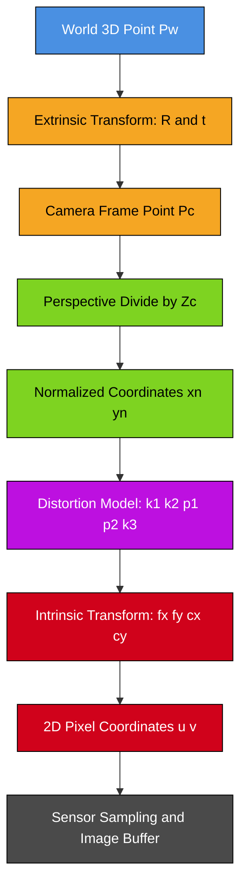
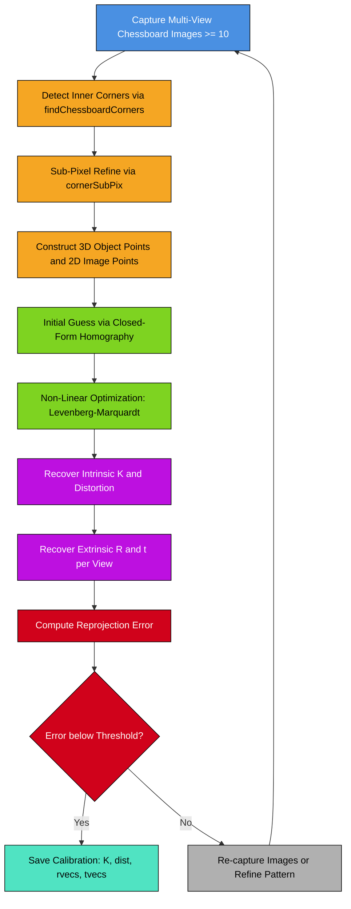

# Camera Calibration- Pinhole camera model

<!-- SECTION_1_START -->

# Camera Calibration: Pinhole Camera Model

## 1.1 Formal Definition

> [!IMPORTANT]
> **KTU Syllabus Definition (PECST745 — Module 1)**
> The **Pinhole Camera Model** is the fundamental geometric model of image formation in computer vision. It describes how a 3D point in the world coordinate system is projected onto a 2D image plane through a projective transformation mediated by a single infinitesimally small aperture (the *pinhole*). The complete mapping is described by the **Camera Projection Matrix** $P = K \cdot [R \mid t]$, which combines **intrinsic parameters** (focal length, principal point, skew) and **extrinsic parameters** (rotation and translation) to model the perspective projection of light rays.

In the context of **Camera Calibration**, this model is the foundation upon which the recovery of internal camera geometry (lens characteristics, sensor dimensions) and external pose (position and orientation of the camera in the world) is built. Calibration is the process of estimating the numerical values of these parameters from known geometric correspondences (e.g., a chessboard pattern).

## 1.2 Intuitive Overview & Real-World Analogy

> [!NOTE]
> **The Camera Obscura Analogy**
> Imagine you are standing inside a completely dark room. The only opening is a tiny hole on one wall. Outside, a tree is glowing in the sunlight. Light from the tree passes through this single pinhole and projects an *inverted, scaled replica* of the tree onto the opposite wall of the room. This is the **camera obscura** — the precursor to modern photography.
> 
> The tiny hole ensures that each point on the tree corresponds to exactly one ray reaching the back wall, producing a sharp, focused image. If the hole is too big, multiple rays from the same point hit different locations on the wall, producing a blurry image. The size of this hole is called the **aperture**.

### Geometric Intuition
Consider a 3D point $P$ in the world. A single ray travels from $P$ through the **optical center** $C$ (the pinhole) and strikes the image plane. The intersection of this ray with the image plane gives the 2D pixel location $p$. The distance between the optical center and the image plane is the **focal length** $f$ (typically measured in **millimeters** physically, and **pixels** in the digital model).

> [!IMPORTANT]
> **Key Constants of the Pinhole Model**
> - **Focal Length ($f$)**: $\mathbf{35\,mm}$ to $\mathbf{50\,mm}$ for standard cameras; physically, the distance from pinhole to image plane.
> - **Principal Point ($c_x, c_y$)**: The pixel coordinates where the optical axis pierces the image plane; ideally the image center, but manufacturing offsets shift it.
> - **Aperture Diameter ($d$)**: The diameter of the pinhole opening. Smaller $d \Rightarrow$ sharper image but less light. The **f-number** is $N = f/d$.

> [!VISUALIZATION CONTROL]
> **Concept:** Perspective projection of a 3D point onto a 2D image plane
> **GeoGebra / Desmos Input Equations:**
> * 3D World Point: $P = (3, 2, 5)$ (X, Y, Z in world coordinates)
> * Focal Length: $f = 2$
> * Optical Center: $C = (0, 0, 0)$
> * Image Plane Equation: $Z = f$ (vertical plane in front of optical center)
> * Projection Lines: ray from $P$ to $C$, intersecting the plane $Z = f$
> **Visual Description:** The student should plot the point $P$ in 3D, trace a line from $P$ through the origin, and observe where this line crosses the plane $Z = f$. The intersection is the projected 2D point $p$. Note how increasing $Z$ makes the projected point smaller (closer to the origin) and vice versa, illustrating the inverse-distance scaling of perspective projection.

---

<!-- SECTION_1_END -->

<!-- SECTION_2_START -->

# Deep Theoretical Analysis & KTU High-Yield Formula Sheet

## 2.1 Geometric Pipeline of Image Formation

The pinhole projection is a multi-stage mapping. Each stage has a clear geometric meaning:

### Stage 1 — World to Camera Coordinates (Rigid Body Transform)
A 3D world point $\mathbf{X}_w = (X_w, Y_w, Z_w, 1)^T$ is first transformed into the camera's local coordinate frame using a rotation $\mathbf{R}$ (a $3 \times 3$ orthonormal matrix) and a translation $\mathbf{t}$ (a $3 \times 1$ vector). This is the **extrinsic** transformation.

### Stage 2 — Perspective Projection (3D to 2D)
In the camera frame, the point $\mathbf{X}_c = (X_c, Y_c, Z_c)^T$ is projected onto the normalized image plane $Z_c = 1$ via the **division by depth**:

$$
x_n = \frac{X_c}{Z_c}, \quad y_n = \frac{Y_c}{Z_c}
$$

This non-linear step (the *perspective divide*) is the core of the pinhole model.

### Stage 3 — Normalized to Pixel Coordinates (Intrinsic Transform)
The normalized coordinates are then scaled by the focal length (in pixels) and shifted by the principal point to yield pixel coordinates $(u, v)$:

$$
u = f_x \cdot x_n + c_x, \quad v = f_y \cdot y_n + c_y
$$

The factor $f_x = f \cdot s_x$ converts physical focal length (mm) to pixels, where $s_x$ is the **pixels-per-millimeter** density of the sensor in the $X$ direction (and similarly $f_y$ for the $Y$ direction). The **skew parameter** $s$ accounts for non-rectangular sensor pixels.

> [!NOTE]
> **Why "Normalized"?**
> Dividing by $Z_c$ collapses the 3D camera frame onto a 2D plane at unit depth. This decouples the projection geometry from the absolute scale, allowing the focal length and principal point to be calibrated independently.

## 2.2 The Intrinsic Matrix $K$

The **camera intrinsic matrix** $K$ encodes all internal, fixed properties of the camera:

$$
K = \begin{bmatrix} f_x & s & c_x \\ 0 & f_y & c_y \\ 0 & 0 & 1 \end{bmatrix}
$$

- $f_x, f_y$ — Focal lengths in pixel units along $X$ and $Y$ axes.
- $c_x, c_y$ — Coordinates of the **principal point** (where the optical axis meets the sensor).
- $s$ — **Skew coefficient**, usually $\mathbf{0}$ for modern CMOS sensors with axis-aligned pixels.

## 2.3 The Extrinsic Matrix $[R \mid t]$

The **extrinsic matrix** describes the camera's pose (position and orientation) in the world:

$$
[R \mid t] = \begin{bmatrix} r_{11} & r_{12} & r_{13} & t_x \\ r_{21} & r_{22} & r_{23} & t_y \\ r_{31} & r_{32} & r_{33} & t_z \end{bmatrix}
$$

- $R$ is a $3 \times 3$ rotation matrix satisfying $R^T R = I$ and $\det(R) = 1$.
- $t$ is the $3 \times 1$ translation vector locating the camera origin in world coordinates.

## 2.4 The Complete Projection Equation

In homogeneous coordinates, the full pinhole model is the elegant linear expression:

$$
s \begin{bmatrix} u \\ v \\ 1 \end{bmatrix} = K \cdot [R \mid t] \cdot \begin{bmatrix} X_w \\ Y_w \\ Z_w \\ 1 \end{bmatrix}
$$

where $s$ is an arbitrary non-zero scale factor (absorbed by homogeneous normalization). This $3 \times 4$ matrix $P = K[R \mid t]$ is called the **Camera Projection Matrix**.

## 2.5 Lens Distortion Models

The ideal pinhole model assumes straight-line light propagation with no lens. Real lenses introduce deviations modeled as:

**Radial Distortion** (barrel/pincushion, dominant in wide-angle lenses):

$$
x_{rd} = x_n (1 + k_1 r^2 + k_2 r^4 + k_3 r^6)
$$

$$
y_{rd} = y_n (1 + k_1 r^2 + k_2 r^4 + k_3 r^6)
$$

**Tangential Distortion** (lens decentering):

$$
x_{td} = x_n + 2 p_1 x_n y_n + p_2 (r^2 + 2 x_n^2)
$$

$$
y_{td} = y_n + p_1 (r^2 + 2 y_n^2) + 2 p_2 x_n y_n
$$

where $r^2 = x_n^2 + y_n^2$, and $k_1, k_2, k_3, p_1, p_2$ are the **distortion coefficients**.

> [!IMPORTANT]
> **Real-World Use**
> Camera calibration is the bedrock of every CV pipeline: **autonomous vehicle lane detection** (calibrating fisheye and wide-angle cameras), **augmented reality** (rendering virtual objects in correct perspective), **3D reconstruction / Structure-from-Motion (SfM)** in photogrammetry and **SLAM** (Simultaneous Localization and Mapping) in robotics. Without calibration, virtual objects in AR apps appear to "float" or sink into surfaces, and stereo vision depth maps are grossly inaccurate.

## 2.6 KTU Formula Sheet (Cheat Sheet)

| Symbol | Meaning | Typical Units | Constraint / Range |
|---|---|---|---|
| $f$ | Focal length (physical) | $\mathbf{mm}$ | $f > 0$ |
| $f_x, f_y$ | Focal length in pixel units | $\mathbf{pixels}$ | $f_x, f_y > 0$ |
| $c_x, c_y$ | Principal point | $\mathbf{pixels}$ | $\approx$ image center |
| $s$ | Skew coefficient | dimensionless | $s = 0$ (modern sensors) |
| $R$ | Rotation matrix | $3 \times 3$ | $R^T R = I, \det(R) = 1$ |
| $t$ | Translation vector | $\mathbf{mm}$ or $\mathbf{m}$ | unconstrained |
| $k_1, k_2, k_3$ | Radial distortion coefficients | dimensionless | $k_1 \in [-0.5, 0.5]$ typical |
| $p_1, p_2$ | Tangential distortion coefficients | dimensionless | small magnitude |
| $Z_c$ | Depth of point in camera frame | $\mathbf{mm}$ or $\mathbf{m}$ | $Z_c > 0$ (in front) |

---

<!-- SECTION_2_END -->

<!-- SECTION_3_START -->

# Step-by-Step Derivations & Code Implementation

## 3.1 Derivation of the Pinhole Projection Equation

**Given:** A 3D point $P_c = (X_c, Y_c, Z_c)^T$ in the camera coordinate frame, with the optical center at the origin and the image plane at $Z = f$.

**Step 1 — Apply similar triangles.**
A ray from $P_c$ to the optical center $O$ crosses the image plane at $p = (x, y, f)$. By similar triangles:

$$
\frac{x}{f} = \frac{X_c}{Z_c} \quad \Rightarrow \quad x = f \cdot \frac{X_c}{Z_c}
$$

$$
\frac{y}{f} = \frac{Y_c}{Z_c} \quad \Rightarrow \quad y = f \cdot \frac{Y_c}{Z_c}
$$

**Step 2 — Convert from metric to pixel units.**
The image plane is sampled by a discrete sensor with pixel densities $s_x$ and $s_y$ (pixels per millimeter). Multiply the metric coordinates by these densities to obtain pixel coordinates:

$$
u = s_x \cdot x = (f \cdot s_x) \cdot \frac{X_c}{Z_c} = f_x \cdot \frac{X_c}{Z_c}
$$

$$
v = s_y \cdot y = (f \cdot s_y) \cdot \frac{Y_c}{Z_c} = f_y \cdot \frac{Y_c}{Z_c}
$$

**Step 3 — Account for principal point offset.**
The origin of the pixel coordinate system is the top-left corner of the sensor, not the principal point. Shift by $(c_x, c_y)$:

$$
u = f_x \cdot \frac{X_c}{Z_c} + c_x, \qquad v = f_y \cdot \frac{Y_c}{Z_c} + c_y
$$

**Step 4 — Express in homogeneous matrix form.**
Let $s = Z_c$ be the scale. Then the projection becomes the linear equation:

$$
s \begin{bmatrix} u \\ v \\ 1 \end{bmatrix} = \begin{bmatrix} f_x & 0 & c_x \\ 0 & f_y & c_y \\ 0 & 0 & 1 \end{bmatrix} \begin{bmatrix} X_c \\ Y_c \\ Z_c \end{bmatrix}
$$

**Step 5 — Add the world-to-camera transformation.**
Since $P_c = R P_w + t$ in homogeneous form $\begin{bmatrix} X_c \\ Y_c \\ Z_c \\ 1 \end{bmatrix} = \begin{bmatrix} R & t \\ 0^T & 1 \end{bmatrix} \begin{bmatrix} X_w \\ Y_w \\ Z_w \\ 1 \end{bmatrix}$, the final camera projection matrix is:

$$
P = K \cdot [R \mid t] = \begin{bmatrix} f_x & 0 & c_x \\ 0 & f_y & c_y \\ 0 & 0 & 1 \end{bmatrix} \begin{bmatrix} r_{11} & r_{12} & r_{13} & t_x \\ r_{21} & r_{22} & r_{23} & t_y \\ r_{31} & r_{32} & r_{33} & t_z \end{bmatrix}
$$

## 3.2 Derivation of the Direct Linear Transform (DLT) for Calibration

**Problem:** Given $n \geq 6$ corresponding 3D-2D point pairs $\{(X_i, Y_i, Z_i) \leftrightarrow (u_i, v_i)\}_{i=1}^n$, find the $3 \times 4$ projection matrix $P$.

**Step 1 — Write the projection as a linear equation.**
From $s_i (u_i, v_i, 1)^T = P \cdot (X_i, Y_i, Z_i, 1)^T$, denote the $j$-th row of $P$ as $p_j^T$. Then:

$$
u_i = \frac{p_1^T X_i}{p_3^T X_i}, \quad v_i = \frac{p_2^T X_i}{p_3^T X_i}
$$

**Step 2 — Cross-multiply to eliminate the denominator.**

$$
u_i (p_3^T X_i) - p_1^T X_i = 0
$$

$$
v_i (p_3^T X_i) - p_2^T X_i = 0
$$

**Step 3 — Formulate the linear system for a single correspondence.**
Writing $X_i = (X_i, Y_i, Z_i, 1)^T$ and stacking the two equations vertically:

$$
\begin{bmatrix} -X_i^T & 0^T & u_i X_i^T \\ 0^T & -X_i^T & v_i X_i^T \end{bmatrix} \begin{bmatrix} p_1 \\ p_2 \\ p_3 \end{bmatrix} = \begin{bmatrix} 0 \\ 0 \end{bmatrix}
$$

**Step 4 — Stack all $n$ correspondences and solve.**
Stacking the $2n \times 12$ matrix $A$, we solve $A p = 0$ via the **Singular Value Decomposition (SVD)** of $A$. The solution is the right singular vector corresponding to the smallest singular value. A scale constraint $\|p\| = 1$ is imposed.

**Step 5 — Extract $K$, $R$, and $t$ from $P$.**
Apply **RQ decomposition** to the left $3 \times 3$ block of $P$ to recover $K$ (upper triangular) and $R$ (orthogonal). The translation is $t = K^{-1} p_4$, where $p_4$ is the fourth column of $P$.

## 3.3 Python Implementation (OpenCV-based Calibration)

```python
import numpy as np
import cv2
import glob
from typing import List, Tuple, Optional


def calibrate_camera_from_chessboard(
    image_directory: str,
    pattern_size: Tuple[int, int],
    square_size_mm: float
) -> Tuple[bool, np.ndarray, np.ndarray, np.ndarray, np.ndarray, List[float]]:
    """
    Perform full camera calibration using a planar chessboard pattern.

    Parameters
    ----------
    image_directory : str
        Glob pattern (e.g., 'calib_images/*.jpg') for chessboard images.
    pattern_size : Tuple[int, int]
        Number of inner corners as (columns, rows), e.g., (9, 6).
    square_size_mm : float
        Physical side length of one chessboard square in millimeters.

    Returns
    -------
    success : bool
        True if calibration converged.
    K : np.ndarray of shape (3, 3)
        Intrinsic camera matrix.
    dist : np.ndarray of shape (1, 5) or (1, 8)
        Distortion coefficients [k1, k2, p1, p2, k3, (k4, k5, k6)].
    rvecs : List[np.ndarray]
        Rotation vectors (Rodrigues form) for each image.
    tvecs : List[np.ndarray]
        Translation vectors for each image.
    reprojection_errors : List[float]
        Per-image RMS reprojection error in pixels.
    """
    # Termination criteria for corner sub-pixel refinement
    criteria_subpix: Tuple[int, int, float] = (
        cv2.TERM_CRITERIA_EPS + cv2.TERM_CRITERIA_MAX_ITER,
        30,
        0.001
    )

    # Construct the 3D object points for a single chessboard view
    objp: np.ndarray = np.zeros((pattern_size[0] * pattern_size[1], 3), np.float32)
    objp[:, :2] = np.mgrid[0:pattern_size[0], 0:pattern_size[1]].T.reshape(-1, 2)
    objp *= square_size_mm  # Scale to physical units (mm)

    obj_points: List[np.ndarray] = []
    img_points: List[np.ndarray] = []
    image_size: Optional[Tuple[int, int]] = None

    images: List[str] = sorted(glob.glob(image_directory))
    if not images:
        raise FileNotFoundError(f"No images found at pattern: {image_directory}")

    for fname in images:
        img: np.ndarray = cv2.imread(fname)
        if img is None:
            print(f"[WARNING] Could not read image: {fname}. Skipping.")
            continue

        gray: np.ndarray = cv2.cvtColor(img, cv2.COLOR_BGR2GRAY)
        if image_size is None:
            image_size = (gray.shape[1], gray.shape[0])

        # Detect chessboard corners (inner corners only)
        ret: bool
        corners: np.ndarray
        ret, corners = cv2.findChessboardCorners(gray, pattern_size, None)

        if not ret:
            print(f"[WARNING] Chessboard not detected in: {fname}. Skipping.")
            continue

        # Refine corners to sub-pixel accuracy
        corners_refined: np.ndarray = cv2.cornerSubPix(
            gray, corners, (11, 11), (-1, -1), criteria_subpix
        )

        obj_points.append(objp)
        img_points.append(corners_refined)

    if len(obj_points) < 10:
        print(f"[ERROR] Insufficient valid views: {len(obj_points)}. Need >= 10.")
        return False, np.eye(3), np.zeros((1, 5)), [], [], []

    assert image_size is not None
    # Run the OpenCV calibration routine (Zhang's method internally)
    ret: float
    K: np.ndarray
    dist: np.ndarray
    rvecs: List[np.ndarray]
    tvecs: List[np.ndarray]
    ret, K, dist, rvecs, tvecs = cv2.calibrateCamera(
        obj_points, img_points, image_size, None, None
    )

    if not ret:
        print("[ERROR] cv2.calibrateCamera failed to converge.")
        return False, np.eye(3), np.zeros((1, 5)), [], [], []

    # Compute per-image reprojection error
    reprojection_errors: List[float] = []
    for i in range(len(obj_points)):
        projected: np.ndarray
        projected, _ = cv2.projectPoints(
            obj_points[i], rvecs[i], tvecs[i], K, dist
        )
        error: float = float(np.sqrt(
            np.mean(np.sum((projected.squeeze() - img_points[i].squeeze()) ** 2, axis=1))
        ))
        reprojection_errors.append(error)
        print(f"[INFO] Image {i}: RMS reprojection error = {error:.4f} pixels")

    mean_error: float = float(np.mean(reprojection_errors))
    print(f"[INFO] Calibration successful. Mean RMS error = {mean_error:.4f} pixels")
    print(f"[INFO] Intrinsic matrix K =\n{K}")
    print(f"[INFO] Distortion coefficients = {dist.ravel()}")

    return True, K, dist, rvecs, tvecs, reprojection_errors


def undistort_image(
    image: np.ndarray, K: np.ndarray, dist: np.ndarray
) -> np.ndarray:
    """
    Remove lens distortion from a single image using calibrated parameters.

    Parameters
    ----------
    image : np.ndarray
        Distorted input image (H x W x 3).
    K : np.ndarray of shape (3, 3)
        Calibrated intrinsic matrix.
    dist : np.ndarray of shape (1, 5) or (1, 8)
        Calibrated distortion coefficients.

    Returns
    -------
    undistorted : np.ndarray
        Image with radial and tangential distortion removed.
    """
    h, w = image.shape[:2]
    # Optimal new camera matrix to remove black borders
    new_K: np.ndarray
    roi: Tuple[int, int, int, int]
    new_K, roi = cv2.getOptimalNewCameraMatrix(K, dist, (w, h), 1, (w, h))
    undistorted: np.ndarray = cv2.undistort(image, K, dist, None, new_K)
    # Crop to valid region
    x, y, w_roi, h_roi = roi
    if all(v > 0 for v in roi):
        undistorted = undistorted[y:y + h_roi, x:x + w_roi]
    return undistorted


# ------------------- USAGE EXAMPLE -------------------
if __name__ == "__main__":
    success: bool
    K: np.ndarray
    dist: np.ndarray
    rvecs: List[np.ndarray]
    tvecs: List[np.ndarray]
    errors: List[float]

    success, K, dist, rvecs, tvecs, errors = calibrate_camera_from_chessboard(
        image_directory='calib_images/*.jpg',
        pattern_size=(9, 6),
        square_size_mm=25.0
    )

    if success:
        test_img: np.ndarray = cv2.imread('test_image.jpg')
        if test_img is not None:
            clean: np.ndarray = undistort_image(test_img, K, dist)
            cv2.imwrite('undistorted_test.jpg', clean)
            print("[INFO] Undistorted image saved.")
```

> [!IMPORTANT]
> **Code Implementation Notes for the Examiner**
> - `cv2.calibrateCamera()` internally uses **Zhang's method** (planar pattern, multiple views, closed-form initialization followed by non-linear Levenberg–Marquardt refinement).
> - A minimum of $\mathbf{10}$ diverse views of the chessboard is recommended for stable calibration; 3 views is the theoretical minimum for unique solution (with known square size).
> - Reprojection error below $\mathbf{0.5}$ pixel is considered **excellent**; below $\mathbf{1.0}$ pixel is acceptable for most applications.

---

<!-- SECTION_3_END -->

<!-- SECTION_4_START -->

# Structural Diagrams & Schematics

## 4.1 Pinhole Projection Geometry — Block-Level Functional Architecture



## 4.2 Camera Calibration Pipeline (Zhang's Method)



## 4.3 Coordinate Frame Transformation Sequence

```mermaid
subgraph SF1[World Coordinate Frame W]
    WP1[World Point Xw Yw Zw]
end

subgraph SF2[Camera Coordinate Frame C]
    CP1[Camera Point Xc Yc Zc]
end

subgraph SF3[Image Plane at Zc equals f]
    NP1[Normalized xn yn 1]
end

subgraph SF4[Pixel Coordinate Frame]
    PX1[Pixel u v]
end

WP1 -->|R and t: 6 DOF| CP1
CP1 -->|Perspective Divide by Zc| NP1
NP1 -->|K: Intrinsic 5 DOF| PX1

style SF1 fill:#E8F4FD,stroke:#000000,color:#000000
style SF2 fill:#FEF5E7,stroke:#000000,color:#000000
style SF3 fill:#E8F8E8,stroke:#000000,color:#000000
style SF4 fill:#FDE8E8,stroke:#000000,color:#000000
style WP1 fill:#4A90E2,stroke:#000000,color:#FFFFFF
style CP1 fill:#F5A623,stroke:#000000,color:#000000
style NP1 fill:#7ED321,stroke:#000000,color:#000000
style PX1 fill:#D0021B,stroke:#000000,color:#FFFFFF
```

> [!NOTE]
> **Reading the Diagrams**
> - **Diagram 1** shows the mathematical pipeline from a 3D world point to a 2D pixel.
> - **Diagram 2** shows the engineering pipeline for offline calibration (Zhang's planar method).
> - **Diagram 3** decomposes the projection into three sequential reference frames, each contributing a distinct set of parameters (**degrees of freedom**): extrinsic (6 DOF), intrinsic (5 DOF), and the perspective divide (non-linear).

---

<!-- SECTION_4_END -->

<!-- SECTION_5_START -->

# KTU 2024 Scheme Examination Question Bank & Topic Recap

## Part A Questions (3 Marks Each)

### Question 1: Define the pinhole camera model and list its intrinsic parameters. [KTU University Exam — July 2024]
**Model Answer (3 Marks):**

> [!IMPORTANT]
> **Definition:**
> The pinhole camera model is an idealized mathematical model of image formation in which light from a 3D scene passes through an infinitesimally small aperture (the pinhole) and is projected onto an image plane, producing an inverted 2D representation of the 3D scene.

**Intrinsic Parameters (the camera's internal, fixed properties):**
1. **Focal length** $f_x, f_y$ in pixel units (the distance from the pinhole to the image plane, scaled by sensor pixel density).
2. **Principal point** $c_x, c_y$ in pixel coordinates (the projection of the optical center onto the image plane).
3. **Skew coefficient** $s$ (accounts for non-rectangular sensor pixels; typically 0).

> [Naming the model: 1 Mark] [Listing and explaining all 3 categories: 2 Marks]

---

### Question 2: What is radial distortion? How is it mathematically modeled? [KTU University Exam — Dec 2023]
**Model Answer (3 Marks):**

**Definition:** Radial distortion is a lens aberration that causes image points to be displaced radially inward (barrel) or outward (pincushion) from their ideal pinhole-projected locations. It is caused by the non-ideal curvature of the lens elements and is most pronounced in wide-angle and fisheye lenses.

**Mathematical Model:**

$$
x_{distorted} = x_n \left( 1 + k_1 r^2 + k_2 r^4 + k_3 r^6 \right)
$$

$$
y_{distorted} = y_n \left( 1 + k_1 r^2 + k_2 r^4 + k_3 r^6 \right)
$$

where $r^2 = x_n^2 + y_n^2$ and $(k_1, k_2, k_3)$ are the radial distortion coefficients. The term $k_1$ dominates; $k_3$ is needed only for severe wide-angle distortion.

> [Defining radial distortion: 1 Mark] [Writing the distortion equation: 1 Mark] [Identifying coefficients and effect: 1 Mark]

---

## Part B Questions (14 Marks Each)

> [!IMPORTANT]
> **KTU 2024 Scheme Pattern:** Each Part B question carries 14 marks with sub-parts (a) 7 marks and (b) 7 marks. Internal choice is mandatory.

---

### Question A: Derive the Pinhole Camera Model with Intrinsic and Extrinsic Parameters

**[KTU University Exam — Model Question as per 2024 Scheme, CO1, Apply/Analyze]**

#### Part (a) — 7 Marks
**Q: Derive the complete camera projection matrix $P = K[R \mid t]$ starting from a 3D world point. Clearly define each parameter and explain the role of homogeneous coordinates.**

**Step-by-Step Model Solution:**

**Step 1 — World to Camera Frame Transformation** [Stating extrinsic setup: 2 Marks]

A 3D world point $X_w = (X_w, Y_w, Z_w, 1)^T$ is mapped to the camera frame via the rigid-body transform:

$$
X_c = R X_w + t \quad \Rightarrow \quad \begin{bmatrix} X_c \\ Y_c \\ Z_c \\ 1 \end{bmatrix} = \begin{bmatrix} R & t \\ 0^T & 1 \end{bmatrix} \begin{bmatrix} X_w \\ Y_w \\ Z_w \\ 1 \end{bmatrix}
$$

where $R \in SO(3)$ is a $3 \times 3$ rotation matrix ($R^T R = I$, $\det(R) = 1$) and $t \in \mathbb{R}^3$ is the translation of the camera origin in world coordinates.

**Step 2 — Perspective Projection (Division by Depth)** [Deriving the projection: 2 Marks]

In the camera frame, the pinhole geometry yields by similar triangles:

$$
x = f \frac{X_c}{Z_c}, \quad y = f \frac{Y_c}{Z_c}
$$

This is the *perspective divide*, the non-linear core of the pinhole model.

**Step 3 — Conversion to Pixel Units and Principal Point Shift** [Forming K: 2 Marks]

Scaling by pixel density $s_x, s_y$ and shifting by the principal point $(c_x, c_y)$:

$$
u = f_x \frac{X_c}{Z_c} + c_x, \quad v = f_y \frac{Y_c}{Z_c} + c_y
$$

**Step 4 — Homogeneous Matrix Form** [Final P expression: 1 Mark]

Let $s = Z_c$. Then in homogeneous coordinates:

$$
s \begin{bmatrix} u \\ v \\ 1 \end{bmatrix} = \underbrace{\begin{bmatrix} f_x & 0 & c_x \\ 0 & f_y & c_y \\ 0 & 0 & 1 \end{bmatrix}}_{K} \cdot \underbrace{\begin{bmatrix} r_{11} & r_{12} & r_{13} & t_x \\ r_{21} & r_{22} & r_{23} & t_y \\ r_{31} & r_{32} & r_{33} & t_z \end{bmatrix}}_{[R \mid t]} \cdot \begin{bmatrix} X_w \\ Y_w \\ Z_w \\ 1 \end{bmatrix}
$$

> [!WARNING]
> **Examiner's Pitfall Callout (Part a):**
> Students commonly confuse $K$ as a $3 \times 3$ *projection* matrix — it is the **intrinsic** matrix. The full projection matrix $P$ is $3 \times 4$. Also, do not forget to include the homogeneous scaling factor $s = Z_c$ in your derivation; it is not optional.

#### Part (b) — 7 Marks
**Q: With a numerical example, verify the projection of a 3D world point $(200, 150, 50, 1)^T$ mm using a camera with $f_x = 800, f_y = 800, c_x = 320, c_y = 240$, $R = I$ (identity), and $t = (0, 0, 0)^T$. Then explain what the principal point represents physically.**

**Step-by-Step Model Solution:**

**Step 1 — Identify the Inputs** [Stating given values: 1 Mark]

Given: $X_w = (200, 150, 50, 1)^T$ mm. Since $R = I$ and $t = 0$, $X_c = X_w = (200, 150, 50)^T$. So $X_c = 200$, $Y_c = 150$, $Z_c = 50$. Intrinsics: $f_x = f_y = 800$ pixels, $c_x = 320, c_y = 240$ pixels.

**Step 2 — Apply the Projection Formula** [Computing normalized coordinates: 2 Marks]

$$
x_n = \frac{X_c}{Z_c} = \frac{200}{50} = 4.0
$$

$$
y_n = \frac{Y_c}{Z_c} = \frac{150}{50} = 3.0
$$

**Step 3 — Convert to Pixel Coordinates** [Final pixel computation: 2 Marks]

$$
u = f_x \cdot x_n + c_x = 800 \cdot 4.0 + 320 = 3200 + 320 = 3520 \text{ pixels}
$$

$$
v = f_y \cdot y_n + c_y = 800 \cdot 3.0 + 240 = 2400 + 240 = 2640 \text{ pixels}
$$

**Verification via Matrix Form** [Matrix multiplication check: 1 Mark]

$$
s \begin{bmatrix} u \\ v \\ 1 \end{bmatrix} = \begin{bmatrix} 800 & 0 & 320 \\ 0 & 800 & 240 \\ 0 & 0 & 1 \end{bmatrix} \begin{bmatrix} 200 \\ 150 \\ 50 \end{bmatrix} = \begin{bmatrix} 160000 + 0 + 16000 \\ 0 + 120000 + 12000 \\ 50 \end{bmatrix} = \begin{bmatrix} 176000 \\ 132000 \\ 50 \end{bmatrix}
$$

Dividing by $s = 50$:

$$
u = 3520 \text{ pixels}, \quad v = 2640 \text{ pixels} \checkmark
$$

**Step 4 — Physical Interpretation of Principal Point** [Explanation: 1 Mark]

> The **principal point** $(c_x, c_y)$ represents the pixel coordinates at which the camera's **optical axis** (the $Z_c$ axis, perpendicular to the image plane) pierces the sensor. Geometrically, it is the projection of the optical center. In a perfectly manufactured camera, the principal point coincides with the image center. Deviations are caused by sensor mounting tolerances and lens misalignment.

> [!WARNING]
> **Examiner's Pitfall Callout (Part b):**
> Do not skip the homogeneous matrix verification — many students compute $(u, v)$ but never show the matrix form, losing the "verification" marks. Also, ensure the depth $Z_c = 50$ mm is **positive** (point is in front of camera); a negative $Z_c$ would project behind the optical center and is physically invalid.

---

### Question B: Explain the Camera Calibration Process using Zhang's Method with Distortion Modeling

**[KTU University Exam — Model Question as per 2024 Scheme, CO2, Apply/Analyze]**

#### Part (a) — 7 Marks
**Q: Explain the step-by-step procedure of Zhang's camera calibration method. Why is a planar chessboard pattern used, and what is the minimum number of views required?**

**Step-by-Step Model Solution:**

**Step 1 — Planar Pattern Choice** [Why planar: 2 Marks]

A planar chessboard pattern is used because:
- It provides a **2D-to-3D homography** between the pattern plane and the image plane, allowing a closed-form initial solution.
- The geometry is simple, with known corner coordinates on a single plane ($Z = 0$).
- It is cheap, printable, and provides high-contrast features for robust corner detection.

**Step 2 — Capture Multiple Views** [View count rationale: 1 Mark]

The chessboard is photographed in at least $\mathbf{3}$ different orientations (in theory) to constrain the 5 intrinsic parameters and 6 extrinsic parameters per view. In practice, $\mathbf{10}$ to $\mathbf{20}$ views are used to ensure numerical stability and to estimate distortion coefficients reliably.

**Step 3 — Detect Corners with Sub-Pixel Accuracy** [Detection: 1 Mark]

For each image, the inner chessboard corners are detected using `cv2.findChessboardCorners`, then refined to sub-pixel precision via `cv2.cornerSubPix`. This gives 2D image points $(u_i, v_i)$ paired with known 3D object points $(X_i, Y_i, 0)$ on the calibration target.

**Step 4 — Closed-Form Initialization via Homography** [Closed-form solution: 2 Marks]

For a single planar view, the 3D-to-2D mapping reduces to a $3 \times 3$ homography $H$:

$$
s \begin{bmatrix} u_i \\ v_i \\ 1 \end{bmatrix} = H \begin{bmatrix} X_i \\ Y_i \\ 1 \end{bmatrix}
$$

$H$ is estimated linearly (DLT) from the correspondences. The intrinsic matrix $K$ is then recovered from $H$ by exploiting the orthogonality constraints of $R$:

$$
h_1^T K^{-T} K^{-1} h_2 = 0, \quad h_1^T K^{-T} K^{-1} h_1 = h_2^T K^{-T} K^{-1} h_2
$$

This yields a linear system in the 5 unknowns of $K$ (since $K$ has 5 DOF: $f_x, f_y, c_x, c_y, s$).

**Step 5 — Non-Linear Refinement** [Optimization: 1 Mark]

A **Levenberg–Marquardt** optimizer minimizes the sum of squared reprojection errors:

$$
\sum_{i=1}^{n} \sum_{j=1}^{m} \left\| p_{ij} - \hat{p}(K, R_i, t_i, X_j) \right\|^2
$$

where $\hat{p}$ is the predicted pixel location under the current estimate of $K$, $R_i$, $t_i$, and distortion coefficients.

> [!WARNING]
> **Examiner's Pitfall Callout (Part a):**
> Students often state "minimum 3 views" without qualifying that it is a *theoretical* minimum assuming distortion is negligible. For real-world calibration with distortion modeling, **at least 10 views** are necessary. Failing to mention this distinction costs easy marks.

#### Part (b) — 7 Marks
**Q: Derive the complete distortion model combining radial and tangential components. For a point with normalized coordinates $(0.5, 0.3)$ and distortion coefficients $k_1 = 0.1, k_2 = 0.05, p_1 = 0.002, p_2 = -0.003$, compute the distorted coordinates.**

**Step-by-Step Model Solution:**

**Step 1 — Radial Distortion Derivation** [Deriving radial: 2 Marks]

The radial distortion displaces the image point along the radial direction by a polynomial in $r^2$:

$$
x_{rd} = x_n (1 + k_1 r^2 + k_2 r^4), \quad y_{rd} = y_n (1 + k_1 r^2 + k_2 r^4)
$$

where $r^2 = x_n^2 + y_n^2$. This form is derived from the Taylor expansion of the lens's radial distortion profile. The odd-power terms vanish by symmetry, leaving only even powers.

**Step 2 — Tangential Distortion Derivation** [Deriving tangential: 2 Marks]

Tangential distortion arises from lens decentering. Geometrically, it can be modeled as:

$$
x_{td} = 2 p_1 x_n y_n + p_2 (r^2 + 2 x_n^2)
$$

$$
y_{td} = p_1 (r^2 + 2 y_n^2) + 2 p_2 x_n y_n
$$

**Step 3 — Complete Distortion Model** [Combined equation: 1 Mark]

$$
x_d = x_n (1 + k_1 r^2 + k_2 r^4) + 2 p_1 x_n y_n + p_2 (r^2 + 2 x_n^2)
$$

$$
y_d = y_n (1 + k_1 r^2 + k_2 r^4) + p_1 (r^2 + 2 y_n^2) + 2 p_2 x_n y_n
$$

**Step 4 — Numerical Computation** [Storing values: 1 Mark]

Given: $x_n = 0.5$, $y_n = 0.3$, $k_1 = 0.1$, $k_2 = 0.05$, $p_1 = 0.002$, $p_2 = -0.003$.

**Step 5 — Compute $r^2$** [Intermediate: 1 Mark]

$$
r^2 = x_n^2 + y_n^2 = (0.5)^2 + (0.3)^2 = 0.25 + 0.09 = 0.34
$$

$$
r^4 = (0.34)^2 = 0.1156
$$

**Step 6 — Compute Distorted Coordinates** [Final numerical: 2 Marks]

Radial factor: $1 + k_1 r^2 + k_2 r^4 = 1 + 0.1(0.34) + 0.05(0.1156) = 1 + 0.034 + 0.00578 = 1.03978$

$$
x_d = 0.5 \times 1.03978 + 2(0.002)(0.5)(0.3) + (-0.003)(0.34 + 2 \times 0.25)
$$

$$
x_d = 0.51989 + 0.0006 + (-0.003)(0.34 + 0.5)
$$

$$
x_d = 0.51989 + 0.0006 + (-0.003)(0.84) = 0.51989 + 0.0006 - 0.00252 = 0.51797
$$

$$
y_d = 0.3 \times 1.03978 + (0.002)(0.34 + 2 \times 0.09) + 2(-0.003)(0.5)(0.3)
$$

$$
y_d = 0.31193 + (0.002)(0.52) + (-0.018)(0.3)
$$

Wait — recompute the last term: $2 p_2 x_n y_n = 2(-0.003)(0.5)(0.3) = -0.0009$.

$$
y_d = 0.31193 + 0.00104 - 0.0009 = 0.31207
$$

**Final Answer:** $x_d \approx 0.518$, $y_d \approx 0.312$.

> [!WARNING]
> **Examiner's Pitfall Callout (Part b):**
> Students frequently forget the **$r^4$** term when $k_2$ is "small," or they mix up the sign convention. The sign of $p_1, p_2$ directly affects whether the tangential displacement is inward or outward. Always recheck the sign in the final step. **Do not round intermediate values** — carry full precision to avoid compounding errors.

---

## Topic Recap & Important Things to Remember

> [!IMPORTANT]
> **Rapid Revision Checklist — Pinhole Camera Model & Calibration**

### Core Definitions
- **Pinhole Model:** Geometric model where light passes through a single point aperture to form an inverted, focused image.
- **Optical Center ($C$):** The location of the pinhole; origin of the camera coordinate frame.
- **Image Plane:** Virtual plane at distance $f$ from $C$ where the projected image forms.
- **Principal Point ($c_x, c_y$):** Pixel coordinates where the optical axis pierces the sensor.
- **Focal Length ($f$):** Distance from optical center to image plane (mm physically, pixels in matrix form).
- **Field of View (FOV):** Angular extent of the scene captured; related to $f$ and sensor size.
- **Camera Projection Matrix ($P$):** $3 \times 4$ matrix mapping 3D world points to 2D image pixels; $P = K[R \mid t]$.

### Critical Equations
- **Perspective divide:** $x_n = X_c / Z_c$, $y_n = Y_c / Z_c$
- **Pixel projection:** $u = f_x x_n + c_x$, $v = f_y y_n + c_y$
- **Intrinsic matrix $K$:** $3 \times 3$ upper triangular with $f_x, f_y, c_x, c_y, s$ (5 DOF).
- **Extrinsic matrix $[R \mid t]$:** $3 \times 4$ with $R \in SO(3)$ (3 DOF) and $t \in \mathbb{R}^3$ (3 DOF) — 6 DOF total.
- **Radial distortion:** $x_d = x_n (1 + k_1 r^2 + k_2 r^4 + k_3 r^6)$
- **Tangential distortion:** $x_d = x_n + 2 p_1 x_n y_n + p_2 (r^2 + 2 x_n^2)$

### Key Engineering Facts
- **Total DOF of pinhole calibration:** $\mathbf{5 \text{ (intrinsics)} + 6 \text{ (extrinsics per view)} + 5 \text{ (distortion)} = 16 \text{ parameters per view}}$.
- **Minimum views for unique $K$:** $\mathbf{3}$ (theoretical, distortion-free); $\mathbf{\geq 10}$ practical.
- **Minimum correspondences per view:** 4 (for homography); 6 for full DLT.
- **Zhang's method:** Uses a planar pattern; closed-form initialization from homography + LM refinement.
- **Reprojection error benchmark:** $< \mathbf{0.5}$ pixel = excellent; $< \mathbf{1.0}$ pixel = good.
- **Cross-validation:** Split chessboard views into training and test sets; test error should be within 10% of training error.

### Real-World Applications to Remember
- **Autonomous driving:** Fisheye camera calibration for $360^\circ$ surround view.
- **Augmented Reality (AR):** Apple ARKit and Google ARCore perform on-device calibration using feature tracking.
- **Medical Imaging:** Endoscope and microscope calibration for accurate 3D measurement.
- **Industrial Metrology:** Calibration of high-resolution cameras for sub-pixel dimensional inspection.
- **Stereo Vision:** Calibrated stereo rigs (left and right cameras) enable metric depth estimation via triangulation.

### Common Examination Mistakes to Avoid
1. Confusing $K$ (intrinsic) with $P$ (full projection matrix).
2. Forgetting the homogeneous scale factor $s$ in derivations.
3. Mixing up the order of operations: divide by $Z_c$ *before* multiplying by $K$.
4. Using only 3 chessboard views and reporting unstable calibration.
5. Neglecting tangential distortion when the lens has clear decentering.
6. Forgetting to call `cv2.undistort` *after* calibration to remove distortion from test images.

---

<!-- SECTION_5_END -->
