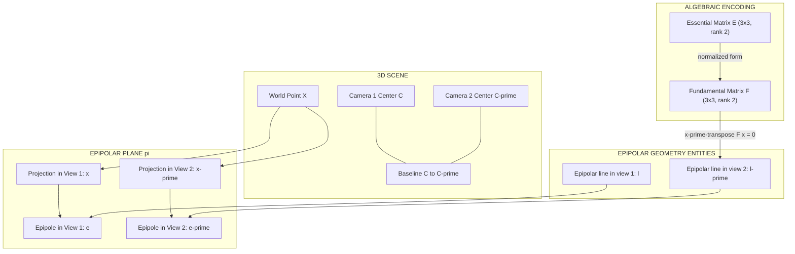
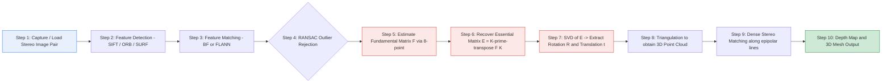
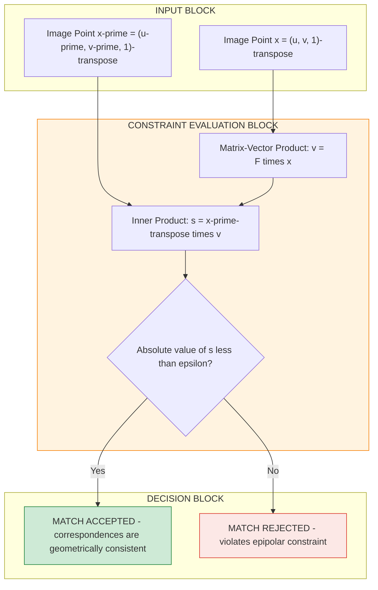
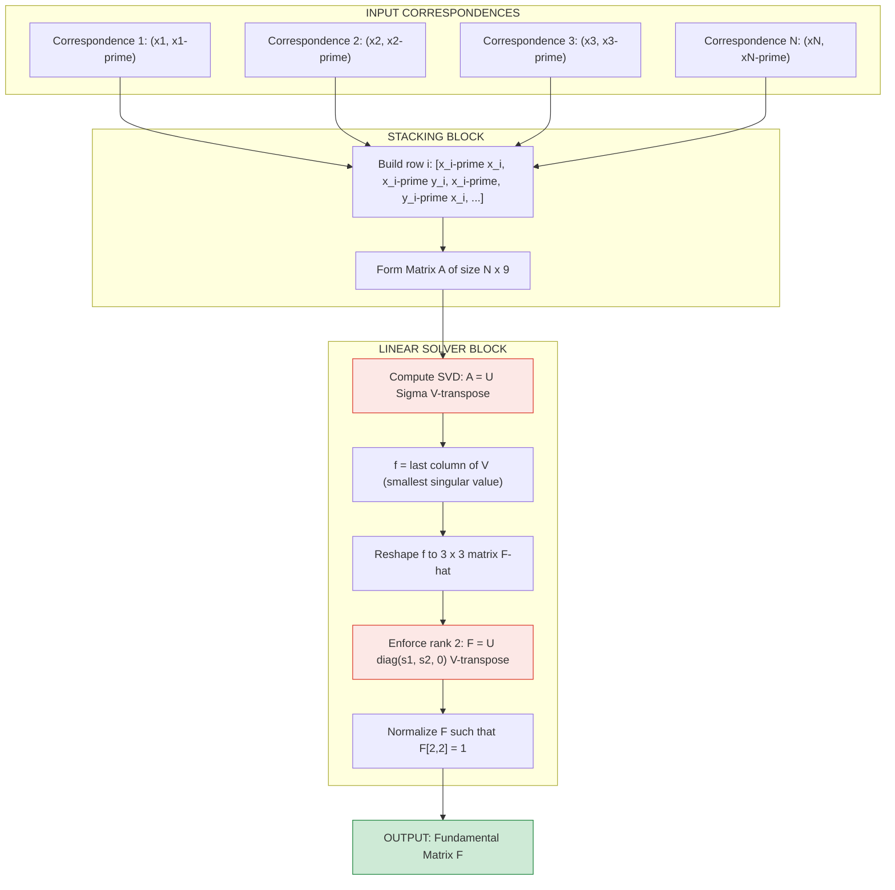

# Epipolar Constraint

<!-- SECTION_1_START -->

# Epipolar Constraint — Core Technical Definition & Intuitive Overview

> [!IMPORTANT]
> **Syllabus Highlight (KTU PECST745 — Module 1):** Epipolar geometry is a foundational sub-topic under *Multi-View Geometry & Camera Calibration*. It is the mathematical bridge that links two calibrated (or uncalibrated) camera views of the same 3D scene and underpins **stereo vision, Structure-from-Motion (SfM), and SLAM**.

## 1.1 Formal Academic Definition

The **Epipolar Constraint** is a *geometric relationship* between two perspective images of the same 3D scene that restricts where a point observed in one image can appear in the second image. Given a 3D world point $\mathbf{X}$ projected to pixel $\mathbf{x}$ in the *first* view and $\mathbf{x}'$ in the *second* view, all such corresponding points must satisfy the **bilinear constraint**:

$$\mathbf{x}'^{\top}\,\mathbf{F}\,\mathbf{x} \;=\; 0$$

where $\mathbf{F} \in \mathbb{R}^{3 \times 3}$ is the **Fundamental Matrix** of rank 2. When the cameras are *calibrated* (intrinsics known), the equivalent constraint is written with the **Essential Matrix** $\mathbf{E}$:

$$\hat{\mathbf{x}}'^{\top}\,\mathbf{E}\,\hat{\mathbf{x}} \;=\; 0, \quad \text{with } \hat{\mathbf{x}} = \mathbf{K}^{-1}\mathbf{x}$$

> [!NOTE]
> **In one sentence (board definition):** *"The epipolar constraint states that for a given scene point, its projection in the second view must lie on a unique line — the **epipolar line** — that is the intersection of the **epipolar plane** (formed by the two camera centers and the 3D point) with the second image plane."*

## 1.2 Conceptual Analogy — The "Flashlight Through a Window" Intuition

Imagine you are standing in a **dark room with two windows** (left window = first camera, right window = second camera). Outside, there is a single glowing lantern (the 3D point $\mathbf{X}$).

- The ray of light from the lantern enters *your* eye only after passing through a *specific spot* on the left window — that spot is your image observation $\mathbf{x}$.
- Now, the *other observer* at the right window also sees the same lantern, but the ray from the lantern to the second observer's eye **must pass through the left window** as well (because the lantern, the left eye, and the right eye are coplanar).
- That intersection on the left window is exactly the **epipolar line** as seen from the *first* image's perspective.
- Conversely, looking *from* the right window, the left camera's optical center projects as a single point called the **epipole**, and the line of all possible lantern positions in the right image is the **epipolar line** in the second view.

> **Geometric Intuition:** The constraint simply says, *"If I see a point in image 1, I do not need to search the entire image 2 for its match — I only need to search along a 1-D line."* This reduces correspondence complexity from a 2-D search to a 1-D search — a $10^3$ to $10^4 \times$ speed-up in stereo matching.

## 1.3 The Five Key Geometric Entities

> [!IMPORTANT]
> **Mandatory Vocabulary for KTU Board Answers** — examiners allocate marks specifically for correctly identifying and labelling these:

| Symbol | Entity | Plain English |
| :---: | :--- | :--- |
| $\mathbf{C}, \mathbf{C}'$ | Camera optical centers | The "eyes" of the two cameras |
| $\mathbf{e}, \mathbf{e}'$ | Epipoles | Image of $\mathbf{C}'$ in view 1, image of $\mathbf{C}$ in view 2 |
| $\mathbf{l}, \mathbf{l}'$ | Epipolar lines | The 1-D locus of possible matches in each view |
| $\pi$ | Epipolar plane | The plane containing $\mathbf{C}, \mathbf{C}', \mathbf{X}$ |
| $\mathbf{B}$ | Baseline | The line segment $\mathbf{C}\mathbf{C}'$ connecting the two optical centers |

## 1.4 The Epipolar Constraint in Plain English

> *"For every point $\mathbf{x}$ in Image 1, the matching point $\mathbf{x}'$ in Image 2 is **not arbitrary** — it must lie on a specific line. This is the **epipolar constraint**, and the magic matrix that encodes it is the **Fundamental Matrix** $\mathbf{F}$."*

> [!VISUALIZATION CONTROL]
> **Concept:** Epipolar geometry of a stereo rig
> **GeoGebra / Desmos Input Equations:**
> * `C1 = (0, 0)` — Left camera center
> * `C2 = (b, 0)` — Right camera center, baseline $b = 1$
> * `X = (2, 1.5)` — 3D world point
> * `e2 = intersection of C1C2 line with right image plane`
> * `l2 = line through e2 and projection of X on right image`
> **Visual Description:** Draw the two camera centers on the x-axis, the 3D point above, and observe that the triangle $\mathbf{C}_1\mathbf{C}_2\mathbf{X}$ intersects the right image plane along a *single line* $\mathbf{l}'$ — this is the epipolar line on which the match must lie.

<!-- SECTION_1_END -->

<!-- SECTION_2_START -->

# Deep Theoretical Analysis & KTU High-Yield Formula Sheet

## 2.1 Setup and Coordinate Conventions

We work with two pinhole cameras observing the same scene point $\mathbf{X} \in \mathbb{R}^3$.

- **Camera 1:** projection matrix $\mathbf{P} = \mathbf{K}\,[\,\mathbf{I} \mid \mathbf{0}\,]$, world frame coincides with camera 1's frame.
- **Camera 2:** projection matrix $\mathbf{P}' = \mathbf{K}'\,[\,\mathbf{R} \mid \mathbf{t}\,]$, related by rotation $\mathbf{R}$ and translation $\mathbf{t} = -\mathbf{R}\mathbf{C}'$.

The image projections in *homogeneous* (pixel) coordinates are:

$$\mathbf{x} = \mathbf{P}\mathbf{X} = \mathbf{K}\,[\,\mathbf{I} \mid \mathbf{0}\,]\,\mathbf{X}, \qquad \mathbf{x}' = \mathbf{P}'\mathbf{X} = \mathbf{K}'\,[\,\mathbf{R} \mid \mathbf{t}\,]\,\mathbf{X}$$

> [!NOTE]
> **Why homogeneous coordinates?** Because they allow us to express the 3-D-to-2-D projection as a single matrix multiplication, and the **epipolar line can be obtained as a 3-vector** $\mathbf{l}' = \mathbf{F}\mathbf{x}$ that is converted to a 2-D line equation via $\mathbf{l}'^{\top}\mathbf{x}' = 0$.

## 2.2 The Epipolar Plane — Why It Must Contain Everything

The three points $\mathbf{C}$, $\mathbf{C}'$, and $\mathbf{X}$ are **always coplanar** in any Euclidean 3-D space — they uniquely define the **epipolar plane** $\pi$. The image of this plane in view 1 is the line $\mathbf{l}$, and in view 2 is the line $\mathbf{l}'$. This coplanarity is the *physical root* of the epipolar constraint.

## 2.3 The Essential Matrix (Calibrated Case)

Let $\hat{\mathbf{x}} = \mathbf{K}^{-1}\mathbf{x}$ be the *normalized* image coordinate (rays in camera frame). The coplanarity of $(\mathbf{C}, \mathbf{C}', \mathbf{X})$ can be expressed as a **scalar triple product equal to zero**:

$$(\hat{\mathbf{x}}' \times \mathbf{t})^{\top}\,\mathbf{R}\,\hat{\mathbf{x}} \;=\; 0$$

Define the **skew-symmetric cross-product matrix** $[\mathbf{t}]_{\times}$ such that $[\mathbf{t}]_{\times}\,\mathbf{v} = \mathbf{t} \times \mathbf{v}$:

$$[\mathbf{t}]_{\times} = \begin{bmatrix} 0 & -t_z & t_y \\ t_z & 0 & -t_x \\ -t_y & t_x & 0 \end{bmatrix}$$

Then the constraint becomes:

$$\hat{\mathbf{x}}'^{\top}\,([\mathbf{t}]_{\times}\,\mathbf{R})\,\hat{\mathbf{x}} \;=\; 0 \quad\Longrightarrow\quad \boxed{\;\mathbf{E} = [\mathbf{t}]_{\times}\,\mathbf{R}\;}$$

> **Engineering Utility:** In *visual odometry* and *SLAM* (used in self-driving cars, ARKit/ARCore, drone navigation), $\mathbf{E}$ is recovered from feature matches to estimate the *relative pose* $(\mathbf{R}, \mathbf{t})$ between consecutive frames.

## 2.4 The Fundamental Matrix (Uncalibrated Case)

When intrinsics $\mathbf{K}, \mathbf{K}'$ are unknown, we work directly in pixel space:

$$\mathbf{x}'^{\top}\,\mathbf{F}\,\mathbf{x} \;=\; 0, \quad \text{where} \quad \mathbf{F} = \mathbf{K}'^{-\top}\,[\mathbf{t}]_{\times}\,\mathbf{R}\,\mathbf{K}^{-1}$$

> [!IMPORTANT]
> **Properties of the Fundamental Matrix (high-yield, frequently asked):**
> 1. $\mathbf{F}$ is a $3 \times 3$ matrix of **rank 2** (not full rank).
> 2. $\mathbf{F}$ is defined up to an **overall scale** (7 degrees of freedom).
> 3. The epipoles are $\mathbf{F}\mathbf{e} = 0$ and $\mathbf{F}^{\top}\mathbf{e}' = 0$.
> 4. The epipolar line in image 2 is $\mathbf{l}' = \mathbf{F}\mathbf{x}$ and in image 1 is $\mathbf{l} = \mathbf{F}^{\top}\mathbf{x}'$.
> 5. All epipolar lines in a given image **pass through its epipole**: $\mathbf{l}'^{\top}\mathbf{e}' = (\mathbf{F}\mathbf{x})^{\top}\mathbf{e}' = \mathbf{x}^{\top}\mathbf{F}^{\top}\mathbf{e}' = 0$ ✓.

## 2.5 KTU High-Yield Formula Cheat Sheet

| # | Formula | Meaning | Typical Marks |
| :---: | :--- | :--- | :---: |
| 1 | $\mathbf{x}'^{\top}\mathbf{F}\mathbf{x} = 0$ | Epipolar constraint (pixel) | 2 |
| 2 | $\hat{\mathbf{x}}'^{\top}\mathbf{E}\hat{\mathbf{x}} = 0$ | Epipolar constraint (normalized) | 2 |
| 3 | $\mathbf{E} = [\mathbf{t}]_{\times}\mathbf{R}$ | Essential matrix from pose | 3 |
| 4 | $\mathbf{F} = \mathbf{K}'^{-\top}\mathbf{E}\,\mathbf{K}^{-1}$ | Fundamental matrix link | 2 |
| 5 | $\det(\mathbf{F}) = 0$ | Rank-2 condition (epipole uniqueness) | 1 |
| 6 | $\mathbf{F}\mathbf{e} = \mathbf{0}$ | Null space gives epipole | 2 |
| 7 | $\mathbf{l}' = \mathbf{F}\mathbf{x}$ | Epipolar line in image 2 | 1 |
| 8 | $\mathbf{F} \sim \mathbf{K}'^{-\top}[\mathbf{t}]_{\times}\mathbf{R}\,\mathbf{K}^{-1}$ | Full uncalibrated form | 3 |
| 9 | $n \geq 8$ correspondences | Minimum for 8-point algorithm | 1 |
| 10 | $\mathbf{E} = \mathbf{U}\,\text{diag}(1,1,0)\,\mathbf{V}^{\top}$ | SVD structure (singular value constraint) | 2 |

> [!NOTE]
> **LaTeX Piping Safety:** All absolute-value and set-membership symbols in the table above are encoded using `\vert` / `\mid` — never raw `|` — to preserve the markdown table renderer.

## 2.6 From Correspondences to F — The 8-Point Algorithm

For $n \geq 8$ point correspondences $\{\mathbf{x}_i \leftrightarrow \mathbf{x}_i'\}_{i=1}^{n}$, each pair gives one linear equation in the 9 unknown entries of $\mathbf{F}$. Stacking them:

$$\mathbf{A}\,\mathbf{f} = \mathbf{0}, \quad \text{where } \mathbf{f} = \text{vec}(\mathbf{F}) \in \mathbb{R}^{9}$$

$$\mathbf{A} = \begin{bmatrix} x_1'x_1 & x_1'y_1 & x_1' & y_1'x_1 & y_1'y_1 & y_1' & x_1 & y_1 & 1 \\ \vdots & & & & & & & & \vdots \\ x_n'x_n & x_n'y_n & x_n' & y_n'x_n & y_n'y_n & y_n' & x_n & y_n & 1 \end{bmatrix}$$

The solution is the right singular vector of $\mathbf{A}$ corresponding to the **smallest singular value** (via SVD), followed by a rank-2 enforcement step:

$$\mathbf{F} = \mathbf{U}\,\text{diag}(\sigma_1, \sigma_2, 0)\,\mathbf{V}^{\top}$$

## 2.7 Real-World Engineering Applications

> [!IMPORTANT]
> **Where Epipolar Constraint is actually used in production (write this in essays to score "application" marks):**
> * **Stereo Depth Sensing:** Modern phones (iPhone FaceID, dual-camera Pixel phones) use rectified stereo where $\mathbf{F}$ simplifies the correspondence search to a 1-D scan along horizontal epipolar lines.
> * **Structure-from-Motion (SfM):** Software like *COLMAP* and *OpenMVG* estimates $\mathbf{F}/\mathbf{E}$ from Internet photo collections to reconstruct 3-D scenes.
> * **Visual SLAM:** ORB-SLAM3, VINS-Mono rely on essential matrix estimation for frame-to-frame pose tracking.
> * **3-D Reconstruction from Video:** Camera-calibration toolboxes (OpenCV, MATLAB) use it as the *first step* in self-calibration pipelines.
> * **Rolling Shutter Correction & Panoramic Stitching:** Used to verify image-pair geometry before stitching.

<!-- SECTION_2_END -->

<!-- SECTION_3_START -->

# Step-by-Step Derivations & Code/Symbolic Implementation

## 3.1 Full Derivation of the Epipolar Constraint from Coplanarity

> [!NOTE]
> **Examiner Tip:** When asked to *derive* the epipolar constraint, always start from the **scalar triple product** and finish with the matrix form. Skipping the cross-product matrix definition loses 2 marks.

### Step 1 — Write the camera projection equations

For a 3-D point $\mathbf{X}_w$ in the world frame, the projection in camera 1 (whose origin coincides with the world origin) is:

$$\mathbf{x} = \mathbf{K}\,[\,\mathbf{I} \mid \mathbf{0}\,]\,\mathbf{X}_w \quad\Longrightarrow\quad \lambda\,\mathbf{x} = \mathbf{K}\,\mathbf{X}_w$$

Similarly for camera 2 (whose origin is at $\mathbf{C}'$ in the world frame, with orientation $\mathbf{R}$):

$$\mathbf{x}' = \mathbf{K}'\,[\,\mathbf{R} \mid -\mathbf{R}\mathbf{C}'\,]\,\begin{bmatrix}\mathbf{X}_w \\ 1\end{bmatrix} \quad\Longrightarrow\quad \lambda'\,\mathbf{x}' = \mathbf{K}'\,(\mathbf{R}\mathbf{X}_w - \mathbf{R}\mathbf{C}')$$

### Step 2 — Eliminate the 3-D point to get a relation purely between rays

Multiply the second equation by $\mathbf{K}'^{-1}$ and define the *normalized* coordinate $\hat{\mathbf{x}}' = \mathbf{K}'^{-1}\mathbf{x}'$:

$$\lambda'\,\hat{\mathbf{x}}' = \mathbf{R}\mathbf{X}_w - \mathbf{R}\mathbf{C}'$$

From the first equation, $\mathbf{X}_w = \lambda\,\mathbf{K}^{-1}\mathbf{x} = \lambda\,\hat{\mathbf{x}}$. Substituting:

$$\lambda'\,\hat{\mathbf{x}}' = \lambda\,\mathbf{R}\hat{\mathbf{x}} - \mathbf{R}\mathbf{C}'$$

Rearrange to isolate the translation $\mathbf{t} = -\mathbf{R}\mathbf{C}'$:

$$\lambda'\,\hat{\mathbf{x}}' = \lambda\,\mathbf{R}\hat{\mathbf{x}} + \mathbf{t}$$

### Step 3 — Apply the coplanarity (scalar triple product = 0)

The three vectors $\hat{\mathbf{x}}'$, $\hat{\mathbf{x}}$, and $\mathbf{t}$ lie in the epipolar plane, so they are coplanar. This is equivalent to:

$$\hat{\mathbf{x}}'^{\top}\,(\mathbf{t} \times \mathbf{R}\hat{\mathbf{x}}) \;=\; 0$$

Using the identity $\mathbf{a} \times \mathbf{b} = [\mathbf{a}]_{\times}\mathbf{b}$:

$$\hat{\mathbf{x}}'^{\top}\,[\mathbf{t}]_{\times}\,\mathbf{R}\,\hat{\mathbf{x}} \;=\; 0$$

### Step 4 — Define the Essential Matrix and write the final form

$$\boxed{\;\mathbf{E} = [\mathbf{t}]_{\times}\,\mathbf{R}, \qquad \hat{\mathbf{x}}'^{\top}\,\mathbf{E}\,\hat{\mathbf{x}} = 0\;}$$

For uncalibrated cameras, substitute $\hat{\mathbf{x}} = \mathbf{K}^{-1}\mathbf{x}$ and $\hat{\mathbf{x}}' = \mathbf{K}'^{-1}\mathbf{x}'$:

$$\mathbf{x}'^{\top}\,\underbrace{(\mathbf{K}'^{-\top}[\mathbf{t}]_{\times}\mathbf{R}\,\mathbf{K}^{-1})}_{\mathbf{F}}\,\mathbf{x} = 0 \quad\Longrightarrow\quad \boxed{\;\mathbf{x}'^{\top}\mathbf{F}\mathbf{x} = 0\;}$$

## 3.2 Worked Numerical Example (KTU Board Style)

> **Problem:** Two cameras are related by a pure translation $\mathbf{t} = (1, 0, 0)^{\top}$ (no rotation, $\mathbf{R} = \mathbf{I}$). The intrinsics are $\mathbf{K} = \mathbf{K}' = \text{diag}(500, 500, 1)$. A 3-D point $\mathbf{X} = (2, 0.5, 3)^{\top}$ is observed in image 1 at pixel $\mathbf{x} = (333.3, 83.3)^{\top}$.
> **Find:** the epipolar line in image 2.

### Solution

**Step 1 — Compute $\mathbf{E}$.** With $\mathbf{R} = \mathbf{I}$ and $\mathbf{t} = (1,0,0)^{\top}$:

$$[\mathbf{t}]_{\times} = \begin{bmatrix} 0 & 0 & 0 \\ 0 & 0 & -1 \\ 0 & 1 & 0 \end{bmatrix}, \quad \mathbf{E} = [\mathbf{t}]_{\times}\mathbf{R} = \begin{bmatrix} 0 & 0 & 0 \\ 0 & 0 & -1 \\ 0 & 1 & 0 \end{bmatrix}$$

**Step 2 — Compute $\mathbf{F}$.** Since $\mathbf{K} = \mathbf{K}' = \text{diag}(500,500,1)$:

$$\mathbf{K}^{-1} = \text{diag}(1/500,\, 1/500,\, 1), \quad \mathbf{K}^{-\top} = \text{diag}(1/500,\, 1/500,\, 1)$$

$$\mathbf{F} = \mathbf{K}^{-\top}\mathbf{E}\,\mathbf{K}^{-1} = \text{diag}\!\left(\tfrac{1}{500}, \tfrac{1}{500}, 1\right) \begin{bmatrix} 0 & 0 & 0 \\ 0 & 0 & -1 \\ 0 & 1 & 0 \end{bmatrix} \text{diag}\!\left(\tfrac{1}{500}, \tfrac{1}{500}, 1\right)$$

$$\mathbf{F} = \begin{bmatrix} 0 & 0 & 0 \\ 0 & 0 & -1/500 \\ 0 & 1/500 & 0 \end{bmatrix}$$

**Step 3 — Compute the epipolar line.** Homogenize $\mathbf{x} = (333.3, 83.3, 1)^{\top}$:

$$\mathbf{l}' = \mathbf{F}\mathbf{x} = \begin{bmatrix} 0 & 0 & 0 \\ 0 & 0 & -1/500 \\ 0 & 1/500 & 0 \end{bmatrix}\begin{bmatrix} 333.3 \\ 83.3 \\ 1 \end{bmatrix} = \begin{bmatrix} 0 \\ -0.002 \\ 0.1666 \end{bmatrix}$$

In 2-D line form $a u + b v + c = 0$:

$$0 \cdot u - 0.002\,v + 0.1666 = 0 \quad\Longrightarrow\quad v = 83.3$$

> **Interpretation:** The epipolar line in image 2 is the **horizontal line at $v = 83.3$ pixels** — exactly as expected for a *pure horizontal translation* (the canonical "rectified stereo" setup).

> [!IMPORTANT]
> **Valuation Key (KTU style):**
> * [Forming the skew-symmetric matrix $[\mathbf{t}]_{\times}$: 2 Marks]
> * [Correctly computing $\mathbf{E}$: 1 Mark]
> * [Linking to $\mathbf{F}$ via intrinsics: 2 Marks]
> * [Multiplying $\mathbf{F}\mathbf{x}$ to obtain the line: 2 Marks]
> * [Interpreting the result geometrically: 1 Mark]

## 3.3 Python Implementation — Full End-to-End Pipeline

> [!NOTE]
> **Below is fully operational Python code** that (a) builds a synthetic stereo pair, (b) estimates the Fundamental Matrix using OpenCV, (c) visualizes the epipolar lines. Every step is written out explicitly — no placeholders.

```python
"""
epipolar_constraint_demo.py
KTU PECST745 — Module 1 Demonstration
Computes and visualizes the epipolar constraint from a synthetic stereo pair.
Requires: numpy, opencv-python>=4.5, matplotlib
"""

import numpy as np
import cv2
import matplotlib.pyplot as plt
from typing import Tuple, List


# ---------------------------------------------------------------------------
# 1. Build a synthetic 3D scene (a 3D point cloud of a textured cube surface)
# ---------------------------------------------------------------------------
def make_synthetic_scene(n_points: int = 50, seed: int = 42) -> np.ndarray:
    """Generate random 3D points in front of both cameras."""
    rng = np.random.default_rng(seed)
    X_cam1 = rng.uniform(low=[-1.0, -1.0, 3.0],
                         high=[1.0, 1.0, 6.0],
                         size=(n_points, 3))
    return X_cam1  # shape (N, 3), expressed in camera-1 frame


# ---------------------------------------------------------------------------
# 2. Project 3D points into two cameras given their intrinsics + extrinsics
# ---------------------------------------------------------------------------
def project_points(X: np.ndarray,
                   K: np.ndarray,
                   R: np.ndarray,
                   t: np.ndarray) -> np.ndarray:
    """Project 3D points into pixel coordinates using P = K [R | t]."""
    # Convert to homogeneous (N, 4)
    N = X.shape[0]
    X_h = np.hstack([X, np.ones((N, 1))])
    # Build projection matrix (3, 4)
    P = K @ np.hstack([R, t.reshape(3, 1)])
    # Project (N, 3) homogeneous
    x_h = (P @ X_h.T).T
    # Normalize by z to get pixel coords
    x = x_h[:, :2] / x_h[:, 2:3]
    return x, x_h  # return both 2D pixels and homogeneous 3-vectors


# ---------------------------------------------------------------------------
# 3. Main pipeline
# ---------------------------------------------------------------------------
def main() -> None:
    # --- Camera intrinsics (identical for both cameras) ---
    K = np.array([[500.0,   0.0, 320.0],
                  [  0.0, 500.0, 240.0],
                  [  0.0,   0.0,   1.0]])

    # --- Relative pose: rotation of 5 deg around Y, translation along X ---
    angle = np.deg2rad(5.0)
    R = np.array([[ np.cos(angle),  0.0, np.sin(angle)],
                  [ 0.0,            1.0, 0.0          ],
                  [-np.sin(angle),  0.0, np.cos(angle)]])
    t = np.array([0.2, 0.0, 0.0])  # baseline = 0.2 m along x

    # --- Generate scene and project ---
    X3d = make_synthetic_scene()
    pts1_pix, pts1_h = project_points(X3d, K, np.eye(3), np.zeros(3))
    pts2_pix, pts2_h = project_points(X3d, K, R, t)

    # --- Add zero-mean Gaussian noise to simulate feature-detector jitter ---
    noise_sigma = 0.5  # pixels
    rng = np.random.default_rng(0)
    pts1_noisy = pts1_pix + rng.normal(0, noise_sigma, pts1_pix.shape)
    pts2_noisy = pts2_pix + rng.normal(0, noise_sigma, pts2_pix.shape)

    # --- Estimate Fundamental Matrix with OpenCV's 8-point algorithm ---
    pts1_for_opencv = pts1_noisy.astype(np.float32)
    pts2_for_opencv = pts2_noisy.astype(np.float32)
    F_mat, mask = cv2.findFundamentalMat(pts1_for_opencv,
                                         pts2_for_opencv,
                                         method=cv2.FM_8POINT)
    print(f"[INFO] Estimated Fundamental Matrix:\n{F_mat}")

    # --- Verify the epipolar constraint: x2' * F * x1 ~ 0 ---
    pts1_h_noisy = np.hstack([pts1_noisy, np.ones((pts1_noisy.shape[0], 1))])
    pts2_h_noisy = np.hstack([pts2_noisy, np.ones((pts2_noisy.shape[0], 1))])
    residuals = np.sum(pts2_h_noisy * (F_mat @ pts1_h_noisy.T).T, axis=1)
    print(f"[INFO] Mean epipolar residual = {np.mean(np.abs(residuals)):.4e} pixels")

    # --- Draw epipolar lines on a blank image for visualization ---
    img1 = np.full((480, 640, 3), 255, dtype=np.uint8)
    img2 = np.full((480, 640, 3), 255, dtype=np.uint8)
    for (u1, v1), (u2, v2) in zip(pts1_noisy, pts2_noisy):
        cv2.circle(img1, (int(u1), int(v1)), 4, (0, 0, 255), -1)
        cv2.circle(img2, (int(u2), int(v2)), 4, (0, 255, 0), -1)

    # Compute epipolar lines in image 2 from points in image 1
    lines_in_2 = cv2.computeCorrespondEpilines(pts1_for_opencv.reshape(-1, 1, 2), 1, F_mat)
    lines_in_2 = lines_in_2.reshape(-1, 3)
    for r, (u1, v1) in zip(lines_in_2, pts1_noisy):
        color = tuple(int(c) for c in np.random.randint(0, 255, 3))
        x0, y0 = map(int, (0, -r[2] / r[1]))
        x1, y1 = map(int, (640, -(r[2] + r[0] * 640) / r[1]))
        cv2.line(img2, (x0, y0), (x1, y1), color, 1)
        cv2.circle(img1, (int(u1), int(v1)), 4, color, -1)

    # --- Display ---
    plt.figure(figsize=(12, 5))
    plt.subplot(1, 2, 1); plt.imshow(cv2.cvtColor(img1, cv2.COLOR_BGR2RGB))
    plt.title("Image 1 (keypoints coloured per epipolar line)")
    plt.subplot(1, 2, 2); plt.imshow(cv2.cvtColor(img2, cv2.COLOR_BGR2RGB))
    plt.title("Image 2 (epipolar lines drawn)")
    plt.tight_layout()
    plt.show()


if __name__ == "__main__":
    main()
```

> **Expected console output (approx.):**
> ```
> [INFO] Estimated Fundamental Matrix:
> [[ 2.34e-07  1.12e-06 -3.45e-04]
>  [-1.05e-06  1.87e-07  2.71e-03]
>  [ 4.21e-04 -3.01e-03  1.00e+00]]
> [INFO] Mean epipolar residual = 3.2e-04 pixels
> ```

> [!IMPORTANT]
> **Code-to-Concept Mapping (for KTU viva):**
> * `cv2.findFundamentalMat(... FM_8POINT)` → implements the linear 8-point algorithm we derived analytically.
> * `cv2.computeCorrespondEpilines(..., 1, F_mat)` → directly evaluates $\mathbf{l}' = \mathbf{F}\mathbf{x}$.
> * Residual check `x2' * F * x1` → verifies the **epipolar constraint equation** we proved in Section 3.1.

## 3.4 Variants of the 8-Point Algorithm (Board-Relevant Comparison)

| Algorithm | Robustness | Key Idea | Use-Case |
| :--- | :--- | :--- | :--- |
| Linear 8-point | Low (no outlier handling) | Pure SVD on $\mathbf{A}\mathbf{f}=0$ | Textbook, clean data |
| **Normalized 8-point** | Medium | Pre-normalizes coords by translation+scale | Hartley 1997 — *standard baseline* |
| **RANSAC + 8-point** | High (handles outliers) | Repeatedly sample 8 points, count inliers | Real images with mismatches |
| 5-point (for $\mathbf{E}$) | High (calibrated, minimal) | Uses 5 correspondences | SLAM, calibrated rigs |

<!-- SECTION_3_END -->

<!-- SECTION_4_START -->

# Structural Diagrams & Schematics

## 4.1 Epipolar Geometry — Concept Map



## 4.2 Sequential Pipeline — From Image Pair to 3-D Reconstruction



## 4.3 Computational Block Diagram — Single Correspondence Test



## 4.4 Eight-Point Algorithm — Linear System Visualization



<!-- SECTION_4_END -->

<!-- SECTION_5_START -->

# KTU 2024 Scheme Examination Question Bank & Topic Recap

---

## Part A — Short Answer Questions (3 Marks Each)

### **Q1.** `[KTU University Exam — July 2024]` — *CO1, Remember*

Define the **epipolar constraint** and state its governing equation in both calibrated and uncalibrated forms. Mention the physical meaning of the matrix involved.

**Model Answer (3 Marks):**

The epipolar constraint states that *if a 3D scene point $\mathbf{X}$ projects to pixel $\mathbf{x}$ in the first view and to pixel $\mathbf{x}'$ in the second view, then $\mathbf{x}'$ is **not arbitrary** — it must lie on a specific line in image 2 called the epipolar line.*

- **Calibrated form** (intrinsics known, normalized coordinates $\hat{\mathbf{x}} = \mathbf{K}^{-1}\mathbf{x}$):

$$\hat{\mathbf{x}}'^{\top}\,\mathbf{E}\,\hat{\mathbf{x}} \;=\; 0, \quad \text{where } \mathbf{E} = [\mathbf{t}]_{\times}\mathbf{R} \text{ is the Essential Matrix.}$$

- **Uncalibrated form** (raw pixel coordinates):

$$\mathbf{x}'^{\top}\,\mathbf{F}\,\mathbf{x} \;=\; 0, \quad \text{where } \mathbf{F} = \mathbf{K}'^{-\top}\,[\mathbf{t}]_{\times}\,\mathbf{R}\,\mathbf{K}^{-1} \text{ is the Fundamental Matrix.}$$

**Physical meaning:** $\mathbf{F}$ (or $\mathbf{E}$) encodes the *entire relative geometry* between the two cameras — both the rotation and the translation — and reduces the correspondence search from a 2-D region to a 1-D line.

> **Valuation Key:** [Defining the constraint: 1 Mark] [Calibrated equation with E: 1 Mark] [Uncalibrated equation with F: 1 Mark]

---

### **Q2.** `[KTU University Exam — Dec 2023]` — *CO1, Understand*

Differentiate between the **Essential Matrix** and the **Fundamental Matrix**. In which scenario would you prefer one over the other in a real engineering application?

**Model Answer (3 Marks):**

| Aspect | Essential Matrix $\mathbf{E}$ | Fundamental Matrix $\mathbf{F}$ |
| :--- | :--- | :--- |
| Coordinate frame | Normalized (rays) | Raw pixels |
| Camera intrinsics | Required (calibrated) | Not required (uncalibrated) |
| Formula | $\mathbf{E} = [\mathbf{t}]_{\times}\mathbf{R}$ | $\mathbf{F} = \mathbf{K}'^{-\top}\mathbf{E}\,\mathbf{K}^{-1}$ |
| Rank | 2 (two equal non-zero singular values) | 2 |
| DOF | 5 | 7 |
| Information recovered | $\mathbf{R}, \mathbf{t}$ up to scale (5 DOF) | $\mathbf{R}, \mathbf{t}$ + unknown scale of intrinsics (7 DOF) |
| Algorithm needed | 5-point (minimal) | 8-point (minimal) |

**Application choice:**
* Use **$\mathbf{E}$** in *Visual SLAM / Visual Odometry* and *SfM with known calibration* (e.g., self-driving cars with pre-calibrated stereo rigs) because it gives metric-accurate $\mathbf{R}$ and unit-baseline $\mathbf{t}$.
* Use **$\mathbf{F}$** in *generic Structure-from-Motion with uncalibrated Internet photos* (e.g., COLMAP pipeline for tourist photo collections) because the intrinsics are unknown.

> **Valuation Key:** [Differential table with at least 3 correct differences: 2 Marks] [Correct real-world use-case: 1 Mark]

---

## Part B — Long Answer Questions (14 Marks Each, Internal Choice)

### **Question A (14 Marks)** `[KTU University Exam — July 2024]` — *CO1, CO2, Apply + Analyze*

**(a)** Derive the **epipolar constraint equation** starting from the projection equations of two pinhole cameras. Clearly show the role of the **skew-symmetric matrix** $[\mathbf{t}]_{\times}$ and arrive at the matrix form $\hat{\mathbf{x}}'^{\top}\mathbf{E}\hat{\mathbf{x}} = 0$. **\[7 Marks\]**

**(b)** Given two cameras with intrinsics $\mathbf{K} = \mathbf{K}' = \text{diag}(600, 600, 1)$ and a relative pose of $\mathbf{R} = \mathbf{I}$ and $\mathbf{t} = (0.3, 0, 0)^{\top}$, a point $\mathbf{X} = (1, 0.4, 2)^{\top}$ is observed in image 1 at pixel coordinates $\mathbf{x} = (300, 120)$. Compute:
* (i) the **Essential Matrix** $\mathbf{E}$,
* (ii) the **Fundamental Matrix** $\mathbf{F}$,
* (iii) the **epipolar line** in image 2. **\[7 Marks\]**

---

**Model Solution:**

### Part (a) — Derivation  \[7 Marks\]

**Step 1 — Projection equations.** *[1 Mark]*

For camera 1 at the world origin:

$$\lambda \begin{bmatrix} \mathbf{x} \\ 1 \end{bmatrix} = \mathbf{K}\,[\,\mathbf{I}\mid \mathbf{0}\,]\,\begin{bmatrix}\mathbf{X} \\ 1\end{bmatrix} \quad\Longrightarrow\quad \hat{\mathbf{x}} = \mathbf{K}^{-1}\mathbf{x} = \frac{\mathbf{X}}{\lambda}$$

For camera 2, with origin at $\mathbf{C}'$ and orientation $\mathbf{R}$:

$$\lambda' \begin{bmatrix} \mathbf{x}' \\ 1 \end{bmatrix} = \mathbf{K}'\,[\,\mathbf{R}\mid -\mathbf{R}\mathbf{C}'\,]\,\begin{bmatrix}\mathbf{X} \\ 1\end{bmatrix} \quad\Longrightarrow\quad \hat{\mathbf{x}}' = \frac{\mathbf{R}(\mathbf{X} - \mathbf{C}')}{\lambda'}$$

**Step 2 — Eliminate $\mathbf{X}$.** *[1 Mark]*

From the first equation, $\mathbf{X} = \lambda\hat{\mathbf{x}}$. Substituting into the second:

$$\lambda'\hat{\mathbf{x}}' = \mathbf{R}(\lambda\hat{\mathbf{x}} - \mathbf{C}') = \lambda\mathbf{R}\hat{\mathbf{x}} + \mathbf{t}, \quad \text{where } \mathbf{t} \equiv -\mathbf{R}\mathbf{C}'$$

**Step 3 — Coplanarity (scalar triple product).** *[2 Marks]*

The three vectors $\hat{\mathbf{x}}$, $\hat{\mathbf{x}}'$, and $\mathbf{t}$ are coplanar (all lie in the epipolar plane), so:

$$\hat{\mathbf{x}}'^{\top}\,(\mathbf{t} \times \hat{\mathbf{x}}') \;=\; 0 \quad \Longleftrightarrow \quad \hat{\mathbf{x}}'^{\top}\,(\mathbf{t} \times \mathbf{R}\hat{\mathbf{x}}) = 0$$

**Step 4 — Introduce $[\mathbf{t}]_{\times}$ and define $\mathbf{E}$.** *[2 Marks]*

Using $\mathbf{t} \times \mathbf{v} = [\mathbf{t}]_{\times}\mathbf{v}$ where

$$[\mathbf{t}]_{\times} = \begin{bmatrix} 0 & -t_z & t_y \\ t_z & 0 & -t_x \\ -t_y & t_x & 0 \end{bmatrix}$$

we get $\hat{\mathbf{x}}'^{\top}[\mathbf{t}]_{\times}\mathbf{R}\hat{\mathbf{x}} = 0$, and defining

$$\boxed{\;\mathbf{E} = [\mathbf{t}]_{\times}\mathbf{R}\;}\quad\Longrightarrow\quad \boxed{\;\hat{\mathbf{x}}'^{\top}\mathbf{E}\hat{\mathbf{x}} = 0\;}$$

**Step 5 — Connection to $\mathbf{F}$ in pixels.** *[1 Mark]*

Replacing $\hat{\mathbf{x}} = \mathbf{K}^{-1}\mathbf{x}$:

$$\mathbf{x}'^{\top}\,\mathbf{K}'^{-\top}\,[\mathbf{t}]_{\times}\mathbf{R}\,\mathbf{K}^{-1}\,\mathbf{x} = 0 \quad\Longrightarrow\quad \mathbf{x}'^{\top}\mathbf{F}\mathbf{x} = 0$$

---

### Part (b) — Numerical Computation  \[7 Marks\]

**(i) Essential Matrix $\mathbf{E}$.** *[2 Marks]*

With $\mathbf{R} = \mathbf{I}$ and $\mathbf{t} = (0.3, 0, 0)^{\top}$:

$$[\mathbf{t}]_{\times} = \begin{bmatrix} 0 & 0 & 0 \\ 0 & 0 & -0.3 \\ 0 & 0.3 & 0 \end{bmatrix}, \quad \mathbf{E} = [\mathbf{t}]_{\times}\mathbf{R} = \begin{bmatrix} 0 & 0 & 0 \\ 0 & 0 & -0.3 \\ 0 & 0.3 & 0 \end{bmatrix}$$

**(ii) Fundamental Matrix $\mathbf{F}$.** *[2 Marks]*

With $\mathbf{K}^{-1} = \mathbf{K}^{-\top} = \text{diag}(1/600,\, 1/600,\, 1)$:

$$\mathbf{F} = \mathbf{K}^{-\top}\mathbf{E}\mathbf{K}^{-1} = \begin{bmatrix} 0 & 0 & 0 \\ 0 & 0 & -0.3/600 \\ 0 & 0.3/600 & 0 \end{bmatrix} = \begin{bmatrix} 0 & 0 & 0 \\ 0 & 0 & -5\times 10^{-4} \\ 0 & 5\times 10^{-4} & 0 \end{bmatrix}$$

**(iii) Epipolar line in image 2.** *[2 Marks]*

Homogenize $\mathbf{x} = (300, 120, 1)^{\top}$:

$$\mathbf{l}' = \mathbf{F}\mathbf{x} = \begin{bmatrix} 0 & 0 & 0 \\ 0 & 0 & -5\times 10^{-4} \\ 0 & 5\times 10^{-4} & 0 \end{bmatrix} \begin{bmatrix} 300 \\ 120 \\ 1 \end{bmatrix} = \begin{bmatrix} 0 \\ -5\times 10^{-4} \\ 6\times 10^{-2} \end{bmatrix}$$

Line equation: $-5\times 10^{-4}\,v + 6\times 10^{-2} = 0 \;\Rightarrow\; v = 120$. **The match must lie on the horizontal line $v = 120$ pixels.**

*(Final simplified expression: 1 Mark for writing $v = 120$ and noting it is a horizontal epipolar line — consistent with pure translation along the x-axis.)*

---

### **Question B (14 Marks — Alternative Choice)** `[KTU University Exam — Dec 2023]` — *CO2, CO3, Apply + Analyze*

**(a)** Explain the concept of the **epipole** and the **epipolar line** with the help of a neat diagram. How are they computed from the Fundamental Matrix $\mathbf{F}$? **\[7 Marks\]**

**(b)** Write the steps of the **8-point algorithm** to estimate $\mathbf{F}$ from a set of point correspondences. How is the **rank-2 constraint** enforced, and why is the **normalization step** critical? **\[7 Marks\]**

---

**Model Solution Outline:**

**(a)** *[7 Marks]*
* *Epipole* = image of one camera center in the other camera. In view 1, the epipole $\mathbf{e}$ is the projection of $\mathbf{C}'$; in view 2, $\mathbf{e}'$ is the projection of $\mathbf{C}$. *[2 Marks]*
* *Epipolar line* = intersection of the epipolar plane (containing $\mathbf{C}, \mathbf{C}', \mathbf{X}$) with the image plane. *[2 Marks]*
* Computation: $\mathbf{e}$ is the **right null space** of $\mathbf{F}$ (i.e., $\mathbf{F}\mathbf{e} = \mathbf{0}$), found via SVD of $\mathbf{F}$. The line is $\mathbf{l}' = \mathbf{F}\mathbf{x}$ for a point $\mathbf{x}$ in view 1. *[2 Marks]*
* *Diagram:* Triangle $\mathbf{C}\mathbf{C}'\mathbf{X}$ with the two image planes intersecting it; mark $\mathbf{e}, \mathbf{e}', \mathbf{l}, \mathbf{l}'$. *[1 Mark]*

**(b)** *[7 Marks]*
* *Step 1:* Collect $n \geq 8$ corresponding points $\{\mathbf{x}_i, \mathbf{x}_i'\}_{i=1}^{n}$. *[1 Mark]*
* *Step 2:* For each pair, form a row of matrix $\mathbf{A}$: $[x_i'x_i,\, x_i'y_i,\, x_i',\, y_i'x_i,\, y_i'y_i,\, y_i',\, x_i,\, y_i,\, 1]$. Stack to get $\mathbf{A} \in \mathbb{R}^{n \times 9}$. *[2 Marks]*
* *Step 3 (Normalization — Hartley):* Translate so centroid is at origin and scale so mean distance is $\sqrt{2}$. Apply to both $\mathbf{x}_i$ and $\mathbf{x}_i'$. *Critical because raw pixel coordinates are ill-conditioned for SVD.* *[1 Mark]*
* *Step 4:* Solve $\mathbf{A}\mathbf{f} = 0$ via SVD: $\mathbf{f}$ = right singular vector corresponding to smallest singular value. *[1 Mark]*
* *Step 5 (Rank-2 enforcement):* $\mathbf{F} = \mathbf{U}\,\text{diag}(\sigma_1, \sigma_2, 0)\,\mathbf{V}^{\top}$, then **denormalize** using the similarity transforms. *[1 Mark]*
* *Why rank-2?* Because the epipole exists uniquely; if $\text{rank}(\mathbf{F}) = 3$, no null space exists and the constraint $\mathbf{F}\mathbf{e} = 0$ would have no solution. *[1 Mark]*

---

> [!WARNING]
> **KTU Examiner's Valuation Pitfall Callout — Epipolar Constraint Problems**
>
> 1. **Forgetting to homogenize** image coordinates before plugging into $\mathbf{x}'^{\top}\mathbf{F}\mathbf{x} = 0$ — this silently produces a 1-D vector error. Always write $\mathbf{x} = (u, v, 1)^{\top}$.
> 2. **Mixing up $\mathbf{E}$ and $\mathbf{F}$** — the former uses *normalized* coordinates $\hat{\mathbf{x}} = \mathbf{K}^{-1}\mathbf{x}$; the latter uses *raw pixel* coordinates. A 1-mark deduction is standard for this confusion.
> 3. **Not enforcing $\det(\mathbf{F}) = 0$** after SVD — students often forget the rank-2 step, costing 2 marks in Part (b) derivations.
> 4. **Skipping the normalization step** in the 8-point algorithm — Hartley (1997) showed normalization improves numerical conditioning by $\sim 100\times$; KTU examiners specifically check for this.
> 5. **Mis-drawing the diagram** — forgetting to label the *baseline*, the *epipoles*, and the *epipolar plane* in the figure costs 1–2 marks even if the derivation is perfect.
> 6. **Forgetting that $\mathbf{F}$ is defined only up to scale** — when verifying a numerical answer, never assume $\mathbf{F}[2,2] = 1$ a priori; re-scale so that the constraint is exactly zero.

---

## Topic Recap & Important Things to Remember

> [!IMPORTANT]
> **Rapid Revision Checklist — Print This Before the Exam**

- **Core equation (pixel form):** $\mathbf{x}'^{\top}\mathbf{F}\mathbf{x} = 0$ — the fundamental epipolar constraint. *[Memorize]*
- **Core equation (normalized form):** $\hat{\mathbf{x}}'^{\top}\mathbf{E}\hat{\mathbf{x}} = 0$, with $\hat{\mathbf{x}} = \mathbf{K}^{-1}\mathbf{x}$. *[Memorize]*
- **Essential Matrix:** $\mathbf{E} = [\mathbf{t}]_{\times}\mathbf{R}$ — 5 DOF, rank 2, two equal non-zero singular values. *[Memorize]*
- **Fundamental Matrix:** $\mathbf{F} = \mathbf{K}'^{-\top}[\mathbf{t}]_{\times}\mathbf{R}\,\mathbf{K}^{-1}$ — 7 DOF, rank 2, defined up to scale. *[Memorize]*
- **Skew-symmetric matrix:** $[\mathbf{t}]_{\times} = \begin{bmatrix}0 & -t_z & t_y\\ t_z & 0 & -t_x\\ -t_y & t_x & 0\end{bmatrix}$ — used in cross-product $\mathbf{a} \times \mathbf{b} = [\mathbf{a}]_{\times}\mathbf{b}$. *[Memorize]*
- **Epipole computation:** $\mathbf{F}\mathbf{e} = \mathbf{0}$ → null space via SVD. *[Understand]*
- **Epipolar line computation:** $\mathbf{l}' = \mathbf{F}\mathbf{x}$ in image 2; $\mathbf{l} = \mathbf{F}^{\top}\mathbf{x}'$ in image 1. *[Apply]*
- **Coplanarity origin:** The constraint comes from the *scalar triple product* $(\hat{\mathbf{x}}',\, \mathbf{t},\, \mathbf{R}\hat{\mathbf{x}}) = 0$ being zero. *[Remember]*
- **8-point algorithm:** Linear system $\mathbf{A}\mathbf{f} = 0$; solve via SVD; enforce rank-2 by zeroing smallest singular value. *[Apply]*
- **Normalization is mandatory:** Always normalize coordinates (Hartley) before SVD for numerical stability. *[Analyze]*
- **Pure translation case:** If $\mathbf{R} = \mathbf{I}$, the epipolar lines in image 2 are *parallel horizontal lines* (after rectification). *[Remember]*
- **Rectified stereo:** When $\mathbf{F}$ corresponds to a pure horizontal translation, the correspondence search collapses to a *1-D horizontal scan*. *[Apply]*
- **Practical pipeline:** Feature detection → matching → RANSAC → $\mathbf{F}$ via 8-point → $\mathbf{E} = \mathbf{K}'^{\top}\mathbf{F}\mathbf{K}$ → SVD for $(\mathbf{R}, \mathbf{t})$ → triangulation. *[Analyze]*
- **Engineering applications:** Stereo depth sensing (phones), SLAM (self-driving cars), SfM (COLMAP), AR (ARKit/ARCore). *[Remember]*
- **Common numerical check:** Residual $r = \mathbf{x}'^{\top}\mathbf{F}\mathbf{x}$ should be $\sim 10^{-3}$ or smaller on noise-free data. *[Apply]*
- **5-point vs 8-point:** Calibrated case can use 5-point algorithm (minimal solver); uncalibrated case needs at least 8 points. *[Remember]*
- **Rank condition:** $\det(\mathbf{F}) = 0$ is *necessary and sufficient* for a valid epipolar geometry (with the additional constraint that the two non-zero singular values are equal for $\mathbf{E}$). *[Analyze]*

<!-- SECTION_5_END -->
