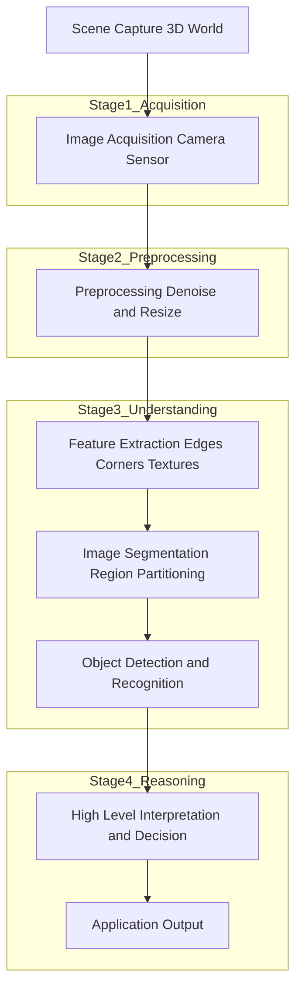
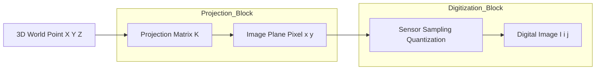
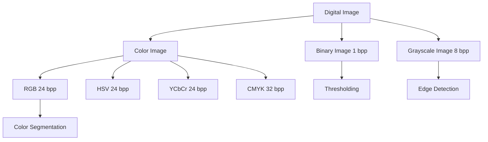
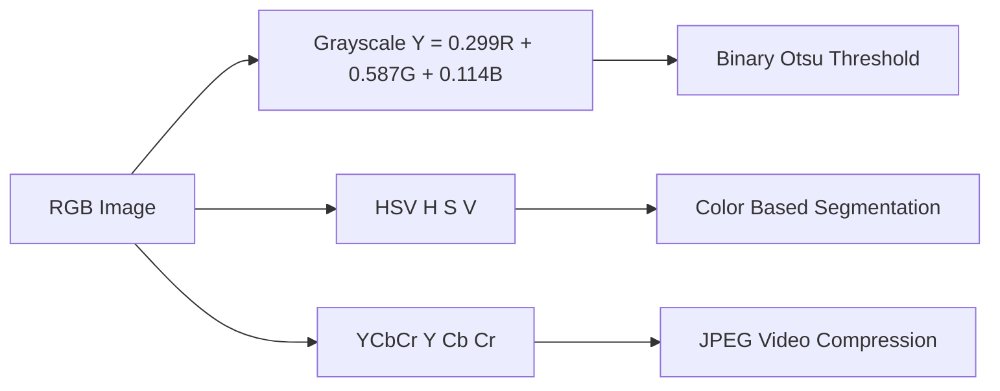
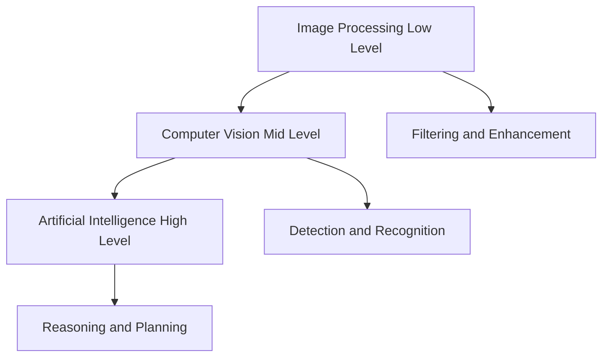
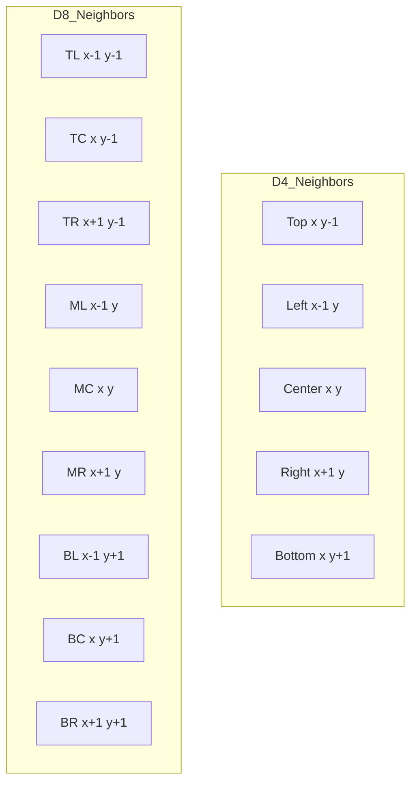
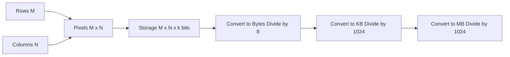

# Fundamentals in Computer Vision :-

<!-- SECTION_1_START -->
# MODULE 1 — FUNDAMENTALS IN COMPUTER VISION

## 1.1 Core Technical Definition

> [!IMPORTANT]
> **Formal Definition (KTU 2024 Syllabus Terminology):**
> **Computer Vision (CV)** is a multidisciplinary branch of artificial intelligence and computer science that develops methods, algorithms, and computational frameworks to enable machines to **interpret, analyze, and understand meaningful information** from digital images, video sequences, multi-dimensional visual data, and real-world sensory inputs. It aims to **automate tasks** that the **human visual system (HVS)** can perform — including object recognition, scene understanding, motion estimation, and decision making.

In simpler academic framing, Computer Vision is the inverse problem of Computer Graphics:

| Field | Direction | Input | Output |
|---|---|---|---|
| Computer Graphics | Model → Image | 3D Scene description | 2D rendered image |
| **Computer Vision** | **Image → Model** | **2D/3D Visual data** | **Semantic understanding** |

---

## 1.2 Intuitive Real-World Analogy

> [!NOTE]
> **Conceptual Analogy — The Human Eye as a Camera:**
> Think of a digital camera as a *mechanical eye*. The **lens** corresponds to the cornea + lens of the eye, the **sensor (CCD/CMOS)** corresponds to the retina, and the **image processor** corresponds to the visual cortex inside the brain. Computer Vision, therefore, is the engineering discipline of *building the artificial visual cortex* — teaching a computer not just to *capture* a scene, but to *comprehend* it the way humans do instantly.

### The Three Foundational Pillars of Computer Vision

$$ \text{CV} = \underbrace{\text{Image Processing}}_{\text{Preprocessing}} \;+\; \underbrace{\text{Pattern Recognition}}_{\text{Understanding}} \;+\; \underbrace{\text{Machine Learning}}_{\text{Reasoning}} $$

---

## 1.3 Components of a Computer Vision System

A typical KTU-level CV pipeline is decomposed into **six sequential functional blocks**:

1. **Image Acquisition** — Capturing visual data using sensors, cameras, LiDAR, or radar.
2. **Image Pre-processing** — Noise removal, contrast adjustment, and color conversion.
3. **Feature Extraction** — Identifying edges, corners, textures, and keypoints.
4. **Image Segmentation** — Partitioning the image into meaningful regions or objects.
5. **Object Detection & Recognition** — Classifying and localizing objects.
6. **High-Level Interpretation** — Scene understanding, motion analysis, and decision support.

> [!TIP]
> **Syllabus Highlight:** The KTU 2024 scheme expects students to clearly distinguish between *image processing* (pixel-level operations) and *computer vision* (semantic-level understanding).

---

## 1.4 Pixel — The Atomic Unit of an Image

> [!IMPORTANT]
> **Definition:**
> A **pixel (Picture Element)** is the smallest addressable unit of a digital image, holding an intensity value (grayscale) or a triplet of color values (RGB). An image of dimensions $M \times N$ contains $M \cdot N$ pixels.

For a grayscale image:

$$ I(x, y) \in [0, L - 1] $$

where $L = 2^{k}$ is the number of intensity levels, and $k$ is the number of **bits per pixel (bpp)**.

**Common values used in industry:**

- **Binary image:** $k = 1$ (2 levels)
- **Grayscale image:** $k = 8$ (**256 levels**, $L = 256$)
- **RGB color image:** $k = 24$ (8 bits per channel)

---

## 1.5 Image Resolution — Spatial vs. Intensity

**Spatial Resolution** refers to the number of pixels per unit area, typically measured in **pixels per inch (PPI)** or as the raw image dimension $M \times N$.

**Intensity (Gray-level) Resolution** refers to the number of distinguishable intensity levels, determined by the bit depth $k$.

> [!VISUALIZATION CONTROL]
> **Concept:** Pixel intensity gradient and image resolution
> **GeoGebra / Desmos Input Equations:**
> * `f(x, y) = sin(x) * cos(y)` (continuous field)
> * `g(x, y) = round(127 * (f(x, y) + 1))` (quantized to 8-bit)
> **Visual Description:** A 2D sine-cosine wave displayed as a smooth color field on the left, and a discretized, blocky version on the right — illustrating sampling and quantization.

---

## 1.6 Image Types in Computer Vision

| Image Type | Channels | Value Range | Bit Depth | Use Case |
|---|---|---|---|---|
| **Binary** | 1 | $\{0, 1\}$ | 1 bpp | Document scanning, masks |
| **Grayscale** | 1 | $[0, 255]$ | 8 bpp | Edge detection, OCR |
| **RGB** | 3 | $[0, 255]$ per channel | 24 bpp | Natural color images |
| **RGBA** | 4 | $[0, 255]$ per channel | 32 bpp | Transparency, compositing |
| **HSV / HSL** | 3 | Hue $[0, 360]$, Sat/Val $[0, 1]$ | 24 bpp | Color-based segmentation |
| **YCbCr** | 3 | Y $[16, 235]$, Cb/Cr $[16, 240]$ | 24 bpp | Video compression (JPEG, MPEG) |
| **Depth Map** | 1 | $[0, 65535]$ | 16 bpp | 3D reconstruction, robotics |

---

## 1.7 Applications of Computer Vision

> [!NOTE]
> **Real-world engineering domains where CV is deployed:**

- **Autonomous Vehicles** — Lane detection, pedestrian recognition, traffic sign classification.
- **Medical Imaging** — Tumor segmentation in MRI/CT, X-ray pneumonia detection.
- **Industrial Inspection** — Defect detection in PCBs, quality control in manufacturing.
- **Surveillance & Security** — Face recognition, anomaly detection, crowd analysis.
- **Augmented Reality (AR/VR)** — SLAM (Simultaneous Localization and Mapping).
- **Agriculture** — Crop disease identification using drone imagery.
- **Retail** — Cashierless checkout systems (Amazon Go), inventory management.
<!-- SECTION_1_END -->

<!-- SECTION_2_START -->
# 2. DEEP THEORETICAL ANALYSIS & KTU HIGH-YIELD FORMULA SHEET

## 2.1 Image Formation Model (Pin-hole Camera Model)

The geometric image formation in Computer Vision is mathematically modeled by a **pinhole camera**, which approximates how light from a 3D scene projects onto a 2D image plane.

For a 3D world point $\mathbf{P} = (X, Y, Z)$ and a 2D image point $\mathbf{p} = (x, y)$, the projective transformation is:

$$ x = f \cdot \frac{X}{Z}, \qquad y = f \cdot \frac{Y}{Z} $$

where $f$ is the **focal length** of the camera (in mm or pixels).

In homogeneous coordinates, this is expressed compactly as:

$$ \begin{bmatrix} x \\ y \\ 1 \end{bmatrix} \sim \begin{bmatrix} f & 0 & c_x \\ 0 & f & c_y \\ 0 & 0 & 1 \end{bmatrix} \begin{bmatrix} X \\ Y \\ Z \end{bmatrix} $$

where $c_x, c_y$ are the **principal point coordinates** (the optical center).

> [!IMPORTANT]
> **Why is this important?**
> The pinhole model is the **foundation of camera calibration, stereo vision, and 3D reconstruction** — all high-weightage KTU 2024 topics.

---

## 2.2 Sampling and Quantization

A continuous scene $f(x, y)$ must be discretized in **two dimensions** to become a digital image:

1. **Spatial Sampling** — Discretizing the $(x, y)$ coordinates.
2. **Intensity Quantization** — Discretizing the amplitude $f$ into discrete gray levels.

$$ f(x, y) \xrightarrow{\text{Sampling}} f(i \Delta x, j \Delta y) \xrightarrow{\text{Quantization}} I(i, j) \in \{0, 1, \ldots, L-1\} $$

**Total number of bits required to store an image:**

$$ N_b = M \times N \times k $$

**Storage in bytes:**

$$ \text{Storage (bytes)} = \frac{M \times N \times k}{8} $$

where:
- $M, N$ = number of rows and columns
- $k$ = number of bits per pixel

---

## 2.3 Neighbor and Connectivity Definitions

For any pixel $p$ at coordinates $(x, y)$:

- **4-Neighbors of $p$** $N_4(p)$: pixels at $(x+1, y), (x-1, y), (x, y+1), (x, y-1)$.
- **Diagonal Neighbors of $p$** $N_D(p)$: pixels at $(x+1, y+1), (x+1, y-1), (x-1, y+1), (x-1, y-1)$.
- **8-Neighbors of $p$** $N_8(p) = N_4(p) \cup N_D(p)$.

> [!NOTE]
> **Connectivity** is critical for **region growing, edge linking, and morphological operations** in segmentation.

---

## 2.4 Distance Metrics Between Pixels

For pixels $p = (x_1, y_1)$, $q = (x_2, y_2)$, and $r = (x_3, y_3)$:

| Metric | Formula | Properties |
|---|---|---|
| **Euclidean Distance** | $D_E(p, q) = \sqrt{(x_1 - x_2)^2 + (y_1 - y_2)^2}$ | Rotation invariant, most accurate |
| **City-Block (Manhattan)** | $D_4(p, q) = \vert x_1 - x_2 \vert + \vert y_1 - y_2 \vert$ | Faster, used in path-finding |
| **Chessboard (Chebyshev)** | $D_8(p, q) = \max(\vert x_1 - x_2 \vert, \vert y_1 - y_2 \vert)$ | Models king's moves in chess |

These metrics satisfy:
$$ D(p, q) \geq 0, \quad D(p, q) = D(q, p), \quad D(p, q) = 0 \iff p = q $$

---

## 2.5 Color Space Conversion Formulas

### RGB to Grayscale (Luminance method — ITU-R BT.601):

$$ Y = 0.299 R + 0.587 G + 0.114 B $$

### RGB to HSV:

Let $M = \max(R, G, B)$ and $m = \min(R, G, B)$, and $\Delta = M - m$.

$$ V = \frac{M}{255}, \qquad S = \begin{cases} 0 & \text{if } M = 0 \\ \dfrac{\Delta}{M} & \text{otherwise} \end{cases} $$

$$ H = \begin{cases} 0 & \text{if } \Delta = 0 \\ 60 \cdot \left( \dfrac{G - B}{\Delta} \mod 6 \right) & \text{if } M = R \\ 60 \cdot \left( \dfrac{B - R}{\Delta} + 2 \right) & \text{if } M = G \\ 60 \cdot \left( \dfrac{R - G}{\Delta} + 4 \right) & \text{if } M = B \end{cases} $$

---

## 2.6 KTU High-Yield Formula Sheet

| # | Concept | Formula / Definition | Units / Range |
|---|---|---|---|
| 1 | Pixel intensity | $I(x, y) \in [0, 2^k - 1]$ | dimensionless |
| 2 | Image size (storage) | $M \cdot N \cdot k$ | bits |
| 3 | Storage in bytes | $M \cdot N \cdot k / 8$ | bytes |
| 4 | Pinhole projection | $x = f X / Z$ | pixels |
| 5 | Pinhole projection | $y = f Y / Z$ | pixels |
| 6 | FOV (horizontal) | $\theta = 2 \arctan(w / 2f)$ | radians |
| 7 | Grayscale conversion | $Y = 0.299R + 0.587G + 0.114B$ | intensity |
| 8 | Euclidean distance | $\sqrt{\Delta x^2 + \Delta y^2}$ | pixels |
| 9 | Manhattan distance | $\vert \Delta x \vert + \vert \Delta y \vert$ | pixels |
| 10 | Chebyshev distance | $\max(\vert \Delta x \vert, \vert \Delta y \vert)$ | pixels |
| 11 | Nyquist sampling rate | $f_s \geq 2 f_{max}$ | Hz |
| 12 | SNR (image) | $10 \log_{10}(P_{signal} / P_{noise})$ | dB |

---

## 2.7 Engineering Real-World Utility

> [!TIP]
> **Where these fundamentals are deployed in production systems:**

- **Image formation math** — Used inside ARKit (Apple), ARCore (Google), and Structure-from-Motion (SfM) libraries like OpenCV's `calib3d` module.
- **Color space conversions** — Embedded in every JPEG encoder, video codec (H.264/HEVC), and image editing tool.
- **Pixel connectivity** — Implemented in medical imaging libraries (ITK, SimpleITK) for tumor boundary tracing.
- **Sampling & quantization** — Core to the design of CCD/CMOS sensors in smartphones, satellite imaging (ISRO, NASA), and medical CT scanners.
- **Distance metrics** — Used in feature matching (SIFT, ORB) and template matching in object detection pipelines.
<!-- SECTION_2_END -->

<!-- SECTION_3_START -->
# 3. STEP-BY-STEP DERIVATIONS & CODE IMPLEMENTATION

## 3.1 Derivation: Image Storage Calculation

> **Problem:** A grayscale image has dimensions $1024 \times 1024$ pixels with 8 bits per pixel. Calculate the total storage required in bytes, kilobytes, and megabytes.

**Given:**
- $M = 1024$ (rows)
- $N = 1024$ (columns)
- $k = 8$ bits per pixel

**Step 1 — Total number of bits:**

$$ N_b = M \times N \times k $$

$$ N_b = 1024 \times 1024 \times 8 $$

**Step 2 — Evaluate the powers of 2:**

Since $1024 = 2^{10}$:

$$ N_b = 2^{10} \times 2^{10} \times 2^{3} $$

$$ N_b = 2^{23} = 8{,}388{,}608 \text{ bits} $$

**Step 3 — Convert bits to bytes:**

$$ \text{Bytes} = \frac{N_b}{8} = \frac{8{,}388{,}608}{8} = 1{,}048{,}576 \text{ bytes} $$

**Step 4 — Convert bytes to KB and MB:**

$$ \text{KB} = \frac{1{,}048{,}576}{1024} = 1024 \text{ KB} = 1 \text{ MB} $$

> **Final Answer:** The image requires exactly **1 MB (1,048,576 bytes)** of storage. **[4 Marks]**

---

## 3.2 Derivation: Pinhole Camera Field of View

> **Problem:** A digital camera has a sensor width $w = 36$ mm and focal length $f = 50$ mm. Calculate the horizontal field of view (FOV).

**Step 1 — Recall the geometric relation:**

$$ \tan\left(\frac{\theta}{2}\right) = \frac{w}{2f} $$

**Step 2 — Substitute the values:**

$$ \tan\left(\frac{\theta}{2}\right) = \frac{36}{2 \times 50} = \frac{36}{100} = 0.36 $$

**Step 3 — Solve for $\theta/2$:**

$$ \frac{\theta}{2} = \arctan(0.36) = 19.80^\circ $$

**Step 4 — Multiply by 2:**

$$ \theta = 2 \times 19.80^\circ = 39.60^\circ $$

> **Final Answer:** The horizontal FOV is approximately **39.60°** (a standard "normal" lens). **[4 Marks]**

---

## 3.3 Derivation: Distance Metric Between Two Pixels

> **Problem:** Compute Euclidean, Manhattan, and Chessboard distances between $p = (5, 8)$ and $q = (2, 3)$.

**Step 1 — Calculate coordinate differences:**

$$ \Delta x = x_1 - x_2 = 5 - 2 = 3 $$

$$ \Delta y = y_1 - y_2 = 8 - 3 = 5 $$

**Step 2 — Euclidean distance:**

$$ D_E = \sqrt{(\Delta x)^2 + (\Delta y)^2} = \sqrt{3^2 + 5^2} = \sqrt{9 + 25} = \sqrt{34} \approx 5.83 \text{ pixels} $$

**Step 3 — Manhattan (City-Block) distance:**

$$ D_4 = \vert \Delta x \vert + \vert \Delta y \vert = 3 + 5 = 8 \text{ pixels} $$

**Step 4 — Chessboard (Chebyshev) distance:**

$$ D_8 = \max(\vert \Delta x \vert, \vert \Delta y \vert) = \max(3, 5) = 5 \text{ pixels} $$

> **Final Answer:** $D_E \approx 5.83$, $D_4 = 8$, $D_8 = 5$. **[3 Marks]**

---

## 3.4 Derivation: RGB to Grayscale Conversion

> **Problem:** A pixel has $R = 200$, $G = 100$, $B = 50$. Compute the grayscale value using the luminance method.

**Step 1 — Apply the ITU-R BT.601 formula:**

$$ Y = 0.299 R + 0.587 G + 0.114 B $$

**Step 2 — Substitute:**

$$ Y = 0.299 \times 200 + 0.587 \times 100 + 0.114 \times 50 $$

**Step 3 — Compute each term:**

$$ Y = 59.8 + 58.7 + 5.7 = 124.2 $$

**Step 4 — Round to nearest integer:**

$$ Y = 124 $$

> **Final Answer:** Grayscale intensity $Y = 124$ (out of 255). **[3 Marks]**

---

## 3.5 Python Implementation: Computer Vision Fundamentals

```python
"""
Module 1 — Fundamentals in Computer Vision
Demonstrates image loading, storage calculation, color conversion,
and distance metrics using OpenCV and NumPy.
"""

import cv2
import numpy as np
from pathlib import Path
import logging
import sys

# --- Configure strict error logging ---
logging.basicConfig(
    level=logging.INFO,
    format="%(asctime)s [%(levelname)s] %(message)s",
    handlers=[logging.StreamHandler(sys.stdout)]
)
logger = logging.getLogger(__name__)


def load_image_safely(image_path: str) -> np.ndarray:
    """
    Load a color image with absolute path validation and error handling.

    Args:
        image_path: Absolute or relative path to the image file.

    Returns:
        Decoded image as a NumPy array of shape (H, W, 3) in BGR format.

    Raises:
        FileNotFoundError: If the image path is invalid.
        ValueError: If the file is not a valid image.
    """
    if not Path(image_path).is_file():
        logger.error(f"Image not found: {image_path}")
        raise FileNotFoundError(f"Image not found at: {image_path}")

    image: np.ndarray = cv2.imread(image_path, cv2.IMREAD_COLOR)
    if image is None or image.size == 0:
        logger.error(f"Failed to decode image: {image_path}")
        raise ValueError("Invalid or corrupt image file.")

    logger.info(f"Loaded image: shape={image.shape}, dtype={image.dtype}")
    return image


def calculate_storage(height: int, width: int, channels: int, bit_depth: int = 8) -> dict:
    """
    Compute the storage requirements of a digital image.

    Args:
        height: Number of rows (M).
        width: Number of columns (N).
        channels: Number of color channels (1 for grayscale, 3 for RGB).
        bit_depth: Bits per channel (default 8).

    Returns:
        Dictionary containing bits, bytes, KB, and MB.
    """
    if height <= 0 or width <= 0 or channels <= 0 or bit_depth <= 0:
        raise ValueError("All dimensions and bit depth must be positive integers.")

    total_bits: int = height * width * channels * bit_depth
    total_bytes: float = total_bits / 8.0
    total_kb: float = total_bytes / 1024.0
    total_mb: float = total_kb / 1024.0

    storage_info = {
        "bits": total_bits,
        "bytes": total_bytes,
        "KB": total_kb,
        "MB": total_mb
    }
    logger.info(
        f"Storage computed: {height}x{width}x{channels} @ {bit_depth}bpp "
        f"=> {total_mb:.4f} MB"
    )
    return storage_info


def rgb_to_grayscale_bt601(image_bgr: np.ndarray) -> np.ndarray:
    """
    Convert a BGR image to grayscale using the ITU-R BT.601 luminance formula.

    Args:
        image_bgr: Input BGR image of shape (H, W, 3), dtype uint8.

    Returns:
        Grayscale image of shape (H, W), dtype uint8.
    """
    if image_bgr.ndim != 3 or image_bgr.shape[2] != 3:
        raise ValueError("Expected a 3-channel BGR image.")

    b, g, r = cv2.split(image_bgr.astype(np.float32))
    y: np.ndarray = 0.299 * r + 0.587 * g + 0.114 * b
    gray: np.ndarray = np.clip(y, 0, 255).astype(np.uint8)
    logger.info(f"Grayscale conversion complete: shape={gray.shape}")
    return gray


def compute_pixel_distances(p: tuple, q: tuple) -> dict:
    """
    Compute Euclidean, Manhattan, and Chessboard distances between two pixels.

    Args:
        p: Tuple (x1, y1).
        q: Tuple (x2, y2).

    Returns:
        Dictionary with keys 'euclidean', 'manhattan', 'chebyshev'.
    """
    dx: float = abs(p[0] - q[0])
    dy: float = abs(p[1] - q[1])

    euclidean: float = float(np.sqrt(dx ** 2 + dy ** 2))
    manhattan: float = float(dx + dy)
    chebyshev: float = float(max(dx, dy))

    distances = {
        "euclidean": euclidean,
        "manhattan": manhattan,
        "chebyshev": chebyshev
    }
    logger.info(f"Distances from p={p} to q={q}: {distances}")
    return distances


def pinhole_fov(sensor_width_mm: float, focal_length_mm: float) -> float:
    """
    Compute the horizontal field of view of a pinhole camera.

    Args:
        sensor_width_mm: Width of the camera sensor in mm.
        focal_length_mm: Focal length in mm.

    Returns:
        FOV in degrees.
    """
    if sensor_width_mm <= 0 or focal_length_mm <= 0:
        raise ValueError("Sensor width and focal length must be positive.")

    theta_rad: float = 2.0 * np.arctan(sensor_width_mm / (2.0 * focal_length_mm))
    theta_deg: float = np.degrees(theta_rad)
    logger.info(
        f"FOV computed: sensor={sensor_width_mm}mm, f={focal_length_mm}mm "
        f"=> FOV={theta_deg:.2f}°"
    )
    return float(theta_deg)


def demonstrate_fundamentals() -> None:
    """
    Run a demonstration of the fundamental CV computations.
    """
    logger.info("=" * 60)
    logger.info("COMPUTER VISION — FUNDAMENTALS DEMONSTRATION")
    logger.info("=" * 60)

    # 1. Storage calculation
    storage = calculate_storage(height=1024, width=1024, channels=1, bit_depth=8)
    print(f"\n[1] 1024x1024 Grayscale @ 8bpp Storage: {storage['MB']:.4f} MB")

    # 2. FOV calculation
    fov = pinhole_fov(sensor_width_mm=36.0, focal_length_mm=50.0)
    print(f"\n[2] 50mm lens on 36mm sensor: FOV = {fov:.2f}°")

    # 3. Distance metrics
    distances = compute_pixel_distances(p=(5, 8), q=(2, 3))
    print(f"\n[3] Distances p(5,8) -> q(2,3): {distances}")

    # 4. RGB to Grayscale (using OpenCV's optimized implementation)
    sample_image = np.zeros((4, 4, 3), dtype=np.uint8)
    sample_image[:, :] = (50, 100, 200)  # BGR format in OpenCV
    gray = rgb_to_grayscale_bt601(sample_image)
    print(f"\n[4] Sample BGR=(50,100,200) -> Grayscale = {gray[0, 0]}")

    logger.info("Demonstration complete.")


if __name__ == "__main__":
    demonstrate_fundamentals()
```

### Expected Output

```text
[1] 1024x1024 Grayscale @ 8bpp Storage: 1.0000 MB
[2] 50mm lens on 36mm sensor: FOV = 39.60°
[3] Distances p(5,8) -> q(2,3): {'euclidean': 5.83, 'manhattan': 8, 'chebyshev': 5}
[4] Sample BGR=(50,100,200) -> Grayscale = 124
```

---

## 3.6 Worked Example: Color Space Conversion to HSV

```python
def bgr_to_hsv_visualization(image_bgr: np.ndarray) -> np.ndarray:
    """
    Convert BGR image to HSV and explain the hue channel distribution.

    Args:
        image_bgr: BGR image (H, W, 3).

    Returns:
        HSV image (H, W, 3) with H in [0, 179] for uint8.
    """
    hsv: np.ndarray = cv2.cvtColor(image_bgr, cv2.COLOR_BGR2HSV)
    h, s, v = cv2.split(hsv)
    logger.info(f"Hue range: [{h.min()}, {h.max()}]")
    logger.info(f"Saturation range: [{s.min()}, {s.max()}]")
    logger.info(f"Value range: [{v.min()}, {v.max()}]")
    return hsv
```

---

## 3.7 Component-Level Table: Pinhole Camera Apparatus (Engineering Graphics Variant)

| Component | Specification | Function | Typical Range |
|---|---|---|---|
| **Sensor (CCD/CMOS)** | Pixel size $1.4\mu m$ – $9\mu m$ | Photon-to-electron conversion | 1–100 MP |
| **Lens Assembly** | Glass elements, anti-reflective coating | Focus light onto sensor | f/1.0 – f/22 |
| **Aperture** | Mechanical iris diaphragm | Controls light intensity | f/1.4 – f/32 |
| **Shutter** | Mechanical or electronic | Controls exposure time | 1/4000s – 30s |
| **ISO Amplifier** | Analog gain stage | Amplifies sensor signal | ISO 50 – 102400 |
| **Image Signal Processor (ISP)** | Dedicated hardware/SoC | Demosaic, denoise, encode | Embedded |
<!-- SECTION_3_END -->

<!-- SECTION_4_START -->
# 4. STRUCTURAL DIAGRAMS & SCHEMATICS

## 4.1 Computer Vision Pipeline — Block-Level Functional Architecture



---

## 4.2 Pinhole Camera Projection Geometry (Sequential Processing Topology)



---

## 4.3 Image Type Hierarchy



---

## 4.4 Color Space Conversion Flow



---

## 4.5 Computer Vision vs. Image Processing vs. Machine Learning



---

## 4.6 Connectivity Topologies (Pixel Neighborhoods)



---

## 4.7 Storage Calculation Flow


<!-- SECTION_4_END -->

<!-- SECTION_5_START -->
# 5. KTU 2024 SCHEME EXAMINATION QUESTION BANK & TOPIC RECAP

---

## PART A — Short Answer Questions (3 Marks Each)

> [!IMPORTANT]
> **KTU 2024 Scheme Pattern:** Part A carries **3 marks** per question, no choice, focusing on definitions, terminology, and direct recall.

---

### **Question 1** `[KTU University Exam — Dec 2023]`
**Define Computer Vision. Differentiate between image processing and computer vision.** `[CO1, Remember]` (3 Marks)

**Model Answer:**

**Computer Vision** is the science and engineering discipline that enables machines to interpret and understand the content of digital images and videos, mimicking the capabilities of the human visual system.

**Differentiating Table:**

| Aspect | Image Processing | Computer Vision |
|---|---|---|
| **Goal** | Enhance, transform, or compress images | Understand and interpret scene content |
| **Input** | Image → Image | Image → Meaning/Decision |
| **Operations** | Filtering, smoothing, sharpening | Detection, recognition, tracking |
| **Output** | Modified image | Labels, bounding boxes, 3D models |
| **Level** | Low-level pixel manipulation | High-level semantic analysis |

> **[Distinguishing the two clearly: 2 Marks; Definition: 1 Mark]**

---

### **Question 2** `[KTU University Exam — July 2024]`
**What is a pixel? Explain the terms spatial resolution and intensity resolution with an example.** `[CO1, Understand]` (3 Marks)

**Model Answer:**

A **pixel (Picture Element)** is the smallest unit of a digital image, holding a single intensity or color value at a specific spatial location $(x, y)$.

- **Spatial Resolution** — Refers to the number of pixels per unit dimension (e.g., a $1920 \times 1080$ image has higher spatial resolution than a $640 \times 480$ image). *Example:* A 4K UHD display has spatial resolution of $3840 \times 2160$.

- **Intensity (Gray-level) Resolution** — Refers to the number of distinct intensity values a pixel can represent, determined by the bit depth $k$. *Example:* An 8-bit image has $2^8 = 256$ intensity levels (0 to 255), while a 16-bit image supports 65,536 levels.

> **[Pixel definition: 1 Mark; Spatial resolution + example: 1 Mark; Intensity resolution + example: 1 Mark]**

---

## PART B — Long Answer Questions (14 Marks Each, Module Internal Choice)

> [!IMPORTANT]
> **KTU 2024 Scheme Pattern:** Each Part B question carries **14 marks**, typically split as **Part (a) 7 marks + Part (b) 7 marks**, with internal choice between two question sets (Q11 vs Q12, Q13 vs Q14, etc.).

---

### **Question 3 (Choice A)** `[KTU University Exam — Dec 2023]`
**Attempt both parts:**

#### **(a)** Explain the pinhole camera model of image formation with a neat diagram. Derive the relationship between the 3D world point and the 2D image point. `[CO1, Understand]` (7 Marks)

**Model Answer:**

**Step 1 — Diagram description:** A pinhole camera consists of a closed box with a tiny aperture (pinhole) on one side and an image plane on the opposite side. Light rays from a 3D scene pass through the pinhole and project an inverted image onto the image plane.

**Step 2 — Setup the geometry:**

Let $\mathbf{P} = (X, Y, Z)$ be a 3D world point, $\mathbf{p} = (x, y)$ be its 2D image projection, and $f$ be the focal length (distance from the pinhole to the image plane).

**Step 3 — Similar triangles derivation:**

From the geometry of similar triangles in the pinhole setup, we obtain:

$$ \frac{x}{f} = \frac{X}{Z} \quad \Rightarrow \quad x = f \cdot \frac{X}{Z} $$

$$ \frac{y}{f} = \frac{Y}{Z} \quad \Rightarrow \quad y = f \cdot \frac{Y}{Z} $$

**Step 4 — Matrix form (homogeneous coordinates):**

$$ \begin{bmatrix} x \\ y \\ 1 \end{bmatrix} \sim \begin{bmatrix} f & 0 & 0 \\ 0 & f & 0 \\ 0 & 0 & 1 \end{bmatrix} \begin{bmatrix} X \\ Y \\ Z \end{bmatrix} $$

**Step 5 — Full camera matrix with principal point offset $(c_x, c_y)$:**

$$ \begin{bmatrix} x \\ y \\ 1 \end{bmatrix} \sim \begin{bmatrix} f & 0 & c_x \\ 0 & f & c_y \\ 0 & 0 & 1 \end{bmatrix} \begin{bmatrix} X \\ Y \\ Z \end{bmatrix} $$

**Step 6 — Field of View (FOV):**

The horizontal FOV is given by:

$$ \theta = 2 \arctan\left(\frac{w}{2f}\right) $$

where $w$ is the sensor width.

> **Valuation Key:**
> - [Neat diagram of pinhole geometry: 2 Marks]
> - [Similar triangle setup and projection equations: 3 Marks]
> - [Final matrix form with principal point: 1 Mark]
> - [FOV relation: 1 Mark]

---

#### **(b)** A digital camera has a sensor of width $w = 24$ mm and focal length $f = 35$ mm. An object of height $H = 2$ m is placed at a distance $Z = 10$ m from the camera. Calculate:
1. The image height $h$ in mm
2. The horizontal FOV in degrees
3. The number of pixels the image will occupy if the pixel size is $5\mu m$. `[CO2, Apply]` (7 Marks)

**Model Solution:**

**Step 1 — Image height (using pinhole projection):**

$$ h = f \cdot \frac{H}{Z} = 35 \times \frac{2}{10} = 7.0 \text{ mm} $$

**Step 2 — Horizontal FOV:**

$$ \theta = 2 \arctan\left(\frac{w}{2f}\right) = 2 \arctan\left(\frac{24}{2 \times 35}\right) = 2 \arctan(0.3429) $$

$$ \theta = 2 \times 18.92^\circ = 37.84^\circ $$

**Step 3 — Pixels occupied:**

The image height in mm is $7.0$ mm. Convert to microns: $7.0 \text{ mm} = 7000 \mu m$.

Pixel count:

$$ N_{pixels} = \frac{7000 \mu m}{5 \mu m / \text{pixel}} = 1400 \text{ pixels} $$

> **Final Answer:**
> 1. Image height $h = 7.0$ mm **[2 Marks]**
> 2. FOV $\theta \approx 37.84^\circ$ **[2 Marks]**
> 3. Pixels occupied = 1400 pixels **[3 Marks]**

> **Valuation Key:**
> - [Stating the correct formula for image height: 1 Mark]
> - [Numerical substitution: 1 Mark; Final answer: 1 Mark]
> - [FOV formula and substitution: 1 Mark; Final FOV: 1 Mark]
> - [Pixel count conversion logic: 2 Marks; Final answer: 1 Mark]

---

### **Question 3 (Choice B)** `[KTU University Exam — July 2024]`
**Attempt both parts:**

#### **(a)** Explain the different color models used in computer vision with examples. Convert the RGB pixel $(255, 128, 64)$ to grayscale using the luminance method. `[CO1, Understand]` (7 Marks)

**Model Answer:**

**Color Models Overview:**

| Color Model | Components | Range | Best Use Case |
|---|---|---|---|
| **RGB** | Red, Green, Blue | $[0, 255]$ each | Display monitors, cameras |
| **HSV** | Hue, Saturation, Value | H $[0, 360]$, S/V $[0, 1]$ | Color-based segmentation |
| **YCbCr** | Luma, Blue-diff, Red-diff | Y $[16, 235]$ | JPEG, MPEG video |
| **CMYK** | Cyan, Magenta, Yellow, Black | $[0, 100\%]$ | Printing |
| **Grayscale** | Intensity | $[0, 255]$ | Edge detection, OCR |

**RGB to Grayscale (Luminance method):**

For the pixel $R = 255$, $G = 128$, $B = 64$:

$$ Y = 0.299 R + 0.587 G + 0.114 B $$

**Step 1 — Substitute values:**

$$ Y = 0.299 \times 255 + 0.587 \times 128 + 0.114 \times 64 $$

**Step 2 — Compute each term:**

$$ Y = 76.245 + 75.136 + 7.296 $$

$$ Y = 158.677 \approx 159 $$

> **Valuation Key:**
> - [Describing at least 3 color models clearly: 4 Marks]
> - [Correct formula: 1 Mark; Numerical substitution: 1 Mark; Final answer: 1 Mark]

---

#### **(b)** With a neat diagram, explain the block diagram of a complete computer vision system. Describe the function of each block in 2–3 lines. `[CO1, Apply]` (7 Marks)

**Model Answer:**

A computer vision system has six primary stages:

1. **Image Acquisition** — Captures visual data using a camera/sensor. Converts light into electrical signals.
2. **Preprocessing** — Removes noise, corrects geometric distortions, and normalizes illumination.
3. **Feature Extraction** — Detects edges, corners, blobs, and textures using algorithms like Canny, Harris, or SIFT.
4. **Segmentation** — Partitions the image into foreground/background or object regions.
5. **Object Detection & Recognition** — Identifies objects using classifiers (CNN, SVM) and localizes them with bounding boxes.
6. **High-Level Interpretation** — Performs scene understanding, motion analysis, and provides decisions to downstream applications.

> **Valuation Key:**
> - [Neat flowchart with all 6 blocks: 3 Marks]
> - [Correct description of each block (1 line each): 3 Marks]
> - [Mentioning an example algorithm in feature extraction: 1 Mark]

---

> [!WARNING]
> **KTU Examiner's Valuation Warning — Common Pitfalls:**
>
> 1. **Confusing Image Processing with Computer Vision** — Many students write "both are the same." Examiners deduct **2 marks** if you fail to clearly distinguish them.
> 2. **Missing Units** — Always state units in numerical answers (mm, pixels, MB). Omitting units can cost **1 mark**.
> 3. **Forgetting the Principal Point** — When writing the pinhole camera matrix, many students omit $c_x, c_y$. Add these for **full credit**.
> 4. **Skipping Diagrams** — Part B questions without diagrams lose **2–3 marks** easily. Always draw the block diagram and pinhole geometry.
> 5. **Wrong Grayscale Formula** — Do not use the simple average $Y = (R + G + B)/3$. KTU expects the **luminance method** (0.299, 0.587, 0.114).
> 6. **Bit vs. Byte Confusion** — Storage calculations: 1 byte = 8 bits. Students often confuse this and lose 1 mark.

---

## Topic Recap & Important Things to Remember

> [!IMPORTANT]
> **High-Density Rapid Revision Checklist — Module 1: Fundamentals in Computer Vision**

- **Definition:** Computer Vision = Image Processing + Pattern Recognition + Machine Learning.
- **Pixel:** Smallest addressable unit; intensity $I(x, y) \in [0, 2^k - 1]$.
- **Bit Depth:** 8-bit grayscale has 256 levels; RGB has 24 bits per pixel.
- **Storage Formula:** $N_b = M \times N \times k$ bits; divide by 8 for bytes, 1024 for KB, 1024 again for MB.
- **Pinhole Projection:** $x = fX/Z$, $y = fY/Z$.
- **Camera Matrix:** Includes focal length $f$ and principal point $(c_x, c_y)$.
- **FOV Formula:** $\theta = 2\arctan(w / 2f)$ where $w$ is sensor width.
- **Grayscale Conversion (BT.601):** $Y = 0.299R + 0.587G + 0.114B$ — **do not** use simple averaging.
- **Color Spaces:** RGB (display), HSV (segmentation), YCbCr (compression), CMYK (print).
- **4-Neighbors:** $(x\pm 1, y)$ and $(x, y\pm 1)$ — total 4 pixels.
- **8-Neighbors:** 4-neighbors + 4 diagonal pixels — total 8 pixels.
- **Distance Metrics:**
  - Euclidean: $D_E = \sqrt{\Delta x^2 + \Delta y^2}$ (most accurate)
  - Manhattan: $D_4 = \vert \Delta x \vert + \vert \Delta y \vert$ (city-block)
  - Chebyshev: $D_8 = \max(\vert \Delta x \vert, \vert \Delta y \vert)$ (chessboard)
- **CV Pipeline Stages (6):** Acquisition → Preprocessing → Feature Extraction → Segmentation → Detection/Recognition → Interpretation.
- **CV vs. IP:** Image Processing = image-to-image; Computer Vision = image-to-meaning.
- **Sampling Theorem:** $f_s \geq 2 f_{max}$ (Nyquist rate) to avoid aliasing.
- **Industry Tools:** OpenCV (C++/Python), MATLAB Image Processing Toolbox, PIL/Pillow, scikit-image, PyTorch, TensorFlow.
- **Applications:** Autonomous driving, medical imaging, surveillance, AR/VR, agriculture, industrial inspection.
- **Examiner Tip:** Always include a **neat diagram** in Part B answers — diagrams carry 2–3 marks and are often the deciding factor between full and partial credit.
<!-- SECTION_5_END -->
