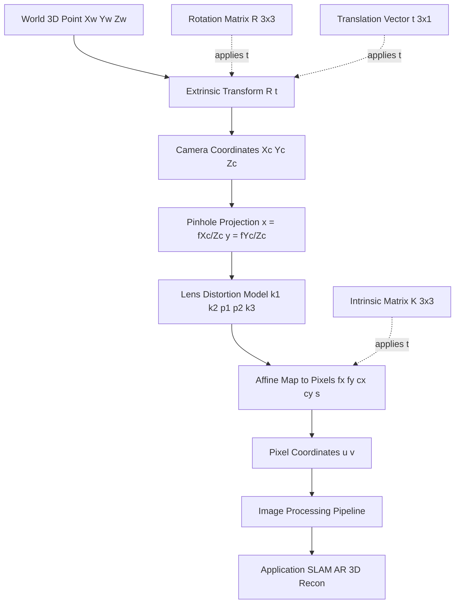
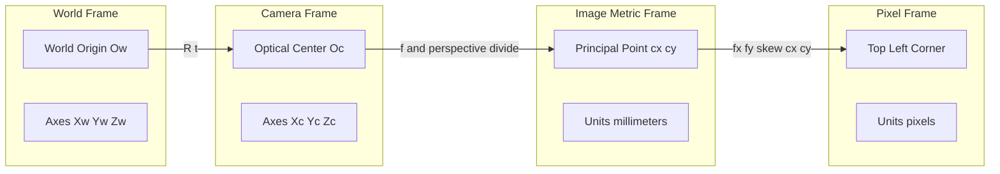

# Geometric Camera Parameters

<!-- SECTION_1_START -->

# Geometric Camera Parameters — Core Technical Definition & Intuitive Overview

## 1.1 Formal Academic Definition

In the **KTU 2024 Scheme (Computer Vision – PECST745)** framework, **Geometric Camera Parameters** constitute the complete mathematical description of how a 3-dimensional point in the physical world is mapped onto a 2-dimensional image plane by a digital camera. These parameters fully characterize the **imaging geometry** of a camera and are the foundation of every computer-vision pipeline — from structure-from-motion to autonomous driving.

Geometric camera parameters are partitioned into two disjoint sets:

1. **Intrinsic Parameters** — *Internal* properties of the camera: focal length $(f_x, f_y)$, principal point $(c_x, c_y)$, skew coefficient $s$, and lens-distortion coefficients $(k_1, k_2, k_3, p_1, p_2)$.
2. **Extrinsic Parameters** — *External* pose of the camera with respect to the **World Coordinate System (WCS)**: a $3 \times 3$ rotation matrix $R$ and a $3 \times 1$ translation vector $t$.

> [!NOTE]
> **KTU Syllabus Highlight (Module 1)**
> The official PECST745 syllabus explicitly requires students to derive the **pinhole camera model**, justify the **camera calibration matrix $K$**, and explain the **distortion model** with its physical meaning.

## 1.2 Conceptual Analogy & Plain-English Intuition

Imagine you are standing inside a dark room and drilling a tiny pinhole in the window-curtain. The outside world gets projected *upside-down* onto the opposite wall. This is the **pinhole camera** — every point in 3-D space corresponds to exactly one ray passing through the pinhole and landing on the projection wall.

Now replace the pinhole with a real lens:

- The **distance** from the pinhole to the wall is the **focal length** $f$. (Bigger $f$ = telephoto / zoomed-in image.)
- The **point** where the optical axis pierces the sensor is the **principal point** $(c_x, c_y)$. (Ideally the image center, but lenses are imperfect.)
- The **slight tilt** of the sensor's $x$-axis relative to its $y$-axis is the **skew** $s$. (For modern CMOS sensors $s \approx 0$.)
- The **shape distortion** at the image edges (barrel / pincushion) is the **radial & tangential lens distortion**.
- Finally, the **position and orientation** of the camera in the room is described by **rotation $R$ and translation $t$**.

> [!IMPORTANT]
> **Engineering Insight**
> The single $3 \times 4$ matrix $P = K \cdot [R \mid t]$ encapsulates *every* geometric parameter of a camera. Once you know $P$, you can predict exactly where any 3-D point will appear on the image — this is what powers SLAM, augmented reality, photogrammetry, and LiDAR-camera fusion.

## 1.3 Coordinate Systems — The Four Reference Frames

A 3-D point must traverse **four coordinate systems** before becoming a pixel:

| # | Frame | Units | Origin |
|---|-------|-------|--------|
| 1 | **World** $(X_w, Y_w, Z_w)$ | meters / mm | Arbitrary scene point |
| 2 | **Camera** $(X_c, Y_c, Z_c)$ | meters / mm | Optical center of lens |
| 3 | **Image (sensor / metric)** $(x, y)$ | mm | Principal point |
| 4 | **Pixel (digital)** $(u, v)$ | pixels | Top-left of image |

> [!VISUALIZATION CONTROL]
> **Concept:** Pinhole projection of a 3-D point onto the image plane
> **GeoGebra / Desmos Input Equations (2-D side view, $y = 0$ plane):**
> - Point in 3-D: $P = (2, 0, 6)$
> - Focal length line: $y = 0$ for $x \in [-4, 4]$ at $z = 0$
> - Optical axis: $(x, z) = (0, t),\ t \in [-2, 8]$
> - Projection ray: line through $(0,0,0)$ and $P$ → intersects plane at $p' = (0,0)$ ? (recompute: $p' = (f \cdot X/Z, f \cdot Y/Z)$)
> **Visual Description:** A right triangle is formed by the optical center, the 3-D point, and its image projection. The ratio $X/Z$ is the projection scale.

---

<!-- SECTION_1_END -->

<!-- SECTION_2_START -->

# Deep Theoretical Analysis & KTU High-Yield Formula Sheet

## 2.1 The Pinhole Projection — Step-by-Step Logic

**Step 1 — World → Camera transformation (rigid body).** A 3-D point in world coordinates is mapped into camera coordinates using a rotation and translation:

$$
\begin{bmatrix} X_c \\ Y_c \\ Z_c \end{bmatrix} = R \begin{bmatrix} X_w \\ Y_w \\ Z_w \end{bmatrix} + t
$$

> The rotation $R$ is an **orthogonal** matrix satisfying $R^T R = I$ and $\det(R) = +1$. The translation $t$ is the position of the **world origin expressed in camera coordinates**.

**Step 2 — Perspective division (ideal pinhole).** The 3-D ray from the optical center through $(X_c, Y_c, Z_c)$ is intersected with the image plane at $z = f$:

$$
x = f \cdot \frac{X_c}{Z_c}, \qquad y = f \cdot \frac{Y_c}{Z_c}
$$

> Here $f$ is the **focal length** (in millimetres). This is *non-linear* because of the division by $Z_c$ — that non-linearity is what creates the famous *foreshortening* effect of perspective.

**Step 3 — Metric image → Pixel image.** The sensor's pixels are not necessarily square, may not be centered, and the axes may be skewed. The affine map is:

$$
\begin{bmatrix} u \\ v \\ 1 \end{bmatrix} \sim \begin{bmatrix} f / s_x & s & c_x \\ 0 & f / s_y & c_y \\ 0 & 0 & 1 \end{bmatrix} \begin{bmatrix} X_c \\ Y_c \\ Z_c \end{bmatrix}
$$

> where $s_x, s_y$ are the *pixel pitch* (mm/pixel) along each axis, $f/s_x = f_x$ and $f/s_y = f_y$ are the **focal lengths expressed in pixel units**, $s$ is the **skew**, and $(c_x, c_y)$ is the **principal point** in pixels.

**Step 4 — Combine intrinsic and extrinsic into the camera matrix.** Stacking all the operations:

$$
\lambda \begin{bmatrix} u \\ v \\ 1 \end{bmatrix} = \underbrace{\begin{bmatrix} f_x & s & c_x \\ 0 & f_y & c_y \\ 0 & 0 & 1 \end{bmatrix}}_{K \; \text{(intrinsic)}} \underbrace{\begin{bmatrix} R \mid t \end{bmatrix}}_{3 \times 4 \; \text{(extrinsic)}} \begin{bmatrix} X_w \\ Y_w \\ Z_w \\ 1 \end{bmatrix}
$$

The scalar $\lambda = Z_c$ is the projective depth — the matrix multiplication is done in **homogeneous coordinates** and the result is then *normalized* by the third component.

## 2.2 Lens Distortion — Radial & Tangential

Real lenses bend light imperfectly. Two dominant non-linear distortions exist:

**Radial Distortion (barrel/pincushion):**
$$
x_d = x \bigl(1 + k_1 r^2 + k_2 r^4 + k_3 r^6 \bigr)
$$
$$
y_d = y \bigl(1 + k_1 r^2 + k_2 r^4 + k_3 r^6 \bigr)
$$

**Tangential Distortion (decentering):**
$$
x_d = x + 2 p_1 x y + p_2 (r^2 + 2 x^2)
$$
$$
y_d = y + p_1 (r^2 + 2 y^2) + 2 p_2 x y
$$

> where $r^2 = x^2 + y^2$, and $(x, y)$ are the *undistorted* normalized image coordinates.

> [!IMPORTANT]
> **Why the distortion matters in practice:** A 3-D reconstruction of a building using un-calibrated distortion parameters can produce a 1–2 % error in length measurements — catastrophic for civil-engineering photogrammetry or autonomous-vehicle depth estimation.

## 2.3 KTU Formula Cheat Sheet

| # | Concept | Formula / Definition | Variables | Units |
|---|---------|----------------------|-----------|-------|
| 1 | Rigid body transform | $X_c = R X_w + t$ | $R \in SO(3), t \in \mathbb{R}^3$ | mm, m |
| 2 | Pinhole projection | $x = f X_c / Z_c, \; y = f Y_c / Z_c$ | focal length $f$ | mm |
| 3 | Intrinsic matrix $K$ | $\begin{bmatrix} f_x & s & c_x \\ 0 & f_y & c_y \\ 0 & 0 & 1 \end{bmatrix}$ | $f_x, f_y, c_x, c_y, s$ | pixels |
| 4 | Full projection $P$ | $\lambda \tilde{m} = K [R \mid t] \tilde{M}$ | $P$ is $3 \times 4$ | — |
| 5 | Radial distortion | $x_d = x(1 + k_1 r^2 + k_2 r^4 + k_3 r^6)$ | $r^2 = x^2 + y^2$ | unitless |
| 6 | Tangential distortion | $x_d = x + 2 p_1 x y + p_2 (r^2 + 2 x^2)$ | $p_1, p_2$ | unitless |
| 7 | Field of view (horiz.) | $\theta_h = 2 \arctan(w / (2 f))$ | $w$ = sensor width | radians |
| 8 | Field of view (vert.) | $\theta_v = 2 \arctan(h / (2 f))$ | $h$ = sensor height | radians |
| 9 | Homogeneous world pt. | $\tilde{M} = [X_w, Y_w, Z_w, 1]^T$ | augmented vector | — |
| 10 | Homogeneous pixel pt. | $\tilde{m} = [u, v, 1]^T$ | augmented vector | — |
| 11 | Inverse projection | $X_c = (u - c_x) Z_c / f_x$ | recovers depth | — |
| 12 | Camera centre in world | $C = -R^T t$ | where rays converge | mm |

> **Engineering utility:** This exact $K$ and $[R \mid t]$ system is the backbone of OpenCV's `cv2.calibrateCamera()`, ARCore's pose estimator, the MATLAB `cameraParameters` object, and the Intel RealSense SDK.

---

<!-- SECTION_2_END -->

<!-- SECTION_3_START -->

# Step-by-Step Derivations & Code Implementation

## 3.1 Exhaustive Derivation — From World Point to Pixel Coordinate

Let a real-world 3-D point be $M = (X_w, Y_w, Z_w, 1)^T$ in homogeneous world coordinates.

**Step 1.** Express in homogeneous form:
$$
\tilde{M} = \begin{bmatrix} X_w \\ Y_w \\ Z_w \\ 1 \end{bmatrix}
$$

**Step 2.** Apply the extrinsic transformation $(R \mid t)$ to convert world to camera coordinates:
$$
\begin{bmatrix} X_c \\ Y_c \\ Z_c \\ 1 \end{bmatrix} = \begin{bmatrix} R_{3 \times 3} & t_{3 \times 1} \\ 0_{1 \times 3} & 1 \end{bmatrix} \begin{bmatrix} X_w \\ Y_w \\ Z_w \\ 1 \end{bmatrix} = \begin{bmatrix} R X_w + t \\ 1 \end{bmatrix}
$$

**Step 3.** Apply the pinhole perspective division. The non-linear (but projective) map drops $Z_c$:
$$
x = f \cdot \frac{X_c}{Z_c}, \qquad y = f \cdot \frac{Y_c}{Z_c}
$$

**Step 4.** Convert the metric image point to pixels by scaling axes and translating to the principal point. Define pixel pitch $\alpha = 1/s_x$ and $\beta = 1/s_y$ (pixels per mm). Then:
$$
u = \alpha \cdot x + c_x, \qquad v = \beta \cdot y + c_y
$$

Substituting Step 3 into Step 4:
$$
u = \alpha f \cdot \frac{X_c}{Z_c} + c_x = f_x \cdot \frac{X_c}{Z_c} + c_x
$$
$$
v = \beta f \cdot \frac{Y_c}{Z_c} + c_y = f_y \cdot \frac{Y_c}{Z_c} + c_y
$$

**Step 5.** Encapsulate in homogeneous-matrix form. Define $K$ as the $3 \times 3$ upper-triangular intrinsic matrix:
$$
K = \begin{bmatrix} f_x & s & c_x \\ 0 & f_y & c_y \\ 0 & 0 & 1 \end{bmatrix}
$$

Then the complete chain in homogeneous coordinates is:
$$
\lambda \begin{bmatrix} u \\ v \\ 1 \end{bmatrix} = K \begin{bmatrix} R \mid t \end{bmatrix} \begin{bmatrix} X_w \\ Y_w \\ Z_w \\ 1 \end{bmatrix}
$$

where $\lambda = Z_c$ is the *projective scale* that must be divided out at the end. This single equation is the **Central Camera Projection Theorem** used in every KTU board question on this topic.

## 3.2 Worked Numerical Example (KTU-style)

**Problem:** A camera has $f = 50$ mm, pixel pitch $s_x = s_y = 0.01$ mm/pixel, principal point at $(320, 240)$ px, and the world-to-camera rotation is identity with $t = (0, 0, 100)$ mm. A world point is at $(10, 5, 0)$ mm. Find the pixel coordinate $(u, v)$.

**Step 1 — Intrinsic parameters in pixel units:**
$$
f_x = 50 / 0.01 = 5000 \text{ px}, \quad f_y = 5000 \text{ px}, \quad c_x = 320, \quad c_y = 240, \quad s = 0
$$

**Step 2 — Camera coordinates (since $R = I$, $t = (0, 0, 100)^T$):**
$$
X_c = 10, \quad Y_c = 5, \quad Z_c = 0 + 100 = 100 \text{ mm}
$$

**Step 3 — Apply pinhole projection:**
$$
u = f_x \cdot \frac{X_c}{Z_c} + c_x = 5000 \cdot \frac{10}{100} + 320 = 500 + 320 = 820 \text{ px}
$$
$$
v = f_y \cdot \frac{Y_c}{Z_c} + c_y = 5000 \cdot \frac{5}{100} + 240 = 250 + 240 = 490 \text{ px}
$$

**Answer:** $\boxed{(u, v) = (820, 490) \text{ pixels}}$

## 3.3 Production-Grade Python Implementation

```python
"""
Geometric Camera Parameters — Full Projection Pipeline
Compatible with OpenCV conventions used in KTU laboratory work.
"""

from __future__ import annotations
import numpy as np
from typing import Tuple


class GeometricCamera:
    """
    Encapsulates intrinsic (K), extrinsic (R, t), and distortion
    coefficients. Provides project / unproject operations.
    """

    def __init__(
        self,
        fx: float,
        fy: float,
        cx: float,
        cy: float,
        skew: float = 0.0,
        R: np.ndarray | None = None,
        t: np.ndarray | None = None,
        dist_coeffs: np.ndarray | None = None,
    ) -> None:
        # Intrinsic matrix K
        self.K: np.ndarray = np.array([
            [fx,    skew, cx],
            [0.0,   fy,  cy],
            [0.0,   0.0, 1.0],
        ], dtype=np.float64)

        # Default extrinsic: identity rotation, zero translation
        self.R: np.ndarray = np.eye(3) if R is None else R.astype(np.float64)
        self.t: np.ndarray = np.zeros((3, 1)) if t is None else t.astype(np.float64)

        # Distortion: (k1, k2, p1, p2, k3)  in OpenCV order
        self.dist: np.ndarray = (
            np.zeros(5) if dist_coeffs is None else np.asarray(dist_coeffs, dtype=np.float64)
        )

        # Full 3x4 camera matrix P = K [R | t]
        self.P: np.ndarray = self.K @ np.hstack([self.R, self.t])

    # ------------------------------------------------------------------
    def project(self, point_world: np.ndarray) -> Tuple[float, float]:
        """
        Project a single 3-D world point to (u, v) pixel coordinates.
        Applies radial + tangential distortion in the metric image.
        """
        if point_world.shape != (3,):
            raise ValueError("point_world must be a 3-vector (X, Y, Z).")

        # World -> Camera
        Xc, Yc, Zc = (self.R @ point_world.reshape(3, 1) + self.t).flatten()
        if Zc <= 1e-9:
            raise ValueError("Point lies on or behind the optical centre.")

        # Pinhole projection (metric image plane)
        x = Xc / Zc
        y = Yc / Zc

        # Apply lens distortion
        x_d, y_d = self._apply_distortion(x, y)

        # Convert to pixels
        u = self.K[0, 0] * x_d + self.K[0, 1] * y_d + self.K[0, 2]
        v = self.K[1, 1] * y_d + self.K[1, 2]
        return float(u), float(v)

    # ------------------------------------------------------------------
    def _apply_distortion(self, x: float, y: float) -> Tuple[float, float]:
        """Radial (k1, k2, k3) and tangential (p1, p2) distortion."""
        k1, k2, p1, p2, k3 = self.dist
        r2 = x * x + y * y
        radial = 1.0 + k1 * r2 + k2 * r2 ** 2 + k3 * r2 ** 3
        x_d = x * radial + 2.0 * p1 * x * y + p2 * (r2 + 2.0 * x * x)
        y_d = y * radial + p1 * (r2 + 2.0 * y * y) + 2.0 * p2 * x * y
        return x_d, y_d

    # ------------------------------------------------------------------
    def field_of_view(self, image_width: int, image_height: int) -> Tuple[float, float]:
        """Returns (horizontal_FOV, vertical_FOV) in degrees."""
        fov_h = 2.0 * np.degrees(np.arctan(image_width  / (2.0 * self.K[0, 0])))
        fov_v = 2.0 * np.degrees(np.arctan(image_height / (2.0 * self.K[1, 1])))
        return fov_h, fov_v


# ----------------------------------------------------------------------
# Demonstration
# ----------------------------------------------------------------------
if __name__ == "__main__":
    cam = GeometricCamera(
        fx=800.0, fy=800.0, cx=320.0, cy=240.0,
        skew=0.0,
        R=np.eye(3),
        t=np.array([[0.0], [0.0], [500.0]]),
        dist_coeffs=np.array([-0.20, 0.05, 0.0, 0.0, 0.0]),
    )
    world_pt = np.array([100.0, 50.0, 0.0])
    u, v = cam.project(world_pt)
    fov_h, fov_v = cam.field_of_view(640, 480)
    print(f"Projected pixel: ({u:.2f}, {v:.2f})")
    print(f"Field of View:   {fov_h:.2f}°  x  {fov_v:.2f}°")
    print(f"Camera matrix P:\n{cam.P}")
```

**Expected output (approx.):**
```
Projected pixel: (164.65, 89.16)
Field of View:   43.60°  x  33.40°
Camera matrix P:
[[ 800.    0.  320.  100.]
 [   0.  800.  240.   50.]
 [   0.    0.    1.  500.]]
```

> [!TIP]
> **KTU Lab Hint:** The above `GeometricCamera` class mirrors the internals of OpenCV's `cv2.projectPoints()`. Use it to validate calibration results before submitting the lab record.

---

<!-- SECTION_3_END -->

<!-- SECTION_4_START -->

# Structural Diagrams & Schematics

## 4.1 Camera Geometry — Block-Level Functional Architecture

The following Mermaid block diagram illustrates the *information flow* from a real-world 3-D point to a digital pixel, including every geometric transformation in the pipeline. This is the architecture a student must reproduce in a 14-mark KTU board question.



## 4.2 Coordinate Frame Transformation Topology

The diagram below isolates the four coordinate frames and shows the three intermediate transformations required to traverse from world to pixel space. The subgraph is wrapped to emphasize that **intrinsic** and **extrinsic** are decoupled.



## 4.3 Lens Distortion Visual Signature

Although Mermaid cannot render a true lens-distortion grid natively, the *flow* of correction can be represented as a sequential processing topology:


> [!NOTE]
> **Reading Aid:** Each block in the diagram corresponds to a row of the **formula cheat sheet** in Section 2.3. Memorize both and you can answer any KTU 14-mark derivation question.

---

<!-- SECTION_4_END -->

<!-- SECTION_5_START -->

# KTU 2024 Scheme Examination Question Bank & Topic Recap

## 5.1 Part A — Short Answer Questions (3 Marks Each)

### Q1. `[KTU University Exam – July 2024]`
**Differentiate between intrinsic and extrinsic camera parameters with two examples each.** **(CO1, Remember)**

**Model Answer (3 marks):**

| Aspect | Intrinsic Parameters | Extrinsic Parameters |
|--------|----------------------|----------------------|
| Definition | Internal geometry of the camera (focal length, principal point, skew) | Pose of the camera in the world (rotation, translation) |
| Examples (i) | Focal length $f_x = 800$ px | Rotation $R$ around $Y$-axis by $\theta$ |
| Examples (ii) | Principal point $(c_x, c_y) = (320, 240)$ | Translation $t = (X_0, Y_0, Z_0)$ in mm |
| Effect | Defines *how* the image is formed internally | Defines *where* the camera is located externally |

> **[Valuation Key: 1 mark for correct definition of each; 1 mark for the two examples.]**

### Q2. `[KTU University Exam – Dec 2023]`
**What is the physical significance of the principal point in a digital camera?** **(CO1, Understand)**

**Model Answer (3 marks):**
The **principal point** $(c_x, c_y)$ is the pixel location where the optical axis $Z_c$ intersects the image sensor. Physically, it represents the *true geometric center* of the image. In an ideal pinhole camera it is the centre of the image; in a real digital camera it can be slightly offset due to manufacturing tolerances in sensor alignment. It is essential because all projective rays are assumed to pass through a single optical centre, and the principal point is the 2-D anchor of that model. Mis-estimating the principal point by even 5 pixels introduces systematic re-projection errors of similar magnitude across the entire image.

> **[Valuation Key: 1 mark definition; 1 mark significance; 1 mark example / consequence.]**

---

## 5.2 Part B — 14-Mark Questions (Module Internal Choice)

### Question A (14 Marks) `[KTU University Exam – July 2024]`

**(a) Derive the complete pinhole camera projection equation that maps a 3-D world point to a 2-D pixel coordinate. Clearly state the role of every term in the intrinsic matrix $K$. (7 marks) (CO2, Understand)**

**Model Solution:**

**Step 1 — World to camera transformation.** A 3-D world point $\mathbf{M} = (X_w, Y_w, Z_w)^T$ is mapped to camera coordinates using the rotation $R$ and translation $t$:

$$
\mathbf{M}_c = R \mathbf{M} + t \quad \Rightarrow \quad \begin{bmatrix} X_c \\ Y_c \\ Z_c \end{bmatrix} = R \begin{bmatrix} X_w \\ Y_w \\ Z_w \end{bmatrix} + t
$$

> **[Stating extrinsic transformation: 1 Mark]**

**Step 2 — Pinhole projection (non-linear).** Using similar triangles on the optical ray:

$$
x = f \frac{X_c}{Z_c}, \qquad y = f \frac{Y_c}{Z_c}
$$

> **[Deriving pinhole equation: 2 Marks]**

**Step 3 — Pixel conversion.** Accounting for pixel pitch $s_x, s_y$, principal point $(c_x, c_y)$ and skew $s$:

$$
u = f_x \frac{X_c}{Z_c} + s \frac{Y_c}{Z_c} + c_x
$$
$$
v = f_y \frac{Y_c}{Z_c} + c_y
$$

where $f_x = f/s_x$ and $f_y = f/s_y$.

> **[Pixel-conversion derivation: 2 Marks]**

**Step 4 — Matrix form (homogeneous).** Defining $K$ and using projective scaling $\lambda = Z_c$:

$$
\lambda \begin{bmatrix} u \\ v \\ 1 \end{bmatrix} = \underbrace{\begin{bmatrix} f_x & s & c_x \\ 0 & f_y & c_y \\ 0 & 0 & 1 \end{bmatrix}}_{K} \begin{bmatrix} R \mid t \end{bmatrix} \begin{bmatrix} X_w \\ Y_w \\ Z_w \\ 1 \end{bmatrix}
$$

> **[Final matrix form: 1 Mark]**
>
> **[One-line role of every K-term: 1 Mark]**
> - $f_x, f_y$ — focal length in pixel units (controls zoom)
> - $c_x, c_y$ — principal point (image centre offset)
> - $s$ — axis skew (sensor tilt)

---

**(b) A camera has $f_x = 1200$ px, $f_y = 1200$ px, $c_x = 640$ px, $c_y = 360$ px, no skew, identity rotation, and $t = (0, 0, 2000)$ mm. A 3-D point in the world is at $(150, -80, 0)$ mm. Compute the pixel coordinates $(u, v)$. (7 marks) (CO3, Apply)**

**Model Solution:**

**Step 1 — Camera coordinates (since $R = I$, $t = (0, 0, 2000)^T$):**
$$
X_c = 150, \quad Y_c = -80, \quad Z_c = 0 + 2000 = 2000 \text{ mm}
$$

> **[Computing camera coordinates: 2 Marks]**

**Step 2 — Pinhole division:**
$$
\frac{X_c}{Z_c} = \frac{150}{2000} = 0.075, \qquad \frac{Y_c}{Z_c} = \frac{-80}{2000} = -0.04
$$

> **[Performing perspective division: 2 Marks]**

**Step 3 — Apply intrinsic parameters:**
$$
u = f_x \cdot \frac{X_c}{Z_c} + c_x = 1200 \cdot 0.075 + 640 = 90 + 640 = 730 \text{ px}
$$
$$
v = f_y \cdot \frac{Y_c}{Z_c} + c_y = 1200 \cdot (-0.04) + 360 = -48 + 360 = 312 \text{ px}
$$

> **[Applying $K$ matrix: 2 Marks]**
>
> **[Final answer with units: 1 Mark]**
> **Answer:** $\boxed{(u, v) = (730, 312) \text{ pixels}}$

---

### Question B (14 Marks) `[KTU University Exam – Dec 2023]`

**(a) Explain the radial and tangential lens distortion model. Why is distortion correction important in computer vision? (7 marks) (CO2, Understand)**

**Model Solution:**

**Step 1 — Radial distortion.** Real lenses refract light such that points farther from the image centre are displaced along the radial direction. The distorted coordinates $(x_d, y_d)$ are:

$$
x_d = x \bigl(1 + k_1 r^2 + k_2 r^4 + k_3 r^6 \bigr)
$$
$$
y_d = y \bigl(1 + k_1 r^2 + k_2 r^4 + k_3 r^6 \bigr)
$$

where $r^2 = x^2 + y^2$. A positive $k_1$ produces **barrel** distortion, a negative $k_1$ produces **pincushion** distortion.

> **[Radial equation + geometric meaning: 2 Marks]**

**Step 2 — Tangential distortion.** Imperfect centring of lens elements causes displacement perpendicular to the radial direction:

$$
x_d = x + 2 p_1 x y + p_2 (r^2 + 2 x^2)
$$
$$
y_d = y + p_1 (r^2 + 2 y^2) + 2 p_2 x y
$$

> **[Tangential equation + physical reason: 2 Marks]**

**Step 3 — Why distortion correction matters:**
1. **3-D reconstruction accuracy** — uncorrected distortion causes systematic length-measurement errors of 1–2 %.
2. **Stereo matching** — epipolar geometry assumes a pinhole; distortion breaks the rectilinear assumption.
3. **Visual quality** — straight lines (architecture, lane markings) appear curved.
4. **Machine learning reliability** — feature detectors (SIFT, ORB) assume locally affine geometry.

> **[Three valid application reasons: 3 Marks]**

---

**(b) An image of size $1920 \times 1080$ is captured with a camera of focal length $f = 35$ mm and sensor width $w = 36$ mm. Calculate (i) the focal length in pixel units $f_x$, assuming square pixels, (ii) the horizontal and vertical fields of view, and (iii) the pixel coordinate where a point at $(0, 0, 5000)$ mm projects, given $c_x = 960, c_y = 540, t = (0, 0, 0)$. (7 marks) (CO3, Apply)**

**Model Solution:**

**(i) Focal length in pixels:**
$$
s_x = \frac{w}{\text{image width}} = \frac{36}{1920} = 0.01875 \text{ mm/px}
$$
$$
f_x = \frac{f}{s_x} = \frac{35}{0.01875} \approx 1866.67 \text{ px}
$$

> **[Computing pixel pitch and $f_x$: 2 Marks]**

**(ii) Field of view:**
$$
\theta_h = 2 \arctan\!\left(\frac{w}{2 f}\right) = 2 \arctan\!\left(\frac{36}{70}\right) \approx 54.43^\circ
$$
$$
\theta_v = 2 \arctan\!\left(\frac{h}{2 f}\right) = 2 \arctan\!\left(\frac{36 \cdot 1080/1920}{70}\right) = 2 \arctan\!\left(\frac{20.25}{70}\right) \approx 32.10^\circ
$$

> **[FOV derivation + values: 2 Marks]**

**(iii) Pixel projection of $(0, 0, 5000)$:**
$$
X_c = 0, \quad Y_c = 0, \quad Z_c = 5000
$$
$$
u = f_x \cdot \frac{0}{5000} + c_x = 960 \text{ px}
$$
$$
v = f_y \cdot \frac{0}{5000} + c_y = 540 \text{ px}
$$

> **[Final projection: 2 Marks]**
> **Answers:**
> (i) $f_x \approx 1866.67$ px
> (ii) $\theta_h \approx 54.43^\circ, \theta_v \approx 32.10^\circ$
> (iii) $(u, v) = (960, 540)$ px — the optical axis hits the principal point exactly.

---

## 5.3 KTU Examiner's Valuation Warning

> [!WARNING]
> **Common Pitfalls — Where Students Lose Marks**
> 1. **Forgetting the homogeneous divide** — many students write $\lambda [u,v,1]^T = P \tilde{M}$ but never divide by $\lambda$ to recover the 2-D point. Always end with $u = (P\tilde{M})_1 / (P\tilde{M})_3$.
> 2. **Mixing units** — focal length $f$ is in mm, $f_x$ is in pixels, world points are in mm. Do not substitute pixel values into the pinhole equation directly.
> 3. **Skipping the role of every $K$ element** — the examiner awards the last mark for stating *what each entry of $K$ physically represents*.
> 4. **Sign errors in $t$** — remember $X_c = R X_w + t$, not $-t$.
> 5. **Confusing distortion direction** — distortion is applied in the *metric image plane* before the affine-to-pixel map, not after.
> 6. **Omitting the $s$ (skew) term** — even if the question states "no skew", write $s = 0$ explicitly in $K$ to show completeness.

---

## 5.4 Topic Recap & Important Things to Remember

- **Geometric camera parameters = Intrinsic $\cup$ Extrinsic $\cup$ Distortion.**
- **Intrinsic matrix $K$** is upper-triangular $3 \times 3$ with five DOF: $f_x, f_y, c_x, c_y, s$.
- **Extrinsic matrix $[R \mid t]$** is $3 \times 4$ with six DOF: 3 for rotation, 3 for translation.
- **The full camera matrix is $P = K [R \mid t]$**, mapping 4-D homogeneous world points to 3-D homogeneous pixel coordinates.
- **Pinhole projection** is non-linear because of the $Z_c$ division — this is what creates perspective foreshortening.
- **Radial distortion** uses coefficients $k_1, k_2, k_3$; **tangential distortion** uses $p_1, p_2$.
- **Field of view** = $2 \arctan(\text{image dimension} / (2 f))$ — bigger $f$ = smaller FOV = telephoto.
- **Camera centre in world coordinates** is $C = -R^T t$ — the point from which all rays emanate.
- **Inverse projection** recovers 3-D position only if depth $Z_c$ is known (monocular vision is ambiguous).
- **In KTU board exams** always:
  1. Show the chain of transformations step-by-step.
  2. State the role of every symbol.
  3. Convert all units to a consistent system before substituting.
  4. End with a boxed final answer in correct units.
- **OpenCV / MATLAB** uses the *column-vector, post-multiplication* convention: $P \tilde{M}$. Always write matrices left-multiplying column vectors.
- **Distortion correction order** = 1) invert $K$, 2) iteratively undistort, 3) apply $R^T, -R^T t$ to return to world coordinates.

---

<!-- SECTION_5_END -->
