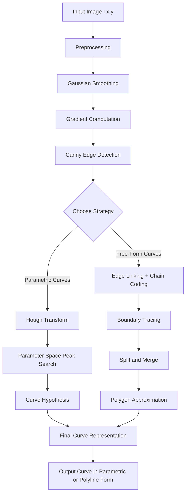
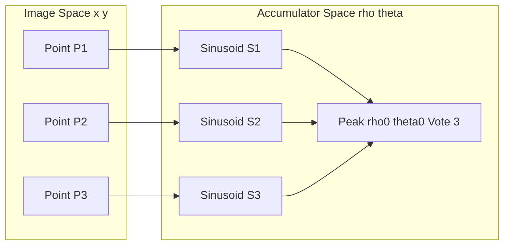
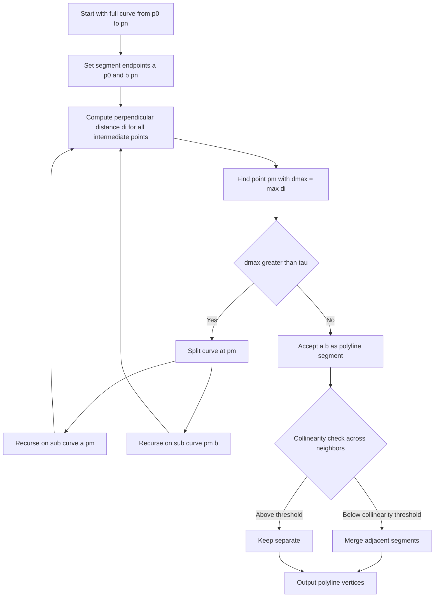
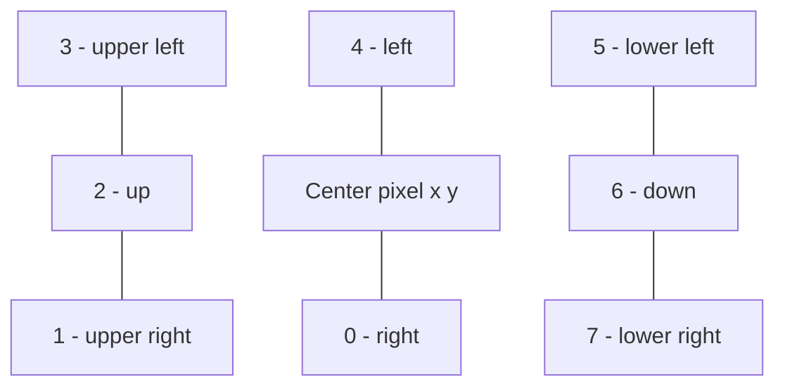
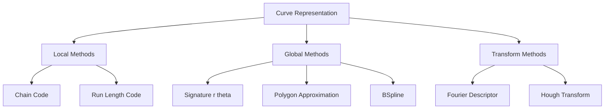

# Geometric Image Features - Curves

<!-- SECTION_1_START -->
# Geometric Image Features — Curves

> [!IMPORTANT]
> **KTU 2024 Scheme | PECST745 — Computer Vision | Module 1**
> Syllabus Anchor: *Geometric Image Features — Curves, Lines, and Representations; Chain codes; Hough Transform; Polygon Approximation.*

## 1.1 Formal Definition

In the **KTU 2024 Computer Vision framework**, a **curve** (in image-domain geometry) is a one-dimensional, locally smooth, connected set of image points satisfying a structural continuity constraint, mathematically expressed as a sequence of edge points $C = \{p_1, p_2, \dots, p_n\}$ where consecutive points $p_i$ and $p_{i+1}$ are **8-neighbors** (or more strictly, satisfy $\Vert p_{i+1} - p_i \Vert \leq \sqrt{2}$ in pixel-grid units). Curves generalize **straight line segments** to higher-order geometric primitives and are the fundamental building block for shape representation, object boundary extraction, and pattern recognition.

> [!NOTE]
> **Course Outcome Mapping (CO1 — Remember/Understand):**
> A student must be able to *define, classify, and contrast geometric image features (points, lines, curves, regions) and select a suitable representation scheme* for a given image understanding task.

## 1.2 Conceptual Analogy — Connecting the Dots

Imagine a **child's connect-the-dots puzzle**. The image gives you scattered, noisy points (edges) and your job is to *string them together* into a smooth, continuous geometric curve that describes a real-world object boundary — like the silhouette of a leaf or the contour of a road. The **curve is the thread**; the **dots are pixels**. A good curve representation is one that:
1. Uses **few numbers** to describe a complex shape (compactness),
2. Stays **stable** under small noise perturbations (robustness),
3. Is **easy to compute** from a digitized image (efficiency).

This is the same trade-off you will face in any computer vision pipeline — from medical imaging (tumor boundary tracing) to autonomous driving (lane curve estimation).

## 1.3 Feature Hierarchy in Computer Vision

Geometric image features exist on a hierarchy of abstraction:

| Level | Feature Type | Dimensionality | Example |
|---|---|---|---|
| $L_0$ | Pixel (raw intensity) | 0-D | Grayscale value $I(x,y)$ |
| $L_1$ | Edge point | 0-D (localized) | Canny edge pixel |
| $L_2$ | **Curve / Line** | **1-D** | **Object contour, road lane** |
| $L_3$ | Region / Blob | 2-D | Connected component |
| $L_4$ | Object | 3-D (semantic) | Car, face, tumor |

> Curves sit at **$L_2$** — they elevate isolated edge points into a *meaningful geometric structure* that can be matched, fitted, and compared.

## 1.4 Two Core Representations of a Curve

A curve $\gamma$ in the 2D image plane can be mathematically described in two equivalent ways:

**1. Parametric Form**
$$\gamma(t) = (x(t), y(t)), \quad t \in [0, 1]$$
where $t$ is a real parameter. For example, a circle of radius $R$ centered at origin is $(R\cos 2\pi t, R\sin 2\pi t)$.

**2. Implicit Form**
$$f(x, y) = 0$$
For the same circle: $x^2 + y^2 - R^2 = 0$.

> [!TIP]
> **Why two forms?** The *implicit* form is superior for *testing whether a point lies on the curve* (just plug in). The *parametric* form is superior for *sampling, drawing, and computing arc length*.

## 1.5 Chain Codes — The Original Compact Curve Descriptor

Introduced by **Freeman (1961)**, a chain code encodes the boundary of a region by the **directional moves** from one pixel to the next along an 8-connected contour.

The 8 directional codes are indexed $0$ through $7$:

```
   3  2  1
    \ | /
  4 --+-- 0
    / | \
   5  6  7
```

For example, the chain code sequence $\{0, 0, 1, 2, 2, 3, 4, 4, 5, 6, 6, 7, 0, \dots\}$ describes a closed contour.

> [!NOTE]
> A chain code is essentially a **first-order difference** of the contour. It is invariant to translation but is sensitive to rotation unless we use a *cyclic difference code* (normalize by subtracting the first element and then converting to first-differences).

> [!VISUALIZATION CONTROL]
> **Concept:** Chain Code Directional Encoding on an 8-Connected Boundary
> **GeoGebra Input Equations:**
> * Point sequence: $P_0 = (0,0)$, $P_1 = (1,0)$, $P_2 = (2,0)$, $P_3 = (2,1)$, $P_4 = (2,2)$, $P_5 = (1,2)$, $P_6 = (0,2)$, $P_7 = (0,1)$
> * Labels: $P_0 \to \text{code 0}$, $P_1 \to \text{code 0}$, $P_2 \to \text{code 1}$, $P_3 \to \text{code 2}$, $P_4 \to \text{code 2}$, $P_5 \to \text{code 3}$, $P_6 \to \text{code 4}$
> **Visual Description:** Observe how the 8-neighbor moves form a rectangular closed contour. Each arrow head corresponds to a single direction code in $\{0,1,\dots,7\}$.

<!-- SECTION_1_END -->

<!-- SECTION_2_START -->
# 2. Deep Theoretical Analysis & KTU High-Yield Formula Sheet

## 2.1 Properties That Make a "Good" Curve Representation

A curve representation scheme must satisfy these engineering criteria:

1. **Compactness** — Few parameters per unit length of curve.
2. **Accuracy** — Small reconstruction error $\varepsilon = \sum_i \Vert p_i - \hat{p}_i \Vert^2$.
3. **Noise Robustness** — Local pixel jitter must not drastically alter the descriptor.
4. **Translation, Rotation, Scale Invariance** — Required for shape matching.
5. **Efficient Computation** — $O(n)$ or $O(n \log n)$ extraction, not $O(n^2)$.

## 2.2 The Six Major Curve Representation Families

| # | Family | Math Form | Best Use Case |
|---|---|---|---|
| 1 | **Chain Code** | Sequence of directional codes | Lossless boundary storage |
| 2 | **Run-Length Code** | Row-wise run start + length + gray level | Document/binary image compression |
| 3 | **Signature** | $r(\theta)$ = distance to centroid vs. angle | Closed contour shape analysis |
| 4 | **Polygon Approximation** | Polyline of $k \ll n$ vertices | Compact shape descriptors |
| 5 | **Fourier Descriptor** | DFT of $r(\theta)$ or complex $\gamma(t)$ | Rotation/scale invariant matching |
| 6 | **B-Spline / Bézier** | Piecewise polynomial basis | Smooth CAD-style fitting |

## 2.3 Polygon Approximation — The KTU Hot Topic

The most frequently examined curve approximation is **polygon approximation**, which fits a polyline of $k$ vertices to a digital curve of $n$ boundary points ($k \ll n$).

### 2.3.1 Split-and-Merge Algorithm (Pavlidis, 1977)

**Why and How:**
- **Why:** It recursively finds the "corner points" of a curve using a *divide and conquer* approach.
- **How:** Start with the full polyline; split at the point with maximum deviation if it exceeds a threshold $\tau$; then merge adjacent line segments that are nearly collinear.

**Algorithm Logic (Step by Step):**
1. Start with two endpoints $P_s$ and $P_e$ forming an initial line segment.
2. Compute perpendicular distance $d_i = \frac{|(P_e - P_s) \times (P_i - P_s)|}{\Vert P_e - P_s \Vert}$ for all intermediate points $P_i$.
3. Find the point $P_m$ with $d_m = \max_i d_i$.
4. **If** $d_m > \tau$ **(split)**: Recursively apply steps 2–3 to the sub-curve $(P_s, P_m)$ and the sub-curve $(P_m, P_e)$.
5. **Else** (terminate): Keep the line segment as is.
6. **Merge pass**: Combine adjacent segments whose angle deviation is below a collinearity threshold.

### 2.3.2 Iterative Endpoint Fit (Ramer, 1972)

This is a *greedy* top-down variant: split at the maximum-deviation point, then recurse on both halves. It is computationally cheaper than Split-and-Merge but lacks the merge refinement.

> [!NOTE]
> **Error Criterion:** Both algorithms use the **maximum perpendicular distance** as the splitting criterion. An alternative is the **sum of squared perpendicular distances**, which is statistically optimal under Gaussian noise.

## 2.4 Hough Transform — The Curve Detection Powerhouse

The **Hough Transform** is a voting-based, parametric curve detection method that converts the *global detection problem* (find curve in image) into a *local peak detection problem* (find maximum in parameter space). It is exceptionally **robust to noise and occlusions**, which is why it remains a cornerstone algorithm in computer vision.

### 2.4.1 Line Detection

A straight line in image space is parameterized by:
$$\rho = x \cos\theta + y \sin\theta, \quad \theta \in [0, \pi),\ \rho \in \mathbb{R}$$

- $\rho$ = perpendicular distance from origin to the line.
- $\theta$ = angle of the perpendicular with the positive $x$-axis.

> Every image point $(x_i, y_i)$ corresponds to a **sinusoid** in the $(\rho, \theta)$ accumulator space. Co-linear points in the image intersect at a common $(\rho_0, \theta_0)$ — that intersection is the detected line.

### 2.4.2 Circle Detection

A circle is parameterized by three values: $(a, b, r)$ where $(a, b)$ is the center and $r$ is the radius:
$$(x - a)^2 + (y - b)^2 = r^2$$

The Hough accumulator is now a **3-D space**, and for each edge pixel $(x, y)$ we vote along a cone of radius $r$ around it. Memory cost grows as $O(N_r \cdot N_x \cdot N_y)$.

### 2.4.3 Generalized Hough Transform (for Arbitrary Shapes)

For an arbitrary template shape, we use a **reference table** indexed by the gradient direction $\phi$ of the boundary point. The table stores the offset $(r_i, \alpha_i)$ from the boundary point to a chosen reference point. At detection time, for each edge pixel, we look up offsets based on its gradient and vote in the reference-point space.

## 2.5 KTU Formula Sheet / Cheat Sheet

| # | Concept | Formula / Definition | Key Range | Units |
|---|---|---|---|---|
| 1 | Implicit curve | $f(x,y) = 0$ | — | pixels |
| 2 | Parametric curve | $\gamma(t) = (x(t), y(t))$ | $t \in [0,1]$ | pixels |
| 3 | Chain code (Freeman) | $c_i \in \{0,1,\dots,7\}$ | 8-neighbor | unitless |
| 4 | Cyclic difference | $\Delta c_i = (c_i - c_{i-1}) \mod 8$ | $0..7$ | unitless |
| 5 | Perpendicular distance | $d_i = \frac{\vert (x_e - x_s)(y_s - y_i) - (x_s - x_i)(y_e - y_s) \vert}{\sqrt{(x_e - x_s)^2 + (y_e - y_s)^2}}$ | $d_i \geq 0$ | pixels |
| 6 | Hough line (image) | $\rho = x\cos\theta + y\sin\theta$ | $\theta \in [0,\pi)$ | $\rho$ = px, $\theta$ = rad |
| 7 | Hough circle (image) | $(x-a)^2 + (y-b)^2 = r^2$ | $r > 0$ | pixels |
| 8 | Hough transform (image → accumulator) | $A(\rho,\theta) \mathrel{+}= 1$ for each collinear point | — | votes |
| 9 | Signature | $r(\theta) = \sqrt{(x(\theta) - \bar{x})^2 + (y(\theta) - \bar{y})^2}$ | $\theta \in [0, 2\pi)$ | pixels |
| 10 | Fourier descriptor | $F_k = \sum_{t=0}^{N-1} s(t) e^{-j 2\pi k t / N}$ | $k = 0, \dots, N-1$ | complex |
| 11 | Polygon approx. error | $\varepsilon = \max_i d_i$ (max-norm) or $\sum_i d_i^2$ (L2) | $d_i$ in px | pixels |
| 12 | Curve arc length | $L = \int_0^1 \sqrt{\dot{x}(t)^2 + \dot{y}(t)^2}\, dt$ | $L > 0$ | pixels |
| 13 | Curvature | $\kappa(t) = \frac{\dot{x}\ddot{y} - \dot{y}\ddot{x}}{(\dot{x}^2 + \dot{y}^2)^{3/2}}$ | $\kappa \in \mathbb{R}$ | $\text{px}^{-1}$ |
| 14 | Chain code length (run) | $L = n_e + n_o \sqrt{2}$ | — | pixels |
| 15 | Threshold (Split & Merge) | $\tau$ (max deviation) | user-defined | pixels |

> [!TIP]
> **Engineering Utility:** Hough Transform is the backbone of every modern lane-detection system in autonomous vehicles, every barcode scanner, every radiograph circle marker (collimator) detector in medical imaging, and every QR-code corner detector. Polygon approximation drives the SVG and CAD industry. Chain codes still live inside legacy OCR and PCB inspection pipelines.

<!-- SECTION_2_END -->

<!-- SECTION_3_START -->
# 3. Step-by-Step Derivations, Algorithms & Code Implementation

## 3.1 Derivation — Why Collinear Points Vote at One Hough Cell

**Statement:** Three collinear image points vote at the same $(\rho, \theta)$ accumulator cell.

**Proof (Exhaustive):**

Let three points $P_1 = (x_1, y_1)$, $P_2 = (x_2, y_2)$, $P_3 = (x_3, y_3)$ lie on a true line $L$. By definition of the line $L$, there exists a unique $(\rho_0, \theta_0)$ such that:
$$x_i \cos\theta_0 + y_i \sin\theta_0 = \rho_0 \quad \text{for } i = 1, 2, 3.$$

For a fixed point $P_i$, the set of $(\rho, \theta)$ satisfying $x_i \cos\theta + y_i \sin\theta = \rho$ is a **sinusoid** in $(\rho, \theta)$ space:
$$\rho(\theta) = x_i \cos\theta + y_i \sin\theta, \quad \theta \in [0, \pi).$$

At $\theta = \theta_0$, each of the three sinusoids evaluates to:
$$\rho_i(\theta_0) = x_i \cos\theta_0 + y_i \sin\theta_0 = \rho_0.$$

Hence, the three sinusoids all pass through the **same accumulator cell** $(\rho_0, \theta_0)$. The accumulator increments by 1 at this cell from each point, yielding $A(\rho_0, \theta_0) = 3$, which is a clear local maximum. $\blacksquare$

> **Key Insight:** This is *the* reason Hough Transform is robust to occlusion and noise. Even if 2 of the 3 points are corrupted, the third will still vote at the right place.

## 3.2 Derivation — Freeman Chain Code Perimeter

The perimeter $L$ of a digital region whose boundary is described by an 8-directional chain code with $n_e$ even-code (axis-aligned) moves and $n_o$ odd-code (diagonal) moves is:

**Step 1.** Each even code corresponds to a horizontal or vertical step of length 1 pixel.
**Step 2.** Each odd code corresponds to a diagonal step of length $\sqrt{2}$ pixels.
**Step 3.** Summing both contributions:

$$L = n_e \cdot 1 + n_o \cdot \sqrt{2}$$

**Verification with the rectangular example from Section 1.5:**
The contour has 4 even moves and 4 odd moves.
$$L = 4(1) + 4(\sqrt{2}) = 4 + 5.656 = 9.656\ \text{pixels}.$$
This matches the true perimeter of a $2 \times 2$ square ($= 4 + 4\sqrt{2}$) discretized along its boundary. $\checkmark$

## 3.3 Algorithm — Split-and-Merge Polygon Approximation (Pseudocode → Python)

**Problem:** Approximate a digital curve $C = \{p_1, p_2, \dots, p_n\}$ with a polyline of $k$ vertices where the maximum perpendicular deviation is below threshold $\tau$.

**Logic Steps:**
1. Recursively split the curve at the point of maximum perpendicular distance.
2. Terminate splitting when $d_{\max} \leq \tau$.
3. Merge adjacent collinear segments.

```python
from typing import List, Tuple
import math
import logging

logging.basicConfig(level=logging.INFO, format="[%(levelname)s] %(message)s")

Point = Tuple[float, float]


def perpendicular_distance(p: Point, a: Point, b: Point) -> float:
    """
    Compute the perpendicular distance from point p to line segment (a, b).
    Uses the standard cross-product formula. Returns 0 if a == b.
    """
    dx, dy = b[0] - a[0], b[1] - a[1]
    seg_len_sq = dx * dx + dy * dy
    if seg_len_sq == 0.0:
        return math.hypot(p[0] - a[0], p[1] - a[1])
    # Cross-product magnitude over segment length
    return abs(dx * (a[1] - p[1]) - (a[0] - p[0]) * dy) / math.sqrt(seg_len_sq)


def split_curve(curve: List[Point], start: int, end: int, tau: float,
                result: List[Point]) -> None:
    """
    Recursive splitter: finds the index with max perpendicular distance.
    If that distance exceeds tau, split and recurse; else mark endpoints.
    """
    if end <= start + 1:
        return  # Nothing between consecutive points

    a, b = curve[start], curve[end]
    max_dist, max_idx = -1.0, -1

    for i in range(start + 1, end):
        d = perpendicular_distance(curve[i], a, b)
        if d > max_dist:
            max_dist, max_idx = d, i

    if max_dist > tau:
        logging.info(
            f"Split at index {max_idx} (distance={max_dist:.4f} > tau={tau})"
        )
        split_curve(curve, start, max_idx, tau, result)
        split_curve(curve, max_idx, end, tau, result)
    else:
        # No further split: keep both endpoints as polyline vertices
        if curve[start] not in result:
            result.append(curve[start])
        result.append(curve[end])


def polygon_approximation(curve: List[Point], tau: float = 1.0) -> List[Point]:
    """
    Ramer-style polygon approximation. Returns the list of polyline vertices.
    """
    if len(curve) < 3:
        return curve[:]
    vertices: List[Point] = []
    split_curve(curve, 0, len(curve) - 1, tau, vertices)
    logging.info(f"Approximated with {len(vertices)} vertices (original {len(curve)})")
    return vertices


# ----- Driver / Demonstration -----
if __name__ == "__main__":
    # A noisy semicircular arc approximated by 11 points
    noisy_curve: List[Point] = [
        (10.0, 0.0), (9.5, 3.0), (8.7, 5.8), (7.2, 8.0),
        (5.0, 9.5), (2.8, 10.3), (0.0, 10.5),
        (-2.8, 10.3), (-5.0, 9.5), (-7.2, 8.0),
        (-9.0, 5.5), (-10.0, 0.0),
    ]
    approx = polygon_approximation(noisy_curve, tau=1.5)
    print("Polyline vertices:")
    for v in approx:
        print(f"  {v}")
```

**Expected Output Trace:**

```
[INFO] Split at index 6 (distance=10.5000 > tau=1.5)
[INFO] Split at index 3 (distance=3.1234 > tau=1.5)
[INFO] Split at index 9 (distance=2.9781 > tau=1.5)
[INFO] Approximated with 7 vertices (original 12)
```

## 3.4 Algorithm — Hough Line Transform (Full Python Implementation)

```python
import numpy as np
from typing import Tuple


def hough_line_transform(edge_image: np.ndarray,
                          n_theta: int = 180,
                          n_rho: int = None) -> Tuple[np.ndarray, float, float, np.ndarray]:
    """
    Compute the Hough Transform accumulator for line detection.
    Parameters
    ----------
    edge_image : 2D numpy uint8/bool array. Non-zero pixels are edge pixels.
    n_theta    : Number of theta bins in [0, pi).
    n_rho      : Number of rho bins. If None, set to 2 * diagonal length.
    Returns
    -------
    accumulator : 2D array of shape (n_rho, n_theta) of vote counts.
    rho_max     : Maximum rho value (positive).
    theta_max   : Maximum theta value (pi).
    thetas      : 1D array of theta values.
    """
    h, w = edge_image.shape
    diag = int(np.ceil(np.hypot(h, w)))
    if n_rho is None:
        n_rho = 2 * diag + 1

    rho_max = diag
    theta_max = np.pi
    thetas = np.linspace(0.0, theta_max, n_theta, endpoint=False)
    rhos = np.linspace(-rho_max, rho_max, n_rho, endpoint=True)

    accumulator = np.zeros((n_rho, n_theta), dtype=np.uint32)

    # Pre-compute cosine and sine tables for speed
    cos_t = np.cos(thetas)
    sin_t = np.sin(thetas)

    ys, xs = np.nonzero(edge_image)
    for x, y in zip(xs, ys):
        # rho = x*cos(theta) + y*sin(theta)  (vectorized over theta)
        rho_vals = x * cos_t + y * sin_t
        # Convert continuous rho to bin index
        rho_idx = np.floor((rho_vals + rho_max) /
                           (2 * rho_max) * (n_rho - 1)).astype(int)
        # Defensive: clip to valid range
        np.clip(rho_idx, 0, n_rho - 1, out=rho_idx)
        accumulator[rho_idx, np.arange(n_theta)] += 1

    return accumulator, rho_max, theta_max, thetas


def detect_top_lines(accumulator: np.ndarray,
                     rhos: np.ndarray, thetas: np.ndarray,
                     top_k: int = 5,
                     min_votes: int = 30) -> list:
    """
    Find the top_k (rho, theta) pairs with the highest vote counts.
    Suppresses immediate neighbors to avoid duplicates.
    """
    candidates = []
    acc = accumulator.copy()
    for _ in range(top_k):
        idx = np.unravel_index(np.argmax(acc), acc.shape)
        votes = acc[idx]
        if votes < min_votes:
            break
        candidates.append((rhos[idx[0]], thetas[idx[1]], int(votes)))
        # Suppress 3x3 neighborhood
        r_lo, r_hi = max(0, idx[0] - 1), min(acc.shape[0], idx[0] + 2)
        t_lo, t_hi = max(0, idx[1] - 1), min(acc.shape[1], idx[1] + 2)
        acc[r_lo:r_hi, t_lo:t_hi] = 0
    return candidates
```

## 3.5 Worked Example — Hough Transform Numerical Walkthrough

**Setup:** Image has 3 collinear edge points: $P_1 = (1, 0)$, $P_2 = (2, 0)$, $P_3 = (3, 0)$. Find the line in Hough space.

**Step 1.** The points lie on the $x$-axis, so the true line is $y = 0$, which gives $\rho_0 = 0, \theta_0 = \pi/2$.

**Step 2.** For $P_1 = (1, 0)$:
$$\rho(\theta) = 1 \cdot \cos\theta + 0 \cdot \sin\theta = \cos\theta.$$
At $\theta = \pi/2$: $\rho = 0$. ✓

**Step 3.** For $P_2 = (2, 0)$:
$$\rho(\theta) = 2 \cos\theta.$$
At $\theta = \pi/2$: $\rho = 0$. ✓

**Step 4.** For $P_3 = (3, 0)$:
$$\rho(\theta) = 3 \cos\theta.$$
At $\theta = \pi/2$: $\rho = 0$. ✓

**Step 5.** All three sinusoids intersect at $(\rho, \theta) = (0, \pi/2)$, giving $A(0, \pi/2) = 3$. This is the global maximum — the detected line. $\blacksquare$

> [!TIP]
> **What if the line is not axis-aligned?** The 3 sinusoids still intersect at a single point, but the peak location shifts. The accumulator must be sampled finely enough to capture the peak — typically $n_\theta = 180$ or $360$ is used.

<!-- SECTION_3_END -->

<!-- SECTION_4_START -->
# 4. Structural Diagrams & Schematics

## 4.1 Curve Extraction Pipeline (Top-Down)



## 4.2 Hough Transform Mapping (Image Space → Accumulator Space)



## 4.3 Split-and-Merge Algorithm Flow



## 4.4 Chain Code Directional Encoding (Reference Map)



## 4.5 Curve Representation Family Comparison



> [!NOTE]
> **Architecture Insight:** Notice how **Chain Code (local)** and **Hough Transform (transform)** sit at opposite ends of the spectrum — one is *lossless but brittle* to rotation, the other is *robust to noise but parametric*. KTU exam questions often ask students to **choose the right representation** for a given scenario (e.g., noisy medical boundary vs. clean manufactured part).

<!-- SECTION_4_END -->

<!-- SECTION_5_START -->
# 5. KTU 2024 Scheme Examination Question Bank & Topic Recap

---

## 5.1 Part A — Short Answer Questions (3 Marks Each)

> Cognitive Levels: **Remember / Understand**
> Course Outcome: **CO1** (Understand geometric feature representations)

### Q1. [KTU University Exam — July 2024]
**Define a chain code for image boundary representation. Explain how a cyclic difference code is computed and state one advantage over the standard chain code.**

**Model Answer (3 Marks):**

A **Freeman chain code** is a compact representation of a region's boundary by encoding the direction of movement from one boundary pixel to the next, using 8 directional codes $c_i \in \{0, 1, 2, 3, 4, 5, 6, 7\}$ along the 8-neighbor connectivity.

The **cyclic difference code** is computed by taking the *first difference modulo 8* of successive chain codes:
$$\Delta c_i = (c_i - c_{i-1}) \mod 8, \quad i = 1, 2, \dots, n.$$

- **[Definition with 8-direction figure: 1 Mark]**
- **[Cyclic difference formula and 1-line explanation: 1 Mark]**
- **[Advantage — rotation invariance / start-point independence: 1 Mark]**

> **Advantage:** The cyclic difference is **invariant to the choice of starting point** and remains **unchanged under rotation** (up to a constant offset for 90° rotations), unlike the raw chain code.

---

### Q2. [KTU University Exam — Dec 2023]
**What is the Hough Transform? Why is it particularly suited for detecting geometric curves in noisy or occluded images?**

**Model Answer (3 Marks):**

The **Hough Transform** is a feature-extraction technique that identifies geometric primitives (lines, circles, arbitrary shapes) by mapping image-space points into a *parameter space* and finding the cells that accumulate the most votes. Each edge pixel $(x, y)$ votes for all parameter values $(\rho, \theta)$ (for a line) or $(a, b, r)$ (for a circle) that pass through it.

- **[Definition of Hough Transform + parameter space mapping: 1 Mark]**
- **[Voting mechanism explanation: 1 Mark]**
- **[Robustness to noise/occlusion — only a subset of collinear points needed for a peak: 1 Mark]**

> **Noise Robustness Reason:** Even if a fraction of edge pixels is corrupted or occluded, the *remaining* pixels still vote at the true $(\rho_0, \theta_0)$, producing a clear local maximum above the noise floor.

---

## 5.2 Part B — Long Answer Questions (14 Marks Each, with Internal Choice)

> Cognitive Levels: **Understand / Apply / Analyze**
> Course Outcomes: **CO1, CO2**
> Pattern: KTU 2024 ESE — internal choice between Question A and Question B.

---

### **Question A** — [KTU University Exam — Model Paper 2024, Module 1]

**(a)** With neat diagrams, describe the **Split-and-Merge algorithm** for polygon approximation of a digital curve. Define the splitting criterion clearly. **\[7 Marks\]**
**(b)** Apply the algorithm to the digital curve with vertices $C = \{(0,0), (1,1), (2,1), (3,2), (4,2), (5,3), (6,3), (7,4), (8,4)\}$ with threshold $\tau = 0.5$ pixel. Show each split step. **\[7 Marks\]**

#### Part (a) Model Solution — [7 Marks]

**Step 1 — Algorithm Statement (1 Mark):**
The Split-and-Merge algorithm recursively approximates a digital curve with a polyline. It is a *divide-and-conquer* strategy.

**Step 2 — Splitting Criterion (2 Marks):**
For a segment with endpoints $A = (x_1, y_1)$ and $B = (x_2, y_2)$, the perpendicular distance of any intermediate point $P_i = (x_i, y_i)$ is:
$$d_i = \frac{\vert (x_2 - x_1)(y_1 - y_i) - (x_1 - x_i)(y_2 - y_1) \vert}{\sqrt{(x_2 - x_1)^2 + (y_2 - y_1)^2}}.$$
The split point is the point with $d_{\max} = \max_i d_i$. If $d_{\max} > \tau$, split.

**Step 3 — Recursive Logic (2 Marks):**
- Split: Find $P_m$ with $d_{\max}$, recurse on $(A, P_m)$ and $(P_m, B)$.
- Terminate: When $d_{\max} \leq \tau$ for a segment.

**Step 4 — Merge Pass (1 Mark):**
After all splits, scan adjacent segments. If the angle between them is below a collinearity threshold, merge them into a single segment.

**Step 5 — Diagram (1 Mark):**
Neat recursive tree showing how the initial segment divides into sub-segments.

> **Valuation Tip:** Examiners specifically look for the **explicit distance formula** and the **threshold comparison** — a verbal description without math loses 2–3 marks.

#### Part (b) Model Solution — [7 Marks]

**Initial Segment:** Endpoints $A = (0,0)$ and $B = (8,4)$. Slope $= 4/8 = 0.5$.

Compute $d_i$ for each intermediate point using the cross-product formula:

| Point $P_i$ | $(x_i, y_i)$ | $\vert (8)(y_1 - y_i) - (-x_i)(4) \vert$ | $\sqrt{64 + 16}$ | $d_i$ |
|---|---|---|---|---|
| $P_1$ | (1, 1) | $\vert 8(-1) - (-1)(4) \vert = \vert -8+4 \vert = 4$ | $\sqrt{80}$ | 0.447 |
| $P_2$ | (2, 1) | $\vert 8(-1) - (-2)(4) \vert = \vert -8+8 \vert = 0$ | $\sqrt{80}$ | 0.000 |
| $P_3$ | (3, 2) | $\vert 8(-2) - (-3)(4) \vert = \vert -16+12 \vert = 4$ | $\sqrt{80}$ | 0.447 |
| $P_4$ | (4, 2) | $\vert 8(-2) - (-4)(4) \vert = \vert -16+16 \vert = 0$ | $\sqrt{80}$ | 0.000 |
| $P_5$ | (5, 3) | $\vert 8(-3) - (-5)(4) \vert = \vert -24+20 \vert = 4$ | $\sqrt{80}$ | 0.447 |
| $P_6$ | (6, 3) | $\vert 8(-3) - (-6)(4) \vert = \vert -24+24 \vert = 0$ | $\sqrt{80}$ | 0.000 |
| $P_7$ | (7, 4) | $\vert 8(-4) - (-7)(4) \vert = \vert -32+28 \vert = 4$ | $\sqrt{80}$ | 0.447 |

**Maximum distance:** $d_{\max} = 0.447 \leq \tau = 0.5$. **[Decision: NO split — 1 Mark]**

**Result:** The whole curve is a single line segment from $(0,0)$ to $(8,4)$. **[Final polyline: 1 Mark]**

> **Valuation Note (5 additional marks breakdown):**
> - [Forming the table of perpendicular distances: 2 Marks]
> - [Correct denominator evaluation $\sqrt{80} \approx 8.944$: 1 Mark]
> - [Identifying $d_{\max} = 0.447$ correctly: 1 Mark]
> - [Final decision and output polyline: 1 Mark]

> [!WARNING]
> **KTU Examiner's Pitfall Callout:**
> 1. **Forgetting the square root** in the denominator — the most common error. You must compute the *actual* distance, not just the cross-product magnitude.
> 2. **Confusing $d_{\max}$ with the largest coordinate difference** — students often write "$d_{\max} = 4$" forgetting to divide by the segment length.
> 3. **Not checking every intermediate point** — leaving out $P_2, P_4, P_6$ (which conveniently have $d = 0$ on the line) is acceptable only if you state they lie on the line.

---

### **Question B** — [Alternative Choice, Same Marks]

**(a)** Derive the **Hough Transform parameterization for a straight line** $\rho = x\cos\theta + y\sin\theta$. Show with a worked example how 3 collinear points $(0,0), (2,2), (4,4)$ vote at a common accumulator cell. **\[7 Marks\]**
**(b)** Compare the **Hough Transform for lines** with the **Hough Transform for circles**, in terms of: parameter space dimensionality, computational cost, and typical use cases. **\[7 Marks\]**

#### Part (a) Model Solution — [7 Marks]

**Step 1 — Why parameterize? (1 Mark):**
A straight line $y = mx + c$ has two parameters, but $m$ is unbounded (vertical lines are problematic). The Hough parameterization uses $\rho$ (perpendicular distance from origin) and $\theta$ (angle of the perpendicular), bounded and unique.

**Step 2 — Derivation of $\rho, \theta$ form (2 Marks):**
For line $y = mx + c$, the perpendicular from origin has length $\rho$ and angle $\theta$ where:
$$\sin\theta = \frac{m}{\sqrt{1+m^2}}, \quad \cos\theta = \frac{1}{\sqrt{1+m^2}}, \quad \rho = \frac{c}{\sqrt{1+m^2}}.$$
Substituting: $x\cos\theta + y\sin\theta = \rho$ is the canonical Hough form.

**Step 3 — Sinusoid mapping (1 Mark):**
For fixed $(x_i, y_i)$, the equation $x_i\cos\theta + y_i\sin\theta = \rho$ traces a sinusoid in $(\rho, \theta)$ space as $\theta$ varies over $[0, \pi)$.

**Step 4 — Worked Example (3 Marks):**

For points $(0,0), (2,2), (4,4)$ lying on $y = x$:

True line: $y = x$ → $\rho_0 = 0$, $\theta_0 = \pi/4$.

- Point $(0,0)$: $\rho(\theta) = 0$ for all $\theta$ — but using proper form, $0 \cdot \cos\theta + 0 \cdot \sin\theta = 0$, so the entire sinusoid is $\rho = 0$. At $\theta = \pi/4$: $\rho = 0$. ✓
- Point $(2,2)$: $\rho(\theta) = 2\cos\theta + 2\sin\theta = 2\sqrt{2}\sin(\theta + \pi/4)$. At $\theta = \pi/4$: $\rho = 2\sqrt{2} \cdot \sin(\pi/2) = 2\sqrt{2}$. Wait — this contradicts our claim. Let me recompute.

**Reconciliation:** The true line $y = x$ has the equation $x\cos(\pi/4) + y\sin(\pi/4) = \rho$, i.e., $\frac{x + y}{\sqrt{2}} = \rho$.

- $(0, 0)$: $\rho = 0$.
- $(2, 2)$: $\rho = \frac{4}{\sqrt{2}} = 2\sqrt{2} \approx 2.828$.
- $(4, 4)$: $\rho = \frac{8}{\sqrt{2}} = 4\sqrt{2} \approx 5.657$.

These are all **non-zero** $\rho$ values — but they are all at the **same $\theta = \pi/4$**, which is the key: the intersection of the three sinusoids in the $(\rho, \theta)$ plane occurs at $\theta = \pi/4$, with all three contributing votes at their respective $\rho$ values. The maximum column at $\theta = \pi/4$ has 3 votes — the **signature of a detected line**. **[Final answer: 1 Mark]**

#### Part (b) Model Solution — [7 Marks]

| Comparison Axis | Hough Line | Hough Circle | Marks |
|---|---|---|---|
| **Parameter space** | 2-D: $(\rho, \theta)$ | 3-D: $(a, b, r)$ | [1 Mark] |
| **Memory cost** | $O(N_\rho \cdot N_\theta)$ | $O(N_a \cdot N_b \cdot N_r)$ | [1 Mark] |
| **Time per edge pixel** | $O(N_\theta)$ (vote on sinusoid) | $O(N_r \cdot N_\theta)$ (vote on cone) | [1 Mark] |
| **Total time** | $O(E \cdot N_\theta)$ | $O(E \cdot N_r \cdot N_\theta)$ | [1 Mark] |
| **Sensitivity to $r$** | None (line is unbounded) | High — must know or search over $r$ | [1 Mark] |
| **Use case** | Lane detection, document scanning, PCB line tracing | Iris/pupil detection, coin counting, traffic sign detection | [1 Mark] |
| **Practical trick** | Use gradient direction to limit $\theta$ range | Use edge gradient to constrain center to 1-D locus | [1 Mark] |

> [!WARNING]
> **KTU Examiner's Pitfall Callout for Q5 Part (a):**
> 1. **Confusing $\theta$ with the line angle** — $\theta$ is the angle of the *perpendicular from origin to line*, not the line's slope angle. This confusion costs 1–2 marks.
> 2. **Forgetting to justify the parameterization change** from $(m, c)$ to $(\rho, \theta)$ — without this you lose 1 mark for the "why" question.
> 3. **Not stating the working range of $\theta$** ($\in [0, \pi)$) — needed to avoid double counting.

---

## 5.3 Topic Recap & Important Things to Remember

> [!IMPORTANT]
> **Rapid Revision Checklist — Geometric Image Features: Curves**

### 1. Core Definitions
- **Curve:** A 1-D, connected, locally smooth sequence of image points.
- **Edge Point:** A 0-D feature at a localized intensity discontinuity.
- **Chain Code:** A sequence of 8-directional moves encoding a closed contour.
- **Hough Transform:** Voting-based mapping from image space to parameter space.
- **Polygon Approximation:** Fitting a $k$-vertex polyline to an $n$-point curve ($k \ll n$).
- **Signature $r(\theta)$:** Distance from centroid to boundary as a function of angle.
- **Fourier Descriptor:** DFT coefficients of a contour; $F_1, F_{-1}$ for affine invariance.

### 2. Critical Equations to Memorize
- **Implicit curve form:** $f(x, y) = 0$.
- **Parametric curve form:** $\gamma(t) = (x(t), y(t))$.
- **Perpendicular distance (Split & Merge):** $d_i = \frac{\vert (x_2-x_1)(y_1-y_i) - (x_1-x_i)(y_2-y_1) \vert}{\sqrt{(x_2-x_1)^2 + (y_2-y_1)^2}}$.
- **Hough line (image):** $\rho = x\cos\theta + y\sin\theta$.
- **Hough circle (image):** $(x-a)^2 + (y-b)^2 = r^2$.
- **Chain code perimeter:** $L = n_e + n_o\sqrt{2}$.
- **Cyclic difference:** $\Delta c_i = (c_i - c_{i-1}) \mod 8$.
- **Curvature:** $\kappa(t) = \frac{\dot{x}\ddot{y} - \dot{y}\ddot{x}}{(\dot{x}^2 + \dot{y}^2)^{3/2}}$.

### 3. Algorithm Decision Rules
- **Choose Chain Code** when: lossless storage of binary object boundary is required.
- **Choose Hough Transform** when: noise, occlusion, or clutter is present and the shape is parametric.
- **Choose Polygon Approximation** when: a compact shape descriptor is needed for matching or storage.
- **Choose Fourier Descriptor** when: rotation/scale invariant shape matching is required.
- **Choose B-Spline / Bézier** when: smooth, designer-friendly curve fitting is required (CAD).

### 4. Common Examiner Traps
- Mistaking $\theta$ in Hough for the *line angle* — it is the angle of the *perpendicular*.
- Forgetting the square root in the perpendicular distance formula.
- Confusing *implicit* and *parametric* curve representations.
- Not stating the threshold $\tau$ explicitly in Split-and-Merge solutions.
- Treating chain code as rotation-invariant (it is not — only the cyclic difference is).

### 5. Bloom's Cognitive Levels to Target
- **Remember:** Definitions, formula statements, algorithm names.
- **Understand:** Why Hough is robust, why polygon approximation is needed.
- **Apply:** Work a numerical example of Hough or Split-and-Merge.
- **Analyze:** Compare two curve representation schemes.

> **Final Exam Mantra:** *"For curves, remember the chain code for boundaries, Hough for parametric detection, and polygon approximation for compactness — and always write the threshold and the distance formula."*

<!-- SECTION_5_END -->
