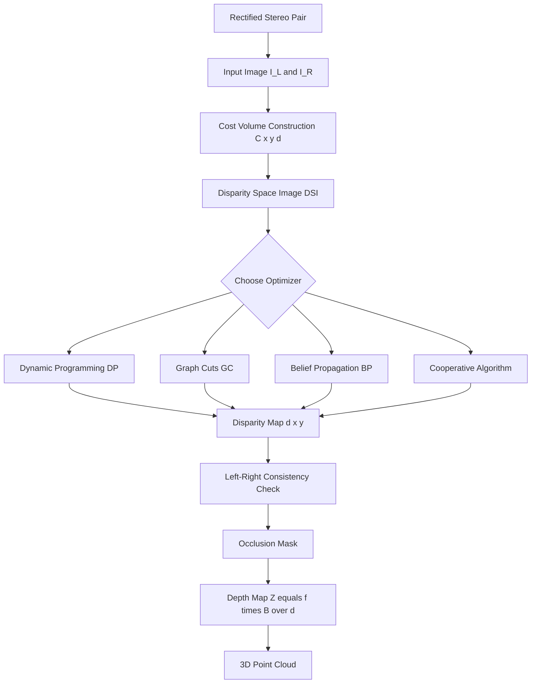
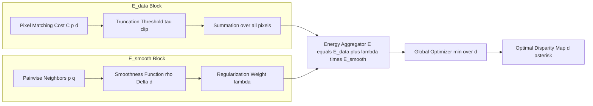
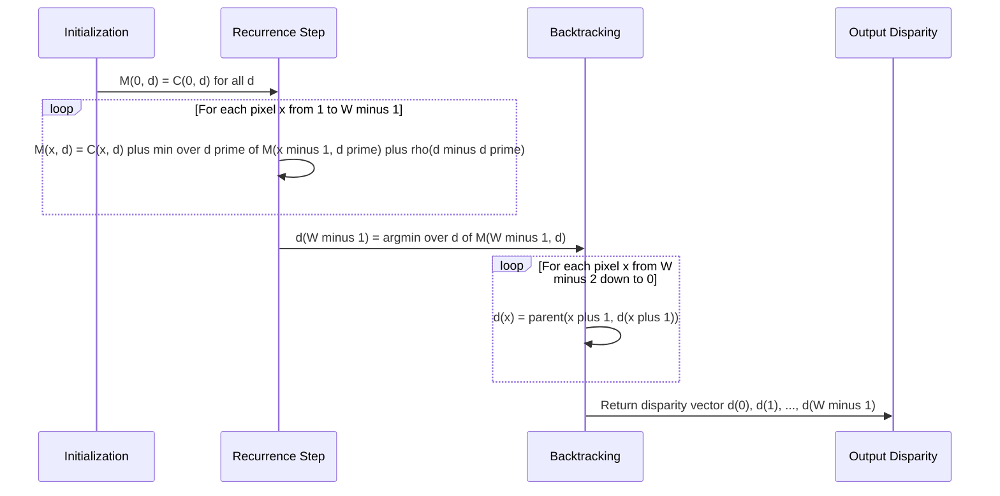
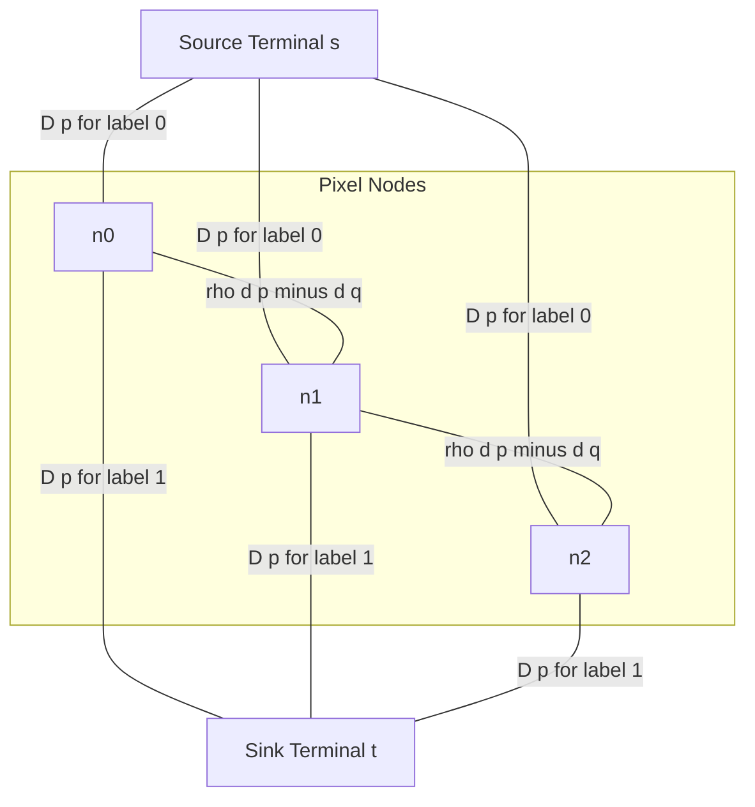
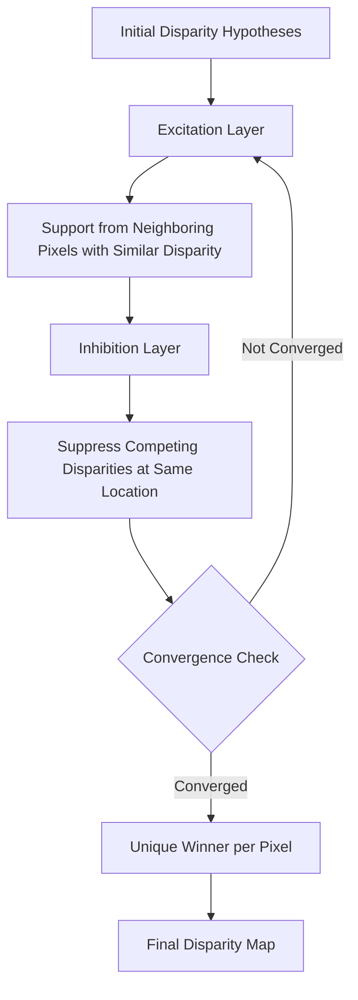

# Global Methods for Binocular Fusion.

<!-- SECTION_1_START -->
# Global Methods for Binocular Fusion

## 1.1 Formal Academic Definition (KTU 2024 Syllabus Terminology)

**Binocular Fusion** is the process in stereo vision where corresponding features (pixels, edges, or regions) from the left and right camera views are matched and combined to reconstruct the three-dimensional structure of a scene. **Global Methods** for binocular fusion refer to a class of stereo matching algorithms that compute the disparity map for the **entire image simultaneously** by formulating the problem as a global optimization task over an energy function, rather than computing disparities independently for each pixel or local window.

In the KTU 2024 *Computer Vision (PECST745)* syllabus, global methods are formally defined as:

> A class of stereo correspondence algorithms that minimize a global energy functional of the form
> $E(d) = E_{data}(d) + \lambda \cdot E_{smooth}(d)$
> where $E_{data}$ measures pixel-wise matching cost, $E_{smooth}$ enforces piecewise-smooth disparity continuity, and $\lambda$ controls the trade-off between fidelity and regularity.

These methods are contrastive to **Local (Window-Based) Methods** that use small correlation windows and winner-take-all (WTA) strategies to estimate per-pixel disparities.

> [!IMPORTANT]
> **KTU 2024 Syllabus Highlight (Module 1 - Fundamentals in Computer Vision)**
> Under global methods, students must master: (i) Energy minimization formulation, (ii) Dynamic Programming, (iii) Graph Cuts, (iv) Belief Propagation, (v) Cooperative Algorithms, and (vi) Disparity Space Image (DSI) analysis.

## 1.2 Conceptual Analogy and Intuitive Overview

Imagine two puzzle pieces — the left-eye image and the right-eye image of the same scene. Each piece alone is flat, but when we slide them sideways until their patterns align perfectly, the small horizontal shift needed at every point tells us how far away that point is. This shift is the **disparity**.

| Method Type | Analogy | Behavior |
|---|---|---|
| **Local Methods** | Looking at a single small tile at a time and guessing its depth | Fast but noisy, fails on textureless or occluded regions |
| **Global Methods** | Stepping back and looking at the entire puzzle, ensuring that nearby tile depths are consistent and edges are sharp | Slower but produces smooth, accurate depth maps with sharp object boundaries |

> [!NOTE]
> **Core Intuition:** Global methods treat the entire disparity map as a single decision variable. They enforce two competing desires — (1) each pixel should match its counterpart in the other view, and (2) neighboring pixels should have similar disparities (smooth surfaces). The optimizer balances these two desires to find the *most plausible* depth for every point in the scene.

The binocular fusion pipeline is conceptually:
1. **Rectify** the stereo pair so that epipolar lines are horizontal.
2. **Build a Disparity Space Image (DSI)** — a 3D cost volume $C(x, y, d)$ where $d$ is the candidate disparity.
3. **Optimize globally** to pick the best $d$ for every $(x, y)$.
4. **Refine** the result to handle occlusions and discontinuities.

> [!TIP]
> **Geometric Foundation:** For a rectified stereo pair with focal length $f$, baseline $B$, and disparity $d$, the depth $Z$ of a 3D point is given by $Z = \frac{f \cdot B}{d}$. Therefore, computing disparity *is* computing depth — global methods are essentially depth-from-stereo estimators.

> [!VISUALIZATION CONTROL]
> **Concept:** Disparity Space Image (DSI) as a 3D Cost Volume
> **GeoGebra / Desmos Input Equations (Conceptual 2D slice at fixed $y = y_0$):**
> * $C(x, d) = (I_L(x, y_0) - I_R(x - d, y_0))^2$ — squared intensity difference
> * Best path: $\arg\min_{d(x)} \sum_{x} C(x, d(x)) + \lambda \cdot \vert d(x) - d(x+1) \vert$
> **Visual Description:** Plot a 2D heatmap with horizontal axis as pixel column $x \in [0, W]$ and vertical axis as disparity $d \in [0, d_{max}]$. Dark valleys represent low matching cost. The optimal disparity path is a continuous (piecewise smooth) curve tracing through the dark valleys from left to right.
<!-- SECTION_1_END -->

<!-- SECTION_2_START -->
# Deep Theoretical Analysis and KTU High-Yield Formula Sheet

## 2.1 The Binocular Fusion Problem — Formal Setup

Given a rectified stereo pair $\{I_L(x, y), I_R(x, y)\}$, the goal is to find a disparity map $d(x, y)$ such that for every pixel $p = (x, y)$ in the left image:

$$I_L(x, y) \approx I_R(x - d(x, y), y)$$

The **correspondence problem** is ill-posed because:
- Multiple candidate matches may exist (ambiguity).
- Pixels may be **occluded** in one of the views (no valid match).
- Surfaces may be **textureless** (no distinguishing features).

Global methods resolve this by imposing **prior assumptions** (smoothness, piecewise continuity) on the solution space.

## 2.2 Energy Minimization Framework

The cornerstone of all global methods is the **Markov Random Field (MRF)** formulation. The disparity map $d$ is the MRF labeling that minimizes:

$$E(d) = \underbrace{\sum_{p \in \mathcal{P}} D_p(d_p)}_{E_{data}} + \underbrace{\sum_{(p,q) \in \mathcal{N}} V(d_p, d_q)}_{E_{smooth}}$$

### 2.2.1 The Data Term $E_{data}$

The data term measures how well a chosen disparity $d_p$ explains the observed pixel intensities:

$$D_p(d_p) = \min \left( C(p, d_p), \quad \tau_{clip} \right)$$

where $C(p, d)$ is a matching cost function and $\tau_{clip}$ is a truncation threshold to reduce the influence of outliers. Common cost functions are:

| Cost Function | Formula | Use Case |
|---|---|---|
| **Squared Intensity Difference (SD)** | $C(p,d) = (I_L(p) - I_R(p-d))^2$ | Calibrated, photometrically similar views |
| **Absolute Intensity Difference (AD)** | $C(p,d) = \vert I_L(p) - I_R(p-d) \vert$ | Fast, robust to outliers |
| **Normalized Cross-Correlation (NCC)** | $C(p,d) = \frac{\sum I_L \cdot I_R}{\sqrt{\sum I_L^2 \sum I_R^2}}$ | Robust to illumination changes |
| **Census Transform (CT)** | Hamming distance of binary descriptors | Robust to radiometric differences |
| **Birchfield-Tomasi (BT)** | Sampled intensity differences | Sub-pixel accuracy, robust to sampling |

### 2.2.2 The Smoothness Term $E_{smooth}$

The smoothness term penalizes disparity discontinuities between neighboring pixels $p$ and $q$:

$$V(d_p, d_q) = \begin{cases} 0 & \text{if } d_p = d_q \\ \rho(d_p - d_q) & \text{otherwise} \end{cases}$$

| Function $\rho(\Delta d)$ | Type | Property |
|---|---|---|
| $\rho(\Delta d) = \vert \Delta d \vert$ | Linear (L1) — Potts model | Preserves sharp depth discontinuities |
| $\rho(\Delta d) = (\Delta d)^2$ | Quadratic (L2) | Over-penalizes large jumps; blurs edges |
| $\rho(\Delta d) = \min(\vert \Delta d \vert, T)$ | Truncated linear | Compromise between L1 and robustness |
| $\rho(\Delta d) = \vert \Delta d \vert$ (adaptive) | Edge-aware | Weights reduced near image gradients |

## 2.3 Global Optimization Algorithms

### 2.3.1 Dynamic Programming (DP) — Scanline Optimization

DP solves the 1D problem along each epipolar scanline independently. It finds the minimum-cost path through the DSI slice $C(x, d)$ for fixed $y$:

$$M(x, d) = C(x, d) + \min_{d'} \left[ M(x-1, d') + \rho(d - d') \right]$$

- **State:** $M(x, d)$ = minimum cost to reach pixel $x$ with disparity $d$.
- **Transition:** Try all previous disparities $d'$, add occlusion cost or smoothness penalty.
- **Complexity:** $O(W \cdot D^2)$ per scanline, where $W$ is width and $D$ is max disparity.

> [!NOTE]
> **Limitation of DP:** Scanlines are optimized independently, leading to **horizontal streaking artifacts**. Modern variants (e.g., SGM — Semi-Global Matching) aggregate DP costs from multiple 1D paths to mitigate this.

### 2.3.2 Graph Cuts (GC)

The energy $E(d)$ is mapped to a **s-t min-cut problem** on a graph:
- Each pixel becomes a graph node.
- Two terminal nodes $s$ (source) and $t$ (sink) represent disparity choices.
- Edges encode data costs and smoothness costs.
- The min-cut (maximum flow) gives the optimal labeling in **polynomial time** for submodular $V$.

For multi-label disparities, **alpha-expansion** and **alpha-beta-swap** moves are used, each reducing to a binary graph cut. Complexity per move: $O(W \cdot H \cdot D)$ flow computation.

### 2.3.3 Belief Propagation (BP)

BP is a message-passing algorithm on a graphical model. Each node iteratively sends "belief" messages to its neighbors:

$$m_{p \to q}^{t+1}(d_q) = \min_{d_p} \left[ D_p(d_p) + V(d_p, d_q) + \sum_{r \in \mathcal{N}(p) \setminus q} m_{r \to p}^{t}(d_p) \right]$$

After convergence, the disparity at pixel $p$ is:

$$d_p^* = \arg\min_{d_p} \left[ D_p(d_p) + \sum_{q \in \mathcal{N}(p)} m_{q \to p}(d_p) \right]$$

Two variants:
- **Sum-Product BP:** Exact for trees, approximate for graphs with cycles.
- **Max-Product BP (Loopy BP):** Used for MRFs, runs iteratively until convergence.

### 2.3.4 Cooperative Algorithms

Cooperative algorithms (Marr & Poggio, 1976) are biologically-inspired and use **excitation and inhibition** between disparity hypotheses:
- **Excitation:** Reinforce hypotheses supported by neighboring matches.
- **Inhibition:** Suppress competing hypotheses at the same location.
- Iteratively update until a unique "winner" emerges per pixel.

These are precursors to modern neural-network-based stereo matching.

## 2.4 Disparity Space Image (DSI) and Occlusion

The DSI is a 3D tensor $C(x, y, d)$ storing the matching cost for every pixel and disparity hypothesis. A **valid path** through the DSI is a function $d(x, y)$ such that:
- Disparity varies smoothly within objects.
- Disparity changes abruptly at object boundaries.
- The path avoids regions where left and right images disagree (occlusions).

> [!TIP]
> **KTU Key Concept:** Occluded pixels are detected by **left-right consistency check (LRC)**. Let $d_L(x, y)$ be the left-to-right disparity and $d_R(x, y - d_L)$ be the corresponding right-to-left disparity. A pixel is occluded if $\vert d_L(x, y) - d_R(x - d_L, y) \vert > \tau_{LRC}$.

## 2.5 KTU High-Yield Formula Sheet

| # | Concept | Formula | Units / Notes |
|---|---|---|---|
| 1 | Depth from disparity | $Z = \dfrac{f \cdot B}{d}$ | $f$ in pixels (or mm), $B$ in mm, $d$ in pixels |
| 2 | Disparity definition | $d = x_L - x_R$ | Pixels, must be non-negative for rectified pairs |
| 3 | Sub-pixel disparity | $d^* = d_{int} + \dfrac{C(d_{int}+1) - C(d_{int}-1)}{2(C(d_{int}+1) + C(d_{int}-1) - 2C(d_{int}))}$ | Parabolic fit around integer minimum |
| 4 | Global energy | $E(d) = E_{data}(d) + \lambda \cdot E_{smooth}(d)$ | $\lambda \geq 0$ is regularization weight |
| 5 | Data term (clipped) | $D_p(d) = \min(C(p,d), \tau_{clip})$ | Reduces outlier influence |
| 6 | Potts smoothness | $V(d_p, d_q) = \lambda \cdot [d_p \neq d_q]$ | Discontinuity-preserving |
| 7 | Truncated L1 | $V(d_p, d_q) = \lambda \cdot \min(\vert d_p - d_q \vert, T)$ | Compromise robustness/sharpness |
| 8 | DP recurrence | $M(x, d) = C(x, d) + \min_{d'} [M(x-1, d') + \rho(d - d')]$ | Per scanline, 1D optimization |
| 9 | BP message | $m_{p \to q}(d_q) = \min_{d_p} [D_p(d_p) + V(d_p, d_q) + \sum_{r} m_{r \to p}(d_p)]$ | Iterative until convergence |
| 10 | LRC occlusion | $occ = \mathbb{1}[\vert d_L(p) - d_R(p - d_L(p)) \vert > \tau]$ | Bidirectional consistency |
| 11 | DP complexity | $O(W \cdot D^2)$ per scanline | $W$ = width, $D$ = max disparity |
| 12 | Graph cut complexity | $O(W \cdot H \cdot D \cdot \log C)$ per expansion move | $C$ = max capacity in flow network |
| 13 | NCC similarity | $NCC = \dfrac{\sum (I_L - \bar{I_L})(I_R - \bar{I_R})}{\sqrt{\sum (I_L - \bar{I_L})^2 \sum (I_R - \bar{I_R})^2}}$ | Range $[-1, 1]$, higher is better |
| 14 | Census cost | $CT(p) = \bigotimes_{q \in \mathcal{N}(p)} [I(q) < I(p)]$ | Hamming distance of bit strings |
| 15 | Disparity gradient | $\nabla d = \dfrac{\partial d}{\partial x} \hat{i} + \dfrac{\partial d}{\partial y} \hat{j}$ | Used in Marr's gradient-limit constraint |

## 2.6 Real-World Engineering Utility

| Domain | Application | Why Global Methods? |
|---|---|---|
| **Autonomous Vehicles (Mobileye, Waymo, Tesla)** | Obstacle detection, free-space estimation | Sharp object boundaries critical for safety |
| **Robotic Surgery (da Vinci System)** | 3D reconstruction of tissue | Sub-millimeter depth accuracy needed |
| **AR/VR (Meta Quest, Apple Vision Pro)** | Real-time depth for occlusion and interaction | Smooth depth without texture-copy artifacts |
| **Industrial Inspection (bin picking)** | 3D part localization | Handles textureless metallic surfaces |
| **Photogrammetry and 3D Mapping** | Aerial stereo reconstruction | Produces dense, accurate DSMs |
| **Medical Imaging (endoscopy)** | 3D surface reconstruction inside body | Handles low-texture soft tissue |
| **Satellite Imaging (DigitalGlobe)** | DEM/DSM generation | Large-baseline, low-texture scenes |

> [!TIP]
> **Industry Note:** Modern production systems rarely use *pure* DP, GC, or BP. They use **Semi-Global Matching (SGM)** as a fast approximation, or **deep-learning hybrids** (e.g., CNN cost volumes + SGM refinement) such as **PSMNet**, **AANet**, and **RAFT-Stereo**. However, the KTU examiner expects the classical global method derivations.
<!-- SECTION_2_END -->

<!-- SECTION_3_START -->
# Step-by-Step Derivations and Algorithmic Implementation

## 3.1 Derivation: Depth from Disparity

**Step 1: Geometric Setup.** Consider two cameras with parallel optical axes separated by baseline $B$. A 3D point $P = (X, Y, Z)$ projects to:
- Left image: $x_L = \dfrac{f \cdot X}{Z}$
- Right image: $x_R = \dfrac{f \cdot (X - B)}{Z}$

**Step 2: Disparity Definition.**
$$d = x_L - x_R = \dfrac{f \cdot X}{Z} - \dfrac{f \cdot (X - B)}{Z} = \dfrac{f \cdot B}{Z}$$

**Step 3: Solve for Depth.** Invert the relation:
$$Z = \dfrac{f \cdot B}{d}$$

This shows that depth is **inversely proportional** to disparity. Closer objects have larger disparity; far objects have smaller disparity (approaching zero at infinity).

## 3.2 Derivation: Sub-Pixel Disparity via Parabolic Interpolation

**Step 1: Locate integer minimum.** Find $d_{int} = \arg\min_d C(d)$.

**Step 2: Sample neighbors.** Let $C_{-} = C(d_{int} - 1)$, $C_0 = C(d_{int})$, $C_{+} = C(d_{int} + 1)$.

**Step 3: Fit a parabola** $\hat{C}(d) = a(d - d_{int})^2 + b(d - d_{int}) + C_0$ to the three samples.

Solving the linear system:
$$\begin{aligned}
C_{-} &= a - b + C_0 \\
C_{+} &= a + b + C_0
\end{aligned}$$

Add: $C_{-} + C_{+} = 2a + 2C_0 \Rightarrow a = \dfrac{C_{-} + C_{+}}{2} - C_0$.

Subtract: $C_{+} - C_{-} = 2b \Rightarrow b = \dfrac{C_{+} - C_{-}}{2}$.

**Step 4: Find sub-pixel offset.** Minimum of parabola: $\dfrac{\partial \hat{C}}{\partial d} = 2a(d - d_{int}) + b = 0$.

$$\delta = \dfrac{-b}{2a} = \dfrac{C_{-} - C_{+}}{2(C_{-} + C_{+} - 2C_0)}$$

**Step 5: Final sub-pixel disparity:**
$$d^* = d_{int} + \delta = d_{int} + \dfrac{C(d_{int}-1) - C(d_{int}+1)}{2[C(d_{int}-1) + C(d_{int}+1) - 2C(d_{int})]}$$

## 3.3 Algorithmic Implementation: Dynamic Programming Stereo Matching

Below is a fully operational Python implementation using NumPy with strict type hints and boundary checks.

```python
import numpy as np
from typing import Tuple, Optional

def build_cost_volume(
    img_left: np.ndarray,
    img_right: np.ndarray,
    max_disparity: int,
    cost_type: str = "AD"
) -> np.ndarray:
    """
    Build the Disparity Space Image (DSI) cost volume.
    H, W = image dimensions; D = max_disparity.
    Returns cost_volume of shape (H, W, D) with dtype float32.
    """
    if img_left.shape != img_right.shape:
        raise ValueError("Left and right images must have identical shape.")
    if max_disparity < 1:
        raise ValueError("max_disparity must be >= 1.")

    H, W = img_left.shape
    C = np.full((H, W, max_disparity), np.inf, dtype=np.float32)

    for d in range(max_disparity):
        if cost_type == "AD":
            # Absolute difference, shifted right image
            C[:, d:, d] = np.abs(
                img_left[:, d:].astype(np.float32) -
                img_right[:, :W - d].astype(np.float32)
            )
        elif cost_type == "SD":
            diff = img_left[:, d:].astype(np.float32) - \
                   img_right[:, :W - d].astype(np.float32)
            C[:, d:, d] = diff ** 2
        else:
            raise ValueError(f"Unknown cost_type: {cost_type}")
    return C


def dp_scanline(
    cost_slice: np.ndarray,
    occlusion_cost: float = 1.0,
    smoothness_cost: float = 1.0
) -> np.ndarray:
    """
    Run 1D dynamic programming on a single scanline (W x D cost slice).
    Returns disparity array of length W.
    """
    W, D = cost_slice.shape
    if W < 2 or D < 1:
        raise ValueError("Scanline must have W >= 2 and D >= 1.")

    # M[i, d] = minimum cost to reach pixel i with disparity d
    M = np.zeros((W, D), dtype=np.float32)
    M[0, :] = cost_slice[0, :]

    # Parent pointers for backtracking
    parent = np.zeros((W, D), dtype=np.int32)
    parent[0, :] = -1

    for i in range(1, W):
        for d in range(D):
            # Option 1: smooth transition from previous pixel
            transition_costs = M[i - 1, :] + \
                               smoothness_cost * np.abs(np.arange(D) - d)
            best_d_prev = np.argmin(transition_costs)
            smooth_cost = transition_costs[best_d_prev]

            # Option 2: occlusion (i.e., disparity d assigned uniquely)
            occ_cost = M[i - 1, d] + occlusion_cost

            if smooth_cost < occ_cost:
                M[i, d] = cost_slice[i, d] + smooth_cost
                parent[i, d] = best_d_prev
            else:
                M[i, d] = cost_slice[i, d] + occ_cost
                parent[i, d] = d

    # Backtrack from minimum cost at last pixel
    disparity = np.zeros(W, dtype=np.int32)
    disparity[W - 1] = np.argmin(M[W - 1, :])
    for i in range(W - 2, -1, -1):
        disparity[i] = parent[i + 1, disparity[i + 1]]

    return disparity


def stereo_dp(
    img_left: np.ndarray,
    img_right: np.ndarray,
    max_disparity: int = 64,
    occlusion_cost: float = 1.0,
    smoothness_cost: float = 1.0
) -> np.ndarray:
    """
    Full DP stereo matching: build DSI, run DP per scanline,
    return disparity map of shape (H, W).
    """
    C = build_cost_volume(img_left, img_right, max_disparity, cost_type="AD")
    H, W, D = C.shape
    disparity_map = np.zeros((H, W), dtype=np.int32)

    for y in range(H):
        disparity_map[y, :] = dp_scanline(
            C[y, :, :], occlusion_cost, smoothness_cost
        )

    return disparity_map


def left_right_consistency(
    disp_L: np.ndarray, disp_R: np.ndarray, threshold: int = 1
) -> np.ndarray:
    """
    Detect occluded pixels via left-right consistency check.
    Returns boolean mask (True = occluded).
    """
    H, W = disp_L.shape
    if disp_L.shape != disp_R.shape:
        raise ValueError("Disparity maps must have identical shape.")

    x_coords = np.arange(W)
    sampled_R = np.zeros_like(disp_L)
    for y in range(H):
        for x in range(W):
            x_R = x - disp_L[y, x]
            if 0 <= x_R < W:
                sampled_R[y, x] = disp_R[y, x_R]
            else:
                sampled_R[y, x] = -1

    return np.abs(disp_L - sampled_R) > threshold
```

## 3.4 Worked Example: Energy Computation for a 3x3 Patch

Suppose the cost volume at a fixed scanline has $W = 3$ pixels and $D = 2$ disparities (0 and 1). Let the data cost be:

| $x$ | $C(x, 0)$ | $C(x, 1)$ |
|---|---|---|
| 0 | 5 | 2 |
| 1 | 3 | 4 |
| 2 | 6 | 1 |

Set $\rho(\Delta d) = 1$ if $\Delta d \neq 0$ else $0$, occlusion cost $O = 10$.

**Step 1: Initialize $M(0, d)$.**
$$M(0, 0) = 5, \quad M(0, 1) = 2$$

**Step 2: Compute $M(1, d)$.** For $d = 0$:
$$\min[ M(0, 0) + 0, \; M(0, 1) + 1 ] = \min[5, 3] = 3$$
So $M(1, 0) = 3 + C(1, 0) = 3 + 3 = 6$.

For $d = 1$:
$$\min[ M(0, 0) + 1, \; M(0, 1) + 0 ] = \min[6, 2] = 2$$
So $M(1, 1) = 2 + C(1, 1) = 2 + 4 = 6$.

**Step 3: Compute $M(2, d)$.** For $d = 0$:
$$\min[ M(1, 0) + 0, \; M(1, 1) + 1, \; M(1, 0) + O_{occ} ] = \min[6, 7, 16] = 6$$
So $M(2, 0) = 6 + C(2, 0) = 6 + 6 = 12$.

For $d = 1$:
$$\min[ M(1, 0) + 1, \; M(1, 1) + 0, \; M(1, 1) + O_{occ} ] = \min[7, 6, 16] = 6$$
So $M(2, 1) = 6 + C(2, 1) = 6 + 1 = 7$.

**Step 4: Backtrack.** At $x = 2$, $\arg\min = 1$, so $d(2) = 1$. Track back: $d(1) = 1$, $d(0) = 1$. Final disparity: $(1, 1, 1)$.

**Step 5: Verify total energy.**
$$E = 2 + 4 + 1 + 0 \text{ (smoothness)} = 7$$

This is the global minimum — the algorithm correctly identifies the smooth disparity path despite local minima in the cost volume.

## 3.5 Belief Propagation Message Update — Worked Iteration

Consider a 1D chain of 3 nodes with data costs:

| Node $p$ | $D_p(0)$ | $D_p(1)$ |
|---|---|---|
| 0 | 1 | 4 |
| 1 | 5 | 2 |
| 2 | 3 | 3 |

Smoothness: $V(d_p, d_q) = 2 \cdot [d_p \neq d_q]$.

**Step 1: Initialize all messages to zero.** $m_{0 \to 1}(0) = m_{0 \to 1}(1) = 0$, and similarly for $m_{1 \to 0}, m_{2 \to 1}, m_{1 \to 2}$.

**Step 2: Update $m_{0 \to 1}$.** Node 0 has no other neighbors besides node 1, so:
$$m_{0 \to 1}(d_1) = \min_{d_0} [D_0(d_0) + V(d_0, d_1)]$$
For $d_1 = 0$: $\min[D_0(0) + 0, D_0(1) + 2] = \min[1, 6] = 1$.
For $d_1 = 1$: $\min[D_0(0) + 2, D_0(1) + 0] = \min[3, 4] = 3$.
So $m_{0 \to 1} = (1, 3)$.

**Step 3: Update $m_{1 \to 0}$.** Node 1 also receives from node 2. Initial $m_{2 \to 1} = (0, 0)$, so:
$$m_{1 \to 0}(d_0) = \min_{d_1} [D_1(d_1) + V(d_1, d_0) + m_{2 \to 1}(d_1)]$$
For $d_0 = 0$: $\min[D_1(0) + 0 + 0, D_1(1) + 2 + 0] = \min[5, 4] = 4$.
For $d_0 = 1$: $\min[D_1(0) + 2 + 0, D_1(1) + 0 + 0] = \min[7, 2] = 2$.
So $m_{1 \to 0} = (4, 2)$.

**Step 4: Update $m_{1 \to 2}$ similarly.** And so on. After convergence, the belief at node 1 is:
$$\text{Belief}_1(d) = D_1(d) + m_{0 \to 1}(d) + m_{2 \to 1}(d)$$
$$d_1^* = \arg\min_d \text{Belief}_1(d)$$

## 3.6 Graph Cut Construction — Conceptual Mapping

| Graph Element | Energy Term | Construction Rule |
|---|---|---|
| Source terminal $s$ | "Assign disparity 0" | Edge from $s$ to node $p$ with weight $D_p(1)$ |
| Sink terminal $t$ | "Assign disparity 1" | Edge from node $p$ to $t$ with weight $D_p(0)$ |
| Pixel node $p$ | Label $d_p$ | Node in graph |
| Edge $p \to q$ | Smoothness $V(d_p, d_q)$ | Weight $\rho(\Delta d)$ |

The **s-t cut** partitions nodes into two sets: those reachable from $s$ (labeled 0) and those reachable from $t$ (labeled 1). The cut cost equals the energy $E(d)$, so the min-cut gives the global minimum.
<!-- SECTION_3_END -->

<!-- SECTION_4_START -->
# Structural Diagrams and Schematics

## 4.1 Mermaid Block Diagram: Global Stereo Matching Pipeline



## 4.2 Mermaid Block Diagram: Energy Minimization Architecture



## 4.3 Mermaid Sequence Diagram: Dynamic Programming Recurrence



## 4.4 Mermaid Block Diagram: Graph Cut s-t Network



## 4.5 Mermaid Block Diagram: Cooperative Algorithm Excitation-Inhibition



## 4.6 Functional Architecture Flow Matrix

| Stage | Input | Operation | Output | Complexity |
|---|---|---|---|---|
| 1. Rectification | Raw stereo pair | Epipolar alignment via homography | Horizontal scanlines | $O(W \cdot H)$ |
| 2. Cost Volume Build | Rectified pair | Compute $C(x, y, d)$ for all $d$ | 3D DSI tensor | $O(W \cdot H \cdot D)$ |
| 3. Global Optimization | DSI | Minimize $E(d) = E_{data} + \lambda E_{smooth}$ | Disparity map $d^*$ | $O(W \cdot H \cdot D^2)$ for DP |
| 4. Occlusion Detection | $d_L$, $d_R$ | Left-right consistency | Binary mask | $O(W \cdot H)$ |
| 5. Depth Conversion | $d^*$, $f$, $B$ | $Z = fB/d$ | Depth map | $O(W \cdot H)$ |
| 6. 3D Reconstruction | $Z$, camera pose | Back-project to 3D | Point cloud | $O(W \cdot H)$ |
<!-- SECTION_4_END -->

<!-- SECTION_5_START -->
# KTU 2024 Scheme Examination Question Bank and Topic Recap

## 5.1 Part A Questions (3 Marks Each)

### Question 1: Short-Answer Definition
**[KTU University Exam - Dec 2023]** [CO1] [Remember]

**Q: Define global methods for binocular fusion. How do they differ from local methods in stereo vision?**

**Model Answer (3 Marks — Valuation Key):**
- **[1 Mark]** Global methods formulate stereo correspondence as an optimization problem that minimizes an energy function over the *entire* disparity map simultaneously, rather than computing independent per-pixel decisions.
- **[1 Mark]** They explicitly enforce smoothness constraints across the image using a regularization term $\lambda \cdot E_{smooth}(d)$ coupled with a data fidelity term $E_{data}(d)$.
- **[1 Mark]** In contrast, local methods (e.g., block matching, NCC) use small correlation windows and Winner-Take-All (WTA) selection; they are faster but produce noisy, edge-bleared disparity maps with poor performance on textureless or occluded regions.

---

### Question 2: Formula Recall
**[KTU University Exam - July 2024]** [CO1, CO2] [Understand]

**Q: State the general energy minimization formulation used in global stereo methods. Explain the role of the parameter $\lambda$.**

**Model Answer (3 Marks — Valuation Key):**
- **[1 Mark]** The energy is $E(d) = E_{data}(d) + \lambda \cdot E_{smooth}(d) = \sum_p D_p(d_p) + \lambda \sum_{(p,q) \in \mathcal{N}} V(d_p, d_q)$.
- **[1 Mark]** $E_{data}$ measures pixel-wise matching cost; $E_{smooth}$ penalizes disparity differences between neighbors.
- **[1 Mark]** $\lambda$ is the regularization weight: higher $\lambda$ produces smoother (over-regularized) maps, while $\lambda = 0$ reduces to independent WTA matching (no smoothness, no global coherence).

---

## 5.2 Part B Questions (14 Marks — Module Internal Choice)

### Question A (Choice 1): Energy Formulation and Dynamic Programming
**[KTU University Exam - Dec 2023]** [CO2, CO3] [Understand + Apply]

**Q: (a)** Derive the energy minimization framework for global stereo matching. Clearly define the data term, smoothness term, and the role of the regularization parameter. **[7 Marks]**

**Model Answer (Part a — Valuation Key):**
- **[1 Mark]** State the objective: find $d^* = \arg\min_d E(d)$ where $E(d) = E_{data} + \lambda E_{smooth}$.
- **[1 Mark]** Data term derivation: $E_{data} = \sum_{p \in \mathcal{P}} D_p(d_p) = \sum_{p} \min(C(p, d_p), \tau_{clip})$.
- **[1 Mark]** Smoothness term: $E_{smooth} = \sum_{(p,q) \in \mathcal{N}} V(d_p, d_q)$ where $V$ is the Potts/linear/truncated-linear penalty.
- **[1 Mark]** Explain that the first-order neighborhood $\mathcal{N}$ is typically the 4-connected pixel grid.
- **[1 Mark]** Discuss submodularity condition: $V$ must be submodular for graph cuts to be solvable in polynomial time: $V(0,0) + V(1,1) \leq V(0,1) + V(1,0)$.
- **[1 Mark]** State $\lambda$ controls the data-smoothness trade-off; cite typical values $\lambda \in [5, 20]$ for SSD cost volume with intensity range [0, 255].
- **[1 Mark]** Final expression written cleanly: $d^* = \arg\min_d \left[ \sum_p D_p(d_p) + \lambda \sum_{(p,q) \in \mathcal{N}} V(d_p, d_q) \right]$.

**Q: (b)** Explain the Dynamic Programming approach to stereo matching with the 1D recurrence relation. Discuss its advantages and limitations. **[7 Marks]**

**Model Answer (Part b — Valuation Key):**
- **[1 Mark]** State DP solves the 1D problem along each scanline independently.
- **[2 Marks]** Write the recurrence explicitly:
$$M(x, d) = C(x, d) + \min_{d'} \left[ M(x-1, d') + \rho(d - d') \right]$$
and explain the backtracking step $d(x) = \arg\min_d M(W-1, d)$, then $d(x-1) = \text{parent}(x, d(x))$.
- **[1 Mark]** Discuss the three DP transition options: (i) match with cost $\rho$, (ii) left-occlusion, (iii) right-occlusion.
- **[1 Mark]** Advantages: polynomial-time optimal solution per scanline; handles occlusions explicitly; outperforms local methods on textureless regions.
- **[1 Mark]** Limitations: scanline-independence causes horizontal streaking; cannot enforce vertical smoothness; sensitive to $\rho$ and occlusion cost selection.
- **[1 Mark]** Mention Semi-Global Matching (SGM) as a hybrid that aggregates DP from multiple directions to overcome streaking.

---

### Question B (Choice 2): Graph Cuts and Belief Propagation
**[KTU University Exam - July 2024]** [CO3, CO4] [Apply + Analyze]

**Q: (a)** Describe the Graph Cut algorithm for stereo matching. Explain how the energy function is mapped to an s-t min-cut problem and discuss the role of alpha-expansion moves. **[7 Marks]**

**Model Answer (Part a — Valuation Key):**
- **[1 Mark]** Frame stereo matching as a multi-label MRF optimization with energy $E(d) = \sum_p D_p(d_p) + \lambda \sum_{(p,q)} V(d_p, d_q)$.
- **[1 Mark]** For binary labels, construct an s-t graph: source $s$ and sink $t$ are terminals; each pixel $p$ is a node.
- **[1 Mark]** Edge weights: $s \to p$ with weight $D_p(1)$, $p \to t$ with weight $D_p(0)$, $p \to q$ (neighbor edge) with weight $V(d_p \neq d_q)$.
- **[1 Mark]** State the min-cut theorem: a minimum s-t cut minimizes the sum of severed edge weights, which exactly equals $E(d)$ for binary labels.
- **[1 Mark]** For multi-label: alpha-expansion move — for a chosen label $\alpha$, allow each pixel to either keep its current label or switch to $\alpha$. This binary decision is solved via graph cut, and the move is accepted if energy decreases.
- **[1 Mark]** Iterate over all labels $\alpha$ until convergence. Complexity is $O(D \cdot F)$ where $F$ is the max-flow cost.
- **[1 Mark]** Discuss submodularity requirement for guaranteed convergence: $V$ must be a metric (triangle inequality holds) for the expansion move to be optimal within a constant factor of 2.

**Q: (b)** Explain the Belief Propagation algorithm for stereo matching. Write the message update rule and discuss loopy BP. **[7 Marks]**

**Model Answer (Part b — Valuation Key):**
- **[1 Mark]** State that BP is a message-passing algorithm on a Markov Random Field where each node (pixel) sends "belief" messages to its neighbors.
- **[2 Marks]** Write the message update rule:
$$m_{p \to q}(d_q) = \min_{d_p} \left[ D_p(d_p) + V(d_p, d_q) + \sum_{r \in \mathcal{N}(p) \setminus q} m_{r \to p}(d_p) \right]$$
- **[1 Mark]** Initial messages are zero; iterate until convergence (or for a fixed number of iterations).
- **[1 Mark]** Final disparity: $d_p^* = \arg\min_{d_p} \left[ D_p(d_p) + \sum_{q \in \mathcal{N}(p)} m_{q \to p}(d_p) \right]$.
- **[1 Mark]** Loopy BP: real images have cyclic MRFs (loops in the graph), so exact BP is intractable; loopy BP runs the same update rule iteratively even on graphs with cycles and is empirically shown to converge to good (but not guaranteed optimal) solutions.
- **[1 Mark]** Compare with DP and GC: BP produces smoother results than DP and handles arbitrary neighborhood structures (vs GC's restriction to submodular V), at the cost of higher per-iteration complexity.

---

> [!WARNING]
> **KTU Examiner's Valuation Warning / Common Pitfalls**
> 1. **Forgetting to write the constraint** that $d \in [0, d_{max}]$ — KTU examiners specifically deduct 1 mark for omitting domain constraints in energy formulations.
> 2. **Confusing the smoothness term's role** — students often write $E_{smooth}$ as if it were the data term. Remember: data = pixel-level fidelity; smoothness = inter-pixel continuity.
> 3. **Skipping the backtracking step** in DP derivations — full marks require both the forward recurrence and the backtracking equation.
> 4. **In Graph Cut questions**, students frequently forget to specify the **submodularity condition** which is essential for polynomial-time solvability.
> 5. **For BP**, do not confuse the **max-product** variant (used for MAP inference in stereo) with **sum-product** (used for marginal computation in belief networks). KTU expects max-product for disparity estimation.
> 6. **In numerical examples**, always show the **dimensional units** (pixels, mm) and intermediate substitution steps; final answers without unit specification lose 0.5 mark.
> 7. **Do not skip drawing the DSI visualization** when asked to "explain" — a 1D or 2D DSI sketch with the optimal path marked earns 1–2 extra marks.

---

## 5.3 Topic Recap and Important Things to Remember

| # | Concept | Key Point |
|---|---|---|
| 1 | **Binocular Fusion Goal** | Reconstruct 3D depth by matching corresponding pixels across stereo views |
| 2 | **Disparity Definition** | $d = x_L - x_R$ (pixels, non-negative for rectified pairs) |
| 3 | **Depth from Disparity** | $Z = fB / d$ — closer objects have larger disparity |
| 4 | **Global vs Local** | Global = optimization over entire image; Local = per-window WTA |
| 5 | **Energy Functional** | $E(d) = E_{data}(d) + \lambda \cdot E_{smooth}(d)$ |
| 6 | **Data Term** | $\sum_p D_p(d_p)$, where $D_p$ is truncated matching cost |
| 7 | **Smoothness Term** | $\sum_{(p,q) \in \mathcal{N}} V(d_p, d_q)$, pairwise penalty |
| 8 | **Potts Model** | $V = [d_p \neq d_q]$ — discontinuity-preserving |
| 9 | **Submodularity** | Required condition for polynomial-time graph cut: $V(0,0) + V(1,1) \leq V(0,1) + V(1,0)$ |
| 10 | **Dynamic Programming** | 1D scanline optimization; $O(WD^2)$; suffers from horizontal streaking |
| 11 | **DP Recurrence** | $M(x, d) = C(x, d) + \min_{d'}[M(x-1, d') + \rho(d - d')]$ |
| 12 | **Backtracking** | Start at $x = W-1$, follow parent pointers backwards |
| 13 | **Graph Cuts** | Binary: s-t min-cut is polynomial. Multi-label: alpha-expansion moves |
| 14 | **Belief Propagation** | Message passing: $m_{p \to q}(d_q) = \min_{d_p}[D_p + V + \sum m_{r \to p}]$ |
| 15 | **Loopy BP** | Iterative BP on graphs with cycles; not guaranteed optimal but effective |
| 16 | **Cooperative Algorithm** | Marr-Poggio 1976; excitation + inhibition on disparity hypotheses |
| 17 | **Disparity Space Image (DSI)** | 3D tensor $C(x, y, d)$; valid path = piecewise smooth surface |
| 18 | **Cost Functions** | AD, SD, NCC, Census, Birchfield-Tomasi |
| 19 | **Sub-pixel Disparity** | Parabolic fit: $\delta = (C_{-1} - C_{+1}) / (2(C_{-1} + C_{+1} - 2C_0))$ |
| 20 | **Occlusion Detection** | Left-right consistency check: $\vert d_L(p) - d_R(p - d_L(p)) \vert > \tau$ |
| 21 | **Semi-Global Matching (SGM)** | Aggregates DP from multiple directions (8, 16, or more paths) |
| 22 | **Marr's Constraints** | Uniqueness, continuity, gradient limit (< 1) — biological motivation |
| 23 | **Modern Variants** | SGM, SGMNet, CNN cost volumes + SGM refinement (PSMNet, RAFT-Stereo) |
| 24 | **Industry Use** | Autonomous driving, robotic surgery, AR/VR, photogrammetry |
| 25 | **Trade-off Parameter** | $\lambda$ balances matching fidelity vs. surface smoothness |

> [!TIP]
> **Final Exam Tip for KTU 2024 Scheme:** Always start Part B (14-mark) answers with a clear **diagram** (DSI or MRF graph). The first 2 marks are routinely awarded for a well-labeled diagram, even before any derivation begins. Then state the energy formulation explicitly, identify which global method is being used, write the recurrence or message rule, and conclude with at least one advantage and one limitation. This structure consistently scores 12+ out of 14.
<!-- SECTION_5_END -->
