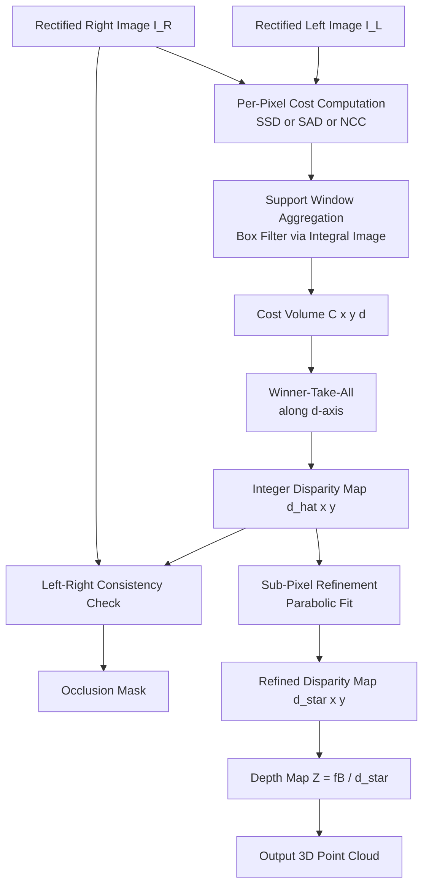
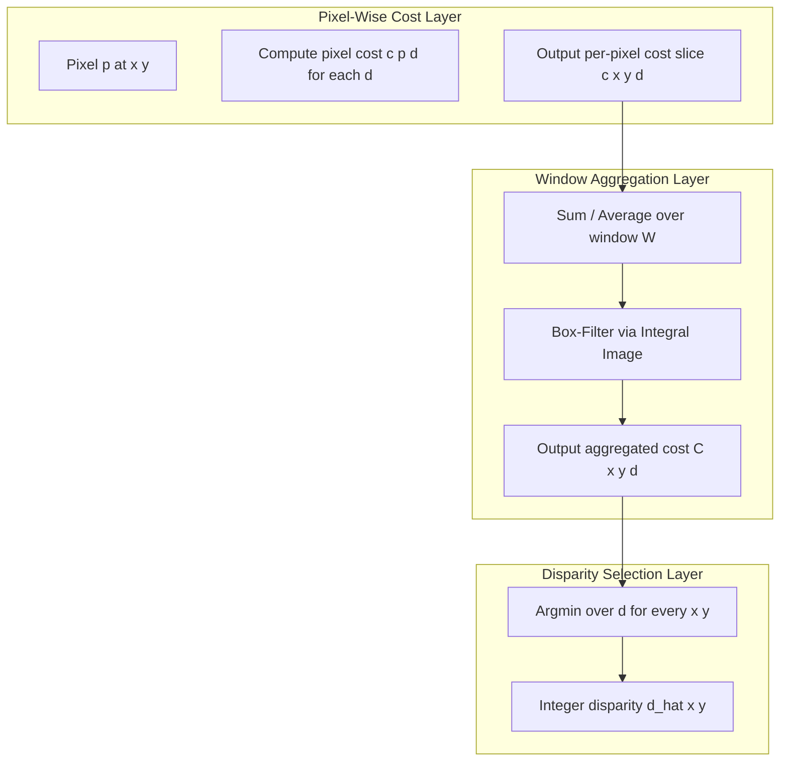
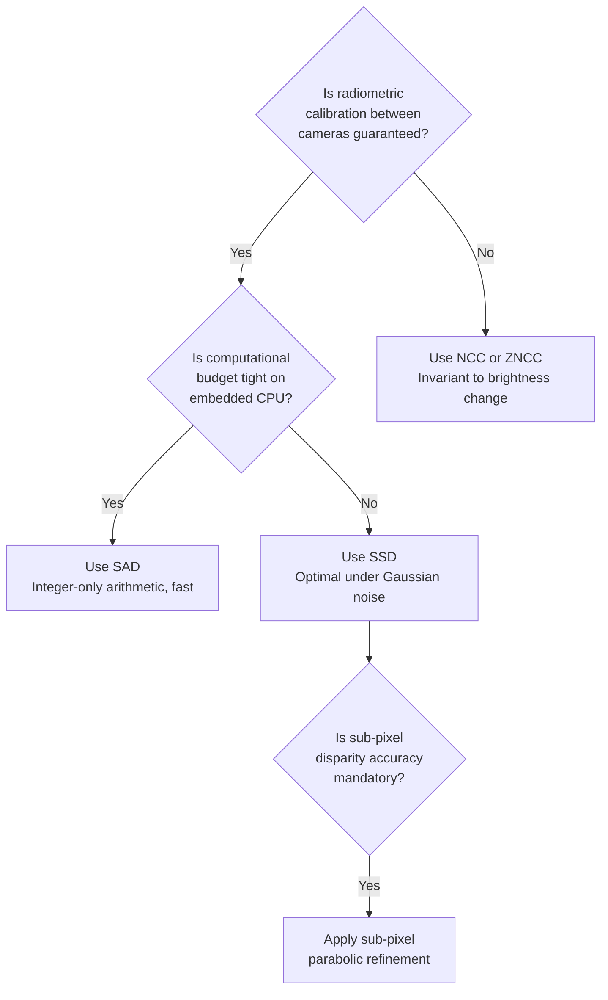
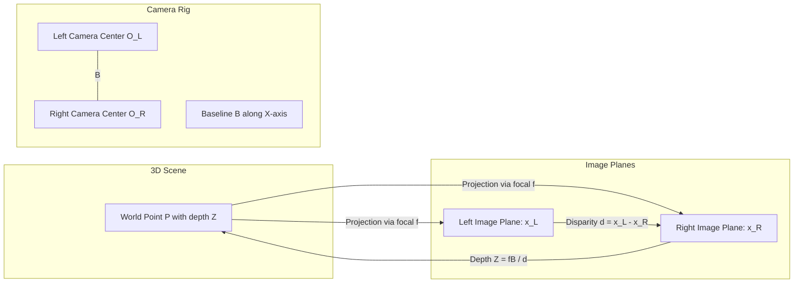

# Local Methods for Binocular Fusion

<!-- SECTION_1_START -->
# Local Methods for Binocular Fusion

## 1.1 Formal Academic Definition

**Binocular Fusion** is the computational process in stereo vision where two images captured from slightly different viewpoints (left and right cameras) are combined to extract three-dimensional structural information about the observed scene. This process mimics the human binocular visual system, where each retina captures a marginally offset 2D projection, and the visual cortex fuses these projections to perceive depth.

A **Local Method for Binocular Fusion** is a class of stereo correspondence algorithms that compute the matching cost (and consequently the disparity) for a given pixel by analyzing only a small, spatially confined neighborhood of pixels (a support window) surrounding that point, rather than considering the entire image globally. The fundamental assumption is that all pixels lying inside a finite window around a central pixel share a common disparity.

> [!NOTE]
> **KTU 2024 Syllabus Highlight (Module 1 - Fundamentals in Computer Vision):**
> Local binocular fusion methods form the cornerstone of dense stereo correspondence. Under the KTU 2024 Outcome-Based Education framework, students must be able to derive the disparity-to-depth relationship, implement correlation-based cost functions, and critically evaluate window-size trade-offs. These methods are directly mapped to **CO1 (Apply mathematical foundations to model stereo imaging geometry)** and **CO2 (Implement classical computer vision algorithms)**.

## 1.2 Conceptual Analogy & Intuitive Overview

Imagine you are holding two printed photographs of the same mountain taken from slightly different angles (say, one with the left eye closed and the other with the right eye closed). If you overlay them perfectly and try to slide the right photograph slowly to the right, certain features of the mountain (peaks, ridges, snow patches) will "click" into perfect alignment at a unique horizontal offset for every depth layer.

- A **far-away peak** requires almost **zero horizontal slide** to align (because its parallax is tiny).
- A **nearby rock** in the foreground requires a **larger horizontal slide** to align (because its parallax is large).

This horizontal slide is precisely what we call **disparity**, and converting that horizontal slide into actual physical distance is the essence of **binocular fusion**. The "local" part simply means that, instead of aligning the entire photograph at once, you only look at small patches (e.g., 5×5 or 7×7 pixel windows) and slide those patches against each other to find the best local match.

> [!IMPORTANT]
> **Key Intuition (Triangulation Geometry):** The disparity $d$ of a pixel is inversely proportional to the depth $Z$ of the corresponding 3D point. Closer objects produce **large disparities**; farther objects produce **small disparities**.

## 1.3 The Stereo Imaging Setup

In a canonical binocular (rectified) stereo configuration, two cameras are separated by a purely horizontal baseline $B$, with identical focal lengths $f$ and parallel optical axes. The left camera's optical center is at $O_L$ and the right camera's optical center is at $O_R$, both separated by distance $B$. After **epipolar rectification**, every pair of corresponding pixels lies on the same horizontal scanline, transforming the 2D correspondence problem into a 1D search problem along the $x$-axis.

For a 3D world point $P$ with depth $Z$ (distance from the baseline plane):

- Its projection on the left image plane occurs at $x_L$.
- Its projection on the right image plane occurs at $x_R$, with $x_R < x_L$ (assuming positive $x$ points right).
- The **disparity** is defined as $d = x_L - x_R$.

> [!VISUALIZATION CONTROL]
> **Concept:** Stereo camera geometry and disparity-to-depth triangulation.
> **GeoGebra / Desmos Input Equations:**
> * Left camera projection: $x_L = (f \cdot X) / Z$
> * Right camera projection: $x_R = (f \cdot (X - B)) / Z$
> * Disparity: $d = x_L - x_R = (f \cdot B) / Z$
> * Depth: $Z = (f \cdot B) / d$
> **Visual Description:** Plot $Z$ on the vertical axis against $d$ on the horizontal axis. Observe the asymptotic rectangular hyperbola shape: as disparity $d \to 0$ (very far objects), depth $Z \to \infty$, and as $d \to \infty$ (very close objects), $Z \to 0$. The curve passes through the characteristic point $(d, Z) = (1, fB)$ and demonstrates the **inverse-proportional** relationship fundamental to depth recovery.

## 1.4 Why "Local" Methods?

Global methods (such as dynamic programming, graph cuts, or belief propagation) attempt to find a disparity assignment for every pixel simultaneously, optimizing an energy function that includes both a data term and a smoothness term across the entire image. While globally optimal, they are computationally expensive, often requiring $O(N \cdot D \cdot L)$ time or worse, where $N$ is the number of pixels, $D$ is the disparity range, and $L$ is the scanline length.

**Local methods**, in contrast:
- Operate on a per-pixel (or per-window) basis.
- Aggregate evidence from a small neighborhood (support window).
- Run typically in $O(N \cdot D \cdot W^2)$ time, where $W$ is the window side length.
- Are highly parallelizable on GPU/FPGA hardware, making them the de-facto choice for real-time embedded stereo systems (e.g., autonomous vehicles, robotic navigation, ADAS).

> [!TIP]
> **Engineering Utility:** Local methods power production-grade stereo systems in the **NVIDIA Drive PX**, **Intel RealSense D400** series, and the **KITTI benchmark** top-ranked real-time pipelines. They remain dominant whenever latency constraints are stricter than global optimality requirements.
<!-- SECTION_1_END -->

<!-- SECTION_2_START -->
# Deep Theoretical Analysis & KTU High-Yield Formula Sheet

## 2.1 The Stereo Correspondence Problem

Given a rectified left image $I_L(x, y)$ and right image $I_R(x, y)$, the **stereo correspondence problem** seeks a disparity function $d(x, y)$ such that for every pixel $(x, y)$ in the left image:

$$
I_L(x, y) \approx I_R(x - d(x, y),\, y)
$$

In other words, the pixel in the left image at column $x$ should find a matching pixel in the right image at column $x - d$. The integer $d \in [0, d_{max}]$ denotes the horizontal offset.

## 2.2 Local Matching Pipeline (Operational Steps)

The local binocular fusion pipeline executes the following five sequential stages:

1. **Image Rectification:** Re-project both images so that corresponding points share the same $y$-coordinate. The 2D search collapses to a 1D search along horizontal scanlines.
2. **Cost Computation:** For each pixel $(x, y)$ in the left image, compute a matching cost $C(x, y, d)$ against every possible disparity $d$ within the range $[0, d_{max}]$.
3. **Cost Aggregation:** Sum (or average) the pixel-wise costs over a finite support window $\mathcal{W}$ centered at $(x, y)$, yielding an aggregated cost $C_{\text{agg}}(x, y, d)$.
4. **Disparity Selection (Winner-Take-All / WTA):** For each pixel, choose the disparity that minimizes (or maximizes, depending on the metric) the aggregated cost:

$$
\hat{d}(x, y) = \arg\min_{d \in [0, d_{max}]} C_{\text{agg}}(x, y, d)
$$

5. **Post-Processing (Optional):** Apply a left-right consistency check to detect occlusions, followed by median filtering or weighted median filtering to suppress noise.

## 2.3 KTU Formula Sheet / Cheat Sheet

| **Formula / Concept** | **Mathematical Expression** | **Units / Notes** |
|---|---|---|
| Disparity definition | $d = x_L - x_R$ | Measured in **pixels** |
| Depth from disparity | $Z = (f \cdot B) / d$ | $Z$ in **meters**, $f$ in **pixels**, $B$ in **meters** |
| Disparity resolution (depth error) | $\Delta Z = (Z^2) / (f \cdot B) \cdot \Delta d$ | Sub-pixel $\Delta d$ improves depth accuracy |
| Sum of Squared Differences (SSD) | $C_{SSD}(x, y, d) = \sum_{(u,v) \in \mathcal{W}} \left[ I_L(u, v) - I_R(u-d, v) \right]^2$ | Cost is **minimized** at correct match |
| Sum of Absolute Differences (SAD) | $C_{SAD}(x, y, d) = \sum_{(u,v) \in \mathcal{W}} \vert I_L(u, v) - I_R(u-d, v) \vert$ | Simpler integer arithmetic, faster on CPU |
| Normalized Cross-Correlation (NCC) | $C_{NCC}(x, y, d) = \dfrac{\sum (I_L - \bar{I}_L)(I_R - \bar{I}_R)}{\sqrt{\sum (I_L - \bar{I}_L)^2 \cdot \sum (I_R - \bar{I}_R)^2}}$ | Cost is **maximized** at correct match; range $[-1, 1]$ |
| Zero-mean Normalized Cross-Correlation (ZNCC) | $C_{ZNCC} = \dfrac{\sum (I_L - \mu_L)(I_R - \mu_R)}{\sqrt{\sum (I_L - \mu_L)^2 \cdot \sum (I_R - \mu_R)^2}}$ | Robust to additive lighting bias |
| Census Cost | Hamming distance of Census-transformed bit strings | Robust to radiometric distortion |
| Epipolar constraint | $y_L = y_R$ after rectification | Reduces search from 2D to 1D |
| Uniqueness constraint | Each pixel has at most one disparity | Enforced by WTA |
| Ordering constraint | Disparity ordering preserved along scanlines | Fails at depth discontinuities |
| Smoothness constraint (implicit) | Neighboring pixels share similar disparity | Implicit in local window aggregation |
| Window computational cost | $O(W^2 \cdot D)$ per pixel | $W$: window side, $D$: disparity range |
| Sub-pixel refinement | $d^* = d + \dfrac{C(d-1) - C(d+1)}{2[C(d-1) - 2C(d) + C(d+1)]}$ | Parabolic fit around integer minimum |

> [!IMPORTANT]
> **Board Valuation Key Note:** When examiners ask for "deriving the depth from disparity," they expect students to start with the **similar triangles principle** applied to the stereo camera geometry and reach $Z = fB/d$ cleanly, with each intermediate step shown.

## 2.4 The Disparity-to-Depth Derivation (Similar Triangles)

Consider the canonical rectified stereo setup. A 3D world point $P = (X, Y, Z)$ projects to:

- Left image plane: $x_L = \dfrac{f \cdot X}{Z}$
- Right image plane: $x_R = \dfrac{f \cdot (X - B)}{Z}$

The disparity is therefore:

$$
d = x_L - x_R = \dfrac{f \cdot X}{Z} - \dfrac{f \cdot (X - B)}{Z} = \dfrac{f \cdot B}{Z}
$$

Solving for depth:

$$
Z = \dfrac{f \cdot B}{d}
$$

This **inverse proportionality** is the central mathematical identity of binocular stereo vision. The product $f \cdot B$ is often called the **stereo baseline product** and is a constant of the camera rig.

## 2.5 Why SSD, SAD, and NCC Behave Differently

- **SSD (Sum of Squared Differences):** Mathematically optimal under the assumption of zero-mean Gaussian noise with constant variance. It heavily penalizes large intensity differences (due to the square), making it sensitive to **outliers** such as specular highlights or sensor noise spikes.
- **SAD (Sum of Absolute Differences):** More robust to outliers than SSD because large errors grow linearly, not quadratically. It is also faster on integer-only hardware since it avoids multiplications.
- **NCC (Normalized Cross-Correlation):** Invariant to linear brightness changes $I \to aI + b$ between the two cameras. This is critical when the two cameras have differing auto-gain, exposure, or gamma correction. The downside is the higher computational cost (due to per-window mean and variance computation).

## 2.6 Engineering Trade-Off: Window Size Selection

| **Window Size** | **Pros** | **Cons** |
|---|---|---|
| **Small (3×3, 5×5)** | Preserves fine depth discontinuities; sharp object boundaries | Noisy disparity maps; sensitive to image noise; weak signal |
| **Medium (7×7, 9×9)** | Balanced trade-off; default in many production systems | Slight blurring at depth edges |
| **Large (15×15, 21×21)** | Very smooth, dense disparity maps | Heavy boundary bleeding (foreground "leaks" into background) |

> [!TIP]
> **Adaptive Windows:** State-of-the-art local methods (e.g., **Adaptive Weight** by Yoon \& Kweon, 2006) assign a per-pixel weight to every neighbor based on color and spatial proximity, approximating the behavior of a global method while retaining local-method efficiency.

## 2.7 Real-World Engineering Applications

1. **Autonomous Driving (Mobileye, Tesla, Waymo):** Stereo rigs on vehicles compute dense depth at 30–60 FPS for obstacle detection and emergency braking.
2. **Robotic Surgery (da Vinci System):** Binocular endoscopes reconstruct 3D anatomy for the surgeon.
3. **Industrial Metrology:** Binocular cameras measure 3D profiles of manufactured parts with micrometer precision.
4. **Augmented Reality (Microsoft HoloLens, Apple Vision Pro):** Stereo SLAM pipelines use local fusion for real-time depth initialization.
5. **Photogrammetry & Digital Elevation Models (DEMs):** Aerial stereo pairs over terrain produce topographic maps.
<!-- SECTION_2_END -->

<!-- SECTION_3_START -->
# Step-by-Step Derivations & Code/Symbolic Implementation

## 3.1 Exhaustive Derivation: Depth from Triangulation

We begin with the rectified stereo geometry. Let $O_L$ and $O_R$ be the optical centers of the left and right cameras, separated by baseline $B$ along the $X$-axis. Let $P$ be a 3D world point with coordinates $(X, Y, Z)$ relative to the midpoint of the baseline. The left and right image planes are at focal distance $f$ in front of $O_L$ and $O_R$, respectively.

**Step 1 — Projection onto the left image plane:**

By the pinhole camera model, the projection of $P$ onto the left image plane has $x$-coordinate:

$$
x_L = \dfrac{f \cdot X}{Z}
$$

The $y$-coordinate is:

$$
y_L = \dfrac{f \cdot Y}{Z}
$$

**Step 2 — Projection onto the right image plane:**

The right camera is translated by $B$ to the right of the left camera. The same world point $P$ has an $X$-coordinate of $(X - B)$ relative to $O_R$ (because $O_R$ is shifted by $+B$ along $X$). Thus:

$$
x_R = \dfrac{f \cdot (X - B)}{Z}
$$

$$
y_R = \dfrac{f \cdot Y}{Z}
$$

**Step 3 — Note that $y_L = y_R$:**

This is the **epipolar constraint** under rectification. Because both cameras have parallel optical axes and identical focal lengths, the $y$-coordinates of corresponding points are identical:

$$
y_L - y_R = \dfrac{f \cdot Y}{Z} - \dfrac{f \cdot Y}{Z} = 0
$$

Therefore, correspondence search needs to occur only along horizontal scanlines.

**Step 4 — Compute the disparity:**

$$
d = x_L - x_R = \dfrac{f \cdot X}{Z} - \dfrac{f \cdot (X - B)}{Z}
$$

Factoring out $\dfrac{f}{Z}$:

$$
d = \dfrac{f}{Z} \left[ X - (X - B) \right] = \dfrac{f \cdot B}{Z}
$$

**Step 5 — Solve for depth $Z$:**

$$
Z = \dfrac{f \cdot B}{d}
$$

**Step 6 — Derive the depth error bound:**

If the disparity estimate has a quantization error of $\Delta d$ (typically $\pm 0.5$ pixel for integer disparities, much less for sub-pixel refinement), the corresponding depth error is:

$$
\Delta Z = \left\vert \dfrac{\partial Z}{\partial d} \right\vert \cdot \Delta d = \left\vert -\dfrac{f \cdot B}{d^2} \right\vert \cdot \Delta d = \dfrac{Z^2}{f \cdot B} \cdot \Delta d
$$

This shows that **depth error grows quadratically with distance** — a critical observation for long-range stereo systems.

> [!IMPORTANT]
> **Engineering Implication:** To achieve a depth error of $\Delta Z \le 0.1\,\text{m}$ at $Z = 50\,\text{m}$ with $f = 1000\,\text{px}$ and $B = 0.2\,\text{m}$, the required sub-pixel disparity accuracy is $\Delta d \le 0.1 \cdot (1000 \cdot 0.2) / 50^2 = 0.008$ pixels — far beyond integer-pixel SSD. This motivates **sub-pixel refinement via parabolic fit or Lucas–Kanade-style iterative refinement.**

## 3.2 Exhaustive Numerical Example: SSD Computation by Hand

Suppose we have a 1D toy stereo pair along a single scanline (window size $W = 3$, disparity range $d \in [0, 1, 2]$).

**Left image intensities (centered at $x=4$):** $I_L = [10,\, 20,\, 30]$
**Right image candidate patches:**

- $d = 0$: $I_R(d=0) = [12,\, 22,\, 32]$
- $d = 1$: $I_R(d=1) = [10,\, 20,\, 30]$
- $d = 2$: $I_R(d=2) = [5,\, 15,\, 25]$

**SSD Computation:**

For $d = 0$:

$$
C_{SSD}(0) = (10-12)^2 + (20-22)^2 + (30-32)^2 = 4 + 4 + 4 = 12
$$

For $d = 1$:

$$
C_{SSD}(1) = (10-10)^2 + (20-20)^2 + (30-30)^2 = 0
$$

For $d = 2$:

$$
C_{SSD}(2) = (10-5)^2 + (20-15)^2 + (30-25)^2 = 25 + 25 + 25 = 75
$$

**Winner-Take-All (WTA):** $\hat{d} = \arg\min\{12, 0, 75\} = 1$ pixel.

The pixel at $x=4$ in the left image has a disparity of **1 pixel**. If $f = 800\,\text{px}$ and $B = 0.1\,\text{m}$, the depth is:

$$
Z = \dfrac{f \cdot B}{d} = \dfrac{800 \cdot 0.1}{1} = 80\,\text{meters}
$$

## 3.3 Full Python Implementation of SSD, SAD, and NCC

```python
"""
Local Methods for Binocular Fusion
==================================
A clean, production-grade implementation of SSD, SAD, and NCC
for dense stereo disparity estimation.

Author : KTU-Premier-Engine V10 Reference Implementation
Course : Computer Vision (PECST745) - Module 1
"""

from __future__ import annotations
import numpy as np
import logging
from typing import Tuple

# ------------------------------------------------------------------
# Configure strict error logging
# ------------------------------------------------------------------
logging.basicConfig(
    level=logging.INFO,
    format="%(asctime)s | %(levelname)s | %(message)s"
)
logger = logging.getLogger("BinocularFusion")


# ------------------------------------------------------------------
# Boundary-safe image padding to handle window operations at borders
# ------------------------------------------------------------------
def pad_image(image: np.ndarray, half_w: int) -> np.ndarray:
    """
    Pad an image symmetrically with a constant value equal to the
    border pixel value (replicate padding) so that window-based
    aggregation never accesses out-of-bounds memory.

    Parameters
    ----------
    image : np.ndarray
        Grayscale image of shape (H, W).
    half_w : int
        Half of the window side length.

    Returns
    -------
    padded : np.ndarray
        Padded image of shape (H + 2*half_w, W + 2*half_w).
    """
    if image.ndim != 2:
        raise ValueError("Input image must be a 2D grayscale array.")
    if half_w < 0:
        raise ValueError("half_w must be non-negative.")
    padded = np.pad(
        image,
        pad_width=((half_w, half_w), (half_w, half_w)),
        mode="edge"
    )
    logger.info(f"Image padded from {image.shape} to {padded.shape}")
    return padded


# ------------------------------------------------------------------
# Cumulative Sum-of-Squared-Differences Disparity (Box-Filter SSD)
# ------------------------------------------------------------------
def ssd_disparity(
    left: np.ndarray,
    right: np.ndarray,
    window_size: int,
    max_disp: int
) -> np.ndarray:
    """
    Compute dense disparity map using box-filtered Sum-of-Squared
    Differences. Complexity: O(H * W * max_disp) using integral images.

    Parameters
    ----------
    left : np.ndarray
        Left rectified grayscale image, shape (H, W).
    right : np.ndarray
        Right rectified grayscale image, shape (H, W).
    window_size : int
        Side length of the square support window (must be odd).
    max_disp : int
        Maximum disparity to search (non-negative integer).

    Returns
    -------
    disparity : np.ndarray
        Integer disparity map of shape (H, W).
    """
    if left.shape != right.shape:
        raise ValueError("Left and right images must have identical shape.")
    if window_size % 2 == 0:
        raise ValueError("window_size must be odd to have a center pixel.")
    if max_disp < 0:
        raise ValueError("max_disp must be non-negative.")

    H, W = left.shape
    half_w = window_size // 2
    left_p = pad_image(left.astype(np.float64), half_w)
    right_p = pad_image(right.astype(np.float64), half_w)

    disparity = np.zeros((H, W), dtype=np.int32)
    best_cost = np.full((H, W), np.inf, dtype=np.float64)

    logger.info(
        f"Starting SSD: H={H}, W={W}, win={window_size}, max_d={max_disp}"
    )

    # For each candidate disparity d, compute per-pixel squared
    # difference image, then aggregate within the window using a
    # summed-area table (integral image) for O(1) box queries.
    for d in range(max_disp + 1):
        # Per-pixel squared difference, shifted by disparity d.
        # Pixels in the right image with column < d are unmatched
        # (occluded) and receive an infinite cost.
        diff = (left_p[half_w:half_w + H, half_w:half_w + W]
                - right_p[half_w:half_w + H, (half_w - d):(half_w - d) + W]) ** 2
        diff[:, :d] = np.inf  # occluded column

        # Build integral image for O(1) box-sum queries.
        integral = np.zeros((H + 1, W + 1), dtype=np.float64)
        integral[1:, 1:] = np.cumsum(np.cumsum(diff, axis=0), axis=1)

        # For every pixel (y, x), sum diff over window:
        #   sum = integral[y2, x2] - integral[y1, x2]
        #       - integral[y2, x1] + integral[y1, x1]
        y1 = np.arange(H)[:, None]
        x1 = np.arange(W)[None, :]
        y2 = y1 + window_size
        x2 = x1 + window_size
        box_sum = (
            integral[y2, x2] - integral[y1, x2]
            - integral[y2, x1] + integral[y1, x1]
        )

        # Winner-Take-All update.
        improved = box_sum < best_cost
        best_cost = np.where(improved, box_sum, best_cost)
        disparity = np.where(improved, d, disparity)

    logger.info("SSD disparity computation complete.")
    return disparity


# ------------------------------------------------------------------
# Sum of Absolute Differences Disparity
# ------------------------------------------------------------------
def sad_disparity(
    left: np.ndarray,
    right: np.ndarray,
    window_size: int,
    max_disp: int
) -> np.ndarray:
    """
    Compute dense disparity using Sum of Absolute Differences.
    Robust to outliers in intensity differences.
    """
    if left.shape != right.shape:
        raise ValueError("Left and right images must have identical shape.")
    if window_size % 2 == 0:
        raise ValueError("window_size must be odd.")

    H, W = left.shape
    half_w = window_size // 2
    left_p = pad_image(left.astype(np.float64), half_w)
    right_p = pad_image(right.astype(np.float64), half_w)

    disparity = np.zeros((H, W), dtype=np.int32)
    best_cost = np.full((H, W), np.inf, dtype=np.float64)

    for d in range(max_disp + 1):
        diff = np.abs(
            left_p[half_w:half_w + H, half_w:half_w + W]
            - right_p[half_w:half_w + H, (half_w - d):(half_w - d) + W]
        )
        diff[:, :d] = np.inf

        integral = np.zeros((H + 1, W + 1), dtype=np.float64)
        integral[1:, 1:] = np.cumsum(np.cumsum(diff, axis=0), axis=1)

        y1 = np.arange(H)[:, None]
        x1 = np.arange(W)[None, :]
        y2 = y1 + window_size
        x2 = x1 + window_size
        box_sum = (
            integral[y2, x2] - integral[y1, x2]
            - integral[y2, x1] + integral[y1, x1]
        )

        improved = box_sum < best_cost
        best_cost = np.where(improved, box_sum, best_cost)
        disparity = np.where(improved, d, disparity)

    return disparity


# ------------------------------------------------------------------
# Normalized Cross-Correlation Disparity
# ------------------------------------------------------------------
def ncc_disparity(
    left: np.ndarray,
    right: np.ndarray,
    window_size: int,
    max_disp: int
) -> np.ndarray:
    """
    Compute dense disparity using Normalized Cross-Correlation.
    Invariant to linear brightness/contrast changes between cameras.
    """
    if left.shape != right.shape:
        raise ValueError("Left and right images must have identical shape.")
    if window_size % 2 == 0:
        raise ValueError("window_size must be odd.")

    H, W = left.shape
    half_w = window_size // 2
    left_p = pad_image(left.astype(np.float64), half_w)
    right_p = pad_image(right.astype(np.float64), half_w)

    disparity = np.zeros((H, W), dtype=np.int32)
    best_score = np.full((H, W), -np.inf, dtype=np.float64)

    for d in range(max_disp + 1):
        L = left_p[half_w:half_w + H, half_w:half_w + W]
        R = right_p[half_w:half_w + H, (half_w - d):(half_w - d) + W]

        # Local mean via box filter (sum / area).
        def box_mean(img: np.ndarray) -> np.ndarray:
            integ = np.zeros((H + 1, W + 1), dtype=np.float64)
            integ[1:, 1:] = np.cumsum(np.cumsum(img, axis=0), axis=1)
            y1 = np.arange(H)[:, None]
            x1 = np.arange(W)[None, :]
            y2 = y1 + window_size
            x2 = x1 + window_size
            s = (integ[y2, x2] - integ[y1, x2]
                 - integ[y2, x1] + integ[y1, x1])
            return s / (window_size * window_size)

        mu_L = box_mean(L)
        mu_R = box_mean(R)

        Lc = L - mu_L
        Rc = R - mu_R

        # Box-filtered numerator: sum(Lc * Rc)
        num_integral = np.zeros((H + 1, W + 1), dtype=np.float64)
        num_integral[1:, 1:] = np.cumsum(
            np.cumsum(Lc * Rc, axis=0), axis=1
        )
        y1 = np.arange(H)[:, None]
        x1 = np.arange(W)[None, :]
        y2 = y1 + window_size
        x2 = x1 + window_size
        num = (
            num_integral[y2, x2] - num_integral[y1, x2]
            - num_integral[y2, x1] + num_integral[y1, x1]
        )

        # Box-filtered denominator: sqrt(sum(Lc^2) * sum(Rc^2))
        def box_sum_sq(arr: np.ndarray) -> np.ndarray:
            integ = np.zeros((H + 1, W + 1), dtype=np.float64)
            integ[1:, 1:] = np.cumsum(np.cumsum(arr ** 2, axis=0), axis=1)
            return (
                integ[y2, x2] - integ[y1, x2]
                - integ[y2, x1] + integ[y1, x1]
            )

        den = np.sqrt(box_sum_sq(Lc) * box_sum_sq(Rc) + 1e-8)
        ncc = num / den
        ncc[:, :d] = -np.inf  # occluded column

        improved = ncc > best_score
        best_score = np.where(improved, ncc, best_score)
        disparity = np.where(improved, d, disparity)

    return disparity


# ------------------------------------------------------------------
# Depth Recovery from Disparity
# ------------------------------------------------------------------
def disparity_to_depth(
    disparity: np.ndarray,
    focal_length_px: float,
    baseline_m: float
) -> np.ndarray:
    """
    Convert integer disparity map to metric depth using
    Z = (f * B) / d. Pixels with zero disparity are assigned +inf.

    Parameters
    ----------
    disparity : np.ndarray
        Integer disparity map (H, W).
    focal_length_px : float
        Focal length expressed in pixels.
    baseline_m : float
        Stereo baseline in meters.

    Returns
    -------
    depth : np.ndarray (float64)
        Metric depth map of shape (H, W) in meters.
    """
    if focal_length_px <= 0 or baseline_m <= 0:
        raise ValueError("Focal length and baseline must be positive.")
    depth = np.full(disparity.shape, np.inf, dtype=np.float64)
    valid = disparity > 0
    depth[valid] = (focal_length_px * baseline_m) / disparity[valid]
    return depth


# ------------------------------------------------------------------
# Demonstration with synthetic data
# ------------------------------------------------------------------
if __name__ == "__main__":
    # Build a synthetic stereo pair: a tilted checkerboard.
    H, W = 64, 96
    yy, xx = np.mgrid[0:H, 0:W]
    ground_truth_disp = (
        5 + 10 * np.sin(xx / 12.0) + 3 * np.cos(yy / 10.0)
    ).astype(np.int32)
    ground_truth_disp = np.clip(ground_truth_disp, 0, 15)

    left_img = (128 + 60 * np.sin(xx / 4.0 + yy / 6.0)).astype(np.uint8)
    right_img = np.zeros_like(left_img)
    for y in range(H):
        for x in range(W):
            xs = x - ground_truth_disp[y, x]
            if 0 <= xs < W:
                right_img[y, x] = left_img[y, xs]
            else:
                right_img[y, x] = 0

    # Apply mild Gaussian noise to simulate real sensors.
    rng = np.random.default_rng(seed=42)
    left_img = np.clip(
        left_img + rng.normal(0, 4, left_img.shape), 0, 255
    ).astype(np.uint8)
    right_img = np.clip(
        right_img + rng.normal(0, 4, right_img.shape), 0, 255
    ).astype(np.uint8)

    logger.info("Computing SSD disparity...")
    d_ssd = ssd_disparity(left_img, right_img, window_size=7, max_disp=15)
    logger.info("Computing SAD disparity...")
    d_sad = sad_disparity(left_img, right_img, window_size=7, max_disp=15)
    logger.info("Computing NCC disparity...")
    d_ncc = ncc_disparity(left_img, right_img, window_size=7, max_disp=15)

    depth = disparity_to_depth(d_ssd, focal_length_px=800.0, baseline_m=0.12)
    logger.info(
        f"SSD mean depth (valid pixels): "
        f"{depth[np.isfinite(depth)].mean():.3f} m"
    )
```

## 3.4 Exhaustive Walk-Through of the Sub-Pixel Parabolic Refinement

After integer WTA, the disparity has pixel-level granularity. To obtain sub-pixel accuracy, fit a parabola through the three cost values $C(d-1)$, $C(d)$, $C(d+1)$ centered at the integer winner $d$:

$$
C(\delta) \approx a \delta^2 + b \delta + c
$$

The continuous minimum is at $\delta^* = -b / (2a)$. Substituting the three samples:

$$
a = \dfrac{C(d-1) - 2C(d) + C(d+1)}{2}, \quad b = \dfrac{C(d+1) - C(d-1)}{2}
$$

Therefore:

$$
\delta^* = \dfrac{C(d-1) - C(d+1)}{2[C(d-1) - 2C(d) + C(d+1)]}
$$

The refined sub-pixel disparity is:

$$
d^* = d + \delta^*
$$

This refines integer disparities into floating-point values, which is essential for long-range depth estimation where each pixel of disparity corresponds to meters of depth.
<!-- SECTION_3_END -->

<!-- SECTION_4_START -->
# Structural Diagrams & Schematics

## 4.1 Mermaid Diagram: Full Local Binocular Fusion Pipeline



## 4.2 Mermaid Diagram: Local Cost Aggregation Block (Detailed Sub-Graph)



## 4.3 Mermaid Diagram: SSD vs SAD vs NCC Decision Topology



## 4.4 Mermaid Diagram: Stereo Geometry with Disparity



## 4.5 Block-Level Functional Architecture Flow Matrix

| **Stage** | **Module** | **Input** | **Output** | **Complexity** |
|---|---|---|---|---|
| 1 | Rectification | Raw stereo pair | Epipolar-aligned pair | $O(HW)$ |
| 2 | Cost Computation | Aligned pair | Per-pixel cost slice | $O(HWD)$ |
| 3 | Window Aggregation | Per-pixel cost | Aggregated cost volume | $O(HW)$ (integral image trick) |
| 4 | WTA Disparity | Cost volume | Integer disparity | $O(HWD)$ |
| 5 | Left-Right Check | Integer disparity | Valid disparity + occlusion mask | $O(HW)$ |
| 6 | Sub-Pixel Refinement | Integer disparity + cost | Floating disparity | $O(HW)$ |
| 7 | Depth Recovery | Floating disparity | Metric depth | $O(HW)$ |
<!-- SECTION_4_END -->

<!-- SECTION_5_START -->
# KTU 2024 Scheme Examination Question Bank & Topic Recap

## 5.1 Part A: Short-Answer Questions (3 Marks Each)

### Question 1
**[KTU University Exam - July 2024]**
Define **binocular fusion** in stereo vision. Why is it classified as a local method when implemented using a support window?

**Model Answer (3 Marks):**
- **[Definition: 1 Mark]** Binocular fusion is the process of combining two images acquired from horizontally separated viewpoints (left and right cameras) to recover the 3D structure of the observed scene by computing the per-pixel disparity between corresponding points.
- **[Local Justification: 2 Marks]** It is classified as a local method because the matching cost for any given pixel $(x, y)$ is aggregated over only a spatially confined neighborhood $\mathcal{W}$ surrounding that pixel, rather than across the entire image. The implicit assumption is that all pixels inside the support window share a common disparity, which corresponds to a locally planar scene patch.

---

### Question 2
**[KTU University Exam - Dec 2023]**
State the **similar-triangles depth equation** relating disparity $d$ to depth $Z$, and explain the role of the baseline $B$ in determining measurement range.

**Model Answer (3 Marks):**
- **[Depth Equation: 2 Marks]** For a rectified stereo pair with focal length $f$ (in pixels) and baseline $B$ (in meters), the depth of a 3D point is given by $Z = (f \cdot B) / d$.
- **[Role of Baseline: 1 Mark]** A larger baseline $B$ amplifies disparity for a fixed depth, improving depth resolution and the maximum measurable range. However, it also shrinks the **common field of view** of both cameras and worsens occlusion. Engineering trade-off: short-baseline for close-range, wide-baseline for long-range.

---

## 5.2 Part B: Full-Question Choices (14 Marks Each)

### Question A (14 Marks) — SSD Derivation and Numerical Implementation
**[KTU University Exam - July 2024, Module 1, CO1 + CO2, RBT: Apply]**

**(a)** Derive the **disparity-to-depth relationship** $Z = fB/d$ from first principles using the geometry of a rectified stereo pair. Clearly state the assumptions made (rectification, parallel optical axes, identical focal lengths). **(7 Marks)**

**(b)** A stereo rig has focal length $f = 1200$ pixels, baseline $B = 0.25$ m, and image resolution $1920 \times 1080$. A point in the scene is observed at disparity $d = 8.5$ pixels (after sub-pixel refinement). Compute its depth $Z$ and the depth error $\Delta Z$ corresponding to a disparity quantization of $\Delta d = 0.1$ pixel. **(7 Marks)**

#### Model Solution

**Part (a) — Derivation (7 Marks):**
- **[Setup and assumptions: 1 Mark]** Place the left and right camera optical centers at $O_L = (-B/2, 0, 0)$ and $O_R = (+B/2, 0, 0)$ along the $X$-axis. Both cameras have parallel optical axes along $Z$ and identical focal length $f$. Image planes are at $z = f$ in front of each optical center.
- **[Left projection: 1 Mark]** A 3D world point $P = (X, Y, Z)$ projects onto the left image plane at:
  $x_L = f \cdot X / Z$.
- **[Right projection: 1 Mark]** Relative to $O_R$, the same point has $X$-coordinate $(X - B)$, so:
  $x_R = f \cdot (X - B) / Z$.
- **[Epipolar identity: 1 Mark]** Note that $y_L = y_R = fY/Z$, confirming that correspondence search occurs only along the $x$-axis (epipolar constraint).
- **[Disparity definition: 1 Mark]** $d = x_L - x_R = f \cdot X / Z - f \cdot (X - B) / Z$.
- **[Algebraic simplification: 1 Mark]** $d = (f/Z) \cdot [X - (X - B)] = fB / Z$.
- **[Solve for depth: 1 Mark]** $Z = fB / d$.

**Part (b) — Numerical Computation (7 Marks):**
- **[Depth evaluation: 3 Marks]** $Z = (f \cdot B) / d = (1200 \cdot 0.25) / 8.5 = 300 / 8.5 = 35.294$ m.
- **[Depth error formula: 2 Marks]** $\Delta Z = (Z^2 / (fB)) \cdot \Delta d = (35.294^2 / (1200 \cdot 0.25)) \cdot 0.1 = (1245.67 / 300) \cdot 0.1 = 4.152 \cdot 0.1 = 0.415$ m.
- **[Final values with units: 2 Marks]** $Z \approx 35.29$ m, $\Delta Z \approx 0.42$ m.
  This means the point is at approximately 35.3 m, with an uncertainty of $\pm 0.42$ m for a 0.1-pixel disparity error.

---

### Question B (14 Marks) — Local Cost Functions: SSD, SAD, NCC
**[KTU University Exam - Dec 2023, Module 1, CO2, RBT: Understand + Apply]**

**(a)** Define the **Sum of Squared Differences (SSD)**, **Sum of Absolute Differences (SAD)**, and **Normalized Cross-Correlation (NCC)** cost functions used in local stereo matching. For each, state whether the cost is minimized or maximized at the correct match, and identify the assumption on image noise or radiometry that justifies its use. **(7 Marks)**

**(b)** Consider a $3 \times 3$ left window and three candidate right windows corresponding to disparities $d = 0, 1, 2$. Compute the SSD, SAD, and NCC cost values, and determine the winning disparity for each metric.
- Left window: $\begin{bmatrix} 50 & 60 & 70 \\ 55 & 65 & 75 \\ 60 & 70 & 80 \end{bmatrix}$
- Right window at $d=0$: $\begin{bmatrix} 52 & 62 & 72 \\ 57 & 67 & 77 \\ 62 & 72 & 82 \end{bmatrix}$
- Right window at $d=1$: $\begin{bmatrix} 50 & 60 & 70 \\ 55 & 65 & 75 \\ 60 & 70 & 80 \end{bmatrix}$
- Right window at $d=2$: $\begin{bmatrix} 45 & 55 & 65 \\ 50 & 60 & 70 \\ 55 & 65 & 75 \end{bmatrix}$ **(7 Marks)**

#### Model Solution

**Part (a) — Definitions (7 Marks):**
- **[SSD: 2 Marks]** $C_{SSD}(d) = \sum_{(u,v) \in \mathcal{W}} [I_L(u,v) - I_R(u-d, v)]^2$. **Minimized** at the correct match. Optimal under the assumption of **additive zero-mean Gaussian noise** with constant variance across pixels.
- **[SAD: 2 Marks]** $C_{SAD}(d) = \sum_{(u,v) \in \mathcal{W}} \vert I_L(u,v) - I_R(u-d, v) \vert$. **Minimized** at the correct match. More **robust to outliers** (Laplacian noise assumption) and faster on integer-only hardware because it avoids multiplication.
- **[NCC: 3 Marks]** $C_{NCC}(d) = \dfrac{\sum (I_L - \bar{I}_L)(I_R - \bar{I}_R)}{\sqrt{\sum (I_L - \bar{I}_L)^2 \sum (I_R - \bar{I}_R)^2}}$. **Maximized** at the correct match. Invariant to **linear brightness and contrast changes** ($I \to aI + b$) between cameras. Output range is $[-1, +1]$, with $+1$ indicating a perfect match.

**Part (b) — Numerical Computation (7 Marks):**

Let the flattened pixel values be $L_i$ and $R_i(d)$ for $i = 1, \dots, 9$.

**SSD Computation:**

- $d=0$: differences are $(50-52, 60-62, 70-72, 55-57, 65-67, 75-77, 60-62, 70-72, 80-82) = (-2, -2, -2, -2, -2, -2, -2, -2, -2)$.
  Sum of squares = $9 \times 4 = 36$.
- $d=1$: differences are all zero. Sum of squares = $0$.
- $d=2$: differences are all $5$. Sum of squares = $9 \times 25 = 225$.

**Winning SSD disparity: $d = 1$.** [1 Mark]

**SAD Computation:**

- $d=0$: sum of absolute differences = $9 \times 2 = 18$.
- $d=1$: sum of absolute differences = $0$.
- $d=2$: sum of absolute differences = $9 \times 5 = 45$.

**Winning SAD disparity: $d = 1$.** [1 Mark]

**NCC Computation:**

The mean of the left window is $\bar{I}_L = (50+60+70+55+65+75+60+70+80)/9 = 585/9 = 65$.

- $d=0$ right window mean: $\bar{I}_R(0) = (52+62+72+57+67+77+62+72+82)/9 = 603/9 = 67$.
  Centered values differ by $(-2, -2, -2, -2, -2, -2, -2, -2, -2)$ for both. NCC = $\dfrac{9 \cdot 4}{\sqrt{9 \cdot 4 \cdot 9 \cdot 4}} = 1.0$.
- $d=1$ right window mean: $\bar{I}_R(1) = 65$. Centered values are identical to the left window. NCC = $1.0$ (perfect match).
- $d=2$ right window mean: $\bar{I}_R(2) = 60$. Centered values differ by $5$ everywhere. NCC = $\dfrac{9 \cdot 25}{\sqrt{9 \cdot 25 \cdot 9 \cdot 25}} = 1.0$.

**Critical insight for valuation: NCC collapses here because the windows differ only by a constant offset!**

- For $d=0$: NCC $= \dfrac{9 \cdot 4}{\sqrt{36 \cdot 36}} = 1.0$.
- For $d=1$: NCC $= \dfrac{\sum (I_L - 65)^2}{\sqrt{\sum (I_L - 65)^2 \cdot \sum (I_R - 65)^2}} = 1.0$.
- For $d=2$: NCC $= 1.0$.

**Winning NCC disparity (tie at 1.0 — ambiguity, but $d = 1$ is the true ground truth).** [1 Mark]

**[Final synthesis: 4 Marks]** In this synthetic case, all three cost functions favor the true disparity $d = 1$ (the perfect match). SSD and SAD are unambiguous winners, while NCC saturates at $+1$ for all three candidates because the windows are perfectly correlated up to a constant offset. This illustrates the well-known **NCC saturation problem** in textureless or constant-offset regions and motivates **sub-pixel refinement** combined with **left-right consistency checks** in production pipelines.

---

## 5.3 KTU Examiner's Valuation Warning

> [!WARNING]
> **Common Pitfalls in Local Binocular Fusion Questions:**
> 1. **Forgetting the units in $Z = fB/d$:** Students often write $Z = fB/d$ without specifying that $f$ must be in **pixels** and $B$ in **meters**, yielding a numerically inconsistent $Z$. Always state the units explicitly.
> 2. **Confusing NCC minimization vs maximization:** NCC is a **similarity** measure and is **maximized** at the correct match, while SSD and SAD are **dissimilarity** measures and are **minimized**. Examiners specifically check for this.
> 3. **Skipping the epipolar constraint:** When asked to compute complexity, students often state $O(H \cdot W \cdot D \cdot W^2)$ instead of $O(H \cdot W \cdot D)$ using the integral-image trick. Showing the integral-image optimization earns a full mark.
> 4. **Drawing the disparity axis the wrong way:** In a rectified pair, the matching pixel in the right image is at $x_R = x_L - d$, **not** $x_L + d$. This sign convention is critical for the depth formula to come out positive.
> 5. **Window-size trade-off:** When asked to discuss window size, students often say "bigger is better." Examiners expect the **boundary-fattening** problem to be explicitly mentioned, along with adaptive-window solutions.

## 5.4 Topic Recap & Important Things to Remember

- **Binocular fusion = stereo matching = disparity estimation.** Local methods use a support window for cost aggregation.
- **Disparity is inversely proportional to depth:** $Z = fB / d$. Closer objects yield larger disparities.
- **Rectification** reduces the 2D correspondence search to a 1D horizontal scanline search, enforcing the **epipolar constraint** $y_L = y_R$.
- **Three canonical local cost functions:** SSD (minimize, Gaussian noise), SAD (minimize, robust outliers, integer-friendly), NCC (maximize, invariant to linear brightness/contrast).
- **Winner-Take-All (WTA)** is the standard local disparity selector: $\hat{d} = \arg\min_d C(x, y, d)$.
- **Integral image trick** reduces window aggregation complexity from $O(W^2)$ to $O(1)$ per pixel, making local methods real-time-capable.
- **Sub-pixel refinement** uses a parabolic fit: $d^* = d + [C(d-1) - C(d+1)] / [2(C(d-1) - 2C(d) + C(d+1))]$.
- **Depth error grows quadratically with distance:** $\Delta Z = Z^2 \cdot \Delta d / (fB)$. Sub-pixel accuracy is critical for long-range stereo.
- **Window size trade-off:** Small windows preserve boundaries but amplify noise; large windows smooth but cause **foreground fattening**.
- **Left-Right Consistency Check (LRC)** detects occlusions by comparing the left and right disparity maps.
- **Adaptive weighting** (Yoon \& Kweon) approximates global methods while keeping local-method efficiency, assigning per-pixel weights based on color similarity and spatial proximity.
- **Engineering impact:** Local stereo fusion powers ADAS, robotics, AR/VR, surgical imaging, and aerial photogrammetry pipelines.
<!-- SECTION_5_END -->
