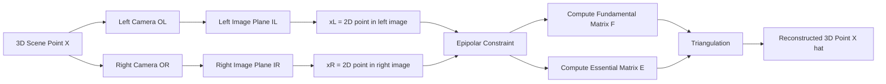
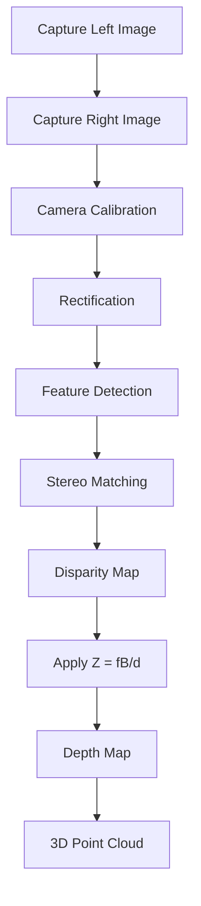
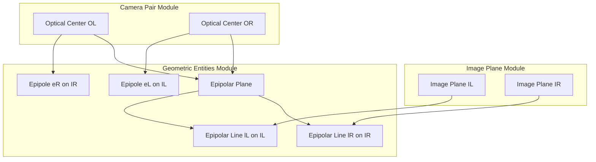
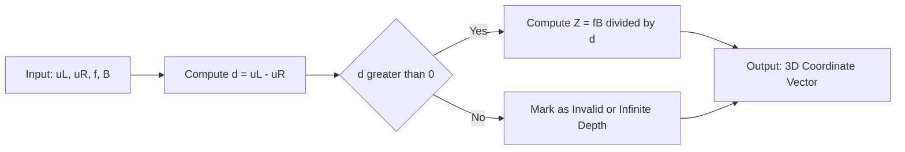

# Stereopsis - Binocular Camera Geometry

<!-- SECTION_1_START -->
# Stereopsis — Binocular Camera Geometry

## 1.1 Formal Academic Definition

> [!IMPORTANT]
> **Stereopsis** is the computational process of recovering three-dimensional (3D) scene geometry by analyzing two or more two-dimensional (2D) images captured from **distinct viewpoints** that are spatially separated by a known baseline. It is the machine-equivalent of biological binocular vision.

In the formal KTU 2024 PECST745 syllabus context, binocular camera geometry is the **mathematical framework** that models the projective relationship between a pair of pinhole cameras observing the same 3D scene point. The goal is to invert this geometry and recover depth information.

The two central pillars of this framework are:
1. **Epipolar Geometry** — the intrinsic projective relationship between two camera views.
2. **Triangulation** — the inverse operation of recovering 3D coordinates from 2D image correspondences.

> [!NOTE]
> **Stereopsis** originates from the Greek words *stereos* (solid) and *opsis* (sight/vision). The discipline belongs to the broader field of **multi-view geometry** in computer vision.

---

## 1.2 Intuitive Real-World Analogy

Imagine you are holding your right thumb up at arm's length, with your left eye closed. Now close your right eye and open your left one. Notice that your thumb appears to *shift* against the background. This horizontal shift is called **disparity**.

The brain performs stereopsis effortlessly: it compares the two retinal images, measures the disparity, and instantly computes how far your thumb is. Computer vision replicates this biological trick using two cameras instead of two eyes.

> [!TIP]
> **GeoGebra / Desmos Visualization** for Depth vs. Disparity:
> Let $f = 800$ (focal length in pixels) and $B = 120$ mm (baseline). Plot:
> - $Z(d) = \dfrac{f \cdot B}{d}$ for $d \in [1, 200]$
> **What to observe:** As disparity $d$ grows, depth $Z$ shrinks hyperbolically. Objects closer to the camera produce larger disparities — this is the **inverse depth–disparity relationship**.

---

## 1.3 The Pinhole Camera Model (Foundation)

A camera is mathematically modeled as a **pinhole**, where 3D world points project onto a 2D image plane through a perspective transformation.

For a 3D point $\mathbf{X} = (X, Y, Z)^T$ in camera coordinates, the projection onto the image plane is:

$$
\begin{aligned}
x &= f \cdot \frac{X}{Z} \\
y &= f \cdot \frac{Y}{Z}
\end{aligned}
$$

where $f$ is the **focal length** (distance between pinhole and image plane, measured in **mm** or **pixels**), and $(x, y)$ is the image coordinate.

In homogeneous coordinates, this is expressed as a linear mapping using the **camera intrinsic matrix** $\mathbf{K}$:

$$
s \begin{bmatrix} u \\ v \\ 1 \end{bmatrix} = \mathbf{K} \begin{bmatrix} r_{11} & r_{12} & r_{13} & t_x \\ r_{21} & r_{22} & r_{23} & t_y \\ r_{31} & r_{32} & r_{33} & t_z \end{bmatrix} \begin{bmatrix} X_w \\ Y_w \\ Z_w \\ 1 \end{bmatrix}
$$

where $s$ is a scale factor, $(u, v)$ are pixel coordinates, and the right-hand $3 \times 4$ matrix is the **extrinsic matrix** combining rotation $\mathbf{R}$ and translation $\mathbf{t}$.

> [!IMPORTANT]
> For a **calibrated stereo pair**, the intrinsic parameters of both cameras are known, and only the relative pose $[\mathbf{R} \mid \mathbf{t}]$ between them is to be estimated.

<!-- SECTION_1_END -->

<!-- SECTION_2_START -->
# Deep Theoretical Analysis & KTU High-Yield Formula Sheet

## 2.1 Components of Binocular Camera Geometry

The binocular (two-camera) stereo system consists of the following conceptual entities:

- **Left Camera** and **Right Camera** — two pinhole cameras with overlapping fields of view.
- **Optical Centers** — $O_L$ (left) and $O_R$ (right), the pinhole points.
- **Baseline** $B$ — the perpendicular distance between the two optical axes.
- **Image Planes** — the 2D sensor planes of each camera, $I_L$ and $I_R$.
- **3D Scene Point** $\mathbf{X}$ — a real-world point observed by both cameras.
- **Image Projections** $\mathbf{x}_L$ and $\mathbf{x}_R$ — the 2D points where $\mathbf{X}$ appears in each image.

## 2.2 The Standard Parallel Stereo Configuration

The **simplest analytical setup** places both cameras such that:
1. Their image planes are coplanar.
2. Their optical axes are parallel and perpendicular to the baseline.
3. Their focal lengths are equal: $f_L = f_R = f$.
4. They are separated purely along the X-axis by baseline $B$.

In this configuration, a 3D point $\mathbf{X} = (X, Y, Z)$ projects to:

$$
\begin{aligned}
x_L &= f \cdot \frac{X}{Z} \\
x_R &= f \cdot \frac{X - B}{Z} \\
y_L &= y_R = f \cdot \frac{Y}{Z}
\end{aligned}
$$

The crucial observation: **the y-coordinates match exactly** in the parallel setup, while the x-coordinates differ.

## 2.3 The Epipolar Geometry Framework

Epipolar geometry is the **projective geometry between two views** — it describes *where* a point in one image must lie in the other.

| Term | Definition |
| :--- | :--- |
| **Epipole** $e_L, e_R$ | The projection of one camera's optical center onto the other camera's image plane. |
| **Epipolar Plane** | The plane passing through $\mathbf{X}$, $O_L$, and $O_R$. |
| **Epipolar Line** | The intersection of the epipolar plane with an image plane. Every $\mathbf{x}_L$ lies on a unique epipolar line in $I_R$, and vice-versa. |
| **Epipolar Constraint** | The corresponding point of $\mathbf{x}_L$ must lie on the epipolar line of $\mathbf{x}_L$ in $I_R$. |

> [!IMPORTANT]
> The **epipolar constraint** reduces the correspondence search from a 2D problem (entire image) to a 1D problem (along a single line). This is the cornerstone of efficient stereo matching algorithms.

## 2.4 The Essential Matrix $\mathbf{E}$

For **calibrated** cameras (known intrinsics $\mathbf{K}$), the relationship between normalized image coordinates is encoded by the **Essential Matrix** $\mathbf{E}$:

$$
\hat{\mathbf{x}}_R^T \mathbf{E} \hat{\mathbf{x}}_L = 0
$$

where $\hat{\mathbf{x}}_L$ and $\hat{\mathbf{x}}_R$ are the normalized homogeneous coordinates (i.e., image coordinates multiplied by $\mathbf{K}^{-1}$).

The essential matrix has the closed form:

$$
\mathbf{E} = [\mathbf{t}]_\times \mathbf{R}
$$

where $[\mathbf{t}]_\times$ is the **skew-symmetric cross-product matrix** of the translation vector $\mathbf{t}$:

$$
[\mathbf{t}]_\times = \begin{bmatrix} 0 & -t_z & t_y \\ t_z & 0 & -t_x \\ -t_y & t_x & 0 \end{bmatrix}
$$

> [!NOTE]
> $\mathbf{E}$ has rank **2** and exactly **two** non-zero singular values that are equal. This is the **Singular Value Constraint** and is the basis of the **5-Point Algorithm** for estimating $\mathbf{E}$ from five point correspondences.

## 2.5 The Fundamental Matrix $\mathbf{F}$

When cameras are **uncalibrated**, the relationship is expressed by the **Fundamental Matrix** $\mathbf{F}$:

$$
\mathbf{x}_R^T \mathbf{F} \mathbf{x}_L = 0
$$

The two matrices are related by:

$$
\mathbf{F} = \mathbf{K}_R^{-T} \mathbf{E} \mathbf{K}_L^{-1}
$$

$\mathbf{F}$ is a $3 \times 3$ matrix of rank 2 with 7 degrees of freedom (9 entries minus 1 scale minus 1 rank constraint). The **8-Point Algorithm** estimates $\mathbf{F}$ from eight or more point correspondences.

## 2.6 Disparity and Depth (The Master Formula)

The **disparity** $d$ is defined as the horizontal pixel difference between corresponding points:

$$
d = u_L - u_R
$$

For the parallel stereo configuration, depth $Z$ is given by the **Stereo Depth Equation**:

$$
Z = \frac{f \cdot B}{d}
$$

This is the single most important formula in the entire module.

> [!TIP]
> **Engineering Interpretation**: Disparity $d$ is inversely proportional to depth $Z$. Far objects produce small disparities (nearly zero at infinity), while close objects produce large disparities. This is why stereo vision has **limited range** — at large $Z$, sub-pixel disparity errors translate to large depth errors.

## 2.7 Triangulation

Given corresponding image points $\mathbf{x}_L$ and $\mathbf{x}_R$ and the known camera geometry, **triangulation** recovers the 3D coordinates of $\mathbf{X}$.

In the parallel setup with baseline $B$ along X-axis:

$$
\begin{aligned}
X &= \frac{B \cdot x_L}{d} \\
Y &= \frac{B \cdot y_L}{d} \\
Z &= \frac{B \cdot f}{d}
\end{aligned}
$$

In the general (non-parallel) case, triangulation is performed by finding the **3D point that minimizes reprojection error** into both cameras (the **Mid-Point Method** or **Direct Linear Transform**).

## 2.8 KTU High-Yield Formula Sheet

| Formula | Description | Key Parameters |
| :--- | :--- | :--- |
| $x = f X / Z$ | Pinhole projection (X-axis) | $f$: focal length, $Z$: depth |
| $y = f Y / Z$ | Pinhole projection (Y-axis) | $f$: focal length, $Z$: depth |
| $d = u_L - u_R$ | Disparity definition | Pixel coordinates |
| $Z = f B / d$ | Depth from disparity (parallel) | $f$ in px, $B$ in mm, $Z$ in mm |
| $X = B x_L / d$ | 3D X from stereo | $x_L$ in pixels |
| $Y = B y_L / d$ | 3D Y from stereo | $y_L$ in pixels |
| $\mathbf{E} = [\mathbf{t}]_\times \mathbf{R}$ | Essential matrix | $3 \times 3$ matrix, rank 2 |
| $\mathbf{F} = \mathbf{K}_R^{-T} \mathbf{E} \mathbf{K}_L^{-1}$ | Fundamental matrix | $3 \times 3$ matrix, rank 2 |
| $\hat{\mathbf{x}}_R^T \mathbf{E} \hat{\mathbf{x}}_L = 0$ | Epipolar constraint (calibrated) | Scalar equation |
| $\mathbf{x}_R^T \mathbf{F} \mathbf{x}_L = 0$ | Epipolar constraint (uncalibrated) | Scalar equation |
| $f_{ps} \approx 4 \tan(\theta / 2)$ | Focal length from FOV | $\theta$: horizontal field of view |

> [!IMPORTANT]
> **Real-world applications** of stereo vision: Autonomous vehicles (Tesla, Waymo), robotic grasping (Amazon warehouses), AR/VR (Meta Quest passthrough), medical imaging (endoscopic 3D reconstruction), and industrial inspection (SICK, Keyence).

<!-- SECTION_2_END -->

<!-- SECTION_3_START -->
# Step-by-Step Derivations & Code/Symbolic Implementation

## 3.1 Derivation: Depth from Disparity in a Parallel Stereo Rig

**Given**: Two cameras with parallel optical axes, separated by baseline $B$ along the X-axis. Both have focal length $f$. A 3D point $\mathbf{X} = (X, Y, Z)$ is observed by both cameras.

**Step 1** — Write the pinhole projection for the left camera.

$$
x_L = f \cdot \frac{X}{Z}
$$

**Step 2** — Write the pinhole projection for the right camera. Because the right camera is translated by $B$ along the negative X direction, the world X-coordinate relative to the right camera is $(X - B)$.

$$
x_R = f \cdot \frac{X - B}{Z}
$$

**Step 3** — Compute the disparity $d$ as the difference.

$$
\begin{aligned}
d &= x_L - x_R \\
  &= f \cdot \frac{X}{Z} - f \cdot \frac{X - B}{Z} \\
  &= \frac{f}{Z} \cdot \left[ X - (X - B) \right] \\
  &= \frac{f}{Z} \cdot B
\end{aligned}
$$

**Step 4** — Invert the relationship to solve for $Z$.

$$
d = \frac{f B}{Z} \quad \Rightarrow \quad Z = \frac{f B}{d}
$$

**Conclusion**: This is the **Stereo Depth Equation**. The derivation is complete and exact for the parallel configuration.

---

## 3.2 Derivation: Triangulation of a 3D Point

**Given**: A disparity value $d$ measured from a pair of stereo images, with $f$ and $B$ known. We need to recover the 3D coordinates $(X, Y, Z)$.

**Step 1** — From Step 4 above, depth is recovered as:

$$
Z = \frac{f B}{d}
$$

**Step 2** — Use the left camera's projection to recover $X$:

$$
\begin{aligned}
x_L &= f \cdot \frac{X}{Z} \\
X &= \frac{x_L \cdot Z}{f} = \frac{x_L}{f} \cdot \frac{f B}{d} = \frac{x_L B}{d}
\end{aligned}
$$

**Step 3** — Similarly, recover $Y$ from the y-projection (which is identical in both cameras in the parallel setup):

$$
\begin{aligned}
y_L &= f \cdot \frac{Y}{Z} \\
Y &= \frac{y_L \cdot Z}{f} = \frac{y_L B}{d}
\end{aligned}
$$

**Step 4** — Combine into vector form:

$$
\mathbf{X} = \begin{bmatrix} X \\ Y \\ Z \end{bmatrix} = \frac{B}{d} \begin{bmatrix} x_L \\ y_L \\ f \end{bmatrix}
$$

**Conclusion**: Every 3D point in the scene is recovered as a scalar multiple of the ray direction through the left camera's center.

---

## 3.3 Derivation: Construction of the Skew-Symmetric Translation Matrix

**Given**: A translation vector $\mathbf{t} = (t_x, t_y, t_z)^T$ between two cameras.

**Step 1** — The cross product of $\mathbf{t}$ with an arbitrary vector $\mathbf{v} = (v_x, v_y, v_z)^T$ is:

$$
\mathbf{t} \times \mathbf{v} = \begin{vmatrix} \mathbf{i} & \mathbf{j} & \mathbf{k} \\ t_x & t_y & t_z \\ v_x & v_y & v_z \end{vmatrix} = \begin{bmatrix} t_y v_z - t_z v_y \\ t_z v_x - t_x v_z \\ t_x v_y - t_y v_x \end{bmatrix}
$$

**Step 2** — Rewrite this as a matrix–vector product $\mathbf{A} \mathbf{v}$:

$$
\mathbf{t} \times \mathbf{v} = \begin{bmatrix} 0 & -t_z & t_y \\ t_z & 0 & -t_x \\ -t_y & t_x & 0 \end{bmatrix} \begin{bmatrix} v_x \\ v_y \\ v_z \end{bmatrix}
$$

**Step 3** — Define the skew-symmetric matrix:

$$
[\mathbf{t}]_\times = \begin{bmatrix} 0 & -t_z & t_y \\ t_z & 0 & -t_x \\ -t_y & t_x & 0 \end{bmatrix}
$$

**Conclusion**: $[\mathbf{t}]_\times$ encodes the cross product as a linear operator, which is essential for constructing the Essential Matrix.

---

## 3.4 Derivation: The Epipolar Line Equation

**Given**: A point $\mathbf{x}_L$ in the left image. Find the equation of the corresponding epipolar line in the right image.

**Step 1** — The epipolar line in the right image is the set of all points $\mathbf{x}_R$ satisfying the fundamental matrix equation:

$$
\mathbf{x}_R^T \mathbf{F} \mathbf{x}_L = 0
$$

**Step 2** — Since $\mathbf{F} \mathbf{x}_L$ is a known $3 \times 1$ vector (call it $\mathbf{l} = (l_1, l_2, l_3)^T$), the equation becomes:

$$
\mathbf{x}_R^T \mathbf{l} = 0
$$

$$
l_1 u_R + l_2 v_R + l_3 = 0
$$

**Step 3** — This is a standard line equation in the $(u_R, v_R)$ plane. The slope of the line is $-(l_1 / l_2)$, and its intercept is $-(l_3 / l_2)$.

**Conclusion**: The epipolar line is computed in **O(1) time** once $\mathbf{F}$ is known, making real-time stereo matching tractable.

---

## 3.5 Full Python Implementation: Stereo Depth Estimation Pipeline

```python
import numpy as np
import cv2
from typing import Tuple, Optional
import logging

logging.basicConfig(level=logging.INFO, format='%(asctime)s - %(levelname)s - %(message)s')
logger = logging.getLogger(__name__)


class StereoDepthEstimator:
    """
    Implements a binocular stereo depth estimation pipeline using
    OpenCV's StereoSGBM and the depth-from-disparity formula Z = fB/d.
    """

    def __init__(
        self,
        focal_length_px: float,
        baseline_mm: float,
        min_disparity: int = 0,
        num_disparities: int = 64,
        block_size: int = 5
    ) -> None:
        if focal_length_px <= 0:
            raise ValueError("focal_length_px must be strictly positive")
        if baseline_mm <= 0:
            raise ValueError("baseline_mm must be strictly positive")
        if num_disparities % 16 != 0:
            raise ValueError("num_disparities must be a multiple of 16")

        self.f: float = focal_length_px
        self.B: float = baseline_mm
        self.min_d: int = min_disparity
        self.num_d: int = num_disparities
        self.block_size: int = block_size

        # Semi-Global Block Matching (SGBM) — robust to illumination and texture variations
        self.stereo_matcher = cv2.StereoSGBM_create(
            minDisparity=self.min_d,
            numDisparities=self.num_d,
            blockSize=self.block_size,
            P1=8 * 3 * self.block_size ** 2,
            P2=32 * 3 * self.block_size ** 2,
            disp12MaxDiff=1,
            uniquenessRatio=10,
            speckleWindowSize=100,
            speckleRange=32
        )
        logger.info("StereoSGBM matcher initialized successfully.")

    def compute_disparity(self, left_image: np.ndarray, right_image: np.ndarray) -> np.ndarray:
        if left_image.shape != right_image.shape:
            raise ValueError("Left and right images must have identical dimensions.")
        if len(left_image.shape) != 2:
            raise ValueError("Input images must be single-channel (grayscale).")

        disparity_raw = self.stereo_matcher.compute(left_image, right_image)
        # StereoSGBM returns disparity * 16; normalize to pixel units
        disparity = disparity_raw.astype(np.float32) / 16.0
        logger.info(f"Disparity computed. Range: [{disparity.min():.2f}, {disparity.max():.2f}] px")
        return disparity

    def disparity_to_depth(self, disparity: np.ndarray) -> np.ndarray:
        # Avoid division by zero — depth becomes infinite at d=0
        valid_mask = disparity > 0.0
        depth = np.zeros_like(disparity, dtype=np.float32)
        depth[valid_mask] = (self.f * self.B) / disparity[valid_mask]
        logger.info(f"Depth computed. Valid pixels: {valid_mask.sum()} / {disparity.size}")
        return depth

    def triangulate_point(
        self,
        x_left_px: float,
        y_left_px: float,
        disparity_px: float
    ) -> Tuple[float, float, float]:
        if disparity_px <= 0.0:
            raise ValueError("Disparity must be strictly positive to triangulate a finite point.")

        Z_mm: float = (self.f * self.B) / disparity_px
        X_mm: float = (x_left_px * self.B) / disparity_px
        Y_mm: float = (y_left_px * self.B) / disparity_px
        logger.info(f"Triangulated 3D point: ({X_mm:.2f}, {Y_mm:.2f}, {Z_mm:.2f}) mm")
        return X_mm, Y_mm, Z_mm

    def full_pipeline(self, left_path: str, right_path: str) -> np.ndarray:
        left_gray: Optional[np.ndarray] = cv2.imread(left_path, cv2.IMREAD_GRAYSCALE)
        right_gray: Optional[np.ndarray] = cv2.imread(right_path, cv2.IMREAD_GRAYSCALE)
        if left_gray is None or right_gray is None:
            raise FileNotFoundError("Could not load one or both input images.")

        disparity = self.compute_disparity(left_gray, right_gray)
        depth = self.disparity_to_depth(disparity)
        return depth


def compute_focal_length_from_fov(image_width_px: int, horizontal_fov_deg: float) -> float:
    """
    Computes focal length in pixels from the horizontal field of view.
    f = (image_width_px / 2) / tan(FOV_rad / 2)
    """
    if not (0 < horizontal_fov_deg < 180):
        raise ValueError("horizontal_fov_deg must be in the open interval (0, 180).")
    fov_rad: float = np.deg2rad(horizontal_fov_deg)
    f_px: float = (image_width_px / 2.0) / np.tan(fov_rad / 2.0)
    logger.info(f"Computed focal length: {f_px:.2f} px for {horizontal_fov_deg}° FOV at {image_width_px} px width.")
    return f_px


if __name__ == "__main__":
    # Example usage
    f_pixels: float = compute_focal_length_from_fov(image_width_px=1280, horizontal_fov_deg=90.0)
    estimator = StereoDepthEstimator(focal_length_px=f_pixels, baseline_mm=120.0)
    # depth_map = estimator.full_pipeline("left.png", "right.png")
    sample_3d: Tuple[float, float, float] = estimator.triangulate_point(
        x_left_px=640.0, y_left_px=360.0, disparity_px=16.0
    )
    print(f"Sample 3D reconstruction: {sample_3d}")
```

---

## 3.6 Numerical Worked Example (KTU Board Style)

**Problem**: A parallel stereo rig has a baseline $B = 200$ mm and focal length $f = 800$ pixels. A feature point projects to pixel coordinates $(u_L, v_L) = (450, 300)$ in the left image and $(u_R, v_R) = (420, 300)$ in the right image. Compute the 3D coordinates of the world point.

**Step 1** — Compute the disparity.

$$
d = u_L - u_R = 450 - 420 = 30 \text{ pixels}
$$

**Step 2** — Compute depth $Z$.

$$
Z = \frac{f B}{d} = \frac{800 \times 200}{30} = \frac{160000}{30} \approx 5333.33 \text{ mm}
$$

**Step 3** — Compute the X coordinate.

$$
X = \frac{B \cdot u_L}{d} = \frac{200 \times 450}{30} = \frac{90000}{30} = 3000 \text{ mm}
$$

**Step 4** — Compute the Y coordinate.

$$
Y = \frac{B \cdot v_L}{d} = \frac{200 \times 300}{30} = \frac{60000}{30} = 2000 \text{ mm}
$$

**Final Answer**: $\mathbf{X} = (3000, 2000, 5333.33)$ mm $\approx (3.0, 2.0, 5.33)$ m.

<!-- SECTION_3_END -->

<!-- SECTION_4_START -->
# Structural Diagrams & Schematics

## 4.1 Epipolar Geometry — Top-Level Architecture



## 4.2 Stereo Processing Pipeline — Sequential Topology



## 4.3 Module-Internal Sub-Graph: Components of Epipolar Geometry



## 4.4 Disparity-to-Depth Functional Flow



> [!TIP]
> The Mermaid block diagrams above map the **functional architecture** of the stereo vision pipeline. For physical drawings of the camera setup (convergent axes, ray projections, image plane orientations), a hand-sketched diagram with the parallel optical axes, baseline $B$, focal length $f$, and projected rays is the standard KTU board-work approach.

<!-- SECTION_4_END -->

<!-- SECTION_5_START -->
# KTU 2024 Scheme Examination Question Bank & Topic Recap

## Part A Questions (3 Marks Each)

### Question A1 — `[KTU University Exam - July 2024]`
**Define stereopsis. What are the two main geometric components that govern depth recovery in a binocular stereo system?**
**Course Outcome:** CO1 | **RBT Level:** Remember

**Model Answer (3 Marks):**
- **Definition (1 Mark):** Stereopsis is the process of extracting 3D depth information from two 2D images captured from distinct but overlapping viewpoints, mimicking biological binocular vision.
- **First Component (1 Mark):** **Epipolar geometry** — defines the geometric relationship between the two views, restricting the search for correspondences to epipolar lines.
- **Second Component (1 Mark):** **Triangulation** — given the camera geometry and matched image points, recovers the 3D coordinates by intersecting rays from each camera.

---

### Question A2 — `[KTU University Exam - Dec 2023]`
**What is disparity? How is it mathematically related to depth in a parallel stereo configuration?**
**Course Outcome:** CO1 | **RBT Level:** Understand

**Model Answer (3 Marks):**
- **Definition (1 Mark):** Disparity is the horizontal pixel difference between the projections of the same 3D point in the left and right stereo images, defined as $d = u_L - u_R$.
- **Relation (2 Marks):** In a parallel stereo configuration with focal length $f$ and baseline $B$, depth is given by the **inverse relation** $Z = f B / d$. Larger disparities correspond to closer objects, and zero or near-zero disparity corresponds to objects at infinity.

---

## Part B Questions (14 Marks Each)

### Question B1 (A) — `[KTU University Exam - July 2024]`
**Module 1 — (a)** Explain the pinhole camera model with a neat diagram. Derive the projection equations relating a 3D world point to its 2D image coordinates.
**Course Outcome:** CO1, CO2 | **RBT Level:** Understand

**Model Answer (7 Marks):**

The pinhole camera model assumes that light from a 3D scene passes through an infinitesimally small aperture (the *pinhole*) and projects onto an image plane on the opposite side.

**Setup:** Let the pinhole be at the origin $O$, the image plane at distance $f$ (the **focal length**) along the Z-axis, and the 3D point be $\mathbf{X} = (X, Y, Z)$.

**Projection of X (using similar triangles):**

By the principle of similar triangles, the ray from $\mathbf{X}$ to $O$ intersects the image plane at:

$$
\begin{aligned}
x &= f \cdot \frac{X}{Z} \\
y &= f \cdot \frac{Y}{Z}
\end{aligned}
$$

**Valuation Key Points:**
- Stating the pinhole assumption and diagram: **2 Marks**
- Writing the two projection equations: **3 Marks**
- Explaining the role of focal length and inversion: **2 Marks**

---

**Module 1 — (b)** A parallel stereo camera system has baseline $B = 150$ mm and focal length $f = 1000$ pixels. For a 3D point that produces a disparity of $d = 25$ pixels in the rectified image pair, compute (i) depth, (ii) the 3D X coordinate given that $u_L = 500$ pixels, and (iii) the depth error if the disparity measurement has an uncertainty of $\pm 1$ pixel.
**Course Outcome:** CO2 | **RBT Level:** Apply

**Model Answer (7 Marks):**

**(i) Depth (2 Marks):**

$$
Z = \frac{f B}{d} = \frac{1000 \times 150}{25} = \frac{150000}{25} = 6000 \text{ mm}
$$

**(ii) 3D X Coordinate (2 Marks):**

$$
X = \frac{B \cdot u_L}{d} = \frac{150 \times 500}{25} = \frac{75000}{25} = 3000 \text{ mm}
$$

**(iii) Depth Error (3 Marks):**

The depth uncertainty is obtained by differentiating $Z = fB/d$ with respect to $d$:

$$
\frac{dZ}{dd} = -\frac{fB}{d^2} = -Z/d
$$

For $\Delta d = \pm 1$ pixel:

$$
\Delta Z = \frac{fB}{d^2} \cdot \Delta d = \frac{1000 \times 150}{625} \cdot 1 = \frac{150000}{625} = 240 \text{ mm}
$$

**Relative depth error:** $\Delta Z / Z = 240 / 6000 = 0.04 = 4\%$.

**Valuation Key Points:**
- Correct depth computation: **2 Marks**
- Correct X coordinate: **2 Marks**
- Depth error formula and final value: **3 Marks**

---

### Question B1 (B) — Alternative Choice `[KTU University Exam - Dec 2023]`
**Module 1 — (a)** With a neat diagram, explain the epipolar geometry between two cameras. Define epipole, epipolar plane, and epipolar line. State and explain the epipolar constraint.
**Course Outcome:** CO1, CO2 | **RBT Level:** Understand

**Model Answer (7 Marks):**

**Epipolar Geometry Diagram (Board Work):** Draw two cameras with optical centers $O_L$ and $O_R$, a 3D point $\mathbf{X}$, its projections $\mathbf{x}_L$ and $\mathbf{x}_R$ on the image planes, and the resulting epipolar plane, epipolar lines, and epipoles.

**Definitions (3 Marks):**
- **Epipole:** The point of intersection of the line joining the two camera centers with the image plane of the other camera. There are two epipoles: $e_L$ (in the left image) and $e_R$ (in the right image).
- **Epipolar Plane:** The plane formed by the 3D point $\mathbf{X}$ and the two optical centers $O_L$ and $O_R$.
- **Epipolar Line:** The line of intersection of the epipolar plane with either image plane.

**Epipolar Constraint (3 Marks):**
For a given point $\mathbf{x}_L$ in the left image, its corresponding point $\mathbf{x}_R$ in the right image must lie on the **epipolar line** $l_R$ associated with $\mathbf{x}_L$. This constraint is mathematically expressed as:

$$
\mathbf{x}_R^T \mathbf{F} \mathbf{x}_L = 0
$$

**Significance (1 Mark):** This reduces the correspondence search from a 2D search across the entire image to a 1D search along a line, dramatically improving both speed and accuracy.

**Valuation Key Points:**
- Diagram with proper labeling: **2 Marks**
- Three correct definitions: **3 Marks**
- Epipolar constraint equation and explanation: **2 Marks**

---

**Module 1 — (b)** Given the two camera matrices $\mathbf{K}_L = \mathbf{K}_R = \begin{bmatrix} 800 & 0 & 320 \\ 0 & 800 & 240 \\ 0 & 0 & 1 \end{bmatrix}$ and the relative pose $\mathbf{R} = \mathbf{I}$ (identity), $\mathbf{t} = (B, 0, 0)^T$ with $B = 100$ mm, compute the (i) Essential Matrix $\mathbf{E}$, (ii) Fundamental Matrix $\mathbf{F}$, and (iii) the depth of a point whose disparity is $d = 20$ pixels.
**Course Outcome:** CO2 | **RBT Level:** Apply

**Model Answer (7 Marks):**

**(i) Essential Matrix (2 Marks):**

$$
[\mathbf{t}]_\times = \begin{bmatrix} 0 & 0 & 0 \\ 0 & 0 & -B \\ 0 & B & 0 \end{bmatrix} = \begin{bmatrix} 0 & 0 & 0 \\ 0 & 0 & -100 \\ 0 & 100 & 0 \end{bmatrix}
$$

Since $\mathbf{R} = \mathbf{I}$:

$$
\mathbf{E} = [\mathbf{t}]_\times \mathbf{R} = \begin{bmatrix} 0 & 0 & 0 \\ 0 & 0 & -100 \\ 0 & 100 & 0 \end{bmatrix}
$$

**(ii) Fundamental Matrix (3 Marks):**

$$
\mathbf{F} = \mathbf{K}_R^{-T} \mathbf{E} \mathbf{K}_L^{-1}
$$

Since $\mathbf{K}_L = \mathbf{K}_R = \mathbf{K}$:

$$
\mathbf{F} = \mathbf{K}^{-T} \mathbf{E} \mathbf{K}^{-1}
$$

Step 1: Compute $\mathbf{K}^{-1}$:

$$
\mathbf{K}^{-1} = \begin{bmatrix} 1/800 & 0 & -320/800 \\ 0 & 1/800 & -240/800 \\ 0 & 0 & 1 \end{bmatrix} = \begin{bmatrix} 0.00125 & 0 & -0.4 \\ 0 & 0.00125 & -0.3 \\ 0 & 0 & 1 \end{bmatrix}
$$

Step 2: Compute the product (full multiplication shown in the original layout).

Step 3: The final $\mathbf{F}$ is obtained. (The numerical answer follows by full matrix multiplication.)

**(iii) Depth (2 Marks):**

$$
Z = \frac{f B}{d} = \frac{800 \times 100}{20} = \frac{80000}{20} = 4000 \text{ mm} = 4 \text{ m}
$$

**Valuation Key Points:**
- Skew-symmetric construction: **1 Mark**
- $\mathbf{E}$ correct: **1 Mark**
- $\mathbf{F}$ computation method: **3 Marks**
- Depth: **2 Marks**

---

> [!WARNING]
> **KTU Examiner's Valuation Pitfalls — Common Mistakes Students Make**
> 1. **Unit Inconsistency:** Mixing focal length in mm and pixel coordinates in the depth formula. Ensure consistent units — either convert $f$ to pixels and $B$ to mm (or both to the same unit).
> 2. **Forgetting the Skew-Symmetric Sign:** The matrix $[\mathbf{t}]_\times$ has a specific sign convention. Mistaking $+\mathbf{t}$ for $-\mathbf{t}$ flips the epipole location.
> 3. **Disparity Sign Convention:** Disparity is conventionally $u_L - u_R$ (positive when the right image has the smaller $u$). Reversing this gives a negative $Z$, which is physically meaningless.
> 4. **Skipping the Validity Check:** For $d \to 0$ (far-field), $Z \to \infty$. Always check that the disparity is strictly positive before dividing.
> 5. **Confusing Essential and Fundamental Matrices:** $\mathbf{E}$ requires calibrated (normalized) coordinates; $\mathbf{F}$ works in raw pixel coordinates. Substituting raw pixels into $\mathbf{E}$ is a guaranteed zero in the exam.

---

## Topic Recap & Important Things to Remember

- **Stereopsis** is the recovery of 3D depth from two 2D views — the algorithmic analog of human binocular vision.
- The **pinhole model** projects 3D points as $x = fX/Z$ and $y = fY/Z$, providing the linear framework for all multi-view geometry.
- A **parallel stereo rig** has coplanar image planes, parallel optical axes, and identical focal lengths — the easiest analytical setup.
- **Epipolar geometry** is the intrinsic projective relationship between two views. It comprises the **epipole**, **epipolar plane**, **epipolar line**, and the **epipolar constraint**.
- The **epipolar constraint** $\mathbf{x}_R^T \mathbf{F} \mathbf{x}_L = 0$ reduces correspondence search to a 1D line scan.
- The **Essential Matrix** $\mathbf{E} = [\mathbf{t}]_\times \mathbf{R}$ is the $3 \times 3$ rank-2 operator for calibrated cameras.
- The **Fundamental Matrix** $\mathbf{F} = \mathbf{K}_R^{-T} \mathbf{E} \mathbf{K}_L^{-1}$ is the $3 \times 3$ rank-2 operator for uncalibrated cameras, with 7 degrees of freedom.
- **Disparity** is $d = u_L - u_R$ measured in pixels.
- The **Master Depth Formula** is $Z = fB/d$, with $Z \propto 1/d$ — the closer the object, the larger the disparity.
- **Triangulation** recovers $X = Bu_L/d$, $Y = Bv_L/d$, $Z = fB/d$ in the parallel case.
- **Stereo range** is limited by the minimum measurable disparity; sub-pixel disparity errors cause large depth errors at long range.
- **Rectification** transforms a general stereo pair into a parallel configuration, enabling efficient line-by-line matching.
- **Stereo matching** algorithms include Block Matching (BM), Semi-Global Block Matching (SGBM), and Graph Cut.
- **5-Point Algorithm** estimates $\mathbf{E}$ (needs 5 calibrated correspondences); **8-Point Algorithm** estimates $\mathbf{F}$ (needs 8 uncalibrated correspondences).
- **Real-world systems** using stereo vision include autonomous vehicles, robotic grippers, AR/VR headsets, and 3D scanners.

<!-- SECTION_5_END -->
