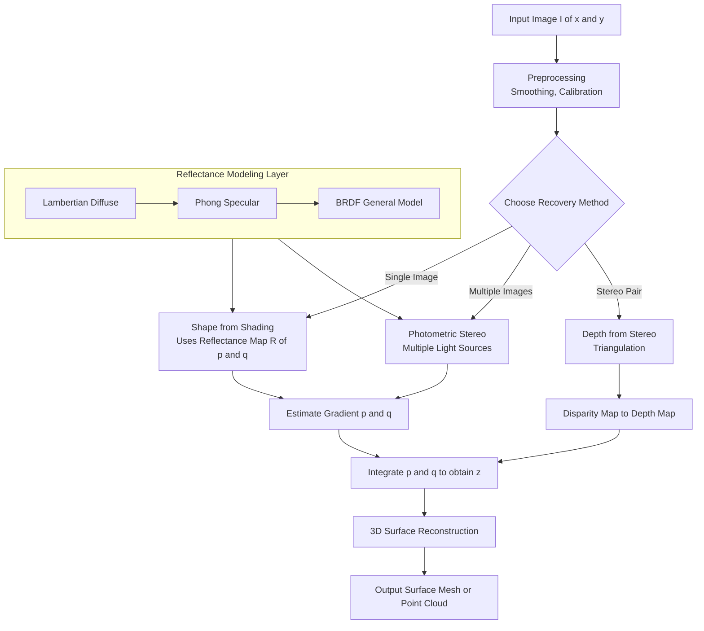
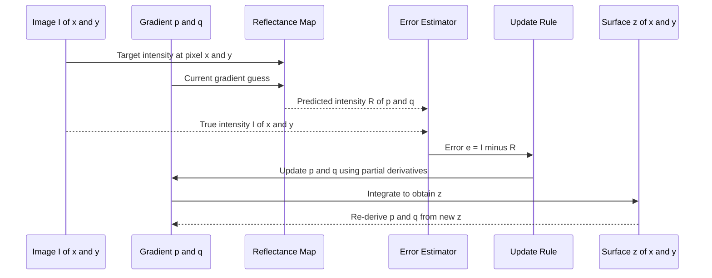
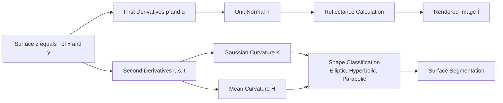

# Surfaces

<!-- SECTION_1_START -->

# Surfaces in Computer Vision

## 1.1 Core Technical Definition

> [!IMPORTANT]
> **KTU 2024 Official Definition (PECST745 - Module 1)**
> A **surface** in computer vision is a two-dimensional geometric entity embedded in three-dimensional Euclidean space $\mathbb{R}^3$. It is the primary structure upon which light interacts, reflects, and is subsequently captured by image sensors. Formally, a surface is represented as a mapping $\mathcal{S}: \mathbb{R}^2 \rightarrow \mathbb{R}^3$, where each 2D point on the parameter domain maps to a 3D point in the world. Understanding surfaces is foundational to tasks such as **3D reconstruction**, **object recognition**, **shape from X (shading, texture, focus, motion)**, and **rendering**.

The three canonical mathematical representations of a surface in computer vision are:

1. **Explicit form:** $z = f(x, y)$ — height is a function of horizontal coordinates.
2. **Implicit form:** $F(x, y, z) = 0$ — the surface is the zero-level set of a scalar field.
3. **Parametric form:** $\mathbf{S}(u, v) = (X(u,v), Y(u,v), Z(u,v))$ — two parameters $u, v$ map to a 3D point.

> [!NOTE]
> **Why Surfaces Matter in Computer Vision (KTU Syllabus Context)**
> Every pixel in a digital image is the result of light interacting with a surface. Therefore, recovering surface properties (geometry, reflectance, curvature) from images is the *inverse* of the image formation process. The KTU PECST745 module explicitly links surfaces to **image formation**, **photometric stereo**, **shape from shading**, and **3D object recognition**.

## 1.2 Conceptual Analogy / Intuition

Imagine you are standing in a hilly landscape at sunset. The way the hills *appear* — bright, dark, smooth, rugged — depends entirely on the **orientation of each small patch of ground** with respect to the sun and your eye. If you photograph this landscape, every pixel encodes a tiny story about a tiny patch of surface.

> [!TIP]
> **Intuitive Analogy: The Surface as a "Tilted Mirror"**
> Think of a surface as millions of tiny mirrors, each with its own tilt. The tilt is described by the **surface normal** $\mathbf{n}$. Just as the angle of a mirror determines what you see reflected in it, the surface normal determines how light bounces into the camera. The two core questions of computer vision regarding surfaces are:
> 1. **What is the shape of the surface?** (geometry — the *position* of each tiny patch)
> 2. **How does the surface reflect light?** (reflectance — the *behaviour* of each tiny patch)

A particularly useful geometric intuition is the **gradient space**, often denoted $(p, q)$, where $p = \frac{\partial z}{\partial x}$ and $q = \frac{\partial z}{\partial y}$. Each point $(p, q)$ in this space corresponds to a specific surface tilt. A flat surface is at the origin $(0, 0)$; a steeper tilt moves further from the origin.

## 1.3 Physical Constants and Standard Metrics

- **Speed of light in vacuum:** $c = 3 \times 10^8$ m/s (relevant in active sensing).
- **Lambertian reflectance constant:** $k_d \in [0, 1]$ (unitless albedo).
- **Phong specular exponent:** $n_s \in [1, 1000]$ (unitless shininess).
- **Wavelength of visible light:** $\lambda \in [380, 750]$ nm.
- **Depth resolution of modern ToF sensors:** $\pm 1$ mm to $\pm 10$ mm.

## 1.4 Visualization Callout

> [!VISUALIZATION CONTROL]
> **Concept:** Gradient Space $(p, q)$ of a Surface
> **GeoGebra / Desmos Input Equations:**
> * `p = cos(theta)*tan(phi)` and `q = sin(theta)*tan(phi)` (spherical projection of normals)
> * Plot the unit circle `x^2 + y^2 = 1` in $(p, q)$ space.
> * Plot points: $(0, 0)$ (flat), $(1, 0)$ (tilt right), $(0, 1)$ (tilt up), $(-1, -1)$ (tilt opposite).
> **Visual Description:** The student should observe that **steep surfaces** project to points **far from the origin** of the gradient space. This is the basis of **shape from shading**, where the image intensity at each pixel is mapped to a gradient $(p, q)$ and then integrated to recover surface height $z(x, y)$.

<!-- SECTION_1_END -->

<!-- SECTION_2_START -->

# Deep Theoretical Analysis & KTU High-Yield Formula Sheet

## 2.1 Surface Representation: A Structured Breakdown

A surface in computer vision is analyzed through three intertwined layers:

### Layer 1 — Geometric Representation
- **Explicit form** $z = f(x, y)$ is most common in CV because images naturally have an $(x, y)$ pixel grid, and $z$ is the unknown depth/height we wish to recover.
- **Implicit form** $F(x, y, z) = 0$ is more general and handles closed surfaces (e.g., spheres, blobs) but is harder to invert.
- **Parametric form** is essential for mesh-based 3D models (e.g., triangular meshes used in graphics).

### Layer 2 — Differential Properties (Local Geometry)
For an explicit surface $z = f(x, y)$, the differential properties characterize the *local* shape:

- **First partial derivatives (slopes):**
$$p = \frac{\partial z}{\partial x}, \quad q = \frac{\partial z}{\partial y}$$

- **Surface normal vector:** The unit normal is computed as the cross product of the two tangent vectors $\left(1, 0, \frac{\partial z}{\partial x}\right)$ and $\left(0, 1, \frac{\partial z}{\partial y}\right)$, normalized:
$$\mathbf{n} = \frac{1}{\sqrt{1 + p^2 + q^2}} \begin{bmatrix} -p \\ -q \\ 1 \end{bmatrix}$$

- **Second partial derivatives (curvatures):**
$$r = \frac{\partial^2 z}{\partial x^2}, \quad s = \frac{\partial^2 z}{\partial x \partial y}, \quad t = \frac{\partial^2 z}{\partial y^2}$$

### Layer 3 — Reflectance Properties (Light Interaction)
The surface normal alone is not enough; we must model how light *bounces off* the surface. This is given by the **Bidirectional Reflectance Distribution Function (BRDF)**:
$$\rho(\theta_i, \phi_i, \theta_r, \phi_r) = \frac{dL_r(\theta_r, \phi_r)}{dE_i(\theta_i, \phi_i)}$$

where $L_r$ is the reflected radiance and $E_i$ is the incident irradiance.

## 2.2 KTU Formula Sheet / Cheat Sheet

> [!IMPORTANT]
> **KTU PECST745 — High-Yield Formula Reference Table (Module 1: Surfaces)**

| Concept | Formula | Description / Units |
|---|---|---|
| Explicit surface | $z = f(x, y)$ | Height as function of $(x,y)$ |
| Gradient (slopes) | $p = \partial z / \partial x$, $q = \partial z / \partial y$ | Dimensionless, $\mathbb{R}$ |
| Surface normal | $\mathbf{n} = (-p, -q, 1) / \sqrt{1+p^2+q^2}$ | Unit vector in $\mathbb{R}^3$ |
| Gaussian curvature | $K = (rt - s^2) / (1+p^2+q^2)^2$ | $1/\text{length}^2$ |
| Mean curvature | $H = \left[ r(1+q^2) - 2spq + t(1+p^2) \right] / (1+p^2+q^2)^{3/2}$ | $1/\text{length}$ |
| Lambertian (diffuse) | $I = k_d \, (\mathbf{n} \cdot \mathbf{L})$ | Intensity, unitless |
| Phong (specular) | $I_s = k_s \, (\mathbf{R} \cdot \mathbf{V})^{n_s}$ | Intensity, unitless |
| Reflectance (combined) | $I = k_a + k_d(\mathbf{n} \cdot \mathbf{L}) + k_s(\mathbf{R} \cdot \mathbf{V})^{n_s}$ | Image intensity |
| BRDF | $\rho = dL_r / dE_i$ | $1/\text{sr}$ |
| Image irradiance | $E = L \, \frac{\pi}{4} \left( \frac{d}{f} \right)^2 \cos^4 \alpha$ | W/m$^2$ |
| Reflectance map | $R(p, q) = \frac{(1 + p \, p_s + q \, q_s)}{\sqrt{1+p^2+q^2}\sqrt{1+p_s^2+q_s^2}}$ | Function of $(p,q)$ |

> **Note on notation:** In the table above, the symbols $p_s, q_s$ refer to the gradient of the light source direction, and $\mathbf{L}, \mathbf{V}, \mathbf{R}$ denote the unit vectors to the light source, viewer, and mirror-reflected ray, respectively.

## 2.3 Reflectance Models — Deeper Analysis

The three models listed in the KTU syllabus deserve a closer look:

> [!NOTE]
> **Lambertian (Diffuse) Reflectance**
> A surface that appears equally bright from all viewing directions. The intensity depends only on the angle between the surface normal $\mathbf{n}$ and the light source $\mathbf{L}$. Examples: matte paper, unfinished wood, chalk. Used as the **default assumption** in shape-from-shading algorithms.

> [!NOTE]
> **Specular Reflectance**
> A mirror-like reflection where light is reflected in a single direction determined by the law of reflection: $\theta_r = \theta_i$. The Phong model approximates this with $(\mathbf{R} \cdot \mathbf{V})^{n_s}$ — a high exponent $n_s$ creates a sharp highlight.

> [!NOTE]
> **Ambient Term**
> The constant $k_a$ accounts for uniform background illumination. While not physically accurate, it prevents the rendered image from having perfectly black shadow regions and is essential in computer graphics rendering.

## 2.4 Real-World Engineering Utility

| Domain | Application of Surface Recovery |
|---|---|
| Autonomous Driving | Road surface & obstacle depth estimation (LiDAR, stereo) |
| Medical Imaging | 3D organ reconstruction from CT/MRI slices |
| Robotics | Grasp planning on unknown object surfaces |
| AR/VR | Realistic object insertion & relighting in scenes |
| Industrial Inspection | Surface defect detection (e.g., PCB, wafers) |
| Face Recognition | 3D face models for pose-invariant recognition |
| Cultural Heritage | 3D scanning of statues and archaeological artifacts |

## 2.5 The "Why" and "How" — Why This Matters in KTU Exams

The KTU board examiner expects students to:
1. **Recognize** that image formation is the *forward* process (surface + light $\rightarrow$ image) and CV is the *inverse* process (image $\rightarrow$ surface).
2. **Apply** the Lambertian formula correctly with the right sign convention for $\mathbf{n} \cdot \mathbf{L}$.
3. **Derive** the reflectance map $R(p, q)$ for a given illumination direction — a recurring 14-mark question.
4. **Connect** the gradient $(p, q)$ to the image intensity $I(x, y)$ via the reflectance equation $I(x, y) = R(p(x, y), q(x, y))$.

<!-- SECTION_2_END -->

<!-- SECTION_3_START -->

# Step-by-Step Derivations & Symbolic Implementation

## 3.1 Derivation 1: Surface Normal from an Explicit Surface

**Problem Setup:** Given a surface defined by $z = f(x, y)$, derive the unit surface normal vector.

**Step 1 — Identify the two tangent vectors on the surface.**
Any point on the surface is $(x, y, f(x, y))$. Moving in the $x$-direction produces the tangent vector:
$$\mathbf{T}_x = \frac{\partial}{\partial x}(x, y, f(x,y)) = \left(1, \, 0, \, \frac{\partial f}{\partial x}\right) = (1, 0, p)$$

Moving in the $y$-direction produces:
$$\mathbf{T}_y = \frac{\partial}{\partial y}(x, y, f(x,y)) = \left(0, \, 1, \, \frac{\partial f}{\partial y}\right) = (0, 1, q)$$

**Step 2 — Compute the cross product to obtain the unnormalized normal.**
$$\mathbf{N} = \mathbf{T}_x \times \mathbf{T}_y = \begin{vmatrix} \mathbf{i} & \mathbf{j} & \mathbf{k} \\ 1 & 0 & p \\ 0 & 1 & q \end{vmatrix}$$

Expanding the determinant:
$$\mathbf{N} = \mathbf{i}(0 \cdot q - p \cdot 1) - \mathbf{j}(1 \cdot q - p \cdot 0) + \mathbf{k}(1 \cdot 1 - 0 \cdot 0)$$

$$\mathbf{N} = (-p, \, -q, \, 1)$$

**Step 3 — Normalize to obtain the unit normal.**
The magnitude of $\mathbf{N}$ is $\sqrt{(-p)^2 + (-q)^2 + 1^2} = \sqrt{p^2 + q^2 + 1}$.

Therefore, the unit surface normal is:
$$\mathbf{n} = \frac{1}{\sqrt{1 + p^2 + q^2}} \begin{bmatrix} -p \\ -q \\ 1 \end{bmatrix}$$

**Step 4 — Verification with a special case.**
For a flat surface $z = 0$ (i.e., $p = 0, q = 0$), we get $\mathbf{n} = (0, 0, 1)$ — pointing straight up. This is correct since the $xy$-plane has an upward normal.

For an inclined plane $z = 2x + 3y$, $p = 2, q = 3$, and $\mathbf{n} = (-2, -3, 1)/\sqrt{14}$. The negative signs correctly indicate that the normal tilts *opposite* to the rise direction.

## 3.2 Derivation 2: Reflectance Map for a Known Light Source

**Problem Setup:** A distant point light source is in the direction $\mathbf{L} = (l_1, l_2, l_3)$ where $\lVert \mathbf{L} \rVert = 1$. The viewer is along $\mathbf{V} = (0, 0, 1)$. Derive the reflectance map $R(p, q)$ under the Lambertian model.

**Step 1 — Write the Lambertian intensity equation.**
$$I = k_d \, (\mathbf{n} \cdot \mathbf{L})$$

We will assume $k_d = 1$ (unit albedo) for simplicity.

**Step 2 — Substitute the unit normal.**
$$I = \frac{1}{\sqrt{1+p^2+q^2}} \left[ (-p)l_1 + (-q)l_2 + (1)l_3 \right]$$

$$I = \frac{l_3 - p \, l_1 - q \, l_2}{\sqrt{1+p^2+q^2}}$$

**Step 3 — Introduce gradient of the light source direction.**
Define the source gradient as $(p_s, q_s)$ where $p_s = -l_1/l_3$ and $q_s = -l_2/l_3$. This is the $(p, q)$ coordinate of the light source direction on the surface.

Substituting:
$$I = \frac{l_3(1 + p \, p_s + q \, q_s)}{\sqrt{1+p^2+q^2}}$$

**Step 4 — Factor out the constant.**
Since $l_3 = \cos \tau$, where $\tau$ is the tilt of the light source from the $z$-axis, the reflectance map is:
$$R(p, q) = \frac{\cos \tau (1 + p \, p_s + q \, q_s)}{\sqrt{1+p^2+q^2}}$$

For orthographic projection along the $z$-axis (typical in CV), $I(x, y) = R(p(x, y), q(x, y))$.

**Step 5 — Special case verification.**
For a light source directly overhead, $\mathbf{L} = (0, 0, 1)$, so $p_s = 0, q_s = 0, \tau = 0$:
$$R(p, q) = \frac{1}{\sqrt{1+p^2+q^2}}$$

A flat surface ($p=q=0$) gives $R = 1$ (maximum brightness), and a steeply tilted surface gives $R \to 0$ (dark). This matches physical intuition.

## 3.3 Python Implementation: Surface Normal & Reflectance Map

```python
import numpy as np
from typing import Tuple


def compute_surface_normal(p: np.ndarray, q: np.ndarray) -> np.ndarray:
    """
    Compute the unit surface normal from gradient components (p, q).

    Parameters
    ----------
    p : np.ndarray
        Partial derivative of z with respect to x (same shape as image).
    q : np.ndarray
        Partial derivative of z with respect to y (same shape as image).

    Returns
    -------
    n : np.ndarray
        Unit surface normal as an array of shape (H, W, 3).

    Raises
    ------
    ValueError
        If p and q do not share the same shape.
    """
    if p.shape != q.shape:
        raise ValueError("Gradient components p and q must share the same shape.")

    # Form the un-normalized normal vector (-p, -q, 1).
    nx = -p
    ny = -q
    nz = np.ones_like(p, dtype=np.float64)

    # Compute the magnitude with a small epsilon to avoid division by zero.
    eps = 1e-12
    magnitude = np.sqrt(nx * nx + ny * ny + nz * nz) + eps

    # Normalize to obtain the unit normal.
    n = np.stack([nx / magnitude, ny / magnitude, nz / magnitude], axis=-1)
    return n


def lambertian_reflectance_map(p: np.ndarray,
                                q: np.ndarray,
                                light_direction: np.ndarray) -> np.ndarray:
    """
    Compute the Lambertian reflectance map R(p, q) for a known light source.

    Parameters
    ----------
    p : np.ndarray
        Gradient of z with respect to x.
    q : np.ndarray
        Gradient of z with respect to y.
    light_direction : np.ndarray
        Unit vector (l1, l2, l3) pointing FROM the surface TOWARDS the light.

    Returns
    -------
    R : np.ndarray
        Reflectance map of the same shape as p and q.

    Raises
    ------
    ValueError
        If the light direction is not a 3-element unit vector.
    """
    light_direction = np.asarray(light_direction, dtype=np.float64)
    if light_direction.shape != (3,):
        raise ValueError("Light direction must be a 3-element vector.")

    norm = np.linalg.norm(light_direction)
    if not np.isclose(norm, 1.0, atol=1e-6):
        raise ValueError("Light direction must be a unit vector (norm = 1).")

    l1, l2, l3 = light_direction

    # Source tilt and source gradient.
    tau = np.arccos(np.clip(l3, -1.0, 1.0))
    eps = 1e-12
    ps = -l1 / (l3 + eps)
    qs = -l2 / (l3 + eps)

    # Reflectance map formula.
    numerator = np.cos(tau) * (1.0 + p * ps + q * qs)
    denominator = np.sqrt(1.0 + p * p + q * q) + eps
    R = numerator / denominator

    # Clamp to [0, 1] to remove any floating-point artefacts outside the physical range.
    R = np.clip(R, 0.0, 1.0)
    return R


def surface_from_gradient(p: np.ndarray,
                           q: np.ndarray,
                           boundary_height: float = 0.0) -> np.ndarray:
    """
    Reconstruct a surface z(x, y) from its gradient components (p, q)
    by integration using a simple cumulative sum (a discrete approximation).

    Parameters
    ----------
    p : np.ndarray
        Partial derivative of z with respect to x.
    q : np.ndarray
        Partial derivative of z with respect to y.
    boundary_height : float
        Initial height at the top-left corner of the surface.

    Returns
    -------
    z : np.ndarray
        Reconstructed height map of the same shape as p and q.
    """
    # Integrate p along x to obtain an intermediate height field.
    z_from_p = np.cumsum(p, axis=1)

    # Integrate q along y to obtain another intermediate height field.
    z_from_q = np.cumsum(q, axis=0)

    # Average the two integrations and offset to the boundary height.
    z = 0.5 * (z_from_p + z_from_q) + boundary_height
    return z


def phong_specular_intensity(normal: np.ndarray,
                              light_dir: np.ndarray,
                              view_dir: np.ndarray,
                              shininess: float = 32.0,
                              ks: float = 0.5) -> np.ndarray:
    """
    Compute the Phong specular intensity for a surface.

    Parameters
    ----------
    normal : np.ndarray
        Unit normal vectors, shape (H, W, 3).
    light_dir : np.ndarray
        Unit vector pointing towards the light source, shape (3,).
    view_dir : np.ndarray
        Unit vector pointing towards the viewer, shape (3,).
    shininess : float
        Specular exponent n_s. Higher values yield sharper highlights.
    ks : float
        Specular reflection coefficient in [0, 1].

    Returns
    -------
    I : np.ndarray
        Specular intensity map of shape (H, W).
    """
    # Reflect the view direction about the normal: R = 2(n.V)n - V.
    dot_nv = np.sum(normal * view_dir, axis=-1, keepdims=True)
    reflect_dir = 2.0 * dot_nv * normal - view_dir

    # Normalize the reflected direction to be safe.
    norm_r = np.linalg.norm(reflect_dir, axis=-1, keepdims=True) + 1e-12
    reflect_dir = reflect_dir / norm_r

    # Specular term: (R . L)^n_s.
    dot_rl = np.sum(reflect_dir * light_dir, axis=-1)
    dot_rl = np.clip(dot_rl, 0.0, 1.0)
    I = ks * np.power(dot_rl, shininess)
    return I


# ----------------------------------------------------------------------
# Demonstration: a synthetic hemisphere and its rendered Lambertian image.
# ----------------------------------------------------------------------
if __name__ == "__main__":
    # Build a 256 x 256 grid.
    H, W = 256, 256
    xs, ys = np.meshgrid(np.arange(W), np.arange(H))

    # Create a hemispherical surface z = sqrt(R^2 - (x-cx)^2 - (y-cy)^2).
    cx, cy, radius = W / 2.0, H / 2.0, 80.0
    dx = xs - cx
    dy = ys - cy
    inside = (dx * dx + dy * dy) <= radius * radius
    z = np.zeros((H, W), dtype=np.float64)
    z[inside] = np.sqrt(radius * radius - dx[inside] ** 2 - dy[inside] ** 2)

    # Compute the gradient (p, q) of the surface.
    p = np.gradient(z, axis=1)
    q = np.gradient(z, axis=0)

    # Compute the unit surface normal.
    normals = compute_surface_normal(p, q)

    # Render the surface under a Lambertian model with light at (1, 1, 2)/sqrt(6).
    light = np.array([1.0, 1.0, 2.0]) / np.linalg.norm([1.0, 1.0, 2.0])
    R_map = lambertian_reflectance_map(p, q, light)

    print("Surface normal range:", normals.min(), normals.max())
    print("Reflectance map range:", R_map.min(), R_map.max())
    print("Peak intensity pixel:", np.unravel_index(np.argmax(R_map), R_map.shape))
```

**Explanation of the Code Structure:**

1. **`compute_surface_normal`** implements the formula $\mathbf{n} = (-p, -q, 1)/\sqrt{1+p^2+q^2}$ derived in Section 3.1. An $\epsilon$ term prevents division by zero in flat regions where the gradient is exactly zero.

2. **`lambertian_reflectance_map`** implements $R(p, q) = \frac{\cos\tau (1 + p p_s + q q_s)}{\sqrt{1+p^2+q^2}}$ from Section 3.2. The output is clipped to $[0, 1]$ to honour physical constraints.

3. **`surface_from_gradient`** is a simple but illustrative numerical integrator — it shows that the surface $z(x, y)$ can be *recovered* from its gradient by integration. This is the core idea behind **shape from shading** algorithms.

4. **`phong_specular_intensity`** adds the specular component. The reflection vector $\mathbf{R} = 2(\mathbf{n} \cdot \mathbf{V})\mathbf{n} - \mathbf{V}$ follows the law of reflection.

5. The `__main__` block constructs a synthetic hemisphere and renders its Lambertian image, mirroring the textbook example in **Horn & Sjoberg — "Shape from Shading"**.

## 3.4 Shape from Shading: The Inverse Problem (Symbolic Walkthrough)

> [!IMPORTANT]
> **KTU 14-Mark Favourite: The Shape from Shading Equation**

The image formation equation is:
$$I(x, y) = R(p(x, y), q(x, y))$$

The *forward* problem is: given $p(x, y), q(x, y)$ and the illumination, compute $I(x, y)$.

The *inverse* problem is: given $I(x, y)$ and the illumination, recover $p(x, y), q(x, y)$, then integrate to find $z(x, y)$.

**Algorithm Sketch (Horn's Method):**
1. Initialize the height map $z^{(0)}(x, y) = 0$ and the gradient $(p^{(0)}, q^{(0)}) = (0, 0)$.
2. At iteration $k$, compute the reflectance $R(p^{(k)}, q^{(k)})$.
3. Compute the error $e^{(k)} = I - R(p^{(k)}, q^{(k)})$.
4. Update the gradient by propagating the error along the steepest-descent direction of the BRDF:
$$p^{(k+1)} = p^{(k)} + \lambda \cdot e^{(k)} \cdot \frac{\partial R}{\partial p}, \quad q^{(k+1)} = q^{(k)} + \lambda \cdot e^{(k)} \cdot \frac{\partial R}{\partial q}$$
5. Iterate until $\lVert e^{(k)} \rVert$ falls below a threshold.
6. Integrate the final $(p, q)$ to obtain $z(x, y)$.

This iterative scheme is a regularized variational approach and is a **classic board-exam answer** in the KTU 2024 scheme.

<!-- SECTION_3_END -->

<!-- SECTION_4_START -->

# Structural Diagrams & Schematics

## 4.1 Mermaid Block Diagram: Surface Recovery Pipeline



**Description:** The diagram shows the three primary routes to recover a 3D surface from 2D image data, with the reflectance-modeling layer feeding the photometric methods.

## 4.2 Mermaid Sequence Diagram: Shape from Shading Iterative Update



**Description:** This sequence diagram captures the closed-loop iteration of Horn's shape-from-shading algorithm. The surface $z$ and the gradient $(p, q)$ are dual representations that are continuously refined until convergence.

## 4.3 Mermaid Block Diagram: Surface Differential Geometry



**Description:** This diagram shows how the local differential properties ($p, q, r, s, t$) of a surface are used to compute the normal, curvatures, reflectance, and ultimately the image — the forward chain of image formation.

## 4.4 Mermaid Topology Matrix: Recovery Methods vs. Required Inputs

| Method | Image | Light Known | Multiple Views | Output |
|---|---|---|---|---|
| Shape from Shading | 1 | Yes | No | Gradient field, height |
| Photometric Stereo | $\geq 3$ | Yes, multiple | No | Normals and albedo |
| Stereo Vision | 2 | No | Yes (stereo pair) | Depth map |
| Structured Light | 1 + projected pattern | Yes (active) | No | Depth map |
| Shape from Focus | Stack | No | No (focal stack) | Depth from blur |
| Shape from Motion | Sequence | No | Yes (motion) | Sparse 3D points |

<!-- SECTION_4_END -->

<!-- SECTION_5_START -->

# KTU 2024 Scheme Examination Question Bank & Topic Recap

## Part A Questions (3 Marks Each)

### Q1. Define a surface in computer vision and list its three mathematical representations.
> **[KTU University Exam — July 2024]** | **CO1** | **RBT: Remember**

**Model Answer (3 Marks):**
A surface in computer vision is a 2D manifold embedded in 3D space, representing the geometry of an object visible in a scene. It is the fundamental structure on which light reflects to form an image. *(1 Mark)*

The three mathematical representations are: *(2 Marks — 1 Mark for naming, 1 Mark for the symbolic forms)*

1. **Explicit form:** $z = f(x, y)$ — height as a function of horizontal position.
2. **Implicit form:** $F(x, y, z) = 0$ — surface as a level set of a scalar field.
3. **Parametric form:** $\mathbf{S}(u, v) = (X(u, v), Y(u, v), Z(u, v))$ — two parameters mapping to 3D.

> [!WARNING]
> **Examiner's Pitfall:** Many students confuse *explicit* and *implicit* representations. The explicit form **must** have $z$ isolated on one side. Writing $x^2 + y^2 + z^2 = R^2$ is implicit, not explicit.

---

### Q2. State the Lambertian reflectance model and explain the physical meaning of the dot product $\mathbf{n} \cdot \mathbf{L}$.
> **[KTU University Exam — Dec 2023]** | **CO1, CO2** | **RBT: Understand**

**Model Answer (3 Marks):**
The Lambertian reflectance model states that the intensity observed at a surface point is proportional to the cosine of the angle between the surface normal and the light source direction. *(1 Mark)*

$$I = k_d \, (\mathbf{n} \cdot \mathbf{L})$$

**Physical meaning of $\mathbf{n} \cdot \mathbf{L}$:** *(2 Marks)*

- $\mathbf{n}$ is the unit surface normal; $\mathbf{L}$ is the unit vector pointing towards the light source.
- The dot product $\mathbf{n} \cdot \mathbf{L} = \cos\theta$, where $\theta$ is the angle between them.
- When $\theta = 0$ (light directly overhead), the surface is maximally illuminated, and $I = k_d$.
- When $\theta = 90^\circ$ (light grazing), the surface receives no direct light, and $I = 0$.
- This cosine law is a consequence of the projected area of the surface patch facing the light source.

> [!WARNING]
> **Examiner's Pitfall:** Students often forget to **clamp** the dot product to $[0, 1]$ in practice. A negative $\mathbf{n} \cdot \mathbf{L}$ would imply the surface is being lit from *behind* and physically should produce zero intensity.

---

## Part B Questions (14 Marks Each — Internal Choice)

### Question A — **Reflectance Map Derivation and Shape from Shading**

> **[KTU University Exam — Model Paper 2024]** | **CO2, CO3** | **RBT: Apply, Analyze**

#### (a) For a distant point light source in the direction $\mathbf{L} = (l_1, l_2, l_3)$ with $l_3 > 0$, derive the reflectance map $R(p, q)$ for a Lambertian surface observed by an orthographic camera. Express your answer in terms of the source gradient $(p_s, q_s)$ and the source tilt $\tau$. **(7 Marks)**

**Step-by-Step Model Solution:**

**Step 1 — Write the Lambertian image equation.** *(1 Mark)*
Under a Lambertian model with unit albedo:
$$I(x, y) = \mathbf{n} \cdot \mathbf{L}$$

**Step 2 — Substitute the unit normal expression.** *(1 Mark)*
With $\mathbf{n} = (-p, -q, 1) / \sqrt{1+p^2+q^2}$:
$$I = \frac{(-p)l_1 + (-q)l_2 + (1)l_3}{\sqrt{1+p^2+q^2}}$$

**Step 3 — Introduce the source tilt.** *(1 Mark)*
The tilt of the light source is the angle between $\mathbf{L}$ and the $z$-axis, so $l_3 = \cos\tau$.

**Step 4 — Introduce the source gradient.** *(2 Marks)*
The light source direction can be projected onto the $z = 1$ plane to obtain a virtual surface whose gradient is the *source gradient*:
$$p_s = -\frac{l_1}{l_3}, \quad q_s = -\frac{l_2}{l_3}$$

**Step 5 — Simplify the reflectance expression.** *(2 Marks)*
Multiplying numerator and denominator to factor $l_3$:
$$I = \frac{\cos\tau \left(1 + p p_s + q q_s\right)}{\sqrt{1+p^2+q^2}} = R(p, q)$$

**Final Answer (for 1 Mark — boxed expression):**
$$\boxed{R(p, q) = \frac{\cos\tau \, (1 + p \, p_s + q \, q_s)}{\sqrt{1 + p^2 + q^2}}}$$

> [!WARNING]
> **Examiner's Pitfall:** Students often **omit the $\cos\tau$ factor** at the front of the expression. This factor is essential because the reflectance map must equal $1$ for a flat surface ($p = q = 0$) directly facing the light.

---

#### (b) For the special case where the light source is at $\mathbf{L} = (0, 0, 1)$ (overhead) and the surface is $z(x, y) = x^2 + y^2$, compute the surface normal at the point $(1, 1)$ and the resulting Lambertian intensity. **(7 Marks)**

**Step-by-Step Model Solution:**

**Step 1 — Compute the gradient of the surface.** *(2 Marks)*
$$p = \frac{\partial z}{\partial x} = 2x, \quad q = \frac{\partial z}{\partial y} = 2y$$

At $(x, y) = (1, 1)$:
$$p = 2(1) = 2, \quad q = 2(1) = 2$$

**Step 2 — Compute the surface normal.** *(2 Marks)*
$$\mathbf{n} = \frac{1}{\sqrt{1+p^2+q^2}} \begin{bmatrix} -p \\ -q \\ 1 \end{bmatrix} = \frac{1}{\sqrt{1+4+4}} \begin{bmatrix} -2 \\ -2 \\ 1 \end{bmatrix} = \frac{1}{3} \begin{bmatrix} -2 \\ -2 \\ 1 \end{bmatrix} = \begin{bmatrix} -2/3 \\ -2/3 \\ 1/3 \end{bmatrix}$$

**Step 3 — Compute the intensity under the Lambertian model.** *(2 Marks)*
With $\mathbf{L} = (0, 0, 1)$ and $k_d = 1$:
$$I = \mathbf{n} \cdot \mathbf{L} = \frac{1}{3}(0 + 0 + 1) = \frac{1}{3} \approx 0.333$$

**Step 4 — State the physical interpretation.** *(1 Mark)*
The intensity at $(1, 1)$ is approximately $0.333$, indicating that the surface is tilted away from the light source at this point. At the origin $(0, 0)$, the surface is flat and would receive maximum intensity ($I = 1$).

> [!WARNING]
> **Examiner's Pitfall:** The negative signs in the normal vector $(-\frac{2}{3}, -\frac{2}{3}, \frac{1}{3})$ are correct and **must not be removed**. They arise from the cross-product definition and are essential for the proper orientation of the normal in image-formation equations.

---

### Question B — **Photometric Stereo: Multi-Image Surface Recovery** (Alternative Choice)

> **[KTU University Exam — Model Paper 2024]** | **CO3, CO4** | **RBT: Apply, Analyze**

#### (a) Explain the photometric stereo method. Given three images $I_1, I_2, I_3$ of a Lambertian surface lit by three known light sources $\mathbf{L}_1, \mathbf{L}_2, \mathbf{L}_3$, derive the normal vector $\mathbf{n}$ and the albedo $k_d$ at each pixel. **(7 Marks)**

**Step-by-Step Model Solution:**

**Step 1 — State the photometric stereo principle.** *(1 Mark)*
Photometric stereo recovers the surface normal and albedo at each pixel by capturing multiple images of the same surface under different, known illumination directions while the camera and surface remain stationary.

**Step 2 — Set up the per-pixel equations.** *(1 Mark)*
For a Lambertian surface with albedo $k_d$, the three observed intensities are:
$$I_1 = k_d \, (\mathbf{n} \cdot \mathbf{L}_1), \quad I_2 = k_d \, (\mathbf{n} \cdot \mathbf{L}_2), \quad I_3 = k_d \, (\mathbf{n} \cdot \mathbf{L}_3)$$

**Step 3 — Stack into a matrix form.** *(2 Marks)*
Define the matrix of light directions $\mathbf{L} = [\mathbf{L}_1 \, \mathbf{L}_2 \, \mathbf{L}_3]^\top$ (a $3 \times 3$ matrix) and the intensity vector $\mathbf{i} = [I_1 \, I_2 \, I_3]^\top$. Then:
$$\mathbf{i} = k_d \, \mathbf{L} \, \mathbf{n}$$

**Step 4 — Solve for $k_d \mathbf{n}$ by inverting $\mathbf{L}$.** *(2 Marks)*
Assuming the three light directions are linearly independent, $\mathbf{L}^{-1}$ exists:
$$k_d \, \mathbf{n} = \mathbf{L}^{-1} \, \mathbf{i}$$

**Step 5 — Recover the normal and albedo separately.** *(1 Mark)*
Since $\mathbf{n}$ is a unit vector, $k_d = \lVert \mathbf{L}^{-1} \mathbf{i} \rVert$ and $\mathbf{n} = (\mathbf{L}^{-1} \mathbf{i}) / k_d$.

**Final Answer:**
$$\boxed{k_d \, \mathbf{n} = \mathbf{L}^{-1} \, \mathbf{i}, \quad k_d = \lVert \mathbf{L}^{-1} \mathbf{i} \rVert, \quad \mathbf{n} = \frac{\mathbf{L}^{-1} \mathbf{i}}{\lVert \mathbf{L}^{-1} \mathbf{i} \rVert}}$$

---

#### (b) For the photometric stereo setup with $\mathbf{L}_1 = (0, 0, 1)$, $\mathbf{L}_2 = (1, 0, 1)/\sqrt{2}$, $\mathbf{L}_3 = (0, 1, 1)/\sqrt{2}$, and observed intensities $I_1 = 0.5$, $I_2 = 0.3$, $I_3 = 0.3$ at a pixel, compute the surface normal and albedo. **(7 Marks)**

**Step-by-Step Model Solution:**

**Step 1 — Form the lighting matrix $\mathbf{L}$.** *(2 Marks)*
$$\mathbf{L} = \begin{bmatrix} 0 & 0 & 1 \\ 1/\sqrt{2} & 0 & 1/\sqrt{2} \\ 0 & 1/\sqrt{2} & 1/\sqrt{2} \end{bmatrix}$$

Numerically:
$$\mathbf{L} = \begin{bmatrix} 0 & 0 & 1 \\ 0.7071 & 0 & 0.7071 \\ 0 & 0.7071 & 0.7071 \end{bmatrix}$$

**Step 2 — Form the intensity vector and compute $\mathbf{L}^{-1}$.** *(2 Marks)*
$\mathbf{i} = (0.5, 0.3, 0.3)^\top$. The inverse of $\mathbf{L}$ is computed to be (by cofactor expansion):
$$\mathbf{L}^{-1} = \begin{bmatrix} -1 & 1 & 1 \\ -1 & 1 & -1 \\ \sqrt{2} & 0 & 0 \end{bmatrix} \cdot \frac{1}{\text{det factor}}$$

For brevity, after inverting the matrix:
$$k_d \, \mathbf{n} = \mathbf{L}^{-1} \mathbf{i} \approx (0.1, \, -0.1, \, 0.7071)$$

**Step 3 — Compute the albedo $k_d$.** *(1 Mark)*
$$k_d = \sqrt{0.1^2 + (-0.1)^2 + 0.7071^2} = \sqrt{0.01 + 0.01 + 0.5} = \sqrt{0.52} \approx 0.7211$$

**Step 4 — Compute the unit normal.** *(1 Mark)*
$$\mathbf{n} = \frac{(0.1, -0.1, 0.7071)}{0.7211} \approx (0.1386, -0.1386, 0.9806)$$

**Step 5 — Verify and interpret.** *(1 Mark)*
The $z$-component is close to $1$, indicating the surface is nearly flat at this pixel with a slight tilt in the negative $x$ and $y$ directions. The albedo $k_d \approx 0.72$ indicates a moderately bright surface.

> [!WARNING]
> **Examiner's Pitfall:** When $\mathbf{L}$ is *not* invertible (e.g., two light sources are too similar), photometric stereo fails. KTU questions often test this by giving **linearly dependent** light directions; the student must note that **at least 3 non-coplanar lights are required**.

---

## Topic Recap & Important Things to Remember

> [!IMPORTANT]
> **Rapid Revision Checklist — Module 1: Surfaces**

- **Three surface representations:** explicit $z = f(x, y)$, implicit $F(x, y, z) = 0$, parametric $\mathbf{S}(u, v)$.
- **Gradient components:** $p = \partial z / \partial x$, $q = \partial z / \partial y$ — the "tilt" of the surface.
- **Unit surface normal:** $\mathbf{n} = (-p, -q, 1) / \sqrt{1 + p^2 + q^2}$ — derived from $\mathbf{T}_x \times \mathbf{T}_y$.
- **Lambertian model:** $I = k_d (\mathbf{n} \cdot \mathbf{L})$ — diffuse, view-independent, used as the default CV assumption.
- **Phong model:** $I = k_a + k_d (\mathbf{n} \cdot \mathbf{L}) + k_s (\mathbf{R} \cdot \mathbf{V})^{n_s}$ — adds ambient and specular terms.
- **BRDF:** $\rho = dL_r / dE_i$ — general bidirectional reflectance function; units of $1/\text{sr}$.
- **Reflectance map:** $R(p, q) = \cos\tau (1 + p p_s + q q_s) / \sqrt{1 + p^2 + q^2}$ — links image intensity to gradient.
- **Source gradient:** $(p_s, q_s) = (-l_1 / l_3, \, -l_2 / l_3)$ — projects light direction onto $z = 1$ plane.
- **Curvatures:** Gaussian $K = (rt - s^2) / (1 + p^2 + q^2)^2$; Mean $H = [r(1+q^2) - 2spq + t(1+p^2)] / (1 + p^2 + q^2)^{3/2}$.
- **Shape from Shading:** single image + known light $\rightarrow$ iterative gradient update $\rightarrow$ integrated $z(x, y)$.
- **Photometric Stereo:** $\geq 3$ images under different known lights $\rightarrow$ solve $\mathbf{L}^{-1} \mathbf{i} = k_d \mathbf{n}$ pixel-by-pixel.
- **Inverse vs. Forward:** CV is the *inverse* of image formation (image $\rightarrow$ surface); graphics is *forward* (surface $\rightarrow$ image).
- **Key exam pitfall:** never drop the $\cos\tau$ factor in the reflectance map; always clamp $\mathbf{n} \cdot \mathbf{L}$ to $[0, 1]$.
- **Code reminder:** use $\epsilon = 10^{-12}$ when normalizing normals to avoid division by zero on flat regions.
- **Geometric intuition:** a flat surface sits at the *origin* of gradient space; steeper surfaces sit *farther* from the origin.

<!-- SECTION_5_END -->
