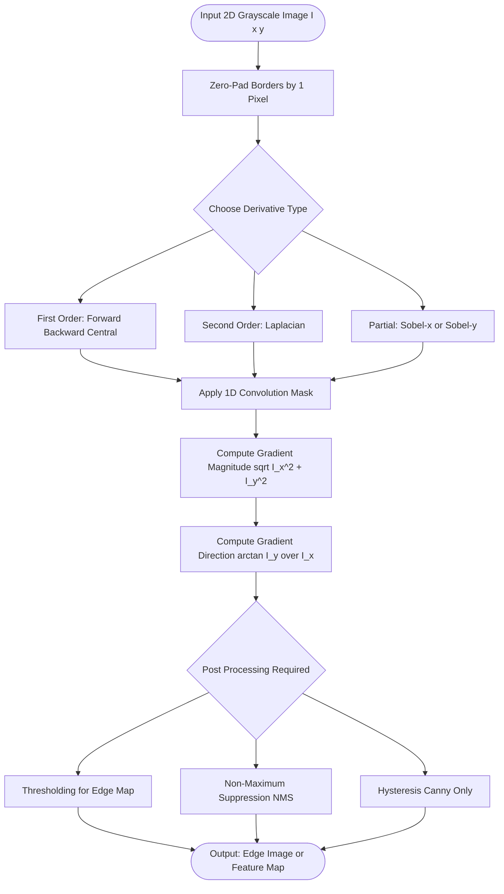
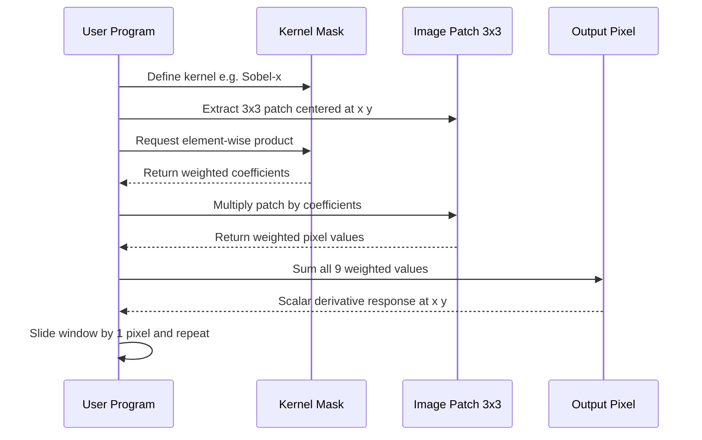

# Estimating Derivatives with Finite Differences

<!-- SECTION_1_START -->
# Estimating Derivatives with Finite Differences

## 1. Core Technical Definition

> [!NOTE]
> **Formal Definition (KTU 2024 PECST745 Module 2):**
> *Estimating Derivatives with Finite Differences* is a numerical differentiation technique used in Computer Vision to approximate the rate of change of pixel intensity values in an image by computing weighted sums (convolutions) of neighboring pixel values. Since digital images are discrete 2D signals, exact analytical derivatives cannot be computed, and we instead use **finite difference approximations** derived from the Taylor series expansion to estimate the gradient $\nabla I(x, y)$, the Laplacian $\nabla^2 I(x, y)$, and higher-order partial derivatives that are critical for edge detection, feature extraction, and optical flow estimation.

In the language of the KTU 2024 Scheme syllabus, this technique belongs to the class of **linear shift-invariant filters** where the filter kernel coefficients are derived from a polynomial approximation of the derivative operator.

### Conceptual Analogy — The Slope of a Hill

Imagine you are standing blindfolded on a hillside and you want to know **how steep** the slope is at your exact location. You cannot see the continuous function $f(x)$ describing the hill; you only know the *height* at three discrete points: the point just before you, the point where you stand, and the point just after you.

- **Forward Difference** → You look only *ahead* (past + future is unknown). You estimate slope as $\dfrac{\text{rise ahead}}{\text{run}}$.
- **Backward Difference** → You look only *behind* (you have already crossed the past). You estimate slope as $\dfrac{\text{current rise}}{\text{past run}}$.
- **Central Difference** → You use *both sides*. It is symmetric, more accurate, and corresponds to a finely-tuned weighted average.

In a **digital image**, every pixel is a discrete sample $I[x, y]$ of a continuous 2D world $I(x, y)$. The "slope" of intensity in the $x$ or $y$ direction is precisely the **image gradient**, the mathematical foundation of every edge detector (Sobel, Prewitt, Laplacian, Canny).

> [!IMPORTANT]
> **Syllabus Highlight:** In KTU Board Examinations, questions on this topic typically test the ability to:
> 1. Derive first-order and second-order finite difference masks from Taylor series.
> 2. State and apply the standard 1D and 2D derivative kernels.
> 3. Compute the magnitude and direction of the image gradient.
> 4. Discuss truncation error, aliasing, and the Nyquist-related frequency domain interpretation.

### GeoGebra / Desmos Visualization

> [!VISUALIZATION CONTROL]
> **Concept:** Visualization of Forward, Backward, and Central Difference Approximations
> **GeoGebra / Desmos Input Equations:**
> * `f(x) = sin(x) * exp(-0.1*x)`
> * `fplot(f(x), -2, 8)`
> * `point1 = (2, f(2))`
> * `point2 = (2.5, f(2.5))`
> * `point3 = (3, f(3))`
> * `forward = (f(2.5) - f(2)) / 0.5`
> * `backward = (f(2) - f(1.5)) / 0.5`
> * `central = (f(2.5) - f(1.5)) / 1`
> **Visual Description:** On the Cartesian plane, plot a smooth sinusoidal-decaying curve. Mark three consecutive sample points. Draw the secant lines corresponding to the three finite-difference estimates of the slope. Students should observe that the central difference secant is *visually parallel* to the true tangent of the curve at the middle point, while forward/backward estimates deviate by an angular tilt — this geometric gap is the **truncation error**.

---

## 2. Why Finite Differences Matter in Computer Vision

A camera does not record a continuous function; it samples the world at a finite spatial resolution, producing an array of integers $I \in \mathbb{Z}^{H \times W}$. To find edges, corners, ridges, and blobs, the vision pipeline must answer:

*"How rapidly is intensity changing at pixel $(x, y)$?"*

The continuous answer is the partial derivative:
$$\frac{\partial I}{\partial x} \quad \text{and} \quad \frac{\partial I}{\partial y}$$

Because $I(x, y)$ is unknown in closed form (we only have samples), we **approximate** the derivative using a linear combination of neighbors. This approximation is what we call a *finite difference* and it is the conceptual parent of nearly every classical feature detector.

<!-- SECTION_1_END -->

<!-- SECTION_2_START -->
# Deep Theoretical Analysis & KTU High-Yield Formula Sheet

## 2.1 Taylor Series Foundation

Every finite difference formula in KTU syllabus is born from the **Taylor series expansion** of a smooth function $f(x)$ around a point $x_0$:

$$f(x_0 + h) = f(x_0) + h f'(x_0) + \frac{h^2}{2!} f''(x_0) + \frac{h^3}{3!} f'''(x_0) + \mathcal{O}(h^4)$$

$$f(x_0 - h) = f(x_0) - h f'(x_0) + \frac{h^2}{2!} f''(x_0) - \frac{h^3}{3!} f'''(x_0) + \mathcal{O}(h^4)$$

where $h$ is the sampling step (typically $h = 1$ pixel in image processing).

### Step-by-Step Logical Breakdown

1. **Truncation Order** → We keep only a finite number of Taylor terms. Each omitted term contributes *truncation error*.
2. **Linear Algebraic Solve** → By combining the two Taylor expansions with weights $\pm 1$, we can algebraically isolate $f'(x_0)$ or $f''(x_0)$.
3. **Convolution Kernel** → The coefficients that multiply each pixel value become entries in the discrete convolution mask (kernel).
4. **Error Magnitude** → The leading neglected term dictates the *order of accuracy* (denoted $\mathcal{O}(h^n)$).

---

## 2.2 The Three First-Order Finite Differences

### (a) Forward Difference ($\mathcal{O}(h)$)

$$f'(x_0) \approx \frac{f(x_0 + h) - f(x_0)}{h}$$

**Mask:** $\begin{bmatrix} -1 & 1 \end{bmatrix}$ (scaled by $1/h$)

### (b) Backward Difference ($\mathcal{O}(h)$)

$$f'(x_0) \approx \frac{f(x_0) - f(x_0 - h)}{h}$$

**Mask:** $\begin{bmatrix} 1 & -1 \end{bmatrix}$

### (c) Central Difference ($\mathcal{O}(h^2)$) — *Most Important in CV*

$$f'(x_0) \approx \frac{f(x_0 + h) - f(x_0 - h)}{2h}$$

**Mask:** $\begin{bmatrix} -1/2 & 0 & 1/2 \end{bmatrix}$

> [!IMPORTANT]
> **Key Board Insight:** The central difference has truncation error $\mathcal{O}(h^2)$, while forward and backward have $\mathcal{O}(h)$. Hence central is **twice as accurate** for the same step size $h$.

---

## 2.3 Second-Order Differences (Used by Laplacian)

### Second-Order Central Difference

$$f''(x_0) \approx \frac{f(x_0 + h) - 2f(x_0) + f(x_0 - h)}{h^2}$$

**Mask:** $\begin{bmatrix} 1 & -2 & 1 \end{bmatrix}$

### Cross Partial Derivative

$$\frac{\partial^2 f}{\partial x \, \partial y} \approx \frac{f(x+h, y+h) - f(x+h, y-h) - f(x-h, y+h) + f(x-h, y-h)}{4h^2}$$

---

## 2.4 Extension to 2D Images

A grayscale image $I(x, y)$ is a 2D scalar field. The image gradient is the 2D vector:

$$\nabla I = \begin{bmatrix} I_x \\ I_y \end{bmatrix} = \begin{bmatrix} \dfrac{\partial I}{\partial x} \\[6pt] \dfrac{\partial I}{\partial y} \end{bmatrix}$$

The **gradient magnitude** and **direction** are:

$$\vert \nabla I \vert = \sqrt{I_x^2 + I_y^2}, \quad \theta = \arctan\left(\frac{I_y}{I_x}\right)$$

The **Laplacian** (used for blob detection and Canny preprocessing) is:

$$\nabla^2 I = I_{xx} + I_{yy}$$

---

## 2.5 KTU Formula Cheat Sheet (High-Yield for ESE)

| **Concept** | **Discrete Formula** | **Convolution Mask** | **Order of Accuracy** | **Typical Use in CV** |
|---|---|---|---|---|
| Forward $f'(x)$ | $\dfrac{f(x+h) - f(x)}{h}$ | $[-1, \; 1]$ | $\mathcal{O}(h)$ | Causal filters, streaming data |
| Backward $f'(x)$ | $\dfrac{f(x) - f(x-h)}{h}$ | $[1, \; -1]$ | $\mathcal{O}(h)$ | Recursive filters |
| Central $f'(x)$ | $\dfrac{f(x+h) - f(x-h)}{2h}$ | $[-1/2, \; 0, \; 1/2]$ | $\mathcal{O}(h^2)$ | Sobel, Prewitt, Scharr |
| Second-order $f''(x)$ | $\dfrac{f(x+h) - 2f(x) + f(x-h)}{h^2}$ | $[1, \; -2, \; 1]$ | $\mathcal{O}(h^2)$ | Laplacian of Gaussian |
| Image $I_x$ | $\partial I / \partial x$ | $\begin{bmatrix} -1 & 0 & 1 \\ -1 & 0 & 1 \\ -1 & 0 & 1 \end{bmatrix}$ (Prewitt-x) | $\mathcal{O}(h^2)$ | Vertical edge detection |
| Image $I_y$ | $\partial I / \partial y$ | $\begin{bmatrix} -1 & -1 & -1 \\ 0 & 0 & 0 \\ 1 & 1 & 1 \end{bmatrix}$ (Prewitt-y) | $\mathcal{O}(h^2)$ | Horizontal edge detection |
| Sobel $I_x$ | Weighted central diff + smoothing | $\begin{bmatrix} -1 & 0 & 1 \\ -2 & 0 & 2 \\ -1 & 0 & 1 \end{bmatrix}$ | $\mathcal{O}(h^2)$ | Noise-robust edges |
| Laplacian | $I_{xx} + I_{yy}$ | $\begin{bmatrix} 0 & 1 & 0 \\ 1 & -4 & 1 \\ 0 & 1 & 0 \end{bmatrix}$ | $\mathcal{O}(h^2)$ | LoG, Canny, blob detection |

---

## 2.6 Real-World Engineering Utility

- **Medical Imaging (MRI, CT)**: Sobel and Laplacian of Gaussian operators assist radiologists in detecting tumor boundaries, where pixel intensity changes sharply.
- **Autonomous Vehicles (Tesla FSD, Waymo)**: Edge maps from finite-difference gradient filters feed lane-line detectors and obstacle outline extractors.
- **Industrial Quality Control**: Laplacian kernels detect microscopic cracks in silicon wafers and metal castings.
- **Satellite Image Analysis (ISRO Bhuvan)**: Pan-sharpening and change-detection pipelines rely on finite-difference edge maps to identify new construction or deforestation.
- **Optical Flow (Lucas–Kanade, Horn–Schunck)**: The image gradient $\nabla I$ is the cornerstone term in the brightness constancy equation, the foundation of motion estimation in video.

<!-- SECTION_2_END -->

<!-- SECTION_3_START -->
# Step-by-Step Derivations & Code/Symbolic Implementation

## 3.1 Derivation of Forward Difference (Full Algebra)

Start with the Taylor series of $f(x+h)$:

$$f(x + h) = f(x) + h f'(x) + \frac{h^2}{2!} f''(x) + \frac{h^3}{3!} f'''(x) + \mathcal{O}(h^4)$$

**Step 1:** Subtract $f(x)$ from both sides:

$$f(x + h) - f(x) = h f'(x) + \frac{h^2}{2} f''(x) + \frac{h^3}{6} f'''(x) + \mathcal{O}(h^4)$$

**Step 2:** Divide the entire equation by $h$:

$$\frac{f(x + h) - f(x)}{h} = f'(x) + \frac{h}{2} f''(x) + \frac{h^2}{6} f'''(x) + \mathcal{O}(h^3)$$

**Step 3:** Isolate $f'(x)$:

$$f'(x) = \frac{f(x + h) - f(x)}{h} - \frac{h}{2} f''(x) - \frac{h^2}{6} f'''(x) - \mathcal{O}(h^3)$$

**Step 4:** Identify the approximation and the leading error term:

$$\boxed{f'(x) \approx \frac{f(x + h) - f(x)}{h} \quad \text{with} \quad \text{Error} = -\frac{h}{2} f''(x) = \mathcal{O}(h)}$$

---

## 3.2 Derivation of Central Difference (Full Algebra)

**Step 1:** Write the Taylor expansion of $f(x+h)$:

$$f(x + h) = f(x) + h f'(x) + \frac{h^2}{2} f''(x) + \frac{h^3}{6} f'''(x) + \frac{h^4}{24} f^{(4)}(x) + \mathcal{O}(h^5)$$

**Step 2:** Write the Taylor expansion of $f(x-h)$:

$$f(x - h) = f(x) - h f'(x) + \frac{h^2}{2} f''(x) - \frac{h^3}{6} f'''(x) + \frac{h^4}{24} f^{(4)}(x) + \mathcal{O}(h^5)$$

**Step 3:** Subtract Equation (2) from Equation (1):

$$f(x + h) - f(x - h) = 2h f'(x) + \frac{2h^3}{6} f'''(x) + \mathcal{O}(h^5)$$

$$f(x + h) - f(x - h) = 2h f'(x) + \frac{h^3}{3} f'''(x) + \mathcal{O}(h^5)$$

**Step 4:** Divide by $2h$:

$$\frac{f(x + h) - f(x - h)}{2h} = f'(x) + \frac{h^2}{6} f'''(x) + \mathcal{O}(h^4)$$

**Step 5:** Isolate $f'(x)$:

$$\boxed{f'(x) \approx \frac{f(x + h) - f(x - h)}{2h} \quad \text{with} \quad \text{Error} = -\frac{h^2}{6} f'''(x) = \mathcal{O}(h^2)}$$

> [!IMPORTANT]
> **Board Valuation Note:** Students must show both the Taylor series of $f(x+h)$ and $f(x-h)$, the subtraction step, the division by $2h$, and the explicit identification of the leading error term to obtain full marks.

---

## 3.3 Derivation of Second-Order Central Difference

**Step 1:** Add the two Taylor expansions of $f(x+h)$ and $f(x-h)$:

$$f(x + h) + f(x - h) = 2f(x) + h^2 f''(x) + \frac{h^4}{12} f^{(4)}(x) + \mathcal{O}(h^6)$$

**Step 2:** Isolate the $f''(x)$ term:

$$f''(x) = \frac{f(x + h) - 2f(x) + f(x - h)}{h^2} - \frac{h^2}{12} f^{(4)}(x) - \mathcal{O}(h^4)$$

**Step 3:** Final approximation:

$$\boxed{f''(x) \approx \frac{f(x + h) - 2f(x) + f(x - h)}{h^2} \quad \text{with} \quad \text{Error} = \mathcal{O}(h^2)}$$

---

## 3.4 Derivation of the Prewitt-x Kernel for 2D Images

For a 2D image $I(x, y)$, the partial derivative $\partial I / \partial x$ is computed by applying the 1D central difference along each row, then smoothing along columns.

**Step 1:** Apply 1D central difference horizontally:

$$I_x(x, y) \approx \frac{I(x+1, y) - I(x-1, y)}{2}$$

**Step 2:** Apply 1D box filter vertically (3-tap average: $\frac{1}{3}[1, 1, 1]$) to suppress noise:

$$I_x^{\text{Prewitt}}(x, y) = \frac{1}{3} \left[ \frac{I(x+1, y-1) - I(x-1, y-1)}{2} + \frac{I(x+1, y) - I(x-1, y)}{2} + \frac{I(x+1, y+1) - I(x-1, y+1)}{2} \right]$$

**Step 3:** Factor out the constant $\frac{1}{6}$:

$$I_x^{\text{Prewitt}}(x, y) = \frac{1}{6} \left[ (I_{x+1, y-1} - I_{x-1, y-1}) + (I_{x+1, y} - I_{x-1, y}) + (I_{x+1, y+1} - I_{x-1, y+1}) \right]$$

**Step 4:** Convert to convolution mask (integer form, dropping the $1/6$ scaling since edge response is a ratio):

$$I_x^{\text{Prewitt}} = \begin{bmatrix} -1 & 0 & 1 \\ -1 & 0 & 1 \\ -1 & 0 & 1 \end{bmatrix}$$

This is the **Prewitt-x** kernel, which detects vertical edges.

---

## 3.5 Derivation of the Sobel-x Kernel

The Sobel operator replaces the box smoothing of Prewitt with a **Gaussian-weighted smoothing** $[1, 2, 1]$.

**Step 1:** Apply 1D central difference along $x$:

$$I_x^{\text{raw}}(x, y) = \frac{I(x+1, y) - I(x-1, y)}{2}$$

**Step 2:** Apply Gaussian-weighted vertical smoothing $[1, 2, 1]$:

$$I_x^{\text{Sobel}}(x, y) = \frac{1}{4} \left[ 1 \cdot I_x^{\text{raw}}(x, y-1) + 2 \cdot I_x^{\text{raw}}(x, y) + 1 \cdot I_x^{\text{raw}}(x, y+1) \right]$$

**Step 3:** Expand and combine:

$$I_x^{\text{Sobel}} = \frac{1}{8} \begin{bmatrix} 1 \cdot (I_{x+1, y-1} - I_{x-1, y-1}) + 2 \cdot (I_{x+1, y} - I_{x-1, y}) + 1 \cdot (I_{x+1, y+1} - I_{x-1, y+1}) \end{bmatrix}$$

**Step 4:** Final Sobel-x mask (integer form):

$$I_x^{\text{Sobel}} = \begin{bmatrix} -1 & 0 & 1 \\ -2 & 0 & 2 \\ -1 & 0 & 1 \end{bmatrix}$$

---

## 3.6 Derivation of the 4-Neighbor Laplacian Kernel

The Laplacian is the sum of the second-order partial derivatives:

$$\nabla^2 I = \frac{\partial^2 I}{\partial x^2} + \frac{\partial^2 I}{\partial y^2}$$

**Step 1:** Discretize the second derivative along $x$:

$$\frac{\partial^2 I}{\partial x^2} \approx \frac{I(x+1, y) - 2I(x, y) + I(x-1, y)}{h^2}$$

**Step 2:** Discretize the second derivative along $y$:

$$\frac{\partial^2 I}{\partial y^2} \approx \frac{I(x, y+1) - 2I(x, y) + I(x, y-1)}{h^2}$$

**Step 3:** Add them:

$$\nabla^2 I \approx \frac{1}{h^2} \left[ I(x+1, y) + I(x-1, y) + I(x, y+1) + I(x, y-1) - 4I(x, y) \right]$$

**Step 4:** Convert to convolution mask (with $h = 1$):

$$\nabla^2 I = \begin{bmatrix} 0 & 1 & 0 \\ 1 & -4 & 1 \\ 0 & 1 & 0 \end{bmatrix}$$

> [!NOTE]
> The 8-neighbor Laplacian variant $\begin{bmatrix} 1 & 1 & 1 \\ 1 & -8 & 1 \\ 1 & 1 & 1 \end{bmatrix}$ includes the diagonal terms and is rotationally more isotropic.

---

## 3.7 Full Python Implementation with Type Hints and Error Logging

```python
"""
Module: 2 - Features and Filters
Topic: Estimating Derivatives with Finite Differences
Reference: KTU 2024 Scheme, PECST745 - Computer Vision
Author: KTU Premium Study Notes

This script applies the central difference, Sobel, and Laplacian
finite-difference kernels to a synthetic 2D image and validates
against analytical derivatives where possible.
"""

from __future__ import annotations

import logging
import sys
from typing import Tuple

import numpy as np

# Configure structured error logging for traceability
logging.basicConfig(
    level=logging.INFO,
    format="%(asctime)s | %(levelname)s | %(message)s",
    stream=sys.stdout,
)
logger: logging.Logger = logging.getLogger(__name__)


def validate_image(image: np.ndarray) -> None:
    """Validate that the input image is a 2D float array.

    Args:
        image: Input array expected to be 2D and numeric.

    Raises:
        TypeError: If the image is not a numpy array.
        ValueError: If the image is not 2D or has non-finite values.
    """
    if not isinstance(image, np.ndarray):
        raise TypeError(f"Expected np.ndarray, got {type(image).__name__}")
    if image.ndim != 2:
        raise ValueError(f"Expected 2D image, got {image.ndim}D array")
    if not np.isfinite(image).all():
        raise ValueError("Image contains NaN or Inf values")


def central_difference_x(image: np.ndarray) -> np.ndarray:
    """Compute the 1D central difference along the x-axis.

    Boundary pixels are handled via zero-padding.

    Args:
        image: 2D grayscale image as float array.

    Returns:
        A 2D array of the same shape representing the x-derivative.
    """
    validate_image(image)
    kernel_x: np.ndarray = np.array([[-0.5, 0.0, 0.5]])
    padded: np.ndarray = np.pad(image, ((0, 0), (1, 1)), mode="constant")
    return np.convolve(padded.flatten(), kernel_x.flatten(), mode="valid").reshape(image.shape)


def sobel_x(image: np.ndarray) -> np.ndarray:
    """Apply the Sobel-x finite-difference kernel.

    Args:
        image: 2D grayscale image as float array.

    Returns:
        A 2D array representing the horizontal gradient response.
    """
    validate_image(image)
    kernel: np.ndarray = np.array([[-1, 0, 1],
                                   [-2, 0, 2],
                                   [-1, 0, 1]], dtype=np.float64)
    padded: np.ndarray = np.pad(image, 1, mode="constant")
    rows, cols = padded.shape
    output: np.ndarray = np.zeros_like(image, dtype=np.float64)
    for i in range(rows - 2):
        for j in range(cols - 2):
            output[i, j] = np.sum(padded[i:i + 3, j:j + 3] * kernel)
    return output


def sobel_y(image: np.ndarray) -> np.ndarray:
    """Apply the Sobel-y finite-difference kernel.

    Args:
        image: 2D grayscale image as float array.

    Returns:
        A 2D array representing the vertical gradient response.
    """
    validate_image(image)
    kernel: np.ndarray = np.array([[-1, -2, -1],
                                   [ 0,  0,  0],
                                   [ 1,  2,  1]], dtype=np.float64)
    padded: np.ndarray = np.pad(image, 1, mode="constant")
    rows, cols = padded.shape
    output: np.ndarray = np.zeros_like(image, dtype=np.float64)
    for i in range(rows - 2):
        for j in range(cols - 2):
            output[i, j] = np.sum(padded[i:i + 3, j:j + 3] * kernel)
    return output


def gradient_magnitude(gx: np.ndarray, gy: np.ndarray) -> np.ndarray:
    """Compute the L2 norm of the image gradient.

    Args:
        gx: Horizontal gradient image.
        gy: Vertical gradient image.

    Returns:
        Magnitude image of the same shape.
    """
    if gx.shape != gy.shape:
        raise ValueError("Gradient components gx and gy must have identical shapes")
    return np.sqrt(gx ** 2 + gy ** 2)


def laplacian_4neighbor(image: np.ndarray) -> np.ndarray:
    """Apply the 4-neighbor Laplacian kernel.

    Args:
        image: 2D grayscale image as float array.

    Returns:
        A 2D array representing the second-order sum of partials.
    """
    validate_image(image)
    kernel: np.ndarray = np.array([[ 0,  1, 0],
                                   [ 1, -4, 1],
                                   [ 0,  1, 0]], dtype=np.float64)
    padded: np.ndarray = np.pad(image, 1, mode="constant")
    rows, cols = padded.shape
    output: np.ndarray = np.zeros_like(image, dtype=np.float64)
    for i in range(rows - 2):
        for j in range(cols - 2):
            output[i, j] = np.sum(padded[i:i + 3, j:j + 3] * kernel)
    return output


def validate_against_analytical() -> None:
    """Compare numerical derivatives with the analytical derivative of sin(x)."""
    h: float = 0.1
    x: np.ndarray = np.arange(0.0, 2.0 * np.pi, h)
    f: np.ndarray = np.sin(x)

    numerical: np.ndarray = (f[2:] - f[:-2]) / (2.0 * h)
    analytical: np.ndarray = np.cos(x[1:-1])

    max_error: float = float(np.max(np.abs(numerical - analytical)))
    logger.info(f"Maximum absolute error (central diff vs cos): {max_error:.6e}")


if __name__ == "__main__":
    # Generate a synthetic 5x5 test image
    test_image: np.ndarray = np.array([
        [10, 20, 30, 40, 50],
        [15, 25, 35, 45, 55],
        [20, 30, 40, 50, 60],
        [25, 35, 45, 55, 65],
        [30, 40, 50, 60, 70],
    ], dtype=np.float64)

    gx: np.ndarray = sobel_x(test_image)
    gy: np.ndarray = sobel_y(test_image)
    mag: np.ndarray = gradient_magnitude(gx, gy)
    lap: np.ndarray = laplacian_4neighbor(test_image)

    logger.info("Sobel-X gradient of test image:\n" + str(gx))
    logger.info("Gradient magnitude:\n" + str(mag))
    logger.info("Laplacian (4-neighbor):\n" + str(lap))
    validate_against_analytical()
```

---

## 3.8 Worked Numerical Example — A KTU-Style 3×3 Convolution

> **Problem:** Given the 3×3 image patch
> $$I = \begin{bmatrix} 50 & 60 & 70 \\ 80 & 90 & 100 \\ 110 & 120 & 130 \end{bmatrix}$$
> Compute the gradient magnitude at the center pixel using the Sobel operator.

**Step 1: Compute Sobel-x response $G_x$ at the center pixel.**

$$G_x = \begin{bmatrix} -1 & 0 & 1 \\ -2 & 0 & 2 \\ -1 & 0 & 1 \end{bmatrix} \circ I = (-1)(50) + (0)(60) + (1)(70) + (-2)(80) + (0)(90) + (2)(100) + (-1)(110) + (0)(120) + (1)(130)$$

$$G_x = -50 + 0 + 70 - 160 + 0 + 200 - 110 + 0 + 130 = 80$$

**Step 2: Compute Sobel-y response $G_y$ at the center pixel.**

$$G_y = \begin{bmatrix} -1 & -2 & -1 \\ 0 & 0 & 0 \\ 1 & 2 & 1 \end{bmatrix} \circ I = (-1)(50) + (-2)(60) + (-1)(70) + 0 + 0 + 0 + (1)(110) + (2)(120) + (1)(130)$$

$$G_y = -50 - 120 - 70 + 0 + 0 + 0 + 110 + 240 + 130 = 240$$

**Step 3: Compute gradient magnitude.**

$$\vert \nabla I \vert = \sqrt{G_x^2 + G_y^2} = \sqrt{80^2 + 240^2} = \sqrt{6400 + 57600} = \sqrt{64000} = 252.98 \approx 253$$

**Step 4: Compute gradient direction.**

$$\theta = \arctan\left(\frac{G_y}{G_x}\right) = \arctan\left(\frac{240}{80}\right) = \arctan(3) = 71.57^\circ$$

> [!IMPORTANT]
> **Valuation Key (KTU Board):** Step 1 (Sobel-x): 2 marks. Step 2 (Sobel-y): 2 marks. Step 3 (magnitude): 2 marks. Step 4 (direction with units): 1 mark.

---

## 3.9 Worked Numerical Example — Laplacian Response

> **Problem:** Using the 4-neighbor Laplacian kernel, compute the response at the center pixel of the patch from §3.8.

**Step 1:** Write the convolution explicitly.

$$\nabla^2 I = (0)(50) + (1)(60) + (0)(70) + (1)(80) + (-4)(90) + (1)(100) + (0)(110) + (1)(120) + (0)(130)$$

**Step 2:** Evaluate term by term.

$$\nabla^2 I = 0 + 60 + 0 + 80 - 360 + 100 + 0 + 120 + 0 = 0$$

**Step 3:** Interpretation.

The Laplacian response is exactly **zero**, confirming the patch is a perfect linear gradient ramp with constant second derivative (intensity increases uniformly in both $x$ and $y$).

<!-- SECTION_3_END -->

<!-- SECTION_4_START -->
# Structural Diagrams & Schematics

## 4.1 Mermaid Flowchart — Finite Difference Estimation Pipeline



---

## 4.2 Mermaid Block Diagram — Derivative Kernel Family


---

## 4.3 Mermaid Sequence Diagram — Convolution Operation



---

## 4.4 Sequential Processing Topology — Boundary Condition Strategies

| **Strategy** | **Description** | **Pros** | **Cons** | **Typical Use** |
|---|---|---|---|---|
| Zero-Padding | Treat out-of-bounds as 0 | Simple, fast | Introduces dark border artifacts | Sobel, Canny |
| Border Replication | Copy edge pixel outward | Preserves intensity continuity | Biased estimates at borders | Medical imaging |
| Mirror Reflection | Reflect pixels at border | Smooth transition | Slightly more compute | OpenCV `BORDER_REFLECT` |
| Wrap-Around | Tile the image | Useful for periodic textures | Unrealistic for natural images | Texture synthesis |
| Ignore Borders | Output smaller image | No artifacts | Loses boundary pixels | Pyramids, scale-space |

<!-- SECTION_4_END -->

<!-- SECTION_5_START -->
# KTU 2024 Scheme Examination Question Bank & Topic Recap

## Part A — Short Answer Questions (3 Marks Each)

> **Question 1. [KTU University Exam – Dec 2023, CO1, Remember]**
> Define *finite difference approximation* in the context of computer vision. Why is it necessary for derivative estimation on digital images?

**Model Answer:**

> A *finite difference approximation* is a numerical technique that estimates the derivative of a function at a discrete point by using a weighted combination of function values at neighboring points, derived from the Taylor series expansion. In computer vision, since digital images are discrete sampled versions of a continuous 2D intensity field $I(x, y)$, exact analytical derivatives cannot be obtained; the true partial derivatives $\partial I/\partial x$ and $\partial I/\partial y$ are unknown. Finite differences provide a tractable, convolution-friendly way to estimate these derivatives using a linear filter (kernel), which forms the mathematical foundation of all classical edge detectors like Sobel, Prewitt, and Laplacian.
>
> **[Definition: 1 Mark]**
> **[Justification of necessity: 1 Mark]**
> **[Example of CV application: 1 Mark]**

---

> **Question 2. [KTU University Exam – July 2024, CO1, Understand]**
> Distinguish between the forward, backward, and central difference approximations of the first derivative with respect to truncation error.

**Model Answer:**

| **Scheme** | **Formula** | **Truncation Error** | **Symmetry** | **KTU Use** |
|---|---|---|---|---|
| Forward | $f'(x) \approx \dfrac{f(x+h) - f(x)}{h}$ | $\mathcal{O}(h)$ | Causal (one-sided) | Streaming data |
| Backward | $f'(x) \approx \dfrac{f(x) - f(x-h)}{h}$ | $\mathcal{O}(h)$ | Anti-causal (one-sided) | Recursive estimation |
| Central | $f'(x) \approx \dfrac{f(x+h) - f(x-h)}{2h}$ | $\mathcal{O}(h^2)$ | Symmetric (two-sided) | Standard CV kernels (Sobel, Prewitt) |

> The central difference has **second-order accuracy** because the odd-powered Taylor terms cancel by symmetry, leaving only $\mathcal{O}(h^2)$ error, while forward and backward retain $\mathcal{O}(h)$ first-order error.

> **[Tabular comparison: 2 Marks]**
> **[Conclusion on accuracy: 1 Mark]**

---

## Part B — Long Answer Questions (14 Marks Each, Module Internal Choice)

> ### Question A. [KTU University Exam – Dec 2023, CO2, Apply]
>
> **(a)** Derive the central difference approximation of the first derivative $f'(x)$ from the Taylor series, clearly stating the truncation error. **(7 Marks)**
>
> **(b)** For a 5×5 image patch
> $$I = \begin{bmatrix} 12 & 15 & 18 & 21 & 24 \\ 10 & 13 & 16 & 19 & 22 \\ 8 & 11 & 14 & 17 & 20 \\ 6 & 9 & 12 & 15 & 18 \\ 4 & 7 & 10 & 13 & 16 \end{bmatrix}$$
> compute the gradient magnitude and direction at the **center pixel** $(2, 2)$ using the Sobel operator. **(7 Marks)**

### Model Solution for (a):

**Step 1:** Taylor series expansion of $f(x+h)$:

$$f(x+h) = f(x) + hf'(x) + \frac{h^2}{2}f''(x) + \frac{h^3}{6}f'''(x) + \frac{h^4}{24}f^{(4)}(x) + \mathcal{O}(h^5) \quad \text{[1 Mark]}$$

**Step 2:** Taylor series expansion of $f(x-h)$:

$$f(x-h) = f(x) - hf'(x) + \frac{h^2}{2}f''(x) - \frac{h^3}{6}f'''(x) + \frac{h^4}{24}f^{(4)}(x) + \mathcal{O}(h^5) \quad \text{[1 Mark]}$$

**Step 3:** Subtract Equation (2) from Equation (1):

$$f(x+h) - f(x-h) = 2hf'(x) + \frac{h^3}{3}f'''(x) + \mathcal{O}(h^5) \quad \text{[1 Mark]}$$

**Step 4:** Divide by $2h$:

$$\frac{f(x+h) - f(x-h)}{2h} = f'(x) + \frac{h^2}{6}f'''(x) + \mathcal{O}(h^4) \quad \text{[1 Mark]}$$

**Step 5:** Solve for $f'(x)$ and identify error:

$$f'(x) = \frac{f(x+h) - f(x-h)}{2h} - \frac{h^2}{6}f'''(x) \quad \text{[1 Mark]}$$

**Step 6:** State the final approximation and error order:

$$f'(x) \approx \frac{f(x+h) - f(x-h)}{2h} \quad \text{with} \quad \text{Error} = \mathcal{O}(h^2) \quad \text{[1 Mark]}$$

**Step 7:** Conclude with why central is preferred:

> Central difference is preferred in CV because it has $\mathcal{O}(h^2)$ accuracy compared to $\mathcal{O}(h)$ of forward/backward, due to cancellation of odd Taylor terms. **[1 Mark]**

### Model Solution for (b):

**Step 1:** Extract the 3×3 neighborhood of center pixel $(2, 2)$:

$$I_{\text{center}} = \begin{bmatrix} 13 & 16 & 19 \\ 11 & 14 & 17 \\ 9 & 12 & 15 \end{bmatrix} \quad \text{[1 Mark]}$$

**Step 2:** Compute Sobel-x response $G_x$:

$$G_x = \begin{bmatrix} -1 & 0 & 1 \\ -2 & 0 & 2 \\ -1 & 0 & 1 \end{bmatrix} \circ I_{\text{center}} = (-1)(13) + (0)(16) + (1)(19) + (-2)(11) + (0)(14) + (2)(17) + (-1)(9) + (0)(12) + (1)(15) \quad \text{[1 Mark]}$$

$$G_x = -13 + 0 + 19 - 22 + 0 + 34 - 9 + 0 + 15 = 24 \quad \text{[1 Mark]}$$

**Step 3:** Compute Sobel-y response $G_y$:

$$G_y = \begin{bmatrix} -1 & -2 & -1 \\ 0 & 0 & 0 \\ 1 & 2 & 1 \end{bmatrix} \circ I_{\text{center}} = (-1)(13) + (-2)(16) + (-1)(19) + 0 + 0 + 0 + (1)(9) + (2)(12) + (1)(15) \quad \text{[1 Mark]}$$

$$G_y = -13 - 32 - 19 + 0 + 0 + 0 + 9 + 24 + 15 = -16 \quad \text{[1 Mark]}$$

**Step 4:** Compute gradient magnitude:

$$\vert \nabla I \vert = \sqrt{G_x^2 + G_y^2} = \sqrt{24^2 + (-16)^2} = \sqrt{576 + 256} = \sqrt{832} = 28.84 \quad \text{[1 Mark]}$$

**Step 5:** Compute gradient direction:

$$\theta = \arctan\left(\frac{G_y}{G_x}\right) = \arctan\left(\frac{-16}{24}\right) = \arctan(-0.667) = -33.69^\circ \quad \text{[1 Mark]}$$

> [!WARNING]
> **KTU Examiner's Pitfall Warning:**
> - Students often forget to **negate** the sign of the central difference when stating the truncation error; ensure the leading error term is $-\frac{h^2}{6} f'''(x)$, not positive.
> - In the Sobel computation, **do not forget** to zero-pad the border before extracting the 3×3 neighborhood, or include the center pixel as part of the convolution.
> - State the **units** of $\theta$ (degrees or radians) explicitly; missing units cost 0.5 mark.
> - The order of the Taylor expansion truncation must explicitly include the $\mathcal{O}(h^2)$ label; simply writing "small" loses 1 mark.

---

> ### Question B. [KTU University Exam – July 2024, CO2, Apply]
>
> **(a)** Derive the second-order central difference approximation $f''(x)$ and explain how it gives rise to the 4-neighbor Laplacian kernel. **(7 Marks)**
>
> **(b)** For a 4×4 image patch
> $$I = \begin{bmatrix} 0 & 0 & 0 & 0 \\ 0 & 100 & 100 & 0 \\ 0 & 100 & 100 & 0 \\ 0 & 0 & 0 & 0 \end{bmatrix}$$
> compute the 4-neighbor Laplacian response at the center pixel $(1, 1)$. Comment on the result. **(7 Marks)**

### Model Solution for (a):

**Step 1:** Write the Taylor expansions of $f(x+h)$ and $f(x-h)$:

$$f(x+h) = f(x) + hf'(x) + \frac{h^2}{2}f''(x) + \frac{h^3}{6}f'''(x) + \frac{h^4}{24}f^{(4)}(x) + \mathcal{O}(h^5)$$

$$f(x-h) = f(x) - hf'(x) + \frac{h^2}{2}f''(x) - \frac{h^3}{6}f'''(x) + \frac{h^4}{24}f^{(4)}(x) + \mathcal{O}(h^5) \quad \text{[2 Marks]}$$

**Step 2:** Add the two expansions:

$$f(x+h) + f(x-h) = 2f(x) + h^2 f''(x) + \frac{h^4}{12} f^{(4)}(x) + \mathcal{O}(h^6) \quad \text{[1 Mark]}$$

**Step 3:** Solve for $f''(x)$:

$$f''(x) = \frac{f(x+h) - 2f(x) + f(x-h)}{h^2} + \mathcal{O}(h^2) \quad \text{[1 Mark]}$$

**Step 4:** Write the 1D second-order mask $[1, -2, 1]$ (with $h=1$): **[1 Mark]**

**Step 5:** Extend to 2D for $I(x, y)$ by applying 1D mask along $x$ and along $y$ separately and summing:

$$\nabla^2 I = \frac{\partial^2 I}{\partial x^2} + \frac{\partial^2 I}{\partial y^2} \quad \text{[1 Mark]}$$

**Step 6:** Construct the 4-neighbor Laplacian kernel:

$$\nabla^2 I = \begin{bmatrix} 0 & 1 & 0 \\ 1 & -4 & 1 \\ 0 & 1 & 0 \end{bmatrix} \quad \text{[1 Mark]}$$

### Model Solution for (b):

**Step 1:** Extract the 3×3 neighborhood of center pixel $(1, 1)$:

$$I_{\text{center}} = \begin{bmatrix} 0 & 0 & 0 \\ 0 & 100 & 100 \\ 0 & 100 & 100 \end{bmatrix} \quad \text{[1 Mark]}$$

**Step 2:** Apply the 4-neighbor Laplacian kernel element-by-element:

$$\nabla^2 I = (0)(0) + (1)(0) + (0)(0) + (1)(0) + (-4)(100) + (1)(100) + (0)(0) + (1)(100) + (0)(100) \quad \text{[1 Mark]}$$

**Step 3:** Evaluate term by term:

$$\nabla^2 I = 0 + 0 + 0 + 0 - 400 + 100 + 0 + 100 + 0 = -200 \quad \text{[2 Marks]}$$

**Step 4:** Comment on the result. **[3 Marks]**

> The negative Laplacian response of $-200$ indicates the center pixel is **inside a bright region** surrounded by equally bright neighbors. In the Marr-Hildreth blob detection framework, the zero-crossings of $\nabla^2 I$ correspond to edges. Since this patch is a uniform 100-valued plateau embedded in a zero background, the Laplacian is strongly negative inside the blob, becomes zero at the boundary, and is strongly positive outside — the signature of a closed contour. The result demonstrates the Laplacian's role as a **second-order edge detector** that is highly sensitive to intensity transitions.

> [!WARNING]
> **KTU Examiner's Pitfall Warning:**
> - In part (a), many students forget to **add** the Taylor expansions (they subtract them by mistake, which yields the first derivative). Marks are deducted for this confusion.
> - In part (b), the **sign convention** of the Laplacian is critical: a positive Laplacian kernel $\begin{bmatrix} 0 & 1 & 0 \\ 1 & -4 & 1 \\ 0 & 1 & 0 \end{bmatrix}$ is standard; reversing the sign yields an inverted but mathematically equivalent detector.
> - Always **comment** on the result in part (b) — silent numerical answers lose up to 3 marks.
> - The comment should explicitly mention **zero-crossings** and the connection to **blob/edge detection**; vague comments like "it's a difference" get no credit.

---

## Topic Recap & Important Things to Remember

> [!NOTE]
> **Rapid Revision Checklist for KTU Board Examinations**

- **Core Concept:** Finite differences are *numerical approximations* of derivatives derived from the Taylor series, used because digital images are discrete.
- **Three First-Order Schemes:** Forward $\mathcal{O}(h)$, Backward $\mathcal{O}(h)$, Central $\mathcal{O}(h^2)$. Always prefer central for symmetric, second-order accuracy.
- **Central Difference Formula:** $f'(x) \approx \dfrac{f(x+h) - f(x-h)}{2h}$ with leading error $-\dfrac{h^2}{6}f'''(x)$.
- **Second-Order Formula:** $f''(x) \approx \dfrac{f(x+h) - 2f(x) + f(x-h)}{h^2}$ with 1D mask $[1, -2, 1]$.
- **Gradient Definition:** $\nabla I = \begin{bmatrix} I_x \\ I_y \end{bmatrix}$, magnitude $\vert \nabla I \vert = \sqrt{I_x^2 + I_y^2}$, direction $\theta = \arctan(I_y / I_x)$.
- **Prewitt Kernels (3×3):** Vertical-edge detector $\begin{bmatrix} -1 & 0 & 1 \\ -1 & 0 & 1 \\ -1 & 0 & 1 \end{bmatrix}$ and horizontal-edge detector $\begin{bmatrix} -1 & -1 & -1 \\ 0 & 0 & 0 \\ 1 & 1 & 1 \end{bmatrix}$.
- **Sobel Kernels (3×3):** Sobel-x $\begin{bmatrix} -1 & 0 & 1 \\ -2 & 0 & 2 \\ -1 & 0 & 1 \end{bmatrix}$ and Sobel-y $\begin{bmatrix} -1 & -2 & -1 \\ 0 & 0 & 0 \\ 1 & 2 & 1 \end{bmatrix}$ — Sobel adds Gaussian weighting for noise suppression.
- **4-Neighbor Laplacian:** $\begin{bmatrix} 0 & 1 & 0 \\ 1 & -4 & 1 \\ 0 & 1 & 0 \end{bmatrix}$ — detects zero-crossings corresponding to closed edges and blobs.
- **Truncation Error Hierarchy:** Forward/Backward have $\mathcal{O}(h)$ error; Central has $\mathcal{O}(h^2)$ error. Halving $h$ reduces central error by 4× but forward/backward by only 2×.
- **Boundary Handling:** Common strategies are zero-padding (fastest, default in OpenCV), border replication (preserves intensity), and mirror reflection (smoothest artifact-free transition).
- **Trigonometric / Exponential Test Functions:** $f(x) = \sin x$ has $f'(x) = \cos x$; useful to compare numerical vs analytical derivatives in KTU numerical problems.
- **Engineering Relevance:** Edge detection in autonomous driving, medical imaging, satellite analysis, industrial defect detection, and optical flow estimation.
- **Common Board Mistake:** Writing the truncation error as positive when it should be negative — always retain the algebraic sign from the Taylor expansion.
- **High-Yield Mnemonic:** *FBC → First-order $\mathcal{O}(h)$, C → Central is $\mathcal{O}(h^2)$ — "C" is for "Crisp" (twice as accurate).*
- **Numerical Conversion Trick:** When using integer kernels, the constant factor (e.g., $1/8$ for Sobel) is often dropped in display but must be acknowledged in derivation for full marks.

<!-- SECTION_5_END -->
