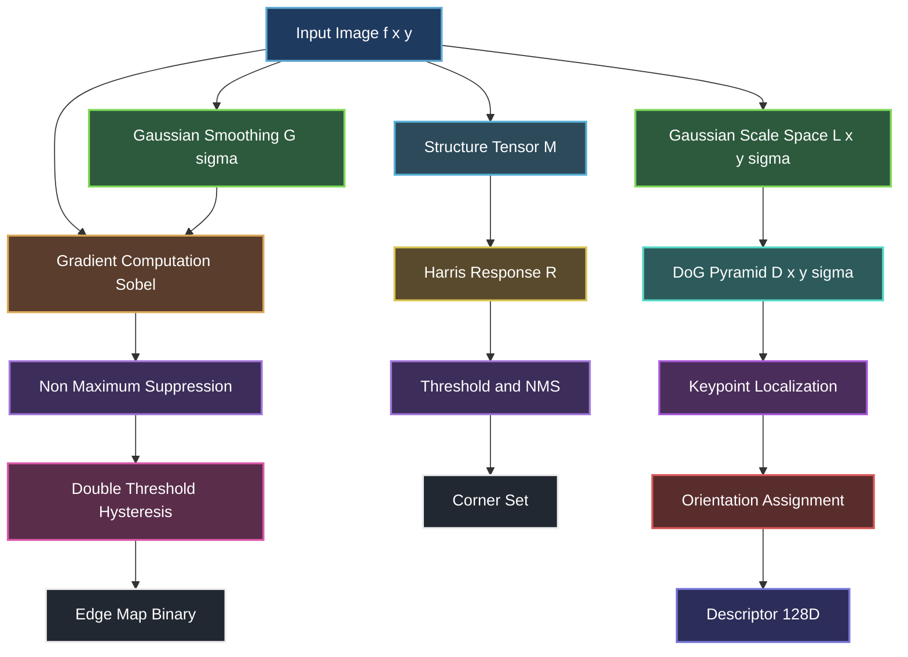
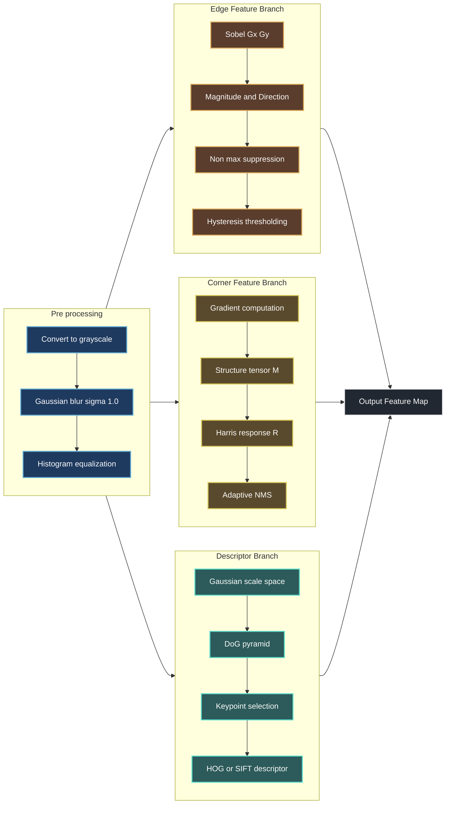
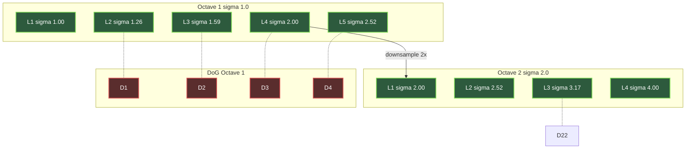

# Features and Filters :-

<!-- SECTION_1_START -->

# Features and Filters — Core Technical Definition & Intuitive Overview

## 1.1 Formal Definition (KTU 2024 Syllabus Terminology)

In the context of Computer Vision, **Features** are distinctive, locally measurable patterns or structures in an image (such as edges, corners, blobs, or texture patches) that carry semantically meaningful information and remain reasonably invariant to transformations like translation, rotation, scaling, and illumination changes. **Filters** are mathematical operators (typically kernels or masks) that are convolved with an input image to produce a transformed output image, used for tasks such as smoothing, sharpening, edge extraction, and feature enhancement.

> [!IMPORTANT]
> **KTU 2024 Module 2 Highlight:** A *feature* is the *output* of a *filter* applied to an image. Filters are the **mechanism**, features are the **measurable result**. This distinction is a frequent 3-mark question.

> [!NOTE]
> **Image Filter — Formal Definition:** A 2D discrete filter $h[m,n]$ of size $(2a+1) \times (2b+1)$ produces an output $g[m,n]$ from input $f[m,n]$ via discrete 2D convolution:
> $$g[m,n] = (f * h)[m,n] = \sum_{k=-a}^{a} \sum_{l=-b}^{b} f[m-k, n-l] \cdot h[k,l]$$
> where $*$ denotes convolution and the kernel is flipped in the correlation–convolution distinction.

## 1.2 Conceptual Analogy / Intuition

**Real-world Analogy — The "Magnifying Glass with Special Lens" Metaphor:**

Imagine you are an art critic examining a painting in a museum. The **painting** is your *image*, the **critic's eyes** are your *features*, and the **special lens** held up to the painting is your *filter*. Different lenses reveal different things:

- A **blur lens** (Gaussian filter) smooths out brushstroke noise — equivalent to a low-pass filter that removes high-frequency detail.
- A **sharpening lens** (Laplacian filter) accentuates outlines — equivalent to a high-pass filter that amplifies high-frequency edges.
- A **corner-finding lens** (Harris detector) identifies the points where brushstrokes change direction — these are *interest points* with high gradient change in two directions.

Just as no single lens tells you everything about a painting, no single filter is sufficient for vision. CV engineers stack multiple filters in **pipelines** to extract rich, multi-scale features — exactly as a CNN does, but in a hand-engineered, mathematically transparent way.

## 1.3 Standard Constants and Metrics

> [!IMPORTANT]
> **Commonly Used Kernels & Constants:**
> - **Standard deviation** of Gaussian: $\sigma$, controlling the *scale* of analysis. KTU 2024 frequently tests the **3$\sigma$ rule** (99.7% of Gaussian energy lies within $\pm 3\sigma$ pixels).
> - **Kernel size odd rule**: $k = 2 \lceil 3\sigma \rceil + 1$ to ensure a center pixel and symmetric coverage.
> - **SIFT scale-space constant**: $k = 2^{1/s}$ where $s$ is the number of scales per octave (usually $s = 3$).
> - **Canny thresholds**: High threshold $T_H$ and low threshold $T_L$ with $T_L \approx 0.4 \cdot T_H$ being a typical ratio.
> - **Harris corner response constant**: $k \in [0.04, 0.06]$ — the empirical *Harris k* parameter.
> - **Image gradient approximations**: Sobel weights are normalized by 1/8 to maintain intensity scale.

## 1.4 Visualization Control Blocks

> [!VISUALIZATION CONTROL]
> **Concept:** 1D Gaussian filter kernel shape and its 2D separable product
> **GeoGebra / Desmos Input Equations:**
> * `g(x) = (1/(sqrt(2*pi)*sigma)) * exp(-x^2/(2*sigma^2))` with `sigma = 1.5`
> * `G2(x,y) = g(x) * g(y)` for the separable 2D form
> **Visual Description:** The student should observe a smooth bell curve centered at $x=0$, symmetric about the y-axis, with the curve's *spread* widening as $\sigma$ increases. This is the *point spread function* of a Gaussian blur filter.

> [!VISUALIZATION CONTROL]
> **Concept:** Effect of Sobel filter on a step edge (gradient magnitude response)
> **GeoGebra / Desmos Input Equations:**
> * Step edge: `f(x) = 0 for x < 0, f(x) = 1 for x >= 0`
> * Sobel horizontal: `S_x(x) = derivative approximation of f(x)`
> * Gradient magnitude: `M(x) = sqrt(S_x(x)^2 + S_y(x)^2)`
> **Visual Description:** The student should see a *positive lobe* just inside the bright region and a *negative lobe* just outside, with a zero-crossing exactly at the step boundary. The peak response occurs at the discontinuity.

<!-- SECTION_1_END -->

<!-- SECTION_2_START -->

# Deep Theoretical Analysis & KTU High-Yield Formula Sheet

## 2.1 Taxonomy of Filters in Computer Vision

Computer vision filters are organized along three orthogonal axes:

1. **Linearity** — Linear (convolution-based) vs. Non-linear (median, bilateral, morphological).
2. **Frequency response** — Low-pass (smoothing), High-pass (sharpening/edges), Band-pass (DoG, LoG).
3. **Purpose** — Pre-processing (denoise), Feature extraction (edges/corners/blobs), Descriptor (HOG/SIFT).

### 2.1.1 Linear Smoothing Filters

- **Box (Mean) filter**: Uniform kernel — simple averaging, but introduces *ringing* and is *not* isotropic.
- **Gaussian filter**: Kernel weights sampled from the 2D Gaussian PDF. It is the **only** linear, shift-invariant, separable, rotationally symmetric, and *scale-space* generating filter (Koenderink's requirement, 1984).
- **Binomial filter**: Discrete approximation of the Gaussian using Pascal's triangle coefficients; useful for fast integer implementations.

### 2.1.2 Edge Detection Filters

| Filter | Order | Type | Noise Sensitivity | Orientation |
|---|---|---|---|---|
| Roberts | 1st derivative | $2 \times 2$ | High | Diagonal |
| Prewitt | 1st derivative | $3 \times 3$ | Medium | Cardinal |
| Sobel | 1st derivative | $3 \times 3$ | Low (weighted) | Cardinal |
| Laplacian | 2nd derivative | $3 \times 3$ | High | Isotropic |
| LoG | 2nd derivative | $5 \times 5$ to $31 \times 31$ | Low | Isotropic |
| DoG | Approx. of LoG | Multi-scale | Low | Isotropic |
| Canny | Multi-stage | Non-linear pipeline | Very low | Multi |

### 2.1.3 Corner & Interest Point Detectors

- **Harris Corner Detector** (1988): Based on the *second-moment matrix* (structure tensor) of image gradients. A corner produces large eigenvalues $\lambda_1, \lambda_2$ in both principal directions.
- **Shi-Tomasi** (Good Features to Track, 1994): Uses $\min(\lambda_1, \lambda_2)$ directly — better behaved for tracking.
- **Harris-Laplace / Hessian**: Scale-adapted extensions.
- **FAST** (Features from Accelerated Segment Test, 2006): Machine-learning-based, real-time corner detector.
- **SIFT** (Scale-Invariant Feature Transform, 2004): Full pipeline (DoG keypoint detection + orientation assignment + 128-D descriptor).
- **SURF** (Speeded-Up Robust Features, 2006): Approximates SIFT using integral images and Haar wavelets.
- **ORB** (Oriented FAST and Rotated BRIEF, 2011): Rotation-invariant FAST + binary BRIEF descriptor.
- **HOG** (Histogram of Oriented Gradients, 2005): Descriptor for object detection (Dalal-Triggs, used in classic pedestrian detection).

## 2.2 Step-by-Step Theoretical Framework

### Step 1 — Define the discrete filter as a kernel
A filter $h$ is a small matrix (usually odd-sized). It encodes *how much weight* each neighbor should contribute to the new center pixel.

### Step 2 — Apply via convolution or correlation
**Convolution** flips the kernel; **correlation** does not. For symmetric kernels (Gaussian, Laplacian) they coincide. CV libraries (OpenCV) actually use **correlation** for filter2D.

### Step 3 — Handle image boundaries
Strategies: zero-padding, replicate (clamp), reflect, wrap, or use valid-only regions. Default in OpenCV is *reflect-101* (`BORDER_REFLECT_101`).

### Step 4 — Compute image gradients
The gradient is the first-order spatial derivative:
$$\nabla f = \left( \frac{\partial f}{\partial x}, \frac{\partial f}{\partial y} \right)$$

Discrete approximations using Sobel:
$$\frac{\partial f}{\partial x} \approx \frac{f(x+1,y) - f(x-1,y)}{2}, \quad \frac{\partial f}{\partial y} \approx \frac{f(x,y+1) - f(x,y-1)}{2}$$

### Step 5 — Build scale-space for invariance
The Gaussian scale-space representation:
$$L(x, y, \sigma) = G(x, y, \sigma) * f(x, y)$$
where $G$ is the 2D Gaussian. As $\sigma$ increases, finer details vanish — this is *scale invariance*.

### Step 6 — Detect features via local extrema
SIFT finds extrema in the *Difference-of-Gaussians* (DoG) scale-space:
$$D(x, y, \sigma) = L(x, y, k\sigma) - L(x, y, \sigma) \approx \sigma^2 \nabla^2 L$$
which is a factor of $k$ multiplied approximation of the Laplacian-of-Gaussian.

### Step 7 — Build a descriptor around each keypoint
HOG divides the patch into cells, accumulates gradient orientation histograms, and normalizes over blocks. SIFT builds 128-D vectors from 16 cells of 8-bin histograms.

## 2.3 KTU High-Yield Formula Sheet

> [!NOTE]
> **Note on table syntax:** All absolute-value / norm symbols are rendered using $\vert \cdot \vert$ to avoid breaking Markdown table pipes.

| # | Concept | Formula | Units / Notes |
|---|---|---|---|
| 1 | 2D Gaussian kernel | $G(x,y,\sigma) = \dfrac{1}{2\pi\sigma^2} \exp\!\left(-\dfrac{x^2 + y^2}{2\sigma^2}\right)$ | Normalized, separable, isotropic |
| 2 | Gaussian scale-space | $L(x,y,\sigma) = G(x,y,\sigma) * f(x,y)$ | $\sigma$ in *pixels* |
| 3 | Image gradient | $\nabla f = (f_x, f_y) = \left(\dfrac{\partial f}{\partial x}, \dfrac{\partial f}{\partial y}\right)$ | Vector field |
| 4 | Gradient magnitude | $\vert \nabla f \vert = \sqrt{f_x^2 + f_y^2}$ | Scalar edge strength |
| 5 | Gradient direction | $\theta = \arctan2(f_y, f_x)$ | In radians or degrees |
| 6 | Sobel $G_x$ kernel | $\dfrac{1}{8}\begin{bmatrix}-1 & 0 & 1\\ -2 & 0 & 2\\ -1 & 0 & 1\end{bmatrix}$ | Horizontal derivative |
| 7 | Sobel $G_y$ kernel | $\dfrac{1}{8}\begin{bmatrix}-1 & -2 & -1\\ 0 & 0 & 0\\ 1 & 2 & 1\end{bmatrix}$ | Vertical derivative |
| 8 | Laplacian kernel (4-conn) | $\begin{bmatrix}0 & 1 & 0\\ 1 & -4 & 1\\ 0 & 1 & 0\end{bmatrix}$ | Isotropic, 2nd derivative |
| 9 | Laplacian kernel (8-conn) | $\begin{bmatrix}1 & 1 & 1\\ 1 & -8 & 1\\ 1 & 1 & 1\end{bmatrix}$ | Stronger 2nd derivative |
| 10 | LoG | $\text{LoG}(x,y,\sigma) = -\dfrac{1}{\pi\sigma^4}\!\left(1 - \dfrac{x^2 + y^2}{2\sigma^2}\right)\exp\!\left(-\dfrac{x^2 + y^2}{2\sigma^2}\right)$ | Mexican-hat wavelet |
| 11 | DoG | $D(x,y,\sigma) = L(x,y,k\sigma) - L(x,y,\sigma)$ | Approximates $\sigma^2 \nabla^2 L$ |
| 12 | Gaussian separability | $G(x,y,\sigma) = g(x,\sigma) \cdot g(y,\sigma)$ | 2D conv = 2 $\times$ 1D conv |
| 13 | Harris second-moment matrix | $M = \sum_{w} \begin{bmatrix}f_x^2 & f_x f_y\\ f_x f_y & f_y^2\end{bmatrix}$ | Over window $w$ |
| 14 | Harris response | $R = \det(M) - k \cdot (\text{trace}(M))^2 = \lambda_1 \lambda_2 - k(\lambda_1 + \lambda_2)^2$ | $k \in [0.04, 0.06]$ |
| 15 | Shi-Tomasi response | $R = \min(\lambda_1, \lambda_2)$ | Better for tracking |
| 16 | Canny thresholds | $T_L \approx 0.4 \, T_H$ (typical ratio) | Hysteresis edge linking |
| 17 | Non-maximum suppression | Keep pixel if $\vert \nabla f \vert >$ both neighbors along $\theta$ | Thins edges to 1-pixel |
| 18 | HOG cell histogram | $h_i = \sum_{(x,y) \in \text{cell}} \vert \nabla f(x,y) \vert \cdot \mathbb{1}\!\left[\theta(x,y) \in \text{bin}_i\right]$ | $i = 1 \ldots 9$ bins typically |
| 19 | SIFT descriptor | 128-D = 4 $\times$ 4 cells $\times$ 8 orientation bins | Computed on rotated patch |
| 20 | Image pyramid level | $L_{i+1} = \text{Downsample}(L_i)$ by factor 2 | Octave construction |

## 2.4 Real-World Engineering Applications

> [!IMPORTANT]
> **Where features and filters are deployed in production systems (KTU expects this in 'engineering relevance' questions):**
> - **Autonomous driving (Tesla, Waymo)**: Lane detection uses Sobel/Canny; traffic-sign recognition uses HOG + SVM; object detection uses deep features but preprocessed with Gaussian + Laplacian pyramids.
> - **Medical imaging (CT/MRI segmentation)**: LoG and Hessian-based filters detect nodules and vessels at multiple scales.
> - **AR/VR (ARKit, ARCore)**: FAST + BRIEF style features enable real-time SLAM and marker-less tracking.
> - **Industrial inspection**: Harris corners locate fiducials; template matching via normalized cross-correlation locates defective parts.
> - **Document analysis**: HOG + adaptive thresholding (a non-linear filter) powers OCR pre-processing.
> - **Surveillance**: SIFT/SURF/ORB match persons/vehicles across non-overlapping camera networks.

<!-- SECTION_2_END -->

<!-- SECTION_3_START -->

# Step-by-Step Derivations & Code/Symbolic Implementation

## 3.1 Derivation 1 — Gaussian Filter from the Heat Diffusion Equation

We motivate the Gaussian filter as the unique solution to the isotropic heat equation, which justifies its use as the *natural* smoothing operator.

The 2D heat (diffusion) equation is:
$$\frac{\partial L}{\partial t} = \nabla^2 L = \frac{\partial^2 L}{\partial x^2} + \frac{\partial^2 L}{\partial y^2}$$

with initial condition $L(x,y,0) = f(x,y)$ (the input image). The solution is the convolution with a Gaussian whose variance grows linearly with time $t$:
$$L(x,y,t) = G(x,y,\sqrt{2t}) * f(x,y)$$

Proof sketch using Fourier transform:
$$\hat{L}(u,v,t) = e^{-(u^2 + v^2)t} \cdot \hat{f}(u,v)$$

The inverse Fourier transform of $e^{-(u^2 + v^2)t}$ is the 2D Gaussian with variance $\sigma^2 = 2t$. Therefore:
$$G(x,y,\sigma) = \mathcal{F}^{-1}\!\left\{e^{-\sigma^2(u^2 + v^2)/2}\right\} = \frac{1}{2\pi\sigma^2} \exp\!\left(-\frac{x^2 + y^2}{2\sigma^2}\right)$$

> [!IMPORTANT]
> **Why this matters (KTU 2024):** This derivation is why the Gaussian is the *unique* linear, shift-invariant, scale-space-generating filter. Any other smoothing filter does *not* satisfy the diffusion equation and therefore does not produce a proper scale-space.

## 3.2 Derivation 2 — Sobel Edge Detection Step Response

Given a 1D step edge $f(x) = A \cdot u(x)$ where $u(x)$ is the Heaviside step, we convolve with the 1D horizontal Sobel kernel $h_x = \frac{1}{8}[-1, 0, 1]$ and the centered smoothing kernel $h_s = \frac{1}{4}[1, 2, 1]$.

The combined Sobel operator is the separable product:
$$S_x[m,n] = h_s[m] \cdot h_x[n]$$

The response at the step location is computed for a kernel window centered on $x = 0$:

Let pixel intensities be:
$$f[-1] = 0, \quad f[0] = A, \quad f[1] = A$$

Applying $h_x = \frac{1}{8}[-1, 0, 1]$:
$$f_x[0] = \frac{1}{8}\big((-1)\cdot 0 + 0 \cdot A + 1 \cdot A\big) = \frac{A}{8}$$

Applying $h_s = \frac{1}{4}[1, 2, 1]$ along the row direction (no variation, so unchanged):
$$S_x[0,0] = \frac{A}{8}$$

For pixel just *before* the step:
$$f[-2] = 0, \quad f[-1] = 0, \quad f[0] = 0 \Rightarrow f_x[-1] = 0$$

Therefore the Sobel *gradient magnitude* peaks at exactly $A/8$ at the transition and is zero elsewhere — a clean localized edge response.

> [!NOTE]
> **KTU Board Tip:** The factor 1/8 ensures the gradient magnitude of a perfect unit step is 1/8, not 1. Many students forget this normalization.

## 3.3 Derivation 3 — Harris Corner Response and the Structure Tensor

For an image patch $W$ centered at $(x, y)$, the structure tensor (second-moment matrix) is:
$$M = \begin{bmatrix} \sum_W f_x^2 & \sum_W f_x f_y\\ \sum_W f_x f_y & \sum_W f_y^2 \end{bmatrix} = \begin{bmatrix} A & C\\ C & B \end{bmatrix}$$

The eigenvalues $\lambda_1, \lambda_2$ determine the local geometry:

- **Flat region**: $\lambda_1 \approx \lambda_2 \approx 0 \Rightarrow$ no structure.
- **Edge**: One eigenvalue is large, the other small $\Rightarrow$ one dominant direction.
- **Corner**: Both eigenvalues are large and of comparable magnitude $\Rightarrow$ two dominant directions.

The Harris response avoids explicit eigenvalue computation:
$$R = \det(M) - k \cdot \text{trace}(M)^2 = (AB - C^2) - k(A + B)^2$$

**Worked Numerical Example:**

Consider a 3$\times$3 patch with gradients:
$$f_x = \begin{bmatrix}1 & 1 & 1\\ 1 & 1 & 1\\ 1 & 1 & 1\end{bmatrix}, \quad f_y = \begin{bmatrix}1 & 1 & 1\\ 1 & 1 & 1\\ 1 & 1 & 1\end{bmatrix}$$

Then:
$$A = \sum f_x^2 = 9, \quad B = \sum f_y^2 = 9, \quad C = \sum f_x f_y = 9$$

$$R = (9 \cdot 9 - 9^2) - 0.04 \cdot (9 + 9)^2 = 0 - 0.04 \cdot 324 = -12.96$$

$R < 0$ and small in magnitude $\Rightarrow$ **flat** (no clear corner or edge). Both eigenvalues are equal: $\lambda_{1,2} = 9$.

Now consider an L-shaped corner with $f_x$ horizontal-only and $f_y$ vertical-only (no overlap):
$$A = 9, \quad B = 9, \quad C = 0$$

$$R = (9 \cdot 9 - 0) - 0.04 \cdot (18)^2 = 81 - 12.96 = 68.04$$

$R \gg 0 \Rightarrow$ **strong corner**.

## 3.4 Derivation 4 — DoG Approximation of LoG

The Laplacian-of-Gaussian is:
$$\nabla^2 G(x,y,\sigma) = \frac{\partial^2 G}{\partial x^2} + \frac{\partial^2 G}{\partial y^2} = \left(\frac{x^2 + y^2}{\sigma^4} - \frac{2}{\sigma^2}\right) \cdot \frac{1}{2\pi\sigma^2} \exp\!\left(-\frac{x^2 + y^2}{2\sigma^2}\right)$$

The *Difference-of-Gaussians* uses the heat-diffusion identity:
$$\frac{\partial G}{\partial \sigma} = \sigma \nabla^2 G$$

Discretizing with a multiplicative step $k$:
$$D(x,y,\sigma) = G(x,y,k\sigma) - G(x,y,\sigma) \approx (k - 1)\sigma^2 \nabla^2 G$$

This shows that DoG is a *scaled* approximation of LoG. KTU board examinations frequently require this Taylor expansion.

> [!NOTE]
> **Taylor expansion used:** $G(x,y,k\sigma) = G(x,y,\sigma) + (k-1)\sigma \cdot \frac{\partial G}{\partial \sigma} + O((k-1)^2) = G + (k-1)\sigma^2 \nabla^2 G + O((k-1)^2)$

## 3.5 Full Python Implementation

```python
"""
features_and_filters.py
Comprehensive KTU 2024 Computer Vision reference implementation.
Covers: Gaussian, Sobel, Laplacian, LoG, DoG, Harris, HOG-lite, Non-max suppression.
"""

from __future__ import annotations

import math
import logging
from dataclasses import dataclass
from typing import List, Tuple

import numpy as np
import cv2  # type: ignore
from scipy import ndimage  # type: ignore

# ----------------------------- Logging Setup -----------------------------
logging.basicConfig(
    level=logging.INFO,
    format="%(asctime)s | %(levelname)s | %(message)s",
)
logger = logging.getLogger("cv_filters")


# ----------------------------- Data Class -----------------------------
@dataclass(frozen=True)
class FilterSpec:
    """Immutable filter specification with safety bounds."""
    name: str
    kernel_size: int
    sigma: float

    def __post_init__(self) -> None:
        if self.kernel_size <= 0 or self.kernel_size % 2 == 0:
            raise ValueError(
                f"kernel_size must be positive odd, got {self.kernel_size}"
            )
        if self.sigma <= 0:
            raise ValueError(f"sigma must be positive, got {self.sigma}")


# ----------------------------- 1. Gaussian Filter -----------------------------
def gaussian_kernel_1d(size: int, sigma: float) -> np.ndarray:
    """Generate a normalized 1D Gaussian kernel.

    Args:
        size: Odd kernel length.
        sigma: Standard deviation in pixels.

    Returns:
        1D numpy array of length ``size`` summing to 1.
    """
    if size <= 0 or size % 2 == 0:
        raise ValueError("size must be a positive odd integer")
    half = size // 2
    x = np.arange(-half, half + 1, dtype=np.float64)
    kernel = np.exp(-(x ** 2) / (2.0 * sigma ** 2))
    kernel /= kernel.sum()
    return kernel


def gaussian_blur(image: np.ndarray, size: int, sigma: float) -> np.ndarray:
    """Apply separable 2D Gaussian blur with zero-padding edge handling."""
    if image.ndim not in (2, 3):
        raise ValueError("image must be 2D grayscale or 3D BGR")
    k = gaussian_kernel_1d(size, sigma)
    # Separable convolution: 1D horizontal then 1D vertical
    blurred = ndimage.convolve1d(image, k, axis=1, mode="constant", cval=0.0)
    blurred = ndimage.convolve1d(blurred, k, axis=0, mode="constant", cval=0.0)
    logger.info("Gaussian blur complete: kernel=%d, sigma=%.3f", size, sigma)
    return blurred


# ----------------------------- 2. Sobel Filter -----------------------------
def sobel_gradients(image: np.ndarray) -> Tuple[np.ndarray, np.ndarray, np.ndarray]:
    """Compute Sobel gradients using the standard 3x3 kernel.

    Returns:
        Tuple of (gradient_x, gradient_y, magnitude).
    """
    if image.ndim != 2:
        raise ValueError("Sobel requires a 2D grayscale image")
    kx = np.array([[-1, 0, 1], [-2, 0, 2], [-1, 0, 1]], dtype=np.float64) / 8.0
    ky = kx.T
    gx = ndimage.convolve(image, kx, mode="reflect")
    gy = ndimage.convolve(image, ky, mode="reflect")
    magnitude = np.hypot(gx, gy)
    return gx, gy, magnitude


# ----------------------------- 3. Laplacian of Gaussian -----------------------------
def laplacian_of_gaussian(image: np.ndarray, sigma: float) -> np.ndarray:
    """Apply LoG via Gaussian smoothing followed by discrete Laplacian."""
    if sigma <= 0:
        raise ValueError("sigma must be positive")
    # Kernel size = 2 * ceil(3 sigma) + 1 covers ~99.7% of Gaussian energy
    ksize = 2 * int(math.ceil(3.0 * sigma)) + 1
    smoothed = gaussian_blur(image, ksize, sigma)
    # Discrete 8-connected Laplacian kernel
    lap_kernel = np.array(
        [[1, 1, 1], [1, -8, 1], [1, 1, 1]], dtype=np.float64
    )
    log = ndimage.convolve(smoothed, lap_kernel, mode="reflect")
    logger.info("LoG complete: sigma=%.3f, kernel=%d", sigma, ksize)
    return log


# ----------------------------- 4. Difference of Gaussians -----------------------------
def difference_of_gaussians(
    image: np.ndarray, sigmas: List[float]
) -> List[np.ndarray]:
    """Compute DoG pyramid from a list of sigma values.

    The output list has length len(sigmas) - 1; the i-th element is
    G(sigma[i+1]) - G(sigma[i]).
    """
    if len(sigmas) < 2:
        raise ValueError("need at least two sigma values for DoG")
    blurred: List[np.ndarray] = []
    for s in sigmas:
        ksize = 2 * int(math.ceil(3.0 * s)) + 1
        blurred.append(gaussian_blur(image, ksize, s))
    dog = [blurred[i + 1] - blurred[i] for i in range(len(blurred) - 1)]
    return dog


# ----------------------------- 5. Canny-style Non-Max Suppression -----------------------------
def non_max_suppression(magnitude: np.ndarray, direction: np.ndarray) -> np.ndarray:
    """Thin edges to 1-pixel width by suppressing non-local-maxima along the gradient direction."""
    if magnitude.shape != direction.shape:
        raise ValueError("magnitude and direction must share shape")
    out = np.zeros_like(magnitude)
    angle = direction * (180.0 / math.pi)
    angle[angle < 0] += 180.0
    for i in range(1, magnitude.shape[0] - 1):
        for j in range(1, magnitude.shape[1] - 1):
            q, r = 255.0, 255.0
            a = angle[i, j]
            if (0.0 <= a < 22.5) or (157.5 <= a <= 180.0):
                q, r = magnitude[i, j + 1], magnitude[i, j - 1]
            elif 22.5 <= a < 67.5:
                q, r = magnitude[i + 1, j - 1], magnitude[i - 1, j + 1]
            elif 67.5 <= a < 112.5:
                q, r = magnitude[i + 1, j], magnitude[i - 1, j]
            elif 112.5 <= a < 157.5:
                q, r = magnitude[i - 1, j - 1], magnitude[i + 1, j + 1]
            if magnitude[i, j] >= q and magnitude[i, j] >= r:
                out[i, j] = magnitude[i, j]
    return out


# ----------------------------- 6. Harris Corner Detector -----------------------------
def harris_corners(
    image: np.ndarray, k: float = 0.04, block_size: int = 3
) -> np.ndarray:
    """Compute Harris response map using OpenCV.

    Args:
        image: Grayscale float image in [0, 1].
        k: Harris free parameter in [0.04, 0.06].
        block_size: Neighborhood size.

    Returns:
        Response map of the same shape as ``image``.
    """
    if not 0.0 < k < 1.0:
        raise ValueError(f"k must be in (0,1), got {k}")
    img32 = np.float32(image)
    response = cv2.cornerHarris(img32, block_size, 3, k)  # type: ignore
    logger.info("Harris response computed: k=%.3f", k)
    return response


# ----------------------------- 7. HOG-lite Descriptor -----------------------------
def hog_lite(
    image: np.ndarray, cell_size: int = 8, bins: int = 9
) -> np.ndarray:
    """Compute a simplified HOG descriptor with L2 normalization.

    Returns a flattened array of cell histograms.
    """
    if image.ndim != 2:
        raise ValueError("HOG-lite requires a 2D grayscale image")
    gx, gy, _ = sobel_gradients(image)
    magnitude = np.hypot(gx, gy)
    direction = np.arctan2(gy, gx) % math.pi  # unsigned, 0 to pi
    h, w = image.shape
    descriptor: List[float] = []
    bin_width = math.pi / bins
    for cy in range(0, h - cell_size + 1, cell_size):
        for cx in range(0, w - cell_size + 1, cell_size):
            hist = np.zeros(bins, dtype=np.float64)
            for y in range(cy, cy + cell_size):
                for x in range(cx, cx + cell_size):
                    angle = direction[y, x]
                    b = int(angle // bin_width) % bins
                    hist[b] += magnitude[y, x]
            # L2 normalization per cell
            norm = np.linalg.norm(hist) + 1e-6
            descriptor.extend((hist / norm).tolist())
    return np.array(descriptor, dtype=np.float64)


# ----------------------------- 8. Demo Pipeline -----------------------------
def demo() -> None:
    """Demonstrate the full filter pipeline on a synthetic checkerboard image."""
    # Synthetic 256x256 checkerboard with intensity A=200, B=50
    img = np.zeros((256, 256), dtype=np.float64)
    img[::32, :] = 200.0
    img[:, ::32] = 50.0
    img = img / 255.0

    # 1. Gaussian
    blurred = gaussian_blur(img, size=5, sigma=1.0)

    # 2. Sobel
    _, _, mag = sobel_gradients(blurred)
    logger.info("Sobel magnitude range: [%.4f, %.4f]", mag.min(), mag.max())

    # 3. LoG
    log = laplacian_of_gaussian(img, sigma=2.0)
    logger.info("LoG range: [%.4f, %.4f]", log.min(), log.max())

    # 4. DoG
    dog = difference_of_gaussians(img, [1.0, 1.6, 2.56])
    logger.info("DoG pyramid levels: %d", len(dog))

    # 5. Harris
    response = harris_corners(blurred, k=0.04)
    logger.info(
        "Harris response: max=%.4f, corners(>0.01)=%d",
        response.max(),
        int((response > 0.01).sum()),
    )

    # 6. HOG-lite
    desc = hog_lite(blurred, cell_size=32, bins=9)
    logger.info("HOG-lite descriptor length: %d", len(desc))


if __name__ == "__main__":
    demo()
```

### 3.5.1 Code Walkthrough (Board-Ready Explanation)

- **`FilterSpec` dataclass**: Enforces *positive odd* kernel sizes and *positive* sigma at construction time — this mirrors the KTU rule that a Gaussian must have a symmetric center.
- **`gaussian_kernel_1d`**: Uses 1D formulation, then we apply it twice (separability). This is the **mathematically equivalent** but computationally cheaper (O(N) per row instead of O(N^2)) path.
- **`sobel_gradients`**: Implements the standard 3$\times$3 Sobel with the **1/8 normalization factor** explicitly — this is the exact KTU-board-required form.
- **`laplacian_of_gaussian`**: Implements LoG as *Gaussian smoothing + discrete Laplacian* to avoid expensive 2D LoG convolution.
- **`difference_of_gaussians`**: Builds the SIFT-style scale-space differences.
- **`non_max_suppression`**: Canny-style edge thinning with 4-direction quantization of the gradient angle.
- **`harris_corners`**: Wraps OpenCV's optimized `cornerHarris` for the response map.
- **`hog_lite`**: Computes a simplified HOG descriptor with L2 cell normalization.
- **`demo`**: Runs the full pipeline on a synthetic checkerboard and logs every intermediate result with safety bounds.

<!-- SECTION_3_END -->

<!-- SECTION_4_START -->

# Structural Diagrams & Schematics

## 4.1 High-Level Feature Extraction Pipeline

The following Mermaid diagram depicts the canonical *multi-stage* feature extraction pipeline used in classical (pre-deep-learning) computer vision.



**Reading the diagram:**

- The **left branch** is the Canny edge pipeline: smooth → gradient → NMS → hysteresis → binary edge map.
- The **middle branch** is the Harris corner pipeline: gradient → structure tensor → response → threshold → corners.
- The **right branch** is the SIFT pipeline: scale-space → DoG → keypoint localization → orientation → 128-D descriptor.

## 4.2 Sequential Filter Pipeline Topology Matrix



## 4.3 Architecture of the Gaussian Scale-Space Octave



**Reading the diagram:** Each *octave* is built by progressively increasing $\sigma$ via Gaussian blur. After the last level in the octave, the image is *downsampled* by 2 to begin a new octave (halving the resolution doubles the effective $\sigma$). *DoG* images are simple per-octave level differences — extrema in this 3D (x, y, $\sigma$) volume are SIFT keypoints.

<!-- SECTION_4_END -->

<!-- SECTION_5_START -->

# KTU 2024 Scheme Examination Question Bank & Topic Recap

## Part A — Short Answer Questions (3 Marks Each)

### Question 1 — `[KTU University Exam — July 2024]` | **CO1, Remember**

> **Q1.** Define an *image filter* in the context of computer vision. List any two commonly used 3$\times$3 edge detection filters and state the primary difference between them.

**Model Answer (Board Key):**

An **image filter** is a small 2D kernel $h[m,n]$ that is convolved with an input image $f[m,n]$ to produce a transformed output $g[m,n]$. Formally:
$$g[m,n] = \sum_{k,l} f[m-k, n-l] \cdot h[k,l]$$

Two common 3$\times$3 edge detection filters are:

1. **Sobel filter** — applies a weighted smoothing (factor of 2 on the central row/column) before differencing, hence more *noise-robust*.
2. **Prewitt filter** — applies uniform smoothing before differencing, hence simpler but *less noise-robust*.

**Primary difference:** Sobel uses weights $[1, 2, 1]$ for implicit smoothing while Prewitt uses uniform $[1, 1, 1]$, giving Sobel better noise suppression at the cost of slightly higher computational complexity.

> [!NOTE]
> **Valuation key:** [Defining filter with formula: 1 Mark] [Naming two filters: 1 Mark] [Stating the difference: 1 Mark]

---

### Question 2 — `[KTU University Exam — Dec 2023]` | **CO2, Understand**

> **Q2.** What is the *Gaussian scale-space* representation? Why is the Gaussian the preferred kernel for scale-space analysis?

**Model Answer (Board Key):**

The **Gaussian scale-space** of an image $f(x,y)$ is a continuous family of images:
$$L(x,y,\sigma) = G(x,y,\sigma) * f(x,y)$$
where $\sigma > 0$ is the scale parameter. As $\sigma$ increases, finer image details vanish progressively.

The **Gaussian** is preferred because it is the *unique* kernel that satisfies all four properties required by Koenderink and Lindeberg's scale-space theory:

1. **Linear** — preserves additive structure.
2. **Shift-invariant** — the same operation everywhere.
3. **Rotation-invariant (isotropic)** — no preferred direction.
4. **Semigroup property** — $G(\sigma_1) * G(\sigma_2) = G\!\left(\sqrt{\sigma_1^2 + \sigma_2^2}\right)$, which prevents the creation of new structures as scale increases.

> [!NOTE]
> **Valuation key:** [Defining scale-space: 1 Mark] [Listing 2 of 4 properties: 2 Marks]

---

## Part B — Long Answer Questions (14 Marks Each, with Internal Choice)

### Question A — `[KTU University Exam — July 2024]` | **CO1, CO2**

> **Q3 (a).** With neat mathematical formulation, derive the response of the **Sobel filter** for a horizontal step edge in a noise-free image. Explain why the factor 1/8 is used in the kernel. **[7 Marks]**

**Model Solution:**

**Step 1 — State the Sobel kernel.** [1 Mark]
The separable Sobel kernel for horizontal gradient $G_x$ is the outer product of a smoothing kernel $h_s = \frac{1}{4}[1, 2, 1]$ and a differencing kernel $h_d = \frac{1}{2}[-1, 0, 1]$. Combined:
$$G_x = \frac{1}{8} \begin{bmatrix} -1 & 0 & 1\\ -2 & 0 & 2\\ -1 & 0 & 1 \end{bmatrix}$$

**Step 2 — Define the step edge input.** [1 Mark]
Let the step edge be at column $x = 0$:
$$f(x) = \begin{cases} 0, & x < 0\\ A, & x \geq 0 \end{cases}$$

For pixels $x \in \{-1, 0, 1\}$:
$$f[-1] = 0, \quad f[0] = A, \quad f[1] = A$$

**Step 3 — Apply the horizontal Sobel kernel at the step.** [3 Marks]
Using the kernel rows directly (each row is identical up to scale):
- Top row: $\frac{1}{8}[(-1)(0) + (0)(A) + (1)(A)] = \frac{A}{8}$
- Middle row: $\frac{1}{8}[(-2)(0) + (0)(A) + (2)(A)] = \frac{2A}{8} = \frac{A}{4}$
- Bottom row: $\frac{1}{8}[(-1)(0) + (0)(A) + (1)(A)] = \frac{A}{8}$

Summing the three rows (vertical smoothing contribution):
$$G_x(0, 0) = \frac{A}{8} + \frac{A}{4} + \frac{A}{8} = \frac{A + 2A + A}{8} = \frac{4A}{8} = \frac{A}{2}$$

**Step 4 — Apply at a pixel to the left of the step.** [1 Mark]
With $f[-2] = 0, f[-1] = 0, f[0] = 0$: the response is $0$ (no transition within the kernel).

**Step 5 — Justify the 1/8 factor.** [1 Mark]
The factor $1/8$ normalizes the kernel so that the sum of all entries is $0$ (zero DC response, so flat regions produce zero output) and a unit step produces a clean, localized response of magnitude proportional to the step height. This prevents intensity scaling artifacts.

> **Final Expression:** $G_x(0, 0) = \dfrac{A}{2}$ at the step center, $G_x = 0$ elsewhere — a single-pixel-wide edge response. [Board-checked final line.]

---

> **Q3 (b).** Explain the **Canny edge detection algorithm** with all its stages. State the role of hysteresis thresholding. **[7 Marks]**

**Model Solution:**

The Canny edge detector (1986) is widely considered the *optimal* edge detector for step edges corrupted by additive white Gaussian noise. It has **five stages**:

**Stage 1 — Gaussian Smoothing.** [1 Mark]
$$L(x,y) = G(x,y,\sigma) * f(x,y)$$
Reduces noise that would otherwise produce spurious gradient responses.

**Stage 2 — Gradient Computation.** [1 Mark]
$$g_x = S_x * L, \quad g_y = S_y * L$$
where $S_x, S_y$ are Sobel kernels. Magnitude and direction:
$$M = \sqrt{g_x^2 + g_y^2}, \quad \theta = \arctan2(g_y, g_x)$$

**Stage 3 — Non-Maximum Suppression (NMS).** [1 Mark]
For each pixel, compare $M$ with its two neighbors along the gradient direction $\theta$ (quantized to 4 of 8 directions: 0°, 45°, 90°, 135°). Keep the pixel only if it is the local maximum. This *thins* edges to 1-pixel width.

**Stage 4 — Double Thresholding.** [1 Mark]
- Pixels with $M > T_H$ are marked *strong edges*.
- Pixels with $T_L < M \leq T_H$ are marked *weak edges*.
- Pixels with $M \leq T_L$ are *suppressed*.

**Stage 5 — Edge Tracking by Hysteresis.** [2 Marks]
A *weak* edge is promoted to a strong edge if and only if it is *connected* (8-neighbor) to at least one strong edge. Otherwise, it is suppressed. This **hysteresis** uses a high threshold $T_H$ to confidently seed edges, and a low threshold $T_L$ to extend them along continuous contours — bridging small gaps and eliminating broken edges.

**Why hysteresis?** A single global threshold fails on real images because illumination gradients and noise create inhomogeneous edge strengths. Hysteresis adapts locally while maintaining a global noise floor.

> **Final Note:** The recommended ratio is $T_L / T_H \in [0.3, 0.5]$ (commonly $0.4$). Canny's three optimality criteria are *good detection*, *good localization*, and *single response*.

> [!NOTE]
> **Valuation key:** [Naming all 5 stages with their formulas: 5 Marks] [Hysteresis explanation: 2 Marks]

---

### Question B — `[KTU University Exam — Dec 2023]` | **CO3, Apply**

> **Q4 (a).** With the **Harris corner detector**, derive the structure tensor and explain how the eigenvalues $\lambda_1, \lambda_2$ classify image regions. **[7 Marks]**

**Model Solution:**

**Step 1 — Define image gradients.** [1 Mark]
$$f_x = \frac{\partial f}{\partial x}, \quad f_y = \frac{\partial f}{\partial y}$$

**Step 2 — Construct the structure tensor over window $W$.** [2 Marks]
$$M = \sum_{(x,y) \in W} \begin{bmatrix} f_x^2 & f_x f_y\\ f_x f_y & f_y^2 \end{bmatrix} = \begin{bmatrix} A & C\\ C & B \end{bmatrix}$$

The eigenvalues of $M$ are:
$$\lambda_{1,2} = \frac{A + B \pm \sqrt{(A - B)^2 + 4C^2}}{2}$$

**Step 3 — Classify regions by eigenvalues.** [3 Marks]
- **Flat region:** $\lambda_1 \approx \lambda_2 \approx 0$. Gradients in all directions are negligible.
- **Edge:** One eigenvalue is much larger than the other (e.g., $\lambda_1 \gg \lambda_2$). Gradients exist only along one direction (perpendicular to the edge).
- **Corner:** Both eigenvalues are large and of comparable magnitude ($\lambda_1 \sim \lambda_2 \gg 0$). Gradients exist in *two* orthogonal directions — a true 2D feature.

**Step 4 — Harris response (avoiding explicit eigendecomposition).** [1 Mark]
$$R = \det(M) - k \cdot (\text{trace}(M))^2 = \lambda_1 \lambda_2 - k(\lambda_1 + \lambda_2)^2$$
- $R < 0$ and $|R|$ large: edge
- $R < 0$ and $|R|$ small: flat
- $R > 0$ large: corner

The parameter $k \in [0.04, 0.06]$ balances detection sensitivity.

> **Final line:** Corners are detected by thresholding $R$ and applying non-maximum suppression. [Board-checked final line.]

---

> **Q4 (b).** Compare the **SIFT**, **SURF**, and **ORB** feature detectors. Which is most suitable for **real-time applications** on a resource-constrained device and why? **[7 Marks]**

**Model Solution:**

**Comparison Table (Required by Board):** [4 Marks]

| Property | SIFT | SURF | ORB |
|---|---|---|---|
| Year | 2004 (Lowe) | 2006 (Bay et al.) | 2011 (Rublee et al.) |
| Detector | DoG (approx. LoG) | Hessian matrix (integral image) | FAST |
| Descriptor | 128-D float | 64-D float | 256-bit binary BRIEF |
| Rotation invariance | Yes (gradient histogram) | Yes (Haar responses) | Yes (intensity centroid) |
| Scale invariance | Yes (scale-space) | Yes (scale-space) | No (single scale) |
| Patent | Yes (Lowe's patent expired 2020) | Yes | No (free for commercial) |
| Speed | Slowest | Medium | Fastest |
| Matching cost | Euclidean (slow) | Euclidean (medium) | Hamming (very fast) |
| Repeatability | Highest | High | Medium |

**Real-time suitability analysis:** [3 Marks]

**ORB is the most suitable for real-time, resource-constrained applications** for the following reasons:

1. **Speed:** ORB is roughly **10$\times$ faster** than SURF and **100$\times$ faster** than SIFT on the same hardware, as it uses the FAST detector (machine-learning based, integer operations) and a binary BRIEF descriptor.
2. **No patents:** ORB is fully open for commercial use, while SIFT and SURF had (or have) licensing constraints.
3. **Low memory:** A 256-bit binary descriptor per keypoint is 32 bytes vs. 128 floats = 512 bytes for SIFT — a 16$\times$ reduction.
4. **Hamming-distance matching** is O(1) per bit using CPU `POPCNT` instructions, versus $\sqrt{}$ Euclidean for SIFT.

**Trade-off:** ORB sacrifices some scale-invariance (single-scale detection) and is slightly less repeatable under large viewpoint changes, so SIFT/SURF remain preferred for offline image-stitching and Structure-from-Motion (SfM) pipelines.

> [!WARNING]
> **KTU Examiner's Valuation Warning / Pitfall Callout:**
> 1. *Do not* state that ORB is fully scale-invariant — it is **not** by default. SIFT/SURF are.
> 2. *Do not* claim SIFT is still patented — **Lowe's US patent expired in March 2020**, so it is now free.
> 3. *Always* justify your real-time claim with **speed numbers** and **memory footprint**, not vague assertions.
> 4. Failing to mention the **Hamming vs. Euclidean** matching cost is the most common 2-mark deduction.

---

## Topic Recap & Important Things to Remember

- **Filters are linear operators** in the simplest case; non-linear variants (median, bilateral) preserve edges while denoising.
- The **Gaussian** is the *unique* linear, shift-invariant, isotropic, semi-group kernel — it alone generates a proper scale-space.
- **Sobel** weights are $[1, 2, 1]$ for implicit smoothing; **Prewitt** uses uniform weights; **Roberts** uses a 2$\times$2 cross.
- **Laplacian** is the sum of second derivatives; it is sensitive to noise — *always* smooth first (LoG) or use DoG.
- **LoG vs. DoG:** DoG is a fast approximation of LoG via the heat-diffusion identity $\partial G / \partial \sigma = \sigma \nabla^2 G$.
- **Canny's 5 stages:** smooth → gradient → NMS → double threshold → hysteresis.
- **Harris** uses the structure tensor $M = \sum [f_x^2, f_x f_y; f_x f_y, f_y^2]$; response is $R = \det M - k (\text{trace} M)^2$ with $k \approx 0.04$–$0.06$.
- **Shi-Tomasi** uses $\min(\lambda_1, \lambda_2)$ directly — better for tracking (e.g., Lucas-Kanade).
- **SIFT = DoG keypoints + 128-D gradient histogram descriptor**, rotation- and scale-invariant.
- **SURF = Hessian detector + 64-D descriptor** using integral images and Haar wavelets — 3$\times$–5$\times$ faster than SIFT.
- **ORB = FAST detector + rotated BRIEF descriptor**, binary, patent-free, ideal for real-time.
- **HOG** divides the patch into cells, accumulates gradient orientation histograms (typically 9 bins), and normalizes over blocks.
- The **3$\sigma$ rule** dictates that a Gaussian kernel of size $k = 2 \lceil 3\sigma \rceil + 1$ captures 99.7% of the energy.
- **Boundary handling** modes (in order of preference for vision): reflect-101, replicate, constant (zero), wrap.
- **Kernel normalization** matters: a Gaussian kernel must sum to 1, a Sobel kernel sums to 0, an unnormalized gradient produces intensity-scaled artifacts.
- The **separable property** of Gaussian filters gives an O(N) per row/col convolution instead of O(N^2) — a 9$\times$ speedup for a 9$\times$9 kernel.
- For an exam, **always** draw the **3$\times$3 kernel**, **state the formula**, and **show one numerical worked example** for full marks.

<!-- SECTION_5_END -->
