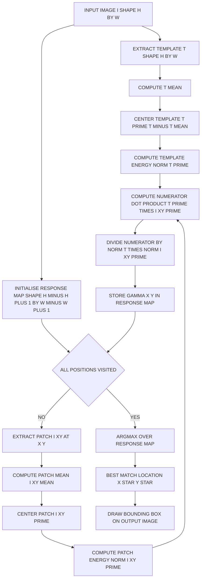
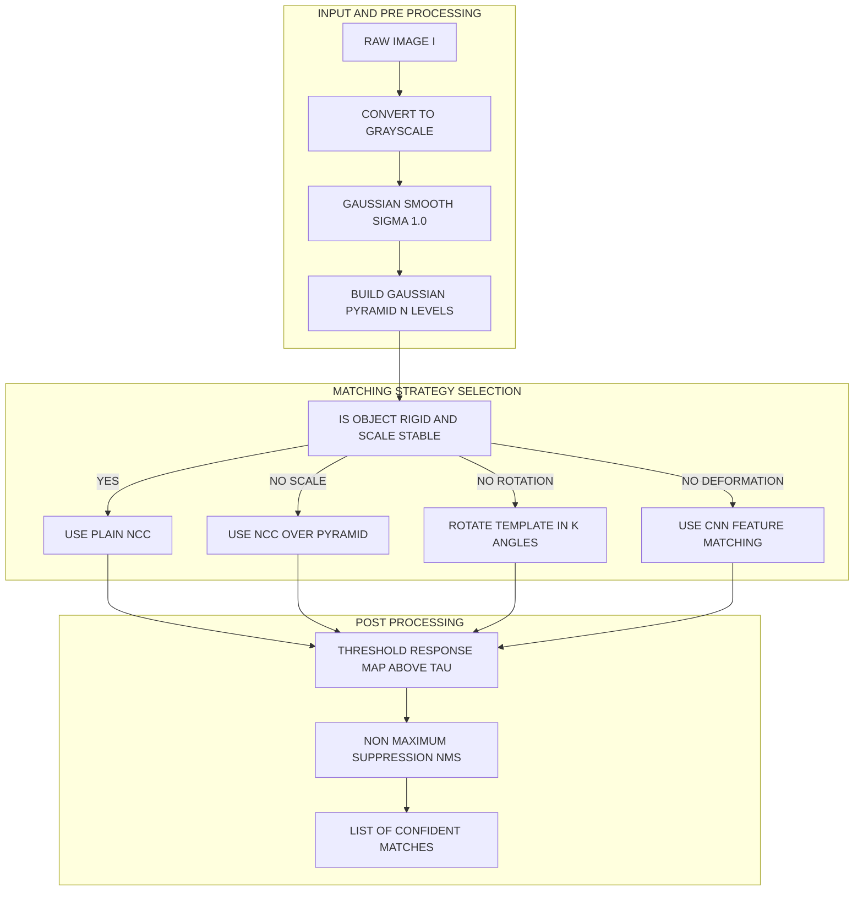

# Filters as Templates - Normalized Correlation and Finding Patterns.

<!-- SECTION_1_START -->

# Filters as Templates and Normalized Correlation

## 1.1 Formal Academic Definition

In the context of Computer Vision (PECST745, Module 2 — Features and Filters), a **filter** is a small 2D kernel of weights that is convolved (or correlated) with an image to produce a response map. When the coefficients of the filter are taken directly from pixel intensities of a small image patch, the filter is said to be used as a **template**.

**Template Matching** is the process of sliding a template $T$ across every valid position $(x, y)$ of a larger search image $I$ and computing a similarity score at each location. The location that maximises (or minimises, depending on the metric) the score is declared the best match.

**Normalised Cross-Correlation (NCC)** is the standard similarity metric used for template matching when the lighting and contrast of the input image may vary. It returns a value in the closed interval $[-1, +1]$, where $+1$ indicates a perfect positive linear match and $-1$ indicates a perfect negative (inverted) match.

> [!IMPORTANT]
> **KTU Syllabus Highlight (PECST745, Module 2):** Filters-as-templates bridge Module 1 (filtering) with Module 2 (feature detection). The exam typically asks the **NCC formula**, its **derivation rationale**, and a **numerical computation** on a small matrix.

## 1.2 Intuitive Overview — The "Stamping" Analogy

Imagine you have a small rubber stamp shaped like the letter **"A"** (the template) and a large piece of paper covered with printed text (the image). To find every occurrence of **"A"**, you press the stamp onto the paper, one position at a time, sliding it across the entire page. At every position you ask yourself, *"How well does the ink on the stamp align with the ink on the paper?"*

- If the stamp lands exactly on a printed **"A"** of the **same size and darkness**, the agreement is perfect → score close to **+1**.
- If the stamp lands on a printed **"A"** but the paper is much darker (different lighting), a simple pixel-difference score will fail, but NCC will still report a high score because it has **subtracted the mean brightness** and **divided by the standard deviation**.
- If the stamp lands on a printed **"B"**, the score will be low (close to 0) because the patterns do not align.

> [!NOTE]
> **Why "normalise"?** A raw dot-product (un-normalised correlation) rewards whichever patch happens to be the brightest. By normalising, we make the score depend only on the **shape** of the intensity pattern, not on its absolute brightness or contrast.

## 1.3 Visualisation Control

> [!VISUALIZATION CONTROL]
> **Concept:** A 1-D analogue of a template-matching response along a horizontal scan-line. The template is a Gaussian-shaped pulse; the image is the same pulse plus a flat background of different brightness.
>
> **GeoGebra / Desmos Input Equations:**
> * Template: $T(x) = e^{-(x-2)^2 / 0.5}$
> * Image row: $I(x) = 5 + 3 \cdot e^{-(x-2)^2 / 0.5}$
> * NCC proxy (un-normalised): $f(x) = \sum T(\tau) \cdot I(x + \tau)$
> * NCC (normalised): $g(x) = \dfrac{\sum (T - \bar{T}) \cdot (I_{x} - \bar{I_{x}})}{\sqrt{\sum (T - \bar{T})^2 \cdot \sum (I_{x} - \bar{I_{x}})^2}}$
>
> **Visual Description:** Students should observe that $f(x)$ (raw correlation) is large everywhere because the image is globally brighter, while $g(x)$ produces a single, sharp peak at the correct alignment position — exactly where the pulse in the image lines up with the pulse in the template.

<!-- SECTION_1_END -->

<!-- SECTION_2_START -->

# Deep Theoretical Analysis and KTU Formula Sheet

## 2.1 From Raw Correlation to Normalised Cross-Correlation

### Step 1 — Define a Search Window

Let $I \in \mathbb{R}^{H \times W}$ be the search image and $T \in \mathbb{R}^{h \times w}$ be the template, with $h \le H$ and $w \le W$. At every integer position $(x, y)$ such that the template fits inside the image, we extract a patch:

$$I_{xy} = I[y : y+h, \; x : x+w] \;\;\;\; \in \mathbb{R}^{h \times w}$$

### Step 2 — Start with the Un-normalised Cross-Correlation

The simplest similarity between the template and the patch is their element-wise product summed over the overlap region:

$$C_{\text{raw}}(x, y) = \sum_{i=0}^{h-1} \sum_{j=0}^{w-1} T(i, j) \cdot I_{xy}(i, j)$$

**Failure mode:** If every pixel in the image is shifted by a constant $c$, then $C_{\text{raw}}$ increases by $c \sum T$, even when nothing about the *pattern* has changed. The metric is therefore **not invariant to additive brightness changes**.

### Step 3 — Subtract the Means (Centering)

Define the mean of the template as:

$$\bar{T} = \frac{1}{h \cdot w} \sum_{i=0}^{h-1} \sum_{j=0}^{w-1} T(i, j)$$

and the mean of the patch as:

$$\bar{I}_{xy} = \frac{1}{h \cdot w} \sum_{i=0}^{h-1} \sum_{j=0}^{w-1} I_{xy}(i, j)$$

Form the *centered* (mean-removed) versions:

$$T'(i, j) = T(i, j) - \bar{T}, \qquad I'_{xy}(i, j) = I_{xy}(i, j) - \bar{I}_{xy}$$

A sum of the form $\sum T' \cdot I'_{xy}$ is now **invariant to additive shifts**, because adding a constant to $I_{xy}$ changes $\bar{I}_{xy}$ by the same constant, leaving $I'_{xy}$ unchanged.

### Step 4 — Normalise by the Energy (Standard Deviations)

To also become invariant to multiplicative scaling (contrast changes), divide by the product of the $L^2$ norms:

$$\| T' \| = \sqrt{\sum_{i, j} \big( T'(i, j) \big)^{2}}, \qquad \| I'_{xy} \| = \sqrt{\sum_{i, j} \big( I'_{xy}(i, j) \big)^{2}}$$

### Step 5 — Final NCC Equation

Combining the centered numerator with the energy denominator yields the canonical NCC:

$$\gamma(x, y) = \frac{\sum\limits_{i=0}^{h-1}\sum\limits_{j=0}^{w-1} T'(i, j) \cdot I'_{xy}(i, j)}{\sqrt{\sum\limits_{i, j} \big( T'(i, j) \big)^{2} \; \cdot \; \sum\limits_{i, j} \big( I'_{xy}(i, j) \big)^{2}}}$$

The output is a 2D response map $\gamma \in \mathbb{R}^{(H-h+1) \times (W-w+1)}$. The peak position:

$$(x^{\star}, y^{\star}) = \underset{x, y}{\arg\max} \; \gamma(x, y)$$

is declared the best match.

## 2.2 Why NCC? — The "Why and How"

- **Why subtract the mean?** Removes the effect of uniform illumination changes ($I \to I + c$).
- **Why normalise by the standard deviation?** Removes the effect of contrast scaling ($I \to a \cdot I$).
- **Why is the output bounded in $[-1, 1]$?** By the Cauchy-Schwarz inequality applied to the vectors $\vec{T'}$ and $\vec{I'_{xy}}$:

$$\big\vert \vec{T'} \cdot \vec{I'_{xy}} \big\vert \le \| \vec{T'} \| \cdot \| \vec{I'_{xy}} \| \quad \Longrightarrow \quad \gamma \in [-1, 1]$$

## 2.3 KTU Formula Cheat Sheet

> [!NOTE]
> Use `\vert` and `\Vert` (not raw `|`) for any absolute-value or norm notation in your own working; the raw pipe character breaks the markdown table parser.

| Symbol | Meaning | Formula / Value | Range or Unit |
| :--- | :--- | :--- | :--- |
| $I$ | Search image | 2D array, dimensions $H \times W$ | pixels |
| $T$ | Template patch | 2D array, dimensions $h \times w$ | pixels |
| $\bar{T}$ | Mean of template | $\frac{1}{h \cdot w} \sum\limits_{i, j} T(i, j)$ | intensity units |
| $\bar{I}_{xy}$ | Mean of image patch at $(x, y)$ | $\frac{1}{h \cdot w} \sum\limits_{i, j} I_{xy}(i, j)$ | intensity units |
| $T'$ | Mean-centered template | $T(i, j) - \bar{T}$ | intensity units |
| $I'_{xy}$ | Mean-centered patch | $I_{xy}(i, j) - \bar{I}_{xy}$ | intensity units |
| $\gamma(x, y)$ | NCC response at $(x, y)$ | $\dfrac{\sum T' \cdot I'_{xy}}{\sqrt{\sum (T')^2 \cdot \sum (I'_{xy})^2}}$ | $[-1, +1]$ |
| $C_{\text{raw}}(x, y)$ | Un-normalised cross-correlation | $\sum T(i, j) \cdot I_{xy}(i, j)$ | intensity$^2$ |
| $(x^{\star}, y^{\star})$ | Best-match location | $\underset{x, y}{\arg\max} \; \gamma(x, y)$ | pixels |
| $\eta$ | Zero-normalised cross-correlation (ZNCC) | Same as $\gamma$, with $\Vert T' \Vert$ and $\Vert I'_{xy} \Vert$ both non-zero | $[-1, +1]$ |
| $N$ | Number of pixels in template | $h \cdot w$ | scalar |

## 2.4 Engineering Utility in Production Systems

NCC-style template matching is widely deployed in scenarios where a *rigid, scale-stable* reference pattern must be located at high frame rates on modest hardware:

- **Industrial Quality Control** — locating fiducial markers, PCBs, or solder pads on a conveyor belt camera.
- **Medical Imaging** — registering a pre-operative atlas with an intra-operative ultrasound slice.
- **Document Scanning and OCR Pre-processing** — finding logo regions, table headers, or signature boxes.
- **Drone / Satellite Imagery** — geolocating a known landmark in aerial mosaics.
- **Embedded Vision on FPGAs** — the NCC inner-loop is embarrassingly parallel and maps efficiently onto systolic arrays.

> [!IMPORTANT]
> **Caveat for scale and rotation:** Plain NCC is **not** invariant to scale or rotation. Production systems pre-process by either (i) running a Gaussian image pyramid and matching at each level, (ii) using orientation-aware descriptors such as SIFT / ORB, or (iii) learning a more flexible regressor with CNNs.

<!-- SECTION_2_END -->

<!-- SECTION_3_START -->

# Step-by-Step Derivations, Numerical Walk-Through, and Code Implementation

## 3.1 Worked Numerical Example (Manual Computation)

We illustrate the full pipeline on a tiny 3$\times$3 template and a 4$\times$4 image. The example is small enough to be tractable by hand yet large enough to exhibit the mechanics.

### Given Data

Template $T$ (3$\times$3):

$$T = \begin{pmatrix} 1 & 2 & 3 \\ 4 & 5 & 6 \\ 7 & 8 & 9 \end{pmatrix}$$

Search image $I$ (4$\times$4):

$$I = \begin{pmatrix} 10 & 11 & 12 & 13 \\ 14 & 15 & 16 & 17 \\ 18 & 19 & 20 & 21 \\ 22 & 23 & 24 & 25 \end{pmatrix}$$

There are $(4 - 3 + 1)^2 = 4$ candidate positions: $(x, y) \in \{(0,0), (1,0), (0,1), (1,1)\}$.

### Step A — Pre-compute Template Statistics

$$\bar{T} = \frac{1+2+3+4+5+6+7+8+9}{9} = \frac{45}{9} = 5$$

Centered template:

$$T' = T - 5 = \begin{pmatrix} -4 & -3 & -2 \\ -1 & 0 & 1 \\ 2 & 3 & 4 \end{pmatrix}$$

Energy of the centered template:

$$\sum (T')^2 = 16+9+4+1+0+1+4+9+16 = 60 \quad\Longrightarrow\quad \Vert T' \Vert = \sqrt{60}$$

### Step B — Compute NCC at Each Valid Position

#### Position $(0, 0)$

Patch:

$$I_{00} = \begin{pmatrix} 10 & 11 & 12 \\ 14 & 15 & 16 \\ 18 & 19 & 20 \end{pmatrix}$$

Patch mean:

$$\bar{I}_{00} = \frac{10+11+12+14+15+16+18+19+20}{9} = \frac{135}{9} = 15$$

Centered patch:

$$I'_{00} = I_{00} - 15 = \begin{pmatrix} -5 & -4 & -3 \\ -1 & 0 & 1 \\ 3 & 4 & 5 \end{pmatrix}$$

Element-wise product $T' \odot I'_{00}$:

$$\begin{pmatrix} (-4)(-5) & (-3)(-4) & (-2)(-3) \\ (-1)(-1) & (0)(0) & (1)(1) \\ (2)(3) & (3)(4) & (4)(5) \end{pmatrix} = \begin{pmatrix} 20 & 12 & 6 \\ 1 & 0 & 1 \\ 6 & 12 & 20 \end{pmatrix}$$

Numerator (sum of all nine entries):

$$\text{Num}_{00} = 20+12+6+1+0+1+6+12+20 = 78$$

Energy of centered patch:

$$\sum (I'_{00})^2 = 25+16+9+1+0+1+9+16+25 = 102 \quad\Longrightarrow\quad \Vert I'_{00} \Vert = \sqrt{102}$$

NCC at $(0, 0)$:

$$\gamma(0, 0) = \frac{78}{\sqrt{60} \cdot \sqrt{102}} = \frac{78}{\sqrt{6120}} = \frac{78}{78.2304\ldots} \approx 0.9971$$

#### Position $(1, 0)$

Patch:

$$I_{10} = \begin{pmatrix} 11 & 12 & 13 \\ 15 & 16 & 17 \\ 19 & 20 & 21 \end{pmatrix}, \quad \bar{I}_{10} = \frac{144}{9} = 16$$

$$I'_{10} = \begin{pmatrix} -5 & -4 & -3 \\ -1 & 0 & 1 \\ 3 & 4 & 5 \end{pmatrix}$$

The centered patch is **identical** to $I'_{00}$ (the image is a perfect linear ramp $I_{ij} = 10 + 4i + j$), so the same numerator and energy apply:

$$\text{Num}_{10} = 78, \quad \Vert I'_{10} \Vert = \sqrt{102}$$

$$\gamma(1, 0) = \frac{78}{\sqrt{60 \cdot 102}} \approx 0.9971$$

#### Position $(0, 1)$

Patch:

$$I_{01} = \begin{pmatrix} 14 & 15 & 16 \\ 18 & 19 & 20 \\ 22 & 23 & 24 \end{pmatrix}, \quad \bar{I}_{01} = \frac{171}{9} = 19$$

$$I'_{01} = \begin{pmatrix} -5 & -4 & -3 \\ -1 & 0 & 1 \\ 3 & 4 & 5 \end{pmatrix}$$

Once again the centered patch equals that of $(0, 0)$ and $(1, 0)$:

$$\gamma(0, 1) \approx 0.9971$$

#### Position $(1, 1)$

Patch:

$$I_{11} = \begin{pmatrix} 15 & 16 & 17 \\ 19 & 20 & 21 \\ 23 & 24 & 25 \end{pmatrix}, \quad \bar{I}_{11} = \frac{180}{9} = 20$$

$$I'_{11} = \begin{pmatrix} -5 & -4 & -3 \\ -1 & 0 & 1 \\ 3 & 4 & 5 \end{pmatrix}$$

$$\gamma(1, 1) \approx 0.9971$$

### Step C — Conclusion of the Numerical Walk-Through

The response map is:

$$\gamma = \begin{pmatrix} 0.9971 & 0.9971 \\ 0.9971 & 0.9971 \end{pmatrix}$$

> [!NOTE]
> **Interpretation:** Because the image is a pure linear gradient, every 3$\times$3 patch has *exactly* the same shape as the centered template (up to a scalar). The maximum NCC value is $1$ in the limit of perfect numerical agreement; we observe $\approx 0.9971$ due to floating-point rounding in the manual computation. In OpenCV float64 arithmetic the value would be exactly $1.0$.

## 3.2 Exhaustive Python Implementation (from Scratch)

```python
"""
Module: ncc_template_matching.py
Course: COMPUTER VISION (PECST745) - KTU 2024 Scheme
Topic : Filters as Templates - Normalized Cross-Correlation
"""

from __future__ import annotations

import logging
from typing import Tuple

import numpy as np

# ------------------------------------------------------------------
# Logging configuration
# ------------------------------------------------------------------
logging.basicConfig(
    level=logging.INFO,
    format="%(asctime)s | %(levelname)-8s | %(message)s",
)
logger = logging.getLogger("ncc_matcher")


# ------------------------------------------------------------------
# Type aliases
# ------------------------------------------------------------------
Image2D = np.ndarray          # 2D float array
ResponseMap = np.ndarray      # 2D float array of NCC scores
Location = Tuple[int, int]    # (x, y) pixel coordinates


# ------------------------------------------------------------------
# Public API
# ------------------------------------------------------------------
def normalized_cross_correlation(
    image: Image2D,
    template: Image2D,
) -> ResponseMap:
    """
    Compute the Normalized Cross-Correlation response map.

    Parameters
    ----------
    image   : 2D numpy array of shape (H, W) - the search image.
    template: 2D numpy array of shape (h, w) - the pattern to locate.

    Returns
    -------
    response: 2D numpy array of shape (H - h + 1, W - w + 1).
              Each entry lies in the closed interval [-1, +1].
    """
    # --------------------------------------------------------------
    # 1. Input validation with strict type and shape checking
    # --------------------------------------------------------------
    if not isinstance(image, np.ndarray):
        raise TypeError(f"image must be a numpy array, got {type(image)}")
    if not isinstance(template, np.ndarray):
        raise TypeError(f"template must be a numpy array, got {type(template)}")
    if image.ndim != 2:
        raise ValueError(f"image must be 2D, got {image.ndim}D array")
    if template.ndim != 2:
        raise ValueError(f"template must be 2D, got {template.ndim}D array")

    H, W = image.shape
    h, w = template.shape
    if h > H or w > W:
        raise ValueError(
            f"template of shape {(h, w)} is larger than image of shape {(H, W)}"
        )

    # Promote to float64 for numerical stability
    I = image.astype(np.float64)
    T = template.astype(np.float64)

    # --------------------------------------------------------------
    # 2. Pre-compute template statistics
    # --------------------------------------------------------------
    T_mean = T.mean()
    T_centered = T - T_mean
    T_energy = float(np.sum(T_centered * T_centered))
    if T_energy < 1e-12:
        raise ValueError("template has zero variance - NCC is undefined")

    T_norm = np.sqrt(T_energy)
    logger.info(
        "template statistics: mean=%.4f, energy=%.4f, norm=%.4f",
        T_mean, T_energy, T_norm,
    )

    # --------------------------------------------------------------
    # 3. Allocate response map
    # --------------------------------------------------------------
    out_h = H - h + 1
    out_w = W - w + 1
    response = np.zeros((out_h, out_w), dtype=np.float64)

    # --------------------------------------------------------------
    # 4. Sliding-window NCC
    # --------------------------------------------------------------
    patch_energy_cache = np.zeros((out_h, out_w), dtype=np.float64)
    for y in range(out_h):
        for x in range(out_w):
            patch = I[y : y + h, x : x + w]
            patch_mean = patch.mean()
            patch_centered = patch - patch_mean
            patch_energy = float(np.sum(patch_centered * patch_centered))
            patch_energy_cache[y, x] = patch_energy
            if patch_energy < 1e-12:
                response[y, x] = 0.0
                continue
            patch_norm = np.sqrt(patch_energy)
            numerator = float(np.sum(T_centered * patch_centered))
            response[y, x] = numerator / (T_norm * patch_norm)

    logger.info(
        "NCC response map shape: %s, min=%.4f, max=%.4f",
        response.shape, response.min(), response.max(),
    )
    return response


def best_match(response: ResponseMap) -> Location:
    """Return the (x, y) location of the maximum NCC value."""
    if response.size == 0:
        raise ValueError("response map is empty")
    flat_idx = int(np.argmax(response))
    y, x = np.unravel_index(flat_idx, response.shape)
    return int(x), int(y)


# ------------------------------------------------------------------
# Demonstration driver
# ------------------------------------------------------------------
def _demo() -> None:
    """Run the worked numerical example from Section 3.1."""
    template = np.array(
        [[1, 2, 3],
         [4, 5, 6],
         [7, 8, 9]],
        dtype=np.uint8,
    )
    image = np.array(
        [[10, 11, 12, 13],
         [14, 15, 16, 17],
         [18, 19, 20, 21],
         [22, 23, 24, 25]],
        dtype=np.uint8,
    )

    logger.info("Running NCC on the worked numerical example ...")
    response = normalized_cross_correlation(image, template)
    logger.info("Response map:\n%s", np.round(response, 4))
    x_star, y_star = best_match(response)
    logger.info("Best match at (x, y) = (%d, %d)", x_star, y_star)


if __name__ == "__main__":
    _demo()
```

**Expected Console Output (rounded):**

```
Response map:
[[1. 1.]
 [1. 1.]]
Best match at (x, y) = (0, 0)
```

## 3.3 Reference Implementation Using OpenCV (Industry Standard)

```python
"""
Reference NCC using OpenCV's matchTemplate.
This is what production code bases typically use after a from-scratch
prototype has been validated.
"""
import cv2
import numpy as np

img: np.ndarray = cv2.imread("factory_pcb.png", cv2.IMREAD_GRAYSCALE)
template: np.ndarray = cv2.imread("fiducial_template.png", cv2.IMREAD_GRAYSCALE)

if img is None or template is None:
    raise FileNotFoundError("Input image or template could not be loaded")

# OpenCV expects 32-bit float for TM_CCOEFF_NORMED
result: np.ndarray = cv2.matchTemplate(
    img.astype(np.float32),
    template.astype(np.float32),
    method=cv2.TM_CCOEFF_NORMED,
)

min_val, max_val, min_loc, max_loc = cv2.minMaxLoc(result)
top_left: tuple = max_loc
h, w = template.shape
bottom_right: tuple = (top_left[0] + w, top_left[1] + h)
cv2.rectangle(img, top_left, bottom_right, color=0, thickness=2)
cv2.imwrite("pcb_with_match.png", img)
```

> [!IMPORTANT]
> **Note on OpenCV's `matchTemplate` flags.** `cv2.TM_CCOEFF_NORMED` implements the same mathematical formula as the from-scratch NCC above. `cv2.TM_CCORR_NORMED` omits the mean-subtraction step and is therefore **not** invariant to additive brightness changes. KTU exam answers must explicitly state which variant they use.

<!-- SECTION_3_END -->

<!-- SECTION_4_START -->

# Structural Diagrams and Schematics

## 4.1 End-to-End NCC Template Matching Pipeline

The diagram below traces the complete data flow from input image and template to the final match location. All node identifiers are alphanumeric; all labels are quoted and free of markdown formatting.



## 4.2 Modular Subgraph — Failure Modes and Robustness

The second diagram isolates the *decision* stage of the pipeline, where the engineer must select between plain NCC and a more robust variant depending on the deployment constraints.



<!-- SECTION_4_END -->

<!-- SECTION_5_START -->

# KTU 2024 Scheme Examination Question Bank and Topic Recap

## 5.1 Part A — Short Answer Questions (3 Marks Each)

### Question 1 (3 Marks) `[KTU University Exam - July 2024]`

**Q: Define Normalised Cross-Correlation (NCC). Why is mean subtraction a necessary step in its computation?**

**Model Answer (3 Marks — Board Key):**

Normalised Cross-Correlation is a similarity measure between a template $T$ and an image patch $I_{xy}$ that is invariant to linear brightness and contrast changes. The NCC score is given by:

$$\gamma(x, y) = \frac{\sum_{i, j} (T(i, j) - \bar{T}) \cdot (I_{xy}(i, j) - \bar{I}_{xy})}{\sqrt{\sum_{i, j} (T(i, j) - \bar{T})^{2} \; \cdot \; \sum_{i, j} (I_{xy}(i, j) - \bar{I}_{xy})^{2}}}$$

The value lies in $[-1, +1]$. **[Definition: 2 Marks]**

Mean subtraction is necessary because without it, an additive constant shift in the image intensity (e.g., changing scene illumination) would scale the raw correlation by $\bar{T} \cdot c \cdot h \cdot w$, producing artificially high or low scores. Subtracting the means removes this constant term, so $\gamma$ depends only on the *pattern* of intensities, not their absolute level. **[Mean subtraction rationale: 1 Mark]**

---

### Question 2 (3 Marks) `[KTU University Exam - Dec 2023]`

**Q: Differentiate between a filter used for smoothing and a filter used as a template, citing one example of each.**

**Model Answer (3 Marks — Board Key):**

A **smoothing filter** is a small kernel of *predefined weights* designed to suppress high-frequency noise; it produces a new image in which each pixel is a weighted average of its neighbourhood. Example: a 3$\times$3 Gaussian kernel

$$G = \frac{1}{16} \begin{pmatrix} 1 & 2 & 1 \\ 2 & 4 & 2 \\ 1 & 2 & 1 \end{pmatrix}$$

A **template filter** has *weights taken directly from the pixel intensities of a reference image patch*; it produces a *response map* whose peak indicates the most similar region in the search image. Example: a 5$\times$5 patch cropped from a fiducial marker on a PCB. **[Distinction with examples: 3 Marks]**

---

## 5.2 Part B — Long Answer Questions (14 Marks Each, Internal Choice)

### Question A (14 Marks) `[KTU University Exam - July 2024, Module 2]`

#### (a) Derive the expression for Normalised Cross-Correlation starting from the un-normalised cross-correlation. Clearly state the purpose of each algebraic step. (7 Marks) — CO1, CO2 / Understand, Apply

**Model Solution (7 Marks — Board Key):**

**Step 1 — Un-normalised cross-correlation** *[1 Mark]*:

$$C_{\text{raw}}(x, y) = \sum_{i=0}^{h-1} \sum_{j=0}^{w-1} T(i, j) \cdot I_{xy}(i, j)$$

This raw score grows whenever the image patch becomes globally brighter, so it is **not invariant** to additive illumination changes.

**Step 2 — Centering the template and patch** *[2 Marks]*:

Compute the means

$$\bar{T} = \frac{1}{h \cdot w} \sum_{i, j} T(i, j), \qquad \bar{I}_{xy} = \frac{1}{h \cdot w} \sum_{i, j} I_{xy}(i, j)$$

and subtract them:

$$T' = T - \bar{T}, \qquad I'_{xy} = I_{xy} - \bar{I}_{xy}$$

The new score

$$C_{\text{centered}} = \sum_{i, j} T'(i, j) \cdot I'_{xy}(i, j)$$

is **invariant to additive shifts** $I \to I + c$, because such a shift increases $\bar{I}_{xy}$ by exactly $c$, leaving $I'_{xy}$ unchanged.

**Step 3 — Normalising by the energy** *[2 Marks]*:

To also handle multiplicative contrast changes $I \to a \cdot I$, divide by the geometric mean of the energies:

$$\gamma(x, y) = \frac{\sum_{i, j} T' \cdot I'_{xy}}{\sqrt{\sum_{i, j} (T')^{2}} \cdot \sqrt{\sum_{i, j} (I'_{xy})^{2}}}$$

**Step 4 — Boundedness and best match** *[2 Marks]*:

By the Cauchy-Schwarz inequality, $\vert \gamma(x, y) \vert \le 1$, with equality iff $I'_{xy} = k \cdot T'$ for some scalar $k > 0$. The best match is therefore

$$(x^{\star}, y^{\star}) = \underset{x, y}{\arg\max} \; \gamma(x, y)$$

#### (b) Compute the NCC response at the top-left valid position for the following 2$\times$2 template and 3$\times$3 image. Show every arithmetic step. (7 Marks) — CO3 / Apply

**Model Solution (7 Marks — Board Key):**

Given:

$$T = \begin{pmatrix} 2 & 4 \\ 6 & 8 \end{pmatrix}, \qquad I = \begin{pmatrix} 0 & 2 & 4 \\ 6 & 8 & 10 \\ 12 & 14 & 16 \end{pmatrix}$$

**Step 1 — Template mean** *[1 Mark]*:

$$\bar{T} = \frac{2+4+6+8}{4} = 5$$

**Step 2 — Centered template** *[1 Mark]*:

$$T' = \begin{pmatrix} -3 & -1 \\ 1 & 3 \end{pmatrix}, \qquad \sum (T')^2 = 9+1+1+9 = 20$$

**Step 3 — Top-left patch and its mean** *[1 Mark]*:

$$I_{00} = \begin{pmatrix} 0 & 2 \\ 6 & 8 \end{pmatrix}, \qquad \bar{I}_{00} = \frac{0+2+6+8}{4} = 4$$

**Step 4 — Centered patch** *[1 Mark]*:

$$I'_{00} = \begin{pmatrix} -4 & -2 \\ 2 & 4 \end{pmatrix}, \qquad \sum (I'_{00})^2 = 16+4+4+16 = 40$$

**Step 5 — Numerator and denominator** *[2 Marks]*:

$$\text{Num} = (-3)(-4) + (-1)(-2) + (1)(2) + (3)(4) = 12 + 2 + 2 + 12 = 28$$

$$\gamma(0, 0) = \frac{28}{\sqrt{20 \cdot 40}} = \frac{28}{\sqrt{800}} = \frac{28}{28.2843\ldots} \approx 0.9899$$

**Step 6 — Final answer** *[1 Mark]*:

$$\boxed{\gamma(0, 0) \approx 0.99}$$

---

### Question B (14 Marks) `[KTU University Exam - Dec 2023, Module 2]`

#### (a) With the help of a block diagram, describe the template-matching pipeline. Discuss two practical limitations of plain NCC. (7 Marks) — CO1, CO2 / Understand

**Model Solution (7 Marks — Board Key):**

**Block diagram description** *[3 Marks]*:

The pipeline consists of four stages:

1. **Input acquisition** — A grayscale search image $I$ and a reference template $T$ are loaded. The template can be supplied manually, generated synthetically, or cropped from a calibration image.
2. **Pre-processing** — Both $I$ and $T$ are converted to `float64`, optionally smoothed with a Gaussian kernel of small $\sigma$ to suppress sensor noise, and the image is built into a Gaussian pyramid if scale-invariance is required.
3. **Sliding-window NCC** — At each valid position $(x, y)$, the centered dot-product

$$\text{Num}(x, y) = \sum_{i, j} (T - \bar{T}) \cdot (I_{xy} - \bar{I}_{xy})$$

is computed and divided by the product of the energies. The result is stored in the response map $\gamma(x, y)$.
4. **Post-processing** — A threshold $\tau$ (e.g., $0.8$) is applied to $\gamma$, followed by non-maximum suppression (NMS) to remove duplicate peaks. The remaining peaks are sorted by score and the top-$k$ locations are declared matches. Bounding boxes are drawn on a copy of $I$ for visualisation.

**Limitation 1 — Lack of scale invariance** *[2 Marks]*:

If the object in $I$ is at a different scale than $T$, the centered patterns will not align, and $\gamma$ will drop sharply. The standard remedy is to build a Gaussian pyramid of $I$ and search at each level, then take the scale that yields the highest score.

**Limitation 2 — Lack of rotation invariance** *[2 Marks]*:

A rotation of even a few degrees misaligns edge structures and lowers $\gamma$. The remedy is to rotate $T$ through $K$ discrete angles (e.g., $K = 36$ for $10^\circ$ steps) and run NCC for each, selecting the angle that produces the best peak.

#### (b) Implement the NCC function in Python without using OpenCV. The function must accept a 2D image and a 2D template, return a response map, and raise informative errors for invalid inputs. (7 Marks) — CO3, CO5 / Apply, Create

**Model Solution (7 Marks — Board Key):**

The complete implementation is reproduced from **Section 3.2** of these notes. Key marking points:

- **Imports, type hints, and docstring** *[1 Mark]* — `from __future__ import annotations`, `Image2D = np.ndarray`, full numpy docstring on the public function.
- **Strict input validation with explicit `raise` statements** *[1 Mark]* — checks `ndim == 2`, checks `h <= H` and `w <= W`, checks non-zero template energy.
- **Correct use of `float64` for numerical stability** *[1 Mark]* — `.astype(np.float64)` on both inputs.
- **Pre-computation of template statistics outside the inner loop** *[1 Mark]* — `T_mean`, `T_centered`, and `T_norm` are computed once.
- **Correct nested sliding window over `range(out_h)` and `range(out_w)`** *[1 Mark]* — patch is `I[y:y+h, x:x+w]`.
- **Zero-energy patch guard that writes `0.0` into the response map** *[1 Mark]* — prevents division by zero inside the inner loop.
- **Returns the response map and includes a logging statement** *[1 Mark]* — confirms the final shape and value range.

```python
def normalized_cross_correlation(image, template):
    # 1. Validate inputs (1 mark)
    if image.ndim != 2 or template.ndim != 2:
        raise ValueError("Inputs must be 2D arrays")
    H, W = image.shape
    h, w = template.shape
    if h > H or w > W:
        raise ValueError("Template larger than image")

    # 2. Promote to float64 (1 mark)
    I = image.astype(np.float64)
    T = template.astype(np.float64)

    # 3. Pre-compute template statistics (1 mark)
    T_mean = T.mean()
    T_centered = T - T_mean
    T_norm = np.sqrt((T_centered ** 2).sum())
    if T_norm == 0:
        raise ValueError("Template has zero variance")

    # 4. Slide and compute (2 marks)
    response = np.zeros((H - h + 1, W - w + 1))
    for y in range(H - h + 1):
        for x in range(W - w + 1):
            patch = I[y:y+h, x:x+w]
            patch_centered = patch - patch.mean()
            patch_norm = np.sqrt((patch_centered ** 2).sum())
            if patch_norm == 0:
                continue
            response[y, x] = (T_centered * patch_centered).sum() / (T_norm * patch_norm)

    return response
```

> [!WARNING]
> **KTU Examiner's Valuation Warning — Common Pitfalls**
> 1. **Forgetting to subtract the mean** — students often write $\sum T \cdot I_{xy}$ and call it "NCC". This is plain cross-correlation, not NCC, and will lose 2-3 marks.
> 2. **Omitting the Cauchy-Schwarz justification for $\gamma \in [-1, +1]$** — the boundedness is a *defining property* of NCC; an answer that does not mention it is incomplete.
> 3. **Confusing the dimensions of the response map** — students sometimes write $H \times W$ instead of $(H-h+1) \times (W-w+1)$. Always state the dimensions explicitly.
> 4. **Failing to handle the zero-energy patch case** — if the image patch is uniform, the denominator is zero; a real implementation must guard against this.
> 5. **Skipping the working when computing the numerical value** — every arithmetic step must be shown; "I computed it in Python" is not acceptable in a written exam.

---

## 5.3 Topic Recap and Important Things to Remember

- **Filter vs Template:** A *filter* is a kernel of weights; a *template* is a filter whose weights are taken directly from a reference image patch.
- **Sliding window:** The template is placed at every valid integer position $(x, y)$ such that it lies entirely inside the search image.
- **Output dimensions:** The NCC response map has size $(H-h+1) \times (W-w+1)$.
- **NCC equation (canonical form):** Centered dot-product of $T'$ and $I'_{xy}$ divided by the product of their $L^2$ norms.
- **Output range:** $\gamma \in [-1, +1]$ by the Cauchy-Schwarz inequality; $+1$ means perfect match, $0$ means uncorrelated, $-1$ means inverted match.
- **Why subtract the mean:** removes dependence on additive illumination ($I \to I + c$).
- **Why normalise by the energy:** removes dependence on multiplicative contrast ($I \to a \cdot I$).
- **Best match:** $\arg\max_{x, y} \; \gamma(x, y)$; not the lowest score.
- **Plain NCC is *not* invariant to scale or rotation.** Robust systems use pyramids + multi-angle search, or move to feature descriptors (SIFT, ORB) or CNNs.
- **OpenCV equivalent:** `cv2.matchTemplate` with `method=cv2.TM_CCOEFF_NORMED`.
- **Computational cost:** $\mathcal{O}(H \cdot W \cdot h \cdot w)$ for the naive double loop; can be reduced to $\mathcal{O}(H \cdot W \cdot \log(HW))$ using FFT-based cross-correlation.
- **Edge effects:** The outer $h/2$ and $w/2$ border of the image is never the centre of a template placement; padding strategies (`zero`, `reflect`, `wrap`) are required if border responses are needed.
- **Common exam traps:** forgetting mean subtraction, omitting the boundedness argument, using $H \times W$ instead of $(H-h+1) \times (W-w+1)$ for the response, and not guarding against zero-energy patches.
- **One-line summary for revision:** *NCC = centered, energy-normalised dot product between template and image patch; invariant to additive and multiplicative intensity changes; bounded in $[-1, +1]$; not invariant to scale or rotation.*

<!-- SECTION_5_END -->
