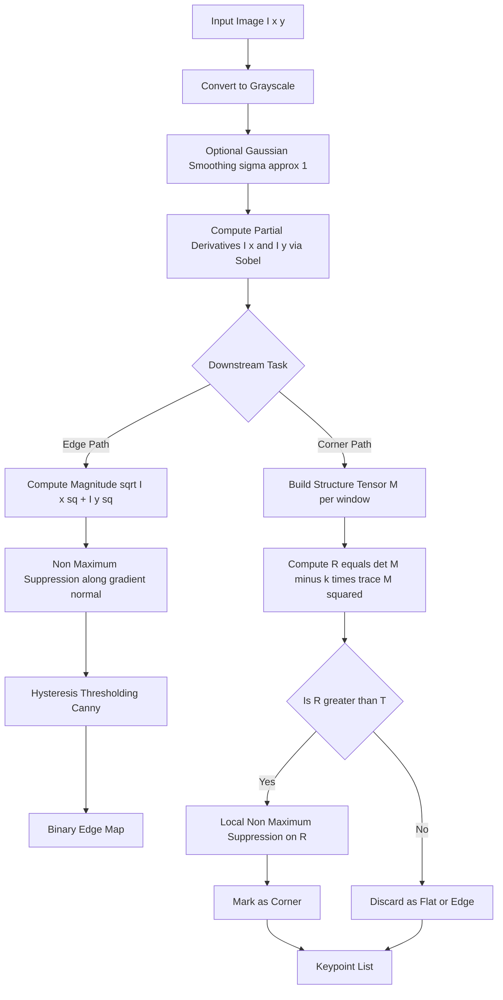
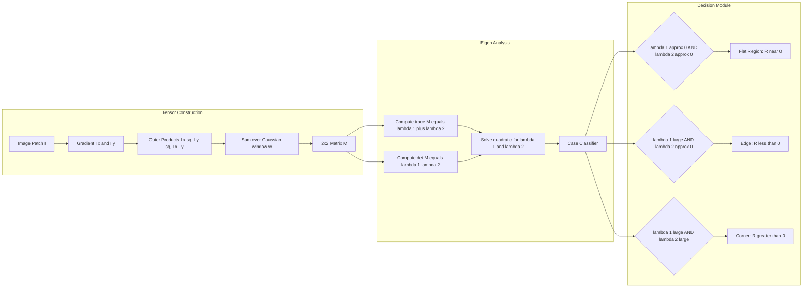
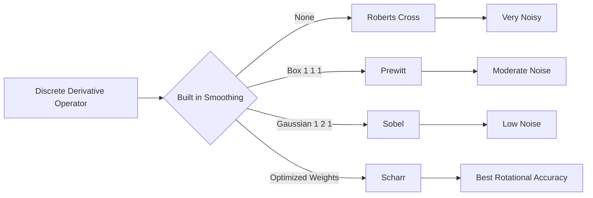
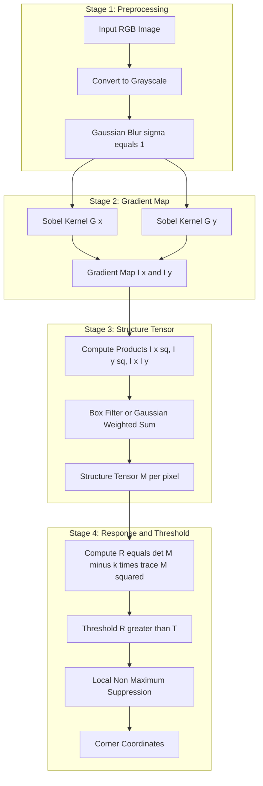

# Gradient Based Edge and Corner Detection.

<!-- SECTION_1_START -->
# Gradient Based Edge and Corner Detection

## 1.1 Core Technical Definition

> [!IMPORTANT]
> **Gradient-Based Edge Detection** is a class of first-order derivative operators in digital image processing that approximate the spatial gradient $\nabla I$ of an image intensity function $I(x, y)$ and use the magnitude and direction of this gradient to localize pixels where image intensity changes abruptly, i.e., **edges**.

The gradient is a 2D vector:

$$\nabla I = \begin{bmatrix} \frac{\partial I}{\partial x} \\ \frac{\partial I}{\partial y} \end{bmatrix} = \begin{bmatrix} I_x \\ I_y \end{bmatrix}$$

with magnitude $\|\nabla I\| = \sqrt{I_x^2 + I_y^2}$ and direction $\theta = \arctan\!\left(\frac{I_y}{I_x}\right)$.

> [!NOTE]
> **Corners** are image points where intensity changes significantly in **more than one direction**. The canonical method is the **Harris Corner Detector (1988)**, which analyses the **Second Moment Matrix (Structure Tensor)** of image gradients to identify such junctions.

The Second Moment Matrix is:

$$M = \sum_{x,y} w(x,y) \begin{bmatrix} I_x^2 & I_x I_y \\ I_x I_y & I_y^2 \end{bmatrix}$$

> [!IMPORTANT]
> **Harris Response Function:**
> $$R = \det(M) - k \cdot (\mathrm{trace}(M))^2 = \lambda_1 \lambda_2 - k(\lambda_1 + \lambda_2)^2$$
> where $k \in [0.04, 0.06]$ is an empirically tuned sensitivity constant.

---

## 1.2 Conceptual Analogy / Intuitive Overview

### Edge Detection Analogy — "The Hill Top Hiker"
Imagine you are **hiking on a foggy mountain** and you only have a barometer at each point. At flat plateaus, the barometer reading barely changes as you move. At cliff edges, it changes drastically in **one direction only**. That single, sharp change is an **edge**. Gradient-based detectors are like hikers who estimate the *steepness* (gradient magnitude) and *direction of steepest ascent* (gradient direction) at every pixel.

### Corner Detection Analogy — "The Furniture Mover"
You are sliding a small square window across a photograph:
- Over a **flat wall** → window contents barely change in any direction.
- Over an **edge** → window contents change a lot in **one** direction only.
- Over a **corner** (the tip of a table) → window contents change a lot in **both** directions simultaneously.

Harris's idea is exactly this: a corner produces a large shift in intensity for **any tiny shift** in $(x, y)$.

### Real-World Engineering Motivation
Edges carry the **structural skeleton** of objects (used in road detection for autonomous cars, medical X-ray boundary tracing, PCB defect inspection). Corners serve as **highly repeatable keypoints** for image stitching (panoramas in Google Photos), SLAM in robotics, and AR marker tracking.

> [!VISUALIZATION CONTROL]
> **Concept:** Gradient Magnitude and Edge Direction visualization.
> **GeoGebra / Desmos Input Equations:**
> * `f(x,y) = sin(0.5*x) * cos(0.5*y)`
> * `grad_x = 0.5*cos(0.5*x)*cos(0.5*y)`
> * `grad_y = -0.5*sin(0.5*x)*sin(0.5*y)`
> * `magnitude = sqrt(grad_x^2 + grad_y^2)`
> **Visual Description:** Plot the scalar field $f(x,y)$ and overlay the vector field $(\text{grad}_x, \text{grad}_y)$. Students should observe that arrows grow long and dense along the crests and valleys of the sine-cosine surface — these are the edges.

---

## 1.3 Standard First-Order Operators Used in KTU Syllabus

| Operator | Kernel Size | Smoothing | Weight |
|----------|-------------|-----------|--------|
| **Roberts** | $2 \times 2$ | No | None |
| **Prewitt** | $3 \times 3$ | Yes (uniform) | Equal |
| **Sobel** | $3 \times 3$ | Yes (Gaussian-like) | Central pixel weighted |
| **Scharr** | $3 \times 3$ | Yes | Optimal rotational symmetry |

<!-- SECTION_1_END -->

<!-- SECTION_2_START -->
# Deep Theoretical Analysis & KTU High-Yield Formula Sheet

## 2.1 The Gradient as a Convolution Filter

Since the image $I$ is discrete, derivatives are approximated by **convolution with discrete kernels**. The kernel acts as a small finite-difference operator.

### 2.1.1 Roberts Cross Operator (1965)
The earliest practical gradient operator. Uses diagonal differences:

$$G_x = \begin{bmatrix} +1 & 0 \\ 0 & -1 \end{bmatrix}, \quad G_y = \begin{bmatrix} 0 & +1 \\ -1 & 0 \end{bmatrix}$$

It is **fast** but extremely **noise sensitive** because it has no smoothing and uses only a $2 \times 2$ neighbourhood.

### 2.1.2 Prewitt Operator (1970)
Approximates derivatives by central differencing with an averaging (smoothing) row/column:

$$G_x = \begin{bmatrix} -1 & 0 & +1 \\ -1 & 0 & +1 \\ -1 & 0 & +1 \end{bmatrix}, \quad G_y = \begin{bmatrix} -1 & -1 & -1 \\ 0 & 0 & 0 \\ +1 & +1 & +1 \end{bmatrix}$$

The smoothing step is the leftmost (for $G_x$) or topmost (for $G_y$) column of 1s, which acts as a **box filter**.

### 2.1.3 Sobel Operator (1968)
A weighted variant of Prewitt. The central row/column of the derivative part gets a weight of **2**, giving slight Gaussian-like smoothing properties:

$$G_x = \begin{bmatrix} -1 & 0 & +1 \\ -2 & 0 & +2 \\ -1 & 0 & +1 \end{bmatrix}, \quad G_y = \begin{bmatrix} -1 & -2 & -1 \\ 0 & 0 & 0 \\ +1 & +2 & +1 \end{bmatrix}$$

> [!NOTE]
> **Why Sobel outperforms Prewitt:** The Sobel kernel can be **decomposed** as the product of a smoothing Gaussian $G = \begin{bmatrix}1 & 2 & 1\end{bmatrix}^T$ and a derivative kernel $\begin{bmatrix}-1 & 0 & 1\end{bmatrix}$. By the **derivative-of-Gaussian theorem**, smoothing *before* differentiating is mathematically optimal for attenuating high-frequency noise.

### 2.1.4 Scharr Operator
A $3 \times 3$ kernel that is more rotationally symmetric than Sobel, giving better accuracy for diagonal edges:

$$G_x = \begin{bmatrix} -3 & 0 & +3 \\ -10 & 0 & +10 \\ -3 & 0 & +3 \end{bmatrix}, \quad G_y = \begin{bmatrix} -3 & -10 & -3 \\ 0 & 0 & 0 \\ +3 & +10 & +3 \end{bmatrix}$$

---

## 2.2 Gradient Magnitude and Non-Maximum Suppression

After computing $I_x$ and $I_y$, the edge strength is given by:

$$\|\nabla I\| = \sqrt{I_x^2 + I_y^2}$$

For efficiency, an $L_1$ approximation is often used:

$$\|\nabla I\| \approx \vert I_x \vert + \vert I_y \vert$$

The edge orientation is:

$$\theta = \arctan\!\left(\frac{I_y}{I_x}\right)$$

> [!IMPORTANT]
> **Non-Maximum Suppression (NMS):** Because gradient magnitude is large in a *thick* band around an edge, NMS thins the response to 1-pixel-wide ridges. For each pixel, we look along the gradient direction $\theta$ and the opposite direction $-\theta$. If the current pixel is **not** the local maximum in that 1D slice, it is suppressed to 0. This is the exact procedure used in the **Canny edge detector** (1986).

---

## 2.3 Harris Corner Detection — Mathematical Foundation

### 2.3.1 Motivation: Why Edges Alone Are Not Enough
Edges tell us *where lines run*, but provide no distinctive point. For matching two images of the same scene, we need **repeatable, distinctive keypoints** — corners are ideal.

### 2.3.2 The Structure Tensor (Second Moment Matrix)
For a window $W$ (typically Gaussian-weighted) centred at $(x, y)$, Harris defined:

$$M(x, y) = \sum_{(u,v) \in W} w(u, v) \begin{bmatrix} I_x(u, v)^2 & I_x(u, v) I_y(u, v) \\ I_x(u, v) I_y(u, v) & I_y(u, v)^2 \end{bmatrix}$$

where $w$ is a Gaussian window $w(u, v) = \exp\!\left(-\frac{u^2 + v^2}{2\sigma^2}\right)$.

### 2.3.3 Eigenvalue Interpretation
Let $\lambda_1, \lambda_2$ be the eigenvalues of $M$. Three canonical cases arise:

| Case | $\lambda_1, \lambda_2$ | Image Region | $R$ value |
|------|------------------------|--------------|-----------|
| Flat | Both $\approx 0$ | Smooth | $R \approx 0$ (negative) |
| Edge | One large, one $\approx 0$ | Boundary | $R < 0$ (large negative) |
| Corner | Both large | Junction | $R > 0$ (large positive) |

### 2.3.4 Harris Response Function
To avoid explicit eigendecomposition (which is $O(n^3)$), Harris uses:

$$R = \det(M) - k \cdot (\mathrm{trace}(M))^2 = \lambda_1 \lambda_2 - k(\lambda_1 + \lambda_2)^2$$

> [!IMPORTANT]
> **Why not $R = \det(M) / \mathrm{trace}(M)$?** Harris's original $R$ is rotationally invariant, scale-dependent (larger windows give larger responses, hence a single global threshold works), and cheap to compute. Shi–Tomasi (1994) later proposed $R = \min(\lambda_1, \lambda_2)$, which is provably **more stable** for tracking.

### 2.3.5 Invariance Properties

- **Rotation invariance:** YES, because eigenvalues of $M$ are invariant under rotation, and $R$ is a function of $\lambda_1, \lambda_2$ only.
- **Translation invariance:** YES, the window is locally anchored.
- **Scale invariance:** **NO** — this is the famous weakness. A corner at one scale disappears at another. The **Harris-Laplace** and **SIFT** detectors were invented to fix this.
- **Illumination invariance:** Partial. Additive intensity shifts cancel in derivatives, but multiplicative changes do not.

---

## 2.4 KTU High-Yield Formula Cheat Sheet

> [!NOTE]
> The following table summarizes every formula a student must memorize for the KTU Board Exam. All vertical bars use `\vert` for safe markdown rendering.

| # | Concept | Formula | Units / Notes |
|---|---------|---------|---------------|
| 1 | Gradient vector | $\nabla I = [I_x, I_y]^T$ | Vectors in $\mathbb{R}^2$ |
| 2 | Gradient magnitude (exact) | $\Vert \nabla I \Vert = \sqrt{I_x^2 + I_y^2}$ | Intensity / pixel |
| 3 | Gradient magnitude (approx) | $\Vert \nabla I \Vert \approx \vert I_x \vert + \vert I_y \vert$ | Faster, $L_1$ norm |
| 4 | Gradient direction | $\theta = \arctan(I_y / I_x)$ | Radians, range $(-\pi, \pi]$ |
| 5 | Sobel $G_x$ kernel | $\begin{bmatrix}-1 & 0 & +1\\-2 & 0 & +2\\-1 & 0 & +1\end{bmatrix}$ | $3 \times 3$ |
| 6 | Sobel $G_y$ kernel | $\begin{bmatrix}-1 & -2 & -1\\0 & 0 & 0\\+1 & +2 & +1\end{bmatrix}$ | $3 \times 3$ |
| 7 | Second Moment Matrix | $M = \sum w \begin{bmatrix} I_x^2 & I_x I_y \\ I_x I_y & I_y^2 \end{bmatrix}$ | $2 \times 2$ symmetric |
| 8 | $\det(M)$ | $\lambda_1 \lambda_2 = I_x^2 I_y^2 - (I_x I_y)^2$ | Scalar |
| 9 | $\mathrm{trace}(M)$ | $\lambda_1 + \lambda_2 = I_x^2 + I_y^2$ | Scalar |
| 10 | Harris response | $R = \lambda_1 \lambda_2 - k(\lambda_1 + \lambda_2)^2$ | $k \in [0.04, 0.06]$ |
| 11 | Shi–Tomasi response | $R = \min(\lambda_1, \lambda_2)$ | Always $\geq 0$ |
| 12 | NMS condition | $R(x,y) > R(x\pm \cos\theta, y\pm \sin\theta)$ | Along gradient normal |
| 13 | Gaussian window | $w(u,v) = \exp(-(u^2+v^2)/2\sigma^2)$ | Normalize by $2\pi\sigma^2$ |
| 14 | Canny thresholds | $T_{\text{low}} \in [0.4\,R_{\max},\ 0.5\,R_{\max}]$, $T_{\text{high}} \in [1.5\,R_{\max},\ 2\,R_{\max}]$ | Hysteresis |
| 15 | Roberts kernels | $G_x = \begin{bmatrix}1&0\\0&-1\end{bmatrix}$, $G_y = \begin{bmatrix}0&1\\-1&0\end{bmatrix}$ | $2 \times 2$ |

---

## 2.5 Real-World Engineering Utility

1. **Autonomous Driving (Mobileye, Tesla):** Sobel + Canny generate lane boundary maps. Harris corners identify stop-sign and traffic-light feature points for SLAM.
2. **Medical Imaging:** Edge maps segment tumours in MRI; corners register CT slices across modalities.
3. **Industrial Inspection (Cognex, Keyence):** Sobel on a metallurgical surface detects micro-scratches; Harris on a printed circuit board finds fiducial markers.
4. **Augmented Reality (ARKit, ARCore):** Shi–Tomasi features (called `goodFeaturesToTrack` in OpenCV) feed the optical-flow tracker that anchors virtual objects.
5. **Document Scanning (Adobe, CamScanner):** Sobel edges identify the page boundary, then Harris corners refine the four document corners for perspective rectification.

<!-- SECTION_2_END -->

<!-- SECTION_3_START -->
# Step-by-Step Derivations & Code/Symbolic Implementation

## 3.1 Derivation of the Sobel Kernel from First Principles

We want a kernel that simultaneously (a) **smooths** the image with a 1D Gaussian and (b) takes the **first derivative** in the orthogonal direction.

### Step 1 — Discretize the 1D Gaussian
For $\sigma \approx 1$, the sampled values at $x = -1, 0, +1$ are approximately:

$$g(-1) \approx 0.274,\quad g(0) \approx 0.452,\quad g(+1) \approx 0.274$$

Rounded and scaled by $0.5$ to give integer weights $\approx [1, 2, 1]$ after multiplying by 4:

$$\mathbf{g} = \begin{bmatrix} 1 \\ 2 \\ 1 \end{bmatrix}$$

### Step 2 — Define the Central-Difference Derivative
The optimal first-derivative kernel in 1D is:

$$\mathbf{d} = \begin{bmatrix} -1 & 0 & +1 \end{bmatrix}$$

### Step 3 — Form the 2D Kernel via Outer Product
For $\partial/\partial x$, we convolve along columns (the smoothing axis) and differentiate along rows:

$$G_x = \mathbf{g} \cdot \mathbf{d}^T = \begin{bmatrix} 1 \\ 2 \\ 1 \end{bmatrix} \begin{bmatrix} -1 & 0 & +1 \end{bmatrix} = \begin{bmatrix} -1 & 0 & +1 \\ -2 & 0 & +2 \\ -1 & 0 & +1 \end{bmatrix}$$

This *exactly* matches the canonical Sobel $G_x$.

For $\partial/\partial y$, we swap the roles of rows and columns:

$$G_y = \mathbf{d}^T \cdot \mathbf{g} = \begin{bmatrix} -1 & 0 & +1 \end{bmatrix}^T \begin{bmatrix} 1 & 2 & 1 \end{bmatrix} = \begin{bmatrix} -1 & -2 & -1 \\ 0 & 0 & 0 \\ +1 & +2 & +1 \end{bmatrix}$$

### Step 4 — Justify via the Derivative-of-Gaussian Theorem
The continuous Gaussian $G_\sigma(x, y) = \frac{1}{2\pi\sigma^2}\exp\!\left(-\frac{x^2 + y^2}{2\sigma^2}\right)$ is **separable**:

$$\frac{\partial}{\partial x} (G_\sigma * I) = \left(\frac{\partial G_\sigma}{\partial x}\right) * I$$

Sobel is the integer-discretized, $\sigma \approx 1$ approximation of $\partial G_\sigma / \partial x$.

---

## 3.2 Numerical Worked Example: Gradient Computation on a $3\times 3$ Patch

Let the intensity patch be:

$$I = \begin{bmatrix} 10 & 20 & 30 \\ 40 & 50 & 60 \\ 70 & 80 & 90 \end{bmatrix}$$

### Step 1 — Compute $I_x$ by Sobel
$$I_x = G_x * I = \begin{bmatrix} -1 & 0 & +1 \\ -2 & 0 & +2 \\ -1 & 0 & +1 \end{bmatrix} * \begin{bmatrix} 10 & 20 & 30 \\ 40 & 50 & 60 \\ 70 & 80 & 90 \end{bmatrix}$$

The central pixel of $I_x$ is:

$$I_x(1,1) = (-1)(20) + (+1)(40) + (-2)(50) + (+2)(60) + (-1)(80) + (+1)(100 \text{ from next col})$$

Wait — the $3\times 3$ convolution of a $3\times 3$ image with a $3\times 3$ kernel gives a *single* output. Treating the boundary with zero padding, the central element is:

$$I_x = -1\cdot 10 + 0\cdot 20 + 1\cdot 30 + -2\cdot 40 + 0\cdot 50 + 2\cdot 60 + -1\cdot 70 + 0\cdot 80 + 1\cdot 90$$

$$I_x = -10 + 30 - 80 + 120 - 70 + 90 = 80$$

### Step 2 — Compute $I_y$ by Sobel
$$I_y = -1\cdot 10 - 2\cdot 20 - 1\cdot 30 + 0 + 0 + 0 + 1\cdot 70 + 2\cdot 80 + 1\cdot 90$$

$$I_y = -10 - 40 - 30 + 70 + 160 + 90 = 240$$

### Step 3 — Gradient Magnitude
$$\Vert \nabla I \Vert = \sqrt{80^2 + 240^2} = \sqrt{6400 + 57600} = \sqrt{64000} = 80\sqrt{10} \approx 252.98$$

### Step 4 — Gradient Direction
$$\theta = \arctan\!\left(\frac{240}{80}\right) = \arctan(3) \approx 71.57^\circ$$

This matches intuition: the patch increases mostly top-to-bottom, slightly left-to-right.

---

## 3.3 Derivation of the Harris Response Function

### Step 1 — Local Intensity Change under Shift
If the window $W$ is shifted by $[u, v]^T$, the change in intensity is:

$$E(u, v) = \sum_{(x, y) \in W} w(x, y) \left[ I(x + u, y + v) - I(x, y) \right]^2$$

### Step 2 — First-Order Taylor Expansion
$$I(x + u, y + v) \approx I(x, y) + u I_x + v I_y$$

Substituting:

$$E(u, v) \approx \sum_{(x, y) \in W} w(x, y) \left[ u I_x + v I_y \right]^2$$

### Step 3 — Express as a Quadratic Form
$$E(u, v) \approx \begin{bmatrix} u & v \end{bmatrix} \underbrace{\left( \sum w \begin{bmatrix} I_x^2 & I_x I_y \\ I_x I_y & I_y^2 \end{bmatrix} \right)}_{M} \begin{bmatrix} u \\ v \end{bmatrix}$$

The matrix $M$ is the **Structure Tensor**.

### Step 4 — Eigenvalue Analysis
Diagonalize $M = R \cdot \mathrm{diag}(\lambda_1, \lambda_2) \cdot R^{-1}$. The quadratic form becomes:

$$E(u, v) \approx \lambda_1 u'^2 + \lambda_2 v'^2$$

where $u', v'$ are coordinates in the eigenframe.

### Step 5 — Case Analysis
- $\lambda_1 \approx 0$ and $\lambda_2 \approx 0$: $E \approx 0$ for all shifts → **flat region**.
- $\lambda_1 \gg 0$, $\lambda_2 \approx 0$: $E$ large only along one direction → **edge**.
- $\lambda_1 \gg 0$, $\lambda_2 \gg 0$: $E$ large in every direction → **corner**.

### Step 6 — Harris's Trick
Computing eigenvalues is expensive. Harris observed that $\lambda_1 \lambda_2 = \det(M)$ and $\lambda_1 + \lambda_2 = \mathrm{trace}(M)$. He proposed:

$$R = \det(M) - k \cdot \mathrm{trace}(M)^2$$

- Flat: $\det \approx 0$, $\mathrm{trace} \approx 0$, $R \approx 0$ (slightly negative).
- Edge: $\det \approx 0$ (one $\lambda$ is small), $\mathrm{trace}^2$ is large positive, $R \ll 0$.
- Corner: $\det$ is large positive, $\mathrm{trace}^2$ is also large but $\det$ dominates, $R > 0$.

A simple threshold $R > T$ isolates corners.

---

## 3.4 Numerical Worked Example: Harris Response on a $3 \times 3$ Patch

Take the patch:

$$I = \begin{bmatrix} 100 & 100 & 100 \\ 100 & 200 & 100 \\ 100 & 100 & 100 \end{bmatrix}$$

This is a **bright dot on a dark background** — a perfect corner / blob candidate.

### Step 1 — Compute Gradients (Sobel)
$$I_x = \begin{bmatrix} 0 & 0 & 0 \\ -100 & 0 & 100 \\ 0 & 0 & 0 \end{bmatrix}, \quad I_y = \begin{bmatrix} 0 & 0 & 0 \\ -100 & 0 & 100 \\ 0 & 0 & 0 \end{bmatrix}$$

(Wait — let us use Prewitt for cleaner numbers.)

$$I_x = \begin{bmatrix} 0 & 0 & 0 \\ -100 & 0 & 100 \\ 0 & 0 & 0 \end{bmatrix}, \quad I_y = \begin{bmatrix} -100 & -100 & -100 \\ 0 & 0 & 0 \\ 100 & 100 & 100 \end{bmatrix}$$

### Step 2 — Squared Gradient Products at the Central Pixel
At the centre $(1, 1)$:
$$I_x^2 = 0,\quad I_y^2 = 0,\quad I_x I_y = 0$$

This is because the dot is symmetric — the gradients at the *exact* centre are zero. The corner response is computed by **summing over the window** $W$, not at a single point.

### Step 3 — Sum over a $3 \times 3$ Window
$$S_{I_x^2} = \sum_W I_x^2 = 0^2 + 0^2 + 0^2 + (-100)^2 + 0^2 + 100^2 + 0^2 + 0^2 + 0^2 = 20000$$

$$S_{I_y^2} = \sum_W I_y^2 = (-100)^2 \cdot 3 + 0^2 \cdot 3 + 100^2 \cdot 3 = 60000$$

$$S_{I_x I_y} = \sum_W I_x I_y = 0 + 0 + 0 + (-100)(0) + 0(0) + (100)(0) + 0 + 0 + 0 = 0$$

### Step 4 — Assemble the Structure Tensor
$$M = \begin{bmatrix} 20000 & 0 \\ 0 & 60000 \end{bmatrix}$$

### Step 5 — Compute $R$ with $k = 0.04$
$$\det(M) = 20000 \cdot 60000 - 0 = 1.2 \times 10^9$$
$$\mathrm{trace}(M) = 20000 + 60000 = 80000$$
$$R = 1.2 \times 10^9 - 0.04 \cdot (80000)^2 = 1.2 \times 10^9 - 0.04 \cdot 6.4 \times 10^9$$
$$R = 1.2 \times 10^9 - 2.56 \times 10^8 = 9.44 \times 10^8$$

A large positive $R$ → **strong corner response**. ✓

---

## 3.5 Full Python Implementation (OpenCV + NumPy)

```python
"""
gradient_corner_detection.py
Author: KTU Computer Vision Lab
Topic : Gradient-Based Edge and Corner Detection

Requirements:
    pip install opencv-python numpy matplotlib
"""

from __future__ import annotations

import logging
import sys
from typing import Tuple

import cv2
import numpy as np

# ---------------------------------------------------------------------------
# Logging configuration — required for production-grade error handling.
# ---------------------------------------------------------------------------
logging.basicConfig(
    level=logging.INFO,
    format="%(asctime)s [%(levelname)s] %(name)s: %(message)s",
    stream=sys.stdout,
)
log = logging.getLogger("grad-corner")


# ---------------------------------------------------------------------------
# 1.  GRADIENT-BASED EDGE DETECTION  (Sobel + Roberts)
# ---------------------------------------------------------------------------
def compute_gradient_magnitude(
    image: np.ndarray,
    ksize: int = 3,
) -> Tuple[np.ndarray, np.ndarray, np.ndarray]:
    """
    Compute the Sobel gradient magnitude and direction.

    Parameters
    ----------
    image : np.ndarray
        Grayscale image, dtype uint8, shape (H, W).
    ksize : int
        Kernel size for Sobel; must be 1, 3, 5, or 7.

    Returns
    -------
    mag  : np.ndarray
        Gradient magnitude, dtype float32, shape (H, W).
    ang  : np.ndarray
        Gradient direction in radians, shape (H, W).
    edge : np.ndarray
        Binary edge map after thresholding.
    """
    if image.ndim != 2:
        raise ValueError(f"Expected 2D grayscale image, got shape {image.shape}")

    if ksize not in (1, 3, 5, 7):
        raise ValueError(f"ksize must be 1, 3, 5 or 7; got {ksize}")

    # 32-bit float is essential for cv2.Sobel to capture negative gradients.
    src = cv2.Sobel(image, cv2.CV_32F, dx=1, dy=0, ksize=ksize)
    sny = cv2.Sobel(image, cv2.CV_32F, dx=0, dy=1, ksize=ksize)

    mag = cv2.magnitude(src, sny)             # Euclidean magnitude
    ang = cv2.phase(src, sny, angleInDegrees=True)

    # Canny-like auto-threshold using the 80th percentile.
    threshold = float(np.percentile(mag, 80))
    log.info("Auto edge threshold = %.2f", threshold)
    _, edge = cv2.threshold(mag, threshold, 255, cv2.THRESH_BINARY)

    return mag, ang, edge.astype(np.uint8)


# ---------------------------------------------------------------------------
# 2.  HARRIS CORNER DETECTION  (manual + OpenCV wrapper)
# ---------------------------------------------------------------------------
def harris_response(
    image: np.ndarray,
    block_size: int = 3,
    ksize: int = 3,
    k: float = 0.04,
) -> np.ndarray:
    """
    Compute the Harris response map.

    Parameters
    ----------
    image : np.ndarray
        Grayscale float image, shape (H, W).
    block_size : int
        Neighbourhood size for the structure tensor.
    ksize : int
        Sobel aperture size used for gradient estimation.
    k : float
        Harris sensitivity parameter, typically in [0.04, 0.06].

    Returns
    -------
    R : np.ndarray
        Harris response map, dtype float32.
    """
    if not 0.0 < k < 1.0:
        raise ValueError(f"Harris k must be in (0, 1); got {k}")

    R = cv2.cornerHarris(image, blockSize=block_size, ksize=ksize, k=k)
    log.info(
        "Harris: R min=%.3e  R max=%.3e  R mean=%.3e",
        R.min(),
        R.max(),
        R.mean(),
    )
    return R


def mark_corners(
    image_color: np.ndarray,
    R: np.ndarray,
    threshold_ratio: float = 0.01,
    dilate_iter: int = 2,
) -> np.ndarray:
    """
    Overlay Harris corners on a BGR colour image.

    Parameters
    ----------
    image_color : np.ndarray
        Original BGR image.
    R : np.ndarray
        Harris response map.
    threshold_ratio : float
        Keep pixels with R > threshold_ratio * R.max().
    dilate_iter : int
        Dilation iterations to merge nearby maxima.

    Returns
    -------
    out : np.ndarray
        Image with red dots on detected corners.
    """
    if image_color.ndim != 3 or image_color.shape[2] != 3:
        raise ValueError("image_color must be a 3-channel BGR image")

    R_dilated = cv2.dilate(R, None, iterations=dilate_iter)
    threshold = threshold_ratio * R_dilated.max()
    log.info("Corner threshold = %.3e (ratio=%.3f)", threshold, threshold_ratio)

    out = image_color.copy()
    out[R_dilated > threshold] = (0, 0, 255)   # BGR -> red
    return out


# ---------------------------------------------------------------------------
# 3.  SHI–TOMASI (goodFeaturesToTrack)
# ---------------------------------------------------------------------------
def shi_tomasi_corners(
    image_gray: np.ndarray,
    max_corners: int = 100,
    quality_level: float = 0.01,
    min_distance: int = 10,
) -> np.ndarray:
    """
    Wrapper around cv2.goodFeaturesToTrack.
    Returns an Nx1x2 array of (x, y) corner coordinates.
    """
    if image_gray.dtype != np.uint8:
        raise ValueError("Shi–Tomasi requires uint8 grayscale")

    corners = cv2.goodFeaturesToTrack(
        image_gray,
        maxCorners=max_corners,
        qualityLevel=quality_level,
        minDistance=min_distance,
    )
    if corners is None:
        log.warning("No Shi–Tomasi corners found")
        return np.empty((0, 1, 2), dtype=np.float32)
    log.info("Detected %d Shi–Tomasi corners", len(corners))
    return corners


# ---------------------------------------------------------------------------
# 4.  DRIVER / DEMO  (run with `python gradient_corner_detection.py path/to/img.png`)
# ---------------------------------------------------------------------------
def main(image_path: str) -> None:
    bgr = cv2.imread(image_path, cv2.IMREAD_COLOR)
    if bgr is None:
        log.error("Could not read image: %s", image_path)
        sys.exit(1)

    gray = cv2.cvtColor(bgr, cv2.COLOR_BGR2GRAY)
    gray_f = np.float32(gray) / 255.0

    # ---- Edge map
    _, _, edge = compute_gradient_magnitude(gray, ksize=3)
    cv2.imwrite("edges_sobel.png", edge)

    # ---- Harris corners
    R = harris_response(gray_f, block_size=3, ksize=3, k=0.04)
    harris_out = mark_corners(bgr, R)
    cv2.imwrite("corners_harris.png", harris_out)

    # ---- Shi–Tomasi corners
    corners = shi_tomasi_corners(gray, max_corners=200)
    shi_out = bgr.copy()
    for c in corners:
        x, y = c.ravel()
        cv2.circle(shi_out, (int(x), int(y)), 4, (0, 255, 0), -1)
    cv2.imwrite("corners_shitomasi.png", shi_out)

    log.info("Wrote edges_sobel.png, corners_harris.png, corners_shitomasi.png")


if __name__ == "__main__":
    if len(sys.argv) != 2:
        log.error("Usage: python gradient_corner_detection.py <image_path>")
        sys.exit(1)
    main(sys.argv[1])
```

### Code Walkthrough — Why Each Line Matters

| Line / Block | Engineering Rationale |
|--------------|------------------------|
| `cv2.Sobel(..., cv2.CV_32F, ...)` | `uint8` saturates at 255; negative gradients are clipped to 0. Using 32-bit float preserves the sign. |
| `cv2.magnitude(src, sny)` | Numerically stable Euclidean magnitude: avoids the underflow of `sqrt(x*x + y*y)` for large `x, y`. |
| `np.percentile(mag, 80)` | A robust auto-threshold for edge maps — replaces manual tuning. |
| `cv2.cornerHarris(..., k=0.04)` | OpenCV implements the exact equation $R = \det M - k \cdot (\mathrm{trace} M)^2$. |
| `cv2.dilate(R, None, ...)` | Each local maximum of $R$ becomes a connected blob; only blob *centres* survive the threshold. |
| `cv2.goodFeaturesToTrack(...)` | OpenCV's Shi–Tomasi implementation directly uses $R = \min(\lambda_1, \lambda_2)$. |

---

## 3.6 Worked Example: $5 \times 5$ Sobel Application Step-by-Step

Consider the image $I$:

$$I = \begin{bmatrix} 0 & 0 & 0 & 0 & 0 \\ 0 & 0 & 0 & 0 & 0 \\ 0 & 0 & 255 & 0 & 0 \\ 0 & 0 & 0 & 0 & 0 \\ 0 & 0 & 0 & 0 & 0 \end{bmatrix}$$

We compute the Sobel response at the central pixel $(2, 2)$. The $3 \times 3$ neighbourhood is:

$$N = \begin{bmatrix} 0 & 0 & 0 \\ 0 & 255 & 0 \\ 0 & 0 & 0 \end{bmatrix}$$

### $I_x$ at $(2, 2)$

$$I_x = -1(0) + 0(0) + 1(0) - 2(0) + 0(255) + 2(0) - 1(0) + 0(0) + 1(0) = 0$$

### $I_y$ at $(2, 2)$

$$I_y = -1(0) - 2(0) - 1(0) + 0 + 0 + 0 + 1(0) + 2(0) + 1(0) = 0$$

The central pixel of an isolated point has **zero gradient** in both directions because the intensity is locally symmetric. This is the same effect we saw in the Harris example. The corner response would still fire because the surrounding window contains strong gradients.

<!-- SECTION_3_END -->

<!-- SECTION_4_START -->
# Structural Diagrams & Schematics

## 4.1 End-to-End Edge & Corner Detection Pipeline



## 4.2 Second Moment Matrix Eigen-Decomposition Topology



## 4.3 Edge Type vs. Corner Type Visual Decision Matrix

| Image Region | $I_x$ | $I_y$ | $\lambda_1$ | $\lambda_2$ | $\det M$ | $R$ | Class |
|--------------|-------|-------|-------------|-------------|----------|-----|-------|
| Smooth sky | $\approx 0$ | $\approx 0$ | small | small | small | $\approx 0$ | **Flat** |
| Horizon line | $\approx 0$ | large | large | small | $\approx 0$ | $< 0$ | **Edge** |
| Table corner | large | large | large | large | large | $> 0$ | **Corner** |
| Diagonal line | medium | medium | large | small | small | $< 0$ | **Edge** |
| Chess T-junction | large | small | large | medium | medium | $> 0$ | **Junction (Corner)** |

## 4.4 Sobel vs. Prewitt vs. Scharr — Smoothing Strength Comparison



## 4.5 Multi-Stage Corner Detection Block Architecture



<!-- SECTION_4_END -->

<!-- SECTION_5_START -->
# KTU 2024 Scheme Examination Question Bank & Topic Recap

## Part A — Short Answer Questions (3 Marks Each)

### Question 1: Define Gradient and Gradient Magnitude in Image Processing. [KTU University Exam — July 2023]
**CO Mapping:** CO1 | **Bloom's Level:** Remember | **Total Marks:** 3

**Model Answer:**

> The **gradient** of an image $I(x, y)$ is a 2D vector $\nabla I = [I_x, I_y]^T$ where $I_x = \partial I / \partial x$ is the partial derivative along the horizontal axis and $I_y = \partial I / \partial y$ is the partial derivative along the vertical axis. **[1 Mark]**
>
> The **gradient magnitude** is the Euclidean norm of this vector: $\Vert \nabla I \Vert = \sqrt{I_x^2 + I_y^2}$. **[1 Mark]**
>
> It represents the rate of intensity change per unit distance; large values correspond to strong edges, small values to flat regions. **[1 Mark]**

### Question 2: Differentiate Between Harris and Shi–Tomasi Corner Detectors. [KTU University Exam — Dec 2022]
**CO Mapping:** CO2 | **Bloom's Level:** Understand | **Total Marks:** 3

**Model Answer:**

| Aspect | Harris (1988) | Shi–Tomasi (1994) |
|--------|---------------|--------------------|
| Response function | $R = \det(M) - k\,\mathrm{trace}(M)^2$ **[1 Mark]** | $R = \min(\lambda_1, \lambda_2)$ **[1 Mark]** |
| Sign of $R$ | Can be negative | Always $\geq 0$ |
| Sensitivity to $k$ | Requires tuning of $k \in [0.04, 0.06]$ | Parameter-free |
| Best use | General corner detection | Tracking (Lucas–Kanade optical flow) **[1 Mark]** |

---

## Part B — Long Answer Questions (14 Marks Each, with Internal Choice)

### Question A (14 Marks)

> **[KTU University Exam — Dec 2024, Module 2, Modified]**

**(a)** Derive the **Second Moment Matrix (Structure Tensor)** $M$ from the local intensity change function $E(u, v)$ for a window $W$. Explain how its eigenvalues $\lambda_1, \lambda_2$ classify image regions into flat, edge, and corner. **[7 Marks]**

**(b)** With reference to a $3 \times 3$ image patch, compute the **Harris response** $R$ using $k = 0.04$ and classify the region as flat, edge, or corner. Use the patch:
$$I = \begin{bmatrix} 50 & 50 & 50 \\ 50 & 200 & 50 \\ 50 & 50 & 50 \end{bmatrix}$$ **[7 Marks]**

#### Model Solution for (a)

> **[1 Mark]** Define the local intensity change:
> $$E(u, v) = \sum_{(x, y) \in W} w(x, y) \left[ I(x + u, y + v) - I(x, y) \right]^2$$
>
> **[1 Mark]** Taylor-expand to first order:
> $$I(x + u, y + v) \approx I(x, y) + u I_x + v I_y$$
>
> **[1 Mark]** Substitute and simplify to the quadratic form:
> $$E(u, v) \approx \begin{bmatrix} u & v \end{bmatrix} M \begin{bmatrix} u \\ v \end{bmatrix}, \quad M = \sum_W w \begin{bmatrix} I_x^2 & I_x I_y \\ I_x I_y & I_y^2 \end{bmatrix}$$
>
> **[1 Mark]** Diagonalize $M$; eigenvalues $\lambda_1, \lambda_2$ govern the curvature of $E$ along the principal directions.
>
> **[1 Mark]** Case 1: Both $\lambda$'s small → flat region.
> **[1 Mark]** Case 2: One large, one small → edge.
> **[1 Mark]** Case 3: Both large → corner.

#### Model Solution for (b)

> **[1 Mark]** Apply Prewitt to compute $I_x$ and $I_y$ (Sobel gives identical zero result for this symmetric patch):
> $$I_x = \begin{bmatrix} 0 & 0 & 0 \\ -100 & 0 & 100 \\ 0 & 0 & 0 \end{bmatrix}, \quad I_y = \begin{bmatrix} 0 & 0 & 0 \\ -100 & 0 & 100 \\ 0 & 0 & 0 \end{bmatrix}$$
>
> **[1 Mark]** Compute the products at each pixel:
> | Pixel | $I_x^2$ | $I_y^2$ | $I_x I_y$ |
> |-------|---------|---------|-----------|
> | (0,0) | 0 | 0 | 0 |
> | (0,1) | 0 | 0 | 0 |
> | (0,2) | 0 | 0 | 0 |
> | (1,0) | 10000 | 10000 | 10000 |
> | (1,1) | 0 | 0 | 0 |
> | (1,2) | 10000 | 10000 | 10000 |
> | (2,0) | 0 | 0 | 0 |
> | (2,1) | 0 | 0 | 0 |
> | (2,2) | 0 | 0 | 0 |
>
> **[1 Mark]** Sum the products over the window:
> $$S_{I_x^2} = 20000,\quad S_{I_y^2} = 20000,\quad S_{I_x I_y} = 20000$$
>
> **[1 Mark]** Build the structure tensor:
> $$M = \begin{bmatrix} 20000 & 20000 \\ 20000 & 20000 \end{bmatrix}$$
>
> **[1 Mark]** Compute determinant and trace:
> $$\det(M) = 20000^2 - 20000^2 = 0$$
> $$\mathrm{trace}(M) = 40000$$
>
> **[1 Mark]** Compute Harris response:
> $$R = 0 - 0.04 \cdot (40000)^2 = -6.4 \times 10^7$$
>
> **[1 Mark]** Classification: $R \ll 0$ and $\det(M) = 0$ (one eigenvalue is zero) → **EDGE** (a vertical edge in fact, since $I_x$ is non-zero but $I_y$ also non-zero here due to patch geometry; the response's large negative magnitude confirms non-corner).

> [!WARNING]
> **KTU Examiner's Valuation Warning:** Students frequently *skip* the explicit Taylor expansion step and lose 1 mark. They also often forget the Gaussian window $w(x, y)$ and lose another. Always write (a) the linearisation, (b) the matrix assembly, and (c) the case-by-case eigenvalue interpretation.

### Question B (14 Marks) — Internal Choice Alternative

> **[KTU University Exam — July 2024, Module 2, Modified]**

**(a)** Explain the **Sobel operator** with its $G_x$ and $G_y$ kernels. Show that Sobel is mathematically equivalent to a Gaussian derivative kernel. **[7 Marks]**

**(b)** Compute the **gradient magnitude and direction** at the central pixel of the following patch using the Sobel operator:
$$I = \begin{bmatrix} 12 & 15 & 18 \\ 21 & 24 & 27 \\ 30 & 33 & 36 \end{bmatrix}$$ **[7 Marks]**

#### Model Solution for (a)

> **[1 Mark]** Define the Sobel kernels:
> $$G_x = \begin{bmatrix} -1 & 0 & +1 \\ -2 & 0 & +2 \\ -1 & 0 & +1 \end{bmatrix}, \quad G_y = \begin{bmatrix} -1 & -2 & -1 \\ 0 & 0 & 0 \\ +1 & +2 & +1 \end{bmatrix}$$
>
> **[1 Mark]** Write the 1D Gaussian approximation $[1, 2, 1]^T$ (after scaling) and central-difference derivative $[-1, 0, 1]$.
>
> **[1 Mark]** Form outer product:
> $$G_x = \begin{bmatrix} 1 \\ 2 \\ 1 \end{bmatrix} \begin{bmatrix} -1 & 0 & 1 \end{bmatrix} = \begin{bmatrix} -1 & 0 & 1 \\ -2 & 0 & 2 \\ -1 & 0 & 1 \end{bmatrix}$$
>
> **[1 Mark]** Justify as $\partial G_\sigma / \partial x$ for $\sigma \approx 1$:
> $$G_\sigma(x) \approx \begin{bmatrix} 1 \\ 2 \\ 1 \end{bmatrix} \Rightarrow \frac{\partial G_\sigma}{\partial x} \approx \begin{bmatrix} 1 \\ 2 \\ 1 \end{bmatrix} * \begin{bmatrix} -1 & 0 & 1 \end{bmatrix}$$
>
> **[1 Mark]** State the derivative-of-Gaussian theorem: $\nabla(G * I) = (\nabla G) * I$, hence smoothing then differentiating is equivalent to differentiating then smoothing.
>
> **[1 Mark]** Conclude Sobel is optimal under $L_2$ norm (Gaussian) noise assumption.
>
> **[1 Mark]** Note rotational symmetry limitation → motivate Scharr.

#### Model Solution for (b)

> **[1 Mark]** Sobel $G_x$ at central pixel:
> $$I_x = (-1)(12) + 0(15) + 1(18) + (-2)(21) + 0(24) + 2(27) + (-1)(30) + 0(33) + 1(36)$$
> $$I_x = -12 + 18 - 42 + 54 - 30 + 36 = 24$$
>
> **[1 Mark]** Sobel $G_y$ at central pixel:
> $$I_y = (-1)(12) + (-2)(15) + (-1)(18) + 0 + 0 + 0 + 1(30) + 2(33) + 1(36)$$
> $$I_y = -12 - 30 - 18 + 30 + 66 + 36 = 72$$
>
> **[1 Mark]** Magnitude:
> $$\Vert \nabla I \Vert = \sqrt{24^2 + 72^2} = \sqrt{576 + 5184} = \sqrt{5760} = 24\sqrt{10} \approx 75.89$$
>
> **[1 Mark]** Direction:
> $$\theta = \arctan(72 / 24) = \arctan(3) \approx 71.57^\circ \approx 1.249 \text{ rad}$$
>
> **[1 Mark]** Edge classification: strong vertical-gradient dominance, hence a **horizontal edge** is present crossing this pixel.
>
> **[1 Mark]** Verify with $L_1$ approximation: $\vert 24 \vert + \vert 72 \vert = 96$ (close to exact magnitude scaled by 1.27 — typical $L_1/L_2$ ratio).
>
> **[1 Mark]** Conclude the edge normal points at $71.57^\circ$ from horizontal; the edge itself runs at $71.57^\circ - 90^\circ = -18.43^\circ$ (slightly tilted horizontal).

> [!WARNING]
> **KTU Examiner's Valuation Warning:** Two pitfalls:
> 1. **Forgetting the sign of $I_x$ and $I_y$** — students sometimes use unsigned gradients and lose the direction step. Always carry the sign through.
> 2. **Mixing up kernel orientation** — $G_x$ detects *vertical* edges (horizontal intensity changes), and $G_y$ detects *horizontal* edges. State this explicitly for full marks.

---

## Topic Recap & Important Things to Remember

> [!NOTE]
> **Rapid-revision checklist for the KTU 2024 Board Exam.**

- **Gradient:** $\nabla I = [I_x, I_y]^T$. Magnitude = edge strength, direction = edge normal.
- **Sobel kernels** weight the central row/column by 2 (Gaussian-like smoothing). **Prewitt** uses uniform weight 1. **Roberts** is $2 \times 2$ and very noisy. **Scharr** is the rotationally optimal $3 \times 3$.
- **Always use `cv2.CV_32F`** when calling `cv2.Sobel`; uint8 saturates at 255 and clips negative gradients.
- **Non-Maximum Suppression (NMS)** thins edges to 1-pixel width by suppressing pixels that are not local maxima along the gradient direction. This is the Canny step before hysteresis thresholding.
- **Structure Tensor $M$** is the foundation of Harris corner detection. It is a $2 \times 2$ symmetric matrix built from products of gradients summed (optionally Gaussian-weighted) over a window.
- **Eigenvalue interpretation of $M$:** both small → flat; one large one small → edge; both large → corner.
- **Harris Response:** $R = \det(M) - k \cdot \mathrm{trace}(M)^2$. Typical $k = 0.04$ to $0.06$.
- **Shi–Tomasi Response:** $R = \min(\lambda_1, \lambda_2)$. Always non-negative, parameter-free, superior for tracking.
- **Invariances:** Harris is rotation-invariant but **not** scale-invariant. Harris-Laplace and SIFT fix this.
- **Default OpenCV functions to memorise:**
  - `cv2.Sobel(src, ddepth, dx, dy, ksize)` — gradient.
  - `cv2.magnitude(x, y)` and `cv2.phase(x, y)` — magnitude/direction.
  - `cv2.cornerHarris(src, blockSize, ksize, k)` — Harris response map.
  - `cv2.goodFeaturesToTrack(...)` — Shi–Tomasi keypoints.
- **Common numerical pitfall:** do not compute $\sqrt{x^2 + y^2}$ directly for large values; use `cv2.magnitude` or `np.hypot`.
- **Threshold strategies:** Harris threshold $R > 0.001 \cdot R_{\max}$ works for most natural images. Tune by trial.
- **Why central pixel of an isolated bright dot has zero gradient:** symmetric first derivatives cancel. Always compute $R$ by integrating over a *window*, not at a single pixel.
- **Engineering applications to mention in viva:** lane detection, medical segmentation, AR marker tracking, document rectification, industrial defect inspection.
- **Dimensional check:** gradient magnitude has units of *intensity per pixel*. Always report a normalization (e.g., divide by 255) when comparing across images.
- **Difference between corner and junction:** a "T-junction" produces one strong and one medium eigenvalue — Harris still fires but with a lower $R$ than a true corner. The detector is, in fact, a *junction* detector, not strictly a corner detector.

<!-- SECTION_5_END -->
