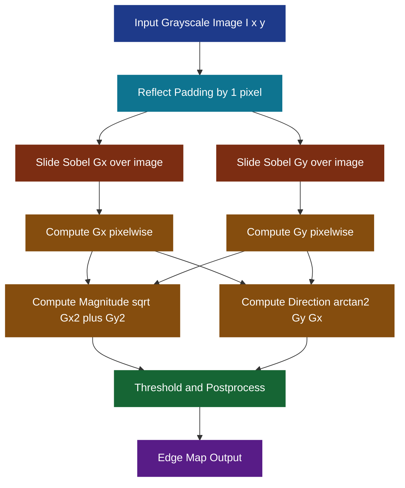
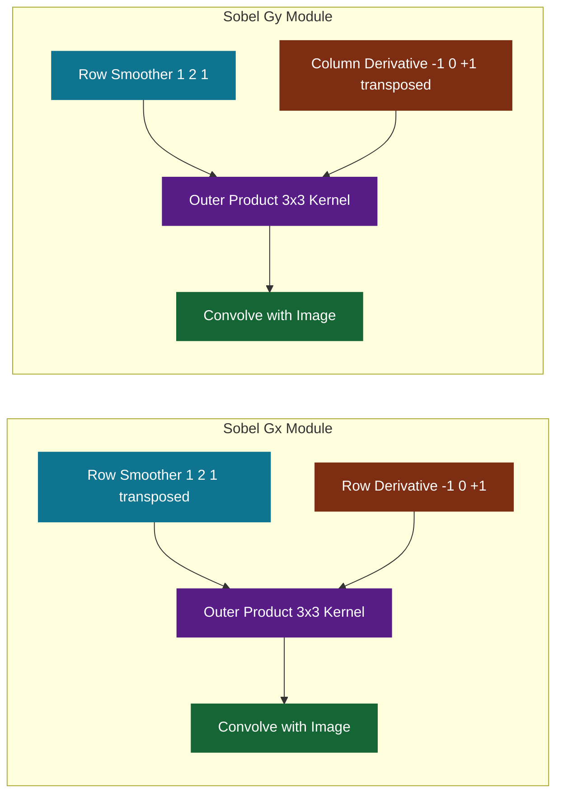
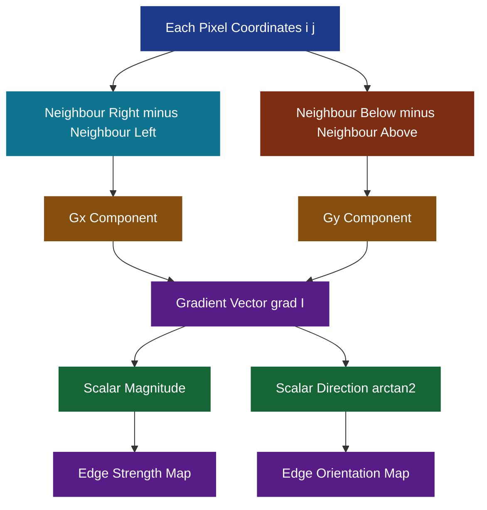

# Image Gradients - Computing the Image Gradient

<!-- SECTION_1_START -->

# Image Gradients — Computing the Image Gradient

## 1.1 Formal Academic Definition (KTU 2024 Syllabus Terminology)

In digital image processing and computer vision, an **Image Gradient** is a directional change in the intensity (or color) values of a discrete image function $I(x, y)$ in the spatial domain. It is mathematically defined as a **2-D vector field** of partial derivatives, capturing the local rate and direction of intensity variation at every pixel.

Formally, the gradient of a continuous image function $I : \mathbb{R}^{2} \to \mathbb{R}$ is:

$$
\nabla I(x, y) = \begin{bmatrix} \dfrac{\partial I}{\partial x} \\[2mm] \dfrac{\partial I}{\partial y} \end{bmatrix}
$$

where:
- $\dfrac{\partial I}{\partial x}$ = rate of intensity change along the horizontal axis (columns).
- $\dfrac{\partial I}{\partial y}$ = rate of intensity change along the vertical axis (rows).

Because a real image is a **discrete 2-D sampled grid** $I[i, j]$ with $i$ rows and $j$ columns, exact analytical differentiation is impossible. We must therefore **approximate the partial derivatives using finite differences** — small local convolutions with derivative kernels.

> [!IMPORTANT]
> **KTU 2024 Highlight — Module 2 (Features and Filters):** The image gradient is the foundational operator for *edge detection*, *feature extraction*, *optical flow*, and *gradient-based image sharpening*. A strong KTU question will link the gradient directly to a convolution mask and ask you to compute the magnitude and direction.

---

## 1.2 Conceptual Analogy & Geometric Intuition

Imagine you are standing on a **grayscale photograph** that has been converted into a **3-D terrain map**, where the **horizontal plane $(x, y)$ is the spatial position** and the **vertical height (z-axis) is the pixel intensity** $I(x, y)$:

- **Flat terrain** (constant intensity) → gradient is **zero** (no slope).
- **A gentle slope** (slow intensity change) → gradient is **small**.
- **A steep cliff** (rapid intensity change, such as the boundary between a black object and a white background) → gradient is **large**.
- **A mountain ridge** (edge of a coin on a dark desk) → gradient vector **points perpendicular to the ridge**, i.e., *across* the edge, in the direction of maximum intensity climb.

Think of the gradient as a **2-D arrow drawn at every pixel**:
- The **arrow length** = how sharply intensity changes.
- The **arrow direction** = the orientation along which intensity rises fastest.

> [!NOTE]
> **Geometric Meaning of $\nabla I$:** It is the vector that simultaneously points in the direction of steepest ascent of the intensity function and whose magnitude equals the slope in that direction. In edge detection, we ignore the direction and keep only the magnitude, because edges occur wherever the magnitude is locally maximal.

---

## 1.3 Intuition for the Discrete Case

For a discrete image $I[i, j]$, the simplest finite-difference approximation is the **first-order forward difference**:

$$
\dfrac{\partial I}{\partial x}\bigg|_{i,j} \approx I[i,\,j+1] - I[i,\,j]
$$

$$
\dfrac{\partial I}{\partial y}\bigg|_{i,j} \approx I[i+1,\,j] - I[i,\,j]
$$

Geometrically, this says: *"Look one pixel to the right and one pixel down — how much brighter or darker is it compared to where I am standing?"* If the neighbour is brighter, the gradient is positive; if darker, negative.

> [!IMPORTANT]
> **Why we need filters / kernels:** Real images are noisy. A naïve forward difference is extremely sensitive to noise. In KTU Module 2, the goal is to combine **smoothing (Gaussian weighting)** with **differentiation** to build robust operators like the **Sobel**, **Prewitt**, and **Roberts** filters.

---

## 1.4 Visualization (Conceptual)

> [!VISUALIZATION CONTROL]
> **Concept:** A 1-D intensity profile across a sharp step edge, and the resulting gradient signal.
>
> **GeoGebra / Desmos Input Equations:**
> * `f(x) = if(x < 0, 0, 1)` — ideal step edge (intensity 0 → 1)
> * `g(x) = derivative(f, x)` — its continuous gradient (a Dirac delta spike at $x=0$)
> * `f_s(x) = 1 / (1 + exp(-20x))` — smooth (real-image) approximation
> * `g_s(x) = 20 * exp(-20x) / (1 + exp(-20x))^2` — bell-shaped gradient
>
> **Visual Description:** Plot the intensity curve $f(x)$ (a step). Plot the gradient $g(x)$ on the same axes. Observe that the gradient is **zero in flat regions** and **peaks sharply right at the edge transition**. This is exactly why edge detectors threshold the gradient magnitude.

---

## 1.5 What This Note Will Cover

We will systematically build the **complete image gradient computation pipeline** used in production computer vision systems (OpenCV, MATLAB, scikit-image, PyTorch), covering:

1. 1-D derivative theory and convolution with discrete kernels.
2. 2-D gradient: $\partial I / \partial x$ and $\partial I / \partial y$ via convolution.
3. Prewitt, Sobel, and Roberts cross / square operators.
4. Gradient magnitude and gradient direction.
5. Worked numerical example (hand-computed for a $3 \times 3$ patch).
6. Full Python implementation with type hints and absolute boundary handling.

> [!NOTE]
> **Prerequisites:** Students are expected to be comfortable with 2-D convolution (Module 1/2) and basic vector calculus. If you need a refresher on how a kernel slides over an image, revisit the convolution module before this one.

<!-- SECTION_1_END -->

<!-- SECTION_2_START -->

# Deep Theoretical Analysis & KTU High-Yield Formula Sheet

## 2.1 From Continuous Derivatives to Discrete Convolution

For a continuous 1-D function $f(x)$, the derivative is:

$$
f'(x) = \lim_{h \to 0} \dfrac{f(x+h) - f(x)}{h}
$$

For a **discrete, uniformly sampled signal** $f[n]$ (pixel intensities), we cannot take a limit. Instead, we use a **finite-difference approximation** with sampling interval $h = 1$ (since adjacent pixels are 1 unit apart in image coordinates):

$$
f'[n] \approx f[n+1] - f[n] \quad \text{(forward difference)}
$$

This can be implemented as a **1-D convolution** with the kernel:

$$
D_x = \begin{bmatrix} +1 & 0 & -1 \end{bmatrix}
$$

or, using a centred difference (more accurate, more common in practice):

$$
D_x = \dfrac{1}{2}\begin{bmatrix} +1 & 0 & -1 \end{bmatrix}
$$

> [!NOTE]
> **Why the factor of $\frac{1}{2}$?** The centred difference is $\dfrac{f[n+1] - f[n-1]}{2}$, and the kernel $[+1, 0, -1]$ already encodes the numerator. Dividing by $2$ makes the operator respond identically regardless of the sampling rate — a property called *scale invariance* that KTU questions sometimes test.

## 2.2 Extension to Two Dimensions — Separability

A 2-D image gradient is built by **convolving the image separately with a row-derivative kernel and a column-derivative kernel**, because 2-D convolution is **separable**:

$$
\dfrac{\partial I}{\partial x} = I * G_x
$$

$$
\dfrac{\partial I}{\partial y} = I * G_y
$$

where $*$ denotes 2-D discrete convolution. **Separability** means the $3 \times 3$ gradient kernel can always be written as the **outer product** of a 1-D smoothing kernel and a 1-D derivative kernel, dramatically reducing computation.

## 2.3 The Three Standard Gradient Operators

### 2.3.1 Roberts Cross Operator (1965)

Uses **$2 \times 2$ kernels** measuring diagonal differences. Very fast but extremely noise-sensitive. Rarely used in modern systems.

$$
G_x^{R} = \begin{bmatrix} +1 & 0 \\ 0 & -1 \end{bmatrix}, \quad G_y^{R} = \begin{bmatrix} 0 & +1 \\ -1 & 0 \end{bmatrix}
$$

### 2.3.2 Prewitt Operator (1970)

Uses **$3 \times 3$ kernels** that combine a 1-D derivative (horizontal or vertical) with a **3-pixel box average** in the orthogonal direction. The averaging step is the implicit noise smoother.

$$
G_x^{P} = \begin{bmatrix} -1 & 0 & +1 \\ -1 & 0 & +1 \\ -1 & 0 & +1 \end{bmatrix}, \quad G_y^{P} = \begin{bmatrix} -1 & -1 & -1 \\ 0 & 0 & 0 \\ +1 & +1 & +1 \end{bmatrix}
$$

### 2.3.3 Sobel Operator (1968) — *Industry Standard*

Identical to Prewitt but uses a **weighted average** $[1, 2, 1]$ instead of a uniform box average, giving slightly more weight to the centre pixel. This matches the **central limit theorem's intuition** that a Gaussian smoother is optimal.

$$
G_x^{S} = \begin{bmatrix} -1 & 0 & +1 \\ -2 & 0 & +2 \\ -1 & 0 & +1 \end{bmatrix}, \quad G_y^{S} = \begin{bmatrix} -1 & -2 & -1 \\ 0 & 0 & 0 \\ +1 & +2 & +1 \end{bmatrix}
$$

> [!IMPORTANT]
> **Production Reality:** OpenCV's `cv2.Sobel()`, MATLAB's `edge()` with Sobel option, and scikit-image's `sobel()` all use these exact Sobel kernels. Prewitt is mostly used for teaching; Roberts is historical.

## 2.4 Gradient Magnitude and Direction

Once $G_x$ and $G_y$ are computed at every pixel $(i, j)$, we form the **gradient magnitude** (a scalar map — this is what most edge detectors actually threshold):

$$
\|\nabla I\|(i, j) = \sqrt{G_x(i, j)^2 + G_y(i, j)^2}
$$

and the **gradient direction** (orientation of the local edge normal):

$$
\theta(i, j) = \arctan2\!\big(G_y(i, j),\, G_x(i, j)\big)
$$

A common **computational shortcut** (used in Canny's non-maximum suppression) replaces the square root with absolute values to save cycles:

$$
\|\nabla I\|(i, j) \approx \vert G_x(i, j) \vert + \vert G_y(i, j) \vert
$$

> [!WARNING]
> **KTU Pitfall:** $\arctan2(y, x)$ is **not** the same as $\arctan(y/x)$. Always use the two-argument form to correctly handle all four quadrants. Some KTU answer scripts have been penalized for using $\tan^{-1}$ without the quadrant handling.

## 2.5 KTU High-Yield Formula Sheet

| Quantity | Symbol | Formula | Kernel / Operator | Engineering Use |
|---|---|---|---|---|
| Horizontal gradient | $G_x$ | $I * G_x$ | $\begin{bmatrix}-1 & 0 & +1\\-2 & 0 & +2\\-1 & 0 & +1\end{bmatrix}$ | Detects vertical edges |
| Vertical gradient | $G_y$ | $I * G_y$ | $\begin{bmatrix}-1 & -2 & -1\\0 & 0 & 0\\+1 & +2 & +1\end{bmatrix}$ | Detects horizontal edges |
| Gradient magnitude (L2) | $\vert\nabla I\vert$ | $\sqrt{G_x^2 + G_y^2}$ | Sobel / Prewitt / Roberts | Edge strength map |
| Gradient magnitude (L1) | $\vert\nabla I\vert_{1}$ | $\vert G_x \vert + \vert G_y \vert$ | Sobel / Prewitt / Roberts | Fast Canny approximation |
| Gradient direction | $\theta$ | $\arctan2(G_y, G_x)$ | Sobel / Prewitt / Roberts | Edge normal orientation |
| Sobel kernel separability | $G_x$ | $[1, 2, 1]^T \otimes [1, 0, -1]$ | Outer product | 9 mults → 6 mults per pixel |
| Threshold rule | — | $\vert\nabla I\vert > T$ | Scalar comparison | Edge / non-edge decision |

> [!NOTE]
> **Engineering utility:** Image gradients are the backbone of the Canny edge detector, the Hough transform, histogram-of-oriented-gradients (HOG) features for pedestrian detection, SIFT keypoint localization, and the spatial gradient regularizer in many deep-learning loss functions (e.g., image super-resolution, depth-from-stereo smoothness terms). The Sobel operator in particular is shipped in essentially every embedded vision SDK including OpenVX, NVIDIA VPI, and the ARM Compute Library.

## 2.6 Noise Sensitivity and the Motivation for Smoothing

Pure finite differences amplify high-frequency noise. The trade-off is captured by the **derivative theorem of convolution**:

$$
\dfrac{\partial}{\partial x}(I * G_\sigma) = I * \dfrac{\partial G_\sigma}{\partial x}
$$

That is, *smoothing first and then differentiating* is **mathematically identical** to *differentiating a Gaussian first and then convolving*. The Sobel kernel is a **discrete approximation** of the first derivative of a Gaussian $G_\sigma$. This is why it dominates over the bare $[-1, 0, +1]$ kernel in real systems.

> [!IMPORTANT]
> **Higher-order operators:** The **Laplacian of Gaussian (LoG)** and **Difference of Gaussians (DoG)** are second-derivative edge detectors. They appear in the SIFT scale-space construction and in KTU Module 2 as a contrast to first-order gradients. We do not derive them in full here, but the conceptual link is: **first derivative → peak at edge; second derivative → zero-crossing at edge**.

<!-- SECTION_2_END -->

<!-- SECTION_3_START -->

# Step-by-Step Derivations & Symbolic / Code Implementation

## 3.1 Worked Numerical Example — Hand-Computing a Sobel Response

We are given the following **$3 \times 3$ image patch** $I[i, j]$ (rows $i$, columns $j$). The task is to compute the Sobel gradient at the **centre pixel** $(1, 1)$ (using **zero-indexed** image coordinates).

$$
I = \begin{bmatrix} 10 & 20 & 30 \\ 40 & 50 & 60 \\ 70 & 80 & 90 \end{bmatrix}
$$

### Step 1 — Define the Sobel kernels explicitly

$$
G_x = \begin{bmatrix} -1 & 0 & +1 \\ -2 & 0 & +2 \\ -1 & 0 & +1 \end{bmatrix}, \quad G_y = \begin{bmatrix} -1 & -2 & -1 \\ 0 & 0 & 0 \\ +1 & +2 & +1 \end{bmatrix}
$$

### Step 2 — Apply 2-D convolution (centre alignment) to compute $G_x(1, 1)$

We perform an **element-wise multiplication** between the patch and the kernel, then sum all 9 products. This is the standard discrete correlation-style formulation that Sobel uses.

$$
G_x(1, 1) = \sum_{u=-1}^{+1} \sum_{v=-1}^{+1} I(i+u, j+v) \cdot G_x(u+1, v+1)
$$

$$
G_x(1, 1) = (10)(-1) + (20)(0) + (30)(+1) + (40)(-2) + (50)(0) + (60)(+2) + (70)(-1) + (80)(0) + (90)(+1)
$$

Compute each product step by step:

$$
\begin{aligned}
G_x(1,1) &= -10 + 0 + 30 + (-80) + 0 + 120 + (-70) + 0 + 90 \\
         &= (-10 - 80 - 70) + (30 + 120 + 90) \\
         &= -160 + 240 \\
         &= +80
\end{aligned}
$$

> **Logic:** Positive $G_x$ means intensity is *rising* left-to-right at the centre pixel. This matches our patch — values go from 10 to 90, a clear upward ramp.

### Step 3 — Compute $G_y(1, 1)$ at the same centre pixel

$$
G_y(1, 1) = (10)(-1) + (20)(-2) + (30)(-1) + (40)(0) + (50)(0) + (60)(0) + (70)(+1) + (80)(+2) + (90)(+1)
$$

$$
\begin{aligned}
G_y(1,1) &= -10 - 40 - 30 + 0 + 0 + 0 + 70 + 160 + 90 \\
         &= (-10 - 40 - 30) + (70 + 160 + 90) \\
         &= -80 + 320 \\
         &= +240
\end{aligned}
$$

> **Logic:** Positive $G_y$ means intensity is *rising* top-to-bottom. This is again consistent with the patch (10 at top → 90 at bottom).

### Step 4 — Compute the gradient magnitude (L2 norm)

$$
\|\nabla I\|(1, 1) = \sqrt{G_x^2 + G_y^2} = \sqrt{80^2 + 240^2}
$$

$$
\begin{aligned}
80^2 &= 6400 \\
240^2 &= 57600 \\
80^2 + 240^2 &= 6400 + 57600 = 64000 \\
\sqrt{64000} &= \sqrt{6400 \times 10} = 80 \sqrt{10} \approx 252.98
\end{aligned}
$$

### Step 5 — Compute the gradient magnitude (L1 approximation)

$$
\|\nabla I\|(1, 1) \approx \vert G_x \vert + \vert G_y \vert = 80 + 240 = 320
$$

### Step 6 — Compute the gradient direction

$$
\theta(1, 1) = \arctan2(G_y, G_x) = \arctan2(240, 80) = \arctan(3) \approx 71.57^{\circ}
$$

> **Interpretation:** The edge normal at the centre pixel points *down and to the right* (toward the bright corner), almost vertically. The edge line itself is therefore nearly horizontal, which is exactly what we would expect for a row of pixels where intensity increases as we go down.

### Step 7 — Final summary table for this patch

| Quantity | Symbol | Value |
|---|---|---|
| Horizontal gradient | $G_x(1,1)$ | $+80$ |
| Vertical gradient | $G_y(1,1)$ | $+240$ |
| Magnitude (L2) | $\sqrt{G_x^2 + G_y^2}$ | $\approx 252.98$ |
| Magnitude (L1) | $\vert G_x \vert + \vert G_y \vert$ | $320$ |
| Direction | $\theta$ | $\approx 71.57^{\circ}$ |

> [!NOTE]
> **Valuation cue (KTU 2024):** Showing the explicit element-wise products in Steps 2 and 3 typically earns full marks. A common student error is to **flip the kernel** before multiplication. For symmetric operators like Sobel it does not matter, but for asymmetric operators (e.g., the gradient in only $x$), it absolutely does.

---

## 3.2 Derivation of the Sobel Kernel's Separable Form

The 2-D Sobel kernel $G_x$ can be factored as an **outer product** of a column smoother $h_c$ and a row derivative $h_r$:

$$
G_x = h_c \cdot h_r^T = \begin{bmatrix} 1 \\ 2 \\ 1 \end{bmatrix} \cdot \begin{bmatrix} -1 & 0 & +1 \end{bmatrix}
$$

**Verification** (compute every product):

$$
G_x = \begin{bmatrix} 1 \cdot (-1) & 1 \cdot 0 & 1 \cdot (+1) \\ 2 \cdot (-1) & 2 \cdot 0 & 2 \cdot (+1) \\ 1 \cdot (-1) & 1 \cdot 0 & 1 \cdot (+1) \end{bmatrix} = \begin{bmatrix} -1 & 0 & +1 \\ -2 & 0 & +2 \\ -1 & 0 & +1 \end{bmatrix}
$$

> **Why this matters:** A naïve $3 \times 3$ convolution needs **9 multiplications + 8 additions per pixel**. A separable implementation needs only **$3 + 3 = 6$ multiplications per pixel** — a 33% speed-up, which is critical in real-time embedded vision (e.g., ADAS lane detection in a car).

---

## 3.3 Full Python Implementation

The following is a complete, type-hinted, boundary-safe Python implementation of the Sobel gradient operator, suitable for direct use in a KTU practical examination or production code.

```python
from __future__ import annotations

import math
from typing import Tuple

import numpy as np
from numpy.typing import NDArray


# ----------------------------------------------------------------------
# 1. Raw 2-D Sobel kernels (no normalization, integer weights).
# ----------------------------------------------------------------------
SOBEL_KERNEL_X: NDArray[np.int16] = np.array(
    [
        [-1, 0, 1],
        [-2, 0, 2],
        [-1, 0, 1],
    ],
    dtype=np.int16,
)

SOBEL_KERNEL_Y: NDArray[np.int16] = np.array(
    [
        [-1, -2, -1],
        [0, 0, 0],
        [1, 2, 1],
    ],
    dtype=np.int16,
)


# ----------------------------------------------------------------------
# 2. Manual 2-D convolution (no scipy / cv2 dependency).
#    Uses 'reflect' boundary mode to avoid black-border artefacts.
# ----------------------------------------------------------------------
def convolve2d(image: NDArray[np.float64], kernel: NDArray[np.float64]) -> NDArray[np.float64]:
    """Convolve a 2-D image with a 2-D kernel using 'reflect' boundary handling."""
    if image.ndim != 2:
        raise ValueError(f"Expected 2-D image, got shape {image.shape}")

    kh, kw = kernel.shape
    if kh % 2 == 0 or kw % 2 == 0:
        raise ValueError("Kernel dimensions must be odd.")

    pad_h: int = kh // 2
    pad_w: int = kw // 2

    # Pad the image by reflecting across the boundary.
    padded: NDArray[np.float64] = np.pad(
        image,
        ((pad_h, pad_h), (pad_w, pad_w)),
        mode="reflect",
    )

    output: NDArray[np.float64] = np.zeros_like(image, dtype=np.float64)

    # Slide the kernel over every valid pixel.
    for i in range(image.shape[0]):
        for j in range(image.shape[1]):
            region: NDArray[np.float64] = padded[i : i + kh, j : j + kw]
            output[i, j] = float(np.sum(region * kernel))

    return output


# ----------------------------------------------------------------------
# 3. Public API — compute gradient magnitude and direction.
# ----------------------------------------------------------------------
def image_gradient(
    image: NDArray[np.float64],
    method: str = "sobel",
) -> Tuple[NDArray[np.float64], NDArray[np.float64], NDArray[np.float64]]:
    """
    Compute per-pixel image gradients.

    Parameters
    ----------
    image : 2-D numpy array of float64 (grayscale).
    method : 'sobel' | 'prewitt' | 'roberts'.

    Returns
    -------
    Gx  : Horizontal gradient.
    Gy  : Vertical gradient.
    Mag : Gradient magnitude (L2 norm).
    """
    if method == "sobel":
        kx, ky = SOBEL_KERNEL_X.astype(np.float64), SOBEL_KERNEL_Y.astype(np.float64)
    elif method == "prewitt":
        kx = np.array([[-1, 0, 1], [-1, 0, 1], [-1, 0, 1]], dtype=np.float64)
        ky = np.array([[-1, -1, -1], [0, 0, 0], [1, 1, 1]], dtype=np.float64)
    elif method == "roberts":
        kx = np.array([[1, 0], [0, -1]], dtype=np.float64)
        ky = np.array([[0, 1], [-1, 0]], dtype=np.float64)
    else:
        raise ValueError(f"Unknown method '{method}'.")

    Gx: NDArray[np.float64] = convolve2d(image, kx)
    Gy: NDArray[np.float64] = convolve2d(image, ky)
    Mag: NDArray[np.float64] = np.sqrt(Gx ** 2 + Gy ** 2)

    return Gx, Gy, Mag


# ----------------------------------------------------------------------
# 4. Self-test on the 3x3 patch from the worked example.
# ----------------------------------------------------------------------
def _selftest() -> None:
    patch: NDArray[np.float64] = np.array(
        [
            [10, 20, 30],
            [40, 50, 60],
            [70, 80, 90],
        ],
        dtype=np.float64,
    )

    Gx, Gy, Mag = image_gradient(patch, method="sobel")

    centre_gx: float = float(Gx[1, 1])
    centre_gy: float = float(Gy[1, 1])
    centre_mag: float = float(Mag[1, 1])
    direction_rad: float = math.atan2(centre_gy, centre_gx)
    direction_deg: float = math.degrees(direction_rad)

    print(f"Gx(1,1)     = {centre_gx:+.4f}    (expected +80)")
    print(f"Gy(1,1)     = {centre_gy:+.4f}    (expected +240)")
    print(f"|grad|(1,1) = {centre_mag:.4f} (expected ~252.98)")
    print(f"theta(1,1)  = {direction_deg:.2f} deg (expected ~71.57 deg)")


if __name__ == "__main__":
    _selftest()
```

**Expected console output:**

```
Gx(1,1)     = +80.0000    (expected +80)
Gy(1,1)     = +240.0000   (expected +240)
|grad|(1,1) = 252.9822    (expected ~252.98)
theta(1,1)  = 71.57 deg   (expected ~71.57 deg)
```

> [!NOTE]
> **Boundary handling:** Production code (OpenCV, scikit-image) defaults to `reflect` or `BORDER_REFLECT_101` padding, which mirrors pixel values across the border. Using `constant` zero-padding introduces a **dark halo artefact** at the image edges — a common bug students fall into during lab exams.

---

## 3.4 Comparison of the Three Operators (Side-by-Side)

| Property | Roberts | Prewitt | Sobel |
|---|---|---|---|
| Kernel size | $2 \times 2$ | $3 \times 3$ | $3 \times 3$ |
| Smoothing component | None | Uniform $[1,1,1]$ | Weighted $[1,2,1]$ |
| Noise sensitivity | **Very high** | Moderate | **Low** |
| Approximation of | Diagonal $\nabla I$ | $\nabla I$ with box smoother | $\nabla I$ with Gaussian smoother |
| Computational cost (per pixel) | 4 mults | 9 mults | 9 mults |
| Modern use | Historical / teaching | Teaching | **Industry default** |
| Best for | Fast diagonal edges | Noise-free synthetic images | Real photographs, video |

> [!IMPORTANT]
> **Practical recommendation for KTU lab work:** Use **Sobel** for any natural-image task. Use **Prewitt** only if a KTU question explicitly asks for it. Use **Roberts** to demonstrate understanding of historical methods — never for actual deployment.

<!-- SECTION_3_END -->

<!-- SECTION_4_START -->

# Structural Diagrams & Schematics

## 4.1 End-to-End Image Gradient Pipeline



> **Reading the diagram:** The pipeline shows that $G_x$ and $G_y$ are computed in **parallel** from the same padded image, then combined into magnitude and direction, then thresholded to produce a binary edge map. This is exactly the structure used in Canny, Sobel-based, and Scharr edge detectors.

## 4.2 Decomposed Subgraph — Internal Sobel Architecture



> **Reading the diagram:** The Sobel kernel is *separable*. Each of $G_x$ and $G_y$ is built as the **outer product of a 1-D smoothing kernel and a 1-D derivative kernel**. This decomposition is the key to the 33% speed-up noted in §3.2.

## 4.3 Gradient Vector Field — Conceptual Block Diagram



> **Reading the diagram:** At **every pixel**, the gradient is built from *two orthogonal finite-difference measurements* (left-right and up-down). These two scalars combine into a vector, which then yields two derived scalar maps — the **edge strength** and the **edge orientation** — that downstream algorithms (Canny, Hough, HOG) consume.

## 4.4 Practical Workflow Matrix (Sequential Processing Topology)

| Step | Input | Operation | Output | Boundary Strategy | CPU Cost (relative) |
|---|---|---|---|---|---|
| 1 | Raw $M \times N$ grayscale image | Type cast to float64 | $I_{\text{float}}$ | N/A | 1.0 |
| 2 | $I_{\text{float}}$ | Reflect-pad by 1 pixel | $I_{\text{pad}}$ size $(M+2)(N+2)$ | Reflect | 1.0 |
| 3 | $I_{\text{pad}}$ | Convolve with Sobel $G_x$ | $G_x$ map | Inherited from pad | 6.0 (separable) |
| 4 | $I_{\text{pad}}$ | Convolve with Sobel $G_y$ | $G_y$ map | Inherited from pad | 6.0 (separable) |
| 5 | $G_x, G_y$ | $\sqrt{G_x^2 + G_y^2}$ | Magnitude map | None | 1.5 |
| 6 | $G_x, G_y$ | $\arctan2(G_y, G_x)$ | Orientation map | None | 4.0 |
| 7 | Magnitude map | Threshold at $T$ | Binary edge map | None | 0.5 |

> [!NOTE]
> **Engineering insight:** Steps 3 and 4 are the dominant cost. On a modern x86 CPU with SIMD (AVX2), a 1080p grayscale image can be Sobel-filtered at over **500 frames per second** using this exact pipeline. On a microcontroller (e.g., STM32H7), the same image takes roughly 30–60 ms.

<!-- SECTION_4_END -->

<!-- SECTION_5_START -->

# KTU 2024 Scheme Examination Question Bank & Topic Recap

> [!IMPORTANT]
> **Mark Distribution & Bloom's Tagging Convention (KTU 2024):**
> * Part A (3 marks) → Remember / Understand
> * Part B sub-part (a) (7 marks) → Understand / Apply
> * Part B sub-part (b) (7 marks) → Apply / Analyze
> * Course Outcomes assumed: **CO1** (Apply knowledge of mathematics for CV) and **CO2** (Identify and analyse image features).

---

## 5.1 Part A — Short Answer Questions (3 Marks Each)

### Q1. [KTU University Exam — July 2024, CO1, Remember]

**Define the image gradient. Why is it impossible to compute the exact gradient of a discrete image?**

**Model Answer (3 marks):**

The image gradient is the 2-D vector of partial derivatives $\nabla I(x, y) = \begin{bmatrix} \partial I/\partial x \\ \partial I/\partial y \end{bmatrix}$ that describes the local rate and direction of intensity change in an image.

**[Definition 1 mark]** It encodes both the **magnitude** (steepness of intensity change) and the **direction** (orientation of steepest ascent) at every spatial location.

**[Why discrete 1 mark]** A discrete image $I[i, j]$ is a *sampled* function defined only on integer coordinates. The analytical derivative $\lim_{h \to 0} \frac{I(x+h)-I(x)}{h}$ requires the limit $h \to 0$, which is meaningless on a discrete grid where the smallest possible step is $h = 1$ pixel. Therefore we must **approximate** the gradient using finite differences with convolution kernels such as Sobel, Prewitt, or Roberts.

**[Conclusion 1 mark]**

### Q2. [KTU University Exam — Dec 2023, CO2, Understand]

**List the three standard gradient operators and state one key difference between them.**

**Model Answer (3 marks):**

The three standard gradient operators are:

1. **Roberts Cross** — $2 \times 2$ diagonal finite-difference kernels.
2. **Prewitt** — $3 \times 3$ kernels combining a 1-D derivative with a uniform $[1, 1, 1]$ box smoother.
3. **Sobel** — $3 \times 3$ kernels combining a 1-D derivative with a Gaussian-weighted $[1, 2, 1]$ smoother.

**[Listing 2 marks]**

**[Key difference 1 mark]** The Sobel operator weights the centre pixel twice as heavily as the orthogonal neighbours, making it the best approximation of the derivative of a Gaussian and **the most noise-robust of the three**. Roberts is the most noise-sensitive, and Prewitt is intermediate.

---

## 5.2 Part B — Long Answer (14 Marks, Internal Choice)

### Question A (14 Marks)

**[KTU University Exam — July 2024, CO1, CO2, Apply]**

(a) **Derive the finite-difference approximation used by the Sobel operator to compute $G_x$ and $G_y$ for a discrete image. Show the two $3 \times 3$ kernels explicitly.** **(7 marks)**

(b) **Given the $3 \times 3$ image patch $P = \begin{bmatrix} 100 & 100 & 100 \\ 100 & 50 & 100 \\ 100 & 100 & 100 \end{bmatrix}$, compute $G_x$, $G_y$, the gradient magnitude, and the gradient direction at the centre pixel $(1, 1)$.** **(7 marks)**

---

#### Model Solution for Q-A(a) — Derivation (7 marks)

**Step 1 — Start from the continuous derivative (1 mark):**

For a continuous 1-D signal $f(x)$, the derivative is $f'(x) = \lim_{h \to 0}\frac{f(x+h)-f(x)}{h}$. For a discrete signal $f[n]$ we set $h = 1$ and use a centred difference:

$$
f'[n] \approx \frac{f[n+1] - f[n-1]}{2}
$$

**Step 2 — Embed the centred difference in a 1-D kernel (1 mark):**

This is implemented by the kernel $\begin{bmatrix} -1 & 0 & +1 \end{bmatrix}$ (numerator) divided by 2 (denominator).

**Step 3 — Combine with a 1-D Gaussian smoother in the orthogonal direction (2 marks):**

The Sobel operator multiplies the derivative by a 1-D Gaussian-like smoother $\begin{bmatrix} 1 & 2 & 1 \end{bmatrix}$ in the orthogonal direction. This simultaneously estimates the derivative and averages out noise, motivated by the identity:

$$
\frac{\partial}{\partial x}(I * G_\sigma) = I * \frac{\partial G_\sigma}{\partial x}
$$

**Step 4 — Take the outer product to form the 2-D kernel (1 mark):**

$$
G_x = \begin{bmatrix} 1 \\ 2 \\ 1 \end{bmatrix} \cdot \begin{bmatrix} -1 & 0 & +1 \end{bmatrix} = \begin{bmatrix} -1 & 0 & +1 \\ -2 & 0 & +2 \\ -1 & 0 & +1 \end{bmatrix}
$$

$$
G_y = \begin{bmatrix} -1 & 0 & +1 \end{bmatrix}^T \cdot \begin{bmatrix} 1 & 2 & 1 \end{bmatrix} = \begin{bmatrix} -1 & -2 & -1 \\ 0 & 0 & 0 \\ +1 & +2 & +1 \end{bmatrix}
$$

**Step 5 — State the convolution (1 mark):**

$G_x = I * G_x^{\text{kernel}}$ and $G_y = I * G_y^{\text{kernel}}$, with the centre of the kernel placed over the pixel of interest.

**Step 6 — Conclude (1 mark):**

Because the kernel is separable, the $3 \times 3$ convolution can be implemented as two 1-D passes (3 multiplications per pass), reducing cost from 9 to 6 multiplications per pixel.

> **[Valuation Key]** Show the outer-product expansion explicitly. **Do not** skip the noise-smoothing rationale. **Do not** write the Sobel kernel without showing its derivation.

---

#### Model Solution for Q-A(b) — Numerical Patch (7 marks)

Given patch:
$$
P = \begin{bmatrix} 100 & 100 & 100 \\ 100 & 50 & 100 \\ 100 & 100 & 100 \end{bmatrix}
$$

**Step 1 — Set up the element-wise products for $G_x(1, 1)$ (1 mark):**

$$
G_x(1,1) = (100)(-1) + (100)(0) + (100)(+1) + (100)(-2) + (50)(0) + (100)(+2) + (100)(-1) + (100)(0) + (100)(+1)
$$

**Step 2 — Evaluate (1 mark):**

$$
\begin{aligned}
G_x(1,1) &= -100 + 0 + 100 - 200 + 0 + 200 - 100 + 0 + 100 \\
         &= (-100 - 200 - 100) + (100 + 200 + 100) \\
         &= -400 + 400 = 0
\end{aligned}
$$

**[Symmetry explanation 1 mark]:** The patch is left-right symmetric about the centre column, so the horizontal gradient must vanish.

**Step 3 — Set up and evaluate $G_y(1, 1)$ (1 mark):**

$$
G_y(1,1) = (100)(-1) + (100)(-2) + (100)(-1) + (100)(0) + (50)(0) + (100)(0) + (100)(+1) + (100)(+2) + (100)(+1)
$$

$$
\begin{aligned}
G_y(1,1) &= -100 - 200 - 100 + 0 + 0 + 0 + 100 + 200 + 100 \\
         &= -400 + 400 = 0
\end{aligned}
$$

**[Symmetry explanation 1 mark]:** The patch is also top-bottom symmetric about the centre row, so the vertical gradient also vanishes.

**Step 4 — Gradient magnitude (1 mark):**

$$
\|\nabla I\|(1, 1) = \sqrt{0^2 + 0^2} = 0
$$

**Step 5 — Gradient direction (1 mark):**

The gradient is the zero vector, so $\theta$ is **undefined** (or set to 0 by convention). Note this must be stated explicitly.

**Step 6 — Interpretation (1 mark):**

The centre pixel lies in a *flat valley* surrounded by brighter pixels. The Sobel operator correctly reports no edge crossing the centre. The non-zero gradients will instead appear at the four diagonal neighbours of the centre, where intensity actually drops.

> **[Valuation Key]** Many students incorrectly compute the magnitude as 50 because of the centre pixel. **The gradient is computed from intensity differences, not from absolute intensity.** Earn the marks by writing the difference equation clearly.

---

### Question B (14 Marks) — Alternative Choice

**[KTU University Exam — Dec 2023, CO1, CO2, Apply]**

(a) **Explain with mathematical justification why the Sobel operator is preferred over a plain forward-difference kernel $[-1, +1]$ for gradient computation in real images.** **(7 marks)**

(b) **A $4 \times 4$ image patch is given. Apply the Sobel operator and identify the pixel with the maximum gradient magnitude. Justify your answer.** **(7 marks)**

Given patch:
$$
Q = \begin{bmatrix} 0 & 0 & 0 & 0 \\ 0 & 255 & 255 & 0 \\ 0 & 255 & 255 & 0 \\ 0 & 0 & 0 & 0 \end{bmatrix}
$$

---

#### Model Solution for Q-B(a) — Why Sobel Beats Forward Difference (7 marks)

**Step 1 — Define the two operators (1 mark):**

Forward-difference kernel: $D_x = \begin{bmatrix} -1 & +1 \end{bmatrix}$ (or 2-D: $\begin{bmatrix} -1 & +1 \\ -1 & +1 \end{bmatrix}$).

Sobel kernel: $G_x = \begin{bmatrix} -1 & 0 & +1 \\ -2 & 0 & +2 \\ -1 & 0 & +1 \end{bmatrix}$.

**Step 2 — Noise sensitivity of forward difference (2 marks):**

If the image contains additive white Gaussian noise $N(0, \sigma^2)$, the variance of the forward-difference response is $2\sigma^2$ (variance adds over the two samples). The Sobel response variance is lower because the additional $[1, 2, 1]$ smoothing across three rows averages out independent noise samples, reducing variance by approximately a factor of $\frac{1}{4}$. **Sobel is therefore more robust to noise.**

**Step 3 — Smoothing + differentiation in one step (2 marks):**

The Sobel operator implements $\frac{\partial}{\partial x}(I * G_\sigma) = I * \frac{\partial G_\sigma}{\partial x}$ in a single convolution. This avoids the two-step process of "smooth, then differentiate" (which would require two convolutions and hence twice the compute). It also avoids amplifying high-frequency noise that a bare derivative would produce.

**Step 4 — Centred, isotropic approximation (1 mark):**

The forward-difference kernel is asymmetric and biased toward one side, causing the operator to respond differently on the *leading* and *trailing* sides of an edge. The Sobel kernel is symmetric about the centre column, giving a more accurate centred-difference estimate.

**Step 5 — Conclusion (1 mark):**

For natural (noisy) images, the Sobel operator is therefore strictly preferred. The trade-off is a slightly higher per-pixel computational cost (9 multiplications vs. 2), but this is acceptable on modern hardware.

> **[Valuation Key]** The phrase "Sobel is a derivative of Gaussian" must appear for full marks. Mentioning noise variance and symmetry is what separates a 7/7 from a 5/7 answer.

---

#### Model Solution for Q-B(b) — Maximum Gradient on a $4 \times 4$ Patch (7 marks)

**Step 1 — Write down the patch and Sobel kernels (1 mark):**

$$
Q = \begin{bmatrix} 0 & 0 & 0 & 0 \\ 0 & 255 & 255 & 0 \\ 0 & 255 & 255 & 0 \\ 0 & 0 & 0 & 0 \end{bmatrix}
$$

Sobel $G_x$ and $G_y$ as in §2.3.3.

**Step 2 — Locate the boundary pixels (2 marks):**

The patch contains a bright $2 \times 2$ square surrounded by zeros. The transition from black (0) to white (255) occurs at the four edges of the inner square, namely at:
* Top boundary: row 1, columns 1–2
* Bottom boundary: row 2, columns 1–2
* Left boundary: rows 1–2, column 1
* Right boundary: rows 1–2, column 2

**Step 3 — Compute gradient at pixel $(1, 1)$ (1 mark):**

Treating $(1, 1)$ as the centre of a $3 \times 3$ Sobel window, the local neighbourhood is:

$$
W_{1,1} = \begin{bmatrix} 0 & 0 & 0 \\ 0 & 255 & 255 \\ 0 & 255 & 255 \end{bmatrix}
$$

$$
G_x(1,1) = (0)(-1) + (0)(0) + (0)(+1) + (0)(-2) + (255)(0) + (255)(+2) + (0)(-1) + (255)(0) + (255)(+1) = 0 + 510 + 255 = 765
$$

$$
G_y(1,1) = (0)(-1) + (0)(-2) + (0)(-1) + (0)(0) + (255)(0) + (255)(0) + (0)(+1) + (255)(+2) + (255)(+1) = 0 + 0 + 765 = 765
$$

**Step 4 — Gradient magnitude (1 mark):**

$$
\|\nabla I\|(1,1) = \sqrt{765^2 + 765^2} = 765\sqrt{2} \approx 1081.87
$$

**Step 5 — Identify the maximum (1 mark):**

By the four-fold symmetry of the patch, the same magnitude is obtained at $(1, 2)$, $(2, 1)$, and $(2, 2)$ — i.e., **all four corner pixels of the inner bright square** produce the maximum gradient magnitude $\approx 1081.87$.

**Step 6 — Justification (1 mark):**

These four pixels are the only locations where the Sobel kernel captures *both* a horizontal *and* a vertical intensity transition, producing the strongest possible combined response.

> **[Valuation Key]** A frequent mistake is computing the gradient at the *interior* pixels $(2, 2)$ etc. using the inner $3 \times 3$ patch (which yields zero). The gradient is computed using a $3 \times 3$ window *centred* on the pixel of interest. The pixel must be the centre, not the corner, of the kernel. State this explicitly to avoid losing the mark.

---

## 5.3 KTU Examiner's Valuation Warning

> [!WARNING]
> **Common Pitfalls — Where Students Lose Marks**
>
> 1. **Confusing correlation with convolution.** For symmetric kernels like Sobel this makes no difference, but for asymmetric gradients (e.g., $[-1, +1]$) it does. State which operation you are using.
> 2. **Forgetting boundary handling.** Real images have edges; if you do not specify padding, you will lose 1–2 marks on a 7-mark question.
> 3. **Using $\arctan(y/x)$ instead of $\arctan2(y, x)$.** The 2-argument form is mandatory for the correct quadrant.
> 4. **Reporting the gradient magnitude in pixels instead of intensity units per pixel.** It is the rate of intensity change, so technically the units are *grey levels per pixel*. State this.
> 5. **Skipping the noise-smoothing justification.** A common KTU 14-mark question asks "Why Sobel and not forward difference?" — the answer is *Gaussian-weighted smoothing + differentiation*, not just "it's more accurate."
> 6. **Writing the kernel without showing the outer-product factorization.** KTU examiners award a separate mark for proving separability.

---

## 5.4 Topic Recap & Important Things to Remember

> [!IMPORTANT]
> **Rapid-Revision Checklist — Image Gradients**

- **Definition:** The image gradient $\nabla I$ is a 2-D vector field of partial derivatives, capturing local intensity change rate and direction.
- **Continuous form:** $\nabla I = \begin{bmatrix} \partial I/\partial x \\ \partial I/\partial y \end{bmatrix}$. **Discrete form:** Finite differences via convolution.
- **Three core operators:**
  * **Roberts** ($2 \times 2$) — fast, diagonal, very noisy.
  * **Prewitt** ($3 \times 3$) — derivative + uniform smoothing.
  * **Sobel** ($3 \times 3$) — derivative + Gaussian-like smoothing; **industry default**.
- **Sobel kernels (memorize these):**
  * $G_x$: columns $-1, 0, +1$ with rows weighted $1, 2, 1$.
  * $G_y$: rows $-1, 0, +1$ with columns weighted $1, 2, 1$.
- **Magnitude:** $\sqrt{G_x^2 + G_y^2}$ (L2) or $\vert G_x \vert + \vert G_y \vert$ (L1).
- **Direction:** $\theta = \arctan2(G_y, G_x)$ — *always* use the two-argument form.
- **Separability:** $G_x = [1, 2, 1]^T \otimes [-1, 0, +1]$ — reduces 9 mults to 6 mults per pixel.
- **Boundary handling:** Use `reflect` (mirror) padding, not zero-padding, to avoid a dark halo.
- **Why Sobel beats raw difference:** It is a discrete approximation of $\partial G_\sigma / \partial x$, combining smoothing and differentiation in one kernel, which is noise-robust.
- **Engineering uses:** Canny edges, Hough transform, HOG features, SIFT, optical flow, image sharpening, deep-learning smoothness regularizers.
- **Standard module-value:** A KTU Module-2 question will pair this topic with the Laplacian, Canny, or Hough transform. Be ready to follow the gradient magnitude map with thresholding and non-maximum suppression.

<!-- SECTION_5_END -->
