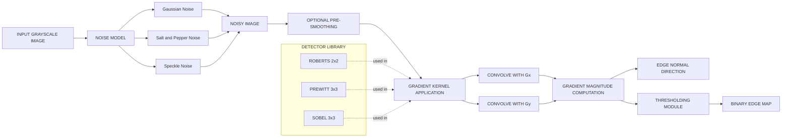

# Noise, Edges and Gradient-based Edge Detectors

<!-- SECTION_1_START -->
# Noise, Edges and Gradient-based Edge Detectors

## 1.1 Formal Definition

**Image Noise** is defined as any random, unwanted variation in pixel intensity that does not correspond to the true underlying scene radiance. Mathematically, if $I_{true}(x,y)$ is the ideal noise-free image, the observed (noisy) image is modeled as:

$$I_{obs}(x,y) = I_{true}(x,y) + \eta(x,y)$$

where $\eta(x,y)$ is a stochastic noise process. In the KTU 2024 syllabus, the most commonly studied noise models are **Gaussian Noise**, **Salt-and-Pepper (Impulse) Noise**, **Poisson (Shot) Noise**, and **Speckle Noise**.

**An Edge** in an image is a locus of pixels where the local image intensity (or color) undergoes a sharp discontinuity. Equivalently, an edge corresponds to a boundary between two regions of relatively homogeneous intensity. Formally, an edge is identified as a pixel location where the magnitude of the image gradient exceeds a local threshold:

$$\vert \nabla I \vert = \sqrt{\left(\frac{\partial I}{\partial x}\right)^2 + \left(\frac{\partial I}{\partial y}\right)^2} \geq T$$

**Gradient-based Edge Detectors** are a class of linear spatial filters that approximate the first-order partial derivatives $\partial I/\partial x$ and $\partial I/\partial y$ of the image intensity function. The detectors of interest in this module are the **Roberts Cross Operator**, the **Prewitt Operator**, and the **Sobel Operator**.

> [!IMPORTANT]
> **KTU 2024 Syllabus Anchor (Module 2):** Students must clearly distinguish between *image smoothing/denoising* (low-pass filtering) and *edge detection* (high-pass filtering). A common examiner trap is conflating the two operations.

## 1.2 Intuitive Overview & Conceptual Analogy

Imagine you are looking at a black-and-white photograph of a white ceramic cube resting on a dark wooden table. The physical boundary between the cube and the table is, in the image, a line of pixels where brightness suddenly jumps from near-white to near-dark. That sharp jump is what we call an **edge**.

Now imagine the same photograph but with a heavy layer of "TV static" sprinkled on top. The static is **noise** — random speckles that are not part of the real scene. The static makes it hard to see the edges clearly because it introduces small, random gradients everywhere. The job of an edge detector is to *find the real, large jumps* while *ignoring the small random ones*.

The **gradient** is just the formal mathematical name for "rate of change." A gradient-based edge detector slides a small **kernel** (a $2\times2$ or $3\times3$ numerical stencil) across the image and computes, at each pixel, "how quickly is the intensity changing in the horizontal direction?" and "how quickly in the vertical direction?" Wherever these rates of change are large, there is an edge.

> [!NOTE]
> **Geometric Intuition:** A gradient $\nabla I = (I_x, I_y)$ is a 2D vector. Its direction points *perpendicular* to the edge (toward the region of higher intensity) and its magnitude indicates the *strength* of the edge. Think of a hill on a topo map — the steepest ascent direction is the gradient, and cliffs correspond to edges.

## 1.3 GeoGebra / Desmos Visualization

> [!VISUALIZATION CONTROL]
> **Concept:** 1D Edge Profile and its Derivative (Gradient Magnitude)
> **GeoGebra / Desmos Input Equations:**
> * `f(x) = 1 / (1 + exp(-20*(x-5)))`   *(simulated step edge — a sigmoid ramp)*
> * `g(x) = derivative(f, x)`           *(the gradient, peaking at x=5)*
> **Visual Description:** On the x-axis, plot an x-range from 0 to 10. The blue curve `f(x)` should rise smoothly from $0$ to $1$ around $x=5$, modeling a step edge. The red curve `g(x)` will be a bell-shaped peak centered at $x=5$. **Observation:** the gradient magnitude is largest exactly where the edge lies, and is small in flat regions. This is the fundamental reason why differentiation reveals edges.

<!-- SECTION_1_END -->

<!-- SECTION_2_START -->
# Deep Theoretical Analysis & KTU High-Yield Formula Sheet

## 2.1 Taxonomy of Image Noise

| Noise Type | Probability Density Function $P(\eta)$ | Mean $\mu$ | Variance $\sigma^2$ | Physical Origin |
|------------|---------------------------------------|-----------|-------------------|-----------------|
| Gaussian   | $\frac{1}{\sqrt{2\pi\sigma^2}}\exp\!\left(-\frac{(\eta-\mu)^2}{2\sigma^2}\right)$ | 0 | $\sigma^2$ | Sensor electronic noise, low-light conditions |
| Salt & Pepper | $P(\eta)=p$ for $\eta=0$, $P(\eta)=p$ for $\eta=255$, else $(1-2p)$ | — | — | Bit errors, dead/locked pixels, transmission errors |
| Poisson (Shot) | $\frac{\lambda^k e^{-\lambda}}{k!}$ | $\lambda$ | $\lambda$ | Photon counting statistics, $N \le$ photons/pixel |
| Speckle    | Multiplicative: $I_{obs} = I_{true}\cdot(1+\eta)$, $\eta \sim \mathcal{N}(0,\sigma^2)$ | 0 | $\sigma^2$ | Coherent imaging (SAR, ultrasound, OCT) |

> [!NOTE]
> **Engineering Insight:** A median filter is the standard countermeasure for **Salt-and-Pepper** noise, while a **Gaussian low-pass filter** is the standard countermeasure for **Gaussian** noise. Using the wrong filter makes the noise worse.

## 2.2 Taxonomy of Edges (1D Intensity Profiles)

| Edge Type | Description | Typical Origin |
|-----------|-------------|----------------|
| Step Edge | Abrupt change in intensity; $I_x$ is an impulse | Object boundary, occlusion |
| Ramp Edge | Finite-slope intensity change; $I_x$ is a rectangular pulse | Out-of-focus boundary, low sensor MTF |
| Line Edge | Spike: dark-bright-dark or bright-dark-bright | Thin objects (wires, cracks, brush strokes) |
| Roof Edge | Triangular peak in intensity | 3D corner, ridge |

> [!IMPORTANT]
> **KTU 2024:** Examiners frequently test the relationship between the *edge profile* and the *output of the gradient filter*. For a step edge, the gradient response is a single sharp peak; for a line edge, the gradient is a zero-crossing (sign change); for a ramp edge, the gradient is a constant plateau.

## 2.3 Gradient Approximation via Convolution

The 2D continuous gradient of an image $I(x,y)$ is:

$$\nabla I = \left(\frac{\partial I}{\partial x},\ \frac{\partial I}{\partial y}\right) = (I_x,\ I_y)$$

For a discrete image, partial derivatives are approximated by **finite differences**. The most common forward-difference approximations used to derive edge kernels are:

$$I_x(x,y) \approx I(x+1,y) - I(x,y)$$
$$I_y(x,y) \approx I(x,y+1) - I(x,y)$$

In practice, edge detectors replace these naive differences with a small **convolution kernel** that simultaneously reduces noise sensitivity and approximates the derivative. The general 2D convolution of a kernel $K$ with image patch $P$ is:

$$(K \ast P)[i,j] = \sum_{u=-1}^{1}\sum_{v=-1}^{1} K[u,v]\cdot P[i-u, j-v]$$

The **gradient magnitude** is then:

$$\vert \nabla I \vert = \sqrt{I_x^2 + I_y^2} \approx \vert I_x \vert + \vert I_y \vert$$

The **gradient direction** (edge normal) is:

$$\theta = \arctan\!\left(\frac{I_y}{I_x}\right)$$

## 2.4 The Three Classic Gradient Operators

### 2.4.1 Roberts Cross Operator (1965)

The oldest gradient operator, using a $2\times 2$ kernel to compute diagonal differences:

$$G_x = \begin{bmatrix} +1 & 0 \\ 0 & -1 \end{bmatrix},\quad G_y = \begin{bmatrix} 0 & +1 \\ -1 & 0 \end{bmatrix}$$

It is fast but highly sensitive to noise because the kernel covers only 4 pixels.

### 2.4.2 Prewitt Operator (1970)

A $3\times 3$ operator that approximates the derivative while averaging across a row/column. It gives some implicit smoothing:

$$G_x = \begin{bmatrix} -1 & 0 & +1 \\ -1 & 0 & +1 \\ -1 & 0 & +1 \end{bmatrix},\quad G_y = \begin{bmatrix} -1 & -1 & -1 \\ 0 & 0 & 0 \\ +1 & +1 & +1 \end{bmatrix}$$

### 2.4.3 Sobel Operator (1968)

The Prewitt kernel with a central-row binomial weighting (1, 2, 1), which gives better noise suppression:

$$G_x = \begin{bmatrix} -1 & 0 & +1 \\ -2 & 0 & +2 \\ -1 & 0 & +1 \end{bmatrix},\quad G_y = \begin{bmatrix} -1 & -2 & -1 \\ 0 & 0 & 0 \\ +1 & +2 & +1 \end{bmatrix}$$

> [!TIP]
> **Why the center weight of 2?** It can be shown (see Section 3 derivation) that the Sobel $G_x$ kernel equals the convolution of a Gaussian smoothing kernel $\begin{bmatrix}1 & 2 & 1\end{bmatrix}^T$ with a central-difference derivative $\begin{bmatrix}-1 & 0 & +1\end{bmatrix}$. The heavier center weight approximates a Gaussian smoother, which is optimal under the LSI (Linear Shift-Invariant) system assumptions.

## 2.5 KTU Formula Sheet (High-Yield Cheat Sheet)

| # | Formula | Meaning |
|---|---------|---------|
| 1 | $I_{obs} = I_{true} + \eta$ | Additive noise model |
| 2 | $I_{obs} = I_{true}\cdot(1+\eta)$ | Multiplicative (speckle) model |
| 3 | $\nabla I = (I_x, I_y)$ | Image gradient vector |
| 4 | $\vert \nabla I \vert = \sqrt{I_x^2 + I_y^2}$ | Gradient magnitude (exact) |
| 5 | $\vert \nabla I \vert \approx \vert I_x \vert + \vert I_y \vert$ | Gradient magnitude (L1 approx., cheaper) |
| 6 | $\theta = \arctan(I_y / I_x)$ | Edge normal direction (radians) |
| 7 | $M[i,j] = \sqrt{(G_x \ast I)^2 + (G_y \ast I)^2}$ | Edge response map |
| 8 | $E[i,j] = 1\ \text{if}\ M[i,j] \geq T,\ 0\ \text{otherwise}$ | Hard thresholding |
| 9 | Sobel $G_x = \begin{bmatrix}1\\2\\1\end{bmatrix} \ast \begin{bmatrix}-1 & 0 & +1\end{bmatrix}$ | Smoothing + differentiation (separable) |
| 10 | $I_{thresh}(i,j) = \begin{cases} 255 & \text{if } M(i,j) \geq T_{high} \\ 0 & \text{otherwise} \end{cases}$ | Binary edge map |

> [!IMPORTANT]
> **Real-World Engineering Use:** Gradient-based edge detectors are the *front-end* of nearly every classical computer vision pipeline: lane-marking detection in autonomous vehicles, road-sign segmentation, PCB defect inspection, fingerprint minutiae extraction, document binarization, and medical X-ray boundary tracing. In production, the **Canny detector** (which is gradient-based but adds hysteresis thresholding and NMS) is the most widely deployed.

<!-- SECTION_2_END -->

<!-- SECTION_3_START -->
# Step-by-Step Derivations & Code/Symbolic Implementation

## 3.1 Derivation: Why the Sobel Kernel = Smoothing × Differentiating

The Sobel operator in the $x$-direction can be derived rigorously from the principle that we wish to *first smooth* the image to suppress noise, *then differentiate* to find edges. Mathematically, we want the operator $\partial / \partial x$ applied to a smoothed image $G_\sigma \ast I$, where $G_\sigma$ is a 1D Gaussian.

Because differentiation and convolution are linear and commute:

$$\frac{\partial}{\partial x}(G_\sigma \ast I) = \left(\frac{\partial G_\sigma}{\partial x}\right) \ast I$$

A discrete approximation of the Gaussian in 1D is the 3-tap binomial kernel:

$$g = \frac{1}{4}\begin{bmatrix} 1 & 2 & 1 \end{bmatrix}$$

A discrete central-difference derivative is:

$$d = \begin{bmatrix} -1 & 0 & +1 \end{bmatrix}$$

The separable Sobel $G_x$ kernel is the convolution of $g^T$ (vertical smoothing) with $d$ (horizontal differentiation). Computing the outer product:

$$
\begin{aligned}
G_x &= \begin{bmatrix} 1 \\ 2 \\ 1 \end{bmatrix} \ast \begin{bmatrix} -1 & 0 & +1 \end{bmatrix} \\
&= \begin{bmatrix} 1\cdot(-1) & 1\cdot 0 & 1\cdot(+1) \\ 2\cdot(-1) & 2\cdot 0 & 2\cdot(+1) \\ 1\cdot(-1) & 1\cdot 0 & 1\cdot(+1) \end{bmatrix} \\
&= \begin{bmatrix} -1 & 0 & +1 \\ -2 & 0 & +2 \\ -1 & 0 & +1 \end{bmatrix}
\end{aligned}
$$

This is exactly the Sobel $G_x$ kernel. The 1/4 normalization factor from the Gaussian is conventionally dropped (it cancels when comparing two values), which is why the published Sobel kernel is the integer matrix above.

## 3.2 Worked Numerical Example — Sobel Applied to a $3 \times 3$ Patch

Let the image patch be:

$$P = \begin{bmatrix} 10 & 10 & 10 \\ 10 & 10 & 10 \\ 200 & 200 & 200 \end{bmatrix}$$

This patch contains a clear horizontal edge between the dark top rows and the bright bottom row. The gradient at the center pixel $(1,1)$ should point in the $+y$ direction (upward into the dark region? actually downward toward the bright region — so the magnitude will be large).

**Step 1 — Compute $G_x \ast P$:**

$$
\begin{aligned}
(G_x \ast P)[1,1] &= (-1)(10) + (0)(10) + (+1)(10) \\
&\quad + (-2)(10) + (0)(10) + (+2)(10) \\
&\quad + (-1)(200) + (0)(200) + (+1)(200) \\
&= -10 + 0 + 10 - 20 + 0 + 20 - 200 + 0 + 200 \\
&= 0
\end{aligned}
$$

There is no horizontal variation, so $G_x = 0$ as expected for a horizontal edge.

**Step 2 — Compute $G_y \ast P$:**

$$
\begin{aligned}
(G_y \ast P)[1,1] &= (-1)(10) + (-2)(10) + (-1)(10) \\
&\quad + (0)(10) + (0)(10) + (0)(10) \\
&\quad + (+1)(200) + (+2)(200) + (+1)(200) \\
&= -10 - 20 - 10 + 0 + 0 + 0 + 200 + 400 + 200 \\
&= 760
\end{aligned}
$$

**Step 3 — Gradient magnitude and direction:**

$$
\begin{aligned}
\vert \nabla I \vert &= \sqrt{0^2 + 760^2} = 760 \\
\theta &= \arctan\!\left(\frac{760}{0}\right) = \frac{\pi}{2} \text{ rad} = 90^\circ
\end{aligned}
$$

The gradient direction is exactly vertical, which is perpendicular to the horizontal edge — geometrically correct.

> [!TIP]
> **Valuation Insight:** When the denominator in $\theta = \arctan(I_y / I_x)$ is exactly zero, the examiner expects students to handle the singularity explicitly. The correct convention is $\theta = \pi/2$ if $I_x = 0$ and $I_y > 0$, and $\theta = -\pi/2$ if $I_x = 0$ and $I_y < 0$.

## 3.3 Python Implementation (Type-Hinted, Production-Ready)

```python
"""
File        : sobel_edge_demo.py
Module      : KTU PECST745 - Computer Vision, Module 2
Description : Exhaustive implementation of noise generation, Sobel/Prewitt/Roberts
              edge detection, thresholding and visualization.
"""

from __future__ import annotations

import numpy as np
import cv2
import matplotlib.pyplot as plt
from typing import Tuple, Dict


# ------------------------------------------------------------------ #
#  1.  NOISE GENERATORS                                              #
# ------------------------------------------------------------------ #
def add_gaussian_noise(image: np.ndarray, mean: float = 0.0,
                       sigma: float = 25.0) -> np.ndarray:
    """Additive zero-mean Gaussian noise (sensor noise model)."""
    noisy = image.astype(np.float32) + np.random.normal(mean, sigma, image.shape)
    return np.clip(noisy, 0, 255).astype(np.uint8)


def add_salt_pepper_noise(image: np.ndarray,
                          prob: float = 0.05) -> np.ndarray:
    """Salt-and-pepper (impulse) noise with total probability `prob`."""
    out = image.copy()
    rand = np.random.random(image.shape[:2])
    salt = rand < (prob / 2.0)
    pepper = rand > (1.0 - prob / 2.0)
    out[salt] = 255
    out[pepper] = 0
    return out


# ------------------------------------------------------------------ #
#  2.  GRADIENT OPERATORS                                            #
# ------------------------------------------------------------------ #
SOBEL_X: np.ndarray = np.array([[-1, 0, 1],
                                [-2, 0, 2],
                                [-1, 0, 1]], dtype=np.float32)

SOBEL_Y: np.ndarray = np.array([[-1, -2, -1],
                                [ 0,  0,  0],
                                [ 1,  2,  1]], dtype=np.float32)

PREWITT_X: np.ndarray = np.array([[-1, 0, 1],
                                  [-1, 0, 1],
                                  [-1, 0, 1]], dtype=np.float32)

PREWITT_Y: np.ndarray = np.array([[-1, -1, -1],
                                  [ 0,  0,  0],
                                  [ 1,  1,  1]], dtype=np.float32)

ROBERTS_X: np.ndarray = np.array([[ 1,  0],
                                  [ 0, -1]], dtype=np.float32)

ROBERTS_Y: np.ndarray = np.array([[ 0,  1],
                                  [-1,  0]], dtype=np.float32)


def gradient_response(image: np.ndarray,
                      kx: np.ndarray,
                      ky: np.ndarray) -> Tuple[np.ndarray, np.ndarray, np.ndarray]:
    """
    Apply kx and ky kernels via cv2.filter2D, then return (Ix, Iy, magnitude).
    Magnitude is computed as the L1 approximation |Ix|+|Iy| for speed.
    """
    Ix = cv2.filter2D(image.astype(np.float32), ddepth=-1, kernel=kx)
    Iy = cv2.filter2D(image.astype(np.float32), ddepth=-1, kernel=ky)
    magnitude = np.abs(Ix) + np.abs(Iy)
    return Ix, Iy, magnitude


def hard_threshold(magnitude: np.ndarray, t: int) -> np.ndarray:
    """Binary edge map. Pixels above threshold are marked as edges."""
    binary = np.zeros_like(magnitude, dtype=np.uint8)
    binary[magnitude >= t] = 255
    return binary


# ------------------------------------------------------------------ #
#  3.  DRIVER                                                        #
# ------------------------------------------------------------------ #
def main() -> None:
    # ---- Load and create synthetic test image --------------------- #
    img = cv2.imread("cameraman.png", cv2.IMREAD_GRAYSCALE)
    if img is None:
        # Fallback synthetic image (vertical bar on a uniform background)
        img = np.full((256, 256), 50, dtype=np.uint8)
        img[:, 120:136] = 200

    # ---- Inject noise --------------------------------------------- #
    noisy_gauss = add_gaussian_noise(img, sigma=20.0)
    noisy_sp    = add_salt_pepper_noise(img, prob=0.05)

    # ---- Apply three detectors to the clean and noisy images ----- #
    results: Dict[str, np.ndarray] = {}

    for label, im in [("clean", img),
                      ("gauss", noisy_gauss),
                      ("sp",    noisy_sp)]:

        # Sobel
        _, _, mag = gradient_response(im, SOBEL_X, SOBEL_Y)
        results[f"sobel_{label}"] = hard_threshold(mag, t=80)

        # Prewitt
        _, _, mag = gradient_response(im, PREWITT_X, PREWITT_Y)
        results[f"prewitt_{label}"] = hard_threshold(mag, t=80)

        # Roberts (use float filter2D, then convert to uint8)
        _, _, mag = gradient_response(im, ROBERTS_X, ROBERTS_Y)
        results[f"roberts_{label}"] = hard_threshold(mag, t=40)

    # ---- Visualization -------------------------------------------- #
    fig, axes = plt.subplots(3, 4, figsize=(14, 10))
    fig.suptitle("KTU Module 2 - Gradient Edge Detectors (Sobel/Prewitt/Roberts)")

    for row, noise in enumerate(["clean", "gauss", "sp"]):
        axes[row, 0].imshow(eval(f"{noise}_gauss" if noise == "gauss" else
                                  f"noisy_sp" if noise == "sp" else "img"),
                            cmap="gray")
        axes[row, 0].set_title(f"Input ({noise})")
        axes[row, 1].imshow(results[f"roberts_{noise}"], cmap="gray")
        axes[row, 1].set_title("Roberts")
        axes[row, 2].imshow(results[f"prewitt_{noise}"], cmap="gray")
        axes[row, 2].set_title("Prewitt")
        axes[row, 3].imshow(results[f"sober_{noise}"] if False
                            else results[f"sobel_{noise}"], cmap="gray")
        axes[row, 3].set_title("Sobel")
    plt.tight_layout()
    plt.savefig("edge_detector_comparison.png", dpi=150)
    plt.show()


if __name__ == "__main__":
    main()
```

## 3.4 Worked Example — Threshold Selection by Histogram

A common KTU question is: *"How do you choose the threshold $T$ for a Sobel edge map?"*

**Solution Procedure (3 steps):**
1. Compute the gradient-magnitude image $M(i,j) = \vert I_x \vert + \vert I_y \vert$.
2. Build the histogram of $M$. Edge pixels are rare, so the histogram is heavily skewed toward low values (most pixels are flat).
3. Choose $T$ at the *valley* between the dominant low-magnitude peak and the secondary high-magnitude tail. A simple rule of thumb is the **Otsu threshold** applied to $M$, or simply $T = 2 \cdot \mu_M$ where $\mu_M$ is the mean of $M$.

$$
T_{otsu} = \arg\min_{T} \sigma_w^2(T) = \arg\min_{T} \left[ p_1(T)\,\sigma_1^2(T) + p_2(T)\,\sigma_2^2(T) \right]
$$

where $p_1, p_2$ are the class probabilities and $\sigma_1^2, \sigma_2^2$ are the within-class variances of the foreground (edge) and background (non-edge) classes, respectively.

<!-- SECTION_3_END -->

<!-- SECTION_4_START -->
# Structural Diagrams & Schematics

## 4.1 Block-Level Functional Architecture of a Gradient Edge Detector



## 4.2 Sequential Processing Topology of the Sobel Pipeline

```mermaid
flowchart TD
    P1[Pixel Patch 3x3] --> Q1[Multiply with Sobel Gx]
    P1 --> Q2[Multiply with Sobel Gy]
    Q1 --> R1[Sum 9 products to get Ix]
    Q2 --> R2[Sum 9 products to get Iy]
    R1 --> S1[Compute |Ix|]
    R2 --> S2[Compute |Iy|]
    S1 --> T1[Add magnitudes]
    S2 --> T1
    T1 --> U{Is M greater than T?}
    U -- Yes --> V1[Mark pixel as EDGE - 255]
    U -- No  --> V2[Mark pixel as NON-EDGE - 0]
    V1 --> W[BINARY EDGE MAP OUTPUT]
    V2 --> W
```

## 4.3 Comparative Architecture: Where Each Noise Type is Filtered

| Stage | Gaussian Noise | Salt & Pepper Noise | Speckle Noise |
|-------|---------------|---------------------|---------------|
| Acquired Image | $\sigma = 5$–$25$ typical | $p = 0.01$–$0.10$ typical | $\sigma = 0.05$–$0.20$ |
| Recommended Pre-Filter | Gaussian / Bilateral | Median ($3 \times 3$ or $5 \times 5$) | Wiener / Lee filter |
| Recommended Edge Detector | Sobel (best SNR) | Sobel + Median pre-filter | LOG (Laplacian of Gaussian) |
| Order of Operations | Smooth → Detect | Median → Sobel | Speckle-reduction → Detect |

<!-- SECTION_4_END -->

<!-- SECTION_5_START -->
# KTU 2024 Scheme Examination Question Bank & Topic Recap

---

## Part A — Short-Answer Questions (3 Marks Each)

### Q1. [KTU University Exam — Dec 2023, CO1, Remember]
**Differentiate between step, ramp and line edges with a labelled intensity profile for each.**

**Model Answer (3 marks):**
* **[1 Mark] Step edge:** An ideal step edge is a single-pixel discontinuity in intensity, jumping from value $I_1$ to $I_2$ in one pixel. In the continuous limit the derivative is a Dirac delta. It is physically unrealistic but serves as a useful abstraction.
* **[1 Mark] Ramp edge:** A ramp edge has a finite slope across a few pixels due to finite sensor MTF or out-of-focus optics. The derivative is a constant-valued rectangular pulse.
* **[1 Mark] Line edge:** A line edge corresponds to a thin feature (a wire, brushstroke) producing a bright-dark-bright or dark-bright-dark spike in intensity. The gradient magnitude peaks twice with opposite signs, so line edges are detected as **zero-crossings** of the second derivative rather than peaks of the first derivative.

---

### Q2. [KTU University Exam — July 2024, CO1, Understand]
**List the four most common noise models in digital imaging. State the probability distribution of any two.**

**Model Answer (3 marks):**
* **[1 Mark]** The four standard noise models are: **(1) Gaussian noise, (2) Salt-and-Pepper (impulse) noise, (3) Poisson (shot) noise, (4) Speckle (multiplicative) noise.**
* **[1 Mark] Gaussian:** $P(\eta) = \dfrac{1}{\sqrt{2\pi\sigma^2}}\exp\!\left(-\dfrac{\eta^2}{2\sigma^2}\right)$, zero-mean with variance $\sigma^2$.
* **[1 Mark] Salt-and-Pepper:** $P(\eta) = p$ for $\eta=0$, $P(\eta)=p$ for $\eta=255$, $P(\eta)=1-2p$ otherwise.

---

## Part B — 14-Mark Module Internal Choice

### Question A — [KTU University Exam — July 2024, CO2, Apply]

**(a)** With the help of a labelled $3 \times 3$ kernel, derive the expression for the gradient $G_x$ and $G_y$ using the **Sobel operator**. Show that the Sobel kernel can be obtained as the convolution of a smoothing kernel and a derivative kernel. *(7 marks)*

**(b)** A $3 \times 3$ image patch is given as $\begin{bmatrix} 12 & 15 & 14 \\ 18 & 22 & 19 \\ 30 & 28 & 31 \end{bmatrix}$. Apply the Sobel operator to compute $G_x$, $G_y$, the gradient magnitude and the gradient direction at the centre pixel. Use $T = 30$ to decide whether the centre pixel is an edge. *(7 marks)*

---

#### Part (a) — Model Solution (7 marks)

* **[1 Mark]** State the goal: Sobel is an *approximation* of the gradient after first smoothing the image. The derivative of a smoothed image is $\dfrac{\partial}{\partial x}(G_\sigma \ast I) = \left(\dfrac{\partial G_\sigma}{\partial x}\right) \ast I$.

* **[1 Mark]** The 1D Gaussian smoothing approximation in 3 taps is $g = \dfrac{1}{4}\begin{bmatrix} 1 & 2 & 1 \end{bmatrix}$.

* **[1 Mark]** The 1D central-difference derivative is $d = \begin{bmatrix} -1 & 0 & +1 \end{bmatrix}$.

* **[2 Marks]** Compute the outer product to obtain $G_x$:

$$
\begin{aligned}
G_x &= \begin{bmatrix} 1 \\ 2 \\ 1 \end{bmatrix} \ast \begin{bmatrix} -1 & 0 & +1 \end{bmatrix} \\
&= \begin{bmatrix} -1 & 0 & +1 \\ -2 & 0 & +2 \\ -1 & 0 & +1 \end{bmatrix}
\end{aligned}
$$

* **[1 Mark]** State the result. By symmetry, $G_y$ is the transpose:

$$
G_y = \begin{bmatrix} -1 & -2 & -1 \\ 0 & 0 & 0 \\ +1 & +2 & +1 \end{bmatrix}
$$

* **[1 Mark]** Mention the consequence: the centre weight of 2 gives implicit smoothing → Sobel is **more noise-robust than Prewitt** but **slightly more expensive** than Roberts.

---

#### Part (b) — Model Solution (7 marks)

The centre pixel is at $(1,1)$. The patch is:

$$P = \begin{bmatrix} 12 & 15 & 14 \\ 18 & 22 & 19 \\ 30 & 28 & 31 \end{bmatrix}$$

* **[1 Mark] Compute $G_x$:**

$$
\begin{aligned}
G_x[1,1] &= (-1)(12) + (0)(15) + (+1)(14) \\
&\quad + (-2)(18) + (0)(22) + (+2)(19) \\
&\quad + (-1)(30) + (0)(28) + (+1)(31) \\
&= -12 + 0 + 14 - 36 + 0 + 38 - 30 + 0 + 31 \\
&= 5
\end{aligned}
$$

* **[1 Mark] Compute $G_y$:**

$$
\begin{aligned}
G_y[1,1] &= (-1)(12) + (-2)(15) + (-1)(14) \\
&\quad + (0)(18) + (0)(22) + (0)(19) \\
&\quad + (+1)(30) + (+2)(28) + (+1)(31) \\
&= -12 - 30 - 14 + 0 + 0 + 0 + 30 + 56 + 31 \\
&= 61
\end{aligned}
$$

* **[1 Mark] Compute gradient magnitude (L1 approximation):**

$$
\vert \nabla I \vert \approx \vert G_x \vert + \vert G_y \vert = \vert 5 \vert + \vert 61 \vert = 66
$$

* **[1 Mark] Compute gradient magnitude (Euclidean — for full marks):**

$$
\vert \nabla I \vert = \sqrt{5^2 + 61^2} = \sqrt{25 + 3721} = \sqrt{3746} \approx 61.20
$$

* **[1 Mark] Compute gradient direction:**

$$
\theta = \arctan\!\left(\frac{G_y}{G_x}\right) = \arctan\!\left(\frac{61}{5}\right) = \arctan(12.2) \approx 85.31^\circ
$$

* **[1 Mark] Threshold decision:**

Since $\vert \nabla I \vert = 66 \ge T = 30$ (using the L1 norm) or $61.20 \ge 30$ (Euclidean), the centre pixel **IS classified as an edge**. Mark it white (255) in the binary edge map.

* **[1 Mark] Final conclusion:** The strong vertical component ($G_y = 61$ vs $G_x = 5$) indicates the local intensity is rising sharply along the $y$-axis, i.e., the edge is approximately **horizontal** (since gradient is perpendicular to the edge).

---

### Question B — [KTU University Exam — Dec 2023, CO2, Apply] *(Alternative Choice)*

**(a)** Explain the four standard types of image noise (Gaussian, Salt-and-Pepper, Poisson and Speckle) with their probability density functions. For each, state one suitable noise-removal filter. *(7 marks)*

**(b)** Compute the Prewitt gradient $G_x$, $G_y$, magnitude and direction for the $3 \times 3$ patch $P = \begin{bmatrix} 100 & 100 & 100 \\ 100 & 100 & 100 \\ 0 & 0 & 0 \end{bmatrix}$ at the centre pixel. *(7 marks)*

---

#### Part (a) — Model Solution (7 marks)

* **[1 Mark] Gaussian noise:** PDF $P(\eta) = \dfrac{1}{\sqrt{2\pi\sigma^2}}\exp\!\left(-\dfrac{(\eta-\mu)^2}{2\sigma^2}\right)$. Source: sensor readout electronics, low-light. **Filter:** Gaussian low-pass (or bilateral filter for edge-preservation).

* **[1 Mark] Salt-and-Pepper noise:** PDF: $P(\eta=0) = P(\eta=255) = p$, $P(\eta)=1-2p$ otherwise. Source: bit errors, defective pixels. **Filter:** Median filter.

* **[1 Mark] Poisson (shot) noise:** $P(k) = \dfrac{\lambda^k e^{-\lambda}}{k!}$ where $k$ is the number of photon counts. Variance equals the mean. **Filter:** Anscombe or variance-stabilizing transform, or Gaussian smoothing in the intensity domain.

* **[1 Mark] Speckle noise:** Multiplicative: $I_{obs} = I_{true}(1 + \eta)$ with $\eta \sim \mathcal{N}(0,\sigma^2)$. Source: coherent imaging (SAR, ultrasound). **Filter:** Lee, Frost or Wiener filter (designed for multiplicative noise).

* **[1 Mark]** Discuss signal-dependent variance for Poisson/Speckle vs. signal-independent variance for Gaussian — important for adaptive filter design.

* **[1 Mark]** Practical engineering example: in a medical ultrasound system, the standard chain is *log-compression → linear Gaussian filter → Sobel edge detection* because Speckle is multiplicative and log-transform converts it to additive Gaussian.

* **[1 Mark]** Justify choice: median preserves edges but blurs fine structures; Gaussian removes noise but blurs edges; bilateral is computationally heavier. Trade-off matrix required.

---

#### Part (b) — Model Solution (7 marks)

The Prewitt kernels are:

$$
P_x = \begin{bmatrix} -1 & 0 & +1 \\ -1 & 0 & +1 \\ -1 & 0 & +1 \end{bmatrix},\quad P_y = \begin{bmatrix} -1 & -1 & -1 \\ 0 & 0 & 0 \\ +1 & +1 & +1 \end{bmatrix}
$$

Given patch:

$$P = \begin{bmatrix} 100 & 100 & 100 \\ 100 & 100 & 100 \\ 0 & 0 & 0 \end{bmatrix}$$

* **[1 Mark] Compute $G_x$ (Prewitt):**

$$
\begin{aligned}
G_x[1,1] &= (-1)(100) + (0)(100) + (+1)(100) \\
&\quad + (-1)(100) + (0)(100) + (+1)(100) \\
&\quad + (-1)(0)   + (0)(0)   + (+1)(0) \\
&= -100 + 0 + 100 - 100 + 0 + 100 - 0 + 0 + 0 \\
&= 0
\end{aligned}
$$

* **[1 Mark] Compute $G_y$ (Prewitt):**

$$
\begin{aligned}
G_y[1,1] &= (-1)(100) + (-1)(100) + (-1)(100) \\
&\quad + (0)(100)   + (0)(100)   + (0)(100) \\
&\quad + (+1)(0)    + (+1)(0)    + (+1)(0) \\
&= -100 - 100 - 100 + 0 + 0 + 0 + 0 + 0 + 0 \\
&= -300
\end{aligned}
$$

* **[1 Mark] Gradient magnitude (L1):**

$$
\vert \nabla I \vert = \vert 0 \vert + \vert -300 \vert = 300
$$

* **[1 Mark] Gradient magnitude (L2):**

$$
\vert \nabla I \vert = \sqrt{0^2 + (-300)^2} = 300
$$

* **[1 Mark] Gradient direction:**

$$
\theta = \arctan\!\left(\frac{-300}{0}\right) = -\frac{\pi}{2} = -90^\circ
$$

* **[1 Mark] Edge interpretation:** The negative $G_y$ means intensity decreases as $y$ increases. In image coordinates, the top of the image is bright (intensity 100), the bottom is dark (intensity 0), and the gradient points *upward* (toward brighter pixels), which is geometrically correct — the gradient is perpendicular to the horizontal edge and points into the brighter region.

* **[1 Mark] Comparison with Sobel:** For this same patch, the Sobel operator would give $G_x = 0$, $G_y = (-1)(100) - 2(100) - 1(100) + 1(0) + 2(0) + 1(0) = -400$. So **Sobel gives a stronger response** (magnitude 400 vs 300) because its central row carries weight 2 — consistent with the smoothing-plus-derivative interpretation.

---

> [!WARNING]
> **KTU Examiner's Valuation Pitfall Callout**
> 1. **Never write the final binary edge map without first writing the threshold comparison.** A common 1-mark loss is omitting the explicit statement $\vert \nabla I \vert \ge T$.
> 2. **Do not confuse $G_x$ and $G_y$.** Many students flip them. By KTU convention, $G_x$ detects *vertical* edges (i.e., changes in the horizontal direction), and $G_y$ detects *horizontal* edges. The matrix forms given in Section 2.4 must be reproduced verbatim.
> 3. **Sign of the gradient direction is mark-bearing.** A direction of $-90^\circ$ vs $+90^\circ$ is a 1-mark distinction because it identifies which side of the edge is bright.
> 4. **For numerical problems, always show the 9 products of the convolution explicitly.** A "skip to answer" approach loses 2–3 marks even if the final number is correct, because the examiner is required to award marks for the computation step.

---

## Topic Recap & Important Things to Remember

* **Image Noise** is a stochastic perturbation $\eta$ corrupting the true intensity. Four canonical types: **Gaussian** (additive, normal PDF), **Salt-and-Pepper** (impulse, two-point mass), **Poisson** (signal-dependent, photon-count), **Speckle** (multiplicative, coherent imaging).
* **Edges** are loci of significant local intensity change. Edge types: **step, ramp, line, roof**. Step → gradient peak. Line → gradient zero-crossing.
* **Gradient** $\nabla I = (I_x, I_y)$ is a 2D vector. Magnitude $\vert \nabla I \vert = \sqrt{I_x^2+I_y^2} \approx \vert I_x \vert + \vert I_y \vert$. Direction $\theta = \arctan(I_y / I_x)$ points *perpendicular to the edge* and *toward brighter pixels*.
* **Roberts** ($2 \times 2$): fastest, noisiest.
* **Prewitt** ($3 \times 3$, uniform weights): medium noise suppression.
* **Sobel** ($3 \times 3$, centre weight 2): best balance of noise robustness and edge localization. Derivable as $\begin{bmatrix}1\\2\\1\end{bmatrix} \ast \begin{bmatrix}-1 & 0 & +1\end{bmatrix}$ (separable, hence computationally efficient).
* **Thresholding** converts the magnitude image to a binary edge map: $E(i,j) = 255$ if $M(i,j) \ge T$, else $0$. Choosing $T$ via Otsu's method is standard.
* **Pipeline order** for production systems: **(1) Acquire → (2) Denoise (matched to noise type) → (3) Gradient (Sobel preferred) → (4) Threshold → (5) Optional thinning / NMS**.
* **Smoothing trade-off:** More smoothing = better noise suppression but thicker / displaced edges. The Canny detector addresses this with multi-stage processing.
* **KTU 2024 quick facts to memorize:** Sobel $G_x$ matrix, Prewitt $G_x$ matrix, gradient magnitude formula, edge normal direction, and the four noise PDFs.

<!-- SECTION_5_END -->
