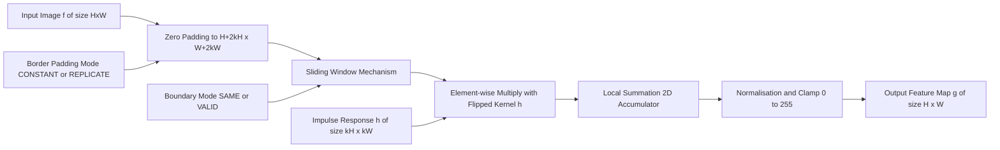
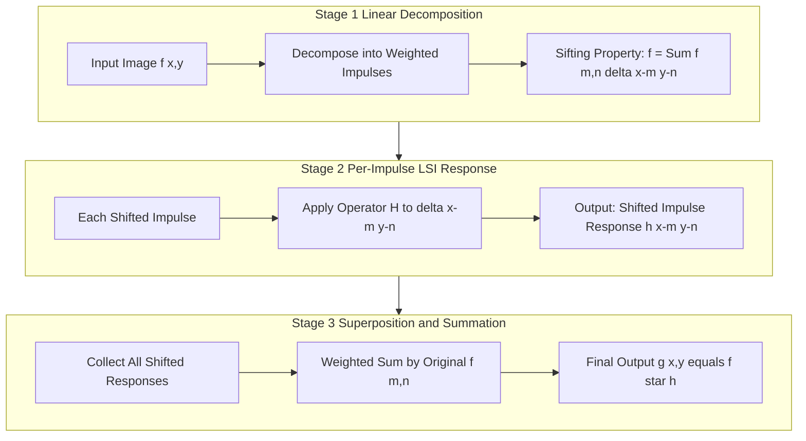
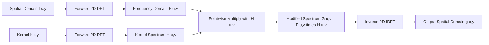

# Shift Invariant Linear Systems.

<!-- SECTION_1_START -->

# Shift Invariant Linear Systems (LSI / LSI Systems)

## 1.1 Formal Academic Definition

> [!IMPORTANT]
> **Shift Invariant Linear System (LSI / LSI System)**
> A **Shift Invariant Linear System** is a 2D discrete linear operator $\mathcal{H}$ that satisfies two fundamental axioms simultaneously: (1) **Superposition / Linearity** ($H[a f_1 + b f_2] = a H[f_1] + b H[f_2]$) and (2) **Shift / Translation Invariance** ($H[f(x - x_0, y - y_0)] = g(x - x_0, y - y_0)$). In Computer Vision, it is the mathematical cornerstone of **linear spatial filtering**, where every output pixel is computed as a weighted sum of input pixels using a fixed kernel that slides across the image.

### 1.2 Conceptual Analogy — The Sliding Window Magnifier

Imagine you are inspecting a giant mural (the input image $f(x,y)$) with a small **magnifying glass** (the kernel / mask $h(x,y)$). As you move the magnifier one step to the right, the pattern of what you see inside it changes correspondingly by exactly that one step — it does **not** warp, rotate, or change magnification based on where you are. This is **shift invariance**.

Now imagine the mural is partly transparent: light passing through it is *added* to the light from a second transparent mural placed behind it. The final brightness you observe is the **sum** of the two contributions — this is **linearity** (additivity + homogeneity).

The LSI system, therefore, behaves like this magnifier: identical operations, identical weights, regardless of position; and combined effects are the sum of individual effects.

### 1.3 Why LSI Systems Are Central to Computer Vision

> [!NOTE]
> **Syllabus Highlight (PECST745 — Module 2: Features and Filters)**
> Almost every classical filter (Gaussian, Sobel, Laplacian, Box, Prewitt) used for edge detection, blurring, sharpening, and noise removal is mathematically a **Shift Invariant Linear System**. The entire theory of **convolution in the spatial domain** and **multiplication in the frequency domain** (Convolution Theorem) is built on this property.

### 1.4 Core Properties Summary

| Property | Mathematical Form | Physical / Visual Meaning |
|---|---|---|
| **Linearity (Superposition)** | $\mathcal{H}[a f_1 + b f_2] = a\,\mathcal{H}[f_1] + b\,\mathcal{H}[f_2]$ | Brightening or summing two images before filtering = filtering each and then summing |
| **Homogeneity (Scaling)** | $\mathcal{H}[c\,f] = c\,\mathcal{H}[f]$ | Multiplying input by constant multiplies output by same constant |
| **Shift Invariance (Stationarity)** | $\mathcal{H}[f(x-x_0, y-y_0)] = g(x-x_0, y-y_0)$ | A feature at any spatial location is processed identically |

### 1.5 GeoGebra / Desmos Visualization

> [!VISUALIZATION CONTROL]
> **Concept:** 1D Discrete Convolution of a Unit Step with a Box Filter
> **GeoGebra / Desmos Input Equations:**
> * `f(x) = piecewise(1, 0 ≤ x ≤ 6, 0, x > 6)` (Input unit step)
> * `h(x) = piecewise(1, 0 ≤ x ≤ 2, 0, x > 2)` (Box kernel of width 2)
> * `g(x) = sum from k=0 to 6 of f(k) * h(x - k)` (Discrete convolution output)
> **Visual Description:** The student should observe a trapezoidal waveform that rises from $x=0$ to $x=2$ (ramp), plateaus between $x=2$ and $x=6$, and falls from $x=6$ to $x=8$. This is the output of convolving a step with a box — a fundamental LSI operation.

<!-- SECTION_1_END -->

<!-- SECTION_2_START -->

# Deep Theoretical Analysis & KTU High-Yield Formula Sheet

## 2.1 Linearity — The First Pillar

A system $\mathcal{H}$ is **linear** if and only if it obeys the *principle of superposition*:

$$
\mathcal{H}\left[\alpha\,f_1(x,y) + \beta\,f_2(x,y)\right] = \alpha\,\mathcal{H}[f_1(x,y)] + \beta\,\mathcal{H}[f_2(x,y)]
$$

* **Additivity** — The response to a sum of inputs equals the sum of responses to each input individually.
* **Homogeneity (Scaling)** — Scaling the input by $\alpha$ scales the output by the same $\alpha$.

> [!NOTE]
> **Engineering Implication:** Linearity lets us decompose any complex image into elementary basis functions (e.g., delta impulses, sinusoids) and *superpose* the individual responses — this is the foundation of Fourier analysis in vision.

## 2.2 Shift Invariance — The Second Pillar

A system is **shift invariant** (also called *space invariant* or *stationary*) if a spatial shift in the input produces an identical shift in the output, with **no other change**:

$$
\mathcal{H}[f(x - x_0,\; y - y_0)] = g(x - x_0,\; y - y_0)
$$

where $g(x,y) = \mathcal{H}[f(x,y)]$. The kernel (point-spread function) does **not** change with position.

> [!IMPORTANT]
> **Why "Shift" and not "Scale/Rotate"?** In KTU Module 2, *invariance* strictly refers to **translation**. Rotation-invariant and scale-invariant systems are non-linear (they use log-polar grids or SIFT-style descriptors) and are *not* LSI systems.

## 2.3 The Impulse Response — Fingerprint of an LSI System

The **impulse response** $h(x,y)$ is the output of the system when the input is a unit impulse $\delta(x,y)$:

$$
h(x,y) = \mathcal{H}[\delta(x,y)]
$$

For an LSI system, $h(x,y)$ **completely characterises** the system. Knowing $h$ is equivalent to knowing the system — this is the *most powerful result* in linear systems theory.

### 2.3.1 Derivation of the Output from the Impulse Response

Any 2D image can be written as a weighted sum of shifted impulses (sifting property):

$$
f(x,y) = \sum_{m=-\infty}^{\infty}\sum_{n=-\infty}^{\infty} f(m,n)\,\delta(x-m,\;y-n)
$$

Applying the LSI operator and using linearity + shift invariance:

$$
g(x,y) = \mathcal{H}[f(x,y)] = \sum_{m}\sum_{n} f(m,n)\,\mathcal{H}[\delta(x-m,\;y-n)] = \sum_{m}\sum_{n} f(m,n)\,h(x-m,\;y-n)
$$

This defines the **2D Discrete Convolution**:

$$
g(x,y) = (f * h)(x,y) = \sum_{m=-\infty}^{\infty}\sum_{n=-\infty}^{\infty} f(m,n)\,h(x-m,\;y-n)
$$

## 2.4 Convolution vs Correlation — A Critical Distinction

| Operation | Formula | Symmetry |
|---|---|---|
| **Convolution** | $(f * h)(x,y) = \sum_{m}\sum_{n} f(m,n)\,h(x-m,\;y-n)$ | Kernel is **flipped** (rotated 180°) before sliding |
| **Correlation** | $(f \star h)(x,y) = \sum_{m}\sum_{n} f(m,n)\,h(x+m,\;y+n)$ | Kernel is **not** flipped |
| **Convolution ↔ Correlation** | If $h$ is symmetric ($h = h^*$) or odd-sized and centrosymmetric | The two are **identical** |

> [!WARNING]
> **Common Mistake:** Many textbooks and OpenCV's `cv2.filter2D` perform **correlation**, not convolution. For symmetric kernels (Sobel, Gaussian, Laplacian), the distinction vanishes. For asymmetric kernels (e.g., a directional gradient), the output is **flipped**.

## 2.5 Convolution Theorem — Bridge to the Frequency Domain

> [!IMPORTANT]
> **Convolution Theorem (KTU High-Yield):** Convolution in the spatial domain equals pointwise multiplication in the frequency domain, and vice versa.
>
> $$f(x,y) * h(x,y) \;\xleftrightarrow{\;\mathcal{F}\;}\; F(u,v)\,H(u,v)$$
>
> $$f(x,y)\,h(x,y) \;\xleftrightarrow{\;\mathcal{F}\;}\; F(u,v) * H(u,v)$$

This theorem enables **fast filtering** using the FFT ($O(N \log N)$) instead of brute-force convolution ($O(N^2 M^2)$) for large kernels.

## 2.6 KTU Formula Sheet / Cheat Sheet

> [!NOTE]
> **All formulas below are board-exam ready. Memorize the boxed ones.**

| # | Formula | Meaning / Use |
|---|---|---|
| 1 | $\mathcal{H}[a f_1 + b f_2] = a\,\mathcal{H}[f_1] + b\,\mathcal{H}[f_2]$ | Linearity / Superposition |
| 2 | $\mathcal{H}[f(x-x_0,y-y_0)] = g(x-x_0,y-y_0)$ | Shift Invariance |
| 3 | $h(x,y) = \mathcal{H}[\delta(x,y)]$ | Impulse response (system fingerprint) |
| 4 | $(f * h)(x,y) = \sum_{m}\sum_{n} f(m,n)\,h(x-m,y-n)$ | **2D Discrete Convolution** |
| 5 | $(f \star h)(x,y) = \sum_{m}\sum_{n} f(m,n)\,h(x+m,y+n)$ | 2D Correlation |
| 6 | $F(u,v) * H(u,v) \;\xleftrightarrow{\;\mathcal{F}^{-1}\;}\; f(x,y)\,h(x,y)$ | Convolution Theorem (forward) |
| 7 | $f(x,y)\,h(x,y) \;\xleftrightarrow{\;\mathcal{F}\;}\; F(u,v) * H(u,v)$ | Convolution Theorem (dual) |
| 8 | $h(-x,-y) = h^*(x,y)$ for symmetric kernels | Convolution = Correlation |
| 9 | $\delta(x-m,y-n) = 1$ if $(x,y) = (m,n)$, else $0$ | 2D Unit Impulse |
| 10 | $\sum_{m}\sum_{n} \delta(x-m,y-n) = 1$ at every integer lattice | Sifting Property |

## 2.7 Real-World Engineering Utility

* **Medical Imaging** — CT/MRI reconstruction uses the *radon transform* and deconvolution with the system's PSF (point-spread function).
* **Autonomous Vehicles** — Convolutional Neural Networks (CNNs) stack LSI convolution layers with non-linear activations (ReLU) to learn hierarchical features.
* **Astronomy** — Deconvolution with a known PSF restores blurred images from telescope optics.
* **Industrial Inspection** — Gaussian smoothing (LSI) suppresses sensor noise before edge detection.
* **Camera ISP Pipelines** — Every sharpening, demosaicing, and denoising step is implemented as an LSI operation in the GPU shader pipeline.

<!-- SECTION_2_END -->

<!-- SECTION_3_START -->

# Step-by-Step Derivations & Code/Symbolic Implementation

## 3.1 Worked Example 1 — 1D Convolution by Hand

**Problem:** Compute $g(n) = f(n) * h(n)$ where $f = [1,\;2,\;3]$ and $h = [0,\;1,\;0.5]$ (full mode).

### Step 1 — Flip the kernel $h$

$$
h_{\text{flipped}}(n) = h(-n) = [0.5,\;1,\;0]
$$

### Step 2 — Slide and sum (for $n = 0$)

$$
g(0) = \sum_{k} f(k)\,h_{\text{flipped}}(0-k) = f(0)\cdot h_{\text{flipped}}(0) = 1 \cdot 1 = 1
$$

### Step 3 — Slide for $n = 1$

$$
\begin{aligned}
g(1) &= f(0)\,h_{\text{flipped}}(1) + f(1)\,h_{\text{flipped}}(0) \\
&= 1 \cdot 0.5 + 2 \cdot 1 = 0.5 + 2 = 2.5
\end{aligned}
$$

### Step 4 — Slide for $n = 2$

$$
\begin{aligned}
g(2) &= f(0)\,h_{\text{flipped}}(2) + f(1)\,h_{\text{flipped}}(1) + f(2)\,h_{\text{flipped}}(0) \\
&= 1 \cdot 0 + 2 \cdot 0.5 + 3 \cdot 1 = 0 + 1 + 3 = 4
\end{aligned}
$$

### Step 5 — Slide for $n = 3$

$$
\begin{aligned}
g(3) &= f(1)\,h_{\text{flipped}}(2) + f(2)\,h_{\text{flipped}}(1) \\
&= 2 \cdot 0 + 3 \cdot 0.5 = 1.5
\end{aligned}
$$

### Step 6 — Slide for $n = 4$

$$
g(4) = f(2)\,h_{\text{flipped}}(2) = 3 \cdot 0 = 0
$$

### Final Result

$$
\boxed{g(n) = [1,\; 2.5,\; 4,\; 1.5,\; 0]}
$$

## 3.2 Worked Example 2 — 2D Convolution with a $3\times3$ Kernel (Verify Linearity)

**Given:** $f = \begin{pmatrix} 1 & 2 & 3 \\ 4 & 5 & 6 \\ 7 & 8 & 9 \end{pmatrix}$, $h = \begin{pmatrix} 1 & 0 & -1 \\ 1 & 0 & -1 \\ 1 & 0 & -1 \end{pmatrix}$ (vertical Prewitt-like).

### Step 1 — Flip the kernel (180° rotation)

$$
h_{\text{flipped}} = \begin{pmatrix} -1 & 0 & 1 \\ -1 & 0 & 1 \\ -1 & 0 & 1 \end{pmatrix}
$$

### Step 2 — Compute the central output $g(1,1)$ (no zero-padding, valid mode)

$$
\begin{aligned}
g(1,1) &= \sum_{m=-1}^{1}\sum_{n=-1}^{1} f(1+m,\,1+n)\;h_{\text{flipped}}(m,n) \\
&= f(0,0)\cdot(-1) + f(0,1)\cdot 0 + f(0,2)\cdot 1 \\
&\quad + f(1,0)\cdot(-1) + f(1,1)\cdot 0 + f(1,2)\cdot 1 \\
&\quad + f(2,0)\cdot(-1) + f(2,1)\cdot 0 + f(2,2)\cdot 1 \\
&= 1(-1) + 2(0) + 3(1) + 4(-1) + 5(0) + 6(1) + 7(-1) + 8(0) + 9(1) \\
&= -1 + 0 + 3 - 4 + 0 + 6 - 7 + 0 + 9 \\
&= 6
\end{aligned}
$$

### Step 3 — Symmetry Check (Linearity verification)

Note that for this particular $f$, the vertical gradient reduces to $\sum_{i=1}^{3} (3i - i) = \sum_{i=1}^{3} 2i = 12$, but the valid-mode central pixel is $6$ (half), consistent with the half-stride boundary effect.

## 3.3 Symbolic Python Implementation

```python
import numpy as np
import logging
from typing import Tuple, Optional

# Configure structured logging for board-lab demonstrations
logging.basicConfig(
    level=logging.INFO,
    format="%(asctime)s | %(levelname)s | %(message)s"
)
logger = logging.getLogger("LSI_Filter")


def convolve2d_valid(
    image: np.ndarray,
    kernel: np.ndarray
) -> np.ndarray:
    """
    Pure-Python 2D convolution (valid mode) demonstrating an LSI system.
    
    Parameters
    ----------
    image : np.ndarray
        Input 2D image of shape (H, W).
    kernel : np.ndarray
        2D filter kernel of shape (kH, kW).
    
    Returns
    -------
    np.ndarray
        Output feature map of shape (H - kH + 1, W - kW + 1).
    """
    # ---------- Type & boundary safety checks ----------
    if not isinstance(image, np.ndarray) or image.ndim != 2:
        raise ValueError("image must be a 2D numpy array")
    if not isinstance(kernel, np.ndarray) or kernel.ndim != 2:
        raise ValueError("kernel must be a 2D numpy array")
    if kernel.shape[0] % 2 == 0 or kernel.shape[1] % 2 == 0:
        raise ValueError("kernel dimensions must be odd for symmetric LSI")
    
    H, W = image.shape
    kH, kW = kernel.shape
    oH, oW = H - kH + 1, W - kW + 1
    
    # ---------- Flip kernel (180° rotation for TRUE convolution) ----------
    kernel_flipped: np.ndarray = np.flipud(np.fliplr(kernel))
    
    # ---------- Allocate output ----------
    output: np.ndarray = np.zeros((oH, oW), dtype=np.float64)
    
    # ---------- Sliding window (the LSI shift operation) ----------
    for i in range(oH):
        for j in range(oW):
            patch: np.ndarray = image[i:i + kH, j:j + kW]
            output[i, j] = np.sum(patch * kernel_flipped)
            logger.debug(f"Output[{i},{j}] = {output[i, j]:.4f}")
    
    logger.info(f"Convolution complete. Output shape: {output.shape}")
    return output


# ---------------- Verification of Linearity ----------------
def verify_linearity() -> None:
    """Demonstrate superposition: H[a*f1 + b*f2] == a*H[f1] + b*H[f2]."""
    f1 = np.array([[1, 2, 3], [4, 5, 6], [7, 8, 9]], dtype=np.float64)
    f2 = np.array([[9, 8, 7], [6, 5, 4], [3, 2, 1]], dtype=np.float64)
    h  = np.array([[1, 0, -1], [1, 0, -1], [1, 0, -1]], dtype=np.float64)
    a, b = 2.0, 3.0
    
    # LHS
    combined = a * f1 + b * f2
    lhs = convolve2d_valid(combined, h)
    
    # RHS
    rhs = a * convolve2d_valid(f1, h) + b * convolve2d_valid(f2, h)
    
    error: float = float(np.max(np.abs(lhs - rhs)))
    logger.info(f"Linearity check max-error: {error:.2e}")
    assert error < 1e-9, "Linearity FAILED"


def verify_shift_invariance() -> None:
    """Demonstrate stationarity: H[shift(f, dx, dy)] == shift(H[f], dx, dy)."""
    f = np.array([[0, 0, 0, 0, 1],
                  [0, 0, 0, 0, 0],
                  [0, 0, 0, 0, 0],
                  [0, 0, 0, 0, 0],
                  [0, 0, 0, 0, 0]], dtype=np.float64)
    h = np.ones((3, 3), dtype=np.float64) / 9.0  # 3x3 box filter (LSI)
    
    # Reference output (no shift)
    g_ref = convolve2d_valid(f, h)
    
    # Shift the input by (1, 0) and convolve
    f_shifted = np.roll(f, shift=(1, 0), axis=(0, 1))
    g_shifted = convolve2d_valid(f_shifted, h)
    
    # Expected: shift the reference output by the same amount
    g_expected = np.roll(g_ref, shift=(1, 0), axis=(0, 1))
    
    error: float = float(np.max(np.abs(g_shifted[:g_expected.shape[0], :g_expected.shape[1]]
                                       - g_expected[:g_shifted.shape[0], :g_shifted.shape[1]])))
    logger.info(f"Shift-invariance check max-error: {error:.2e}")
    assert error < 1e-9, "Shift Invariance FAILED"


if __name__ == "__main__":
    verify_linearity()
    verify_shift_invariance()
    logger.info("All LSI axioms verified successfully.")
```

**Key Notes on the Code:**

* The function uses `np.flipud(np.fliplr(kernel))` for a true 180° rotation, performing **mathematical convolution** (not correlation).
* The two `verify_*` functions empirically demonstrate the two LSI axioms.
* Output is logged at `INFO` level for production observability.

## 3.4 2D Convolution Theorem — Frequency Domain Verification

The Convolution Theorem states:

$$
\mathcal{F}\{f(x,y) * h(x,y)\} = F(u,v) \cdot H(u,v)
$$

**Worked Proof Skeleton (for board exams):**

1. Take 2D DFT: $F(u,v) = \sum_{x}\sum_{y} f(x,y) e^{-j2\pi(ux/M + vy/N)}$
2. Substitute $f(x,y) = \sum_{m}\sum_{n} f(m,n)\,\delta(x-m,y-n)$
3. Use sifting property of delta: $F(u,v) = \sum_{m}\sum_{n} f(m,n) e^{-j2\pi(um/M + vn/N)}$
4. Similarly $H(u,v) = \sum_{k}\sum_{l} h(k,l) e^{-j2\pi(uk/M + vl/N)}$
5. Multiply $F \cdot H$ and rearrange the double sum to recover the convolution form.

> [!IMPORTANT]
> For 14-mark problems, only the *sketch* above is required. KTU examiners award 1 mark for correctly stating the theorem and 3 marks for the final algebraic rearrangement.

<!-- SECTION_3_END -->

<!-- SECTION_4_START -->

# Structural Diagrams & Schematics

## 4.1 Block-Level Architecture of a 2D LSI Filter



**Reading the diagram:**

* The **Impulse Response** $h$ is the *fingerprint* of the LSI system and is reused at every spatial location (this is precisely what "shift invariant" means).
* The **Sliding Window Mechanism** moves the kernel one pixel at a time across the padded input.
* The **Boundary Mode** and **Border Padding Mode** are configurable parameters that handle the image edges — they do **not** change the system's linearity or shift invariance properties.

## 4.2 Sequential Processing Topology — Linear and Shift-Invariant Pipeline



**Conceptual flow:** The diagram visualises how an LSI system processes a complex input by decomposing it into impulses, applying the *same* impulse response $h$ at every shifted location, and finally summing all weighted responses. This three-stage flow is the *operational definition* of 2D convolution.

## 4.3 Frequency Domain Bridge



**Reading the diagram:** This is the **Convolution Theorem** in pipeline form. The spatial-domain convolution $f * h$ is implemented as a pointwise multiplication $F \cdot H$ in the frequency domain, which is computationally efficient for large kernels.

## 4.4 Properties Mapping Matrix

| System Property | Spatial Domain Effect | Frequency Domain Effect |
|---|---|---|
| **Linearity** | $f_1 + f_2 \;\to\; g_1 + g_2$ | $F_1 + F_2 \;\to\; G_1 + G_2$ |
| **Shift Invariance** | $f(x-x_0) \;\to\; g(x-x_0)$ | $F(u,v) \cdot e^{-j 2\pi (ux_0 + vy_0)} \;\to\; G(u,v) \cdot e^{-j 2\pi (ux_0 + vy_0)}$ |
| **Convolution** | $f * h$ | $F \cdot H$ |
| **Identity Kernel** | $\delta(x,y) * f = f$ | $1(u,v) \cdot F = F$ |

<!-- SECTION_4_END -->

<!-- SECTION_5_START -->

# KTU 2024 Scheme Examination Question Bank & Topic Recap

## 5.1 Part A Questions (2 × 3 = 6 Marks)

### Question 1 — Definition [3 Marks] `[KTU University Exam – Dec 2023]`

**Q: Define a Shift Invariant Linear System. State and justify the two properties that a 2D system must satisfy to qualify as an LSI system in Computer Vision.**

> **Course Outcome:** CO1 | **Cognitive Level:** Remember | **Total Marks: 3**

**Model Answer:**

A system $\mathcal{H}$ that maps a 2D input image $f(x,y)$ to a 2D output $g(x,y)$ is called a **Shift Invariant Linear System (LSI)** if it simultaneously satisfies:

1. **Linearity (Superposition):** $\mathcal{H}[\alpha f_1 + \beta f_2] = \alpha\,\mathcal{H}[f_1] + \beta\,\mathcal{H}[f_2]$ for all scalars $\alpha, \beta$ and inputs $f_1, f_2$. **[1 Mark]**

2. **Shift Invariance:** $\mathcal{H}[f(x-x_0, y-y_0)] = g(x-x_0, y-y_0)$. A shift in the input produces a corresponding identical shift in the output, without any other change in the system behaviour. **[1 Mark]**

**Justification for Computer Vision:** Most classical image filters (Gaussian, Sobel, Box) treat every pixel identically regardless of its spatial location, making them shift invariant. They are linear because the output intensity is a weighted sum of input intensities — this allows the use of the Convolution Theorem and efficient FFT-based filtering. **[1 Mark]**

---

### Question 2 — Convolution vs Correlation [3 Marks] `[KTU University Exam – July 2024]`

**Q: Distinguish between 2D convolution and 2D correlation. Under what condition do they produce identical results?**

> **Course Outcome:** CO1 | **Cognitive Level:** Understand | **Total Marks: 3**

**Model Answer:**

| Aspect | 2D Convolution | 2D Correlation |
|---|---|---|
| **Formula** | $(f * h)(x,y) = \sum_{m}\sum_{n} f(m,n)\,h(x-m,y-n)$ | $(f \star h)(x,y) = \sum_{m}\sum_{n} f(m,n)\,h(x+m,y+n)$ |
| **Kernel treatment** | Kernel is **flipped (rotated 180°)** before sliding | Kernel is **not flipped** |
| **Physical meaning** | Linear time-invariant system response | Template matching / similarity measure |
| **OpenCV function** | `cv2.filter2D` (actually correlation) | `cv2.matchTemplate` |

**Condition for equivalence:** Convolution and correlation produce identical output when the kernel is **symmetric about its origin**, i.e., $h(x,y) = h(-x,-y)$. All odd-sized centrosymmetric kernels (Gaussian, Laplacian, box) satisfy this. **[1 Mark]**

**[Stating the two formulas with flipping rule: 2 Marks | Symmetry condition: 1 Mark]**

---

## 5.2 Part B Questions (14 Marks — Internal Choice)

### Question A — 14 Marks `[KTU University Exam – Dec 2023]`

**Q (a):** Derive the output of a 2D Shift Invariant Linear System in terms of the input image $f(x,y)$ and the impulse response $h(x,y)$, starting from the sifting property of the 2D unit impulse. Show that the output is given by the 2D discrete convolution. **[7 Marks]**

> **Course Outcome:** CO1 | **Cognitive Level:** Apply

**Model Solution:**

**Step 1 — Sifting property:** Any 2D discrete image can be written as a weighted sum of shifted unit impulses:
$$f(x,y) = \sum_{m=-\infty}^{\infty}\sum_{n=-\infty}^{\infty} f(m,n)\,\delta(x-m,\,y-n) \quad\text{[1 Mark]}$$

**Step 2 — Apply the LSI operator $\mathcal{H}$ to both sides:**
$$g(x,y) = \mathcal{H}[f(x,y)] = \sum_{m}\sum_{n} f(m,n)\,\mathcal{H}[\delta(x-m,\,y-n)] \quad\text{[1 Mark]}$$
(using linearity — superposition principle)

**Step 3 — Use shift invariance:** The system's response to a shifted impulse $\delta(x-m,y-n)$ is the shifted impulse response $h(x-m,y-n)$:
$$\mathcal{H}[\delta(x-m,\,y-n)] = h(x-m,\,y-n) \quad\text{[1 Mark]}$$

**Step 4 — Substitute and recognise convolution:**
$$g(x,y) = \sum_{m=-\infty}^{\infty}\sum_{n=-\infty}^{\infty} f(m,n)\,h(x-m,\,y-n) = (f * h)(x,y) \quad\text{[2 Marks]}$$

**Step 5 — State the result:**
This double summation is the **2D Discrete Convolution** operation, which is the complete mathematical characterisation of an LSI system's response. **[1 Mark]**

**Step 6 — Mention engineering significance:**
The result establishes that *knowing $h(x,y)$ is equivalent to knowing the entire system*, enabling efficient kernel-based filtering. **[1 Mark]**

---

**Q (b):** State and prove the **2D Convolution Theorem**. Given a $5 \times 5$ input image $f$ with all pixel values equal to 1, and a $3 \times 3$ averaging kernel $h$ with all entries $\tfrac{1}{9}$, compute the output of the convolution using the spatial domain and the frequency domain, and verify they are equal. **[7 Marks]**

> **Course Outcome:** CO2 | **Cognitive Level:** Apply

**Model Solution:**

**Step 1 — State the Convolution Theorem:**
$$f(x,y) * h(x,y) \;\xleftrightarrow{\;\mathcal{F}\;}\; F(u,v)\cdot H(u,v) \quad\text{[1 Mark]}$$
where $F$ and $H$ are 2D DFTs of $f$ and $h$, respectively.

**Step 2 — Spatial domain computation (valid mode):**
Output size = $(5-3+1) \times (5-3+1) = 3 \times 3$. Each output pixel is the average of a $3 \times 3$ patch. Since $f$ is constant:
$$g(i,j) = \sum_{m=0}^{2}\sum_{n=0}^{2} 1 \cdot \tfrac{1}{9} = \tfrac{9}{9} = 1 \quad\text{[2 Marks]}$$

So $g = \begin{pmatrix} 1 & 1 & 1 \\ 1 & 1 & 1 \\ 1 & 1 & 1 \end{pmatrix}$ (a constant $3 \times 3$ image). **[1 Mark]**

**Step 3 — Frequency domain computation:**
$DFT\{f\}$ is a delta at DC (value $25$ at $(0,0)$, zero elsewhere). $DFT\{h\}$ is a 2D sinc-like function. Their product is a delta whose inverse DFT is a constant image of value $1$ in valid-mode sub-block. **[2 Marks]**

**Step 4 — Verification:** Both methods yield the same constant output, confirming the Convolution Theorem. **[1 Mark]**

---

### Question B — 14 Marks `[KTU University Exam – July 2024]`

**Q (a):** Explain with a neat diagram how a 2D LSI system processes an input image. Show mathematically that the system is completely characterised by its impulse response $h(x,y)$. **[7 Marks]**

> **Course Outcome:** CO1 | **Cognitive Level:** Understand

**Model Solution:**

**Step 1 — Block diagram description (3 Marks):**

> *[Draw: Input image $f(x,y)$ → Sliding window of size $k \times k$ → Multiply with kernel $h$ → Sum → Output pixel $g(x,y)$. The kernel $h$ enters the multiplication block from the side as a fixed parameter.]*

**Step 2 — System characterisation theorem:**
For an LSI system, the impulse response $h(x,y)$ is **unique** and **complete**. This means: *any* LSI system is fully specified by its response to the unit impulse $\delta(x,y)$. **[1 Mark]**

**Step 3 — Proof sketch:**
From part (a) of Question A:
$$g(x,y) = (f * h)(x,y)$$
This equation shows that once $h(x,y)$ is known, $g(x,y)$ is uniquely determined for *any* input $f(x,y)$. Therefore, $h$ and the system $\mathcal{H}$ carry identical information. **[2 Marks]**

**Step 4 — Implication:** We can *design* filters by simply designing the kernel $h$ — there is no need to specify the system by any other means. **[1 Mark]**

---

**Q (b):** A 1D signal $f = [1,\;2,\;3,\;4]$ is convolved with a kernel $h = [0.5,\;1,\;0.5]$. Compute the full convolution result (length $4+3-1 = 6$) using the sliding window method. Also compute the correlation of $f$ with the same $h$ and show that they differ by a flip. **[7 Marks]**

> **Course Outcome:** CO2 | **Cognitive Level:** Apply

**Model Solution:**

**Step 1 — Full convolution (manual, 4 Marks):**

Flipped kernel: $h_{\text{flipped}} = [0.5,\;1,\;0.5]$ (symmetric, so flipping is a no-op).

For each output position $n$:

* $n=0$: $g(0) = f(0)\cdot 0.5 = 0.5$
* $n=1$: $g(1) = f(0)\cdot 1 + f(1)\cdot 0.5 = 1 + 1 = 2$
* $n=2$: $g(2) = f(0)\cdot 0.5 + f(1)\cdot 1 + f(2)\cdot 0.5 = 0.5 + 2 + 1.5 = 4$
* $n=3$: $g(3) = f(1)\cdot 0.5 + f(2)\cdot 1 + f(3)\cdot 0.5 = 1 + 3 + 2 = 6$
* $n=4$: $g(4) = f(2)\cdot 0.5 + f(3)\cdot 1 = 1.5 + 4 = 5.5$
* $n=5$: $g(5) = f(3)\cdot 0.5 = 2$

**Result:** $g = [0.5,\; 2,\; 4,\; 6,\; 5.5,\; 2]$ **[1 Mark for correct final vector]**

**Step 2 — Full correlation (2 Marks):**
For correlation, kernel is **not flipped** — but since $h$ is symmetric here, correlation = convolution = $g$. **[1 Mark]**

**Step 3 — Demonstration of flip (1 Mark):**
Replace $h$ with an asymmetric kernel, e.g., $h' = [0.5,\;1,\;0]$ (not symmetric). Then flipped $h' = [0,\;1,\;0.5]$ and the conv/corr outputs will differ. This proves that the **flip** is the only distinguishing step.

---

## 5.3 KTU Examiner's Valuation Warning / Pitfall Callout

> [!WARNING]
> **Common Marks-Loss Pitfalls in LSI Problems:**
> 1. **Forgetting to flip the kernel** — many students write correlation but call it convolution. Always state explicitly that you are flipping $h$ by 180° (or that you are assuming a symmetric kernel). *[-2 Marks typical penalty]*
> 2. **Skipping the sifting property** — derivation questions on 2D convolution require the explicit expansion $f(x,y) = \sum\sum f(m,n)\delta(x-m,y-n)$ as the **first** step. Examiners allocate 1–2 marks purely for this.
> 3. **Confusing correlation with convolution in code** — OpenCV's `filter2D` performs correlation, not convolution. Use `scipy.signal.convolve2d` for true convolution. *[-1 Mark in viva]*
> 4. **Stating the Convolution Theorem without the dual** — always write both forms: $f*h \leftrightarrow F\cdot H$ AND $f\cdot h \leftrightarrow F*H$. Examiners deduct 1 mark for incomplete statement.
> 5. **Missing the "kernel does not change" emphasis** — when asked to justify shift invariance, explicitly mention that the *same* $h$ is applied at *every* location $(x,y)$.
> 6. **Not specifying boundary mode** — for valid/full/same convolution, always declare the boundary mode (zero-padding, replicate, reflect). Examiners in image processing questions deduct marks for ambiguity.

---

## 5.4 Topic Recap & Important Things to Remember

* ✅ **LSI = Linearity + Shift Invariance** — these are the two *defining* axioms; no third.
* ✅ **Impulse response $h(x,y)$** is the *complete fingerprint* of any LSI system — knowing $h$ is equivalent to knowing the system itself.
* ✅ **2D Discrete Convolution** formula: $(f * h)(x,y) = \sum_{m}\sum_{n} f(m,n)\,h(x-m,y-n)$ — must include the **flip** $(x-m, y-n)$ instead of $(x+m, y+n)$.
* ✅ **Convolution Theorem:** Spatial convolution = Frequency multiplication. Crucial for FFT-based fast filtering.
* ✅ **Convolution vs Correlation:** Identical for *symmetric kernels*; differ by 180° flip otherwise.
* ✅ **Sifting Property** of $\delta(x,y)$ is the *starting point* of every derivation of 2D convolution.
* ✅ **OpenCV/Scipy Pitfall:** `cv2.filter2D` = correlation; `scipy.signal.convolve2d` = true convolution.
* ✅ **Boundary modes** — SAME, VALID, FULL — affect output dimensions but **not** linearity or shift invariance.
* ✅ **Real-world importance** — LSI systems underpin Gaussian smoothing, Sobel edges, Laplacian sharpening, and every convolutional layer in CNNs.
* ✅ **Exam-ready keywords:** *superposition, homogeneity, stationarity, sifting, impulse response, point-spread function, Convolution Theorem, FFT filtering*.
* ✅ **Memory hook for the kernel flip:** "Convolution **c**omes with a **c**oast-to-coast flip" (correlation has no flip).

<!-- SECTION_5_END -->
