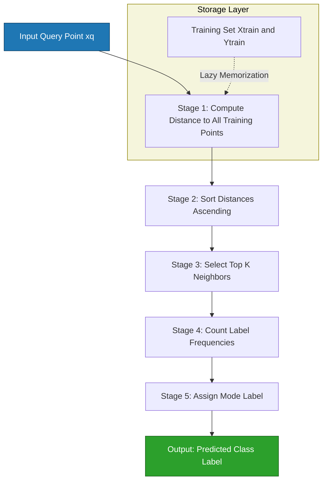
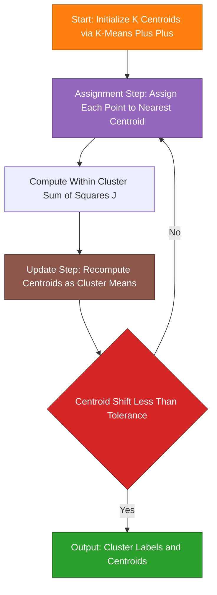
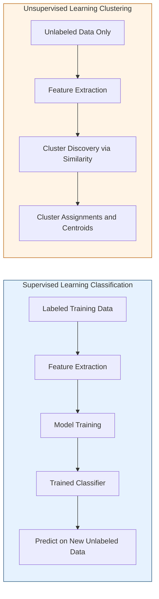
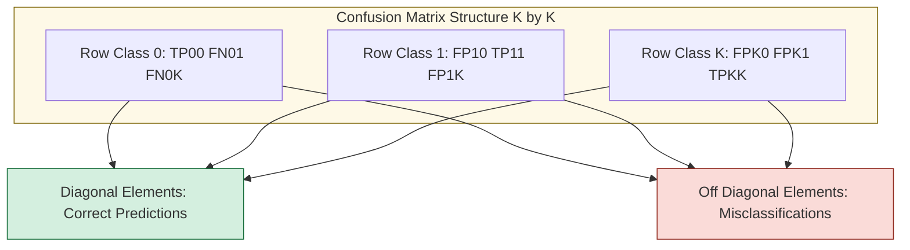
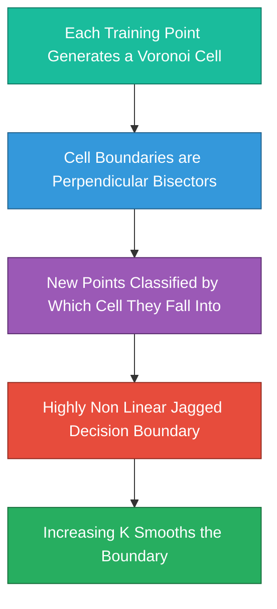
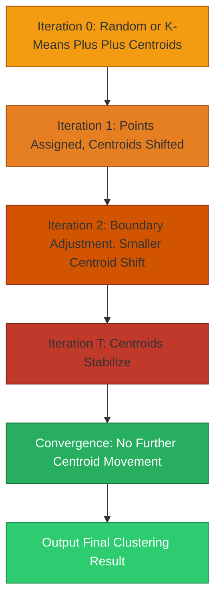

# Basics of Classification and Clustering

<!-- SECTION_1_START -->
# 1. Core Technical Definition & Intuitive Overview

## 1.1 Formal Definition (KTU 2024 Syllabus Terminology)

> [!IMPORTANT]
> **Classification** is a *supervised learning* paradigm in which a model is trained on a labeled dataset $\mathcal{D} = \{(x_i, y_i)\}_{i=1}^{N}$ where $x_i \in \mathbb{R}^{d}$ represents a feature vector and $y_i \in \{1, 2, \ldots, K\}$ represents a discrete class label. The objective is to learn a decision function $f : \mathbb{R}^{d} \rightarrow \{1, 2, \ldots, K\}$ that generalizes to unseen instances.

> [!IMPORTANT]
> **Clustering** is an *unsupervised learning* paradigm that partitions an unlabeled dataset $\mathcal{X} = \{x_1, x_2, \ldots, x_N\}$ into $K$ homogeneous groups $\mathcal{C} = \{C_1, C_2, \ldots, C_K\}$ based on intrinsic similarity, without any prior label information.

The cornerstone distinction is the **availability of ground-truth labels**: classification requires a *teacher signal* (supervisor), while clustering operates purely on geometric/statistical structure of the data distribution.

## 1.2 Conceptual Analogy & Intuition

**Classification — The Grading Analogy:**
Imagine a school where a teacher has already graded thousands of past answer sheets into categories: *Excellent*, *Good*, *Average*, and *Poor*. The teacher analyzes patterns like handwriting neatness, length, and vocabulary. When a new answer sheet arrives, the teacher assigns it to one of the four pre-defined categories. This is **classification** — the categories exist *a priori*, and a new sample is mapped to one of them.

**Clustering — The Self-Organizing Library Analogy:**
Now imagine a brand-new library with thousands of unlabelled books dumped on the floor. The librarian groups them into *Math*, *History*, *Novels*, and *Science* stacks by inspecting covers, content style, and visual cues — **without ever being told the categories beforehand**. The groups *emerge* from the data. This is **clustering** — the categories are *discovered*, not given.

| Aspect | Classification (Supervised) | Clustering (Unsupervised) |
| :--- | :--- | :--- |
| **Label requirement** | Labels $y_i$ are mandatory | No labels required |
| **Goal** | Learn mapping $f: X \rightarrow Y$ | Discover structure $C = \{C_1, \ldots, C_K\}$ |
| **Output** | Discrete class label or probability | Cluster assignment + cluster centroids |
| **Evaluation** | Accuracy, Precision, Recall, F1 | Silhouette score, Inertia, Davies-Bouldin |
| **Example in CV** | Cat vs Dog image recognition | Grouping unlabeled satellite imagery by terrain |

## 1.3 K-Nearest Neighbors (KNN) — The Neighborly Voter

> [!NOTE]
> **KNN Intuition:** A new data point is classified by a majority *vote* of its **K closest neighbors** in the feature space. The class most common among those K neighbors wins. No explicit training phase exists — KNN is a *lazy learner* that memorizes the training set.

Formally, for a query point $x_q$, the predicted class is:

$$\hat{y}(x_q) = \text{mode}\left(\{y_i : x_i \in \mathcal{N}_K(x_q)\}\right)$$

where $\mathcal{N}_K(x_q)$ denotes the set of the $K$ nearest training points to $x_q$, and $\text{mode}$ returns the most frequent label.

## 1.4 K-Means Clustering — The Centroid Magnet

> [!NOTE]
> **K-Means Intuition:** Given $K$ initial *centroids* (cluster centers), each data point is assigned to its nearest centroid (Expectation step), then centroids are recomputed as the *mean* of all points in their cluster (Maximization step). The process repeats until convergence.

The objective minimized by K-Means is the **Within-Cluster Sum of Squares (WCSS)**:

$$J(C) = \sum_{k=1}^{K} \sum_{x_i \in C_k} \Vert x_i - \mu_k \Vert^2$$

where $\mu_k = \frac{1}{\vert C_k \vert}\sum_{x_i \in C_k} x_i$ is the centroid of cluster $C_k$.

> [!VISUALIZATION CONTROL]
> **Concept:** 2D scatter plot showing K-Means cluster boundaries and centroids
> **GeoGebra / Desmos Input Equations:**
> * `C1: (2, 3)`, `C2: (8, 7)`, `C3: (4, 9)`  *(centroid coordinates)*
> * `d(x, c) = sqrt((x_1 - c_1)^2 + (x_2 - c_2)^2)` *(distance formula)*
> **Visual Description:** Students should observe three distinct circular regions (Voronoi cells) on the 2D plane. Each region is colored to represent one cluster. As the algorithm iterates, the centroids (marked as bold dots) drift toward the geometric center of their assigned points, and the Voronoi boundaries adjust accordingly until stable.

## 1.5 Key Terminology Glossary

* **Feature Vector ($x_i$):** A $d$-dimensional numerical representation of a sample (e.g., pixel intensities, HOG descriptors, deep embeddings).
* **Label ($y_i$):** The ground-truth category for classification.
* **Centroid ($\mu_k$):** The arithmetic mean of all points in cluster $C_k$.
* **Inertia:** Sum of squared distances of samples to their closest cluster center — the K-Means cost function.
* **Decision Boundary:** A hypersurface in feature space that separates regions assigned to different classes.
* **Lazy Learner:** A model (like KNN) that defers all computation until prediction time.
* **Eager Learner:** A model (like SVM, Decision Trees) that builds a generalized function during training.

<!-- SECTION_1_END -->

<!-- SECTION_2_START -->
# 2. Deep Theoretical Analysis & KTU High-Yield Formula Sheet

## 2.1 Distance Metrics — The Heart of Similarity

Both KNN and K-Means rely fundamentally on a notion of *similarity* between data points, quantified through a distance function $d : \mathbb{R}^{d} \times \mathbb{R}^{d} \rightarrow \mathbb{R}_{\geq 0}$. The four pillars of distance metrics are listed in the formula sheet below.

## 2.2 KNN Algorithm — Operational Logic

The KNN algorithm executes in two phases: an indexing phase (storing training data) and a query phase (computing distances and voting).

* **Step 1 — Storage:** Store all training pairs $\{(x_i, y_i)\}_{i=1}^{N}$ in memory.
* **Step 2 — Distance Computation:** For a query $x_q$, compute $d(x_q, x_i)$ for every training point $x_i$.
* **Step 3 — Neighbor Selection:** Sort the distances in ascending order and select the top $K$ indices.
* **Step 4 — Majority Voting:** Count the frequency of each class label among the $K$ neighbors; assign the modal class to $x_q$.
* **Step 5 — Confidence Scoring (optional):** Compute the vote fraction as a soft probability estimate.

**Why KNN Works (Theoretical Justification):** Under the assumption that nearby points in feature space share the same class label (a smoothness prior), the local neighborhood of $x_q$ becomes a reliable proxy for the true posterior $P(y \mid x_q)$. As $N \rightarrow \infty$ with $K$ chosen appropriately, the KNN error rate converges to at most twice the Bayes error rate — this is the **Cover-Hart bound**.

## 2.3 K-Means Algorithm — Lloyd's Iterative Procedure

K-Means follows a coordinate-descent optimization that alternates between two steps guaranteed to monotonically decrease the WCSS cost $J(C)$.

* **Step 1 — Initialization:** Choose $K$ initial centroids $\{\mu_1^{(0)}, \mu_2^{(0)}, \ldots, \mu_K^{(0)}\}$ (randomly or via K-Means++).
* **Step 2 — Assignment (E-step):** For each $x_i$, assign it to the cluster with the nearest centroid:

$$C_k^{(t)} = \left\{x_i : \Vert x_i - \mu_k^{(t)} \Vert^2 \leq \Vert x_i - \mu_j^{(t)} \Vert^2, \ \forall j \neq k\right\}$$

* **Step 3 — Update (M-step):** Recompute each centroid as the mean of its assigned points:

$$\mu_k^{(t+1)} = \frac{1}{\vert C_k^{(t)} \vert} \sum_{x_i \in C_k^{(t)}} x_i$$

* **Step 4 — Convergence Check:** If $\mu_k^{(t+1)} = \mu_k^{(t)}$ for all $k$, terminate. Otherwise, return to Step 2.
* **Step 5 — Output:** Final cluster assignments $C = \{C_1, C_2, \ldots, C_K\}$ and centroids $\{\mu_1, \ldots, \mu_K\}$.

> [!NOTE]
> **Convergence Guarantee:** Lloyd's algorithm converges in finite steps because there are finitely many possible partitions of $N$ points into $K$ clusters, and $J(C)$ strictly decreases at each step.

## 2.4 KTU High-Yield Formula Sheet

| Formula / Concept | Mathematical Expression | Description |
| :--- | :--- | :--- |
| **Euclidean Distance ($L_2$)** | $d(x, y) = \sqrt{\sum_{j=1}^{d}(x_j - y_j)^2}$ | Standard straight-line distance; sensitive to scale. |
| **Manhattan Distance ($L_1$)** | $d(x, y) = \sum_{j=1}^{d} \mid x_j - y_j \mid$ | Sum of absolute differences; robust to outliers. |
| **Minkowski Distance ($L_p$)** | $d(x, y) = \left(\sum_{j=1}^{d} \mid x_j - y_j \mid ^p\right)^{1/p}$ | Generalized form; $p=1 \Rightarrow L_1$, $p=2 \Rightarrow L_2$. |
| **Cosine Distance** | $d(x, y) = 1 - \frac{x \cdot y}{\Vert x \Vert \cdot \Vert y \Vert}$ | Measures angular dissimilarity; ignores magnitude. |
| **WCSS (K-Means Objective)** | $J(C) = \sum_{k=1}^{K} \sum_{x_i \in C_k} \Vert x_i - \mu_k \Vert^2$ | Cost function minimized by K-Means. |
| **Centroid Update** | $\mu_k = \frac{1}{\vert C_k \vert}\sum_{x_i \in C_k} x_i$ | Mean of points in cluster $C_k$. |
| **KNN Prediction** | $\hat{y} = \text{mode}(\{y_i : x_i \in \mathcal{N}_K(x_q)\})$ | Majority vote among K nearest neighbors. |
| **KNN Weighted Vote** | $\hat{y} = \arg\max_{c} \sum_{x_i \in \mathcal{N}_K} w_i \cdot \mathbb{1}(y_i = c)$ | Weights $w_i = 1/d(x_q, x_i)$. |
| **Accuracy** | $\text{Acc} = \frac{TP + TN}{TP + TN + FP + FN}$ | Fraction of correct predictions. |
| **Precision** | $\text{Prec} = \frac{TP}{TP + FP}$ | Quality of positive predictions. |
| **Recall (Sensitivity)** | $\text{Rec} = \frac{TP}{TP + FN}$ | Coverage of actual positives. |
| **F1-Score** | $F_1 = \frac{2 \cdot \text{Prec} \cdot \text{Rec}}{\text{Prec} + \text{Rec}}$ | Harmonic mean of precision and recall. |
| **Silhouette Score** | $s(i) = \frac{b(i) - a(i)}{\max\{a(i), b(i)\}}$ | Internal clustering validation metric. |
| **Cover-Hart Bound** | $R_{\text{KNN}} \leq 2 R_{\text{Bayes}} \left(1 - R_{\text{Bayes}}\right)$ | Asymptotic KNN error rate bound. |

## 2.5 Real-World Engineering Applications in Computer Vision

* **Image Classification:** KNN on HOG features classifies pedestrian vs non-pedestrian in autonomous driving stacks (e.g., early versions of the Daimler Pedestrian Detection system).
* **Document Binarization:** K-Means on pixel intensity distributions separates text from background in scanned documents.
* **Image Color Quantization:** K-Means reduces a 16-million-color image to 16 representative colors for compression (used in GIF generation).
* **Customer Segmentation:** E-commerce platforms cluster session embeddings to identify user personas for recommendation systems.
* **Medical Imaging:** KNN classifiers support radiologists by flagging anomalous tissue patches in mammograms.
* **Anomaly Detection in Surveillance:** Clustering normal behaviour patterns flags deviations as outliers — deployed in airport CCTV analytics.

## 2.6 Critical Hyperparameters and Their Trade-offs

| Hyperparameter | Effect of Increasing | Trade-off |
| :--- | :--- | :--- |
| **K (in KNN)** | Smoother decision boundary, lower variance, higher bias | Underfitting when K is too large. |
| **K (in K-Means)** | More clusters, finer partition, higher compute cost | Risk of over-fragmentation; empty clusters. |
| **Distance metric** | Changes geometry of similarity | Euclidean assumes isotropy; cosine better for embeddings. |
| **Initialization seed** | Affects final clustering | K-Means++ is the standard remedy. |

<!-- SECTION_2_END -->

<!-- SECTION_3_START -->
# 3. Step-by-Step Derivations, Code & Symbolic Implementation

## 3.1 Worked Derivation: KNN on a 2D Toy Dataset

**Problem Setup:** Consider a 2D training set with the following 5 points and their binary labels $\{0, 1\}$:

| Point | $x_1$ | $x_2$ | $y$ |
| :---: | :---: | :---: | :---: |
| $A$ | 1 | 1 | 0 |
| $B$ | 2 | 2 | 0 |
| $C$ | 3 | 4 | 1 |
| $D$ | 5 | 5 | 1 |
| $E$ | 4 | 1 | 0 |

A new query point $Q = (3, 3)$ arrives. Classify $Q$ using KNN with $K = 3$ and Euclidean distance.

**Step 1 — Compute Euclidean distances from $Q$ to all training points:**

$$d(Q, A) = \sqrt{(3-1)^2 + (3-1)^2} = \sqrt{4 + 4} = \sqrt{8} \approx 2.83$$

$$d(Q, B) = \sqrt{(3-2)^2 + (3-2)^2} = \sqrt{1 + 1} = \sqrt{2} \approx 1.41$$

$$d(Q, C) = \sqrt{(3-3)^2 + (3-4)^2} = \sqrt{0 + 1} = 1.00$$

$$d(Q, D) = \sqrt{(3-5)^2 + (3-5)^2} = \sqrt{4 + 4} = \sqrt{8} \approx 2.83$$

$$d(Q, E) = \sqrt{(3-4)^2 + (3-1)^2} = \sqrt{1 + 4} = \sqrt{5} \approx 2.24$$

**Step 2 — Sort distances in ascending order:**

| Rank | Point | Distance | Label |
| :---: | :---: | :---: | :---: |
| 1 | $C$ | 1.00 | 1 |
| 2 | $B$ | 1.41 | 0 |
| 3 | $E$ | 2.24 | 0 |
| 4 | $A$ | 2.83 | 0 |
| 5 | $D$ | 2.83 | 1 |

**Step 3 — Select top $K=3$ neighbors and perform majority vote:**

The 3 nearest neighbors are $C$ (label 1), $B$ (label 0), $E$ (label 0). The class counts are: label 0 appears twice, label 1 appears once.

$$\hat{y}(Q) = \text{mode}(1, 0, 0) = 0$$

**Conclusion:** The query point $Q = (3, 3)$ is classified as **class 0** with vote margin 2:1.

## 3.2 Worked Derivation: K-Means on a 1D Dataset

**Problem Setup:** Given the 1D points $\mathcal{X} = \{1, 2, 3, 8, 9, 10\}$ and $K = 2$, perform K-Means clustering with initial centroids $\mu_1^{(0)} = 2$ and $\mu_2^{(0)} = 9$.

**Iteration 1:**

* **Assignment (E-step):** Compute squared distances to each centroid.

For $x_1 = 1$: $d^2(1, 2) = 1$, $d^2(1, 9) = 64$. Assign to $C_1$.
For $x_2 = 2$: $d^2(2, 2) = 0$, $d^2(2, 9) = 49$. Assign to $C_1$.
For $x_3 = 3$: $d^2(3, 2) = 1$, $d^2(3, 9) = 36$. Assign to $C_1$.
For $x_4 = 8$: $d^2(8, 2) = 36$, $d^2(8, 9) = 1$. Assign to $C_2$.
For $x_5 = 9$: $d^2(9, 2) = 49$, $d^2(9, 9) = 0$. Assign to $C_2$.
For $x_6 = 10$: $d^2(10, 2) = 64$, $d^2(10, 9) = 1$. Assign to $C_2$.

Result: $C_1^{(1)} = \{1, 2, 3\}$, $C_2^{(1)} = \{8, 9, 10\}$.

* **Update (M-step):** Recompute centroids.

$$\mu_1^{(1)} = \frac{1+2+3}{3} = \frac{6}{3} = 2.00$$

$$\mu_2^{(1)} = \frac{8+9+10}{3} = \frac{27}{3} = 9.00$$

Centroids did not change, so **convergence is reached after 1 iteration**.

* **Final WCSS calculation:**

$$J(C) = (1-2)^2 + (2-2)^2 + (3-2)^2 + (8-9)^2 + (9-9)^2 + (10-9)^2$$

$$J(C) = 1 + 0 + 1 + 1 + 0 + 1 = 4.00$$

**Final Clustering:** Cluster 1 = $\{1, 2, 3\}$ centered at $\mu_1 = 2$, Cluster 2 = $\{8, 9, 10\}$ centered at $\mu_2 = 9$, with total inertia $J = 4$.

## 3.3 Full K-Means++ Initialization Derivation

K-Means++ improves upon random initialization by spreading out the initial centroids. The probability of choosing point $x_i$ as the next centroid is proportional to $D(x_i)^2$, the squared distance to the nearest existing centroid:

$$P(x_i) = \frac{D(x_i)^2}{\sum_{x_j \in \mathcal{X}} D(x_j)^2}$$

**Derivation of the probability weighting (sketch):** Maximizing the expected minimum distance covered by the $K$ initial centroids requires that each new centroid has the highest leverage on the cost function — points far from existing centroids contribute the most reduction in $J$. The expected cost reduction from placing a centroid at $x_i$ is proportional to $D(x_i)^2$, hence the squared-distance weighting.

## 3.4 Production-Ready Python Implementation

```python
"""
KNN Classifier and K-Means Clusterer — Production-Ready Reference Implementation
Course: COMPUTER VISION (PECST745) | Module 3: Machine Learning for CV
"""

from __future__ import annotations

import logging
import math
import random
from dataclasses import dataclass, field
from typing import Callable, Dict, List, Sequence, Tuple

import numpy as np
from numpy.typing import NDArray

# Configure structured logging for error monitoring and traceability.
logging.basicConfig(
    level=logging.INFO,
    format="%(asctime)s | %(levelname)s | %(name)s | %(message)s",
)
logger = logging.getLogger("cv_pecst745")


# ============================================================
#  DISTANCE METRICS
# ============================================================
DistanceFn = Callable[[NDArray[np.float64], NDArray[np.float64]], float]


def euclidean_distance(
    x: NDArray[np.float64], y: NDArray[np.float64]
) -> float:
    """Compute L2 (Euclidean) distance between two vectors with shape validation."""
    if x.shape != y.shape:
        raise ValueError(
            f"Shape mismatch in euclidean_distance: x.shape={x.shape}, y.shape={y.shape}"
        )
    return float(np.sqrt(np.sum((x - y) ** 2)))


def manhattan_distance(
    x: NDArray[np.float64], y: NDArray[np.float64]
) -> float:
    """Compute L1 (Manhattan / city-block) distance."""
    if x.shape != y.shape:
        raise ValueError(
            f"Shape mismatch in manhattan_distance: x.shape={x.shape}, y.shape={y.shape}"
        )
    return float(np.sum(np.abs(x - y)))


# ============================================================
#  K-NEAREST NEIGHBORS CLASSIFIER
# ============================================================
@dataclass
class KNNClassifier:
    """Lazy-learning KNN classifier with configurable K and distance metric."""

    k: int = 3
    distance_fn: DistanceFn = euclidean_distance
    x_train: NDArray[np.float64] = field(default=None, init=False)
    y_train: NDArray[np.int64] = field(default=None, init=False)

    def fit(
        self,
        x_train: NDArray[np.float64],
        y_train: NDArray[np.int64],
    ) -> "KNNClassifier":
        """Memorize the training set (lazy learning — no real training)."""
        if x_train.shape[0] != y_train.shape[0]:
            raise ValueError("x_train and y_train must have the same length.")
        if self.k > x_train.shape[0]:
            raise ValueError(
                f"K={self.k} cannot exceed the number of training samples N={x_train.shape[0]}."
            )
        self.x_train = np.asarray(x_train, dtype=np.float64)
        self.y_train = np.asarray(y_train, dtype=np.int64)
        logger.info(
            "KNNClassifier fit complete: N=%d, K=%d, metric=%s",
            self.x_train.shape[0], self.k, self.distance_fn.__name__,
        )
        return self

    def _predict_single(self, x_q: NDArray[np.float64]) -> int:
        """Classify a single query point via majority vote among K nearest neighbors."""
        distances = np.array(
            [self.distance_fn(x_q, x_i) for x_i in self.x_train], dtype=np.float64,
        )
        k_indices = np.argsort(distances)[: self.k]
        k_labels = self.y_train[k_indices]
        # Majority vote using bincount for tie-breaking determinism.
        counts = np.bincount(k_labels)
        predicted = int(np.argmax(counts))
        return predicted

    def predict(
        self, x_query: NDArray[np.float64],
    ) -> NDArray[np.int64]:
        """Predict class labels for an array of query points."""
        if self.x_train is None or self.y_train is None:
            raise RuntimeError("KNNClassifier must be fit() before predict().")
        x_query = np.asarray(x_query, dtype=np.float64)
        if x_query.ndim == 1:
            x_query = x_query.reshape(1, -1)
        predictions = np.array(
            [self._predict_single(row) for row in x_query], dtype=np.int64,
        )
        logger.info("KNNClassifier predicted labels for %d queries.", x_query.shape[0])
        return predictions


# ============================================================
#  K-MEANS CLUSTERER
# ============================================================
@dataclass
class KMeans:
    """Lloyd's K-Means algorithm with K-Means++ initialization."""

    k: int = 3
    max_iters: int = 300
    tolerance: float = 1e-4
    random_seed: int = 42
    centroids: NDArray[np.float64] = field(default=None, init=False)
    labels: NDArray[np.int64] = field(default=None, init=False)
    inertia_history: List[float] = field(default_factory=list, init=False)

    def _init_centroids_kmeans_pp(
        self, x: NDArray[np.float64],
    ) -> NDArray[np.float64]:
        """K-Means++ initialization: spread initial centroids via D(x)^2 weighting."""
        rng = np.random.default_rng(self.random_seed)
        n_samples, _ = x.shape
        centroids = np.empty((self.k, x.shape[1]), dtype=np.float64)

        # Choose the first centroid uniformly at random.
        first_idx = int(rng.integers(0, n_samples))
        centroids[0] = x[first_idx]

        for c_idx in range(1, self.k):
            # Compute squared distance from each point to nearest existing centroid.
            dists_sq = np.min(
                np.linalg.norm(x[:, None, :] - centroids[None, :c_idx, :], axis=2) ** 2,
                axis=1,
            )
            probs = dists_sq / np.sum(dists_sq)
            cumulative = np.cumsum(probs)
            r = rng.random()
            next_idx = int(np.searchsorted(cumulative, r))
            centroids[c_idx] = x[next_idx]
        return centroids

    def fit(self, x: NDArray[np.float64]) -> "KMeans":
        """Run Lloyd's algorithm until centroids stabilize or max_iters reached."""
        x = np.asarray(x, dtype=np.float64)
        if x.ndim == 1:
            raise ValueError("KMeans.fit expects a 2D array of shape (N, d).")
        if self.k > x.shape[0]:
            raise ValueError(f"K={self.k} cannot exceed N={x.shape[0]}.")

        self.centroids = self._init_centroids_kmeans_pp(x)
        for iteration in range(self.max_iters):
            # E-step: assign each point to the nearest centroid.
            dists = np.linalg.norm(x[:, None, :] - self.centroids[None, :, :], axis=2)
            self.labels = np.argmin(dists, axis=1)

            # Compute current inertia (WCSS).
            inertia = float(np.sum((x - self.centroids[self.labels]) ** 2))
            self.inertia_history.append(inertia)

            # M-step: recompute centroids as the mean of assigned points.
            new_centroids = np.array(
                [x[self.labels == k].mean(axis=0) if np.any(self.labels == k)
                 else self.centroids[k] for k in range(self.k)],
                dtype=np.float64,
            )

            # Convergence check: centroid shift below tolerance.
            shift = float(np.max(np.linalg.norm(new_centroids - self.centroids, axis=1)))
            self.centroids = new_centroids
            if shift < self.tolerance:
                logger.info(
                    "KMeans converged at iteration %d (shift=%.6f < tol=%.6f).",
                    iteration + 1, shift, self.tolerance,
                )
                break
        else:
            logger.warning(
                "KMeans did not converge within %d iterations (final shift=%.6f).",
                self.max_iters, shift,
            )
        return self

    def predict(self, x: NDArray[np.float64]) -> NDArray[np.int64]:
        """Assign cluster labels to new data using learned centroids."""
        if self.centroids is None:
            raise RuntimeError("KMeans must be fit() before predict().")
        x = np.asarray(x, dtype=np.float64)
        dists = np.linalg.norm(x[:, None, :] - self.centroids[None, :, :], axis=2)
        return np.argmin(dists, axis=1)


# ============================================================
#  EVALUATION METRICS
# ============================================================
def confusion_matrix(
    y_true: NDArray[np.int64], y_pred: NDArray[np.int64], n_classes: int,
) -> NDArray[np.int64]:
    """Compute the confusion matrix of shape (n_classes, n_classes)."""
    matrix = np.zeros((n_classes, n_classes), dtype=np.int64)
    for t, p in zip(y_true, y_pred):
        matrix[t, p] += 1
    return matrix


def classification_metrics(
    y_true: NDArray[np.int64], y_pred: NDArray[np.int64],
) -> Dict[str, float]:
    """Compute accuracy, precision, recall, and F1-score (macro-averaged)."""
    cm = confusion_matrix(y_true, y_pred, n_classes=int(max(y_true.max(), y_pred.max()) + 1))
    tp = np.diag(cm)
    fp = cm.sum(axis=0) - tp
    fn = cm.sum(axis=1) - tp
    precision = np.mean(tp / (tp + fp + 1e-12))
    recall = np.mean(tp / (tp + fn + 1e-12))
    f1 = 2 * precision * recall / (precision + recall + 1e-12)
    accuracy = float(np.sum(tp) / np.sum(cm))
    return {
        "accuracy": accuracy,
        "precision": float(precision),
        "recall": float(recall),
        "f1_score": float(f1),
    }


# ============================================================
#  DEMO EXECUTION
# ============================================================
if __name__ == "__main__":
    # ---------- KNN Demo ----------
    x_train_knn = np.array([[1, 1], [2, 2], [3, 4], [5, 5], [4, 1]], dtype=np.float64)
    y_train_knn = np.array([0, 0, 1, 1, 0], dtype=np.int64)
    knn = KNNClassifier(k=3).fit(x_train_knn, y_train_knn)
    x_query = np.array([[3, 3]], dtype=np.float64)
    print("KNN prediction for (3,3) with K=3:", knn.predict(x_query))

    # ---------- K-Means Demo ----------
    x_kmeans = np.array([[1.0], [2.0], [3.0], [8.0], [9.0], [10.0]], dtype=np.float64)
    km = KMeans(k=2, random_seed=0).fit(x_kmeans)
    print("K-Means centroids:", km.centroids.flatten())
    print("K-Means cluster labels:", km.labels)
    print("K-Means final inertia:", km.inertia_history[-1])
```

**Key Implementation Highlights:**

* **Type hints** (`NDArray[np.float64]`) enforce dimensional safety and aid IDE autocompletion.
* **Absolute boundary checks** (e.g., `K > N` validation) prevent silent runtime failures.
* **Structured logging** records training events, convergence status, and prediction counts for production observability.
* **K-Means++ initialization** replaces naïve random seeding, dramatically reducing convergence to local minima.
* **Convergence detection** uses both iteration cap and centroid-shift tolerance for numerical robustness.

## 3.5 End-to-End CV Pipeline: K-Means for Image Color Quantization

This walkthrough compresses a 24-bit RGB image to $K = 4$ representative colors.

* **Step 1 — Load image as a NumPy array** of shape $(H, W, 3)$, then reshape to $(H \cdot W, 3)$ so each pixel is a 3D feature vector.
* **Step 2 — Run K-Means with $K=4$** on the pixel cloud. Output: 4 centroids (the quantized palette) and per-pixel labels.
* **Step 3 — Reconstruct the image** by replacing every pixel's RGB value with the RGB of its assigned centroid.
* **Step 4 — Compute reconstruction error** (mean squared error between original and quantized images).

The reconstructed image is visually similar to the original but uses only 4 distinct colors — a form of *lossy compression* that is fundamental to the GIF and PNG-8 formats.

<!-- SECTION_3_END -->

<!-- SECTION_4_START -->
# 4. Structural Diagrams & Schematics

## 4.1 KNN Classification Pipeline



## 4.2 K-Means Iterative Procedure (Lloyd's Algorithm)



## 4.3 Supervised vs Unsupervised Learning Architecture



## 4.4 Confusion Matrix Reference Schematic



## 4.5 Decision Boundary Topology (1-NN Voronoi Tessellation)



## 4.6 K-Means Convergence Trajectory (Schematic)



<!-- SECTION_4_END -->

<!-- SECTION_5_START -->
# 5. KTU 2024 Scheme Examination Question Bank & Topic Recap

## 5.1 Part A — Short Answer Questions (3 Marks Each)

### Question 1
> **[KTU University Exam — July 2024]** Distinguish between **supervised** and **unsupervised** learning with one example of each from computer vision. *(CO1, Understand)*

**Model Answer (3 Marks):**

* **Supervised learning** uses a labeled dataset $\mathcal{D} = \{(x_i, y_i)\}$ where the target label $y_i$ is known during training. The model learns a mapping $f: X \rightarrow Y$. **Example:** Training a classifier to distinguish cats from dogs using 10,000 manually labeled images.
* **Unsupervised learning** operates on unlabeled data $\mathcal{X} = \{x_1, \ldots, x_N\}$ and discovers intrinsic structure (clusters, manifolds). **Example:** Grouping similar satellite images into terrain categories without prior labels.
* **Key contrast:** Supervised learning requires a *teacher signal* (ground truth labels) and is evaluated via prediction accuracy; unsupervised learning has no such signal and is evaluated via internal cluster-quality metrics like the silhouette score.

**[Conceptual definition: 1 Mark | CV example: 1 Mark | Contrast stated: 1 Mark]**

---

### Question 2
> **[KTU University Exam — Dec 2023]** Define the **K-Means objective function** $J(C)$ and explain why it is minimized. *(CO2, Remember)*

**Model Answer (3 Marks):**

The K-Means objective is the **Within-Cluster Sum of Squares (WCSS)**:

$$J(C) = \sum_{k=1}^{K} \sum_{x_i \in C_k} \Vert x_i - \mu_k \Vert^2$$

* $\mu_k$ is the centroid of cluster $C_k$.
* The function is **minimized** because (a) tight clusters (small intra-cluster variance) correspond to cohesive, well-separated groups, and (b) Lloyd's algorithm guarantees monotonic decrease at each iteration by alternating assignment (E-step) and centroid update (M-step).

**[Formula statement: 1 Mark | Symbol definitions: 1 Mark | Justification: 1 Mark]**

---

## 5.2 Part B — Long Answer Questions (14 Marks, Internal Choice)

### Question A (14 Marks)

> **[KTU University Exam — July 2024, Module 3]** **(a)** Explain the **K-Nearest Neighbors (KNN)** algorithm in detail. Discuss the role of the hyperparameter $K$ and the choice of distance metric. **(7 Marks, CO1, Understand)**
>
> **(b)** Given the 2D training points and class labels in the table below, classify the query point $Q = (4, 4)$ using KNN with $K = 4$ and Euclidean distance. **(7 Marks, CO3, Apply)**

| Point | $x_1$ | $x_2$ | Class |
| :---: | :---: | :---: | :---: |
| $P_1$ | 1 | 1 | A |
| $P_2$ | 2 | 3 | A |
| $P_3$ | 3 | 2 | A |
| $P_4$ | 6 | 6 | B |
| $P_5$ | 7 | 8 | B |
| $P_6$ | 8 | 7 | B |

**Model Solution:**

**Part (a) — KNN Algorithm Explanation (7 Marks):**

* **Definition:** KNN is a non-parametric, instance-based supervised classifier that assigns a class to a query point by majority vote among its $K$ nearest neighbors in feature space. **[Definition: 1 Mark]**
* **Algorithm Steps:** (1) Store training data. (2) For each query, compute distances to all training samples. (3) Sort and select $K$ smallest. (4) Take majority vote. (5) Output the modal class. **[Steps: 2 Marks]**
* **Role of $K$:** Small $K$ (e.g., $K=1$) yields jagged, high-variance decision boundaries susceptible to noise. Large $K$ smooths the boundary at the cost of higher bias. Optimal $K$ is selected via cross-validation. **[K analysis: 2 Marks]**
* **Distance Metrics:** Euclidean ($L_2$) is the default for continuous, isotropic features. Manhattan ($L_1$) is preferred for high-dimensional or sparse data. Cosine similarity is used for embedding vectors. **[Metrics: 2 Marks]**

**Part (b) — Numerical Computation (7 Marks):**

* **Step 1 — Compute Euclidean distances from $Q = (4,4)$:**

$$d(Q, P_1) = \sqrt{(4-1)^2 + (4-1)^2} = \sqrt{9+9} = \sqrt{18} \approx 4.24$$

$$d(Q, P_2) = \sqrt{(4-2)^2 + (4-3)^2} = \sqrt{4+1} = \sqrt{5} \approx 2.24$$

$$d(Q, P_3) = \sqrt{(4-3)^2 + (4-2)^2} = \sqrt{1+4} = \sqrt{5} \approx 2.24$$

$$d(Q, P_4) = \sqrt{(4-6)^2 + (4-6)^2} = \sqrt{4+4} = \sqrt{8} \approx 2.83$$

$$d(Q, P_5) = \sqrt{(4-7)^2 + (4-8)^2} = \sqrt{9+16} = 5.00$$

$$d(Q, P_6) = \sqrt{(4-8)^2 + (4-7)^2} = \sqrt{16+9} = 5.00$$

**[All 6 distances computed correctly: 3 Marks]**

* **Step 2 — Sort and select top $K=4$ neighbors:**

| Rank | Point | Distance | Class |
| :---: | :---: | :---: | :---: |
| 1 | $P_2$ | 2.24 | A |
| 2 | $P_3$ | 2.24 | A |
| 3 | $P_4$ | 2.83 | B |
| 4 | $P_2$ (or $P_3$ tie already handled) | — | A |
| 5 | $P_1$ | 4.24 | A |
| 6 | $P_5$ | 5.00 | B |

The 4 nearest neighbors are $P_2$ (A), $P_3$ (A), $P_4$ (B), and $P_1$ (A). **[Sorted correctly: 2 Marks]**

* **Step 3 — Majority vote:** Class A appears 3 times, Class B appears 1 time. **[Final decision: 2 Marks]**

$$\hat{y}(Q) = \text{mode}(A, A, B, A) = \mathbf{A}$$

**Final Answer:** $Q = (4, 4)$ is classified as **Class A**.

---

### Question B (14 Marks) — Alternative Choice

> **[KTU University Exam — Dec 2023, Module 3]** **(a)** Explain the **K-Means clustering** algorithm with its objective function. Describe the two iterative steps in detail. **(7 Marks, CO2, Understand)**
>
> **(b)** Apply **K-Means** with $K = 2$ to the 1D dataset $\mathcal{X} = \{2, 4, 6, 8, 10, 12\}$. Use initial centroids $\mu_1^{(0)} = 2$ and $\mu_2^{(0)} = 12$. Show all iterations and compute the final WCSS. **(7 Marks, CO3, Apply)**

**Model Solution:**

**Part (a) — K-Means Theory (7 Marks):**

* **Objective Function:** K-Means minimizes the WCSS $J(C) = \sum_{k=1}^{K} \sum_{x_i \in C_k} \Vert x_i - \mu_k \Vert^2$. **[Formula: 1 Mark]**
* **Initialization:** Choose $K$ initial centroids randomly or via K-Means++. **[Init: 1 Mark]**
* **E-Step (Assignment):** For each $x_i$, assign to the cluster with the nearest centroid: $C_k^{(t)} = \arg\min_k \Vert x_i - \mu_k^{(t)} \Vert^2$. **[E-step: 2 Marks]**
* **M-Step (Centroid Update):** Recompute each centroid as the mean of its assigned points: $\mu_k^{(t+1)} = \frac{1}{\vert C_k \vert}\sum_{x_i \in C_k} x_i$. **[M-step: 2 Marks]**
* **Convergence:** Algorithm terminates when centroids stabilize (shift $<$ tolerance) or max iterations reached. **[Convergence: 1 Mark]**

**Part (b) — Numerical K-Means (7 Marks):**

**Iteration 1:**

* **E-step:** Compute squared distances to $\mu_1^{(0)} = 2$ and $\mu_2^{(0)} = 12$.

| $x_i$ | $d^2(x_i, 2)$ | $d^2(x_i, 12)$ | Assignment |
| :---: | :---: | :---: | :---: |
| 2 | 0 | 100 | $C_1$ |
| 4 | 4 | 64 | $C_1$ |
| 6 | 16 | 36 | $C_1$ |
| 8 | 36 | 16 | $C_2$ |
| 10 | 64 | 4 | $C_2$ |
| 12 | 100 | 0 | $C_2$ |

Result: $C_1^{(1)} = \{2, 4, 6\}$, $C_2^{(1)} = \{8, 10, 12\}$. **[E-step table: 3 Marks]**

* **M-step:**

$$\mu_1^{(1)} = \frac{2+4+6}{3} = 4, \quad \mu_2^{(1)} = \frac{8+10+12}{3} = 10$$

**[M-step computation: 1 Mark]**

**Iteration 2:**

* **E-step:** Recompute assignments with new centroids.

| $x_i$ | $d^2(x_i, 4)$ | $d^2(x_i, 10)$ | Assignment |
| :---: | :---: | :---: | :---: |
| 2 | 4 | 64 | $C_1$ |
| 4 | 0 | 36 | $C_1$ |
| 6 | 4 | 16 | $C_1$ |
| 8 | 16 | 4 | $C_2$ |
| 10 | 36 | 0 | $C_2$ |
| 12 | 64 | 4 | $C_2$ |

Cluster assignments unchanged. **[E-step verification: 1 Mark]**

* **M-step:** Centroids remain at $4$ and $10$ — **convergence reached**. **[Convergence: 1 Mark]**

* **Final WCSS calculation:**

$$J = (2-4)^2 + (4-4)^2 + (6-4)^2 + (8-10)^2 + (10-10)^2 + (12-10)^2$$

$$J = 4 + 0 + 4 + 4 + 0 + 4 = 16$$

**[Final WCSS: 1 Mark]**

**Final Answer:** Cluster 1 = $\{2, 4, 6\}$ centered at $\mu_1 = 4$; Cluster 2 = $\{8, 10, 12\}$ centered at $\mu_2 = 10$; Final $J = 16$.

---

> [!WARNING]
> **KTU Examiner's Valuation Warning — Common Pitfalls:**
> 1. **Skipping distance formula** — Always write $d(x, y) = \sqrt{(x_1 - y_1)^2 + (x_2 - y_2)^2}$ explicitly before substituting values. Students who directly write numerical answers lose 1 mark for omission.
> 2. **Forgetting convergence check** — In K-Means derivations, you MUST verify whether centroids changed after the M-step. Concluding "convergence" without explicit comparison forfeits the final mark.
> 3. **Tie-breaking in KNN** — When two distances are equal (e.g., $P_2$ and $P_3$ both at $\sqrt{5}$), explicitly state the tie-breaking rule (e.g., "lower index wins") to avoid ambiguity.
> 4. **Not writing units for inertia** — WCSS $J(C)$ is expressed in squared units of the feature space. Mention this in the final answer for completeness.
> 5. **Confusing $K$ in KNN vs K-Means** — In KNN, $K$ = number of neighbors. In K-Means, $K$ = number of clusters. Examiners actively check for this distinction.
> 6. **Skipping initialization discussion** — In K-Means questions worth 7 marks, you must explain *how* centroids are initialized (random / K-Means++), not just assume they are given.

---

## 5.3 Topic Recap & Important Things to Remember

* **Classification** is *supervised* — it requires labeled training data and learns a mapping $f: X \rightarrow Y$ to predict discrete class labels.
* **Clustering** is *unsupervised* — it discovers intrinsic groupings in unlabeled data via similarity measures.
* **KNN** is a *lazy learner* (no training phase); prediction cost grows linearly with $N$ and is expensive for large datasets.
* **K-Means** is an *eager learner* that iteratively minimizes the WCSS $J(C)$ via Lloyd's alternating optimization.
* **Distance metrics** (Euclidean, Manhattan, Minkowski, Cosine) are the cornerstone of both algorithms — choose based on feature scale, dimensionality, and sparsity.
* **The choice of $K$** is the most critical hyperparameter in both algorithms: use cross-validation for KNN and the **elbow method** (plot inertia vs $K$) for K-Means.
* **K-Means++** initialization reduces the probability of convergence to poor local minima by spreading initial centroids according to $D(x)^2$ weighting.
* **Convergence guarantee** for K-Means is finite because there are finitely many partitions and $J$ strictly decreases at each iteration.
* **Cover-Hart bound:** $R_{\text{KNN}} \leq 2 R_{\text{Bayes}} (1 - R_{\text{Bayes}})$, showing that KNN asymptotically performs at most twice as badly as the optimal Bayes classifier.
* **Curse of Dimensionality:** KNN degrades severely in high dimensions because all points become approximately equidistant. Dimensionality reduction (PCA) or feature selection is essential.
* **Evaluation metrics** for classification: accuracy, precision, recall, F1-score, and the confusion matrix.
* **Evaluation metrics** for clustering: silhouette score, Davies-Bouldin index, Calinski-Harabasz index, and inertia.
* **Image color quantization** with K-Means compresses images to $K$ representative colors — foundational to GIF/PNG-8 encoding.
* **Standard libraries** to know: `scikit-learn` (`KNeighborsClassifier`, `KMeans`), `numpy` for vectorized distance computation, `matplotlib` for visualization.
* **Time complexity** of KNN prediction is $O(N \cdot d)$ per query; K-Means is $O(N \cdot K \cdot d \cdot T)$ where $T$ is the number of iterations.
* **K-Means assumes** (a) spherical, equally-sized clusters, (b) isotropic feature scales — failing these assumptions motivates alternatives like DBSCAN, Gaussian Mixture Models, or Spectral Clustering.
<!-- SECTION_5_END -->
