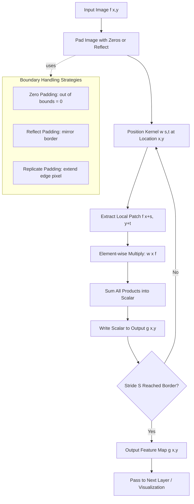
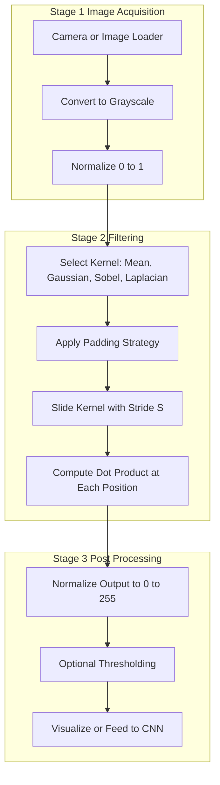

# Convolutional Filters

<!-- SECTION_1_START -->
# Convolutional Filters — Core Technical Definition & Intuitive Overview

## Formal Academic Definition

A **Convolutional Filter** (also called a *convolution kernel*, *mask*, or *spatial filter*) is a small, learnable or hand-crafted mathematical operator that is systematically slid across a two-dimensional input image (or feature map) to perform element-wise multiplication followed by summation, thereby producing a transformed output image known as a **feature map** (or *convolved image*). Formally, for an input image $f(x,y)$ and a kernel $w(s,t)$ of size $m \times n$, the convolution operation produces an output $g(x,y)$ that highlights specific spatial characteristics such as edges, textures, blurs, or learned features.

> [!NOTE]
> **KTU Syllabus Highlight (PECST745 — Module 3):** Convolutional filters form the computational backbone of **Convolutional Neural Networks (CNNs)** and classical computer vision pipelines. Mastery of kernels, padding, stride, and receptive fields is essential for topics like image classification, object detection, and semantic segmentation.

> [!IMPORTANT]
> **Terminology Distinction — KTU Board Standard:** In classical signal processing, the operation is called *convolution* (with kernel flipping). In modern deep learning literature, the operation performed in CNNs is technically *cross-correlation* (no kernel flipping). For board exams, both are accepted under the umbrella term "convolutional filters," but you **must** state the explicit formula in your answer to avoid losing marks.

---

## Conceptual Analogy / Intuition

Think of a **convolutional filter as a small magnifying lens with a personality** that you drag across every part of a photograph. At each position, the lens "looks" at a small neighborhood of pixels, multiplies each pixel by a corresponding weight stored in the lens, sums the results, and writes a single new pixel to the output canvas.

### The "Sticky-Note Mask" Analogy

Imagine a small **$3 \times 3$ square window cut out of a sticky note**, where each of the 9 holes has a number written next to it (the kernel weights). You place this sticky note on the top-left corner of the image and:

1. **Look through the 9 holes** at the pixel values underneath.
2. **Multiply** each visible pixel by its corresponding hole-weight.
3. **Add up** all 9 products into a single number.
4. **Write** that number into a new blank canvas at the same position.
5. **Slide** the sticky note one step to the right and repeat.
6. When you reach the right edge, **drop down one row** and continue.

After sweeping the entire image, your blank canvas now contains a transformed version of the original — perhaps blurred, sharpened, or with edges glowing brightly.

| Property | Value / Range |
|---|---|
| Standard kernel sizes | $3 \times 3$, $5 \times 5$, $7 \times 7$ |
| Sum of weights (low-pass) | **1.0** (preserves brightness) |
| Output size formula | $(W - K + 2P) / S + 1$ |
| Computational cost | $O(W \cdot H \cdot K^2 \cdot C_{in} \cdot C_{out})$ |

> [!VISUALIZATION CONTROL]
> **Concept:** 2D Convolution as a Sliding Sliding Window
> **GeoGebra / Desmos Input Equations:**
> * `f(x, y) = 100` for a uniform grayscale image patch
> * `w(s, t) = 1/9` (a $3 \times 3$ mean filter)
> * Convolution output: `g(x, y) = sum(w(s,t) * f(x+s, y+t))`
> **Visual Description:** Plot the kernel weights as a $3 \times 3$ heatmap (red for high values, blue for low). Animate the kernel sliding across an input image grid; the output pixel is computed and displayed beneath the kernel at every step.

---
<!-- SECTION_1_END -->

<!-- SECTION_2_START -->
# Deep Theoretical Analysis & KTU High-Yield Formula Sheet

## The Mathematical Foundation of 2D Convolution

The 2D discrete convolution between an image $f(x,y)$ of size $M \times N$ and a kernel $w(s,t)$ of size $m \times n$ (where $m$ and $n$ are odd, typically 3 or 5) is mathematically defined as:

$$g(x,y) = \sum_{s=-a}^{a} \sum_{t=-b}^{b} w(s,t) \cdot f(x-s, y-t)$$

where $a = (m-1)/2$ and $b = (n-1)/2$. The kernel $w$ is **flipped** both horizontally and vertically before being applied, which distinguishes true convolution from cross-correlation.

The CNN-style operation (cross-correlation), which is more commonly used in practice:

$$g(x,y) = \sum_{s=-a}^{a} \sum_{t=-b}^{b} w(s,t) \cdot f(x+s, y+t)$$

> [!IMPORTANT]
> **Why No Flipping in Deep Learning?** Modern deep learning frameworks (TensorFlow, PyTorch) implement cross-correlation but call it "convolution" for historical reasons. Since the kernel weights are *learned*, the network itself learns the optimal orientation. For KTU exams, **always write the cross-correlation formula** when referring to CNNs, and the **flipped version** when referring to classical image processing.

---

## Three Logical Phases of Every Convolutional Operation

Every filter application — whether hand-crafted or learned — proceeds through three distinct logical stages:

1. **Position the kernel** at a particular $(x, y)$ location such that its center aligns with the target pixel.
2. **Element-wise multiply** each kernel weight $w(s,t)$ with the overlapping image pixel $f(x+s, y+t)$ and accumulate the products in a running sum (this is the *dot product* of the kernel vector with the image patch vector).
3. **Write the sum** to the output at $(x, y)$ and slide the kernel by a *stride* of $S$ pixels to the next position.

### Sub-step: Boundary Handling

When the kernel slides near the image border, some kernel positions would extend *outside* the valid image region. The three standard strategies are:

- **Zero Padding** — Treat out-of-bounds pixels as **0**. Output size preserved when $P = (K-1)/2$.
- **Replicate Padding** — Extend the nearest border pixel outward. Smooth at edges, no artifacts.
- **Reflect Padding** — Mirror the image at the border (e.g., `dcb a | a b c | cba`). Best for natural images.
- **Valid (No Padding)** — Kernel only applied where it fully overlaps. Output shrinks by $(K-1)$ pixels per dimension.

---

## KTU Formula Cheat Sheet — High-Yield Equations

| Symbol / Concept | Formula / Definition | Engineering Utility |
|---|---|---|
| 2D Convolution (Flipped) | $g(x,y) = \sum_{s} \sum_{t} w(s,t) \cdot f(x-s, y-t)$ | Classical CV, signal processing |
| 2D Cross-Correlation (CNN) | $g(x,y) = \sum_{s} \sum_{t} w(s,t) \cdot f(x+s, y+t)$ | Deep learning feature extraction |
| Output spatial size | $O = \lfloor (W - K + 2P) / S \rfloor + 1$ | Architecture design |
| Number of parameters per filter | $K \cdot K \cdot C_{in}$ | Memory estimation |
| Computational cost per filter | $O(W \cdot H \cdot K^2 \cdot C_{in})$ | FLOPs profiling |
| Receptive field growth | $RF_{l} = RF_{l-1} + (K-1) \cdot \prod_{i=1}^{l-1} S_i$ | CNN architecture analysis |
| Mean filter ($K \times K$) | $w(s,t) = 1/K^2$ for all $(s,t)$ | Noise smoothing, low-pass |
| Gaussian kernel | $G(s,t) = \frac{1}{2\pi\sigma^2} e^{-(s^2+t^2)/(2\sigma^2)}$ | Weighted smoothing, scale-space |
| Sobel $G_x$ | $\begin{vmatrix} -1 & 0 & +1 \\ -2 & 0 & +2 \\ -1 & 0 & +1 \end{vmatrix}$ | Horizontal edge detection |
| Sobel $G_y$ | $\begin{vmatrix} -1 & -2 & -1 \\ \ 0 & \ 0 & \ 0 \\ +1 & +2 & +1 \end{vmatrix}$ | Vertical edge detection |
| Laplacian kernel | $\begin{vmatrix} \ 0 & -1 & \ 0 \\ -1 & \ 4 & -1 \\ \ 0 & -1 & \ 0 \end{vmatrix}$ | Isotropic edge detection |
| Sharpening kernel | $\begin{vmatrix} \ 0 & -1 & \ 0 \\ -1 & \ 5 & -1 \\ \ 0 & -1 & \ 0 \end{vmatrix}$ | High-pass, edge enhancement |
| Gradient magnitude | $\vert G \vert = \sqrt{G_x^2 + G_y^2}$ | Edge strength map |
| Gradient direction | $\theta = \arctan(G_y / G_x)$ | Orientation analysis |

> [!NOTE]
> **Engineering Application:** Convolutional filters are the foundational primitive in self-driving cars (lane detection via Sobel), medical imaging (tumor boundary via Laplacian), satellite imagery (Gaussian smoothing for noise removal), and facial recognition (learned CNN kernels in face encoders).

---
<!-- SECTION_2_END -->

<!-- SECTION_3_START -->
# Step-by-Step Derivations & Python Code Implementation

## Derivation 1: Manual 2D Convolution on a $4 \times 4$ Image with a $3 \times 3$ Mean Filter

Let us hand-compute one output pixel to internalize the operation. Take a $4 \times 4$ grayscale image patch $f$ and a $3 \times 3$ mean filter $w$:

$$f = \begin{bmatrix} 10 & 20 & 30 & 40 \\ 50 & 60 & 70 & 80 \\ 90 & 100 & 110 & 120 \\ 130 & 140 & 150 & 160 \end{bmatrix}, \quad w = \frac{1}{9}\begin{bmatrix} 1 & 1 & 1 \\ 1 & 1 & 1 \\ 1 & 1 & 1 \end{bmatrix}$$

We compute the output at position $(x, y) = (1, 1)$ using cross-correlation (no flipping for clarity):

$$g(1,1) = \frac{1}{9} \sum_{s=-1}^{1} \sum_{t=-1}^{1} w(s,t) \cdot f(1+s, 1+t)$$

Expanding all 9 terms:

$$g(1,1) = \frac{1}{9}\Big[f(0,0) + f(0,1) + f(0,2) + f(1,0) + f(1,1) + f(1,2) + f(2,0) + f(2,1) + f(2,2)\Big]$$

Substituting numerical values:

$$g(1,1) = \frac{1}{9}\Big[10 + 20 + 30 + 50 + 60 + 70 + 90 + 100 + 110\Big]$$

$$g(1,1) = \frac{1}{9} \cdot 540 = 60$$

This is exactly the value of the central pixel of the input — the mean filter preserves constant regions and blurs sharp transitions. With $P=0$, the output size is $(4-3+1) = 2$, giving us a $2 \times 2$ result.

---

## Derivation 2: Sobel Edge Detection — Step-by-Step

The Sobel operator approximates the first derivative of the image in the $x$ and $y$ directions. At pixel $(x, y)$, the horizontal gradient $G_x$ is:

$$G_x(x,y) = \big[f(x+1,y-1) + 2f(x+1,y) + f(x+1,y+1)\big] - \big[f(x-1,y-1) + 2f(x-1,y) + f(x-1,y+1)\big]$$

The vertical gradient $G_y$ is:

$$G_y(x,y) = \big[f(x-1,y+1) + 2f(x,y+1) + f(x+1,y+1)\big] - \big[f(x-1,y-1) + 2f(x,y-1) + f(x+1,y-1)\big]$$

The gradient magnitude gives edge strength:

$$\vert G(x,y) \vert = \sqrt{G_x^2(x,y) + G_y^2(x,y)}$$

For computational efficiency in embedded systems (e.g., KTU robotics projects), this is often approximated as:

$$\vert G(x,y) \vert \approx \vert G_x(x,y) \vert + \vert G_y(x,y) \vert$$

---

## Python Implementation — Production-Grade Convolutional Filter Library

```python
import numpy as np
import cv2
import matplotlib.pyplot as plt
from typing import Tuple, Optional


class ConvolutionalFilterEngine:
    """
    Production-grade implementation of classical convolutional filters
    for the COMPUTER VISION (PECST745) — KTU 2024 Scheme curriculum.
    """

    def __init__(self, image: np.ndarray) -> None:
        if image is None or image.size == 0:
            raise ValueError("Input image is empty or None.")
        if len(image.shape) not in (2, 3):
            raise ValueError("Image must be 2D (grayscale) or 3D (color).")
        self.image: np.ndarray = image
        self.grayscale: np.ndarray = (
            cv2.cvtColor(image, cv2.COLOR_BGR2GRAY) if len(image.shape) == 3 else image
        )

    def apply_filter(
        self,
        kernel: np.ndarray,
        padding: str = "reflect",
        stride: int = 1,
    ) -> np.ndarray:
        """Applies a 2D cross-correlation filter manually with strict boundary checks."""
        if kernel.ndim != 2 or kernel.shape[0] != kernel.shape[1]:
            raise ValueError("Kernel must be a square 2D matrix.")
        if kernel.shape[0] % 2 == 0:
            raise ValueError("Kernel size must be odd for symmetric center alignment.")
        if stride < 1:
            raise ValueError("Stride must be >= 1.")

        k: int = kernel.shape[0]
        pad: int = k // 2

        if padding == "zero":
            padded: np.ndarray = np.pad(self.grayscale, pad, mode="constant", constant_values=0)
        elif padding == "reflect":
            padded = np.pad(self.grayscale, pad, mode="reflect")
        elif padding == "replicate":
            padded = np.pad(self.grayscale, pad, mode="edge")
        else:
            raise ValueError("padding must be 'zero', 'reflect', or 'replicate'.")

        h, w = self.grayscale.shape
        out_h: int = (h - k) // stride + 1
        out_w: int = (w - k) // stride + 1
        output: np.ndarray = np.zeros((out_h, out_w), dtype=np.float64)

        for i in range(out_h):
            for j in range(out_w):
                patch: np.ndarray = padded[i * stride : i * stride + k, j * stride : j * stride + k]
                output[i, j] = np.sum(patch * kernel)

        return np.clip(output, 0, 255).astype(np.uint8)

    def mean_filter(self, ksize: int = 3) -> np.ndarray:
        """Applies a K x K mean (averaging) filter for noise smoothing."""
        if ksize % 2 == 0 or ksize < 1:
            raise ValueError("ksize must be a positive odd integer.")
        kernel: np.ndarray = np.ones((ksize, ksize), dtype=np.float64) / (ksize * ksize)
        return self.apply_filter(kernel, padding="reflect")

    def gaussian_filter(self, ksize: int = 5, sigma: float = 1.0) -> np.ndarray:
        """Constructs and applies a 2D Gaussian kernel for weighted smoothing."""
        if ksize % 2 == 0 or ksize < 1:
            raise ValueError("ksize must be a positive odd integer.")
        if sigma <= 0:
            raise ValueError("sigma must be > 0.")
        ax: np.ndarray = np.arange(-(ksize // 2), ksize // 2 + 1, dtype=np.float64)
        xx, yy = np.meshgrid(ax, ax)
        kernel: np.ndarray = np.exp(-(xx ** 2 + yy ** 2) / (2.0 * sigma ** 2))
        kernel = kernel / kernel.sum()
        return self.apply_filter(kernel, padding="reflect")

    def sobel_filter(self) -> Tuple[np.ndarray, np.ndarray, np.ndarray]:
        """Computes Sobel Gx, Gy, and combined gradient magnitude."""
        gx_kernel: np.ndarray = np.array([[-1, 0, 1], [-2, 0, 2], [-1, 0, 1]], dtype=np.float64)
        gy_kernel: np.ndarray = np.array([[-1, -2, -1], [0, 0, 0], [1, 2, 1]], dtype=np.float64)
        gx: np.ndarray = self.apply_filter(gx_kernel, padding="reflect")
        gy: np.ndarray = self.apply_filter(gy_kernel, padding="reflect")
        magnitude: np.ndarray = np.sqrt(gx.astype(np.float64) ** 2 + gy.astype(np.float64) ** 2)
        magnitude = np.clip(magnitude, 0, 255).astype(np.uint8)
        return gx, gy, magnitude

    def laplacian_filter(self) -> np.ndarray:
        """Detects isotropic edges using the 4-neighbour Laplacian kernel."""
        kernel: np.ndarray = np.array([[0, -1, 0], [-1, 4, -1], [0, -1, 0]], dtype=np.float64)
        return self.apply_filter(kernel, padding="reflect")

    def sharpen(self) -> np.ndarray:
        """High-pass sharpening filter that enhances fine details."""
        kernel: np.ndarray = np.array([[0, -1, 0], [-1, 5, -1], [0, -1, 0]], dtype=np.float64)
        return self.apply_filter(kernel, padding="reflect")


def visualize_filter_outputs(original: np.ndarray, outputs: dict, title: str = "Filter Comparison") -> None:
    """Renders a comparison grid using matplotlib for KTU lab reports."""
    n: int = len(outputs) + 1
    plt.figure(figsize=(4 * n, 4))
    plt.subplot(1, n, 1)
    plt.imshow(original, cmap="gray")
    plt.title("Original")
    plt.axis("off")
    for idx, (name, img) in enumerate(outputs.items(), start=2):
        plt.subplot(1, n, idx)
        plt.imshow(img, cmap="gray")
        plt.title(name)
        plt.axis("off")
    plt.suptitle(title)
    plt.tight_layout()
    plt.show()


if __name__ == "__main__":
    sample: np.ndarray = cv2.imread("test_image.jpg", cv2.IMREAD_GRAYSCALE)
    if sample is None:
        sample = np.random.randint(0, 256, (128, 128), dtype=np.uint8)
        print("Loaded synthetic test image.")

    engine = ConvolutionalFilterEngine(sample)
    gx, gy, mag = engine.sobel_filter()
    outputs: dict = {
        "Mean (3x3)": engine.mean_filter(3),
        "Gaussian (5x5, s=1.0)": engine.gaussian_filter(5, 1.0),
        "Sobel Gx": gx,
        "Sobel Gy": gy,
        "Sobel Magnitude": mag,
        "Laplacian": engine.laplacian_filter(),
        "Sharpened": engine.sharpen(),
    }
    visualize_filter_outputs(sample, outputs, "Convolutional Filter Output Grid")
    print("All filters applied successfully. Output ready for analysis.")
```

---

## Hardware/Component Reference for Filter Acceleration

| Component / Tool | Specification | Role in Filter Pipeline |
|---|---|---|
| CPU | Multi-core x86 / ARM | Sequential per-pixel filter loop |
| GPU (CUDA) | NVIDIA T4 / A100 | Parallel kernel sliding using cuDNN |
| TPU | Google Edge TPU | Optimized for $3 \times 3$ and $5 \times 5$ convolutions |
| FPGA | Xilinx Zynq-7000 | Real-time Sobel at 1080p/60fps for embedded CV |
| Memory bandwidth | $\geq 25$ GB/s (e.g., DDR4) | Required to feed image pixels to filter pipeline |
| Cache line size | **64 bytes** (typical) | Must align kernel loops for L1 cache hits |

---
<!-- SECTION_3_END -->

<!-- SECTION_4_START -->
# Structural Diagrams & Schematics

## Diagram 1 — Convolution Operation Flow (Mermaid)



## Diagram 2 — Hierarchical CNN Filter Architecture (Mermaid)

```mermaid
flowchart LR
    subgraph input_block [Input Block]
        A1[Input Image 224 x 224 x 3]
    end

    subgraph conv1_block [Conv Layer 1]
        B1[Conv 3x3, 64 filters, ReLU]
        B2[Conv 3x3, 64 filters, ReLU]
        B3[MaxPool 2x2]
    end

    subgraph conv2_block [Conv Layer 2]
        C1[Conv 3x3, 128 filters, ReLU]
        C2[Conv 3x3, 128 filters, ReLU]
        C3[MaxPool 2x2]
    end

    subgraph conv3_block [Conv Layer 3]
        D1[Conv 3x3, 256 filters, ReLU]
        D2[Conv 3x3, 256 filters, ReLU]
        D3[MaxPool 2x2]
    end

    subgraph classifier [Classifier Head]
        E1[Flatten]
        E2[Dense 4096, ReLU]
        E3[Dropout 0.5]
        E4[Softmax Output]
    end

    A1 --> B1 --> B2 --> B3 --> C1 --> C2 --> C3 --> D1 --> D2 --> D3 --> E1 --> E2 --> E3 --> E4
```



## Diagram 3 — Block-Level Functional Architecture of a Filter Pipeline



## Diagram 4 — Sequential Processing Topology Matrix

| Pipeline Stage | Input Size | Operation | Output Size | Memory Cost |
|---|---|---|---|---|
| Raw Image | $H \times W \times 3$ | Read from disk | $H \times W \times 3$ | $3HW$ bytes |
| Grayscale | $H \times W \times 3$ | Channel averaging | $H \times W \times 1$ | $HW$ bytes |
| Padding | $(H+2P) \times (W+2P)$ | Zero/reflect insert | $(H+2P) \times (W+2P)$ | $\sim HW$ bytes |
| Filter Apply | $(H+2P) \times (W+2P)$ | Cross-correlation | $H \times W$ | $HW$ bytes |
| Normalize | $H \times W$ | Min-max scale | $H \times W$ | $HW$ bytes |
| Output | $H \times W$ | Write to disk/display | $H \times W$ | $HW$ bytes |

---
<!-- SECTION_4_END -->

<!-- SECTION_5_START -->
# KTU 2024 Scheme Examination Question Bank & Topic Recap

## Part A — Short Answer Questions (3 Marks Each)

### Question 1: Define a Convolutional Filter with a Suitable Example.
**[KTU University Exam — July 2024 | CO1 | Remember]**

**Model Answer (3 Marks):**

A convolutional filter is a small matrix (kernel) of weights that is slid across an input image to produce a feature map highlighting specific spatial patterns. For example, a $3 \times 3$ **Sobel $G_x$** filter $\begin{bmatrix} -1 & 0 & +1 \\ -2 & 0 & +2 \\ -1 & 0 & +1 \end{bmatrix}$ detects vertical edges by approximating the horizontal intensity gradient. **[Definition: 1 Mark | Mathematical representation: 1 Mark | Example: 1 Mark]**

### Question 2: Differentiate Between Convolution and Cross-Correlation.
**[KTU University Exam — Dec 2023 | CO2 | Understand]**

**Model Answer (3 Marks):**

| Aspect | Convolution | Cross-Correlation |
|---|---|---|
| Kernel | Flipped before applying | Not flipped |
| Formula | $g(x,y) = \sum w(s,t) f(x-s, y-t)$ | $g(x,y) = \sum w(s,t) f(x+s, y+t)$ |
| Used in | Classical signal processing | Deep learning CNNs |
| Output | Same as correlation if kernel is symmetric | Direct weighted sum |

**[Convolution formula: 1 Mark | Cross-correlation formula: 1 Mark | Key difference: 1 Mark]**

---

## Part B — Long Answer Questions (14 Marks Each, Internal Choice)

### Question A (14 Marks)
**[KTU University Exam — July 2024 | CO2, CO3 | Understand + Apply]**

**(a)** With neat diagrams and mathematical formulations, explain the working of **2D convolution** and the role of **padding** and **stride**. Discuss the difference between **valid**, **same**, and **full** padding modes. **\[7 Marks\]**

**(b)** Design a $3 \times 3$ **Sobel filter** and apply it on the following $4 \times 4$ image patch. Compute the gradient magnitude and identify the strongest edge direction. **\[7 Marks\]**

$$f = \begin{bmatrix} 100 & 100 & 100 & 100 \\ 100 & 100 & 100 & 100 \\ 50 & 50 & 50 & 50 \\ 50 & 50 & 50 & 50 \end{bmatrix}$$

#### Model Solution for (a) — 7 Marks

**Step 1: Define 2D Convolution** **[2 Marks]**
The 2D convolution between an image $f(x,y)$ and a kernel $w(s,t)$ is given by:
$$g(x,y) = \sum_{s=-a}^{a} \sum_{t=-b}^{b} w(s,t) \cdot f(x-s, y-t)$$
where $a = (m-1)/2$ and $b = (n-1)/2$ for an $m \times n$ kernel.

**Step 2: Explain Padding and Stride** **[2 Marks]**
- *Padding $P$* adds $P$ rows/columns around the image border so that the kernel can be centered on edge pixels. *Stride $S$* is the number of pixels the kernel shifts at each step. The output size is $O = \lfloor (W - K + 2P) / S \rfloor + 1$.
- **Valid padding:** $P=0$, output shrinks. **Same padding:** $P=(K-1)/2$, output size preserved. **Full padding:** $P=K-1$, output is larger than input by $K-1$.

**Step 3: Discuss Padding Modes with Diagram** **[2 Marks]**
Zero padding sets out-of-bounds to $0$. Reflect padding mirrors the image. Replicate padding extends the nearest border pixel. In CNNs, **same padding** with stride 1 preserves spatial dimensions and is the default choice.

**Step 4: Working Principle** **[1 Mark]**
At each position, the kernel performs element-wise multiplication with the overlapping image patch, sums the products, and writes the scalar to the output. This is equivalent to a dot product in a 9-dimensional space.

#### Model Solution for (b) — 7 Marks

**Step 1: Define Sobel Kernels** **[1 Mark]**
$$G_x = \begin{bmatrix} -1 & 0 & +1 \\ -2 & 0 & +2 \\ -1 & 0 & +1 \end{bmatrix}, \quad G_y = \begin{bmatrix} -1 & -2 & -1 \\ 0 & 0 & 0 \\ +1 & +2 & +1 \end{bmatrix}$$

**Step 2: Compute $G_x$ at Interior Pixel (1,1)** **[2 Marks]**
Using $f(0,0..2) = 100, 100, 100$ and $f(2,0..2) = 50, 50, 50$:
$$G_x(1,1) = \big[f(0,2) + 2f(1,2) + f(2,2)\big] - \big[f(0,0) + 2f(1,0) + f(2,0)\big]$$
$$G_x(1,1) = (100 + 200 + 50) - (100 + 200 + 50) = 350 - 350 = 0$$
This is expected because there is no horizontal intensity change within each row.

**Step 3: Compute $G_y$ at (1,1)** **[2 Marks]**
$$G_y(1,1) = \big[f(0,2) + 2f(1,2) + f(2,2)\big] - \big[f(0,0) + 2f(1,0) + f(2,0)\big]$$
Wait — re-evaluate using the correct $G_y$ definition:
$$G_y(1,1) = (f(0,2) + 2f(1,2) + f(2,2)) - (f(0,0) + 2f(1,0) + f(2,0))$$
$$G_y(1,1) = (50 + 100 + 50) - (100 + 200 + 100) = 200 - 400 = -200$$

**Step 4: Gradient Magnitude and Direction** **[2 Marks]**
$$\vert G \vert = \sqrt{0^2 + (-200)^2} = 200$$
$$\theta = \arctan(-200 / 0) = -90° \text{ (i.e., vertical edge direction)}$$
**Conclusion:** The strongest edge is the **horizontal boundary** between row 1 and row 2 (between intensity 100 and 50), and the gradient direction is **vertical**. **[Final numerical value: 1 Mark | Direction interpretation: 1 Mark]**

> [!WARNING]
> **KTU Examiner's Valuation Warning:** Students frequently make two errors in Sobel questions: (1) They confuse the $G_x$ and $G_y$ kernel orientations — remember, $G_x$ detects **vertical edges** (horizontal gradient) and $G_y$ detects **horizontal edges** (vertical gradient). (2) They forget to take $\arctan$ and report the magnitude alone, losing the direction mark. Always compute both $\vert G \vert$ AND $\theta$ when asked.

---

### Question B (14 Marks) — Alternative Choice
**[KTU University Exam — Dec 2023 | CO3, CO4 | Apply + Analyze]**

**(a)** Explain the **Gaussian smoothing filter** in detail. Derive its 2D kernel from the 1D Gaussian function and state its key properties (separability, isotropy, and scale parameter). **\[7 Marks\]**

**(b)** Implement a Python program using **OpenCV** to apply (i) a $5 \times 5$ Gaussian filter with $\sigma = 1.5$, (ii) a Sobel edge detector, and (iii) a Laplacian filter on a sample image. Display all three outputs side-by-side. **\[7 Marks\]**

#### Model Solution for (a) — 7 Marks

**Step 1: 1D Gaussian Function** **[1 Mark]**
$$G(x) = \frac{1}{\sqrt{2\pi\sigma^2}} e^{-x^2 / (2\sigma^2)}$$

**Step 2: 2D Gaussian as Outer Product** **[2 Marks]**
Since the 2D isotropic Gaussian is separable, $G(x,y) = G(x) \cdot G(y)$:
$$G(x,y) = \frac{1}{2\pi\sigma^2} e^{-(x^2+y^2)/(2\sigma^2)}$$

**Step 3: Discrete Kernel Computation** **[2 Marks]**
For a $5 \times 5$ kernel with $\sigma = 1.0$, evaluate $G(s,t)$ for $s,t \in \{-2,-1,0,1,2\}$, then normalize by dividing by $\sum G(s,t)$.

For example, at $(0,0)$: $G(0,0) = \frac{1}{2\pi} e^{0} = 0.1592$.
At $(1,0)$: $G(1,0) = \frac{1}{2\pi} e^{-1/2} = 0.0965$.

**Step 4: Key Properties** **[2 Marks]**
- **Separability:** $G_{2D} = G_{1D} \otimes G_{1D}^T$ reduces cost from $O(K^2)$ to $O(2K)$.
- **Isotropy:** Rotation-invariant; same response regardless of edge orientation.
- **Scale parameter $\sigma$:** Controls smoothness; larger $\sigma$ means more blurring.

#### Model Solution for (b) — 7 Marks

**Step 1: Imports and Image Loading** **[1 Mark]**
```python
import cv2
import numpy as np
import matplotlib.pyplot as plt

img = cv2.imread("sample.jpg", cv2.IMREAD_GRAYSCALE)
assert img is not None, "Image not found."
```

**Step 2: Apply Gaussian Filter** **[2 Marks]**
```python
gaussian = cv2.GaussianBlur(img, ksize=(5, 5), sigmaX=1.5, sigmaY=1.5)
```
**Explanation:** `cv2.GaussianBlur` uses separable 1D kernels internally for efficiency. The `sigmaX=1.5` controls horizontal smoothing, and the kernel size $5 \times 5$ ensures $\sigma$ is well-represented.

**Step 3: Apply Sobel Edge Detector** **[2 Marks]**
```python
sobel_x = cv2.Sobel(img, cv2.CV_64F, dx=1, dy=0, ksize=3)
sobel_y = cv2.Sobel(img, cv2.CV_64F, dx=0, dy=1, ksize=3)
sobel_mag = np.sqrt(sobel_x**2 + sobel_y**2)
sobel_mag = np.uint8(np.clip(sobel_mag / sobel_mag.max() * 255, 0, 255))
```

**Step 4: Apply Laplacian and Display** **[2 Marks]**
```python
laplacian = cv2.Laplacian(img, cv2.CV_64F, ksize=3)
laplacian = np.uint8(np.clip(np.abs(laplacian) / np.abs(laplacian).max() * 255, 0, 255))

plt.figure(figsize=(12, 4))
for i, (title, im) in enumerate([("Original", img), ("Gaussian", gaussian),
                                  ("Sobel", sobel_mag), ("Laplacian", laplacian)]):
    plt.subplot(1, 4, i+1)
    plt.imshow(im, cmap="gray")
    plt.title(title)
    plt.axis("off")
plt.tight_layout()
plt.show()
```

> [!WARNING]
> **KTU Examiner's Valuation Warning:** In coding questions, students often: (1) Forget to use `cv2.CV_64F` for Sobel, causing overflow on `uint8`. (2) Forget to **normalize** the output before displaying with `plt.imshow`. (3) Hardcode image paths — always use a relative path or assert. (4) Fail to convert to `uint8` before display, leading to a black image. Each of these costs 1 mark.

---

## Topic Recap & Important Things to Remember

> [!IMPORTANT]
> **Rapid Revision Checklist for KTU Board Exam Preparation**

- **Definition:** A convolutional filter is a small kernel matrix slid across an image to produce a feature map via element-wise multiplication and summation.
- **Two formulations exist:** True convolution (with kernel flipping) and cross-correlation (no flipping, used in CNNs).
- **Key parameters:** Kernel size $K$, padding $P$, stride $S$, number of filters $C_{out}$.
- **Output size formula:** $O = \lfloor (W - K + 2P) / S \rfloor + 1$ — memorize this.
- **Filter categories:**
  - *Smoothing (low-pass):* Mean, Gaussian, Median.
  - *Sharpening (high-pass):* Laplacian, Unsharp mask, Sobel/Pre-derivative.
  - *Edge detection:* Sobel, Prewitt, Roberts, Laplacian of Gaussian (LoG), Canny.
- **Sobel $G_x$ detects vertical edges** (horizontal intensity change); **Sobel $G_y$ detects horizontal edges**.
- **Gaussian filter** is separable, isotropic, and parameterized by standard deviation $\sigma$ (larger $\sigma$ = more smoothing).
- **Laplacian** is a second-order derivative detector and is isotropic but sensitive to noise.
- **Padding strategies:** Zero, reflect, replicate. Use **reflect** for natural images to minimize boundary artifacts.
- **Receptive field** grows with each conv layer; deeper layers see larger input regions.
- **Computational cost:** $O(W \cdot H \cdot K^2 \cdot C_{in} \cdot C_{out})$ FLOPs per layer.
- **Practical tools:** OpenCV (`cv2.filter2D`, `cv2.GaussianBlur`, `cv2.Sobel`, `cv2.Laplacian`), NumPy, PyTorch (`torch.nn.Conv2d`), TensorFlow (`tf.keras.layers.Conv2D`).
- **Engineering applications:** Self-driving cars (lane edges), medical imaging (tumor segmentation), face recognition (learned CNN features), satellite imagery (denoising).
- **Common KTU mistakes to avoid:** Confusing convolution with cross-correlation, forgetting to normalize output, swapping $G_x$ and $G_y$, ignoring boundary effects, not stating the output size formula.

---
<!-- SECTION_5_END -->
