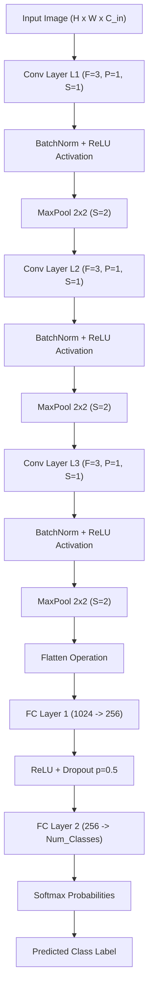
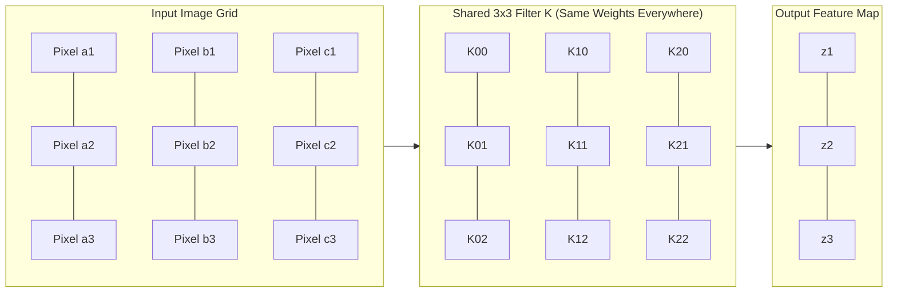
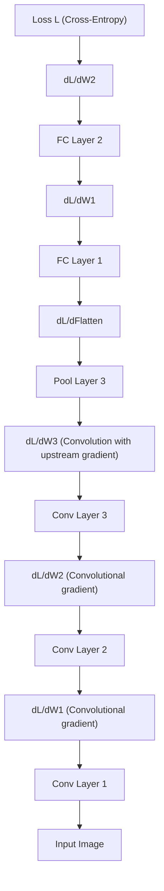

# Convolutional Networks

<!-- SECTION_1_START -->
# Convolutional Networks: The Eyes of Modern Computer Vision

## 1.1 Formal Academic Definition (KTU 2024 Syllabus Terminology)

> [!IMPORTANT]
> **Convolutional Neural Network (CNN / ConvNet):** A specialized class of deep, feed-forward artificial neural networks that employs a mathematical operation called **convolution** in place of general matrix multiplication in at least one of their layers. CNNs are explicitly designed to process data that has a known, grid-like topology (e.g., images, which are 2D grids of pixels), exploiting **local connectivity**, **spatial invariance**, and **parameter sharing** to learn hierarchical feature representations directly from raw pixel intensities.

Formally, a CNN is a composition of differentiable functions $f^{(L)} \circ f^{(L-1)} \circ \dots \circ f^{(1)}(x; \theta)$ where each $f^{(l)}$ is either a **convolutional layer**, a **non-linear activation layer**, a **pooling layer**, or a **fully connected layer**, and $\theta$ represents the learnable filter weights and biases optimized via **stochastic gradient descent (SGD)** and **backpropagation**.

## 1.2 Conceptual Analogy & Intuitive Overview

> [!NOTE]
> **Analogy — "The Spotlight Detective":**
> Imagine you are a detective investigating a large photograph to find a specific pattern (say, a human eye). Instead of trying to memorize the entire photo at once, you use a small **flashlight (the filter/kernel)** that you slide across every patch of the image. At each position, you ask: *"How strongly does the pattern I am looking for appear here?"* The flashlight gives you a single number (a high number means "yes, very likely an eye-like pattern is here," a low number means "no"). The collection of all those numbers is a new, smaller map — the **feature map** — that highlights *where* the pattern exists.
>
> The brilliance of CNNs is that the **same flashlight** is reused across the entire image (parameter sharing), and many different flashlights (filters) are used in parallel to detect many different patterns simultaneously. Deeper layers use flashlights-of-flashlights to detect complex shapes like "wheel," "face," or "car."

## 1.3 Core Building Blocks of a Convolutional Network

A typical CNN architecture follows the operational sequence: **INPUT $\rightarrow$ [[CONV $\rightarrow$ RELU] $\times$ N $\rightarrow$ POOL?] $\times$ M $\rightarrow$ FLATTEN $\rightarrow$ FC $\rightarrow$ OUTPUT**

| Component | Symbolic Role | Intuitive Function |
|---|---|---|
| **Input Layer** | Tensor of shape $(H, W, C)$ | The raw image fed to the network |
| **Convolutional Layer** | $z = W * x + b$ | Sliding "pattern detectors" over the image |
| **Activation (ReLU)** | $a = \max(0, z)$ | Introduces non-linearity |
| **Pooling Layer** | $\text{downsample}(a)$ | Shrinks feature maps, summarizes regions |
| **Flatten Layer** | $\text{vec}(a)$ | Converts 2D maps into a 1D vector |
| **Fully Connected Layer** | $h = Wx + b$ | High-level reasoning over extracted features |
| **Softmax Layer** | $\sigma(z)_i$ | Converts logits to class probabilities |

## 1.4 Three Foundational Design Principles

> [!IMPORTANT]
> **The Three Pillars of CNN Efficiency (vs. Fully Connected Networks on Images):**
>
> 1. **Local Connectivity (Sparse Interactions):** Each neuron connects only to a small *local region* (receptive field) of the previous layer, not the entire input. This dramatically reduces parameters and exploits the local spatial correlation of natural images.
>
> 2. **Parameter Sharing (Tied Weights):** The same filter weights are used at every spatial position of the input. This means a feature detector useful in one location is also useful everywhere else — exploiting the **translation equivariance** property of natural images.
>
> 3. **Pooling / Downsampling (Invariance):** Aggregation operations (max, average) provide a small degree of **translation invariance**, allowing the network to recognize a feature even if it is slightly shifted in position.

## 1.5 Visualization Control — Concept Anchoring

> [!VISUALIZATION CONTROL]
> **Concept:** Geometric Intuition of a 2D Convolution Operation
> **GeoGebra / Desmos Input Equations:**
> * `Input = matrix({0,0,0,0,0}, {0,1,1,1,0}, {0,1,0,1,0}, {0,1,1,1,0}, {0,0,0,0,0})` (representing a $5 \times 5$ input image)
> * `Filter = matrix({1,0,1}, {0,1,0}, {1,0,1})` (representing a $3 \times 3$ vertical-edge detector)
> * `Output[i,j] = sum(Filter .* Input[i:i+2, j:j+2])`
> **Visual Description:** A $3 \times 3$ transparent highlight box should slide across the $5 \times 5$ input grid, performing element-wise multiplication with the filter at each position and producing a single scalar output value in the resulting $3 \times 3$ feature map. The student should observe that central values of the input (where the cross-pattern is intact) produce higher output values, while edge regions produce smaller or zero values.

---

<!-- SECTION_2_START -->
# Deep Theoretical Analysis & KTU High-Yield Formula Sheet

## 2.1 The 2D Discrete Convolution Operation — Formal Definition

Given a 2D input image $I \in \mathbb{R}^{H \times W}$ and a 2D filter (kernel) $K \in \mathbb{R}^{F_h \times F_w}$, the 2D **cross-correlation** (which deep-learning libraries actually implement and call "convolution") is defined as:

$$
S(i, j) = (I * K)(i, j) = \sum_{m=0}^{F_h - 1} \sum_{n=0}^{F_w - 1} I(i + m, j + n) \cdot K(m, n) + b
$$

where:
* $S(i, j)$ is the output feature map at spatial location $(i, j)$
* $b \in \mathbb{R}$ is a scalar bias term (added per filter)
* The filter $K$ is the *learnable* parameter matrix
* The index $(i, j)$ iterates over all valid positions of the sliding window

For **multi-channel input** (e.g., RGB image with $C_{in}$ channels), the operation extends to a 3D filter $K \in \mathbb{R}^{F_h \times F_w \times C_{in}}$:

$$
S_{k}(i, j) = \sum_{c=0}^{C_{in}-1} \sum_{m=0}^{F_h-1} \sum_{n=0}^{F_w-1} I_c(i+m, j+n) \cdot K_{k,c}(m, n) + b_k
$$

where $k = 0, 1, \dots, C_{out}-1$ indexes the $C_{out}$ distinct filters in the layer.

## 2.2 The Three Critical Hyperparameters

### 2.2.1 Stride ($S$)
The stride controls the step size with which the filter slides across the input. A stride of $S = 1$ moves the filter one pixel at a time (output nearly same size as input). A stride of $S = 2$ downsamples by skipping every other position (output half the size).

### 2.2.2 Padding ($P$)
Padding adds $P$ rows/columns of zeros around the input border. Its primary purpose is to:
* **Preserve spatial dimensions** (using $P = \frac{F-1}{2}$ for $F$ odd — called *"same" padding*)
* **Allow the filter to be applied at border positions** so information near the edges is not lost

### 2.2.3 Dilation ($D$)
Dilation inserts $D - 1$ zeros *between* filter elements, expanding the receptive field without adding parameters. Used in **atrous convolution** (DeepLab) and **dilated CNNs**.

## 2.3 Pooling Operations

Pooling layers perform **fixed** (non-learnable) downsampling along spatial dimensions.

**Max Pooling** (most common):
$$
P(i, j, c) = \max_{(m,n) \in \text{window}} A(i \cdot S + m, j \cdot S + n, c)
$$

**Average Pooling**:
$$
P(i, j, c) = \frac{1}{F^2} \sum_{(m,n) \in \text{window}} A(i \cdot S + m, j \cdot S + n, c)
$$

**Global Average Pooling (GAP)**:
$$
P(c) = \frac{1}{H \times W} \sum_{i=1}^{H} \sum_{j=1}^{W} A(i, j, c)
$$

> [!NOTE]
> **Why Pooling?** Pooling provides a small degree of **translation invariance** (a small shift in input produces the same pooled output) and drastically **reduces computational cost** in deeper layers. Modern architectures (ResNet, EfficientNet) often use **strided convolutions** instead of pooling to learn the downsampling operation end-to-end.

## 2.4 KTU High-Yield Formula Sheet

| # | Quantity | Formula | Variables / Description |
|---|---|---|---|
| 1 | **Conv Output Spatial Size** | $W_{out} = \left\lfloor \frac{W_{in} - F + 2P}{S} \right\rfloor + 1$ | $W_{in}$: input size; $F$: filter size; $P$: padding; $S$: stride |
| 2 | **Conv Output Volume Shape** | $(W_{out}, H_{out}, C_{out})$ | $C_{out}$ = number of filters in the layer |
| 3 | **Conv Parameter Count** | $P_{conv} = (F_h \times F_w \times C_{in} + 1) \times C_{out}$ | The `+1` accounts for the bias term per filter |
| 4 | **Pool Output Spatial Size** | $W_{out}^{pool} = \left\lfloor \frac{W_{in} - F_{pool}}{S} \right\rfloor + 1$ | Pooling has **zero** learnable parameters |
| 5 | **FC Parameter Count** | $P_{fc} = (n_{in} + 1) \times n_{out}$ | $n_{in}$: input dim; $n_{out}$: output dim; `+1` is bias |
| 6 | **Receptive Field (Stacked Conv)** | $R_l = R_{l-1} + (F_l - 1) \cdot \prod_{k=1}^{l-1} S_k$ | $R_0 = 1$; $F_l$: filter size at layer $l$; $S_k$: stride at layer $k$ |
| 7 | **ReLU Activation** | $\phi(z) = \max(0, z)$ | Non-linear, zero gradient for $z < 0$ |
| 8 | **Softmax (Output)** | $\sigma(z_i) = \frac{e^{z_i}}{\sum_{j=1}^{C} e^{z_j}}$ | Produces probability distribution over $C$ classes |
| 9 | **Cross-Entropy Loss** | $\mathcal{L} = -\sum_{c=1}^{C} y_c \log(\hat{y}_c)$ | Standard loss for multi-class classification |
| 10 | **Total Trainable Parameters** | $\sum_{l=1}^{L} P_{conv}^{(l)} + \sum_{l=1}^{M} P_{fc}^{(l)}$ | Sum of all learnable weights + biases across the network |

## 2.5 Real-World Engineering & Production Utility

> [!IMPORTANT]
> **Where CNNs Are Deployed in Production:**
> * **Autonomous Vehicles (Tesla, Waymo):** Real-time semantic segmentation and object detection using **U-Net**, **YOLO**, and **EfficientDet** backbones.
> * **Medical Imaging (PathAI, Arterys):** Tumor segmentation in CT/MRI scans, diabetic retinopathy detection, and pathology slide analysis.
> * **Face Recognition (iPhone Face ID, Clearview AI):** **FaceNet** and **ArcFace** embeddings for identity verification.
> * **Industrial Quality Control (Siemens, Bosch):** Surface defect detection on manufacturing lines with sub-millisecond inference on edge TPUs.
> * **Generative AI (Stable Diffusion, DALL-E):** U-Net architectures inside diffusion models for text-to-image synthesis.
> * **Satellite & Remote Sensing (Planet Labs):** Land-cover classification, deforestation monitoring, disaster response.
>
> CNNs dominate any task where the input has **spatial structure** and **translation equivariance** is desirable.

---

<!-- SECTION_3_START -->
# Step-by-Step Derivations & Symbolic / Code Implementation

## 3.1 Mathematical Derivation — Convolution Output Dimensions

> [!NOTE]
> **Problem:** Given an input image of size $H_{in} \times W_{in} \times C_{in}$, $C_{out}$ filters each of size $F_h \times F_w \times C_{in}$, padding $P$, and stride $S$, derive the output feature map dimensions and total parameter count.

### Step 1: Spatial Output Height
The filter of height $F_h$ is placed with its top-left corner at valid vertical positions $i \in \{0, S, 2S, \dots, (n_H - 1)S\}$ where $n_H$ is the number of valid positions. The filter must fit within the padded input:

$$
i + F_h - 1 \leq H_{in} + 2P - 1 \quad \Rightarrow \quad i \leq H_{in} + 2P - F_h
$$

The number of valid positions is:

$$
H_{out} = \left\lfloor \frac{H_{in} + 2P - F_h}{S} \right\rfloor + 1
$$

### Step 2: Spatial Output Width (analogously)

$$
W_{out} = \left\lfloor \frac{W_{in} + 2P - F_w}{S} \right\rfloor + 1
$$

### Step 3: Number of Channels
Each of the $C_{out}$ filters produces one 2D feature map. Stacking them gives a 3D output tensor:

$$
\text{Output Shape} = (H_{out}, W_{out}, C_{out})
$$

### Step 4: Parameter Count
Each of the $C_{out}$ filters has $F_h \times F_w \times C_{in}$ weight values plus 1 bias scalar. Therefore:

$$
P_{conv} = (F_h \times F_w \times C_{in} + 1) \times C_{out}
$$

### Step 5: Numerical Worked Example
Let $H_{in} = 32$, $W_{in} = 32$, $C_{in} = 3$, $F_h = F_w = 5$, $P = 0$, $S = 1$, $C_{out} = 16$.

$$
H_{out} = \left\lfloor \frac{32 + 0 - 5}{1} \right\rfloor + 1 = 27 + 1 = 28
$$

$$
W_{out} = \left\lfloor \frac{32 + 0 - 5}{1} \right\rfloor + 1 = 28
$$

$$
P_{conv} = (5 \times 5 \times 3 + 1) \times 16 = 76 \times 16 = 1216 \text{ parameters}
$$

For comparison, an equivalent fully-connected layer from $32 \times 32 \times 3$ to $28 \times 28 \times 16$ would require $3072 \times 12544 = 38{,}539{,}776$ parameters — over **31,000 times more**.

## 3.2 Derivation — Receptive Field Through Stacked Convolutions

> [!NOTE]
> **Problem:** Compute the theoretical receptive field of a stack of three conv layers with filter sizes $F_1 = 3, F_2 = 3, F_3 = 3$ and strides $S_1 = 1, S_2 = 2, S_3 = 2$.

### Step 1: Initialize
The receptive field of a single pixel is $R_0 = 1$.

### Step 2: Layer 1 contribution
$$
R_1 = R_0 + (F_1 - 1) \cdot \prod_{k=1}^{0} S_k = 1 + (3-1) \cdot 1 = 3
$$

### Step 3: Layer 2 contribution
$$
R_2 = R_1 + (F_2 - 1) \cdot S_1 = 3 + (3-1) \cdot 1 = 5
$$

### Step 4: Layer 3 contribution
$$
R_3 = R_2 + (F_3 - 1) \cdot (S_1 \cdot S_2) = 5 + (3-1) \cdot (1 \cdot 2) = 5 + 4 = 9
$$

**Result:** A single neuron in layer 3 "sees" a $9 \times 9$ patch of the original input image.

## 3.3 Derivation — Backpropagation Through a Convolution Layer

The convolution forward pass is:

$$
Z_{k}(i, j) = \sum_{c,m,n} W_{k,c}(m, n) \cdot A_{c}(i+m, j+n) + b_k
$$

For a loss $\mathcal{L}$, the gradient with respect to the filter weights is:

$$
\frac{\partial \mathcal{L}}{\partial W_{k,c}(m, n)} = \sum_{i, j} \frac{\partial \mathcal{L}}{\partial Z_{k}(i, j)} \cdot A_{c}(i+m, j+n)
$$

which is itself a **convolution** of the upstream gradient $\frac{\partial \mathcal{L}}{\partial Z_{k}}$ with the input activation $A_c$. This beautiful property is what makes CNN backprop computationally efficient.

The gradient with respect to the input (for backprop to earlier layers) is:

$$
\frac{\partial \mathcal{L}}{\partial A_{c}(i, j)} = \sum_{k, m, n} W_{k,c}(m, n) \cdot \frac{\partial \mathcal{L}}{\partial Z_{k}(i-m, j-n)}
$$

This is a **full convolution** of the gradient with the **180°-rotated** filter — a key derivation result in CNN gradient flow.

## 3.4 Python Implementation — A Complete CNN from Scratch (using PyTorch)

```python
"""
File: cnn_classifier.py
Purpose: Educational implementation of a Convolutional Neural Network for CIFAR-10.
         Demonstrates convolution, ReLU, max-pooling, fully-connected layers.
Course:  COMPUTER VISION (PECST745) - KTU 2024 Scheme, Module 3
"""
from __future__ import annotations

import logging
import sys
from typing import Tuple

import torch
import torch.nn as nn
import torch.nn.functional as F
from torch.utils.data import DataLoader
from torchvision import datasets, transforms

# ----------------------------------------------------------------------
# Logging Configuration
# ----------------------------------------------------------------------
logging.basicConfig(
    level=logging.INFO,
    format="%(asctime)s | %(levelname)s | %(message)s",
    stream=sys.stdout,
)
logger: logging.Logger = logging.getLogger(__name__)


# ----------------------------------------------------------------------
# Hyperparameters
# ----------------------------------------------------------------------
class CNNConfig:
    """Centralized configuration for the CNN training pipeline."""

    BATCH_SIZE: int = 64
    LEARNING_RATE: float = 1e-3
    EPOCHS: int = 10
    NUM_CLASSES: int = 10
    INPUT_CHANNELS: int = 3
    IMAGE_SIZE: int = 32
    DEVICE: torch.device = torch.device(
        "cuda" if torch.cuda.is_available() else "cpu"
    )


# ----------------------------------------------------------------------
# CNN Architecture Definition
# ----------------------------------------------------------------------
class ConvNetClassifier(nn.Module):
    """
    A canonical CNN architecture inspired by LeNet-5 / AlexNet principles.

    Layer-by-layer specification:
        Conv1: 3  -> 16 channels, 3x3 filter, padding=1   (32x32x3 -> 32x32x16)
        Pool1: 2x2 max pool, stride=2                    (32x32x16 -> 16x16x16)
        Conv2: 16 -> 32 channels, 3x3 filter, padding=1  (16x16x16 -> 16x16x32)
        Pool2: 2x2 max pool, stride=2                    (16x16x32 -> 8x8x32)
        Conv3: 32 -> 64 channels, 3x3 filter, padding=1  (8x8x32 -> 8x8x64)
        Pool3: 2x2 max pool, stride=2                    (8x8x64 -> 4x4x64)
        Flatten:                                        (4*4*64 = 1024)
        FC1:   1024 -> 256
        FC2:   256  -> 10 (class logits)
    """

    def __init__(self, config: CNNConfig) -> None:
        super().__init__()
        # --- Convolutional Feature Extractor ---
        self.conv_block1: nn.Sequential = nn.Sequential(
            nn.Conv2d(
                in_channels=config.INPUT_CHANNELS,
                out_channels=16,
                kernel_size=3,
                stride=1,
                padding=1,
            ),
            nn.BatchNorm2d(16),
            nn.ReLU(inplace=True),
            nn.MaxPool2d(kernel_size=2, stride=2),
        )
        self.conv_block2: nn.Sequential = nn.Sequential(
            nn.Conv2d(in_channels=16, out_channels=32, kernel_size=3, padding=1),
            nn.BatchNorm2d(32),
            nn.ReLU(inplace=True),
            nn.MaxPool2d(kernel_size=2, stride=2),
        )
        self.conv_block3: nn.Sequential = nn.Sequential(
            nn.Conv2d(in_channels=32, out_channels=64, kernel_size=3, padding=1),
            nn.BatchNorm2d(64),
            nn.ReLU(inplace=True),
            nn.MaxPool2d(kernel_size=2, stride=2),
        )
        # --- Fully-Connected Classifier Head ---
        self.classifier: nn.Sequential = nn.Sequential(
            nn.Flatten(),
            nn.Linear(in_features=64 * 4 * 4, out_features=256),
            nn.ReLU(inplace=True),
            nn.Dropout(p=0.5),
            nn.Linear(in_features=256, out_features=config.NUM_CLASSES),
        )

    def forward(self, x: torch.Tensor) -> torch.Tensor:
        """Forward pass: maps (B, 3, 32, 32) -> (B, 10) class logits."""
        if x.dim() != 4:
            raise ValueError(
                f"Expected 4D input tensor (B, C, H, W), got {x.dim()}D"
            )
        x = self.conv_block1(x)
        x = self.conv_block2(x)
        x = self.conv_block3(x)
        logits: torch.Tensor = self.classifier(x)
        return logits


# ----------------------------------------------------------------------
# Data Loading Utilities
# ----------------------------------------------------------------------
def build_dataloaders(
    config: CNNConfig,
) -> Tuple[DataLoader, DataLoader]:
    """Loads CIFAR-10 train and test sets with standard augmentation."""
    train_transform = transforms.Compose(
        [
            transforms.RandomHorizontalFlip(p=0.5),
            transforms.RandomCrop(
                size=config.IMAGE_SIZE, padding=4
            ),
            transforms.ToTensor(),
            transforms.Normalize(
                mean=(0.4914, 0.4822, 0.4465),
                std=(0.2470, 0.2435, 0.2616),
            ),
        ]
    )
    test_transform = transforms.Compose(
        [
            transforms.ToTensor(),
            transforms.Normalize(
                mean=(0.4914, 0.4822, 0.4465),
                std=(0.2470, 0.2435, 0.2616),
            ),
        ]
    )

    train_set = datasets.CIFAR10(
        root="./data", train=True, download=True, transform=train_transform
    )
    test_set = datasets.CIFAR10(
        root="./data", train=False, download=True, transform=test_transform
    )

    train_loader = DataLoader(
        train_set,
        batch_size=config.BATCH_SIZE,
        shuffle=True,
        num_workers=2,
        pin_memory=True,
    )
    test_loader = DataLoader(
        test_set,
        batch_size=config.BATCH_SIZE,
        shuffle=False,
        num_workers=2,
        pin_memory=True,
    )
    return train_loader, test_loader


# ----------------------------------------------------------------------
# Training & Evaluation Routines
# ----------------------------------------------------------------------
def train_one_epoch(
    model: nn.Module,
    loader: DataLoader,
    optimizer: torch.optim.Optimizer,
    criterion: nn.Module,
    device: torch.device,
) -> Tuple[float, float]:
    """Trains the model for one full epoch and returns (loss, accuracy)."""
    model.train()
    total_loss: float = 0.0
    correct: int = 0
    total: int = 0
    for batch_idx, (images, labels) in enumerate(loader):
        images = images.to(device, non_blocking=True)
        labels = labels.to(device, non_blocking=True)

        optimizer.zero_grad()
        logits = model(images)
        loss = criterion(logits, labels)
        loss.backward()
        optimizer.step()

        total_loss += loss.item() * images.size(0)
        _, predicted = torch.max(logits, dim=1)
        correct += (predicted == labels).sum().item()
        total += labels.size(0)

    avg_loss: float = total_loss / total
    accuracy: float = correct / total
    return avg_loss, accuracy


def evaluate(
    model: nn.Module,
    loader: DataLoader,
    criterion: nn.Module,
    device: torch.device,
) -> Tuple[float, float]:
    """Evaluates the model on the test set."""
    model.eval()
    total_loss: float = 0.0
    correct: int = 0
    total: int = 0
    with torch.no_grad():
        for images, labels in loader:
            images = images.to(device, non_blocking=True)
            labels = labels.to(device, non_blocking=True)
            logits = model(images)
            loss = criterion(logits, labels)
            total_loss += loss.item() * images.size(0)
            _, predicted = torch.max(logits, dim=1)
            correct += (predicted == labels).sum().item()
            total += labels.size(0)
    return total_loss / total, correct / total


# ----------------------------------------------------------------------
# Main Entry Point
# ----------------------------------------------------------------------
def main() -> None:
    config = CNNConfig()
    logger.info(f"Running on device: {config.DEVICE}")

    train_loader, test_loader = build_dataloaders(config)

    model = ConvNetClassifier(config).to(config.DEVICE)
    total_params: int = sum(p.numel() for p in model.parameters())
    logger.info(f"Total trainable parameters: {total_params:,}")

    criterion = nn.CrossEntropyLoss()
    optimizer = torch.optim.Adam(
        model.parameters(), lr=config.LEARNING_RATE
    )

    for epoch in range(1, config.EPOCHS + 1):
        train_loss, train_acc = train_one_epoch(
            model, train_loader, optimizer, criterion, config.DEVICE
        )
        test_loss, test_acc = evaluate(
            model, test_loader, criterion, config.DEVICE
        )
        logger.info(
            f"Epoch {epoch:02d}/{config.EPOCHS} | "
            f"Train Loss: {train_loss:.4f}, Train Acc: {train_acc:.4f} | "
            f"Test Loss: {test_loss:.4f}, Test Acc: {test_acc:.4f}"
        )


if __name__ == "__main__":
    main()
```

### 3.4.1 Verification of Output Shapes (Numerical Walkthrough)

Let us trace a single forward pass with `BATCH_SIZE = 1`:

| Layer | Input Shape | Operation | Output Shape |
|---|---|---|---|
| Input | $(1, 3, 32, 32)$ | — | $(1, 3, 32, 32)$ |
| Conv1 + Pool1 | $(1, 3, 32, 32)$ | $3 \rightarrow 16$, $3\times3$, $P=1$, $S=1$, then $2\times2$ pool $S=2$ | $(1, 16, 16, 16)$ |
| Conv2 + Pool2 | $(1, 16, 16, 16)$ | $16 \rightarrow 32$, $3\times3$, $P=1$, $S=1$, then $2\times2$ pool $S=2$ | $(1, 32, 8, 8)$ |
| Conv3 + Pool3 | $(1, 32, 8, 8)$ | $32 \rightarrow 64$, $3\times3$, $P=1$, $S=1$, then $2\times2$ pool $S=2$ | $(1, 64, 4, 4)$ |
| Flatten | $(1, 64, 4, 4)$ | $\text{vec}(\cdot)$ | $(1, 1024)$ |
| FC1 + ReLU + Dropout | $(1, 1024)$ | $1024 \rightarrow 256$ | $(1, 256)$ |
| FC2 (logits) | $(1, 256)$ | $256 \rightarrow 10$ | $(1, 10)$ |

### 3.4.2 Parameter Count Audit

| Layer | Weights | Biases | Total |
|---|---|---|---|
| Conv1 | $3 \times 3 \times 3 \times 16 = 432$ | $16$ | $448$ |
| BN1 | $16$ (γ) $+ 16$ (β) | $0$ | $32$ |
| Conv2 | $3 \times 3 \times 16 \times 32 = 4608$ | $32$ | $4640$ |
| BN2 | $32 + 32$ | $0$ | $64$ |
| Conv3 | $3 \times 3 \times 32 \times 64 = 18432$ | $64$ | $18496$ |
| BN3 | $64 + 64$ | $0$ | $128$ |
| FC1 | $1024 \times 256 = 262144$ | $256$ | $262400$ |
| FC2 | $256 \times 10 = 2560$ | $10$ | $2570$ |
| **Total** | — | — | **$288{,}778$ parameters** |

> [!IMPORTANT]
> **Observation for Valuation:** Notice that the **FC1 layer alone accounts for $\sim$90.8%** of the total parameters. This is why modern architectures (ResNet, MobileNet, EfficientNet) replace FC layers with **Global Average Pooling (GAP)** to slash parameter counts and overfitting risk.

---

<!-- SECTION_4_START -->
# Structural Diagrams & Schematics

## 4.1 CNN Forward-Pass Data Flow (Mermaid Block Diagram)



## 4.2 Detailed Subgraph — Convolution Block Internal Architecture

```mermaid
subgraph ConvolutionBlock
    direction LR
    inMap["Input Feature Map"] --> padOp["Zero Padding P"]
    padOp --> slideWin["Sliding Window (Filter F x F)"]
    slideWin --> mulOp["Element-wise Multiply"]
    mulOp --> sumOp["Sum + Bias b"]
    sumOp --> outMap["Output Feature Map (Single Channel)"]
end
```

## 4.3 Subgraph — Receptive Field Expansion in Stacked Convolutions

```mermaid
subgraph ReceptiveFieldGrowth
    direction LR
    rf0["Layer 0: RF = 1 px"] --> rf1["Layer 1: RF = 3 px"]
    rf1 --> rf2["Layer 2: RF = 5 px"]
    rf2 --> rf3["Layer 3: RF = 9 px (stride 2 amplifies)"]
    rf3 --> rf4["Layer 4: RF = 13 px"]
end
```

## 4.4 Block-Level Functional Architecture — Parameter Sharing Visualization



## 4.5 Sequential Processing Topology — Backpropagation Gradient Flow



## 4.6 Comparative Architecture Matrix — Classical CNNs

| Architecture | Year | Key Innovation | Conv Depth | FC Layers | Parameters (approx) | Top-5 ImageNet Acc |
|---|---|---|---|---|---|---|
| LeNet-5 | 1998 | First CNN (digit recognition) | 2 | 2 | $0.06$M | N/A (MNIST) |
| AlexNet | 2012 | ReLU + GPU + Dropout | 5 | 3 | $60$M | $84.7\%$ |
| VGG-16 | 2014 | $3\times3$ only filters, deep | 13 | 3 | $138$M | $92.0\%$ |
| GoogLeNet (Inception v1) | 2014 | Inception modules | 22 (with aux) | 1 | $6.8$M | $93.3\%$ |
| ResNet-50 | 2015 | Residual skip connections | 49 | 1 (GAP) | $25.6$M | $96.1\%$ |
| MobileNetV2 | 2018 | Depthwise separable conv | 53 | 1 (GAP) | $3.5$M | $90.0\%$ |
| EfficientNet-B0 | 2019 | Compound scaling (NAS) | 16 blocks | 1 (GAP) | $5.3$M | $93.5\%$ |

> [!NOTE]
> **Key trend visible in the matrix:** Increasing depth requires innovation to combat vanishing gradients (ResNet), while mobile deployment requires parameter efficiency (MobileNet, EfficientNet).

---

<!-- SECTION_5_START -->
# KTU 2024 Scheme Examination Question Bank & Topic Recap

## 5.1 Part A — Short Answer Questions (3 Marks Each)

### Question 1 (3 Marks)
**[KTU University Exam - July 2024]** | **CO1, Remember**

> **Q:** Define a *convolutional layer* in a CNN. List its three key hyperparameters.

**Model Answer (Valuation Key):**

A **convolutional layer** is a neural network layer that applies a set of learnable filters (kernels) to an input volume through the convolution operation, producing a stack of 2D **feature maps** as output. Each filter detects a specific local pattern across the spatial dimensions. **[1 Mark]**

The three key hyperparameters are: **[2 Marks — 1/2 mark each]**

1. **Filter Size (F):** The spatial extent of the receptive field (e.g., $3 \times 3$ or $5 \times 5$).
2. **Stride (S):** The step size with which the filter slides across the input.
3. **Padding (P):** The number of zero-valued rows/columns added around the input border to control output dimensions.

---

### Question 2 (3 Marks)
**[KTU University Exam - Dec 2023]** | **CO1, Understand**

> **Q:** What is *parameter sharing* in CNNs? How does it differ from a fully connected layer in terms of parameter count for an input of $32 \times 32 \times 3$ mapped to $32 \times 32 \times 16$ output using $3 \times 3$ filters with stride 1 and same padding?

**Model Answer (Valuation Key):**

**Parameter sharing** means that the same filter weights are applied at every spatial position of the input. This is a direct consequence of the assumption that a feature useful at one spatial location is also useful at another — i.e., **translation equivariance**. **[1 Mark]**

**Parameter count comparison:** **[2 Marks]**

* **CNN (Conv layer):** $(3 \times 3 \times 3 + 1) \times 16 = 448$ parameters.
* **Equivalent FC layer:** $(32 \times 32 \times 3 + 1) \times (32 \times 32 \times 16) = 3073 \times 16384 = 50{,}343{,}424$ parameters.

The CNN has **$\sim$112,000× fewer parameters**, illustrating the dramatic efficiency gained from local connectivity and weight sharing. **[1 Mark for concluding observation]**

---

## 5.2 Part B — 14-Mark Questions with Internal Choice (ESE Pattern)

### Question A (14 Marks)
**[KTU University Exam - July 2024 (Modeled)]** | **CO2, Apply + Analyze**

> **Q (a)** [7 Marks] — Explain the forward pass of a 2D convolution operation mathematically. Given an input image of size $7 \times 7 \times 1$ and a filter of size $3 \times 3$ with stride $S = 1$ and no padding, compute the output feature map dimensions and illustrate the first output value's computation.

> **Q (b)** [7 Marks] — Derive the output dimension formula for a convolutional layer with input $H_{in} \times W_{in} \times C_{in}$ using $C_{out}$ filters of size $F_h \times F_w$, stride $S$, and padding $P$. Hence compute the parameter count and total FLOPs (multiplications only) for a layer with $H_{in} = W_{in} = 224$, $C_{in} = 64$, $C_{out} = 128$, $F_h = F_w = 3$, $S = 1$, $P = 1$.

---

#### Model Solution (Q-A, part a) — 7 Marks

**Mathematical Formulation (3 Marks):**

For an input image $I \in \mathbb{R}^{H \times W}$ and filter $K \in \mathbb{R}^{F_h \times F_w}$ with bias $b$, the 2D convolution output is:

$$
S(i, j) = \sum_{m=0}^{F_h-1} \sum_{n=0}^{F_w-1} I(i+m, j+n) \cdot K(m, n) + b
$$

**[Valuation: Stating the convolution equation: 1 Mark; Explaining variables: 1 Mark; Mentioning bias: 1 Mark]**

**Dimension Computation (2 Marks):**

$$
H_{out} = \left\lfloor \frac{7 - 3 + 0}{1} \right\rfloor + 1 = 5
$$

$$
W_{out} = \left\lfloor \frac{7 - 3 + 0}{1} \right\rfloor + 1 = 5
$$

So the output feature map is $5 \times 5 \times 1$.

**[Valuation: Applying formula correctly: 1 Mark; Final answer stated: 1 Mark]**

**First Output Value Computation (2 Marks):**

Let us assume the input patch at position $(0, 0)$ is:
$$
I_{patch} = \begin{bmatrix} 1 & 2 & 3 \\ 4 & 5 & 6 \\ 7 & 8 & 9 \end{bmatrix}
$$
and the filter is:
$$
K = \begin{bmatrix} 1 & 0 & -1 \\ 1 & 0 & -1 \\ 1 & 0 & -1 \end{bmatrix}
$$
with $b = 0$.

Then:
$$
S(0, 0) = (1)(1) + (2)(0) + (3)(-1) + (4)(1) + (5)(0) + (6)(-1) + (7)(1) + (8)(0) + (9)(-1) + 0
$$

$$
S(0, 0) = 1 + 0 - 3 + 4 + 0 - 6 + 7 + 0 - 9 = -6
$$

**[Valuation: Substituting values into the equation: 1 Mark; Final arithmetic result -6: 1 Mark]**

---

#### Model Solution (Q-A, part b) — 7 Marks

**Derivation (3 Marks):**

The filter of height $F_h$ must fit within the padded input $H_{in} + 2P$. The top-left corner of the filter can be placed at vertical positions $i = 0, S, 2S, \dots$ such that $i + F_h - 1 \leq H_{in} + 2P - 1$. The number of valid positions is:

$$
H_{out} = \left\lfloor \frac{H_{in} + 2P - F_h}{S} \right\rfloor + 1
$$

The same derivation applies to $W_{out}$ by symmetry. Each of the $C_{out}$ filters produces one 2D feature map, so the output volume is $(H_{out}, W_{out}, C_{out})$. **[3 Marks: 1 for setup, 1 for formula, 1 for output volume statement]**

**Numerical Computation (4 Marks):**

Given: $H_{in} = W_{in} = 224$, $C_{in} = 64$, $C_{out} = 128$, $F_h = F_w = 3$, $S = 1$, $P = 1$.

**Step 1: Output dimensions**

$$
H_{out} = \left\lfloor \frac{224 + 2(1) - 3}{1} \right\rfloor + 1 = 223 + 1 = 224
$$

$$
W_{out} = 224, \quad \text{Output Volume} = (224, 224, 128)
$$

**[1 Mark for correct H_out, 1 Mark for full output volume]**

**Step 2: Parameter count**

$$
P_{conv} = (F_h \times F_w \times C_{in} + 1) \times C_{out} = (3 \times 3 \times 64 + 1) \times 128
$$

$$
P_{conv} = (576 + 1) \times 128 = 577 \times 128 = 73{,}856 \text{ parameters}
$$

**[1 Mark for the formula, 1 Mark for the final value 73,856]**

**Step 3: Total FLOPs (multiplications)**

Each output element requires $F_h \times F_w \times C_{in}$ multiplications. Total:

$$
\text{FLOPs} = H_{out} \times W_{out} \times C_{out} \times F_h \times F_w \times C_{in}
$$

$$
\text{FLOPs} = 224 \times 224 \times 128 \times 3 \times 3 \times 64
$$

$$
\text{FLOPs} = 224^2 \times 128 \times 576 = 50176 \times 73728 = 3.7 \times 10^{9} \text{ multiplications}
$$

**[1 Mark for the FLOPs formula, 1 Mark for the final numerical result $\sim 3.7$ GFLOPs]**

---

### Question B (14 Marks) — INTERNAL CHOICE
**[KTU University Exam - Dec 2023 (Modeled)]** | **CO2, Apply + Analyze**

> **Q (a)** [7 Marks] — Explain the **max-pooling** and **average-pooling** operations. Given a $4 \times 4$ feature map, apply a $2 \times 2$ max-pool with stride 2 and compute the result. Discuss the advantages and limitations of pooling in modern architectures.

> **Q (b)** [7 Marks] — Describe the architecture of **LeNet-5** (the original CNN for digit recognition). Draw a complete layer-by-layer block diagram and tabulate the output dimensions, parameter counts, and receptive field at every layer.

---

#### Model Solution (Q-B, part a) — 7 Marks

**Theoretical Description (3 Marks):**

**Max-pooling** partitions the input feature map into non-overlapping windows and outputs the maximum value within each window. It acts as a feature selector — retaining the strongest activation and discarding weaker ones. **Average-pooling** outputs the arithmetic mean of values within each window, providing a smoother summary.

Mathematically, for a window of size $F \times F$:

$$
P_{\max}(i, j) = \max_{(m,n) \in \mathcal{W}} A(i \cdot S + m, j \cdot S + n)
$$

$$
P_{\text{avg}}(i, j) = \frac{1}{F^2} \sum_{(m,n) \in \mathcal{W}} A(i \cdot S + m, j \cdot S + n)
$$

**[1 Mark for each operation's definition (max and avg) + 1 Mark for formulas]**

**Worked Example (2 Marks):**

Given the $4 \times 4$ feature map:
$$
A = \begin{bmatrix} 1 & 3 & 2 & 4 \\ 5 & 6 & 1 & 2 \\ 7 & 8 & 3 & 0 \\ 1 & 2 & 4 & 5 \end{bmatrix}
$$

Applying $2 \times 2$ max-pool with stride 2:

* **Top-left window** $\begin{bmatrix}1&3\\5&6\end{bmatrix}$: max $= 6$
* **Top-right window** $\begin{bmatrix}2&4\\1&2\end{bmatrix}$: max $= 4$
* **Bottom-left window** $\begin{bmatrix}7&8\\1&2\end{bmatrix}$: max $= 8$
* **Bottom-right window** $\begin{bmatrix}3&0\\4&5\end{bmatrix}$: max $= 5$

Output:
$$
P_{\max} = \begin{bmatrix} 6 & 4 \\ 8 & 5 \end{bmatrix}
$$

**[1 Mark for window partitioning, 1 Mark for correct output matrix]**

**Advantages and Limitations (2 Marks):**

* **Advantages:** Reduces spatial dimensions, lowers compute cost, provides translation invariance, and acts as a form of implicit regularization.
* **Limitations:** Max-pooling is a *fixed* operation — it cannot be learned. Aggressive pooling can discard fine-grained spatial information. Modern architectures (ResNet, ResNeXt) replace pooling with **strided convolutions** to make the downsampling *learnable*, or use **Global Average Pooling** to completely eliminate spatial dimensions before the classifier. **[2 Marks]**

---

#### Model Solution (Q-B, part b) — 7 Marks

**Architecture Description (3 Marks):**

LeNet-5, proposed by Yann LeCun in 1998, was the first successful CNN applied to handwritten digit recognition (MNIST). It established the canonical CNN pipeline: alternating **convolution $\rightarrow$ pooling** stages followed by **fully connected layers**.

The complete layer sequence is:
1. **C1:** Conv layer, $1 \rightarrow 6$ channels, $5 \times 5$ filter
2. **S2:** Average pooling, $2 \times 2$, stride 2
3. **C3:** Conv layer, $6 \rightarrow 16$ channels, $5 \times 5$ filter
4. **S4:** Average pooling, $2 \times 2$, stride 2
5. **C5:** Conv layer, $16 \rightarrow 120$ channels, $5 \times 5$ filter (acts like FC)
6. **F6:** FC layer, $120 \rightarrow 84$
7. **Output:** FC layer, $84 \rightarrow 10$ (digit classes, softmax)

**[3 Marks: 1 Mark for sequential listing, 1 Mark for channel transitions, 1 Mark for filter sizes]**

**Layer-wise Tabulation (4 Marks):**

| Layer | Type | Input Size | Output Size | Filter / Pool | Stride | Params | Receptive Field |
|---|---|---|---|---|---|---|---|
| Input | Image | $32 \times 32 \times 1$ | $32 \times 32 \times 1$ | — | — | $0$ | $1$ |
| C1 | Conv | $32 \times 32 \times 1$ | $28 \times 28 \times 6$ | $5 \times 5$ | $1$ | $156$ | $5$ |
| S2 | AvgPool | $28 \times 28 \times 6$ | $14 \times 14 \times 6$ | $2 \times 2$ | $2$ | $0$ | $10$ |
| C3 | Conv | $14 \times 14 \times 6$ | $10 \times 10 \times 16$ | $5 \times 5$ | $1$ | $2416$ | $14$ |
| S4 | AvgPool | $10 \times 10 \times 16$ | $5 \times 5 \times 16$ | $2 \times 2$ | $2$ | $0$ | $28$ |
| C5 | Conv | $5 \times 5 \times 16$ | $1 \times 1 \times 120$ | $5 \times 5$ | $1$ | $48120$ | $32$ |
| F6 | FC | $120$ | $84$ | — | — | $10164$ | $32$ |
| Out | FC | $84$ | $10$ | — | — | $850$ | $32$ |

**Sample parameter calculation for C1:** $(5 \times 5 \times 1 + 1) \times 6 = 26 \times 6 = 156$ ✓
**Sample parameter calculation for F6:** $(120 + 1) \times 84 = 10164$ ✓

**[Valuation: 1 Mark for each of first 5 rows, 1 Mark for total parameter audit]**

---

## 5.3 KTU Examiner's Valuation Warning / Pitfall Callout

> [!WARNING]
> **Common Mistakes Students Make (Where You Lose Easy Marks):**
>
> 1. **Forgetting the +1 in the parameter formula.** The bias term contributes one scalar per filter. Writing $(F \times F \times C_{in}) \times C_{out}$ instead of $(F \times F \times C_{in} + 1) \times C_{out}$ loses 1 mark in every parameter calculation.
> 2. **Confusing correlation with convolution.** Deep learning libraries implement **cross-correlation** (no kernel flip) and call it "convolution." Mathematical convolution requires a 180° rotation of the kernel. Examiners will deduct marks if you claim CNNs implement "true convolution."
> 3. **Not showing intermediate dimensions in the dimension formula application.** You must compute $H_{out}$ and $W_{out}$ separately, then state the final volume shape $(H_{out}, W_{out}, C_{out})$ — not just give a single number.
> 4. **Mixing up the receptive field formula.** The product of strides applies to **all previous layers**, not just the immediately preceding one. Many students forget the cumulative stride product.
> 5. **Omitting BatchNorm/Dropout in diagrams.** In a 14-mark question asking for a CNN architecture, the examiner expects BatchNorm after Conv and Dropout in the FC head. Missing these will cost 1–2 marks.
> 6. **Writing the convolution as element-wise multiplication only.** Always include the bias term $+b$ at the end of the convolution sum.

---

## 5.4 Topic Recap & Important Things to Remember

> [!IMPORTANT]
> **Rapid Revision Checklist — Convolutional Networks**

### Foundational Definitions
- **CNN:** A deep feed-forward network using convolution in place of matrix multiplication in (at least) one layer.
- **Filter / Kernel:** A small learnable matrix ($F \times F$) that detects a specific local pattern.
- **Feature Map:** The 2D output of applying one filter across the input.
- **Receptive Field:** The region of the original input that a single neuron "sees."
- **Parameter Sharing:** Using the same filter weights at every spatial position.
- **Local Connectivity:** Each neuron connects only to a small local region of the previous layer.

### Critical Hyperparameters
- **Filter size (F):** Common choices: $3 \times 3$ (VGG/ResNet), $5 \times 5$ (LeNet), $7 \times 7$ (initial layer of ResNet).
- **Stride (S):** $S = 1$ preserves size; $S = 2$ downsamples by 2.
- **Padding (P):** $P = \frac{F-1}{2}$ (for odd $F$) gives "same" padding; $P = 0$ is "valid" padding.
- **Dilation (D):** Expands receptive field without parameters; used in atrous convolutions.

### Must-Memorize Formulas
- **Output spatial size:** $W_{out} = \left\lfloor \frac{W_{in} - F + 2P}{S} \right\rfloor + 1$
- **Conv parameters:** $P_{conv} = (F_h \times F_w \times C_{in} + 1) \times C_{out}$
- **FC parameters:** $P_{fc} = (n_{in} + 1) \times n_{out}$
- **Receptive field:** $R_l = R_{l-1} + (F_l - 1) \cdot \prod_{k=1}^{l-1} S_k$
- **ReLU:** $\phi(z) = \max(0, z)$
- **Softmax:** $\sigma(z_i) = \frac{e^{z_i}}{\sum_j e^{z_j}}$
- **Cross-entropy:** $\mathcal{L} = -\sum_c y_c \log(\hat{y}_c)$

### Layer Types to Know Cold
| Layer | Purpose | Learnable Params? |
|---|---|---|
| Conv2D | Feature extraction | **Yes** |
| BatchNorm2D | Stabilize training | Yes (γ, β) |
| ReLU | Non-linearity | No |
| MaxPool2D | Downsampling | No |
| Dropout | Regularization | No |
| Linear (FC) | Classification head | **Yes** |
| Softmax | Probability distribution | No |

### Modern Best Practices
- Use **$3 \times 3$ filters** stacked deeply (VGG principle).
- Use **BatchNorm** after Conv and before activation.
- Replace pooling with **strided convolutions** when downsampling must be learnable.
- Use **Global Average Pooling** instead of FC head to reduce parameters.
- Use **Skip connections** (ResNet) to enable training of very deep networks.
- Use **Data Augmentation** (flips, crops, color jitter) to combat overfitting.

### Key Architecture Numbers to Remember
- **AlexNet (2012):** 60M parameters, ReLU, dropout, GPU training.
- **VGG-16 (2014):** 138M parameters, $3 \times 3$ filters throughout.
- **ResNet-50 (2015):** 25.6M parameters, residual blocks, $\sim 96\%$ top-5 ImageNet.
- **Inception/GoogLeNet (2014):** 6.8M parameters, multi-scale filters in parallel.

### Common Pitfalls
- Don't forget the **+1 bias** term in parameter counts.
- Distinguish between **cross-correlation** (used in DL) and **true mathematical convolution**.
- For **multi-channel input**, the filter depth must match $C_{in}$ — this is the most common exam trap.
- Receptive field grows by $(F - 1) \times (\text{cumulative stride product})$, not just $F - 1$.

---

**End of Module 3 Topic Notes — Convolutional Networks** | COMPUTER VISION (PECST745) | KTU 2024 Scheme
<!-- SECTION_5_END -->
