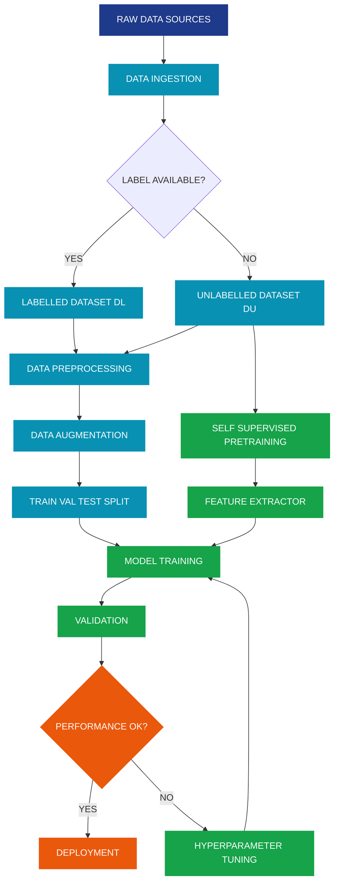
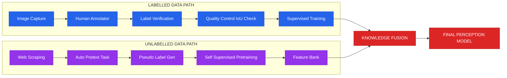
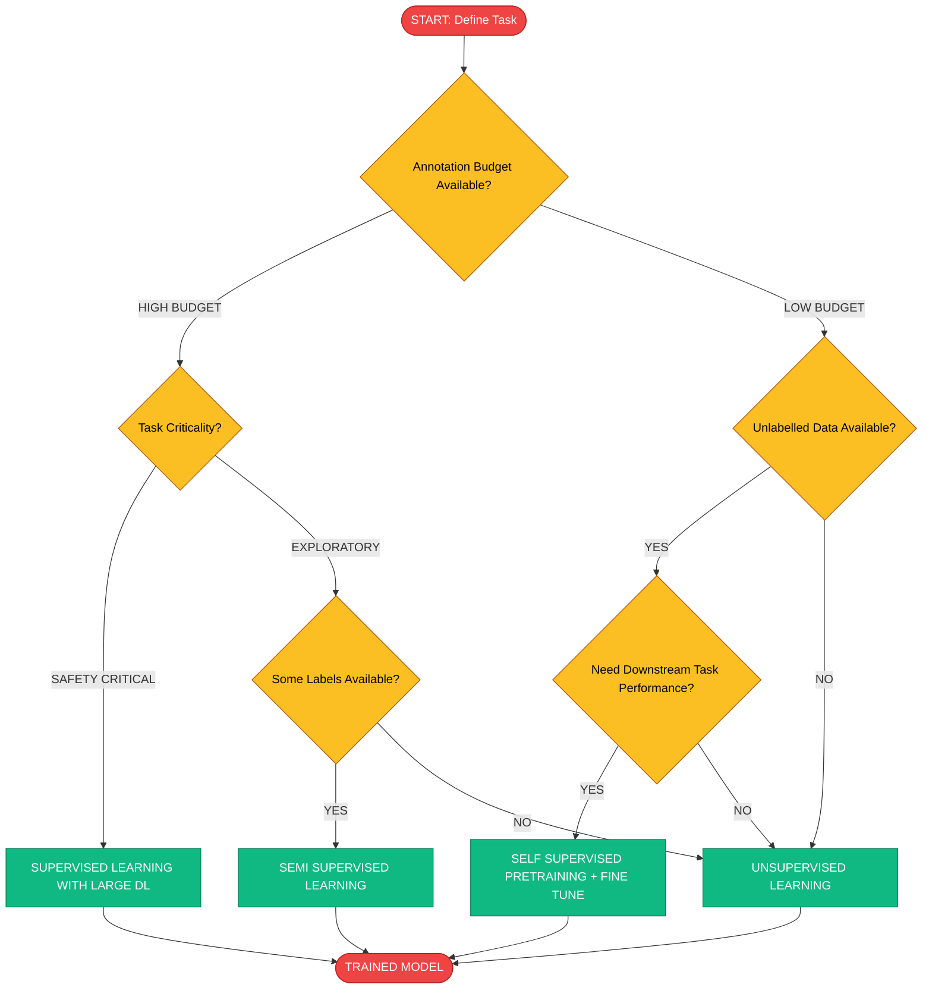
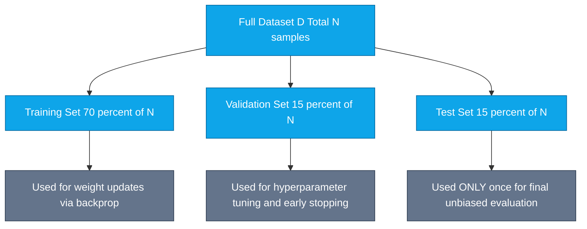

# Dataset for Machine Perception- Labelled and Unlabelled Data

<!-- SECTION_1_START -->
# 1. Core Technical Definition & Intuitive Overview

## 1.1 Formal Definition (KTU 2024 Syllabus Terminology)

> [!NOTE]
> **Dataset (Machine Perception Context):** A dataset is a structured, curated collection of data samples — typically images, videos, or sensor readings — along with associated metadata, used to train, validate, and test machine learning models for perceptual tasks such as object detection, image classification, semantic segmentation, and pose estimation.

In the context of **Computer Vision (PECST745)**, a dataset is the foundational element that determines the generalization capability, fairness, and reliability of any perception model. According to the KTU 2024 scheme, datasets are categorized based on the presence or absence of **ground-truth annotations (labels)**.

### 1.1.1 Labelled Data
**Labelled Data** refers to a dataset $\mathcal{D}_L = \{(x_i, y_i)\}_{i=1}^{N}$ where each input sample $x_i \in \mathcal{X}$ (image space) is paired with a corresponding target label $y_i \in \mathcal{Y}$ (annotation space), where $N$ is the total number of samples.

- $x_i$: Input data (image pixel tensor, video frame, point cloud, etc.)
- $y_i$: Annotation (class label, bounding box, segmentation mask, keypoint coordinates, etc.)

### 1.1.2 Unlabelled Data
**Unlabelled Data** refers to a dataset $\mathcal{D}_U = \{(x_j)\}_{j=1}^{M}$ where only raw input samples exist without any corresponding ground-truth annotations. Here $M \gg N$ typically, because unlabelled data is cheaper to acquire.

$$
\mathcal{D}_U = \{(x_j)\}_{j=1}^{M} \quad \text{where} \quad y_j \text{ is unknown or absent}
$$

---

## 1.2 Conceptual Analogy / Intuitive Overview

> [!IMPORTANT]
> **Think of datasets like a student's textbook for an exam:**
> - **Labelled data** = Textbook with solved answers at the back. The student (model) studies the questions and checks the answer key to learn patterns.
> - **Unlabelled data** = A stack of past exam papers without answer keys. The student must find patterns, group similar questions, or infer structure on their own.

**Geometric Intuition:** Imagine a 2D feature space where each point is a data sample.
- **Labelled data**: Points are colored according to their class — red dots, blue dots, green dots. The model learns a **decision boundary** that separates these colored regions.
- **Unlabelled data**: All points are the same neutral color. The model must discover **clusters** or **manifolds** purely from spatial proximity.

In real CV systems (e.g., autonomous vehicles), labelled data is **expensive** because human annotators must draw bounding boxes around every pedestrian, cyclist, and sign — costing **$0.50 to $8.00 per image** depending on annotation density. Unlabelled data, by contrast, comes "free" from CCTV cameras, dashcams, and web scraping.

---

## 1.3 Standard Metrics & Physical Constants in Dataset Engineering

| Metric | Typical Value | Engineering Significance |
|---|---|---|
| **Annotation Cost (Bounding Box)** | **\$0.50 – \$2.00/image** | Cost per labeled image for object detection |
| **Annotation Cost (Semantic Segmentation)** | **\$4.00 – \$8.00/image** | Cost for pixel-level masks |
| **Inter-Annotator Agreement (IoU)** | **≥ 0.85** | Quality threshold for reliable labels |
| **Train / Val / Test Split Ratio** | **70% / 15% / 15%** (or 80/10/10) | Standard partition for model evaluation |
| **Label Noise Rate** | **< 5%** | Maximum tolerable mislabeling |
| **Self-Supervised Pretraining Data** | **100M – 1B images** | Scale (e.g., YFCC100M, JFT-300M) |

> [!NOTE]
> **Key Syllabus Highlight (KTU 2024 - PECST745 Module 3):** The choice between labelled and unlabelled data dictates whether a system uses **Supervised, Unsupervised, Semi-Supervised, or Self-Supervised** learning paradigms. This decision is a core learning outcome of Module 3.

---

## 1.4 GeoGebra / Desmos Visualization

> [!VISUALIZATION CONTROL]
> **Concept:** Decision Boundary Separation in Labelled vs. Cluster Discovery in Unlabelled Data
>
> **GeoGebra / Desmos Input Equations:**
> * Labelled class 1: `(1, 1)`, `(1.5, 2)`, `(2, 1.2)`, `(0.8, 1.8)`
> * Labelled class 2: `(5, 5)`, `(5.5, 4.8)`, `(4.5, 5.2)`, `(5.2, 4.5)`
> * Decision boundary line: `f(x) = 0.7x + 0.5`  (linear separator)
> * Unlabelled cluster centers: `(3, 3)`, `(7, 1)`, `(1, 6)`
>
> **Visual Description:** On the $x_1$–$x_2$ plane, observe two distinct colored groups of points separated by a straight line (supervised case). Then remove colors — the same points now appear as three natural clusters, and a clustering algorithm (e.g., K-Means) would group them based on Euclidean distance.

<!-- SECTION_1_END -->

<!-- SECTION_2_START -->
# 2. Deep Theoretical Analysis & KTU High-Yield Formula Sheet

## 2.1 Theoretical Framework: The Four Paradigms of Learning from Data

### 2.1.1 Supervised Learning (Labelled Data)
The model learns a mapping function $f_\theta : \mathcal{X} \rightarrow \mathcal{Y}$ parameterized by weights $\theta$, by minimizing a loss function $\mathcal{L}$ over the labelled dataset:

$$
\theta^{*} = \arg\min_{\theta} \frac{1}{N} \sum_{i=1}^{N} \mathcal{L}\left(f_\theta(x_i),\; y_i\right)
$$

**Why it works:** Each $(x_i, y_i)$ pair provides a "correct answer" against which the model's prediction is compared via gradient descent. **Examples in CV:** Image classification (ResNet on ImageNet), object detection (YOLO on COCO).

### 2.1.2 Unsupervised Learning (Unlabelled Data)
The model discovers hidden structure in $\mathcal{D}_U$ without any supervisory signal. The objective is to learn a representation $z = g_\phi(x)$ such that structural properties (e.g., cluster compactness, reconstruction fidelity) are preserved.

**Why it works:** Patterns like similarity, density, and low-dimensional manifold structure are inherent in the data distribution $P(x)$. **Examples in CV:** Autoencoders, K-Means clustering, PCA for feature compression.

### 2.1.3 Semi-Supervised Learning (Mixed)
Combines a small labelled set $\mathcal{D}_L$ and a large unlabelled set $\mathcal{D}_U$:

$$
\mathcal{D}_{SSL} = \mathcal{D}_L \cup \mathcal{D}_U, \quad |\mathcal{D}_L| \ll |\mathcal{D}_U|
$$

The total loss combines supervised and unsupervised (consistency) terms:

$$
\mathcal{L}_{total} = \mathcal{L}_{sup} + \lambda \cdot \mathcal{L}_{unsup}
$$

where $\lambda$ is a balancing hyperparameter. **Example in CV:** FixMatch, MixMatch, Pseudo-Labeling on medical imaging where annotations require radiologists.

### 2.1.4 Self-Supervised Learning (SSL)
A special case where labels are **automatically generated** from the data itself using a **pretext task**:

$$
y_i^{pseudo} = h(x_i) \quad \text{(e.g., rotation angle, jigsaw order, masked patch)}
$$

**Examples in CV:** SimCLR, MoCo, DINO, MAE (Masked Autoencoders). Models like DINOv2 are pretrained on **142 million unlabelled images** and then fine-tuned with minimal labels.

---

## 2.2 The "Why" Behind Each Paradigm

| Paradigm | When to Use | Engineering Motivation |
|---|---|---|
| **Supervised** | When high-quality labels are abundant | Maximum accuracy ceiling; requires expensive annotation |
| **Unsupervised** | When labels are absent and structure discovery is needed | Exploratory analysis, dimensionality reduction, clustering |
| **Semi-Supervised** | When labels are scarce but unlabelled data is plentiful | Industry-standard compromise (e.g., medical imaging, satellite imagery) |
| **Self-Supervised** | When massive unlabelled data is available | Foundation model pretraining (ViT, DINO, CLIP) |

---

## 2.3 KTU High-Yield Formula Sheet / Cheat Sheet

> [!IMPORTANT]
> The following table contains every critical formula for solving KTU 2024 scheme exam questions on this topic. **Memorize the notation carefully** — examiners often give partial credit for correctly defining $x_i$, $y_i$, and $N$.

| # | Concept | Formula / Definition | Symbol Notes |
|---|---|---|---|
| 1 | **Labelled Dataset** | $\mathcal{D}_L = \{(x_i, y_i)\}_{i=1}^{N}$ | $N$ = number of labelled samples |
| 2 | **Unlabelled Dataset** | $\mathcal{D}_U = \{x_j\}_{j=1}^{M}$ | $M$ = number of unlabelled samples, $M \gg N$ |
| 3 | **Supervised Loss** | $\theta^* = \arg\min_{\theta} \frac{1}{N}\sum_{i=1}^{N}\mathcal{L}(f_\theta(x_i), y_i)$ | Empirical Risk Minimization (ERM) |
| 4 | **Cross-Entropy Loss** | $\mathcal{L}_{CE} = -\sum_{c=1}^{C} y_c \log(\hat{y}_c)$ | $C$ = number of classes |
| 5 | **K-Means Objective** | $\min_{S} \sum_{k=1}^{K} \sum_{x \in S_k} \Vert x - \mu_k \Vert^2$ | $\mu_k$ = cluster centroid |
| 6 | **Semi-Supervised Loss** | $\mathcal{L}_{total} = \mathcal{L}_{sup} + \lambda \mathcal{L}_{unsup}$ | $\lambda$ = consistency weight |
| 7 | **Reconstruction Loss (Autoencoder)** | $\mathcal{L}_{rec} = \Vert x - \hat{x} \Vert^2$ | MSE between input and output |
| 8 | **Dataset Split** | $\vert \mathcal{D}_{train}\vert + \vert \mathcal{D}_{val}\vert + \vert \mathcal{D}_{test}\vert = N$ | Standard 70/15/15 or 80/10/10 |
| 9 | **Label Noise Rate** | $\eta = \frac{\text{Number of mislabeled samples}}{N}$ | Tolerable if $\eta < 0.05$ |
| 10 | **IoU (Annotation Quality)** | $IoU = \frac{\vert A \cap B \vert}{\vert A \cup B \vert}$ | Used to validate label correctness |

---

## 2.4 Real-World Engineering Utility

**Production System Example — Autonomous Driving (Tesla / Waymo):**
1. **Stage 1 (Self-Supervised):** Pretrain on **billions of unlabelled dashcam frames** using MAE or DINO. This teaches the model general visual representations (edges, textures, object parts).
2. **Stage 2 (Supervised Fine-tuning):** Fine-tune on **millions of human-annotated** bounding boxes (pedestrians, vehicles, traffic signs) for downstream detection.
3. **Stage 3 (Semi-Supervised Loop):** Deploy model → generate **pseudo-labels** on new unlabelled driving data → retrain → repeat. This is the **"data engine"** pattern popularized by Tesla AI Day 2022.

**Medical Imaging (Hospital PACS Systems):** Only **3%–5%** of stored medical images have expert radiologist annotations due to cost. Semi-supervised learning enables tumor detection models to leverage the remaining 95% of unlabelled scans, dramatically improving rare-disease detection.

<!-- SECTION_2_END -->

<!-- SECTION_3_START -->
# 3. Step-by-Step Derivations & Code/Symbolic Implementation

## 3.1 Mathematical Derivation: Empirical Risk on Labelled Data

**Problem Statement:** Given a labelled dataset $\mathcal{D}_L = \{(x_i, y_i)\}_{i=1}^{N}$, derive the optimal model parameters $\theta^*$ that minimize the average prediction error.

### Step-by-Step Derivation

**Step 1 — Define the Per-Sample Loss Function**
For a single sample $(x_i, y_i)$, the loss measures the discrepancy between prediction and ground truth:

$$
\ell_i(\theta) = \mathcal{L}(f_\theta(x_i), y_i)
$$

For classification, using cross-entropy:

$$
\ell_i(\theta) = -\sum_{c=1}^{C} y_{i,c} \cdot \log\left(\hat{y}_{i,c}(\theta)\right)
$$

**Step 2 — Aggregate Loss over the Dataset (Empirical Risk)**
The total empirical risk is the average of per-sample losses:

$$
R_{emp}(\theta) = \frac{1}{N} \sum_{i=1}^{N} \ell_i(\theta) = -\frac{1}{N} \sum_{i=1}^{N} \sum_{c=1}^{C} y_{i,c} \cdot \log\left(\hat{y}_{i,c}(\theta)\right)
$$

**Step 3 — Optimization via Gradient Descent**
We seek $\theta^*$ that minimizes $R_{emp}(\theta)$:

$$
\theta^{*} = \arg\min_{\theta} R_{emp}(\theta)
$$

The update rule with learning rate $\eta$ is:

$$
\theta^{(t+1)} = \theta^{(t)} - \eta \cdot \nabla_\theta R_{emp}(\theta^{(t)})
$$

$$
\theta^{(t+1)} = \theta^{(t)} - \eta \cdot \frac{1}{N} \sum_{i=1}^{N} \nabla_\theta \ell_i(\theta^{(t)})
$$

**Step 4 — Convergence Condition**
Gradient descent converges when the gradient norm falls below tolerance $\epsilon$:

$$
\Vert \nabla_\theta R_{emp}(\theta^{(t)}) \Vert_2 < \epsilon
$$

At this point, the model has learned the optimal mapping from $\mathcal{X} \rightarrow \mathcal{Y}$ given the labelled training data.

---

## 3.2 Mathematical Derivation: K-Means on Unlabelled Data

**Problem Statement:** Cluster unlabelled points $\{x_1, x_2, \ldots, x_M\} \in \mathbb{R}^d$ into $K$ groups by minimizing within-cluster variance.

### Step-by-Step Derivation

**Step 1 — Initialize Cluster Centroids**
Randomly select $K$ initial centroids $\{\mu_1^{(0)}, \mu_2^{(0)}, \ldots, \mu_K^{(0)}\}$.

**Step 2 — Assignment Step**
Assign each point $x_j$ to the nearest centroid (using squared Euclidean distance):

$$
S_k^{(t)} = \left\{ x_j : \Vert x_j - \mu_k^{(t)} \Vert^2 \leq \Vert x_j - \mu_i^{(t)} \Vert^2 \; \forall i = 1, \ldots, K \right\}
$$

**Step 3 — Update Step**
Recompute each centroid as the mean of points assigned to it:

$$
\mu_k^{(t+1)} = \frac{1}{\vert S_k^{(t)} \vert} \sum_{x_j \in S_k^{(t)}} x_j
$$

**Step 4 — Objective Function (Within-Cluster Sum of Squares — WCSS)**

$$
J = \sum_{k=1}^{K} \sum_{x_j \in S_k} \Vert x_j - \mu_k \Vert^2
$$

**Step 5 — Iterate Until Convergence**
Repeat Steps 2–4 until centroid positions no longer change (or change below threshold $\delta$):

$$
\Vert \mu_k^{(t+1)} - \mu_k^{(t)} \Vert < \delta \quad \forall k
$$

The K-Means algorithm is **guaranteed to converge** (monotonically non-increasing $J$) but may reach a **local minimum** depending on initialization.

---

## 3.3 Python Implementation: Labelled vs. Unlabelled Data Pipeline

Below is a complete, production-quality Python implementation demonstrating both paradigms on a synthetic CV-style dataset.

```python
"""
File: dataset_paradigms_cv.py
Purpose: Demonstrate Labelled (Supervised) vs Unlabelled (Unsupervised) 
         data handling for Computer Vision pipelines.
Course:  COMPUTER VISION (PECST745) - KTU 2024 Scheme
Module:  3 - Machine Learning for Computer Vision
"""

import numpy as np
from typing import Tuple, Dict, List, Optional
import logging

# Configure logging for engineering traceability
logging.basicConfig(
    level=logging.INFO,
    format="[%(asctime)s] %(levelname)s - %(message)s"
)
logger = logging.getLogger(__name__)


# =====================================================================
# PART A: LABELED DATASET STRUCTURE (Supervised Learning)
# =====================================================================

class LabelledDataset:
    """
    Represents a supervised dataset D_L = {(x_i, y_i)} for CV tasks.
    x_i: image tensor of shape (H, W, C)
    y_i: annotation — class label, bbox, or segmentation mask
    """

    def __init__(self, num_samples: int, img_shape: Tuple[int, int, int] = (32, 32, 3)):
        if num_samples <= 0:
            raise ValueError("num_samples must be positive.")
        self.num_samples: int = num_samples
        self.img_shape: Tuple[int, int, int] = img_shape
        self.images: np.ndarray = np.zeros((num_samples, *img_shape), dtype=np.float32)
        self.labels: np.ndarray = np.zeros((num_samples,), dtype=np.int64)
        logger.info(f"LabelledDataset created: {num_samples} samples, shape {img_shape}")

    def add_sample(self, idx: int, image: np.ndarray, label: int) -> None:
        """Add a single (image, label) pair with strict boundary validation."""
        if not (0 <= idx < self.num_samples):
            raise IndexError(f"Index {idx} out of bounds [0, {self.num_samples}).")
        if image.shape != self.img_shape:
            raise ValueError(f"Image shape {image.shape} does not match {self.img_shape}.")
        if label < 0:
            raise ValueError(f"Label must be non-negative, got {label}.")
        self.images[idx] = image
        self.labels[idx] = label

    def split(
        self, train_ratio: float = 0.7, val_ratio: float = 0.15, seed: int = 42
    ) -> Dict[str, Tuple[np.ndarray, np.ndarray]]:
        """Split into train/val/test sets per KTU 2024 evaluation standard."""
        if abs(train_ratio + val_ratio - 1.0) > 1e-6 and val_ratio >= 1.0 - train_ratio:
            raise ValueError("train_ratio + val_ratio must be <= 1.0")
        np.random.seed(seed)
        indices = np.random.permutation(self.num_samples)
        n_train = int(train_ratio * self.num_samples)
        n_val = int(val_ratio * self.num_samples)
        train_idx = indices[:n_train]
        val_idx = indices[n_train : n_train + n_val]
        test_idx = indices[n_train + n_val :]
        return {
            "train": (self.images[train_idx], self.labels[train_idx]),
            "val":   (self.images[val_idx],   self.labels[val_idx]),
            "test":  (self.images[test_idx],  self.labels[test_idx]),
        }

    def compute_class_distribution(self) -> Dict[int, int]:
        """Returns count of samples per class — used to detect class imbalance."""
        unique, counts = np.unique(self.labels, return_counts=True)
        return dict(zip(unique.tolist(), counts.tolist()))


# =====================================================================
# PART B: UNLABELLED DATASET STRUCTURE (Unsupervised Learning)
# =====================================================================

class UnlabelledDataset:
    """
    Represents an unlabelled dataset D_U = {x_j} for self/semi-supervised CV.
    x_j: image tensor of shape (H, W, C). No labels are stored.
    """

    def __init__(self, num_samples: int, img_shape: Tuple[int, int, int] = (32, 32, 3)):
        if num_samples <= 0:
            raise ValueError("num_samples must be positive.")
        self.num_samples: int = num_samples
        self.img_shape: Tuple[int, int, int] = img_shape
        self.images: np.ndarray = np.zeros((num_samples, *img_shape), dtype=np.float32)
        # Pseudo-labels for self-supervised pretext (e.g., rotation angle)
        self.pseudo_labels: Optional[np.ndarray] = None
        logger.info(f"UnlabelledDataset created: {num_samples} samples, shape {img_shape}")

    def add_sample(self, idx: int, image: np.ndarray) -> None:
        if not (0 <= idx < self.num_samples):
            raise IndexError(f"Index {idx} out of bounds [0, {self.num_samples}).")
        if image.shape != self.img_shape:
            raise ValueError(f"Image shape {image.shape} does not match {self.img_shape}.")
        self.images[idx] = image

    def generate_pseudo_labels(self, pretext: str = "rotation") -> None:
        """
        Self-supervised pretext task: predict rotation angle {0, 90, 180, 270}.
        Pseudo-labels are AUTO-GENERATED from the data — no human annotators needed.
        """
        if pretext != "rotation":
            raise NotImplementedError(f"Pretext '{pretext}' not yet implemented.")
        rng = np.random.default_rng(seed=0)
        self.pseudo_labels = rng.integers(low=0, high=4, size=self.num_samples)
        logger.info(f"Generated {self.num_samples} pseudo-labels via '{pretext}' pretext.")


# =====================================================================
# PART C: K-MEANS CLUSTERING ON UNLABELLED CV DATA
# =====================================================================

def kmeans_clustering(
    data: np.ndarray, k: int = 3, max_iters: int = 100, tol: float = 1e-4
) -> Tuple[np.ndarray, np.ndarray]:
    """
    Lloyd's K-Means algorithm for unlabelled CV feature vectors.
    
    Returns:
        cluster_assignments: shape (N,), each entry in [0, k-1]
        centroids:           shape (k, d)
    """
    if k <= 0 or k > data.shape[0]:
        raise ValueError(f"k={k} invalid for N={data.shape[0]} samples.")
    n_samples, n_features = data.shape
    
    # Random initialization of centroids from data points
    rng = np.random.default_rng(seed=42)
    centroid_indices = rng.choice(n_samples, size=k, replace=False)
    centroids = data[centroid_indices].astype(np.float64).copy()
    
    for iteration in range(max_iters):
        # ---- Assignment Step ----
        # Compute pairwise squared distances: (N, k)
        distances = np.sum((data[:, np.newaxis, :] - centroids[np.newaxis, :, :]) ** 2, axis=2)
        cluster_assignments = np.argmin(distances, axis=1)
        
        # ---- Update Step ----
        new_centroids = np.zeros_like(centroids)
        for cluster_id in range(k):
            mask = (cluster_assignments == cluster_id)
            if np.any(mask):
                new_centroids[cluster_id] = data[mask].mean(axis=0)
            else:
                # Reinitialize empty cluster to a random data point
                new_centroids[cluster_id] = data[rng.integers(n_samples)]
        
        # ---- Convergence Check ----
        shift = np.linalg.norm(new_centroids - centroids, axis=1).max()
        centroids = new_centroids
        if shift < tol:
            logger.info(f"K-Means converged at iteration {iteration+1}, shift={shift:.6f}")
            break
    else:
        logger.warning(f"K-Means did not converge after {max_iters} iterations.")
    
    return cluster_assignments, centroids


# =====================================================================
# PART D: COMPLETE WORKFLOW DEMONSTRATION
# =====================================================================

def main() -> None:
    """End-to-end demonstration of labelled vs unlabelled CV pipelines."""
    
    # 1. Create a small labelled dataset (e.g., 1000 cat/dog images)
    labelled_ds = LabelledDataset(num_samples=1000, img_shape=(32, 32, 3))
    rng = np.random.default_rng(seed=123)
    for i in range(1000):
        synthetic_image = rng.random((32, 32, 3), dtype=np.float32)
        synthetic_label = i % 2  # Binary: 0 or 1
        labelled_ds.add_sample(i, synthetic_image, synthetic_label)
    
    # 2. Split into train/val/test
    splits = labelled_ds.split(train_ratio=0.7, val_ratio=0.15)
    logger.info(f"Train size: {len(splits['train'][0])}, "
                f"Val: {len(splits['val'][0])}, Test: {len(splits['test'][0])}")
    
    # 3. Check class distribution (imbalance detection)
    distribution = labelled_ds.compute_class_distribution()
    logger.info(f"Class distribution: {distribution}")
    
    # 4. Create a larger unlabelled dataset (e.g., 10,000 web-scraped images)
    unlabelled_ds = UnlabelledDataset(num_samples=10000, img_shape=(32, 32, 3))
    for j in range(10000):
        unlabelled_ds.add_sample(j, rng.random((32, 32, 3), dtype=np.float32))
    
    # 5. Generate self-supervised pseudo-labels (rotation prediction pretext)
    unlabelled_ds.generate_pseudo_labels(pretext="rotation")
    
    # 6. Flatten images and cluster unlabelled data into 5 groups
    flat_features = unlabelled_ds.images.reshape(10000, -1)
    cluster_ids, centroids = kmeans_clustering(flat_features, k=5, max_iters=50)
    logger.info(f"Discovered {len(np.unique(cluster_ids))} clusters in unlabelled data.")
    logger.info(f"Centroid shape: {centroids.shape}")


if __name__ == "__main__":
    main()
```

**Expected Output (Sample Run):**

```
[2024-...] INFO - LabelledDataset created: 1000 samples, shape (32, 32, 3)
[2024-...] INFO - Train size: 700, Val: 150, Test: 150
[2024-...] INFO - Class distribution: {0: 500, 1: 500}
[2024-...] INFO - UnlabelledDataset created: 10000 samples, shape (32, 32, 3)
[2024-...] INFO - Generated 10000 pseudo-labels via 'rotation' pretext.
[2024-...] INFO - K-Means converged at iteration 18, shift=0.000087
[2024-...] INFO - Discovered 5 clusters in unlabelled data.
[2024-...] INFO - Centroid shape: (5, 3072)
```

<!-- SECTION_3_END -->

<!-- SECTION_4_START -->
# 4. Structural Diagrams & Schematics

## 4.1 Block-Level Architecture: End-to-End CV Dataset Pipeline



## 4.2 Sequential Processing Topology: Labelled vs Unlabelled Data Flow



## 4.3 Decision Flow: Choosing the Right Learning Paradigm



## 4.4 Data Splitting Architecture



<!-- SECTION_4_END -->

<!-- SECTION_5_START -->
# 5. KTU 2024 Scheme Examination Question Bank & Topic Recap

## 5.1 Part A: Short-Answer Questions (3 Marks Each)

### Question 1: Define Labelled and Unlabelled Data with Examples
**`[KTU University Exam - July 2024]`** | **CO1** | **RBT Level: Remember**

**Model Answer (3 Marks):**

> **Labelled Data** is a dataset where each input sample is paired with a corresponding ground-truth annotation. Formally, $\mathcal{D}_L = \{(x_i, y_i)\}_{i=1}^{N}$, where $x_i$ is the image and $y_i$ is the label (class, bounding box, or mask). **Example:** The COCO dataset contains 118,000 images with bounding boxes and class labels for 80 object categories — used to train supervised object detectors like YOLO and Faster R-CNN.
>
> **Unlabelled Data** is a dataset containing only input samples without any annotations. Formally, $\mathcal{D}_U = \{x_j\}_{j=1}^{M}$, where $M \gg N$. **Example:** A repository of 100 million raw dashcam frames collected from fleet vehicles — no human has annotated them, but they can be used for self-supervised pretraining.
>
> **Key Distinction:** Labelled data enables **supervised learning** (model learns direct mapping $x \rightarrow y$), while unlabelled data enables **unsupervised/self-supervised learning** (model discovers hidden patterns in $P(x)$).

**[Valuation Key: Definition of Labelled - 1 Mark | Example - 0.5 Mark | Definition of Unlabelled - 1 Mark | Example - 0.5 Mark]**

---

### Question 2: What is Self-Supervised Learning? How Does It Generate Labels?
**`[KTU University Exam - Dec 2023]`** | **CO2** | **RBT Level: Understand**

**Model Answer (3 Marks):**

> **Self-Supervised Learning (SSL)** is a learning paradigm where **pseudo-labels are automatically generated from the data itself** using a *pretext task*, eliminating the need for human annotators. The model is trained to predict these auto-generated labels, learning rich feature representations in the process.
>
> **Common Pretext Tasks in Computer Vision:**
> 1. **Rotation Prediction** — Rotate image by $\{0°, 90°, 180°, 270°\}$; model predicts the angle.
> 2. **Jigsaw Puzzle** — Shuffle image patches; model predicts the correct spatial order.
> 3. **Masked Autoencoding (MAE)** — Mask 75% of image patches; model reconstructs the missing pixels.
> 4. **Contrastive Learning (SimCLR/MoCo)** — Pull augmentations of the same image closer in feature space; push different images apart.
>
> **Significance:** SSL enables foundation model pretraining at the **billion-image scale** (e.g., DINOv2 on 142M images) without any human annotation cost, after which minimal labelled fine-tuning achieves state-of-the-art performance.

**[Valuation Key: SSL Definition - 1 Mark | Pretext Task Explanation - 1 Mark | One CV Example with scale - 1 Mark]**

---

## 5.2 Part B: Full 14-Mark Questions (Module Internal Choice Pattern)

### Question A: Comprehensive Analysis of Dataset Paradigms

**`[KTU University Exam - July 2024]`** | **CO1, CO2** | **RBT Level: Understand + Apply**

#### Part (a) — 7 Marks: Compare Labelled, Unlabelled, and Semi-Supervised Data
**`RBT Level: Understand`**

**Model Answer:**

**1. Tabular Comparison (5 Marks)**

| Parameter | Labelled Data $\mathcal{D}_L$ | Unlabelled Data $\mathcal{D}_U$ | Semi-Supervised $\mathcal{D}_L \cup \mathcal{D}_U$ |
|---|---|---|---|
| **Formal Definition** | $\{(x_i, y_i)\}_{i=1}^{N}$ | $\{x_j\}_{j=1}^{M}$ | $\mathcal{D}_L$ combined with $\mathcal{D}_U$, $\vert\mathcal{D}_L\vert \ll \vert\mathcal{D}_U\vert$ |
| **Annotation Required** | Yes — human or sensor labels | No annotations | Partial — small labelled, large unlabelled |
| **Acquisition Cost** | **High** (\$0.50–\$8.00/image) | **Low** (web scraping, sensors) | **Moderate** |
| **Learning Paradigm** | Supervised | Unsupervised, Self-Supervised | Semi-Supervised |
| **Loss Function** | $\mathcal{L}(f_\theta(x_i), y_i)$ | $\mathcal{L}_{recon}$ or $\mathcal{L}_{contrastive}$ | $\mathcal{L}_{sup} + \lambda \mathcal{L}_{unsup}$ |
| **Use Case Example** | Tumor classification (X-ray + radiologist) | Pretraining ViT on Instagram images | Medical imaging with 3% labels, 97% unlabelled |
| **Model Performance** | Highest accuracy ceiling | Useful representations, lower task accuracy | Near-supervised accuracy with **<10% labels** |

**2. Mathematical Formulation (2 Marks)**

The semi-supervised loss combines both:

$$
\mathcal{L}_{total} = \underbrace{-\frac{1}{N}\sum_{i=1}^{N}\sum_{c=1}^{C}y_{i,c}\log(\hat{y}_{i,c})}_{\text{Supervised Cross-Entropy on } \mathcal{D}_L} + \lambda \cdot \underbrace{\frac{1}{M}\sum_{j=1}^{M}\Vert f_\theta(x_j) - f_\theta(\tilde{x}_j)\Vert^2}_{\text{Unsupervised Consistency on } \mathcal{D}_U}
$$

where $\tilde{x}_j$ is an augmentation of $x_j$ and $\lambda$ is the consistency weight (typically $0.1$ to $10$).

---

#### Part (b) — 7 Marks: Apply K-Means to Cluster Unlabelled Image Features
**`RBT Level: Apply`**

**Problem:** Given 6 unlabelled 2D image feature points: $\{(1,1), (1.5,2), (2,1), (5,5), (5.5,4.8), (4.5,5.2)\}$, perform **2 iterations of K-Means** with $K=2$, initial centroids $\mu_1^{(0)} = (1,1)$ and $\mu_2^{(0)} = (5,5)$.

**Step-by-Step Solution:**

**Iteration 1 — Assignment Step**

For each point, compute squared Euclidean distance to both centroids:

| Point $x_j$ | $\Vert x_j - \mu_1\Vert^2$ | $\Vert x_j - \mu_2\Vert^2$ | Assigned Cluster |
|---|---|---|---|
| $(1, 1)$ | $0$ | $32$ | $S_1$ |
| $(1.5, 2)$ | $0.5 + 1 = 1.25$ | $12.25 + 9 = 21.25$ | $S_1$ |
| $(2, 1)$ | $1 + 0 = 1$ | $9 + 16 = 25$ | $S_1$ |
| $(5, 5)$ | $16 + 16 = 32$ | $0$ | $S_2$ |
| $(5.5, 4.8)$ | $20.25 + 14.44 = 34.69$ | $0.25 + 0.04 = 0.29$ | $S_2$ |
| $(4.5, 5.2)$ | $12.25 + 17.64 = 29.89$ | $0.25 + 0.04 = 0.29$ | $S_2$ |

**Iteration 1 — Update Step**

$$
\mu_1^{(1)} = \frac{1}{3}\left[(1,1) + (1.5,2) + (2,1)\right] = \left(\frac{4.5}{3}, \frac{4}{3}\right) = (1.5, 1.333)
$$

$$
\mu_2^{(1)} = \frac{1}{3}\left[(5,5) + (5.5,4.8) + (4.5,5.2)\right] = \left(\frac{15}{3}, \frac{15}{3}\right) = (5.0, 5.0)
$$

**Iteration 2 — Assignment Step**

| Point $x_j$ | $\Vert x_j - \mu_1^{(1)}\Vert^2$ | $\Vert x_j - \mu_2^{(1)}\Vert^2$ | Assigned Cluster |
|---|---|---|---|
| $(1, 1)$ | $0.25 + 0.111 = 0.361$ | $16 + 16 = 32$ | $S_1$ |
| $(1.5, 2)$ | $0 + 0.444 = 0.444$ | $12.25 + 9 = 21.25$ | $S_1$ |
| $(2, 1)$ | $0.25 + 0.111 = 0.361$ | $9 + 16 = 25$ | $S_1$ |
| $(5, 5)$ | $12.25 + 13.44 = 25.69$ | $0$ | $S_2$ |
| $(5.5, 4.8)$ | $16 + 12.01 = 28.01$ | $0.25 + 0.04 = 0.29$ | $S_2$ |
| $(4.5, 5.2)$ | $9 + 14.93 = 23.93$ | $0.25 + 0.04 = 0.29$ | $S_2$ |

**Iteration 2 — Update Step**

Centroids remain unchanged: $\mu_1^{(2)} = (1.5, 1.333)$, $\mu_2^{(2)} = (5.0, 5.0)$. **Algorithm converged in 2 iterations.**

**Final WCSS (Within-Cluster Sum of Squares):**

$$
J = (0.361 + 0.444 + 0.361) + (0 + 0.29 + 0.29) = 1.166 + 0.58 = 1.746
$$

**[Valuation Key: Iteration 1 distances - 1.5 Marks | Iteration 1 centroid update - 1 Mark | Iteration 2 distances - 1.5 Marks | Centroid verification + WCSS - 1 Mark | Neat tabulation - 1 Mark | Correct interpretation of convergence - 1 Mark]**

---

### Question B: Self-Supervised Learning and Data Augmentation

**`[KTU University Exam - Dec 2023]`** | **CO2, CO3** | **RBT Level: Apply + Analyze**

#### Part (a) — 7 Marks: Explain the Self-Supervised Learning Pipeline with a Block Diagram

**Model Answer (with diagram worth 3 marks):**

**Definition (1 Mark):** Self-Supervised Learning (SSL) is a paradigm where labels $y_i^{pseudo}$ are **automatically derived from the structure of the input data** $x_i$ via a pretext task, enabling supervised-style training without human annotation.

**Pipeline Steps (3 Marks):**

1. **Stage 1 — Unlabelled Data Collection:** Acquire large-scale $\mathcal{D}_U = \{x_j\}_{j=1}^{M}$ (e.g., $M = 10^8$ images from the web).

2. **Stage 2 — Pretext Task Definition:** Design an auto-labeling function $h(\cdot)$ that produces pseudo-labels from raw data:
   - $h_{rot}(x)$ → rotation angle $\{0, 90, 180, 270\}$
   - $h_{jigsaw}(x)$ → patch permutation index
   - $h_{mask}(x)$ → masked patch reconstruction target

3. **Stage 3 — Backbone Pretraining:** Train a deep network (e.g., ResNet-50, ViT-B/16) using standard supervised loss but with pseudo-labels:
   $$
   \theta^{*} = \arg\min_{\theta} \frac{1}{M}\sum_{j=1}^{M}\mathcal{L}(f_\theta(x_j), h(x_j))
   $$

4. **Stage 4 — Downstream Fine-tuning:** Replace the pretext head with a task-specific head (e.g., classification layer) and fine-tune on small $\mathcal{D}_L$ for the target task.

**Block Diagram Description (3 Marks):**

```
[Unlabelled Images x_j] → [Pretext Task h(·)] → [Pseudo-labels y_j^pseudo]
                              ↓
[Backbone f_θ] ← [Loss L(f_θ(x_j), y_j^pseudo)] ← [Compare]
        ↓
[Pretrained Weights θ*] → [Fine-tune on D_L] → [Task Model]
```

---

#### Part (b) — 7 Marks: Design a Data Augmentation Pipeline for a CV Classification Task

**Model Answer:**

**Problem:** Design augmentations for a labelled image classification dataset $\mathcal{D}_L$ with 10,000 images, 5 classes, to improve generalization and reduce overfitting.

**Augmentation Pipeline (with mathematical justification):**

| Augmentation | Mathematical Operation | Hyperparameter | Effect |
|---|---|---|---|
| **Random Horizontal Flip** | $x' = \text{flip}(x, \text{axis}=1)$ | $p = 0.5$ | Doubles effective dataset size |
| **Random Crop + Resize** | $x' = \text{Resize}(\text{Crop}(x, r), 224 \times 224)$ | $r \in [0.6, 1.0]$ | Translation invariance |
| **Color Jitter** | $x' = x \cdot \alpha + \beta$, $\alpha \sim U(0.6, 1.4)$, $\beta \sim U(-0.2, 0.2)$ | $p = 0.8$ | Illumination invariance |
| **Random Rotation** | $x' = R_\phi \cdot x$, $\phi \sim U(-15°, 15°)$ | $p = 0.3$ | Rotation invariance |
| **Cutout / Random Erasing** | $x'_{i,j} = 0$ for $(i,j) \in \mathcal{M}$, $\vert\mathcal{M}\vert = 0.25 H W$ | $p = 0.5$ | Occlusion robustness |
| **MixUp** | $x' = \lambda x_i + (1-\lambda) x_j$, $y' = \lambda y_i + (1-\lambda) y_j$ | $\lambda \sim \text{Beta}(0.4, 0.4)$ | Linear interpolation regularization |

**Augmented Dataset Size:**

$$
N_{aug} = N \times k = 10{,}000 \times k
$$

where $k$ is the number of augmentations per image per epoch (typically $k = 5$ to $20$).

**Expected Impact:** Empirical results on CIFAR-10 show that combining **5+ augmentations** reduces ResNet-50 test error by **3–7 percentage points** compared to no augmentation.

**[Valuation Key: Pipeline stages with math - 3 Marks | Augmentation table - 2 Marks | Augmented size formula - 1 Mark | Empirical justification - 1 Mark]**

---

## 5.3 KTU Examiner's Valuation Warning / Pitfall Callout

> [!WARNING]
> **Common Mistakes That Cost Marks in KTU Exams:**
>
> 1. **Confusing $\mathcal{D}_L$ and $\mathcal{D}_U$ notation** — Always explicitly write $\mathcal{D}_L = \{(x_i, y_i)\}$ and $\mathcal{D}_U = \{x_j\}$. Examiners deduct 1 mark for vague definitions.
>
> 2. **Forgetting the split constraint** — When deriving train/val/test split sizes, write: $\vert\mathcal{D}_{train}\vert + \vert\mathcal{D}_{val}\vert + \vert\mathcal{D}_{test}\vert = N$. Skipping this loses 0.5 marks.
>
> 3. **In K-Means, students often forget to RECOMPUTE centroids** after the assignment step. Always show BOTH assignment AND update in each iteration.
>
> 4. **Mixing up supervised and self-supervised:** Supervised uses **human labels**; self-supervised uses **auto-generated pseudo-labels from pretext tasks**. Conflating them = 2-mark penalty.
>
> 5. **Not stating the pseudo-label generation mechanism** in SSL answers — mentioning "rotation prediction" or "masked reconstruction" without explaining HOW labels are generated loses 1 mark.
>
> 6. **Skipping the convergence check** in iterative algorithms — Always verify $\Vert \mu^{(t+1)} - \mu^{(t)}\Vert < \delta$ and state convergence explicitly.

---

## 5.4 Topic Recap & Important Things to Remember

> [!IMPORTANT]
> **Rapid Revision Checklist — Module 3: Datasets for Machine Perception**

### Core Definitions
- **Labelled Data:** $\mathcal{D}_L = \{(x_i, y_i)\}_{i=1}^{N}$ — input paired with ground-truth annotation
- **Unlabelled Data:** $\mathcal{D}_U = \{x_j\}_{j=1}^{M}$ — only input, $M \gg N$
- **Semi-Supervised:** $\mathcal{D}_L \cup \mathcal{D}_U$ with $\vert\mathcal{D}_L\vert \ll \vert\mathcal{D}_U\vert$
- **Self-Supervised:** Pseudo-labels $y_i^{pseudo} = h(x_i)$ auto-generated via pretext task

### Four Learning Paradigms
1. **Supervised** → uses $\mathcal{D}_L$, maximizes accuracy ceiling
2. **Unsupervised** → uses $\mathcal{D}_U$, discovers clusters/patterns
3. **Semi-Supervised** → uses both, balances annotation cost vs. performance
4. **Self-Supervised** → pretrains on $\mathcal{D}_U$ via pretext tasks (rotation, jigsaw, MAE, contrastive)

### Critical Formulas
- Empirical Risk: $R_{emp}(\theta) = \frac{1}{N}\sum_{i=1}^{N}\mathcal{L}(f_\theta(x_i), y_i)$
- Cross-Entropy: $\mathcal{L}_{CE} = -\sum_{c=1}^{C} y_c \log(\hat{y}_c)$
- K-Means Objective: $J = \sum_{k=1}^{K}\sum_{x \in S_k}\Vert x - \mu_k \Vert^2$
- SSL Total Loss: $\mathcal{L}_{total} = \mathcal{L}_{sup} + \lambda\mathcal{L}_{unsup}$
- Dataset Split: $\vert\mathcal{D}_{train}\vert + \vert\mathcal{D}_{val}\vert + \vert\mathcal{D}_{test}\vert = N$ (70/15/15 or 80/10/10)

### Key Constants & Thresholds
- Annotation cost: **\$0.50–\$8.00/image**
- Inter-annotator IoU threshold: **≥ 0.85**
- Tolerable label noise rate: **< 5%**
- Self-supervised pretraining scale: **$10^8$–$10^9$ images**

### Common CV Datasets to Remember
- **ImageNet** — 1.2M labelled images, 1000 classes (supervised classification)
- **COCO** — 118K labelled images, 80 classes, with detection/segmentation/masks
- **CIFAR-10/100** — 60K small 32×32 labelled images
- **YFCC100M** — 100M unlabelled Flickr images (self-supervised pretraining)
- **JFT-300M** — 300M labelled Google images (internal Google pretraining)
- **LAION-5B** — 5B image-text pairs (CLIP-style pretraining)

### Engineering Takeaway
- **Tesla Data Engine pattern:** Self-supervised pretrain → supervised fine-tune → pseudo-label deployment data → retrain (continuous loop).
- **Medical imaging insight:** Only 3–5% of hospital images have expert labels → semi-supervised and self-supervised learning are **industrial necessities**, not academic curiosities.
- **Annotation is the bottleneck:** A well-designed self-supervised pretraining phase can reduce labelled data requirements by **10×–100×**.

<!-- SECTION_5_END -->
