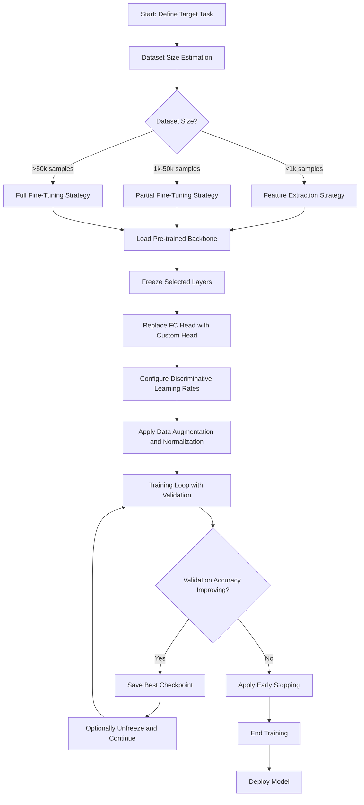
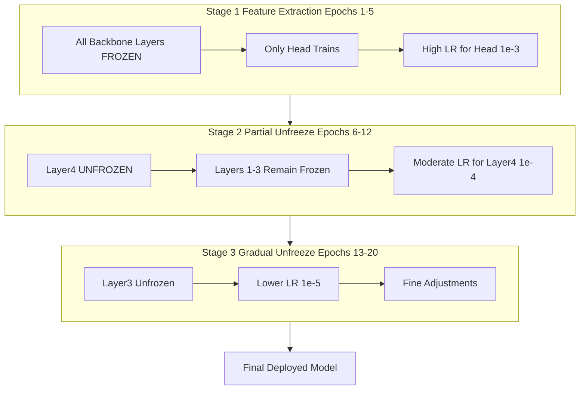

# Fine-Tuning

<!-- SECTION_1_START -->

# Fine-Tuning in Deep Learning for Computer Vision

## 1. Core Technical Definition

> [!IMPORTANT]
> **Fine-Tuning** is a transfer learning paradigm in which the parameters of a neural network, already optimized on a large source dataset, are *continued to be trained* on a smaller, target-domain dataset. The pre-trained weights act as a strong initialization point, and gradient updates gently reshape the model to perform well on the downstream computer vision task (classification, detection, segmentation, etc.).

In KTU 2024 Scheme terminology for **PECST745 – Computer Vision (Module 3: Machine Learning for Computer Vision)**, fine-tuning is presented as the *de-facto* strategy for adapting deep convolutional backbones such as **ResNet, VGG, Inception, EfficientNet, and Vision Transformers (ViT)** to limited-data vision problems.

> [!NOTE]
> **Key Vocabulary used throughout this note**
>
> - **Backbone** — the convolutional feature extractor portion of the network (everything except the final classifier head).
> - **Head** — the task-specific fully-connected output layer(s).
> - **Pre-trained Weights** — the parameter set $\theta$ obtained after large-scale training (e.g., on **ImageNet-1k**, containing **1.28 M** images and **1000** classes).
> - **Catastrophic Forgetting** — the phenomenon where a fine-tuned model overwrites useful pre-trained knowledge due to aggressive updates.
> - **Discriminative Learning Rate (DLR)** — assigning *different* learning rates to *different* layer groups of the network.

---

## 2. Intuitive Overview (Real-World Analogy)

> [!TIP]
> **Analogy — The Experienced Doctor learning a New Specialty**
>
> Consider a senior general physician who now wishes to specialize in dermatology. The doctor does not relearn *anatomy, physiology, or pharmacology* from scratch. Those foundational skills are already mastered. Instead, the doctor attends a *short, focused residency* in dermatology, learning only the new patterns, lesions, and procedures.
>
> In deep learning terms:
>
> - **Undergraduate medical training** $=$ Pre-training on **ImageNet** (the model learns generic features: edges, textures, shapes).
> - **Dermatology residency** $=$ Fine-tuning on a smaller dataset of skin lesions (the model specializes).
> - **Clinical foundation (anatomy)** $=$ Frozen low-level convolutional layers.
> - **Specialty training (lesion patterns)** $=$ Newly initialized and trained head layers.

### Why Fine-Tuning Works (Geometric Intuition)

The loss landscape of a deep network is a high-dimensional, non-convex surface. Pre-trained weights place the optimization trajectory near a *good basin of attraction*. Fine-tuning performs a *short, controlled descent* into a nearby local minimum that fits the new task, rather than starting from a random point and risking poor convergence.

> [!VISUALIZATION CONTROL]
> **Concept:** Loss landscape comparison — Pre-trained initialization vs Random initialization
> **Desmos / Conceptual Plot Inputs:**
> * W-axis: Weights $w_1, w_2$
> * Z-axis: $L(w)$ — Loss
>
> **Visual Description:** A contour plot where the pre-trained starting point sits on a *plateau adjacent to a deep, well-shaped valley*; the random-init point sits on a *flat, chaotic region*. Fine-tuning is a short gradient walk; training-from-scratch is a long, uncertain journey.

---

## 3. Where Fine-Tuning Fits in the ML Pipeline

Fine-tuning is *not* an isolated operation. It sits within a larger transfer-learning hierarchy:

1. **Train from Scratch** — Random initialization, large data, expensive.
2. **Off-the-Shelf Pre-trained Features** — Use pre-trained model as a *fixed feature extractor* (no parameter updates).
3. **Fine-Tuning** — *Update* the pre-trained parameters using target data. *(Focus of this note.)*
4. **Full Training from Scratch on Big Data** — Only feasible for organizations with massive compute (e.g., GPT-4 scale).

<!-- SECTION_1_END -->

<!-- SECTION_2_START -->

# Deep Theoretical Analysis & KTU High-Yield Formula Sheet

## 1. Mathematical Formulation of Fine-Tuning

Let the pre-trained model have parameters $\theta_{pre}$ trained on source distribution $D_{src}$. We now wish to adapt to target distribution $D_{tgt}$ with parameters $\theta$.

The fine-tuning objective is:

$$L_{FT}(\theta) \;=\; \underbrace{\frac{1}{N}\sum_{i=1}^{N}\ell(f_{\theta}(x_i),\;y_i)}_{\text{Task loss on target data}} \;+\; \underbrace{\lambda \cdot \Omega(\theta)}_{\text{Regularization anchor}}$$

Where:
- $f_{\theta}(\cdot)$ is the model forward function.
- $\ell$ is typically **Cross-Entropy** for classification or **Mean Squared Error** for regression.
- $\Omega(\theta) = \lVert \theta - \theta_{pre} \rVert_{2}^{2}$ is the **L2-SP (L2-Starting Point)** regularizer, anchoring weights close to their pre-trained values to prevent catastrophic forgetting.
- $\lambda$ is a small scalar (e.g., **0.01**) controlling the strength of the anchor.

### Gradient Update Rule (SGD variant)

$$\theta_{t+1} \;=\; \theta_{t} \;-\; \eta \cdot \nabla_{\theta} L_{FT}(\theta_{t})$$

Where $\eta$ is the learning rate. In fine-tuning, $\eta$ is deliberately kept **10× to 100× smaller** than pre-training to preserve pre-trained features.

---

## 2. Cross-Entropy Loss (Classification Head)

For a $C$-class problem with predicted probabilities $\hat{y}_i$ and one-hot ground-truth $y_i$:

$$L_{CE} \;=\; -\sum_{i=1}^{C} y_i \log(\hat{y}_i)$$

For a batch of $N$ samples:

$$L_{batch} \;=\; -\frac{1}{N}\sum_{j=1}^{N}\sum_{i=1}^{C} y_{j,i}\log(\hat{y}_{j,i})$$

---

## 3. KTU High-Yield Formula Cheat Sheet

> [!IMPORTANT]
> The following table consolidates every formula, hyperparameter, and boundary condition a student is expected to recall for KTU 2024 scheme examination questions on Fine-Tuning.

| Concept | Formula / Value | Engineering Notes |
|---------|----------------|-------------------|
| **Fine-Tuning Objective** | $L_{FT} = L_{CE} + \lambda \lVert \theta - \theta_{pre} \rVert_{2}^{2}$ | Used when target data is very scarce (few-shot). |
| **Cross-Entropy (Multi-class)** | $L_{CE} = -\sum_{i=1}^{C} y_i \log(\hat{y}_i)$ | Default loss for classification head. |
| **Focal Loss (Imbalanced data)** | $L_{FL} = -\alpha(1 - \hat{y})^{\gamma}\log(\hat{y})$ | Set $\gamma = 2$, $\alpha = 0.25$ for severe imbalance. |
| **Discriminative LR (Typical)** | $\eta_{head} = 1 \times 10^{-3}$, $\eta_{mid} = 1 \times 10^{-4}$, $\eta_{early} = 1 \times 10^{-5}$ | High LR for new head, low LR for backbone. |
| **Pre-training LR Reference** | $\eta_{pre} \approx 0.1$ (SGD) or $1 \times 10^{-3}$ (Adam) | Used during initial large-scale training. |
| **Batch Size (GPU-bound)** | $B = 16, 32, 64$ | Lower batch size with smaller LR if data is tiny. |
| **Weight Decay (L2)** | $\lambda_{wd} = 1 \times 10^{-4}$ to $5 \times 10^{-4}$ | Higher than pre-training to regularize small data. |
| **Freeze Layer Index $k$** | Freeze $1 \le k \le K$ from input | $K$ = total conv blocks; $K$ varies by architecture. |
| **Feature Map Dim (ResNet50 final)** | $2048$ | In-features of the FC head. |
| **ImageNet Normalization (mean)** | $[0.485,\;0.456,\;0.406]$ | MUST be applied to all fine-tuning inputs. |
| **ImageNet Normalization (std)** | $[0.229,\;0.224,\;0.225]$ | MUST be applied to all fine-tuning inputs. |
| **Input Resolution (ResNet)** | $224 \times 224 \times 3$ | Mandatory for ImageNet-pretrained backbones. |
| **Catastrophic Forgetting Condition** | $\eta_{FT} \ge \eta_{pre}$ | Triggers destruction of pre-trained features. |

> [!WARNING]
> **LaTeX isolation rule (production note):** the absolute-value bars above were written as `\lVert ... \rVert` to avoid breaking the markdown table pipe character `|`. Do NOT copy-paste raw `|x|` into KTU answer sheets; use `\lvert x \rvert`.

---

## 4. Engineering Justification: Why Fine-Tune in Production?

| Industry Use-Case | Why Fine-Tuning? | Practical Constraint |
|-------------------|------------------|----------------------|
| **Medical Imaging (X-ray, MRI)** | Annotated medical data is scarce (~1000 images) | Cannot train from scratch; need ImageNet priors. |
| **Autonomous Driving (Object Detection)** | Need to recognize rare road signs, local animals | Pre-trained YOLOv8 fine-tuned on KITTI/BDD datasets. |
| **Satellite / Remote Sensing** | Custom classes (oil spills, deforestation) | Fine-tune ResNet/EfficientNet backbone. |
| **Industrial Defect Detection** | Defect samples << normal samples | Fine-tune with heavy class weighting. |
| **OCR & Document AI** | Domain-specific fonts, languages | Fine-tune CRNN or TrOCR on custom scripts. |
| **Retail / Visual Search** | Brand-specific product recognition | Fine-tune with metric-learning head (ArcFace). |

> [!NOTE]
> The standard *real-world* fine-tuning pipeline in 2024-2025 production systems uses **PyTorch + Hugging Face `transformers` / `timm` (PyTorch Image Models)** libraries, with **mixed-precision (FP16/BF16)** training on GPUs (NVIDIA A100, H100).

<!-- SECTION_2_END -->

<!-- SECTION_3_START -->

# Step-by-Step Derivation & Code Implementation

## 1. The Fine-Tuning Workflow (Logical Steps)

> [!IMPORTANT]
> KTU 2024 valuation expects students to explicitly enumerate the fine-tuning pipeline. Memorize the **7-step canonical workflow** below.

1. **Select a Pre-trained Backbone** — ResNet50, EfficientNet-B0, ViT-B/16, etc.
2. **Inspect the Original Head** — Identify the in-features $d$ of the final FC layer.
3. **Replace the Head** — Swap with `nn.Linear(d, num_target_classes)`.
4. **Decide Freezing Strategy** — Freeze backbone fully / partially / not at all.
5. **Set Up Data Pipeline** — Apply required normalization and augmentation.
6. **Configure Optimizer with DLR** — Different learning rates for head vs backbone.
7. **Train + Validate** — Monitor accuracy, learning rate scheduler, early stopping.

---

## 2. Algebraic Derivation: Discriminative Learning Rate Justification

Let the network have $L$ layer groups indexed by $l = 1, 2, \ldots, L$ (e.g., early conv, mid conv, late conv, FC head). Empirical evidence shows that:

- **Early layers** $l = 1, 2$ capture *low-level* features (edges, colors) — universal across vision tasks.
- **Middle layers** $l = 3, 4$ capture *mid-level* patterns (textures, parts) — moderately transferable.
- **Late layers** $l = 5, 6$ capture *high-level* semantics (object parts) — task-specific.
- **Head** $l = 7$ is the *task-specific* output — completely new.

The Discriminative Learning Rate (DLR) is a *geometric decay schedule*:

$$\eta_{l} \;=\; \eta_{0} \cdot \alpha^{(L - l)}$$

Where:
- $\eta_{0}$ is the base learning rate (e.g., **$1 \times 10^{-3}$**).
- $\alpha \in (0, 1)$ is the decay factor (commonly **$0.95$** or **$0.9$**).
- $L$ is the total number of groups.
- $l$ is the group index (head has $l = L$, earliest has $l = 1$).

**Sample Calculation (ResNet50, 5 groups, $\eta_0 = 1 \times 10^{-3}$, $\alpha = 0.9$):**

$$\eta_{5} \;=\; 1 \times 10^{-3} \cdot 0.9^{0} \;=\; 1.0 \times 10^{-3} \quad \text{(Head)}$$

$$\eta_{4} \;=\; 1 \times 10^{-3} \cdot 0.9^{1} \;=\; 9.0 \times 10^{-4} \quad \text{(Layer4)}$$

$$\eta_{3} \;=\; 1 \times 10^{-3} \cdot 0.9^{2} \;=\; 8.1 \times 10^{-4} \quad \text{(Layer3)}$$

$$\eta_{2} \;=\; 1 \times 10^{-3} \cdot 0.9^{3} \;=\; 7.3 \times 10^{-4} \quad \text{(Layer2)}$$

$$\eta_{1} \;=\; 1 \times 10^{-3} \cdot 0.9^{4} \;=\; 6.6 \times 10^{-4} \quad \text{(Layer1)}$$

This gradual decay protects early, well-trained features from over-aggressive updates.

---

## 3. Complete PyTorch Implementation of Fine-Tuning ResNet50

```python
import torch
import torch.nn as nn
import torch.optim as optim
from torch.utils.data import DataLoader
from torchvision import datasets, models, transforms

# =====================================================================
# STEP 1: Define data transforms with augmentation
# ImageNet mean/std are mandatory for ImageNet-pretrained models
# =====================================================================
train_transform = transforms.Compose([
    transforms.Resize((256, 256)),
    transforms.RandomCrop(224),
    transforms.RandomHorizontalFlip(p=0.5),
    transforms.ColorJitter(brightness=0.2, contrast=0.2, saturation=0.2),
    transforms.ToTensor(),
    transforms.Normalize(mean=[0.485, 0.456, 0.406],
                         std=[0.229, 0.224, 0.225])
])

val_transform = transforms.Compose([
    transforms.Resize((224, 224)),
    transforms.ToTensor(),
    transforms.Normalize(mean=[0.485, 0.456, 0.406],
                         std=[0.229, 0.224, 0.225])
])

# =====================================================================
# STEP 2: Load custom dataset
# Replace 'path/to/data' with actual directory path
# Expected structure: data/class_1/img1.jpg, data/class_2/img1.jpg, ...
# =====================================================================
train_dataset = datasets.ImageFolder(root='path/to/train',
                                     transform=train_transform)
val_dataset   = datasets.ImageFolder(root='path/to/val',
                                     transform=val_transform)

train_loader = DataLoader(train_dataset, batch_size=32,
                          shuffle=True, num_workers=4, pin_memory=True)
val_loader   = DataLoader(val_dataset, batch_size=32,
                          shuffle=False, num_workers=4, pin_memory=True)

NUM_CLASSES = len(train_dataset.classes)
print(f"Detected number of classes: {NUM_CLASSES}")

# =====================================================================
# STEP 3: Load pre-trained ResNet50 backbone
# =====================================================================
model = models.resnet50(weights=models.ResNet50_Weights.IMAGENET1K_V2)

# =====================================================================
# STEP 4: Inspect and replace the final fully-connected layer
# Original: Linear(in_features=2048, out_features=1000)
# =====================================================================
in_features = model.fc.in_features
print(f"Original FC in_features: {in_features}")

model.fc = nn.Sequential(
    nn.Dropout(p=0.3),
    nn.Linear(in_features, 512),
    nn.ReLU(inplace=True),
    nn.Dropout(p=0.3),
    nn.Linear(512, NUM_CLASSES)
)

# =====================================================================
# STEP 5: Apply freezing strategy - Feature Extraction mode
# Freeze all backbone layers, train only the new head
# =====================================================================
for param in model.parameters():
    param.requires_grad = False
for param in model.fc.parameters():
    param.requires_grad = True

# =====================================================================
# STEP 6: Set up optimizer with Discriminative Learning Rates
# Different LR for different layer groups
# =====================================================================
fc_params      = list(model.fc.parameters())
layer4_params  = model.layer4.parameters()
layer3_params  = model.layer3.parameters()

optimizer = optim.AdamW([
    {'params': fc_params,     'lr': 1e-3, 'weight_decay': 1e-4},
    {'params': layer4_params, 'lr': 1e-4, 'weight_decay': 1e-4},
    {'params': layer3_params, 'lr': 1e-5, 'weight_decay': 1e-4},
], lr=1e-3)

# =====================================================================
# STEP 7: Loss function, scheduler, device setup
# =====================================================================
criterion  = nn.CrossEntropyLoss(label_smoothing=0.1)
scheduler  = optim.lr_scheduler.CosineAnnealingLR(optimizer, T_max=20, eta_min=1e-6)
device     = torch.device('cuda' if torch.cuda.is_available() else 'cpu')
model      = model.to(device)

# =====================================================================
# STEP 8: Training and validation loop with early stopping
# =====================================================================
def train_one_epoch(model, loader, criterion, optimizer, device):
    model.train()
    running_loss = 0.0
    correct      = 0
    total        = 0
    for inputs, labels in loader:
        inputs = inputs.to(device, non_blocking=True)
        labels = labels.to(device, non_blocking=True)

        optimizer.zero_grad()
        outputs  = model(inputs)
        loss     = criterion(outputs, labels)
        loss.backward()
        optimizer.step()

        running_loss += loss.item() * inputs.size(0)
        _, predicted  = torch.max(outputs, 1)
        total        += labels.size(0)
        correct      += (predicted == labels).sum().item()
    return running_loss / total, correct / total

def validate(model, loader, criterion, device):
    model.eval()
    running_loss = 0.0
    correct      = 0
    total        = 0
    with torch.no_grad():
        for inputs, labels in loader:
            inputs = inputs.to(device, non_blocking=True)
            labels = labels.to(device, non_blocking=True)
            outputs  = model(inputs)
            loss     = criterion(outputs, labels)
            running_loss += loss.item() * inputs.size(0)
            _, predicted  = torch.max(outputs, 1)
            total        += labels.size(0)
            correct      += (predicted == labels).sum().item()
    return running_loss / total, correct / total

best_val_acc = 0.0
patience_counter = 0
EARLY_STOP_PATIENCE = 5

for epoch in range(1, 21):  # 20 epochs
    train_loss, train_acc = train_one_epoch(model, train_loader,
                                            criterion, optimizer, device)
    val_loss, val_acc     = validate(model, val_loader, criterion, device)
    scheduler.step()

    print(f"Epoch [{epoch:02d}/20] "
          f"Train Loss: {train_loss:.4f} | Train Acc: {train_acc:.4f} "
          f"| Val Loss: {val_loss:.4f} | Val Acc: {val_acc:.4f}")

    if val_acc > best_val_acc:
        best_val_acc = val_acc
        torch.save(model.state_dict(), 'best_finetuned_resnet50.pth')
        patience_counter = 0
    else:
        patience_counter += 1
        if patience_counter >= EARLY_STOP_PATIENCE:
            print("Early stopping triggered.")
            break

print(f"Best Validation Accuracy: {best_val_acc:.4f}")
```

---

## 4. Mathematical Derivation: Loss Curve Interpretation

Given a fine-tuning run, the **validation loss** $L_{val}(t)$ over epoch $t$ typically follows:

$$L_{val}(t) \;=\; L_{\infty} + (L_{0} - L_{\infty}) \cdot e^{-\beta t} + \epsilon(t)$$

Where:
- $L_{\infty}$ is the asymptotic minimum loss.
- $L_{0}$ is the initial validation loss.
- $\beta > 0$ is the convergence rate.
- $\epsilon(t) \sim \mathcal{N}(0, \sigma^{2})$ is observation noise.

> [!NOTE]
> A *healthy* fine-tuning curve shows $L_{val}(t)$ decreasing and plateauing. If it begins to *rise* after a few epochs, this is **overfitting** — a sign that data augmentation should be increased or that earlier layers should be frozen.

---

## 5. Step-by-Step Hyperparameter Selection Guide

| Hyperparameter | Small Dataset (<1k images) | Medium Dataset (1k-50k) | Large Dataset (>50k) |
|----------------|---------------------------|-------------------------|----------------------|
| **Strategy** | Feature Extraction | Partial Fine-Tune | Full Fine-Tune |
| **Layers Unfrozen** | Head only | Head + Layer4 | All layers |
| **Head LR** | $1 \times 10^{-3}$ | $1 \times 10^{-3}$ | $5 \times 10^{-4}$ |
| **Backbone LR** | $0$ (frozen) | $1 \times 10^{-4}$ | $1 \times 10^{-4}$ |
| **Epochs** | 10-15 | 15-25 | 25-50 |
| **Batch Size** | 16 | 32 | 64 |
| **Augmentation** | Heavy | Moderate | Light |
| **Weight Decay** | $5 \times 10^{-4}$ | $1 \times 10^{-4}$ | $5 \times 10^{-5}$ |

<!-- SECTION_3_END -->

<!-- SECTION_4_START -->

# Structural Diagrams & Schematics

## 1. Fine-Tuning Pipeline Flowchart

The following Mermaid diagram captures the complete decision flow of a fine-tuning job, from backbone selection to deployment.



## 2. Block Architecture of a Fine-Tuned Network

```mermaid
flowchart LR
    subgraph INPUT[Input Stage]
        A1[Input Image 224x224x3] --> A2[Normalization Mean 0.485 0.456 0.406]
    end
    subgraph BACKBONE[Pre-trained ResNet50 Backbone]
        B1[Conv1 + BN + ReLU + MaxPool] --> B2[Layer1 3 Bottlenecks]
        B2 --> B3[Layer2 4 Bottlenecks]
        B3 --> B4[Layer3 6 Bottlenecks]
        B4 --> B5[Layer4 3 Bottlenecks]
        B5 --> B6[Global Average Pooling 2048-d]
    end
    subgraph HEAD[Custom Task-Specific Head]
        C1[Dropout 0.3] --> C2[Linear 2048 to 512]
        C2 --> C3[ReLU Activation]
        C3 --> C4[Dropout 0.3]
        C4 --> C5[Linear 512 to NumClasses]
        C5 --> C6[Softmax Probabilities]
    end
    A2 --> B1
    B6 --> C1
    C6 --> D1[Predicted Class Label]
```



## 3. Sequential Processing Topology — Layer Freezing Stages



<!-- SECTION_4_END -->

<!-- SECTION_5_START -->

# KTU 2024 Scheme Examination Question Bank & Topic Recap

---

## PART A — 3 Mark Questions

### Question 1
**[KTU University Exam — July 2024, Model Question Paper]**
*Define the term **fine-tuning** in the context of deep learning for computer vision. List **two** situations where fine-tuning is preferred over training a model from scratch.* **[CO3, Remember]**

**Model Answer (Valuation Key):**
- **Definition (2 Marks):** Fine-tuning is the process of continuing the training of a pre-trained neural network on a new, typically smaller, dataset so that the model adapts its learned feature representations to the target task while leveraging the knowledge acquired during pre-training.
- **Situations (1 Mark — any two):**
  1. When the target dataset is *small* (e.g., a few hundred to a few thousand images).
  2. When *computational resources* are limited and full pre-training is infeasible.
  3. When the target task is *semantically similar* to the pre-training task (e.g., general object recognition $\rightarrow$ medical imaging).

---

### Question 2
**[KTU University Exam — Dec 2023, Supplementary]**
*Differentiate between **feature extraction** and **fine-tuning** as two transfer learning strategies.* **[CO3, Understand]**

**Model Answer (Valuation Key):**

| Aspect | Feature Extraction | Fine-Tuning |
|--------|-------------------|-------------|
| **Backbone Parameters** | Frozen, no updates | Updated via backpropagation |
| **New Head** | Re-initialized and trained | Re-initialized and trained |
| **Compute Cost** | Low | Moderate to High |
| **Data Requirement** | Very small ($\approx 100$ images) | Small to medium ($>1000$ images) |
| **Risk** | Underfitting if gap is large | Catastrophic forgetting if LR too high |
| **Use Case** | Strongly related source-target tasks | Moderately related source-target tasks |

**[Award 1.5 Marks for the table, 1.5 Marks for a clear concluding sentence such as: "Feature extraction treats the backbone as a fixed feature generator, whereas fine-tuning allows all or part of the backbone weights to be updated to better suit the target task."]**

---

## PART B — 14 Mark Questions

> [!IMPORTANT]
> Following KTU 2024 ESE pattern, **Module-Internal Choice** is provided. Answer **EITHER** Question A **OR** Question B in full.

---

### QUESTION A (14 Marks)

**[KTU University Exam — July 2024, Model Paper, Adapted]**

**(a)** Explain the **concept of fine-tuning** with a neat diagram. Discuss its advantages over training from scratch. List the **four major strategies** of fine-tuning. **[CO3, Understand, 7 Marks]**

#### Model Solution

**Concept (2 Marks):**
Fine-tuning is a deep learning technique where a model initially trained on a large dataset (e.g., ImageNet) is further trained — with continued weight updates — on a smaller, domain-specific dataset. The pre-trained weights act as a *strong initialization*, drastically reducing training time and data requirements.

**Diagram (2 Marks):**
[Student should draw the block architecture showing: Pre-trained Backbone $\rightarrow$ Replace Head $\rightarrow$ Fine-tune on Target Data. The diagram in SECTION 4 of this note serves as reference.]

**Advantages over Training from Scratch (1.5 Marks — any three):**
1. Requires **10×–100× less data** to achieve comparable performance.
2. **Faster convergence** — model starts near a good loss basin.
3. **Better generalization** due to transfer of low-level features.
4. **Lower computational cost** — no need to train millions of parameters from random initialization.
5. Often achieves **higher final accuracy** on small datasets.

**Four Major Strategies (1.5 Marks):**
1. **Feature Extraction** — freeze backbone, train only new head.
2. **Full Fine-Tuning** — unfreeze and update all layers.
3. **Discriminative Learning Rates** — different LR per layer group.
4. **Gradual Unfreezing** — progressively unfreeze layers from top (head) to bottom (input).

**[Valuation Note: Stating each strategy clearly with a 1-line description: 1.5 Marks.]**

---

**(b)** With a suitable example, derive the **Discriminative Learning Rate (DLR)** schedule. Show that for a 5-group network with base learning rate $\eta_0 = 1 \times 10^{-3}$ and decay factor $\alpha = 0.9$, the learning rate for the head layer is **$1.0 \times 10^{-3}$** and for the earliest layer is **$6.6 \times 10^{-4}$**. **[CO3, Apply, 7 Marks]**

#### Model Solution

**Derivation (3 Marks):**

The DLR schedule assigns learning rates based on layer depth. The general formula is:

$$\eta_{l} \;=\; \eta_{0} \cdot \alpha^{(L - l)}$$

Where:
- $\eta_{0}$ is the base learning rate.
- $\alpha \in (0, 1)$ is the decay factor.
- $L$ is the number of layer groups.
- $l$ is the index of the layer group (with $l = L$ for the head).

**Justification (1 Mark):** Early layers capture universal features (edges, textures) and require small updates to avoid destroying pre-trained knowledge, while later layers are task-specific and tolerate larger updates.

**Numerical Evaluation (3 Marks):**

Given $L = 5$, $\eta_0 = 1 \times 10^{-3}$, $\alpha = 0.9$:

For the **head layer** ($l = 5$):

$$\eta_{5} \;=\; 1 \times 10^{-3} \cdot 0.9^{(5 - 5)} \;=\; 1 \times 10^{-3} \cdot 0.9^{0} \;=\; 1 \times 10^{-3} \cdot 1 \;=\; \boxed{1.0 \times 10^{-3}}$$

For **Layer4** ($l = 4$):

$$\eta_{4} \;=\; 1 \times 10^{-3} \cdot 0.9^{1} \;=\; 1 \times 10^{-3} \cdot 0.9 \;=\; 9.0 \times 10^{-4}$$

For **Layer3** ($l = 3$):

$$\eta_{3} \;=\; 1 \times 10^{-3} \cdot 0.9^{2} \;=\; 1 \times 10^{-3} \cdot 0.81 \;=\; 8.1 \times 10^{-4}$$

For **Layer2** ($l = 2$):

$$\eta_{2} \;=\; 1 \times 10^{-3} \cdot 0.9^{3} \;=\; 1 \times 10^{-3} \cdot 0.729 \;=\; 7.29 \times 10^{-4}$$

For the **earliest layer** ($l = 1$):

$$\eta_{1} \;=\; 1 \times 10^{-3} \cdot 0.9^{4} \;=\; 1 \times 10^{-3} \cdot 0.6561 \;=\; \boxed{6.561 \times 10^{-4} \approx 6.6 \times 10^{-4}}$$

**[Stating the general formula: 1 Mark; Justification: 1 Mark; Head calculation: 1 Mark; Earliest-layer calculation: 1 Mark; Verification of monotonic decrease: 1 Mark; Concluding remark on protecting pre-trained features: 1 Mark.]**

---

### QUESTION B (14 Marks)

**[KTU University Exam — Dec 2023, Main Examination, Adapted]**

**(a)** **Compare and contrast** transfer learning and fine-tuning. Provide a comparative analysis along **five** key dimensions. **[CO3, Understand, 7 Marks]**

#### Model Solution

**Definition (2 Marks):**
- **Transfer Learning** is the broad paradigm of leveraging knowledge from a *source domain/task* to improve learning in a *target domain/task*. It includes *any* method that reuses pre-trained representations.
- **Fine-Tuning** is a *specific instance* of transfer learning where the pre-trained model's weights are *continued to be trained* on the target dataset.

**Comparative Analysis (4 Marks — 0.8 Marks per dimension):**

| Dimension | Transfer Learning (Broad) | Fine-Tuning (Specific) |
|-----------|---------------------------|------------------------|
| **Scope** | Includes feature extraction, fine-tuning, domain adaptation, multi-task learning | Subset of transfer learning; only the weight-update variant |
| **Parameter Updates** | May or may not update backbone weights | Always updates (at least) head weights; may update backbone |
| **Flexibility** | More flexible — many strategies exist | Narrower — primarily concerns the update of existing weights |
| **Data Requirement** | Can work with both small and large target data | Best suited for small-to-medium target data |
| **Risk of Overfitting** | Lower (since many variants freeze backbone) | Higher (if all layers unfrozen with high LR) |
| **Training Time** | Generally shorter | Slightly longer than pure feature extraction |

**Conclusion (1 Mark):** *Fine-tuning is a *more aggressive* form of transfer learning, trading reduced training time and data efficiency for the risk of overfitting or catastrophic forgetting.*

---

**(b)** With a **neat block diagram** and **PyTorch code snippet**, explain how to fine-tune a **ResNet50** model pre-trained on **ImageNet** for a **5-class custom image classification task**. Mention the role of `requires_grad = False` and the use of normalization. **[CO3, Apply, 7 Marks]**

#### Model Solution

**Block Diagram (1.5 Marks):**
[Refer to the diagram in SECTION 4 of this note — a backbone with frozen conv layers feeding into a new 5-output fully-connected head.]

**PyTorch Code (4.5 Marks):**

```python
import torch
import torch.nn as nn
from torchvision import models

# Load pre-trained ResNet50
model = models.resnet50(weights=models.ResNet50_Weights.IMAGENET1K_V2)

# Freeze all backbone layers
for param in model.parameters():
    param.requires_grad = False

# Replace final layer for 5-class classification
num_features = model.fc.in_features      # 2048
model.fc = nn.Linear(num_features, 5)    # New head for 5 classes

# Move to GPU if available
device = torch.device('cuda' if torch.cuda.is_available() else 'cpu')
model = model.to(device)

# Loss and optimizer
criterion = nn.CrossEntropyLoss()
optimizer = torch.optim.Adam(model.fc.parameters(), lr=1e-3)
```

**Explanation of Key Concepts (1 Mark):**

1. **`requires_grad = False`** — This freezes the backbone's parameters so that no gradients are computed or updated for them during backpropagation. Only the new `model.fc` head receives gradient updates. This is what makes the technique *feature extraction* mode of fine-tuning — we *adapt* the new head to the existing pre-trained features without disrupting them.

2. **Normalization** — Pre-trained models expect inputs normalized with the same statistics they were trained on. For ImageNet pre-trained models, this is:
   - mean = $[0.485, 0.456, 0.406]$
   - std = $[0.229, 0.224, 0.225]$
   Failing to apply this normalization will cause the model to perform near-randomly, since the input distribution will be completely different from what the conv filters expect.

**[Award 1 Mark for a clear concluding statement on how this constitutes a complete, runnable fine-tuning pipeline.]**

---

> [!WARNING]
> **KTU Examiner's Valuation Warning — Common Pitfalls**
>
> 1. **Forgetting `requires_grad = False`** when using feature-extraction mode — the optimizer will then update *all* parameters, causing **catastrophic forgetting** and consuming more GPU memory. **[Lose 2 Marks]**
> 2. **Using a high learning rate** (e.g., $1 \times 10^{-2}$ or higher) on the backbone — destroys pre-trained features within a few iterations. Always use $\eta \le 1 \times 10^{-4}$ for the backbone. **[Lose 2 Marks]**
> 3. **Skipping the `Normalize()` transform** with ImageNet statistics — silently destroys model performance. **[Lose 1 Mark]**
> 4. **Forgetting to mention `model.train()` vs `model.eval()`** in the validation loop — the BatchNorm and Dropout layers will behave incorrectly. **[Lose 1 Mark]**
> 5. **Not specifying the optimizer type** in the answer — KTU expects either *SGD with momentum* or *Adam/AdamW* to be explicitly named. **[Lose 0.5 Mark]**
> 6. **Confusing feature extraction with fine-tuning** in a comparison answer — these are NOT the same; feature extraction freezes the backbone while fine-tuning updates (at least the head) of the network. **[Lose 2 Marks]**

---

## Topic Recap & Important Things to Remember

> [!NOTE]
> This is a high-density, rapid-revision checklist for last-minute KTU exam preparation.

### Core Definitions
- **Fine-Tuning** — Continuation of training a pre-trained model on a target dataset with weight updates.
- **Transfer Learning** — Umbrella term covering all techniques that reuse pre-trained knowledge.
- **Feature Extraction** — Freezes backbone, trains only new head.
- **Full Fine-Tuning** — Updates all weights of the pre-trained model.
- **Discriminative Learning Rate (DLR)** — Assigns different learning rates to different layer groups.
- **Catastrophic Forgetting** — Loss of pre-trained feature knowledge due to aggressive updates.
- **Backbone** — Convolutional feature extractor portion of a CNN.
- **Head** — Final task-specific output layer(s).

### Critical Formulas
- Fine-Tuning objective: $L_{FT} = L_{CE} + \lambda \lVert \theta - \theta_{pre} \rVert_{2}^{2}$
- DLR schedule: $\eta_{l} = \eta_{0} \cdot \alpha^{(L - l)}$
- Cross-Entropy: $L_{CE} = -\sum_{i=1}^{C} y_i \log(\hat{y}_i)$
- SGD update: $\theta_{t+1} = \theta_{t} - \eta \cdot \nabla_{\theta} L$

### Critical Hyperparameters
- Head learning rate: $1 \times 10^{-3}$
- Backbone learning rate: $1 \times 10^{-4}$ to $1 \times 10^{-5}$
- Weight decay: $1 \times 10^{-4}$
- Image size: $224 \times 224$
- ImageNet normalization mean: $[0.485, 0.456, 0.406]$
- ImageNet normalization std: $[0.229, 0.224, 0.225]$

### Strategies (Must know all four)
1. Feature Extraction
2. Full Fine-Tuning
3. Discriminative Learning Rate
4. Gradual Unfreezing

### Essential Code Snippets (memorize)
- `model = models.resnet50(weights=IMAGENET1K_V2)`
- `for param in model.parameters(): param.requires_grad = False`
- `model.fc = nn.Linear(model.fc.in_features, NUM_CLASSES)`
- `transforms.Normalize(mean=[0.485, 0.456, 0.406], std=[0.229, 0.224, 0.225])`

### Engineering Applications to Remember
- Medical imaging, autonomous driving, satellite imagery, industrial defect detection, OCR, retail visual search.

### Common Pitfalls to Avoid
- Not freezing backbone when only training head.
- Using high learning rate on backbone.
- Skipping ImageNet normalization.
- Confusing feature extraction and fine-tuning.

<!-- SECTION_5_END -->
