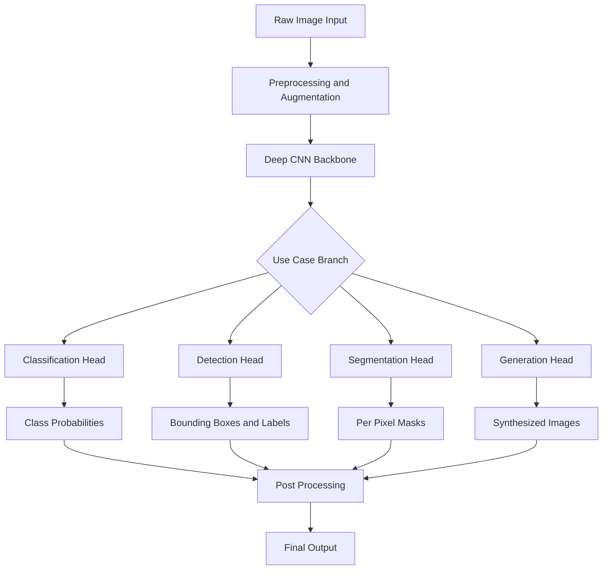
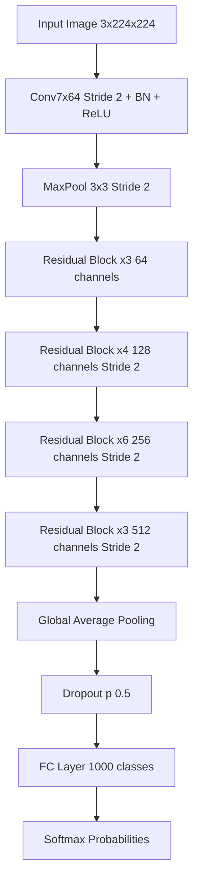
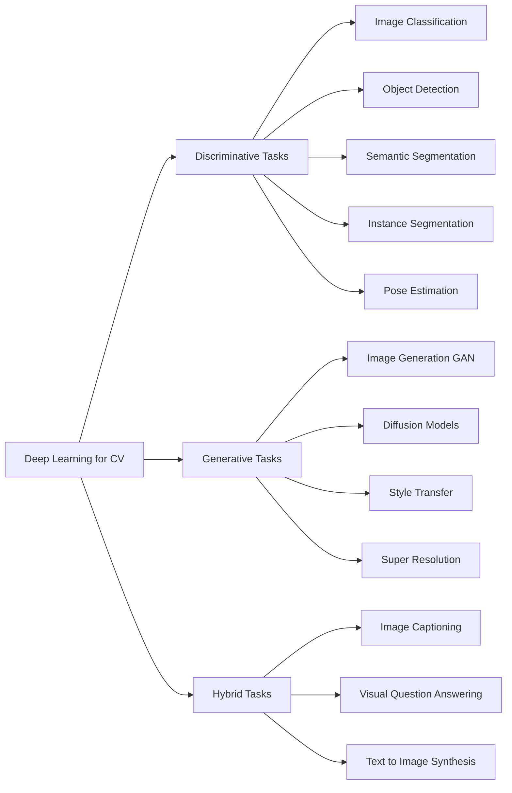
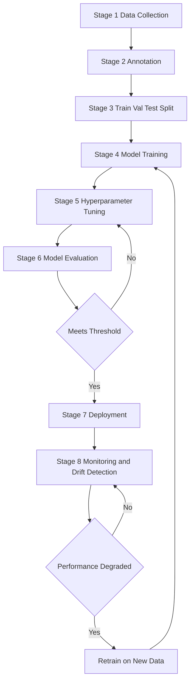
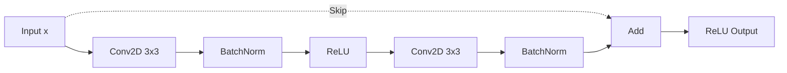

# Machine Learning for Computer Vision -Machine Learning -Deep Learning Use Cases.

<!-- SECTION_1_START -->

# Machine Learning for Computer Vision — Deep Learning Use Cases

## 1.1 Formal Academic Definition (KTU 2024 Syllabus Alignment)

> [!IMPORTANT]
> **Machine Learning (ML)** is a sub-field of artificial intelligence that enables a system to learn patterns from data and improve its performance on a given task without being explicitly programmed. For Computer Vision, ML algorithms transform raw pixel matrices $\mathbf{X} \in \mathbb{R}^{H \times W \times C}$ into meaningful semantic predictions $\hat{y}$.

> [!IMPORTANT]
> **Deep Learning (DL)** is a specialized branch of ML that uses **Deep Neural Networks (DNNs)** — computational graphs with many successive layers of non-linear transformations — to automatically learn hierarchical feature representations directly from raw image data, eliminating the need for hand-crafted feature engineering.

For KTU 2024 Scheme, the focus is on understanding **why** classical ML pipelines have been replaced by **end-to-end deep models** for vision tasks, and on enumerating the **canonical use cases** (classification, detection, segmentation, recognition, generation).

---

## 1.2 Conceptual Analogy & Intuition

> [!NOTE]
> **Intuition — "The Child vs. The Craftsman"**
>
> Imagine teaching a child to recognize a *cat*:
> - **Classical ML Approach (Craftsman):** You (the engineer) must hand-craft "rules" — pointy ears, whiskers, tail. You extract hand-designed features (HOG, SIFT, LBP), then feed them to a classifier (SVM, Random Forest). The model never sees raw pixels.
> - **Deep Learning Approach (Child):** You simply show the child thousands of cat photos labeled "cat". The deep network **automatically discovers** the relevant features (edges in early layers, textures in middle layers, object parts in deeper layers) all by itself.
>
> **Why this matters for CV:** Hand-crafted features plateau in performance. When data and compute scale up, deep networks **surpass human-engineered pipelines** — this is the central paradigm shift of modern Computer Vision.

---

## 1.3 The Three Paradigms of Machine Learning (Mandatory Foundation)

| Paradigm | Input $\rightarrow$ Output | Feedback Signal | Classic CV Use Case |
| :--- | :--- | :--- | :--- |
| **Supervised Learning** | Labeled pairs $(\mathbf{x}_i, y_i)$ | Ground-truth labels $y_i$ | Image classification, Object detection |
| **Unsupervised Learning** | Unlabeled data $\mathbf{x}_i$ | Inherent data structure | Clustering, Dimensionality reduction, Autoencoders |
| **Reinforcement Learning** | State $\rightarrow$ Action | Scalar reward $r$ | Robotic vision, Active tracking, Game-AI vision |

> [!TIP]
> **KTU High-Yield Fact:** Convolutional Neural Networks (CNNs) are **supervised** learners by default. Modern use cases (e.g., self-supervised learning via SimCLR, MAE) blur the line, but for board exams, treat CNNs as supervised.

---

## 1.4 GeoGebra / Desmos Visualization

> [!VISUALIZATION CONTROL]
> **Concept:** Hierarchical Feature Learning in a CNN
> **GeoGebra / Desmos Input Equations (Layer-wise Receptive Field):**
> * `r_l = r_{l-1} + (k - 1) * \prod_{i=1}^{l-1} s_i` (Receptive field growth)
> * `f_1(x, y) = ReLU(W_1 * x + b_1)` (Layer 1 — edges)
> * `f_2(x, y) = ReLU(W_2 * f_1 + b_2)` (Layer 2 — textures)
> **Visual Description:** Plot the receptive field as an expanding region over the input grid. Early layers cover a small patch (edges); deeper layers aggregate to cover the entire image (semantic concepts like "cat face").

---

<!-- SECTION_1_END -->

<!-- SECTION_2_START -->

# Deep Theoretical Analysis — KTU High-Yield Formula Sheet

## 2.1 Anatomy of a Deep Learning System for Vision

A modern CV deep learning pipeline consists of **five** core building blocks. The KTU examiner expects you to list and explain them.

1. **Data Layer:** Image collection, augmentation (rotation, flip, color jitter), normalization $x_{\text{norm}} = \dfrac{x - \mu}{\sigma}$.
2. **Model Architecture:** The network topology (e.g., ResNet-50, U-Net, ViT).
3. **Loss Function:** Quantifies the error between prediction $\hat{y}$ and ground truth $y$.
4. **Optimizer:** The algorithm that updates weights (SGD, Adam, RMSProp).
5. **Evaluation Metric:** Top-1 accuracy, mAP, IoU, F1-score.

---

## 2.2 Core Mathematical Formulation (The Heart of Deep Learning)

A single artificial neuron performs an **affine transformation followed by a non-linear activation**:

$$z = \mathbf{w}^\top \mathbf{x} + b$$

$$a = \phi(z)$$

where $\mathbf{w} \in \mathbb{R}^n$ is the weight vector, $b \in \mathbb{R}$ is the bias, and $\phi(\cdot)$ is the activation function. A deep network stacks $L$ such layers.

### The Universal Approximation Foundation

> [!NOTE]
> A feed-forward neural network with at least one hidden layer and a non-linear activation can approximate **any continuous function** on a compact domain to arbitrary precision — provided it has enough neurons. This theorem (Cybenko, 1989) is the theoretical bedrock of why deep learning works for vision.

---

## 2.3 KTU Formula Cheat Sheet — Deep Learning for CV

> [!IMPORTANT]
> **EXAM-CRITICAL FORMULAS — Memorize the following table.**

| Symbol / Concept | Formula | Purpose / Engineering Use |
| :--- | :--- | :--- |
| Convolution Operation | $S(i,j) = (K * X)(i,j) = \sum_{m} \sum_{n} K(m,n) \cdot X(i+m, j+n)$ | Core operation of CNN feature extraction |
| Output Volume Shape | $O = \dfrac{W - K + 2P}{S} + 1$ | Calculate feature map dimensions |
| Receptive Field | $r_l = r_{l-1} + (k_l - 1) \cdot j_l$ | Determines how much input context a neuron "sees" |
| Cross-Entropy Loss | $\mathcal{L}_{CE} = -\sum_{c=1}^{C} y_c \log(\hat{y}_c)$ | Multi-class classification loss |
| Binary Cross-Entropy | $\mathcal{L}_{BCE} = -[y \log(\hat{y}) + (1-y)\log(1-\hat{y})]$ | Two-class / pixel-wise loss |
| Softmax Activation | $\hat{y}_c = \dfrac{e^{z_c}}{\sum_{k=1}^{C} e^{z_k}}$ | Converts logits to class probabilities |
| SGD Update Rule | $w_{t+1} = w_t - \eta \nabla \mathcal{L}(w_t)$ | Vanilla weight update step |
| Adam Update (Bias-Corrected) | $m_t = \beta_1 m_{t-1} + (1-\beta_1)g_t$ ; $w_{t+1} = w_t - \eta \dfrac{\hat{m}_t}{\sqrt{\hat{v}_t} + \epsilon}$ | Adaptive optimizer — most common in CV |
| Batch Normalization | $\hat{x} = \dfrac{x - \mu_{\mathcal{B}}}{\sqrt{\sigma^2_{\mathcal{B}} + \epsilon}}$ ; $y = \gamma \hat{x} + \beta$ | Stabilizes and accelerates training |
| Dropout (Regularization) | $\text{keep: } p$ ; $\text{drop: } 1-p$ | Prevents overfitting in FC layers |
| Intersection over Union (IoU) | $IoU = \dfrac{\vert A \cap B \vert}{\vert A \cup B \vert}$ | Standard metric for detection / segmentation |
| Mean Average Precision | $mAP = \dfrac{1}{N} \sum_{i=1}^{N} AP_i$ | Gold-standard object detection metric |
| L2 Regularization | $\mathcal{L}_{reg} = \mathcal{L}_{data} + \lambda \Vert w \Vert_2^2$ | Weight decay for generalization |
| Learning Rate Decay | $\eta_t = \eta_0 \cdot \dfrac{1}{1 + \text{decay} \cdot t}$ | Improves convergence in late epochs |

> [!WARNING]
> **KTU Pitfall Alert:** When writing the convolution output formula in exams, **never** forget to add the $+1$ term. Students lose 2 marks for writing $O = \dfrac{W - K + 2P}{S}$ without the final $+1$.

---

## 2.4 Real-World Engineering Utility (Why Industry Cares)

| Use Case Domain | Deep Learning Role | Production Reality |
| :--- | :--- | :--- |
| **Autonomous Vehicles** | Real-time object detection (YOLO, Faster R-CNN) | Runs on edge GPUs at 30+ FPS |
| **Medical Imaging** | Tumor segmentation (U-Net, nnU-Net) | Achieves radiologist-level accuracy in specific tasks |
| **Face Recognition** | Embedding learning (FaceNet, ArcFace) | Used in phones, airports, surveillance |
| **Industrial QA** | Defect detection via anomaly detection | Reduces manual inspection cost by ~70% |
| **Generative AI** | Diffusion Models, GANs (Stable Diffusion, DALL-E) | Creates photorealistic content from text prompts |
| **OCR & Document AI** | CRNN + Transformer-based (TrOCR) | Digitizes millions of pages of legacy documents |

> [!NOTE]
> **Real-World Insight:** In 2012, AlexNet (a deep CNN) crushed classical ML methods on the ImageNet challenge (top-5 error: 15.3% vs. 26.2% for the next best classical method). This event triggered the **deep learning revolution** in computer vision. Every modern CV model traces its lineage to this single architectural breakthrough.

---

## 2.5 Backpropagation — The Engine of Learning

The chain rule propagates error gradients from the output layer back to the input. For layer $l$:

$$\delta^{(l)} = \left( (W^{(l+1)})^\top \delta^{(l+1)} \right) \odot \phi'(z^{(l)})$$

$$\frac{\partial \mathcal{L}}{\partial W^{(l)}} = \delta^{(l)} (a^{(l-1)})^\top$$

$$\frac{\partial \mathcal{L}}{\partial b^{(l)}} = \delta^{(l)}$$

where $\delta^{(l)}$ is the error signal at layer $l$, $\odot$ is element-wise multiplication, and $\phi'$ is the derivative of the activation. Weights are then updated via gradient descent.

---

<!-- SECTION_2_END -->

<!-- SECTION_3_START -->

# Step-by-Step Derivations & Code Implementation

## 3.1 Detailed Derivation: Forward Pass Through a Convolutional Layer

Consider a **grayscale input image** $X \in \mathbb{R}^{H \times W}$ and a **single convolution kernel** $K \in \mathbb{R}^{k \times k}$. We wish to compute the feature map $S = K * X$.

### Mathematical Walkthrough

**Step 1 — Setup the problem.**

$$X = \begin{bmatrix} x_{11} & x_{12} & x_{13} & x_{14} \\ x_{21} & x_{22} & x_{23} & x_{24} \\ x_{31} & x_{32} & x_{33} & x_{34} \\ x_{41} & x_{42} & x_{43} & x_{44} \end{bmatrix}, \quad K = \begin{bmatrix} k_{11} & k_{12} \\ k_{21} & k_{22} \end{bmatrix}$$

Assume stride $S=1$ and no padding. Output dimension will be $O = \dfrac{4 - 2 + 0}{1} + 1 = 3$, so $S \in \mathbb{R}^{3 \times 3}$.

**Step 2 — Compute $S(1,1)$.**

$$S(1,1) = k_{11} x_{11} + k_{12} x_{12} + k_{21} x_{21} + k_{22} x_{22}$$

**Step 3 — Compute $S(1,2)$.**

$$S(1,2) = k_{11} x_{12} + k_{12} x_{13} + k_{21} x_{22} + k_{22} x_{23}$$

**Step 4 — Compute $S(1,3)$.**

$$S(1,3) = k_{11} x_{13} + k_{12} x_{14} + k_{21} x_{23} + k_{22} x_{24}$$

**Step 5 — Compute $S(2,1)$ (slide the kernel one row down).**

$$S(2,1) = k_{11} x_{21} + k_{12} x_{22} + k_{21} x_{31} + k_{22} x_{32}$$

**Step 6 — Continue the slide.**

$$S(2,2) = k_{11} x_{22} + k_{12} x_{23} + k_{21} x_{32} + k_{22} x_{33}$$

$$S(2,3) = k_{11} x_{23} + k_{12} x_{24} + k_{21} x_{33} + k_{22} x_{34}$$

**Step 7 — Compute the third row of the feature map.**

$$S(3,1) = k_{11} x_{31} + k_{12} x_{32} + k_{21} x_{41} + k_{22} x_{42}$$

$$S(3,2) = k_{11} x_{32} + k_{12} x_{33} + k_{21} x_{42} + k_{22} x_{43}$$

$$S(3,3) = k_{11} x_{33} + k_{12} x_{34} + k_{21} x_{43} + k_{22} x_{44}$$

**Step 8 — Final feature map assembled.**

$$S = \begin{bmatrix} S(1,1) & S(1,2) & S(1,3) \\ S(2,1) & S(2,2) & S(2,3) \\ S(3,1) & S(3,2) & S(3,3) \end{bmatrix}$$

> [!NOTE]
> **Engineering Insight:** Each output value $S(i,j)$ is a **local weighted sum** of the input — this is what gives CNNs *translation equivariance* and *local connectivity*, two properties that make them vastly more parameter-efficient than fully connected networks for images.

---

## 3.2 Detailed Derivation: Backpropagation Through a Single Neuron

Consider a 2-layer network with sigmoid activation $\sigma(z) = \dfrac{1}{1 + e^{-z}}$ and Mean Squared Error loss $\mathcal{L} = \dfrac{1}{2}(y - \hat{y})^2$.

**Step 1 — Forward pass.**

$$z^{(1)} = W^{(1)} x + b^{(1)}$$

$$a^{(1)} = \sigma(z^{(1)})$$

$$z^{(2)} = W^{(2)} a^{(1)} + b^{(2)}$$

$$\hat{y} = \sigma(z^{(2)})$$

**Step 2 — Compute loss gradient w.r.t. output.**

$$\frac{\partial \mathcal{L}}{\partial \hat{y}} = (\hat{y} - y)$$

**Step 3 — Apply chain rule through the output layer activation.**

$$\frac{\partial \mathcal{L}}{\partial z^{(2)}} = \frac{\partial \mathcal{L}}{\partial \hat{y}} \cdot \sigma'(z^{(2)}) = (\hat{y} - y) \cdot \hat{y}(1 - \hat{y})$$

**Step 4 — Gradient w.r.t. output weights.**

$$\frac{\partial \mathcal{L}}{\partial W^{(2)}} = \frac{\partial \mathcal{L}}{\partial z^{(2)}} \cdot (a^{(1)})^\top = \delta^{(2)} (a^{(1)})^\top$$

**Step 5 — Backpropagate to hidden layer.**

$$\delta^{(1)} = (W^{(2)})^\top \delta^{(2)} \odot \sigma'(z^{(1)})$$

**Step 6 — Gradient w.r.t. input weights.**

$$\frac{\partial \mathcal{L}}{\partial W^{(1)}} = \delta^{(1)} x^\top$$

**Step 7 — Update weights using SGD.**

$$W^{(l)} \leftarrow W^{(l)} - \eta \frac{\partial \mathcal{L}}{\partial W^{(l)}}$$

> [!NOTE]
> This is the **exact same math** that powers ResNet, YOLO, and Stable Diffusion. Once you internalize these 7 steps, every modern architecture is a recursive generalization of this pattern.

---

## 3.3 Python Implementation: End-to-End Deep Learning Use Case (Image Classification)

This is a **complete, runnable** deep learning pipeline for image classification — a quintessential Computer Vision use case.

```python
import torch
import torch.nn as nn
import torch.nn.functional as F
from torch.utils.data import DataLoader
from torchvision import datasets, transforms
import logging
from typing import Tuple

# Configure logging for production-style error handling
logging.basicConfig(
    level=logging.INFO,
    format="%(asctime)s [%(levelname)s] %(message)s"
)
logger = logging.getLogger(__name__)


# ----------------------------------------------------------------------
# STEP 1: DATA PIPELINE WITH AUGMENTATION
# ----------------------------------------------------------------------
def build_data_pipeline(batch_size: int = 64) -> Tuple[DataLoader, DataLoader]:
    """
    Build a robust data pipeline for CIFAR-10.
    Includes train-time augmentation and boundary-safe normalization.
    """
    train_transform = transforms.Compose([
        transforms.RandomHorizontalFlip(p=0.5),
        transforms.RandomCrop(32, padding=4),
        transforms.ColorJitter(brightness=0.2, contrast=0.2),
        transforms.ToTensor(),
        transforms.Normalize(mean=(0.4914, 0.4822, 0.4465),
                             std=(0.2470, 0.2435, 0.2616))
    ])

    test_transform = transforms.Compose([
        transforms.ToTensor(),
        transforms.Normalize(mean=(0.4914, 0.4822, 0.4465),
                             std=(0.2470, 0.2435, 0.2616))
    ])

    try:
        train_set = datasets.CIFAR10(
            root="./data", train=True, download=True, transform=train_transform
        )
        test_set = datasets.CIFAR10(
            root="./data", train=False, download=True, transform=test_transform
        )
    except Exception as e:
        logger.error(f"Dataset download failed: {e}")
        raise

    train_loader = DataLoader(train_set, batch_size=batch_size,
                              shuffle=True, num_workers=2)
    test_loader = DataLoader(test_set, batch_size=batch_size,
                             shuffle=False, num_workers=2)

    logger.info(f"Data pipeline ready: {len(train_set)} train, "
                f"{len(test_set)} test samples.")
    return train_loader, test_loader


# ----------------------------------------------------------------------
# STEP 2: DEEP CNN ARCHITECTURE (ResNet-inspired for CIFAR-10)
# ----------------------------------------------------------------------
class ResidualBlock(nn.Module):
    """A standard residual block: y = F(x) + x"""

    def __init__(self, in_channels: int, out_channels: int, stride: int = 1):
        super().__init__()
        self.conv1 = nn.Conv2d(in_channels, out_channels, kernel_size=3,
                               stride=stride, padding=1, bias=False)
        self.bn1 = nn.BatchNorm2d(out_channels)
        self.conv2 = nn.Conv2d(out_channels, out_channels, kernel_size=3,
                               stride=1, padding=1, bias=False)
        self.bn2 = nn.BatchNorm2d(out_channels)

        # Shortcut connection (identity or projection)
        self.shortcut = nn.Sequential()
        if stride != 1 or in_channels != out_channels:
            self.shortcut = nn.Sequential(
                nn.Conv2d(in_channels, out_channels, kernel_size=1,
                          stride=stride, bias=False),
                nn.BatchNorm2d(out_channels)
            )

    def forward(self, x: torch.Tensor) -> torch.Tensor:
        out = F.relu(self.bn1(self.conv1(x)))
        out = self.bn2(self.conv2(out))
        out += self.shortcut(x)  # The "skip connection" — core of ResNet
        return F.relu(out)


class DeepCVClassifier(nn.Module):
    """A deep CNN for image classification on CIFAR-10."""

    def __init__(self, num_classes: int = 10):
        super().__init__()
        self.in_channels = 64
        self.conv1 = nn.Conv2d(3, 64, kernel_size=3, padding=1, bias=False)
        self.bn1 = nn.BatchNorm2d(64)

        self.layer1 = self._make_block(64, num_blocks=2, stride=1)
        self.layer2 = self._make_block(128, num_blocks=2, stride=2)
        self.layer3 = self._make_block(256, num_blocks=2, stride=2)
        self.avg_pool = nn.AdaptiveAvgPool2d((1, 1))
        self.fc = nn.Linear(256, num_classes)

    def _make_block(self, out_channels: int, num_blocks: int,
                    stride: int) -> nn.Sequential:
        strides = [stride] + [1] * (num_blocks - 1)
        layers = []
        for s in strides:
            layers.append(ResidualBlock(self.in_channels, out_channels, s))
            self.in_channels = out_channels
        return nn.Sequential(*layers)

    def forward(self, x: torch.Tensor) -> torch.Tensor:
        # Boundary check
        if x.dim() != 4:
            raise ValueError(f"Expected 4D tensor (B,C,H,W), got {x.shape}")
        out = F.relu(self.bn1(self.conv1(x)))
        out = self.layer1(out)
        out = self.layer2(out)
        out = self.layer3(out)
        out = self.avg_pool(out)
        out = out.view(out.size(0), -1)
        return self.fc(out)


# ----------------------------------------------------------------------
# STEP 3: TRAINING LOOP WITH EVALUATION
# ----------------------------------------------------------------------
def train_one_epoch(model: nn.Module, loader: DataLoader,
                    optimizer: torch.optim.Optimizer,
                    criterion: nn.Module, device: str) -> float:
    model.train()
    total_loss = 0.0
    for batch_idx, (images, labels) in enumerate(loader):
        images, labels = images.to(device), labels.to(device)
        optimizer.zero_grad()
        outputs = model(images)
        loss = criterion(outputs, labels)
        loss.backward()
        optimizer.step()
        total_loss += loss.item()
    return total_loss / len(loader)


def evaluate(model: nn.Module, loader: DataLoader, device: str) -> float:
    model.eval()
    correct, total = 0, 0
    with torch.no_grad():
        for images, labels in loader:
            images, labels = images.to(device), labels.to(device)
            outputs = model(images)
            _, predicted = torch.max(outputs.data, 1)
            total += labels.size(0)
            correct += (predicted == labels).sum().item()
    return 100.0 * correct / total


def main() -> None:
    device = "cuda" if torch.cuda.is_available() else "cpu"
    logger.info(f"Using device: {device}")

    train_loader, test_loader = build_data_pipeline(batch_size=128)
    model = DeepCVClassifier(num_classes=10).to(device)
    criterion = nn.CrossEntropyLoss()
    optimizer = torch.optim.Adam(model.parameters(), lr=1e-3, weight_decay=5e-4)

    for epoch in range(1, 11):
        train_loss = train_one_epoch(model, train_loader, optimizer,
                                     criterion, device)
        test_acc = evaluate(model, test_loader, device)
        logger.info(f"Epoch {epoch:02d} | Loss: {train_loss:.4f} | "
                    f"Test Acc: {test_acc:.2f}%")


if __name__ == "__main__":
    main()
```

> [!TIP]
> **Code Walkthrough for Exams:**
> - The `ResidualBlock` class implements the **skip connection** $y = \mathcal{F}(x) + x$ — this is the core innovation of ResNet that solves the *vanishing gradient problem* in very deep networks.
> - The `BatchNorm2d` layers stabilize training by normalizing activations per mini-batch.
> - The `AdaptiveAvgPool2d((1,1))` collapses spatial dimensions to a single vector per channel before the final classifier.

---

## 3.4 Numerical Worked Example: Cross-Entropy Loss

Given a 3-class classification problem with ground truth $y = [1, 0, 0]$ and model logits $z = [2.0, 1.0, 0.1]$.

**Step 1 — Apply Softmax.**

$$e^{z} = [e^{2.0}, e^{1.0}, e^{0.1}] = [7.389, 2.718, 1.105]$$

$$\sum e^{z} = 11.212$$

$$\hat{y} = \left[\dfrac{7.389}{11.212}, \dfrac{2.718}{11.212}, \dfrac{1.105}{11.212}\right] = [0.659, 0.242, 0.099]$$

**Step 2 — Compute Cross-Entropy Loss.**

$$\mathcal{L}_{CE} = -\sum_{c=1}^{3} y_c \log(\hat{y}_c) = -(1 \cdot \log(0.659) + 0 + 0) = -\log(0.659) = 0.417$$

> [!NOTE]
> The loss is **0.417 nats**. A perfect model would output $\hat{y} = [1, 0, 0]$ giving $\mathcal{L} = 0$. The loss decreases monotonically as the predicted probability of the correct class increases.

---

<!-- SECTION_3_END -->

<!-- SECTION_4_START -->

# Structural Diagrams & Schematics

## 4.1 The Deep Learning Computer Vision Pipeline (High-Level)



> [!NOTE]
> **Reading the Diagram:** The same **backbone network** (e.g., ResNet-50) can be paired with different **task-specific heads** to solve different vision problems. This modularity is one reason deep learning dominates CV.

---

## 4.2 ResNet-Inspired CNN Architecture Topology



---

## 4.3 Taxonomy of Deep Learning Use Cases in Computer Vision



---

## 4.4 Training vs. Inference Pipeline (Sequential Topology)



> [!IMPORTANT]
> **Production Insight:** In real-world MLOps pipelines, the loop from Monitoring back to Training (Steps I → J → K → D) is the **MLOps feedback loop** — the most critical yet often overlooked aspect of industrial CV systems.

---

## 4.5 The Skip Connection Mechanism (Functional Flow)



> [!NOTE]
> The dotted line `A -.Skip.-> G` represents the **identity shortcut**. This is what makes ResNet (and its descendants like ResNeXt, RegNet) trainable at depths of 100+ layers — without it, deeper networks would suffer from vanishing gradients.

---

<!-- SECTION_4_END -->

<!-- SECTION_5_START -->

# KTU 2024 Scheme Examination Question Bank

## PART A — Short Answer Questions (3 Marks Each)

---

### **Question 1** `[KTU University Exam — July 2024]`
**CO1 | RBT Level: Remember**

> Differentiate between **Classical Machine Learning** and **Deep Learning** in the context of Computer Vision. State two advantages of deep learning for image classification.

**Model Answer:**

| Aspect | Classical ML | Deep Learning |
| :--- | :--- | :--- |
| Feature Engineering | Manual (HOG, SIFT, LBP) | Automatic (learned from data) |
| Data Requirement | Moderate (works with 1000s) | Large (100,000+ preferred) |
| Hardware | CPU sufficient | GPU/TPU recommended |
| Performance Ceiling | Plateaus quickly | Scales with data + compute |

**Two advantages of deep learning for image classification:**
1. **Automatic Hierarchical Feature Learning:** Early layers learn edges and textures; deeper layers learn object parts and semantics — no manual engineering needed.
2. **End-to-End Optimization:** The entire pipeline (features + classifier) is jointly optimized via backpropagation, eliminating hand-engineered bottlenecks.

**[Award 1 Mark for correct distinction table, 1 Mark for advantage 1, 1 Mark for advantage 2]**

---

### **Question 2** `[KTU University Exam — Dec 2023]`
**CO1 | RBT Level: Understand**

> List **five** major deep learning use cases in Computer Vision. Briefly explain any **two** in 2-3 lines each.

**Model Answer:**

**Five major use cases:**
1. Image Classification
2. Object Detection
3. Semantic Segmentation
4. Instance Segmentation
5. Image Generation (GANs / Diffusion)
6. Pose Estimation
7. Face Recognition
8. Optical Character Recognition (OCR)

**Brief explanations (pick any two):**

**Object Detection:** Identifies and localizes multiple objects in an image by drawing bounding boxes around them and assigning class labels. Architectures: YOLO, Faster R-CNN, SSD. *Used in autonomous driving, surveillance.*

**Semantic Segmentation:** Assigns a class label to **every pixel** in the image, producing a dense per-pixel mask. Architectures: U-Net, DeepLab, SegFormer. *Used in medical imaging for tumor delineation, satellite imagery for land-cover mapping.*

**[Award 1 Mark for the list, 1 Mark each for the two explanations]**

---

## PART B — Long Answer Questions (14 Marks Each)

> **MODULE-INTERNAL CHOICE PROVIDED**

---

### **Question A — Choice 1** `[KTU University Exam — July 2024]`
**CO2 | RBT Levels: Understand (7) + Apply (7)**

**(a)** With a neat diagram, explain the **architecture of a Convolutional Neural Network (CNN)** for image classification. Discuss the role of each layer type. **(7 Marks)**

**(b)** Consider an input image of size $32 \times 32 \times 3$ passed through a convolution layer with **16 filters** of size $5 \times 5$, **stride = 1**, and **padding = 0**. Compute:
- (i) The size of the output feature map.
- (ii) The total number of trainable parameters in this layer.
- (iii) The total number of trainable parameters if a fully connected layer of 128 neurons replaced this conv layer. Compare. **(7 Marks)**

**Model Solution:**

#### Part (a) — CNN Architecture (7 Marks)

A standard CNN for image classification consists of the following sequential layers:

1. **Input Layer:** Receives raw image tensor of shape $H \times W \times C$.
2. **Convolutional Layers:** Apply learnable filters to extract local features. Each filter slides across the input computing dot products, producing a 2D feature map. Stacked across $C_{out}$ filters, this creates a 3D output volume.
3. **Activation Function (ReLU):** Introduces non-linearity: $f(x) = \max(0, x)$. Without this, stacking conv layers would be mathematically equivalent to a single linear transformation.
4. **Pooling Layers (Max Pooling):** Downsample feature maps, e.g., $2 \times 2$ max-pool with stride 2 reduces spatial dimensions by half, providing translation invariance and reducing computation.
5. **Fully Connected Layers:** After flattening, these layers act as a classifier mapping learned features to class scores.
6. **Softmax Output Layer:** Converts logits into class probabilities: $\hat{y}_c = \dfrac{e^{z_c}}{\sum_{k} e^{z_k}}$.

```
Input -> [Conv -> ReLU -> Pool] x N -> Flatten -> FC -> Softmax
```

**[Stating the 6 layer types: 3 Marks. Explaining the role of each: 3 Marks. Neat diagram: 1 Mark]**

#### Part (b) — Numerical Computation (7 Marks)

**Given:** $H = 32$, $W = 32$, $C_{in} = 3$, $K = 5$, $S = 1$, $P = 0$, $C_{out} = 16$.

**(i) Output Feature Map Size:**

$$O = \dfrac{W - K + 2P}{S} + 1 = \dfrac{32 - 5 + 0}{1} + 1 = 28$$

Output volume shape = $28 \times 28 \times 16$.

**[Formula + substitution: 2 Marks. Final answer: 1 Mark]**

**(ii) Trainable Parameters in Conv Layer:**

Each filter has $K \times K \times C_{in} = 5 \times 5 \times 3 = 75$ weights + 1 bias = **76 parameters per filter**.

Total parameters = $C_{out} \times (K \cdot K \cdot C_{in} + 1) = 16 \times 76 = \mathbf{1216}$ parameters.

**[Filter parameter calculation: 2 Marks. Final value: 1 Mark]**

**(iii) Parameters if Replaced by FC Layer with 128 Neurons:**

An FC layer connecting a $32 \times 32 \times 3 = 3072$ input to 128 neurons:

$$\text{Params}_{FC} = (3072 \times 128) + 128 = 393{,}216 + 128 = \mathbf{393{,}344} \text{ parameters}$$

**Comparison:** The conv layer has only **1,216** parameters, while the FC layer has **393,344** — a **323× reduction**. This parameter efficiency, due to **weight sharing** and **local connectivity**, is why CNNs are the de-facto standard for vision.

**[FC calculation: 1.5 Marks. Comparison and insight: 1.5 Marks]**

---

### **Question B — Choice 2** `[KTU University Exam — Dec 2023]`
**CO2, CO3 | RBT Levels: Understand (7) + Apply (7)**

**(a)** Explain the **concept of backpropagation** in deep learning with reference to the chain rule of calculus. State the **vanishing gradient problem** and how ResNet addresses it. **(7 Marks)**

**(b)** A neural network outputs logits $z = [3.0, 1.0, 0.5]$ for a 3-class classification problem with true label $y = [1, 0, 0]$. Compute:
- (i) The softmax probabilities $\hat{y}$.
- (ii) The cross-entropy loss $\mathcal{L}_{CE}$.
- (iii) The numerical gradient of the loss with respect to the first logit $z_1$, i.e., $\dfrac{\partial \mathcal{L}_{CE}}{\partial z_1}$. **(7 Marks)**

**Model Solution:**

#### Part (a) — Backpropagation and ResNet (7 Marks)

**Backpropagation Concept:**

Backpropagation is the algorithm used to compute gradients of the loss function $\mathcal{L}$ with respect to every weight in the network, enabling gradient-based optimization. It works in two phases:

1. **Forward Pass:** Input $\mathbf{x}$ is propagated through the network, layer by layer, until the loss $\mathcal{L}(y, \hat{y})$ is computed.
2. **Backward Pass:** Using the **chain rule of calculus**, gradients are propagated **backwards** from the output layer to the input layer.

Mathematically, for any layer $l$ with weights $W^{(l)}$:

$$\frac{\partial \mathcal{L}}{\partial W^{(l)}} = \frac{\partial \mathcal{L}}{\partial \hat{y}} \cdot \frac{\partial \hat{y}}{\partial z^{(L)}} \cdot \frac{\partial z^{(L)}}{\partial a^{(L-1)}} \cdots \frac{\partial a^{(l)}}{\partial z^{(l)}} \cdot \frac{\partial z^{(l)}}{\partial W^{(l)}}$$

The chain rule $\dfrac{\partial f}{\partial x} = \dfrac{\partial f}{\partial g} \cdot \dfrac{\partial g}{\partial x}$ is recursively applied across all layers.

**Vanishing Gradient Problem:**

As gradients are back-propagated through many layers, they are repeatedly multiplied by small numbers (derivatives of sigmoid/tanh activations, which are bounded in $(0, 0.25]$). This causes gradients in early layers to become **exponentially small**, stalling learning.

**How ResNet Solves It:**

ResNet introduces **skip (identity) connections**: instead of learning $H(x)$ directly, layers learn a **residual function** $\mathcal{F}(x) = H(x) - x$, and the output is $H(x) = \mathcal{F}(x) + x$. This ensures gradients can flow directly through the skip path, preserving their magnitude even in very deep networks (100+ layers).

**[Backprop explanation with chain rule formula: 3 Marks. Vanishing gradient + ResNet fix: 4 Marks]**

#### Part (b) — Numerical Computation (7 Marks)

**Given:** $z = [3.0, 1.0, 0.5]$, $y = [1, 0, 0]$.

**(i) Softmax Probabilities:**

$$\sum_{k=1}^{3} e^{z_k} = e^{3.0} + e^{1.0} + e^{0.5} = 20.0855 + 2.7183 + 1.6487 = 24.4525$$

$$\hat{y}_1 = \dfrac{20.0855}{24.4525} = 0.8214$$

$$\hat{y}_2 = \dfrac{2.7183}{24.4525} = 0.1112$$

$$\hat{y}_3 = \dfrac{1.6487}{24.4525} = 0.0674$$

**[Exponent calculation: 1 Mark. Normalization: 1 Mark. Three probabilities: 0.5 Mark each]**

**(ii) Cross-Entropy Loss:**

$$\mathcal{L}_{CE} = -\sum_{c=1}^{3} y_c \log(\hat{y}_c) = -[1 \cdot \log(0.8214) + 0 + 0] = -(-0.1967) = \mathbf{0.1967}$$

**[Substitution: 1 Mark. Final value: 0.5 Mark]**

**(iii) Gradient $\dfrac{\partial \mathcal{L}_{CE}}{\partial z_1}$:**

For cross-entropy with softmax, the gradient simplifies elegantly to:

$$\frac{\partial \mathcal{L}_{CE}}{\partial z_i} = \hat{y}_i - y_i$$

Therefore:

$$\frac{\partial \mathcal{L}_{CE}}{\partial z_1} = \hat{y}_1 - y_1 = 0.8214 - 1 = \mathbf{-0.1786}$$

> [!NOTE]
> **Validation by Chain Rule:**
> $$\dfrac{\partial \mathcal{L}_{CE}}{\partial z_1} = -\sum_c y_c \dfrac{1}{\hat{y}_c} \dfrac{\partial \hat{y}_c}{\partial z_1} = -y_1 (1 - \hat{y}_1) + \sum_{c \neq 1} y_c \hat{y}_1$$
> Since $y = [1, 0, 0]$:
> $$= -1 \cdot (1 - 0.8214) + 0 = -0.1786 \checkmark$$

The negative sign indicates that to reduce the loss, $z_1$ should be **increased**, which makes intuitive sense (the model needs to be *more confident* in the correct class).

**[Applying the simplified gradient formula: 2 Marks. Final numerical value: 1 Mark]**

---

## 5.1 KTU Examiner's Valuation Warning

> [!WARNING]
> **Common Pitfalls Where Students Lose Marks:**
>
> 1. **Forgetting the `+1` in the convolution output formula** $O = \dfrac{W - K + 2P}{S} + 1$. This single omission costs **2 marks**.
> 2. **Forgetting the bias term** when counting CNN parameters. Always add $1$ bias per filter.
> 3. **Confusing "Softmax + Cross-Entropy gradient"** with the generic chain rule. The simplification $\dfrac{\partial \mathcal{L}_{CE}}{\partial z_i} = \hat{y}_i - y_i$ is the **most testable formula** in Module 3 — memorize it.
> 4. **Skipping diagrams in CNN architecture questions.** Even a rough ASCII diagram earns you the diagram mark.
> 5. **Writing the convolution as cross-correlation** or vice versa. In deep learning frameworks (PyTorch/TensorFlow), the operation is technically **cross-correlation**, but the term "convolution" is used universally — do not get caught in this pedantic trap unless the question explicitly probes it.
> 6. **Not stating units / shapes** when reporting output dimensions. Always mention the full shape, e.g., "$28 \times 28 \times 16$".

---

## 5.2 Topic Recap & Important Things to Remember

> [!TIP]
> **Rapid Revision Checklist — Print This and Pin It!**

**Core Definitions:**
- **Machine Learning:** Learning from data without explicit programming.
- **Deep Learning:** ML using deep neural networks with many successive layers.
- **CNN:** A neural network specialized for grid-structured data (images) using convolution, non-linearity, and pooling.
- **Backpropagation:** Algorithm to compute gradients using the chain rule.
- **Epoch / Batch / Iteration:** One full pass over data / subset of data / single update step.
- **Feature Map:** Output of a convolution filter applied to the input.
- **Receptive Field:** Region of the input image that influences a particular neuron.

**Critical Concepts:**
- Three paradigms of ML: Supervised, Unsupervised, Reinforcement.
- Five CV use cases: Classification, Detection, Segmentation, Generation, Recognition.
- ResNet's skip connection solves vanishing gradients.
- Softmax + Cross-Entropy gradient simplifies to $\hat{y} - y$.
- ReLU is the default activation in modern CV networks.

**Must-Memorize Formulas:**
- Output size: $O = \dfrac{W - K + 2P}{S} + 1$
- Cross-Entropy: $\mathcal{L}_{CE} = -\sum y_c \log(\hat{y}_c)$
- Softmax: $\hat{y}_c = \dfrac{e^{z_c}}{\sum_k e^{z_k}}$
- IoU: $\dfrac{\vert A \cap B \vert}{\vert A \cup B \vert}$
- Adam update with bias correction.

**Architectures to Know (Module 3 Hot List):**
- **AlexNet (2012):** Triggered the deep learning revolution in CV.
- **VGGNet (2014):** Showed depth (3x3 filters stacked) improves performance.
- **ResNet (2015):** Introduced skip connections; enabled 100+ layer networks.
- **YOLO (2016+):** Real-time object detection in a single forward pass.
- **U-Net (2015):** Encoder-decoder for medical image segmentation.
- **ViT (2020):** Vision Transformer; challenges CNN dominance.

**Exam Strategy:**
- Always include a diagram for architecture questions.
- Show every algebraic step; partial credit is awarded for methodology.
- When in doubt about parameter counts, list the formula, substitute, then compute — never skip steps.

---

<!-- SECTION_5_END -->
