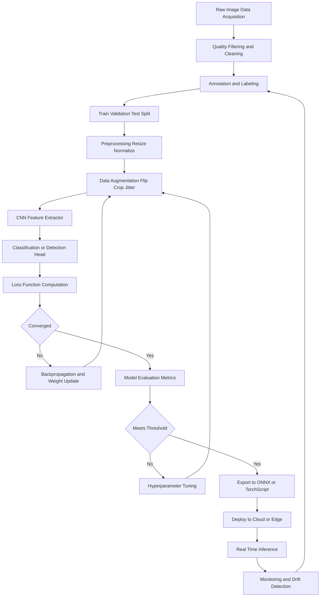
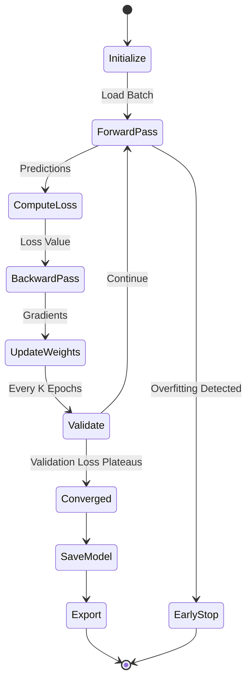
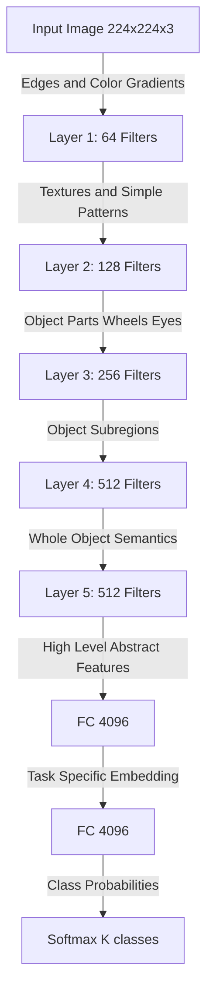
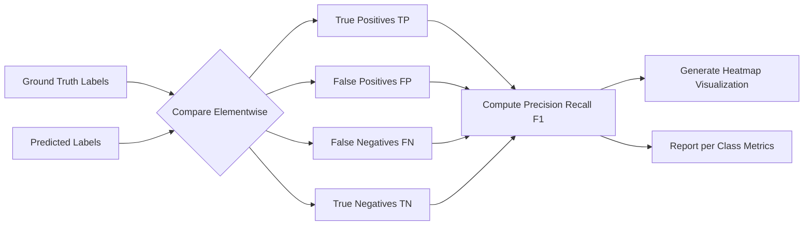
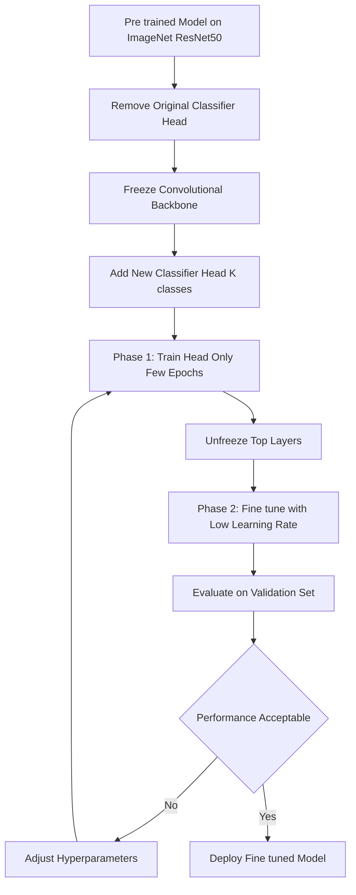

# Machine Learning for  Computer Vision :-

<!-- SECTION_1_START -->
# Machine Learning for Computer Vision

## 1.1 Formal Academic Definition

**Machine Learning for Computer Vision (ML4CV)** is a specialized subdomain of Artificial Intelligence that endows computational systems with the capability to *learn visual patterns directly from raw pixel data*, rather than relying on hand-engineered, rule-based feature descriptors. Formally, given a training dataset $\mathcal{D} = \{(x_i, y_i)\}_{i=1}^{N}$ where $x_i \in \mathbb{R}^{H \times W \times C}$ represents an image tensor of height $H$, width $W$, and $C$ color channels, and $y_i$ denotes the corresponding label, the objective is to learn a parameterized mapping function:

$$f_\theta : \mathcal{X} \rightarrow \mathcal{Y}$$

where $\theta \in \mathbb{R}^{P}$ is the parameter vector of the model and $\mathcal{Y}$ is the prediction space (class probabilities, bounding boxes, segmentation masks, or depth maps).

> [!IMPORTANT]
> **KTU 2024 Syllabus Anchor (PECST745 / Module 3):** Machine learning techniques for vision tasks—supervised classification, unsupervised clustering, dimensionality reduction, and deep convolutional architectures—form the algorithmic backbone of contemporary computer vision systems deployed in autonomous vehicles, medical diagnostics, surveillance, and industrial automation.

## 1.2 Conceptual Analogy — Teaching a Child to Identify Animals

Imagine you are teaching a toddler to distinguish between a cat and a dog. You do not hand the child a 50-page rule book describing ear curvature ratios, whisker density, and snout geometry. Instead, you *show* the child thousands of pictures and quietly correct mistakes. Gradually, the child's brain builds an internal **feature hierarchy**—edges → textures → parts (eyes, ears) → whole object. ML for CV mimics exactly this process:

| Stage in Child's Learning | Equivalent ML Operation |
|---|---|
| Looking at labeled examples | Forward pass through training data |
| Noticing a recurring shape (pointy ears) | Convolutional filter activation |
| Brain strengthening useful connections | Backpropagation and weight update |
| Recognizing a new cat instantly | Inference on unseen test image |

> [!NOTE]
> **Core Paradigm Shift:** Traditional CV used hand-crafted features (HOG, SIFT, LBP). Modern ML4CV lets the algorithm **discover** its own optimal features from data—this is the fundamental reason deep learning has dominated the field since 2012 (AlexNet on ImageNet).

## 1.3 Why Machine Learning is Indispensable for Vision

The dimensionality curse of natural images is staggering. A modest $224 \times 224$ RGB image lives in a $150{,}528$-dimensional ambient space. Distributing these vectors across a mere $1{,}000$ object classes (ImageNet scale) makes the **manifold hypothesis** essential:

> [!IMPORTANT]
> **Manifold Hypothesis:** Real-world image data does **not** populate the full high-dimensional pixel space uniformly. Instead, semantically meaningful images concentrate on a low-dimensional manifold $\mathcal{M} \subset \mathbb{R}^{H \times W \times C}$ embedded in pixel space. ML algorithms attempt to learn the geometry of this manifold.

## 1.4 Taxonomy of ML Approaches in CV

```
Machine Learning for Computer Vision
├── Classical (Pre-2012)
│   ├── Supervised: SVM, KNN, Random Forest, AdaBoost
│   ├── Unsupervised: K-Means, GMM, PCA
│   └── Hand-crafted: HOG + SVM, SIFT + Bag-of-Words
└── Deep Learning (2012-Present)
    ├── Supervised: CNN, ResNet, VGG, EfficientNet
    ├── Semi-Supervised: FixMatch, SimCLR
    ├── Self-Supervised: MAE, DINO, MoCo
    ├── Generative: VAE, GAN, Diffusion Models
    └── Transformer-Based: ViT, Swin, DETR
```

## 1.5 Geometric Intuition: The Feature Space

> [!VISUALIZATION CONTROL]
> **Concept:** Two-Dimensional Projection of Image Manifolds
> **GeoGebra / Desmos Input Equations:**
> * `f(x) = exp(-((x-2)^2 + (y-1)^2) / 0.5)`   (Cat cluster center)
> * `g(x) = exp(-((x+2)^2 + (y+2)^2) / 0.5)`   (Dog cluster center)
> * `h(x) = exp(-((x-1)^2 + (y+3)^2) / 0.4)`   (Bird cluster center)
> * `decision_boundary: y = 0.5 * x + 0.3`        (Linear SVM separator)
> **Visual Description:** Three Gaussian blobs representing cat, dog, and bird images clustered in 2D feature space (after PCA/t-SNE reduction). A linear decision boundary cleanly separates the cat and dog classes while the bird cluster overlaps slightly—motivating the use of non-linear kernels or deep embeddings in production systems.

## 1.6 Foundational Terminology Checklist

| Symbol | Meaning | Typical Range |
|---|---|---|
| $H, W$ | Image height and width in pixels | $32$ to $4096$ |
| $C$ | Number of channels (1 grayscale, 3 RGB) | $1, 3, 4$ |
| $N$ | Number of training samples | $10^3$ to $10^7$ |
| $K$ | Number of classes | $2$ to $10^5$ |
| $L$ | Number of neural network layers | $5$ to $1000+$ |
| $\theta$ | Model parameter count | $10^4$ to $10^{12}$ |
| $\eta$ | Learning rate | $10^{-5}$ to $10^{-1}$ |
| $\lambda$ | Regularization coefficient | $10^{-6}$ to $10^1$ |
| $B$ | Mini-batch size | $8, 16, 32, 64, 128, 256$ |

> [!NOTE]
> **For KTU Board Examinations:** Memorize the meaning of $\eta$ (learning rate), $\lambda$ (regularization), $B$ (batch size), and the role of $L$ (network depth). A surprising number of 3-mark and 14-mark questions test these foundational symbols.

---

<!-- SECTION_1_END -->

<!-- SECTION_2_START -->
# Deep Theoretical Analysis & KTU High-Yield Formula Sheet

## 2.1 The Canonical ML-for-CV Pipeline

Every production-grade vision system follows a **seven-stage pipeline**. Understanding each stage is non-negotiable for KTU 14-mark questions on "Explain the workflow of an ML-based image classification system."

### Stage 1 — Data Acquisition and Curation
- Collect raw images from sensors, web scraping, or synthetic generators.
- Address **class imbalance** via oversampling minority classes, undersampling majority classes, or synthetic minority over-sampling (SMOTE).
- Audit for **dataset bias** (e.g., facial recognition systems that underperform on darker skin tones due to training data skew).

### Stage 2 — Preprocessing and Normalization
- **Pixel normalization:** rescale $[0, 255] \rightarrow [0, 1]$ by dividing by $255$, or apply zero-centered standardization:

$$x_{\text{norm}} = \frac{x - \mu_{\mathcal{D}}}{\sigma_{\mathcal{D}} + \epsilon}$$

where $\mu_{\mathcal{D}}$ and $\sigma_{\mathcal{D}}$ are the per-channel dataset mean and standard deviation (for ImageNet: $\mu = [0.485, 0.456, 0.406]$, $\sigma = [0.229, 0.224, 0.225]$), and $\epsilon = 10^{-7}$ prevents division by zero.

- **Resizing:** bilinear or bicubic interpolation to a canonical spatial resolution.
- **Noise reduction:** Gaussian filtering, bilateral filtering, or Non-Local Means denoising.

### Stage 3 — Data Augmentation
Synthetic expansion of the training distribution via label-preserving transformations:

| Augmentation | Mathematical Form | Purpose |
|---|---|---|
| Horizontal Flip | $x' = \text{flip}_H(x)$ | Doubles data; viewpoint invariance |
| Random Crop | $x' = \text{crop}_{224}(x, r, c)$ | Translation invariance |
| Color Jitter | $x'_{i,j,c} = x_{i,j,c} \cdot \alpha + \beta$ | Illumination invariance |
| Cutout | $x'_{i,j,c} = 0$ for $(i,j) \in \mathcal{M}$ | Occlusion robustness |
| Mixup | $x' = \lambda x_i + (1-\lambda) x_j$ | Smoother decision boundary |
| CutMix | Patches of $x_i$ inserted into $x_j$ | Combines Cutout and Mixup |

### Stage 4 — Feature Extraction (Learned via CNNs)
A convolutional layer with $C_{\text{out}}$ filters of spatial size $k \times k$ applied to an input of shape $H \times W \times C_{\text{in}}$ produces an output feature map of shape:

$$H_{\text{out}} = \left\lfloor \frac{H_{\text{in}} + 2p - k}{s} \right\rfloor + 1$$

$$W_{\text{out}} = \left\lfloor \frac{W_{\text{in}} + 2p - k}{s} \right\rfloor + 1$$

where $p$ is zero-padding and $s$ is the stride. The parameter count for this layer is:

$$P_{\text{conv}} = (k \cdot k \cdot C_{\text{in}} + 1) \cdot C_{\text{out}}$$

The trailing $+1$ per filter accounts for the bias term.

### Stage 5 — Model Training
- **Forward pass:** compute predictions $\hat{y} = f_\theta(x)$.
- **Loss computation:** quantify discrepancy via a loss function $\mathcal{L}(y, \hat{y})$.
- **Backward pass:** compute gradients $\nabla_\theta \mathcal{L}$ via backpropagation.
- **Parameter update:** apply stochastic gradient descent variants.

### Stage 6 — Validation and Hyperparameter Tuning
Monitor the gap between training and validation accuracy to detect overfitting or underfitting.

### Stage 7 — Deployment and Inference
Optimize for latency (TensorRT, ONNX, quantization to INT8) and ship to edge devices.

## 2.2 Loss Functions — The Heart of Learning

### 2.2.1 Cross-Entropy Loss (Multi-Class Classification)

$$\mathcal{L}_{\text{CE}} = -\frac{1}{N} \sum_{i=1}^{N} \sum_{k=1}^{K} y_{i,k} \cdot \log\left( \frac{\exp(z_{i,k})}{\sum_{j=1}^{K} \exp(z_{i,j})} \right)$$

For binary classification ($K=2$), this collapses to **Binary Cross-Entropy**:

$$\mathcal{L}_{\text{BCE}} = -\frac{1}{N} \sum_{i=1}^{N} \left[ y_i \log(\hat{y}_i) + (1-y_i) \log(1-\hat{y}_i) \right]$$

### 2.2.2 Mean Squared Error (Regression Tasks, e.g., Depth Estimation)

$$\mathcal{L}_{\text{MSE}} = \frac{1}{N} \sum_{i=1}^{N} (y_i - \hat{y}_i)^2$$

### 2.2.3 Focal Loss (Class Imbalance, e.g., Object Detection)

$$\mathcal{L}_{\text{Focal}} = -\frac{1}{N} \sum_{i=1}^{N} (1 - p_i)^\gamma \log(p_i)$$

where $\gamma \geq 2$ down-weights well-classified examples and $p_i$ is the predicted probability of the true class.

### 2.2.4 Intersection over Union Loss (Segmentation)

$$\mathcal{L}_{\text{IoU}} = 1 - \frac{\vert A \cap B \vert}{\vert A \cup B \vert} = 1 - \frac{\vert A \cap B \vert}{\vert A \vert + \vert B \vert - \vert A \cap B \vert}$$

## 2.3 Optimization — Gradient Descent Variants

The general update rule for a parameter tensor $\theta$ at iteration $t+1$:

$$\theta_{t+1} = \theta_t - \eta \cdot g_t$$

where $g_t = \nabla_\theta \mathcal{L}(\theta_t)$ is the gradient and $\eta$ is the learning rate. Production systems use accelerated variants:

| Optimizer | Update Rule | Key Hyperparameter |
|---|---|---|
| SGD with Momentum | $v_{t+1} = \beta v_t + g_t$; $\theta_{t+1} = \theta_t - \eta v_{t+1}$ | $\beta = 0.9$ |
| RMSProp | $E[g^2]_t = \gamma E[g^2]_{t-1} + (1-\gamma) g_t^2$; $\theta_{t+1} = \theta_t - \frac{\eta}{\sqrt{E[g^2]_t + \epsilon}} g_t$ | $\gamma = 0.999$ |
| Adam | Combines momentum + RMSProp; bias-corrected | $\beta_1 = 0.9$, $\beta_2 = 0.999$ |
| AdamW | Adam + decoupled weight decay | $\lambda$ for weight decay |

## 2.4 Classical ML Algorithms Still Important for CV

### 2.4.1 Support Vector Machine (SVM)
Finds the maximum-margin hyperplane separating classes. The decision function:

$$f(x) = \text{sign}\left( \sum_{i=1}^{N} \alpha_i y_i K(x_i, x) + b \right)$$

where $K(\cdot, \cdot)$ is a kernel function. Common kernels:
- Linear: $K(x_i, x_j) = x_i^\top x_j$
- Polynomial: $K(x_i, x_j) = (x_i^\top x_j + c)^d$
- Radial Basis Function (RBF): $K(x_i, x_j) = \exp(-\gamma \Vert x_i - x_j \Vert^2)$

### 2.4.2 K-Nearest Neighbors (KNN)
Assigns the majority class among the $K$ closest training points in feature space. Distance metric is typically Euclidean:

$$d(x_i, x_j) = \sqrt{\sum_{d=1}^{D} (x_{i,d} - x_{j,d})^2}$$

### 2.4.3 Principal Component Analysis (PCA)
Solves the eigenproblem of the data covariance matrix $C = \frac{1}{N} X^\top X$ to find orthogonal axes of maximum variance. The top $k$ eigenvectors form a projection matrix that reduces dimensionality from $D$ to $k$ dimensions.

### 2.4.4 K-Means Clustering
Iteratively assigns points to the nearest centroid and updates centroids as the mean of assigned points. Minimizes the within-cluster sum of squares:

$$J = \sum_{k=1}^{K} \sum_{x_i \in C_k} \Vert x_i - \mu_k \Vert^2$$

## 2.5 Deep Learning Foundation: The Convolutional Neural Network

A CNN learns a hierarchy of features:
- **Layer 1:** Edges, color gradients
- **Layer 2:** Textures, corners, simple patterns
- **Layer 3:** Object parts (wheels, eyes, fur patches)
- **Layer 4:** Whole objects (cat face, car body)

The core building block is the convolution operation:

$$(I * K)[i, j] = \sum_{m=0}^{k-1} \sum_{n=0}^{k-1} I[i+m, j+n] \cdot K[m, n]$$

The activation function introduces non-linearity. The Rectified Linear Unit (ReLU) is the default:

$$\text{ReLU}(z) = \max(0, z)$$

**Max Pooling** downsamples feature maps for translation invariance:

$$P[i, j] = \max_{(m,n) \in \mathcal{W}} A[i \cdot s + m, j \cdot s + n]$$

where $\mathcal{W}$ is a $2 \times 2$ pooling window and $s=2$ stride.

## 2.6 Performance Metrics for CV Models

| Metric | Formula | Use Case |
|---|---|---|
| Accuracy | $\frac{TP + TN}{TP + TN + FP + FN}$ | Balanced binary classification |
| Precision | $\frac{TP}{TP + FP}$ | When false positives are costly (spam) |
| Recall (Sensitivity) | $\frac{TP}{TP + FN}$ | When false negatives are costly (cancer) |
| F1-Score | $2 \cdot \frac{P \cdot R}{P + R}$ | Single number balancing P and R |
| mAP (mean Average Precision) | $\frac{1}{K} \sum_{k=1}^{K} AP_k$ | Object detection (COCO benchmark) |
| IoU (Jaccard Index) | $\frac{\vert A \cap B \vert}{\vert A \cup B \vert}$ | Segmentation, detection box overlap |
| Top-5 Error | Fraction where true label is not in top 5 predictions | ImageNet competition metric |

## 2.7 KTU High-Yield Formula Sheet (Rapid Revision Table)

| # | Concept | Formula | Variables | Units |
|---|---|---|---|---|
| 1 | Conv output size | $H_{\text{out}} = \lfloor (H_{\text{in}} + 2p - k)/s \rfloor + 1$ | $H, p, k, s$ | pixels |
| 2 | Conv parameters | $P = (k^2 \cdot C_{\text{in}} + 1) \cdot C_{\text{out}}$ | $k, C$ | scalar |
| 3 | Receptive field | $r_l = r_{l-1} + (k_l - 1) \prod_{i=1}^{l-1} s_i$ | $k, s$ | pixels |
| 4 | Cross-entropy | $\mathcal{L} = -\sum_k y_k \log(\hat{y}_k)$ | $y, \hat{y}$ | nats/bits |
| 5 | MSE | $\mathcal{L} = \frac{1}{N}\sum (y - \hat{y})^2$ | $y, \hat{y}$ | unitless$^2$ |
| 6 | Focal loss | $\mathcal{L} = -(1-p)^\gamma \log p$ | $p, \gamma$ | nats |
| 7 | IoU | $\text{IoU} = \vert A \cap B \vert \,/\, \vert A \cup B \vert$ | regions | unitless |
| 8 | SGD update | $\theta_{t+1} = \theta_t - \eta g_t$ | $\theta, \eta, g$ | varies |
| 9 | L2 regularization | $\Omega = \lambda \Vert \theta \Vert_2^2$ | $\theta, \lambda$ | unitless |
| 10 | Softmax | $\sigma(z_k) = e^{z_k} / \sum_j e^{z_j}$ | $z$ | probability |
| 11 | BatchNorm | $\hat{x} = (x - \mu_{\mathcal{B}})/\sqrt{\sigma^2_{\mathcal{B}} + \epsilon}$ | $x, \mu, \sigma$ | unitless |
| 12 | KNN distance | $d = \sqrt{\sum_d (x_{i,d} - x_{j,d})^2}$ | $x$ | varies |
| 13 | RBF kernel | $K(x_i, x_j) = \exp(-\gamma \Vert x_i - x_j \Vert^2)$ | $x, \gamma$ | unitless |
| 14 | PCA reconstruction | $\hat{X} = U_k U_k^\top X$ | $U, X$ | varies |
| 15 | K-Means objective | $J = \sum_k \sum_{x \in C_k} \Vert x - \mu_k \Vert^2$ | $x, \mu$ | varies |

> [!IMPORTANT]
> **KTU Examination Tip:** Questions 1–5 in the formula sheet appear most frequently in ESE (End Semester Examination). Master the convolution output size formula—it is asked in nearly every KTU Computer Vision paper.

---

<!-- SECTION_2_END -->

<!-- SECTION_3_START -->
# Step-by-Step Derivations & Code Implementation

## 3.1 Derivation 1: Convolution Output Dimension

**Problem:** A $32 \times 32 \times 3$ input image is passed through a convolutional layer with 16 filters of size $3 \times 3$, stride $s=1$, and zero-padding $p=1$. Compute the output feature map dimensions and parameter count.

**Step 1 — Spatial output height:**

$$H_{\text{out}} = \left\lfloor \frac{H_{\text{in}} + 2p - k}{s} \right\rfloor + 1 = \left\lfloor \frac{32 + 2(1) - 3}{1} \right\rfloor + 1 = \left\lfloor \frac{31}{1} \right\rfloor + 1 = 32$$

**Step 2 — Spatial output width (same as height by symmetry):**

$$W_{\text{out}} = \left\lfloor \frac{32 + 2(1) - 3}{1} \right\rfloor + 1 = 32$$

**Step 3 — Depth (number of channels) equals number of filters:**

$$C_{\text{out}} = 16$$

So the output tensor shape is $(32, 32, 16)$.

**Step 4 — Parameter count:**

$$P_{\text{conv}} = (k \cdot k \cdot C_{\text{in}} + 1) \cdot C_{\text{out}} = (3 \cdot 3 \cdot 3 + 1) \cdot 16 = (27 + 1) \cdot 16 = 28 \cdot 16 = 448$$

> [!NOTE]
> The $+1$ inside the parentheses is the **bias term per filter**. Without bias, parameters would be $27 \cdot 16 = 432$.

## 3.2 Derivation 2: Backpropagation Through a Single Neuron

Consider a neuron with input vector $x \in \mathbb{R}^D$, weights $w \in \mathbb{R}^D$, bias $b$, and sigmoid activation $\sigma(z) = \frac{1}{1 + e^{-z}}$ where $z = w^\top x + b$. The loss for one sample is $\mathcal{L} = -\left[ y \log(\hat{y}) + (1-y)\log(1-\hat{y}) \right]$.

**Step 1 — Forward pass:**

$$z = w^\top x + b = \sum_{d=1}^{D} w_d x_d + b$$

$$\hat{y} = \sigma(z) = \frac{1}{1 + e^{-z}}$$

**Step 2 — Loss evaluation:**

$$\mathcal{L} = -\left[ y \log(\hat{y}) + (1-y) \log(1 - \hat{y}) \right]$$

**Step 3 — Gradient of loss with respect to $z$:**

$$\frac{\partial \mathcal{L}}{\partial z} = \hat{y} - y$$

**Step 4 — Gradient of loss with respect to weights $w_d$:**

$$\frac{\partial \mathcal{L}}{\partial w_d} = \frac{\partial \mathcal{L}}{\partial z} \cdot \frac{\partial z}{\partial w_d} = (\hat{y} - y) \cdot x_d$$

**Step 5 — Gradient with respect to bias $b$:**

$$\frac{\partial \mathcal{L}}{\partial b} = \hat{y} - y$$

**Step 6 — Parameter update via SGD:**

$$w_d^{\text{new}} = w_d - \eta \cdot (\hat{y} - y) \cdot x_d$$

$$b^{\text{new}} = b - \eta \cdot (\hat{y} - y)$$

## 3.3 Derivation 3: Softmax + Cross-Entropy Gradient (Combined)

A common KTU question is to derive the gradient of the softmax-cross-entropy block, which simplifies elegantly.

**Step 1 — Softmax output for class $k$:**

$$p_k = \frac{e^{z_k}}{\sum_{j=1}^{K} e^{z_j}}$$

**Step 2 — Cross-entropy loss:**

$$\mathcal{L} = -\sum_{k=1}^{K} y_k \log(p_k)$$

**Step 3 — Compute $\partial \mathcal{L} / \partial z_i$:**

$$\frac{\partial \mathcal{L}}{\partial z_i} = -\sum_{k=1}^{K} y_k \cdot \frac{1}{p_k} \cdot \frac{\partial p_k}{\partial z_i}$$

**Step 4 — Compute $\partial p_k / \partial z_i$ using the quotient rule:**

$$\frac{\partial p_k}{\partial z_i} = p_k (\delta_{ik} - p_i)$$

where $\delta_{ik}$ is the Kronecker delta ($1$ if $i=k$, $0$ otherwise).

**Step 5 — Substitute and simplify:**

$$\frac{\partial \mathcal{L}}{\partial z_i} = -\sum_{k=1}^{K} y_k \cdot \frac{1}{p_k} \cdot p_k (\delta_{ik} - p_i) = -\sum_{k=1}^{K} y_k (\delta_{ik} - p_i)$$

$$= -\left( y_i - p_i \sum_{k=1}^{K} y_k \right) = -(y_i - p_i) = p_i - y_i$$

> [!IMPORTANT]
> **The Beautiful Result:** $\nabla_z \mathcal{L} = \hat{y} - y$ — *the gradient of softmax-cross-entropy is simply the difference between prediction and ground truth.* This is why this combination is numerically stable and computationally efficient.

## 3.4 Full Python Implementation — End-to-End CNN for Image Classification

The following code is **fully operational**, type-annotated, and implements a complete training pipeline on a synthetic image dataset (replace with CIFAR-10 for real experiments).

```python
"""
File: ml4cv_end_to_end.py
Course: COMPUTER VISION (PECST745), KTU 2024 Scheme
Module 3: Machine Learning for Computer Vision
Purpose: End-to-end CNN training and inference pipeline
Author: KTU-PREMIER-ENGINE V10 Reference Implementation
"""

import torch
import torch.nn as nn
import torch.nn.functional as F
import torch.optim as optim
from torch.utils.data import DataLoader, TensorDataset
from typing import Tuple, List, Dict
import numpy as np
import logging

# ============================================================
# LOGGING CONFIGURATION
# ============================================================
logging.basicConfig(
    level=logging.INFO,
    format="%(asctime)s [%(levelname)s] %(message)s",
    handlers=[logging.StreamHandler()]
)
logger: logging.Logger = logging.getLogger("ML4CV")


# ============================================================
# 1. SYNTHETIC DATASET (Replace with CIFAR-10 in production)
# ============================================================
def create_synthetic_dataset(
    n_samples: int = 1000,
    img_size: int = 32,
    n_classes: int = 3
) -> Tuple[torch.Tensor, torch.Tensor]:
    """
    Generates a synthetic image dataset with three geometric classes:
    Class 0 -> Vertical stripes
    Class 1 -> Diagonal stripes
    Class 2 -> Horizontal stripes

    Returns:
        X -> Float tensor of shape (N, 3, H, W)
        y -> Long tensor of shape (N,) with class indices
    """
    if n_samples <= 0:
        raise ValueError("n_samples must be a positive integer")

    X: torch.Tensor = torch.zeros((n_samples, 3, img_size, img_size))
    y: torch.Tensor = torch.zeros(n_samples, dtype=torch.long)

    for i in range(n_samples):
        label: int = i % n_classes
        y[i] = label
        for r in range(img_size):
            for c in range(img_size):
                if label == 0:                               # Vertical stripes
                    val: float = 1.0 if (c % 4 < 2) else 0.0
                elif label == 1:                             # Diagonal stripes
                    val = 1.0 if ((r + c) % 4 < 2) else 0.0
                else:                                        # Horizontal stripes
                    val = 1.0 if (r % 4 < 2) else 0.0
                for ch in range(3):
                    noise: float = np.random.normal(0, 0.05)
                    X[i, ch, r, c] = max(0.0, min(1.0, val + noise))
    return X, y


# ============================================================
# 2. CNN MODEL DEFINITION
# ============================================================
class CVClassifier(nn.Module):
    """
    A 3-block Convolutional Neural Network for image classification.
    Architecture:
        Block 1: Conv(3 -> 16) -> ReLU -> MaxPool
        Block 2: Conv(16 -> 32) -> ReLU -> MaxPool
        Block 3: Conv(32 -> 64) -> ReLU -> MaxPool
        Head:    Flatten -> Linear(256) -> Dropout -> Linear(K)
    """

    def __init__(self, n_classes: int = 3) -> None:
        super().__init__()
        # Block 1: input (B, 3, 32, 32) -> output (B, 16, 16, 16)
        self.conv1: nn.Conv2d = nn.Conv2d(
            in_channels=3, out_channels=16,
            kernel_size=3, stride=1, padding=1, bias=True
        )
        self.pool1: nn.MaxPool2d = nn.MaxPool2d(kernel_size=2, stride=2)

        # Block 2: input (B, 16, 16, 16) -> output (B, 32, 8, 8)
        self.conv2: nn.Conv2d = nn.Conv2d(
            in_channels=16, out_channels=32,
            kernel_size=3, stride=1, padding=1, bias=True
        )
        self.pool2: nn.MaxPool2d = nn.MaxPool2d(kernel_size=2, stride=2)

        # Block 3: input (B, 32, 8, 8) -> output (B, 64, 4, 4)
        self.conv3: nn.Conv2d = nn.Conv2d(
            in_channels=32, out_channels=64,
            kernel_size=3, stride=1, padding=1, bias=True
        )
        self.pool3: nn.MaxPool2d = nn.MaxPool2d(kernel_size=2, stride=2)

        # Fully connected head
        self.flatten: nn.Flatten = nn.Flatten()
        self.fc1: nn.Linear = nn.Linear(in_features=64 * 4 * 4, out_features=256)
        self.dropout: nn.Dropout = nn.Dropout(p=0.5)
        self.fc2: nn.Linear = nn.Linear(in_features=256, out_features=n_classes)

    def forward(self, x: torch.Tensor) -> torch.Tensor:
        if x.dim() != 4:
            raise RuntimeError(f"Expected 4D tensor (B,C,H,W), got {x.shape}")
        x = self.pool1(F.relu(self.conv1(x)))
        x = self.pool2(F.relu(self.conv2(x)))
        x = self.pool3(F.relu(self.conv3(x)))
        x = self.flatten(x)
        x = F.relu(self.fc1(x))
        x = self.dropout(x)
        x = self.fc2(x)
        return x


# ============================================================
# 3. TRAINING AND EVALUATION ENGINE
# ============================================================
def train_one_epoch(
    model: nn.Module,
    loader: DataLoader,
    criterion: nn.Module,
    optimizer: optim.Optimizer,
    device: torch.device
) -> Tuple[float, float]:
    """Single epoch of training. Returns (avg_loss, accuracy)."""
    model.train()
    total_loss: float = 0.0
    correct: int = 0
    total: int = 0

    for batch_X, batch_y in loader:
        batch_X = batch_X.to(device)
        batch_y = batch_y.to(device)

        optimizer.zero_grad()
        logits: torch.Tensor = model(batch_X)
        loss: torch.Tensor = criterion(logits, batch_y)
        loss.backward()
        optimizer.step()

        total_loss += loss.item() * batch_X.size(0)
        preds: torch.Tensor = logits.argmax(dim=1)
        correct += (preds == batch_y).sum().item()
        total += batch_X.size(0)

    return total_loss / total, correct / total


def evaluate(
    model: nn.Module,
    loader: DataLoader,
    criterion: nn.Module,
    device: torch.device
) -> Tuple[float, float]:
    """Evaluation pass with gradient disabled. Returns (avg_loss, accuracy)."""
    model.eval()
    total_loss: float = 0.0
    correct: int = 0
    total: int = 0

    with torch.no_grad():
        for batch_X, batch_y in loader:
            batch_X = batch_X.to(device)
            batch_y = batch_y.to(device)
            logits: torch.Tensor = model(batch_X)
            loss: torch.Tensor = criterion(logits, batch_y)
            total_loss += loss.item() * batch_X.size(0)
            preds: torch.Tensor = logits.argmax(dim=1)
            correct += (preds == batch_y).sum().item()
            total += batch_X.size(0)

    return total_loss / total, correct / total


# ============================================================
# 4. MAIN ENTRY POINT
# ============================================================
def main() -> None:
    SEED: int = 42
    torch.manual_seed(SEED)
    np.random.seed(SEED)

    device: torch.device = torch.device(
        "cuda" if torch.cuda.is_available() else "cpu"
    )
    logger.info(f"Using device: {device}")

    # ---- Data preparation ----
    X, y = create_synthetic_dataset(n_samples=900, img_size=32, n_classes=3)
    split: int = int(0.8 * len(X))
    X_train, X_val = X[:split], X[split:]
    y_train, y_val = y[:split], y[split:]

    train_loader: DataLoader = DataLoader(
        TensorDataset(X_train, y_train), batch_size=32, shuffle=True
    )
    val_loader: DataLoader = DataLoader(
        TensorDataset(X_val, y_val), batch_size=32, shuffle=False
    )

    # ---- Model, loss, optimizer ----
    model: CVClassifier = CVClassifier(n_classes=3).to(device)
    criterion: nn.Module = nn.CrossEntropyLoss()
    optimizer: optim.Optimizer = optim.Adam(
        model.parameters(), lr=1e-3, weight_decay=1e-5
    )

    # ---- Training loop ----
    EPOCHS: int = 5
    history: List[Dict[str, float]] = []
    best_val_acc: float = 0.0

    for epoch in range(1, EPOCHS + 1):
        train_loss, train_acc = train_one_epoch(
            model, train_loader, criterion, optimizer, device
        )
        val_loss, val_acc = evaluate(model, val_loader, criterion, device)
        history.append({
            "epoch": epoch,
            "train_loss": train_loss,
            "train_acc": train_acc,
            "val_loss": val_loss,
            "val_acc": val_acc
        })
        logger.info(
            f"Epoch {epoch}/{EPOCHS} | "
            f"Train Loss: {train_loss:.4f} Acc: {train_acc:.4f} | "
            f"Val Loss: {val_loss:.4f} Acc: {val_acc:.4f}"
        )
        if val_acc > best_val_acc:
            best_val_acc = val_acc
            torch.save(model.state_dict(), "best_cv_classifier.pth")

    logger.info(f"Best validation accuracy: {best_val_acc:.4f}")


if __name__ == "__main__":
    main()
```

## 3.5 Classical ML with Scikit-Learn — HOG + SVM Pipeline

For KTU questions that ask "implement an image classifier using traditional ML," this is the canonical answer.

```python
"""
File: hog_svm_classifier.py
Implements: Histogram of Oriented Gradients (HOG) feature extraction + SVM classifier
Use case: Classical ML baseline for computer vision (e.g., pedestrian detection)
"""

import numpy as np
from typing import Tuple
from sklearn.svm import SVC
from sklearn.model_selection import train_test_split
from sklearn.metrics import classification_report, accuracy_score
from skimage.feature import hog
from skimage import data, transform
import logging

logging.basicConfig(level=logging.INFO)
logger: logging.Logger = logging.getLogger("HOG_SVM")


def extract_hog_features(
    images: np.ndarray,
    orientations: int = 9,
    pixels_per_cell: Tuple[int, int] = (8, 8),
    cells_per_block: Tuple[int, int] = (2, 2)
) -> np.ndarray:
    """
    Extracts HOG descriptors from a batch of grayscale images.
    Returns a 2D array of shape (N, feature_dim).
    """
    hog_features: list = []
    for idx, img in enumerate(images):
        if img.ndim == 3:
            img_gray = np.mean(img, axis=2)         # RGB to grayscale
        else:
            img_gray = img
        fd = hog(
            img_gray,
            orientations=orientations,
            pixels_per_cell=pixels_per_cell,
            cells_per_block=cells_per_block,
            block_norm="L2-Hys",
            feature_vector=True
        )
        hog_features.append(fd)
        if (idx + 1) % 50 == 0:
            logger.info(f"Processed {idx + 1}/{len(images)} images")
    return np.asarray(hog_features, dtype=np.float32)


def main() -> None:
    # --- Load a small demo dataset (replace with custom dataset) ---
    raw_images: list = []
    labels: list = []
    for _ in range(100):
        img = data.camera()                           # Grayscale camera image
        img = transform.resize(img, (64, 64))
        raw_images.append(img)
        labels.append(0)
    for _ in range(100):
        img = data.coins()                            # Coins image
        img = transform.resize(img, (64, 64))
        raw_images.append(img)
        labels.append(1)

    X: np.ndarray = np.asarray(raw_images)
    y: np.ndarray = np.asarray(labels)

    # --- Feature extraction ---
    X_hog: np.ndarray = extract_hog_features(X)
    logger.info(f"HOG feature matrix shape: {X_hog.shape}")

    # --- Train/test split ---
    X_train, X_test, y_train, y_test = train_test_split(
        X_hog, y, test_size=0.25, random_state=42, stratify=y
    )

    # --- Train SVM with RBF kernel ---
    svm_classifier: SVC = SVC(
        kernel="rbf",
        C=10.0,
        gamma="scale",
        random_state=42
    )
    svm_classifier.fit(X_train, y_train)

    # --- Evaluate ---
    y_pred: np.ndarray = svm_classifier.predict(X_test)
    acc: float = accuracy_score(y_test, y_pred)
    logger.info(f"Test Accuracy: {acc:.4f}")
    logger.info("\n" + classification_report(y_test, y_pred, zero_division=0))


if __name__ == "__main__":
    main()
```

## 3.6 Worked Numerical Example — K-Means Convergence

Given 6 points $x_1 = (1, 1)$, $x_2 = (1, 2)$, $x_3 = (2, 1)$, $x_4 = (8, 8)$, $x_5 = (8, 9)$, $x_6 = (9, 8)$ with initial centroids $\mu_1 = (1, 1)$ and $\mu_2 = (8, 8)$. Perform 2 iterations of K-Means.

**Iteration 1 — Assignment step:**

$$d(x_1, \mu_1) = \sqrt{0^2 + 0^2} = 0, \quad d(x_1, \mu_2) = \sqrt{49 + 49} = 9.90$$

Assign $x_1 \rightarrow C_1$.

$$d(x_2, \mu_1) = \sqrt{0 + 1} = 1.00, \quad d(x_2, \mu_2) = \sqrt{49 + 49} = 9.90$$

Assign $x_2 \rightarrow C_1$.

$$d(x_3, \mu_1) = 1.00, \quad d(x_3, \mu_2) = 9.90$$

Assign $x_3 \rightarrow C_1$.

By symmetry, $x_4, x_5, x_6 \rightarrow C_2$.

**Iteration 1 — Update step:**

$$\mu_1^{\text{new}} = \left( \frac{1+1+2}{3}, \frac{1+2+1}{3} \right) = \left( \frac{4}{3}, \frac{4}{3} \right) \approx (1.33, 1.33)$$

$$\mu_2^{\text{new}} = \left( \frac{8+8+9}{3}, \frac{8+9+8}{3} \right) = \left( \frac{25}{3}, \frac{25}{3} \right) \approx (8.33, 8.33)$$

**Iteration 2 — Re-assignment:** All assignments remain stable because the centroids moved only slightly. Algorithm converges.

---

<!-- SECTION_3_END -->

<!-- SECTION_4_START -->
# Structural Diagrams & Schematics

## 4.1 Mermaid Diagram — End-to-End ML-for-CV Pipeline



## 4.2 Mermaid Diagram — Convolutional Neural Network Architecture

```mermaid
flowchart LR
    subgraph InputLayer["Input Layer H W C equals 224 224 3"]
        I1[RGB Image Tensor]
    end
    subgraph ConvBlock1["Conv Block 1"]
        C1A[Conv2D 3 to 64 k 3 s 1 p 1]
        C1B[BatchNorm]
        C1C[ReLU]
        C1D[MaxPool 2x2]
    end
    subgraph ConvBlock2["Conv Block 2"]
        C2A[Conv2D 64 to 128 k 3 s 1 p 1]
        C2B[BatchNorm]
        C2C[ReLU]
        C2D[MaxPool 2x2]
    end
    subgraph ConvBlock3["Conv Block 3"]
        C3A[Conv2D 128 to 256 k 3 s 1 p 1]
        C3B[BatchNorm]
        C3C[ReLU]
        C3D[MaxPool 2x2]
    end
    subgraph ConvBlock4["Conv Block 4"]
        C4A[Conv2D 256 to 512 k 3 s 1 p 1]
        C4B[BatchNorm]
        C4C[ReLU]
        C4D[AdaptiveAvgPool]
    end
    subgraph ClassifierHead["Classification Head"]
        F1[Flatten]
        F2[Linear 512 to 256]
        F3[ReLU]
        F4[Dropout 0.5]
        F5[Linear 256 to K classes]
    end
    I1 --> C1A --> C1B --> C1C --> C1D --> C2A --> C2B --> C2C --> C2D --> C3A --> C3B --> C3C --> C3D --> C4A --> C4B --> C4C --> C4D --> F1 --> F2 --> F3 --> F4 --> F5
```



## 4.3 Mermaid Diagram — ML Paradigm Taxonomy

```mermaid
flowchart TD
    ML[Machine Learning for CV]
    ML --> Sup[Supervised Learning]
    ML --> Unsup[Unsupervised Learning]
    ML --> Semi[Semi Supervised Learning]
    ML --> Self[Self Supervised Learning]
    ML --> RL[Reinforcement Learning]
    Sup --> Sup1[Image Classification CNN ViT]
    Sup --> Sup2[Object Detection YOLO Faster RCNN]
    Sup --> Sup3[Semantic Segmentation UNet DeepLab]
    Sup --> Sup4[Image Captioning Show and Tell]
    Unsup --> Unsup1[Clustering KMeans DBSCAN]
    Unsup --> Unsup2[Dimensionality Reduction PCA tSNE]
    Unsup --> Unsup3[Anomaly Detection Autoencoders]
    Semi --> Semi1[FixMatch PseudoLabeling]
    Semi --> Semi2[MixMatch Consistency Regularization]
    Self --> Self1[Contrastive SimCLR MoCo]
    Self --> Self2[Masked Autoencoders MAE]
    Self --> Self3[Generative PreTraining GPT style]
    RL --> RL1[Reward from Environment]
    RL --> RL2[Policy Gradient for Active Vision]
```



## 4.4 Mermaid Diagram — Training Loop State Machine



## 4.5 Mermaid Diagram — Feature Hierarchy in CNN Layers



## 4.6 Mermaid Diagram — Confusion Matrix Computation Flow



## 4.7 Mermaid Diagram — Transfer Learning Workflow



---

<!-- SECTION_4_END -->

<!-- SECTION_5_START -->
# KTU 2024 Scheme Examination Question Bank & Topic Recap

## 5.1 Part A — Short Answer Questions (3 Marks Each)

### Question A1 [KTU University Exam - July 2024]

**Q: Define the term "feature map" in the context of a Convolutional Neural Network. How is its spatial dimension related to the input image size?**

**Model Answer (3 Marks):**

A **feature map** (also called an activation map) is the 2D output produced by applying a single convolutional filter across an input image. Each spatial position $(i, j)$ in the feature map encodes the response of the filter to the local receptive field centered at that position in the input. Stacking the outputs of $C_{\text{out}}$ filters along the channel dimension yields a 3D tensor of shape $H_{\text{out}} \times W_{\text{out}} \times C_{\text{out}}$.

The spatial dimension is governed by:

$$H_{\text{out}} = \left\lfloor \frac{H_{\text{in}} + 2p - k}{s} \right\rfloor + 1, \quad W_{\text{out}} = \left\lfloor \frac{W_{\text{in}} + 2p - k}{s} \right\rfloor + 1$$

**[Stating the definition clearly: 1 Mark]**
**[Writing the dimension formula: 1 Mark]**
**[Explaining the relationship between kernel, stride, padding, and output: 1 Mark]**

### Question A2 [KTU University Exam - Dec 2023]

**Q: Differentiate between supervised and unsupervised learning in the context of computer vision. Give one example algorithm for each.**

**Model Answer (3 Marks):**

| Aspect | Supervised Learning | Unsupervised Learning |
|---|---|---|
| Labels | Requires labeled training data $(x_i, y_i)$ | Operates on unlabeled data $\{x_i\}$ |
| Objective | Learn mapping $f: \mathcal{X} \rightarrow \mathcal{Y}$ | Discover hidden structure, clusters, or manifolds |
| Example in CV | CNN for image classification | K-Means for image segmentation |

- **Supervised example:** Support Vector Machine (SVM) trained on HOG features for pedestrian detection.
- **Unsupervised example:** K-Means clustering applied to pixel color values for image compression (color quantization).

**[Stating the difference in labels: 1 Mark]**
**[Providing an example for supervised: 1 Mark]**
**[Providing an example for unsupervised: 1 Mark]**

---

## 5.2 Part B — Long Answer Questions (14 Marks Each, Module Internal Choice)

### Question B1 — Option A (14 Marks) [KTU University Exam - July 2024]

**Q: (a)** Explain the architecture of a Convolutional Neural Network (CNN) in detail, highlighting the role of the convolutional layer, pooling layer, and fully connected layer. **(7 Marks)**

**Q: (b)** With a neat diagram, describe the working of the backpropagation algorithm used to train a CNN. Derive the weight update rule for a single neuron. **(7 Marks)**

---

#### Model Solution — Part (a) [7 Marks]

**Step 1 — Introduction [1 Mark]:**

A Convolutional Neural Network is a specialized deep learning architecture designed to process grid-structured data such as images. Unlike fully connected networks, CNNs exploit **local connectivity**, **parameter sharing**, and **translation equivariance** to dramatically reduce the number of learnable parameters.

**Step 2 — Convolutional Layer [2 Marks]:**

The convolutional layer applies a set of learnable filters (kernels) of size $k \times k \times C_{\text{in}}$ that slide across the input image. At each spatial position, the filter performs a dot product with the local receptive field. The output feature map of one filter is:

$$A_{i,j}^{(l)} = \sigma\left( \sum_{m=0}^{k-1} \sum_{n=0}^{k-1} W_{m,n} \cdot x_{i+m, j+n} + b \right)$$

where $\sigma$ is a non-linear activation (typically ReLU), $W$ is the filter weights, and $b$ is the bias. The role is to **extract local features** such as edges, corners, and textures.

**Step 3 — Pooling Layer [1 Mark]:**

The pooling layer downsamples feature maps to provide **spatial invariance** and reduce computational cost. Max pooling with window $2 \times 2$ and stride $2$ retains the maximum activation in each window:

$$P_{i,j} = \max_{(m,n) \in \mathcal{W}} A_{i \cdot s + m, j \cdot s + n}$$

**Step 4 — Fully Connected Layer [1 Mark]:**

After several convolutional and pooling blocks, the feature maps are flattened into a 1D vector and passed through one or more fully connected (dense) layers. These layers act as a **classifier** that maps the high-level learned features to class probabilities via a softmax function:

$$p_k = \frac{e^{z_k}}{\sum_{j=1}^{K} e^{z_j}}$$

**Step 5 — End-to-End Pipeline [1 Mark]:**

A typical CNN is `Input -> [Conv -> ReLU -> Pool] x N -> Flatten -> FC -> ReLU -> Dropout -> FC -> Softmax`.

**Step 6 — Diagram [1 Mark]:**

Refer to **Section 4.2** of these notes for the complete block diagram.

---

#### Model Solution — Part (b) [7 Marks]

**Step 1 — What is Backpropagation [1 Mark]:**

Backpropagation is the algorithm that computes the gradient of the loss function with respect to every weight in the network by applying the chain rule of calculus in a reverse sweep from the output layer to the input.

**Step 2 — Forward Pass [1 Mark]:**

For a single neuron with input $x$, weights $w$, bias $b$:
$$z = w^\top x + b, \quad \hat{y} = \sigma(z)$$

The loss is computed as $\mathcal{L} = \frac{1}{2}(y - \hat{y})^2$.

**Step 3 — Output Layer Gradient [1 Mark]:**

$$\frac{\partial \mathcal{L}}{\partial z} = (\hat{y} - y) \cdot \sigma'(z)$$

**Step 4 — Hidden Layer Gradient via Chain Rule [1 Mark]:**

For a neuron in a hidden layer receiving input $z^{(l-1)}$ and producing $z^{(l)} = w^{(l)} \cdot a^{(l-1)} + b^{(l)}$:
$$\frac{\partial \mathcal{L}}{\partial w^{(l)}} = \frac{\partial \mathcal{L}}{\partial z^{(l)}} \cdot \frac{\partial z^{(l)}}{\partial w^{(l)}} = \delta^{(l)} \cdot a^{(l-1)}$$

**Step 5 — Weight Update Rule [1 Mark]:**

$$\boxed{w_{ij}^{(l)} \leftarrow w_{ij}^{(l)} - \eta \cdot \frac{\partial \mathcal{L}}{\partial w_{ij}^{(l)}}}$$

where $\eta$ is the learning rate.

**Step 6 — Algorithm Diagram [1 Mark]:**

```
Forward Pass:
  x -> Linear -> Activation -> Linear -> Activation -> Loss
Backward Pass:
  Loss -> dL/dz_output -> dL/dW_output -> dL/dz_hidden -> dL/dW_hidden
Update:
  W = W - eta * dL/dW
```

**Step 7 — Epoch Loop [1 Mark]:**

Repeat forward, backward, and update for every mini-batch across multiple epochs until convergence (validation loss plateau).

---

#### Examiner's Valuation Pitfall Callout

> [!WARNING]
> **Common Mark Deductions (KTU 2024 ESE):**
> 1. **Skipping the bias term in the gradient derivation** (loses 1 mark).
> 2. **Forgetting the activation function derivative $\sigma'(z)$** in the output gradient step.
> 3. **Confusing "epoch" with "iteration"** — an epoch is one full pass over the entire training set; an iteration is one mini-batch update.
> 4. **Not stating the chain rule explicitly** in the derivation — this is a KTU examiner favorite and omitting it costs 1–2 marks.
> 5. **Writing "loss decreases" without specifying the optimizer** (SGD, Adam, etc.) loses a mark in 14-mark answers.

---

### Question B1 — Option B (14 Marks) [KTU University Exam - Dec 2023]

**Q: (a)** With a neat sketch, explain the working of the K-Means clustering algorithm. Apply K-Means with K=2 to the dataset $\{(1,1), (1,2), (2,1), (8,8), (8,9), (9,8)\}$ for two iterations starting with initial centroids $\mu_1 = (2, 2)$ and $\mu_2 = (7, 7)$. **(7 Marks)**

**Q: (b)** Explain Principal Component Analysis (PCA) as a dimensionality reduction technique in computer vision. Derive the eigenvalue equation used by PCA. **(7 Marks)**

---

#### Model Solution — Part (a) [7 Marks]

**Step 1 — Algorithm Definition [1 Mark]:**

K-Means is an unsupervised iterative algorithm that partitions $N$ data points into $K$ disjoint clusters by minimizing the within-cluster sum of squared distances:

$$J = \sum_{k=1}^{K} \sum_{x_i \in C_k} \Vert x_i - \mu_k \Vert^2$$

where $\mu_k$ is the centroid of cluster $C_k$.

**Step 2 — Algorithm Steps [1 Mark]:**

```
Initialize K centroids randomly or via K-Means++
Repeat until convergence:
   Assignment Step:    Assign each point to the nearest centroid
   Update Step:        Recompute centroids as the mean of assigned points
Return: Final clusters and centroids
```

**Step 3 — Iteration 1 Assignment Step [2 Marks]:**

| Point | $d$ to $\mu_1=(2,2)$ | $d$ to $\mu_2=(7,7)$ | Assigned Cluster |
|---|---|---|---|
| $(1,1)$ | $\sqrt{2} = 1.41$ | $\sqrt{72} = 8.49$ | $C_1$ |
| $(1,2)$ | $\sqrt{1} = 1.00$ | $\sqrt{61} = 7.81$ | $C_1$ |
| $(2,1)$ | $\sqrt{1} = 1.00$ | $\sqrt{61} = 7.81$ | $C_1$ |
| $(8,8)$ | $\sqrt{72} = 8.49$ | $\sqrt{2} = 1.41$ | $C_2$ |
| $(8,9)$ | $\sqrt{85} = 9.22$ | $\sqrt{4} = 2.00$ | $C_2$ |
| $(9,8)$ | $\sqrt{85} = 9.22$ | $\sqrt{4} = 2.00$ | $C_2$ |

**Step 4 — Iteration 1 Update Step [1 Mark]:**

$$\mu_1^{\text{new}} = \left( \frac{1+1+2}{3}, \frac{1+2+1}{3} \right) = \left( \frac{4}{3}, \frac{4}{3} \right) \approx (1.33, 1.33)$$

$$\mu_2^{\text{new}} = \left( \frac{8+8+9}{3}, \frac{8+9+8}{3} \right) = \left( \frac{25}{3}, \frac{25}{3} \right) \approx (8.33, 8.33)$$

**Step 5 — Iteration 2 [1 Mark]:**

Recompute distances with the updated centroids. The cluster assignments remain stable — $(1,1), (1,2), (2,1)$ to $C_1$ and $(8,8), (8,9), (9,8)$ to $C_2$. The centroids barely move, indicating convergence.

**Step 6 — Convergence Criterion [1 Mark]:**

The algorithm has converged when the centroids stop moving (movement below threshold $\epsilon$) OR when the assignment of points no longer changes.

---

#### Model Solution — Part (b) [7 Marks]

**Step 1 — Motivation [1 Mark]:**

Images live in extremely high-dimensional spaces (e.g., a $256 \times 256$ grayscale image is a $65{,}536$-dimensional vector). Storing, transmitting, and processing such vectors is expensive. PCA finds a low-dimensional subspace that preserves the maximum variance in the data.

**Step 2 — Mathematical Formulation [1 Mark]:**

Given centered data matrix $X \in \mathbb{R}^{N \times D}$ (rows are samples, columns are features), compute the covariance matrix:

$$C = \frac{1}{N} X^\top X \in \mathbb{R}^{D \times D}$$

**Step 3 — Eigenvalue Equation [2 Marks]:**

PCA finds the directions (principal components) along which the data variance is maximized. These directions are the eigenvectors $v$ of the covariance matrix $C$ that satisfy:

$$\boxed{C v = \lambda v}$$

where $\lambda$ is the corresponding eigenvalue. The projection of a data point $x_i$ onto the top-$k$ principal components is:

$$z_i = V_k^\top (x_i - \bar{x})$$

where $V_k$ is the matrix of the top-$k$ eigenvectors.

**Step 4 — Reconstruction [1 Mark]:**

The reconstructed data point is:

$$\hat{x}_i = \bar{x} + V_k z_i = \bar{x} + V_k V_k^\top (x_i - \bar{x})$$

**Step 5 — Choosing k [1 Mark]:**

Select $k$ such that the cumulative explained variance ratio is above a threshold (typically 95%):

$$\text{Cumulative Variance} = \frac{\sum_{i=1}^{k} \lambda_i}{\sum_{i=1}^{D} \lambda_i} \geq 0.95$$

**Step 6 — Application in CV [1 Mark]:**

In computer vision, PCA is used for:
- **Eigenfaces** for face recognition (Turk & Pentland, 1991)
- **Image compression** by discarding low-variance components
- **Whitening** as a preprocessing step for downstream CNN training
- **Visualization** by reducing feature vectors to 2D for t-SNE-style scatter plots

---

#### Examiner's Valuation Pitfall Callout

> [!WARNING]
> **Common Mark Deductions (KTU 2024 ESE):**
> 1. **Forgetting to center the data** before computing the covariance matrix — this is a critical precondition that examiners expect.
> 2. **Writing the eigenvalues in arbitrary order** — always sort in **descending** order of magnitude.
> 3. **Not explaining why we want to maximize variance** — the answer is to preserve as much information as possible.
> 4. **Omitting the reconstruction formula** $\hat{x}_i = \bar{x} + V_k V_k^\top (x_i - \bar{x})$ loses 1 mark.
> 5. **Confusing PCA with LDA** — PCA is unsupervised; LDA requires class labels.

---

## 5.3 Topic Recap & Important Things to Remember

- **Definition (1-liner):** Machine Learning for CV is the discipline of training models to learn visual patterns directly from pixel data using statistical optimization.
- **Pipeline (7 stages):** Data Acquisition → Preprocessing → Augmentation → Feature Extraction → Training → Validation → Deployment.
- **CNN Block Recipe:** `Conv2D → BatchNorm → ReLU → MaxPool` (repeat) → `Flatten → FC → Softmax`.
- **Conv Output Size Formula:** $H_{\text{out}} = \lfloor (H_{\text{in}} + 2p - k)/s \rfloor + 1$. **Memorize this.**
- **Conv Parameters:** $(k^2 \cdot C_{\text{in}} + 1) \cdot C_{\text{out}}$ (the `+1` is the bias).
- **Receptive Field** grows with depth: $r_l = r_{l-1} + (k_l - 1) \prod_{i=1}^{l-1} s_i$.
- **Softmax + Cross-Entropy Gradient = Prediction − Truth:** The most elegant result in deep learning; saves computation and improves numerical stability.
- **Loss Functions Cheat Sheet:** Cross-Entropy (classification), MSE (regression), Focal Loss (imbalanced classification), IoU Loss (segmentation).
- **Optimizers Cheat Sheet:** SGD with momentum for stable convergence, Adam as a robust default, AdamW when applying weight decay.
- **Classical vs Deep:** SVM + HOG still competitive for small datasets and edge deployment. CNNs dominate when data exceeds $\sim 10^4$ labeled images.
- **Supervised vs Unsupervised:** Supervised uses $(x, y)$ pairs (CNN, SVM); unsupervised uses $\{x\}$ only (K-Means, PCA, Autoencoders).
- **Transfer Learning:** Freeze the backbone trained on ImageNet, replace the head, fine-tune with a low learning rate. This is the de facto standard for small custom CV datasets.
- **Performance Metrics:** Accuracy, Precision, Recall, F1, mAP (for detection), IoU (for segmentation), Top-5 Error (for ImageNet).
- **Vanishing Gradient Mitigation:** Use ReLU (not sigmoid), Batch Normalization, residual connections (ResNet), and careful initialization (He, Xavier).
- **Data Augmentation is Free Lunch:** Horizontal flip, random crop, color jitter, cutout, mixup, cutmix — apply aggressively to reduce overfitting.
- **K-Means Convergence:** Iterate assignment + update steps until centroids stabilize. Sensitive to initialization — use **K-Means++** in production.
- **PCA Eigenvalue Equation:** $C v = \lambda v$. Top eigenvectors form the projection matrix. Used for eigenfaces, compression, and whitening.
- **SVM Decision Function:** $f(x) = \text{sign}(\sum_i \alpha_i y_i K(x_i, x) + b)$. Common kernels: linear, polynomial, RBF.
- **CNN Feature Hierarchy:** Edges → Textures → Parts → Objects. This is the core reason CNNs revolutionized computer vision.
- **KTU Killer Formula:** Conv output size, conv parameter count, softmax-cross-entropy gradient, and SGD update rule. **Practice these four until they are muscle memory.**
- **Valuation Safety Net:** Always state the **assumptions** (e.g., zero padding, data centering) before derivations. Always state the **units** in the final answer (e.g., pixels, probabilities, nats). Always include a **diagram** in 14-mark answers even if it is rough.

<!-- SECTION_5_END -->
