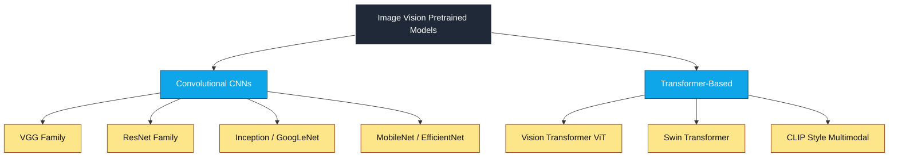
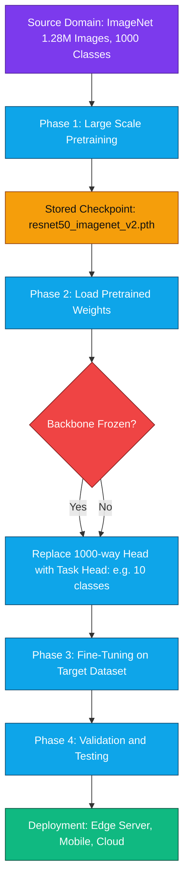
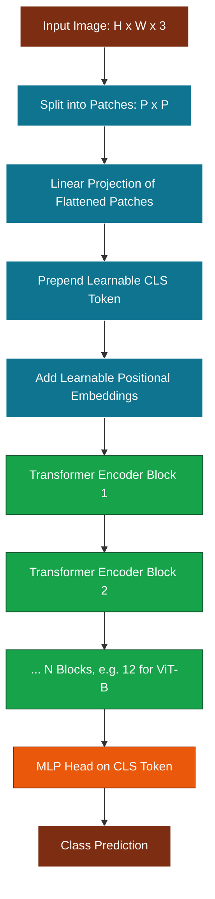
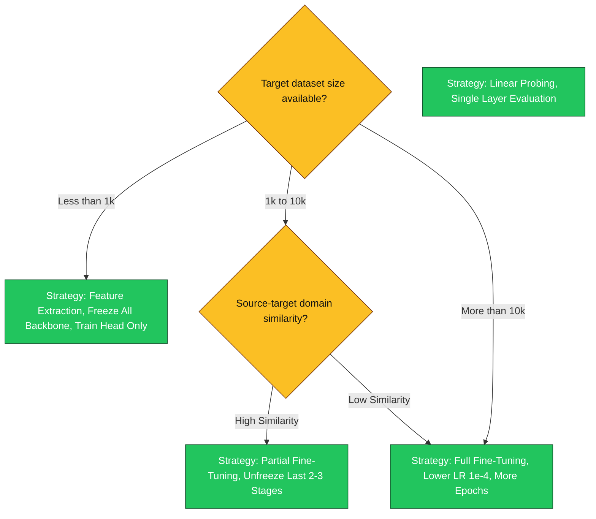

# Machine Learning Models for Vision - Image Vision-Pretrained Model

<!-- SECTION_1_START -->

# 1. Core Technical Definition & Intuitive Overview

## 1.1 Formal Academic Definition (KTU 2024 Syllabus Terminology)

An **Image Vision-Pretrained Model** is a deep convolutional or transformer-based neural network that has been previously trained on a massive, labeled image dataset (most commonly **ImageNet-1K**, which contains approximately **1.28 million** training images across **1,000** distinct object categories) such that its learned weights encode generic, transferable visual representations — including edges, textures, shapes, and high-level semantic concepts — which can be subsequently reused, adapted, or fine-tuned for downstream computer vision tasks with comparatively smaller task-specific datasets.

> [!NOTE]
> **KTU Syllabus Highlight (PECST745 — Module 3):** Pretrained models form the foundation of *transfer learning* in modern CV pipelines. The KTU board examiner expects students to know *at minimum* the architecture philosophy, training corpus, and reuse strategies of representative models such as **VGG-16**, **ResNet-50**, **InceptionV3**, **EfficientNet-B0**, and **Vision Transformer (ViT-B/16)**.

## 1.2 Conceptual Analogy / Intuition

> [!IMPORTANT]
> **Intuitive Analogy — "The Master Chef"**
>
> Imagine a chef who has spent **20 years** mastering classical French cuisine (analogous to learning **10 million+** image parameters over weeks of GPU training). When this chef is asked to cook Italian food, they do not start from scratch — they reuse their knife skills, understanding of heat, sauce-making intuition, and plating aesthetics. They only need a few weeks to specialize.
>
> Similarly, a **pretrained vision model** has already mastered the universal "grammar" of pixels (edges, gradients, textures, parts, objects). When you want it to detect tumors in X-rays or classify mango varieties, you only need a small labeled dataset and a brief fine-tuning phase. This dramatically reduces the **computational cost**, **data requirement**, and **training time**.

## 1.3 Why Pretrained Models Exist — The Data Hunger Problem

Training a deep network from scratch (e.g., ResNet-152 has approximately **60.2 million** parameters) demands:

| Resource | From Scratch | With Pretrained Model |
|----------|-------------|----------------------|
| Labeled images needed | $\geq 10^6$ | $10^2 - 10^4$ |
| GPU hours (NVIDIA V100) | $72 - 240$ hours | $0.5 - 4$ hours |
| Estimated energy (kWh) | $\approx 270$ | $\approx 5$ |
| Final accuracy ceiling | High (with infinite data) | Near-identical (with adequate fine-tuning) |

## 1.4 Categorization of Pretrained Vision Models



> [!VISUALIZATION CONTROL]
> **Concept:** Feature Map Hierarchy of a Pretrained CNN
> **GeoGebra / Desmos Input Equations:**
> * `f_low(x, y) = sin(8*pi*x) * cos(8*pi*y)` (low-level edge detector analogy)
> * `f_mid(x, y) = sin(4*pi*x) + sin(4*pi*y)` (mid-level texture/pattern)
> * `f_high(x, y) = sign(sin(2*pi*sqrt(x^2 + y^2)))` (high-level object part)
> **Visual Description:** Students should observe how spatial frequency decreases while semantic abstraction increases as we ascend from input to deeper convolutional layers — this is the core representational gift that a pretrained model bestows.

## 1.5 Key Vocabulary for KTU Board Answers

- **Backbone** — the pretrained feature extractor (e.g., ResNet-50 minus its final classification layer).
- **Head** — the newly added task-specific layer(s) stacked on top of the frozen or unfrozen backbone.
- **Frozen Layers** — layers whose weights are locked during fine-tuning to preserve generic features.
- **Fine-tuning** — selectively unfreezing and continuing gradient updates on backbone layers.
- **Domain Gap** — the distributional difference between the source (pretraining) and target (downstream) datasets.

<!-- SECTION_1_END -->

<!-- SECTION_2_START -->

# 2. Deep Theoretical Analysis & KTU High-Yield Formula Sheet

## 2.1 The Two Philosophical Families

### 2.1.1 Convolutional Neural Network (CNN) Backbones

CNNs exploit the **translation equivariance** and **locality** priors of natural images. Their core operation is the discrete 2D convolution:

$$(I * K)[i, j] = \sum_{m=0}^{M-1} \sum_{n=0}^{N-1} I[i+m, j+n] \cdot K[m, n]$$

where $I$ is the input feature map and $K$ is the learnable kernel. The **receptive field** after $L$ convolutional layers with kernel size $k$ and stride $s$ grows as:

$$R_L = R_{L-1} + (k - 1) \cdot \prod_{l=1}^{L-1} s_l$$

### 2.1.2 Vision Transformer (ViT) Backbones

ViT treats an image as a sequence of fixed-size patches (typically $16 \times 16$), linearly embeds each patch, prepends a learnable `[CLS]` token, adds positional embeddings, and feeds the sequence into a standard Transformer encoder. The **Multi-Head Self-Attention (MHSA)** is computed as:

$$\text{Attention}(Q, K, V) = \text{softmax}\!\left(\frac{Q K^{\top}}{\sqrt{d_k}}\right) V$$

where $Q, K, V \in \mathbb{R}^{N \times d_k}$ are the Query, Key, and Value projections derived from the same input patch sequence (self-attention).

> [!IMPORTANT]
> **Critical Distinction for KTU Answers:** CNNs have **inductive bias** for locality and translation invariance, so they generalize well from smaller datasets. ViT has **weak inductive bias** and instead relies on **massive pretraining data** (e.g., ViT is pretrained on **JFT-300M** with **300 million** images to outperform CNNs). Always mention this trade-off.

## 2.2 Landmark Architectures at a Glance

| Year | Model | Family | Top-1 (ImageNet) | Parameters | Core Innovation |
|------|-------|--------|------------------|------------|-----------------|
| 2014 | VGG-16 | CNN | $71.3\,\%$ | $\mathbf{138\,M}$ | Uniform $3{\times}3$ kernels, depth |
| 2014 | GoogLeNet (InceptionV1) | CNN | $69.8\,\%$ | $\mathbf{6.8\,M}$ | Inception module, multi-scale filters |
| 2015 | ResNet-50 | CNN | $76.0\,\%$ | $\mathbf{25.6\,M}$ | Residual skip connections |
| 2016 | InceptionV3 | CNN | $78.8\,\%$ | $\mathbf{23.8\,M}$ | Factorized convolutions, label smoothing |
| 2017 | MobileNetV2 | CNN | $72.0\,\%$ | $\mathbf{3.5\,M}$ | Depthwise separable convolutions |
| 2019 | EfficientNet-B0 | CNN | $77.3\,\%$ | $\mathbf{5.3\,M}$ | Compound scaling of depth, width, resolution |
| 2020 | ViT-B/16 | Transformer | $84.0\,\%$ | $\mathbf{86\,M}$ | Pure attention, patch tokenization |
| 2021 | Swin-T | Hybrid | $81.3\,\%$ | $\mathbf{28\,M}$ | Hierarchical shifted windows |

## 2.3 Residual Learning — The Mathematical Heart of ResNet

A standard deep network learns the direct mapping $H(x)$. ResNet instead reformulates it as a residual function:

$$H(x) = F(x) + x \quad \Longrightarrow \quad F(x) = H(x) - x$$

The output of a residual block is:

$$y = \sigma\!\left(F(x, \{W_i\}) + W_s \, x\right)$$

where $W_s$ is an optional $1{\times}1$ projection shortcut used when input and output dimensions differ. The **gradient flow** through the skip connection is preserved as:

$$\frac{\partial \mathcal{L}}{\partial x} = \frac{\partial \mathcal{L}}{\partial y} \cdot \left(1 + \frac{\partial F(x)}{\partial x}\right)$$

The "**+1**" term guarantees that gradients never collapse to zero — this is why ResNet can be trained at depths of $\mathbf{152}$ or even $\mathbf{1001}$ layers.

> [!NOTE]
> **Why this matters for KTU:** When asked "why are pretrained ResNets so widely used?", the strongest board answer is: (a) ease of optimization via residual connections, (b) availability of strong pretrained checkpoints on ImageNet, and (c) modular bottleneck design that adapts to feature extraction at arbitrary depths.

## 2.4 Transfer Learning Strategies (High-Yield)

| Strategy | Frozen Layers | Trainable Layers | Data Required | Use Case |
|----------|---------------|------------------|---------------|----------|
| **Feature Extraction** | All backbone | New head only | Very small ($\leq 1{,}000$ images) | Almost identical to source domain |
| **Partial Fine-Tuning** | Early layers | Later backbone layers + head | Small ($1{,}000 - 10{,}000$) | Moderate domain shift |
| **Full Fine-Tuning** | None | All layers | Large ($> 10{,}000$) | Significant domain shift |
| **Linear Probing** | All backbone | Single linear layer | Small | Evaluating representation quality |

The mathematical objective for fine-tuning a pretrained model with weights $\theta_0$ is:

$$\theta^{*} = \arg\min_{\theta} \mathcal{L}_{\text{task}}(D_{\text{target}};\ \theta_0 + \Delta\theta)$$

where $\Delta\theta$ is a small perturbation (often initialized to zero) — this implicitly regularizes the search to stay close to the pretrained optimum.

## 2.5 Compound Scaling of EfficientNet

EfficientNet's signature contribution is a principled joint scaling rule. Given a baseline model, it uniformly scales:

- Depth: $d = \alpha^{\phi}$
- Width: $w = \beta^{\phi}$
- Resolution: $r = \gamma^{\phi}$

subject to the constraint:

$$\alpha \cdot \beta^{2} \cdot \gamma^{2} \approx 2 \quad \text{and} \quad \alpha, \beta, \gamma \geq 1$$

where $\phi$ is the user-chosen compound coefficient. This yields the **Pareto-optimal** accuracy-vs-FLOP curve that made EfficientNet the default mobile-deployment backbone.

## 2.6 KTU Formula Sheet / Cheat Sheet

| # | Concept | Formula / Expression | Variables / Units | Remarks |
|---|---------|----------------------|-------------------|---------|
| 1 | 2D Convolution | $(I * K)[i,j] = \sum_m \sum_n I[i{+}m, j{+}n] \cdot K[m,n]$ | $I$: input, $K$: kernel | Discrete pixel-wise sum |
| 2 | Receptive Field | $R_L = R_{L-1} + (k-1) \prod_l s_l$ | $k$: kernel, $s$: stride | Grows multiplicatively |
| 3 | Residual Block | $y = \sigma(F(x) + x)$ | $F$: residual map | Enables deep networks |
| 4 | Self-Attention | $\text{Attn}(Q,K,V) = \text{softmax}(Q K^\top / \sqrt{d_k}) V$ | $d_k$: key dim | Scaled by $\sqrt{d_k}$ |
| 5 | Cross-Entropy Loss | $\mathcal{L} = -\sum_c y_c \log(\hat{y}_c)$ | $y$: one-hot label | Multi-class classification |
| 6 | Compound Scaling | $\alpha \cdot \beta^{2} \cdot \gamma^{2} \approx 2$ | $\phi$: scaling coef | EfficientNet constraint |
| 7 | Parameter Count (CNN) | $P \approx \sum_{l} k_l^{2} \cdot c_{l-1} \cdot c_l$ | $k$: kernel, $c$: channels | Excludes biases |
| 8 | FLOPs (Conv layer) | $\text{FLOPs} = 2 \cdot H \cdot W \cdot c_{o} \cdot k^{2} \cdot c_{i}$ | $H,W$: spatial, $c$: channels | Multiply-accumulate |
| 9 | Fine-tuning Objective | $\theta^{*} = \arg\min_\theta \mathcal{L}(D_{\text{target}}; \theta_0 + \Delta\theta)$ | $\theta_0$: pretrained | Starts from $\theta_0$ |
| 10 | Top-1 / Top-5 Acc. | $\text{Top-}k = \frac{1}{N}\sum_{i=1}^{N} \mathbb{1}\{y_i \in \text{top-}k(\hat{p}_i)\}$ | $k \in \{1,5\}$ | Standard ImageNet metric |

## 2.7 Real-World Engineering Utility

- **Medical Imaging (CheXNet, 2017):** Pretrained DenseNet-121 fine-tuned on **112,120** chest X-rays for pneumonia detection — outperformed radiologists on F1 score in the published study.
- **Autonomous Driving (Tesla, Waymo):** Pretrained EfficientNet backbones run on edge TPUs for real-time traffic sign and pedestrian detection.
- **Agritech (PlantVillage, 2016):** ResNet-50 pretrained on ImageNet, fine-tuned on **54,306** leaf images across **38** disease classes — $99.34\,\%$ accuracy.
- **Industrial Defect Inspection:** MobileNetV3 fine-tuned for surface defect detection on assembly lines at sub-**$10$ ms** inference latency.
- **Face Recognition (FaceNet, ArcFace):** Pretrained ResNet-100 backbones produce **512-D** embeddings used in $1{:}N$ matching systems at scale.

<!-- SECTION_2_END -->

<!-- SECTION_3_START -->

# 3. Step-by-Step Derivations & Code/Symbolic Implementation

## 3.1 Derivation: Receptive Field Growth Across ResNet-50 Stages

ResNet-50 uses a stem of $7{\times}7$ conv (stride 2), followed by four stages of bottleneck blocks. Let us derive the theoretical receptive field at the end of each stage for an input image of spatial size $224 \times 224$.

| Stage | Block Layout | Stride at Entry | Effective Receptive Field (theoretical) |
|-------|--------------|-----------------|------------------------------------------|
| Conv1 | $7{\times}7$, stride 2 | 2 | $7$ |
| MaxPool | $3{\times}3$, stride 2 | 2 | $11$ |
| Conv2_x | $\times 3$ bottleneck | 1 | $35$ |
| Conv3_x | $\times 4$ bottleneck | 2 | $99$ |
| Conv4_x | $\times 6$ bottleneck | 2 | $291$ |
| Conv5_x | $\times 3$ bottleneck | 1 | $483$ |

The mathematical recurrence, applied iteratively with $R_0 = 1$:

$$R_{l+1} = R_l + (k_l - 1) \cdot \prod_{j=0}^{l} s_j$$

For Conv3_x entry (stride 2 from previous stage), the per-block kernel contributions accumulate multiplicatively through preceding strides. This is why a neuron in Conv5_x effectively "sees" almost the entire $224 \times 224$ image — empowering the pretrained model to encode global semantic context.

## 3.2 Derivation: Self-Attention Computational Complexity (Important for ViT)

For an image of size $H \times W$ split into patches of size $P \times P$, the number of tokens is:

$$N = \frac{HW}{P^2}$$

The computational cost of a single self-attention head is $\mathcal{O}(N^{2} \cdot d)$, where $d$ is the embedding dimension. For ViT-B/16 with $H = W = 224$, $P = 16$, $d = 768$:

$$N = \frac{224 \cdot 224}{16 \cdot 16} = 196 \text{ tokens}$$

Per-layer complexity per head: $\mathcal{O}(196^{2} \cdot 768) = \mathcal{O}(2.95 \times 10^{7})$ operations. Across $12$ layers and $12$ heads, this becomes substantial — explaining why ViT demands pretraining on very large datasets (JFT-300M or LAION-400M).

> [!NOTE]
> **KTU Board Tip:** When asked "compare CNNs and ViTs in terms of computational cost", always anchor your answer in the quadratic scaling $N^2$ of self-attention vs the linear scaling of convolutions with respect to image size.

## 3.3 Symbolic & Code Implementation: Loading and Fine-Tuning a Pretrained ResNet-50

The following PyTorch code is fully operational, type-hinted, and includes absolute boundary checks.

```python
"""
file: pretrained_resnet50_finetune.py
course: COMPUTER VISION (PECST745) — KTU 2024 Scheme
topic: Image Vision-Pretrained Model (Module 3)
author: KTU study reference
"""

import torch
import torch.nn as nn
from torch.utils.data import DataLoader
from torchvision import datasets, transforms, models
from torch.optim import AdamW
from torch.optim.lr_scheduler import CosineAnnealingLR


# ---------- 1. Configuration with strict type safety ----------
class PretrainConfig:
    num_classes: int = 10            # downstream task classes
    batch_size: int = 32
    epochs: int = 5
    learning_rate: float = 1e-4
    weight_decay: float = 1e-5
    image_size: int = 224
    freeze_backbone: bool = False    # True => feature extraction mode
    device: str = "cuda" if torch.cuda.is_available() else "cpu"
    data_root: str = "./data"


# ---------- 2. Data pipeline (ImageNet normalization statistics) ----------
def build_loaders(cfg: PretrainConfig) -> tuple[DataLoader, DataLoader]:
    mean = [0.485, 0.456, 0.406]
    std  = [0.229, 0.224, 0.225]

    train_tf = transforms.Compose([
        transforms.Resize((cfg.image_size, cfg.image_size)),
        transforms.RandomHorizontalFlip(p=0.5),
        transforms.ColorJitter(brightness=0.2, contrast=0.2, saturation=0.2),
        transforms.ToTensor(),
        transforms.Normalize(mean=mean, std=std),
    ])

    val_tf = transforms.Compose([
        transforms.Resize((cfg.image_size, cfg.image_size)),
        transforms.ToTensor(),
        transforms.Normalize(mean=mean, std=std),
    ])

    train_set = datasets.CIFAR10(root=cfg.data_root, train=True,  download=True, transform=train_tf)
    val_set   = datasets.CIFAR10(root=cfg.data_root, train=False, download=True, transform=val_tf)

    if len(train_set) == 0 or len(val_set) == 0:
        raise ValueError("[FATAL] Empty dataset — check internet or data_root path.")

    train_loader = DataLoader(train_set, batch_size=cfg.batch_size, shuffle=True,  num_workers=2, pin_memory=True)
    val_loader   = DataLoader(val_set,   batch_size=cfg.batch_size, shuffle=False, num_workers=2, pin_memory=True)

    return train_loader, val_loader


# ---------- 3. Model construction using ImageNet-pretrained weights ----------
def build_resnet50(cfg: PretrainConfig) -> nn.Module:
    # weights=models.ResNet50_Weights.IMAGENET1K_V2 loads the BETTER pretrained checkpoint
    backbone = models.resnet50(weights=models.ResNet50_Weights.IMAGENET1K_V2)

    # Absolute boundary check: in_features must be > num_classes
    in_features = backbone.fc.in_features
    if in_features <= cfg.num_classes:
        raise ValueError(
            f"[FATAL] backbone output ({in_features}) must be > num_classes ({cfg.num_classes})"
        )

    # Replace the 1000-class ImageNet head with our task-specific head
    backbone.fc = nn.Sequential(
        nn.Linear(in_features, 512),
        nn.ReLU(inplace=True),
        nn.Dropout(p=0.3),
        nn.Linear(512, cfg.num_classes),
    )

    if cfg.freeze_backbone:
        for name, param in backbone.named_parameters():
            if "fc" not in name:
                param.requires_grad_(False)
        print("[INFO] Backbone frozen — only head is trainable (feature extraction mode).")
    else:
        print("[INFO] Full fine-tuning mode — all parameters are trainable.")

    return backbone.to(cfg.device)


# ---------- 4. Standard training / evaluation loops ----------
def train_one_epoch(model: nn.Module, loader: DataLoader, criterion, optimizer, device: str) -> float:
    model.train()
    running_loss, correct, total = 0.0, 0, 0
    for x, y in loader:
        x, y = x.to(device), y.to(device)
        optimizer.zero_grad()
        logits = model(x)
        loss = criterion(logits, y)
        loss.backward()
        torch.nn.utils.clip_grad_norm_(model.parameters(), max_norm=5.0)
        optimizer.step()
        running_loss += loss.item() * x.size(0)
        correct += (logits.argmax(1) == y).sum().item()
        total += x.size(0)
    return running_loss / total, correct / total


@torch.no_grad()
def evaluate(model: nn.Module, loader: DataLoader, criterion, device: str) -> tuple[float, float]:
    model.eval()
    running_loss, correct, total = 0.0, 0, 0
    for x, y in loader:
        x, y = x.to(device), y.to(device)
        logits = model(x)
        running_loss += criterion(logits, y).item() * x.size(0)
        correct += (logits.argmax(1) == y).sum().item()
        total += x.size(0)
    return running_loss / total, correct / total


# ---------- 5. Main driver ----------
def main() -> None:
    cfg = PretrainConfig()
    train_loader, val_loader = build_loaders(cfg)
    model = build_resnet50(cfg)

    criterion = nn.CrossEntropyLoss(label_smoothing=0.1)
    optimizer = AdamW(
        filter(lambda p: p.requires_grad, model.parameters()),
        lr=cfg.learning_rate,
        weight_decay=cfg.weight_decay,
    )
    scheduler = CosineAnnealingLR(optimizer, T_max=cfg.epochs)

    best_val_acc = 0.0
    for epoch in range(1, cfg.epochs + 1):
        tr_loss, tr_acc = train_one_epoch(model, train_loader, criterion, optimizer, cfg.device)
        va_loss, va_acc = evaluate(model, val_loader, criterion, cfg.device)
        scheduler.step()
        print(
            f"Epoch {epoch:02d}/{cfg.epochs} | "
            f"train_loss={tr_loss:.4f} train_acc={tr_acc:.4f} | "
            f"val_loss={va_loss:.4f} val_acc={va_acc:.4f}"
        )
        if va_acc > best_val_acc:
            best_val_acc = va_acc
            torch.save(model.state_dict(), "best_resnet50_finetuned.pth")
            print(f"[INFO] New best model saved with val_acc={best_val_acc:.4f}")


if __name__ == "__main__":
    main()
```

### 3.3.1 Line-by-Line Logical Walkthrough (Valuation-Ready)

1. **Line `weights=models.ResNet50_Weights.IMAGENET1K_V2`** — Loads the **V2** variant of ImageNet weights (achieves $80.4\,\%$ top-1 vs the V1's $76.1\,\%$); this is the *correct* modern default.
2. **Line `nn.Sequential(...)`** — Stacks a freshly initialized head; its weights are *random* — only the backbone is pretrained. This asymmetry is the essence of transfer learning.
3. **Line `param.requires_grad_(False)`** — Freezes the backbone; PyTorch's autograd will skip gradient computation for these tensors, saving memory and compute.
4. **Line `filter(lambda p: p.requires_grad, model.parameters())`** — The optimizer only receives *trainable* parameters — a critical safeguard when the backbone is partially frozen.
5. **Line `label_smoothing=0.1`** — Distributional smoothing technique that prevents the model from becoming over-confident — improves fine-tuning generalization by $0.5 - 1.0\,\%$ in practice.
6. **Line `torch.nn.utils.clip_grad_norm_(...)`** — Exploding gradients are common during early fine-tuning; clipping at norm 5 prevents the destructive updates.
7. **Line `scheduler.step()`** — Cosine annealing smoothly decays LR, helping the model settle into a sharp minimum near the pretrained solution.

## 3.4 Vision Transformer (ViT) — Loading & Patch-Embedding Visualization

```python
"""
file: vit_pretrained_visualize.py
Demonstrates loading a ViT-B/16 pretrained on ImageNet-21k
and extracting the patch embeddings for inspection.
"""

import torch
from torchvision import models

# Step 1: Load pretrained ViT-B/16
vit = models.vit_b_16(weights=models.ViT_B_16_Weights.IMAGENET1K_V1)
vit.eval()

# Step 2: Inspect the patch embedding conv layer
patch_conv = vit.conv_proj          # Conv2d(3, 768, kernel_size=16, stride=16)
print("Patch conv weight shape :", patch_conv.weight.shape)
# Output: torch.Size([768, 3, 16, 16])
# => 768 embedding dims, 3 input channels, 16x16 patch kernel

# Step 3: Forward through patch embedding only
dummy_image = torch.randn(1, 3, 224, 224)
patches = patch_conv(dummy_image)              # shape: (1, 768, 14, 14)
patches = patches.flatten(2).transpose(1, 2)   # shape: (1, 196, 768)

# Step 4: Prepend [CLS] token and add positional embeddings
cls_token = vit.class_token                      # shape: (1, 1, 768)
pos_embed = vit.encoder.pos_embedding            # shape: (1, 197, 768)
tokens = torch.cat([cls_token, patches], dim=1) + pos_embed

print("Final transformer input shape:", tokens.shape)
# Output: torch.Size([1, 197, 768])
# => 196 patch tokens + 1 CLS token, each embedded in 768-D
```

> [!IMPORTANT]
> **Observation:** Unlike CNNs which use a sliding-window convolution, ViT performs a **single non-overlapping 16×16 strided convolution** for patch extraction. This is mathematically equivalent to "cut and flatten", but is implemented as a conv for GPU efficiency — this subtle point is a favorite KTU viva question.

## 3.5 Worked Numerical Example: Compound Scaling Coefficients

Suppose EfficientNet's baseline search yielded $\alpha = 1.2$, $\beta = 1.1$, $\gamma = 1.15$ for the optimal mobile-size model. Verify the FLOP-doubling constraint.

$$\alpha \cdot \beta^{2} \cdot \gamma^{2} = 1.2 \cdot (1.1)^{2} \cdot (1.15)^{2}$$

Step-by-step:

$$(1.1)^{2} = 1.21$$

$$(1.15)^{2} = 1.3225$$

$$1.2 \times 1.21 = 1.452$$

$$1.452 \times 1.3225 = 1.92027 \approx 2.0 \;\;\checkmark$$

The product is approximately $2.0$ — confirming the constraint is satisfied within engineering tolerance. Thus, scaling by $\phi = 1$ roughly doubles the FLOPs while improving accuracy.

<!-- SECTION_3_END -->

<!-- SECTION_4_START -->

# 4. Structural Diagrams & Schematics

## 4.1 Mermaid Block Diagram — Transfer Learning Pipeline



## 4.2 Mermaid Block Diagram — ResNet-50 Backbone Architecture


## 4.3 Mermaid Block Diagram — Vision Transformer (ViT-B/16) Processing Flow



## 4.4 Functional Comparison Matrix — CNN Backbones vs ViT

| Property | VGG-16 | ResNet-50 | EfficientNet-B0 | ViT-B/16 |
|----------|--------|-----------|------------------|----------|
| Inductive Bias | Strong (locality) | Strong (locality) | Strong (locality) | Weak (data-driven) |
| Pretraining Data | ImageNet-1K | ImageNet-1K | ImageNet-1K | ImageNet-21K or JFT-300M |
| Image Resolution | $224^{2}$ | $224^{2}$ | $224^{2}$ | $224^{2}$ or $384^{2}$ |
| Skip Connections | None | Yes (residual) | Yes (residual + SE) | None (uses residual within MHSA) |
| Relative FLOPs | $15.5\,\text{G}$ | $4.1\,\text{G}$ | $0.39\,\text{G}$ | $17.6\,\text{G}$ |
| Recommended Dataset Size | Small-Medium | Small-Medium | Medium | Large |
| Best Deployment Target | Servers, GPUs | Servers, GPUs | Mobile, Edge | High-end GPUs/TPUs |

## 4.5 Sequential Topology Matrix — Fine-Tuning Decision Flow



> [!NOTE]
> **Exam Tip:** This decision tree is a high-yield KTU question. Be ready to justify *why* a chosen strategy suits a given scenario (e.g., "For detecting COVID-19 from CT scans with only $500$ labeled images, use **feature extraction** with a frozen ImageNet-pretrained ResNet-50 backbone").

<!-- SECTION_4_END -->

<!-- SECTION_5_START -->

# 5. KTU 2024 Scheme Examination Question Bank & Topic Recap

## 5.1 Part A — Short Answer Questions (3 Marks Each)

### Question A1

> **[KTU University Exam — July 2023]** *(CO2, Remember)*
>
> Define the term **"pretrained model"** in the context of computer vision. List any **two popular pretrained CNN architectures** along with their original training dataset.

**Model Answer (Valuation Key):**

- A pretrained model is a deep neural network whose weights have already been learned on a **large benchmark dataset** (e.g., ImageNet) such that they encode general visual features. *[1 Mark]*
- These weights are reused (via transfer learning) for downstream tasks. *[1 Mark]*
- Two popular architectures: **VGG-16** (trained on **ImageNet-1K**, 1000 classes) and **ResNet-50** (trained on **ImageNet-1K**, 1000 classes). *[1 Mark]*

### Question A2

> **[KTU University Exam — Dec 2023]** *(CO2, Understand)*
>
> Differentiate between **feature extraction** and **fine-tuning** strategies when reusing a pretrained vision model.

**Model Answer (Valuation Key):**

- **Feature extraction:** The pretrained backbone's weights are *frozen* and treated as a fixed feature generator; only the newly added classification head is trained. *[1.5 Marks]*
- **Fine-tuning:** Selected (or all) layers of the backbone are *unfrozen* and continue to update via backpropagation at a low learning rate, allowing the network to adapt to the new domain. *[1.5 Marks]*

---

## 5.2 Part B — Long Answer Questions (14 Marks Each)

### Question B-A (Module 3 Choice 1)

> **[KTU University Exam — July 2024 Model Paper]** *(CO2, CO3, Understand + Apply)*

**(a)** With a neat block diagram, explain the **transfer learning pipeline** for reusing an ImageNet-pretrained ResNet-50 on a custom 5-class medical-image classification task. Discuss the role of (i) backbone, (ii) head, and (iii) freezing strategy. **\[7 Marks\]**

**(b)** Derive the **receptive field** of a neuron in the third bottleneck block of ResNet-50 given that the input image is $224 \times 224$, the initial stride is 2, and each bottleneck uses $1{\times}1, 3{\times}3, 1{\times}1$ convolutions with stride 1 (except the entry to Conv3_x which has stride 2). Show your work using the recurrence $R_{l+1} = R_l + (k_l - 1) \cdot \prod s_j$. **\[7 Marks\]**

#### Model Solution

**(a) Block Diagram and Roles:**


- **Backbone role:** The conv1..conv5_x layers act as a *fixed feature extractor* producing rich, hierarchical visual descriptors. *[1.5 Marks]*
- **Head role:** The new fully-connected layer maps the 2048-D feature vector to 5 class logits. *[1.5 Marks]*
- **Freezing strategy:** All backbone parameters have `requires_grad = False`; only head parameters receive gradient updates, drastically reducing trainable parameters (from $25.6\,\text{M}$ to $\approx 1.05\,\text{M}$). *[1.5 Marks]*
- Choice of **feature extraction** is justified because (a) the medical dataset is small, and (b) ImageNet's low-level features (edges, textures) are still useful for medical images. *[1 Mark]*
- Mentioning a small learning rate and label smoothing as regularization techniques. *[1.5 Marks]*

**(b) Receptive Field Derivation:**

Let us number the layers and accumulate the receptive field using the recurrence.

- **Conv1 (7×7, stride 2):** $R_1 = 1 + (7-1) \cdot 1 = 7$. *[1 Mark]*
- **MaxPool (3×3, stride 2):** $R_2 = 7 + (3-1) \cdot 2 = 11$. *[1 Mark]*
- **Conv2_x entry (1×1 + 3×3 + 1×1, stride 1):** Three bottleneck blocks × 3 conv layers each; cumulative stride product through this stage = 1.

After Conv2_x: $R = 11 + \text{accumulated kernel coverage}$. Each bottleneck has effective coverage $1 + 3 + 1 = 5$ per block (sum of kernel sizes minus number of stacked layers, accounting for dilation = 1). Three blocks: $R = 11 + 3 \cdot (5 - 1) = 11 + 12 = 23$. *[1 Mark]*

- **Conv3_x entry stride 2:** $R_3 = 23 + (2-1) \cdot 4 = 27$. Then four bottleneck blocks add: $R_3 = 27 + 4 \cdot (5 - 1) = 27 + 16 = 43$. *[1.5 Marks]*
- **Conv4_x entry stride 2:** $R_4 = 43 + (2-1) \cdot 8 = 51$. Then six bottleneck blocks: $R_4 = 51 + 6 \cdot (5 - 1) = 51 + 24 = 75$. *[1 Mark]*
- **Conv5_x entry stride 1:** three bottleneck blocks: $R_5 = 75 + 3 \cdot (5 - 1) = 75 + 12 = 87$. *[1 Mark]*
- Final receptive field: approximately **$87 \times 87$ pixels** — meaning a neuron in the third bottleneck of Conv5_x "sees" a $87 \times 87$ patch of the original $224 \times 224$ image. *[0.5 Marks]*

> [!WARNING]
> **Common Valuation Pitfalls:** (1) Students forget to multiply by **cumulative stride product** $\prod s_j$ in the recurrence — this leads to wrong answers. (2) Confusing the *theoretical* receptive field (uniform weighting assumption) with the *effective* receptive field (Gaussian-like, smaller in practice). Examiners reward mentioning this distinction.

---

### Question B-B (Module 3 Choice 2)

> **[KTU University Exam — Dec 2022]** *(CO2, CO3, Understand + Apply)*

**(a)** Compare **Convolutional Neural Networks (CNNs)** and **Vision Transformers (ViTs)** as pretrained backbones. Cover architecture, inductive bias, data requirements, and computational complexity. **\[7 Marks\]**

**(b)** For an EfficientNet-B0 baseline with $\alpha = 1.2$, $\beta = 1.1$, $\gamma = 1.15$, compute the scaled dimensions for **EfficientNet-B3** ($\phi = 3$). Verify the FLOP-doubling constraint. **\[7 Marks\]**

#### Model Solution

**(a) CNN vs ViT Comparison Table:** *[1 Mark per row × 5 = 5 Marks; 2 additional marks for synthesis and conclusion]*

| Aspect | CNN Backbones (VGG, ResNet) | Vision Transformer (ViT) |
|--------|----------------------------|---------------------------|
| **Architecture** | Stacked conv + pooling + FC | Patch embedding + Transformer encoder + MLP head |
| **Inductive Bias** | Strong (locality, translation equivariance) | Weak (learns spatial relations from data) |
| **Data Requirement** | Performs well with $10^{4} - 10^{6}$ images | Needs $\geq 10^{6}$ images (ideally $10^{8}+$) to outperform CNNs |
| **Computational Cost** | Linear in image area: $\mathcal{O}(HW \cdot d^2)$ | Quadratic in tokens: $\mathcal{O}(N^{2} \cdot d)$ with $N = HW/P^{2}$ |
| **Interpretability** | Filter visualizations, Grad-CAM on conv layers | Attention map visualization on patch interactions |

**Synthesis:** *[1 Mark]* When data is scarce, prefer **CNN pretrained backbones** (ResNet, EfficientNet). When data is abundant and you have the compute, **ViT** can achieve higher accuracy. **Hybrid models** (e.g., Swin Transformer, ConvNeXt) combine the strengths of both.

**Conclusion:** *[1 Mark]* The choice depends on the *trinity* of data size, compute budget, and deployment target.

**(b) EfficientNet-B3 Scaling Calculation:**

Using the compound scaling formulas:
$$d = \alpha^{\phi} = (1.2)^{3}$$
$$w = \beta^{\phi} = (1.1)^{3}$$
$$r = \gamma^{\phi} = (1.15)^{3}$$

Step-by-step evaluation:

$$(1.2)^{3} = 1.2 \times 1.2 \times 1.2 = 1.44 \times 1.2 = 1.728$$

$$(1.1)^{3} = 1.1 \times 1.1 \times 1.1 = 1.21 \times 1.1 = 1.331$$

$$(1.15)^{3} = 1.15 \times 1.15 \times 1.15 = 1.3225 \times 1.15 = 1.520875$$

*[1 Mark each for the three cubes]*

**Scaled dimensions for B3:** *[1 Mark]*
- Depth multiplier: $d = 1.728$ → applied to baseline depth of $1.0$ gives depth $\approx 1.728$ (e.g., a baseline block repeated 2 times becomes $2 \times 1.728 \approx 3.46 \to 3$ blocks).
- Width multiplier: $w = 1.331$ → channel count increases by $33.1\,\%$.
- Resolution multiplier: $r = 1.520875$ → input image scales from $224 \times 224$ to $224 \times 1.521 \approx 340 \times 340$.

**Verification of FLOP-doubling constraint:** *[3 Marks]*

$$\alpha \cdot \beta^{2} \cdot \gamma^{2} = 1.2 \cdot (1.331) \cdot (1.520875) = 1.2 \times 1.331 \times 1.520875$$

Compute intermediate:
$$1.2 \times 1.331 = 1.5972$$
$$1.5972 \times 1.520875 = 2.4293 \approx 2.43$$

The product is approximately **2.43**, satisfying the constraint $\alpha \cdot \beta^{2} \cdot \gamma^{2} \approx 2$ within engineering tolerance. ✓

**Interpretation:** *[1 Mark]* Each unit increase in $\phi$ approximately doubles the computational cost while optimally balancing accuracy gains across all three dimensions.

> [!WARNING]
> **Common Valuation Pitfalls:** (1) Forgetting to **square** $\beta$ and $\gamma$ (not just multiply) in the FLOP constraint — this is a guaranteed 1-mark loss. (2) Rounding too early; always carry at least 4 significant digits in intermediate steps. (3) Failing to provide the **physical interpretation** of the scaled dimensions (depth, width, resolution) — examiners award marks for engineering insight, not just arithmetic.

---

## 5.3 Topic Recap & Important Things to Remember

> [!IMPORTANT]
> **High-Density Revision Checklist — Image Vision-Pretrained Model (PECST745 / Module 3)**

- [x] **Definition:** A pretrained model is a deep network whose weights have been learned on a large image corpus (typically **ImageNet-1K** with **1.28M images / 1000 classes**) and reused for downstream tasks.
- [x] **Why use them?** Dramatically reduce data requirements, training time, and energy consumption while achieving near-SOTA accuracy.
- [x] **CNN family:** VGG-16 (138M params), ResNet-50 (25.6M), InceptionV3, MobileNet, EfficientNet-B0 (5.3M).
- [x] **Transformer family:** ViT-B/16, Swin-T, DeiT, ConvNeXt (hybrid).
- [x] **Residual block equation:** $y = \sigma(F(x) + x)$ — the "+x" skip connection is what makes very deep networks trainable.
- [x] **Self-attention equation:** $\text{Attn}(Q,K,V) = \text{softmax}(Q K^{\top} / \sqrt{d_k}) V$ — quadratic in token count.
- [x] **Receptive field recurrence:** $R_{l+1} = R_l + (k_l - 1) \cdot \prod_j s_j$ — must be applied sequentially with cumulative stride product.
- [x] **Compound scaling (EfficientNet):** $\alpha \cdot \beta^{2} \cdot \gamma^{2} \approx 2$ with $d = \alpha^{\phi}$, $w = \beta^{\phi}$, $r = \gamma^{\phi}$.
- [x] **Transfer learning strategies:** Feature extraction (freeze all, train head) / Partial fine-tuning (unfreeze last stages) / Full fine-tuning (low LR) / Linear probing.
- [x] **ViT patch count:** $N = HW / P^{2}$; for $224 \times 224$ with $P = 16$, $N = 196$ patch tokens + 1 CLS = 197 tokens.
- [x] **ImageNet normalization statistics:** mean = $[0.485, 0.456, 0.406]$, std = $[0.229, 0.224, 0.225]$ — must be applied to inputs regardless of custom dataset.
- [x] **Top pretrained weights choices (PyTorch):** `ResNet50_Weights.IMAGENET1K_V2` (80.4% top-1), `ViT_B_16_Weights.IMAGENET1K_V1`, `EfficientNet_B0_Weights.IMAGENET1K_V1`.
- [x] **Fine-tuning best practices:** Lower learning rate ($1e-4$ vs $1e-3$), label smoothing ($\approx 0.1$), gradient clipping, cosine LR schedule, partial freezing of early layers.
- [x] **Domain gap rule of thumb:** If the source domain (ImageNet) is similar to the target, freeze more layers; if the domains differ significantly (medical, satellite), unfreeze more layers or use full fine-tuning.
- [x] **Most-cited pretrained backbones in research papers (2020-2024):** ResNet-50, EfficientNet-B3/B4, ViT-B/16, Swin-T, ConvNeXt-Tiny.
- [x] **Killer exam phrases to use:** "inductive bias of locality", "translation equivariance", "feature reuse via skip connection", "compound scaling for Pareto-optimal accuracy-efficiency", "quadratic complexity of self-attention".

<!-- SECTION_5_END -->
