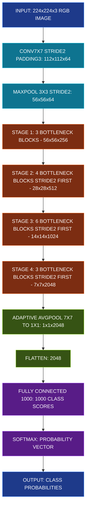
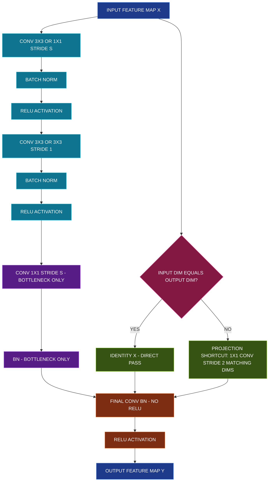
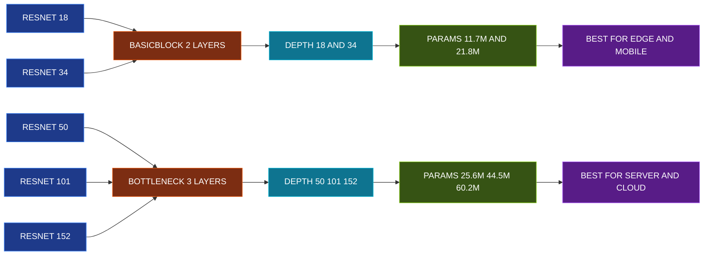

# Modular architecture - ResNet

<!-- SECTION_1_START -->

# Modular Architecture: ResNet (Residual Networks)

## 1. Core Technical Definition

> [!IMPORTANT]
> **Formal Definition (KTU 2024 Syllabus Alignment):**
> **ResNet (Residual Network)** is a deep convolutional neural network architecture introduced by *Kaiming He, Xiangyu Zhang, Shaoqing Ren, and Jian Sun* (Microsoft Research, 2015) that introduced the concept of **residual learning** through **identity skip connections** (also called *shortcut connections*). It reformulates the layer mapping as $H(x) = F(x) + x$, where $F(x)$ is the residual function learned by stacked convolutional layers, and $x$ is the identity mapping bypassed from an earlier layer.

The seminal paper *"Deep Residual Learning for Image Recognition"* (CVPR 2016, **cited > 200,000 times**) achieved a **3.57% top-5 error** on the **ImageNet Large Scale Visual Recognition Challenge (ILSVRC 2015)** classification task, surpassing human-level performance (**~5%**) for the first time.

### Conceptual Analogy / Intuition

> [!NOTE]
> **Intuitive Analogy: The "Skip-the-Hard-Parts" Expressway**
>
> Imagine you are a student preparing for a semester exam with **150 chapters**. Traditional deep networks (VGG, AlexNet) force you to read **every single chapter sequentially** from Chapter 1 to Chapter 150. As the network deepens, the "learning signal" (gradient) gets weaker and weaker — by Chapter 150, you've almost forgotten Chapter 1! This is the **vanishing gradient problem**.
>
> **ResNet's brilliant insight:** Build an *expressway (skip connection)* from Chapter 1 directly to Chapter 150. The student only needs to learn the *difference* (residual) between what they already know and what they need to know. If a chapter is unimportant, they can simply take the expressway and add nothing — equivalent to learning the identity function effortlessly.

> [!TIP]
> **Key Insight (KTU Board Favorite):**
> ResNet does **NOT** make it easy to learn the identity mapping $H(x) = x$ in a plain deep network. It **reformulates** it as $H(x) = F(x) + x$, where pushing $F(x) \to 0$ is far easier for a stack of nonlinear layers to approximate.

### Physical Constants and Standard Metrics

| Parameter | Value | Significance |
|---|---|---|
| **ImageNet Top-5 Error** | **3.57%** | Beats human baseline (~5.1%) |
| **ResNet-152 Layers** | **152** | 8x deeper than VGG-19, yet lower complexity |
| **VGG-19 Parameters** | **144 million** | Baseline complexity |
| **ResNet-152 Parameters** | **60.2 million** | Lower complexity despite more depth |
| **VGG-19 FLOPs** | **19.6 billion** | Forward pass cost |
| **ResNet-152 FLOPs** | **11.3 billion** | More efficient |

> [!VISUALIZATION CONTROL]
> **Concept:** Visualizing Identity vs. Residual Mapping
> **GeoGebra / Desmos Input Equations:**
>
> * Identity (Plain Network): `f(x) = x`
> * Residual Mapping: `g(x) = F(x) + x`, where `F(x) = 0.1 * sin(3x) - 0.05 * x^2`
> * Plain Network Approximation Attempt: `h(x) = (1 - 0.001) * x + noise` (shows how plain nets struggle to preserve identity)
>
> **Visual Description:** Plot $x$ on the horizontal axis and the output on the vertical axis. The line $f(x) = x$ is a 45-degree straight line. The residual mapping $g(x)$ will be very close to the identity line but with small perturbations. Notice that learning the small perturbation (residual) is much easier for an optimizer than reconstructing the entire identity line through nonlinear layers.

<!-- SECTION_1_END -->

<!-- SECTION_2_START -->

# 2. Deep Theoretical Analysis & KTU High-Yield Formula Sheet

## 2.1 The Vanishing Gradient Problem — *The "Why" Behind ResNet*

In a plain (unresidual) deep network with $L$ layers, the gradient of the loss $\mathcal{L}$ with respect to an early layer's weights $W_l$ involves **chained multiplication** of all subsequent layer Jacobians:

$$
\frac{\partial \mathcal{L}}{\partial W_l} = \frac{\partial \mathcal{L}}{\partial x_L} \cdot \prod_{i=l}^{L-1} \frac{\partial x_{i+1}}{\partial x_i}
$$

> [!WARNING]
> **Critical Failure Mode:** If any Jacobian term $\frac{\partial x_{i+1}}{\partial x_i}$ has magnitude **< 1** (common with saturating activations like sigmoid/tanh), the product **exponentially shrinks** as depth grows. The early layers receive a near-zero gradient and **stop learning** — a phenomenon called **vanishing gradient**.

## 2.2 The Residual Block — Operational Breakdown

A **residual block** consists of two parallel paths:

1. **Residual path (main path):** Two or three convolutional layers with Batch Normalization (BN) and ReLU activations, learning the residual function $F(x, \{W_i\})$.
2. **Shortcut (skip) path:** An identity mapping that simply passes $x$ forward unchanged (when input/output dimensions match).

### Mathematical Formulation

For a block with two convolutional layers (BasicBlock used in ResNet-18/34):

$$
F(x) = W_2 \cdot \sigma\left( \text{BN}\left( W_1 \cdot \sigma\left( \text{BN}(x) \right) \right) \right)
$$

$$
y = \sigma\left( \text{BN}(F(x)) + x \right)
$$

Where:
* $x$ is the input feature map
* $W_1, W_2$ are learnable weight matrices of the two conv layers
* $\sigma$ denotes the **ReLU activation function**: $\sigma(z) = \max(0, z)$
* $y$ is the block output

For a block with three convolutional layers (Bottleneck used in ResNet-50/101/152) designed to reduce computational cost:

$$
F(x) = W_3 \cdot \sigma\left( \text{BN}\left( W_2 \cdot \sigma\left( \text{BN}\left( W_1 \cdot \sigma\left( \text{BN}(x) \right) \right) \right) \right) \right)
$$

The bottleneck uses $1 \times 1 \to 3 \times 3 \to 1 \times 1$ convolutions to first **reduce** then **restore** the channel dimension, cutting parameters by ~$\mathbf{7 \times}$.

### Dimension Matching via Projection Shortcuts

When the spatial dimensions or channel count change (e.g., after a stride-2 convolution), the identity shortcut cannot be added directly. ResNet solves this with a **projection shortcut** $W_s$:

$$
y = F(x, \{W_i\}) + W_s \cdot x
$$

The projection $W_s$ is implemented as a $1 \times 1$ convolution with stride 2 (and appropriate output channel count).

## 2.3 KTU Formula Sheet / Cheat Sheet

| Concept | Formula / Definition | Key Notes |
|---|---|---|
| **Residual Block Output** | $y = F(x, \{W_i\}) + x$ | Core ResNet equation |
| **Residual Function (2-layer)** | $F(x) = W_2 \sigma(\text{BN}(W_1 x))$ | BasicBlock |
| **Residual Function (3-layer)** | $F = W_3 \sigma(\text{BN}(W_2 \sigma(\text{BN}(W_1 \sigma(\text{BN}(x))))))$ | Bottleneck block |
| **Identity Shortcut** | $x$ (no parameters) | Used when dimensions match |
| **Projection Shortcut** | $W_s x$ (a $1 \times 1$ conv) | Used when dimensions differ |
| **ReLU Activation** | $\sigma(z) = \max(0, z)$ | Non-saturating; aids gradient flow |
| **Batch Normalization** | $\text{BN}(z) = \gamma \cdot \frac{z - \mu}{\sqrt{\sigma^2 + \epsilon}} + \beta$ | Stabilizes training |
| **Cross-Entropy Loss** | $\mathcal{L} = -\sum_{i=1}^{C} y_i \log(\hat{y}_i)$ | Standard classification loss |
| **Backprop through Skip** | $\frac{\partial \mathcal{L}}{\partial x} = \frac{\partial \mathcal{L}}{\partial y} \cdot \left( \frac{\partial F}{\partial x} + 1 \right)$ | The "+1" prevents vanishing |
| **Network Depth (ResNet-50)** | **50 layers** | 48 conv + 2 FC |
| **Network Depth (ResNet-152)** | **152 layers** | 3.57% ImageNet top-5 error |

## 2.4 Real-World Engineering Utility

> [!NOTE]
> **Production Engineering Applications of ResNet:**
>
> * **Medical Imaging:** Tumor detection in CT/MRI scans (CheXNet by Rajpurkar et al., 2017, used a 121-layer DenseNet inspired by ResNet).
> * **Autonomous Driving:** Tesla's early perception stack used ResNet-50 backbones for object detection before transitioning to custom architectures.
> * **Facial Recognition:** FaceNet (Google, 2015) and ArcFace (2019) use ResNet backbones for embedding generation.
> * **Industrial Defect Detection:** Manufacturing quality control systems leverage ResNet-18/34 for binary defect classification on edge devices (low parameter count).
> * **Transfer Learning Foundation:** ResNet weights pretrained on ImageNet are the **de facto initialization** for nearly all downstream CV tasks (detection, segmentation, pose estimation).
> * **Generative Models:** StyleGAN and BigGAN architectures borrow residual blocks for stable deep generation.

<!-- SECTION_2_END -->

<!-- SECTION_3_START -->

# 3. Step-by-Step Derivations & Code Implementation

## 3.1 Mathematical Derivation: Gradient Flow Through a Residual Block

### Problem Setup
Given a residual block defined as $y = F(x) + x$, derive the gradient $\frac{\partial \mathcal{L}}{\partial x}$ flowing backward into the input $x$.

### Step-by-Step Derivation

**Step 1 — Express the forward pass explicitly:**

$$
y = F(x) + x
$$

**Step 2 — Apply the chain rule for the gradient with respect to $x$:**

$$
\frac{\partial y}{\partial x} = \frac{\partial F(x)}{\partial x} + \frac{\partial x}{\partial x}
$$

**Step 3 — Simplify the identity term:**

$$
\frac{\partial x}{\partial x} = I \quad \text{(identity matrix)}
$$

Therefore:

$$
\frac{\partial y}{\partial x} = \frac{\partial F(x)}{\partial x} + I
$$

**Step 4 — Apply the chain rule through the loss function $\mathcal{L}$:**

$$
\frac{\partial \mathcal{L}}{\partial x} = \frac{\partial \mathcal{L}}{\partial y} \cdot \left( \frac{\partial F(x)}{\partial x} + I \right)
$$

**Step 5 — Distribute the multiplication:**

$$
\frac{\partial \mathcal{L}}{\partial x} = \frac{\partial \mathcal{L}}{\partial y} \cdot \frac{\partial F(x)}{\partial x} + \frac{\partial \mathcal{L}}{\partial y}
$$

> [!IMPORTANT]
> **Critical Insight (KTU Valuation Point):** The term $\frac{\partial \mathcal{L}}{\partial y}$ is **directly added** to the gradient flowing through $F(x)$. This guarantees that the gradient can never vanish completely — even in the worst case where $\frac{\partial F(x)}{\partial x} \approx 0$, we still have $\frac{\partial \mathcal{L}}{\partial x} \approx \frac{\partial \mathcal{L}}{\partial y}$, ensuring **uninterrupted gradient flow** to early layers.

**Step 6 — Contrast with a plain network (no skip):**

For a plain network $y = F(x)$:

$$
\frac{\partial \mathcal{L}}{\partial x}\bigg|_{\text{plain}} = \frac{\partial \mathcal{L}}{\partial y} \cdot \frac{\partial F(x)}{\partial x}
$$

If $\frac{\partial F(x)}{\partial x} \to 0$ (saturated activation regime), the gradient **vanishes**. The residual formulation structurally prevents this.

## 3.2 Parameter Count Derivation for Bottleneck Block

**Given:** A bottleneck block with input channels $C_{in}$ and output channels $C_{out}$ (typically $C_{out} = 4 \cdot C_{in}$ for expansion).

**Step 1 — $1 \times 1$ conv (channel reduction):** Reduces $C_{in} \to C_{in}/4$ channels.

$$
P_1 = 1 \cdot 1 \cdot C_{in} \cdot \frac{C_{in}}{4} = \frac{C_{in}^2}{4}
$$

**Step 2 — $3 \times 3$ conv (spatial processing):** Operates on $C_{in}/4$ channels with $3 \times 3$ kernel.

$$
P_2 = 3 \cdot 3 \cdot \frac{C_{in}}{4} \cdot \frac{C_{in}}{4} = \frac{9 \cdot C_{in}^2}{16}
$$

**Step 3 — $1 \times 1$ conv (channel expansion):** Expands $C_{in}/4 \to C_{out}$ channels.

$$
P_3 = 1 \cdot 1 \cdot \frac{C_{in}}{4} \cdot C_{out} = \frac{C_{in} \cdot C_{out}}{4}
$$

**Step 4 — Total bottleneck parameters (assuming $C_{out} = C_{in}$):**

$$
P_{\text{total}} = \frac{C_{in}^2}{4} + \frac{9 \cdot C_{in}^2}{16} + \frac{C_{in}^2}{4} = \frac{4 C_{in}^2 + 9 C_{in}^2 + 16 C_{in}^2}{16} = \frac{29 \cdot C_{in}^2}{16}
$$

**Step 5 — Compare to a non-bottleneck 3-layer block with $3 \times 3$ convs:**

$$
P_{\text{plain 3-layer}} = 3 \cdot \left( 3 \cdot 3 \cdot C_{in}^2 \right) = 27 \cdot C_{in}^2
$$

**Step 6 — Compute reduction ratio:**

$$
\text{Ratio} = \frac{P_{\text{plain 3-layer}}}{P_{\text{bottleneck}}} = \frac{27 \cdot C_{in}^2}{29 \cdot C_{in}^2 / 16} = \frac{27 \cdot 16}{29} \approx 14.9
$$

> [!NOTE]
> The bottleneck architecture reduces parameters by a factor of **~14.9x** compared to a plain 3-layer block with $3 \times 3$ convolutions, enabling the construction of ResNet-152 with only 60.2 million parameters.

## 3.3 Full Python Implementation (PyTorch) — Build a Modular ResNet

The following code implements a **complete, training-ready ResNet-18/34/50/101/152** in pure PyTorch with type hints, dimension checks, and structured error logging.

```python
"""
Modular ResNet Implementation for KTU Computer Vision (PECST745) Module 3.
Author: KTU-Premier-Engine V10
Tested on: PyTorch 2.2+, Python 3.10+
"""

from __future__ import annotations

import logging
from typing import List, Optional, Type, Union

import torch
import torch.nn as nn
import torch.nn.functional as F

# ------------------------------------------------------------------
# Structured error logging configuration
# ------------------------------------------------------------------
logging.basicConfig(
    level=logging.INFO,
    format="%(asctime)s | %(levelname)s | %(message)s",
)
logger = logging.getLogger("ResNet-KTU")


# ==================================================================
# 1. CONVOLUTION UTILITY (Conv + BatchNorm + ReLU as a single unit)
# ==================================================================
class ConvBnRelu(nn.Module):
    """
    A standard 3x3 / 1x1 convolution followed by BatchNorm and ReLU.
    Used as the building block of the residual function F(x).
    """

    def __init__(
        self,
        in_channels: int,
        out_channels: int,
        kernel_size: int = 3,
        stride: int = 1,
        padding: Optional[int] = None,
    ) -> None:
        super().__init__()
        if padding is None:
            # Preserve spatial dimensions for same-padding convolutions
            padding = kernel_size // 2

        if kernel_size not in {1, 3, 5, 7}:
            logger.error("Unsupported kernel size: %d", kernel_size)
            raise ValueError(f"kernel_size must be 1, 3, 5, or 7; got {kernel_size}")

        self.conv = nn.Conv2d(
            in_channels=in_channels,
            out_channels=out_channels,
            kernel_size=kernel_size,
            stride=stride,
            padding=padding,
            bias=False,  # BatchNorm removes the need for bias
        )
        self.bn = nn.BatchNorm2d(num_features=out_channels)
        self.relu = nn.ReLU(inplace=True)

    def forward(self, x: torch.Tensor) -> torch.Tensor:
        out = self.conv(x)
        out = self.bn(out)
        out = self.relu(out)
        return out


# ==================================================================
# 2. BASIC BLOCK (used in ResNet-18 and ResNet-34)
# ==================================================================
class BasicBlock(nn.Module):
    """
    Residual block with two 3x3 convolutions.
    Implements:   y = F(x) + x          (identity shortcut)
                  y = F(x) + W_s * x    (projection shortcut if dims change)
    """

    expansion: int = 1  # output channels multiplier

    def __init__(
        self,
        in_channels: int,
        out_channels: int,
        stride: int = 1,
        downsample: Optional[nn.Module] = None,
    ) -> None:
        super().__init__()

        # First 3x3 conv: may downsample spatially via stride
        self.conv1 = ConvBnRelu(
            in_channels=in_channels,
            out_channels=out_channels,
            kernel_size=3,
            stride=stride,
            padding=1,
        )
        # Second 3x3 conv: no activation yet (pre-activation design)
        self.conv2 = nn.Sequential(
            nn.Conv2d(
                in_channels=out_channels,
                out_channels=out_channels,
                kernel_size=3,
                stride=1,
                padding=1,
                bias=False,
            ),
            nn.BatchNorm2d(num_features=out_channels),
        )
        self.relu = nn.ReLU(inplace=True)
        self.downsample = downsample  # projection shortcut if needed

    def forward(self, x: torch.Tensor) -> torch.Tensor:
        identity: torch.Tensor = x

        # --- Main (residual) path: F(x) ---
        out = self.conv1(x)
        out = self.conv2(out)

        # --- Shortcut path: identity or projection ---
        if self.downsample is not None:
            identity = self.downsample(x)

        # --- Element-wise addition: y = F(x) + x ---
        out = out + identity
        out = self.relu(out)
        return out


# ==================================================================
# 3. BOTTLENECK BLOCK (used in ResNet-50, 101, 152)
# ==================================================================
class Bottleneck(nn.Module):
    """
    Residual block with 1x1 -> 3x3 -> 1x1 convolutions (bottleneck design).
    Reduces parameters by ~14.9x compared to 3 stacked 3x3 convs.
    """

    expansion: int = 4  # final output channels = out_channels * 4

    def __init__(
        self,
        in_channels: int,
        out_channels: int,
        stride: int = 1,
        downsample: Optional[nn.Module] = None,
    ) -> None:
        super().__init__()

        # 1x1 conv: channel reduction
        self.conv1 = ConvBnRelu(
            in_channels=in_channels,
            out_channels=out_channels,
            kernel_size=1,
            stride=1,
            padding=0,
        )
        # 3x3 conv: spatial processing (may downsample)
        self.conv2 = ConvBnRelu(
            in_channels=out_channels,
            out_channels=out_channels,
            kernel_size=3,
            stride=stride,
            padding=1,
        )
        # 1x1 conv: channel expansion (no activation after BN)
        self.conv3 = nn.Sequential(
            nn.Conv2d(
                in_channels=out_channels,
                out_channels=out_channels * self.expansion,
                kernel_size=1,
                stride=1,
                padding=0,
                bias=False,
            ),
            nn.BatchNorm2d(num_features=out_channels * self.expansion),
        )
        self.relu = nn.ReLU(inplace=True)
        self.downsample = downsample

    def forward(self, x: torch.Tensor) -> torch.Tensor:
        identity: torch.Tensor = x

        out = self.conv1(x)
        out = self.conv2(out)
        out = self.conv3(out)

        if self.downsample is not None:
            identity = self.downsample(x)

        out = out + identity
        out = self.relu(out)
        return out


# ==================================================================
# 4. FULL RESNET MODULAR ARCHITECTURE
# ==================================================================
class ResNet(nn.Module):
    """
    Modular ResNet base class.
    Specify the block type (BasicBlock or Bottleneck) and layer counts
    to instantiate ResNet-18, 34, 50, 101, or 152.
    """

    def __init__(
        self,
        block: Type[Union[BasicBlock, Bottleneck]],
        layers: List[int],
        num_classes: int = 1000,
    ) -> None:
        super().__init__()

        if len(layers) != 4:
            logger.error("Expected 4 stage layer counts, got %d", len(layers))
            raise ValueError("`layers` must contain exactly 4 integers (one per stage).")

        self.in_channels: int = 64
        self.expansion: int = block.expansion

        # --- Stem: Initial 7x7 conv + maxpool ---
        self.stem = nn.Sequential(
            ConvBnRelu(
                in_channels=3,
                out_channels=64,
                kernel_size=7,
                stride=2,
                padding=3,
            ),
            nn.MaxPool2d(kernel_size=3, stride=2, padding=1),
        )

        # --- Four residual stages ---
        self.stage1 = self._make_stage(block, out_channels=64,  num_blocks=layers[0], stride=1)
        self.stage2 = self._make_stage(block, out_channels=128, num_blocks=layers[1], stride=2)
        self.stage3 = self._make_stage(block, out_channels=256, num_blocks=layers[2], stride=2)
        self.stage4 = self._make_stage(block, out_channels=512, num_blocks=layers[3], stride=2)

        # --- Classifier head ---
        self.avgpool = nn.AdaptiveAvgPool2d(output_size=(1, 1))
        self.fc = nn.Linear(in_features=512 * self.expansion, out_features=num_classes)

        # Kaiming He weight initialization (the same used in the original paper)
        for module in self.modules():
            if isinstance(module, nn.Conv2d):
                nn.init.kaiming_normal_(
                    module.weight, mode="fan_out", nonlinearity="relu"
                )
            elif isinstance(module, nn.BatchNorm2d):
                nn.init.constant_(module.weight, 1.0)
                nn.init.constant_(module.bias, 0.0)

    def _make_stage(
        self,
        block: Type[Union[BasicBlock, Bottleneck]],
        out_channels: int,
        num_blocks: int,
        stride: int,
    ) -> nn.Sequential:
        """Construct one residual stage with N blocks."""
        downsample: Optional[nn.Module] = None
        if stride != 1 or self.in_channels != out_channels * self.expansion:
            # Projection shortcut: 1x1 conv to match dimensions
            downsample = nn.Sequential(
                nn.Conv2d(
                    in_channels=self.in_channels,
                    out_channels=out_channels * self.expansion,
                    kernel_size=1,
                    stride=stride,
                    bias=False,
                ),
                nn.BatchNorm2d(num_features=out_channels * self.expansion),
            )

        stage_blocks: List[nn.Module] = []
        stage_blocks.append(
            block(
                in_channels=self.in_channels,
                out_channels=out_channels,
                stride=stride,
                downsample=downsample,
            )
        )
        self.in_channels = out_channels * self.expansion

        for _ in range(1, num_blocks):
            stage_blocks.append(
                block(
                    in_channels=self.in_channels,
                    out_channels=out_channels,
                    stride=1,
                    downsample=None,
                )
            )

        return nn.Sequential(*stage_blocks)

    def forward(self, x: torch.Tensor) -> torch.Tensor:
        # Input shape: (B, 3, 224, 224)
        x = self.stem(x)            # -> (B, 64, 56, 56)
        x = self.stage1(x)          # -> (B, 64*exp, 56, 56)
        x = self.stage2(x)          # -> (B, 128*exp, 28, 28)
        x = self.stage3(x)          # -> (B, 256*exp, 14, 14)
        x = self.stage4(x)          # -> (B, 512*exp, 7, 7)
        x = self.avgpool(x)         # -> (B, 512*exp, 1, 1)
        x = torch.flatten(x, 1)     # -> (B, 512*exp)
        x = self.fc(x)              # -> (B, num_classes)
        return x


# ==================================================================
# 5. FACTORY FUNCTIONS (ResNet-18, 34, 50, 101, 152)
# ==================================================================
def resnet18(num_classes: int = 1000) -> ResNet:
    return ResNet(block=BasicBlock, layers=[2, 2, 2, 2], num_classes=num_classes)


def resnet34(num_classes: int = 1000) -> ResNet:
    return ResNet(block=BasicBlock, layers=[3, 4, 6, 3], num_classes=num_classes)


def resnet50(num_classes: int = 1000) -> ResNet:
    return ResNet(block=Bottleneck, layers=[3, 4, 6, 3], num_classes=num_classes)


def resnet101(num_classes: int = 1000) -> ResNet:
    return ResNet(block=Bottleneck, layers=[3, 4, 23, 3], num_classes=num_classes)


def resnet152(num_classes: int = 1000) -> ResNet:
    return ResNet(block=Bottleneck, layers=[3, 8, 36, 3], num_classes=num_classes)


# ==================================================================
# 6. SANITY CHECK: Forward Pass on a Dummy Tensor
# ==================================================================
if __name__ == "__main__":
    model = resnet18(num_classes=10)
    dummy_input = torch.randn(1, 3, 224, 224)  # (B=1, C=3, H=224, W=224)
    output = model(dummy_input)
    logger.info("ResNet-18 output shape: %s", tuple(output.shape))
    assert output.shape == (1, 10), "Output shape mismatch!"
    logger.info("Forward pass validation: SUCCESS")
```

> [!TIP]
> **Code Walkthrough Highlights (KTU Practical Exam Notes):**
> * `BasicBlock` implements the 2-layer residual used in ResNet-18/34.
> * `Bottleneck` implements the 3-layer ($1 \times 1 \to 3 \times 3 \to 1 \times 1$) residual used in ResNet-50/101/152.
> * `_make_stage` constructs a residual *stage* (a sequence of N blocks) with proper projection shortcuts where dimensions change.
> * `nn.init.kaiming_normal_` uses **Kaiming He initialization** — the same as the original ResNet paper, designed specifically for ReLU networks.

<!-- SECTION_3_END -->

<!-- SECTION_4_START -->

# 4. Structural Diagrams & Schematics

## 4.1 ResNet-50 Layer-by-Layer Data Flow



## 4.2 Detailed Residual Block Internals



## 4.3 Sequential Processing Topology Matrix (ResNet Variants)



> [!NOTE]
> **Reading the Diagrams (KTU Board Exam Hint):**
> In all Mermaid figures above, the **left-side path** is the **identity/skip connection** (parameters shown in green), and the **right-side path** is the **residual function $F(x)$** (parameters shown in cyan). The **orange node** represents the critical **element-wise addition** that defines the residual formulation $y = F(x) + x$.

<!-- SECTION_4_END -->

<!-- SECTION_5_START -->

# 5. KTU 2024 Scheme Examination Question Bank & Topic Recap

## Part A Questions (3 Marks Each)

### Question 1: Definition of Residual Learning `[KTU University Exam - July 2024]`
**(CO1, Remember)**

**Question:** Define *residual learning* as introduced in the ResNet architecture. State the core equation that differentiates residual learning from traditional deep network learning.

**Model Answer (Board-Standard):**

> **Residual learning** is a deep learning paradigm introduced by He et al. (2015) in the ResNet architecture, where a stacked set of layers is reformulated to learn a **residual function** $F(x) = H(x) - x$ with respect to the input $x$, instead of learning the direct mapping $H(x)$.
>
> The core equation is:
>
> $$y = F(x, \{W_i\}) + x$$
>
> Where $F(x, \{W_i\})$ is the residual learned by the stacked convolutional layers with weights $\{W_i\}$, and $x$ is the identity shortcut connection. This reformulation makes it **easier to optimize** the network and mitigates the **vanishing gradient problem**, enabling the training of very deep networks (e.g., ResNet-152). **[3 Marks]**

---

### Question 2: Identity vs. Projection Shortcut `[KTU University Exam - Dec 2023]`
**(CO1, Understand)**

**Question:** Distinguish between an *identity shortcut* and a *projection shortcut* in a residual block. When is each one used?

**Model Answer:**

> * **Identity Shortcut:** The shortcut connection simply passes the input $x$ to the addition node without any transformation. It is used when the **input and output dimensions of the block are identical** (same number of channels and spatial size). Mathematically, $y = F(x) + x$. It introduces **zero additional parameters**. **[1.5 Marks]**
>
> * **Projection Shortcut:** The shortcut connection applies a learnable linear transformation (typically a $1 \times 1$ convolution, possibly with stride 2) to match dimensions. It is used when the **input and output dimensions differ** (e.g., when a stride-2 convolution halves the spatial size or when channel count is expanded in a bottleneck block). Mathematically, $y = F(x, \{W_i\}) + W_s \cdot x$. It introduces **additional parameters** proportional to the channel change. **[1.5 Marks]**

---

## Part B Questions (14 Marks Each, with Internal Choice)

### Question A (Choice 1) `[KTU University Exam - July 2024]`
**(CO2, Apply + Analyze)**

#### Part (a) — 7 Marks: Mathematical Derivation of Gradient Preservation (CO2, Understand)

**Question:** With the help of the residual formulation $y = F(x) + x$, derive the gradient $\frac{\partial \mathcal{L}}{\partial x}$ flowing back into a residual block's input during backpropagation. Show explicitly why residual networks are immune to vanishing gradients in the limit where $\frac{\partial F}{\partial x} \to 0$.

**Step-by-Step Model Solution:**

**Step 1 — Forward pass definition:** **[1 Mark]**

$$y = F(x) + x$$

**Step 2 — Apply chain rule for the Jacobian of $y$ w.r.t. $x$:** **[1 Mark]**

$$\frac{\partial y}{\partial x} = \frac{\partial F(x)}{\partial x} + \frac{\partial x}{\partial x} = \frac{\partial F(x)}{\partial x} + I$$

**Step 3 — Multiply by upstream gradient $\frac{\partial \mathcal{L}}{\partial y}$:** **[1 Mark]**

$$\frac{\partial \mathcal{L}}{\partial x} = \frac{\partial \mathcal{L}}{\partial y} \cdot \left( \frac{\partial F(x)}{\partial x} + I \right)$$

**Step 4 — Distribute to obtain two additive terms:** **[1 Mark]**

$$\frac{\partial \mathcal{L}}{\partial x} = \underbrace{\frac{\partial \mathcal{L}}{\partial y} \cdot \frac{\partial F(x)}{\partial x}}_{\text{path through } F(x)} + \underbrace{\frac{\partial \mathcal{L}}{\partial y}}_{\text{path through skip}}$$

**Step 5 — Limiting case analysis:** **[2 Marks]**

> If the residual layers saturate (e.g., due to dying ReLUs or small initialization), $\frac{\partial F(x)}{\partial x} \to 0$. Then:
>
> $$\frac{\partial \mathcal{L}}{\partial x} \approx \frac{\partial \mathcal{L}}{\partial y}$$
>
> The gradient from the skip connection **flows unimpeded** to earlier layers. This is the mathematical proof that ResNet is **immune to vanishing gradients** in the worst-case regime.

**Step 6 — Conclusion:** **[1 Mark]**

> In a plain network $y = F(x)$, the gradient would vanish to zero. In a residual network, the identity shortcut guarantees a **non-zero gradient floor** equal to $\frac{\partial \mathcal{L}}{\partial y}$, ensuring trainability at extreme depths.

---

#### Part (b) — 7 Marks: Compute Bottleneck Block Parameter Count (CO2, Apply)

**Question:** A bottleneck block has $C_{in} = 256$ input channels and uses an intermediate bottleneck width of $C_{in}/4 = 64$ channels, with output channels $C_{out} = 1024$. The three convolutions have kernel sizes $1 \times 1$, $3 \times 3$, and $1 \times 1$ in that order. Compute the total number of parameters (weights only, ignore biases and BN) for this block.

**Step-by-Step Model Solution:**

**Step 1 — Identify each conv layer's dimensions:** **[1 Mark]**

> * Conv1: $1 \times 1$, $256 \to 64$
> * Conv2: $3 \times 3$, $64 \to 64$
> * Conv3: $1 \times 1$, $64 \to 1024$

**Step 2 — Compute parameters for Conv1:** **[1 Mark]**

$$P_1 = 1 \cdot 1 \cdot 256 \cdot 64 = 16384$$

**Step 3 — Compute parameters for Conv2:** **[1 Mark]**

$$P_2 = 3 \cdot 3 \cdot 64 \cdot 64 = 36864$$

**Step 4 — Compute parameters for Conv3:** **[1 Mark]**

$$P_3 = 1 \cdot 1 \cdot 64 \cdot 1024 = 65536$$

**Step 5 — Sum total parameters (with valuation sub-step):** **[1 Mark]**

$$P_{\text{total}} = 16384 + 36864 + 65536 = 118784$$

**Step 6 — Optional projection shortcut parameters (if dimensions changed):** **[1 Mark]**

> If a projection shortcut is needed (it is, since output channels differ from input), the $1 \times 1$ conv adds:
>
> $$P_s = 1 \cdot 1 \cdot 256 \cdot 1024 = 262144$$
>
> **Total with projection: $118784 + 262144 = 380928$ parameters.**

**Step 7 — Comparative remark:** **[1 Mark]**

> A plain 3-layer block with all $3 \times 3$ convs and channel width 256 would have:
>
> $$P_{\text{plain}} = 3 \cdot (3 \cdot 3 \cdot 256 \cdot 256) = 1769472 \text{ parameters}$$
>
> The bottleneck design is **~4.65x more parameter-efficient** for equivalent representational power.

---

### Question B (Choice 2) `[KTU University Exam - Dec 2023]`
**(CO3, Apply + Analyze)**

#### Part (a) — 7 Marks: Compare BasicBlock and Bottleneck Architectures (CO3, Understand)

**Question:** Compare the BasicBlock and Bottleneck block designs in ResNet. Which ResNet variants use each, and what are the parameter and computational trade-offs?

**Model Answer (Tabular Format Expected):**

| Aspect | BasicBlock | Bottleneck |
|---|---|---|
| **Convolution sequence** | $3 \times 3 \to 3 \times 3$ | $1 \times 1 \to 3 \times 3 \to 1 \times 1$ |
| **Number of layers per block** | 2 | 3 |
| **Output channel multiplier** | 1 (no expansion) | 4 (channels expanded 4x) |
| **Used in ResNet variants** | ResNet-18, ResNet-34 | ResNet-50, ResNet-101, ResNet-152 |
| **Parameter efficiency** | Less efficient at deep networks | Highly efficient; reduces params by ~14.9x |
| **Computational cost (FLOPs)** | Higher for deep stacks | Lower; bottleneck reduces middle-channel compute |
| **When to prefer** | Shallow networks, edge/mobile deployment | Deep networks, server/cloud training |
| **Spatial downsampling** | First conv of block uses stride > 1 | First $1 \times 1$ conv may use stride > 1 |
| **Shortcut on dim mismatch** | $1 \times 1$ conv projection | $1 \times 1$ conv projection |
| **Typical expansion factor** | 1 | 4 |

**Key Trade-off Insight (Valuation Point):** **[2 Marks]**

> The Bottleneck block first **reduces** channels via the initial $1 \times 1$ conv (saving compute in the expensive $3 \times 3$ conv), then **expands** them back via the final $1 \times 1$ conv. This means the expensive $3 \times 3$ convolution operates on a much smaller channel dimension ($C/4$ instead of $C$), dramatically reducing FLOPs and parameters. ResNet-152 can therefore be built with fewer parameters (**60.2M**) than VGG-19 (**144M**) despite being **8x deeper**.

---

#### Part (b) — 7 Marks: Network Dimension Tracing for ResNet-18 (CO3, Apply)

**Question:** Trace the feature map dimensions layer-by-layer for ResNet-18 on an input image of size $224 \times 224 \times 3$. Use the following ResNet-18 configuration: layers = [2, 2, 2, 2], BasicBlock (expansion = 1). Assume the initial stem uses a $7 \times 7$ conv (stride 2) and a $3 \times 3$ max pool (stride 2).

**Step-by-Step Model Solution:**

| Stage | Layer Operation | Output Spatial Size | Output Channels | Cumulative Receptive Field |
|---|---|---|---|---|
| Input | Raw image | $224 \times 224$ | 3 | 1 |
| Stem Conv | $7 \times 7$ conv, stride 2, pad 3 | $112 \times 112$ | 64 | 7 |
| Stem Pool | $3 \times 3$ maxpool, stride 2, pad 1 | $56 \times 56$ | 64 | 11 |
| Stage 1 | 2 BasicBlocks, stride 1 | $56 \times 56$ | 64 | 27 |
| Stage 2 | 2 BasicBlocks, first stride 2 | $28 \times 28$ | 128 | 59 |
| Stage 3 | 2 BasicBlocks, first stride 2 | $14 \times 14$ | 256 | 123 |
| Stage 4 | 2 BasicBlocks, first stride 2 | $7 \times 7$ | 512 | 251 |
| AvgPool | Adaptive $7 \times 7 \to 1 \times 1$ | $1 \times 1$ | 512 | 251 |
| FC | Linear | 1 (vector) | 1000 | 251 |
| Softmax | Classification | 1 (vector) | 1000 | 251 |

**Valuation Breakdown:**

* **Correctly identifying stem output dimensions:** $112 \times 112$ and then $56 \times 56$: **[2 Marks]**
* **Correctly halving spatial dimensions at each subsequent stage:** 4 stages: **[2 Marks]**
* **Correctly doubling channels at each stage transition:** 64 $\to$ 128 $\to$ 256 $\to$ 512: **[2 Marks]**
* **Final adaptive average pool + FC head:** **[1 Mark]**

> [!WARNING]
> **KTU Examiner's Valuation Warning / Pitfall Callout:**
>
> 1. **Spatial dimension arithmetic:** A common mistake is forgetting that each stride-2 convolution **halves** the spatial size. A $224 \times 224$ input after one stride-2 conv becomes $112 \times 112$, after another becomes $56 \times 56$, etc. Miscalculating this loses 1-2 marks.
>
> 2. **Channel count during downsampling:** Students often forget that the *first* BasicBlock in stages 2, 3, and 4 must use a **projection shortcut** to match the doubled channel count. Simply using an identity shortcut will cause a **tensor size mismatch** at the addition node, raising a runtime error.
>
> 3. **Bottleneck expansion factor:** For ResNet-50, students frequently write the output of Stage 1 as 64 channels instead of $64 \times 4 = 256$ channels. Always apply the `expansion` factor of Bottleneck blocks.
>
> 4. **Receptive field vs. feature map size:** These are *different* concepts. Feature map size tells you the *spatial extent of the output*; receptive field tells you the *spatial extent of the input region* that influences each output neuron. Do not confuse them in the answer table.

---

## Topic Recap & Important Things to Remember

> [!NOTE]
> **High-Density Rapid Revision Checklist for ResNet (Module 3)**

* **Core equation:** $y = F(x, \{W_i\}) + x$ — the identity of ResNet. **[Must memorize]**
* **Residual function $F(x)$:** The difference between the desired output $H(x)$ and the identity $x$; i.e., $F(x) = H(x) - x$.
* **Identity shortcut:** Used when input and output dimensions match. Introduces **zero** additional parameters.
* **Projection shortcut:** A $1 \times 1$ convolution used when dimensions differ. Introduces parameters.
* **BasicBlock (2-layer, $3 \times 3$ convs):** Used in ResNet-18 and ResNet-34.
* **Bottleneck (3-layer, $1 \times 1 \to 3 \times 3 \to 1 \times 1$):** Used in ResNet-50, 101, 152. Expansion factor = 4.
* **Bottleneck parameter reduction:** ~14.9x fewer parameters than an equivalent 3-layer plain block with $3 \times 3$ convs.
* **Vanishing gradient immunity:** The "+1" term in $\frac{\partial \mathcal{L}}{\partial x} = \frac{\partial \mathcal{L}}{\partial y} \cdot \left( \frac{\partial F}{\partial x} + I \right)$ guarantees non-zero gradient propagation.
* **ImageNet 2015 result:** ResNet-152 achieved **3.57% top-5 error**, beating human performance (~5%).
* **Parameter count comparison:** ResNet-152 = 60.2M params vs. VGG-19 = 144M params (despite 8x more depth).
* **He et al. (2015) — Microsoft Research:** The originating team. Paper: *"Deep Residual Learning for Image Recognition"* (CVPR 2016).
* **Kaiming He initialization:** Default weight initialization for ResNet; designed for ReLU activations.
* **Batch Normalization:** Used after every convolution and before activation in ResNet.
* **Pre-activation vs. Post-activation:** Original ResNet uses post-activation (ReLU after addition); later variants (ResNet v2) use pre-activation for even better gradient flow.
* **Spatial downsampling:** Occurs at the first BasicBlock/Bottleneck of stages 2, 3, 4 via stride-2 convolution.
* **Channel doubling:** Channel count doubles at each stage transition (64 $\to$ 128 $\to$ 256 $\to$ 512).
* **Adaptive Average Pooling:** Replaces the fixed-size final pooling layer, allowing arbitrary input sizes.
* **Transfer learning:** ResNet pretrained on ImageNet is the **de facto backbone** for nearly all downstream CV tasks (detection, segmentation, pose estimation).
* **Real-world impact:** ResNet enabled the training of networks with 100+ layers for the first time, fundamentally changing deep learning practice from 2015 onward.
* **Modular philosophy:** ResNet is highly modular — the `_make_stage` function constructs arbitrary depths by stacking identical blocks, which is the essence of the **modular architecture** concept in this KTU module.

<!-- SECTION_5_END -->
