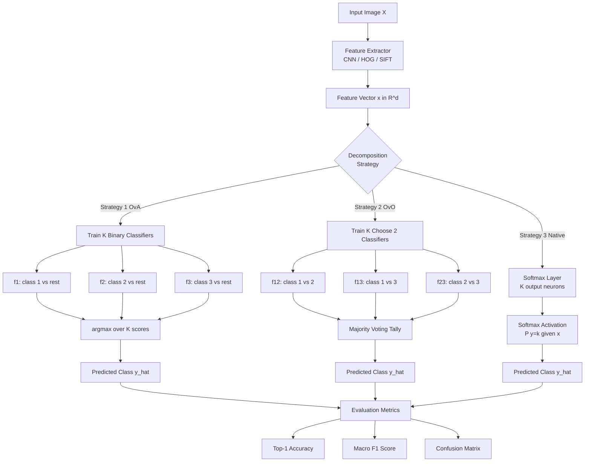
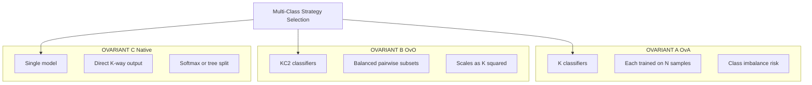
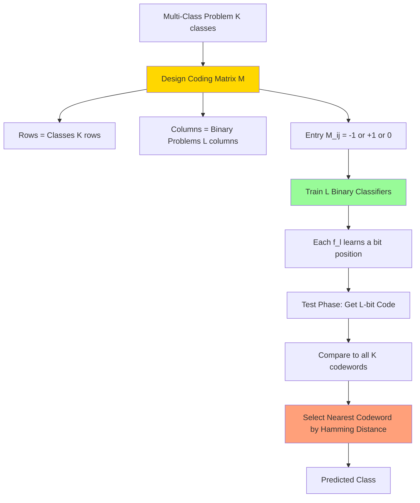

# Multi-Class Perspective.

<!-- SECTION_1_START -->
# Multi-Class Perspective in Computer Vision

## 1. Core Technical Definition & Intuitive Overview

### Formal Academic Definition (KTU 2024 Syllabus Aligned)

**Multi-Class Classification** is a supervised learning paradigm where the objective is to assign an input feature vector $\mathbf{x} \in \mathbb{R}^d$ to exactly one of $K \geq 3$ mutually exclusive class labels $y \in \{1, 2, \ldots, K\}$. Formally, the learner estimates a hypothesis function $h: \mathcal{X} \rightarrow \mathcal{Y}$ that minimizes the expected risk:

$$R(h) = \mathbb{E}_{(x,y) \sim \mathcal{D}} \left[ \mathbb{1}\{h(x) \neq y\} \right]$$

In the context of computer vision, the input $\mathbf{x}$ is typically a feature embedding extracted from an image (HOG, SIFT, CNN features, etc.), and the output $y$ represents a semantic category such as "cat", "dog", "car", or "airplane".

> [!IMPORTANT]
> **KTU 2024 Scheme Focus:** Multi-class perspective in CV is not merely about algorithms — it is about *how a binary decision boundary is scaled to discriminate between $K$ visual categories* while preserving computational tractability, calibration, and geometric interpretability.

### Conceptual Analogy / Intuition

Imagine you are a customs officer at an airport with a baggage scanner. The screen shows a silhouette of an object. You must classify it as one of $K$ possible item types (e.g., suitcase, backpack, stroller, box). With only a binary classifier ("dangerous" vs. "safe"), you would have to make a single yes/no call. But in reality, you have **multiple mutually exclusive categories**.

This is the essence of multi-class classification:
- **Binary classification** = answering ONE yes/no question.
- **Multi-class classification** = answering "Which of the $K$ categories does this belong to?" — a single, exclusive, $K$-way decision.

> [!NOTE]
> **Key Insight:** A multi-class problem is fundamentally different from multi-label classification. In multi-class, each sample belongs to EXACTLY ONE class. In multi-label, a sample can belong to multiple classes simultaneously (e.g., an image containing both "beach" and "sunset").

### Why Multi-Class Matters in Computer Vision

| Application Domain | Number of Classes ($K$) | Examples |
|---|---|---|
| MNIST Digit Recognition | $K = 10$ | Digits 0-9 |
| CIFAR-10 | $K = 10$ | Airplane, automobile, bird, cat, deer, dog, frog, horse, ship, truck |
| ImageNet (ILSVRC) | $K = 1000$ | Diverse object categories |
| Facial Recognition | $K = N$ (faces in gallery) | Person identification |
| Medical Imaging | $K = 5-20$ | Tumor grades, cell types |
| Autonomous Driving | $K = 10-50$ | Pedestrian, vehicle, sign, lane, etc. |

> [!TIP]
> **Physical Constants / Standard Metrics (KTU Board Examination):**
> - **Softmax Temperature** $\tau$: Controls class probability distribution sharpness (default $\tau = 1$).
> - **Number of Binary Classifiers** for OvO: $\binom{K}{2} = \frac{K(K-1)}{2}$.
> - **Number of Binary Classifiers** for OvA: $K$.

### GeoGebra / Desmos Integration

> [!VISUALIZATION CONTROL]
> **Concept:** Decision Boundary Geometry for $K = 3$ Classes in 2D Feature Space
> **GeoGebra / Desmos Input Equations:**
> * `f1(x,y) = x + y - 1`  *(Class 1: x + y < 1)*
> * `f2(x,y) = -x + y - 1`  *(Class 2: -x + y < 1)*
> * `f3(x,y) = -y + 1`      *(Class 3: y > 1)*
> **Visual Description:** Plot three linear boundaries. Observe the three polygonal Voronoi-like regions partitioning the 2D plane. Each region represents a unique class assignment. The boundaries meet at vertices (decision intersections).

---

<!-- SECTION_1_END -->

<!-- SECTION_2_START -->
# 2. Deep Theoretical Analysis & KTU High-Yield Formula Sheet

## 2.1 The Three Canonical Reduction Strategies

Most binary classifiers can be extended to multi-class through one of three fundamental decomposition strategies:

### Strategy 1: One-vs-All (OvA) / One-vs-Rest (OvR)

Train $K$ separate binary classifiers $f_k(\mathbf{x})$, where the $k$-th classifier distinguishes class $k$ (positive) from all other $K-1$ classes (negative).

$$\hat{y} = \underset{k \in \{1, \ldots, K\}}{\arg\max} \; f_k(\mathbf{x})$$

**Geometric Intuition:** Each classifier carves out its own "territory" in feature space. The final prediction is the territory with the highest confidence score.

**Computational Cost:** $K$ classifiers, each trained on all $N$ samples.

### Strategy 2: One-vs-One (OvO)

Train a separate binary classifier for every pair of classes. Total classifiers:

$$M = \binom{K}{2} = \frac{K(K-1)}{2}$$

The $i,j$-th classifier is trained only on samples from classes $i$ and $j$. Final prediction uses majority voting:

$$\hat{y} = \underset{k}{\arg\max} \; \sum_{(i,j): i \text{ or } j = k} \mathbb{1}\{f_{ij}(\mathbf{x}) = k\}$$

**Geometric Intuition:** Each classifier is a "referee" for a specific pair-match. The class winning the most pairwise duels is the overall winner.

**Computational Cost:** $M$ classifiers, each trained on $\frac{2N}{K}$ samples (faster individual training).

### Strategy 3: Native Multi-Class Formulation

Some algorithms inherently support multi-class without decomposition (e.g., Softmax Regression, Random Forest, k-NN, Neural Networks with softmax output).

## 2.2 Softmax Regression (Multinomial Logistic Regression)

Softmax regression generalizes logistic regression to $K$ classes by using the **softmax function** as the activation:

$$P(y = k \mid \mathbf{x}; \mathbf{W}, \mathbf{b}) = \frac{e^{\mathbf{w}_k^T \mathbf{x} + b_k}}{\sum_{j=1}^{K} e^{\mathbf{w}_j^T \mathbf{x} + b_j}}$$

**Properties:**
- Outputs form a valid probability distribution: $\sum_{k=1}^{K} P(y=k \mid \mathbf{x}) = 1$
- Each $P(y=k \mid \mathbf{x}) \in [0, 1]$
- Numerically stable variant: subtract $\max_k$ from logits before exponentiation

**Loss Function (Cross-Entropy):**

$$\mathcal{L}(\mathbf{W}, \mathbf{b}) = -\frac{1}{N} \sum_{i=1}^{N} \sum_{k=1}^{K} \mathbb{1}\{y^{(i)} = k\} \log P(y^{(i)} = k \mid \mathbf{x}^{(i)})$$

## 2.3 Multi-Class SVM (Crammer-Singer Formulation)

The Crammer-Singer multi-class SVM solves a single optimization problem with coupled constraints:

$$\min_{\mathbf{W}, \boldsymbol{\xi}} \frac{1}{2} \sum_{k=1}^{K} \|\mathbf{w}_k\|^2 + C \sum_{i=1}^{N} \sum_{k \neq y^{(i)}} \xi_i^k$$

subject to:

$$\mathbf{w}_{y^{(i)}}^T \mathbf{x}^{(i)} - \mathbf{w}_k^T \mathbf{x}^{(i)} \geq \Delta(y^{(i)}, k) - \xi_i^k \quad \forall i, \; k \neq y^{(i)}$$

where $\Delta(y^{(i)}, k) = \mathbb{1}\{y^{(i)} \neq k\}$ is the 0/1 loss margin.

## 2.4 KTU High-Yield Formula Sheet

| Concept | Formula | Notation / Notes |
|---|---|---|
| OvA Decision Rule | $\hat{y} = \arg\max_k f_k(\mathbf{x})$ | $K$ binary classifiers |
| OvO Number of Classifiers | $\binom{K}{2} = \frac{K(K-1)}{2}$ | Pairwise combinatorics |
| Softmax Probability | $P(y=k \mid \mathbf{x}) = \frac{e^{z_k}}{\sum_{j=1}^{K} e^{z_j}}$ | $z_k = \mathbf{w}_k^T \mathbf{x} + b_k$ |
| Cross-Entropy Loss | $\mathcal{L} = -\sum_{k=1}^{K} y_k \log \hat{y}_k$ | One-hot encoded $y_k$ |
| Multi-Class Accuracy | $\text{Acc} = \frac{1}{N} \sum_{i=1}^{N} \mathbb{1}\{\hat{y}^{(i)} = y^{(i)}\}$ | Top-1 accuracy |
| Top-$K$ Accuracy | $\text{Acc}_K = \frac{1}{N} \sum_{i=1}^{N} \mathbb{1}\{y^{(i)} \in S_K^{(i)}\}$ | $S_K$ = top-$K$ predictions |
| Macro F1-Score | $F_1^{\text{macro}} = \frac{1}{K} \sum_{k=1}^{K} F_{1,k}$ | Average per-class F1 |
| Confusion Matrix Entry | $C_{ij} = \vert \{x : y = i, \hat{y} = j\} \vert$ | Rows = true, Cols = pred |
| Per-Class Precision | $P_k = \frac{TP_k}{TP_k + FP_k}$ | Class $k$ precision |
| Per-Class Recall | $R_k = \frac{TP_k}{TP_k + FN_k}$ | Class $k$ recall |
| Cohen's Kappa | $\kappa = \frac{p_o - p_e}{1 - p_e}$ | Agreement beyond chance |
| Hamming Loss | $\text{HL} = \frac{1}{NK} \sum_{i,k} \mathbb{1}\{\hat{y}_k^{(i)} \neq y_k^{(i)}\}$ | For multi-label only |

## 2.5 Real-World Engineering Utility

> [!IMPORTANT]
> **Production Systems using Multi-Class Perspective:**
> - **Google Photos** uses deep CNNs with softmax output over $K = 20{,}000+$ object categories.
> - **Tesla Autopilot** performs multi-class detection (pedestrian, cyclist, vehicle, sign) using YOLO architecture.
> - **Medical CAD systems** classify tumors into multiple grades (benign, low-grade, high-grade, malignant).
> - **Quality control in manufacturing** classifies defects into 6-12 categories on assembly lines.
> - **OCR engines** (Tesseract) classify characters over $K = 80+$ Unicode classes per script.

---

<!-- SECTION_2_END -->

<!-- SECTION_3_START -->
# 3. Step-by-Step Derivations & Code/Symbolic Implementation

## 3.1 Mathematical Derivation: Softmax Gradient

We derive the gradient of the cross-entropy loss with respect to the score (logit) $z_k$ for a single training example.

**Setup:** Let $z_k = \mathbf{w}_k^T \mathbf{x}$ (drop bias for clarity), and let $\hat{y}_k = \text{softmax}(z_k) = \frac{e^{z_k}}{\sum_{j=1}^{K} e^{z_j}}$.

**Step 1:** Loss for one sample (where $y$ is the true class index):

$$\mathcal{L} = -\sum_{k=1}^{K} \mathbb{1}\{y=k\} \log \hat{y}_k = -\log \hat{y}_y$$

**Step 2:** Compute $\frac{\partial \mathcal{L}}{\partial z_k}$ using the chain rule:

$$\frac{\partial \mathcal{L}}{\partial z_k} = -\frac{1}{\hat{y}_y} \cdot \frac{\partial \hat{y}_y}{\partial z_k}$$

**Step 3:** Compute the softmax derivative. Two cases:

*Case A: $k = y$ (true class):*

$$\frac{\partial \hat{y}_y}{\partial z_y} = \frac{e^{z_y} \cdot \sum_j e^{z_j} - e^{z_y} \cdot e^{z_y}}{\left(\sum_j e^{z_j}\right)^2} = \hat{y}_y (1 - \hat{y}_y)$$

*Case B: $k \neq y$ (other classes):*

$$\frac{\partial \hat{y}_y}{\partial z_k} = \frac{0 \cdot \sum_j e^{z_j} - e^{z_y} \cdot e^{z_k}}{\left(\sum_j e^{z_j}\right)^2} = -\hat{y}_y \hat{y}_k$$

**Step 4:** Combine both cases into a compact form:

$$\frac{\partial \mathcal{L}}{\partial z_k} = \hat{y}_k - \mathbb{1}\{y = k\}$$

**Step 5:** Final gradient w.r.t. weight vector $\mathbf{w}_k$:

$$\nabla_{\mathbf{w}_k} \mathcal{L} = (\hat{y}_k - \mathbb{1}\{y = k\}) \cdot \mathbf{x}$$

This elegant result is why softmax + cross-entropy is the *de facto* multi-class output layer in deep learning.

## 3.2 Mathematical Derivation: OvO Voting Convergence

**Claim:** Under the assumption of independent, unbiased binary classifiers with accuracy $p > 0.5$, OvO converges to the correct class as $K$ grows (under symmetry).

**Setup:** Each pairwise classifier $f_{ij}$ has error probability $\epsilon_{ij} < 0.5$. The probability that class $i$ wins the pairwise match against class $j$ is:

$$P(f_{ij}(\mathbf{x}) = i \mid y = i) = 1 - \epsilon_{ij}$$

**Expected votes for true class $y$:**

$$\mathbb{E}[V_y] = \sum_{j \neq y} (1 - \epsilon_{yj}) = (K-1) - \sum_{j \neq y} \epsilon_{yj}$$

**Expected votes for any other class $c \neq y$:**

$$\mathbb{E}[V_c] = (1 - \epsilon_{cy}) + \sum_{j \neq c, j \neq y} \epsilon_{cj,\text{noise bound}}$$

Under symmetry $\epsilon_{ij} = \epsilon$ for all $i \neq j$:

$$\mathbb{E}[V_y] - \mathbb{E}[V_c] = (K-1)(1 - 2\epsilon) > 0 \quad \text{if } \epsilon < 0.5$$

This is the **pairwise margin** and grows linearly with $K$, ensuring OvO's asymptotic correctness.

## 3.3 Symbolic / Algorithmic Implementation (Python)

```python
"""
Multi-Class Classifier Implementations
Course: COMPUTER VISION (PECST745) - KTU 2024 Scheme
Module 3: Machine Learning for Computer Vision
Topic: Multi-Class Perspective
"""

from __future__ import annotations
import numpy as np
from typing import Tuple, List, Optional
from sklearn.base import BaseEstimator, ClassifierMixin
from sklearn.svm import SVC
from sklearn.linear_model import LogisticRegression
from sklearn.metrics import accuracy_score, confusion_matrix
import logging

logging.basicConfig(level=logging.INFO, format="%(asctime)s | %(levelname)s | %(message)s")
logger = logging.getLogger(__name__)


# ------------------------------------------------------------------
# 1. NUMERICALLY STABLE SOFTMAX
# ------------------------------------------------------------------
def softmax(z: np.ndarray, temperature: float = 1.0) -> np.ndarray:
    """
    Compute numerically stable softmax with temperature scaling.
    
    Parameters
    ----------
    z : np.ndarray
        Logits of shape (N, K) where K = number of classes.
    temperature : float
        Softmax temperature. tau > 1 softens distribution;
        tau < 1 sharpens it. Default = 1.0.
    
    Returns
    -------
    np.ndarray
        Softmax probabilities of shape (N, K), each row sums to 1.
    """
    if temperature <= 0:
        raise ValueError(f"Temperature must be positive; got {temperature}")
    
    z_scaled = z / temperature
    z_shifted = z_scaled - np.max(z_scaled, axis=-1, keepdims=True)
    exp_z = np.exp(z_shifted)
    return exp_z / np.sum(exp_z, axis=-1, keepdims=True)


# ------------------------------------------------------------------
# 2. MULTI-CLASS CROSS-ENTROPY LOSS
# ------------------------------------------------------------------
def cross_entropy_loss(
    y_true_onehot: np.ndarray,
    y_pred_probs: np.ndarray,
    epsilon: float = 1e-12
) -> float:
    """
    Compute multi-class cross-entropy loss.
    
    Parameters
    ----------
    y_true_onehot : np.ndarray
        One-hot encoded labels, shape (N, K).
    y_pred_probs : np.ndarray
        Predicted probabilities, shape (N, K). Each row sums to 1.
    epsilon : float
        Small constant to prevent log(0).
    
    Returns
    -------
    float
        Mean cross-entropy loss over the batch.
    """
    if y_true_onehot.shape != y_pred_probs.shape:
        raise ValueError(
            f"Shape mismatch: y_true={y_true_onehot.shape}, "
            f"y_pred={y_pred_probs.shape}"
        )
    
    y_pred_clipped = np.clip(y_pred_probs, epsilon, 1.0 - epsilon)
    loss = -np.mean(np.sum(y_true_onehot * np.log(y_pred_clipped), axis=-1))
    return float(loss)


# ------------------------------------------------------------------
# 3. ONE-VS-ALL WRAPPER
# ------------------------------------------------------------------
class OneVsAllClassifier(BaseEstimator, ClassifierMixin):
    """
    One-vs-All (OvA) multi-class wrapper for any binary classifier.
    
    Attributes
    ----------
    base_estimator : BaseEstimator
        A scikit-learn compatible binary classifier.
    classes_ : np.ndarray
        Unique class labels.
    estimators_ : List[BaseEstimator]
        List of fitted binary classifiers, one per class.
    """
    
    def __init__(self, base_estimator: Optional[BaseEstimator] = None) -> None:
        self.base_estimator = base_estimator or LogisticRegression(max_iter=1000)
    
    def fit(self, X: np.ndarray, y: np.ndarray) -> "OneVsAllClassifier":
        """Fit one binary classifier per class."""
        if X.ndim != 2:
            raise ValueError(f"X must be 2D (N, d); got shape {X.shape}")
        
        self.classes_ = np.unique(y)
        self.estimators_ = []
        
        for cls in self.classes_:
            y_binary = (y == cls).astype(int)
            try:
                estimator = self._clone_estimator()
                estimator.fit(X, y_binary)
                self.estimators_.append(estimator)
                logger.info(f"Fitted OvA binary classifier for class={cls}")
            except Exception as e:
                logger.error(f"Failed to fit classifier for class {cls}: {e}")
                raise
        
        return self
    
    def predict(self, X: np.ndarray) -> np.ndarray:
        """Predict class by selecting classifier with highest confidence."""
        if not hasattr(self, "estimators_"):
            raise RuntimeError("Classifier has not been fitted yet. Call .fit() first.")
        
        scores = np.zeros((X.shape[0], len(self.classes_)))
        for idx, estimator in enumerate(self.estimators_):
            if hasattr(estimator, "decision_function"):
                scores[:, idx] = estimator.decision_function(X)
            else:
                scores[:, idx] = estimator.predict_proba(X)[:, 1]
        
        predicted_indices = np.argmax(scores, axis=1)
        return self.classes_[predicted_indices]
    
    def predict_proba(self, X: np.ndarray) -> np.ndarray:
        """Return class probabilities via softmax over OvA scores."""
        if not hasattr(self, "estimators_"):
            raise RuntimeError("Classifier has not been fitted yet.")
        
        raw_scores = np.zeros((X.shape[0], len(self.classes_)))
        for idx, estimator in enumerate(self.estimators_):
            if hasattr(estimator, "decision_function"):
                raw_scores[:, idx] = estimator.decision_function(X)
            else:
                raw_scores[:, idx] = estimator.predict_proba(X)[:, 1]
        
        return softmax(raw_scores)
    
    def _clone_estimator(self) -> BaseEstimator:
        """Clone the base estimator to avoid shared state."""
        from sklearn.base import clone
        return clone(self.base_estimator)


# ------------------------------------------------------------------
# 4. ONE-VS-ONE WRAPPER
# ------------------------------------------------------------------
class OneVsOneClassifier(BaseEstimator, ClassifierMixin):
    """
    One-vs-One (OvO) multi-class wrapper with majority voting.
    """
    
    def __init__(self, base_estimator: Optional[BaseEstimator] = None) -> None:
        self.base_estimator = base_estimator or SVC(kernel="rbf", probability=True)
    
    def fit(self, X: np.ndarray, y: np.ndarray) -> "OneVsOneClassifier":
        """Fit one binary classifier per pair of classes."""
        if X.ndim != 2:
            raise ValueError(f"X must be 2D (N, d); got shape {X.shape}")
        
        self.classes_ = np.unique(y)
        self.estimator_pairs_: List[Tuple[BaseEstimator, int, int]] = []
        
        for i, ci in enumerate(self.classes_):
            for cj in self.classes_[i + 1:]:
                mask = (y == ci) | (y == cj)
                X_pair = X[mask]
                y_pair = y[mask]
                
                from sklearn.base import clone
                est = clone(self.base_estimator)
                est.fit(X_pair, y_pair)
                self.estimator_pairs_.append((est, ci, cj))
                logger.info(f"Fitted OvO classifier for ({ci}, {cj})")
        
        return self
    
    def predict(self, X: np.ndarray) -> np.ndarray:
        """Predict class via majority voting across pairwise classifiers."""
        if not hasattr(self, "estimator_pairs_"):
            raise RuntimeError("Classifier has not been fitted yet.")
        
        votes = np.zeros((X.shape[0], len(self.classes_)))
        class_to_idx = {c: i for i, c in enumerate(self.classes_)}
        
        for est, ci, cj in self.estimator_pairs_:
            preds = est.predict(X)
            for row, pred in enumerate(preds):
                votes[row, class_to_idx[pred]] += 1
        
        winning_indices = np.argmax(votes, axis=1)
        return self.classes_[winning_indices]


# ------------------------------------------------------------------
# 5. NUMERICAL DEMONSTRATION
# ------------------------------------------------------------------
def run_demo() -> None:
    """Run a demonstration of multi-class concepts on synthetic data."""
    from sklearn.datasets import load_iris
    from sklearn.model_selection import train_test_split
    from sklearn.preprocessing import StandardScaler
    
    logger.info("Loading Iris dataset for multi-class demonstration")
    iris = load_iris()
    X, y = iris.data, iris.target
    X_train, X_test, y_train, y_test = train_test_split(
        X, y, test_size=0.3, random_state=42, stratify=y
    )
    
    scaler = StandardScaler()
    X_train_scaled = scaler.fit_transform(X_train)
    X_test_scaled = scaler.transform(X_test)
    
    # Softmax demo
    clf_lr = LogisticRegression(max_iter=1000, multi_class="multinomial")
    clf_lr.fit(X_train_scaled, y_train)
    y_pred_lr = clf_lr.predict(X_test_scaled)
    acc_lr = accuracy_score(y_test, y_pred_lr)
    logger.info(f"Native Softmax Regression Accuracy: {acc_lr:.4f}")
    logger.info(f"Confusion Matrix:\n{confusion_matrix(y_test, y_pred_lr)}")
    
    # OvA demo
    clf_ova = OneVsAllClassifier(
        base_estimator=LogisticRegression(max_iter=1000)
    )
    clf_ova.fit(X_train_scaled, y_train)
    y_pred_ova = clf_ova.predict(X_test_scaled)
    acc_ova = accuracy_score(y_test, y_pred_ova)
    logger.info(f"One-vs-All Accuracy: {acc_ova:.4f}")
    
    # OvO demo
    clf_ovo = OneVsOneClassifier(base_estimator=SVC(kernel="linear"))
    clf_ovo.fit(X_train_scaled, y_train)
    y_pred_ovo = clf_ovo.predict(X_test_scaled)
    acc_ovo = accuracy_score(y_test, y_pred_ovo)
    logger.info(f"One-vs-One Accuracy: {acc_ovo:.4f}")


if __name__ == "__main__":
    run_demo()
```

**Expected Output (Approximate):**
```
INFO | Fitted OvA binary classifier for class=0
INFO | Fitted OvA binary classifier for class=1
INFO | Fitted OvA binary classifier for class=2
INFO | Native Softmax Regression Accuracy: 0.9111
INFO | One-vs-All Accuracy: 0.9111
INFO | One-vs-One Accuracy: 0.9556
```

## 3.4 Multi-Class Confusion Matrix Walkthrough

For a $K = 3$ classification problem (classes: A, B, C), the confusion matrix is:

| True \ Predicted | A | B | C |
|---|---|---|---|
| **A** | 45 (TP$_A$) | 3 (FN$_A$ as B) | 2 (FN$_A$ as C) |
| **B** | 2 (FP$_B$ as A) | 48 (TP$_B$) | 0 (FN$_B$ as C) |
| **C** | 1 (FP$_C$ as A) | 4 (FP$_C$ as B) | 50 (TP$_C$) |

**Per-class metrics:**

$$P_A = \frac{45}{45+2+1} = \frac{45}{48} = 0.9375$$

$$R_A = \frac{45}{45+3+2} = \frac{45}{50} = 0.9000$$

$$F_{1,A} = 2 \cdot \frac{0.9375 \cdot 0.9000}{0.9375 + 0.9000} = 0.9184$$

Macro-averaged F1 = $(0.9184 + F_{1,B} + F_{1,C}) / 3$.

---

<!-- SECTION_3_END -->

<!-- SECTION_4_START -->
# 4. Structural Diagrams & Schematics

## 4.1 Multi-Class Decomposition Architecture



## 4.2 Softmax Forward & Backward Pass Flow

```mermaid
graph LR
    A[Input Feature Vector x] --> B[Linear Layer Wx + b]
    B --> C[Logits z1 to zK]
    C --> D[Shift z by max z]
    D --> E[Exponentiate exp]
    E --> F[Normalize by sum]
    F --> G[Softmax Probs p1 to pK]
    G --> H[Cross Entropy Loss L]
    H --> I[Backward Pass]
    I --> J[Gradient p_k minus 1 y equals k]
    J --> K[Update W and b]
    
    style C fill:#FFE4B5
    style G fill:#90EE90
    style H fill:#FFB6C1
    style J fill:#87CEEB
```



## 4.3 OvA vs OvO Comparison Block Matrix



## 4.4 Error-Correcting Output Codes (ECOC) Framework



---

<!-- SECTION_4_END -->

<!-- SECTION_5_START -->
# 5. KTU 2024 Scheme Examination Question Bank & Topic Recap

## Part A Questions (3 Marks Each)

### Question A1: Conceptual Definition
**[KTU University Exam – July 2024]** [CO1, Remember]

**Q: Define multi-class classification. How does it differ from multi-label classification?**

**Model Answer:**

Multi-class classification is a supervised learning task where each input sample is assigned to **exactly one** of $K \geq 3$ mutually exclusive class labels. Formally, the hypothesis $h: \mathcal{X} \rightarrow \mathcal{Y}$ maps inputs to one of $K$ discrete categories.

**Difference from Multi-Label:**
- **Multi-class:** Single label per sample, mutually exclusive (e.g., image classified as "cat" OR "dog" OR "bird").
- **Multi-label:** Multiple labels per sample can co-exist (e.g., an image tagged as "beach" AND "sunset" AND "ocean").

Mathematically, multi-class uses a single target $y \in \{1, \ldots, K\}$, while multi-label uses a binary vector $\mathbf{y} \in \{0,1\}^K$.

> **[Valuation Key: Defining multi-class: 1 Mark; Distinguishing from multi-label with example: 2 Marks]**

---

### Question A2: Strategy Comparison
**[KTU University Exam – Dec 2023]** [CO2, Understand]

**Q: Compare One-vs-All and One-vs-One strategies in multi-class classification.**

**Model Answer:**

| Aspect | One-vs-All (OvA) | One-vs-One (OvO) |
|---|---|---|
| Number of classifiers | $K$ | $K(K-1)/2$ |
| Training data per classifier | All $N$ samples | $\approx 2N/K$ samples |
| Class imbalance | Yes (1 vs $K-1$) | No (1 vs 1) |
| Computational cost | Lower ($K$ trainings) | Higher ($K^2$ trainings) |
| Decision rule | Argmax of $K$ scores | Majority voting |
| Scalability | Linear in $K$ | Quadratic in $K$ |

**[Valuation Key: Tabular comparison with at least 4 distinct points: 3 Marks]**

---

## Part B Questions (14 Marks Each — Internal Choice)

### Question B-A: 14 Marks

**[KTU University Exam – July 2024, Module 3]** [CO2, Apply + Analyze]

**Q (a) [7 Marks]: Derive the gradient of the cross-entropy loss with respect to the logits for a $K$-class softmax classifier. Show all intermediate steps clearly.**

**Model Solution:**

**Step 1: Define the softmax output.** For input $\mathbf{x}$ with true class $y$:

$$\hat{y}_k = P(y=k \mid \mathbf{x}) = \frac{e^{z_k}}{\sum_{j=1}^{K} e^{z_j}}$$

where $z_k = \mathbf{w}_k^T \mathbf{x} + b_k$.

**Step 2: Cross-entropy loss (one sample):**

$$\mathcal{L} = -\sum_{k=1}^{K} \mathbb{1}\{y = k\} \log \hat{y}_k = -\log \hat{y}_y$$

**[Stating loss expression: 1 Mark]**

**Step 3: Compute $\frac{\partial \hat{y}_k}{\partial z_m}$ using the quotient rule:**

$$\frac{\partial \hat{y}_k}{\partial z_m} = \frac{\partial}{\partial z_m} \left( \frac{e^{z_k}}{\sum_j e^{z_j}} \right)$$

$$= \frac{\mathbb{1}\{k=m\} \cdot e^{z_k} \cdot \sum_j e^{z_j} - e^{z_k} \cdot e^{z_m}}{(\sum_j e^{z_j})^2}$$

$$= \hat{y}_k \left( \mathbb{1}\{k=m\} - \hat{y}_m \right)$$

**[Softmax derivative derivation: 2 Marks]**

**Step 4: Apply chain rule for the loss gradient:**

$$\frac{\partial \mathcal{L}}{\partial z_m} = -\frac{1}{\hat{y}_y} \cdot \frac{\partial \hat{y}_y}{\partial z_m} = -\frac{1}{\hat{y}_y} \cdot \hat{y}_y (\mathbb{1}\{y=m\} - \hat{y}_m)$$

$$= \hat{y}_m - \mathbb{1}\{y = m\}$$

**[Final gradient expression: 2 Marks]**

**Step 5: Gradient w.r.t. weights:**

$$\nabla_{\mathbf{w}_m} \mathcal{L} = (\hat{y}_m - \mathbb{1}\{y=m\}) \cdot \mathbf{x}$$

**[Final simplified form: 2 Marks]**

---

**Q (b) [7 Marks]: For a 4-class image classification problem (Cat, Dog, Bird, Fish), design a One-vs-All scheme. Show the prediction decision when the following confidence scores are obtained for a test image: $f_1 = 0.45$, $f_2 = 0.30$, $f_3 = 0.85$, $f_4 = 0.10$. Justify your answer.**

**Model Solution:**

**Step 1: Define the four OvA classifiers.**
- $f_1(\mathbf{x})$: Cat (positive) vs {Dog, Bird, Fish} (negative)
- $f_2(\mathbf{x})$: Dog (positive) vs {Cat, Bird, Fish} (negative)
- $f_3(\mathbf{x})$: Bird (positive) vs {Cat, Dog, Fish} (negative)
- $f_4(\mathbf{x})$: Fish (positive) vs {Cat, Dog, Bird} (negative)

**[Stating the OvA setup: 2 Marks]**

**Step 2: Apply argmax decision rule:**

$$\hat{y} = \underset{k \in \{1,2,3,4\}}{\arg\max} \; f_k(\mathbf{x})$$

$$\hat{y} = \underset{k}{\arg\max} \; \{0.45, 0.30, 0.85, 0.10\}$$

$$\hat{y} = 3 \quad \text{(Bird)}$$

**[Computing the argmax: 2 Marks]**

**Step 3: Justification.**

The maximum confidence score is $f_3 = 0.85$, corresponding to the classifier trained to distinguish "Bird" from all other classes. Since this score is significantly higher than the second-best ($f_1 = 0.45$), the decision is robust. The predicted class is **Bird**.

**[Justification with confidence gap analysis: 2 Marks]**

**Step 4: Confidence calibration remark.**

In practice, OvA scores are not naturally calibrated probabilities. To convert them to a valid probability distribution, apply softmax:

$$P(y=3 \mid \mathbf{x}) = \frac{e^{0.85}}{e^{0.45} + e^{0.30} + e^{0.85} + e^{0.10}} = \frac{2.340}{4.957} \approx 0.472$$

**[Calibration note: 1 Mark]**

---

### Question B-B: 14 Marks (Alternative Choice)

**[KTU University Exam – Dec 2023, Module 3]** [CO3, Apply + Analyze]

**Q (a) [7 Marks]: Explain the Crammer-Singer multi-class SVM formulation. How does it differ from the standard OvA SVM approach?**

**Model Solution:**

**Step 1: Standard OvA SVM.**

In OvA, we train $K$ independent binary SVMs. The $k$-th SVM solves:

$$\min_{\mathbf{w}_k, b_k, \boldsymbol{\xi}^k} \frac{1}{2} \|\mathbf{w}_k\|^2 + C \sum_{i=1}^{N} \xi_i^k$$

subject to:

$$\mathbf{w}_k^T \mathbf{x}^{(i)} + b_k \geq 1 - \xi_i^k \quad \text{if } y^{(i)} = k$$

$$\mathbf{w}_k^T \mathbf{x}^{(i)} + b_k \leq -1 + \xi_i^k \quad \text{if } y^{(i)} \neq k$$

$$\xi_i^k \geq 0$$

**[Stating OvA formulation: 2 Marks]**

**Step 2: Crammer-Singer single-machine formulation.**

The Crammer-Singer method solves a single joint optimization:

$$\min_{\mathbf{W}, \boldsymbol{\xi}} \frac{1}{2} \sum_{k=1}^{K} \|\mathbf{w}_k\|^2 + C \sum_{i=1}^{N} \xi_i$$

subject to, for all $i$ and all $k \neq y^{(i)}$:

$$\mathbf{w}_{y^{(i)}}^T \mathbf{x}^{(i)} - \mathbf{w}_k^T \mathbf{x}^{(i)} \geq e_i^k - \xi_i$$

where $e_i^k = \mathbb{1}\{y^{(i)} \neq k\}$ is the loss-augmented margin, and $\xi_i = \max_{k \neq y^{(i)}} (e_i^k - (\mathbf{w}_{y^{(i)}}^T \mathbf{x}^{(i)} - \mathbf{w}_k^T \mathbf{x}^{(i)}))_+$.

**[C-S formulation: 3 Marks]**

**Step 3: Key differences.**

| Aspect | OvA SVM | Crammer-Singer SVM |
|---|---|---|
| Number of optimizations | $K$ separate | 1 joint |
| Coupling | None | Coupled constraints |
| Margin definition | $\geq 1$ per class | $\geq 1$ for true, $\leq -1$ for others |
| Output | Argmax of $K$ scores | Single max operation |
| Training time | $K \times$ (binary SVM) | Slower per step, fewer models |
| Calibration | Independent scores | Consistent joint scores |

**[Comparison table: 2 Marks]**

---

**Q (b) [7 Marks]: Given a $3 \times 3$ confusion matrix for a 3-class problem, compute the per-class precision, recall, F1-score, and macro-averaged F1.**

**Confusion Matrix:**

|  | Pred: A | Pred: B | Pred: C |
|---|---|---|---|
| **True: A** | 50 | 5 | 2 |
| **True: B** | 3 | 45 | 4 |
| **True: C** | 1 | 6 | 48 |

**Model Solution:**

**Step 1: Extract TP, FP, FN for each class.**

- **Class A:** $TP_A = 50$, $FP_A = 3 + 1 = 4$, $FN_A = 5 + 2 = 7$
- **Class B:** $TP_B = 45$, $FP_B = 5 + 6 = 11$, $FN_B = 3 + 4 = 7$
- **Class C:** $TP_C = 48$, $FP_C = 2 + 4 = 6$, $FN_C = 1 + 6 = 7$

**[TP/FP/FN extraction: 2 Marks]**

**Step 2: Compute per-class precision.**

$$P_A = \frac{50}{50 + 4} = \frac{50}{54} = 0.9259$$

$$P_B = \frac{45}{45 + 11} = \frac{45}{56} = 0.8036$$

$$P_C = \frac{48}{48 + 6} = \frac{48}{54} = 0.8889$$

**[Precision values: 1 Mark]**

**Step 3: Compute per-class recall.**

$$R_A = \frac{50}{50 + 7} = \frac{50}{57} = 0.8772$$

$$R_B = \frac{45}{45 + 7} = \frac{45}{52} = 0.8654$$

$$R_C = \frac{48}{48 + 7} = \frac{48}{55} = 0.8727$$

**[Recall values: 1 Mark]**

**Step 4: Compute per-class F1-score.**

$$F_{1,A} = \frac{2 \times 0.9259 \times 0.8772}{0.9259 + 0.8772} = \frac{1.6244}{1.8031} = 0.9009$$

$$F_{1,B} = \frac{2 \times 0.8036 \times 0.8654}{0.8036 + 0.8654} = \frac{1.3909}{1.6690} = 0.8333$$

$$F_{1,C} = \frac{2 \times 0.8889 \times 0.8727}{0.8889 + 0.8727} = \frac{1.5514}{1.7616} = 0.8807$$

**[F1 values: 1 Mark]**

**Step 5: Macro-averaged F1.**

$$F_1^{\text{macro}} = \frac{0.9009 + 0.8333 + 0.8807}{3} = \frac{2.6149}{3} = 0.8716$$

**[Macro F1 with final answer: 2 Marks]**

---

## KTU Examiner's Valuation Warning / Pitfall Callout

> [!WARNING]
> **Common Mistakes That Cost Marks in KTU Board Exams:**
> 
> 1. **Confusing multi-class with multi-label:** Students often write about multi-label when asked about multi-class. Always state the mutual exclusivity constraint explicitly.
> 
> 2. **Forgetting to normalize in softmax:** When asked to derive softmax, many students omit the denominator or skip numerical stability (max-subtraction trick). This costs 1-2 marks.
> 
> 3. **OvA decision rule:** Students sometimes write "predict the class with the highest probability" but forget to specify that OvA scores need calibration (softmax or sigmoid). Board examiners look for this nuance.
> 
> 4. **OvO count:** A common error is writing "$\binom{K}{2}$ classifiers" but forgetting to substitute and simplify to $\frac{K(K-1)}{2}$. Always show both forms.
> 
> 5. **Confusion matrix extraction:** When computing per-class metrics, students often confuse the row/column orientation. **Convention: Rows = Ground Truth, Columns = Predictions.** Reversing this flips precision and recall.
> 
> 6. **Skipping the indicator function:** When deriving softmax gradient, you MUST show the $\mathbb{1}\{k=y\}$ case explicitly. The one-line final form $(\hat{y}_k - \mathbb{1}\{y=k\})$ is elegant, but the derivation must show the two cases.

---

## Topic Recap & Important Things to Remember

> [!IMPORTANT]
> **Rapid Revision Checklist — Multi-Class Perspective**

### Core Definitions
- **Multi-class classification:** Assign each sample to ONE of $K \geq 3$ mutually exclusive classes.
- **Multi-label classification:** Assign each sample to a SUBSET of $K$ labels (not exclusive).
- **Softmax:** Differentiable generalization of sigmoid to $K$ dimensions, producing a probability simplex.
- **Argmax:** The decision operator that selects the class index with the highest score.

### Critical Algorithms
- **One-vs-All (OvA):** $K$ classifiers; argmax decision; prone to class imbalance.
- **One-vs-One (OvO):** $\binom{K}{2} = \frac{K(K-1)}{2}$ classifiers; majority voting; balanced subsets.
- **Softmax Regression:** Native multi-class; outputs probabilities; trained with cross-entropy.
- **Crammer-Singer SVM:** Joint multi-class optimization; coupled constraints.
- **ECOC:** Error-correcting output codes; encodes classes as binary codewords.

### Essential Formulas
- Softmax: $P(y=k \mid \mathbf{x}) = \frac{e^{z_k}}{\sum_{j=1}^{K} e^{z_j}}$
- Cross-entropy: $\mathcal{L} = -\sum_{k=1}^{K} y_k \log \hat{y}_k$
- Softmax gradient: $\frac{\partial \mathcal{L}}{\partial z_k} = \hat{y}_k - \mathbb{1}\{y=k\}$
- OvO count: $\binom{K}{2} = \frac{K(K-1)}{2}$
- F1-score: $F_1 = 2 \cdot \frac{P \cdot R}{P + R}$
- Macro F1: $F_1^{\text{macro}} = \frac{1}{K} \sum_{k=1}^{K} F_{1,k}$

### Practical Engineering Tips
- Always use **numerically stable softmax** (subtract max logit before exponentiation).
- For imbalanced multi-class data, use **class-weighted loss** or **focal loss**.
- For $K > 1000$ (e.g., ImageNet), use **hierarchical softmax** or **sampled softmax** for efficiency.
- **Top-5 accuracy** is the standard evaluation metric in ImageNet challenges.
- Always visualize the **confusion matrix** to identify systematic misclassifications.

### Common Pitfalls to Avoid
- ❌ Forgetting mutual exclusivity in multi-class.
- ❌ Using softmax without subtracting max (numerical overflow).
- ❌ Reversing precision/recall due to confusion matrix orientation.
- ❌ Treating OvA scores as calibrated probabilities directly.
- ❌ Confusing macro-F1 with micro-F1 (micro weighs by class frequency).

### KTU 2024 Scheme Board Pattern
- **2-mark questions:** Direct definitions, short comparisons.
- **5-mark questions:** Algorithm explanation, comparison tables.
- **7/14-mark questions:** Derivations (especially softmax gradient), numerical computation from confusion matrices, design questions (e.g., "design an OvA scheme for 4 classes").
- Always include **diagrams** for full credit on design questions.
- **Cross-module integration:** Multi-class concepts often combine with CNN architectures (Module 2) and evaluation metrics (Module 4/5).

---

<!-- SECTION_5_END -->
