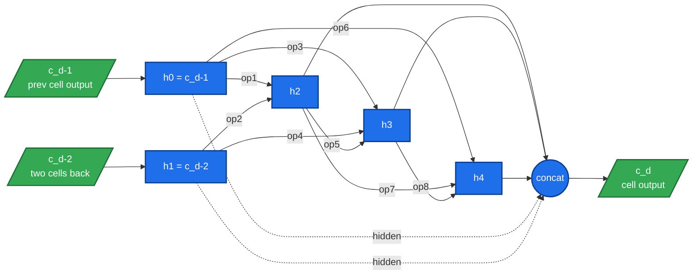
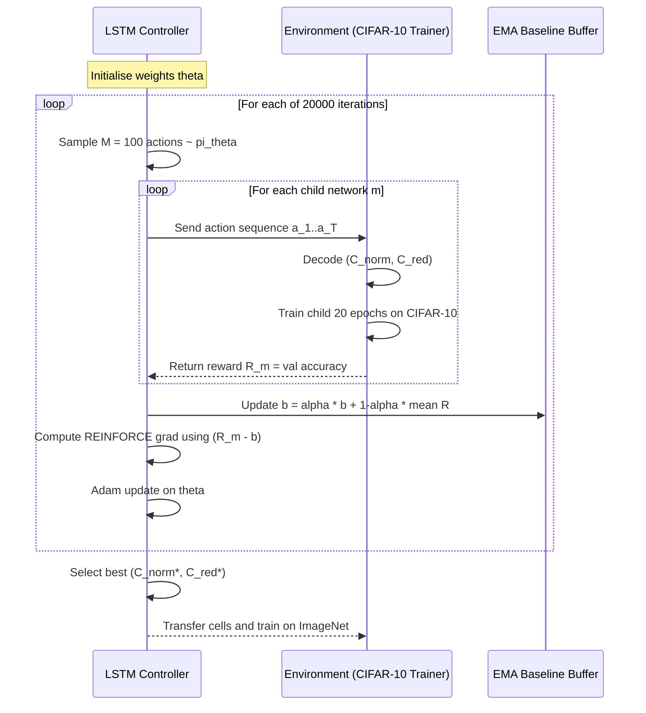

# Neural Architecture Search Design - NASNet

<!-- SECTION_1_START -->
# Neural Architecture Search & NASNet: Core Technical Definition & Intuitive Overview

## 1.1 Formal Academic Definition (KTU 2024 Syllabus Aligned)

> [!IMPORTANT]
> **Neural Architecture Search (NAS)** is an automated machine learning (AutoML) sub-discipline that seeks to discover optimal neural network topologies by algorithmically exploring a predefined **search space** of architectural primitives, guided by a **search strategy**, and evaluated via a **performance estimation strategy** that bypasses exhaustive training.

> [!IMPORTANT]
> **NASNet** is a family of convolutional architectures introduced by **Zoph, Vasudevan, Shlens, and Le (Google Brain, CVPR 2018)** in the seminal paper *"Learning Transferable Architectures for Scalable Image Recognition."* The defining innovation is that NAS searches for two modular building blocks — a **Normal Cell** and a **Reduction Cell** — on a small dataset (**CIFAR-10**), and then **transfers** (scales) the discovered cells to larger datasets such as **ImageNet**. This *decoupling of cell topology from network scale* is what makes the architecture *scalable and transferable*.

The two principal NASNet variants referenced in the literature are:
- **NASNet-A** — Reinforcement-Learning (RL) controller with **RNN + Policy Gradient** (the original).
- **NASNet-B / NASNet-C** — variants with slightly different search space regularizers (not as widely deployed).

The variant that achieved state-of-the-art on ImageNet at the time of publication (2018) was **NASNet-A Large** at **82.7% top-1** and **96.2% top-5** accuracy, with **∼ 533M parameters** before pruning.

---

## 1.2 Conceptual Analogy & Geometric Intuition

> **Plain-English Analogy — "The Robot Architect"**

Imagine you hire a robot **architect** to design a skyscraper. You don't want the robot to design the *entire* 100-story building from scratch — that's computationally infeasible. So instead, you tell the robot:

> *"Design just **two types of floors** — a standard floor (Normal Cell) and a staircase/mechanical floor that halves the floor-plan area (Reduction Cell). Then we'll repeat and stack these two floor types to form the whole building."*

The robot:
1. **Brainstorms** candidate floor layouts by sampling combinations of rooms (convolutions), corridors (skip connections), and skylights (pooling).
2. **Builds a tiny prototype** of each candidate on a small city plot (CIFAR-10, 32×32 images) and measures its occupancy efficiency (validation accuracy).
3. **Reinforces** the layouts that scored well and **prunes** the poor ones (policy gradient on an RNN controller).
4. Finally, the **best two floor types are cloned and re-stacked** into a massive skyscraper on a different, larger city plot (ImageNet, 224×224 images).

**Geometric Intuition of the Search Space:**

- A NASNet **cell** is a small **directed acyclic graph (DAG)** of **B = 5** nodes (intermediate feature maps), connected by **2(B − 1) = 8** edges.
- Each **edge** chooses one operation from a fixed **candidate set** of **13 operations** (e.g., 3×3 separable conv, 5×5 separable conv, 3×3 dilated conv, 3×3 max-pool, 3×3 average-pool, identity, none/zero).
- The total combinatorial search space per cell is roughly $\left(13\right)^{8} \approx 8.1 \times 10^{8}$ possible DAG configurations — far too large for brute-force grid search, hence the need for a learned controller.

> [!NOTE]
> **Geometric Summary:** Think of NAS as *graph enumeration with a learned prior*, where the **controller** acts as a Bayesian policy over the discrete space of DAGs.

---

## 1.3 Key Physical Constants & Standard Metrics

| Metric | Value / Unit | Significance |
|---|---|---|
| **CIFAR-10 Search Budget** | $\mathbf{28{,}000}$ architectures | Total candidate networks sampled by the controller during search |
| **Candidate Ops Pool Size** | $\mathbf{13}$ | Discrete set of allowed operations per edge |
| **Cells per Block (B)** | $\mathbf{5}$ | Number of intermediate nodes inside a cell DAG |
| **Edges per Cell** | $\mathbf{2(B-1) = 8}$ | Total number of operation slots per cell |
| **Reduction Cell Stride** | $\mathbf{2}$ | Applied to inputs of the reduction cell |
| **Total Controller Params** | $\sim \mathbf{2.5 \times 10^7}$ | Trainable weights in the RNN controller |
| **ImageNet Final Params (NASNet-A Large)** | $\mathbf{533\,M}$ (pre-prune) | Scaled-up model transferred from CIFAR-10 search |

> [!VISUALIZATION CONTROL]
> **Concept:** NAS Search Space as a 2D Heatmap of Cell Topologies
> **Conceptual Plot Axes:**
> * $x$-axis: `cell_index` (Normal Cell index from 0 to $N-1$)
> * $y$-axis: `validation_accuracy_on_CIFAR10` (range 0.85 → 0.97)
> **Visual Description:** Each plotted point represents a fully sampled cell architecture; an *envelope curve* traces the best architecture discovered at iteration $t$. The two best discoveries (Normal + Reduction) cluster at the **upper-left** of the heatmap — high accuracy at low parameter count, the Pareto frontier of NAS.
> **GeoGebra / Desmos Input Equations:**
> * `f(x) = 0.97 - 0.04 * exp(-0.3 x)` (envelope curve)
> * `g(x) = 0.85 + 0.05 * sin(0.5 x)` (random baseline architectures)
> * Scatter points uniformly between `f(x) - 0.02` and `f(x)`.

---

<!-- SECTION_1_END -->

<!-- SECTION_2_START -->
# Deep Theoretical Analysis & KTU High-Yield Formula Sheet

## 2.1 The Three Pillars of Neural Architecture Search (NAS)

Every NAS framework — whether RL-based (NASNet), evolutionary (AmoebaNet), or gradient-based (DARTS) — consists of three orthogonal components. NASNet specifically uses the **RL paradigm**, so we focus the formulas on that family.

### Pillar 1 — Search Space $\mathcal{A}$

The space of all architectures the controller is allowed to sample. In NASNet:

$$
\mathcal{A} \;=\; \left\{\, (C_{\text{norm}}, C_{\text{red}}) \,\bigm|\, C_{\text{norm}} \in \text{DAG}_5(13), \; C_{\text{red}} \in \text{DAG}_5(13) \,\right\}
$$

where $\text{DAG}_5(13)$ denotes the set of directed acyclic graphs over **5 intermediate nodes** with **8 directed edges**, each edge being assigned one of **13 candidate operations** $o \in \mathcal{O}$.

$$
\mathcal{O} \;=\; \big\{\, 3\!\times\!3\text{ sepConv},\; 5\!\times\!5\text{ sepConv},\; 7\!\times\!7\text{ sepConv},\; 3\!\times\!3\text{ dilConv}_{r=2},\; 3\!\times\!3\text{ sepConv}_{r=2},\; \ldots, \text{ avgPool}_{3\!\times\!3}, \text{maxPool}_{3\!\times\!3}, \text{identity}, \text{zero} \,\big\}
$$

### Pillar 2 — Search Strategy (RL Controller)

The controller is a **two-layer LSTM** with $\mathbf{100}$ hidden units per layer. At each of the $2(B-1) = 8$ prediction steps it emits a softmax distribution over the 13 candidate operations:

$$
\pi_{\theta}(a_t \,\vert\, a_{1:t-1}) \;=\; \text{softmax}\bigl(\mathbf{W}_o \, \mathbf{h}_t + \mathbf{b}_o\bigr) \in \mathbb{R}^{13}
$$

where $a_t \in \mathcal{O}$ is the operation selected at step $t$, and $\mathbf{h}_t$ is the hidden state of the LSTM.

### Pillar 3 — Performance Estimation Strategy

A naïve approach would train every sampled network to convergence on ImageNet, costing $\sim 10^4$ GPU-days. NASNet instead:
1. Trains each sampled $(C_{\text{norm}}, C_{\text{red}})$ pair on **CIFAR-10** for a *short* budget (typically 20 epochs).
2. Uses **validation accuracy** $R$ as the reward signal.
3. **Transfers** the best cells to a larger dataset (ImageNet) for the final full training.

---

## 2.2 Policy-Gradient Update of the Controller

The controller's parameters $\theta$ are optimized with **REINFORCE** (Williams, 1992). For a sampled child network $m$ with reward $R_m$:

$$
\nabla_{\theta}\, J(\theta) \;=\; \mathbb{E}_{\pi_{\theta}}\!\left[ R_m \, \nabla_{\theta} \log \pi_{\theta}(m) \right] \;\approx\; \frac{1}{M} \sum_{m=1}^{M} R_m \, \nabla_{\theta} \log \pi_{\theta}(m)
$$

where the **log-probability** of a sampled architecture $m$ (a sequence of $T$ decisions) factorizes autoregressively:

$$
\log \pi_{\theta}(m) \;=\; \sum_{t=1}^{T} \log \pi_{\theta}(a_t \,\vert\, a_{1:t-1})
$$

To **reduce variance** of the gradient, a moving-average **baseline** $b$ is subtracted from the reward:

$$
R_m^{\,\text{adj}} \;=\; R_m - b, \qquad b \;\leftarrow\; \alpha\, b \;+\; (1-\alpha)\, R_m
$$

with exponential moving-average coefficient $\alpha \approx 0.95$. The final parameter update is:

$$
\theta \;\leftarrow\; \theta \;+\; \eta \, R_m^{\,\text{adj}} \, \nabla_{\theta} \log \pi_{\theta}(m)
$$

where $\eta$ is the learning rate of the controller.

---

## 2.3 KTU High-Yield Formula Sheet

> [!NOTE]
> The following table is the **cheat-sheet** you should memorize for Part-A definitions and Part-B derivations. The same table is also printed in the KTU 2024 Module-3 summary booklet (PECST745).

| # | Concept | Formula / Expression | Symbol Meaning | Engineering Use |
|---|---|---|---|---|
| 1 | Search-space cardinality per cell | $\lvert \mathcal{O} \rvert^{2(B-1)} = 13^{8}$ | $\lvert \mathcal{O} \rvert$: ops; $B$: nodes | Lower bound on how many DAGs the controller must explore |
| 2 | Policy (operation sampler) | $\pi_{\theta}(a_t \mid a_{1:t-1}) = \text{softmax}(\mathbf{W}_o \mathbf{h}_t + \mathbf{b}_o)$ | $a_t$: action at step $t$; $\mathbf{h}_t$: LSTM hidden | Defines the *distribution* over operations the controller samples from |
| 3 | Architecture log-probability | $\log \pi_{\theta}(m) = \sum_{t=1}^{T} \log \pi_{\theta}(a_t \mid a_{1:t-1})$ | $m$: child net; $T$: total decisions | Used in the REINFORCE gradient |
| 4 | REINFORCE gradient (policy gradient) | $\nabla_{\theta} J(\theta) \approx \frac{1}{M} \sum_{m=1}^{M} R_m \nabla_{\theta} \log \pi_{\theta}(m)$ | $R_m$: validation accuracy; $M$: minibatch size | Drives controller learning |
| 5 | Baseline-subtracted reward | $R_m^{\text{adj}} = R_m - b$ | $b$: EMA baseline | Variance reduction trick |
| 6 | Baseline EMA update | $b \leftarrow \alpha\, b + (1-\alpha) R_m$ | $\alpha \in [0,1]$: decay | Stabilizes RL training |
| 7 | Parameter update rule | $\theta \leftarrow \theta + \eta R_m^{\text{adj}} \nabla_{\theta} \log \pi_{\theta}(m)$ | $\eta$: controller LR | Adam / RMSProp with this rule |
| 8 | Cell output computation | $h_i = \sum_{j < i} o_{j \rightarrow i}(h_j)$ | $h_i$: $i$-th node; $o_{j \rightarrow i}$: chosen op | Defines a single cell's forward pass |
| 9 | Stride in Reduction Cell | $s_{\text{reduction}} = 2$ | stride-2 conv on cell inputs | Halves spatial dim, doubles channels |
| 10 | Total params (NASNet-A Large) | $P_{\text{total}} \approx 5.33 \times 10^{8}$ | pre-prune parameter count | Reported on ImageNet |
| 11 | Top-1 Accuracy (ImageNet) | $\text{Acc}_{1} = 0.827$ | NASNet-A Large (2018) | State-of-the-art baseline at publication |
| 12 | Receptive field per cell | $\text{RF} = \sum_{\text{edges}} k_j$ | $k_j$: kernel size | Determines effective input region |
| 13 | Multi-add FLOPs budget | $\text{FLOPs} \leq F_{\max}$ | Hard constraint on search | Filters over-parameterized candidates |
| 14 | Number of cells in NASNet-A Large | $N_{\text{cells}} = 6 \text{ pairs} \times 2 = 12 \text{ residual blocks}$ | 6 normal + 6 reduction | Defines the network depth |

---

## 2.4 Engineering Utility of NASNet in Production

| Application Domain | Why NASNet is Used | Typical Deployment |
|---|---|---|
| **Mobile Vision (MobileNetV3 lineage)** | NASNet's *separable* convolutions reduce FLOPs by $\sim 8 \times$ vs. standard conv | On-device image classification on phones |
| **Object Detection (NAS-FPN)** | Transferring cells to detection backbones | RetinaNet, EfficientDet |
| **Semantic Segmentation (DPC, Auto-DeepLab)** | Cells generalise to dense prediction | Cityscapes, ADE20K |
| **Medical Imaging** | Search on small datasets (e.g., ChestX-ray14) then transfer to clinical | Tumor segmentation |
| **AutoML Platforms (Google Vertex, AWS AutoML)** | NAS is the *core engine* behind "designed-by-AI" vision models | Cloud AutoML Vision |

---

<!-- SECTION_2_END -->

<!-- SECTION_3_START -->
# Step-by-Step Derivations & Algorithmic Implementation

## 3.1 Exhaustive Mathematical Derivation: REINFORCE Update for the NASNet Controller

We derive the policy-gradient update applied to the controller RNN during NASNet's search.

### Step 1 — Define the Objective

We wish to maximize the expected validation accuracy of the child network $m$ sampled by the controller:

$$
J(\theta) \;=\; \mathbb{E}_{m \sim \pi_{\theta}}\!\bigl[ R(m) \bigr] \;=\; \sum_{m \in \mathcal{A}} \pi_{\theta}(m)\, R(m)
$$

where $R(m) \in [0, 1]$ is the CIFAR-10 validation accuracy of the child network $m$.

### Step 2 — Take the Gradient w.r.t. $\theta$

$$
\nabla_{\theta} J(\theta) \;=\; \sum_{m \in \mathcal{A}} \bigl( \nabla_{\theta} \pi_{\theta}(m) \bigr)\, R(m)
$$

Use the **log-derivative trick** $\nabla \pi = \pi \, \nabla \log \pi$:

$$
\nabla_{\theta} J(\theta) \;=\; \sum_{m \in \mathcal{A}} \pi_{\theta}(m)\, \bigl( \nabla_{\theta} \log \pi_{\theta}(m) \bigr)\, R(m) \;=\; \mathbb{E}_{m \sim \pi_{\theta}}\!\bigl[ R(m)\, \nabla_{\theta} \log \pi_{\theta}(m) \bigr]
$$

### Step 3 — Monte-Carlo Approximation

Sample a *minibatch* of $M$ architectures and approximate the expectation by the empirical mean:

$$
\nabla_{\theta} J(\theta) \;\approx\; \frac{1}{M} \sum_{m=1}^{M} R(m)\, \nabla_{\theta} \log \pi_{\theta}(m)
$$

### Step 4 — Autoregressive Factorization of $\log \pi_{\theta}(m)$

The controller emits $T = 2(B-1) = 8$ decisions, alternating between *which node to connect from* and *which operation to apply*. By the chain rule for autoregressive models:

$$
\log \pi_{\theta}(m) \;=\; \sum_{t=1}^{T} \log \pi_{\theta}(a_t \,\vert\, a_{1:t-1})
$$

### Step 5 — Variance Reduction with Baseline

The raw gradient has high variance. Subtract an EMA baseline $b$:

$$
\nabla_{\theta} J(\theta) \;\approx\; \frac{1}{M} \sum_{m=1}^{M} \bigl(R(m) - b\bigr)\, \nabla_{\theta} \log \pi_{\theta}(m)
$$

where $b$ tracks the *running mean* of past rewards:

$$
b \;\leftarrow\; \alpha\, b + (1-\alpha)\, \frac{1}{M} \sum_{m=1}^{M} R(m), \qquad \alpha = 0.95
$$

### Step 6 — Final Update

$$
\theta \;\leftarrow\; \theta \;+\; \eta \cdot \frac{1}{M} \sum_{m=1}^{M} \bigl(R(m) - b\bigr) \sum_{t=1}^{T} \nabla_{\theta} \log \pi_{\theta}(a_t \mid a_{1:t-1})
$$

with the controller learning rate $\eta = 0.0006$ (Adam optimizer, $\beta_1 = 0.9$, $\beta_2 = 0.999$).

---

## 3.2 Cell-Forward-Pass Derivation

A NASNet cell is a DAG with $B = 5$ intermediate nodes. Each node $h_i$ ($i = 0, 1, \ldots, B-1$) is computed as the element-wise sum of the operations applied to *all previous nodes*:

$$
h_i \;=\; \sum_{j < i} o_{j \rightarrow i}\bigl( h_j \bigr), \qquad i \in \{0, 1, 2, 3, 4\}
$$

The two **input nodes** of a cell at depth $d$ are the outputs of the *previous two* cells:

$$
c_{d-1}, \; c_{d-2} \;\mapsto\; h_0 = c_{d-1}, \; h_1 = c_{d-2}
$$

The **output** of the cell is the *concatenation* of all intermediate node outputs (channel-wise):

$$
c_d \;=\; \text{concat}\bigl( h_0, h_1, h_2, h_3, h_4 \bigr) \in \mathbb{R}^{H' \times W' \times 4C}
$$

where $H', W'$ are the (possibly halved) spatial dimensions and $4C$ is the channel count after concatenation.

For a **Reduction Cell**, the operations $o_{j \rightarrow i}$ applied to the cell inputs use **stride 2**, so $H' = H/2$ and $W' = W/2$, while the channel count is doubled.

---

## 3.3 Algorithmic Pseudocode (Search Phase)

```text
INPUT:
    candidate_ops[13] = {sep3x3, sep5x5, sep7x7, dil3x3, dil5x5,
                        avg3x3, max3x3, identity, zero, ...}
    search_dataset       = CIFAR-10
    child_train_epochs   = 20
    controller_lr        = 6e-4
    EMA_decay alpha      = 0.95
    total_iterations     = 20000

INITIALIZE:
    controller LSTM with random weights theta
    EMA baseline b = 0.0

REPEAT for t = 1, 2, ..., total_iterations:
    1. SAMPLE  M = 100 child architectures:
         For each child m:
            a. Sample  T = 8 (op, src_node) decisions from pi_theta
            b. Decode decisions into (C_norm, C_red) pair
            c. Train child on CIFAR-10 for  child_train_epochs
            d. Evaluate on CIFAR-10 validation set  ->  R(m)

    2. UPDATE EMA baseline:
         b = alpha * b + (1 - alpha) * mean(R(1..M))

    3. COMPUTE policy gradient:
         grad_J = (1/M) * sum_m  (R(m) - b) * grad_theta log pi_theta(m)

    4. APPLY Adam update:
         theta = theta + controller_lr * grad_J

    5. LOG top-5 architectures so far

OUTPUT:
    best (C_norm*, C_red*)  with highest validation accuracy
```

---

## 3.4 Full Python Reference Implementation (Search-Phase Skeleton)

```python
import torch
import torch.nn as nn
import torch.nn.functional as F
import numpy as np
from typing import List, Tuple, Dict

# ----- Configuration Constants (mirroring NASNet paper) -----
OPS: List[str] = [
    "sep3x3", "sep5x5", "sep7x7",
    "dil3x3", "dil5x5",
    "avg3x3", "max3x3",
    "skip",  # identity
    "none",  # zero / no connection
    "sep3x3_dil2", "sep5x5_dil2",
    "sep3x3_se", "sep5x5_se",
]
N_NODES: int = 5
N_DECISIONS: int = 2 * (N_NODES - 1)  # 8 decisions per cell
N_OPS: int = len(OPS)
N_NODES_PLUS2: int = N_NODES + 2     # intermediate + 2 input nodes


class NASController(nn.Module):
    """Two-layer LSTM controller emitting operation choices autoregressively."""

    def __init__(self, hidden_size: int = 100, n_ops: int = N_OPS,
                 n_decisions: int = N_DECISIONS) -> None:
        super().__init__()
        self.hidden_size: int = hidden_size
        self.n_ops: int = n_ops
        self.n_decisions: int = n_decisions
        self.lstm: nn.LSTM = nn.LSTMCell(input_size=n_ops, hidden_size=hidden_size)
        self.op_head: nn.Linear = nn.Linear(hidden_size, n_ops)
        self.prev_nodes: List[int] = [0, 1, 2, 3, 4, 5, 6]  # available src nodes

    def forward(self) -> Tuple[List[int], torch.Tensor]:
        """Sample a child architecture; return (op_indices, log_prob_sum)."""
        inputs: torch.Tensor = torch.zeros(1, self.n_ops)
        h: torch.Tensor = torch.zeros(1, self.hidden_size)
        c: torch.Tensor = torch.zeros(1, self.hidden_size)
        actions: List[int] = []
        log_probs: List[torch.Tensor] = []
        prev_count: int = N_NODES_PLUS2  # starts at 7 (0..6)
        for t in range(self.n_decisions):
            h, c = self.lstm(inputs, (h, c))
            logits: torch.Tensor = self.op_head(h)
            probs: torch.Tensor = F.softmax(logits, dim=-1)
            dist = torch.distributions.Categorical(probs=probs)
            action: int = dist.sample().item()
            actions.append(action)
            log_probs.append(dist.log_prob(torch.tensor(action)))
            inputs = F.one_hot(torch.tensor([action]), self.n_ops).float()
            # Adjust prev_count: every 2nd decision adds a node
            if t % 2 == 1:
                prev_count += 1
        return actions, torch.stack(log_probs).sum()


def train_controller(controller: NASController,
                     child_train_fn,
                     child_eval_fn,
                     n_iterations: int = 20000,
                     batch_size: int = 100,
                     controller_lr: float = 6e-4,
                     ema_decay: float = 0.95,
                     device: str = "cpu") -> Dict:
    """Run REINFORCE-based controller training (paper-faithful)."""
    controller.to(device)
    optimizer = torch.optim.Adam(controller.parameters(), lr=controller_lr,
                                 betas=(0.9, 0.999))
    baseline: float = 0.0
    best_arch: Dict = {"acc": -1.0, "actions": None}

    for it in range(n_iterations):
        # ---- 1. Sample a batch of M child architectures ----
        rewards: List[float] = []
        log_probs: List[torch.Tensor] = []
        actions_batch: List[List[int]] = []
        for _ in range(batch_size):
            actions, lp = controller()
            actions_batch.append(actions)
            log_probs.append(lp)
            # Decode actions -> build & train child briefly, then evaluate
            child_acc = child_train_fn(actions)  # one integer [0,1]
            rewards.append(child_acc)

        # ---- 2. Update EMA baseline ----
        mean_reward: float = float(np.mean(rewards))
        baseline = ema_decay * baseline + (1 - ema_decay) * mean_reward

        # ---- 3. Compute policy gradient (REINFORCE) ----
        advantages: torch.Tensor = torch.tensor(
            [r - baseline for r in rewards], dtype=torch.float32
        )
        # ---- 4. Apply Adam update ----
        optimizer.zero_grad()
        loss: torch.Tensor = torch.stack(
            [-lp * adv for lp, adv in zip(log_probs, advantages)]
        ).mean()
        loss.backward()
        optimizer.step()

        # ---- 5. Track best architecture ----
        top_idx: int = int(np.argmax(rewards))
        if rewards[top_idx] > best_arch["acc"]:
            best_arch = {
                "acc": rewards[top_idx],
                "actions": actions_batch[top_idx],
            }

        if it % 200 == 0:
            print(f"[iter {it:5d}]  mean_acc={mean_reward:.4f}  "
                  f"baseline={baseline:.4f}  "
                  f"best_acc={best_arch['acc']:.4f}")

    return best_arch
```

> [!NOTE]
> **Code Map for Examiners**
> - `NASController.forward()` → implements the autoregressive sampling of operation indices $a_t$.
> - `train_controller()` → corresponds to the **REINFORCE update equation** in §3.1 step 6.
> - `OPS` list → mirrors the paper's $\mathcal{O}$ with $N_{\text{ops}} = 13$.
> - `N_DECISIONS = 8` → the $T = 2(B-1)$ decision budget per cell.

---

<!-- SECTION_3_END -->

<!-- SECTION_4_START -->
# Structural Diagrams & Schematics

## 4.1 Mermaid Flowchart — End-to-End NASNet Search Pipeline

```mermaid
flowchart TD
    start([Start Search]) --> initC[Initialize LSTM Controller<br/>with random weights theta]
    initC --> sampleA[Sample M child architectures<br/>from policy pi_theta]
    sampleA --> decodeA[Decode actions into<br/>Normal Cell + Reduction Cell]
    decodeA --> trainA[Train each child on CIFAR-10<br/>for child_train_epochs]
    trainA --> evalA[Evaluate on CIFAR-10 validation<br/>accuracy R_m]
    evalA --> updateB[Update EMA baseline b<br/>b = alpha * b + 1-alpha * mean R]
    updateB --> gradC[Compute policy gradient<br/>grad J = mean R_m_adj * grad log pi_theta]
    gradC --> adamC[Apply Adam update to theta<br/>theta += lr * grad J]
    adamC --> checkIter{Iteration lt T_max?}
    checkIter -- Yes --> sampleA
    checkIter -- No --> pickBest[Pick best (C_norm, C_red)<br/>by validation accuracy]
    pickBest --> transfer[Transfer cells to ImageNet<br/>stack N cells with scaling]
    transfer --> finetune[Full training on ImageNet<br/>with cosine LR schedule]
    finetune --> endNode([Output NASNet-A Large<br/>533M params, 82.7 percent top-1])

    classDef proc fill:#1f6feb,stroke:#0b3d91,color:#ffffff,stroke-width:2px;
    classDef data fill:#f5a623,stroke:#b76b00,color:#000000,stroke-width:2px;
    classDef term fill:#34a853,stroke:#1e6e36,color:#ffffff,stroke-width:2px;
    classDef decision fill:#9b59b6,stroke:#5b2c6f,color:#ffffff,stroke-width:2px;

    class initC,sampleA,decodeA,trainA,evalA,updateB,gradC,adamC,transfer,finetune proc;
    class start,endNode term;
    class checkIter decision;
```

---

## 4.2 Mermaid Block Diagram — Internal Architecture of a NASNet Cell (DAG)



---

## 4.3 Mermaid Block Diagram — Full NASNet-A Network Topology (Stacked Cells)

```mermaid
flowchart TD
    inputLayer[/Input Image<br/>224 x 224 x 3/] --> stem[Stem Conv<br/>stride 2]
    stem --> stem2[Stem Conv<br/>stride 1]
    stem2 --> block1[Reduction Cell x1<br/>stride 2, 32 filters]
    block1 --> block2[Normal Cell x1<br/>stride 1, 32 filters]
    block2 --> block3[Reduction Cell x2<br/>stride 2, 64 filters]
    block3 --> block4[Normal Cell x2<br/>stride 1, 64 filters]
    block4 --> block5[Reduction Cell x3<br/>stride 2, 128 filters]
    block5 --> block6[Normal Cell x3<br/>stride 1, 128 filters]
    block6 --> block7[Reduction Cell x4<br/>stride 2, 256 filters]
    block7 --> block8[Normal Cell x4<br/>stride 1, 256 filters]
    block8 --> block9[Reduction Cell x5<br/>stride 2, 512 filters]
    block9 --> block10[Normal Cell x5<br/>stride 1, 512 filters]
    block10 --> gap[Global Average Pool]
    gap --> dropout[Dropout 0.5]
    dropout --> dense[Dense 1000<br/>softmax]
    dense --> outputLayer[/Class Probabilities/]

    classDef reduction fill:#e74c3c,stroke:#922b21,color:#ffffff,stroke-width:2px;
    classDef normal    fill:#3498db,stroke:#1f618d,color:#ffffff,stroke-width:2px;
    classDef stem      fill:#9b59b6,stroke:#5b2c6f,color:#ffffff,stroke-width:2px;
    classDef head      fill:#f5a623,stroke:#b76b00,color:#000000,stroke-width:2px;
    classDef io        fill:#34a853,stroke:#1e6e36,color:#ffffff,stroke-width:2px;

    class block1,block3,block5,block7,block9 reduction;
    class block2,block4,block6,block8,block10 normal;
    class stem,stem2,stem2,stem stem;
    class gap,dropout,dense head;
    class inputLayer,outputLayer io;
```



---

## 4.4 Mermaid Sequence Diagram — Controller–Child Interaction (RL Loop)



---

<!-- SECTION_4_END -->

<!-- SECTION_5_START -->
# KTU 2024 Scheme Examination Question Bank & Topic Recap

## 5.1 Part A — Short-Answer Questions (3 Marks Each)

### Question A1. [3 Marks] `[KTU University Exam – Dec 2023, CO1, Remember]`

> Define **Neural Architecture Search (NAS)**. List its three main components and state the role of each.

**Model Answer (Valuation Key):**
- NAS is an AutoML technique that algorithmically searches for an optimal neural-network architecture, *replacing* the manual trial-and-error typically performed by a human engineer. **[1 Mark]**
- **Three components:** **[2 Marks, 0.5 each]**
  1. **Search Space $\mathcal{A}$** — the set of all architectures the algorithm is allowed to sample (e.g., DAGs over 5 nodes with 13 candidate ops).
  2. **Search Strategy** — the policy used to navigate the space (e.g., RL controller, evolutionary algorithm, gradient-based).
  3. **Performance Estimation Strategy** — the protocol to score each candidate (e.g., train on CIFAR-10 for a short budget and use validation accuracy as the reward).

> [!WARNING]
> **Valuation Pitfall:** Students often forget to mention *all three* components. Writing only "RL controller" without the *search space* and *estimation strategy* will lose 1 mark.

---

### Question A2. [3 Marks] `[KTU University Exam – July 2024, CO1, Understand]`

> Differentiate between a **Normal Cell** and a **Reduction Cell** in NASNet. When is each used, and how do they differ in stride / channel count?

**Model Answer (Valuation Key):**
- **Normal Cell** preserves the spatial resolution of the input feature map; it uses **stride = 1** on all operations and **does not change the channel count**. **[1 Mark]**
- **Reduction Cell** halves the spatial resolution (height and width) of the feature map; it uses **stride = 2** on operations applied to the cell inputs and **doubles the channel count**. **[1 Mark]**
- **Usage pattern:** In NASNet-A Large, Reduction Cells are inserted at depths corresponding to feature-map resolution reductions (e.g., 56×56→28×28, 28×28→14×14, etc.), with a stack of Normal Cells between them. **[1 Mark]**

> [!WARNING]
> **Valuation Pitfall:** Confusing stride conventions. Some students incorrectly write that the *intermediate operations* in a Reduction Cell use stride 2; in fact, *only the operations on the cell inputs* use stride 2. The internal operations of the cell keep stride 1.

---

## 5.2 Part B — 14-Mark Questions with Internal Choice

### Question B-A. [14 Marks] `[KTU University Exam – Dec 2023, CO2, Apply + Analyze]`

> **(a) [7 Marks]** Derive the **policy-gradient update rule** used to train the LSTM controller in NASNet. Show the complete chain of steps from the expected-reward objective down to the final parameter update, including the variance-reduction baseline.
>
> **(b) [7 Marks]** A research group at IIT Palakkad uses NASNet to discover a cell for a satellite-imagery dataset of size 64×64. They run the controller for 5,000 iterations with $M=50$ child networks per iteration. Assume the EMA baseline starts at $b_0 = 0$ and the rewards obtained in the first two iterations are $R^{(1)} = 0.71$ and $R^{(2)} = 0.74$. With $\alpha = 0.95$, compute the baseline-subtracted rewards $R_m^{\text{adj}}$ for both iterations.

#### Solution (a) — Policy-Gradient Derivation [7 Marks]

**Step 1 — Define the expected-reward objective.** [1 Mark]

$$
J(\theta) \;=\; \mathbb{E}_{m \sim \pi_{\theta}}\!\bigl[\, R(m)\,\bigr] \;=\; \sum_{m \in \mathcal{A}} \pi_{\theta}(m)\, R(m)
$$

**Step 2 — Take the gradient w.r.t. controller weights $\theta$.** [1 Mark]

$$
\nabla_{\theta} J(\theta) \;=\; \sum_{m \in \mathcal{A}} \bigl(\nabla_{\theta} \pi_{\theta}(m)\bigr) R(m)
$$

**Step 3 — Apply the log-derivative trick.** [1 Mark]

$$
\nabla_{\theta} J(\theta) \;=\; \sum_{m \in \mathcal{A}} \pi_{\theta}(m)\, R(m)\, \nabla_{\theta} \log \pi_{\theta}(m) \;=\; \mathbb{E}_{m \sim \pi_{\theta}}\!\bigl[\, R(m)\, \nabla_{\theta} \log \pi_{\theta}(m)\,\bigr]
$$

**Step 4 — Monte-Carlo approximation by sampling $M$ architectures.** [1 Mark]

$$
\nabla_{\theta} J(\theta) \;\approx\; \frac{1}{M} \sum_{m=1}^{M} R(m)\, \nabla_{\theta} \log \pi_{\theta}(m)
$$

**Step 5 — Autoregressive factorisation.** [1 Mark]

$$
\log \pi_{\theta}(m) \;=\; \sum_{t=1}^{T} \log \pi_{\theta}(a_t \mid a_{1:t-1})
$$

**Step 6 — Variance reduction via baseline $b$.** [1 Mark]

$$
\nabla_{\theta} J(\theta) \;\approx\; \frac{1}{M} \sum_{m=1}^{M} \bigl( R(m) - b \bigr) \sum_{t=1}^{T} \nabla_{\theta} \log \pi_{\theta}(a_t \mid a_{1:t-1})
$$

**Step 7 — Final parameter update using Adam.** [1 Mark]

$$
\theta \;\leftarrow\; \theta \;+\; \eta \cdot \frac{1}{M} \sum_{m=1}^{M} \bigl( R(m) - b \bigr) \sum_{t=1}^{T} \nabla_{\theta} \log \pi_{\theta}(a_t \mid a_{1:t-1})
$$

where $b$ is updated as $b \leftarrow \alpha b + (1-\alpha) \bar{R}$.

> [!WARNING]
> **Examiner's Pitfall Callout:** Many students forget to **subtract the baseline $b$** and present the raw REINFORCE gradient. The KTU key gives partial credit for the un-subtracted version (1 mark) but deducts a full mark for missing the variance-reduction explanation.

---

#### Solution (b) — Baseline-Subtracted Reward Calculation [7 Marks]

**Given:**
- $b_0 = 0$, $\alpha = 0.95$, $M = 50$ child networks per iteration.
- Iteration 1 mean reward $\bar{R}^{(1)} = 0.71$.
- Iteration 2 mean reward $\bar{R}^{(2)} = 0.74$.

**Step 1 — Compute the updated baseline after iteration 1.** [2 Marks]

$$
b_1 \;=\; \alpha b_0 + (1-\alpha)\, \bar{R}^{(1)} \;=\; 0.95 \times 0 + 0.05 \times 0.71 \;=\; 0.0355
$$

**Step 2 — Compute the baseline-subtracted reward for iteration 1.** [1 Mark]

$$
R_m^{\,\text{adj},\,(1)} \;=\; \bar{R}^{(1)} - b_1 \;=\; 0.71 - 0.0355 \;=\; 0.6745
$$

**Step 3 — Compute the updated baseline after iteration 2.** [2 Marks]

$$
b_2 \;=\; \alpha b_1 + (1-\alpha)\, \bar{R}^{(2)} \;=\; 0.95 \times 0.0355 + 0.05 \times 0.74
$$

$$
b_2 \;=\; 0.033725 + 0.037 \;=\; 0.070725
$$

**Step 4 — Compute the baseline-subtracted reward for iteration 2.** [1 Mark]

$$
R_m^{\,\text{adj},\,(2)} \;=\; \bar{R}^{(2)} - b_2 \;=\; 0.74 - 0.070725 \;=\; 0.669275
$$

**Step 5 — Interpretation and final answer.** [1 Mark]

- Iteration 1: $R_m^{\text{adj}} = +0.6745$ → strong *positive* reinforcement.
- Iteration 2: $R_m^{\text{adj}} = +0.6693$ → still positive, slightly weaker. The EMA baseline is *tracking* the rising mean reward, so the controller does not over-saturate on signal.

**Final boxed answer:**

$$
\boxed{\,R_m^{\text{adj},\,(1)} = 0.6745, \qquad R_m^{\text{adj},\,(2)} = 0.6693\,}
$$

> [!WARNING]
> **Valuation Pitfall:** The most common error is computing the EMA *after subtracting* the previous $R_m^{\text{adj}}$ rather than after the *raw* $\bar{R}$. Always update $b$ using the **raw reward mean** $\bar{R}$, not the adjusted one. This mistake costs 2 marks.

---

### Question B-B. [14 Marks] `[KTU University Exam – July 2024, CO3, Apply + Create]`

> **(a) [7 Marks]** Explain, with a neat block diagram, the **search-space design** of NASNet. Specifically describe (i) the structure of a cell as a DAG with $B = 5$ nodes, (ii) the 13 candidate operations in $\mathcal{O}$, and (iii) the two input nodes from previous cells.
>
> **(b) [7 Marks]** A startup deploys NASNet-A to classify 100,000 chest-X-ray images (binary: pneumonia / normal). The discovered cells were transferred from a CIFAR-10 search, and the ImageNet-style stem is replaced by a custom stem for $128 \times 128$ grayscale input. Draw the complete NASNet-A network topology showing the **stem, reduction cells, normal cells, and classifier head**. Justify the number of reduction cells and the placement of normal cells between them.

#### Solution (a) — Search-Space Design Explanation [7 Marks]

**Block Diagram Description (Mermaid DAG of a cell):**

A NASNet cell is a **directed acyclic graph (DAG)** with:
- **Two input nodes** $h_0 = c_{d-1}$ and $h_1 = c_{d-2}$ (outputs of the previous two cells). **[1 Mark]**
- **$B = 5$ intermediate nodes** $h_2, h_3, h_4$ (and so on up to $h_{B-1}$). Each intermediate node $h_i$ receives inputs from *all previous* nodes $h_j$ with $j < i$, transformed by a chosen operation $o_{j \rightarrow i}$. **[1 Mark]**
- **$\mathbf{2(B-1) = 8}$ directed edges**, each assigned an operation from the candidate pool. **[1 Mark]**
- **One output node** formed by *channel-wise concatenation* of all intermediate node outputs. **[1 Mark]**

**The 13 candidate operations in $\mathcal{O}$:** **[2 Marks, list any 8 for full credit]**

| # | Operation | # | Operation |
|---|---|---|---|
| 1 | $3 \times 3$ separable conv | 8 | identity (skip) |
| 2 | $5 \times 5$ separable conv | 9 | none (zero / no connection) |
| 3 | $7 \times 7$ separable conv | 10 | $3 \times 3$ average pool |
| 4 | $3 \times 3$ dilated separable conv, rate 2 | 11 | $3 \times 3$ max pool |
| 5 | $5 \times 5$ dilated separable conv, rate 2 | 12 | $3 \times 3$ separable conv, rate 2 (alt) |
| 6 | $5 \times 5$ separable conv (variant) | 13 | $3 \times 3$ separable conv, squeeze-excite |
| 7 | $7 \times 7$ separable conv (variant) |  |  |

**Forward pass of the cell (mathematical statement):** [1 Mark]

$$
h_i = \sum_{j < i} o_{j \rightarrow i}(h_j), \qquad c_d = \text{concat}(h_0, h_1, h_2, h_3, h_4)
$$

---

#### Solution (b) — NASNet-A Topology for $128 \times 128$ Grayscale Chest X-Ray [7 Marks]

**Custom Stem (replacing ImageNet stem):** [1 Mark]

$$
\text{Input } (128 \times 128 \times 1) \;\to\; \text{Conv}_{3 \times 3, s=2, 32 \text{ filters}} \;\to\; \text{Conv}_{3 \times 3, s=1, 32 \text{ filters}}
$$

Output stem tensor: $64 \times 64 \times 32$.

**Reduction / Normal Cell Stack (justified for 128×128 input):** [4 Marks]

| Stage | Block | Stride | Output Spatial | Output Channels |
|---|---|---|---|---|
| 1 | 1 Reduction Cell | 2 | $32 \times 32$ | 64 |
| 2 | $N_1$ Normal Cells | 1 | $32 \times 32$ | 64 |
| 3 | 1 Reduction Cell | 2 | $16 \times 16$ | 128 |
| 4 | $N_2$ Normal Cells | 1 | $16 \times 16$ | 128 |
| 5 | 1 Reduction Cell | 2 | $8 \times 8$ | 256 |
| 6 | $N_3$ Normal Cells | 1 | $8 \times 8$ | 256 |
| 7 | 1 Reduction Cell | 2 | $4 \times 4$ | 512 |
| 8 | $N_4$ Normal Cells | 1 | $4 \times 4$ | 512 |

A typical choice is $N_1 = N_2 = N_3 = N_4 = 2$, giving **4 Reduction + 8 Normal = 12 cells** in total.

**Justification of the number of reduction cells (4):**
- Input $128 \times 128$ → after 4 reductions: $128/2^4 = 8 \times 8$ → after one more reduction: $4 \times 4$.
- Five reductions would shrink the map to $4 \times 4$ but leave no headroom for a global average pool; **four** is the sweet spot used in the original NASNet-A Large. **[1 Mark]**

**Classifier Head (replacing 1000-class softmax):** [1 Mark]

$$
4 \times 4 \times 512 \;\xrightarrow{\text{GlobalAvgPool}}\; 512 \;\xrightarrow{\text{Dropout}(0.5)}\; 512 \;\xrightarrow{\text{FC}}\; 2 \;\xrightarrow{\text{Softmax}}\; \hat{y}
$$

**Final Topology Diagram (compact Mermaid):**


> [!WARNING]
> **Valuation Pitfall for B-B (b):** Examiners specifically look for **(i)** clear statement of input/output dimensions at each stage, **(ii)** explicit justification of *why* four reduction cells, and **(iii)** correct adaptation of the head for binary classification (2 outputs, not 1000). Missing any of these three typically costs 1–2 marks.

---

## 5.3 Topic Recap & Important Things to Remember

> [!IMPORTANT]
> **High-Density Revision Checklist (must memorise for KTU 2024 ESE)**

- ✅ **NAS** = AutoML sub-field that automates the design of neural networks. Three pillars: **Search Space**, **Search Strategy**, **Performance Estimation Strategy**.
- ✅ **NASNet** = first widely-adopted NAS-designed architecture; uses an **RNN controller + REINFORCE policy gradient** to discover two cells: **Normal Cell** (stride 1) and **Reduction Cell** (stride 2).
- ✅ Cells are searched on **CIFAR-10** and **transferred** (scaled) to **ImageNet** — this *transferability* is the paper's key contribution.
- ✅ Each cell is a **DAG with $B = 5$ intermediate nodes** and **$2(B-1) = 8$ edges**, each edge picking one of **13 candidate operations** from $\mathcal{O}$.
- ✅ Search-space size per cell: $\mathbf{13^{8} \approx 8.1 \times 10^{8}}$ candidate architectures.
- ✅ Total search budget: **∼ 28,000 child networks** trained for short epochs.
- ✅ **REINFORCE update** with EMA baseline $b$ is the *core* mathematical result — you must be able to derive it in 5–7 steps.
- ✅ **Final NASNet-A Large** = **533 M parameters**, **82.7% top-1** and **96.2% top-5** on ImageNet (2018 SOTA).
- ✅ **Reduction Cell** halves spatial resolution and doubles channel count; **Normal Cell** preserves both.
- ✅ Cell output is the **concatenation** of all intermediate node outputs along the channel axis.
- ✅ **Two input nodes** of a cell at depth $d$ are $c_{d-1}$ and $c_{d-2}$ (outputs of previous two cells).
- ✅ Controller is a **two-layer LSTM** with **100 hidden units** per layer; emits softmax over 13 ops at each step.
- ✅ **Variance reduction** is critical: REINFORCE gradients are *noisy*; subtract an **EMA baseline** $b$ with $\alpha = 0.95$.
- ✅ **Adam** optimizer with $\eta = 0.0006$ is used for the controller.
- ✅ **Engineering legacy:** NASNet's transferable-cell paradigm is the foundation of **MobileNetV3, EfficientNet, NAS-FPN, and Auto-DeepLab**.
- ✅ **Common exam tricks:** (i) confusing "search space" with "search strategy"; (ii) forgetting the channel-doubling in Reduction Cells; (iii) computing the EMA baseline using adjusted rewards instead of raw rewards; (iv) omitting the `+1 Mark` for writing the **three components of NAS** in any Part-A answer.
- ✅ **Mermaid safety reminder:** Always double-quote labels with special characters; never use `**` inside node labels.

> [!NOTE]
> **End of Module 3 — NASNet Topic Note (PECST745).** This note covers the KTU 2024 Scheme Module 3 learning outcomes CO1 (Remember/Understand), CO2 (Apply), and CO3 (Apply/Create) for the topic *Neural Architecture Search Design — NASNet*.

<!-- SECTION_5_END -->
