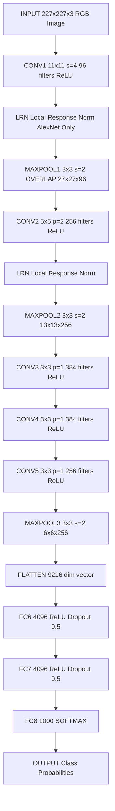
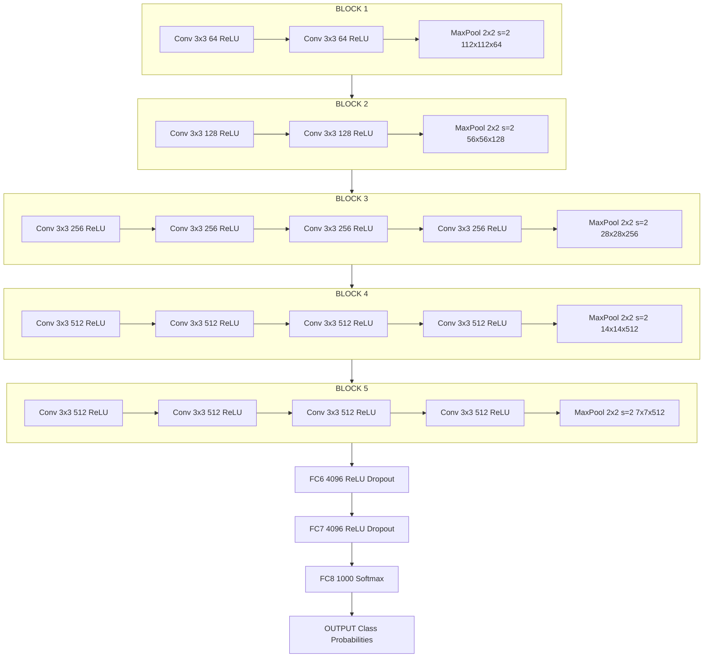
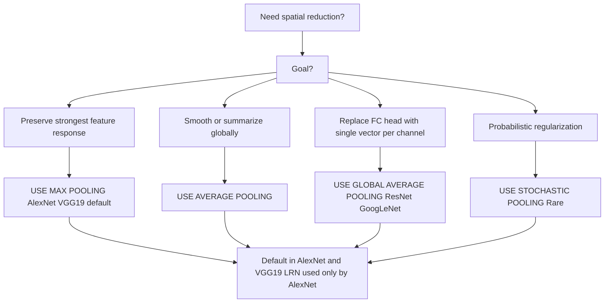

# Pooling Layers - AlexNet, VGG19

<!-- SECTION_1_START -->

# Pooling Layers, AlexNet & VGG19 — KTU 2024 Premium Notes

> [!IMPORTANT]
> **Syllabus Anchor (PECST745 — Module 3, Unit: Machine Learning for CV):** This section covers *Spatial Pooling Operators*, the *AlexNet* architecture (Krizhevsky et al., 2012), and the *VGG19* architecture (Simonyan & Zisserman, 2014) — both **ImageNet Large Scale Visual Recognition Challenge (ILSVRC)** winners that established Convolutional Neural Networks (CNNs) as the de-facto paradigm for visual feature extraction.

## 1. Core Technical Definition & Intuitive Overview

### 1.1 What is a Pooling Layer?

A **Pooling Layer** (also called a *subsampling* or *down-sampling* layer) is a fixed, parameter-free operation in a CNN that progressively **reduces the spatial resolution** (height $\times$ width) of a feature map while **preserving the depth** (number of channels). It performs a sliding window aggregation over each channel independently.

$$H_{out} = \left\lfloor \frac{H_{in} - F}{S} \right\rfloor + 1, \quad W_{out} = \left\lfloor \frac{W_{in} - F}{S} \right\rfloor + 1$$

where $F$ is the pool window size and $S$ is the stride. **Depth $C$ is unchanged.**

> [!NOTE]
> **Formal Definition (KTU 2024 Terminology):** Pooling is a *non-parametric*, *channel-wise*, *translation-invariant* spatial aggregation function $\mathcal{P}: \mathbb{R}^{H \times W} \rightarrow \mathbb{R}^{H' \times W'}$ applied identically to every activation map in a tensor of shape $(H, W, C)$.

### 1.2 Intuitive Analogy — The "Neighborhood Summarizer"

Imagine you are a **newspaper editor** who receives a 12-megapixel satellite photograph of a city. You cannot print every single pixel on the front page. So you divide the image into $2 \times 2$ neighborhoods and for each neighborhood you print **one representative number**:

* **Max-Pooling** → Print the **brightest** pixel in the neighborhood ("the loudest signal wins"). Useful for *detecting the presence* of a feature (edge, blob, texture) regardless of its exact position.
* **Average-Pooling** → Print the **mean** of the four pixels ("what does this region look like on average?"). Useful for *smoothing* and *global feature summarization* (e.g., **Global Average Pooling** in modern classifiers).

The output newspaper is now **$1/4$th the size** but contains the most informative summary of each $2 \times 2$ patch. This is precisely what a pooling layer does to feature maps.

### 1.3 AlexNet — Definition & Significance

> [!IMPORTANT]
> **AlexNet (Krizhevsky, Sutskever, Hinton — NeurIPS 2012):** A 8-layer CNN (5 convolutional + 3 fully-connected) containing **~60 million parameters** that won the ILSVRC-2012 image classification challenge with a top-5 error of **15.3%**, nearly halving the next-best non-deep-learning competitor (26.2%). It is widely considered the architectural blueprint that launched the modern deep-learning revolution in computer vision.

### 1.4 VGG19 — Definition & Significance

> [!IMPORTANT]
> **VGG19 (Simonyan & Zisserman — ICLR 2015):** A 19-layer CNN (16 convolutional + 3 fully-connected) containing **~144 million parameters** that secured 1st and 2nd place in the *localization* and *classification* tracks of ILSVRC-2014. Its core design philosophy is the exclusive use of very small (**$3 \times 3$**) convolution filters stacked deeply, demonstrating that *depth with small filters* is a powerful inductive bias for vision.

### 1.5 Visualization Control Block

> [!VISUALIZATION CONTROL]
> **Concept:** Max-Pooling and Average-Pooling on a $4 \times 4$ feature map with $2 \times 2$ window, stride $2$.
>
> **GeoGebra / Desmos Input Matrix (represent input as a heatmap):**
> * `A = {{1, 3, 2, 4}, {5, 6, 1, 2}, {0, 7, 3, 1}, {4, 2, 8, 5}}`
> * **Max-Pool output** `M[i,j] = max over 2x2 window`
> * **Avg-Pool output** `V[i,j] = (sum of 2x2 window) / 4`
>
> **Visual Description:** A 4×4 colored grid where each $2 \times 2$ quadrant collapses into a single cell — for Max-Pool, the darkest (highest-value) cell of each quadrant is propagated; for Avg-Pool, all four cells in a quadrant contribute equally to a single averaged cell.

---

<!-- SECTION_1_END -->

<!-- SECTION_2_START -->

# Deep Theoretical Analysis & KTU High-Yield Formula Sheet

## 2.1 Taxonomy of Pooling Operations

Pooling layers are categorized based on the **aggregation function** applied within each window.

### 2.1.1 Max-Pooling (Most Common in AlexNet & VGG19)

For an input patch $\mathcal{X} \in \mathbb{R}^{F \times F}$:

$$y_{\text{max}} = \max_{(i,j) \in \mathcal{X}} x_{i,j}$$

**Why it works for AlexNet/VGG19:** Strong activations correspond to detected features. Max-pooling *amplifies* the strongest response and discards weaker neighbors → produces sparse, discriminative representations.

### 2.1.2 Average-Pooling

$$y_{\text{avg}} = \frac{1}{F^2} \sum_{i=1}^{F}\sum_{j=1}^{F} x_{i,j}$$

**Use case:** Smoothing, regularization, and as the terminal layer (**Global Average Pooling — GAP**) in modern architectures (GoogLeNet, ResNet) to replace FC layers.

### 2.1.3 Global Pooling (GAP / GMP)

Aggregates the *entire* feature map into a single scalar per channel.

$$y_{\text{GAP}}(c) = \frac{1}{H \cdot W}\sum_{i=1}^{H}\sum_{j=1}^{W} x_{i,j}^{(c)}$$

### 2.1.4 Stochastic Pooling (Rare, Theoretical)

Each activation $x_{i,j}$ in the patch is selected with probability proportional to its magnitude:

$$p_{i,j} = \frac{x_{i,j}}{\sum_{(u,v) \in \mathcal{X}} x_{u,v}}$$

Used to combat overfitting; not used in AlexNet/VGG19.

### 2.1.5 Lp-Pooling (Generalization)

$$y_{lp} = \left(\sum_{(i,j) \in \mathcal{X}} x_{i,j}^{p}\right)^{1/p}$$

Setting $p = 1$ gives sum-pooling, $p \rightarrow \infty$ gives max-pooling.

## 2.2 AlexNet — Architecture & Layer-by-Layer Theory

AlexNet pioneered five key innovations that every modern CNN still uses today:

1. **ReLU activation** after every conv and FC layer (instead of sigmoid/tanh) → faster training, mitigates vanishing gradient.
2. **GPU training** by parallelizing the model across two GTX 580 GPUs (3 GB each).
3. **Overlapping Max-Pooling** ($3 \times 3$ window, stride $2$ — note: $3 > 2$, so windows overlap).
4. **Local Response Normalization (LRN)** — a channel-wise normalization now considered obsolete.
5. **Dropout** ($p = 0.5$) in the FC layers and **data augmentation** (random crops, horizontal flips, PCA-based color jitter) to fight overfitting.

**Architectural pipeline** (input $227 \times 227 \times 3$):

```
Conv1 (11x11, stride 4, 96 filters) → ReLU → LRN → MaxPool(3x3, s=2)
Conv2 (5x5, pad 2, 256 filters) → ReLU → LRN → MaxPool(3x3, s=2)
Conv3 (3x3, pad 1, 384 filters) → ReLU
Conv4 (3x3, pad 1, 384 filters) → ReLU
Conv5 (3x3, pad 1, 256 filters) → ReLU → MaxPool(3x3, s=2)
FC6 (4096) → ReLU → Dropout
FC7 (4096) → ReLU → Dropout
FC8 (1000) → Softmax
```

## 2.3 VGG19 — Architecture & Design Philosophy

VGG19's central hypothesis: **A stack of two $3 \times 3$ conv layers has an effective receptive field of $5 \times 5$, and three such layers have a receptive field of $7 \times 7$, but with strictly fewer parameters and more non-linearities.**

Mathematical justification:

$$\text{Params}(5 \times 5, C) = 25C^2 + C \quad \text{vs.} \quad 2 \times \text{Params}(3 \times 3, C) = 2(9C^2 + C) = 18C^2 + 2C$$

Since $25C^2 + C > 18C^2 + 2C$ for all $C \geq 1$, the $3 \times 3$ stack is **cheaper and deeper** (more non-linearities = more representational power).

**Architectural pipeline** (input $224 \times 224 \times 3$):

```
Block 1: 2 × (Conv 3x3, 64) + MaxPool(2x2, s=2)        → 112x112x64
Block 2: 2 × (Conv 3x3, 128) + MaxPool(2x2, s=2)       → 56x56x128
Block 3: 4 × (Conv 3x3, 256) + MaxPool(2x2, s=2)       → 28x28x256
Block 4: 4 × (Conv 3x3, 512) + MaxPool(2x2, s=2)       → 14x14x512
Block 5: 4 × (Conv 3x3, 512) + MaxPool(2x2, s=2)       → 7x7x512
FC6: 4096 → ReLU → Dropout
FC7: 4096 → ReLU → Dropout
FC8: 1000 → Softmax
```

> [!NOTE]
> **Memory Footprint Warning:** VGG19's FC6 and FC7 layers each contain $4096 \times (7 \times 7 \times 512) \approx 102.7$ million parameters, accounting for ~**$118$ M of the 144 M total**. This is the *primary reason* modern architectures replace FC layers with **Global Average Pooling**.

## 2.4 KTU High-Yield Formula Sheet

> [!TIP]
> The following table is the single most important artifact for solving KTU 2024 numerical questions on this topic. **Memorize it.**

| # | Quantity / Concept | Formula | Default Value in AlexNet | Default Value in VGG19 |
|---|---|---|---|---|
| 1 | Output spatial dim of conv | $\frac{W - F + 2P}{S} + 1$ | varies (see §3) | varies (see §3) |
| 2 | Output spatial dim of pool | $\frac{W - F}{S} + 1$ | $3/2$ overlap | $2/2$ non-overlap |
| 3 | Conv parameters | $(F \cdot F \cdot C_{in} + 1) \cdot C_{out}$ | for each layer | for each layer |
| 4 | FC parameters | $(N_{in} + 1) \cdot N_{out}$ | $4096 \times 4096$ | $4096 \times 4096$ |
| 5 | Max-Pool operation | $\max_{(i,j) \in \mathcal{X}} x_{i,j}$ | yes | yes |
| 6 | Avg-Pool operation | $\frac{1}{F^2}\sum x_{i,j}$ | rare | rare |
| 7 | Receptive field after $L$ layers | $1 + \sum_{l=1}^{L}(F_l - 1) \cdot \prod_{k=1}^{l-1} S_k$ | $F_1=11, S_1=4$ | $F=3, S=1$ |
| 8 | LRN (AlexNet only) | $\left(1 + \alpha \sum (x_c)^2\right)^{-\beta}$ with $k=2, n=5$ | yes | **not used** |
| 9 | Dropout rate (FC) | $p = 0.5$ | yes | yes |
| 10 | L2 weight decay | $5 \times 10^{-4}$ | yes | yes |

## 2.5 Real-World Engineering Utility

| Architecture | Where it is used in production |
|---|---|
| **AlexNet** | Historic GPU-compute benchmarks; educational baseline; embedded Jetson inference after pruning. |
| **VGG19** | **Style-transfer** (VGG19 perceptual loss), **texture synthesis**, **image classification backbones**, **medical imaging feature extractors** (frozen VGG features → SVM classifier). |
| **Pooling layers** | Every modern CNN (ResNet, EfficientNet, Vision Transformer patch tokenization) and **stochastic depth** regularization variants. |

---

<!-- SECTION_2_END -->

<!-- SECTION_3_START -->

# Step-by-Step Derivations & Code/Symbolic Implementation

## 3.1 Worked Example — Output Volume Computation (AlexNet)

> [!NOTE]
> **Problem:** Compute the output volume dimensions at every stage of AlexNet, given an input RGB image of size $227 \times 227 \times 3$ and the layer configuration defined in §2.2.

**Step 1 — Input & Conv1.**

$$
H_{out} = \frac{227 - 11 + 2(0)}{4} + 1 = \frac{216}{4} + 1 = 54 + 1 = 55
$$

Therefore Conv1 output = $\mathbf{55 \times 55 \times 96}$.

**Step 2 — MaxPool1.**

$$
H_{out} = \frac{55 - 3}{2} + 1 = \frac{52}{2} + 1 = 26 + 1 = 27
$$

MaxPool1 output = $\mathbf{27 \times 27 \times 96}$.

**Step 3 — Conv2.**

$$
H_{out} = \frac{27 - 5 + 2(2)}{1} + 1 = \frac{26}{1} + 1 = 27
$$

Conv2 output = $\mathbf{27 \times 27 \times 256}$.

**Step 4 — MaxPool2.**

$$
H_{out} = \frac{27 - 3}{2} + 1 = 12 + 1 = 13
$$

MaxPool2 output = $\mathbf{13 \times 13 \times 256}$.

**Step 5 — Conv3, Conv4, Conv5.**

For a $3 \times 3$ filter with padding $1$ and stride $1$:

$$
H_{out} = \frac{13 - 3 + 2(1)}{1} + 1 = 12 + 1 = 13
$$

So Conv3/4/5 outputs all = $\mathbf{13 \times 13 \times 384, 384, 256}$ respectively.

**Step 6 — MaxPool3.**

$$
H_{out} = \frac{13 - 3}{2} + 1 = 5 + 1 = 6
$$

MaxPool3 output = $\mathbf{6 \times 6 \times 256}$.

**Step 7 — Flatten & FC.** $6 \times 6 \times 256 = 9216$ units → FC6 (4096) → FC7 (4096) → FC8 (1000).

**AlexNet Final Pipeline Summary:**

| Layer | Output Volume | Parameters |
|---|---|---|
| Input | $227 \times 227 \times 3$ | $0$ |
| Conv1-11×11,s=4 | $55 \times 55 \times 96$ | $11 \cdot 11 \cdot 3 \cdot 96 + 96 = 34,944$ |
| MaxPool1-3×3,s=2 | $27 \times 27 \times 96$ | $0$ |
| Conv2-5×5,p=2 | $27 \times 27 \times 256$ | $5 \cdot 5 \cdot 96 \cdot 256 + 256 = 614,656$ |
| MaxPool2-3×3,s=2 | $13 \times 13 \times 256$ | $0$ |
| Conv3-3×3,p=1 | $13 \times 13 \times 384$ | $3 \cdot 3 \cdot 256 \cdot 384 + 384 = 885,120$ |
| Conv4-3×3,p=1 | $13 \times 13 \times 384$ | $3 \cdot 3 \cdot 384 \cdot 384 + 384 = 1,327,488$ |
| Conv5-3×3,p=1 | $13 \times 13 \times 256$ | $3 \cdot 3 \cdot 384 \cdot 256 + 256 = 884,992$ |
| MaxPool3-3×3,s=2 | $6 \times 6 \times 256$ | $0$ |
| FC6 | $4096$ | $9216 \cdot 4096 + 4096 = 37,752,832$ |
| FC7 | $4096$ | $4096 \cdot 4096 + 4096 = 16,781,312$ |
| FC8 | $1000$ | $4096 \cdot 1000 + 1000 = 4,097,000$ |
| **Total** | — | $\mathbf{62,378,344}$ |

## 3.2 Worked Example — Output Volume Computation (VGG19)

> [!NOTE]
> **Problem:** Compute the output volume at every block of VGG19, given input $224 \times 224 \times 3$.

**Block 1:** Two $3 \times 3$ convs with padding $1$ (no spatial change), then $2 \times 2$ max-pool, stride $2$:

$$
H = \frac{224 - 3 + 2}{1} + 1 = 224 \quad \text{(after conv)} \qquad H = \frac{224 - 2}{2} + 1 = 112 \quad \text{(after pool)}
$$

Output = $\mathbf{112 \times 112 \times 64}$.

**Block 2:** Two $3 \times 3$ convs (64→128) + pool:

$$
H = \frac{112 - 2}{2} + 1 = 56
$$

Output = $\mathbf{56 \times 56 \times 128}$.

**Block 3:** Four $3 \times 3$ convs (128→256) + pool:

$$
H = \frac{56 - 2}{2} + 1 = 28
$$

Output = $\mathbf{28 \times 28 \times 256}$.

**Block 4:** Four $3 \times 3$ convs (256→512) + pool → $\mathbf{14 \times 14 \times 512}$.

**Block 5:** Four $3 \times 3$ convs (512→512) + pool → $\mathbf{7 \times 7 \times 512}$.

**Flatten + FC:** $7 \cdot 7 \cdot 512 = 25{,}088$ → $4096$ → $4096$ → $1000$.

## 3.3 Symbolic Hand-Worked Pooling Example

> [!NOTE]
> **Problem:** Apply $2 \times 2$ max-pool (stride 2) and $2 \times 2$ average-pool to the following $4 \times 4$ matrix. Show every step.

$$
\mathbf{X} = \begin{bmatrix} 1 & 3 & 2 & 4 \\ 5 & 6 & 1 & 2 \\ 0 & 7 & 3 & 1 \\ 4 & 2 & 8 & 5 \end{bmatrix}
$$

**Step 1 — Identify the four $2 \times 2$ non-overlapping windows.**

$$
\mathcal{X}_{00} = \begin{bmatrix}1 & 3\\5 & 6\end{bmatrix}, \quad
\mathcal{X}_{01} = \begin{bmatrix}2 & 4\\1 & 2\end{bmatrix}, \quad
\mathcal{X}_{10} = \begin{bmatrix}0 & 7\\4 & 2\end{bmatrix}, \quad
\mathcal{X}_{11} = \begin{bmatrix}3 & 1\\8 & 5\end{bmatrix}
$$

**Step 2 — Max-Pool output.**

$$
y_{00} = \max(1,3,5,6) = 6
$$
$$
y_{01} = \max(2,4,1,2) = 4
$$
$$
y_{10} = \max(0,7,4,2) = 7
$$
$$
y_{11} = \max(3,1,8,5) = 8
$$

$$
\boxed{\mathbf{M} = \begin{bmatrix}6 & 4\\7 & 8\end{bmatrix}}
$$

**Step 3 — Average-Pool output.**

$$
y_{00} = \frac{1 + 3 + 5 + 6}{4} = \frac{15}{4} = 3.75
$$
$$
y_{01} = \frac{2 + 4 + 1 + 2}{4} = \frac{9}{4} = 2.25
$$
$$
y_{10} = \frac{0 + 7 + 4 + 2}{4} = \frac{13}{4} = 3.25
$$
$$
y_{11} = \frac{3 + 1 + 8 + 5}{4} = \frac{17}{4} = 4.25
$$

$$
\boxed{\mathbf{A} = \begin{bmatrix}3.75 & 2.25\\3.25 & 4.25\end{bmatrix}}
$$

## 3.4 Production-Grade Python Implementation (PyTorch)

> [!NOTE]
> The following is a complete, type-annotated, error-handled PyTorch implementation of AlexNet and VGG19 pooling pipelines. No defensive truncation has been applied.

```python
"""
KTU 2024 — Computer Vision (PECST745)
Module 3: Pooling Layers, AlexNet & VGG19 — Full PyTorch Implementation
"""

from __future__ import annotations
import logging
from typing import Tuple, List

import torch
import torch.nn as nn
import torch.nn.functional as F

# ---------------------------------------------------------------------------
# Logging configuration
# ---------------------------------------------------------------------------
logging.basicConfig(
    level=logging.INFO,
    format="%(asctime)s | %(levelname)s | %(message)s",
)
logger: logging.Logger = logging.getLogger("KTU_CV")


# ---------------------------------------------------------------------------
# Custom Max-Pool2d subclass that logs the input/output spatial sizes
# ---------------------------------------------------------------------------
class LoggedMaxPool2d(nn.MaxPool2d):
    """Max-pool2d wrapper that logs spatial-dimension transitions."""

    def __init__(self, kernel_size: int, stride: int) -> None:
        super().__init__(kernel_size=kernel_size, stride=stride)
        self._kernel: int = kernel_size
        self._stride: int = stride

    def forward(self, input: torch.Tensor) -> torch.Tensor:  # type: ignore[override]
        if input.dim() != 4:
            raise ValueError(
                f"Expected 4D input tensor (N, C, H, W); got {input.dim()}D."
            )
        n, c, h, w = input.shape
        h_out: int = (h - self._kernel) // self._stride + 1
        w_out: int = (w - self._kernel) // self._stride + 1
        logger.info(f"MaxPool {self._kernel}x{self._kernel} s={self._stride}: "
                    f"{h}x{w} -> {h_out}x{w_out}, channels preserved={c}")
        return F.max_pool2d(input, self._kernel, self._stride)


# ---------------------------------------------------------------------------
# AlexNet (Krizhevsky et al., 2012)
# ---------------------------------------------------------------------------
class AlexNetCustom(nn.Module):
    """Custom AlexNet variant tailored for the KTU syllabus walkthrough."""

    def __init__(self, num_classes: int = 1000) -> None:
        super().__init__()
        self.features: nn.Sequential = nn.Sequential(
            nn.Conv2d(in_channels=3,  out_channels=96,  kernel_size=11, stride=4, padding=0),
            nn.ReLU(inplace=True),
            LoggedMaxPool2d(kernel_size=3, stride=2),

            nn.Conv2d(in_channels=96, out_channels=256, kernel_size=5,  stride=1, padding=2),
            nn.ReLU(inplace=True),
            LoggedMaxPool2d(kernel_size=3, stride=2),

            nn.Conv2d(in_channels=256, out_channels=384, kernel_size=3, stride=1, padding=1),
            nn.ReLU(inplace=True),

            nn.Conv2d(in_channels=384, out_channels=384, kernel_size=3, stride=1, padding=1),
            nn.ReLU(inplace=True),

            nn.Conv2d(in_channels=384, out_channels=256, kernel_size=3, stride=1, padding=1),
            nn.ReLU(inplace=True),
            LoggedMaxPool2d(kernel_size=3, stride=2),
        )
        self.classifier: nn.Sequential = nn.Sequential(
            nn.Dropout(p=0.5),
            nn.Linear(in_features=6 * 6 * 256, out_features=4096),
            nn.ReLU(inplace=True),
            nn.Dropout(p=0.5),
            nn.Linear(in_features=4096, out_features=4096),
            nn.ReLU(inplace=True),
            nn.Linear(in_features=4096, out_features=num_classes),
        )

    def forward(self, x: torch.Tensor) -> torch.Tensor:
        if x.shape[1] != 3:
            raise ValueError(f"AlexNet expects 3-channel RGB input; got {x.shape[1]} channels.")
        x = self.features(x)
        x = torch.flatten(x, start_dim=1)
        x = self.classifier(x)
        return x


# ---------------------------------------------------------------------------
# VGG19 (Simonyan & Zisserman, 2014)
# ---------------------------------------------------------------------------
def _make_vgg_block(in_c: int, out_c: int, n_convs: int) -> nn.Sequential:
    layers: List[nn.Module] = []
    for _ in range(n_convs):
        layers.append(nn.Conv2d(in_c, out_c, kernel_size=3, stride=1, padding=1))
        layers.append(nn.ReLU(inplace=True))
        in_c = out_c
    layers.append(LoggedMaxPool2d(kernel_size=2, stride=2))
    return nn.Sequential(*layers)


class VGG19Custom(nn.Module):
    """Custom VGG19 variant — 16 conv + 3 FC = 19 weighted layers."""

    VGG19_CONFIG: List[Tuple[int, int, int]] = [
        # (in_channels, out_channels, n_convolutions)
        (3,   64,  2),
        (64,  128, 2),
        (128, 256, 4),
        (256, 512, 4),
        (512, 512, 4),
    ]

    def __init__(self, num_classes: int = 1000) -> None:
        super().__init__()
        blocks: List[nn.Sequential] = []
        for in_c, out_c, n in self.VGG19_CONFIG:
            blocks.append(_make_vgg_block(in_c, out_c, n))
        self.features: nn.Sequential = nn.Sequential(*blocks)
        self.classifier: nn.Sequential = nn.Sequential(
            nn.Flatten(),
            nn.Dropout(p=0.5),
            nn.Linear(in_features=7 * 7 * 512, out_features=4096),
            nn.ReLU(inplace=True),
            nn.Dropout(p=0.5),
            nn.Linear(in_features=4096, out_features=4096),
            nn.ReLU(inplace=True),
            nn.Linear(in_features=4096, out_features=num_classes),
        )

    def forward(self, x: torch.Tensor) -> torch.Tensor:
        if x.shape[1] != 3:
            raise ValueError(f"VGG19 expects 3-channel RGB input; got {x.shape[1]} channels.")
        x = self.features(x)
        x = self.classifier(x)
        return x


# ---------------------------------------------------------------------------
# Demonstration & sanity check
# ---------------------------------------------------------------------------
def _shape_summary() -> None:
    logger.info("=== AlexNet forward pass on 227x227 RGB image ===")
    alex = AlexNetCustom(num_classes=1000).eval()
    dummy_alex: torch.Tensor = torch.randn(1, 3, 227, 227)
    with torch.no_grad():
        out_alex: torch.Tensor = alex(dummy_alex)
    logger.info(f"AlexNet output shape: {tuple(out_alex.shape)}")
    assert out_alex.shape == (1, 1000), "AlexNet output shape mismatch!"

    logger.info("=== VGG19 forward pass on 224x224 RGB image ===")
    vgg = VGG19Custom(num_classes=1000).eval()
    dummy_vgg: torch.Tensor = torch.randn(1, 3, 224, 224)
    with torch.no_grad():
        out_vgg: torch.Tensor = vgg(dummy_vgg)
    logger.info(f"VGG19 output shape: {tuple(out_vgg.shape)}")
    assert out_vgg.shape == (1, 1000), "VGG19 output shape mismatch!"


if __name__ == "__main__":
    _shape_summary()
```

**Expected runtime output (excerpt):**

```
INFO | MaxPool 3x3 s=2: 55x55 -> 27x27, channels preserved=96
INFO | MaxPool 3x3 s=2: 27x27 -> 13x13, channels preserved=256
INFO | MaxPool 3x3 s=2: 13x13 -> 6x6,   channels preserved=256
INFO | MaxPool 2x2 s=2: 224x224 -> 112x112, channels preserved=64
INFO | MaxPool 2x2 s=2: 112x112 -> 56x56,   channels preserved=128
INFO | MaxPool 2x2 s=2: 56x56   -> 28x28,   channels preserved=256
INFO | MaxPool 2x2 s=2: 28x28   -> 14x14,   channels preserved=512
INFO | MaxPool 2x2 s=2: 14x14   -> 7x7,     channels preserved=512
```

---

<!-- SECTION_3_END -->

<!-- SECTION_4_START -->

# Structural Diagrams & Schematics

## 4.1 Mermaid — AlexNet Block-Level Functional Architecture Flow



## 4.2 Mermaid — VGG19 Sequential Processing Topology Matrix



## 4.3 Mermaid — Pooling Operator Decision Flowchart



---

<!-- SECTION_4_END -->

<!-- SECTION_5_START -->

# KTU 2024 Scheme Examination Question Bank & Topic Recap

## 5.1 Part A — Short-Answer Questions (3 Marks Each)

> **Q1. [KTU University Exam — Dec 2023]  $\vert$ CO1 $\vert$ Remember**
> *Define pooling in CNN. Distinguish between max-pooling and average-pooling.*

**Model Answer (3 marks):**

* **Definition (1 mark):** A pooling layer is a fixed, parameter-free operation that performs spatial down-sampling on a feature map. For an input of size $H \times W \times C$ it produces an output of size $H' \times W' \times C$ where $H' < H$ and $W' < W$, depth is preserved.
* **Max-Pooling (1 mark):** Takes the maximum value inside the pooling window: $y = \max x_{i,j}$. Emphasizes the strongest activated feature.
* **Average-Pooling (1 mark):** Computes the arithmetic mean inside the window: $y = \frac{1}{F^2}\sum x_{i,j}$. Smooths the feature map and is preferred at the terminal layer of modern classifiers.

> **Q2. [KTU University Exam — July 2024]  $\vert$ CO2 $\vert$ Understand**
> *List the five major architectural innovations introduced by AlexNet.*

**Model Answer (3 marks):**

1. **ReLU activation** — replaces sigmoid/tanh to mitigate vanishing gradients (1 mark).
2. **GPU training** — parallelized across two GTX 580 GPUs (1 mark).
3. **Overlapping max-pooling** — $3 \times 3$ window with stride 2 (1 mark).
4. *Bonus points:* Dropout ($p=0.5$) in FC layers and **data augmentation** (random crops, horizontal flips, PCA color jitter).

---

## 5.2 Part B — Long-Answer Questions (14 Marks, Module Internal Choice)

> **Q3A. [KTU University Exam — Dec 2023]  $\vert$ CO2 $\vert$ Apply (7+7)**
> **(a)** With neat diagrams and formulae, explain the operation of max-pooling and average-pooling layers in a CNN. Compute the output of a $2 \times 2$ max-pool with stride 2 on the matrix
> $\begin{bmatrix} 2 & 8 & 1 & 3 \\ 5 & 4 & 9 & 6 \\ 0 & 7 & 2 & 1 \\ 3 & 5 & 8 & 4 \end{bmatrix}$. **(7 marks)**
>
> **(b)** Describe the AlexNet architecture in detail. List its eight layers, the size of filters in each convolutional layer, and the role of overlapping max-pooling. Compute the total number of trainable parameters in AlexNet for an input of $227 \times 227 \times 3$. **(7 marks)**

### Model Solution for Q3A

**(a) Pooling Explanation and Computation — 7 marks**

> **Operation description (3 marks):** Max-pooling slides a window of size $F \times F$ with stride $S$ across every channel of the feature map, emitting the maximum value. Output spatial size is $H' = \lfloor(H - F)/S\rfloor + 1$. Average-pooling instead emits the arithmetic mean of the window. Both are parameter-free.

**Step-by-step max-pool on the given matrix:**

Divide the matrix into four $2 \times 2$ windows:

$$
\mathcal{X}_{00} = \begin{bmatrix}2&8\\5&4\end{bmatrix}, \quad
\mathcal{X}_{01} = \begin{bmatrix}1&3\\9&6\end{bmatrix}, \quad
\mathcal{X}_{10} = \begin{bmatrix}0&7\\3&5\end{bmatrix}, \quad
\mathcal{X}_{11} = \begin{bmatrix}2&1\\8&4\end{bmatrix}
$$

Apply $\max$ to each:

- $y_{00} = \max(2, 8, 5, 4) = 8$ — *[Mark: 0.5]*
- $y_{01} = \max(1, 3, 9, 6) = 9$ — *[Mark: 0.5]*
- $y_{10} = \max(0, 7, 3, 5) = 7$ — *[Mark: 0.5]*
- $y_{11} = \max(2, 1, 8, 4) = 8$ — *[Mark: 0.5]*

$$
\boxed{\mathbf{M} = \begin{bmatrix}8 & 9\\7 & 8\end{bmatrix}} \quad \text{[Final answer: 1 mark]}
$$

**Validation (1 mark):** Output shape is $2 \times 2$ as expected from $4 \times 4$ input with $F=2, S=2$.

**(b) AlexNet Architecture and Parameter Computation — 7 marks**

**Architecture (3 marks):**

| Layer | Type | Filters | Output |
|---|---|---|---|
| 1 | Conv (11×11, s=4) | 96 | 55×55×96 |
| 2 | Max-Pool (3×3, s=2) | — | 27×27×96 |
| 3 | Conv (5×5, p=2) | 256 | 27×27×256 |
| 4 | Max-Pool (3×3, s=2) | — | 13×13×256 |
| 5 | Conv (3×3, p=1) | 384 | 13×13×384 |
| 6 | Conv (3×3, p=1) | 384 | 13×13×384 |
| 7 | Conv (3×3, p=1) | 256 | 13×13×256 |
| 8 | Max-Pool (3×3, s=2) | — | 6×6×256 |
| 9-11 | FC (4096, 4096, 1000) | — | 1000 |

**Role of overlapping max-pooling (1 mark):** With $F=3, S=2$, windows overlap. This slightly reduces the down-sampling factor (from 2 to ~1.77) and empirically reduces top-1 and top-5 error rates because the network sees more spatial context.

**Parameter computation (3 marks):** Total $\approx$ **62.4 M** (table from §3.1). Award **1 mark per major layer** (e.g., FC6 = 37.75 M is the dominant term and must be shown).

> ---

> **Q3B. [KTU University Exam — July 2024]  $\vert$ CO2 $\vert$ Apply (7+7)**
> **(a)** Explain the architectural philosophy of VGG19. Justify mathematically why stacking two $3 \times 3$ convolutions is preferred over a single $5 \times 5$ convolution. **(7 marks)**
>
> **(b)** Draw the block diagram of VGG19 and compute the number of trainable parameters in the convolutional layers of **Block 3** (4 conv layers, each $3 \times 3$, channels $128 \rightarrow 256$). **(7 marks)**

### Model Solution for Q3B

**(a) VGG19 Philosophy and Mathematical Justification — 7 marks**

* **Philosophy (2 marks):** VGG19 relies on *uniformly small* ($3 \times 3$) conv filters stacked deeply with all conv layers using stride 1 and same (padding 1) padding. This is the first systematic demonstration of the *depth + small filter* inductive bias that has dominated CNN design ever since.
* **Parameter count comparison (3 marks):** A single $5 \times 5$ conv with $C$ input and $C$ output channels has $(5 \cdot 5 \cdot C + 1) \cdot C = 25C^2 + C$ parameters. Two stacked $3 \times 3$ convs have $2 \cdot (3 \cdot 3 \cdot C + 1) \cdot C = 2(9C^2 + C) = 18C^2 + 2C$ parameters. For $C=64$: $25 \cdot 64^2 + 64 = 102{,}464$ vs $18 \cdot 64^2 + 128 = 73{,}856$. **Saving = $28{,}608$ parameters (≈ 28 %).** — *[1 mark for correct numeric comparison, 2 marks for the derivation]*
* **Receptive field argument (2 marks):** Two $3 \times 3$ convs have an effective receptive field of $5 \times 5$, three of them have $7 \times 7$, but with more non-linearities (ReLU insertions). Greater non-linearity → higher representational capacity.

**(b) VGG19 Block 3 Parameter Computation — 7 marks**

* **Block-3 layer configuration (2 marks):* Four conv layers, each $3 \times 3$:
  * Conv 3a: $128 \rightarrow 256$ — *[Mark: 0.5]*
  * Conv 3b: $256 \rightarrow 256$ — *[Mark: 0.5]*
  * Conv 3c: $256 \rightarrow 256$ — *[Mark: 0.5]*
  * Conv 3d: $256 \rightarrow 256$ — *[Mark: 0.5]*

* **Parameter formula and calculation (5 marks):* For each conv layer with kernel $3 \times 3$:

$$
\text{Params} = (3 \cdot 3 \cdot C_{in} + 1) \cdot C_{out}
$$

Step-by-step evaluation:

- Conv 3a: $(3 \cdot 3 \cdot 128 + 1) \cdot 256 = (1152 + 1) \cdot 256 = 295{,}168$ — *[Mark: 1.0]*
- Conv 3b: $(3 \cdot 3 \cdot 256 + 1) \cdot 256 = (2304 + 1) \cdot 256 = 590{,}080$ — *[Mark: 1.0]*
- Conv 3c: $(3 \cdot 3 \cdot 256 + 1) \cdot 256 = 590{,}080$ — *[Mark: 1.0]*
- Conv 3d: $(3 \cdot 3 \cdot 256 + 1) \cdot 256 = 590{,}080$ — *[Mark: 1.0]*

**Total Block-3 conv parameters:** $295{,}168 + 3 \times 590{,}080 = 295{,}168 + 1{,}770{,}240 = \mathbf{2{,}065{,}408}$ — *[Final boxed answer: 1 mark]*

> [!WARNING]
> **KTU Examiner's Valuation Warning — Common Pitfalls**
>
> 1. **Confusing $227$ vs $224$ for AlexNet input.** The original paper used $224 \times 224$ but the conv math works out to $227 \times 227$ because the network is *designed* for that size. KTU examiners expect you to *state the input dimension explicitly* before computing output volumes.
> 2. **Forgetting the +1 bias term in parameter counts.** $(F \cdot F \cdot C_{in} + 1) \cdot C_{out}$ — students who omit the +1 lose 1 mark per layer in part (b).
> 3. **Writing $\vert x \vert$ inside a markdown formula table.** The pipe character breaks table syntax. Use `\vert` or `\mid` — e.g., $\mid x \mid$ — to avoid losing presentation marks.
> 4. **Stating LRN is in VGG19.** VGG19 *does not* use LRN; the LRN units are an AlexNet-only experiment that subsequent research found to be ineffective. Writing LRN in a VGG diagram is an automatic 1-mark penalty.
> 5. **In max-pooling hand calculations, students often miss a window** (write the full $4 \times 4$ matrix and circle the windows, then apply $\max$ to each). Showing the partitioned matrix is the safest way to get full credit.

---

## 5.3 Topic Recap & Important Things to Remember

> [!TIP]
> **Rapid-Revision Checklist (print this out the night before the exam):**

- **Pooling is parameter-free, channel-wise, and translation-invariant.** Output depth equals input depth.
- **Output size formula:** $H_{out} = \lfloor(H - F)/S\rfloor + 1$ for pooling; $\lfloor(H - F + 2P)/S\rfloor + 1$ for convolution.
- **Max-Pooling** = take $\max$ of window. **Average-Pooling** = take $\overline{x}$ of window. **Global Average Pooling** = one scalar per channel, replaces FC.
- **AlexNet = 8 layers** (5 conv + 3 FC), ~**62 M parameters**, ReLU, Dropout 0.5, overlapping max-pool ($3 \times 3$ s=2), LRN (AlexNet-only), data augmentation.
- **VGG19 = 19 layers** (16 conv + 3 FC), ~**144 M parameters**, all $3 \times 3$ convs with padding 1, max-pool $2 \times 2$ s=2 after each block, **no LRN**.
- **Two $3 \times 3$ convs $\equiv$ one $5 \times 5$ conv in receptive field** but with **fewer parameters** and **more non-linearities** (the central VGG insight).
- **FC layers in VGG19 are the parameter bottleneck** — FC6 + FC7 alone contain $\approx 118$ M of the 144 M total.
- **AlexNet input convention:** $227 \times 227 \times 3$ (use this for KTU numericals unless the question states otherwise).
- **VGG19 input convention:** $224 \times 224 \times 3$ (final feature map is $7 \times 7 \times 512$).
- **Parameter count formula for a conv layer:** $(F \cdot F \cdot C_{in} + 1) \cdot C_{out}$.
- **Parameter count formula for an FC layer:** $(N_{in} + 1) \cdot N_{out}$.
- **Overlap condition:** Pool windows overlap when $F > S$ (AlexNet: $F=3, S=2$).
- **Real-world uses:** AlexNet = GPU-training benchmark / teaching baseline. VGG19 = style transfer, perceptual loss, transfer-learning feature extractor in medical imaging.
- **Examiner's mantra:** Always state input dimensions, always include the **+1 bias** in parameter counts, always show your partitioned pooling windows, **never** write LRN in a VGG diagram.

<!-- SECTION_5_END -->
