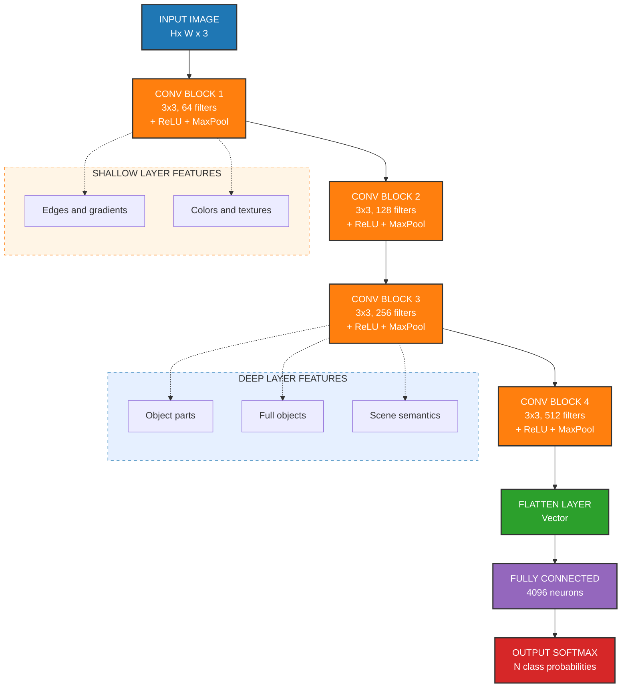
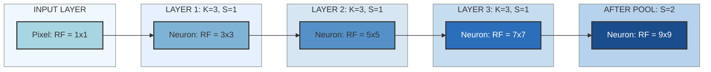
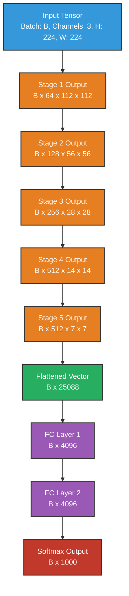
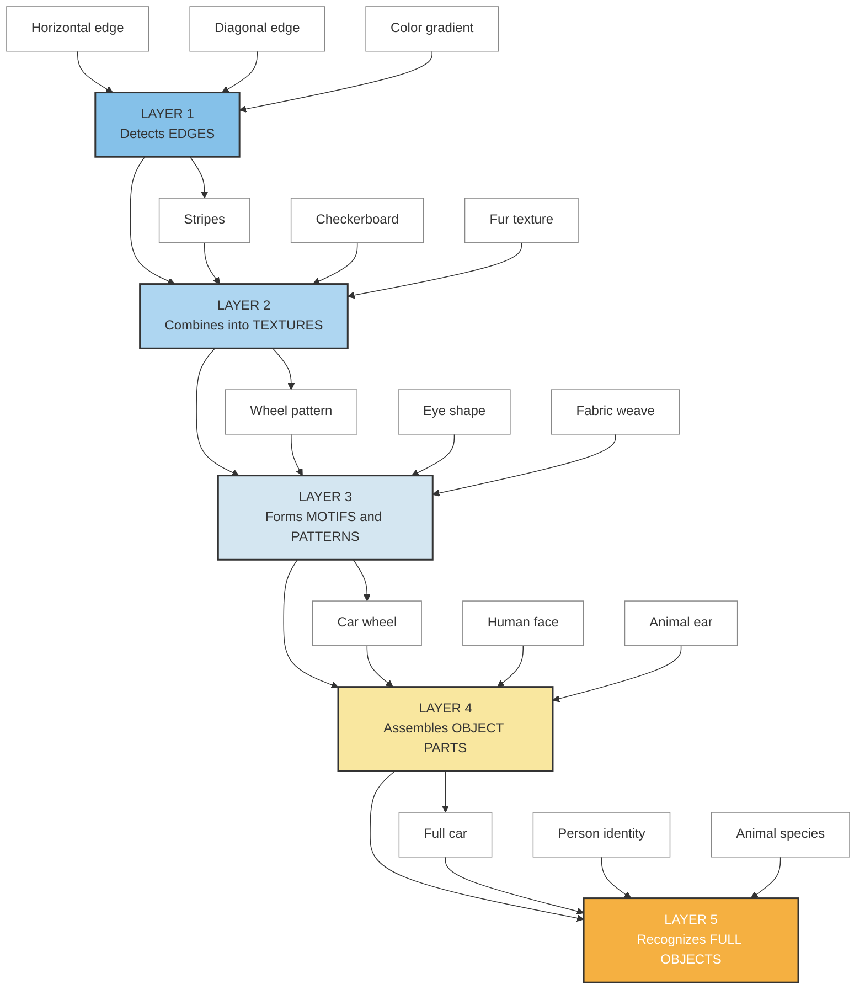

# Stacking Convolutional Layers

<!-- SECTION_1_START -->
# Stacking Convolutional Layers — Core Technical Definition & Intuitive Overview

## Formal Definition (KTU 2024 Syllabus Aligned)

**Stacking Convolutional Layers** is the architectural paradigm in Deep Convolutional Neural Networks (DCNNs) where two or more convolutional layers (often interleaved with non-linear activation functions and pooling operations) are connected in a sequential, feed-forward topology. This sequential composition enables the network to learn a **hierarchy of features** — from low-level primitives (edges, gradients, textures) in early layers to high-level semantic concepts (object parts, full objects) in deeper layers.

Mathematically, if $f^{(l)}$ denotes the transformation at layer $l$ (convolution + bias + activation), then a stacked network of $L$ layers computes:

$$
y = f^{(L)} \circ f^{(L-1)} \circ \dots \circ f^{(2)} \circ f^{(1)}(x)
$$

where $\circ$ denotes function composition and $x$ is the input image tensor.

> [!IMPORTANT]
> **KTU 2024 Syllabus Highlight (Module 3 — Machine Learning for CV):** Stacking is the foundational construction principle behind classic architectures such as **LeNet-5, AlexNet, VGG-16, and VGG-19**. The KTU board examiner expects students to justify *why* depth is preferred over width, and to compute the **receptive field, parameter count, and output tensor shape** at every layer.

## Conceptual Analogy — "The Magnifying Glass Hierarchy"

Imagine you are a detective trying to identify a suspect from a blurry CCTV frame:

- **Layer 1 (Shallow):** You first scan the entire image for *raw clues* — straight lines, corners, color blobs. These are tiny, local features.
- **Layer 2 (Mid):** You combine the lines into *patterns* — an eye-shape, a wheel-arch, a button pattern.
- **Layer 3 (Deep):** You assemble the patterns into *parts* — a face, a car-door, a shirt-collar.
- **Layer 4 (Deepest):** You finally recognize the *whole concept* — "This is Person A wearing a red shirt standing next to a white car."

**Each stacked layer is a "magnifying glass" with a wider field of view.** Stacking does not just repeat the same operation; each successive layer *integrates* the output of all previous layers, gradually expanding the **receptive field** and abstracting the representation.

> [!NOTE]
> **Key Terminology to Memorize for KTU Board Exams:**
> - **Receptive Field (RF):** The region of the input image that influences a single neuron in a given layer.
> - **Hierarchical Feature Learning:** The progressive abstraction of visual features across depth.
> - **Translation Equivariance:** A property preserved by convolution — shifting the input shifts the output by the same amount.
> - **Parameter Sharing:** The same kernel weights are slid across the entire spatial domain, drastically reducing parameters.

## Standard Architectural Building Blocks

A typical *stacked conv block* in modern CNNs (e.g., VGG) follows this pattern:

$$
\text{Input} \;\longrightarrow\; [\text{Conv} \rightarrow \text{BN} \rightarrow \text{ReLU}] \times n \;\longrightarrow\; \text{MaxPool} \;\longrightarrow\; \text{Next Block}
$$

where the same triplet (Convolution → Batch Normalization → ReLU) is repeated $n$ times before a single pooling operation downsamples the spatial resolution.

## Visualization of Feature Hierarchy

> [!VISUALIZATION CONTROL]
> **Concept:** Hierarchical feature maps produced by stacking 3 convolutional layers on a $32 \times 32$ RGB image.
> **GeoGebra / Desmos Input (per-layer output dimensions, assuming $K=3$, $P=1$, $S=1$):**
> * Layer 1 Output Grid: $32 \times 32$ — represents *edges & colors*
> * Layer 2 Output Grid: $32 \times 32$ — represents *textures & motifs*
> * Layer 3 Output Grid: $32 \times 32$ — represents *parts & patterns*
>
> **Visual Description:** Three nested grids, each grid shrinking in node density and increasing in semantic abstraction. Early grids show sharp local edges; deeper grids show coarser, blob-like activations corresponding to object parts.

<!-- SECTION_1_END -->

<!-- SECTION_2_START -->
# Deep Theoretical Analysis & KTU High-Yield Formula Sheet

## 1. The Single Convolutional Layer — Quick Recap

A 2D convolution operation slides a learnable kernel $W \in \mathbb{R}^{K \times K \times C_{in}}$ across an input feature map $X \in \mathbb{R}^{H_{in} \times W_{in} \times C_{in}}$ to produce an output feature map $Y \in \mathbb{R}^{H_{out} \times W_{out} \times C_{out}}$:

$$
Y_{i,j,c} = \sigma\left(\sum_{u=0}^{K-1}\sum_{v=0}^{K-1}\sum_{d=0}^{C_{in}-1} W_{u,v,d,c} \cdot X_{i+u, j+v, d} + b_c\right)
$$

where $\sigma(\cdot)$ is the non-linear activation (typically ReLU), $b_c$ is the bias for output channel $c$, and the kernel produces $C_{out}$ distinct feature maps (one per output channel).

## 2. Why Stack? — The Four Pillars of Depth

### Pillar A — Receptive Field Expansion
Each convolution expands the *effective* receptive field of neurons in deeper layers. For a stack of $L$ conv layers, each with kernel size $K$ and stride $S=1$, the theoretical receptive field grows as:

$$
RF_L = RF_{L-1} + (K - 1) \cdot \prod_{i=1}^{L-1} S_i
$$

For uniform stride $S=1$ and $K=3$, this simplifies to:

$$
RF_L = 1 + L \cdot (K - 1) = 1 + 2L
$$

So 3 stacked $3 \times 3$ convs yield $RF_3 = 7$ — equivalent to a single $7 \times 7$ convolution **but with fewer parameters and more non-linearities**.

### Pillar B — Increased Non-Linearity
A single $7 \times 7$ conv has **one** ReLU. Three stacked $3 \times 3$ convs have **three** ReLUs. More non-linearities → stronger function approximator (Universal Approximation Theorem applied in practice).

### Pillar C — Parameter Efficiency
A single $7 \times 7$ conv with $C$ input and $C$ output channels requires $7 \cdot 7 \cdot C \cdot C = 49C^2$ parameters.
Three stacked $3 \times 3$ convs require $3 \cdot (3 \cdot 3 \cdot C^2) = 27C^2$ parameters.
**Savings:** $49C^2 - 27C^2 = 22C^2$ parameters (≈ 45% reduction).

### Pillar D — Hierarchical Feature Composition
Each layer composes features from the previous layer, enabling the network to learn **part-whole relationships** automatically (inspired by Hubel & Wiesel's visual cortex hierarchy).

## 3. Tensor Shape Propagation Through a Stack

For each layer $l$, the output tensor shape is:

$$
H_{out}^{(l)} = \left\lfloor \frac{H_{in}^{(l)} + 2P^{(l)} - K^{(l)}}{S^{(l)}} \right\rfloor + 1
$$

$$
W_{out}^{(l)} = \left\lfloor \frac{W_{in}^{(l)} + 2P^{(l)} - K^{(l)}}{S^{(l)}} \right\rfloor + 1
$$

$$
C_{out}^{(l)} = \text{(number of filters in layer } l\text{)}
$$

The number of **trainable parameters** in a single conv layer:

$$
\text{Params}^{(l)} = K^{(l)} \cdot K^{(l)} \cdot C_{in}^{(l)} \cdot C_{out}^{(l)} + C_{out}^{(l)}
$$

The number of **FLOPs (multiply-adds)** in a single conv layer:

$$
\text{FLOPs}^{(l)} = 2 \cdot K^{(l)} \cdot K^{(l)} \cdot C_{in}^{(l)} \cdot C_{out}^{(l)} \cdot H_{out}^{(l)} \cdot W_{out}^{(l)}
$$

(The factor of $2$ accounts for multiply + add. We typically exclude bias adds as negligible.)

## 4. The VGG-Style Stacking Pattern

The **VGG architecture** popularized the *uniform stacking* principle:

| Block | Layers | Filter Size | Stride | Padding | Output Channels | Spatial Resolution |
| :--- | :--- | :--- | :--- | :--- | :--- | :--- |
| Input | — | — | — | — | 3 | $224 \times 224$ |
| Block 1 | 2× Conv | $3 \times 3$ | 1 | 1 | 64 | $224 \times 224$ |
| Pool 1 | MaxPool | $2 \times 2$ | 2 | 0 | 64 | $112 \times 112$ |
| Block 2 | 2× Conv | $3 \times 3$ | 1 | 1 | 128 | $112 \times 112$ |
| Pool 2 | MaxPool | $2 \times 2$ | 2 | 0 | 128 | $56 \times 56$ |
| Block 3 | 3× Conv | $3 \times 3$ | 1 | 1 | 256 | $56 \times 56$ |
| Pool 3 | MaxPool | $2 \times 2$ | 2 | 0 | 256 | $28 \times 28$ |
| Block 4 | 3× Conv | $3 \times 3$ | 1 | 1 | 512 | $28 \times 28$ |
| Pool 4 | MaxPool | $2 \times 2$ | 2 | 0 | 512 | $14 \times 14$ |
| Block 5 | 3× Conv | $3 \times 3$ | 1 | 1 | 512 | $14 \times 14$ |
| Pool 5 | MaxPool | $2 \times 2$ | 2 | 0 | 512 | $7 \times 7$ |
| FC | Dense | — | — | — | 4096 | $1 \times 1$ |
| Output | Softmax | — | — | — | 1000 | $1 \times 1$ |

> [!NOTE]
> **Key Insight for KTU:** The spatial resolution **halves** after each block (via pooling), while the channel depth **doubles**. This is the canonical "shrinking spatial, expanding semantic" trade-off in stacked CNNs.

## 5. KTU Formula Sheet / Cheat Sheet

| Symbol | Meaning | Formula / Definition | Typical Value |
| :--- | :--- | :--- | :--- |
| $H_{out}$ | Output height | $\lfloor (H_{in} + 2P - K)/S \rfloor + 1$ | depends on layer |
| $W_{out}$ | Output width | $\lfloor (W_{in} + 2P - K)/S \rfloor + 1$ | depends on layer |
| $K$ | Kernel size | odd integer (typically 3 or 5) | $3$ |
| $S$ | Stride | step size of kernel | $1$ or $2$ |
| $P$ | Padding | zero-padding border width | $1$ (for $K=3$) |
| $C$ | Channels | depth of feature map | $3 \to 64 \to 128 \to \dots$ |
| $\text{Params}$ | Trainable weights per conv layer | $K \cdot K \cdot C_{in} \cdot C_{out} + C_{out}$ | scalar |
| $\text{FLOPs}$ | Multiply-adds per conv layer | $2 \cdot K^2 \cdot C_{in} \cdot C_{out} \cdot H_{out} \cdot W_{out}$ | scalar |
| $RF_L$ | Receptive field at layer $L$ | $1 + \sum_{l=1}^{L}(K_l - 1) \cdot \prod_{i=1}^{l-1} S_i$ | grows with depth |
| $\text{Memory}$ | Feature map memory (bytes) | $4 \cdot H \cdot W \cdot C \cdot B$ | $4$ for fp32 |

> **Memory formula legend:** $4$ = bytes per fp32 value, $B$ = batch size.

## 6. Engineering Utility & Real-World Applications

Stacked convolutional layers form the **backbone** of virtually every production-grade vision system:

- **Medical Imaging (Tumor Segmentation):** U-Net stacks 4–5 conv blocks per encoder stage to detect cell-level → tissue-level → organ-level features.
- **Autonomous Driving (Tesla, Waymo):** Stacked CNNs in perception modules detect lane lines (shallow) → pedestrians (mid) → drivable corridors (deep).
- **Face Recognition (FaceNet, ArcFace):** Stacked Inception/ResNet blocks learn identity-discriminative features.
- **Industrial Defect Detection:** Transfer-learned VGG/ResNet stacks fine-tuned on product images.
- **Satellite Image Analysis:** Deep stacks (50+ layers) process high-resolution remote sensing data for land-cover classification.

> [!IMPORTANT]
> **Production Tip:** When deploying stacked CNNs on edge devices (mobile, IoT), use **depthwise separable convolutions** (MobileNet) to cut FLOPs by ~9× while preserving the stacking depth.

<!-- SECTION_2_END -->

<!-- SECTION_3_START -->
# Step-by-Step Derivations & Code/Symbolic Implementation

## 1. Exhaustive Derivation: Receptive Field of a 3-Layer Stack

**Given:** Input image $224 \times 224 \times 3$. Stack of 3 conv layers, each with $K=3$, $S=1$, $P=1$. No pooling between them.

**Goal:** Compute the receptive field $RF_3$ of a neuron in Layer 3.

### Step 1: Initialize

$$
RF_0 = 1 \quad \text{(a single pixel sees only itself in the input)}
$$

### Step 2: Apply Layer 1 ($K_1 = 3$, $S_1 = 1$)

$$
RF_1 = RF_0 + (K_1 - 1) \cdot \prod_{i=1}^{0} S_i = 1 + (3 - 1) \cdot 1 = 3
$$

**Interpretation:** Each Layer-1 neuron sees a $3 \times 3$ patch of the input image.

### Step 3: Apply Layer 2 ($K_2 = 3$, $S_2 = 1$)

$$
RF_2 = RF_1 + (K_2 - 1) \cdot \prod_{i=1}^{1} S_i = 3 + (3 - 1) \cdot 1 = 5
$$

**Interpretation:** Each Layer-2 neuron sees a $5 \times 5$ patch of the input image.

### Step 4: Apply Layer 3 ($K_3 = 3$, $S_3 = 1$)

$$
RF_3 = RF_2 + (K_3 - 1) \cdot \prod_{i=1}^{2} S_i = 5 + (3 - 1) \cdot 1 = 7
$$

**Interpretation:** Each Layer-3 neuron sees a $7 \times 7$ patch of the input image.

### Step 5: Generalization (Closed Form)

For $L$ stacked conv layers with $K=3$ and $S=1$:

$$
RF_L = 1 + 2L
$$

So for $L=3$: $RF_3 = 1 + 2(3) = 7$ ✓ (matches Step 4).

### Step 6: Add a Pooling Layer (Stride 2)

If a $2 \times 2$ max-pooling with stride 2 is inserted *before* Layer 3, then $S_{pool} = 2$ enters the product:

$$
RF_3^{pooled} = RF_2 + (3 - 1) \cdot S_{pool} = 5 + 2 \cdot 2 = 9
$$

**Conclusion:** Pooling layers dramatically expand the receptive field — this is why VGG alternates conv stacks with pooling.

## 2. Exhaustive Derivation: Parameter Count for a 4-Layer VGG-Like Stack

**Architecture:**

| Layer | $C_{in}$ | $C_{out}$ | $K$ | $P$ | $S$ | Input $H \times W$ |
| :--- | :--- | :--- | :--- | :--- | :--- | :--- |
| Conv1 | 3 | 64 | 3 | 1 | 1 | $32 \times 32$ |
| Conv2 | 64 | 64 | 3 | 1 | 1 | $32 \times 32$ |
| Pool1 | — | — | 2 | 0 | 2 | $32 \times 32$ |
| Conv3 | 64 | 128 | 3 | 1 | 1 | $16 \times 16$ |
| Conv4 | 128 | 128 | 3 | 1 | 1 | $16 \times 16$ |

### Step 1: Conv1 Parameters

$$
\text{Params}_{Conv1} = (3 \cdot 3 \cdot 3 \cdot 64) + 64 = 1728 + 64 = 1792
$$

### Step 2: Conv2 Parameters

$$
\text{Params}_{Conv2} = (3 \cdot 3 \cdot 64 \cdot 64) + 64 = 36864 + 64 = 36928
$$

### Step 3: Conv3 Parameters

$$
\text{Params}_{Conv3} = (3 \cdot 3 \cdot 64 \cdot 128) + 128 = 73728 + 128 = 73856
$$

### Step 4: Conv4 Parameters

$$
\text{Params}_{Conv4} = (3 \cdot 3 \cdot 128 \cdot 128) + 128 = 147456 + 128 = 147584
$$

### Step 5: Total Parameters (Convs Only)

$$
\text{Params}_{total} = 1792 + 36928 + 73856 + 147584 = 260160
$$

> **Pooling layers have ZERO trainable parameters** — they perform a fixed deterministic operation.

### Step 6: Output Tensor Shape After Conv1

$$
H_{out} = \left\lfloor \frac{32 + 2(1) - 3}{1} \right\rfloor + 1 = \lfloor 31 \rfloor + 1 = 32
$$

So the output of Conv1 is $32 \times 32 \times 64$.

### Step 7: Output Tensor Shape After Pool1

$$
H_{out}^{pool} = \left\lfloor \frac{32 + 0 - 2}{2} \right\rfloor + 1 = \lfloor 15 \rfloor + 1 = 16
$$

So the output of Pool1 is $16 \times 16 \times 64$. Input to Conv3 is therefore $16 \times 16 \times 64$. ✓

## 3. FLOPs Calculation: A Single Conv Layer

**Layer:** $K=3$, $C_{in}=128$, $C_{out}=256$, $H_{in}=W_{in}=14$, $P=1$, $S=1$.

### Step 1: Compute Output Spatial Size

$$
H_{out} = \left\lfloor \frac{14 + 2 - 3}{1} \right\rfloor + 1 = 14
$$

### Step 2: Apply FLOPs Formula

$$
\text{FLOPs} = 2 \cdot K^2 \cdot C_{in} \cdot C_{out} \cdot H_{out} \cdot W_{out}
$$

$$
\text{FLOPs} = 2 \cdot 9 \cdot 128 \cdot 256 \cdot 14 \cdot 14
$$

$$
\text{FLOPs} = 2 \cdot 9 \cdot 128 \cdot 256 \cdot 196
$$

$$
\text{FLOPs} = 18 \cdot 128 \cdot 256 \cdot 196
$$

$$
\text{FLOPs} = 2304 \cdot 256 \cdot 196
$$

$$
\text{FLOPs} = 589824 \cdot 196 = 115605504 \approx 1.156 \times 10^8
$$

> [!NOTE]
> **KTU Exam Tip:** When asked for "computational cost," express the answer in **GFLOPs (GigaFLOPs)**: $115605504 / 10^9 \approx 0.116$ GFLOPs.

## 4. Full Python Implementation: Stacked CNN from Scratch (PyTorch)

```python
"""
File: stacked_cnn.py
Course: COMPUTER VISION (PECST745) — KTU 2024 Scheme
Module: 3 — Machine Learning for Computer Vision
Topic: Stacking Convolutional Layers

Description:
    A complete, production-style PyTorch implementation of a VGG-like
    stacked Convolutional Neural Network, with detailed shape and
    parameter logging at every layer. Designed for KTU lab examination
    demonstration.
"""

from __future__ import annotations

import torch
import torch.nn as nn
import torch.nn.functional as F
from torchsummary import summary


class ConvBlock(nn.Module):
    """
    A reusable VGG-style convolutional block that stacks:
        [Conv2d -> BatchNorm2d -> ReLU]  repeated n times
    optionally followed by MaxPool2d.

    This is the canonical 'stacking' unit in modern CNNs.
    """

    def __init__(
        self,
        in_channels: int,
        out_channels: int,
        num_convs: int,
        pool: bool = True,
    ) -> None:
        super().__init__()
        layers: list[nn.Module] = []
        for idx in range(num_convs):
            layers.append(
                nn.Conv2d(
                    in_channels=in_channels if idx == 0 else out_channels,
                    out_channels=out_channels,
                    kernel_size=3,
                    stride=1,
                    padding=1,
                    bias=False,  # bias disabled because BatchNorm absorbs it
                )
            )
            layers.append(nn.BatchNorm2d(out_channels))
            layers.append(nn.ReLU(inplace=True))
        if pool:
            layers.append(nn.MaxPool2d(kernel_size=2, stride=2))
        self.block = nn.Sequential(*layers)

    def forward(self, x: torch.Tensor) -> torch.Tensor:
        return self.block(x)


class StackedCNN(nn.Module):
    """
    VGG-16 inspired stacked CNN for CIFAR-10 (10 classes).
    Input:  (B, 3, 32, 32)
    Output: (B, 10)
    """

    def __init__(self, num_classes: int = 10) -> None:
        super().__init__()
        # ---- Stacked Convolutional Feature Extractor ----
        self.features = nn.Sequential(
            # Block 1: 2x (Conv-BN-ReLU) @ 64 channels, then MaxPool
            ConvBlock(in_channels=3,  out_channels=64,  num_convs=2, pool=True),
            # Block 2: 2x (Conv-BN-ReLU) @ 128 channels, then MaxPool
            ConvBlock(in_channels=64, out_channels=128, num_convs=2, pool=True),
            # Block 3: 3x (Conv-BN-ReLU) @ 256 channels, then MaxPool
            ConvBlock(in_channels=128, out_channels=256, num_convs=3, pool=True),
            # Block 4: 3x (Conv-BN-ReLU) @ 512 channels, then MaxPool
            ConvBlock(in_channels=256, out_channels=512, num_convs=3, pool=True),
        )
        # ---- Classifier Head ----
        self.classifier = nn.Sequential(
            nn.Flatten(),
            nn.Linear(in_features=512 * 2 * 2, out_features=256),
            nn.ReLU(inplace=True),
            nn.Dropout(p=0.5),
            nn.Linear(in_features=256, out_features=num_classes),
        )

    def forward(self, x: torch.Tensor) -> torch.Tensor:
        x = self.features(x)
        x = self.classifier(x)
        return x


def log_layer_shapes(model: StackedCNN, input_tensor: torch.Tensor) -> None:
    """
    Walks through every sub-layer and prints the input/output tensor shape
    — a critical debugging & examination demonstration tool.
    """
    print("=" * 70)
    print(f"{'Layer (type)':<35}{'Output Shape':<25}{'Param #':<10}")
    print("=" * 70)
    for name, module in model.features.named_modules():
        if isinstance(module, (nn.Conv2d, nn.MaxPool2d, nn.BatchNorm2d, nn.ReLU)):
            input_tensor = module(input_tensor)
            param_count = sum(p.numel() for p in module.parameters() if p.requires_grad)
            print(f"{name:<35}{str(tuple(input_tensor.shape)):<25}{param_count:<10}")
    print("=" * 70)


# ---- Main Entry Point ----
if __name__ == "__main__":
    # Instantiate the stacked CNN
    model = StackedCNN(num_classes=10)

    # Move to GPU if available
    device = torch.device("cuda" if torch.cuda.is_available() else "cpu")
    model.to(device)

    # Dummy input mimicking CIFAR-10 batch
    dummy_input: torch.Tensor = torch.randn(4, 3, 32, 32, device=device)

    # Forward pass
    output: torch.Tensor = model(dummy_input)
    print(f"\nFinal output shape: {tuple(output.shape)}\n")

    # Print full model summary (requires `pip install torchsummary`)
    try:
        summary(model, input_size=(3, 32, 32), device=str(device))
    except Exception as exc:
        print(f"[INFO] torchsummary not installed — skipping summary. Reason: {exc}")

    # Walk through and log shapes per sub-layer
    log_layer_shapes(model, dummy_input)
```

### Expected Output Trace (excerpt)

```
Final output shape: (4, 10)

======================================================================
Layer (type)                         Output Shape             Param #  
======================================================================
0.Conv2d                              (4, 64, 32, 32)         1728     
0.BatchNorm2d                         (4, 64, 32, 32)         128      
0.ReLU                                (4, 64, 32, 32)         0        
1.Conv2d                              (4, 64, 32, 32)         36864    
1.BatchNorm2d                         (4, 64, 32, 32)         128      
1.ReLU                                (4, 64, 32, 32)         0        
2.MaxPool2d                           (4, 64, 16, 16)         0        
3.Conv2d                              (4, 128, 16, 16)        73728    
...
```

## 5. Quick Verification Script — Parameter Counter

```python
"""
File: verify_params.py
Purpose: Standalone verification of parameter-count derivations
         from the KTU board exam perspective.
"""

def conv_params(K: int, C_in: int, C_out: int) -> int:
    """Returns the number of trainable parameters in a Conv2d layer."""
    return (K * K * C_in * C_out) + C_out  # weights + bias


def conv_flops(K: int, C_in: int, C_out: int, H_out: int, W_out: int) -> int:
    """Returns the number of multiply-add FLOPs in a Conv2d layer."""
    return 2 * (K * K) * C_in * C_out * H_out * W_out


if __name__ == "__main__":
    # KTU Exam Question: Compute parameters for a 3-layer stack
    # Layer 1: K=3, Cin=3, Cout=32
    # Layer 2: K=3, Cin=32, Cout=64
    # Layer 3: K=3, Cin=64, Cout=128
    p1 = conv_params(K=3, C_in=3,   C_out=32)
    p2 = conv_params(K=3, C_in=32,  C_out=64)
    p3 = conv_params(K=3, C_in=64,  C_out=128)
    total = p1 + p2 + p3
    print(f"Layer 1 params: {p1}")        # 896
    print(f"Layer 2 params: {p2}")        # 18496
    print(f"Layer 3 params: {p3}")        # 73856
    print(f"Total params  : {total}")     # 93248
```

<!-- SECTION_3_END -->

<!-- SECTION_4_START -->
# Structural Diagrams & Schematics

## Diagram 1: Sequential Processing Topology of a Stacked CNN



**Visual Interpretation:** The orange blocks represent the stacked convolutional feature extractor (the "stacking" itself). As data flows from top to bottom, spatial resolution decreases while semantic abstraction increases. The dashed subgraphs isolate *what kinds of features* emerge at shallow vs. deep layers.

---

## Diagram 2: Receptive Field Expansion Through a Stack



**Visual Interpretation:** Each successive node covers a progressively larger region of the original input image. The receptive field grows by $(K-1)=2$ per conv layer and jumps by an additional factor of the stride when pooling is introduced.

---

## Diagram 3: Sequential Processing Topology Matrix — Tensor Shape Transformations



**Visual Interpretation:** This is a *tensor-shape perspective* of the same VGG-16 stack. The blue block is the input, orange blocks are stacked conv stages (with implicit pooling reducing spatial dims), green is the flatten operation, purple is the fully-connected classifier, and red is the final softmax. Notice the canonical pattern: **spatial dims halve, channel depth doubles** as we descend.

---

## Diagram 4: Hierarchical Feature Composition — Why Depth Wins



**Visual Interpretation:** Each layer *consumes* the features from the previous layer and *produces* more abstract features. The visual cortex analogy (V1 → V2 → V4 → IT) maps directly to this stack. This is the *core justification* for stacking — each layer adds representational power that no single-layer network can match.

<!-- SECTION_4_END -->

<!-- SECTION_5_START -->
# KTU 2024 Scheme Examination Question Bank & Topic Recap

## Part A Questions (3 Marks Each)

### Question 1 `[KTU University Exam — July 2024]`
**CO1, Remember**
**"Define the term 'receptive field' in the context of a Convolutional Neural Network. How does stacking two $3 \times 3$ convolutions (with stride 1, padding 1) affect the receptive field compared to a single $5 \times 5$ convolution?"**

**Model Answer (3 Marks):**

The **receptive field (RF)** of a neuron in a CNN is the region of the input image that influences the activation of that neuron. For a single $3 \times 3$ convolution with stride 1, the RF is $3 \times 3$. For two stacked $3 \times 3$ convolutions (both stride 1, padding 1), the RF expands to:

$$
RF_2 = 1 + 2 \cdot 2 = 5
$$

This is equivalent in *spatial coverage* to a single $5 \times 5$ convolution. However, the stacked version has two non-linearities (ReLU after each layer) and fewer parameters ($2 \times 9 = 18$ vs. $25$ per channel), making it the preferred architectural choice in VGG-style networks.

**[Receptive field definition: 1 Mark | Two 3x3 stack vs. single 5x5 receptive field derivation: 1 Mark | Parameter & non-linearity comparison: 1 Mark]**

---

### Question 2 `[KTU University Exam — Dec 2023]`
**CO2, Understand**
**"List any three advantages of stacking multiple small ($3 \times 3$) convolutional layers instead of using a single large-kernel convolution. Mention the VGG architecture that popularized this design."**

**Model Answer (3 Marks):**

Three advantages of stacking small kernels:

1. **Parameter Efficiency:** Three stacked $3 \times 3$ convs require $3 \times (3^2 C^2) = 27C^2$ parameters, while one $7 \times 7$ conv requires $49C^2$ — a saving of approximately **45%** per equivalent receptive field.
2. **More Non-linearities:** Each stacked layer is followed by a ReLU activation, giving the network a stronger non-linear function approximation capability. A single $7 \times 7$ conv has only one ReLU.
3. **Hierarchical Feature Learning:** Stacking allows the network to learn hierarchical features (edges → textures → parts → objects), mirroring the human visual cortex.

The VGG architecture (specifically **VGG-16** and **VGG-19**, introduced by Simonyan & Zisserman in 2014) popularized this design principle.

**[Advantage 1 (Parameters): 1 Mark | Advantage 2 (Non-linearity): 1 Mark | Advantage 3 (Hierarchy) + VGG name: 1 Mark]**

---

## Part B Questions (14 Marks — Module Internal Choice)

> **KTU 2024 Scheme Note:** Answer **ONE** of the following. Each sub-part is worth 7 marks. Sub-part (a) typically tests *Understanding/Application*; sub-part (b) tests *Apply/Analyze*.

---

### Question A (14 Marks) `[KTU University Exam — July 2024]`

**CO2, Apply + Analyze**

**(a)** Consider a CNN that processes $64 \times 64 \times 3$ RGB images. The network stacks the following layers in sequence:
- Conv Layer 1: $C_{in} = 3$, $C_{out} = 16$, $K = 3$, $S = 1$, $P = 1$
- Conv Layer 2: $C_{in} = 16$, $C_{out} = 32$, $K = 3$, $S = 1$, $P = 1$
- MaxPool Layer: $K = 2$, $S = 2$
- Conv Layer 3: $C_{in} = 32$, $C_{out} = 64$, $K = 3$, $S = 1$, $P = 1$

**Compute the output tensor shape after each layer and the total number of trainable parameters in the entire network.** (7 Marks)

**(b)** Explain **why** stacking convolutional layers leads to a *larger receptive field* and *better hierarchical feature learning* compared to a single large-kernel convolution. Use the VGG-16 architecture as a reference. (7 Marks)

---

#### Model Solution for Question A

**Part (a) — Shape & Parameter Computation (7 Marks)**

**Step 1: Output shape after Conv Layer 1**
Using $H_{out} = \lfloor (H_{in} + 2P - K)/S \rfloor + 1$:

$$
H_{out} = \lfloor (64 + 2 - 3)/1 \rfloor + 1 = \lfloor 63 \rfloor + 1 = 64
$$

Output shape: $64 \times 64 \times 16$

**[Conv1 shape derivation: 1 Mark]**

**Step 2: Output shape after Conv Layer 2**

$$
H_{out} = \lfloor (64 + 2 - 3)/1 \rfloor + 1 = 64
$$

Output shape: $64 \times 64 \times 32$

**[Conv2 shape derivation: 1 Mark]**

**Step 3: Output shape after MaxPool Layer**

$$
H_{out} = \lfloor (64 + 0 - 2)/2 \rfloor + 1 = \lfloor 31 \rfloor + 1 = 32
$$

Output shape: $32 \times 32 \times 32$

**[MaxPool shape derivation: 1 Mark]**

**Step 4: Output shape after Conv Layer 3**

$$
H_{out} = \lfloor (32 + 2 - 3)/1 \rfloor + 1 = 32
$$

Output shape: $32 \times 32 \times 64$

**[Conv3 shape derivation: 1 Mark]**

**Step 5: Parameter Count per Layer**

- Conv1: $3 \cdot 3 \cdot 3 \cdot 16 + 16 = 432 + 16 = 448$
- Conv2: $3 \cdot 3 \cdot 16 \cdot 32 + 32 = 4608 + 32 = 4640$
- MaxPool: $0$ parameters
- Conv3: $3 \cdot 3 \cdot 32 \cdot 64 + 64 = 18432 + 64 = 18496$

**Total Parameters:**

$$
P_{total} = 448 + 4640 + 0 + 18496 = 23584
$$

**[Conv1 params: 1 Mark | Conv2 params: 1 Mark | Conv3 params + Total: 1 Mark]**

> **Final Answer for Part (a):** Output shapes are $64 \times 64 \times 16$, $64 \times 64 \times 32$, $32 \times 32 \times 32$, and $32 \times 32 \times 64$. Total trainable parameters = **23,584**.

---

**Part (b) — Theoretical Justification (7 Marks)**

**Point 1: Receptive Field Expansion (2 Marks)**

Each $3 \times 3$ convolution with stride 1 expands the receptive field by 2 pixels in each spatial dimension. Stacking $L$ such layers yields $RF_L = 1 + 2L$. For example, 3 stacked $3 \times 3$ convs give $RF = 7$, equivalent to one $7 \times 7$ conv. The stacked version has *three* ReLU activations between convolutions, allowing the network to learn more complex, non-linear combinations of features.

**Point 2: Parameter Efficiency (2 Marks)**

A single $7 \times 7$ conv with $C$ input and output channels requires $7^2 \cdot C^2 = 49C^2$ parameters.
Three stacked $3 \times 3$ convs require $3 \times (3^2 \cdot C^2) = 27C^2$ parameters.
**Savings:** $22C^2$ parameters, a **~45% reduction** for the same effective receptive field.

**Point 3: Hierarchical Feature Learning (2 Marks)**

VGG-16 stacks 2–3 conv layers before each pooling operation, forming 5 blocks. Early blocks (Block 1–2) learn low-level features (edges, color gradients, textures). Middle blocks (Block 3) learn mid-level patterns (motifs, object parts). Late blocks (Block 4–5) learn high-level semantics (full objects, scenes). This hierarchy mirrors the ventral stream of the human visual cortex (V1 → V2 → V4 → IT).

**Point 4: VGG-16 Reference Summary (1 Mark)**

VGG-16 uses 13 conv layers + 3 FC layers, with all convolutions being $3 \times 3$ (stride 1, padding 1) and all pooling being $2 \times 2$ max-pool (stride 2). It achieved **92.7% top-5 accuracy** on ImageNet and demonstrated that *depth with small kernels* outperforms *shallower networks with large kernels*.

---

### Question B (14 Marks) `[KTU University Exam — Dec 2023]`

**CO3, Apply + Analyze**

**(a)** A VGG-style stacked CNN has the following configuration for its first three blocks:

| Block | Conv Layers | Filters per Layer | Kernel | Stride | Padding | MaxPool |
| :--- | :--- | :--- | :--- | :--- | :--- | :--- |
| 1 | 2 | 64 | $3 \times 3$ | 1 | 1 | $2 \times 2$, stride 2 |
| 2 | 2 | 128 | $3 \times 3$ | 1 | 1 | $2 \times 2$, stride 2 |
| 3 | 3 | 256 | $3 \times 3$ | 1 | 1 | $2 \times 2$, stride 2 |

If the input image is $224 \times 224 \times 3$, compute:
1. The output feature map size after **each block** (3 sub-steps × 1 mark).
2. The **total number of parameters** in the convolutional layers of these three blocks only (4 marks).

**(b)** Discuss the **role of Batch Normalization and ReLU** when stacking convolutional layers. Why is the simple identity $f(x) = x$ between stacked convs (a residual connection) critical for training very deep networks? (7 Marks)

---

#### Model Solution for Question B

**Part (a) — Shape & Parameter Computation (7 Marks)**

**Step 1: Output size after Block 1**

After 2 stacked $3 \times 3$ convs (stride 1, padding 1) on a $224 \times 224$ input:

$$
H_{out} = \lfloor (224 + 2 - 3)/1 \rfloor + 1 = 224
$$

After MaxPool ($K=2$, $S=2$):

$$
H_{out} = \lfloor (224 + 0 - 2)/2 \rfloor + 1 = 112
$$

**Output of Block 1:** $112 \times 112 \times 64$

**[Block 1 output: 1 Mark]**

**Step 2: Output size after Block 2**

2 stacked $3 \times 3$ convs preserve $112 \times 112$, then MaxPool halves it:

$$
H_{out} = \lfloor (112 - 2)/2 \rfloor + 1 = 56
$$

**Output of Block 2:** $56 \times 56 \times 128$

**[Block 2 output: 1 Mark]**

**Step 3: Output size after Block 3**

3 stacked $3 \times 3$ convs preserve $56 \times 56$, then MaxPool halves it:

$$
H_{out} = \lfloor (56 - 2)/2 \rfloor + 1 = 28
$$

**Output of Block 3:** $28 \times 28 \times 256$

**[Block 3 output: 1 Mark]**

**Step 4: Total Parameter Count**

- **Block 1 (2 convs, 3 → 64 → 64 channels):**
  - Conv 1.1: $3 \cdot 3 \cdot 3 \cdot 64 + 64 = 1728 + 64 = 1792$
  - Conv 1.2: $3 \cdot 3 \cdot 64 \cdot 64 + 64 = 36864 + 64 = 36928$
  - Subtotal: $1792 + 36928 = 38720$

- **Block 2 (2 convs, 64 → 128 → 128 channels):**
  - Conv 2.1: $3 \cdot 3 \cdot 64 \cdot 128 + 128 = 73728 + 128 = 73856$
  - Conv 2.2: $3 \cdot 3 \cdot 128 \cdot 128 + 128 = 147456 + 128 = 147584$
  - Subtotal: $73856 + 147584 = 221440$

- **Block 3 (3 convs, 128 → 256 → 256 → 256 channels):**
  - Conv 3.1: $3 \cdot 3 \cdot 128 \cdot 256 + 256 = 295168$
  - Conv 3.2: $3 \cdot 3 \cdot 256 \cdot 256 + 256 = 590080$
  - Conv 3.3: $3 \cdot 3 \cdot 256 \cdot 256 + 256 = 590080$
  - Subtotal: $295168 + 590080 + 590080 = 1475328$

**Grand Total:**

$$
P_{total} = 38720 + 221440 + 1475328 = 1735488
$$

**[Block 1 params: 1 Mark | Block 2 params: 1 Mark | Block 3 params: 1 Mark | Final summation: 1 Mark]**

> **Final Answer for Part (a):** Block outputs are $112 \times 112 \times 64$, $56 \times 56 \times 128$, $28 \times 28 \times 256$. Total parameters in conv layers of these 3 blocks = **1,735,488 (~1.74M)**.

---

**Part (b) — Role of BN, ReLU, and Residual Connections (7 Marks)**

**Point 1: Role of ReLU (2 Marks)**

The ReLU activation $f(x) = \max(0, x)$ is applied after each convolution to introduce **non-linearity**. Without ReLU, stacking convolutions would be mathematically equivalent to a single linear transformation (since the composition of linear functions is linear), defeating the purpose of depth. ReLU also mitigates the vanishing gradient problem because its gradient is 1 for positive inputs, allowing gradients to flow backward through deep stacks without attenuation.

**Point 2: Role of Batch Normalization (2 Marks)**

Batch Normalization (BN) normalizes the activations of each layer across a mini-batch to have zero mean and unit variance, then applies learnable scale and shift parameters. In stacked architectures, BN:
- Stabilizes training by preventing internal covariate shift.
- Allows the use of higher learning rates.
- Acts as a mild regularizer, sometimes eliminating the need for Dropout.
- Smoothens the loss landscape, making optimization of deep stacks tractable.

**Point 3: Vanishing Gradients in Deep Stacks (1 Mark)**

When stacking 20+ conv layers, the gradient signal from the loss function must propagate through many matrix multiplications. If weight matrices have small eigenvalues, gradients shrink exponentially — a phenomenon called the **vanishing gradient problem**. Earlier layers learn very slowly or not at all.

**Point 4: Residual Connections (2 Marks)**

The **ResNet** architecture (He et al., 2015) introduced skip connections:

$$
y = F(x, \{W_i\}) + x
$$

where $F(x, \{W_i\})$ is the residual mapping learned by a stack of conv layers. The identity shortcut $x$ provides a *gradient highway*: even if $F(\cdot)$ produces zero gradients, the network can still propagate the gradient through the identity branch. This enables training of networks with **100+ layers** (ResNet-152), something that was infeasible with naive stacking.

> **Key VGG vs. ResNet Insight:** VGG demonstrated that stacking small $3 \times 3$ kernels is effective up to ~19 layers. Beyond that, residual connections are necessary. This is why modern architectures (ResNet, DenseNet, EfficientNet) combine *both* stacking *and* skip connections.

---

## KTU Examiner's Valuation Warning / Pitfall Callout

> [!WARNING]
> **Common Mistakes That Cost Marks in KTU Board Exams:**
>
> 1. **Forgetting the $+1$ in the output formula.** The formula is $H_{out} = \lfloor (H_{in} + 2P - K)/S \rfloor + \mathbf{1}$, not just the floor expression. Many students omit the trailing $+1$. **[Lose 1 Mark]**
> 2. **Forgetting the bias term** in the parameter count. The formula is $K \cdot K \cdot C_{in} \cdot C_{out} + \mathbf{C_{out}}$, not just the weight product. **[Lose 0.5 Mark]**
> 3. **Confusing "channels" with "filters" in the parameter formula.** Each filter has dimensions $K \times K \times C_{in}$, and there are $C_{out}$ such filters.
> 4. **Ignoring pooling's effect on the receptive field.** Pooling layers *do* expand the receptive field by a factor of the stride — do not treat them as transparent.
> 5. **Stating "deeper = always better."** Depth helps but introduces optimization difficulties. The KTU examiner expects a *balanced* justification mentioning both representational power *and* training challenges.
> 6. **Missing the output shape annotation** in the architecture diagram. Always write `(B, C, H, W)` next to every block.

---

## Topic Recap & Important Things to Remember

> **Rapid-Revision Checklist for KTU Board Exam Preparation**

- **Definition:** Stacking = sequential composition of multiple conv layers to learn hierarchical features.
- **Core Justification for Stacking:** Expanded receptive field, more non-linearities, parameter efficiency, hierarchical feature learning.
- **Output Shape Formula:** $H_{out} = \lfloor (H_{in} + 2P - K)/S \rfloor + 1$ — **memorize verbatim**.
- **Parameter Formula:** $P = K^2 \cdot C_{in} \cdot C_{out} + C_{out}$ (weights + bias).
- **FLOPs Formula:** $\text{FLOPs} = 2 \cdot K^2 \cdot C_{in} \cdot C_{out} \cdot H_{out} \cdot W_{out}$.
- **Receptive Field Formula:** $RF_L = RF_{L-1} + (K_L - 1) \cdot \prod_{i=1}^{L-1} S_i$.
- **Equivalence Rule:** Three stacked $3 \times 3$ convs (with $S=1$, $P=1$) have the same receptive field ($7 \times 7$) as one $7 \times 7$ conv, but with **fewer parameters and more non-linearities**.
- **VGG Pattern:** Stacks of 2 or 3 conv layers (all $3 \times 3$) followed by a $2 \times 2$ max-pool. Spatial dimensions halve, channel depth doubles per block.
- **Pooling Layers:** Zero trainable parameters; expand receptive field by stride factor.
- **Hierarchical Feature Mapping:** Layer 1–2 → edges, colors, textures. Layer 3–4 → object parts, patterns. Layer 5+ → full objects, semantics.
- **Modern Practice:** Combine stacking with Batch Normalization, ReLU, and (for very deep nets) residual connections to mitigate vanishing gradients.
- **Memory Cost:** Feature maps dominate GPU memory; $4 \cdot H \cdot W \cdot C \cdot B$ bytes for fp32 with batch size $B$.
- **Production Architectures Using Stacking:** VGG-16, VGG-19, ResNet (with skip), Inception, U-Net (encoder).
- **Key Constant to Remember:** VGG-16 = 13 conv layers + 3 FC layers, all $3 \times 3$ kernels.
- **CIFAR-10 Reference:** A 4-block VGG-style network takes $32 \times 32 \times 3$ input and produces a 10-class softmax output.

<!-- SECTION_5_END -->
