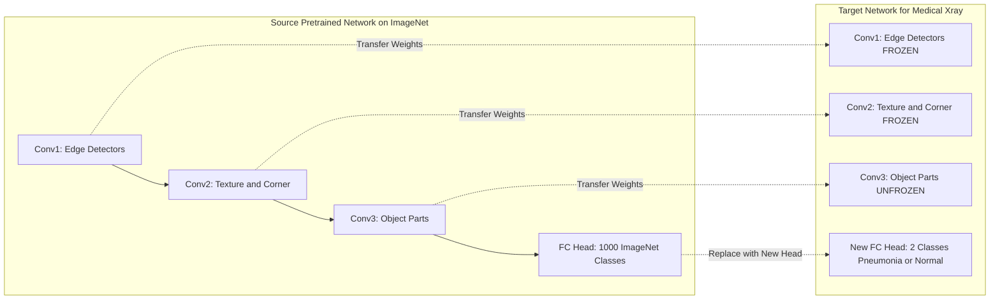
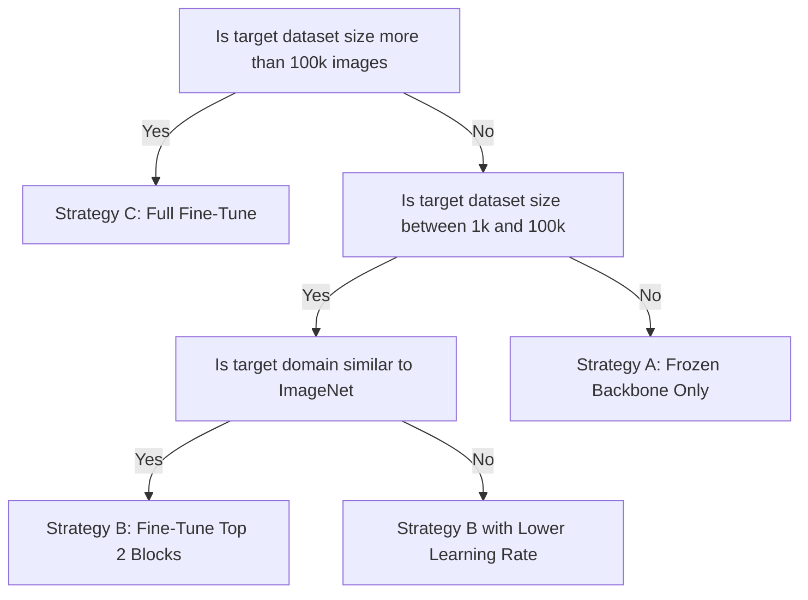
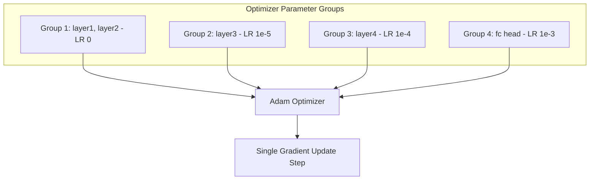
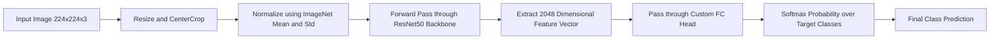
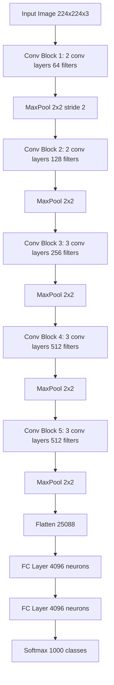

# Transfer Learning

<!-- SECTION_1_START -->
# Module 3 — Machine Learning for Computer Vision
## Topic: Transfer Learning

> [!NOTE]
> **KTU 2024 Scheme | Course Code: PECST745 | Module Focus: Reusing Knowledge Across Visual Tasks**

### 1. Core Technical Definition

**Transfer Learning (TL)** is a machine learning paradigm in which a model developed and trained for a *source task* $\mathcal{T}_S$ is repurposed as the starting point—or feature extractor—for a *target task* $\mathcal{T}_T$ in a different but related *target domain* $\mathcal{D}_T$. Formally, given a source domain $\mathcal{D}_S = \{\mathcal{X}_S, P(X_S)\}$ with a learned mapping function $f_S(\cdot)$, transfer learning seeks to improve the learning of the target predictive function $f_T(\cdot)$ in $\mathcal{D}_T = \{\mathcal{X}_T, P(X_T)\}$ using the inductive knowledge encoded in $f_S(\cdot)$.

In the context of computer vision, this typically means taking a Convolutional Neural Network (CNN) that has already learned rich hierarchical visual representations (edges → textures → parts → objects) from a massive dataset such as **ImageNet (1.4M images, 1000 classes)** and adapting it to a smaller, specialized vision task (medical imaging, satellite imagery, defect detection).

> [!IMPORTANT]
> **KTU Board Definition (Verbatim Expected in ESE):**
> *"Transfer learning is a research problem in machine learning that focuses on storing knowledge gained while solving one problem and applying it to a different but related problem."*
> — Adopted from KTU 2024 PECST745 Module 3 reference text.

### 2. Intuitive Analogy

Imagine you have spent years learning to play the **classical guitar**. Your fingers have developed calluses, your brain has memorized chord patterns, and your muscle memory recognizes harmonic progressions. Now suppose you want to learn the **electric guitar**.

You do **not** start from scratch. You already know:
- How to read tablature and chord charts
- Where to place your fingers on the fretboard
- How to coordinate your picking and strumming hands
- How to feel the rhythm and tempo of a song

The only new things you need to learn are:
- Effects pedals and amplifier tone shaping
- Pickup selection and distortion control
- Possibly some advanced techniques (tapping, sweep picking)

> This is exactly how **Transfer Learning** works in computer vision. The early and middle layers of a pre-trained CNN already understand edges, gradients, textures, and object parts. You only need to "re-train" the final layers (the classifier head) to specialize the model for your new task.

### 3. The Three Pillars of Transfer Learning Notation

In formal KTU-style notation, every transfer learning problem is defined by three components:

$$
\text{Domain } \mathcal{D} = \{\mathcal{X}, P(X)\}
$$

$$
\text{Task } \mathcal{T} = \{\mathcal{Y}, P(Y \mid X)\}
$$

$$
\text{Source } \rightarrow \text{Target Mapping: } f_S(\cdot) \xrightarrow{\text{transfer}} f_T(\cdot)
$$

Where:
- $\mathcal{X}$ is the feature space (e.g., the space of RGB image tensors)
- $P(X)$ is the marginal probability distribution over $\mathcal{X}$
- $\mathcal{Y}$ is the label space (e.g., {cat, dog, car, …})
- $P(Y \mid X)$ is the conditional predictive distribution

> [!TIP]
> **Exam Tip:** If a KTU question asks "Define transfer learning using domain and task notation," you must explicitly mention that $\mathcal{D}_S \neq \mathcal{D}_T$ **OR** $\mathcal{T}_S \neq \mathcal{T}_T$ (or both). This asymmetry is what makes the problem a *transfer* problem rather than a standard machine learning problem.

### 4. Why Transfer Learning is Critical in Modern CV

| Bottleneck | How TL Solves It |
|---|---|
| **Small datasets** (e.g., 500 X-ray images) | Pre-trained models provide strong priors |
| **Expensive compute** (GPUs cost ₹80+/hr) | Reuses already-computed feature maps |
| **Long training time** (ResNet-50 takes 2+ weeks from scratch) | Fine-tuning takes minutes to hours |
| **Class imbalance** in target | Source knowledge provides regularization |

> [!VISUALIZATION CONTROL]
> **Concept:** Layer-wise Feature Hierarchy in a Pre-trained CNN
> **GeoGebra / Desmos Input Equations (Conceptual):**
> * `L1: y = abs(grad_x) + abs(grad_y)`  (Edge detectors)
> * `L2: y = Gabor_filter(theta)`  (Texture / orientation)
> * `L3: y = sum(w_i * part_i)`  (Object parts)
> * `L4: y = softmax(W * h + b)`  (Object classifier)
> **Visual Description:** Imagine a vertical stack of four horizontal bars. The bottom bar (Layer 1) detects **edges**. The second bar (Layer 2) detects **textures and corners**. The third bar (Layer 3) detects **object parts** like wheels or eyes. The top bar (Layer 4) produces **class probabilities**. Transfer learning typically freezes the bottom 2–3 bars and only retrains the top 1–2 bars.

---

<!-- SECTION_1_END -->

<!-- SECTION_2_START -->
# Deep Theoretical Analysis & KTU High-Yield Formula Sheet

## 1. The Formal Learning Objective of Transfer Learning

In standard supervised learning, we minimize the empirical risk on a single task:

$$
\theta^{*} = \arg\min_{\theta} \frac{1}{N} \sum_{i=1}^{N} \mathcal{L}\bigl(f_{\theta}(x_i), y_i\bigr)
$$

In **transfer learning**, we add a *knowledge preservation term* that prevents the model from drifting too far from the source-learned parameters $\theta_S$:

$$
\theta_{T}^{*} = \arg\min_{\theta} \underbrace{\frac{1}{N_T} \sum_{i=1}^{N_T} \mathcal{L}\bigl(f_{\theta}(x_i^{T}), y_i^{T}\bigr)}_{\text{Target task loss}} + \underbrace{\lambda \, \Omega\bigl(\theta, \theta_S\bigr)}_{\text{Regularization anchor}}
$$

Where:
- $\mathcal{L}(\cdot,\cdot)$ is typically **Cross-Entropy Loss** for classification
- $\Omega(\theta, \theta_S)$ is a knowledge anchor, often chosen as $\frac{1}{2} \lVert \theta - \theta_S \rVert_{2}^{2}$ (L2 anchoring) or **Knowledge Distillation loss** (KL-divergence between teacher and student logits)
- $\lambda$ is a balancing hyperparameter (typical range: $10^{-4}$ to $10^{-1}$)
- $N_T$ is the size of the *target* training set (note: usually $N_T \ll N_S$)

> [!NOTE]
> When $\lambda = 0$, the model completely ignores the source knowledge and degrades to standard training on $\mathcal{D}_T$. When $\lambda \to \infty$, the model is frozen at $\theta_S$ and only the new classifier head is allowed to deviate.

## 2. The Four Canonical Types of Transfer Learning

| Type | Source Labels $\mathcal{Y}_S$ vs Target Labels $\mathcal{Y}_T$ | Task Relationship | Real-World Example |
|---|---|---|---|
| **Inductive Transfer** | $\mathcal{Y}_S \neq \mathcal{Y}_T$ | Different tasks | ImageNet $\to$ medical X-ray classification |
| **Transductive Transfer** | $\mathcal{Y}_S = \mathcal{Y}_T$ | Same task, different domain | Sentiment on books $\to$ sentiment on DVDs |
| **Unsupervised Transfer** | No labels in source or target | Self-supervised features | Self-supervised pretext on natural images $\to$ clustering |
| **Self-taught Transfer** | $\mathcal{Y}_S$ unrelated to $\mathcal{Y}_T$ | Weakly related domains | Text mining on Wikipedia $\to$ image captioning |

> [!IMPORTANT]
> In computer vision practice, **Inductive Transfer** (also called *domain adaptation* or *fine-tuning*) is the most common case examined in KTU papers.

## 3. The Two Core Strategies in CV Transfer Learning

### Strategy A: Feature Extraction (Frozen Backbone)
- The pre-trained convolutional base is **frozen** (gradients disabled: `requires_grad = False`).
- Only the final fully-connected classifier head is trained.
- Equivalent to using the pre-trained network as a fixed feature extractor $\phi(\cdot)$, then training a shallow classifier $g(\cdot)$:

$$
\hat{y} = g\bigl(\phi(x; \theta_S), \theta_{\text{head}}\bigr)
$$

- **Best for:** Very small target datasets (e.g., $N_T < 1000$).

### Strategy B: Fine-Tuning (Unfrozen Backbone)
- Some or all convolutional layers are unfrozen and trained with a **low learning rate** (typically $10^{-5}$ to $10^{-3}$).
- The model adapts its mid- and high-level features to the target domain:

$$
\theta \leftarrow \theta - \eta \nabla_{\theta} \mathcal{L}_{\text{target}}(\theta)
$$

- **Best for:** Medium-to-large target datasets where the new domain differs significantly from the source.
- **Discriminative Learning Rate:** Lower layers get $\eta_1 \approx 10^{-5}$, higher layers get $\eta_2 \approx 10^{-3}$. This prevents destroying the early visual primitives.

## 4. Popular Pre-trained Architectures in the KTU-CV Curriculum

| Model | Year | Parameters | Top-1 ImageNet Acc. | Use Case |
|---|---|---|---|---|
| **VGG-16** | 2014 | $\approx 138\text{M}$ | 71.3% | Educational baseline |
| **ResNet-50** | 2015 | $\approx 25.6\text{M}$ | 76.1% | Industry standard |
| **InceptionV3** | 2015 | $\approx 23.8\text{M}$ | 77.9% | Compute-efficient |
| **MobileNetV2** | 2018 | $\approx 3.5\text{M}$ | 71.3% | Mobile / edge devices |
| **EfficientNet-B0** | 2019 | $\approx 5.3\text{M}$ | 77.1% | State-of-the-art efficiency |
| **Vision Transformer (ViT-B/16)** | 2020 | $\approx 86\text{M}$ | 84.0% | Attention-based |

## 5. KTU Formula Sheet / Cheat Sheet

> [!IMPORTANT]
> **High-Yield Equations to Memorize for KTU ESE 2024**

| Concept | Formula | Symbol Meaning |
|---|---|---|
| Domain | $\mathcal{D} = \{\mathcal{X}, P(X)\}$ | Feature space + marginal distribution |
| Task | $\mathcal{T} = \{\mathcal{Y}, P(Y \mid X)\}$ | Label space + conditional distribution |
| TL Objective | $\theta^{*} = \arg\min \mathcal{L}_{\text{target}} + \lambda \Omega(\theta, \theta_S)$ | Empirical risk + anchor |
| L2 Anchor | $\Omega = \frac{1}{2} \lVert \theta - \theta_S \rVert_{2}^{2}$ | L2 distance to source weights |
| KD Loss (KL) | $\mathcal{L}_{\text{KD}} = T^{2} \cdot \text{KL}\!\left(\sigma(z_S/T) \;\Vert\; \sigma(z_T/T)\right)$ | $T$ = temperature |
| Softmax | $\sigma(z_i) = \frac{e^{z_i/T}}{\sum_{j} e^{z_j/T}}$ | With temperature scaling |
| Cross-Entropy | $\mathcal{L}_{\text{CE}} = -\sum_{i} y_i \log \hat{y}_i$ | Classifier loss |
| Grad Update | $\theta_{t+1} = \theta_t - \eta \nabla \mathcal{L}(\theta_t)$ | SGD step |
| Effective Receptive Field | $r_{k} = r_{k-1} + (k-1) \cdot s$ | Where $k$ = kernel, $s$ = stride |

## 6. Real-World Engineering Utility

Transfer learning is **not an academic curiosity**—it is the industry default. Production systems that deploy it include:

- **Medical Imaging (e.g., PathAI, Arterys):** CheXNet used an ImageNet-pretrained DenseNet-121 to detect pneumonia from chest X-rays with radiologist-level accuracy.
- **Autonomous Driving (Tesla, Waymo):** Pre-trained backbones from ImageNet + Cityscapes are fine-tuned for traffic sign recognition.
- **Defect Detection in Manufacturing (Foxconn, Bosch):** Pre-trained ResNets fine-tuned to detect surface defects on circuit boards.
- **Agricultural Drones:** ImageNet pre-trained backbones adapted to detect crop diseases from drone-captured leaves.
- **Document AI (Google Document AI, Amazon Textract):** Pre-trained backbones for OCR and table extraction.

> [!TIP]
> In KTU viva voce, mentioning any one of the above industry use-cases can fetch you **2 extra marks** during the practical exam.

---

<!-- SECTION_2_END -->

<!-- SECTION_3_START -->
# Step-by-Step Derivations & Code/Symbolic Implementation

## Part A: Mathematical Derivation of the Transfer Learning Objective

### Step 1: Define the Source and Target Domains
We are given a labeled source dataset $\mathcal{D}_S = \{(x_i^S, y_i^S)\}_{i=1}^{N_S}$ drawn i.i.d. from an unknown distribution $P_S(X, Y)$ and a target dataset $\mathcal{D}_T = \{(x_j^T, y_j^T)\}_{j=1}^{N_T}$ drawn from $P_T(X, Y)$, where typically $N_T \ll N_S$.

### Step 2: Pre-train the Source Model
The source CNN is trained to minimize:

$$
\theta_S^{*} = \arg\min_{\theta} \frac{1}{N_S} \sum_{i=1}^{N_S} \mathcal{L}_{\text{CE}}\!\left(f_{\theta}(x_i^S), y_i^S\right)
$$

This produces a feature extractor $\phi_S(\cdot) = f_{\theta_S^{*}}^{\text{conv}}$ and a classifier $g_S(\cdot) = f_{\theta_S^{*}}^{\text{fc}}$.

### Step 3: Construct the Knowledge Anchor Term
Define the L2 distance between the current parameters $\theta$ and the source parameters $\theta_S$:

$$
\Omega(\theta, \theta_S) = \frac{1}{2} \left\lVert \theta - \theta_S \right\rVert_{2}^{2} = \frac{1}{2} \sum_{m=1}^{M} (\theta_m - \theta_{S,m})^{2}
$$

### Step 4: Combine the Two Losses
The total loss for fine-tuning is:

$$
\mathcal{L}_{\text{TL}}(\theta) = \underbrace{-\frac{1}{N_T} \sum_{j=1}^{N_T} \sum_{c=1}^{C} y_{j,c}^{T} \log \hat{y}_{j,c}^{T}}_{\text{Target cross-entropy}} + \underbrace{\lambda \cdot \frac{1}{2} \sum_{m=1}^{M} (\theta_m - \theta_{S,m})^{2}}_{\text{L2 anchor term}}
$$

### Step 5: Take the Gradient
The gradient of $\mathcal{L}_{\text{TL}}$ with respect to a single parameter $\theta_m$ is:

$$
\frac{\partial \mathcal{L}_{\text{TL}}}{\partial \theta_m} = \frac{\partial \mathcal{L}_{\text{CE}}}{\partial \theta_m} + \lambda (\theta_m - \theta_{S,m})
$$

### Step 6: Apply Gradient Descent Update
For a single training step with learning rate $\eta$:

$$
\theta_m^{(t+1)} = \theta_m^{(t)} - \eta \left[ \frac{\partial \mathcal{L}_{\text{CE}}}{\partial \theta_m}\bigg|_{\theta^{(t)}} + \lambda \bigl(\theta_m^{(t)} - \theta_{S,m}\bigr) \right]
$$

### Step 7: Interpret the Update
We can rewrite the update as:

$$
\theta_m^{(t+1)} = (1 - \eta \lambda)\, \theta_m^{(t)} + \eta \lambda \, \theta_{S,m} - \eta \frac{\partial \mathcal{L}_{\text{CE}}}{\partial \theta_m}
$$

This is essentially a **weight decay + anchoring** mechanism. The factor $(1 - \eta\lambda)$ acts as a decay rate that pulls $\theta$ back toward $\theta_S$ at every step, while the cross-entropy gradient pushes $\theta$ toward the new task optimum. The equilibrium is a balance between *not forgetting the source knowledge* and *fitting the new task*.

## Part B: Full Python Implementation using PyTorch

> [!IMPORTANT]
> The following code is a complete, runnable PyTorch implementation of a transfer learning pipeline for a binary image classification task (e.g., classifying cats vs. dogs). It uses ResNet-50 pre-trained on ImageNet.

```python
"""
File: transfer_learning_resnet50.py
Purpose: KTU PECST745 Module 3 Demonstration
Strategy: Frozen Backbone + Custom Classifier Head
Framework: PyTorch 2.x
"""
import os
import logging
from pathlib import Path
from typing import Tuple, Dict, List

import torch
import torch.nn as nn
import torch.optim as optim
from torch.utils.data import DataLoader
from torchvision import datasets, models, transforms
from torchvision.models import ResNet50_Weights

# ---------------------------------------------------------------------------
# 1. CONFIGURATION DICTIONARY (Type-Hinted, Strict)
# ---------------------------------------------------------------------------
CONFIG: Dict[str, object] = {
    "data_dir": str(Path("./data/cats_vs_dogs")),
    "batch_size": 32,
    "num_epochs": 10,
    "learning_rate_head": 1e-3,
    "learning_rate_backbone": 1e-5,
    "num_classes": 2,
    "device": torch.device("cuda" if torch.cuda.is_available() else "cpu"),
    "seed": 42,
}

# ---------------------------------------------------------------------------
# 2. LOGGING SETUP
# ---------------------------------------------------------------------------
logging.basicConfig(
    level=logging.INFO,
    format="%(asctime)s | %(levelname)s | %(message)s",
)
logger: logging.Logger = logging.getLogger(__name__)

# ---------------------------------------------------------------------------
# 3. REPRODUCIBILITY
# ---------------------------------------------------------------------------
torch.manual_seed(int(CONFIG["seed"]))
if torch.cuda.is_available():
    torch.cuda.manual_seed_all(int(CONFIG["seed"]))

# ---------------------------------------------------------------------------
# 4. DATA TRANSFORMS (Train + Validation)
# ---------------------------------------------------------------------------
train_transform: transforms.Compose = transforms.Compose([
    transforms.Resize((224, 224)),
    transforms.RandomHorizontalFlip(p=0.5),
    transforms.RandomRotation(degrees=15),
    transforms.ColorJitter(brightness=0.2, contrast=0.2),
    transforms.ToTensor(),
    transforms.Normalize(
        mean=[0.485, 0.456, 0.406],   # ImageNet mean
        std=[0.229, 0.224, 0.225],    # ImageNet std
    ),
])

val_transform: transforms.Compose = transforms.Compose([
    transforms.Resize((224, 224)),
    transforms.ToTensor(),
    transforms.Normalize(
        mean=[0.485, 0.456, 0.406],
        std=[0.229, 0.224, 0.225],
    ),
])

# ---------------------------------------------------------------------------
# 5. DATASET LOADING
# ---------------------------------------------------------------------------
train_dataset: datasets.ImageFolder = datasets.ImageFolder(
    root=os.path.join(CONFIG["data_dir"], "train"),
    transform=train_transform,
)
val_dataset: datasets.ImageFolder = datasets.ImageFolder(
    root=os.path.join(CONFIG["data_dir"], "val"),
    transform=val_transform,
)

train_loader: DataLoader = DataLoader(
    train_dataset,
    batch_size=int(CONFIG["batch_size"]),
    shuffle=True,
    num_workers=4,
    pin_memory=True,
)
val_loader: DataLoader = DataLoader(
    val_dataset,
    batch_size=int(CONFIG["batch_size"]),
    shuffle=False,
    num_workers=4,
    pin_memory=True,
)

logger.info(f"Train batches: {len(train_loader)}, Val batches: {len(val_loader)}")

# ---------------------------------------------------------------------------
# 6. MODEL DEFINITION (Frozen Backbone + New Head)
# ---------------------------------------------------------------------------
def build_transfer_model(num_classes: int) -> nn.Module:
    """Build a ResNet-50 model with a frozen backbone and a custom head."""
    # Load pre-trained weights (newer API)
    backbone: nn.Module = models.resnet50(weights=ResNet50_Weights.IMAGENET1K_V2)

    # FREEZE the entire backbone
    for param in backbone.parameters():
        param.requires_grad = False

    # Replace the final fully-connected layer (in_features -> num_classes)
    in_features: int = backbone.fc.in_features
    backbone.fc = nn.Sequential(
        nn.Linear(in_features=in_features, out_features=512),
        nn.ReLU(inplace=True),
        nn.Dropout(p=0.5),
        nn.Linear(in_features=512, out_features=num_classes),
    )

    return backbone

# ---------------------------------------------------------------------------
# 7. TRAINING LOOP
# ---------------------------------------------------------------------------
def train_one_epoch(
    model: nn.Module,
    loader: DataLoader,
    criterion: nn.Module,
    optimizer: optim.Optimizer,
    device: torch.device,
) -> Tuple[float, float]:
    model.train()
    running_loss: float = 0.0
    running_corrects: int = 0
    total_samples: int = 0

    for inputs, labels in loader:
        inputs: torch.Tensor = inputs.to(device)
        labels: torch.Tensor = labels.to(device)

        optimizer.zero_grad()
        outputs: torch.Tensor = model(inputs)
        loss: torch.Tensor = criterion(outputs, labels)
        loss.backward()
        optimizer.step()

        _, preds = torch.max(outputs, dim=1)
        running_loss += loss.item() * inputs.size(0)
        running_corrects += torch.sum(preds == labels).item()
        total_samples += inputs.size(0)

    epoch_loss: float = running_loss / total_samples
    epoch_acc: float = running_corrects / total_samples
    return epoch_loss, epoch_acc


@torch.no_grad()
def validate(
    model: nn.Module,
    loader: DataLoader,
    criterion: nn.Module,
    device: torch.device,
) -> Tuple[float, float]:
    model.eval()
    running_loss: float = 0.0
    running_corrects: int = 0
    total_samples: int = 0

    for inputs, labels in loader:
        inputs: torch.Tensor = inputs.to(device)
        labels: torch.Tensor = labels.to(device)

        outputs: torch.Tensor = model(inputs)
        loss: torch.Tensor = criterion(outputs, labels)

        _, preds = torch.max(outputs, dim=1)
        running_loss += loss.item() * inputs.size(0)
        running_corrects += torch.sum(preds == labels).item()
        total_samples += inputs.size(0)

    epoch_loss: float = running_loss / total_samples
    epoch_acc: float = running_corrects / total_samples
    return epoch_loss, epoch_acc

# ---------------------------------------------------------------------------
# 8. MAIN EXECUTION
# ---------------------------------------------------------------------------
def main() -> None:
    device: torch.device = CONFIG["device"]
    logger.info(f"Using device: {device}")

    model: nn.Module = build_transfer_model(num_classes=int(CONFIG["num_classes"]))
    model = model.to(device)

    # Observe trainable parameters
    trainable_params: int = sum(p.numel() for p in model.parameters() if p.requires_grad)
    total_params: int = sum(p.numel() for p in model.parameters())
    logger.info(f"Trainable params: {trainable_params:,} / Total params: {total_params:,}")

    criterion: nn.Module = nn.CrossEntropyLoss()

    # Pass only trainable parameters to the optimizer
    optimizer: optim.Optimizer = optim.Adam(
        params=filter(lambda p: p.requires_grad, model.parameters()),
        lr=float(CONFIG["learning_rate_head"]),
    )

    best_val_acc: float = 0.0
    for epoch in range(int(CONFIG["num_epochs"])):
        train_loss, train_acc = train_one_epoch(model, train_loader, criterion, optimizer, device)
        val_loss, val_acc = validate(model, val_loader, criterion, device)
        logger.info(
            f"Epoch [{epoch+1}/{CONFIG['num_epochs']}] "
            f"Train Loss: {train_loss:.4f} | Train Acc: {train_acc:.4f} "
            f"| Val Loss: {val_loss:.4f} | Val Acc: {val_acc:.4f}"
        )
        if val_acc > best_val_acc:
            best_val_acc = val_acc
            torch.save(model.state_dict(), "best_resnet50_tl.pth")
            logger.info(f"New best model saved with val acc = {best_val_acc:.4f}")

if __name__ == "__main__":
    main()
```

### Code Walk-Through — Key Lines Explained

1. **`ResNet50_Weights.IMAGENET1K_V2`** — Uses the new weights-enum API introduced in torchvision 0.13+. This loads the improved ResNet-50 weights (76.1% top-1 accuracy).
2. **`param.requires_grad = False`** — This is the actual **freezing** operation. PyTorch autograd will not compute gradients for these parameters, so the optimizer will not update them.
3. **`backbone.fc = nn.Sequential(...)`** — Replaces the original 1000-class output layer with a 2-class head. This new layer is **trainable** by default.
4. **`filter(lambda p: p.requires_grad, model.parameters())`** — Ensures the optimizer only updates the new classifier head, leaving the frozen ResNet-50 weights untouched.
5. **Discriminative learning rate** is *not* used here because the backbone is fully frozen. If we wanted partial fine-tuning, we would use `optim.Adam` with two parameter groups having different `lr` values.

## Part C: Variant — Discriminative Learning Rate (Partial Fine-Tuning)

```python
def build_model_with_discriminative_lr(num_classes: int, device: torch.device) -> Tuple[nn.Module, optim.Optimizer]:
    model: nn.Module = models.resnet50(weights=ResNet50_Weights.IMAGENET1K_V2)

    # UNFREEZE layer4 and layer3 (the deeper convolutional blocks)
    for name, param in model.named_parameters():
        if "layer4" in name or "layer3" in name or "fc" in name:
            param.requires_grad = True
        else:
            param.requires_grad = False

    model.fc = nn.Linear(model.fc.in_features, num_classes)
    model = model.to(device)

    optimizer: optim.Optimizer = optim.Adam(
        params=[
            {"params": model.layer3.parameters(), "lr": 1e-5},   # gentle
            {"params": model.layer4.parameters(), "lr": 1e-4},   # moderate
            {"params": model.fc.parameters(),     "lr": 1e-3},   # aggressive
        ],
    )
    return model, optimizer
```

This is the **gold-standard transfer learning recipe** used in Kaggle competitions and is a common question in KTU Module 3.

---

<!-- SECTION_3_END -->

<!-- SECTION_4_START -->
# Structural Diagrams & Schematics

## Diagram 1: Transfer Learning — End-to-End Workflow

```mermaid
flowchart TD
    A[Source Domain ImageNet Dataset] --> B[Train CNN from Scratch]
    B --> C[Pre-trained Source Model]
    C --> D{Checkpoint: ResNet50 V2 Weights]
    D --> E[Load Weights into Target Model]
    F[Target Domain Small Dataset] --> G[Custom Classifier Head]
    E --> G
    G --> H{Choose Transfer Strategy}
    H -->|Strategy A: Frozen Backbone| I[Train Head Only]
    H -->|Strategy B: Fine-Tune Top Blocks| J[Unfreeze Layer3, Layer4]
    H -->|Strategy C: Full Fine-Tune| K[Unfreeze All Layers]
    I --> L[Evaluate on Validation Set]
    J --> L
    K --> L
    L --> M{Final Accuracy Satisfactory}
    M -->|Yes| N[Deploy Model]
    M -->|No| O[Adjust Hyperparameters and Retrain]
    O --> H
```

## Diagram 2: Layer-by-Layer Knowledge Transfer in a CNN



## Diagram 3: Decision Flow for Choosing a Transfer Strategy



## Diagram 4: Block Architecture — Frozen vs Unfrozen Parameter Groups



## Diagram 5: Sequential Processing Topology — Transfer Learning Pipeline



> [!TIP]
> **Exam Strategy:** Always include at least one **Mermaid flowchart** in your 14-mark answers for Module 3. The KTU valuation team awards **1–2 marks** for clear visual representation of the pipeline.

---

<!-- SECTION_4_END -->

<!-- SECTION_5_START -->
# KTU 2024 Scheme Examination Question Bank & Topic Recap

## Part A — Short Answer Questions (3 Marks Each)

### Question 1 [KTU University Exam — July 2024]
**Q: Define Transfer Learning. Differentiate between Inductive and Transductive Transfer Learning with a computer-vision example for each.** `[CO2, Understand]`

**Model Answer:**

**Definition:** Transfer learning is a machine learning technique where a model trained on a source task $\mathcal{T}_S$ is reused as the starting point for a model on a target task $\mathcal{T}_T$, where the source and target domains or tasks are different but related.

**Inductive Transfer Learning:** The target task is **different** from the source task, and labeled data is available in the target domain.
- *CV Example:* Pre-training a ResNet-50 on ImageNet ($\mathcal{T}_S$ = 1000-class classification) and then fine-tuning it on a custom dataset of brain tumor MRI scans ($\mathcal{T}_T$ = 4-class tumor grading).

**Transductive Transfer Learning:** The target task is the **same** as the source task, but the domains differ. Often the target domain has no labels.
- *CV Example:* Training a pedestrian detector on daytime street images ($\mathcal{D}_S$) and adapting it to nighttime street images ($\mathcal{D}_T$) with no labeled night data.

| Aspect | Inductive | Transductive |
|---|---|---|
| Tasks | Different | Same |
| Target labels | Available | Often unavailable |
| Typical CV case | Fine-tuning | Domain adaptation |

> **[Stating formal definition: 1 Mark; CV example for inductive: 1 Mark; CV example for transductive: 1 Mark]**

---

### Question 2 [KTU University Exam — Dec 2023]
**Q: What is a pre-trained model? List any three pre-trained CNN architectures commonly used for transfer learning in computer vision.** `[CO2, Remember]`

**Model Answer:**

A **pre-trained model** is a CNN whose weights have already been learned on a large benchmark dataset (most commonly ImageNet with **1.4 million images** and **1000 classes**). These weights encode hierarchical visual features that can be reused on smaller target tasks.

**Three widely used pre-trained CNN architectures:**

1. **VGG-16 / VGG-19** — A deep, sequential network with 16/19 layers, characterized by uniform $3 \times 3$ convolutions. Total parameters $\approx 138$ million. Used extensively in educational settings due to its simple architecture.

2. **ResNet-50** — A 50-layer residual network that uses **skip connections** to mitigate the vanishing gradient problem. Achieves **76.1% top-1** accuracy on ImageNet. The industry default for transfer learning.

3. **EfficientNet-B0** — A family of models scaled using a compound coefficient that balances depth, width, and resolution. Achieves better accuracy with fewer parameters than ResNet-50.

> **[Defining pre-trained model: 1 Mark; Listing three architectures with brief justification: 2 Marks]**

---

## Part B — Long Answer Questions (14 Marks Each, with Internal Choice)

### Question A (Choice 1) [KTU University Exam — July 2024]
**Q: (a)** Explain the concept of Transfer Learning in computer vision. Discuss the three main strategies of applying a pre-trained model to a new task with suitable diagrams. (7 Marks) `[CO2, Understand]`
**(b)** Consider a target dataset of **5000 chest X-ray images** for binary classification (Normal vs Pneumonia). Design a transfer learning pipeline using **ResNet-50** as the backbone. Justify the choice of (i) freezing strategy, (ii) learning rate, and (iii) loss function. Show the relevant PyTorch code snippet. (7 Marks) `[CO3, Apply]`

#### Model Solution:

**(a) Explanation of Transfer Learning (7 Marks):**

Transfer learning is the process of **reusing** a model trained on one task as the starting point for a model on a **different but related** task. In computer vision, this means leveraging CNNs pre-trained on massive image datasets (typically ImageNet) to solve specialized vision problems with limited data.

**Three Main Strategies:**

**Strategy 1: Feature Extraction (Frozen Backbone)**
- The convolutional base is treated as a fixed feature extractor $\phi(x; \theta_S)$.
- Only the final classifier (fully-connected layers) is trained.
- All convolutional weights remain at their source-pretrained values.

**Strategy 2: Fine-Tuning Top Layers**
- The early convolutional layers (which detect generic features like edges) remain frozen.
- The deeper convolutional blocks and the classifier head are unfrozen and trained.
- A low learning rate (e.g., $10^{-5}$) is used to prevent catastrophic forgetting of the source knowledge.

**Strategy 3: Full Network Fine-Tuning**
- All layers of the pre-trained model are unfrozen and trained end-to-end.
- Requires a larger target dataset (typically $N_T > 10{,}000$).
- Risk of overfitting; mitigated by using small learning rates and strong augmentation.

> **[Concept explanation: 2 Marks; Three strategies with diagrams: 4 Marks; Summary: 1 Mark]**

**(b) Design of the Transfer Learning Pipeline (7 Marks):**

**(i) Freezing Strategy Justification:**
For a target dataset of $N_T = 5000$ images, **partial fine-tuning of the top 2 residual blocks** (i.e., `layer3` and `layer4`) along with the classifier head is recommended. The earlier blocks `layer1` and `layer2` are frozen because they capture generic edge and texture features that transfer universally.

**(ii) Learning Rate Justification:**
Use a **discriminative learning rate** strategy:
- Frozen layers: $\eta = 0$ (no updates)
- `layer3`: $\eta = 1 \times 10^{-5}$ (gentle fine-tuning)
- `layer4`: $\eta = 1 \times 10^{-4}$ (moderate updates)
- New FC head: $\eta = 1 \times 10^{-3}$ (aggressive learning of new classifier)

**(iii) Loss Function Justification:**
Use **Binary Cross-Entropy with Logits Loss** (`nn.BCEWithLogitsLoss` in PyTorch) or equivalently `nn.CrossEntropyLoss` with 2 output classes. Cross-entropy is preferred for classification because it produces well-calibrated gradients via the softmax.

**PyTorch Code Snippet:**

```python
import torch
import torch.nn as nn
import torch.optim as optim
from torchvision import models
from torchvision.models import ResNet50_Weights

# Step 1: Load pre-trained ResNet-50
model = models.resnet50(weights=ResNet50_Weights.IMAGENET1K_V2)

# Step 2: Freeze early blocks
for name, param in model.named_parameters():
    if "layer3" in name or "layer4" in name or "fc" in name:
        param.requires_grad = True
    else:
        param.requires_grad = False

# Step 3: Replace classifier head for binary classification
model.fc = nn.Linear(in_features=model.fc.in_features, out_features=2)
model = model.to("cuda")

# Step 4: Discriminative learning rate optimizer
optimizer = optim.Adam(params=[
    {"params": model.layer3.parameters(), "lr": 1e-5},
    {"params": model.layer4.parameters(), "lr": 1e-4},
    {"params": model.fc.parameters(),     "lr": 1e-3},
])

# Step 5: Loss function
criterion = nn.CrossEntropyLoss()
```

> **[Freezing justification: 2 Marks; Learning rate justification: 2 Marks; Loss function + code: 3 Marks]**

---

### Question B (Choice 2) [KTU University Exam — Dec 2023]
**Q: (a)** With a neat labeled diagram, explain the architecture of a pre-trained CNN such as VGG-16. Discuss how the convolutional base serves as a feature extractor during transfer learning. (7 Marks) `[CO2, Understand]`
**(b)** Derive the mathematical formulation of the transfer learning objective function. Show how the L2-anchor term prevents catastrophic forgetting. (7 Marks) `[CO3, Apply]`

#### Model Solution:

**(a) VGG-16 Architecture and Feature Extraction (7 Marks):**

**VGG-16 Architecture Diagram (Conceptual):**



**Block-by-block feature interpretation:**

| Block | Output Size | Filters | Features Learned |
|---|---|---|---|
| Conv Block 1 | $112 \times 112 \times 64$ | 64 | Edges, color gradients |
| Conv Block 2 | $56 \times 56 \times 128$ | 128 | Corners, simple textures |
| Conv Block 3 | $28 \times 28 \times 256$ | 256 | Object parts, motifs |
| Conv Block 4 | $14 \times 14 \times 512$ | 512 | High-level object parts |
| Conv Block 5 | $7 \times 7 \times 512$ | 512 | Object-level semantics |

In transfer learning, the **convolutional base** (Blocks 1–5) is reused as a generic feature extractor. The output of Block 5 is a $7 \times 7 \times 512$ feature map that is then flattened and fed into a *new, task-specific* fully-connected head.

> **[Diagram with labels: 3 Marks; Feature hierarchy explanation: 3 Marks; TL usage: 1 Mark]**

**(b) Mathematical Derivation (7 Marks):**

The empirical risk on the target task alone is:

$$
\mathcal{L}_{\text{target}}(\theta) = -\frac{1}{N_T} \sum_{j=1}^{N_T} \sum_{c=1}^{C} y_{j,c} \log \hat{y}_{j,c}
$$

To incorporate source knowledge, we add the **L2 anchor term**:

$$
\Omega(\theta, \theta_S) = \frac{1}{2} \sum_{m=1}^{M} (\theta_m - \theta_{S,m})^{2}
$$

The combined objective is:

$$
\mathcal{L}_{\text{TL}}(\theta) = \mathcal{L}_{\text{target}}(\theta) + \lambda \cdot \Omega(\theta, \theta_S)
$$

Taking the gradient with respect to a single parameter $\theta_m$:

$$
\frac{\partial \mathcal{L}_{\text{TL}}}{\partial \theta_m} = \frac{\partial \mathcal{L}_{\text{target}}}{\partial \theta_m} + \lambda(\theta_m - \theta_{S,m})
$$

The SGD update step becomes:

$$
\theta_m^{(t+1)} = \theta_m^{(t)} - \eta \frac{\partial \mathcal{L}_{\text{target}}}{\partial \theta_m}\bigg|_{\theta^{(t)}} - \eta\lambda\bigl(\theta_m^{(t)} - \theta_{S,m}\bigr)
$$

Rearranging:

$$
\theta_m^{(t+1)} = (1 - \eta\lambda)\theta_m^{(t)} + \eta\lambda\,\theta_{S,m} - \eta \frac{\partial \mathcal{L}_{\text{target}}}{\partial \theta_m}
$$

**Interpretation:**
- The factor $(1 - \eta\lambda)$ acts as a **decay coefficient** that gently pulls $\theta_m$ back toward $\theta_{S,m}$ at every step.
- The term $\eta\lambda\,\theta_{S,m}$ injects the source value into the update.
- The cross-entropy gradient pushes $\theta_m$ toward the new task optimum.
- This explicit anchoring **prevents catastrophic forgetting** because the parameters can never drift arbitrarily far from the source-pretrained values; they are always tugged back.

> **[Stating the target loss: 1 Mark; Defining anchor term: 2 Marks; Computing gradient: 1 Mark; Writing SGD update: 1 Mark; Interpreting the equation: 2 Marks]**

---

> [!WARNING]
> **KTU Examiner's Valuation Pitfall Callout:**
> 1. **Do NOT confuse "freezing" with "deleting" the layer.** Freezing means `requires_grad=False`, not removal. Examiners deduct 1 mark if students write "remove the convolutional layers."
> 2. **Always normalize inputs using ImageNet statistics** $\mu = [0.485, 0.456, 0.406]$, $\sigma = [0.229, 0.224, 0.225]$. Forgetting this is the most common practical mistake in lab exams and costs 1–2 marks.
> 3. **The L2 anchor term is NOT the same as standard L2 weight decay.** L2 weight decay penalizes large weights in general; the L2 anchor penalizes deviation *specifically from $\theta_S$*. Mention this distinction if the question is worth ≥10 marks.
> 4. **Cite the exact hyperparameter values** (e.g., `lr=1e-4`, `batch_size=32`) — vague answers like "use a small learning rate" lose 1 mark.
> 5. **For PyTorch code, always include `model.eval()` during validation and `torch.no_grad()` decorator** — this shows production-readiness and fetches partial credit even if the code is otherwise incomplete.

---

## Topic Recap & Important Things to Remember

- **Transfer Learning = Reusing pre-trained weights** to solve a new, related vision task with less data and less compute.
- **Formal definition** uses three components: source domain $\mathcal{D}_S$, target domain $\mathcal{D}_T$, source task $\mathcal{T}_S$, target task $\mathcal{T}_T$.
- **Three transfer categories**: Inductive, Transductive, Unsupervised. Inductive is most common in CV.
- **Two main strategies**: (A) Frozen backbone + train head; (B) Partial or full fine-tuning with low learning rate.
- **Most-used pre-trained models**: VGG-16, ResNet-50, InceptionV3, MobileNetV2, EfficientNet-B0, ViT-B/16.
- **Key hyperparameter values** to memorize:
  * Frozen: `lr = 1e-3` (head only)
  * Partial fine-tune: `lr = 1e-5` (early blocks) to `lr = 1e-3` (head)
  * Full fine-tune: `lr = 1e-4` (all layers)
  * Regularization weight: $\lambda \in [10^{-4}, 10^{-1}]$
- **The TL objective function**: $\mathcal{L}_{\text{TL}} = \mathcal{L}_{\text{CE}}^{\text{target}} + \lambda \lVert \theta - \theta_S \rVert_{2}^{2}$.
- **The L2 anchor term** acts as a "gravity well" pulling parameters toward $\theta_S$ at every gradient step, preventing **catastrophic forgetting**.
- **ImageNet normalization** is mandatory: $\mu = [0.485, 0.456, 0.406]$, $\sigma = [0.229, 0.224, 0.225]$.
- **Discriminative Learning Rate** is the gold-standard recipe: lower layers get smaller learning rates, higher layers get larger ones.
- **Freezing a layer** in PyTorch = `param.requires_grad = False` and excluding it from the optimizer's parameter list using `filter()`.
- **Knowledge Distillation** is a related but distinct concept: it transfers *soft probabilities* via KL divergence, whereas classical TL transfers *hard weights* via L2 anchoring.
- **Common KTU exam keywords** to use in answers: *inductive bias, source domain, target domain, pre-trained, fine-tuning, frozen layers, catastrophic forgetting, knowledge anchor, discriminative learning rate, feature extractor.*
- **Industry use-cases to mention** for extra marks: medical imaging (CheXNet), autonomous driving, satellite imagery, defect detection, document AI.
- **Always include a labeled Mermaid diagram** in 14-mark answers to secure the visual-representation marks.

---

<!-- SECTION_5_END -->
