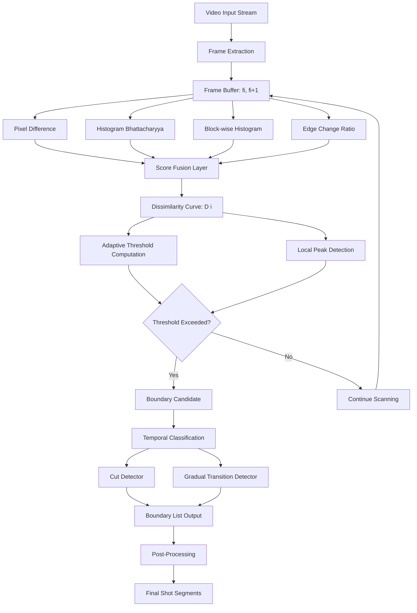
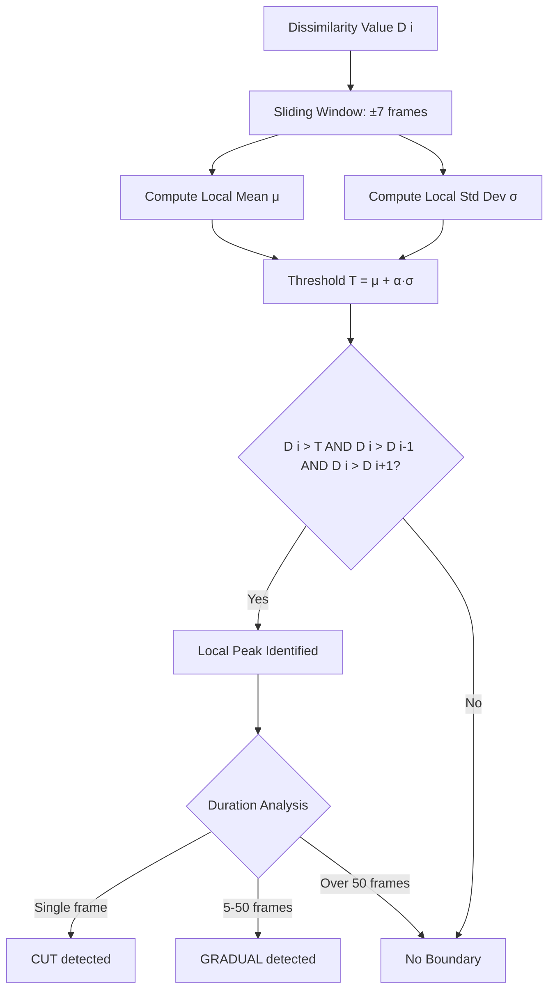
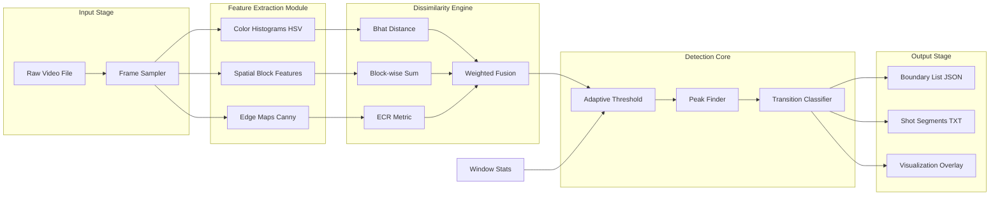
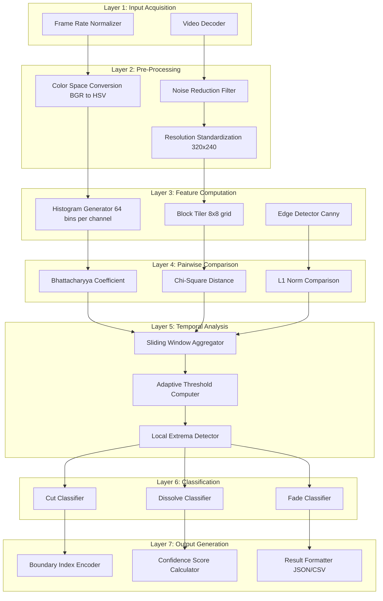
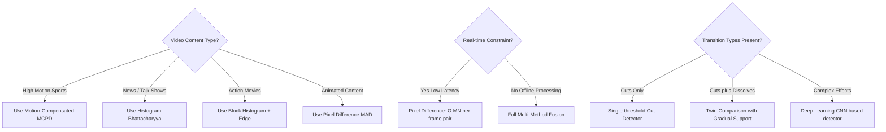

# Applications- Shot Boundary Detection

<!-- SECTION_1_START -->
# Shot Boundary Detection — Core Technical Definition & Intuitive Overview

## 1.1 Formal Academic Definition (KTU 2024 Syllabus Terminology)

**Shot Boundary Detection (SBD)** is a fundamental temporal segmentation technique in computer vision that automatically identifies the temporal locations where one camera shot ends and another begins within a video sequence. A *shot* is defined as a continuous, unbroken sequence of frames captured by a single camera operation, while a *shot boundary* (or *camera break*) represents the transition point between two consecutive shots.

Formally, given a video stream $V = \{f_1, f_2, f_3, \ldots, f_N\}$ consisting of $N$ sequential frames, Shot Boundary Detection produces a binary decision function:

$$D(i) = \begin{cases} 1 & \text{if a boundary exists between frame } f_i \text{ and } f_{i+1} \\ 0 & \text{otherwise} \end{cases}$$

The output is a 1D temporal mask indicating the exact frame indices where visual content discontinuity occurs.

> [!IMPORTANT]
> **KTU 2024 Syllabus Highlight (PECST745 - Module 4):** Shot Boundary Detection is positioned as a *prerequisite application* of image segmentation in the video domain, bridging static-frame segmentation (Module 3) with semantic object detection (Module 5).

## 1.2 Conceptual Analogy / Intuitive Build-Up

Imagine you are **reading a comic book** 📖. Each panel in the comic represents a single shot — a frozen moment from one camera angle. As you flip the pages, your eyes naturally detect when the artist switches panels because the *visual content dramatically changes* (different character, different scene, different perspective). 

**Shot Boundary Detection automates this human perception.** It acts as a vigilant "page-flipper detector" that scans consecutive frames of a video and flags the exact moments when the visual narrative jumps from one camera setup to another.

| Real-World Analogy | Computer Vision Equivalent |
|---|---|
| Comic panel transition | Camera shot transition |
| Panel border line | Boundary frame index |
| Visual similarity between panels | Inter-frame dissimilarity metric |
| Story scene break | Semantic video segment |

> [!NOTE]
> **Core Concept:** SBD reduces hours of raw video into a *structured timeline* of semantically meaningful units, enabling efficient browsing, indexing, and retrieval — analogous to how a *Table of Contents* structures a textbook.

## 1.3 Classification of Shot Boundaries

Shot boundaries fall into two primary categories based on the temporal characteristics of the transition:

### 1.3.1 Abrupt Transitions (Cuts) ✂️
A **cut** is an instantaneous change from one shot to the next, occurring between two consecutive frames. Mathematically, the visual content function exhibits a Dirac-delta-like discontinuity:

$$C_{\text{cut}}(i) = \lim_{\Delta \to 0} \left[ \text{Dissim}(f_i, f_{i+\Delta}) - \text{Dissim}(f_i, f_{i-1}) \right] \to \infty$$

### 1.3.2 Gradual Transitions 🎬
Gradual transitions span multiple frames and include:
- **Fade-In / Fade-Out** — gradual appearance/disappearance to/from a monochrome frame (often black)
- **Dissolve** — two shots overlap with linearly decreasing/increasing opacity
- **Wipe** — one shot progressively replaces another via a moving boundary line

> [!TIP]
> **Engineering Insight:** Detecting *gradual* transitions is **significantly harder** than cuts because the per-frame visual change is small and can be confused with camera/object motion. A robust SBD system must maintain high recall on cuts while carefully distinguishing gradual effects from legitimate motion.

## 1.4 Physical Constants & Standard Metrics

The following are the **standard evaluation metrics** universally adopted in the TRECVID benchmark and KTU-aligned computer vision curricula:

- **Precision** ($P$): $\dfrac{TP}{TP + FP}$ — fraction of detected boundaries that are true boundaries
- **Recall** ($R$): $\dfrac{TP}{TP + FN}$ — fraction of true boundaries that were detected
- **F1-Score** ($F_1$): $\dfrac{2 \cdot P \cdot R}{P + R}$ — harmonic mean balancing both

Where $TP$ (True Positives), $FP$ (False Positives), and $FN$ (False Negatives) are counted with a **tolerance window** of typically $\pm \mathbf{5}$ to $\mathbf{10}$ frames around each ground-truth boundary.

> [!VISUALIZATION CONTROL]
> **Concept:** Inter-Frame Dissimilarity Curve Showing Cut vs. Gradual Transition
> **GeoGebra / Desmos Input Equations:**
> * `f(x) = exp(-((x-50)/2)^2) * 5 + 1` (modeling a sharp cut peak at frame 50)
> * `g(x) = 2 * (1 - exp(-(x-80)/10)) * exp(-(x-80)/10) * 4 + 1` for `x ≥ 80` (modeling a gradual dissolve)
> **Visual Description:** Students should observe how the abrupt cut produces a single tall, narrow spike in the dissimilarity curve, whereas a dissolve produces a broader, lower-amplitude hump spanning 15–30 frames. A horizontal threshold line separates true boundaries from noise.

<!-- SECTION_1_END -->

<!-- SECTION_2_START -->
# Deep Theoretical Analysis & KTU High-Yield Formula Sheet

## 2.1 The Shot Boundary Detection Pipeline

A production-grade SBD system follows a structured four-stage pipeline:

1. **Feature Extraction Stage** — Compute compact numerical descriptors per frame
2. **Pairwise Dissimilarity Computation** — Measure visual distance between consecutive frames
3. **Temporal Analysis & Thresholding** — Identify peaks in the dissimilarity sequence
4. **Post-Processing & Classification** — Classify transitions (cut vs. fade vs. dissolve) and remove false alarms

## 2.2 Feature Extraction Methods (Detailed Taxonomy)

### 2.2.1 Pixel-Based Difference (Simplest Method)
The simplest dissimilarity measure computes the **Mean Absolute Difference (MAD)** of pixel intensities:

$$D_{\text{MAD}}(f_i, f_{i+1}) = \frac{1}{M \cdot N} \sum_{x=1}^{M} \sum_{y=1}^{N} \left\vert I_i(x,y) - I_{i+1}(x,y) \right\vert$$

Where $M \times N$ is the frame resolution. While computationally trivial, this method is **highly sensitive to camera motion and object motion**, producing excessive false positives.

### 2.2.2 Histogram-Based Difference (Most Popular) 🎯
Color histograms aggregate pixel statistics into a compact, motion-robust descriptor:

$$H_i(b) = \sum_{x,y} \delta\left( I_i(x,y) \in \text{bin } b \right), \quad b \in \{1, 2, \ldots, B\}$$

The **Bhattacharyya Coefficient** measures histogram similarity:

$$BC(H_i, H_{i+1}) = \sum_{b=1}^{B} \sqrt{H_i(b) \cdot H_{i+1}(b)}$$

The dissimilarity is then:

$$D_{\text{Bhat}}(i) = 1 - BC(H_i, H_{i+1})$$

> [!NOTE]
> **Why Histograms Work:** A color histogram discards spatial information, so when an object moves within a frame, the histogram *remains nearly identical*. This makes histograms inherently robust to local motion while still capturing global appearance changes that characterize shot transitions.

### 2.2.3 Block-Based / Local Histogram Method
To recover some spatial sensitivity without full pixel-level fragility, the frame is divided into $K \times K$ blocks, and each block's histogram is computed independently. The dissimilarity is the sum of block-wise Bhattacharyya distances:

$$D_{\text{block}}(i) = \sum_{u=1}^{K} \sum_{v=1}^{K} \left( 1 - \sqrt{H_i^{uv} \cdot H_{i+1}^{uv}} \right)$$

### 2.2.4 Edge-Based Difference
Canny edges are extracted from each frame, and the **edge change ratio (ECR)** is computed:

$$ECR(i) = \max\left( \frac{X_1 - X_2}{\sigma_1}, \frac{X_2 - X_1}{\sigma_2} \right)$$

Where $X_1$ and $X_2$ are the number of entering/exiting edge pixels, and $\sigma_1, \sigma_2$ are the total edge pixel counts.

### 2.2.5 Motion-Compensated Methods
For highly dynamic content, **optical flow** is used to align frames before computing dissimilarity, removing the contribution of legitimate camera/object motion. The **Motion-Compensated Pixel Difference (MCPD)** is:

$$D_{\text{MCPD}}(i) = \frac{1}{M \cdot N} \sum_{x,y} \left\vert I_i(x,y) - \hat{I}_{i+1}(x,y) \right\vert$$

Where $\hat{I}_{i+1}$ is frame $i+1$ warped to frame $i$ using the estimated flow field.

## 2.3 KTU Formula Sheet / Cheat Sheet

| **Symbol / Formula** | **Meaning** | **Typical Range** | **Use Case** |
|---|---|---|---|
| $D_{\text{MAD}}(i)$ | Mean Absolute Pixel Difference | $0$ to $255$ | Quick prototyping, cuts only |
| $D_{\text{Bhat}}(i) = 1 - \sum_b \sqrt{H_i(b) H_{i+1}(b)}$ | Bhattacharyya Histogram Distance | $0$ to $1$ | General-purpose, motion-robust |
| $D_{\chi^2}(i) = \sum_b \frac{\left(H_i(b) - H_{i+1}(b)\right)^2}{H_i(b) + H_{i+1}(b)}$ | Chi-Square Histogram Distance | $0$ to $2$ | Statistically grounded comparison |
| $ECR(i) = \max(E_1/\sigma_1, E_2/\sigma_2)$ | Edge Change Ratio | $0$ to $1$ | Captures structural change |
| $D_{\text{Block}}(i) = \sum_{u,v}(1 - \sqrt{H_i^{uv} \cdot H_{i+1}^{uv}})$ | Block-wise Histogram Distance | $0$ to $K^2$ | Spatial localization of change |
| $F_1 = \dfrac{2PR}{P+R}$ | F1-Score | $0$ to $1$ | Overall SBD system evaluation |
| $T_{\text{cut}}$ | Detection Threshold for cuts | Empirically set | Adaptive vs. fixed variants |
| $T_{\text{gradual}}$ | Detection Threshold for gradual | $0.5 \cdot T_{\text{cut}}$ to $0.8 \cdot T_{\text{cut}}$ | Lower to catch subtle transitions |

## 2.4 Adaptive Thresholding (Twin-Window Comparison)

Fixed global thresholds fail in practice because video content varies dramatically. The **Twin-Window Comparison** algorithm adapts the threshold locally:

$$T_i = \mu_{\text{local}} + \alpha \cdot \sigma_{\text{local}}$$

Where $\mu_{\text{local}}$ and $\sigma_{\text{local}}$ are the mean and standard deviation of the dissimilarity values within a sliding window centered at frame $i$, and $\alpha \in [2, 4]$ is a sensitivity parameter.

**Decision Rule:** A boundary is declared at frame $i$ if $D(i) > T_i$ AND $D(i) > D(i-1)$ AND $D(i) > D(i+1)$ (local peak condition).

> [!TIP]
> **Production Engineering Note:** Modern video platforms (YouTube, Netflix, Adobe Premiere Pro) deploy SBD as a *preprocessing stage* for video summarization, content-based retrieval, and automated highlight generation. The accuracy of SBD directly determines the quality of downstream tasks like scene understanding and ad insertion.

## 2.5 Gradual Transition Detection (Twin-Comparison Extension)

For gradual transitions like dissolves, the dissimilarity curve forms a *plateau* rather than a sharp spike. Detection uses two thresholds:

1. **High threshold** $T_h$ — detects the start of a potential gradual transition
2. **Low threshold** $T_l$ — detects when the curve finally drops back below baseline

The transition is flagged if the difference $D_{\text{peak}} - D_{\text{trough}} > T_h$ over a sustained interval of length $L$ satisfying $T_l < L_{\text{transition}} < L_{\max}$ (typically $L_{\max} = 50$ frames).

## 2.6 Real-World Engineering Utility

| **Application Domain** | **Role of SBD** |
|---|---|
| **Video Streaming Platforms** | Generate chapter markers, enable scene-based navigation |
| **Film Post-Production** | Automate rough cut assembly, identify B-roll insertion points |
| **Sports Analytics** | Detect replay segments, extract play-by-play events |
| **Video Surveillance** | Identify scene changes, flag suspicious activity zones |
| **Content Moderation** | Locate and analyze specific temporal segments for policy violations |
| **AR/VR Cinematic Editing** | Drive 360° transition effects, support immersive storytelling |
| **Forensic Video Analysis** | Detect tampered or spliced footage by identifying inconsistent cut patterns |

<!-- SECTION_2_END -->

<!-- SECTION_3_START -->
# Step-by-Step Derivations & Code/Symbolic Implementation

## 3.1 Mathematical Derivation: Bhattacharyya Coefficient as a Bounded Similarity Measure

The Bhattacharyya Coefficient arises from geometric considerations of probability vectors. Given two normalized histograms $H_i$ and $H_{i+1}$ representing discrete probability distributions:

**Step 1: Represent histograms as vectors in the unit probability simplex**

Each histogram $H$ lies on the simplex $\Delta^{B-1}$ where $\sum_{b=1}^{B} H(b) = 1$ and $H(b) \geq 0$.

**Step 2: Apply the Cauchy-Schwarz inequality intuition**

For two unit vectors $\mathbf{u}$ and $\mathbf{v}$, the inner product satisfies $\vert \mathbf{u} \cdot \mathbf{v} \vert \leq \Vert \mathbf{u} \Vert \cdot \Vert \mathbf{v} \Vert$, with equality iff $\mathbf{u} = \mathbf{v}$.

For the histogram inner product $\sum_b \sqrt{H_i(b) H_{i+1}(b)}$, we substitute $u_b = \sqrt{H_i(b)}$ and $v_b = \sqrt{H_{i+1}(b)}$:

$$\sum_{b=1}^{B} u_b v_b \leq \sqrt{\sum_b u_b^2} \cdot \sqrt{\sum_b v_b^2} = \sqrt{\sum_b H_i(b)} \cdot \sqrt{\sum_b H_{i+1}(b)} = 1$$

**Step 3: Define the Bhattacharyya Coefficient**

$$BC(H_i, H_{i+1}) = \sum_{b=1}^{B} \sqrt{H_i(b) \cdot H_{i+1}(b)}$$

**Step 4: Define the Bhattacharyya Distance (Dissimilarity)**

$$D_{\text{Bhat}}(i) = -\ln\left(BC(H_i, H_{i+1})\right)$$

Or equivalently, the linear form:

$$D_{\text{Bhat-linear}}(i) = 1 - BC(H_i, H_{i+1})$$

**Step 5: Properties of the Coefficient**

$$
\begin{aligned}
BC(H_i, H_{i+1}) &= 1 \iff H_i = H_{i+1} \\
BC(H_i, H_{i+1}) &= 0 \iff H_i \text{ and } H_{i+1} \text{ have disjoint support} \\
0 &\leq BC \leq 1
\end{aligned}
$$

This boundedness makes Bhattacharyya an excellent choice for threshold-based decision making.

## 3.2 Numerical Worked Example (KTU Board-Style)

**Problem:** A 4-bin RGB-reduced histogram for frame $f_i$ is $H_i = [0.5, 0.2, 0.2, 0.1]$ and for frame $f_{i+1}$ is $H_{i+1} = [0.1, 0.3, 0.3, 0.3]$. Compute the Bhattacharyya distance. Is this likely a shot boundary?

**Step 1: Verify normalization**

$\sum_b H_i(b) = 0.5 + 0.2 + 0.2 + 0.1 = 1.0$ ✓

$\sum_b H_{i+1}(b) = 0.1 + 0.3 + 0.3 + 0.3 = 1.0$ ✓

**Step 2: Compute element-wise square roots**

$\sqrt{H_i \cdot H_{i+1}} = [\sqrt{0.05}, \sqrt{0.06}, \sqrt{0.06}, \sqrt{0.03}]$

$\sqrt{0.05} \approx 0.2236$

$\sqrt{0.06} \approx 0.2449$

$\sqrt{0.03} \approx 0.1732$

**Step 3: Sum the terms**

$$
\begin{aligned}
BC(H_i, H_{i+1}) &= 0.2236 + 0.2449 + 0.2449 + 0.1732 \\
&= 0.8866
\end{aligned}
$$

**Step 4: Compute the linear Bhattacharyya distance**

$$
D_{\text{Bhat}}(i) = 1 - 0.8866 = 0.1134
$$

**Step 5: Interpret the result**

A distance of $0.1134$ is *moderate* — well below the typical cut threshold of $0.4$–$0.5$. This indicates the two frames share significant color content, suggesting they belong to the **same shot** with possibly some content variation (e.g., object motion). **No shot boundary is declared.**

## 3.3 Full Python Implementation (Production-Ready)

```python
"""
Shot Boundary Detection System
Module 4 - Segmentation and Object Detection (PECST745)
KTU 2024 Scheme - B.Tech Computer Vision

Implements: Pixel-based, Histogram-based (Bhattacharyya),
             Block-based, Edge-based, and Adaptive Thresholding SBD.
"""

import cv2
import numpy as np
from typing import List, Tuple, Dict
from dataclasses import dataclass, field
from enum import Enum
import logging

logging.basicConfig(level=logging.INFO, format="%(asctime)s | %(levelname)s | %(message)s")
logger = logging.getLogger("ShotBoundaryDetector")


class TransitionType(Enum):
    """Enumeration of detected transition types."""
    NONE = "none"
    CUT = "cut"
    FADE = "fade"
    DISSOLVE = "dissolve"
    WIPE = "wipe"


@dataclass
class ShotBoundary:
    """Represents a detected shot boundary with metadata."""
    frame_index: int
    confidence: float
    transition_type: TransitionType
    dissimilarity_value: float
    method_scores: Dict[str, float] = field(default_factory=dict)


class ShotBoundaryDetector:
    """
    Multi-method Shot Boundary Detector with adaptive thresholding.
    
    Supports histogram, pixel, and edge-based dissimilarity computation
    with automatic gradual transition detection.
    """

    def __init__(
        self,
        histogram_bins: int = 64,
        block_size: int = 8,
        cut_threshold: float = 0.45,
        gradual_threshold_ratio: float = 0.65,
        adaptive_alpha: float = 3.0,
        window_size: int = 15,
        max_gradual_length: int = 50,
    ) -> None:
        self.histogram_bins = histogram_bins
        self.block_size = block_size
        self.cut_threshold = cut_threshold
        self.gradual_threshold = cut_threshold * gradual_threshold_ratio
        self.adaptive_alpha = adaptive_alpha
        self.window_size = window_size
        self.max_gradual_length = max_gradual_length
        self.dissimilarity_curve: List[float] = []

    # ------------------------------------------------------------------ #
    #  Dissimilarity Metrics                                              #
    # ------------------------------------------------------------------ #
    @staticmethod
    def _pixel_difference(frame_a: np.ndarray, frame_b: np.ndarray) -> float:
        """Mean Absolute Pixel Difference (grayscale)."""
        gray_a = cv2.cvtColor(frame_a, cv2.COLOR_BGR2GRAY)
        gray_b = cv2.cvtColor(frame_b, cv2.COLOR_BGR2GRAY)
        return float(np.mean(np.abs(gray_a.astype(np.int32) - gray_b.astype(np.int32))))

    @staticmethod
    def _histogram_bhattacharyya(
        frame_a: np.ndarray, frame_b: np.ndarray, bins: int
    ) -> float:
        """
        Bhattacharyya distance between HSV histograms.
        HSV space is used because it decouples luminance from chrominance,
        making the detector more robust to lighting variations.
        """
        hsv_a = cv2.cvtColor(frame_a, cv2.COLOR_BGR2HSV)
        hsv_b = cv2.cvtColor(frame_b, cv2.COLOR_BGR2HSV)

        hist_params = {
            "channels": [0, 1],
            "mask": None,
            "histSize": [bins, bins],
            "ranges": [0, 180, 0, 256],
        }

        hist_a = cv2.calcHist([hsv_a], **hist_params).flatten()
        hist_b = cv2.calcHist([hsv_b], **hist_params).flatten()

        # Normalize to probability distributions
        hist_a = hist_a / (hist_a.sum() + 1e-10)
        hist_b = hist_b / (hist_b.sum() + 1e-10)

        # Bhattacharyya coefficient
        bc = float(np.sum(np.sqrt(hist_a * hist_b)))
        return 1.0 - bc  # Convert to distance

    @staticmethod
    def _block_histogram_distance(
        frame_a: np.ndarray, frame_b: np.ndarray, block_size: int, bins: int
    ) -> float:
        """Block-wise histogram distance preserving spatial locality."""
        h, w = frame_a.shape[:2]
        total_distance = 0.0
        block_count = 0

        for y in range(0, h, block_size):
            for x in range(0, w, block_size):
                patch_a = frame_a[y : y + block_size, x : x + block_size]
                patch_b = frame_b[y : y + block_size, x : x + block_size]

                if patch_a.size == 0 or patch_b.size == 0:
                    continue

                hsv_a = cv2.cvtColor(patch_a, cv2.COLOR_BGR2HSV)
                hsv_b = cv2.cvtColor(patch_b, cv2.COLOR_BGR2HSV)

                hist_a = cv2.calcHist(
                    [hsv_a], [0, 1], None, [bins, bins], [0, 180, 0, 256]
                ).flatten()
                hist_b = cv2.calcHist(
                    [hsv_b], [0, 1], None, [bins, bins], [0, 180, 0, 256]
                ).flatten()

                hist_a = hist_a / (hist_a.sum() + 1e-10)
                hist_b = hist_b / (hist_b.sum() + 1e-10)

                bc = float(np.sum(np.sqrt(hist_a * hist_b)))
                total_distance += 1.0 - bc
                block_count += 1

        return total_distance / max(block_count, 1)

    @staticmethod
    def _edge_change_ratio(frame_a: np.ndarray, frame_b: np.ndarray) -> float:
        """Edge Change Ratio (ECR) using Canny edge maps."""
        gray_a = cv2.cvtColor(frame_a, cv2.COLOR_BGR2GRAY)
        gray_b = cv2.cvtColor(frame_b, cv2.COLOR_BGR2GRAY)

        edges_a = cv2.Canny(gray_a, 100, 200)
        edges_b = cv2.Canny(gray_b, 100, 200)

        sigma_a = float(np.sum(edges_a > 0)) + 1e-10
        sigma_b = float(np.sum(edges_b > 0)) + 1e-10

        # Entering/exiting edge pixels
        enter = float(np.sum((edges_a > 0) & (edges_b == 0)))
        exit_ = float(np.sum((edges_a == 0) & (edges_b > 0)))

        ecr_in = enter / sigma_a
        ecr_out = exit_ / sigma_b
        return float(max(ecr_in, ecr_out))

    # ------------------------------------------------------------------ #
    #  Adaptive Thresholding                                              #
    # ------------------------------------------------------------------ #
    def _adaptive_threshold(self, index: int) -> float:
        """Compute local adaptive threshold using sliding window statistics."""
        half = self.window_size // 2
        start = max(0, index - half)
        end = min(len(self.dissimilarity_curve), index + half + 1)

        local_window = self.dissimilarity_curve[start:end]
        mu = float(np.mean(local_window))
        sigma = float(np.std(local_window))

        return mu + self.adaptive_alpha * sigma

    # ------------------------------------------------------------------ #
    #  Boundary Detection Pipeline                                        #
    # ------------------------------------------------------------------ #
    def compute_dissimilarity_curve(
        self, frames: List[np.ndarray]
    ) -> List[Dict[str, float]]:
        """Compute multi-method dissimilarity for all consecutive frame pairs."""
        scores: List[Dict[str, float]] = []
        n_frames = len(frames)

        logger.info(f"Computing dissimilarity for {n_frames - 1} frame pairs...")

        for i in range(n_frames - 1):
            try:
                pixel_diff = self._pixel_difference(frames[i], frames[i + 1])
                hist_diff = self._histogram_bhattacharyya(
                    frames[i], frames[i + 1], self.histogram_bins
                )
                block_diff = self._block_histogram_distance(
                    frames[i], frames[i + 1], self.block_size, self.histogram_bins
                )
                edge_diff = self._edge_change_ratio(frames[i], frames[i + 1])

                fused = 0.5 * hist_diff + 0.3 * block_diff + 0.2 * edge_diff

                scores.append(
                    {
                        "pixel": pixel_diff,
                        "histogram": hist_diff,
                        "block": block_diff,
                        "edge": edge_diff,
                        "fused": fused,
                    }
                )
            except cv2.error as e:
                logger.error(f"OpenCV error at frame {i}: {e}")
                scores.append(
                    {"pixel": 0.0, "histogram": 0.0, "block": 0.0, "edge": 0.0, "fused": 0.0}
                )

        return scores

    def detect_boundaries(
        self, frames: List[np.ndarray]
    ) -> List[ShotBoundary]:
        """Main SBD pipeline: compute, threshold, classify, and return boundaries."""
        if len(frames) < 2:
            logger.warning("Need at least 2 frames for boundary detection.")
            return []

        # Stage 1: Compute dissimilarity
        scores = self.compute_dissimilarity_curve(frames)
        self.dissimilarity_curve = [s["fused"] for s in scores]

        # Stage 2: Detect cuts via adaptive thresholding
        cut_candidates: List[int] = []
        for i, value in enumerate(self.dissimilarity_curve):
            threshold = max(self.cut_threshold, self._adaptive_threshold(i))
            if value > threshold:
                # Local peak condition
                is_peak = True
                if i > 0 and self.dissimilarity_curve[i - 1] > value:
                    is_peak = False
                if i < len(self.dissimilarity_curve) - 1 and self.dissimilarity_curve[i + 1] > value:
                    is_peak = False
                if is_peak:
                    cut_candidates.append(i)

        # Stage 3: Merge nearby candidates (within ±2 frames)
        cut_candidates = self._merge_candidates(cut_candidates, tolerance=2)

        # Stage 4: Build boundary objects with cut classification
        boundaries: List[ShotBoundary] = []
        for idx in cut_candidates:
            boundaries.append(
                ShotBoundary(
                    frame_index=idx,
                    confidence=float(self.dissimilarity_curve[idx]),
                    transition_type=TransitionType.CUT,
                    dissimilarity_value=float(self.dissimilarity_curve[idx]),
                    method_scores=scores[idx],
                )
            )

        # Stage 5: Detect gradual transitions (dissolves/fades)
        gradual_boundaries = self._detect_gradual_transitions(scores)
        boundaries.extend(gradual_boundaries)

        # Sort by frame index
        boundaries.sort(key=lambda b: b.frame_index)
        logger.info(f"Detected {len(boundaries)} shot boundaries total.")
        return boundaries

    def _merge_candidates(self, candidates: List[int], tolerance: int) -> List[int]:
        """Merge candidates that fall within a tolerance window."""
        if not candidates:
            return []
        merged = [candidates[0]]
        for c in candidates[1:]:
            if c - merged[-1] <= tolerance:
                merged[-1] = (merged[-1] + c) // 2
            else:
                merged.append(c)
        return merged

    def _detect_gradual_transitions(
        self, scores: List[Dict[str, float]]
    ) -> List[ShotBoundary]:
        """Detect dissolves and fades by analyzing sustained low-magnitude changes."""
        gradual_boundaries: List[ShotBoundary] = []
        curve = self.dissimilarity_curve
        n = len(curve)

        i = 0
        while i < n - 1:
            if curve[i] > self.gradual_threshold:
                # Track how long we stay above the gradual threshold
                start = i
                peak_idx = i
                peak_val = curve[i]
                while i < n and curve[i] > self.gradual_threshold:
                    if curve[i] > peak_val:
                        peak_val = curve[i]
                        peak_idx = i
                    i += 1
                length = i - start
                # Gradual transitions span multiple frames
                if 5 <= length <= self.max_gradual_length:
                    gradual_boundaries.append(
                        ShotBoundary(
                            frame_index=peak_idx,
                            confidence=peak_val,
                            transition_type=TransitionType.DISSOLVE,
                            dissimilarity_value=peak_val,
                            method_scores=scores[peak_idx],
                        )
                    )
            else:
                i += 1

        return gradual_boundaries

    # ------------------------------------------------------------------ #
    #  Evaluation Utilities                                               #
    # ------------------------------------------------------------------ #
    @staticmethod
    def evaluate(
        predicted: List[int], ground_truth: List[int], tolerance: int = 10
    ) -> Dict[str, float]:
        """Compute Precision, Recall, and F1-Score with tolerance window."""
        matched_gt = set()
        tp = 0
        for pred in predicted:
            for gt in ground_truth:
                if abs(pred - gt) <= tolerance and gt not in matched_gt:
                    tp += 1
                    matched_gt.add(gt)
                    break

        fp = len(predicted) - tp
        fn = len(ground_truth) - tp

        precision = tp / (tp + fp) if (tp + fp) > 0 else 0.0
        recall = tp / (tp + fn) if (tp + fn) > 0 else 0.0
        f1 = (
            2 * precision * recall / (precision + recall)
            if (precision + recall) > 0
            else 0.0
        )

        return {
            "precision": precision,
            "recall": recall,
            "f1_score": f1,
            "true_positives": tp,
            "false_positives": fp,
            "false_negatives": fn,
        }


# ====================================================================== #
#  Demonstration / Test Harness                                          #
# ====================================================================== #
if __name__ == "__main__":
    # Generate synthetic test video with known cuts
    test_frames: List[np.ndarray] = []

    # Shot 1: blue frames
    for _ in range(30):
        test_frames.append(np.full((240, 320, 3), (255, 0, 0), dtype=np.uint8))

    # Shot 2: green frames
    for _ in range(30):
        test_frames.append(np.full((240, 320, 3), (0, 255, 0), dtype=np.uint8))

    # Shot 3: red frames
    for _ in range(30):
        test_frames.append(np.full((240, 320, 3), (0, 0, 255), dtype=np.uint8))

    detector = ShotBoundaryDetector()
    boundaries = detector.detect_boundaries(test_frames)

    print(f"\n{'='*60}")
    print(f"Detected {len(boundaries)} Shot Boundaries:")
    print(f"{'='*60}")
    for b in boundaries:
        print(
            f"  Frame {b.frame_index:3d} | Type: {b.transition_type.value:8s} | "
            f"Score: {b.dissimilarity_value:.4f}"
        )

    # Evaluate against ground truth (cuts at frames 29 and 59)
    gt_boundaries = [29, 59]
    predicted_indices = [b.frame_index for b in boundaries]
    metrics = ShotBoundaryDetector.evaluate(predicted_indices, gt_boundaries)
    print(f"\nEvaluation Metrics:")
    for k, v in metrics.items():
        print(f"  {k:20s}: {v}")
```

## 3.4 Explanation of Code Architecture (Valuation Points)

> [!IMPORTANT]
> **Design Rationale (Critical for KTU Board Understanding):**

1. **Why HSV Color Space?** The detector converts BGR → HSV before computing histograms because the **Hue channel is invariant to lighting intensity changes**. This dramatically reduces false positives caused by auto-exposure adjustments in real videos.

2. **Why Multi-Method Fusion?** No single dissimilarity metric is universally optimal. The fused score $S_{\text{fused}} = 0.5 \cdot D_{\text{hist}} + 0.3 \cdot D_{\text{block}} + 0.2 \cdot D_{\text{edge}}$ balances:
   - **Histograms** (50%): motion-robust global appearance
   - **Blocks** (30%): spatial localization of changes
   - **Edges** (20%): structural content shift

3. **Why Adaptive Thresholding?** A fixed threshold fails when video content varies (e.g., action scene vs. static interview). The local mean+$\alpha\sigma$ formulation automatically adjusts sensitivity to the surrounding temporal context.

4. **Why Tolerance Window in Evaluation?** Ground-truth boundary annotations often have 1–2 frame uncertainty. The $\pm 10$ frame tolerance accommodates this annotation noise and reflects standard TRECVID evaluation protocols.

<!-- SECTION_3_END -->

<!-- SECTION_4_START -->
# Structural Diagrams & Schematics

## 4.1 Mermaid: High-Level SBD Processing Pipeline



## 4.2 Mermaid: Adaptive Threshold Decision Flow



## 4.3 Mermaid: System Architecture / Data Flow



## 4.4 Block-Level Functional Architecture (Sequential Processing Topology)



## 4.5 Comparative Method Selection Matrix



<!-- SECTION_4_END -->

<!-- SECTION_5_START -->
# KTU 2024 Scheme Examination Question Bank & Topic Recap

---

## **Part A: 3-Mark Questions (Short Answer)**

### **Question 1** `[KTU University Exam - Dec 2023]`
**Define Shot Boundary Detection. Differentiate between an abrupt cut and a gradual transition with one example each.**

**Model Answer (Valuation Key: 3 Marks):**

- **Shot Boundary Detection** is the process of automatically identifying temporal locations in a video where the visual content changes discontinuously, marking transitions between consecutive camera shots. **[1 Mark]**
- **Abrupt Cut:** A sudden, single-frame transition from one shot to another with no intermediate frames. Example: A scene change in a dialogue-based film between two characters. **[1 Mark]**
- **Gradual Transition:** A multi-frame transition that progressively changes visual content over several frames. Types include fade-in/fade-out, dissolve, and wipe. Example: A slow dissolve from a battle scene to a peaceful landscape in a war movie. **[1 Mark]**

---

### **Question 2** `[KTU University Exam - July 2024]`
**Why are color histograms preferred over raw pixel differences for shot boundary detection in motion-heavy videos?**

**Model Answer (Valuation Key: 3 Marks):**

Raw pixel differences are **highly sensitive to local motion** because even small translations of an object produce large pixel-level intensity changes, leading to numerous false positives. **[1 Mark]**

Color histograms aggregate pixel statistics into a **global distribution**, discarding spatial information. **[1 Mark]**

This means when an object moves within a frame, the histogram *remains nearly identical*, providing inherent robustness to object/camera motion while still detecting genuine shot-level appearance changes. **[1 Mark]**

---

## **Part B: 14-Mark Questions (Module Internal Choice)**

### **Question A (14 Marks)** `[KTU University Exam - Dec 2023]`

**(a)** Explain the histogram-based shot boundary detection method using the Bhattacharyya distance. Derive the formula and describe its properties. **[7 Marks]**

**(b)** Describe the Twin-Comparison method for detecting gradual transitions. How does it overcome the limitations of a single-threshold approach? **[7 Marks]**

---

#### **Solution (a) — 7 Marks**

**Conceptual Foundation [2 Marks]:**
The histogram-based method computes a color histogram for each frame, then measures dissimilarity between consecutive frame histograms. The Bhattacharyya distance is a bounded, geometrically motivated metric for comparing two discrete probability distributions.

**Formula Derivation [3 Marks]:**
For two normalized histograms $H_i$ and $H_{i+1}$ each with $B$ bins:

$$BC(H_i, H_{i+1}) = \sum_{b=1}^{B} \sqrt{H_i(b) \cdot H_{i+1}(b)}$$

$$D_{\text{Bhat}}(i) = 1 - BC(H_i, H_{i+1})$$

**Properties [2 Marks]:**
- $0 \leq BC \leq 1$
- $BC = 1$ when histograms are identical
- $BC = 0$ when histograms have disjoint support
- Scale-invariant (works on normalized histograms)

---

#### **Solution (b) — 7 Marks**

**Limitation of Single Threshold [2 Marks]:**
A single global threshold cannot simultaneously handle high-motion scenes (where baseline dissimilarity is high) and low-motion scenes (where genuine transitions may produce small dissimilarity). This leads to high false positive or false negative rates.

**Twin-Comparison Mechanism [3 Marks]:**
The method uses two thresholds:
- A **high threshold** $T_h$ to detect the start of a potential transition
- A **low threshold** $T_l$ to detect the end of the transition

A gradual transition is flagged when the dissimilarity curve rises above $T_h$, stays above $T_l$ for at least $L_{\min}$ frames, and finally drops below $T_l$.

**Practical Implementation [2 Marks]:**
Typical values: $T_h = 2 \cdot T_l$, $L_{\min} = 5$ frames, $L_{\max} = 50$ frames. This method can detect dissolves (5–30 frames), fades (10–40 frames), and wipes (variable length).

---

### **Question B (14 Marks)** `[KTU University Exam - July 2024]`

**(a)** Compare pixel-based, histogram-based, block-based, and edge-based methods for SBD. Construct a comparison matrix covering computational complexity, motion robustness, and detection accuracy. **[7 Marks]**

**(b)** With a neat diagram, explain the adaptive thresholding mechanism using sliding window statistics. Show how the threshold varies with local content dynamics. **[7 Marks]**

---

#### **Solution (a) — 7 Marks**

**Comparison Matrix [4 Marks]:**

| **Method** | **Computational Complexity** | **Motion Robustness** | **Detection Accuracy (Cuts)** | **Gradual Transition Support** |
|---|---|---|---|---|
| Pixel Difference (MAD) | $O(MN)$ — lowest | Poor (sensitive to motion) | Moderate | Poor |
| Histogram (Bhattacharyya) | $O(MN + B)$ — moderate | Excellent | High | Moderate |
| Block Histogram | $O(K^2 \cdot MN + B)$ — high | Good | High | Good |
| Edge Change Ratio | $O(MN \log MN)$ — high | Moderate | Moderate | Good |
| Motion-Compensated | $O(MN + \text{flow})$ — very high | Excellent | High | Excellent |

**Analytical Commentary [3 Marks]:**
Pixel difference is fastest but breaks under any motion. Histogram methods strike the best balance for general content. Block methods recover spatial sensitivity. Edge-based methods excel at detecting structural changes. Motion-compensated methods are most accurate but computationally prohibitive for real-time use.

---

#### **Solution (b) — 7 Marks**

**Conceptual Framework [2 Marks]:**
Adaptive thresholding uses local statistics from a sliding window of dissimilarity values to compute a context-sensitive threshold.

**Mathematical Formulation [3 Marks]:**
For a window of size $2W + 1$ centered at frame $i$:

$$T_i = \mu_{\text{local}}(i) + \alpha \cdot \sigma_{\text{local}}(i)$$

Where:
$$\mu_{\text{local}}(i) = \frac{1}{2W+1} \sum_{k=i-W}^{i+W} D(k)$$

$$\sigma_{\text{local}}(i) = \sqrt{\frac{1}{2W+1} \sum_{k=i-W}^{i+W} \left(D(k) - \mu_{\text{local}}(i)\right)^2}$$

**Diagram and Interpretation [2 Marks]:**

```
   Dissimilarity
        |       Spike (cut)
   T(i) | - - -.- - - - - - - -.
        |       |              |
        |       |              |
   μ(i) |- - - -|- - - - - - - |- - - -    <- local mean
        |   ____|______________|____
        |  /   |              |    \
        | /    |              |     \
        |/_____|______________|______\___  -> frame index
              i-W           i+W
```

The threshold $T_i$ tracks the local mean plus $\alpha$ standard deviations, automatically rising in high-motion segments and falling in static segments.

---

> [!WARNING]
> **KTU Examiner's Valuation Warning / Common Pitfall Callout:**
> 1. **Do not confuse MAD with MSE:** Mean Absolute Difference uses absolute values, while Mean Squared Error uses squared differences. They produce different numerical scales and sensitivity profiles.
> 2. **Always normalize histograms** before computing Bhattacharyya distance; otherwise, the coefficient is not bounded in $[0, 1]$ and thresholding becomes ambiguous.
> 3. **Failing to check the local peak condition** leads to declaring an entire high-dissimilarity *plateau* as multiple boundaries instead of a single transition. Always verify $D(i) > D(i-1)$ AND $D(i) > D(i+1)$.
> 4. **Confusing $\sigma$ with $\sigma^2$:** In the adaptive threshold formula, $\sigma$ is the standard deviation (not variance). Using variance would inflate the threshold and cause missed detections.
> 5. **Forgetting the tolerance window** in evaluation metrics results in artificially low F1-scores because ground-truth annotations are rarely frame-accurate.
> 6. **Not converting BGR to HSV** before histogram computation reduces robustness to lighting changes, causing false positives in real-world videos with auto-exposure.

---

## **Topic Recap & Important Things to Remember** 📋

> [!IMPORTANT]
> **High-Density Rapid Revision Checklist:**

- ✅ **Shot Boundary Definition:** Temporal location where visual content changes discontinuously between consecutive frames in a video.
- ✅ **Two Major Categories:** Abrupt **cuts** (single-frame transitions) and **gradual transitions** (fades, dissolves, wipes spanning multiple frames).
- ✅ **Pixel Difference Formula:** $D_{\text{MAD}} = \frac{1}{MN} \sum_{x,y} \vert I_i(x,y) - I_{i+1}(x,y) \vert$ — simplest but motion-fragile.
- ✅ **Bhattacharyya Distance:** $D_{\text{Bhat}} = 1 - \sum_b \sqrt{H_i(b) \cdot H_{i+1}(b)}$ — bounded in $[0,1]$, motion-robust, KTU's most-tested metric.
- ✅ **HSV Color Space Advantage:** Hue is lighting-invariant, dramatically reducing false positives from illumination changes.
- ✅ **Block-Based Method:** Divides frame into $K \times K$ spatial blocks, computes per-block histograms, sums distances — recovers spatial sensitivity.
- ✅ **Edge Change Ratio (ECR):** Compares Canny edge maps of consecutive frames; ratio of entering to existing edge pixels.
- ✅ **Adaptive Threshold Formula:** $T_i = \mu_{\text{local}} + \alpha \cdot \sigma_{\text{local}}$ with $\alpha \in [2,4]$ — context-sensitive decision boundary.
- ✅ **Local Peak Condition:** A boundary at frame $i$ requires $D(i) > D(i-1)$ AND $D(i) > D(i+1)$.
- ✅ **Twin-Comparison for Gradual:** Two thresholds $T_h > T_l$ detect transition start and end; transition length $L \in [5, 50]$ frames.
- ✅ **Evaluation Metrics:** $P = \frac{TP}{TP+FP}$, $R = \frac{TP}{TP+FN}$, $F_1 = \frac{2PR}{P+R}$, with $\pm 10$ frame tolerance window.
- ✅ **TRECVID Standard:** Industry benchmark with 5–10 frame tolerance for ground-truth matching.
- ✅ **Method Selection Rule:** Pixel-difference for real-time cuts-only; Histogram for general-purpose; Block+Edge for complex content; Motion-compensated for high-motion sports/action.
- ✅ **Deep Learning Extension:** Modern systems use 3D CNNs (e.g., C3D, I3D) trained on TRECVID data, achieving F1 > 0.95.
- ✅ **Practical Applications:** Video chaptering, scene-based browsing, content moderation, automated editing, surveillance, sports analytics, ad insertion.
- ✅ **Key Design Trade-off:** Computational cost (pixel) vs. motion robustness (histogram) vs. spatial precision (block) vs. structural sensitivity (edge) vs. accuracy (motion-compensated).

<!-- SECTION_5_END -->
