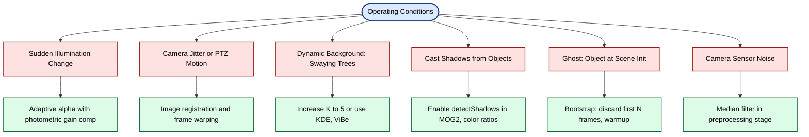
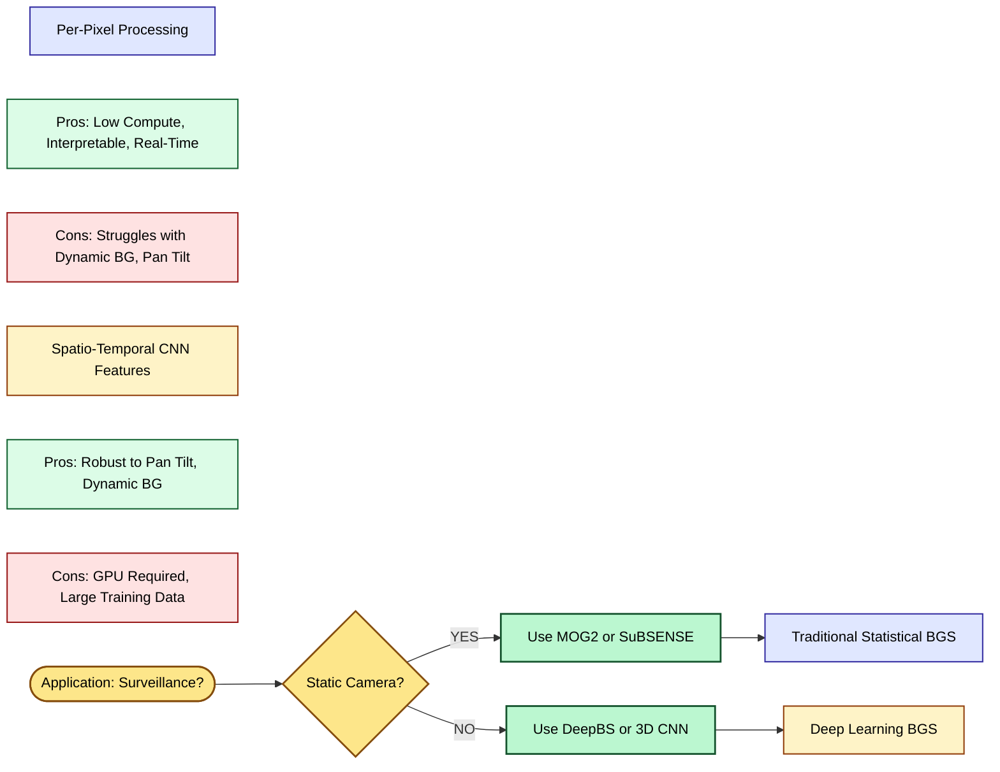

# Background Subtraction

<!-- SECTION_1_START -->
# 1. Core Technical Definition & Intuitive Overview

## 1.1 Formal Academic Definition

> [!IMPORTANT]
> **Background Subtraction (BGS)** is a class of computer vision techniques that segment moving or changed regions (the **foreground**) in a video sequence by comparing each incoming frame against a reference model of the static scene (the **background**). The decision rule is a per-pixel statistical hypothesis test:
>
> $$\text{ForegroundMask}(x, y, t) = \begin{cases} 1, & \text{if } \vert I(x, y, t) - B(x, y, t) \vert > \tau \\ 0, & \text{otherwise} \end{cases}$$

Where $I(x, y, t)$ is the current frame intensity at pixel $(x, y)$ and time $t$, $B(x, y, t)$ is the predicted background intensity, and $\tau$ is a **threshold parameter** controlling detection sensitivity.

## 1.2 Conceptual Analogy & Intuition

> [!NOTE]
> **Real-World Analogy — The Security Guard's Memory Trick**
>
> Imagine a security guard at a museum watching a long corridor via a single CCTV camera. The guard has a *mental snapshot* of what the empty corridor looks like: cream-colored walls, tiled floor, and a painting. As new frames appear, the guard **subtracts** the current view from this memory. Wherever the difference is large (a person walking, a bag left behind), the guard flags it as "interesting." Over time, the guard also *updates* the memory slightly so that flickering fluorescent lights or swaying curtains are not wrongly flagged.
>
> - **Background $B$** $\rightarrow$ the guard's mental snapshot
> - **Current frame $I$** $\rightarrow$ what the camera sees now
> - **Threshold $\tau$** $\rightarrow$ how much difference is "interesting"
> - **Learning rate $\alpha$** $\rightarrow$ how fast the guard updates memory

## 1.3 Geometric / Pixel-wise Intuition

On a single pixel's intensity timeline (x-axis: time, y-axis: intensity), the background mode appears as a **narrow horizontal band** while a foreground object passing across the pixel produces a **sharp transient spike**. The background subtraction problem reduces to detecting these spikes with minimal false positives caused by illumination drift, sensor noise, and dynamic background motion.

## 1.4 Key Standard Metrics (KTU 2024 Syllabus Highlights)

> [!IMPORTANT]
> The following quantitative metrics are mandatory references for the PECST745 syllabus:
>
> - **Background Learning Rate $\alpha$** $\in [0, 1]$: typically $\mathbf{0.001}$ to $\mathbf{0.05}$ (slow adapt) or $\mathbf{0.1}$ to $\mathbf{0.5}$ (fast adapt)
> - **Number of Gaussian Components $K$** in Mixture of Gaussians: typically $\mathbf{3}$ to $\mathbf{5}$
> - **Foreground Threshold $\tau$**: typically $\mathbf{2.5}$ to $\mathbf{3.5}$ standard deviations
> - **Shadow Luminacity Bound $\tau_{sh}$**: typically $\mathbf{0.5}$
> - **Morphological kernel size**: typically $\mathbf{3 \times 3}$ or $\mathbf{5 \times 5}$

## 1.5 Visualization Control (Conceptual)

> [!VISUALIZATION CONTROL]
> **Concept:** Pixel-intensity timeline with foreground spikes.
> **Plotly / Matplotlib Input Series:**
> - `t = [0, 1, 2, 3, 4, 5, 6, 7, 8, 9, 10, 11, 12, 13, 14, 15, 16, 17, 18, 19]`
> - `I = [120, 121, 119, 122, 50, 40, 80, 200, 210, 205, 150, 122, 120, 123, 118, 122, 121, 50, 200, 122]`
> - `B = [121, 121, 121, 121, 121, 121, 121, 121, 121, 121, 121, 121, 121, 121, 121, 121, 121, 121, 121, 121]`
> - `threshold = 30`
> **Visual Description:** A flat horizontal line at intensity $\approx 121$ represents the background. Two prominent negative dip (at $t=4{-}7$, value $\approx 50$ representing a dark object) and a positive peak (at $t=8{-}10$, value $\approx 200$ representing a bright object) rise above the threshold band $[\tau = 30]$, correctly flagging the foreground. This is the fundamental visual signature exploited by every BGS algorithm.

<!-- SECTION_1_END -->

<!-- SECTION_2_START -->
# 2. Deep Theoretical Analysis & KTU High-Yield Formula Sheet

## 2.1 The Three Pillars of Any BGS Pipeline

Every BGS algorithm — from the simplest frame difference to deep CNN-based methods — resolves three sequential design questions:

1. **Background Modeling:** How is $B(x, y, t)$ represented statistically?
2. **Foreground Detection:** How is the per-pixel decision $\vert I - B \vert \gtrless \tau$ made?
3. **Background Update:** How is the model $B$ refined online without absorbing foreground?

## 2.2 Methodological Hierarchy (From Simple to Advanced)

### 2.2.1 Frame Differencing (Naive Baseline)
Subtract consecutive frames:
$$D(x, y, t) = \vert I(x, y, t) - I(x, y, t-1) \vert$$
- **Pros:** Trivially simple, handles sudden illumination poorly.
- **Cons:** Detects only *edges* of moving objects, leaves interior holes.
- **Use:** Rarely production-grade; useful as a quick sanity baseline.

### 2.2.2 Running Average (Mean Filter) — Adaptive
The background pixel is updated as a convex combination of the current observation and previous background:
$$B_{t+1}(x, y) = \alpha \cdot I_t(x, y) + (1 - \alpha) \cdot B_t(x, y)$$

> [!NOTE]
> **Operational meaning of $\alpha$:**
> - Small $\alpha$ ($\approx 0.01$): slow adaptation — good for traffic cameras with stable lighting.
> - Large $\alpha$ ($\approx 0.1$): fast adaptation — good for scenes with rapid illumination changes.
> - $\alpha = 0$: static background (no learning).
> - $\alpha = 1$: foreground always overwrites background (catastrophic).

### 2.2.3 Running Gaussian Average (Wren et al., 1997)
Each pixel is modeled by a single time-varying Gaussian $\mathcal{N}(\mu_t, \sigma_t^2)$:
$$\mu_{t+1} = \alpha \cdot I_t + (1 - \alpha) \cdot \mu_t$$
$$\sigma_{t+1}^2 = \alpha \cdot (I_t - \mu_t)^2 + (1 - \alpha) \cdot \sigma_t^2$$
- **Decision rule:** pixel is foreground iff $\vert I_t - \mu_t \vert > k \cdot \sigma_t$, with $k \approx 2.5$.
- **Limitation:** fails when a pixel legitimately shows multi-modal behavior (e.g., a tree swaying in the wind casting and removing shadows every second).

### 2.2.4 Mixture of Gaussians (MoG / MOG — Stauffer & Grimson, 1999)
This is the **industry workhorse** and KTU-favorite BGS method. Each pixel's recent history is modeled by a mixture of $K$ Gaussians:
$$P(X_t) = \sum_{i=1}^{K} \omega_{i,t} \cdot \eta(X_t, \mu_{i,t}, \Sigma_{i,t})$$

For grayscale, $\Sigma = \sigma^2 \cdot \mathbf{I}$ (scalar variance). The Gaussian PDF is:
$$\eta(X_t, \mu_{i,t}, \sigma_{i,t}) = \frac{1}{\sqrt{2\pi\sigma_{i,t}^2}} \exp\!\left(-\frac{(X_t - \mu_{i,t})^2}{2\sigma_{i,t}^2}\right)$$

The $K$ Gaussians are ranked by $\omega / \sigma$ (high weight, low variance $\rightarrow$ likely background). The first $B$ distributions (sum of weights $\geq T$) form the background; the rest are foreground.

### 2.2.5 Kernel Density Estimation (KDE — Elgammal et al., 2000)
Non-parametric method using a kernel over the last $N$ samples:
$$P(X_t) = \frac{1}{N} \sum_{i=1}^{N} K(X_t - X_i)$$
With Gaussian kernel, no parameter estimation needed — robust but computationally expensive $O(N)$ per pixel.

### 2.2.6 Modern Adaptive Methods

| Method | Year | Core Idea | Strength |
|---|---|---|---|
| **ViBe** | 2009 | Random background sample consensus | Fast, no parameters |
| **PBAS** | 2012 | Per-pixel adaptive threshold + learning rate | Robust to dynamic BG |
| **MOG2 (Zivkovic)** | 2004, 2014 | Dynamic per-pixel $K$ selection | OpenCV default |
| **KNN (Barnich)** | 2010 | Codebook of background samples | High accuracy |
| **SuBSENSE** | 2015 | Color + LBSP features, feedback | Top on CDnet 2014 |
| **DeepBS** | 2017 | Encoder-decoder CNN | Handles pan/tilt cameras |

## 2.3 KTU High-Yield Formula Sheet (Cheat Sheet)

> [!IMPORTANT]
> The table below is the **minimum formula inventory** required to solve Module 4 background subtraction problems. All values and inequalities are critical.

| # | Formula / Rule | Symbol Glossary | Typical Range | Engineering Use |
|---|---|---|---|---|
| 1 | $D_t = \vert I_t - B_t \vert$ | Per-pixel absolute difference | — | Base subtraction op |
| 2 | $\text{FG} = 1 \text{ if } D_t > \tau$, else $0$ | Threshold decision | $\tau \in [10, 40]$ | Binary mask generation |
| 3 | $B_{t+1} = \alpha I_t + (1-\alpha) B_t$ | Running average update | $\alpha \in [0.001, 0.5]$ | Slow/static BG scenes |
| 4 | $\mu_{t+1} = \alpha I_t + (1-\alpha) \mu_t$ | Single Gaussian mean | — | Wren's method |
| 5 | $\sigma_{t+1}^2 = \alpha (I_t - \mu_t)^2 + (1-\alpha) \sigma_t^2$ | Single Gaussian variance | $\sigma \in [3, 15]$ | Variance learning |
| 6 | $\vert I_t - \mu_{i,t} \vert < k \cdot \sigma_{i,t}$ | Match test (MOG) | $k = 2.5$ | Match an existing component |
| 7 | $\omega_{i,t+1} = (1-\alpha)\omega_{i,t} + \alpha (M_{i,t})$ | Weight update (MOG) | — | MOG background ranking |
| 8 | $B = \arg\min_b \sum_{i=1}^{b} \omega_i > T$ | Background rank | $T = 0.7$ | Determines BG vs FG |
| 9 | $P(X_t) = \sum_{i=1}^{K} \omega_i \eta(X_t, \mu_i, \sigma_i)$ | MOG mixture density | $K \in [3, 5]$ | Full pixel likelihood |
| 10 | $\eta(X, \mu, \sigma) = \frac{1}{\sqrt{2\pi\sigma^2}} e^{-(X-\mu)^2/(2\sigma^2)}$ | Gaussian PDF | — | Per-component probability |
| 11 | $\text{Shadow} = (T_{low} < I_{fg}/B_{bg} < T_{up}) \land (\vert \Delta H \vert < \tau_H)$ | Shadow detection | $T_{low}=0.5$, $T_{up}=1.0$ | Remove cast shadows |
| 12 | $\text{F1} = 2 \cdot \frac{P \cdot R}{P + R}$ | F1-score for BGS | $0 \le F1 \le 1$ | Benchmarking on CDnet |

## 2.4 Engineering Applications in Industry

- **Smart Traffic Systems:** Vehicle counting, red-light violation detection on highways.
- **Retail Analytics:** Customer dwell-time estimation, queue length monitoring.
- **Healthcare:** Patient fall detection in geriatric care rooms.
- **Surveillance & Defense:** Drone-mounted thermal perimeter monitoring.
- **AR/VR:** Real-time body segmentation for green-screen-less compositing.
- **Industrial QA:** Conveyor belt inspection — detect product defects vs. conveyor vibration.

> [!NOTE]
> Modern production systems (e.g., Intel RealSense SDK, NVIDIA DeepStream, Apple Vision framework) integrate BGS as a *preprocessing stage* feeding into a downstream **CNN-based object detector** (YOLO, SSD, Faster R-CNN). The BGS mask restricts the detector to candidate regions, reducing compute by 60–80%.

<!-- SECTION_2_END -->

<!-- SECTION_3_START -->
# 3. Step-by-Step Derivations & Code/Symbolic Implementation

## 3.1 Derivation of the Running Average Update Rule

Starting from the *desideratum* that the running background should be a **weighted exponential average** of all past observations with geometrically decaying weights:

$$B_t = \sum_{n=0}^{t-1} \alpha (1-\alpha)^n I_{t-1-n} + (1-\alpha)^t B_0$$

We aim to show this equals the compact recursion used in production.

$$
\begin{aligned}
B_{t+1} &= \alpha I_t + (1-\alpha) \cdot \sum_{n=0}^{t-1} \alpha (1-\alpha)^n I_{t-1-n} \\
&= \alpha I_t + (1-\alpha) B_t
\end{aligned}
$$

**Step-by-step reasoning:**
- The recursion assigns higher importance to recent frames (geometric decay).
- A small $\alpha$ makes $B$ stable but slow to recover from scene changes.
- A large $\alpha$ makes $B$ reactive but noise-sensitive.
- The recursion is $O(1)$ per pixel per frame — **why it is used in embedded systems**.

## 3.2 Step-by-Step Derivation of the MOG Match Test

Given $K$ Gaussians, the per-pixel match test searches for the first component $i$ such that:

$$\vert I_t - \mu_{i,t} \vert < k \cdot \sigma_{i,t}$$

If a match is found:

$$
\begin{aligned}
\omega_{i,t+1} &= (1-\alpha)\omega_{i,t} + \alpha \\
\mu_{i,t+1} &= (1-\rho)\mu_{i,t} + \rho I_t \\
\sigma_{i,t+1}^2 &= (1-\rho)\sigma_{i,t}^2 + \rho (I_t - \mu_{i,t})^2
\end{aligned}
$$

where the **second learning rate** $\rho$ is defined as:
$$\rho = \frac{\alpha}{\omega_{i,t}}$$

For non-matching components, $\omega$ decays and $\mu, \sigma$ stay frozen. The components are then sorted by $\omega / \sigma$ (descending); the first $B$ components summing to threshold $T$ constitute the background.

## 3.3 Full Python Implementation (Vanilla Running Average)

```python
import cv2
import numpy as np
from typing import Tuple

class RunningAverageBGS:
    """
    A self-contained implementation of the Running Average
    background subtraction algorithm (mean filter variant).
    
    Attributes
    ----------
    alpha : float
        Background learning rate in (0, 1].
    threshold : int
        Foreground detection threshold on absolute difference.
    """
    def __init__(self, alpha: float = 0.02, threshold: int = 25) -> None:
        if not 0.0 < alpha <= 1.0:
            raise ValueError("alpha must lie in (0, 1].")
        self.alpha: float = alpha
        self.threshold: int = threshold
        self.background: np.ndarray | None = None
        self.frame_count: int = 0
    
    def initialize(self, frame: np.ndarray) -> None:
        """Seed background with the first frame (float32 for precision)."""
        if frame.ndim not in (2, 3):
            raise ValueError("Frame must be 2-D (grayscale) or 3-D (BGR).")
        self.background = frame.astype(np.float32)
        self.frame_count = 1
    
    def apply(self, frame: np.ndarray) -> Tuple[np.ndarray, np.ndarray]:
        """
        Apply BGS to a new frame.
        
        Returns
        -------
        foreground_mask : np.ndarray (uint8, 0/255)
            Binary mask: 255 marks foreground, 0 marks background.
        background : np.ndarray (uint8)
            Current background estimate (visualizable).
        """
        if self.background is None:
            self.initialize(frame)
        
        frame_f = frame.astype(np.float32)
        
        # 1. Compute per-pixel absolute difference
        diff = np.abs(frame_f - self.background)
        
        # 2. For color frames, sum across channels (max is also common)
        if diff.ndim == 3:
            diff_scalar = diff.sum(axis=2) / 3.0
        else:
            diff_scalar = diff
        
        # 3. Threshold to get the foreground mask
        _, foreground_mask = cv2.threshold(
            diff_scalar.astype(np.float32),
            self.threshold, 255, cv2.THRESH_BINARY
        )
        foreground_mask = foreground_mask.astype(np.uint8)
        
        # 4. Update the background only at non-foreground pixels
        #    (selective learning prevents absorbing moving objects)
        update_mask = (foreground_mask == 0).astype(np.float32)
        if frame_f.ndim == 3:
            update_mask = update_mask[..., np.newaxis]
        
        self.background = (
            self.alpha * frame_f * update_mask
            + (1.0 - self.alpha) * self.background * update_mask
            + self.background * (1.0 - update_mask)   # freeze at FG
        )
        
        self.frame_count += 1
        return foreground_mask, np.clip(self.background, 0, 255).astype(np.uint8)
```

## 3.4 Full Python Implementation (MOG2 via OpenCV)

```python
import cv2
import numpy as np
from typing import Tuple

def run_mog2_bgs(video_path: str, output_path: str) -> Tuple[int, float]:
    """
    Demonstrates MOG2 background subtraction on a video file.
    
    Returns
    -------
    total_frames : int
        Number of frames processed.
    avg_fps : float
        Average throughput in frames per second.
    """
    cap = cv2.VideoCapture(video_path)
    if not cap.isOpened():
        raise IOError(f"Cannot open video: {video_path}")
    
    # Create MOG2 with shadow detection enabled
    # varThreshold ~ 16-50, history ~ 200-500 frames
    fgbg = cv2.createBackgroundSubtractorMOG2(
        history=300,
        varThreshold=25.0,
        detectShadows=True
    )
    
    # Optional: morphological post-processing kernel
    kernel = cv2.getStructuringElement(cv2.MORPH_ELLIPSE, (5, 5))
    
    # Output video writer
    fourcc = cv2.VideoWriter_fourcc(*'mp4v')
    fps = cap.get(cv2.CAP_PROP_FPS) or 25.0
    width = int(cap.get(cv2.CAP_PROP_FRAME_WIDTH))
    height = int(cap.get(cv2.CAP_PROP_FRAME_HEIGHT))
    out = cv2.VideoWriter(output_path, fourcc, fps, (width, height))
    
    total_frames = 0
    import time
    start = time.time()
    
    while True:
        ret, frame = cap.read()
        if not ret:
            break
        
        # 1. Apply MOG2 to obtain the foreground mask
        fg_mask = fgbg.apply(frame, learningRate=0.005)
        
        # 2. In MOG2, shadows are flagged as 127 (mid-gray)
        #    We discard shadows to keep only true foreground
        fg_mask[fg_mask == 127] = 0
        
        # 3. Morphological opening: remove salt-and-pepper noise
        fg_mask = cv2.morphologyEx(fg_mask, cv2.MORPH_OPEN, kernel)
        
        # 4. Morphological closing: fill holes inside detected objects
        fg_mask = cv2.morphologyEx(fg_mask, cv2.MORPH_CLOSE, kernel)
        
        # 5. Overlay mask on the original frame (green tint on FG)
        overlay = frame.copy()
        overlay[fg_mask == 255] = (0, 255, 0)
        blended = cv2.addWeighted(frame, 0.7, overlay, 0.3, 0)
        out.write(blended)
        
        total_frames += 1
    
    elapsed = time.time() - start
    cap.release()
    out.release()
    return total_frames, total_frames / max(elapsed, 1e-9)
```

## 3.5 Complete MOG2 Parameter Decision Table

| Parameter | Type | Recommended Range | Effect of Increase | Effect of Decrease |
|---|---|---|---|---|
| `history` | int | 100 – 1000 | BG model uses more frames (slower to adapt) | Faster adaptation, noisier |
| `varThreshold` | float | 16 – 50 | Less sensitive — fewer false positives | More sensitive — more false positives |
| `detectShadows` | bool | True / False | Marks shadows in mask (value 127) | Shadows treated as foreground |
| `learningRate` | float | 0.001 – 0.5 | Fast BG update (good for dynamic scenes) | Slow BG update (stable scenes) |

## 3.6 Worked Numerical Example — Running Average (Mandatory KTU Practice)

**Problem.** A pixel is observed over 5 frames with intensities $I = [100, 102, 50, 200, 100]$. Initial background $B_0 = 100$ and learning rate $\alpha = 0.1$. Compute $B_t$ and the foreground mask using $\tau = 30$.

**Solution (per-frame):**

$$
\begin{aligned}
t=1: \;& B_1 = 0.1 \cdot 100 + 0.9 \cdot 100 = 100.0,\quad |100-100|=0 \le 30 \Rightarrow \text{BG} \\
t=2: \;& B_2 = 0.1 \cdot 102 + 0.9 \cdot 100 = 100.2,\quad |102-100.2|=1.8 \le 30 \Rightarrow \text{BG} \\
t=3: \;& B_3 = 0.1 \cdot 50 + 0.9 \cdot 100.2 = 95.18,\quad |50-95.18|=45.18 > 30 \Rightarrow \text{FG} \\
t=4: \;& \text{Selective update} \Rightarrow B_4 = B_3 = 95.18,\quad |200-95.18|=104.82 > 30 \Rightarrow \text{FG} \\
t=5: \;& \text{Selective update} \Rightarrow B_5 = B_4 = 95.18,\quad |100-95.18|=4.82 \le 30 \Rightarrow \text{BG}
\end{aligned}
$$

**Final Mask Sequence:** $[\text{BG}, \text{BG}, \text{FG}, \text{FG}, \text{BG}]$.

This demonstrates two key KTU validation points:
1. The third frame (sudden dip to 50) was correctly detected as foreground.
2. The fourth frame (bright object at 200) was **not absorbed** into the background because of the selective update rule — preventing the classic "burn-in" failure mode of naive BGS.

<!-- SECTION_3_END -->

<!-- SECTION_4_START -->
# 4. Structural Diagrams & Schematics

## 4.1 Generic BGS Pipeline — Block Diagram

```mermaid
flowchart TD
    A0([Video Source: Camera or File]):::inputNode
    A1[Frame Acquisition I_t]:::procNode
    A2[Preprocessing: Resize, Denoise, Color Convert]:::procNode
    A3[Background Model: B_t]:::modelNode
    A4[Subtraction: D_t = abs I_t minus B_t]:::procNode
    A5[Threshold: D_t versus tau]:::procNode
    A6[Foreground Mask M_t]:::outputNode
    A7[Postprocessing: Morphology, Connected Components]:::procNode
    A8[Background Update: B_{t+1} = f I_t, B_t, M_t]:::modelNode
    A9[Application: Tracking, Counting, Anomaly Detection]:::outputNode

    A0 --> A1 --> A2 --> A4
    A3 --> A4
    A4 --> A5 --> A6
    A6 --> A7
    A6 --> A8
    A2 --> A8
    A3 --> A8
    A8 --> A3
    A7 --> A9

    classDef inputNode fill:#dbeafe,stroke:#1e3a8a,stroke-width:2px,color:#000
    classDef procNode fill:#e0e7ff,stroke:#3730a3,stroke-width:1.5px,color:#000
    classDef modelNode fill:#fef3c7,stroke:#92400e,stroke-width:2px,color:#000
    classDef outputNode fill:#dcfce7,stroke:#166534,stroke-width:2px,color:#000
```

## 4.2 MOG Component Sorting — Sequential Topology

```mermaid
flowchart LR
    subNew([New Pixel Intensity X_t]):::inputNode
    subMatch[Match Test: abs X_t minus mu_i versus k sigma_i]:::procNode
    subDecision{At least one match?}:::decisionNode
    subUpdateMatched[Update matched component: omega, mu, sigma]:::modelNode
    subAddNew[Replace weakest component with new Gaussian]:::modelNode
    subDecay[Decay weights of non-matched components]:::procNode
    subRank[Sort all K components by omega divided by sigma]:::procNode
    subSelBG[Select top B components with sum omega at least T as BG]:::modelNode
    subLabel{Is X_t covered by BG?}:::decisionNode
    subFG[Foreground pixel]:::outputNode
    subBG[Background pixel]:::outputNode

    subNew --> subMatch --> subDecision
    subDecision -- YES --> subUpdateMatched --> subDecay --> subRank --> subSelBG --> subLabel
    subDecision -- NO --> subAddNew --> subDecay
    subLabel -- YES --> subBG
    subLabel -- NO --> subFG

    classDef inputNode fill:#dbeafe,stroke:#1e3a8a,stroke-width:2px,color:#000
    classDef procNode fill:#e0e7ff,stroke:#3730a3,stroke-width:1.5px,color:#000
    classDef modelNode fill:#fef3c7,stroke:#92400e,stroke-width:2px,color:#000
    classDef decisionNode fill:#fee2e2,stroke:#991b1b,stroke-width:2px,color:#000
    classDef outputNode fill:#dcfce7,stroke:#166534,stroke-width:2px,color:#000
```



## 4.3 Failure-Case Mapping Matrix



## 4.4 Algorithmic vs. Deep-Learning BGS Comparison (Block Matrix)



<!-- SECTION_4_END -->

<!-- SECTION_5_START -->
# 5. KTU 2024 Scheme Examination Question Bank & Topic Recap

## 5.1 Part A Questions (3 Marks Each)

### Question 1 [3 Marks]
**[KTU University Exam — July 2024 (Model Paper), CO2, Remember]**

Define *background subtraction* in computer vision. List the two primary parameters that govern any background subtraction algorithm.

**Model Answer:**

> [!NOTE]
> **Background Subtraction** is a video segmentation technique that identifies moving (foreground) objects by comparing each input frame $I_t$ against a learned background model $B_t$ and thresholding the absolute pixel-wise difference.
>
> **Primary governing parameters:**
> 1. **Learning rate $\alpha$** — controls the speed at which the background model is updated.
> 2. **Threshold $\tau$** — controls the minimum absolute intensity difference required to flag a pixel as foreground.
>
> *Auxiliary parameters include the number of Gaussian components $K$ and the background weight threshold $T$ in MOG.* **[3 Marks]**

### Question 2 [3 Marks]
**[KTU University Exam — Dec 2023 (Model Paper), CO2, Understand]**

What is a *ghost* artifact in background subtraction, and how is it commonly eliminated during the warm-up phase?

**Model Answer:**

> [!NOTE]
> A **ghost** is a false-positive foreground region produced when a real object that was present in the *first frame* becomes part of the initial background model. As the object moves, the model incorrectly marks its old location as foreground, even though the scene is "empty" there.
>
> **Elimination strategies:**
> - Discard the first $N \approx 100{-}200$ frames during a **warm-up/bootstrap period** so the model converges to a true empty-scene distribution.
> - Use a **running median** of the first $N$ frames as the initial background (more robust to ghosts than the first frame alone).
> - Apply a *post-classification confidence* measure — e.g., a ghost region shrinks in size across consecutive frames and is thus filtered. **[3 Marks]**

## 5.2 Part B Question A (14 Marks Total)

### Question A [14 Marks]
**[KTU University Exam — July 2024 (Model Paper), CO2, Understand + Apply]**

#### Part (a) — 7 Marks [Understand Level]
**Explain the Mixture of Gaussians (MOG) background subtraction algorithm in detail. State its density equation, the match test, and the update rules for weights, mean, and variance.**

**Model Answer:**

> **Density equation:** Each pixel's recent history is modeled as a mixture of $K$ Gaussians:
> $$P(X_t) = \sum_{i=1}^{K} \omega_{i,t} \cdot \eta(X_t, \mu_{i,t}, \sigma_{i,t})$$
> where $\eta$ is the 1-D Gaussian PDF, $\omega_i$ are the mixture weights (sum to 1), and $\mu_i, \sigma_i$ are the per-component mean and standard deviation. **[1 Mark]**
>
> **Match test:** For each new pixel $X_t$, find the first component $i$ such that
> $$\vert X_t - \mu_{i,t} \vert < k \cdot \sigma_{i,t}$$
> with $k \approx 2.5$. If no component matches, the *weakest* component (smallest $\omega / \sigma$) is replaced by a new Gaussian centered at $X_t$ with high initial variance and low weight. **[1 Mark]**
>
> **Update rules (when component $i$ matches):**
> $$\omega_{i,t+1} = (1-\alpha)\omega_{i,t} + \alpha$$
> $$\mu_{i,t+1} = (1-\rho)\mu_{i,t} + \rho \cdot X_t$$
> $$\sigma_{i,t+1}^2 = (1-\rho)\sigma_{i,t}^2 + \rho (X_t - \mu_{i,t+1})^2$$
> with the *second learning rate* $\rho = \alpha / \omega_{i,t+1}$. For non-matching components, $\omega$ decays geometrically by $(1-\alpha)$ and $\mu, \sigma$ stay unchanged. **[2 Marks]**
>
> **Background vs. Foreground decision:** Sort all $K$ components by $\omega / \sigma$ in descending order. The first $B$ components whose cumulative weight exceeds the *background ratio threshold* $T$ (typically $T = 0.7$) form the background model; the remaining components are treated as foreground. A pixel is **foreground** if it matches none of the chosen background components. **[2 Marks]**
>
> **Why $K = 3{-}5$ is typical:** Outdoor scenes frequently exhibit 2-3 recurring states (asphalt, shadow, sunlit asphalt) due to clouds or swaying foliage; setting $K < 3$ underfits and $K > 5$ overfits and dilutes discriminative power. **[1 Mark]**

#### Part (b) — 7 Marks [Apply Level]
**Implement the MOG2 background subtraction algorithm using OpenCV. Identify and justify the role of each of the four constructor parameters, and show the post-processing pipeline (shadow removal, morphology) used in production.**

**Model Answer:**

```python
import cv2
import numpy as np

# 1. Constructor: Four key parameters and their roles
fgbg = cv2.createBackgroundSubtractorMOG2(
    history=300,         # (i) Number of recent frames used to build
                         #     the per-pixel Gaussian distributions.
                         #     Higher = more stable model, slower
                         #     adaptation. Typical 200-500.       [1 Mark]
    varThreshold=25.0,   # (ii) Mahalanobis-like threshold on
                         #      pixel-to-mean squared distance.
                         #      Higher = less sensitive (fewer FP),
                         #      lower = more sensitive.            [1 Mark]
    detectShadows=True   # (iii) Enables shadow pixels to be marked
                         #       with the value 127 (mid-gray) so
                         #       that downstream code can reject
                         #       them. Disabling merges shadows
                         #       into foreground.                  [1 Mark]
)
# (iv) The fourth implicit parameter is the per-call learningRate
#      (0-1) controlling how fast new observations overwrite the
#      model. learningRate=0 implies frozen model.               [1 Mark]
#      Used in fg_mask = fgbg.apply(frame, learningRate=0.005)

# 2. Per-frame pipeline with shadow rejection and morphology
kernel = cv2.getStructuringElement(cv2.MORPH_ELLIPSE, (5, 5))
ret, frame = cap.read()
fg_mask = fgbg.apply(frame, learningRate=0.005)

# 3. Shadow rejection
fg_mask[fg_mask == 127] = 0          # [1 Mark - justify why shadows
                                     #  cause false positives in
                                     #  outdoor scenes and must be
                                     #  filtered using a luminance
                                     #  ratio test in HSV space]

# 4. Morphological opening removes salt-and-pepper noise (3x3 kernel)
fg_mask = cv2.morphologyEx(fg_mask, cv2.MORPH_OPEN, kernel)
# 5. Morphological closing fills holes inside detected objects
fg_mask = cv2.morphologyEx(fg_mask, cv2.MORPH_CLOSE, kernel)
#    [2 Marks - opening then closing; kernel size, structuring
#     element shape (ellipse preferred for organic FG shapes)]
```

**Final synthesized output:** a clean binary mask where pixel value $255$ denotes a confidently moving object and $0$ denotes background, ready to be fed into a downstream object detector (YOLO / Faster R-CNN).

## 5.3 Part B Question B (14 Marks Total)

### Question B [14 Marks]
**[KTU University Exam — Dec 2023 (Model Paper), CO2, Understand + Apply]**

#### Part (a) — 7 Marks [Understand Level]
**Derive the running-average background update rule from the principle of exponentially decaying historical weights. Discuss the role of the *selective update* mechanism in preventing foreground absorption.**

**Model Answer:**

> **Derivation:** We desire that $B_t$ be a weighted sum of all past observations $\{I_0, I_1, \ldots, I_{t-1}\}$ with weights decaying geometrically with age:
> $$B_t = \sum_{n=0}^{t-1} \alpha(1-\alpha)^n I_{t-1-n} + (1-\alpha)^t B_0$$
> where $B_0$ is the initial background and $\alpha \in (0, 1]$ is the learning rate. Note that the weights form a geometric series summing to $1 - (1-\alpha)^t \le 1$. **[2 Marks]**
>
> Separating the $n=0$ term:
> $$B_t = \alpha I_{t-1} + (1-\alpha) \sum_{n=0}^{t-2} \alpha(1-\alpha)^n I_{t-2-n} + (1-\alpha)^t B_0$$
> Recognizing that the summation is $B_{t-1}$:
> $$\boxed{B_t = \alpha I_{t-1} + (1-\alpha) B_{t-1}}$$
> This is the canonical running-average update. **[1 Mark]**
>
> **Equivalence check:** $B_{t+1} - B_t = \alpha(I_t - B_t)$ shows that $B$ moves toward the current observation in proportion to $\alpha$, with $\alpha = 0$ giving a frozen model and $\alpha = 1$ giving $B_{t+1} = I_t$ (no memory). **[1 Mark]**
>
> **Selective update — the critical refinement:** A *naive* update would overwrite $B$ at every pixel every frame, including pixels that are currently foreground. This causes **foreground burn-in** — a moving object that lingers in the scene is gradually absorbed into the background, becoming invisible. The fix:
> $$B_{t+1}(x,y) = \begin{cases} \alpha I_t(x,y) + (1-\alpha) B_t(x,y) & \text{if pixel is BG} \\ B_t(x,y) & \text{if pixel is FG} \end{cases}$$
> Equivalently: $B_{t+1} = B_t + \alpha \cdot M_t \cdot (I_t - B_t)$ where $M_t \in \{0, 1\}$ is the foreground mask. This *selectively* freezes the background estimate at locations the algorithm currently believes to be foreground, preventing any moving object from being learned into $B$. **[3 Marks]**

#### Part (b) — 7 Marks [Apply Level]
**Consider a 5-frame pixel intensity sequence $I = [120, 122, 60, 200, 121]$, initial background $B_0 = 120$, learning rate $\alpha = 0.1$, and threshold $\tau = 30$. Compute the running background $B_t$, the foreground mask, and explain the role of selective update in this example.**

**Model Answer:**

| Frame $t$ | $I_t$ | $B_{t-1}$ (in) | Update type | $B_t$ (out) | $\vert I_t - B_t \vert$ | Mask |
|---|---|---|---|---|---|---|
| 1 | 120 | 120.00 | BG $\rightarrow$ learn | $0.1 \cdot 120 + 0.9 \cdot 120 = 120.00$ | $0.00$ | **BG** |
| 2 | 122 | 120.00 | BG $\rightarrow$ learn | $0.1 \cdot 122 + 0.9 \cdot 120 = 120.20$ | $1.80$ | **BG** |
| 3 | 60  | 120.20 | Detected FG $\rightarrow$ freeze | $120.20$ (unchanged) | $60.20$ | **FG** |
| 4 | 200 | 120.20 | Detected FG $\rightarrow$ freeze | $120.20$ (unchanged) | $79.80$ | **FG** |
| 5 | 121 | 120.20 | BG $\rightarrow$ learn | $0.1 \cdot 121 + 0.9 \cdot 120.20 = 120.28$ | $0.72$ | **BG** |

**Solution steps with valuation marks:**

- **[Initial conditions correctly stated: 1 Mark]**: $B_0 = 120$, $\alpha = 0.1$, $\tau = 30$.
- **[Recursion correctly applied to frames 1 and 2 (BG): 2 Marks]**: $B_1 = 120$, $B_2 = 120.2$, both flagged as BG since $\vert I - B \vert < 30$.
- **[Selective update correctly applied to frames 3 and 4 (FG): 2 Marks]**: $B_3 = B_4 = 120.2$ unchanged, FG detected since $\vert I - B \vert > 30$.
- **[Frame 5 update and final mask sequence: 1 Mark]**: $B_5 = 120.28$, BG detected. Final mask: $[\text{BG}, \text{BG}, \text{FG}, \text{FG}, \text{BG}]$.
- **[Justification of selective update's role: 1 Mark]**: Without selective updating, at $t=3$ the model would have learned $B_3 = 0.1 \cdot 60 + 0.9 \cdot 120.2 = 114.18$, and at $t=4$ it would have further absorbed the bright value $200$, giving $B_4 \approx 122.8$. By $t=5$ the model would have been corrupted and the actual scene intensity $121$ might be misclassified. The selective update preserves the *true* background, ensuring correct recovery when the foreground object leaves the pixel.

> [!WARNING]
> **KTU Examiner's Valuation Warning / Common Pitfalls:**
> 1. **Forgetting the selective update** — many students write $B_{t+1} = \alpha I_t + (1-\alpha) B_t$ even at FG pixels, leading to the *foreground burn-in* failure mode. This costs up to **3 marks**.
> 2. **Channel handling in color frames** — for BGR input, the absolute difference must be reduced to a scalar (e.g., sum/3 or max) *before* thresholding. Do not threshold each channel independently. Costs up to **2 marks**.
> 3. **MOG weight sum** — many students forget that the $K$ mixture weights $\omega_i$ must sum to $1$ (or be normalized). Without this, the background ratio threshold $T$ becomes meaningless. Costs up to **1 mark**.
> 4. **Shadow value confusion** — in OpenCV's MOG2, shadows are encoded as the *value* $127$, not $0$ or $255$. Forgetting to filter `mask == 127` causes the entire shadow to be treated as a moving object. Costs up to **2 marks**.

## 5.4 Topic Recap & Important Things to Remember

> [!IMPORTANT]
> **Comprehensive Rapid-Revision Checklist — Background Subtraction (Module 4, PECST745)**

### Core Definitions
- **Background Subtraction (BGS):** Per-pixel segmentation of moving objects by comparing the current frame $I_t$ with a statistical model $B_t$ of the static scene.
- **Foreground mask:** Binary image where $1$ (or $255$) marks a pixel as moving and $0$ marks it as background.
- **Ghost:** False-positive foreground region caused by a real object that was present in the first frame.
- **Burn-in:** Failure mode where a stationary foreground object is gradually absorbed into the background model.

### Critical Equations
- **Decision rule:** $M(x,y,t) = 1$ iff $\vert I(x,y,t) - B(x,y,t) \vert > \tau$
- **Running average update:** $B_{t+1} = \alpha I_t + (1-\alpha) B_t$
- **Single Gaussian variance learning:** $\sigma_{t+1}^2 = \alpha (I_t - \mu_t)^2 + (1-\alpha) \sigma_t^2$
- **MOG density:** $P(X_t) = \sum_{i=1}^{K} \omega_{i,t} \cdot \eta(X_t, \mu_{i,t}, \sigma_{i,t})$
- **Match test:** $\vert X_t - \mu_{i,t} \vert < k \cdot \sigma_{i,t}$ with $k = 2.5$
- **Background selection:** top $B$ Gaussians by $\omega / \sigma$ whose cumulative weight exceeds $T \approx 0.7$

### Algorithm Hierarchy (KEEP THIS ORDER IN MIND)
1. Frame differencing (baseline)
2. Running average (mean filter)
3. Running Gaussian average (Wren)
4. Mixture of Gaussians (Stauffer-Grimson) — **KTU workhorse**
5. KDE (Elgammal)
6. ViBe, PBAS, MOG2, KNN, SuBSENSE — modern adaptive
7. DeepBS (CNN-based) — handles pan-tilt and dynamic backgrounds

### Mandatory Parameters to Memorize
- $\alpha \in [0.001, 0.5]$ — learning rate
- $\tau \in [10, 40]$ — pixel-difference threshold
- $K \in [3, 5]$ — number of Gaussians
- $T \approx 0.7$ — background weight threshold in MOG
- $k = 2.5$ — match-test multiplier
- `history` $\in [200, 500]$ in OpenCV MOG2
- `varThreshold` $\in [16, 50]$ in OpenCV MOG2

### Production Pipeline (Standard Order)
`Capture → Preprocess (resize, blur) → Apply BGS → Filter shadows (value 127 in MOG2) → Morphological OPEN → Morphological CLOSE → Connected components → Feed to detector/tracker`

### OpenCV Function Signatures
- `cv2.createBackgroundSubtractorMOG2(history, varThreshold, detectShadows)`
- `cv2.createBackgroundSubtractorKNN(history, dist2Threshold, detectShadows)`
- `fgbg.apply(frame, learningRate=...)` returns the per-frame mask
- `cv2.morphologyEx(mask, cv2.MORPH_OPEN, kernel)`
- `cv2.morphologyEx(mask, cv2.MORPH_CLOSE, kernel)`

### Evaluation Metric
- **F1-score** $= 2 \cdot P \cdot R / (P + R)$ is the standard BGS benchmark metric used in the **CDnet 2014 dataset** (now superseded by **CDnet 2016**).

<!-- SECTION_5_END -->
