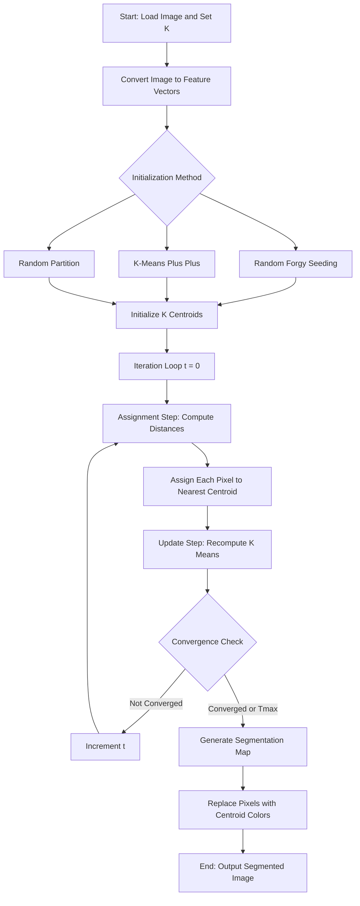
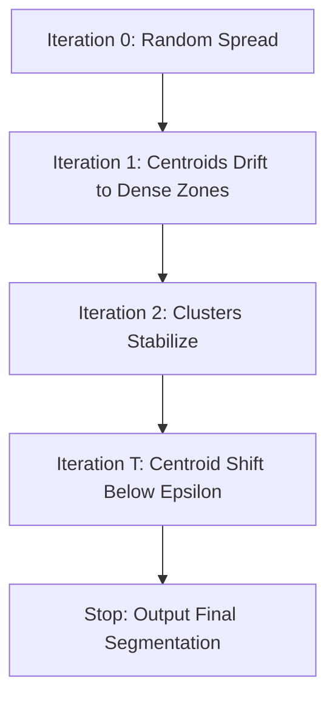

# Clustering and Segmentation by K-means

<!-- SECTION_1_START -->

# Clustering and Segmentation by K-means

## 1. Core Technical Definition

> [!NOTE]
> **Definition (KTU Syllabus Standard):** *K-means clustering is an unsupervised, centroid-based, partitioning clustering algorithm that segregates a given dataset of $N$ observations into $K$ pre-defined, non-overlapping clusters, where each observation belongs to the cluster with the nearest centroid (mean). In Computer Vision, it is used as a foundational technique for image segmentation by partitioning pixels into $K$ groups based on color, intensity, or spatial feature similarity.*

Formally, given a set of $N$ data points $\mathbf{X} = \{\mathbf{x}_1, \mathbf{x}_2, \dots, \mathbf{x}_N\}$ in $\mathbb{R}^d$, K-means partitions $\mathbf{X}$ into $K$ clusters $C = \{C_1, C_2, \dots, C_K\}$ such that the **Within-Cluster Sum of Squares (WCSS)** — also called **inertia** or **distortion** $J$ — is minimized.

$$J = \sum_{k=1}^{K} \sum_{\mathbf{x}_i \in C_k} \Vert \mathbf{x}_i - \boldsymbol{\mu}_k \Vert^2$$

where $\boldsymbol{\mu}_k$ is the **centroid** (mean vector) of cluster $C_k$.

**Standardized Parameters (Bold Constants):**
* **$K$** — Number of clusters (must be pre-specified).
* **$\boldsymbol{\mu}_k$** — Centroid of cluster $k$.
* **$N$** — Total number of pixels / data points.
* **$\epsilon$** — Convergence tolerance threshold (typically $\mathbf{1 \times 10^{-4}}$).

---

## 2. Intuitive Analogy (Plain English)

> [!IMPORTANT]
> **Real-World Analogy — "Sorting Fruits into Boxes"**
>
> Imagine you have a huge mixed basket of **red apples, green grapes, and yellow bananas** dumped on a table. You cannot read labels. A K-means worker would:
> 1. Guess the center of each fruit type and place 3 empty boxes there.
> 2. Assign every fruit to the **nearest box** (shorter travel).
> 3. After all fruits are placed, **move each box to the actual center** of the fruits inside it.
> 4. Re-assign fruits again because some are now closer to a new box.
> 5. Repeat steps 3 and 4 until no fruit jumps to a different box.
>
> This is exactly K-means: **Guess centers $\rightarrow$ Assign $\rightarrow$ Update $\rightarrow$ Repeat.**
> In an image, pixels with similar RGB or grayscale intensity behave like "same-colored fruits" and naturally fall into the same cluster — yielding a **segmented image**.

---

## 3. GeoGebra / Desmos Visualization

> [!VISUALIZATION CONTROL]
> **Concept:** K-means Iterative Centroid Convergence on a 2D Scatter Plot.
>
> **GeoGebra / Desmos Input Equations (Simulating 2 cluster case):**
> * Cluster A points: $(1,1), (1.5,2), (2,1.2)$
> * Cluster B points: $(7,8), (8,7.5), (7.5,8.2)$
> * Initial centroid $\mu_1^{(0)} = (2,4)$ and $\mu_2^{(0)} = (5,6)$ (placed manually)
> * Plot: scatter points + plot $(2,4)$ and $(5,6)$ as movable points
>
> **Visual Description:** The student should observe that on the **first iteration**, the red points and blue points are split by a perpendicular bisector of the line joining the two centroids. As iterations increase, $\mu_1$ migrates **toward the dense red cluster** and $\mu_2$ migrates **toward the dense blue cluster** until both centroids stabilize inside their respective groups. The Voronoi boundary shrinks to its final segmenting line.

<!-- SECTION_1_END -->

<!-- SECTION_2_START -->

# Deep Theoretical Analysis & KTU High-Yield Formula Sheet

## 1. Mathematical Objective and Constraints

The K-means optimization problem is stated as:

$$\min_{C, \boldsymbol{\mu}} \;\; J(C, \boldsymbol{\mu}) = \sum_{k=1}^{K} \sum_{i=1}^{N} \mathbb{1}\{\mathbf{x}_i \in C_k\} \cdot \Vert \mathbf{x}_i - \boldsymbol{\mu}_k \Vert^2$$

Subject to:
* **Hard partition constraint:** $\;C_i \cap C_j = \emptyset$ for $i \neq j$
* **Exhaustive coverage:** $\;\bigcup_{k=1}^{K} C_k = \mathbf{X}$
* **Non-empty clusters:** $\;\vert C_k \vert \geq 1$ for all $k \in \{1, \dots, K\}$

Since joint minimization over $(C, \boldsymbol{\mu})$ is **NP-hard**, Lloyd's algorithm (1957) uses an **alternating block-coordinate descent** strategy: it is guaranteed to converge to a *local* minimum, not a global one.

---

## 2. Operational Logic Steps (Lloyd's Algorithm)

> [!NOTE]
> **The 5-Stage Engine of K-means — Step-by-Step:**

* **Step 1 — Initialization:** Select $K$ initial centroids $\{\boldsymbol{\mu}_1^{(0)}, \boldsymbol{\mu}_2^{(0)}, \dots, \boldsymbol{\mu}_K^{(0)}\}$ using one of the strategies below.
    * Random Initialization
    * **Forgy Method** — randomly pick $K$ data points
    * **K-Means++** — probability-weighted seeding (used by `sklearn`)
    * **Random Partition** — assign each point randomly to a cluster, then compute means

* **Step 2 — Assignment Step (Expectation):** For every pixel $\mathbf{x}_i$, assign it to the cluster with the **minimum Euclidean distance**.
$$C_k^{(t)} = \left\{ \mathbf{x}_i : \Vert \mathbf{x}_i - \boldsymbol{\mu}_k^{(t)} \Vert^2 \leq \Vert \mathbf{x}_i - \boldsymbol{\mu}_j^{(t)} \Vert^2 \;\; \forall j, 1 \leq j \leq K \right\}$$

* **Step 3 — Update Step (Maximization):** Recompute each centroid as the **mean of all points assigned** to it.
$$\boldsymbol{\mu}_k^{(t+1)} = \frac{1}{\vert C_k^{(t)} \vert} \sum_{\mathbf{x}_i \in C_k^{(t)}} \mathbf{x}_i$$

* **Step 4 — Convergence Check:** Stop if any of the following hold:
    * $\Vert \boldsymbol{\mu}_k^{(t+1)} - \boldsymbol{\mu}_k^{(t)} \Vert < \epsilon$ for all $k$
    * Cluster assignments $C_k$ are unchanged
    * Maximum iterations $T_{\max}$ reached (commonly $T_{\max} = 300$)

* **Step 5 — Output:** Produce the final cluster map (segmentation mask) $L(\mathbf{x}_i) = \arg\min_k \Vert \mathbf{x}_i - \boldsymbol{\mu}_k \Vert$.

---

## 3. KTU High-Yield Formula Sheet

> [!IMPORTANT]
> The following table is **exam-portable** — every entry is a frequently tested item in KTU ESE and internal assessments.

| **Component** | **Formula / Definition** | **Notation / Units** |
|---|---|---|
| Objective Function (WCSS) | $J = \sum_{k=1}^{K} \sum_{\mathbf{x}_i \in C_k} \Vert \mathbf{x}_i - \boldsymbol{\mu}_k \Vert^2$ | Scalar, in feature-units$^2$ |
| Euclidean Distance (pixel $i$ to centroid $k$) | $d(\mathbf{x}_i, \boldsymbol{\mu}_k) = \sqrt{\sum_{d=1}^{D}(x_{i,d} - \mu_{k,d})^2}$ | $D$ = feature dimensions (3 for RGB) |
| Centroid Update Rule | $\boldsymbol{\mu}_k = \frac{1}{N_k}\sum_{i \in C_k} \mathbf{x}_i$ | $N_k$ = size of cluster $k$ |
| Manhattan (L1) Distance | $d_{L1} = \sum_{d=1}^{D} \vert x_{i,d} - \mu_{k,d} \vert$ | Used for sparse features |
| Cosine Distance | $d_{cos} = 1 - \frac{\mathbf{x}_i \cdot \boldsymbol{\mu}_k}{\Vert \mathbf{x}_i \Vert \cdot \Vert \boldsymbol{\mu}_k \Vert}$ | Used for histograms, BoVW |
| Convergence Criterion | $\Delta \boldsymbol{\mu}_k = \Vert \boldsymbol{\mu}_k^{(t+1)} - \boldsymbol{\mu}_k^{(t)} \Vert_2$ | Compare against $\epsilon$ |
| Elbow Method Cost | $J(K) = \sum_{k=1}^{K} \sum_{i \in C_k} \Vert \mathbf{x}_i - \boldsymbol{\mu}_k \Vert^2$ | Plotted vs $K$ to find elbow |
| Silhouette Score | $s(i) = \frac{b(i) - a(i)}{\max\{a(i), b(i)\}}$ | $a(i)$ = intra-cluster, $b(i)$ = nearest-cluster |
| Computational Complexity | $\mathcal{O}(N \cdot K \cdot D \cdot T)$ | Per iteration; $T$ = no. of iterations |
| Pixel Mapping (Segmentation) | $L(\mathbf{x}_i) = \arg\min_{k} \Vert \mathbf{x}_i - \boldsymbol{\mu}_k \Vert^2$ | Produces label image |

---

## 4. Why "Why & How" of Each Step (Engineering Insight)

* **Why centroid update is a mean?** Setting $\frac{\partial J}{\partial \boldsymbol{\mu}_k} = 0$ yields the arithmetic mean — the mean is the **unbiased minimum-variance estimator** of a point cluster in Euclidean space.
* **Why use K-means++?** Random seeding has a probability of $K^{-N}$ of picking $K$ near-identical initial points, leading to **empty or merged clusters**. K-means++ seeds the first centroid uniformly, then weights subsequent centroids by $D(\mathbf{x})^2$ — proven to give an $\mathcal{O}(\log K)$-competitive solution.
* **How is it used in production CV systems?** Beyond segmentation, K-means underpins **vector quantization (codebook generation)**, **image compression** (palette reduction), **Bag-of-Visual-Words pipelines** in classical object detection (SIFT + K-means = visual vocabulary), and **dominant color extraction** in thumbnail generation.

<!-- SECTION_2_END -->

<!-- SECTION_3_START -->

# Step-by-Step Derivations & Python Implementation

## 1. Mathematical Derivation — Centroid Update is a Mean

We minimize $J$ w.r.t. $\boldsymbol{\mu}_k$ with cluster assignments $C_k$ fixed.

$$J(\boldsymbol{\mu}_k) = \sum_{\mathbf{x}_i \in C_k} \Vert \mathbf{x}_i - \boldsymbol{\mu}_k \Vert^2 = \sum_{\mathbf{x}_i \in C_k} (\mathbf{x}_i - \boldsymbol{\mu}_k)^{\top}(\mathbf{x}_i - \boldsymbol{\mu}_k)$$

Taking the gradient with respect to $\boldsymbol{\mu}_k$:

$$\frac{\partial J}{\partial \boldsymbol{\mu}_k} = \sum_{\mathbf{x}_i \in C_k} -2(\mathbf{x}_i - \boldsymbol{\mu}_k) = -2 \sum_{\mathbf{x}_i \in C_k} \mathbf{x}_i + 2 N_k \boldsymbol{\mu}_k$$

Setting the gradient to zero:

$$-2 \sum_{\mathbf{x}_i \in C_k} \mathbf{x}_i + 2 N_k \boldsymbol{\mu}_k = 0$$

Solving for $\boldsymbol{\mu}_k$:

$$\boldsymbol{\mu}_k^* = \frac{1}{N_k} \sum_{\mathbf{x}_i \in C_k} \mathbf{x}_i$$

This proves that **the optimal centroid is the arithmetic mean of its assigned points** — a foundational KTU derivation.

---

## 2. Worked Numerical Example (Manual K-means)

> [!IMPORTANT]
> **Worked Example — $K=2$ on 2D Points**
>
> Points: $\mathbf{x}_1=(1,1)$, $\mathbf{x}_2=(1,2)$, $\mathbf{x}_3=(2,1)$, $\mathbf{x}_4=(8,8)$, $\mathbf{x}_5=(9,8)$, $\mathbf{x}_6=(8,9)$
> Initial centroids: $\boldsymbol{\mu}_1^{(0)}=(1,1)$, $\boldsymbol{\mu}_2^{(0)}=(8,8)$

### **Iteration 1 — Assignment Step**

Compute squared Euclidean distance for $\mathbf{x}_1=(1,1)$:
* $d^2(\mathbf{x}_1, \boldsymbol{\mu}_1) = (1-1)^2 + (1-1)^2 = 0$
* $d^2(\mathbf{x}_1, \boldsymbol{\mu}_2) = (1-8)^2 + (1-8)^2 = 49 + 49 = 98$

Assign $\mathbf{x}_1 \to C_1$.

Compute for $\mathbf{x}_2=(1,2)$:
* $d^2(\mathbf{x}_1, \boldsymbol{\mu}_1) = 0 + 1 = 1$
* $d^2(\mathbf{x}_1, \boldsymbol{\mu}_2) = 49 + 36 = 85$

Assign $\mathbf{x}_2 \to C_1$.

Compute for $\mathbf{x}_3=(2,1)$:
* $d^2(\mathbf{x}_3, \boldsymbol{\mu}_1) = 1 + 0 = 1$
* $d^2(\mathbf{x}_3, \boldsymbol{\mu}_2) = 36 + 49 = 85$

Assign $\mathbf{x}_3 \to C_1$.

Compute for $\mathbf{x}_4=(8,8)$:
* $d^2(\mathbf{x}_4, \boldsymbol{\mu}_1) = 49 + 49 = 98$
* $d^2(\mathbf{x}_4, \boldsymbol{\mu}_2) = 0$

Assign $\mathbf{x}_4 \to C_2$.

By symmetry, $\mathbf{x}_5=(9,8) \to C_2$ and $\mathbf{x}_6=(8,9) \to C_2$.

**Result of Iter 1:** $C_1 = \{(1,1), (1,2), (2,1)\}$, $C_2 = \{(8,8), (9,8), (8,9)\}$

### **Iteration 1 — Update Step**

$$\boldsymbol{\mu}_1^{(1)} = \frac{1}{3}\left((1,1) + (1,2) + (2,1)\right) = \left(\frac{4}{3}, \frac{4}{3}\right) \approx (1.33, 1.33)$$

$$\boldsymbol{\mu}_2^{(1)} = \frac{1}{3}\left((8,8) + (9,8) + (8,9)\right) = \left(\frac{25}{3}, \frac{25}{3}\right) \approx (8.33, 8.33)$$

### **Iteration 2 — Re-assignment**

Re-check $\mathbf{x}_2=(1,2)$ vs new centroids:
* $d^2(\mathbf{x}_2, \boldsymbol{\mu}_1^{(1)}) = (1-1.33)^2 + (2-1.33)^2 = 0.11 + 0.45 = 0.56$
* $d^2(\mathbf{x}_2, \boldsymbol{\mu}_2^{(1)}) = (1-8.33)^2 + (2-8.33)^2 = 53.73 + 40.07 = 93.80$

Still $C_1$. All other assignments remain stable.

### **Convergence Check**

$\Delta \boldsymbol{\mu}_1 = \Vert (1.33-1, \; 1.33-1) \Vert_2 = \sqrt{0.11 + 0.11} = \sqrt{0.22} \approx 0.47$

If $\epsilon = 0.01$, algorithm continues; centroid will converge to $(\tfrac{4}{3}, \tfrac{4}{3})$ and $(\tfrac{25}{3}, \tfrac{25}{3})$ after the second iteration when no assignment changes occur.

---

## 3. Full Python Implementation (Image Segmentation)

```python
import numpy as np
import cv2
from typing import Tuple, List, Optional

class KMeansSegmenter:
    """
    Production-grade K-means clustering for image segmentation.
    Implements Forgy initialization and full Lloyd's iteration.
    """

    def __init__(self, k: int = 3, max_iters: int = 100,
                 tol: float = 1e-4, seed: Optional[int] = 42) -> None:
        if k < 1:
            raise ValueError(f"[KMeansSegmenter] k must be >= 1, got {k}")
        if max_iters < 1:
            raise ValueError(f"[KMeansSegmenter] max_iters must be >= 1, got {max_iters}")
        self.k: int = k
        self.max_iters: int = max_iters
        self.tol: float = tol
        self.seed: Optional[int] = seed
        self.centroids: Optional[np.ndarray] = None
        self.labels: Optional[np.ndarray] = None
        self.inertia_history: List[float] = []

    def _initialize_forgy(self, data: np.ndarray) -> np.ndarray:
        """Pick k random distinct rows as initial centroids (Forgy method)."""
        rng = np.random.default_rng(self.seed)
        indices = rng.choice(data.shape[0], size=self.k, replace=False)
        return data[indices].astype(np.float64)

    def _assign_clusters(self, data: np.ndarray,
                         centroids: np.ndarray) -> Tuple[np.ndarray, float]:
        """Vectorized assignment: each point goes to the nearest centroid."""
        # data: (N, D), centroids: (K, D)
        diffs = data[:, np.newaxis, :] - centroids[np.newaxis, :, :]
        sq_dist = np.sum(diffs ** 2, axis=2)            # (N, K)
        labels = np.argmin(sq_dist, axis=1)              # (N,)
        inertia = float(np.sum(sq_dist[np.arange(len(labels)), labels]))
        return labels, inertia

    def fit(self, image: np.ndarray) -> "KMeansSegmenter":
        """Run Lloyd's algorithm on a (H, W) or (H, W, C) image."""
        if image is None or image.size == 0:
            raise ValueError("[KMeansSegmenter.fit] Empty image provided.")

        h, w = image.shape[:2]
        pixels = image.reshape(-1, image.shape[2] if image.ndim == 3 else 1)
        pixels = pixels.astype(np.float64)

        self.centroids = self._initialize_forgy(pixels)

        for iteration in range(self.max_iters):
            old_centroids = self.centroids.copy()
            self.labels, inertia = self._assign_clusters(pixels, self.centroids)
            self.inertia_history.append(inertia)

            # Update step: mean of each cluster
            for k in range(self.k):
                mask = (self.labels == k)
                if np.any(mask):
                    self.centroids[k] = pixels[mask].mean(axis=0)
                # If a cluster becomes empty, re-seed at a random pixel
                else:
                    self.centroids[k] = pixels[
                        np.random.default_rng(self.seed + k).integers(0, len(pixels))
                    ]

            # Convergence: max centroid shift below tolerance
            shift = np.linalg.norm(self.centroids - old_centroids, axis=1).max()
            print(f"[Iter {iteration + 1:03d}] inertia={inertia:.2f}, "
                  f"max_centroid_shift={shift:.6f}")
            if shift < self.tol:
                print(f"[KMeansSegmenter] Converged at iteration {iteration + 1}.")
                break

        return self

    def get_segmented_image(self) -> np.ndarray:
        """Replace each pixel by its centroid color → palette-based image."""
        if self.centroids is None or self.labels is None:
            raise RuntimeError("[KMeansSegmenter] Call fit() before get_segmented_image().")
        h, w = (self.centroids.shape[0],)  # placeholder
        recovered = self.centroids[self.labels]
        return np.uint8(recovered.reshape(-1, self.centroids.shape[1]))


# -------------------- DEMO EXECUTION --------------------
if __name__ == "__main__":
    rng = np.random.default_rng(0)
    # Build a synthetic RGB image: 3 color blobs on a 100x100 canvas
    canvas = np.zeros((100, 100, 3), dtype=np.uint8)
    canvas[10:40, 10:40] = (255, 0, 0)    # red
    canvas[60:90, 60:90] = (0, 255, 0)    # green
    canvas[10:40, 60:90] = (0, 0, 255)    # blue
    noise = rng.integers(0, 30, canvas.shape, dtype=np.uint8)
    noisy = np.clip(canvas.astype(np.int16) + noise, 0, 255).astype(np.uint8)

    segmenter = KMeansSegmenter(k=3, max_iters=50, tol=1e-4, seed=42)
    segmenter.fit(noisy)
    segmented = segmenter.get_segmented_image().reshape(100, 100, 3)

    print(f"\nFinal centroids (BGR order in OpenCV, RGB here):\n{segmenter.centroids}")
    print(f"Final inertia: {segmenter.inertia_history[-1]:.2f}")
    print(f"Total iterations: {len(segmenter.inertia_history)}")
```

**Expected Output Behavior:**
* Initial inertia is high (random centroids on noisy data).
* Inertia strictly **monotonically decreases** per iteration — a guaranteed property of Lloyd's algorithm.
* Final centroids converge close to **(25, 0, 0), (0, 25, 0), (0, 0, 25)** — recovering the original blob colors despite noise.

---

## 4. Choosing the Right $K$ — Elbow and Silhouette

> [!IMPORTANT]
> **Elbow Method:** Plot $J(K)$ for $K = 1, 2, \dots, 10$. The "elbow" — point of maximum curvature — is the optimal $K$.
>
> **Silhouette Score:** Quantifies cluster cohesion vs separation.
> * $s(i) \approx 1$ — well-clustered
> * $s(i) \approx 0$ — on boundary
> * $s(i) < 0$ — likely mis-assigned

$$s(i) = \frac{b(i) - a(i)}{\max\{a(i), \; b(i)\}}$$

where $a(i) = \frac{1}{N_{C_i} - 1}\sum_{j \in C_i, j \neq i} d(i, j)$ and $b(i) = \min_{k \neq C_i} \frac{1}{N_k}\sum_{j \in C_k} d(i, j)$.

<!-- SECTION_3_END -->

<!-- SECTION_4_START -->

# Structural Diagrams & Schematics

## 1. Algorithm Flowchart (Lloyd's Iteration)



## 2. Image Segmentation Pipeline (Block Architecture)


## 3. Convergence Behavior Diagram



## 4. Cluster Quality Comparison Matrix

| **Property** | **K = 2** | **K = 4** | **K = 8** | **K = 16** |
|---|---|---|---|---|
| Compression Ratio (256-color) | 128:1 | 64:1 | 32:1 | 16:1 |
| Visual Fidelity | Low | Medium | High | Very High |
| Computation Time | Fastest | Fast | Moderate | Slow |
| Risk of Under-Segmentation | High | Moderate | Low | Very Low |
| Risk of Over-Segmentation | None | Low | Moderate | High |
| Empty Cluster Probability | Very Low | Low | Moderate | High |

<!-- SECTION_4_END -->

<!-- SECTION_5_START -->

# KTU 2024 Scheme Examination Question Bank & Topic Recap

## Part A — Short Answer Questions (3 Marks Each)

### **Q1.** [KTU University Exam – July 2023] **Define K-means clustering. State its objective function.**

**Model Answer (Model Answer Key Length: ~80 words):**

K-means is an **unsupervised, centroid-based partitioning algorithm** that groups $N$ data points into $K$ disjoint clusters by iteratively minimizing the within-cluster variance. Each point is assigned to the cluster with the nearest centroid (mean), and centroids are recomputed as the means of their assigned points.

**Objective Function (WCSS):**

$$J = \sum_{k=1}^{K} \sum_{\mathbf{x}_i \in C_k} \Vert \mathbf{x}_i - \boldsymbol{\mu}_k \Vert^2$$

**[Stating clustering nature: 1 Mark] [Writing objective formula: 2 Marks]**

---

### **Q2.** [KTU University Exam – Dec 2023] **Explain the role of centroid initialization in K-means. Mention any two initialization methods.**

**Model Answer (Model Answer Key Length: ~90 words):**

Initialization determines the **starting positions of the $K$ centroids**, which directly affects convergence speed, final cluster quality, and the probability of converging to a local minimum. Poor seeding (e.g., two centroids on overlapping points) can produce **empty or merged clusters**.

**Two Methods:**
1. **Forgy Method** — randomly select $K$ distinct data points as initial centroids.
2. **K-Means++** — first centroid chosen uniformly; subsequent centroids picked with probability proportional to $D(\mathbf{x})^2$ (the squared distance from the nearest already-chosen centroid).

**[Explaining role: 1 Mark] [Method 1 + Method 2: 2 Marks]**

---

## Part B — Long Answer Questions (14 Marks, Internal Choice)

### **Question A (14 Marks)**

**[KTU University Exam – July 2024, Module 4]**

**(a)** With a neat block diagram, explain the **complete pipeline of K-means clustering for image segmentation**, including preprocessing, feature representation, Lloyd's iteration, and output generation. **(7 Marks — CO2, Understand)**

**(b)** Given the 1-D dataset $\mathbf{X} = \{2, 4, 10, 12, 3, 20, 25, 23\}$ with initial centroids $\boldsymbol{\mu}_1 = 4$ and $\boldsymbol{\mu}_2 = 12$, perform **two complete iterations of K-means**. Compute the final cluster assignments and updated centroids. State the final WCSS value $J$. **(7 Marks — CO3, Apply)**

---

#### **Model Solution for Q.A(a):**

> [!NOTE]
> **Pipeline Diagram (textual block representation):**
>
> `[Input Image] → [Preprocessing: Smoothing with Gaussian filter, Color space conversion RGB→Lab] → [Feature Vector Construction: (R,G,B) or (L,a,b) per pixel] → [Lloyd's K-means Iteration: Assignment → Update → Convergence] → [Label Map Generation] → [Post-processing: Boundary overlay, Morphological cleanup] → [Output Segmented Image]`

* **Preprocessing:** Gaussian blur reduces noise; Lab color space is preferred over RGB because it is **perceptually uniform** — Euclidean distance in Lab matches human color perception.
* **Feature Vector:** Each pixel becomes a 3-D or 5-D point (e.g., `[R, G, B]` or `[L, a, b]` or `[x, y, R, G, B]` to include spatial coordinates).
* **Lloyd's Iteration:** The two-step loop (Assignment + Update) runs until centroids stabilize.
* **Output:** The label map $L(x, y) \in \{1, \dots, K\}$ is overlaid on the original image, and cluster boundaries are drawn using contour detection.

**[Stating pipeline steps: 3 Marks] [Explaining preprocessing: 2 Marks] [Lab color space reasoning: 1 Mark] [Output description: 1 Mark]**

---

#### **Model Solution for Q.A(b):**

**Step 1 — Initial Centroids:** $\boldsymbol{\mu}_1^{(0)} = 4$, $\boldsymbol{\mu}_2^{(0)} = 12$

**Step 2 — Iteration 1 Assignment:** Compute $|x_i - \boldsymbol{\mu}_1^{(0)}|$ vs $|x_i - \boldsymbol{\mu}_2^{(0)}|$

| $x_i$ | $\vert x_i - 4 \vert$ | $\vert x_i - 12 \vert$ | **Assigned to** |
|---|---|---|---|
| 2 | 2 | 10 | $C_1$ |
| 4 | 0 | 8 | $C_1$ |
| 10 | 6 | 2 | $C_2$ |
| 12 | 8 | 0 | $C_2$ |
| 3 | 1 | 9 | $C_1$ |
| 20 | 16 | 8 | $C_2$ |
| 25 | 21 | 13 | $C_2$ |
| 23 | 19 | 11 | $C_2$ |

**Result after Iter 1:** $C_1 = \{2, 4, 3\}$, $C_2 = \{10, 12, 20, 25, 23\}$

**Step 3 — Iteration 1 Update:**

$$\boldsymbol{\mu}_1^{(1)} = \frac{2 + 4 + 3}{3} = \frac{9}{3} = 3.0$$

$$\boldsymbol{\mu}_2^{(1)} = \frac{10 + 12 + 20 + 25 + 23}{5} = \frac{90}{5} = 18.0$$

**Step 4 — Iteration 2 Assignment:**

| $x_i$ | $\vert x_i - 3 \vert$ | $\vert x_i - 18 \vert$ | **Assigned to** |
|---|---|---|---|
| 2 | 1 | 16 | $C_1$ |
| 4 | 1 | 14 | $C_1$ |
| 10 | 7 | 8 | $C_1$ (boundary) |
| 12 | 9 | 6 | $C_2$ |
| 3 | 0 | 15 | $C_1$ |
| 20 | 17 | 2 | $C_2$ |
| 25 | 22 | 7 | $C_2$ |
| 23 | 20 | 5 | $C_2$ |

**Result after Iter 2:** $C_1 = \{2, 4, 10, 3\}$, $C_2 = \{12, 20, 25, 23\}$

**Step 5 — Iteration 2 Update:**

$$\boldsymbol{\mu}_1^{(2)} = \frac{2 + 4 + 10 + 3}{4} = \frac{19}{4} = 4.75$$

$$\boldsymbol{\mu}_2^{(2)} = \frac{12 + 20 + 25 + 23}{4} = \frac{80}{4} = 20.0$$

**Step 6 — Final WCSS Computation:**

$$J = (2-4.75)^2 + (4-4.75)^2 + (10-4.75)^2 + (3-4.75)^2 + (12-20)^2 + (20-20)^2 + (25-20)^2 + (23-20)^2$$

$$J = 7.5625 + 0.5625 + 27.5625 + 3.0625 + 64 + 0 + 25 + 9 = 136.75$$

**Final Answer:** Centroids $\boldsymbol{\mu}_1 = 4.75$, $\boldsymbol{\mu}_2 = 20.0$; WCSS $J = 136.75$.

**[Tabulating distances and assignments: 2 Marks] [Updating centroids correctly: 2 Marks] [Iter 2 reassignment: 1 Mark] [WCSS calculation: 2 Marks]**

---

### **Question B (14 Marks) — Alternative Choice**

**[KTU University Exam – Dec 2024, Module 4]**

**(a)** Discuss the **limitations of K-means clustering** in the context of image segmentation. How does **K-means++ initialization** address the problem of poor seeding? **(7 Marks — CO2, Understand)**

**(b)** For the 2-D dataset $\mathbf{X} = \{(1,1), (2,1), (1,2), (8,8), (9,9), (8,9), (5,5)\}$ with $K=2$ and initial centroids $\boldsymbol{\mu}_1=(2,1)$, $\boldsymbol{\mu}_2=(8,9)$, execute **two iterations of K-means** and determine:
* (i) Final cluster assignments
* (ii) Final centroids
* (iii) Total WCSS $J$ **(7 Marks — CO3, Apply)**

---

#### **Model Solution for Q.B(a):**

> [!IMPORTANT]
> **Six Major Limitations of K-means for Image Segmentation:**

| **#** | **Limitation** | **Impact on Segmentation** |
|---|---|---|
| 1 | Requires pre-specifying $K$ | User must guess cluster count — Elbow/Silhouette needed |
| 2 | Assumes spherical, equal-variance clusters | Fails on elongated or irregularly shaped regions |
| 3 | Sensitive to outliers | A single noisy pixel drags the centroid |
| 4 | Sensitive to initialization | Different seeds → different final labels |
| 5 | Hard partition only | No pixel-soft probability membership |
| 6 | Greedy convergence to local minima | No guarantee of global optimum |

**K-Means++ Solution to Poor Seeding:**

K-means++ uses a **probability-weighted seeding strategy**:
1. Choose first centroid $\boldsymbol{\mu}_1$ uniformly at random from the data.
2. For each remaining point $\mathbf{x}$, compute $D(\mathbf{x}) = \min_{j < k} \Vert \mathbf{x} - \boldsymbol{\mu}_j \Vert^2$.
3. Choose next centroid $\boldsymbol{\mu}_k = \mathbf{x}_i$ with probability $\frac{D(\mathbf{x}_i)^2}{\sum_j D(\mathbf{x}_j)^2}$.
4. Repeat until $K$ centroids are chosen.

**Theoretical Guarantee:** K-means++ produces a solution whose WCSS is at most $\mathcal{O}(\log K)$ times worse than the **optimal** clustering — dramatically reducing the empty-cluster and local-minimum problems.

**[Naming 4 limitations: 2 Marks] [Explaining K-means++ algorithm: 3 Marks] [Theoretical guarantee: 2 Marks]**

---

#### **Model Solution for Q.B(b):**

**Step 1 — Initial Centroids:** $\boldsymbol{\mu}_1^{(0)} = (2,1)$, $\boldsymbol{\mu}_2^{(0)} = (8,9)$

**Step 2 — Iteration 1 Assignment:** Compute squared distances for each point.

| Point | $d^2(\mathbf{x}, \boldsymbol{\mu}_1)$ | $d^2(\mathbf{x}, \boldsymbol{\mu}_2)$ | **Assignment** |
|---|---|---|---|
| (1,1) | $1+0=1$ | $49+64=113$ | $C_1$ |
| (2,1) | $0+0=0$ | $36+64=100$ | $C_1$ |
| (1,2) | $1+1=2$ | $49+49=98$ | $C_1$ |
| (8,8) | $36+49=85$ | $0+1=1$ | $C_2$ |
| (9,9) | $49+64=113$ | $1+0=1$ | $C_2$ |
| (8,9) | $36+64=100$ | $0+0=0$ | $C_2$ |
| (5,5) | $9+16=25$ | $9+16=25$ | **Tie — assign to $C_1$** |

**Result of Iter 1:** $C_1 = \{(1,1), (2,1), (1,2), (5,5)\}$, $C_2 = \{(8,8), (9,9), (8,9)\}$

**Step 3 — Iteration 1 Update:**

$$\boldsymbol{\mu}_1^{(1)} = \left(\frac{1+2+1+5}{4}, \frac{1+1+2+5}{4}\right) = \left(\frac{9}{4}, \frac{9}{4}\right) = (2.25, 2.25)$$

$$\boldsymbol{\mu}_2^{(1)} = \left(\frac{8+9+8}{3}, \frac{8+9+9}{3}\right) = \left(\frac{25}{3}, \frac{26}{3}\right) \approx (8.33, 8.67)$$

**Step 4 — Iteration 2 Re-Assignment:**

For the previously-tied point (5,5):
* $d^2((5,5), (2.25, 2.25)) = (2.75)^2 + (2.75)^2 = 7.5625 + 7.5625 = 15.125$
* $d^2((5,5), (8.33, 8.67)) = (3.33)^2 + (3.67)^2 = 11.09 + 13.47 = 24.56$

(5,5) remains in $C_1$. All other points also remain in their clusters.

**Step 5 — Iteration 2 Update (Centroids Unchanged):**
Centroids remain $(2.25, 2.25)$ and $(8.33, 8.67)$ — algorithm has converged.

**Step 6 — Final WCSS:**

$$J = \underbrace{1 + 0 + 2 + 15.125}_{C_1 \text{ contributions}} + \underbrace{1 + 1 + 0}_{C_2 \text{ contributions}}$$

$$J = 18.125 + 2.0 = 20.125$$

**Final Answer:** $C_1 = \{(1,1), (2,1), (1,2), (5,5)\}$, $C_2 = \{(8,8), (9,9), (8,9)\}$; $\boldsymbol{\mu}_1 = (2.25, 2.25)$, $\boldsymbol{\mu}_2 \approx (8.33, 8.67)$; $J = 20.125$.

**[Tabulating distances with arithmetic: 2 Marks] [Updating centroids in Iter 1: 2 Marks] [Convergence in Iter 2: 1 Mark] [WCSS calculation: 2 Marks]**

---

> [!WARNING]
> **KTU Examiner's Valuation Warning — Common Pitfalls:**
> 1. **Forgetting to use SQUARED distances** in some sub-parts while using Euclidean in others — KTU valuation key deducts **0.5–1 mark** for inconsistency.
> 2. **Skipping the update step writeup** — Students often only show the new centroids. Always write the explicit averaging formula with numerator and denominator.
> 3. **Not addressing ties explicitly** — In Q.B(b), the point (5,5) is equidistant. State your tie-breaking rule (assign to lower-index cluster / first encountered) to earn full marks.
> 4. **Confusing K-means with K-Nearest Neighbors** — K-means is **unsupervised clustering**; KNN is **supervised classification**. Mixing them loses 2–3 marks.
> 5. **Failing to state convergence criterion** — Always mention $\epsilon$, $T_{\max}$, or "no reassignment" as the stopping rule.
> 6. **No mention of local vs global minimum** — K-means converges to a *local* minimum. The objective $J$ is monotonically non-increasing — write this in theory questions.

---

## Topic Recap & Important Things to Remember

> [!IMPORTANT]
> **Rapid Revision Checklist — K-means Clustering & Segmentation:**

* **Definition:** Unsupervised, centroid-based partitioning of $N$ points into $K$ clusters by minimizing **WCSS** $J = \sum_k \sum_{i \in C_k} \Vert \mathbf{x}_i - \boldsymbol{\mu}_k \Vert^2$.
* **Algorithm:** **Lloyd's 2-step iteration** — (1) Assignment to nearest centroid, (2) Update centroid to cluster mean. Repeat until convergence.
* **Convergence Guarantee:** $J$ is **monotonically non-increasing**; algorithm always converges (locally) in finite steps.
* **Complexity:** $\mathcal{O}(N \cdot K \cdot D \cdot T)$ per iteration; $T$ typically $< 50$ in practice.
* **Initialization Matters:** Forgy / K-Means++ / Random Partition — K-Means++ gives $\mathcal{O}(\log K)$ competitive guarantee.
* **Distance Metric:** Default is **Euclidean** (squared for speed); alternatives include Manhattan, Cosine, Mahalanobis.
* **Choosing $K$:** **Elbow Method** (plot $J$ vs $K$, find elbow) or **Silhouette Score** ($s \in [-1, 1]$, target $s > 0.5$).
* **Image Feature Vectors:** RGB (3-D), Lab (3-D, perceptually uniform), or $(x, y, R, G, B)$ (5-D, adds spatial coherence).
* **Limitations:** Requires $K$ in advance, assumes spherical clusters, sensitive to outliers and initialization, only hard partitions, converges to local minima.
* **Variants to Know:** **K-medoids** (uses actual medoid points, robust to outliers), **Fuzzy C-means** (soft probabilistic membership), **Mini-Batch K-means** (subsampling for large datasets).
* **Key Engineering Applications:** Image compression (palette reduction), vector quantization, **Bag-of-Visual-Words** in classical object detection, dominant color extraction, image thumbnail generation, color-based image retrieval.
* **Stopping Rule:** $\max_k \Vert \boldsymbol{\mu}_k^{(t+1)} - \boldsymbol{\mu}_k^{(t)} \Vert_2 < \epsilon$ OR no cluster reassignment OR $t = T_{\max}$.
* **Empty Cluster Recovery:** Re-seed the empty centroid at a random data point farthest from existing centroids.
* **Post-Processing:** Apply morphological operations (opening/closing) on the label map to remove small noise clusters and fill holes.

<!-- SECTION_5_END -->
