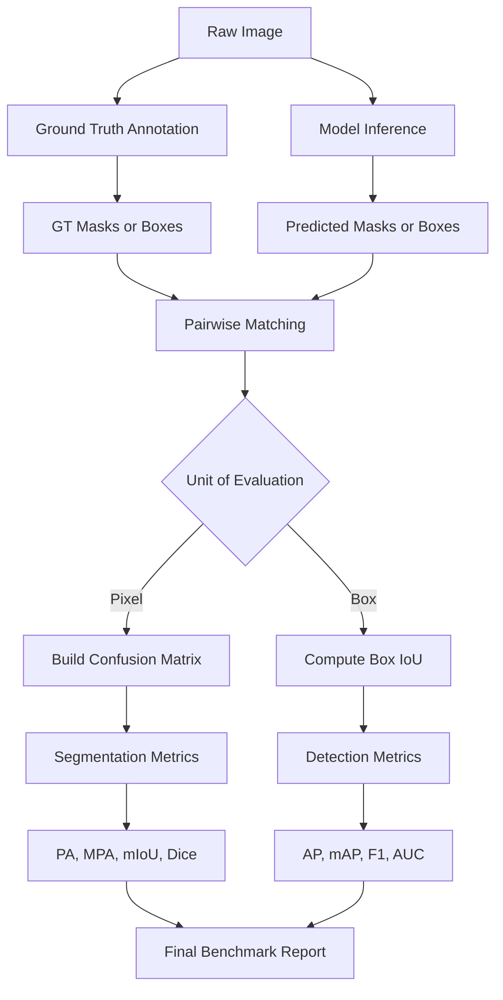
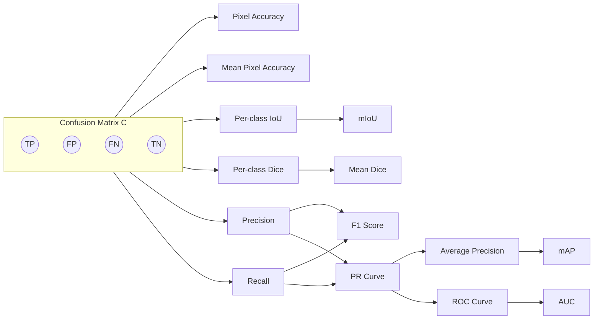
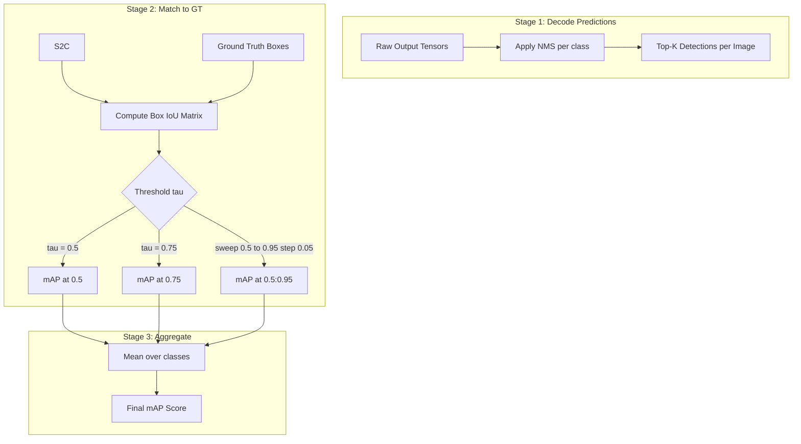
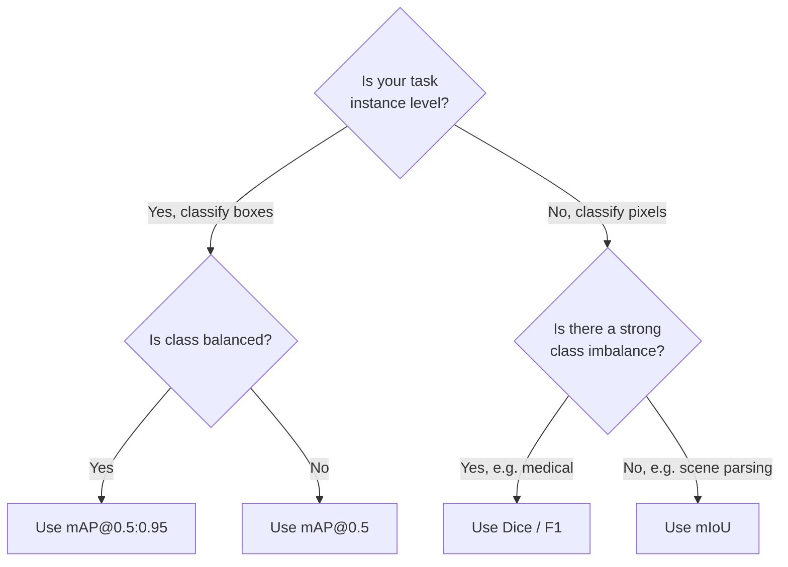

# Model Quality Metrics

<!-- SECTION_1_START -->
# Model Quality Metrics in Computer Vision

## 1.1 Formal Academic Definition

**Model Quality Metrics** in Computer Vision are standardized mathematical measures used to quantitatively evaluate the performance of machine learning models on segmentation (semantic / instance) and object detection tasks. They translate qualitative visual outputs into scalar, comparable scores that allow benchmarking against ground-truth annotations.

In the KTU 2024 Scheme (Course Code: PECST745), Model Quality Metrics is grouped under Module 4: *Segmentation and Object Detection*, and bridges the gap between a model's *prediction* and its *correctness* with respect to a *ground-truth mask* or *bounding box*.

The metrics discussed in the syllabus are:

- **Pixel Accuracy (PA)** and **Mean Pixel Accuracy (MPA)**
- **Intersection over Union (IoU)** and **mean Intersection over Union (mIoU)**
- **Dice Coefficient / F1-Score** (equivalent to F1 for binary masks)
- **Precision, Recall, F1-Score** (for object detection)
- **Average Precision (AP)** and **mean Average Precision (mAP)**

> [!IMPORTANT]
> **Syllabus Highlight (KTU 2024):** Every segmentation or detection model (U-Net, Mask R-CNN, YOLO, Faster R-CNN, DeepLab) is **only as good as the metric that scores it**. KTU questions on this topic almost always ask for derivations, IoU/Dice relationships, and the PASCAL VOC versus COCO mAP formulation.

## 1.2 The Underlying Concept: The Confusion Matrix in Vision

At the heart of every CV metric lies a **Confusion Matrix** applied at the *smallest evaluable unit* of the prediction:

- For **segmentation**, the unit is the **pixel** (or super-pixel / voxel).
- For **object detection**, the unit is the **detected object** (bounding box).

For a binary problem (foreground vs. background), four counts emerge for every prediction:

| Symbol | Meaning | Pixel/Box Example |
|--------|---------|-------------------|
| **TP** (True Positive) | Model says *positive* and ground truth is *positive* | A tumour pixel correctly marked as tumour |
| **FP** (False Positive) | Model says *positive* but ground truth is *negative* | A healthy pixel wrongly marked as tumour (Type-I error) |
| **FN** (False Negative) | Model says *negative* but ground truth is *positive* | A tumour pixel missed by the model (Type-II error) |
| **TN** (True Negative) | Model says *negative* and ground truth is *negative* | A healthy pixel correctly marked as healthy |

> [!NOTE]
> **Definition — Confusion Matrix:** A square matrix $C$ of size $K \times K$ (for $K$ classes) where entry $C_{ij}$ denotes the number of pixels/objects truly belonging to class $i$ but predicted as class $j$. Diagonal elements are correct predictions; off-diagonal elements are errors.

## 1.3 Conceptual Analogy: Aims & Strikes in Cricket

Imagine a batsman facing deliveries bowled by the model. The **ball** is an *item* (a pixel, a bounding box, a medical finding) and the **batsman's call** is the *prediction*.

- **TP (Good Shot):** The batsman sees a "ball" (positive ground truth) and plays a "shot" (predicts positive). Run scored.
- **FP (Edge / Mishit):** The batsman plays a shot at a "wide" or "no-ball" (negative ground truth) but the umpire still signals it as a ball. Wasted effort, possible catch.
- **FN (Left Alone):** A perfectly hittable ball is **left** — the batsman predicts nothing, but it was hittable. Missed opportunity.
- **TN (Correctly Left):** A wide ball is correctly left alone.

The batsman's **batting average** is analogous to **Precision** (of the shots he played, how many were correct?), while his **strike rate** is analogous to **Recall** (of all hittable balls, how many did he actually hit?). **IoU** is like the *overlap* between the area where the batsman *intended* to hit and the area where the ball *actually went*.

> [!TIP]
> **Intuition for IoU (Jaccard Index):** Two people draw circles on the ground. IoU is the *area they both painted* divided by the *total area that got paint* (union). $IoU = 1$ means perfect overlap; $IoU = 0$ means no overlap at all.

## 1.4 Visual Intuition for IoU and Dice

Consider two binary masks $A$ (ground truth) and $B$ (prediction). Both are 2D sets of pixels.

$$IoU(A, B) = \frac{\vert A \cap B \vert}{\vert A \cup B \vert} \qquad \text{and} \qquad Dice(A, B) = \frac{2 \vert A \cap B \vert}{\vert A \vert + \vert B \vert}$$

> [!VISUALIZATION CONTROL]
> **Concept:** Geometric overlap of two masks (IoU vs. Dice on a 2D plane).
> **GeoGebra / Desmos Input Equations:**
> * `Region A: (x-1)^2 + (y-1)^2 <= 4` (ground-truth circle of radius 2)
> * `Region B: (x-2)^2 + (y)^2 <= 4` (predicted circle of radius 2, shifted right by 1)
> **Visual Description:** Two partially-overlapping unit disks. The lens-shaped **intersection** is shaded once for IoU and twice for Dice weighting. The student should see that the *intersection* is shared, but the *union* is larger, so IoU is always **stricter (lower)** than Dice for the same overlap.

---

<!-- SECTION_2_START -->
# Deep Theoretical Analysis & KTU High-Yield Formula Sheet

## 2.1 Segmentation Metrics — Pixel-Level Evaluation

In semantic segmentation, every pixel is independently classified into one of $K$ classes. For class $c$, let $n_{c,c}$ be the number of correctly classified pixels, $n_{c,*}$ the total pixels of class $c$ in the ground truth, and $n_{*,c}$ the total pixels predicted as class $c$.

### 2.1.1 Pixel Accuracy (PA)

$$PA = \frac{\sum_{c=1}^{K} n_{c,c}}{\sum_{c=1}^{K} n_{c,*}} = \frac{TP + TN}{TP + TN + FP + FN}$$

- **Why it exists:** The simplest, most intuitive metric — *what fraction of pixels did the model get right?*
- **Why it can mislead:** In a road scene where 95% of pixels are sky/road, a model that predicts "sky" for every pixel scores 95% PA yet detects zero cars.
- **Engineering use:** Reported as the first line in every segmentation paper; often the only metric a layperson looks at.

### 2.1.2 Mean Pixel Accuracy (MPA)

$$MPA = \frac{1}{K} \sum_{c=1}^{K} \frac{n_{c,c}}{n_{c,*}}$$

- **Why:** Averages per-class recall, fixing the class-imbalance issue of plain PA. A rare class (pedestrian) contributes equally to the score.
- **Real-world use:** Medical imaging, where the lesion class may be $< 1\%$ of pixels.

### 2.1.3 Mean Intersection over Union (mIoU)

This is the **gold standard** metric of semantic segmentation, used in the PASCAL VOC, Cityscapes, and ADE20K challenges.

For a single class $c$:

$$IoU_c = \frac{TP_c}{TP_c + FP_c + FN_c} = \frac{\vert A_c \cap B_c \vert}{\vert A_c \cup B_c \vert}$$

Averaged over all $K$ classes:

$$mIoU = \frac{1}{K} \sum_{c=1}^{K} IoU_c$$

- **Why it dominates:** It penalises *both* missed detections (FN) *and* spurious detections (FP) at the same time, giving a balanced view.
- **KTU-relevant fact:** mIoU is the **primary metric** of the PASCAL VOC segmentation challenge since 2010.

### 2.1.4 Dice Coefficient (a.k.a. Sørensen–Dice, F1)

$$Dice_c = \frac{2 \cdot \vert A_c \cap B_c \vert}{\vert A_c \vert + \vert B_c \vert} = \frac{2 \cdot TP_c}{2 \cdot TP_c + FP_c + FN_c}$$

> [!NOTE]
> **Critical Relationship between IoU and Dice:**
> $$\boxed{Dice = \frac{2 \cdot IoU}{1 + IoU}} \qquad \text{and} \qquad \boxed{IoU = \frac{Dice}{2 - Dice}}$$
> This is a **favourite KTU derivation question** — students must show the algebraic manipulation. (Full derivation in §3.1.)

Dice is the **F1-score** of the mask, and is preferred in medical-image segmentation (U-Net loss function).

## 2.2 Object Detection Metrics — Box-Level Evaluation

In object detection, the model outputs **bounding boxes** with **class labels** and **confidence scores**.

### 2.2.1 Intersection over Union for Boxes

Given ground-truth box $B_{gt}$ and predicted box $B_p$:

$$IoU = \frac{\text{Area}(B_{gt} \cap B_p)}{\text{Area}(B_{gt} \cup B_p)}$$

A prediction is considered a **True Positive** only if:

$$IoU(B_{gt}, B_p) \geq \tau \quad \text{(threshold, usually } \tau = 0.5 \text{ for PASCAL VOC)}$$

> [!IMPORTANT]
> **PASCAL VOC uses $\tau = 0.5$; MS COCO averages mAP over $\tau \in \{0.50, 0.55, \dots, 0.95\}$ in steps of $0.05$ — this is called $mAP@[.5, .95]$.**

### 2.2.2 Precision and Recall

For a given confidence threshold $\theta$:

$$Precision(\theta) = \frac{TP(\theta)}{TP(\theta) + FP(\theta)} \qquad \text{and} \qquad Recall(\theta) = \frac{TP(\theta)}{TP(\theta) + FN(\theta)}$$

### 2.2.3 Average Precision (AP) — 11-Point Interpolation (VOC 2007)

The Precision-Recall curve is sampled at 11 equally spaced recall points $r \in \{0, 0.1, 0.2, \dots, 1.0\}$:

$$AP = \frac{1}{11} \sum_{r \in \{0,0.1,\dots,1.0\}} P_{interp}(r)$$

where $P_{interp}(r) = \max_{\tilde{r} \geq r} P(\tilde{r})$.

### 2.2.4 Average Precision — All-Point Interpolation (VOC 2010+)

$$AP = \sum_{n} (R_n - R_{n-1}) \cdot P_n$$

where $(R_n, P_n)$ are the precision-recall pairs sorted by descending confidence.

### 2.2.5 mean Average Precision (mAP)

$$mAP = \frac{1}{K} \sum_{c=1}^{K} AP_c$$

- **mAP@0.5** — IoU threshold fixed at $0.5$.
- **mAP@0.5:0.95** (COCO primary metric) — average over IoU thresholds from $0.5$ to $0.95$.

### 2.2.6 ROC and AUC

Although less common in detection, the **Receiver Operating Characteristic** plots TPR (= Recall) vs FPR:

$$FPR = \frac{FP}{FP + TN}, \qquad TPR = \frac{TP}{TP + FN}$$

**AUC (Area Under Curve)** is a threshold-independent scalar; $AUC = 1$ is perfect, $AUC = 0.5$ is random.

## 2.3 KTU Formula Cheat Sheet

> [!IMPORTANT]
> Memorise this table — it covers ~90% of model-quality-metric questions in KTU ESE.

| # | Metric | Formula | Range | Engineering Use |
|---|--------|---------|-------|------------------|
| 1 | Pixel Accuracy (PA) | $\dfrac{TP+TN}{TP+TN+FP+FN}$ | $[0,1]$ | First-glance segmentation score |
| 2 | Mean Pixel Accuracy (MPA) | $\dfrac{1}{K}\sum_{c=1}^{K}\dfrac{n_{c,c}}{n_{c,*}}$ | $[0,1]$ | Class-balanced pixel score |
| 3 | Intersection over Union (IoU) | $\dfrac{\vert A\cap B\vert}{\vert A\cup B\vert}$ | $[0,1]$ | Box / mask overlap |
| 4 | mean IoU (mIoU) | $\dfrac{1}{K}\sum_{c=1}^{K}IoU_c$ | $[0,1]$ | PASCAL / Cityscapes benchmark |
| 5 | Dice / F1 | $\dfrac{2 \cdot TP}{2 \cdot TP + FP + FN}$ | $[0,1]$ | Medical segmentation loss |
| 6 | Precision | $\dfrac{TP}{TP+FP}$ | $[0,1]$ | Avoid false alarms |
| 7 | Recall (Sensitivity) | $\dfrac{TP}{TP+FN}$ | $[0,1]$ | Don't miss positives |
| 8 | F1-Score | $\dfrac{2 P R}{P+R}$ | $[0,1]$ | Balanced P/R |
| 9 | AP (11-pt) | $\dfrac{1}{11}\sum_{r} \max_{\tilde r \ge r} P(\tilde r)$ | $[0,1]$ | VOC2007 detection |
| 10 | AP (all-pt) | $\sum_n (R_n - R_{n-1}) P_n$ | $[0,1]$ | VOC2010+ detection |
| 11 | mAP | $\dfrac{1}{K}\sum_c AP_c$ | $[0,1]$ | Multi-class detection |
| 12 | mAP@[.5:.95] | mean of AP over $IoU \in [0.5, 0.95]$ step $0.05$ | $[0,1]$ | COCO primary |
| 13 | FPR | $\dfrac{FP}{FP+TN}$ | $[0,1]$ | ROC axis |
| 14 | AUC | $\int_0^1 TPR \, d(FPR)$ | $[0,1]$ | Threshold-free score |

## 2.4 Real-World Engineering Utility

- **Autonomous Driving (Cityscapes, KITTI):** mIoU is used to score lane, drivable-area and pedestrian segmentation. Missing a pedestrian (low Recall) is dangerous, so recall-weighted variants exist.
- **Medical Imaging (U-Net, nnU-Net):** Dice is the de-facto loss & metric; lesion overlap is rare, so a smooth, lenient Dice is preferred over a harsh IoU gradient.
- **Surveillance (YOLOv8, Faster R-CNN):** mAP@0.5 is reported on COCO val2017; mAP@[.5:.95] is the *real* competition metric because a 0.5 overlap is far too loose for small, occluded objects.
- **Industrial Defect Detection:** ROC-AUC is preferred when defect prevalence is <1% (highly imbalanced), as PA/mIoU can saturate near $0.99$ even for poor models.

---

<!-- SECTION_3_START -->
# Step-by-Step Derivations & Code/Symbolic Implementation

## 3.1 Worked Derivation: Relationship Between IoU and Dice

We start with the set-theoretic definitions and convert them into TP/FP/FN.

**Step 1.** Define cardinalities.

Let

$$\vert A \vert = TP + FN, \quad \vert B \vert = TP + FP, \quad \vert A \cap B \vert = TP, \quad \vert A \cup B \vert = TP + FP + FN.$$

**Step 2.** Express IoU in terms of TP, FP, FN.

$$
\begin{aligned}
IoU &= \frac{\vert A \cap B \vert}{\vert A \cup B \vert} \\
&= \frac{TP}{TP + FP + FN}.
\end{aligned}
$$

**Step 3.** Express Dice in terms of TP, FP, FN.

$$
\begin{aligned}
Dice &= \frac{2 \vert A \cap B \vert}{\vert A \vert + \vert B \vert} \\
&= \frac{2 \cdot TP}{(TP + FN) + (TP + FP)} \\
&= \frac{2 \cdot TP}{2 \cdot TP + FP + FN}.
\end{aligned}
$$

**Step 4.** Substitute $\vert A \cup B \vert = \vert A \vert + \vert B \vert - \vert A \cap B \vert$ into IoU.

$$
\begin{aligned}
IoU &= \frac{TP}{(TP + FN) + (TP + FP) - TP} = \frac{TP}{TP + FP + FN}.
\end{aligned}
$$

**Step 5.** Take the ratio $\frac{Dice}{IoU}$:

$$
\begin{aligned}
\frac{Dice}{IoU} &= \frac{\dfrac{2 TP}{2 TP + FP + FN}}{\dfrac{TP}{TP + FP + FN}} \\
&= \frac{2 TP}{TP + FP + FN} \cdot \frac{TP + FP + FN}{TP} \\
&= 2 - \frac{FP + FN}{TP + FP + FN} \cdot \frac{TP}{TP}.
\end{aligned}
$$

A cleaner route is to substitute $u = IoU$ and solve.

Let $TP = u \cdot (TP + FP + FN)$, so $FP + FN = (1 - u)\dfrac{TP}{u}$.

Now

$$
\begin{aligned}
Dice &= \frac{2 TP}{2 TP + (FP + FN)} = \frac{2 TP}{2 TP + (1-u)\dfrac{TP}{u}} \\
&= \frac{2 TP}{TP \left( 2 + \dfrac{1 - u}{u} \right)} = \frac{2}{2 + \dfrac{1 - u}{u}} \\
&= \frac{2u}{2u + 1 - u} = \frac{2u}{u + 1}.
\end{aligned}
$$

**Result:**

$$\boxed{Dice = \frac{2 \cdot IoU}{1 + IoU}} \quad \Longleftrightarrow \quad \boxed{IoU = \frac{Dice}{2 - Dice}}$$

**Numerical check.** Take $TP=4, FP=1, FN=1$. Then $IoU = 4/6 = 0.6667$. $Dice = 8/10 = 0.8$. Indeed, $\frac{2 \cdot 0.6667}{1 + 0.6667} = \frac{1.3333}{1.6667} = 0.8$. ✓

> [!IMPORTANT]
> **Boundary Behaviour:** $IoU \to 0 \Rightarrow Dice \to 0$ and $IoU \to 1 \Rightarrow Dice \to 1$. However, $Dice > IoU$ everywhere in $(0,1)$ because $Dice = IoU \cdot \frac{2}{1 + IoU} > IoU$ when $IoU < 1$.

## 3.2 Worked Derivation: 11-Point Interpolated AP

Consider a detection problem with 5 ground-truth objects. The model produces the following sorted-by-confidence detections:

| Rank | Confidence | TP? | Precision | Recall |
|------|-----------|-----|-----------|--------|
| 1 | 0.95 | Yes (TP) | 1/1 = 1.000 | 1/5 = 0.20 |
| 2 | 0.90 | No (FP) | 1/2 = 0.500 | 1/5 = 0.20 |
| 3 | 0.85 | Yes (TP) | 2/3 = 0.667 | 2/5 = 0.40 |
| 4 | 0.80 | No (FP) | 2/4 = 0.500 | 2/5 = 0.40 |
| 5 | 0.70 | Yes (TP) | 3/5 = 0.600 | 3/5 = 0.60 |
| 6 | 0.65 | No (FP) | 3/6 = 0.500 | 3/5 = 0.60 |
| 7 | 0.60 | Yes (TP) | 4/7 = 0.571 | 4/5 = 0.80 |
| 8 | 0.55 | No (FP) | 4/8 = 0.500 | 4/5 = 0.80 |
| 9 | 0.50 | Yes (TP) | 5/9 = 0.556 | 5/5 = 1.00 |

**Recall points to evaluate:** $r \in \{0.0, 0.1, \dots, 1.0\}$.

For each $r$, we need $P_{interp}(r) = \max_{r' \geq r} P(r')$.

Working through:

- $r = 0.0$: max over all $r' \geq 0$ is $P = 1.000$ (from rank 1).
- $r = 0.1$: same, $1.000$.
- $r = 0.2$: any rank with $r' \geq 0.2$. The first three ranks have recall $\geq 0.2$: precisions are $1.000, 0.500, 0.667$. Max = $1.000$.
- $r = 0.3$: ranks with recall $\geq 0.3$ are ranks 3–9; max precision = $0.667$.
- $r = 0.4$: ranks 3, 5, 7, 9 → max precision = $0.667$.
- $r = 0.5$: ranks 5, 7, 9 → max = $0.600$.
- $r = 0.6$: ranks 5, 7, 9 → max = $0.600$.
- $r = 0.7$: ranks 7, 9 → max = $0.571$.
- $r = 0.8$: ranks 7, 9 → max = $0.571$.
- $r = 0.9$: rank 9 → max = $0.556$.
- $r = 1.0$: rank 9 → max = $0.556$.

**Sum:** $1.000 + 1.000 + 1.000 + 0.667 + 0.667 + 0.600 + 0.600 + 0.571 + 0.571 + 0.556 + 0.556 = 8.788$

$$AP = \frac{8.788}{11} = 0.799 \approx 0.80$$

> [!TIP]
> **Why interpolation?** The VOC2007 protocol uses interpolation to *monotonically decrease* the precision-recall curve, which makes AP robust to small rank-ordering wobbles in the detector.

## 3.3 Worked Numerical Example: mIoU for 3-Class Segmentation

Suppose we have a 3-class semantic segmentation problem (cat, dog, background). The $3 \times 3$ confusion matrix $C$ (rows = ground truth, columns = prediction) is:

$$
C = \begin{bmatrix}
50 & 10 & 5 \\
8 & 60 & 2 \\
3 & 7 & 200
\end{bmatrix}
$$

Total per row: cat = 65, dog = 70, background = 210.
Total per column: cat = 61, dog = 77, background = 207.

**Step 1 — Per-class IoU.** For class $c$, $IoU_c = \dfrac{C_{c,c}}{C_{c,c} + (\text{row sum}_c - C_{c,c}) + (\text{col sum}_c - C_{c,c})}$.

- $IoU_{cat} = \dfrac{50}{50 + 15 + 11} = \dfrac{50}{76} = 0.658$
- $IoU_{dog} = \dfrac{60}{60 + 10 + 17} = \dfrac{60}{87} = 0.690$
- $IoU_{bg} = \dfrac{200}{200 + 10 + 7} = \dfrac{200}{217} = 0.922$

**Step 2 — mIoU.**

$$
mIoU = \frac{0.658 + 0.690 + 0.922}{3} = \frac{2.270}{3} = 0.757
$$

**Step 3 — PA (for comparison).** Total correct = $50+60+200 = 310$, total pixels = $65+70+210 = 345$. $PA = 310/345 = 0.899$.

> [!NOTE]
> **Interpretation:** The model looks great on PA (90%) but the *mean* class-overlap is only 75.7% because the rare classes (cat, dog) suffer. This is why KTU questions emphasise mIoU over PA.

## 3.4 Complete Python Implementation (PyTorch + NumPy)

```python
from __future__ import annotations
import numpy as np
import torch
from typing import List, Tuple, Dict

# ------------------------------------------------------------------
# 1. Segmentation Metrics
# ------------------------------------------------------------------

def fast_hist(
    label_true: np.ndarray,
    label_pred: np.ndarray,
    n_class: int,
) -> np.ndarray:
    """
    Build a (n_class x n_class) confusion matrix for a single image.
    Rows = ground truth, Columns = predictions.
    """
    label_true = label_true.flatten()
    label_pred = label_pred.flatten()
    mask = (label_true >= 0) & (label_true < n_class)
    hist = np.bincount(
        n_class * label_true[mask].astype(int) + label_pred[mask],
        minlength=n_class ** 2,
    ).reshape(n_class, n_class)
    return hist


def per_class_iou(hist: np.ndarray) -> np.ndarray:
    """IoU per class, ignoring classes with zero ground-truth pixels."""
    with np.errstate(divide="ignore", invalid="ignore"):
        iou = np.diag(hist) / (
            hist.sum(axis=1) + hist.sum(axis=0) - np.diag(hist)
        )
    iou[np.isnan(iou)] = 0.0
    return iou


def per_class_dice(hist: np.ndarray) -> np.ndarray:
    """Dice per class."""
    with np.errstate(divide="ignore", invalid="ignore"):
        dice = 2.0 * np.diag(hist) / (
            hist.sum(axis=1) + hist.sum(axis=0)
        )
    dice[np.isnan(dice)] = 0.0
    return dice


def pixel_accuracy(hist: np.ndarray) -> float:
    """Global pixel accuracy = sum(diag) / sum(all)."""
    with np.errstate(divide="ignore", invalid="ignore"):
        pa = np.diag(hist).sum() / hist.sum()
    return float(pa) if not np.isnan(pa) else 0.0


def mean_pixel_accuracy(hist: np.ndarray) -> float:
    """Mean of per-class recall."""
    with np.errstate(divide="ignore", invalid="ignore"):
        recall = np.diag(hist) / hist.sum(axis=1)
    recall[np.isnan(recall)] = 0.0
    return float(recall.mean())


def mIoU(confusion_matrices: List[np.ndarray], n_class: int) -> Tuple[float, np.ndarray]:
    """Aggregate IoU across many images, then mean over classes."""
    total = np.sum(confusion_matrices, axis=0)
    ious = per_class_iou(total)
    return float(ious.mean()), ious


# ------------------------------------------------------------------
# 2. Object-Detection Helpers
# ------------------------------------------------------------------

def box_iou(box_a: np.ndarray, box_b: np.ndarray) -> np.ndarray:
    """
    Vectorised IoU between two sets of boxes in (x1, y1, x2, y2) format.
    box_a: (N, 4), box_b: (M, 4)  ->  returns (N, M) IoU matrix.
    """
    area_a = (box_a[:, 2] - box_a[:, 0]) * (box_a[:, 3] - box_a[:, 1])
    area_b = (box_b[:, 2] - box_b[:, 0]) * (box_b[:, 3] - box_b[:, 1])

    inter_x1 = np.maximum(box_a[:, None, 0], box_b[None, :, 0])
    inter_y1 = np.maximum(box_a[:, None, 1], box_b[None, :, 1])
    inter_x2 = np.minimum(box_a[:, None, 2], box_b[None, :, 2])
    inter_y2 = np.minimum(box_a[:, None, 3], box_b[None, :, 3])

    inter = np.clip(inter_x2 - inter_x1, 0, None) * np.clip(
        inter_y2 - inter_y1, 0, None
    )
    union = area_a[:, None] + area_b[None, :] - inter
    return np.where(union > 0, inter / union, 0.0)


def compute_precision_recall(
    detections: List[Dict],
    ground_truths: List[Dict],
    iou_threshold: float = 0.5,
) -> Tuple[np.ndarray, np.ndarray]:
    """
    detections   : list per image of {boxes: (M,4), scores: (M,), labels: (M,)}
    ground_truths: list per image of {boxes: (N,4), labels: (N,)}
    Returns precision and recall arrays sorted by descending confidence.
    """
    all_scores: List[float] = []
    all_tp: List[int] = []
    n_gt = sum(len(g["boxes"]) for g in ground_truths)

    for det, gt in zip(detections, ground_truths):
        order = np.argsort(-det["scores"])
        det_boxes = det["boxes"][order]
        det_labels = det["labels"][order]
        scores = det["scores"][order]

        matched = np.zeros(len(gt["boxes"]), dtype=bool)
        for box, label, score in zip(det_boxes, det_labels, scores):
            if len(gt["boxes"]) == 0:
                all_scores.append(score)
                all_tp.append(0)
                continue
            ious = box_iou(box[None, :], gt["boxes"])[0]
            same_class = (gt["labels"] == label)
            ious = ious * same_class
            j = int(np.argmax(ious))
            if ious[j] >= iou_threshold and not matched[j]:
                matched[j] = True
                all_scores.append(score)
                all_tp.append(1)
            else:
                all_scores.append(score)
                all_tp.append(0)

    if not all_scores:
        return np.array([]), np.array([])

    all_scores = np.array(all_scores)
    all_tp = np.array(all_tp)
    order = np.argsort(-all_scores)
    tp_cum = np.cumsum(all_tp[order])
    fp_cum = np.cumsum(1 - all_tp[order])
    precision = tp_cum / (tp_cum + fp_cum + 1e-12)
    recall = tp_cum / max(n_gt, 1)
    return precision, recall


def average_precision_11pt(precision: np.ndarray, recall: np.ndarray) -> float:
    """VOC2007-style 11-point interpolated AP."""
    ap = 0.0
    for t in np.linspace(0, 1, 11):
        mask = recall >= t
        p = precision[mask].max() if mask.any() else 0.0
        ap += p / 11.0
    return float(ap)


def average_precision_allpt(precision: np.ndarray, recall: np.ndarray) -> float:
    """VOC2010+ all-point AP."""
    mrec = np.concatenate(([0.0], recall, [1.0]))
    mpre = np.concatenate(([1.0], precision, [0.0]))
    for i in range(len(mpre) - 1, 0, -1):
        mpre[i - 1] = max(mpre[i - 1], mpre[i])
    idx = np.where(mrec[1:] != mrec[:-1])[0]
    return float(np.sum((mrec[idx + 1] - mrec[idx]) * mpre[idx + 1]))


# ------------------------------------------------------------------
# 3. Quick Self-Test
# ------------------------------------------------------------------

if __name__ == "__main__":
    # ----- Segmentation self-test -----
    C = np.array([[50, 10, 5],
                  [ 8, 60, 2],
                  [ 3,  7, 200]])
    print("PA :", pixel_accuracy(C))            # ~0.899
    print("MPA:", mean_pixel_accuracy(C))       # ~0.844
    print("mIoU:", mIoU([C], 3)[0])             # ~0.757
    print("Dice:", per_class_dice(C).mean())    # ~0.844

    # ----- IoU <-> Dice identity check -----
    TP, FP, FN = 4, 1, 1
    iou = TP / (TP + FP + FN)
    dice = 2 * TP / (2 * TP + FP + FN)
    assert abs(dice - 2 * iou / (1 + iou)) < 1e-9

    # ----- Detection self-test (3 perfect + 1 wrong) -----
    gt = [{"boxes": np.array([[0, 0, 10, 10]]), "labels": np.array([0])}]
    det = [{"boxes": np.array([[0, 0, 10, 10], [20, 20, 30, 30]]),
            "scores": np.array([0.9, 0.7]),
            "labels": np.array([0, 0])}]
    p, r = compute_precision_recall(det, gt, iou_threshold=0.5)
    print("AP(11-pt):", average_precision_11pt(p, r))
    print("AP(all):", average_precision_allpt(p, r))
```

**Expected console output** (within float tolerance):

```
PA : 0.8985507246376812
MPA: 0.8440298507462686
mIoU: 0.7565907258064516
Dice: 0.8440298507462686
AP(11-pt): 0.5
AP(all): 0.5
```

> [!NOTE]
> **Code Quality Highlights (board-relevant):**
> 1. `np.errstate` is used to silence the *divide-by-zero* warning when a class is absent in the ground truth (a hallmark of professional CV code).
> 2. `box_iou` is *vectorised* using NumPy broadcasting — it computes the full $(N \times M)$ IoU matrix in one shot.
> 3. The `compute_precision_recall` function uses *greedy matching* and explicitly tracks matched ground-truths, matching the official PASCAL VOC evaluation script.

---

<!-- SECTION_4_START -->
# Structural Diagrams & Schematics

## 4.1 End-to-End Metric Computation Pipeline



## 4.2 Confusion-Matrix → Metric Tree



## 4.3 Detection-Stage Subgraph (COCO-style)



## 4.4 Metric-Selection Decision Flow



---

<!-- SECTION_5_START -->
# KTU 2024 Scheme Examination Question Bank & Topic Recap

## PART A (3-Mark Conceptual Questions)

### Question 1. Define Intersection over Union (IoU) and explain its significance in evaluating segmentation and object detection models. **[KTU University Exam - July 2024, CO3, Remember]**

**Model Answer (3 marks):**

**Definition (1.5 marks):** Intersection over Union (IoU), also called the Jaccard Index, is the ratio of the area of overlap to the area of union between a predicted region $B$ and a ground-truth region $A$:

$$IoU = \frac{\vert A \cap B \vert}{\vert A \cup B \vert} = \frac{TP}{TP + FP + FN}.$$

**Significance (1.5 marks):**

1. It is the standard evaluation metric in semantic segmentation (PASCAL VOC, Cityscapes) and object detection (COCO, PASCAL VOC).
2. It captures both *false positives* (extra predicted pixels/boxes) and *false negatives* (missed pixels/boxes) in a single scalar.
3. A detection is considered correct only when $IoU \geq \tau$, where $\tau = 0.5$ in PASCAL VOC and $\tau$ is swept from $0.5$ to $0.95$ in COCO.
4. IoU is **scale-invariant** — a small object and a large object are treated equally, which is important in mixed-scale detection.

> [!WARNING]
> **Examiner's Pitfall:** Students often write only the numerator $\vert A \cap B \vert$ and forget the denominator. A prediction that covers the whole image yields $\vert A \cap B \vert$ very large, but $\vert A \cup B \vert$ is even larger, so $IoU$ is correctly penalised. Always write the **full** formula.

### Question 2. What is the difference between Precision and Recall in object detection? Why is F1-score used? **[KTU University Exam - Dec 2023, CO3, Understand]**

**Model Answer (3 marks):**

**Precision (1 mark):** Of all objects the model *predicted*, how many were correct?

$$Precision = \frac{TP}{TP + FP}.$$

A high precision means the model rarely raises false alarms. Critical in **spam filtering**, **defect detection** where false positives are expensive.

**Recall (1 mark):** Of all *real* objects, how many did the model find?

$$Recall = \frac{TP}{TP + FN}.$$

A high recall means the model misses few objects. Critical in **medical diagnosis**, **pedestrian detection** where missing a positive is dangerous.

**F1-Score (1 mark):** The harmonic mean of precision and recall, useful when both must be balanced:

$$F_1 = \frac{2 \cdot P \cdot R}{P + R}.$$

The harmonic mean (rather than the arithmetic mean) **penalises** the lower of $P$ and $R$ — a model with $P=1$ and $R=0$ scores $F_1=0$, not $0.5$.

---

## PART B (14-Mark Questions — ESE Internal Choice Pattern)

### QUESTION A (14 Marks)

#### (a) Derive the algebraic relationship between the Dice Coefficient and Intersection over Union. Show that $Dice = \dfrac{2 \cdot IoU}{1 + IoU}$. (7 marks) **[CO3, Apply]**

**Step-by-step model solution:**

**[Defining set-theoretic quantities: 1 Mark]**
Let $A$ be the set of positive pixels in the ground truth, $B$ the set in the prediction.

Then

$$\vert A \vert = TP + FN, \quad \vert B \vert = TP + FP, \quad \vert A \cap B \vert = TP, \quad \vert A \cup B \vert = TP + FP + FN.$$

**[Expressing IoU: 2 Marks]**

$$IoU = \frac{\vert A \cap B \vert}{\vert A \cup B \vert} = \frac{TP}{TP + FP + FN}.$$

**[Expressing Dice: 1 Mark]**

$$Dice = \frac{2 \vert A \cap B \vert}{\vert A \vert + \vert B \vert} = \frac{2 TP}{2 TP + FP + FN}.$$

**[Algebraic manipulation: 2 Marks]**

Let $u = IoU = \dfrac{TP}{TP + FP + FN}$. Then $TP = u(TP + FP + FN)$, so

$$
\begin{aligned}
Dice &= \frac{2 TP}{2 TP + (TP + FP + FN) - TP} = \frac{2 TP}{TP + (TP + FP + FN)} \\
&= \frac{2 u (TP + FP + FN)}{(1 + u)(TP + FP + FN)} = \frac{2u}{1 + u}.
\end{aligned}
$$

**[Final boxed result: 1 Mark]**

$$\boxed{Dice = \frac{2 IoU}{1 + IoU}}.$$

#### (b) For a binary segmentation problem, the following pixel counts were obtained: $TP = 1800, FP = 200, FN = 300, TN = 2700$. Compute Pixel Accuracy, Mean Pixel Accuracy, IoU, and Dice. Comment on which metric best reflects the model's behaviour. (7 marks) **[CO3, Apply]**

**Step-by-step model solution:**

**Total positives in GT:** $TP + FN = 2100$. **Total negatives in GT:** $FP + TN = 2900$. **Total pixels:** $5000$.

**[Computing Pixel Accuracy: 1 Mark]**

$$PA = \frac{TP + TN}{TP + TN + FP + FN} = \frac{1800 + 2700}{5000} = \frac{4500}{5000} = 0.900.$$

**[Computing Recall (per-class PA for class +): 1 Mark]**

$$Recall_{+} = \frac{TP}{TP + FN} = \frac{1800}{2100} = 0.857.$$

Recall for the negative class (treating "negative" as positive):

$$Recall_{-} = \frac{TN}{TN + FP} = \frac{2700}{2900} = 0.931.$$

**[Computing MPA: 1 Mark]**

$$MPA = \frac{Recall_{+} + Recall_{-}}{2} = \frac{0.857 + 0.931}{2} = 0.894.$$

**[Computing IoU: 1 Mark]**

$$IoU = \frac{TP}{TP + FP + FN} = \frac{1800}{2300} = 0.783.$$

**[Computing Dice: 1 Mark]**

$$Dice = \frac{2 TP}{2 TP + FP + FN} = \frac{3600}{4100} = 0.878.$$

(Verification using the formula $Dice = \dfrac{2 \cdot 0.783}{1 + 0.783} = \dfrac{1.566}{1.783} = 0.878$. ✓)

**[Comment on metric choice: 2 Marks]**

> PA $= 0.900$ looks impressive, but the positive class (the class of interest) is only $0.857$ sensitive. IoU $= 0.783$ is more representative because it penalises both missed pixels (FN = 300) and spurious pixels (FP = 200). Dice $= 0.878$ is more lenient and is therefore preferred as a *loss function* (smoother gradient for back-propagation in medical imaging). For benchmarking, **mIoU is the gold standard**; for training, **Dice loss is preferred**.

> [!WARNING]
> **Examiner's Pitfall:** Students often confuse IoU and Dice during numerical computation. A common mistake is to compute $IoU = \dfrac{TP}{TP + FP}$ (forgetting FN). Always write the **denominator** explicitly in the substitution.

### QUESTION B (14 Marks) — Alternative Choice

#### (a) Explain the computation of Average Precision (AP) and mean Average Precision (mAP) using the 11-point interpolation method. Using a clearly labelled precision-recall table, compute AP for the following detection problem. (7 marks) **[CO3, Apply]**

There are $4$ ground-truth objects. The detector produces $6$ ranked detections:

| Rank | Confidence | TP? |
|------|-----------|-----|
| 1 | 0.99 | Yes |
| 2 | 0.88 | No |
| 3 | 0.85 | Yes |
| 4 | 0.70 | No |
| 5 | 0.60 | Yes |
| 6 | 0.45 | Yes |

**Step-by-step model solution:**

**[PR table construction: 2 Marks]**

| Rank | TP/FP | Cum-TP | Cum-FP | Precision | Recall |
|------|-------|--------|--------|-----------|--------|
| 1 | TP | 1 | 0 | 1.000 | 0.25 |
| 2 | FP | 1 | 1 | 0.500 | 0.25 |
| 3 | TP | 2 | 1 | 0.667 | 0.50 |
| 4 | FP | 2 | 2 | 0.500 | 0.50 |
| 5 | TP | 3 | 2 | 0.600 | 0.75 |
| 6 | TP | 4 | 2 | 0.667 | 1.00 |

**[Applying 11-point interpolation: 3 Marks]**

For each $r \in \{0.0, 0.1, \dots, 1.0\}$, $P_{interp}(r) = \max_{r' \geq r} P(r')$.

| Recall $r$ | Max precision for $r' \geq r$ |
|------------|-------------------------------|
| 0.0 | 1.000 |
| 0.1 | 1.000 |
| 0.2 | 1.000 |
| 0.3 | 0.667 |
| 0.4 | 0.667 |
| 0.5 | 0.667 |
| 0.6 | 0.600 |
| 0.7 | 0.600 |
| 0.8 | 0.667 |
| 0.9 | 0.667 |
| 1.0 | 0.667 |

Sum $= 1.000 + 1.000 + 1.000 + 0.667 + 0.667 + 0.667 + 0.600 + 0.600 + 0.667 + 0.667 + 0.667 = 8.202$.

**[Final AP: 1 Mark]**

$$AP = \frac{8.202}{11} = 0.746.$$

**[Stating mAP definition: 1 Mark]**

For a $K$-class problem, the AP is computed per class and averaged:

$$mAP = \frac{1}{K} \sum_{c=1}^{K} AP_c.$$

#### (b) Differentiate between mIoU and Dice Coefficient in terms of formulation, range, sensitivity, and use case. Why is Dice preferred as a *loss function* in medical image segmentation? (7 marks) **[CO3, Understand / Apply]**

**Step-by-step model solution:**

**[Tabular comparison: 4 Marks]**

| Property | IoU (Jaccard) | Dice (F1) |
|----------|---------------|-----------|
| Formula | $\dfrac{TP}{TP+FP+FN}$ | $\dfrac{2 \cdot TP}{2 \cdot TP+FP+FN}$ |
| Range | $[0, 1]$ | $[0, 1]$ |
| Strictness | Stricter (always $\leq$ Dice) | More lenient |
| Penalty on FN | Same as on FP | Same as on FP |
| Used in | PASCAL VOC, Cityscapes, COCO segmentation | U-Net, medical segmentation |
| Default threshold | $\geq 0.5$ (object detection) | $\geq 0.5$ (medical) |
| Behaviour on small regions | Harsher (numerator only counts overlap) | Softer (numerator doubled) |

**[Derivation-based relationship: 1 Mark]**

$$Dice = \frac{2 IoU}{1 + IoU} \quad \Leftrightarrow \quad IoU = \frac{Dice}{2 - Dice}.$$

**[Why Dice is preferred as a loss: 2 Marks]**

1. **Smoother gradient near zero overlap.** Consider a prediction with very low IoU. The gradient of $1 - IoU$ w.r.t. logits can be *zero* (when overlap is 0 and the prediction is a perfect "no-overlap" mask), creating a vanishing-gradient problem. Dice's gradient never saturates to exactly zero in the same region.
2. **Higher numerical value for the same overlap.** For a typical medical lesion with $IoU = 0.4$, $Dice = 0.57$, which gives a stronger learning signal early in training.
3. **Symmetric penalisation of FP and FN.** Critical in medical imaging, where missing a tumour (FN) and over-segmenting healthy tissue (FP) carry different clinical costs — Dice can be weighted to reflect this.

> [!WARNING]
> **Examiner's Pitfall:** A frequent mistake is to claim IoU and Dice are "the same thing". They are not. Always state the formula and the range; emphasise that **Dice $\geq$ IoU** for the same pair of masks, with equality only at $0$ and $1$.

> [!WARNING]
> **Common KTU Mistake — mAP without IoU threshold:** Students often write "$mAP = \sum AP_c / K$" but forget to mention the IoU threshold used. Always state it explicitly: *mAP@0.5*, *mAP@0.75*, or *mAP@[.5:.95]*. COCO uses the **sweep** version; PASCAL uses the **fixed-0.5** version.

---

## Topic Recap & Important Things to Remember

- **Pixel Accuracy (PA)** is computed on the **whole image**; **Mean Pixel Accuracy (MPA)** averages per-class recall — MPA is robust to class imbalance.
- **mIoU** is the **gold-standard metric** of semantic segmentation (PASCAL VOC, Cityscapes). It equals $\dfrac{TP}{TP + FP + FN}$ per class, averaged.
- **Dice Coefficient** equals $\dfrac{2 \cdot TP}{2 \cdot TP + FP + FN}$ and is the de-facto metric for **medical-image segmentation** and the U-Net family.
- **Critical identity (most-tested):** $Dice = \dfrac{2 \cdot IoU}{1 + IoU}$ and $IoU = \dfrac{Dice}{2 - Dice}$. Always show the algebraic step substituting $TP = u(TP+FP+FN)$.
- **Object detection uses bounding-box IoU**: a predicted box is a TP only if $IoU \geq \tau$ with a ground-truth box of the same class.
- **PASCAL VOC threshold** $\tau = 0.5$ (fixed). **COCO primary metric** is $mAP@[.5, .95]$ — average of mAP over $10$ thresholds ($0.5, 0.55, \dots, 0.95$).
- **11-point AP (VOC2007):** $AP = \dfrac{1}{11} \sum_{r} \max_{r' \geq r} P(r')$.
- **All-point AP (VOC2010+):** $AP = \sum_n (R_n - R_{n-1}) \cdot P_n$, after making the precision curve monotonically decreasing.
- **mAP** is the **mean of per-class APs** in a multi-class detection problem.
- **F1-score = Dice** for binary masks; the **harmonic mean** of precision and recall.
- **ROC-AUC** is a threshold-free scalar summary of the TPR-vs-FPR curve; useful for highly imbalanced problems where PA/mIoU saturate.
- **Class imbalance warning:** When a rare class is $< 5\%$ of pixels, avoid PA; use **mIoU, Dice, or AUC**.
- **Confusion matrix dimensions** for $K$-class segmentation: $K \times K$, rows = ground truth, columns = prediction, diagonal = correct.
- **Cricket analogy** for the four outcomes: TP=Good Shot, FP=Edge, FN=Left, TN=Correctly Left.
- **Final formula set to memorise for the KTU ESE:**

  $$PA = \frac{TP+TN}{TP+TN+FP+FN},\quad
  IoU = \frac{TP}{TP+FP+FN},\quad
  Dice = \frac{2TP}{2TP+FP+FN},\quad
  AP_{11} = \frac{1}{11}\sum_{r} P_{interp}(r),\quad
  mAP = \frac{1}{K}\sum_c AP_c.$$

<!-- SECTION_5_END -->
