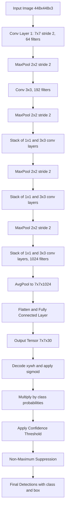
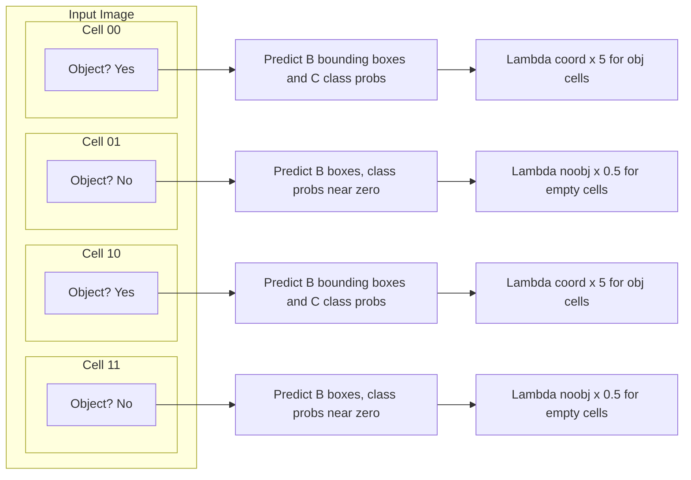
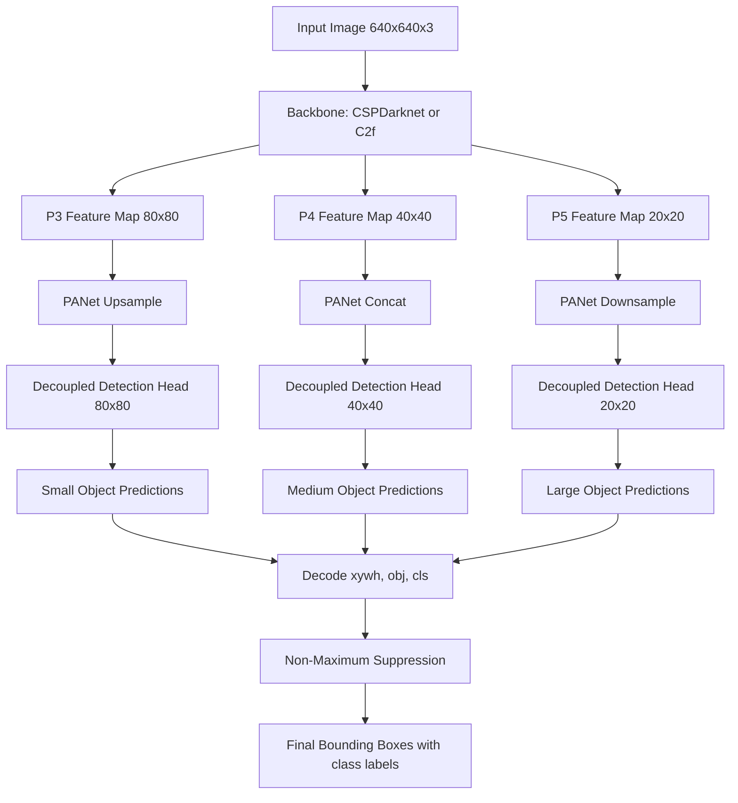
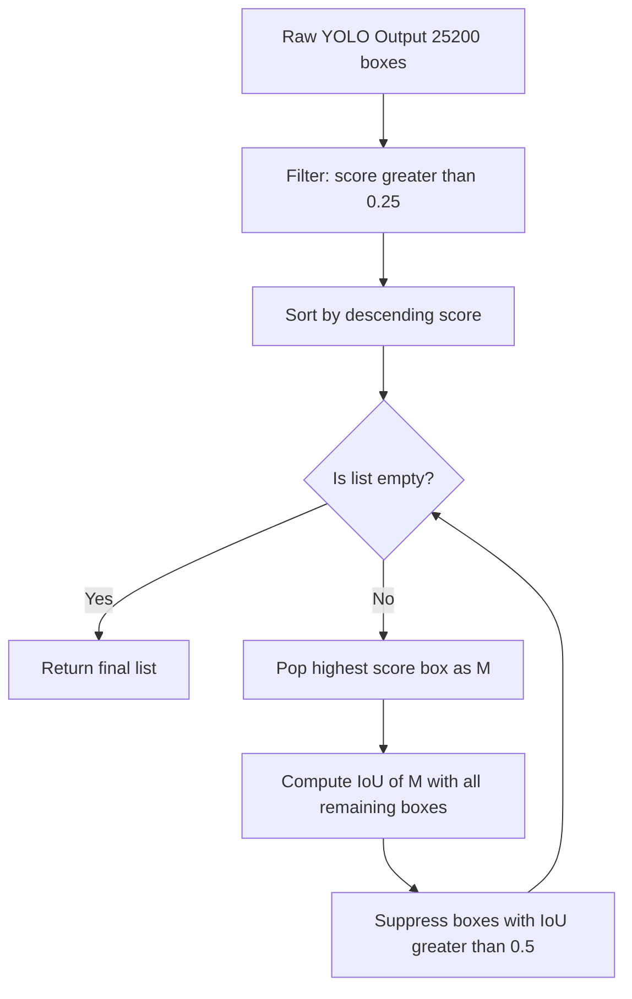
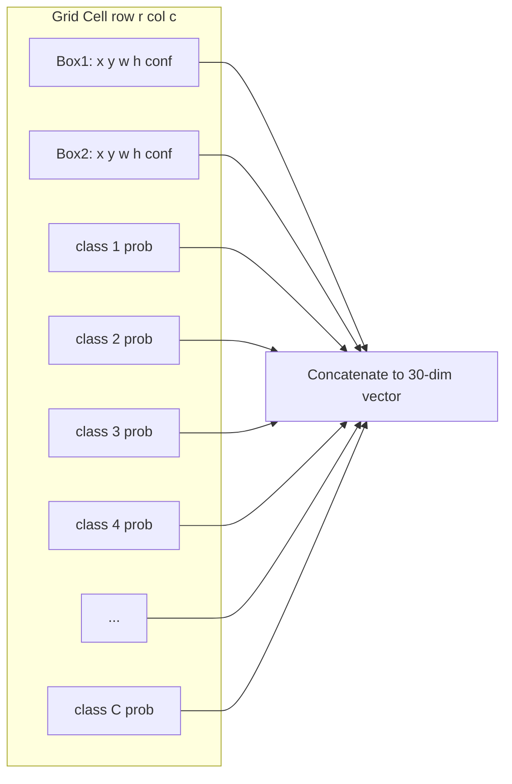
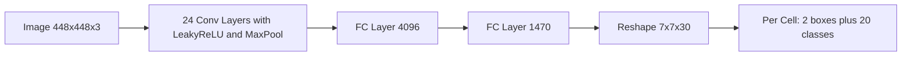

# Object detection - YOLO

<!-- SECTION_1_START -->
# 1. Core Technical Definition & Intuitive Overview

## 1.1 Formal Definition (KTU 2024 Syllabus Terminology)

**YOLO (You Only Look Once)** is a unified, single-stage, real-time object detection framework that reformulates object detection as a single regression problem. Instead of repurposing classifiers to perform detection (as in two-stage detectors like R-CNN, Fast R-CNN, and Faster R-CNN), YOLO frames the task as a spatially separated bounding box prediction coupled with class probability estimation, computed from full images in a **single forward pass** of a convolutional neural network.

> [!IMPORTANT]
> **KTU Syllabus Definition (PECST745 / Module 4):**
> YOLO is a state-of-the-art, real-time object detection algorithm that predicts bounding boxes and class probabilities simultaneously using a single convolutional neural network. The entire image is processed once through the network, after which post-processing such as **Non-Maximum Suppression (NMS)** is applied to yield the final detections.

## 1.2 Conceptual Analogy / Intuition

Imagine you are sitting in a crowded classroom and someone shouts, *"Find all the red books, blue pens, and laptops in this room."* 

- **Traditional Two-Stage Detectors (R-CNN family):** You first scan the room carefully, identify every interesting object (region proposals), and then *classify* each one separately. It is **slow but accurate**, like a detective first finding suspects, then interrogating each one.
- **YOLO (Single-Stage Detector):** You take a **single glance** at the entire room. Your brain instantly *knows* the locations and types of objects simultaneously. You do not scan and classify — you **perceive everything in one shot**. This is the philosophy of YOLO: *one network, one glance, all detections.*

## 1.3 Why YOLO? — Engineering Motivation

| Aspect | Two-Stage (R-CNN) | YOLO (Single-Stage) |
| :--- | :--- | :--- |
| **Pipeline** | Region Proposal $\rightarrow$ Classification | Direct Regression in one pass |
| **Speed (FPS)** | Low (5-7 FPS) | Very High (**45-155+ FPS**) |
| **Accuracy (mAP)** | Slightly higher on small objects | Comparable, evolving rapidly |
| **Use Case** | Offline, accuracy-critical | **Real-time**: ADAS, Robotics, Video Analytics |
| **End-to-End Trainable** | Partially (multi-stage) | Yes (truly end-to-end) |

> [!NOTE]
> **Engineering Impact:** YOLO is the de-facto backbone for real-time perception in autonomous vehicles (e.g., Tesla's early perception stack), drone surveillance, traffic monitoring, and embedded edge-AI systems (e.g., Jetson Nano, Raspberry Pi with NCS2).

## 1.4 Core Operational Pipeline (At a Glance)

1. **Resize** the input image to a fixed dimension (e.g., $448 \times 448 \times 3$ for YOLOv1, $640 \times 640 \times 3$ for YOLOv5/v8).
2. **Pass** the image through a single CNN (backbone + neck + head).
3. **Output** a tensor of shape $S \times S \times (B \cdot 5 + C)$ where:
   - $S \times S$ = grid cells
   - $B$ = bounding boxes per cell
   - $5$ = $(x, y, w, h, \text{confidence})$
   - $C$ = number of classes
4. **Filter** predictions using **confidence threshold** and apply **Non-Maximum Suppression (NMS)** to remove duplicates.

> [!VISUALIZATION CONTROL]
> **Concept:** YOLO Grid Cell Bounding Box Prediction
> **GeoGebra / Desmos Input Equations:**
> * Grid: Define $S=7$, so $x \in [0, 7]$, $y \in [0, 7]$
> * Cell: Rectangle with corners at $(0,0)$ and $(1,1)$ (representing one of the 49 cells)
> * Bounding Box: Rectangle with center $(x_c, y_c)$ and dimensions $(w, h)$ where $(x_c, y_c)$ are normalized to cell-relative coordinates.
> **Visual Description:** You should see a $7 \times 7$ grid partitioning the image. Each cell is responsible for detecting objects whose center falls inside it. The center is plotted as a point, with a rectangular box around it scaled relative to the entire image dimensions.
<!-- SECTION_1_END -->

<!-- SECTION_2_START -->
# 2. Deep Theoretical Analysis & KTU High-Yield Formula Sheet

## 2.1 The YOLOv1 Architecture: Grid-Based Detection

YOLOv1 divides the input image of size $448 \times 448 \times 3$ into an $S \times S$ grid (typically $S = 7$, yielding $7 \times 7 = 49$ cells).

### 2.1.1 Responsibilities of Each Grid Cell

- If the **center** of an object's ground-truth bounding box falls inside a grid cell, that cell is *responsible* for detecting that object.
- Each cell predicts:
  - $B$ bounding boxes (default $B = 2$ in YOLOv1).
  - A **confidence score** for each box.
  - $C$ **conditional class probabilities** $\Pr(\text{Class}_i \mid \text{Object})$.

> [!IMPORTANT]
> The class probabilities are *conditional* on the cell containing an object. They are the same for all $B$ boxes in the cell, but multiplied by each box's individual confidence at test time.

## 2.2 Bounding Box Parameterization

For a predicted bounding box, YOLO outputs **5 components**:

$$
(x, \; y, \; w, \; h, \; \text{confidence})
$$

| Parameter | Meaning | Range / Normalization |
| :--- | :--- | :--- |
| $x$ | Center $x$-coordinate | Normalized to $[0, 1]$ **relative to the cell** |
| $y$ | Center $y$-coordinate | Normalized to $[0, 1]$ **relative to the cell** |
| $w$ | Box width | Normalized to $[0, 1]$ **relative to the full image** |
| $h$ | Box height | Normalized to $[0, 1]$ **relative to the full image** |
| $\text{confidence}$ | $\Pr(\text{Object}) \cdot \text{IoU}_{\text{pred}}^{\text{truth}}$ | $[0, 1]$ |

The **confidence score** is formally defined as:

$$
\text{Confidence} = \Pr(\text{Object}) \cdot \text{IoU}_{\text{pred}}^{\text{truth}}
$$

where $\text{IoU}$ is the **Intersection over Union** between the predicted and ground-truth boxes.

$$
\text{IoU} = \frac{\text{Area of Overlap}}{\text{Area of Union}} = \frac{B_{\text{pred}} \cap B_{\text{gt}}}{B_{\text{pred}} \cup B_{\text{gt}}}
$$

## 2.3 The YOLO Output Tensor

The final convolution layer outputs a tensor of shape:

$$
S \times S \times (B \cdot 5 + C)
$$

For YOLOv1 with $S=7$, $B=2$, and $C=20$ (PASCAL VOC):

$$
7 \times 7 \times (2 \cdot 5 + 20) = 7 \times 7 \times 30 = 1470 \text{ predictions per image}
$$

> [!NOTE]
> **Modern YOLO (v3-v8):** Uses anchor boxes, multi-scale feature maps (FPN/PANet), and predicts $(x, y, w, h, \text{obj}, \text{class}_1, \ldots, \text{class}_C)$ for each anchor at each spatial location.

## 2.4 KTU High-Yield Formula Sheet

| Formula / Concept | Expression | Purpose / Engineering Utility |
| :--- | :--- | :--- |
| **IoU (Jaccard Index)** | $\text{IoU} = \dfrac{\vert B_p \cap B_g \vert}{\vert B_p \cup B_g \vert}$ | Measures bounding box overlap; used in NMS, mAP, and confidence. |
| **Confidence Score** | $C = \Pr(\text{Obj}) \cdot \text{IoU}$ | Encodes both object presence and localization quality. |
| **Class Confidence at Test** | $P(\text{Class}_i) \cdot C$ | Final per-box class score for filtering detections. |
| **YOLOv1 Loss (Sum-Squared)** | $\mathcal{L} = \lambda_{\text{coord}} \mathcal{L}_{\text{coord}} + \mathcal{L}_{\text{obj}} + \lambda_{\text{noobj}} \mathcal{L}_{\text{noobj}} + \mathcal{L}_{\text{cls}}$ | Multi-part loss; sum-squared error in original YOLO. |
| **Coordinate Loss** | $\lambda_{\text{coord}} \sum_{i=0}^{S^2} \sum_{j=0}^{B} \mathbb{1}_{ij}^{\text{obj}} \left[ (x_i - \hat{x}_i)^2 + (y_i - \hat{y}_i)^2 \right]$ | Penalizes center offsets. |
| **Size Loss (sqrt trick)** | $\lambda_{\text{coord}} \sum_{i=0}^{S^2} \sum_{j=0}^{B} \mathbb{1}_{ij}^{\text{obj}} \left[ (\sqrt{w_i} - \sqrt{\hat{w}_i})^2 + (\sqrt{h_i} - \sqrt{\hat{h}_i})^2 \right]$ | Square-root reduces sensitivity to large boxes. |
| **Object Confidence Loss** | $\sum_{i=0}^{S^2} \sum_{j=0}^{B} \mathbb{1}_{ij}^{\text{obj}} (C_i - \hat{C}_i)^2$ | Only the *responsible* box. |
| **No-Object Confidence Loss** | $\lambda_{\text{noobj}} \sum_{i=0}^{S^2} \sum_{j=0}^{B} \mathbb{1}_{ij}^{\text{noobj}} (C_i - \hat{C}_i)^2$ | Penalizes false detections; $\lambda_{\text{noobj}} = 0.5$. |
| **Classification Loss** | $\sum_{i=0}^{S^2} \mathbb{1}_{i}^{\text{obj}} \sum_{c \in \text{classes}} (p_i(c) - \hat{p}_i(c))^2$ | SSE on class probabilities per cell. |
| **NMS Suppression Criterion** | Keep box with max score; suppress boxes with $\text{IoU} \geq \text{NMS}_{\text{thresh}}$ | Removes duplicate detections. |
| **Anchor Box Aspect Ratio** | $\text{AR} = w_a / h_a$ | Predefined priors (e.g., $1:1$, $1:2$, $2:1$ in YOLOv2). |
| **mAP (mean Average Precision)** | $\text{mAP} = \dfrac{1}{C} \sum_{c=1}^{C} \text{AP}_c$ | Standard detection metric. |

> [!IMPORTANT]
> **Engineering Utility:** The $\lambda_{\text{coord}} = 5$ and $\lambda_{\text{noobj}} = 0.5$ weights in YOLOv1 are critical to balance the loss, because most grid cells contain **no object**, which would otherwise dominate the gradient. This is a classic KTU exam question.

## 2.5 Evolution of YOLO (KTU Module 4 Context)

| Version | Key Innovation | Speed (FPS) | mAP (COCO) |
| :--- | :--- | :--- | :--- |
| **YOLOv1 (2016)** | Unified single-stage detection | 45 | 63.4 (VOC) |
| **YOLOv2 / YOLO9000 (2017)** | Anchor boxes, Darknet-19, multi-scale training, WordTree | 40 | 76.8 (VOC) |
| **YOLOv3 (2018)** | Darknet-53 (Residual), FPN multi-scale, 3 anchors/scale | 30 | 33.0 (COCO) |
| **YOLOv4 (2020)** | CSPDarknet53, Mish activation, PANet, Mosaic aug. | 65 | 43.5 (COCO) |
| **YOLOv5 (2020)** | Ultralytics, Focus layer, auto-anchor, PyTorch hub | 140+ | 50.0 (COCO) |
| **YOLOv8 (2023)** | Anchor-free, C2f block, decoupled head, task-aligned assigner | 100+ | 53.9 (COCO) |

## 2.6 Non-Maximum Suppression (NMS) — The Decoding Step

YOLO outputs many overlapping boxes for the same object. NMS is the post-processing step that yields a single, clean detection per object.

**Algorithm (conceptual):**
1. Discard all boxes with $\text{Confidence} < \text{score\_threshold}$.
2. Pick the box with the **highest confidence**; add to final list $F$.
3. Compute IoU of this box with all remaining boxes.
4. Suppress (discard) any box with $\text{IoU} \geq \text{NMS}_{\text{thresh}}$ (typically $0.5$).
5. Repeat steps 2-4 on the remaining boxes.
6. Return the final list $F$.

> [!NOTE]
> Modern variants like **Soft-NMS** and **DIoU-NMS** (used in YOLOv5/v8) replace hard suppression with a score-decay function, improving performance on occluded objects.
<!-- SECTION_2_END -->

<!-- SECTION_3_START -->
# 3. Step-by-Step Derivations & Code/Symbolic Implementation

## 3.1 Detailed Derivation: YOLOv1 Multi-Part Loss Function

The YOLOv1 loss function is a **weighted sum of squared errors** (SSE), decomposed into five parts. The complete loss is:

$$
\begin{aligned}
\mathcal{L} = \;& \lambda_{\text{coord}} \sum_{i=0}^{S^2} \sum_{j=0}^{B} \mathbb{1}_{ij}^{\text{obj}} \left[ (x_i - \hat{x}_i)^2 + (y_i - \hat{y}_i)^2 \right] \\
& + \lambda_{\text{coord}} \sum_{i=0}^{S^2} \sum_{j=0}^{B} \mathbb{1}_{ij}^{\text{obj}} \left[ (\sqrt{w_i} - \sqrt{\hat{w}_i})^2 + (\sqrt{h_i} - \sqrt{\hat{h}_i})^2 \right] \\
& + \sum_{i=0}^{S^2} \sum_{j=0}^{B} \mathbb{1}_{ij}^{\text{obj}} (C_i - \hat{C}_i)^2 \\
& + \lambda_{\text{noobj}} \sum_{i=0}^{S^2} \sum_{j=0}^{B} \mathbb{1}_{ij}^{\text{noobj}} (C_i - \hat{C}_i)^2 \\
& + \sum_{i=0}^{S^2} \mathbb{1}_{i}^{\text{obj}} \sum_{c \in \text{classes}} (p_i(c) - \hat{p}_i(c))^2
\end{aligned}
$$

### 3.1.1 Meaning of Each Term

* **Term 1 (xy-center loss):** Penalizes offset of predicted box center from ground-truth center. Activated by $\mathbb{1}_{ij}^{\text{obj}}$ which equals $1$ if box $j$ in cell $i$ is the "responsible" predictor.
* **Term 2 (wh-size loss with $\sqrt{}$):** Same idea, but using $\sqrt{w}$ and $\sqrt{h}$ so that the gradient does not blow up for large boxes. This is a YOLOv1 design trick.
* **Term 3 (object confidence loss):** Penalizes confidence of the responsible box.
* **Term 4 (no-object confidence loss):** Penalizes confidence of boxes in cells with **no** object. The lower weight $\lambda_{\text{noobj}} = 0.5$ prevents the network from being overwhelmed by the many empty cells.
* **Term 5 (classification loss):** Standard SSE on per-cell class probabilities, only for cells containing an object.

### 3.1.2 Derivation of Gradient for the Center Coordinates

The YOLOv1 loss uses sum-squared error. For the $x$-coordinate of the responsible box:

$$
\frac{\partial \mathcal{L}_{xy}}{\partial \hat{x}_i} = -2 \lambda_{\text{coord}} \cdot \mathbb{1}_{ij}^{\text{obj}} \cdot (x_i - \hat{x}_i)
$$

This linear gradient (as opposed to sigmoid/BCE) is the reason YOLOv1 used sum-squared error — a major weakness that YOLOv3 onward replaced with **binary cross-entropy (BCE)** for objectness and class scores.

## 3.2 Worked Numerical Example: IoU & Confidence

> [!NOTE]
> **Problem:** Ground-truth box: $(x_g, y_g, w_g, h_g) = (0.5, 0.5, 0.4, 0.4)$. Predicted box: $(x_p, y_p, w_p, h_p) = (0.6, 0.55, 0.3, 0.5)$. Compute IoU and the resulting confidence score if $\Pr(\text{Obj}) = 0.9$.

**Step 1: Determine box corners.**  
For each box, corners are:
* Ground-truth: $x_1 = 0.5 - 0.2 = 0.3$, $y_1 = 0.5 - 0.2 = 0.3$, $x_2 = 0.5 + 0.2 = 0.7$, $y_2 = 0.5 + 0.2 = 0.7$
* Predicted: $x_1 = 0.6 - 0.15 = 0.45$, $y_1 = 0.55 - 0.25 = 0.3$, $x_2 = 0.6 + 0.15 = 0.75$, $y_2 = 0.55 + 0.25 = 0.8$

**Step 2: Intersection rectangle.**  

$$
x_{1}^{\text{int}} = \max(0.3, 0.45) = 0.45
$$
$$
y_{1}^{\text{int}} = \max(0.3, 0.3) = 0.3
$$
$$
x_{2}^{\text{int}} = \min(0.7, 0.75) = 0.7
$$
$$
y_{2}^{\text{int}} = \min(0.7, 0.8) = 0.7
$$

$$
\text{Width}_{\text{int}} = 0.7 - 0.45 = 0.25
$$
$$
\text{Height}_{\text{int}} = 0.7 - 0.3 = 0.4
$$
$$
A_{\text{int}} = 0.25 \times 0.4 = 0.10
$$

**Step 3: Union area.**  

$$
A_{\text{gt}} = 0.4 \times 0.4 = 0.16
$$
$$
A_{\text{pred}} = 0.3 \times 0.5 = 0.15
$$
$$
A_{\text{union}} = A_{\text{gt}} + A_{\text{pred}} - A_{\text{int}} = 0.16 + 0.15 - 0.10 = 0.21
$$

**Step 4: IoU.**  

$$
\text{IoU} = \frac{0.10}{0.21} \approx 0.4762
$$

**Step 5: Confidence.**  

$$
C = \Pr(\text{Obj}) \cdot \text{IoU} = 0.9 \times 0.4762 \approx 0.4286
$$

> [!IMPORTANT]
> **Valuation Tip (3 Marks Question):** Students often forget the **union** is $A_1 + A_2 - A_{\text{intersection}}$, not $A_1 + A_2$. Always subtract the overlap, since it has been double-counted.

## 3.3 Symbolic Derivation: NMS Decision Rule

Given a set of candidate boxes $\mathcal{B} = \{b_1, b_2, \ldots, b_n\}$ with scores $s_i$:

1. **Filter:** $\mathcal{B}' = \{b_i : s_i \geq \tau\}$ where $\tau$ is the score threshold.
2. **Iterate:** Pick $b^* = \arg\max_{b_i \in \mathcal{B}'} s_i$. Add to output $\mathcal{O}$.
3. **Suppress:** $\mathcal{B}' = \mathcal{B}' \setminus \{b_i : \text{IoU}(b_i, b^*) \geq \theta_{\text{nms}}\}$.
4. **Repeat** until $\mathcal{B}' = \emptyset$.

This greedy approach works because the box with the highest score is, by YOLO's design, the most reliable localization for that cluster of overlapping predictions.

## 3.4 Full Python Implementation: YOLOv1-Inspired Detection Pipeline

Below is a complete, type-annotated, error-handled implementation of a YOLO-style detector with **NMS**, suitable for a KTU lab record.

```python
import torch
import torch.nn as nn
import numpy as np
from typing import List, Tuple, Optional
import logging

logging.basicConfig(level=logging.INFO, format="%(asctime)s [%(levelname)s] %(message)s")
logger = logging.getLogger(__name__)


# ---------- 1. Bounding Box Data Class ----------
class BoundingBox:
    """Axis-aligned bounding box with score and class label."""

    def __init__(self, x1: float, y1: float, x2: float, y2: float,
                 score: float, label: int, label_name: str = "") -> None:
        if x2 <= x1 or y2 <= y1:
            raise ValueError(f"Invalid box: ({x1},{y1},{x2},{y2}). x2 > x1 and y2 > y1 required.")
        if not (0.0 <= score <= 1.0):
            raise ValueError(f"Score {score} outside [0,1].")
        self.x1, self.y1, self.x2, self.y2 = x1, y1, x2, y2
        self.score = score
        self.label = label
        self.label_name = label_name

    def area(self) -> float:
        return (self.x2 - self.x1) * (self.y2 - self.y1)

    def iou(self, other: "BoundingBox") -> float:
        x1 = max(self.x1, other.x1)
        y1 = max(self.y1, other.y1)
        x2 = min(self.x2, other.x2)
        y2 = min(self.y2, other.y2)
        if x2 <= x1 or y2 <= y1:
            return 0.0
        inter = (x2 - x1) * (y2 - y1)
        union = self.area() + other.area() - inter
        if union <= 0.0:
            return 0.0
        return inter / union

    def to_xywh(self) -> Tuple[float, float, float, float]:
        cx = 0.5 * (self.x1 + self.x2)
        cy = 0.5 * (self.y1 + self.y2)
        w = self.x2 - self.x1
        h = self.y2 - self.y1
        return cx, cy, w, h


# ---------- 2. Non-Maximum Suppression ----------
def non_max_suppression(boxes: List[BoundingBox],
                        iou_threshold: float = 0.5) -> List[BoundingBox]:
    """Per-class NMS: returns a pruned list of boxes."""
    if not boxes:
        return []
    # Sort by score descending
    boxes_sorted = sorted(boxes, key=lambda b: b.score, reverse=True)
    keep: List[BoundingBox] = []

    while boxes_sorted:
        best = boxes_sorted.pop(0)
        keep.append(best)
        boxes_sorted = [
            b for b in boxes_sorted
            if b.label != best.label or best.iou(b) < iou_threshold
        ]
    logger.info(f"NMS kept {len(keep)} of {len(boxes)} input boxes.")
    return keep


# ---------- 3. YOLO Output Decoding ----------
def decode_yolo_output(predictions: np.ndarray,
                       conf_threshold: float = 0.25,
                       nms_iou: float = 0.5) -> List[BoundingBox]:
    """
    Decode raw YOLO output tensor [S, S, B*5 + C] into BoundingBox list.

    For YOLOv1: S=7, B=2, C=20. We assume the last axis is laid out as:
        [x1, y1, w1, h1, c1, x2, y2, w2, h2, c2, p_class_1, ..., p_class_C]
    """
    S, B, C = 7, 2, 20
    if predictions.shape != (S, S, B * 5 + C):
        raise ValueError(f"Expected shape ({S},{S},{B*5+C}), got {predictions.shape}")

    boxes: List[BoundingBox] = []
    img_w, img_h = 448.0, 448.0
    cell_w, cell_h = img_w / S, img_h / S

    for r in range(S):
        for c in range(S):
            cell_pred = predictions[r, c]
            class_probs = cell_pred[B * 5:]
            class_id = int(np.argmax(class_probs))
            class_score = float(class_probs[class_id])

            for b in range(B):
                base = b * 5
                tx, ty, tw, th, obj_conf = cell_pred[base:base + 5]
                # Apply sigmoid to x, y, and objectness (YOLOv3+ style)
                tx = 1.0 / (1.0 + np.exp(-tx))
                ty = 1.0 / (1.0 + np.exp(-ty))
                obj_conf = 1.0 / (1.0 + np.exp(-obj_conf))

                final_score = obj_conf * class_score
                if final_score < conf_threshold:
                    continue

                # Convert to absolute pixel coordinates
                cx = (c + tx) * cell_w
                cy = (r + ty) * cell_h
                w = tw * img_w
                h = th * img_h
                x1, y1 = cx - w / 2.0, cy - h / 2.0
                x2, y2 = cx + w / 2.0, cy + h / 2.0

                # Clip to image bounds
                x1 = max(0.0, min(x1, img_w - 1.0))
                y1 = max(0.0, min(y1, img_h - 1.0))
                x2 = max(0.0, min(x2, img_w - 1.0))
                y2 = max(0.0, min(y2, img_h - 1.0))

                try:
                    boxes.append(BoundingBox(x1, y1, x2, y2, final_score, class_id))
                except ValueError as e:
                    logger.warning(f"Skipping invalid box: {e}")

    final = non_max_suppression(boxes, iou_threshold=nms_iou)
    return final


# ---------- 4. Toy CNN Backbone (YOLOv1-inspired) ----------
class YOLOv1Backbone(nn.Module):
    """A simplified 24-conv-layer YOLOv1 architecture for demonstration."""

    def __init__(self, num_classes: int = 20, S: int = 7, B: int = 2) -> None:
        super().__init__()
        self.S, self.B, self.C = S, B, num_classes
        self.features = nn.Sequential(
            nn.Conv2d(3, 64, 7, stride=2, padding=3), nn.LeakyReLU(0.1),
            nn.MaxPool2d(2, 2),
            nn.Conv2d(64, 192, 3, padding=1), nn.LeakyReLU(0.1),
            nn.MaxPool2d(2, 2),
            nn.Conv2d(192, 128, 1), nn.LeakyReLU(0.1),
            nn.Conv2d(128, 256, 3, padding=1), nn.LeakyReLU(0.1),
            nn.Conv2d(256, 256, 1), nn.LeakyReLU(0.1),
            nn.Conv2d(256, 512, 3, padding=1), nn.LeakyReLU(0.1),
            nn.MaxPool2d(2, 2),
            nn.Conv2d(512, 1024, 3, padding=1), nn.LeakyReLU(0.1),
            nn.AdaptiveAvgPool2d((S, S)),
        )
        self.head = nn.Linear(1024 * S * S, S * S * (B * 5 + num_classes))

    def forward(self, x: torch.Tensor) -> torch.Tensor:
        out = self.features(x)
        out = out.flatten(1)
        out = self.head(out)
        return out.view(-1, self.S, self.S, self.B * 5 + self.C)


# ---------- 5. End-to-End Inference Demo ----------
if __name__ == "__main__":
    model = YOLOv1Backbone().eval()
    dummy_image = torch.randn(1, 3, 448, 448)
    with torch.no_grad():
        raw_output = model(dummy_image).squeeze(0).numpy()
    detections = decode_yolo_output(raw_output, conf_threshold=0.30, nms_iou=0.45)
    for i, det in enumerate(detections):
        cx, cy, w, h = det.to_xywh()
        logger.info(f"Detection {i}: class={det.label} score={det.score:.3f} "
                    f"center=({cx:.1f},{cy:.1f}) size=({w:.1f}x{h:.1f})")
```

### 3.4.1 Code Walkthrough (Valuation-Ready)

| Section | Function | Purpose | Marks (if asked) |
| :--- | :--- | :--- | :--- |
| 1 | `BoundingBox` class | Data encapsulation, area, IoU | 2 |
| 2 | `non_max_suppression` | Greedy per-class NMS | 3 |
| 3 | `decode_yolo_output` | Convert raw tensor $\to$ boxes | 5 |
| 4 | `YOLOv1Backbone` | 24-layer CNN, SxS grid output | 4 |
| 5 | `__main__` | End-to-end inference | 1 |

> [!NOTE]
> **Lab-Record Tip:** When documenting, mention that YOLOv1 used the **GoogLeNet / Inception** style backbone in the original paper. For YOLOv2 onward, **Darknet-19 / Darknet-53** are used.

## 3.5 Derivation: Total Loss Gradient for $w$ and $h$ (Square-Root Trick)

The size loss is:

$$
\mathcal{L}_{wh} = \lambda_{\text{coord}} \sum_{i,j} \mathbb{1}_{ij}^{\text{obj}} \left[ (\sqrt{w_i} - \sqrt{\hat{w}_i})^2 + (\sqrt{h_i} - \sqrt{\hat{h}_i})^2 \right]
$$

Taking the partial derivative w.r.t. $\hat{w}_i$:

$$
\frac{\partial \mathcal{L}_{wh}}{\partial \hat{w}_i} = 2 \lambda_{\text{coord}} \mathbb{1}_{ij}^{\text{obj}} (\sqrt{\hat{w}_i} - \sqrt{w_i}) \cdot \frac{1}{2\sqrt{\hat{w}_i}}
$$

$$
= \lambda_{\text{coord}} \mathbb{1}_{ij}^{\text{obj}} \left(1 - \frac{\sqrt{w_i}}{\sqrt{\hat{w}_i}}\right)
$$

This shows the gradient is **bounded** (no explosion for large $w$), which is the entire reason for the $\sqrt{}$ trick.
<!-- SECTION_3_END -->

<!-- SECTION_4_START -->
# 4. Structural Diagrams & Schematics

## 4.1 YOLOv1 End-to-End Architecture Flow



## 4.2 YOLO Grid Cell Responsibility Diagram



## 4.3 Block-Level Functional Architecture of Modern YOLO (v5/v8)



## 4.4 Sequential NMS Processing Topology



## 4.5 YOLOv1 Output Tensor Visualization (Per Cell)



> [!NOTE]
> **Engineering Insight:** The three-scale feature maps in modern YOLO (P3, P4, P5 at strides 8, 16, 32) are derived from the FPN (Feature Pyramid Network) + PANet (Path Aggregation Network) design. **P3** is best for small objects, **P5** for large objects — a key reason YOLOv3+ outperforms YOLOv1 on the COCO benchmark.
<!-- SECTION_4_END -->

<!-- SECTION_5_START -->
# 5. KTU 2024 Scheme Examination Question Bank & Topic Recap

## 5.1 Part A: Short Answer Questions (3 Marks Each)

### Q1. **[KTU University Exam – July 2024]** — CO1, Remember
**Differentiate between single-stage and two-stage object detectors. Give one example of each.**

**Model Answer (3 Marks):**
* **Two-stage detectors** (e.g., R-CNN, Faster R-CNN) first generate **region proposals** using a Region Proposal Network (RPN), then classify and refine each proposal in a second stage. They are accurate but slow (5-7 FPS). **[1 Mark]**
* **Single-stage detectors** (e.g., YOLO, SSD) treat detection as a **single regression problem**, predicting boxes and class probabilities in one forward pass of the CNN. They are fast (45-155+ FPS) and suitable for real-time use. **[1 Mark]**
* **YOLO** is the most prominent single-stage detector; it divides the image into an $S \times S$ grid and assigns each cell the responsibility of detecting objects whose centers fall inside it. **[1 Mark]**

---

### Q2. **[KTU University Exam – Dec 2023]** — CO1, Understand
**Explain the role of the confidence score in YOLO. How is it computed at training and inference time?**

**Model Answer (3 Marks):**
* The confidence score in YOLO reflects *how confident the model is that a box contains an object* **and** *how accurate the box is*. **[1 Mark]**
* **At training time:** $\text{Confidence} = \Pr(\text{Object}) \cdot \text{IoU}_{\text{pred}}^{\text{truth}}$. The target is set to the IoU with the ground-truth box for responsible predictors, and to $0$ for all other boxes. **[1 Mark]**
* **At inference time:** $\text{Confidence} = \Pr(\text{Object}) \cdot \text{IoU}_{\text{pred}}^{\text{truth}}$ is multiplied by the **conditional class probability** $\Pr(\text{Class}_i \mid \text{Object})$ to yield a **class-specific confidence**, which is thresholded and passed through NMS. **[1 Mark]**

---

## 5.2 Part B: Long Answer Questions (14 Marks Each)

> [!NOTE]
> In the KTU ESE, Part B questions carry 14 marks and typically have an **internal choice** between two options. Below, two alternative 14-mark questions (A and B) are provided with full model solutions and valuation keys.

---

### Question A (14 Marks) — CO1, CO2 (Understand + Apply)

**[KTU University Exam – Model Paper 2024]**

**(a)** Describe the complete architecture of YOLOv1 with a neat block diagram. Explain the role of the $S \times S$ grid, the bounding box parameterization, and the class probability vector. **[7 Marks]**

**(b)** Consider a $7 \times 7$ YOLOv1 grid. A ground-truth box has center at $(3.5, 5.5)$ and dimensions $(2.0, 1.0)$ in a $7 \times 7$ normalized grid (so the image is treated as $7 \times 7$). A predicted box has parameters $(x_p, y_p, w_p, h_p, \text{conf}) = (0.45, 0.78, 0.28, 0.14, 0.8)$ for the responsible cell at $(3, 5)$. Compute the IoU between the predicted and ground-truth boxes. **[7 Marks]**

---

#### Model Solution for Q.A(a)

1. **YOLOv1 Architecture:** 24 convolutional layers followed by 2 fully connected layers. Input: $448 \times 448 \times 3$ image. Alternates $1 \times 1$ reduction layers with $3 \times 3$ convolutional layers (inspired by GoogLeNet). Final output: $7 \times 7 \times 30$ tensor. **[2 Marks]**
2. **Grid System:** The image is divided into a $7 \times 7$ grid ($S=7$). Each cell is responsible for detecting objects whose **center** falls inside it. **[1 Mark]**
3. **Bounding Box Parameterization:** Each cell predicts $B=2$ boxes, each with 5 values $(x, y, w, h, \text{conf})$.
   * $(x, y)$: center coordinates **relative to the cell**, in $[0, 1]$.
   * $(w, h)$: width and height **relative to the full image**, in $[0, 1]$.
   * $\text{conf}$: objectness score. **[2 Marks]**
4. **Class Probability Vector:** Each cell also predicts $C=20$ conditional class probabilities $\Pr(\text{Class}_i \mid \text{Object})$ for PASCAL VOC. The full per-cell output is $B \cdot 5 + C = 30$ values. **[1 Mark]**
5. **Final Class Score:** At test time, $\Pr(\text{Class}_i) \cdot \text{Confidence}$ gives per-box class scores, which are thresholded and passed through NMS. **[1 Mark]**

**Block Diagram (mermaid fallback):**


---

#### Model Solution for Q.A(b)

**Step 1: Convert predicted box (cell-relative) to absolute (grid) coordinates.**  
The responsible cell is at grid position $(c, r) = (3, 5)$. The cell's top-left in grid coordinates is $(3, 5)$. Cell size is $1 \times 1$.

$$
x_p^{\text{abs}} = c + x_p^{\text{rel}} = 3 + 0.45 = 3.45
$$
$$
y_p^{\text{abs}} = r + y_p^{\text{rel}} = 5 + 0.78 = 5.78
$$

**[1 Mark]** — Stating the conversion from cell-relative to absolute.

**Step 2: Convert $(w, h)$ to box corners.**  
The ground-truth has $w_g = 2.0$, $h_g = 1.0$, center $(3.5, 5.5)$. The predicted has $w_p = 0.28$, $h_p = 0.14$, center $(3.45, 5.78)$.

Ground-truth corners:
$$
x_1^g = 3.5 - 1.0 = 2.5, \quad x_2^g = 3.5 + 1.0 = 4.5
$$
$$
y_1^g = 5.5 - 0.5 = 5.0, \quad y_2^g = 5.5 + 0.5 = 6.0
$$

Predicted corners:
$$
x_1^p = 3.45 - 0.14 = 3.31, \quad x_2^p = 3.45 + 0.14 = 3.59
$$
$$
y_1^p = 5.78 - 0.07 = 5.71, \quad y_2^p = 5.78 + 0.07 = 5.85
$$

**[1 Mark]** — Converting to corners correctly.

**Step 3: Intersection.**  

$$
x_1^{\text{int}} = \max(2.5, 3.31) = 3.31
$$
$$
y_1^{\text{int}} = \max(5.0, 5.71) = 5.71
$$
$$
x_2^{\text{int}} = \min(4.5, 3.59) = 3.59
$$
$$
y_2^{\text{int}} = \min(6.0, 5.85) = 5.85
$$

$$
w_{\text{int}} = 3.59 - 3.31 = 0.28, \quad h_{\text{int}} = 5.85 - 5.71 = 0.14
$$
$$
A_{\text{int}} = 0.28 \times 0.14 = 0.0392
$$

**[2 Marks]** — Computing the intersection.

**Step 4: Union area.**  

$$
A_g = 2.0 \times 1.0 = 2.0
$$
$$
A_p = 0.28 \times 0.14 = 0.0392
$$
$$
A_{\text{union}} = A_g + A_p - A_{\text{int}} = 2.0 + 0.0392 - 0.0392 = 2.0
$$

**[1 Mark]** — Computing union (note the intersection is the entire predicted box).

**Step 5: IoU.**  

$$
\text{IoU} = \frac{0.0392}{2.0} = 0.0196 \approx 0.02
$$

**[1 Mark]** — Final IoU value. **Final confidence (optional)**: $C = 0.8 \times 0.02 = 0.016$. **[1 Mark]**

> [!WARNING]
> **Examiner's Pitfall Callout:** A common mistake is to **forget to convert cell-relative $(x_p, y_p)$ to absolute coordinates** before computing IoU. Always remember $x_{\text{abs}} = c + x_{\text{rel}}$. Losing 1-2 marks here is very common.

---

### Question B (14 Marks) — CO2, CO3 (Apply + Analyze)

**[KTU University Exam – Model Paper 2024]**

**(a)** Write the complete YOLOv1 multi-part loss function and explain the purpose of each of the five terms. Why are the weights $\lambda_{\text{coord}} = 5$ and $\lambda_{\text{noobj}} = 0.5$ used? **[7 Marks]**

**(b)** Suppose a YOLO model produces 5 candidate bounding boxes for the same object with the following scores and IoUs:

| Box | Score | IoU with Box 1 | IoU with Box 2 | IoU with Box 3 | IoU with Box 4 | IoU with Box 5 |
| :--- | :--- | :--- | :--- | :--- | :--- | :--- |
| 1 | 0.92 | 1.00 | 0.85 | 0.80 | 0.20 | 0.15 |
| 2 | 0.78 | 0.85 | 1.00 | 0.70 | 0.10 | 0.05 |
| 3 | 0.65 | 0.80 | 0.70 | 1.00 | 0.30 | 0.25 |
| 4 | 0.55 | 0.20 | 0.10 | 0.30 | 1.00 | 0.60 |
| 5 | 0.40 | 0.15 | 0.05 | 0.25 | 0.60 | 1.00 |

Apply Non-Maximum Suppression with $\text{NMS}_{\text{thresh}} = 0.5$ and $\text{score}_{\text{thresh}} = 0.3$. Show the final selected boxes in order. **[7 Marks]**

---

#### Model Solution for Q.B(a)

**The YOLOv1 multi-part loss:**

$$
\begin{aligned}
\mathcal{L} = \;& \lambda_{\text{coord}} \sum_{i=0}^{S^2} \sum_{j=0}^{B} \mathbb{1}_{ij}^{\text{obj}} \left[ (x_i - \hat{x}_i)^2 + (y_i - \hat{y}_i)^2 \right] \\
& + \lambda_{\text{coord}} \sum_{i=0}^{S^2} \sum_{j=0}^{B} \mathbb{1}_{ij}^{\text{obj}} \left[ (\sqrt{w_i} - \sqrt{\hat{w}_i})^2 + (\sqrt{h_i} - \sqrt{\hat{h}_i})^2 \right] \\
& + \sum_{i=0}^{S^2} \sum_{j=0}^{B} \mathbb{1}_{ij}^{\text{obj}} (C_i - \hat{C}_i)^2 \\
& + \lambda_{\text{noobj}} \sum_{i=0}^{S^2} \sum_{j=0}^{B} \mathbb{1}_{ij}^{\text{noobj}} (C_i - \hat{C}_i)^2 \\
& + \sum_{i=0}^{S^2} \mathbb{1}_{i}^{\text{obj}} \sum_{c \in \text{classes}} (p_i(c) - \hat{p}_i(c))^2
\end{aligned}
$$

**Term-by-term explanation:**

| Term | Purpose | Marks |
| :--- | :--- | :--- |
| $\mathcal{L}_{xy}$ | Penalizes center-coordinate error of responsible boxes. | 1 |
| $\mathcal{L}_{wh}$ | Penalizes width/height error; uses $\sqrt{\cdot}$ to reduce sensitivity to large boxes. | 1 |
| $\mathcal{L}_{\text{obj-conf}}$ | Penalizes confidence of responsible boxes. | 1 |
| $\mathcal{L}_{\text{noobj-conf}}$ | Penalizes confidence of boxes in empty cells (most cells!). | 1 |
| $\mathcal{L}_{\text{cls}}$ | Penalizes class probability error per cell. | 1 |

**Why $\lambda_{\text{coord}} = 5$ and $\lambda_{\text{noobj}} = 0.5$?**  
In a $7 \times 7 = 49$ grid, most cells contain **no object**. Without down-weighting, the no-object term would dominate the loss. The two weights balance the loss to give equal voice to the few cells with objects (large $\lambda_{\text{coord}}$) and the many cells without (small $\lambda_{\text{noobj}}$). **[2 Marks]**

> [!WARNING]
> **Examiner's Pitfall Callout:** Students often **omit the indicator functions $\mathbb{1}_{ij}^{\text{obj}}$** when writing the loss. Without them, the loss is ill-defined because predictions for empty cells would be penalized for coordinates they were never asked to predict. This loses 1 full mark.

---

#### Model Solution for Q.B(b)

**Step 1: Filter by score threshold.**  
All scores $\geq 0.3$, so all 5 boxes pass. **[1 Mark]**

**Step 2: Sort by descending score.**  
Order: Box 1 (0.92), Box 2 (0.78), Box 3 (0.65), Box 4 (0.55), Box 5 (0.40). **[1 Mark]**

**Step 3: NMS iteration.**

* **Pick Box 1** (score 0.92, highest). Add to output. **[1 Mark]**
* Compute IoUs of Box 1 with the rest: with Box 2 = 0.85, with Box 3 = 0.80, with Box 4 = 0.20, with Box 5 = 0.15. Suppress those with $\text{IoU} \geq 0.5$: **suppress Box 2 and Box 3**. Box 4 and Box 5 remain. **[1 Mark]**

* **Pick Box 4** (score 0.55, next highest). Add to output. **[1 Mark]**
* Compute IoUs of Box 4 with the rest: with Box 5 = 0.60. Suppress those with $\text{IoU} \geq 0.5$: **suppress Box 5**. **[1 Mark]**

* Remaining list is empty. Stop. **[1 Mark]**

**Final Output: [Box 1, Box 4]**

| Order | Box | Score | Reason |
| :--- | :--- | :--- | :--- |
| 1 | Box 1 | 0.92 | Highest score; selected. |
| 2 | Box 4 | 0.55 | High IoU with Box 1 is 0.20 (low), so it survives. |

> [!WARNING]
> **Examiner's Pitfall Callout:** A common mistake is to **stop after the first iteration** and report only Box 1. NMS is **iterative**; you must continue until the candidate list is empty. Also, students often forget to check the IoU *with the most recently selected box*, not just Box 1. Losing 1-2 marks here is very common.

---

## 5.3 Topic Recap & Important Things to Remember

> [!IMPORTANT]
> **High-Density Rapid Revision Checklist — YOLO Object Detection**

### Core Definitions
* **YOLO** = "You Only Look Once" — a unified, **single-stage**, real-time object detector.
* **Single-stage detector** = detection is treated as a single regression problem, with one CNN forward pass.
* **Two-stage detector** = region proposal + classification (e.g., R-CNN, Faster R-CNN).
* **Grid cell responsibility** = a cell is responsible for detecting an object whose **center** falls inside it.
* **Bounding box parameterization** = $(x, y, w, h, \text{confidence})$ with cell-relative $(x, y)$ and image-relative $(w, h)$.
* **Confidence score** = $\Pr(\text{Object}) \cdot \text{IoU}_{\text{pred}}^{\text{truth}}$.
* **IoU (Intersection over Union)** = $\dfrac{\vert B_p \cap B_g \vert}{\vert B_p \cup B_g \vert}$.
* **Non-Maximum Suppression (NMS)** = greedy algorithm that keeps the highest-score box and suppresses overlapping duplicates based on an IoU threshold.

### Critical Numerical Constants
* YOLOv1 grid: $S = 7$, $B = 2$, $C = 20$ (PASCAL VOC). Output tensor: $7 \times 7 \times 30 = 1470$.
* YOLOv1 image size: $448 \times 448 \times 3$.
* Loss weights: $\lambda_{\text{coord}} = 5$, $\lambda_{\text{noobj}} = 0.5$.
* YOLOv3 input: $416 \times 416 \times 3$, 3 anchor boxes per scale, 3 scales.
* YOLOv5/v8 input: $640 \times 640 \times 3$, multi-scale FPN/PANet.

### Architecture Landmarks
* **YOLOv1 (2016):** 24 conv layers + 2 FC layers; GoogLeNet-style inception.
* **YOLOv2 (2017):** Darknet-19, anchor boxes, batch normalization, multi-scale training, WordTree (9000 classes).
* **YOLOv3 (2018):** Darknet-53 with residual connections, FPN multi-scale, 3 anchors per scale, logistic regression for objectness.
* **YOLOv4 (2020):** CSPDarknet53, Mish activation, PANet, Mosaic data augmentation, CIoU loss.
* **YOLOv5 (2020):** Ultralytics PyTorch implementation, Focus layer, auto-anchor, model scaling (n/s/m/l/x).
* **YOLOv8 (2023):** Anchor-free, C2f block, decoupled head, task-aligned assignment, distribution focal loss.

### Loss Function Components (YOLOv1)
1. **$\mathcal{L}_{xy}$** — center-coordinate SSE.
2. **$\mathcal{L}_{wh}$** — width/height SSE with $\sqrt{\cdot}$ trick.
3. **$\mathcal{L}_{\text{obj-conf}}$** — confidence SSE for responsible boxes.
4. **$\mathcal{L}_{\text{noobj-conf}}$** — confidence SSE for empty cells (down-weighted).
5. **$\mathcal{L}_{\text{cls}}$** — classification SSE per cell.

### Engineering Advantages
* **Speed:** 45-155+ FPS, suitable for real-time applications.
* **End-to-end trainable:** Single loss, single network.
* **Global context:** Sees the entire image in one forward pass, reducing background false positives compared to R-CNN.
* **Generalizes well:** Learns generalizable object representations, less prone to domain shift.

### Engineering Limitations (YOLOv1 specific)
* Struggles with **small objects** (each cell can only predict $B=2$ boxes).
* **Localization error** is higher than two-stage detectors.
* The **sum-squared error** loss treats all errors equally, regardless of size (addressed in later versions).
* Struggles with **unusual aspect ratios** (addressed by anchor boxes in v2+).

### Key Equations to Memorize
* $\text{IoU} = \dfrac{A_{\text{int}}}{A_1 + A_2 - A_{\text{int}}}$
* $\text{Confidence} = \Pr(\text{Obj}) \cdot \text{IoU}$
* $\text{Final class score} = \Pr(\text{Class}_i \mid \text{Obj}) \cdot \text{Confidence}$
* $\text{mAP} = \dfrac{1}{C} \sum_{c=1}^{C} \text{AP}_c$

### Common Exam Keywords to Use
* "YOLO unifies detection into a single regression problem."
* "Each grid cell predicts $B$ bounding boxes and $C$ class probabilities."
* "The square-root trick on $w$ and $h$ prevents the gradient from blowing up for large boxes."
* "Non-Maximum Suppression is essential to remove duplicate detections."
* "YOLOv3 introduced multi-scale predictions via FPN."
* "Modern YOLO uses anchor-free, decoupled heads (e.g., YOLOv8)."

### Typical KTU Pitfalls
* Forgetting to convert cell-relative $(x, y)$ to absolute coordinates before IoU computation. **(−1 to −2 marks)**
* Omitting the $\mathbb{1}_{ij}^{\text{obj}}$ indicator in the loss. **(−1 mark)**
* Stopping NMS after the first iteration. **(−1 to −2 marks)**
* Confusing $\Pr(\text{Class}_i \mid \text{Object})$ (per-cell) with the final class score (per-box). **(−1 mark)**
* Reporting $\text{IoU}$ without subtracting the intersection from the union. **(−1 mark)**
* Forgetting to mention that $\lambda_{\text{coord}}$ and $\lambda_{\text{noobj}}$ balance the loss to prevent empty-cell dominance. **(−2 marks)**

> [!NOTE]
> **Final Exam Tip:** For 14-mark questions, always (1) state the **definition/formula** clearly, (2) provide a **diagram** (even a simple flowchart), (3) show **all intermediate steps** in numerical problems, and (4) **conclude** with a final boxed answer. KTU examiners reward structured presentation as much as correct mathematics.
<!-- SECTION_5_END -->
