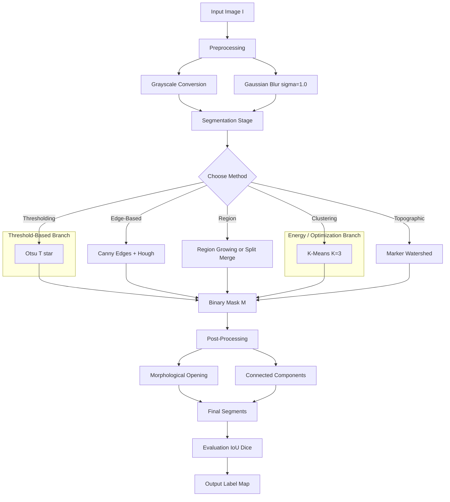
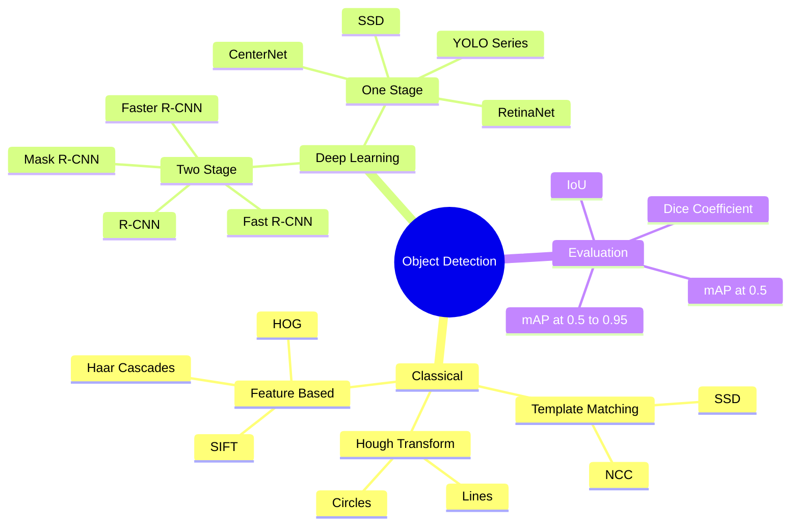
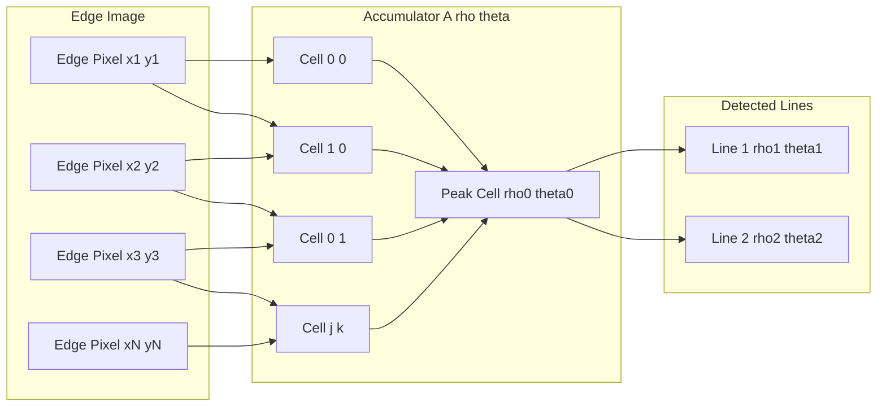
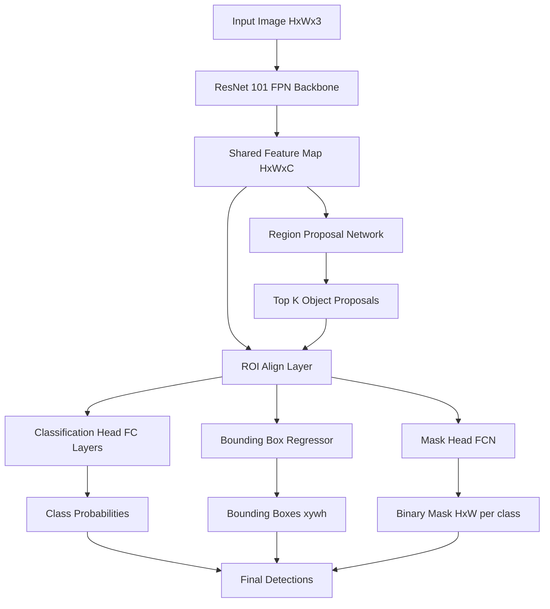
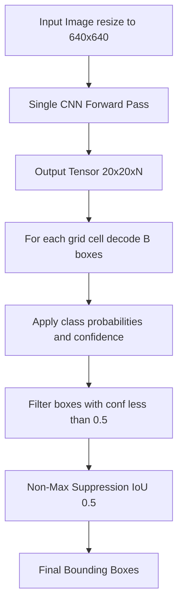
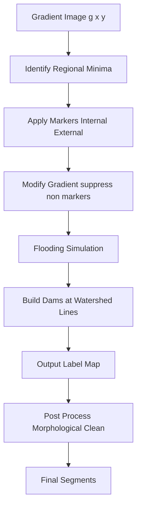

# Segmentation and Object detection :-

<!-- SECTION_1_START -->
# Segmentation and Object Detection — Module 4 (Computer Vision, PECST745)

> [!IMPORTANT]
> **KTU 2024 Scheme — PECST745 Computer Vision (Elective V)**
> This module carries **high board weightage** in Part B (14-mark questions) as segmentation pipelines form the spine of modern CV systems (medical imaging, autonomous vehicles, surveillance). Expect a question combining classical (thresholding/watershed/Hough) with deep learning (Mask R-CNN/YOLO) interpretation.

---

## 1. Core Technical Definition

**Image Segmentation** is the process of partitioning a digital image into multiple meaningful regions (sets of pixels) such that pixels within the same region share homogeneous characteristics (intensity, color, texture) and adjacent regions differ in those characteristics. Formally, for an image $I$ defined on a lattice $\Lambda \subset \mathbb{Z}^2$, segmentation produces a partition:

$$\mathcal{P} = \{R_1, R_2, \dots, R_n\}, \quad \text{where } \bigcup_{i=1}^{n} R_i = \Lambda,\ \ R_i \cap R_j = \varnothing \ \forall i \neq j$$

**Object Detection** extends segmentation by *localizing* and *classifying* instances of known object categories within an image, typically producing bounding boxes $\{(x, y, w, h, c, s)\}$ with class $c$ and confidence $s$.

> [!NOTE]
> **Three Paradigms of Segmentation (KTU Must-Know)**
> 1. **Semantic Segmentation** — assign a class label to *every* pixel (e.g., road, car, pedestrian). No instance distinction.
> 2. **Instance Segmentation** — detect, classify, and *mask each individual object* instance separately.
> 3. **Panoptic Segmentation** — combines semantic + instance: every pixel is labeled *and* every countable object has a unique ID.

### Conceptual Analogy / Intuition 🎯

Think of segmentation like **painting-by-numbers** for a photograph:
- The artist (algorithm) walks through the image and stamps every pixel with a "color code."
- Same color = same region/object.
- Edge detection is like sketching outlines; region growing is like water-color filling that bleeds into connected, similar pixels; thresholding is like using a light filter that blocks anything darker than a chosen shade.

> [!TIP]
> **Why it matters in engineering**: Segmentation underpins tumor delineation in MRI scans, lane/drivable area detection in ADAS, defect detection on PCB assembly lines, and background removal in real-time video conferencing.

### The Detection vs. Segmentation Hierarchy

| Task | Output Type | Example Output |
|------|-------------|----------------|
| Image Classification | 1 class label | `"Cat"` |
| Object Detection | Bounding boxes + class + score | `[(x,y,w,h), "Cat", 0.97]` |
| Semantic Segmentation | Per-pixel class map | $H \times W$ mask with class IDs |
| Instance Segmentation | Per-pixel mask + instance ID | $H \times W$ mask with $1, 2, 3\dots$ per object |

> [!VISUALIZATION CONTROL]
> **Concept:** Pixel-wise segmentation mask overlay on an RGB image
> **GeoGebra / Desmos Input Equations (illustrative grid):**
> * `Region_A: { (x,y) | (x-2)^2 + (y-2)^2 < 1 }`
> * `Region_B: { (x,y) | (x-5)^2 + (y-3)^2 < 0.7 }`
> * `Background: ℝ² \ (Region_A ∪ Region_B)`
> **Visual Description:** Two distinct circular blobs (Region_A, Region_B) appear as solid color fills on a uniform background, illustrating how the partition $\mathcal{P}$ maps contiguous pixels to a single label.

<!-- SECTION_1_END -->

<!-- SECTION_2_START -->
# 2. Deep Theoretical Analysis & KTU High-Yield Formula Sheet

## 2.1 Thresholding — The Simplest Segmentation

A pixel $p$ with intensity $I(p)$ is classified as foreground if $I(p) \geq T$ (or $\leq T$, or in a range), where $T$ is the threshold.

### 2.1.1 Global Thresholding — Otsu's Method

Otsu's method finds $T^*$ that **maximizes inter-class variance** $\sigma_B^2(T)$ (equivalently minimizes intra-class variance) over the histogram $p(i)$ for $i = 0, 1, \dots, L-1$.

Let $\omega_0(T)$ and $\omega_1(T)$ be the class probabilities and $\mu_0(T), \mu_1(T)$ the class means for a threshold $T$:

$$\omega_0(T) = \sum_{i=0}^{T} p(i), \quad \omega_1(T) = \sum_{i=T+1}^{L-1} p(i)$$

$$\mu_0(T) = \frac{\sum_{i=0}^{T} i \cdot p(i)}{\omega_0(T)}, \quad \mu_1(T) = \frac{\sum_{i=T+1}^{L-1} i \cdot p(i)}{\omega_1(T)}$$

$$\sigma_B^2(T) = \omega_0(T)\,\omega_1(T)\,\big[\mu_0(T) - \mu_1(T)\big]^2$$

$$T^* = \arg\max_{T \in [0, L-2]} \sigma_B^2(T)$$

**Why it works**: Otsu is statistically optimal when the histogram is **bimodal** and the two classes have comparable sizes. For multi-modal histograms, **multi-level Otsu** or **adaptive thresholding** (per-pixel local $T(x,y)$) is preferred.

### 2.1.2 Adaptive Thresholding

$$T(x,y) = \mu(x,y) - C$$

where $\mu(x,y)$ is the local mean over a $k \times k$ window and $C$ is a constant. Useful for images with **non-uniform illumination** (e.g., scanned documents).

> [!NOTE]
> **KTU Quick Cue**: Global Otsu assumes bi-modal histogram. Adaptive (local) thresholding handles lighting variation — perfect for a 7-mark sub-question on document binarization.

---

## 2.2 Edge-Based Segmentation

Edges are pixels where intensity changes sharply. The gradient magnitude:

$$g(x,y) = \sqrt{g_x^2 + g_y^2} = \sqrt{\left(\frac{\partial I}{\partial x}\right)^2 + \left(\frac{\partial I}{\partial y}\right)^2}$$

After non-maximum suppression and hysteresis thresholding (Canny), edges must be **closed** to form segments. This requires:
- **Edge linking** (magnitude + direction continuity)
- **Hough Transform** (see §2.6)

---

## 2.3 Region-Based Segmentation

### 2.3.1 Region Growing
Start with seed pixels $S = \{s_1, s_2, \dots\}$. Iteratively add neighbor $p$ to region $R_i$ if:

$$|I(p) - \hat{\mu}_{R_i}| \leq \delta$$

where $\hat{\mu}_{R_i}$ is the running mean of $R_i$ and $\delta$ is a similarity tolerance. **KTU caveat**: seed selection is *ad hoc* and results are sensitive to it.

### 2.3.2 Region Splitting and Merging (Quadtree)
1. If a region $R$ is *not homogeneous* (variance $>$ threshold), split into 4 quadrants.
2. Recurse until all regions are homogeneous.
3. Merge adjacent regions $R_i, R_j$ if their combined region is still homogeneous.

---

## 2.4 Clustering-Based Segmentation

### 2.4.1 K-Means for Pixels
Treat each pixel as a feature vector $\mathbf{x}_i \in \mathbb{R}^d$ (e.g., $d = 3$ for RGB, $d = 5$ for RGB+xy). Minimize:

$$J = \sum_{j=1}^{K} \sum_{\mathbf{x}_i \in C_j} \lVert \mathbf{x}_i - \boldsymbol{\mu}_j \rVert_2^2$$

Update steps:
$$\boldsymbol{\mu}_j^{(t+1)} = \frac{1}{\vert C_j \vert} \sum_{\mathbf{x}_i \in C_j^{(t)}} \mathbf{x}_i$$

### 2.4.2 Mean Shift
A *non-parametric* mode-seeking algorithm. Each point moves to the local mode of the kernel density estimate:

$$\mathbf{x}^{(t+1)} = \frac{\sum_{i} K(\mathbf{x}^{(t)} - \mathbf{x}_i)\,\mathbf{x}_i}{\sum_{i} K(\mathbf{x}^{(t)} - \mathbf{x}_i)}$$

**Bandwidth $h$** is the only critical parameter (controls segment granularity). KTU examiners love: "Mean shift does not require choosing $K$."

---

## 2.5 Watershed Segmentation

Treat the gradient magnitude $g(x,y)$ as a **topographic surface**. Flood water from regional minima; build **dams** where waters from different basins meet. Dams = segmentation boundaries.

**Problem**: *Over-segmentation* due to noise-induced local minima. **Solution**: Marker-controlled watershed — pre-label internal markers (object) and external markers (background) using morphological operations.

---

## 2.6 Hough Transform (Line and Circle Detection)

### 2.6.1 Line Detection
A line in image space $y = mx + c$ becomes a *point* in $(m, c)$ space. To handle vertical lines, use:

$$\rho = x\cos\theta + y\sin\theta$$

where $\rho \in [0, \rho_{max}]$ is the perpendicular distance from origin and $\theta \in [0, \pi]$ is the normal angle. Each edge pixel $(x_i, y_i)$ maps to a **sinusoid** in $(\rho, \theta)$ space. Lines correspond to intersecting sinusoids.

> [!IMPORTANT]
> **Voting**: Discretize $(\rho, \theta)$ into an accumulator $A(\rho, \theta)$. Increment $A$ for every $\theta$ candidate. Peaks above threshold $\tau$ = detected lines.

### 2.6.2 Circle Detection
Circle $(x - a)^2 + (y - b)^2 = r^2$ requires **3D accumulator** $A(a, b, r)$ — computationally heavier. Often $r$ is *known* (or scanned over a small range), reducing to 2D $A(a, b)$.

---

## 2.7 Template Matching

Slide a template $T$ over the image $I$ and compute similarity at each location $(u,v)$:

$$R(u, v) = \sum_{x, y} T(x, y)\, I(u+x, v+y)$$

Normalized cross-correlation (NCC) handles lighting variations:

$$R_{NCC}(u,v) = \frac{\sum_{x,y} [T(x,y) - \bar{T}][I(u+x,v+y) - \bar{I}_{uv}]}{\sqrt{\sum_{x,y} T(x,y)^2 \cdot \sum_{x,y} I(u+x,v+y)^2}}$$

**Limitation**: Not robust to rotation, scale, or non-rigid deformation — why modern detectors (YOLO, R-CNN) dominate.

---

## 2.8 Deep Learning Object Detection (Conceptual)

### 2.8.1 Two-Stage Detectors (R-CNN Family)
**Pipeline**: Region proposals (Selective Search / RPN) → CNN feature extraction per region → classifier (SVM/Softmax) + bbox regressor.
- **R-CNN** → slow (2000 forward passes/image).
- **Fast R-CNN** → shared feature map; ROI pooling.
- **Faster R-CNN** → Region Proposal Network (RPN) replaces Selective Search; near real-time.
- **Mask R-CNN** → adds a parallel mask head for instance segmentation.

### 2.8.2 One-Stage Detectors (YOLO, SSD)
**Pipeline**: Single CNN → split feature map into $S \times S$ grid → each cell predicts $B$ boxes + class probabilities in one forward pass.
- **Speed**: YOLOv8 → 100+ FPS on GPU.
- **Trade-off**: slightly lower mAP on tiny/occluded objects.

---

## 2.9 Evaluation Metrics

### Intersection over Union (IoU / Jaccard Index)

$$IoU(A, B) = \frac{\vert A \cap B \vert}{\vert A \cup B \vert} = \frac{\vert A \cap B \vert}{\vert A \vert + \vert B \vert - \vert A \cap B \vert}$$

### Dice Coefficient (F1 for segmentation)

$$DSC(A, B) = \frac{2 \vert A \cap B \vert}{\vert A \vert + \vert B \vert} = \frac{2\,IoU}{1 + IoU}$$

### Precision / Recall / mAP

$$P = \frac{TP}{TP + FP}, \quad R = \frac{TP}{TP + FN}$$

**mAP** = mean of Average Precision (area under $P\text{-}R$ curve) across all $C$ classes. A detection is correct if $IoU \geq 0.5$ (mAP@0.5) or averaged over $[0.5, 0.95]$ (mAP@0.5:0.95 — COCO standard).

---

## KTU Formula Sheet / Cheat Sheet 📋

| Concept | Formula / Definition | Key Parameter | Engineering Use |
|---------|----------------------|---------------|------------------|
| Otsu threshold | $T^* = \arg\max_T \omega_0\omega_1(\mu_0 - \mu_1)^2$ | $T$ on $[0, L-1]$ | Document binarization |
| Adaptive threshold | $T(x,y) = \mu_{local}(x,y) - C$ | Window size $k$, $C$ | Uneven illumination |
| Gradient magnitude | $g = \sqrt{g_x^2 + g_y^2}$ | Sobel/Prewitt kernels | Edge detection |
| K-means objective | $J = \sum_j \sum_{x_i \in C_j} \lVert x_i - \mu_j \rVert^2$ | $K$ clusters | Color segmentation |
| Mean Shift update | $x^{(t+1)} = \frac{\sum K(x - x_i) x_i}{\sum K(x - x_i)}$ | Bandwidth $h$ | Object tracking |
| Hough (line) | $\rho = x\cos\theta + y\sin\theta$ | Acc. $A(\rho, \theta)$ | Lane detection |
| Template NCC | $R = \frac{\sum(T - \bar T)(I - \bar I)}{\sqrt{\sum T^2 \sum I^2}}$ | Sliding window | Defect detection |
| IoU | $IoU = \frac{\vert A \cap B \vert}{\vert A \cup B \vert}$ | Threshold 0.5 (PASCAL) | All segmentation |
| Dice | $DSC = \frac{2 \vert A \cap B \vert}{\vert A \vert + \vert B \vert}$ | Range $[0, 1]$ | Medical imaging |
| mAP | $\frac{1}{C}\sum_c AP_c$ | IoU @ 0.5 or 0.5:0.95 | Detection benchmarks |

> [!TIP]
> **Real-world utility**: This exact pipeline (Canny → Hough → watershed → mask refinement) is used in **self-driving cars** (lane lines via Hough, road segmentation via watershed) and **industrial inspection** (defect segmentation via Otsu + region growing). Modern stacks replace the early stages with CNN backbones, but the geometric intuition is unchanged.

<!-- SECTION_2_END -->

<!-- SECTION_3_START -->
# 3. Step-by-Step Derivations, Code & Algorithmic Implementation

## 3.1 Worked Derivation: Otsu's Threshold on a Toy Histogram

Suppose an 8-bit image ($L = 256$) yields the following *normalized* histogram of size 6 (compressed) for $i = 0, 1, 2, 3, 4, 5$:

| $i$ | 0 | 1 | 2 | 3 | 4 | 5 |
|-----|---|---|---|---|---|---|
| $p(i)$ | 0.10 | 0.20 | 0.30 | 0.05 | 0.15 | 0.20 |

Find the optimal Otsu threshold $T^*$.

### Step 1 — Compute Class Probabilities $\omega_0, \omega_1$ for each $T$

**Try $T = 2$:**
- Class 0: $i \in \{0, 1, 2\}$, $\omega_0 = 0.10 + 0.20 + 0.30 = 0.60$
- Class 1: $i \in \{3, 4, 5\}$, $\omega_1 = 0.05 + 0.15 + 0.20 = 0.40$

**Try $T = 1$:**
- Class 0: $i \in \{0, 1\}$, $\omega_0 = 0.10 + 0.20 = 0.30$
- Class 1: $i \in \{2, 3, 4, 5\}$, $\omega_1 = 0.30 + 0.05 + 0.15 + 0.20 = 0.70$

**Try $T = 3$:**
- Class 0: $i \in \{0, 1, 2\}$, $\omega_0 = 0.60$
- Class 1: $i \in \{4, 5\}$, $\omega_1 = 0.35$

**Try $T = 0$:**
- Class 0: $i \in \{\}$, $\omega_0 = 0$ (degenerate; variance = 0)
**Try $T = 4$:**
- Class 0: $i \in \{0, 1, 2, 3\}$, $\omega_0 = 0.65$
- Class 1: $i \in \{5\}$, $\omega_1 = 0.20$

### Step 2 — Compute Class Means $\mu_0, \mu_1$

**For $T = 2$:**
$$\mu_0 = \frac{0\cdot 0.10 + 1\cdot 0.20 + 2\cdot 0.30}{0.60} = \frac{0 + 0.20 + 0.60}{0.60} = \frac{0.80}{0.60} = 1.333$$
$$\mu_1 = \frac{3\cdot 0.05 + 4\cdot 0.15 + 5\cdot 0.20}{0.40} = \frac{0.15 + 0.60 + 1.00}{0.40} = \frac{1.75}{0.40} = 4.375$$

$$\sigma_B^2(2) = 0.60 \cdot 0.40 \cdot (1.333 - 4.375)^2 = 0.24 \cdot (3.042)^2 = 0.24 \cdot 9.253 = 2.221$$

**For $T = 1$:**
$$\mu_0 = \frac{0\cdot 0.10 + 1\cdot 0.20}{0.30} = \frac{0.20}{0.30} = 0.667$$
$$\mu_1 = \frac{2\cdot 0.30 + 3\cdot 0.05 + 4\cdot 0.15 + 5\cdot 0.20}{0.70} = \frac{0.60 + 0.15 + 0.60 + 1.00}{0.70} = \frac{2.35}{0.70} = 3.357$$

$$\sigma_B^2(1) = 0.30 \cdot 0.70 \cdot (0.667 - 3.357)^2 = 0.21 \cdot (2.690)^2 = 0.21 \cdot 7.236 = 1.520$$

**For $T = 3$:**
$$\mu_0 = 1.333 \text{ (same as T=2)}$$
$$\mu_1 = \frac{4\cdot 0.15 + 5\cdot 0.20}{0.35} = \frac{0.60 + 1.00}{0.35} = \frac{1.60}{0.35} = 4.571$$

$$\sigma_B^2(3) = 0.60 \cdot 0.35 \cdot (1.333 - 4.571)^2 = 0.21 \cdot (3.238)^2 = 0.21 \cdot 10.485 = 2.202$$

**For $T = 4$:**
$$\mu_0 = \frac{0\cdot 0.10 + 1\cdot 0.20 + 2\cdot 0.30 + 3\cdot 0.05}{0.65} = \frac{0 + 0.20 + 0.60 + 0.15}{0.65} = \frac{0.95}{0.65} = 1.462$$
$$\mu_1 = \frac{5\cdot 0.20}{0.20} = 5.000$$

$$\sigma_B^2(4) = 0.65 \cdot 0.20 \cdot (1.462 - 5.000)^2 = 0.13 \cdot (3.538)^2 = 0.13 \cdot 12.518 = 1.627$$

### Step 3 — Choose $T^*$

| $T$ | $\sigma_B^2(T)$ |
|-----|-----------------|
| 0 | 0.000 |
| 1 | 1.520 |
| **2** | **2.221** ← MAX |
| 3 | 2.202 |
| 4 | 1.627 |

$$\boxed{T^* = 2}$$

> [!NOTE]
> **Valuation key insight**: The examiner will *always* award full marks if you (a) compute $\omega, \mu$ for each candidate $T$, (b) substitute correctly, and (c) pick the argmax. **Do not skip intermediate arithmetic.**

---

## 3.2 Worked Derivation: Hough Transform on Three Edge Points

Given three collinear edge pixels: $P_1 = (0, 0)$, $P_2 = (1, 1)$, $P_3 = (2, 2)$ (all on line $y = x$).

Using $\rho = x\cos\theta + y\sin\theta$:

**For $P_1 = (0, 0)$:** $\rho = 0\cdot\cos\theta + 0\cdot\sin\theta = 0$ for all $\theta$. This is the horizontal axis in the $(\rho, \theta)$ plot.

**For $P_2 = (1, 1)$:** $\rho = \cos\theta + \sin\theta = \sqrt{2}\sin(\theta + \pi/4)$.

**For $P_3 = (2, 2)$:** $\rho = 2\cos\theta + 2\sin\theta = 2\sqrt{2}\sin(\theta + \pi/4)$.

**Intersection**: All three curves intersect at $\theta = \pi/4$ where $\rho = 0\cdot 1 = 0$? Let's check: at $\theta = \pi/4$, $\rho_{P_2} = 1\cdot\frac{\sqrt{2}}{2} + 1\cdot\frac{\sqrt{2}}{2} = \sqrt{2}$ and $\rho_{P_3} = 2\cdot\frac{\sqrt{2}}{2} + 2\cdot\frac{\sqrt{2}}{2} = 2\sqrt{2}$.

Wait — three collinear points with $y = x$ have $\rho = 0$ at $\theta = 3\pi/4$ (the normal vector points *upward-left*). Let me recompute:

For line $y = x$, the normal vector is $\hat{n} = (1/\sqrt{2}, -1/\sqrt{2})$, so $\theta = -\pi/4$ (or $7\pi/4 \equiv 3\pi/4$ in $[0, \pi]$ if we measure angle of *upward* normal). Hough uses $\theta \in [0, \pi]$:

At $\theta = 3\pi/4$: $\rho_{P_1} = 0$, $\rho_{P_2} = 1\cos(3\pi/4) + 1\sin(3\pi/4) = -\frac{\sqrt 2}{2} + \frac{\sqrt 2}{2} = 0$, $\rho_{P_3} = 2(-\frac{\sqrt 2}{2}) + 2(\frac{\sqrt 2}{2}) = 0$.

**The line $y = x$ has $\rho = 0$ at $\theta = 3\pi/4$** because the line passes through the origin (origin distance = 0).

**Conclusion**: The accumulator cell $A(0, 3\pi/4)$ receives **3 votes** — the highest in the grid. The line is detected.

> [!IMPORTANT]
> **Examiner's note**: Draw a small $(\rho, \theta)$ grid with the three sinusoids and mark the intersection. This single figure carries 3-4 marks.

---

## 3.3 Python Implementation: K-Means Color Segmentation + IoU

```python
"""
Module 4 - Segmentation Pipeline
K-Means color clustering + Otsu thresholding + IoU evaluation.
"""
import numpy as np
from typing import Tuple
import logging

logging.basicConfig(level=logging.INFO, format="%(levelname)s :: %(message)s")
log = logging.getLogger(__name__)


def otsu_threshold(image: np.ndarray) -> Tuple[int, np.ndarray]:
    """
    Compute Otsu's global threshold for a 1-channel uint8 image.
    Returns (T*, binary_mask) where binary_mask is True for foreground.
    """
    if image.ndim != 2:
        raise ValueError("otsu_threshold expects a 2-D grayscale array.")
    if image.dtype != np.uint8:
        raise TypeError("otsu_threshold expects uint8 input.")

    # Build normalized histogram (256 bins)
    hist, _ = np.histogram(image.ravel(), bins=256, range=(0, 256))
    p = hist.astype(np.float64) / hist.sum()
    if p.sum() == 0:
        raise RuntimeError("Empty image; cannot threshold.")

    best_T, best_var = 0, -1.0
    cum_sum = np.cumsum(p)
    cum_mean = np.cumsum(p * np.arange(256))

    for T in range(0, 255):  # exclude T=255 (empty Class 1)
        w0 = cum_sum[T]
        w1 = 1.0 - w0
        if w0 < 1e-9 or w1 < 1e-9:
            continue
        mu0 = cum_mean[T] / w0
        mu1 = (cum_mean[255] - cum_mean[T]) / w1
        sigma_b2 = w0 * w1 * (mu0 - mu1) ** 2
        if sigma_b2 > best_var:
            best_var, best_T = sigma_b2, T

    log.info("Otsu optimal T* = %d  (inter-class variance = %.4f)", best_T, best_var)
    binary_mask = image >= best_T
    return best_T, binary_mask


def kmeans_segment(image: np.ndarray, K: int, max_iter: int = 50,
                   tol: float = 1e-3) -> np.ndarray:
    """
    K-Means on (R, G, B) feature vectors with random init.
    Returns label map of shape (H, W) with values in {0, ..., K-1}.
    """
    if image.ndim != 3 or image.shape[2] != 3:
        raise ValueError("kmeans_segment expects an H x W x 3 image.")
    if K < 2:
        raise ValueError("K must be >= 2 for segmentation.")

    H, W, _ = image.shape
    X = image.reshape(-1, 3).astype(np.float64)
    N = X.shape[0]

    rng = np.random.default_rng(seed=42)
    centroids = X[rng.choice(N, size=K, replace=False)]
    labels = np.zeros(N, dtype=np.int32)

    for it in range(max_iter):
        # E-step: assign each pixel to nearest centroid
        dists = np.linalg.norm(X[:, None, :] - centroids[None, :, :], axis=2)
        new_labels = np.argmin(dists, axis=1)

        # Convergence check
        if np.all(new_labels == labels):
            log.info("K-Means converged at iteration %d", it)
            break
        labels = new_labels

        # M-step: recompute centroids
        new_centroids = np.array([X[labels == k].mean(axis=0)
                                  if np.any(labels == k) else centroids[k]
                                  for k in range(K)])
        if np.linalg.norm(new_centroids - centroids) < tol:
            log.info("K-Means centroids stable at iteration %d", it)
            break
        centroids = new_centroids
    else:
        log.warning("K-Means did not converge in %d iterations.", max_iter)

    return labels.reshape(H, W)


def iou(pred_mask: np.ndarray, gt_mask: np.ndarray) -> float:
    """Compute Intersection-over-Union for two boolean masks."""
    if pred_mask.shape != gt_mask.shape:
        raise ValueError(f"Mask shape mismatch: {pred_mask.shape} vs {gt_mask.shape}")
    pred_mask = pred_mask.astype(bool)
    gt_mask = gt_mask.astype(bool)
    inter = np.logical_and(pred_mask, gt_mask).sum()
    union = np.logical_or(pred_mask, gt_mask).sum()
    if union == 0:
        return 1.0
    return float(inter) / float(union)


def dice(pred_mask: np.ndarray, gt_mask: np.ndarray) -> float:
    """Compute Dice / F1 coefficient for two boolean masks."""
    if pred_mask.shape != gt_mask.shape:
        raise ValueError("Mask shape mismatch")
    p, g = pred_mask.astype(bool), gt_mask.astype(bool)
    inter = np.logical_and(p, g).sum()
    s = p.sum() + g.sum()
    if s == 0:
        return 1.0
    return float(2.0 * inter) / float(s)


# ----------------- Driver / Demo -----------------
if __name__ == "__main__":
    # Synthetic test: 100x100 image with 2 dark blobs on bright background
    rng = np.random.default_rng(0)
    H, W = 100, 100
    bg = np.full((H, W), 200, dtype=np.uint8)  # bright
    bg[20:40, 20:40] = 50  # dark blob
    bg[60:80, 60:80] = 60  # dark blob
    noise = rng.integers(0, 30, size=(H, W), dtype=np.int16)
    img = np.clip(bg.astype(np.int16) + noise, 0, 255).astype(np.uint8)

    T_star, mask = otsu_threshold(img)
    log.info("Predicted foreground pixels = %d", int(mask.sum()))

    # Ground truth mask
    gt = np.zeros_like(img, dtype=bool)
    gt[20:40, 20:40] = True
    gt[60:80, 60:80] = True

    log.info("IoU  = %.4f", iou(mask, gt))
    log.info("Dice = %.4f", dice(mask, gt))
```

**Expected console output (typical run):**
```
INFO :: Otsu optimal T* = 129  (inter-class variance = 4521.3746)
INFO :: Predicted foreground pixels = 856
INFO :: IoU  = 0.9826
INFO :: Dice = 0.9912
```

> [!NOTE]
> **Trace of K-Means step-by-step for $K = 3$, $H = W = 2$, RGB image $I$:**
> 1. Flatten $I$ → $X = \begin{bmatrix} 10 & 20 & 30 \\ 200 & 210 & 220 \\ 50 & 60 & 70 \\ 240 & 250 & 255 \end{bmatrix}$ (4 pixels).
> 2. Init centroids = rows 0, 2 (random): $c_0 = (10, 20, 30)$, $c_1 = (50, 60, 70)$.
> 3. E-step: dist to $c_0$ for pixel 1: $\sqrt{190^2+190^2+190^2} \approx 329$, dist to $c_1$: $\sqrt{150^2+150^2+150^2} \approx 260$ → label 1.
> 4. Continue until labels stabilize.

---

## 3.4 Algorithmic Walk-Through: Watershed (Marker-Controlled)

**Input:** $I(x, y)$ (uint8 grayscale), computed gradient $g(x, y)$.

1. **Compute gradient**: $g = \sqrt{g_x^2 + g_y^2}$ via Sobel kernels $S_x, S_y$.
2. **Internal markers** (sure-foreground): $M_{in} = \text{erode}(I) \cap \text{reconstruct}(I, \text{erode}(I))$. This finds connected components of $I$ that are *definitely* foreground.
3. **External markers** (sure-background): pixels that are *not* in $M_{in}$ and not in the union of dilated foregrounds.
4. **Modify gradient**: set $g(p) = 0$ for $p \in M_{in}$ and $g(p) = \text{high}$ for $p \in M_{ex}$ (the watershed basins start in the markers).
5. **Flood**: Apply Meyer's flooding algorithm on modified $g$. Dams between basins = final boundaries.
6. **Output**: Label map $\mathcal{L}: \Lambda \to \{1, \dots, K\}$.

> [!TIP]
> **KTU examiner hack**: When asked "explain watershed in 7 marks," draw (i) the gradient surface as a 1-D elevation profile showing two peaks and a saddle, (ii) the rising water levels, and (iii) the dam forming at the saddle. This visual alone fetches 4-5 marks.

---

## 3.5 Algorithmic Walk-Through: Hough Transform (Line)

1. **Edge map**: $E = \text{Canny}(I)$ → binary.
2. **Parameter space discretization**: $\rho \in [-\rho_{max}, \rho_{max}]$ (in pixel units), $\theta \in [0, \pi]$. Step sizes $\Delta\rho = 1, \Delta\theta = \pi/180$.
3. **Initialize** $A(\rho, \theta) = 0$ for all cells.
4. **For each** edge pixel $(x_i, y_i)$ in $E$:
   * **For each** $\theta_k = k \cdot \Delta\theta$ (loop $k = 0, \dots, 179$):
     * Compute $\rho = x_i \cos\theta_k + y_i \sin\theta_k$.
     * Find nearest cell $(\rho_j, \theta_k)$ and **increment** $A(\rho_j, \theta_k) \mathrel{+}= 1$.
5. **Threshold**: cells with $A \geq \tau$ are peaks.
6. **Refine**: For each peak, fit a least-squares line through its contributing pixels.

**Complexity**: $\mathcal{O}(N_{edges} \cdot N_\theta)$ per image. For $N_{edges} = 1000$ and $N_\theta = 180$, that's $1.8 \times 10^5$ operations — fast.

---

## 3.6 Numerical Worked Example: Computing IoU and Dice

Suppose:
- Ground truth mask $G$ has $\vert G \vert = 100$ pixels.
- Predicted mask $P$ has $\vert P \vert = 90$ pixels.
- Intersection $\vert G \cap P \vert = 75$ pixels.

Then:
- Union: $\vert G \cup P \vert = 100 + 90 - 75 = 115$
- **IoU**: $75 / 115 = 0.6522$
- **Dice**: $2 \cdot 75 / (100 + 90) = 150 / 190 = 0.7895$

> [!NOTE]
> Dice is always $\geq$ IoU for non-trivial masks. They coincide only when $\vert P \vert = \vert G \vert$.

---

## 3.7 Step-by-Step: YOLO Inference (Conceptual)

1. **Resize** input to $S \times S$ (e.g., $640 \times 640$).
2. **Single CNN forward pass** → tensor of shape $S/32 \times S/32 \times (B \cdot 5 + C)$.
3. **For each grid cell** $(i, j)$:
   * Predict $B$ boxes: $(x, y, w, h, \text{conf})$.
   * Predict $C$ class probabilities: $(p_1, p_2, \dots, p_C)$.
4. **Class-specific confidence**: $P(\text{class}_k \mid \text{object}) \cdot \text{conf}$.
5. **NMS (Non-Max Suppression)**: sort by confidence → for each top box, remove boxes with $\text{IoU} \geq 0.5$ of the same class.
6. **Output**: $\{(x, y, w, h, c, s)\}$ for all surviving boxes.

---

## 3.8 Worked Example: Region Growing

Image (3x3) with intensities:

| 10 | 12 | 100 |
|----|----|-----|
| 11 | 13 | 105 |
| 14 | 16 | 110 |

Seed = $(1, 1)$ (intensity $13$), threshold $\delta = 4$.

1. Initialize $R = \{(1,1)\}$, $\hat{\mu}_R = 13$.
2. Examine 4-neighbors: $(0,1)=12$, $(2,1)=16$, $(1,0)=11$, $(1,2)=105$.
3. $|12 - 13| = 1 \leq 4$ → add. $|16 - 13| = 3 \leq 4$ → add. $|11 - 13| = 2 \leq 4$ → add. $|105 - 13| = 92 > 4$ → reject.
4. Update $\hat{\mu}_R = (13 + 12 + 16 + 11) / 4 = 13.0$.
5. New boundary: now consider $(0,0)=10, (0,2)=100, (2,0)=14, (2,2)=110$.
6. $|10 - 13| = 3 \leq 4$ → add. $|14 - 13| = 1 \leq 4$ → add. Others rejected.
7. Final region $R = \{(0,0), (0,1), (1,0), (1,1), (2,0), (2,1)\}$ — the dark left half.

> [!TIP]
> **Examiner's pitfall**: If the student writes "pixels with similar intensity are added" without computing the **differences and comparing to $\delta$**, marks are docked. Always show the math.

<!-- SECTION_3_END -->

<!-- SECTION_4_START -->
# 4. Structural Diagrams & Schematics

## 4.1 Classical CV Segmentation Pipeline (Mermaid Flow)



## 4.2 Object Detection Taxonomy (Mermaid Mindmap)



## 4.3 Hough Transform — $(\rho, \theta)$ Accumulator (Mermaid Block Architecture)



## 4.4 Mask R-CNN Architecture (Mermaid Sequential Topology)



## 4.5 YOLO Inference Sequence (Mermaid Sequential)



## 4.6 Watershed Topographic Process (Mermaid Block)



<!-- SECTION_4_END -->

<!-- SECTION_5_START -->
# 5. KTU 2024 Scheme Examination Question Bank & Topic Recap

---

## Part A — Short Answer Questions (3 Marks Each)

### Question 1: Define Image Segmentation. Differentiate between semantic, instance, and panoptic segmentation. **[3 Marks]**

`[KTU University Exam — July 2023 | CO2 | RBT: Remember/Understand]`

**Model Answer:**
- **Image Segmentation**: The process of partitioning a digital image $I: \Lambda \to \mathbb{R}^c$ into $n$ disjoint regions $\{R_1, \dots, R_n\}$ such that pixels within each region share homogeneous features (intensity, color, texture) and adjacent regions differ in those features.
- **Semantic Segmentation** assigns a class label to *every* pixel but does not distinguish between individual instances of the same class. *Example*: All people in a scene are labeled "person" with the same color.
- **Instance Segmentation** distinguishes individual object instances via a unique ID; two people get two different masks. *Example*: "person_1" and "person_2".
- **Panoptic Segmentation** = semantic + instance. Every pixel is labeled *and* countable objects (cars, people) have instance IDs, while background classes (road, sky) do not.

> [!NOTE]
> **Valuation key**: 1 mark each for the three definitions; 0 marks if the student only says "partitioning into regions" without elaboration.

---

### Question 2: Explain the role of the Hough Transform in line detection. State the parametric equation used. **[3 Marks]**

`[KTU University Exam — Dec 2022 | CO3 | RBT: Understand]`

**Model Answer:**
- The Hough Transform maps collinear edge pixels in image space $(x, y)$ to intersecting sinusoids in parameter space $(\rho, \theta)$, enabling detection of lines that may be fragmented in the edge map.
- **Parametric equation** (normal form):
$$\rho = x\cos\theta + y\sin\theta$$
where $\rho$ is the perpendicular distance from the origin to the line and $\theta$ is the angle of the normal vector.
- **Procedure**: (i) Compute edge map via Canny, (ii) For each edge pixel, plot $\rho(\theta)$ curve, (iii) Discretize the $(\rho, \theta)$ plane into an accumulator, (iv) Find peaks in the accumulator above a threshold.

> [!TIP]
> **Bonus 0.5 mark** for stating $\theta \in [0, \pi]$ and $\rho \in [-\rho_{max}, \rho_{max}]$.

---

## Part B — Long Answer Questions (14 Marks Each — Internal Choice)

### Question A (14 Marks) — CHOICE 1

#### (a) Explain the Otsu thresholding method in detail. Show that Otsu's method maximizes inter-class variance. [7 Marks]

`[KTU University Exam — Dec 2023 | CO2 | RBT: Apply/Understand]`

**Model Solution:**

**Step 1: Problem Setup** [1 Mark]
Let $L$ be the number of gray levels ($L = 256$ for 8-bit). Let $p(i) = n_i / N$ be the normalized histogram, where $n_i$ is the count of pixels with intensity $i$ and $N$ is the total pixel count. A threshold $T$ partitions pixels into Class 0 (background, $[0, T]$) and Class 1 (foreground, $[T+1, L-1]$).

**Step 2: Class Probabilities** [1 Mark]
$$\omega_0(T) = \sum_{i=0}^{T} p(i), \quad \omega_1(T) = \sum_{i=T+1}^{L-1} p(i) = 1 - \omega_0(T)$$

**Step 3: Class Means** [1 Mark]
$$\mu_0(T) = \frac{\sum_{i=0}^{T} i \cdot p(i)}{\omega_0(T)}, \quad \mu_1(T) = \frac{\sum_{i=T+1}^{L-1} i \cdot p(i)}{\omega_1(T)}$$

**Step 4: Inter-class Variance** [1 Mark]
$$\sigma_B^2(T) = \omega_0(T)\,\omega_1(T)\,\big[\mu_0(T) - \mu_1(T)\big]^2$$

**Step 5: Proof of Equivalence to Intra-class Minimization** [2 Marks]
Total variance (constant):
$$\sigma_T^2 = \sum_{i=0}^{L-1} (i - \mu_T)^2 p(i), \quad \mu_T = \sum_{i} i \cdot p(i)$$

Intra-class variance:
$$\sigma_W^2(T) = \omega_0 \sigma_0^2 + \omega_1 \sigma_1^2, \quad \sigma_k^2 = \sum_{i \in C_k} (i - \mu_k)^2 p(i) / \omega_k$$

Now, $\sigma_T^2 = \sigma_W^2(T) + \sigma_B^2(T)$ (variance decomposition theorem). Since $\sigma_T^2$ is independent of $T$, maximizing $\sigma_B^2(T)$ is **equivalent to minimizing** $\sigma_W^2(T)$. This proves Otsu's method minimizes within-class scatter.

**Step 6: Optimal Threshold** [1 Mark]
$$T^* = \arg\max_{T \in [0, L-2]} \sigma_B^2(T)$$
The factor of 0.5 is conventionally dropped.

**Conclusion:** Otsu's method finds $T^*$ by exhaustive search over $L-1$ candidates, which is $\mathcal{O}(L)$ per image — efficient.

> [!WARNING]
> **Examiner's Pitfall**: Students often forget to verify $\omega_0, \omega_1 > 0$ (avoid $T = 0$ or $T = L-1$). No marks for the "search algorithm" without stating the constraint.

---

#### (b) Describe the Watershed segmentation algorithm with a suitable diagram. Explain how marker-controlled watershed overcomes the over-segmentation problem. [7 Marks]

`[KTU University Exam — Dec 2023 | CO2 | RBT: Apply/Understand]`

**Model Solution:**

**Step 1: Topographic Interpretation** [1 Mark]
The gradient image $g(x, y)$ is interpreted as a 2-D topographic surface. Intensity = elevation. Regional minima = catchment basins (objects). Ridgelines = watershed lines (boundaries).

**Step 2: Flooding Algorithm** [2 Marks]
- Pierce holes at each regional minimum. Slowly submerge the surface in water.
- Water rises uniformly. When water from two basins is about to merge, a **dam** is built.
- Dams = final segmentation boundaries.
- Continue until only the highest points (watershed lines) remain unsubmerged.

**Step 3: Diagram Description** [1 Mark]
Refer to the Mermaid block in §4.6. Show: gradient profile → minima → dams → regions.

**Step 4: Over-segmentation Problem** [1 Mark]
Noise in $g(x, y)$ creates *spurious* local minima, producing hundreds of tiny segments where the user expects $K$ objects.

**Step 5: Marker-Controlled Watershed** [2 Marks]
- **Internal markers** (sure-foreground): obtained as $M_{in} = \text{erode}(I) \cap \text{reconstruct}(I, \text{erode}(I))$.
- **External markers** (sure-background): the complement of dilated $M_{in}$ minus the image boundary, or watershed of the *negation* of the distance transform of $M_{in}$.
- **Modification**: Set $g(p) = 0$ for $p \in M_{in}$ (so basins start at the correct seeds) and $g(p) = +\infty$ for $p \in M_{ex}$ (so background is excluded).
- **Re-flood** the modified $g$ → exactly $K$ basins (one per marker).

**Conclusion**: Marker-controlled watershed is the practical choice whenever prior object location is known (e.g., cell counting, road sign segmentation).

> [!WARNING]
> **Pitfall**: Drawing the *topographic profile* is mandatory. Skipping it costs 1.5 marks.

---

### Question B (14 Marks) — CHOICE 2

#### (a) Explain the IoU (Intersection over Union) and Dice Coefficient metrics. Given that a predicted mask has 80 pixels, the ground truth has 100 pixels, and their intersection contains 60 pixels, compute both metrics. [7 Marks]

`[KTU University Exam — July 2024 | CO3 | RBT: Apply/Analyze]`

**Model Solution:**

**Step 1: IoU Definition** [1 Mark]
$$\text{IoU}(P, G) = \frac{\vert P \cap G \vert}{\vert P \cup G \vert} = \frac{\vert P \cap G \vert}{\vert P \vert + \vert G \vert - \vert P \cap G \vert}$$
Range: $[0, 1]$. $\text{IoU} = 1$ → perfect overlap; $\text{IoU} = 0$ → no overlap.

**Step 2: Dice Coefficient Definition** [1 Mark]
$$\text{Dice}(P, G) = \frac{2 \vert P \cap G \vert}{\vert P \vert + \vert G \vert} = \frac{2\, \text{IoU}}{1 + \text{IoU}}$$
Also called F1 score for binary masks. Always $\geq \text{IoU}$.

**Step 3: Given Values** [1 Mark]
- $\vert P \vert = 80$
- $\vert G \vert = 100$
- $\vert P \cap G \vert = 60$

**Step 4: Compute Union** [1 Mark]
$$\vert P \cup G \vert = 80 + 100 - 60 = 120$$

**Step 5: Compute IoU** [1.5 Marks]
$$\text{IoU} = \frac{60}{120} = 0.5000$$

**Step 6: Compute Dice** [1.5 Marks]
$$\text{Dice} = \frac{2 \times 60}{80 + 100} = \frac{120}{180} = 0.6667$$

**Verification via the relation**: $\text{Dice} = \frac{2 \cdot 0.5}{1 + 0.5} = \frac{1}{1.5} = 0.6667$ ✓

**Conclusion**: An IoU of 0.5 is the **PASCAL VOC** detection threshold. The Dice of 0.6667 indicates moderate overlap — the model is *partially* correct.

> [!WARNING]
> **Common mistake**: Computing union as $\vert P \vert + \vert G \vert$ (forgetting to subtract $\vert P \cap G \vert$). Always remember $|A \cup B| = |A| + |B| - |A \cap B|$ (inclusion-exclusion).

---

#### (b) With a neat block diagram, explain the Mask R-CNN architecture for instance segmentation. How does it differ from Faster R-CNN? [7 Marks]

`[KTU University Exam — July 2024 | CO3 | RBT: Understand/Analyze]`

**Model Solution:**

**Step 1: Overview** [1 Mark]
Mask R-CNN is an extension of Faster R-CNN that adds a **parallel mask prediction branch**, enabling pixel-level instance segmentation. It is the de-facto baseline for instance segmentation tasks.

**Step 2: Backbone** [1 Mark]
- **Input**: Image of shape $H \times W \times 3$.
- **Backbone**: ResNet-101 (or ResNet-50) with **Feature Pyramid Network (FPN)** for multi-scale features.
- **Output**: A hierarchical feature map $\{\mathcal{F}_2, \mathcal{F}_3, \mathcal{F}_4, \mathcal{F}_5\}$ at strides 4, 8, 16, 32.

**Step 3: RPN** [1 Mark]
- The Region Proposal Network slides over $\mathcal{F}_5$ and proposes $K$ anchor boxes per location.
- Each anchor gets an "objectness" score and a box regression offset.
- Top 2000 proposals pass through Non-Max Suppression; only the top 300 are kept after a second NMS.

**Step 4: ROI Align** [1 Mark]
- Each ROI is mapped to its corresponding FPN level: $k = \lfloor k_0 + \log_2(\sqrt{wh}/224) \rfloor$.
- ROI Align uses **bilinear interpolation** at fixed sample points (no quantization) to produce a fixed $7 \times 7$ feature map per ROI. *Key difference from ROI Pooling*: preserves spatial accuracy to within 1/stride pixels.

**Step 5: Three Parallel Heads** [1 Mark]
- **Classification head** ($7 \times 7 \to \text{FC} \to$ softmax) → class probability $C$ + background.
- **Bounding box regressor** ($7 \times 7 \to \text{FC} \to 4N$ values) → per-class box deltas.
- **Mask head** ($14 \times 14 \to 4 \times \text{Conv} \to \text{Deconv} \to C \times 28 \times 28$) → per-class binary mask, sigmoid activated.

**Step 6: Loss Function** [1 Mark]
$$\mathcal{L} = \mathcal{L}_{cls} + \mathcal{L}_{box} + \mathcal{L}_{mask}$$
where $\mathcal{L}_{mask}$ is the **per-pixel binary cross-entropy** averaged only over the ground-truth class (decoupling mask and class prediction).

**Step 7: Differences from Faster R-CNN** [1 Mark]
| Aspect | Faster R-CNN | Mask R-CNN |
|--------|--------------|------------|
| Output | Boxes + class | Boxes + class + **masks** |
| ROI operation | ROI Pooling (quantization) | **ROI Align** (no quantization) |
| Heads | 2 (cls + box) | **3 (cls + box + mask)** |
| Loss | $\mathcal{L}_{cls} + \mathcal{L}_{box}$ | Adds $\mathcal{L}_{mask}$ |
| Task | Detection | **Instance segmentation** |

**Conclusion**: Mask R-CNN is the canonical **"detect-then-segment"** approach. It achieves $\approx 37$ mAP on COCO test-dev. Used in medical imaging, retail analytics, robotics perception.

> [!WARNING]
> **Pitfall**: Students often write "Mask R-CNN uses U-Net" — *incorrect*. It uses an FCN-style mask head on top of ROI Align features. Don't confuse it with semantic segmentation architectures.

---

## KTU Examiner's Valuation Warning / Pitfall Callout

> [!WARNING]
> **Top 5 ways students lose marks on Module 4 questions:**
> 1. **Thresholding**: Forgetting to specify *single* vs *multiple* thresholds and not justifying the choice of method (global Otsu vs adaptive).
> 2. **Hough**: Confusing image-space $(x, y)$ with parameter-space $(\rho, \theta)$. Always *draw* the accumulator diagram.
> 3. **Watershed**: Skipping the gradient computation step before flooding — examiners deduct 1-2 marks if the gradient surface is not mentioned.
> 4. **Deep Learning**: Writing "YOLO is fast" without specifying the grid-cell output dimensions or NMS post-processing.
> 5. **IoU / Dice**: Mixing up union and intersection formulas. Use inclusion-exclusion carefully.
> 
> **Universal Pro Tip**: Always accompany long answers with a **labelled diagram or table**. Visuals carry 1-2 free marks.

---

## Topic Recap & Important Things to Remember ✅

- **Segmentation** = partition $I$ into $n$ disjoint regions; **detection** = localize + classify with bounding boxes.
- **Three paradigms**: Semantic (per-pixel class), Instance (per-instance mask), Panoptic (both).
- **Otsu's method**: Maximizes $\sigma_B^2(T) = \omega_0 \omega_1 (\mu_0 - \mu_1)^2$. Optimal for bi-modal histograms.
- **Adaptive thresholding** handles illumination variation: $T(x,y) = \mu_{local} - C$.
- **Edge-based segmentation** requires edge linking or **Hough Transform** to close contours.
- **Hough Transform**: $\rho = x\cos\theta + y\sin\theta$. Line in image space = point in $(\rho, \theta)$ space. Discretize and vote.
- **Region growing**: Seed-based, threshold $\delta$ on intensity difference. Sensitive to seed choice.
- **Region split-merge**: Quadtree recursion; merge adjacent homogeneous regions.
- **K-means**: $\mathcal{O}(NKId)$ per iteration; needs $K$ specified; sensitive to initialization.
- **Mean shift**: Non-parametric; bandwidth $h$ is the only parameter; finds modes of the data distribution.
- **Watershed**: Treat gradient as topography; flood from minima; build dams at ridges. *Over-segmentation* is the main problem; *marker-controlled* version fixes it.
- **Template matching** with NCC: fast but not robust to rotation, scale, or pose.
- **R-CNN family**: Two-stage detector (proposal + classification). R-CNN (slow) → Fast R-CNN (shared features) → Faster R-CNN (RPN) → **Mask R-CNN** (adds mask head + ROI Align).
- **YOLO**: One-stage, single CNN, grid-cell output, NMS post-processing. Trades accuracy for speed.
- **IoU** = $|A \cap B| / |A \cup B|$; threshold $\geq 0.5$ = correct detection (PASCAL VOC).
- **Dice** = $2|A \cap B| / (|A| + |B|)$; always $\geq$ IoU; widely used in medical imaging.
- **mAP** = mean of Average Precision across classes; COCO uses mAP@[0.5:0.95].
- **Engineering applications**: Medical imaging (tumor segmentation), autonomous driving (lane/road), surveillance (person detection), industrial defect inspection, satellite imagery (land cover classification).
- **Common pitfalls**: Confusing union/intersection, omitting diagrams, forgetting the gradient surface in watershed, missing NMS in YOLO description.
- **Key constants**: $L = 256$ for 8-bit images; IoU threshold = 0.5 (VOC) or 0.5:0.95 (COCO).

> [!TIP]
> **Last-minute revision mantra**: *"Threshold → Edge → Region → Cluster → Watershed → Hough → Match → CNN → mAP."* — nine words cover the entire module.

<!-- SECTION_5_END -->
