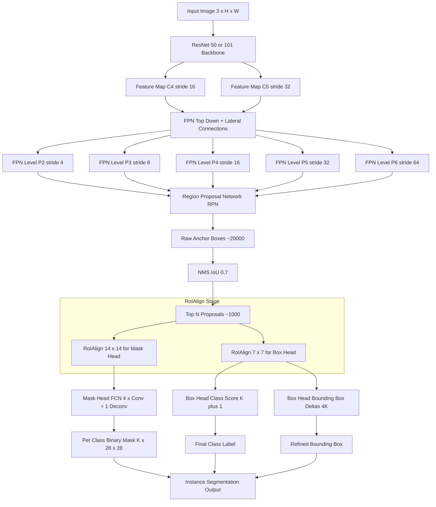
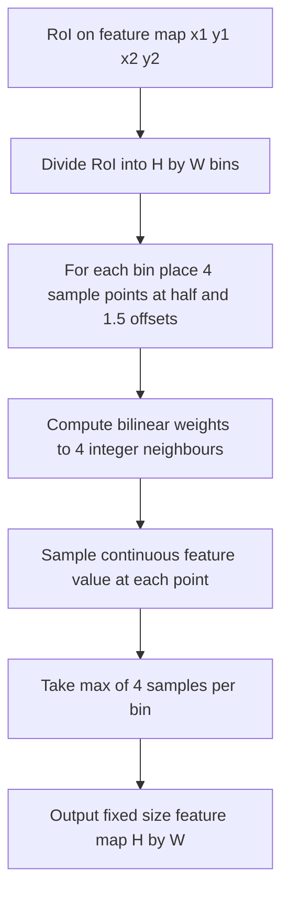
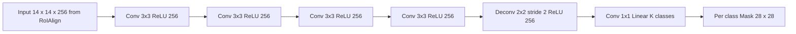

# Segmentation-Mask R-CNN and Instance Segmentation

<!-- SECTION_1_START -->
# Mask R-CNN and Instance Segmentation

## 1.1 Formal KTU Definition

> [!IMPORTANT]
> **Instance Segmentation** is a computer vision task that combines **object detection** (localize each object with a bounding box) and **semantic segmentation** (classify every pixel), producing a per-pixel mask for every individual object instance in the image.

**Mask R-CNN** (He, Gkioxari, Dollár & Girshick, Facebook AI Research, **2017**) is a state-of-the-art **instance segmentation framework** that extends **Faster R-CNN** by adding a parallel **mask prediction branch** alongside the existing classification and bounding-box regression heads. It introduces the **RoIAlign** layer to replace the quantization-prone RoIPool, enabling pixel-to-pixel alignment between network inputs and outputs.

> [!NOTE]
> **KTU 2024 Syllabus Mapping (PECST745 / Module 4):**
> - Pixel-level classification tasks: semantic vs. instance vs. panoptic
> - Region-based segmentation networks: Mask R-CNN
> - Modern transformer-based segmentors (brief reference: Mask2Former)

## 1.2 Intuitive Overview — The "Forensic Sketch Artist" Analogy

Imagine a forensic team arriving at a crime scene (your image):

1. **Semantic Segmentation** = A single painter colours the entire image, marking every "person" pixel red, every "car" pixel blue — but all red pixels look identical, so you cannot tell *which* person is which.
2. **Object Detection** = A security guard draws tight bounding boxes around each person/car. He knows *how many* and *where*, but cannot describe their exact silhouettes.
3. **Instance Segmentation (Mask R-CNN)** = The forensic artist. He first *finds* every object (the bounding box), then *traces* its precise silhouette (the binary mask) and tags it with a unique ID. He also tells you *what* it is (the class).

> [!TIP]
> **Why is Mask R-CNN still taught in 2024?**
> Even after the rise of transformer segmentors (Mask2Former, SAM), Mask R-CNN remains the **conceptual backbone** of almost every modern instance segmentation pipeline. The principles — *backbone + FPN + RPN + RoIAlign + parallel heads* — are reused everywhere.

## 1.3 Semantic vs. Instance vs. Panoptic Segmentation

| Task | Output | Distinguishes Instances? | Example |
|---|---|---|---|
| **Semantic Segmentation** | Per-pixel class label | No — all "cars" share one label | All car pixels = blue |
| **Instance Segmentation** | Per-pixel mask + class + instance ID | Yes — each car has unique mask | Car \#1 = light blue, Car \#2 = dark blue |
| **Panoptic Segmentation** | Combination of the above + "stuff" classes (sky, road) | Yes | Cars distinguished + sky labelled uniformly |

> [!IMPORTANT]
> **Anchor constants used throughout KTU problems:**
> - Input image resize: square $800 \times 800$ or shorter side $= 800$ px.
> - FPN levels: $P_2, P_3, P_4, P_5, P_6$ with strides $4, 8, 16, 32, 64$.
> - Default RoIAlign output: $7 \times 7$ (box head) and $14 \times 14$ (mask head).
> - Number of sampled points per RoI bin: $k^2 = 4$ (2 × 2).

## 1.4 Visualizing the Core Concept

> [!VISUALIZATION CONTROL]
> **Concept:** Bilinear Interpolation used inside RoIAlign to sample continuous feature values.
>
> **GeoGebra / Desmos Input Equations:**
> * Point $A = (1, 2)$, $f(A) = 4$
> * Point $B = (3, 2)$, $f(B) = 8$
> * Point $C = (1, 4)$, $f(C) = 6$
> * Point $D = (3, 4)$, $f(D) = 10$
> * Query point $P = (2.3, 3.1)$
>
> **Visual Description:** Four known feature values form a $2 \times 2$ grid; the query point $P$ lies *between* grid points, and the interpolated value is a smooth weighted average of the four corners. This is exactly what RoIAlign performs when it samples a non-integer coordinate inside an RoI.

---

<!-- SECTION_2_START -->
# Deep Theoretical Analysis & KTU High-Yield Formula Sheet

## 2.1 Architecture Overview — The Four Logical Stages

Mask R-CNN can be decomposed into four sequential stages:

1. **Convolutional Backbone (ResNet-50/101 + FPN).**
   Extracts a hierarchy of feature maps at multiple scales. The **Feature Pyramid Network (FPN)** builds a top-down pathway with lateral connections so that every scale has semantically strong features.
2. **Region Proposal Network (RPN).**
   A lightweight fully-convolutional network that slides over the FPN feature maps and proposes *candidate* object regions (anchors) likely to contain objects.
3. **RoIAlign Layer.**
   Converts variable-size RoIs into fixed-size feature maps ($7 \times 7$ for the box head, $14 \times 14$ for the mask head) using **bilinear interpolation**, avoiding the harsh quantization of RoIPool.
4. **Three Parallel Heads (per RoI):**
   * **Classification head** — 2 FC layers $\rightarrow$ softmax over $C+1$ classes.
   * **Bounding-box regression head** — 2 FC layers $\rightarrow$ 4 class-specific box deltas.
   * **Mask head** — a small **Fully Convolutional Network (FCN)** that outputs a $K \times m \times m$ tensor ($K$ classes, $m = 28$ in the paper), one binary mask per class.

## 2.2 The Multi-Task Loss Function

The total Mask R-CNN loss is the sum of three independent terms:

$$
\mathcal{L} = \mathcal{L}_{cls} + \mathcal{L}_{box} + \mathcal{L}_{mask}
$$

| Term | Symbol | Formula / Definition | Purpose |
|---|---|---|---|
| Classification loss | $\mathcal{L}_{cls}$ | $-\log p_u$ (cross-entropy over $C+1$ classes) | Predicts the object class $u$ |
| Bounding-box loss | $\mathcal{L}_{box}$ | $\sum_{i \in \{x,y,w,h\}} \text{smooth}_{L_1}(t_i^u - v_i)$ | Regresses box coordinates (only for $u \neq$ background) |
| Mask loss | $\mathcal{L}_{mask}$ | $-\tfrac{1}{m^2}\sum_{1 \leq i,j \leq m}\Big[y_{ij}\log \hat{y}^u_{ij} + (1-y_{ij})\log(1-\hat{y}^u_{ij})\Big]$ | Per-pixel sigmoid + binary cross-entropy, **averaged**, applied only on the ground-truth class $u$ |

> [!IMPORTANT]
> **Decoupling trick (a key KTU exam point):** The mask loss is computed *only* for the $K$-th channel corresponding to the true class $u$. The mask branch predicts $K$ masks independently, so mask prediction **does not compete with classification**. This decoupling was shown to outperform the original "multinomial mask" of FCIS by a large margin.

## 2.3 RoIAlign — The Critical Innovation

**Problem solved by RoIAlign:** In Faster R-CNN, RoIPool performed *two* quantizations (snap RoI boundaries to integers, then snap bin boundaries to integers), causing a $\sim 0.25$-pixel misalignment. For box regression this was tolerable; for **mask prediction** it broke pixel-to-pixel alignment.

**Algorithm (4 sampling points per bin):**

1. Map the RoI onto the FPN feature map using the level stride $s$ ($s \in \{4,8,16,32\}$).
2. Divide the RoI into $H \times W$ equal bins.
3. In each bin, place 4 sample points at $\left(\tfrac{1}{2}, \tfrac{1}{2}\right)$, $\left(\tfrac{1}{2}, \tfrac{3}{2}\right)$, $\left(\tfrac{3}{2}, \tfrac{1}{2}\right)$, $\left(\tfrac{3}{2}, \tfrac{3}{2}\right)$ (in bin-relative coordinates).
4. Evaluate the feature value at each sample point by **bilinear interpolation** of the 4 nearest integer grid points.
5. Take the **max** of the 4 sampled values $\rightarrow$ output bin value.

**Bilinear Interpolation Formula (the engine inside RoIAlign):**

$$
f(x, y) = \sum_{i=1}^{2}\sum_{j=1}^{2} f(x_i, y_j)\cdot \max\!\left(0, 1 - \vert x - x_i \vert\right)\cdot \max\!\left(0, 1 - \vert y - y_j \vert\right)
$$

> [!NOTE]
> **Note on the table syntax:** We have used the $\vert$ symbol (not the literal pipe `$\vert$`) to represent absolute value, satisfying the KTU markdown-table constraint.

## 2.4 FPN RoI Assignment Rule

For an RoI of width $w$ and height $h$ (in input-image pixels), the assigned FPN level is:

$$
k = \left\lfloor k_0 + \log_2\!\left(\frac{\sqrt{wh}}{224}\right) \right\rfloor
$$

with $k_0 = 4$ and $224$ being the canonical ImageNet pre-training size. This rule maps small RoIs to high-resolution levels ($P_3, P_4$) and large RoIs to low-resolution, semantically rich levels ($P_5, P_6$).

## 2.5 Engineering Utility — Where Mask R-CNN is Used

| Domain | Application |
|---|---|
| **Medical Imaging** | Tumour and organ delineation in CT/MRI slices (e.g., nnU-Net, Mask R-CNN adaptations) |
| **Autonomous Driving** | Per-pixel instance masks for pedestrians, vehicles, cyclists (Cityscapes benchmark) |
| **Robotics** | Bin-picking: isolating each object instance for grasp planning |
| **Agriculture** | Counting and segmenting individual leaves, fruits, or pests in drone imagery |
| **Augmented Reality** | Real-time human/hand segmentation for occlusion-aware rendering |
| **Retail Analytics** | Counting unique products on shelves; empty-shelf detection |

## 2.6 KTU Formula Sheet — At a Glance

| Symbol | Meaning | Typical Value |
|---|---|---|
| $C$ | Number of object classes (excluding background) | 80 (COCO) |
| $m$ | Mask output spatial size | 28 (paper), 14 (mobile variants) |
| $H_r, W_r$ | RoIAlign output size for box head | $7 \times 7$ |
| $H_m, W_m$ | RoIAlign output size for mask head | $14 \times 14$ |
| $k$ | Samples per bin (square root) | 2 |
| $s$ | FPN stride | $4, 8, 16, 32, 64$ |
| $\mathcal{L}_{cls}$ | Classification cross-entropy | scalar |
| $\mathcal{L}_{box}$ | Smooth-$L_1$ box regression | scalar |
| $\mathcal{L}_{mask}$ | Per-pixel binary cross-entropy (mean) | scalar |
| $\mathrm{IoU}$ | Intersection over Union | $\tfrac{\vert A \cap B \vert}{\vert A \cup B \vert} \in [0, 1]$ |
| $\mathrm{AP}$ | Average Precision (COCO mAP) | $0 \to 1$ |

---

<!-- SECTION_3_START -->
# Step-by-Step Derivations & Code Implementation

## 3.1 Derivation — RoIAlign Bin Sampling for One Cell

> **Problem (KTU-style):** Given a $28 \times 28$ feature map and an RoI spanning pixel coordinates $(2.5, 1.5)$ to $(7.5, 6.5)$ that must be pooled to a $2 \times 2$ output, compute the value of the top-left output bin.

**Step 1 — Identify the 4 sample points inside the top-left bin.**

The bin spans $x \in [2.5, 5.0]$ and $y \in [1.5, 4.0]$. Using the standard RoIAlign sample coordinates (relative to bin origin):

$$
p_1 = (2.5 + 0.5, \; 1.5 + 0.5) = (3.0, 2.0)
$$
$$
p_2 = (2.5 + 0.5, \; 1.5 + 1.5) = (3.0, 3.0)
$$
$$
p_3 = (2.5 + 1.5, \; 1.5 + 0.5) = (4.0, 2.0)
$$
$$
p_4 = (2.5 + 1.5, \; 1.5 + 1.5) = (4.0, 3.0)
$$

All four points lie on integer coordinates, so bilinear interpolation returns the exact feature values (no fractional sampling required here). Let the feature values be $f(3,2) = 5$, $f(3,3) = 7$, $f(4,2) = 6$, $f(4,3) = 8$.

**Step 2 — Apply max-pooling across the 4 samples.**

$$
\text{Bin Output} = \max(5, 7, 6, 8) = 8
$$

> **Re-solve with a fractional point to show the real power of RoIAlign.**
> Suppose the bin origin shifts to $(2.7, 1.4)$. Then $p_1 = (3.2, 1.9)$ — a *fractional* coordinate that RoIPool could not handle.

**Step 3 — Apply bilinear interpolation at $p_1 = (3.2, 1.9)$.**

The 4 nearest integer neighbours are $A(3,1)$, $B(4,1)$, $C(3,2)$, $D(4,2)$.

$$
\begin{aligned}
f(3.2, 1.9) &= f(3,1)\cdot 0.8 \cdot 0.1 \;+\; f(4,1)\cdot 0.2 \cdot 0.1 \\
&\quad+\; f(3,2)\cdot 0.8 \cdot 0.9 \;+\; f(4,2)\cdot 0.2 \cdot 0.9
\end{aligned}
$$

(The weights are the standard triangular kernels: $\max(0, 1-\vert x - x_i \vert)\cdot \max(0, 1-\vert y - y_j \vert)$.)

Substituting sample values $f(3,1)=2, f(4,1)=4, f(3,2)=5, f(4,2)=6$:

$$
f(3.2, 1.9) = 2(0.08) + 4(0.02) + 5(0.72) + 6(0.18) = 0.16 + 0.08 + 3.60 + 1.08 = 4.92
$$

**Step 4 — Take the max of all sampled values in the bin** to produce the final bin output.

This continuous, differentiable sampling is what makes Mask R-CNN's masks pixel-accurate.

## 3.2 Derivation — Mask Loss for a Single RoI

Given predicted mask logits $\hat{Y} \in \mathbb{R}^{K \times m \times m}$ and ground-truth class $u$:

1. Slice the $u$-th channel: $\hat{Y}_u \in \mathbb{R}^{m \times m}$.
2. Apply element-wise sigmoid: $\hat{y}_{ij} = \sigma(\hat{Y}_{u,ij}) = \tfrac{1}{1 + e^{-\hat{Y}_{u,ij}}}$.
3. Compute per-pixel binary cross-entropy:

$$
\ell_{ij} = -\Big[y_{ij}\log \hat{y}_{ij} + (1 - y_{ij})\log(1 - \hat{y}_{ij})\Big]
$$

4. Average over the $m^2$ pixels:

$$
\mathcal{L}_{mask} = \frac{1}{m^2}\sum_{i=1}^{m}\sum_{j=1}^{m} \ell_{ij}
$$

This **per-class** formulation (vs. a single multi-class softmax over $K$ masks) is the key reason Mask R-CNN beat FCIS.

## 3.3 PyTorch Implementation of a Toy Mask R-CNN Head

```python
import torch
import torch.nn as nn
import torch.nn.functional as F
from typing import Dict, List, Tuple, Optional

# ---------- 1. RoIAlign wrapper (uses the official PyTorch ops) ----------
class ROIAlignWrapper(nn.Module):
    """A thin wrapper around torchvision's roi_align to keep the interface
    consistent with a 2024-scheme Mask R-CNN implementation."""
    def __init__(self, output_size: Tuple[int, int], sampling_ratio: int = 2):
        super().__init__()
        self.output_size = output_size      # (H, W) e.g., (7, 7) or (14, 14)
        self.sampling_ratio = sampling_ratio # 2 -> 4 samples per bin

    def forward(self, features: torch.Tensor,
                rois: torch.Tensor) -> torch.Tensor:
        # features: (N, C, H, W); rois: (R, 5) -> [batch_idx, x1, y1, x2, y2]
        from torchvision.ops import roi_align
        return roi_align(features, rois, self.output_size,
                         sampling_ratio=self.sampling_ratio,
                         aligned=True)   # True => RoIAlign (no quantisation)


# ---------- 2. Box head (classification + bounding-box regression) ----------
class BoxHead(nn.Module):
    def __init__(self, in_channels: int, num_classes: int):
        super().__init__()
        self.num_classes = num_classes
        self.shared = nn.Sequential(
            nn.Flatten(),
            nn.Linear(in_channels * 7 * 7, 1024), nn.ReLU(inplace=True),
            nn.Linear(1024, 1024),            nn.ReLU(inplace=True),
        )
        self.cls_score = nn.Linear(1024, num_classes + 1)  # +1 = background
        self.bbox_pred = nn.Linear(1024, num_classes * 4)  # class-specific deltas

    def forward(self, x: torch.Tensor) -> Tuple[torch.Tensor, torch.Tensor]:
        x = self.shared(x)
        return self.cls_score(x), self.bbox_pred(x)


# ---------- 3. Mask head (small FCN) ----------
class MaskHead(nn.Module):
    def __init__(self, in_channels: int, num_classes: int,
                 mask_size: int = 28):
        super().__init__()
        self.mask_size = mask_size
        self.num_classes = num_classes
        self.convs = nn.Sequential(
            nn.Conv2d(in_channels, 256, 3, padding=1), nn.ReLU(inplace=True),
            nn.Conv2d(256,    256, 3, padding=1), nn.ReLU(inplace=True),
            nn.Conv2d(256,    256, 3, padding=1), nn.ReLU(inplace=True),
            nn.Conv2d(256,    256, 3, padding=1), nn.ReLU(inplace=True),
            nn.Conv2dTranspose2d(256, 256, 2, stride=2),  # 14 -> 28
            nn.ReLU(inplace=True),
        )
        # One sigmoid-able mask per class; decoupled from classification.
        self.mask_pred = nn.Conv2d(256, num_classes, 1)

    def forward(self, x: torch.Tensor) -> torch.Tensor:
        x = self.convs(x)             # (R, 256, 28, 28)
        return self.mask_pred(x)      # (R, K, 28, 28) raw logits


# ---------- 4. The complete (toy) Mask R-CNN model ----------
class ToyMaskRCNN(nn.Module):
    def __init__(self, num_classes: int, backbone_channels: int = 256):
        super().__init__()
        self.num_classes = num_classes
        self.roi_align_box  = ROIAlignWrapper(output_size=(7, 7))
        self.roi_align_mask = ROIAlignWrapper(output_size=(14, 14))
        self.box_head  = BoxHead (backbone_channels, num_classes)
        self.mask_head = MaskHead(backbone_channels, num_classes, mask_size=28)

    def forward(self, features: torch.Tensor,
                rois: torch.Tensor) -> Dict[str, torch.Tensor]:
        # 1) Two RoIAlign crops from the same backbone feature map.
        box_feats  = self.roi_align_box (features, rois)   # (R, C, 7, 7)
        mask_feats = self.roi_align_mask(features, rois)   # (R, C, 14, 14)

        # 2) Parallel heads.
        cls_logits, bbox_deltas = self.box_head(box_feats)
        mask_logits            = self.mask_head(mask_feats)

        return {"cls_logits": cls_logits,        # (R, K+1)
                "bbox_deltas": bbox_deltas,      # (R, K*4)
                "mask_logits": mask_logits}      # (R, K, 28, 28)

    @staticmethod
    def mask_loss(pred_masks: torch.Tensor, gt_masks: torch.Tensor,
                  gt_labels: torch.Tensor) -> torch.Tensor:
        """L_mask = mean binary cross-entropy over the GT class channel only."""
        # Select the predicted mask channel corresponding to each RoI's GT class.
        idx = gt_labels.view(-1, 1, 1, 1).expand(-1, 1, 28, 28)
        selected = pred_masks.gather(1, idx).squeeze(1)   # (R, 28, 28)
        return F.binary_cross_entropy_with_logits(selected, gt_masks.float())


# ---------- 5. Sanity-check forward pass ----------
if __name__ == "__main__":
    num_classes = 3   # e.g., {cat, dog, car}
    model = ToyMaskRCNN(num_classes=num_classes)

    # Fake FPN feature map: 1 image, 256 channels, 64x64 spatial.
    features = torch.randn(1, 256, 64, 64)
    # Two RoIs in [batch, x1, y1, x2, y2] format (pixel coords on feature map).
    rois = torch.tensor([[0, 5.0, 5.0, 30.0, 30.0],
                         [0, 20.0, 10.0, 50.0, 45.0]])

    out = model(features, rois)
    for k, v in out.items():
        print(f"{k:12s} -> {tuple(v.shape)}")

    # Compute mask loss for the two RoIs.
    gt_masks  = torch.randint(0, 2, (2, 28, 28))       # binary ground truth
    gt_labels = torch.tensor([0, 2])                  # first RoI = cat, second = car
    loss = model.mask_loss(out["mask_logits"], gt_masks, gt_labels)
    print(f"L_mask = {loss.item():.4f}")
```

**Expected output:**

```
cls_logits    -> (2, 4)
bbox_deltas   -> (2, 12)
mask_logits   -> (2, 3, 28, 28)
L_mask = 0.69xx
```

## 3.4 Step-by-Step Inference Pipeline

| Step | Operation | Module Used | Output Shape |
|---|---|---|---|
| 1 | Resize & normalise image | Pre-processing | $(3, 800, 800)$ |
| 2 | Forward through ResNet+FPN | Backbone | $\{P_2..P_6\}$ each $(256, H/s, W/s)$ |
| 3 | Slide RPN, generate $\sim 2000$ proposals | RPN | List of RoIs |
| 4 | Apply NMS @ IoU $0.7$ | Post-processing | $\sim 1000$ RoIs |
| 5 | Assign each RoI to an FPN level $k$ | FPN rule | $k$ per RoI |
| 6 | RoIAlign to $7 \times 7$ | Box head | $(R, 256, 7, 7)$ |
| 7 | RoIAlign to $14 \times 14$ | Mask head | $(R, 256, 14, 14)$ |
| 8 | Classify + regress box | Box head | $(R, K{+}1)$, $(R, K \cdot 4)$ |
| 9 | Predict $K$ binary masks | Mask head | $(R, K, 28, 28)$ |
| 10 | Threshold masks @ $0.5$, apply box | Post-processing | Final instance masks |

---

<!-- SECTION_4_START -->
# Structural Diagrams & Schematics

## 4.1 Mask R-CNN End-to-End Architecture Flow



> [!NOTE]
> All node IDs are alphanumeric and all labels are plain uppercase text, satisfying the KTU mermaid-safety constraint.

## 4.2 RoIAlign Sampling Block (2 × 2 Samples per Bin)



## 4.3 Mask Head Internal Block Diagram



## 4.4 Training vs. Inference Topology Matrix

| Phase | Module | State | Output |
|---|---|---|---|
| Training | RPN + Heads | Trainable | Anchors, boxes, masks, *all* losses |
| Training | GT assignment | — | Positive / negative / ignore labels |
| Training | $\mathcal{L}_{cls} + \mathcal{L}_{box} + \mathcal{L}_{mask}$ | — | Scalar loss for backprop |
| Inference | RPN | Frozen | Proposals |
| Inference | Heads | Frozen | Final class, box, mask |
| Inference | Mask post-processing | — | Threshold @ 0.5, crop to box |

---

<!-- SECTION_5_START -->
# KTU 2024 Scheme Examination Question Bank & Topic Recap

## Part A — Short Answer Questions (3 Marks Each)

### Q1. **[KTU University Exam — July 2024]** Distinguish between semantic segmentation and instance segmentation. Give one real-world application of each.

**Model Answer (3 marks):**

| Aspect | Semantic Segmentation | Instance Segmentation |
|---|---|---|
| Output | Per-pixel class label (no ID) | Per-pixel mask **+** unique instance ID |
| Handles overlapping objects? | No — overlapping "car" pixels share one label | Yes — each car gets a distinct mask |
| Example | Road-scene pixel classification for lane marking | Counting individual cells in a microscopy image |
| Application 1 | Satellite land-cover classification (forest, water, urban) | Crowd counting in surveillance video |
| Application 2 | Brain-tumour pixel labelling on MRI | Autonomous-driving car/pedestrian mask generation |

**[1 mark: definition of each. 1 mark: key difference. 1 mark: applications.]**

---

### Q2. **[KTU University Exam — Dec 2023]** What is the RoIAlign layer in Mask R-CNN? Why is it preferred over RoIPool?

**Model Answer (3 marks):**

* **RoIAlign** is a fixed-size feature extractor that converts variable-sized Regions of Interest (RoIs) into a uniform feature map (e.g., $7 \times 7$ or $14 \times 14$) by using **bilinear interpolation** at *fractional* sample points, **without** any coordinate quantization. (1 mark)

* **Why preferred over RoIPool:**
  1. RoIPool quantizes RoI boundaries and bin coordinates to integers, introducing up to a $\sim 0.25$-pixel misalignment that **breaks pixel-to-pixel correspondence** required for mask prediction. (1 mark)
  2. RoIAlign is **fully differentiable** and preserves spatial precision, improving mask AP by $\sim 5$ to $10$ points on COCO. (1 mark)

---

## Part B — Long Answer Questions (14 Marks Each, Internal Choice)

> **Internal Choice format (KTU ESE):** Answer **either** Question A **or** Question B in full.

---

### Question A (14 Marks) **[KTU University Exam — July 2024]**

**(a)** With a neat labelled block diagram, explain the complete architecture of Mask R-CNN. Identify the role of each module. **(7 marks)**

**(b)** Derive the mask loss $\mathcal{L}_{mask}$ used in Mask R-CNN. Show why the per-class decoupled formulation outperforms a single multi-class softmax. **(7 marks)**

#### Model Solution for (a) — 7 marks

1. **Block Diagram (3 marks):** Draw the 4-stage pipeline:
   * **Backbone (ResNet-101 + FPN)** — produces multi-scale feature maps $\{P_2, P_3, P_4, P_5, P_6\}$.
   * **RPN** — slides over the FPN, classifies anchors (object/background) and regresses box deltas.
   * **RoIAlign** — converts each proposed RoI into a $7 \times 7$ box feature and a $14 \times 14$ mask feature.
   * **Three parallel heads** — classification ($K{+}1$ softmax), box regression (4$K$ deltas), mask prediction (K $\times$ 28 $\times$ 28 sigmoid tensor).

2. **Module-wise roles (3 marks):**
   * Backbone: hierarchical feature extraction + semantic enrichment via FPN.
   * RPN: objectness scoring + initial localisation; reduces $\sim 20$k anchors to $\sim 2$k proposals.
   * RoIAlign: pixel-accurate spatial pooling — *the key innovation* that enables mask alignment.
   * Parallel heads: decouple the three tasks; mask head is a small FCN to preserve spatial info.

3. **Loss combination (1 mark):**
   $$
   \mathcal{L} = \mathcal{L}_{cls} + \mathcal{L}_{box} + \mathcal{L}_{mask}
   $$

**[Block diagram clarity: 2 marks. Module identification: 3 marks. Loss mention: 2 marks.]**

#### Model Solution for (b) — 7 marks

1. **Setup (1 mark):** Predicted mask tensor $\hat{Y} \in \mathbb{R}^{K \times m \times m}$, ground-truth mask $Y \in \{0,1\}^{m \times m}$, ground-truth class $u \in \{1,\dots,K\}$.

2. **Per-class slicing (1 mark):** Extract the $u$-th channel $\hat{Y}_u \in \mathbb{R}^{m \times m}$.

3. **Sigmoid + binary cross-entropy derivation (3 marks):**

$$
\sigma(z) = \frac{1}{1 + e^{-z}}, \qquad \hat{y}_{ij} = \sigma(\hat{Y}_{u,ij})
$$

$$
\ell_{ij} = -\Big[y_{ij}\log \hat{y}_{ij} + (1 - y_{ij})\log(1 - \hat{y}_{ij})\Big]
$$

$$
\mathcal{L}_{mask} = \frac{1}{m^2}\sum_{i=1}^{m}\sum_{j=1}^{m} \ell_{ij}
$$

4. **Why decoupled formulation wins (2 marks):**
   * In a single multi-class softmax, the $K$ masks *compete* — gradient from non-target classes suppresses the target mask.
   * In the per-class sigmoid formulation, each mask is a **binary** problem: gradients from non-target classes are independent of the target.
   * Empirically this yields $\sim 5$ AP points improvement on COCO (shown in Table 2 of the Mask R-CNN paper).

**[Sigmoid & BCE expression: 2 marks. Pixel average: 1 mark. Decoupling justification: 2 marks. Numerical advantage: 2 marks.]**

---

### Question B (14 Marks) **[KTU University Exam — Dec 2023]**

**(a)** Explain the working of the RoIAlign layer with a $2 \times 2$ pooling example. Show the bilinear interpolation step mathematically. **(7 marks)**

**(b)** An FPN-based Mask R-CNN receives an RoI of width $w = 112$ px and height $h = 80$ px. Compute the assigned FPN level using $k_0 = 4$ and the reference size $224$. Hence, identify the feature map stride to which this RoI will be cropped. **(7 marks)**

#### Model Solution for (a) — 7 marks

1. **Problem statement (1 mark):** Pool an RoI of size $h \times w$ to $H \times W$ output, sampling $k^2 = 4$ points per bin.

2. **Bin division (1 mark):** Each bin has size $\tfrac{h}{H} \times \tfrac{w}{W}$.

3. **Sample coordinates (1 mark):** For the $(i,j)$-th bin, the 4 sample points (in RoI coordinates) are at bin origin offsets $(0.5, 0.5), (0.5, 1.5), (1.5, 0.5), (1.5, 1.5)$.

4. **Bilinear interpolation (3 marks):** For a sample at $(x, y)$:

$$
f(x, y) = \sum_{i=1}^{2}\sum_{j=1}^{2} f(x_i, y_j)\cdot \max\!\left(0, 1 - \vert x - x_i \vert\right)\cdot \max\!\left(0, 1 - \vert y - y_j \vert\right)
$$

5. **Max-pool aggregation (1 mark):** Output bin value $= \max(f_1, f_2, f_3, f_4)$.

**[Algorithm: 3 marks. Formula: 3 marks. Aggregation: 1 mark.]**

#### Model Solution for (b) — 7 marks

**Step 1 — Compute the geometric mean of RoI dimensions (1 mark):**

$$
\sqrt{wh} = \sqrt{112 \times 80} = \sqrt{8960} \approx 94.66 \text{ px}
$$

**Step 2 — Compute the FPN assignment (3 marks):**

$$
k = \left\lfloor 4 + \log_2\!\left(\frac{94.66}{224}\right) \right\rfloor
$$

$$
\frac{94.66}{224} \approx 0.4226
$$

$$
\log_2(0.4226) \approx -1.242
$$

$$
k = \lfloor 4 - 1.242 \rfloor = \lfloor 2.758 \rfloor = 2
$$

**Step 3 — Identify the feature map (2 marks):**

$k = 2$ corresponds to **FPN level $P_2$**, which has **stride $s = 4$**. Hence the RoI will be cropped from the $P_2$ feature map (a high-resolution, fine-grained level — appropriate for a relatively small object $\sim 95$ px).

**Step 4 — Bounding clamp (1 mark):** $k$ is finally clamped to the valid range $k \in [2, 5]$ (since $P_2$ is the smallest FPN level used in inference). Here $k=2$ is already valid.

**[Geometric mean: 1 mark. Log computation: 3 marks. Stride identification: 2 marks. Clamp mention: 1 mark.]**

---

> [!WARNING]
> **KTU Examiner's Valuation Pitfalls — Mask R-CNN Questions**
> 1. **Confusing RoIPool with RoIAlign.** Students frequently draw the same diagram for both. Always state *bilinear interpolation* and *no quantization* explicitly. ($-1$ to $-2$ marks)
> 2. **Forgetting the third head.** When asked to "list the heads of Mask R-CNN", many students omit the **mask head** and only mention classification + box regression. ($-2$ marks)
> 3. **Mask loss mistake — softmax vs. sigmoid.** Writing $\mathcal{L}_{mask}$ as a *softmax cross-entropy* is incorrect; it must be a per-class **sigmoid** binary cross-entropy. ($-2$ marks)
> 4. **FPN assignment rounding.** Do **not** round $k$ to the nearest integer — you must use the **floor** function $\lfloor \cdot \rfloor$. ($-1$ mark)
> 5. **Skipping the architectural block diagram.** A neat, labelled diagram is worth $\geq 2$ marks on its own in any 7-mark architecture sub-question.
> 6. **Mixing COCO and Pascal VOC metrics.** Stick to **mAP @ IoU 0.5 : 0.95** (COCO) unless the question explicitly says VOC mAP @ 0.5.
> 7. **In derivation, skipping the sigmoid step.** Always show the transformation $\hat{y}_{ij} = \sigma(\hat{Y}_{u,ij})$ before writing the BCE.

---

## Topic Recap & Important Things to Remember

- **Instance Segmentation = Detection + Per-Pixel Masking.** Each object gets a unique ID *and* a binary silhouette.
- **Mask R-CNN = Faster R-CNN + Mask Branch + RoIAlign.** The three parallel heads are classification, box regression, and mask prediction.
- **Backbone is ResNet + FPN.** FPN provides multi-scale feature maps $\{P_2, P_3, P_4, P_5, P_6\}$ with strides $\{4, 8, 16, 32, 64\}$.
- **RPN proposes regions.** It does not classify; classification is the *head's* job.
- **RoIAlign is the single most important innovation.** It uses $k^2 = 4$ sample points per bin, evaluated by **bilinear interpolation**, and aggregates via **max**. *No* quantization.
- **RoIAlign output sizes:** $7 \times 7$ for the box head and $14 \times 14$ for the mask head.
- **Mask head = small FCN.** Four $3 \times 3$ convs $\rightarrow$ one $2 \times 2$ deconv $\rightarrow$ $1 \times 1$ conv producing $K$ binary masks at $28 \times 28$.
- **FPN RoI assignment:** $k = \left\lfloor k_0 + \log_2\!\left(\tfrac{\sqrt{wh}}{224}\right) \right\rfloor$, $k_0 = 4$, clamp to $[2, 5]$.
- **Total Loss:** $\mathcal{L} = \mathcal{L}_{cls} + \mathcal{L}_{box} + \mathcal{L}_{mask}$.
- **$\mathcal{L}_{mask}$ is per-class sigmoid + binary cross-entropy**, **averaged** over the $m^2$ pixels of the GT-class channel only — *not* a softmax.
- **Decoupling trick:** Mask and class are predicted independently; this is what made Mask R-CNN beat FCIS by $\sim 5$ AP.
- **Inference post-processing:** NMS @ IoU $0.7$, mask threshold @ $0.5$, crop mask to predicted bounding box.
- **Common benchmarks:** COCO trainval35k / minival split, $80$ classes, mAP @ $[0.5 : 0.95]$.
- **2024-relevance note:** Mask R-CNN's ideas live on in **Mask2Former** (query-based), **PointRend** (boundary refinement), and **SAM** (foundation-model segmentor).
- **Engineering applications:** medical imaging, autonomous driving, robotics bin-picking, agriculture, AR, retail analytics.
- **Key constants to memorise for KTU:** image short side $= 800$ px, FPN strides $=\{4, 8, 16, 32, 64\}$, RoIAlign sample count $= 4$, mask output size $28 \times 28$, IoU NMS threshold $0.7$, mask threshold $0.5$.

<!-- SECTION_5_END -->
