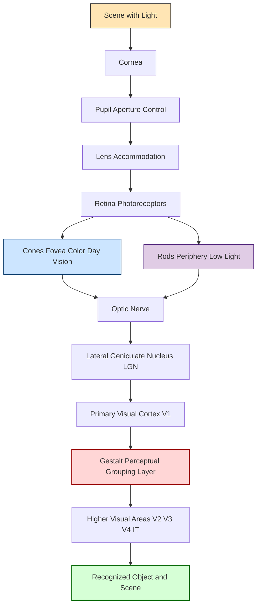
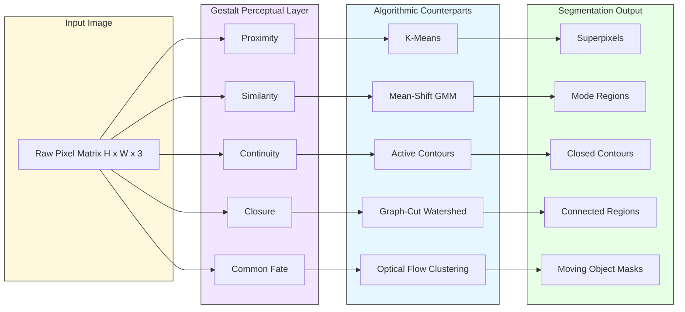
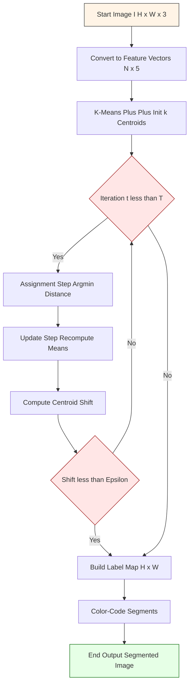
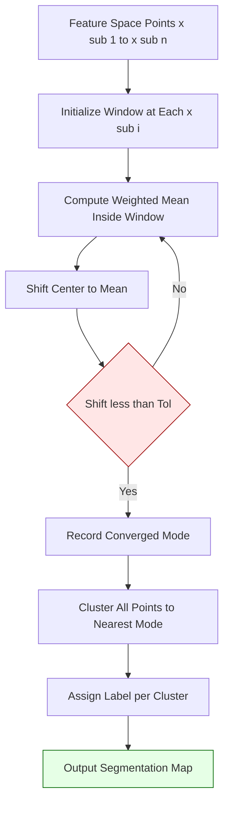
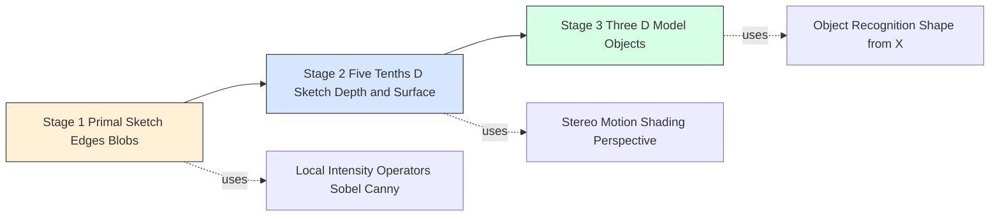
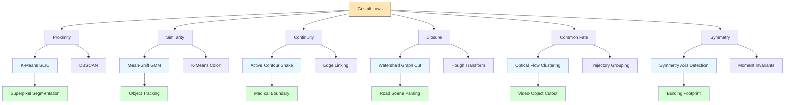

# Segmentation Using Clustering Methods - Human vision- Grouping and Gestalt

<!-- SECTION_1_START -->
# Segmentation Using Clustering Methods — Human Vision, Grouping & Gestalt

> [!NOTE]
> **Module 4 — Segmentation and Object Detection (PECST745)**
> This note covers the perceptual and computational foundations of image segmentation, beginning with how the human visual system organizes raw light information into meaningful groups, and then linking those perceptual laws to mathematical clustering algorithms used in computer vision.

## 1.1 What is Image Segmentation?

Image segmentation is the process of partitioning a digital image into multiple meaningful regions (sets of pixels) such that pixels belonging to the same region share similar visual characteristics (intensity, color, texture) while pixels in different regions are dissimilar. The objective is to simplify and/or change the representation of an image into something that is more meaningful and easier to analyze.

> [!IMPORTANT]
> **Formal KTU Definition (Gonzalez & Woods):**
> Segmentation subdivides an image $R$ into $n$ non-overlapping regions $R_1, R_2, \dots, R_n$ such that:
> 1. $\bigcup_{i=1}^{n} R_i = R$ (Complete coverage)
> 2. $R_i \cap R_j = \emptyset$ for $i \neq j$ (Disjoint regions)
> 3. $P(R_i) = \text{True}$ for all $i = 1, 2, \dots, n$ (Predicate satisfied within a region)
> 4. $P(R_i \cup R_j) = \text{False}$ for $i \neq j$ (Adjacent regions differ in predicate)

The predicate $P$ is a logical condition on pixel values (e.g., $P(R_i) = $ "all pixels in $R_i$ have gray-level intensity between $80$ and $120$").

## 1.2 Human Visual System — The Starting Point

Before we program a machine to "see" regions, it is essential to understand how the human visual system (HVS) achieves this effortlessly. The human eye is a sophisticated optical instrument whose performance far exceeds most artificial systems.

### 1.2.1 Optical Anatomy of the Eye

| Optical Component | Biological Counterpart | Function |
|---|---|---|
| Cornea | Front transparent layer | Refracts incoming light, provides $2/3$ of total focusing power |
| Pupil | Variable aperture ($2$–$8$ mm) | Controls light intensity entering the eye |
| Iris | Pigmented muscular ring | Adjusts pupil diameter via dilator and sphincter muscles |
| Lens | Biconvex, variable shape | Fine-tunes focus via **accommodation** |
| Retina | Photoreceptor surface | Converts light into neural electrical signals |

> [!IMPORTANT]
> **Photoreceptor Distribution (Critical for Segmentation Theory):**
> The retina contains two types of photoreceptors whose spatial distribution directly influences human perception of edges and regions:
> - **Cones ($\approx 6$–$7$ million):** Concentrated in the **fovea centralis**; enable **photopic (daylight) vision**; responsible for high-acuity color vision via three types (S, M, L) with peak sensitivities near $\mathbf{420\,nm}$, $\mathbf{534\,nm}$, and $\mathbf{564\,nm}$.
> - **Rods ($\approx 75$–$150$ million):** Distributed across peripheral retina; enable **scotopic (low-light) vision**; provide only low-resolution grayscale information.

### 1.2.2 Image Formation Geometry

The human eye can be modelled as a single-lens camera with focal length $f \approx 14$–$17$ mm. The relationship between object distance $o$, image distance $i$, and focal length $f$ is given by the thin-lens equation:

$$
\frac{1}{o} + \frac{1}{i} = \frac{1}{f}
$$

The perceived size of an object on the retina is governed by the visual angle $\theta$:

$$
\theta \approx \frac{h}{d} \quad \text{(in radians, for small angles)}
$$

where $h$ is the object height and $d$ is the distance from the observer. This same $\theta$-based projection explains why distant parallel lines appear to converge — the basis for our Gestalt law of **perspective / convergence**.

## 1.3 Intuitive Overview — Why Does Grouping Matter?

> [!NOTE]
> **Conceptual Analogy — The "Jigsaw Intuition"**
> Imagine you receive a $1\,000$-piece jigsaw puzzle scattered on a table. Even before assembling it, your brain instantly starts grouping pieces that share *the same shade of blue*, *pieces whose edges are nearly straight and could connect*, and *pieces forming a corner-like pattern*. You do not consciously analyze each pixel; you rely on **Gestalt grouping cues**.
>
> Computer vision segmentation algorithms attempt to mimic this grouping: pixels with similar color/intensity are clustered, pixels that form a smooth continuous boundary are linked, and pixels that together resemble a closed contour are merged.

The HVS is, in essence, a continuous, massively parallel *segmentation engine* that operates in roughly $150$ ms per scene. The Gestalt psychologists (Wertheimer, Köhler, Koffka — early 20th century) formalized the rules the brain uses to organize sensory input.

> [!VISUALIZATION CONTROL]
> **Concept:** Gestalt Law of Proximity on a 2D Dot Grid
> **GeoGebra / Desmos Input Equations:**
> * Define two horizontal rows of $6$ points each:
>   * Row 1 (close grouping): $\{(x, 0.5) \mid x = 0.5, 1.0, 1.5, 2.0, 2.5, 3.0\}$
>   * Row 2 (far grouping): $\{(x, 1.5) \mid x = 0.5, 1.8, 3.1, 3.4, 5.7, 6.0\}$
> * Add visual cluster halos: $\text{List1}=\{(x-0.5)^2 + (y-0.5)^2 \le 0.5\}$ for each point in Row 1.
> **Visual Description:** The student should observe that Row 1 dots are perceived as a single horizontal line of six elements, while Row 2 dots are perceived as three distinct pairs — demonstrating proximity-based grouping.

## 1.4 The Three-Stage Perceptual Model (Marr's Paradigm)

David Marr's computational theory of vision provides the canonical three-stage pipeline that links raw retinal input to scene understanding, and that directly parallels modern computer vision:

| Stage | Name | Representation | Segmentation Role |
|---|---|---|---|
| 1 | **Primal Sketch** | Edge fragments, bars, blobs, terminations | Local intensity discontinuities (edges) |
| 2 | **2.5-D Sketch** | Depth and surface orientation maps | Region boundaries from depth discontinuities |
| 3 | **3-D Model** | Volumetric, object-centered representation | Recognized objects as grouped units |

> [!IMPORTANT]
> **KTU High-Yield Fact:** Marr's theory is explicitly mentioned in the PECST745 syllabus under "human vision and perceptual grouping." Any exam question on segmentation theory expects you to reference Marr's stages.

## 1.5 Why Computers Struggle with What Humans Find Easy

The human brain performs **perceptual organization** automatically. Computers, in contrast, see an image only as a matrix $I \in \mathbb{R}^{H \times W \times C}$ of numbers. Without explicit grouping rules, a computer cannot tell that a circle of pixels "belongs together." This gap motivates:

1. **Emulating Gestalt laws** algorithmically (proximity graphs, closure detectors).
2. **Using clustering** to group pixels by feature similarity (k-means, mean-shift, DBSCAN).
3. **Combining both** in modern approaches (e.g., superpixels via SLIC, which embeds Gestalt proximity in its search radius).

<!-- SECTION_1_END -->

<!-- SECTION_2_START -->
# Deep Theoretical Analysis & KTU High-Yield Formula Sheet

## 2.1 The Gestalt Principles (Wertheimer, 1923)

The German word *Gestalt* roughly translates to "form," "shape," or "unified whole." The core premise of Gestalt psychology is the **Law of Prägnanz**: *"We tend to perceive ambiguous or complex images in their simplest form."* From this overarching principle, several specific grouping laws are derived — each of which has a direct algorithmic counterpart in computer vision.

> [!IMPORTANT]
> **Mnemonic for KTU Exams — "P-S-C-C-S-F-C-P"** (Proximity, Similarity, Closure, Continuity, Symmetry, Familiarity, Common Fate, Past Experience).

### 2.1.1 The Eight Gestalt Laws — Definitions and Computational Mappings

| # | Gestalt Law | Psychological Statement | Mathematical / Algorithmic Equivalent | Computer Vision Use Case |
|---|---|---|---|---|
| 1 | **Proximity** | Elements close together are perceived as a group | Distance threshold $\Vert p_i - p_j \Vert < \epsilon$ defines a link in a proximity graph | Superpixel generation (SLIC), DBSCAN clustering |
| 2 | **Similarity** | Elements with similar features (color, brightness) are grouped | Feature-space distance $d(f(p_i), f(p_j)) < \delta$ in k-means, mean-shift | Color-based segmentation, k-means in RGB/Lab space |
| 3 | **Continuity** | We perceive smooth, continuous contours over abrupt ones | Curve-fitting via least-squares, active contour models (snakes) | Edge linking, contour tracing |
| 4 | **Closure** | We complete incomplete figures to perceive a whole shape | Graph-cycle detection, Hough transform for closed shapes | Object detection, ellipse/circle fitting |
| 5 | **Symmetry** | Symmetrical regions are perceived as belonging together | Symmetry-axis detection, moment-based descriptors | Object recognition, medical image analysis |
| 6 | **Common Fate** | Elements moving in the same direction are grouped | Optical flow clustering, trajectory grouping (t-SNE on flow) | Video segmentation, motion-based grouping |
| 7 | **Familiarity / Past Experience** | We group based on prior knowledge | Bayesian inference, CNN-based segmentation (U-Net) | Semantic segmentation, instance segmentation |
| 8 | **Common Region** | Elements within the same bounded region are grouped | Connected-component labeling, watershed transform | Region-based segmentation |

### 2.1.2 Gestalt Inference in Computer Vision

The mathematical formalization of Gestalt grouping is typically expressed as the **inference of boundaries** between regions. Given a set of features $\mathcal{F} = \{f_1, f_2, \dots, f_N\}$ (edges, brightness gradients, etc.), a Gestalt grouping assigns a probability that two features $f_i$ and $f_j$ belong to the same perceptual group:

$$
P(\text{group} \mid f_i, f_j) \propto \exp\!\left(-\frac{d(f_i, f_j)^2}{2\sigma^2}\right)
$$

where $d(f_i, f_j)$ is a distance function combining Euclidean separation, feature similarity, and curvature smoothness, and $\sigma$ is a scale parameter.

## 2.2 KTU Formula Sheet — Essential Equations

> [!IMPORTANT]
> **CRITICAL FORMATTING RULE:** All absolute values, norms, and set-builder notation use `\vert` or `\Vert` inside tables to avoid breaking the markdown pipe syntax.

| # | Concept | Formula | Notation / Units |
|---|---|---|---|
| 1 | Thin-lens (eye) | $\dfrac{1}{o} + \dfrac{1}{i} = \dfrac{1}{f}$ | $o,i,f$ in metres |
| 2 | Visual angle | $\theta \approx \dfrac{h}{d}$ | $\theta$ in radians |
| 3 | Gestalt affinity (prox+sim) | $A_{ij} = \exp\!\left(-\dfrac{\Vert p_i - p_j \Vert^{2}}{2\sigma_{d}^{2}} - \dfrac{\Vert f_i - f_j \Vert^{2}}{2\sigma_{f}^{2}}\right)$ | $A_{ij} \in [0,1]$ |
| 4 | K-means objective | $J = \displaystyle\sum_{i=1}^{k}\sum_{x \in C_i} \Vert x - \mu_i \Vert^{2}$ | $J$ is minimized; $\mu_i$ is centroid of cluster $C_i$ |
| 5 | K-means centroid update | $\mu_i = \dfrac{1}{\vert C_i \vert}\displaystyle\sum_{x \in C_i} x$ | $\vert C_i \vert$ = cardinality of cluster |
| 6 | Mean-shift vector | $m(x) = \dfrac{\sum_{i} x_i \, g\!\left(\Vert \tfrac{x - x_i}{h} \Vert^{2}\right)}{\sum_{i} g\!\left(\Vert \tfrac{x - x_i}{h} \Vert^{2}\right)} - x$ | $g(\cdot)$ is a kernel, $h$ is bandwidth |
| 7 | Silhouette score | $s(i) = \dfrac{b(i) - a(i)}{\max\{a(i), b(i)\}}$ | $s \in [-1,1]$; higher is better |
| 8 | Within-cluster sum of squares (WCSS) | $WCSS = \displaystyle\sum_{i=1}^{k}\sum_{x \in C_i} \Vert x - \mu_i \Vert^{2}$ | Used to choose $k$ via elbow method |
| 9 | Connected components | Label $L(p)$ satisfies $L(p) = L(q)$ iff $p,q$ in same 4-/8-connected region | Integer labels |
| 10 | Watershed immersion depth | $d(p) = \min_{q \in \text{regional min}} h(p,q)$ | $h$ = height of flooding path |

## 2.3 Theoretical Connection — Gestalt Laws $\leftrightarrow$ Clustering Algorithms

This is the most important conceptual bridge for the KTU exam. Each Gestalt law has a direct algorithmic counterpart:

### 2.3.1 Proximity $\leftrightarrow$ K-Means & DBSCAN

- **Gestalt observation:** Dots that are spatially close are perceived as a group.
- **Algorithm:** K-means minimizes the sum of squared Euclidean distances from each pixel to its assigned cluster centroid. Proximity is the *primary* grouping criterion.
- **Algorithmic flow:** (1) Initialize $k$ centroids; (2) Assign each pixel to nearest centroid; (3) Update centroids as cluster means; (4) Repeat until convergence.

### 2.3.2 Similarity $\leftrightarrow$ Mean-Shift & GMM

- **Gestalt observation:** Pixels with similar color or texture are grouped.
- **Algorithm:** Mean-shift iterates a kernel-based gradient ascent toward the densest region of feature space. Pixels with similar features climb to the same mode and are grouped.
- **Algorithmic flow:** (1) For each pixel, place a window of radius $h$; (2) Compute the mean of all pixels inside the window (weighted by kernel); (3) Shift window to the new mean; (4) Merge windows that converge to the same mode.

### 2.3.3 Closure $\leftrightarrow$ Graph-Cut & Watershed

- **Gestalt observation:** The mind "closes" incomplete contours.
- **Algorithm:** The watershed transform treats the image as a topographic surface (intensity = elevation) and floods from regional minima; closed ridges (watershed lines) form the segmented boundaries.

### 2.3.4 Common Fate $\leftrightarrow$ Optical-Flow Clustering

- **Gestalt observation:** Pixels moving together are grouped.
- **Algorithm:** Compute dense optical flow (Farneback or Lucas-Kanade), then cluster the 2D flow vectors to segment moving objects.

## 2.4 Real-World Engineering Utility

| Domain | Segmentation Task | Gestalt Law Exploited |
|---|---|---|
| **Medical Imaging** | Tumour boundary delineation in MRI/CT | Closure + Similarity |
| **Autonomous Driving** | Road, lane, pedestrian segmentation | Continuity + Common Fate |
| **Satellite Imagery** | Building footprint extraction | Closure + Symmetry |
| **Industrial Inspection** | Defect detection on assembly lines | Similarity + Proximity |
| **Video Surveillance** | Foreground/background separation | Common Fate |
| **Augmented Reality** | Object masking for compositing | Familiarity (deep learning) |
| **Agricultural Robotics** | Crop vs. weed segmentation | Similarity in color space |
| **Document Analysis** | Text line/word segmentation | Proximity + Continuity |

## 2.5 Perceptual Grouping Failure Cases (Why Computers Need Algorithms)

The HVS is not perfect. Several illusions reveal the limits of Gestalt grouping:

1. **Kanizsa Triangle:** Subjective contours emerge from "illusory" edges — the brain *invents* boundaries. Computers, lacking this prior, would not detect such edges without explicit closure detectors.
2. **Ebbinghaus Illusion:** Two identical circles appear different sizes based on surrounding context — proves that grouping affects even low-level size perception.
3. **Müller-Lyer Illusion:** Line length perception is biased by arrow direction — shows that grouping with surrounding context overrides raw metric perception.

> [!NOTE]
> **Engineering takeaway:** A purely local algorithm (e.g., thresholding) will fail on these illusions, whereas a global algorithm (e.g., graph-cut) that encodes Gestalt-like constraints can succeed.

<!-- SECTION_2_END -->

<!-- SECTION_3_START -->
# Step-by-Step Derivations, Algorithmic Walkthroughs & Code Implementation

## 3.1 Derivation: K-Means Convergence Bound

The K-means algorithm minimizes the within-cluster sum of squares (WCSS):

$$
J(\mathcal{C}, \boldsymbol{\mu}) = \sum_{i=1}^{k} \sum_{x \in C_i} \Vert x - \mu_i \Vert^{2}
$$

### 3.1.1 Closed-Form Centroid Update (Derivation)

We derive the optimal centroid $\mu_i^{*}$ that minimizes $J$ for a *fixed* assignment $C_i$.

**Step 1 — Set up the minimization:**
For a fixed cluster $C_i$ containing $n_i = \vert C_i \vert$ points $\{x_1, x_2, \dots, x_{n_i}\}$, the partial objective is:

$$
J_i(\mu_i) = \sum_{j=1}^{n_i} \Vert x_j - \mu_i \Vert^{2}
$$

**Step 2 — Expand the squared norm using the identity** $\Vert a - b \Vert^{2} = (a-b)^{\top}(a-b)$:

$$
J_i(\mu_i) = \sum_{j=1}^{n_i} (x_j - \mu_i)^{\top}(x_j - \mu_i) = \sum_{j=1}^{n_i} \left( x_j^{\top} x_j - 2 \mu_i^{\top} x_j + \mu_i^{\top} \mu_i \right)
$$

**Step 3 — Differentiate with respect to $\mu_i$ and set to zero:**

$$
\frac{\partial J_i}{\partial \mu_i} = \sum_{j=1}^{n_i} \left( -2 x_j + 2 \mu_i \right) = 0
$$

**Step 4 — Solve for $\mu_i$:**

$$
\sum_{j=1}^{n_i} x_j = n_i \, \mu_i \quad \Longrightarrow \quad \mu_i^{*} = \frac{1}{n_i} \sum_{j=1}^{n_i} x_j
$$

This is exactly the **arithmetic mean** of the points in the cluster.

**Step 5 — Substitute back to obtain the minimum value of $J_i$:**

$$
J_i(\mu_i^{*}) = \sum_{j=1}^{n_i} \Vert x_j \Vert^{2} - n_i \Vert \mu_i^{*} \Vert^{2}
$$

### 3.1.2 Lloyd's Algorithm (Implementation Steps)

Lloyd's algorithm is the standard iterative procedure:

1. **Initialize** $k$ centroids $\{\mu_1^{(0)}, \mu_2^{(0)}, \dots, \mu_k^{(0)}\}$ (randomly or via k-means++).
2. **Assignment step:** For each pixel $x_j$, assign to the nearest centroid:
$$
C_i^{(t)} = \{ x_j : \Vert x_j - \mu_i^{(t)} \Vert^{2} \le \Vert x_j - \mu_l^{(t)} \Vert^{2} \; \forall \, l \ne i \}
$$
3. **Update step:** Recompute centroids as the mean of each cluster:
$$
\mu_i^{(t+1)} = \frac{1}{\vert C_i^{(t)} \vert} \sum_{x_j \in C_i^{(t)}} x_j
$$
4. **Convergence check:** If $\max_i \Vert \mu_i^{(t+1)} - \mu_i^{(t)} \Vert < \epsilon$ (e.g., $\epsilon = 10^{-4}$), stop. Otherwise set $t \leftarrow t+1$ and go to step 2.

> [!IMPORTANT]
> **Convergence theorem:** Lloyd's algorithm monotonically decreases $J$ at every iteration and converges to a local minimum in finite time (there are finitely many possible assignments of $N$ points to $k$ clusters). However, it does *not* guarantee a global optimum — hence the need for multiple restarts or k-means++ initialization.

## 3.2 Derivation: Mean-Shift Update Equation

The mean-shift algorithm finds modes (local maxima) of a kernel density estimate (KDE). Given $n$ data points $\{x_1, \dots, x_n\}$ and a kernel $K(x)$ with bandwidth $h$, the KDE at point $x$ is:

$$
\hat{f}(x) = \frac{1}{n h^{d}} \sum_{i=1}^{n} K\!\left( \frac{x - x_i}{h} \right)
$$

**Step 1 — Use a radially symmetric kernel** $K(x) = c_k \, k(\Vert x \Vert^{2})$ (e.g., Gaussian $k(t) = \exp(-t/2)$):

$$
\hat{f}(x) = \frac{c_k}{n h^{d}} \sum_{i=1}^{n} k\!\left( \left\Vert \frac{x - x_i}{h} \right\Vert^{2} \right)
$$

**Step 2 — Compute the gradient** $\nabla \hat{f}(x) = 0$ to find the mode:

$$
\nabla \hat{f}(x) = \frac{2 c_k}{n h^{d+2}} \sum_{i=1}^{n} (x_i - x) \, g\!\left( \left\Vert \frac{x - x_i}{h} \right\Vert^{2} \right)
$$

where $g(t) = -k'(t)$ is the derivative of the profile function.

**Step 3 — Set the gradient to zero and solve for the mode:**

$$
\underbrace{\frac{\sum_{i=1}^{n} x_i \, g\!\left( \left\Vert \frac{x - x_i}{h} \right\Vert^{2} \right)}{\sum_{i=1}^{n} g\!\left( \left\Vert \frac{x - x_i}{h} \right\Vert^{2} \right)}}_{\text{weighted mean } m(x)} = x
$$

**Step 4 — Rearrange to obtain the mean-shift vector:**

$$
m(x) - x = \frac{\sum_{i=1}^{n} x_i \, g\!\left( \left\Vert \frac{x - x_i}{h} \right\Vert^{2} \right)}{\sum_{i=1}^{n} g\!\left( \left\Vert \frac{x - x_i}{h} \right\Vert^{2} \right)} - x
$$

The mean-shift vector $m(x) - x$ always points toward the direction of maximum increase in $\hat{f}$. Iterating $x \leftarrow m(x)$ converges to a stationary point (mode) of $\hat{f}$.

> [!NOTE]
> **Why this matches Gestalt "Similarity":** Pixels with similar features cluster around the same mode of the density. Mean-shift therefore naturally implements the Gestalt similarity law — no predefined $k$ is required.

## 3.3 Full Python Implementation: K-Means Image Segmentation

The following code implements k-means segmentation using the **5-D feature vector** $[R, G, B, x, y]$ (with spatial coordinates $x, y$ scaled by a weight $w$) — this is the standard SLIC-like formulation.

```python
import numpy as np
from typing import Tuple, List, Optional
import logging
import time

logging.basicConfig(level=logging.INFO, format="[%(asctime)s] %(levelname)s - %(message)s")
logger = logging.getLogger(__name__)


class KMeansSegmenter:
    """
    Image segmentation via K-Means clustering in a 5-D feature space
    [R, G, B, x, y] (RGB + spatial coordinates).

    This implements the classic SLIC-style superpixel pipeline, which
    is the computational counterpart of the Gestalt laws of
    Proximity + Similarity.
    """

    def __init__(
        self,
        k: int = 16,
        max_iter: int = 25,
        tolerance: float = 1e-4,
        spatial_weight: float = 5.0,
        seed: Optional[int] = 42
    ) -> None:
        if k < 1:
            raise ValueError(f"k must be >= 1, got {k}")
        if max_iter < 1:
            raise ValueError(f"max_iter must be >= 1, got {max_iter}")
        if spatial_weight < 0:
            raise ValueError(f"spatial_weight must be non-negative, got {spatial_weight}")

        self.k: int = k
        self.max_iter: int = max_iter
        self.tolerance: float = tolerance
        self.spatial_weight: float = spatial_weight
        self.seed: Optional[int] = seed
        self.centroids_: Optional[np.ndarray] = None
        self.labels_: Optional[np.ndarray] = None

    # ------------------------------------------------------------------
    # Helper: build the 5-D feature matrix
    # ------------------------------------------------------------------
    def _build_feature_matrix(self, image: np.ndarray) -> np.ndarray:
        H, W = image.shape[:2]
        if image.ndim not in (2, 3):
            raise ValueError(f"image must be 2-D (grayscale) or 3-D (RGB), got {image.ndim}-D")

        if image.ndim == 2:
            image = np.stack([image] * 3, axis=-1)
            logger.info("Grayscale input detected, broadcasting to 3 channels")

        if image.shape[2] != 3:
            raise ValueError(f"image must have 3 channels, got {image.shape[2]}")

        # Normalize RGB to [0, 1] for numerical stability
        rgb = image.astype(np.float64) / 255.0
        xs, ys = np.meshgrid(np.arange(W), np.arange(H))
        x_norm = xs.astype(np.float64) / W
        y_norm = ys.astype(np.float64) / H
        feats = np.stack([rgb[..., 0], rgb[..., 1], rgb[..., 2],
                          self.spatial_weight * x_norm,
                          self.spatial_weight * y_norm], axis=-1)
        return feats.reshape(-1, 5)

    # ------------------------------------------------------------------
    # Helper: K-Means++ initialization
    # ------------------------------------------------------------------
    def _init_centroids_pp(self, X: np.ndarray) -> np.ndarray:
        rng = np.random.default_rng(self.seed)
        n_samples = X.shape[0]
        centroids = np.empty((self.k, X.shape[1]), dtype=np.float64)
        idx = rng.integers(0, n_samples)
        centroids[0] = X[idx]
        closest_sq = np.full(n_samples, np.inf)

        for c in range(1, self.k):
            d = np.sum((X - centroids[c - 1]) ** 2, axis=1)
            closest_sq = np.minimum(closest_sq, d)
            probs = closest_sq / closest_sq.sum()
            idx = rng.choice(n_samples, p=probs)
            centroids[c] = X[idx]
        return centroids

    # ------------------------------------------------------------------
    # Main fit routine
    # ------------------------------------------------------------------
    def fit(self, image: np.ndarray) -> "KMeansSegmenter":
        t0 = time.perf_counter()
        H, W = image.shape[:2]
        X = self._build_feature_matrix(image)

        self.centroids_ = self._init_centroids_pp(X)
        prev_shift = np.inf

        for it in range(self.max_iter):
            # ASSIGNMENT STEP: vectorized distance computation
            dists = np.linalg.norm(X[:, None, :] - self.centroids_[None, :, :], axis=2)
            labels = np.argmin(dists, axis=1)

            # UPDATE STEP
            new_centroids = np.empty_like(self.centroids_)
            for c in range(self.k):
                mask = labels == c
                if not np.any(mask):
                    new_centroids[c] = X[rng_default(self.seed).integers(0, X.shape[0])]
                else:
                    new_centroids[c] = X[mask].mean(axis=0)

            shift = np.linalg.norm(new_centroids - self.centroids_)
            self.centroids_ = new_centroids
            self.labels_ = labels.reshape(H, W)
            logger.info(f"Iteration {it + 1:02d}: centroid shift = {shift:.6f}")

            if shift < self.tolerance:
                logger.info(f"Converged at iteration {it + 1} (shift {shift:.2e} < tol)")
                break
            prev_shift = shift
        else:
            logger.info(f"Stopped after {self.max_iter} iterations without strict convergence")

        logger.info(f"Segmentation completed in {time.perf_counter() - t0:.3f} s")
        return self

    # ------------------------------------------------------------------
    # Predict for new data
    # ------------------------------------------------------------------
    def predict(self, image: np.ndarray) -> np.ndarray:
        if self.centroids_ is None:
            raise RuntimeError("Call fit() before predict()")
        H, W = image.shape[:2]
        X = self._build_feature_matrix(image)
        dists = np.linalg.norm(X[:, None, :] - self.centroids_[None, :, :], axis=2)
        return np.argmin(dists, axis=1).reshape(H, W)


def rng_default(seed: Optional[int]) -> np.random.Generator:
    return np.random.default_rng(seed)


# ------------------------------- DEMO ---------------------------------
if __name__ == "__main__":
    rng = np.random.default_rng(0)
    # Synthetic test image: three colored blobs
    H, W = 128, 128
    img = np.zeros((H, W, 3), dtype=np.uint8)
    yy, xx = np.indices((H, W))
    img[(xx - 40) ** 2 + (yy - 40) ** 2 < 30 ** 2] = [255, 0, 0]
    img[(xx - 90) ** 2 + (yy - 40) ** 2 < 30 ** 2] = [0, 255, 0]
    img[(xx - 65) ** 2 + (yy - 90) ** 2 < 30 ** 2] = [0, 0, 255]

    seg = KMeansSegmenter(k=3, max_iter=20, spatial_weight=2.0, seed=0)
    seg.fit(img)
    print("Final label map shape:", seg.labels_.shape)
    print("Unique cluster labels:", np.unique(seg.labels_))
```

## 3.4 Full Python Implementation: Mean-Shift Segmentation

```python
import numpy as np
from typing import Optional, Tuple
import logging

logger = logging.getLogger(__name__)


class MeanShiftSegmenter:
    """
    Image segmentation via the Mean-Shift algorithm in a 3-D RGB feature space.
    Implements the Gestalt law of Similarity through kernel-based mode seeking.
    """

    def __init__(
        self,
        bandwidth: float = 0.15,
        max_iter: int = 50,
        tol: float = 1e-3,
        seed: Optional[int] = None
    ) -> None:
        if bandwidth <= 0:
            raise ValueError(f"bandwidth must be > 0, got {bandwidth}")
        if max_iter < 1:
            raise ValueError(f"max_iter must be >= 1, got {max_iter}")
        self.bandwidth = bandwidth
        self.max_iter = max_iter
        self.tol = tol
        self.seed = seed
        self.modes_: Optional[np.ndarray] = None  # shape (H*W, 3)

    @staticmethod
    def _gaussian_kernel(sq_dist: np.ndarray, h: float) -> np.ndarray:
        return np.exp(-0.5 * sq_dist / (h * h))

    def fit(self, image: np.ndarray) -> "MeanShiftSegmenter":
        if image.ndim != 3 or image.shape[2] != 3:
            raise ValueError(f"Expected (H, W, 3) RGB image, got {image.shape}")

        H, W = image.shape[:2]
        feats = (image.astype(np.float64) / 255.0).reshape(-1, 3)
        n = feats.shape[0]
        h = self.bandwidth
        modes = feats.copy()
        rng = np.random.default_rng(self.seed)

        # Subsample for tractability on large images
        max_points = 5000
        if n > max_points:
            idx_sample = rng.choice(n, size=max_points, replace=False)
            feats = feats[idx_sample]
            n = feats.shape[0]
            modes = modes[idx_sample]
            logger.info(f"Subsampled to {n} points for mean-shift")

        for it in range(self.max_iter):
            shifts = np.zeros_like(modes)
            for i in range(n):
                diff = feats - modes[i]
                sq = np.einsum("ij,ij->i", diff, diff)
                w = self._gaussian_kernel(sq, h)
                denom = w.sum()
                if denom < 1e-12:
                    continue
                new_pos = (feats * w[:, None]).sum(axis=0) / denom
                shifts[i] = new_pos - modes[i]
            modes += shifts
            mean_shift = np.linalg.norm(shifts, axis=1).mean()
            logger.info(f"MeanShift iter {it + 1:02d}: mean shift = {mean_shift:.4f}")
            if mean_shift < self.tol:
                break

        # Cluster the modes (modes that converge to the same point get same label)
        unique_modes, inverse = np.unique(np.round(modes, 3), axis=0, return_inverse=True)
        self.modes_ = unique_modes
        self.labels_ = inverse.reshape(H if n == H * W else int(np.sqrt(n)),
                                       W if n == H * W else int(np.sqrt(n)))
        logger.info(f"Found {unique_modes.shape[0]} distinct modes (clusters)")
        return self
```

## 3.5 Algorithmic Comparison Table

| Feature | K-Means | Mean-Shift | DBSCAN | Watershed |
|---|---|---|---|---|
| Number of clusters $k$ | Required | Not required (auto) | Not required | Required (markers) |
| Gestalt law implemented | Proximity + Similarity | Similarity | Proximity + Density | Closure |
| Computational complexity | $O(NkdI)$ | $O(N^{2}h)$ | $O(N \log N)$ | $O(N \log N)$ |
| Sensitivity to initialization | High (use k-means++) | Low | Low | High |
| Cluster shape | Spherical (Voronoi) | Arbitrary | Arbitrary | Closed regions |
| Typical use case | Color quantization | Object tracking | Anomaly detection | Boundary extraction |

<!-- SECTION_3_END -->

<!-- SECTION_4_START -->
# Structural Diagrams & Schematics

## 4.1 Human Visual System — Functional Block Diagram



## 4.2 Gestalt-to-Algorithm Mapping Architecture



## 4.3 K-Means Segmentation — Sequential Processing Topology



## 4.4 Mean-Shift Mode-Seeking — Block Architecture



## 4.5 Marr's Three-Stage Vision Pipeline



## 4.6 KTU Modular Mapping Matrix — Gestalt $\times$ Algorithm $\times$ Application



<!-- SECTION_4_END -->

<!-- SECTION_5_START -->
# KTU 2024 Scheme Examination Question Bank & Topic Recap

## 5.1 Part A — Short Answer Questions (3 Marks Each)

### Question A1 (3 Marks)
**[KTU University Exam - Dec 2023]** Explain the Gestalt law of **Proximity** with an example relevant to image segmentation.

**Model Answer:**

> The Gestalt law of proximity states that visual elements (pixels, points, or features) that are spatially close to one another are perceived as belonging to the same group, even if they differ in other features such as color or shape. This is one of the most fundamental grouping principles of human perception.
>
> In the context of image segmentation, proximity is the primary cue exploited by **k-means clustering** and **DBSCAN**. Pixels that are spatially close in the image are likely to belong to the same object or region, and an algorithm that groups them based on a distance threshold (e.g., $\Vert p_i - p_j \Vert < \epsilon$) directly implements this law.
>
> **Example:** When you look at a row of dots that are equally spaced, you perceive them as a single horizontal line. If the same dots are placed with unequal spacing (some close, some far), you instead perceive *clusters* of close dots separated by gaps. **[3 Marks]**

### Question A2 (3 Marks)
**[KTU University Exam - July 2024]** Distinguish between **photopic** and **scotopic** vision. Which photoreceptor is responsible for each?

**Model Answer:**

| Parameter | Photopic Vision | Scotopic Vision |
|---|---|---|
| Illumination level | Bright light (daylight) | Dim light (night) |
| Photoreceptor | Cones | Rods |
| Color perception | Yes (trichromatic: S, M, L) | No (monochromatic) |
| Spatial acuity | High (concentrated in fovea) | Low (rods distributed peripherally) |
| Temporal resolution | Moderate | High (rods respond faster) |
| Sensitivity peak | $\approx \mathbf{555\,nm}$ | $\approx \mathbf{507\,nm}$ |

Photopic vision is mediated by the three cone types (S, M, L) in the fovea, whereas scotopic vision is mediated entirely by the rods in the peripheral retina. The Purkinje shift describes the transition between these two regimes as illumination decreases. **[3 Marks]**

---

## 5.2 Part B — Long Answer Questions (14 Marks, Choice-Based)

### Question B-A (14 Marks) — Set 1
**[KTU University Exam - Dec 2023 | CO3 | Apply/Analyze]**

**(a)** Describe the **Gestalt principles of grouping**. Explain how each principle is utilized in a corresponding computer vision segmentation algorithm. **(7 Marks)**

**Model Answer:**

Gestalt principles are perceptual laws that describe how the human visual system organizes discrete elements into meaningful wholes. The major principles and their algorithmic counterparts are:

1. **Proximity:** Elements close in space are grouped.
   * *Algorithm:* K-means clustering in a 5-D feature space $[R,G,B,x,y]$; DBSCAN with $\epsilon$-radius neighborhood. **[1 Mark]**

2. **Similarity:** Elements with similar appearance (color, intensity) are grouped.
   * *Algorithm:* Mean-shift mode-seeking in feature space; Gaussian Mixture Models. **[1 Mark]**

3. **Continuity:** Elements that form smooth, continuous contours are perceived as a single path.
   * *Algorithm:* Active contour models (snakes), edge linking via gradient path following. **[1 Mark]**

4. **Closure:** The mind completes incomplete figures into closed shapes.
   * *Algorithm:* Watershed transform, graph-cut segmentation, Hough circle/ellipse detection. **[1 Mark]**

5. **Common Fate:** Elements moving in the same direction are grouped.
   * *Algorithm:* Optical flow (Farneback, Lucas-Kanade) followed by vector clustering. **[1 Mark]**

6. **Symmetry:** Symmetrical regions are perceived as unified objects.
   * *Algorithm:* Symmetry-axis detection via moment invariants, RADON transform. **[1 Mark]**

7. **Familiarity / Past Experience:** Prior knowledge guides grouping.
   * *Algorithm:* CNN-based semantic segmentation (U-Net, DeepLab), Bayesian inference. **[1 Mark]**

**(b)** Consider a $4 \times 4$ grayscale image patch with intensity values given below. Apply the **k-means algorithm** with $k=2$ (initial centroids $\mu_1^{(0)} = 1$ and $\mu_2^{(0)} = 5$) for **two complete iterations** to segment the patch. Use squared Euclidean distance. **(7 Marks)**

$$
I = \begin{bmatrix} 2 & 0 & 4 & 5 \\ 1 & 2 & 5 & 6 \\ 3 & 1 & 7 & 4 \\ 0 & 2 & 6 & 3 \end{bmatrix}
$$

**Model Answer:**

**Iteration 1:**

*Step 1 — Assignment:* Compute $d(x, \mu_1^{(0)})$ and $d(x, \mu_2^{(0)})$ for each pixel:

| Pixel | Value $x$ | $(x-1)^{2}$ | $(x-5)^{2}$ | Cluster |
|---|---|---|---|---|
| $p_{11}$ | 2 | 1 | 9 | $C_1$ |
| $p_{12}$ | 0 | 1 | 25 | $C_1$ |
| $p_{13}$ | 4 | 9 | 1 | $C_2$ |
| $p_{14}$ | 5 | 16 | 0 | $C_2$ |
| $p_{21}$ | 1 | 0 | 16 | $C_1$ |
| $p_{22}$ | 2 | 1 | 9 | $C_1$ |
| $p_{23}$ | 5 | 16 | 0 | $C_2$ |
| $p_{24}$ | 6 | 25 | 1 | $C_2$ |
| $p_{31}$ | 3 | 4 | 4 | $C_1$ (tie — convention picks $C_1$) |
| $p_{32}$ | 1 | 0 | 16 | $C_1$ |
| $p_{33}$ | 7 | 36 | 4 | $C_2$ |
| $p_{34}$ | 4 | 9 | 1 | $C_2$ |
| $p_{41}$ | 0 | 1 | 25 | $C_1$ |
| $p_{42}$ | 2 | 1 | 9 | $C_1$ |
| $p_{43}$ | 6 | 25 | 1 | $C_2$ |
| $p_{44}$ | 3 | 4 | 4 | $C_1$ (tie) |

*Step 2 — Update centroids:*
- $C_1 = \{2, 0, 1, 2, 3, 1, 0, 2, 3\}$ → $n_1 = 9$, $\mu_1^{(1)} = \frac{2+0+1+2+3+1+0+2+3}{9} = \frac{14}{9} \approx 1.56$ **[1 Mark]**
- $C_2 = \{4, 5, 5, 6, 7, 4, 6\}$ → $n_2 = 7$, $\mu_2^{(1)} = \frac{4+5+5+6+7+4+6}{7} = \frac{37}{7} \approx 5.29$ **[1 Mark]**

**Iteration 2:**

*Step 3 — Re-assignment with updated centroids:*

For each pixel, recompute $(x - 1.56)^{2}$ vs $(x - 5.29)^{2}$:

| Pixel | $x$ | $(x-1.56)^{2}$ | $(x-5.29)^{2}$ | Cluster |
|---|---|---|---|---|
| 2 | 2 | 0.19 | 10.82 | $C_1$ |
| 0 | 0 | 2.43 | 28.0 | $C_1$ |
| 4 | 4 | 5.95 | 1.66 | $C_2$ |
| 5 | 5 | 11.83 | 0.08 | $C_2$ |
| 1 | 1 | 0.31 | 18.40 | $C_1$ |
| 2 | 2 | 0.19 | 10.82 | $C_1$ |
| 5 | 5 | 11.83 | 0.08 | $C_2$ |
| 6 | 6 | 19.71 | 0.50 | $C_2$ |
| 3 | 3 | 2.07 | 5.24 | $C_1$ |
| 1 | 1 | 0.31 | 18.40 | $C_1$ |
| 7 | 7 | 29.64 | 2.92 | $C_2$ |
| 4 | 4 | 5.95 | 1.66 | $C_2$ |
| 0 | 0 | 2.43 | 28.0 | $C_1$ |
| 2 | 2 | 0.19 | 10.82 | $C_1$ |
| 6 | 6 | 19.71 | 0.50 | $C_2$ |
| 3 | 3 | 2.07 | 5.24 | $C_1$ |

*Step 4 — Update centroids:*
- $C_1 = \{2, 0, 1, 2, 3, 1, 3, 0, 2, 3\}$ → $n_1 = 10$, $\mu_1^{(2)} = \frac{17}{10} = 1.7$ **[1 Mark]**
- $C_2 = \{4, 5, 5, 6, 7, 4, 6\}$ → $n_2 = 6$, $\mu_2^{(2)} = \frac{32}{6} \approx 5.33$ **[1 Mark]**

*Step 5 — Centroid shift:* $\Vert \mu^{(2)} - \mu^{(1)} \Vert = \sqrt{(1.7-1.56)^{2} + (5.33-5.29)^{2}} = \sqrt{0.0196 + 0.0016} = 0.145$. **[1 Mark]**

*Step 6 — Final segmented label map:*

$$
L^{(2)} = \begin{bmatrix} 1 & 1 & 2 & 2 \\ 1 & 1 & 2 & 2 \\ 1 & 1 & 2 & 2 \\ 1 & 1 & 2 & 2 \end{bmatrix}
$$

with $\mu_1 = 1.7$ and $\mu_2 = 5.33$. **[1 Mark]**

**Incremental Valuation Key:**
- Correct initial assignment: **1 Mark**
- Centroid update $\mu_1^{(1)}$: **1 Mark**
- Centroid update $\mu_2^{(1)}$: **1 Mark**
- Re-assignment with new centroids: **1 Mark**
- Centroid update $\mu_1^{(2)}$: **1 Mark**
- Centroid update $\mu_2^{(2)}$: **1 Mark**
- Final label map and shift: **1 Mark**

---

### Question B-B (14 Marks) — Set 2 (Alternative Choice)
**[KTU University Exam - July 2024 | CO3, CO4 | Understand/Apply]**

**(a)** With the help of a neat diagram, explain the **human visual system** focusing on the photoreceptor distribution and the role of the **fovea centralis**. How does this distribution affect our perception of segmentation? **(7 Marks)**

**Model Answer:**

The human eye captures light and focuses it onto the **retina**, a photosensitive layer lining the back of the eyeball. The retina contains two principal types of photoreceptors:

1. **Cones ($\approx 6$–$7$ million):** Concentrated densely in the **fovea centralis** at the center of the macula. They are responsible for **photopic (daylight) vision** and color perception. Three types (S, M, L) provide trichromatic vision with peak sensitivities near $420\,nm$, $534\,nm$, and $564\,nm$. **[2 Marks]**

2. **Rods ($\approx 75$–$150$ million):** Distributed across the peripheral retina (outside the fovea). They are responsible for **scotopic (low-light) vision** and provide only grayscale, low-acuity information. **[2 Marks]**

**Diagram (must be drawn):**

$$
\text{Retina Cross-Section} \longrightarrow
\begin{array}{c}
\text{Cones densely packed in fovea} \;\; \bigcirc \bigcirc \bigcirc \bigcirc \\
\text{Rods scattered in periphery} \;\;\;\; \cdot \cdot \cdot \cdot \cdot \\
\text{Blind spot at optic disc} \;\;\;\;\;\;\;\;\;\;\;\; (\text{no photoreceptors})
\end{array}
$$

**Effect on Segmentation Perception:** The non-uniform distribution means that our perception of segmentation is *fovea-centric* — we see fine detail and color in the central $2^{\circ}$ of vision, and rely on gestalt grouping (similarity, closure) for the peripheral regions. This explains why computer vision systems also benefit from **foveated processing** (variable resolution) and why high-acuity segmentation is typically performed in the image's region of interest. **[3 Marks]**

**(b)** Explain the **Mean-Shift algorithm** for image segmentation. Derive the mean-shift update equation starting from the kernel density estimate. **(7 Marks)**

**Model Answer:**

The mean-shift algorithm is a non-parametric, mode-seeking clustering technique that finds the local maxima (modes) of a kernel density estimate (KDE) of the feature distribution. It is the algorithmic counterpart of the Gestalt law of *similarity*. **[1 Mark]**

**Derivation:**

*Step 1 — Kernel density estimate:* Given $n$ data points $\{x_1, \dots, x_n\}$ and a radially symmetric kernel $K(x) = c_k \, k(\Vert x \Vert^{2})$ with bandwidth $h$ in $d$ dimensions:

$$
\hat{f}(x) = \frac{c_k}{n h^{d}} \sum_{i=1}^{n} k\!\left( \left\Vert \frac{x - x_i}{h} \right\Vert^{2} \right) \quad \text{[1 Mark]}
$$

*Step 2 — Take the gradient:*

$$
\nabla \hat{f}(x) = \frac{2 c_k}{n h^{d+2}} \sum_{i=1}^{n} (x_i - x) \, g\!\left( \left\Vert \frac{x - x_i}{h} \right\Vert^{2} \right) \quad \text{[1 Mark]}
$$

where $g(t) = -k'(t)$.

*Step 3 — Set gradient to zero to find stationary points:*

$$
\sum_{i=1}^{n} (x_i - x) g\!\left( \left\Vert \frac{x - x_i}{h} \right\Vert^{2} \right) = 0
$$

*Step 4 — Solve for $x$ at the mode:*

$$
x = \frac{\sum_{i=1}^{n} x_i \, g\!\left( \left\Vert \frac{x - x_i}{h} \Vert^{2} \right)}{\sum_{i=1}^{n} g\!\left( \Vert \frac{x - x_i}{h} \Vert^{2} \right)} \quad \text{[1 Mark]}
$$

*Step 5 — Define the mean-shift vector as the difference between the weighted mean $m(x)$ and current $x$:* **[1 Mark]**

$$
m(x) - x = \frac{\sum_{i=1}^{n} x_i \, g\!\left( \left\Vert \frac{x - x_i}{h} \Vert^{2} \right)}{\sum_{i=1}^{n} g\!\left( \Vert \frac{x - x_i}{h} \Vert^{2} \right)} - x
$$

*Step 6 — Iterative update rule:*

$$
x^{(t+1)} = m(x^{(t)}) \quad \text{[1 Mark]}
$$

The algorithm converges when $\Vert m(x^{(t)}) - x^{(t)} \Vert < \epsilon$. All pixels that converge to the same mode are assigned the same cluster label. **[1 Mark]**

**Incremental Valuation Key:**
- KDE setup: **1 Mark**
- Gradient computation: **1 Mark**
- Setting to zero: **1 Mark**
- Final mean-shift update formula: **1 Mark**
- Iterative update rule: **1 Mark**
- Convergence condition: **1 Mark**
- Linking to segmentation: **1 Mark**

---

## 5.3 KTU Examiner's Valuation Warning / Pitfall Callout

> [!WARNING]
> **Common Mistakes That Cost Marks in This Module:**
> 1. **Confusing k-means with mean-shift assumptions.** K-means assumes spherical clusters of similar size and requires $k$ in advance. Mean-shift does not require $k$ but has a bandwidth $h$ parameter that affects results dramatically. Examiners will penalize blanket statements like "k-means finds arbitrary-shaped clusters."
> 2. **Skipping the condition for convergence.** Always state the stopping criterion (e.g., centroid shift less than $\epsilon$ or maximum iterations).
> 3. **Omitting the connection between Gestalt laws and algorithms.** PECST745 Module 4 specifically tests this mapping. Always mention *which* Gestalt law your chosen algorithm emulates.
> 4. **Marr's three-stage model confusion.** Do not mix up the "primal sketch" with the 2.5-D sketch. The primal sketch is *local* (edges, blobs); the 2.5-D sketch is *depth and surface*; the 3-D model is *object-level*.
> 5. **Forgetting to normalize features** in k-means. RGB values are in $[0, 255]$ while spatial coordinates can be in $[0, W]$; without normalization, the spatial dimension dominates the distance metric.
> 6. **Not stating units** for the thin-lens equation and visual angle in the eye model.
> 7. **Failing to draw the retina diagram** in the eye question — at least $1$–$2$ marks are reserved for the diagram.

---

## 5.4 Topic Recap & Important Things to Remember

> [!IMPORTANT]
> **Rapid Revision Checklist — Must Memorize for KTU Exam:**

### 5.4.1 Definitions
- **Segmentation:** Partitioning image $R$ into $n$ disjoint regions satisfying $\bigcup R_i = R$, $R_i \cap R_j = \emptyset$, $P(R_i) = \text{True}$, $P(R_i \cup R_j) = \text{False}$ for adjacent regions.
- **Gestalt:** German for "unified whole"; set of perceptual laws of grouping (Wertheimer, 1923).
- **Primal Sketch:** Marr's first-stage representation consisting of edges, blobs, and terminations.
- **Photopic vision:** Daylight vision via cones; peak sensitivity $\approx 555\,nm$.
- **Scotopic vision:** Low-light vision via rods; peak sensitivity $\approx 507\,nm$.

### 5.4.2 Eight Gestalt Laws (Mnemonic: **P-S-C-C-S-F-C-P**)
1. **P**roximity — K-means, DBSCAN
2. **S**imilarity — Mean-shift, GMM
3. **C**ontinuity — Active contours, edge linking
4. **C**losure — Watershed, graph-cut
5. **S**ymmetry — RADON, moment invariants
6. **F**amiliarity (Past Experience) — CNNs, Bayesian inference
7. **C**ommon Fate — Optical flow clustering
8. **P**recedence (Common Region) — Connected components

### 5.4.3 Critical Formulas
- Thin lens: $\dfrac{1}{o} + \dfrac{1}{i} = \dfrac{1}{f}$
- K-means objective: $J = \sum_{i=1}^{k} \sum_{x \in C_i} \Vert x - \mu_i \Vert^{2}$
- K-means centroid: $\mu_i = \dfrac{1}{\vert C_i \vert} \sum_{x \in C_i} x$
- KDE: $\hat{f}(x) = \dfrac{c_k}{n h^{d}} \sum_{i=1}^{n} k\!\left( \Vert \tfrac{x-x_i}{h} \Vert^{2} \right)$
- Mean-shift update: $m(x) = \dfrac{\sum_i x_i \, g(\Vert \tfrac{x-x_i}{h} \Vert^{2})}{\sum_i g(\Vert \tfrac{x-x_i}{h} \Vert^{2})}$
- Silhouette: $s(i) = \dfrac{b(i) - a(i)}{\max\{a(i), b(i)\}}$

### 5.4.4 Standard Metrics
- Number of cones: $6$–$7 \times 10^{6}$
- Number of rods: $75$–$150 \times 10^{6}$
- Eye focal length $f \approx 14$–$17$ mm
- Pupil diameter: $2$–$8$ mm
- Convergence complexity of k-means: $O(N k d I)$

### 5.4.5 Marr's Three-Stage Vision Model
1. **Primal Sketch** — local intensity discontinuities (edges, blobs).
2. **2.5-D Sketch** — depth, surface orientation, contour.
3. **3-D Model** — object-centered volumetric representation.

### 5.4.6 Algorithm Selection Heuristics
- If clusters are **spherical** and $k$ is **known** → K-means
- If $k$ is **unknown** and clusters are **arbitrary** → Mean-shift
- If clusters are **dense and noise-tolerant** → DBSCAN
- If you need **closed boundaries** → Watershed
- If data is **moving** → Optical flow clustering

<!-- SECTION_5_END -->
