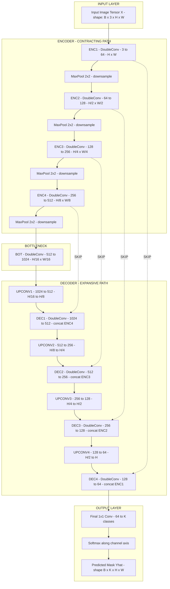
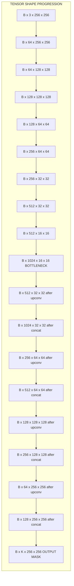
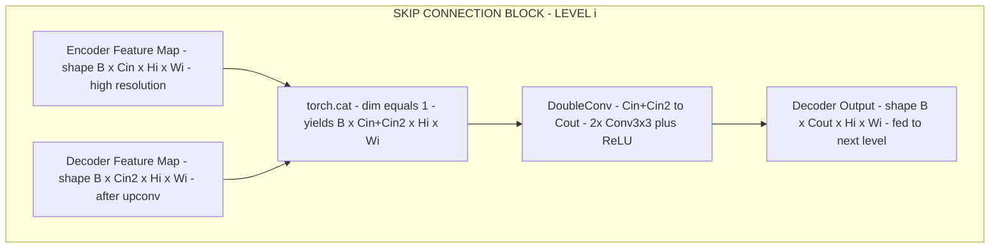
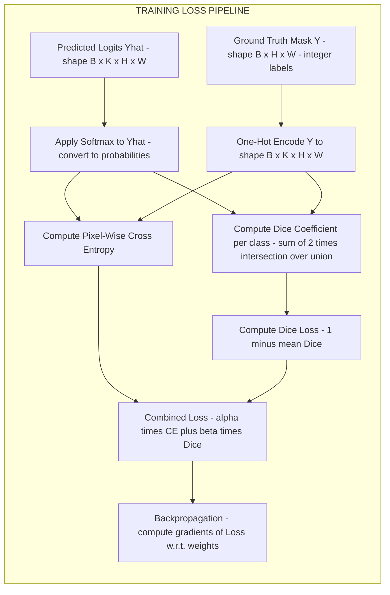

# U-Net and Semantic Segmentation

<!-- SECTION_1_START -->
# U-Net and Semantic Segmentation

## Core Technical Definition

**Semantic Segmentation** is a computer vision task that involves classifying each pixel in an image into a predefined category or class label, producing a dense, per-pixel prediction map where every spatial location is assigned exactly one semantic class.

> [!IMPORTANT]
> **Formal KTU Definition (PECST745 Module 4):** Semantic segmentation is the process of partitioning a digital image into multiple regions (sets of pixels) such that each pixel is assigned a semantic class label from a fixed set $C = \{c_1, c_2, \ldots, c_K\}$, producing an output mask of the same spatial resolution as the input.

**U-Net** is a symmetric encoder–decoder convolutional neural network architecture, originally proposed by Ronneberger et al. (2015) for biomedical image segmentation. It consists of a *contracting path* (encoder) that captures context, a *symmetric expanding path* (decoder) that enables precise localization, and **skip connections** that concatenate feature maps from the encoder to the corresponding decoder levels.

> [!NOTE]
> **Why "U-Net"?** The architecture, when drawn as a diagram, forms a clear "U" shape — the resolution drops along the encoder (left arm) and is restored along the decoder (right arm), with horizontal skip connections bridging the two arms at the same resolution.

### Conceptual Analogy / Intuition

Imagine a satellite image of a city. An object detector might draw a bounding box around each car. Semantic segmentation, by contrast, is like hiring a microscopic artist who colors every single pixel — blue for sky, gray for road, red for rooftops, white for cars. The result is a full "coloring book" of the image, where the color of each pixel tells you *what* it is.

The U-Net architecture is like a **two-sided accordion**:
- The **left side (encoder)** progressively squashes the image down, asking: *"What objects are in this image?"* (semantic context)
- The **right side (decoder)** progressively inflates the compressed representation back to full resolution, asking: *"Where exactly are the boundaries?"* (spatial precision)
- The **skip connections** act like **photocopier shortcuts**: they copy fine-grained details from the encoder directly to the decoder, because by the time the encoder reaches the bottleneck, those tiny textures (edges, corners) have been smoothed away. Without skip connections, the output mask would look blurry and blocky.

### Key Vocabulary for KTU Board Exams

| Term | Meaning |
|---|---|
| **Pixel-wise classification** | Each pixel gets a class label |
| **Encoder (Contracting path)** | Down-sampling branch that extracts features |
| **Decoder (Expansive path)** | Up-sampling branch that restores resolution |
| **Skip connection** | Concatenation of encoder features to decoder at the same level |
| **Bottleneck** | The deepest, smallest-resolution layer between encoder and decoder |
| **Per-class mask** | A 2-D map where each pixel value is its class index |
| **Backbone** | The encoder network (e.g., VGG, ResNet) used for feature extraction |

> [!VISUALIZATION CONTROL]
> **Concept:** U-shaped encoder–decoder with horizontal skip connections
> **Description Sketch (mental image):** Picture a coordinate grid. On the left, image resolution halves four times (e.g., $572 \to 286 \to 143 \to 71 \to 35$). On the right, resolution doubles back ($35 \to 71 \to 143 \to 286 \to 572$). Horizontal arrows cross the U at each matching resolution, copying feature channels from left to right.
> **GeoGebra Input Equations (illustrative shape plot):**
> * $f_1(x) = -\text{abs}(x-2) + 4$ (left descending arm of U)
> * $f_2(x) = \text{abs}(x-2) - 4$ (right ascending arm)
> **Visual Description:** Two V-shaped branches meeting at the bottom form a U. The horizontal lines connecting them at the same height are the skip connections.

---

## Highlights for KTU Board Examinations
- U-Net is the *de-facto* baseline for medical image segmentation in KTU-evaluated coursework.
- Always remember the **symmetric structure** and the role of **skip connections** — these appear in nearly every Part B question.
- The output of U-Net is a tensor of shape $H \times W \times K$ where $K$ is the number of semantic classes.

---

<!-- SECTION_1_END -->

<!-- SECTION_2_START -->
# Deep Theoretical Analysis & KTU High-Yield Formula Sheet

## 1. The U-Net Architecture in Detail

The original U-Net (Ronneberger et al., 2015) is a fully convolutional network (FCN) with **four encoder blocks** and **four decoder blocks**. The architecture is built from two fundamental components: a **contracting path** and a **symmetric expanding path**.

### 1.1 Contracting Path (Encoder)

The encoder follows the typical architecture of a convolutional network. It consists of repeated application of two **$3 \times 3$ unpadded convolutions**, each followed by:
1. A **ReLU activation** (or Leaky ReLU in modern variants).
2. A **$2 \times 2$ max-pooling operation** with stride 2 for down-sampling.

At each down-sampling step, the number of feature channels is **doubled** (e.g., $64 \to 128 \to 256 \to 512$), while the spatial resolution is **halved**.

> [!NOTE]
> **Standard Channel Progression:** $64 \to 128 \to 256 \to 512 \to 1024$ at the bottleneck.

### 1.2 Expansive Path (Decoder)

Every step in the decoder consists of:
1. **Up-convolution (transposed convolution)** with a $2 \times 2$ kernel and stride 2 — this *halves* the number of feature channels and *doubles* the spatial resolution.
2. **Concatenation** with the correspondingly cropped feature map from the contracting path (the skip connection).
3. Two **$3 \times 3$ convolutions**, each followed by a ReLU activation.

The **skip connections** are the architectural innovation of U-Net. They allow the decoder to re-use high-resolution features from the encoder that would otherwise be lost during down-sampling.

### 1.3 Final Layer

A $1 \times 1$ convolution is used at the output to map each 64-component feature vector to the desired number of classes $K$. For multi-class segmentation, a **softmax activation** is applied along the channel dimension. For binary segmentation (foreground vs. background), a **sigmoid activation** is used.

## 2. Input–Output Tensor Shapes

For an input image of size $H \times W \times 3$ (RGB), the U-Net forward pass produces:

$$X \in \mathbb{R}^{H \times W \times 3} \longrightarrow \hat{Y} \in \mathbb{R}^{H \times W \times K}$$

where $K$ is the number of semantic classes. After a softmax along the channel axis, the prediction at pixel $(i, j)$ becomes a probability distribution:

$$\hat{Y}_{i,j} = \left[ p(c_1 \mid X_{i,j}), \; p(c_2 \mid X_{i,j}), \; \ldots, \; p(c_K \mid X_{i,j}) \right]$$

such that $\sum_{k=1}^{K} \hat{Y}_{i,j,k} = 1$.

## 3. Loss Functions for Semantic Segmentation

### 3.1 Pixel-wise Cross-Entropy Loss

The most common loss for segmentation. It is computed as the average negative log-likelihood across all pixels and classes:

$$\mathcal{L}_{\text{CE}} = -\frac{1}{H \cdot W} \sum_{i=1}^{H} \sum_{j=1}^{W} \sum_{k=1}^{K} Y_{i,j,k} \log \hat{Y}_{i,j,k}$$

where $Y_{i,j,k}$ is the one-hot encoded ground-truth label.

### 3.2 Dice Loss (Sørensen–Dice Coefficient)

The **Dice coefficient** measures the overlap between the predicted mask $\hat{Y}_k$ and the ground-truth mask $Y_k$ for class $k$:

$$D_k = \frac{2 \cdot \vert \hat{Y}_k \cap Y_k \vert}{\vert \hat{Y}_k \vert + \vert Y_k \vert} = \frac{2 \sum_{i,j} \hat{Y}_{i,j,k} \cdot Y_{i,j,k}}{\sum_{i,j} \hat{Y}_{i,j,k} + \sum_{i,j} Y_{i,j,k}}$$

The **Dice loss** is then defined as:

$$\mathcal{L}_{\text{Dice}} = 1 - \frac{1}{K} \sum_{k=1}^{K} D_k$$

### 3.3 Combined Loss

In practice, many KTU-level projects and research papers use a weighted sum of cross-entropy and Dice loss:

$$\mathcal{L} = \alpha \cdot \mathcal{L}_{\text{CE}} + \beta \cdot \mathcal{L}_{\text{Dice}}$$

where $\alpha + \beta = 1$ and typical values are $\alpha = 0.5$, $\beta = 0.5$.

## 4. Evaluation Metrics

### 4.1 Intersection over Union (IoU / Jaccard Index)

The IoU is the standard segmentation evaluation metric:

$$\text{IoU}_k = \frac{\vert \hat{Y}_k \cap Y_k \vert}{\vert \hat{Y}_k \cup Y_k \vert} = \frac{TP_k}{TP_k + FP_k + FN_k}$$

where $TP$, $FP$, and $FN$ are true positives, false positives, and false negatives for class $k$.

### 4.2 Mean IoU (mIoU)

The average IoU across all $K$ classes:

$$\text{mIoU} = \frac{1}{K} \sum_{k=1}^{K} \text{IoU}_k$$

### 4.3 Pixel Accuracy

A simpler but less robust metric:

$$\text{PA} = \frac{\sum_{i,j} \mathbb{1}[\hat{Y}_{i,j} = Y_{i,j}]}{H \cdot W}$$

---

## KTU High-Yield Formula / Cheat Sheet

| Symbol / Formula | Meaning | Typical Use |
|---|---|---|
| $\hat{Y} \in \mathbb{R}^{H \times W \times K}$ | Per-pixel class probability map | Model output |
| $D_k = \dfrac{2 \sum \hat{Y}_{i,j,k} Y_{i,j,k}}{\sum \hat{Y}_{i,j,k} + \sum Y_{i,j,k}}$ | Dice coefficient for class $k$ | Loss + metric |
| $\text{IoU}_k = \dfrac{TP_k}{TP_k + FP_k + FN_k}$ | Intersection over Union for class $k$ | Primary metric |
| $\text{mIoU} = \dfrac{1}{K} \sum_{k=1}^{K} \text{IoU}_k$ | Mean IoU across all classes | KTU/benchmark reporting |
| $\mathcal{L}_{\text{CE}} = -\dfrac{1}{HW} \sum_{i,j,k} Y_{i,j,k} \log \hat{Y}_{i,j,k}$ | Pixel-wise cross-entropy | Default loss |
| $\mathcal{L}_{\text{Dice}} = 1 - \dfrac{1}{K} \sum_k D_k$ | Dice loss (1 minus mean Dice) | Imbalanced classes |
| $\mathcal{L} = \alpha \mathcal{L}_{\text{CE}} + \beta \mathcal{L}_{\text{Dice}}$ | Combined loss | Production training |
| Channel progression $64 \to 128 \to 256 \to 512 \to 1024$ | Encoder feature growth | Architecture detail |
| Crop-and-concatenate | Skip-connection mechanism | Architecture detail |

## Real-World Engineering Utility

U-Net and its variants are the workhorse of modern segmentation pipelines:
- **Medical Imaging:** Tumor segmentation in MRI/CT scans (BraTS challenge), cell boundary detection in microscopy.
- **Autonomous Driving:** Road, lane, pedestrian segmentation in datasets like Cityscapes and KITTI.
- **Satellite Imagery:** Building footprint extraction, flood mapping, crop monitoring.
- **Industrial Inspection:** Defect pixel detection on manufacturing surfaces.
- **Agriculture:** Leaf disease segmentation for precision farming.

> [!IMPORTANT]
> **Why U-Net dominates in production:** It is **parameter-efficient**, **fast at inference** (single forward pass), and the **skip connections preserve spatial precision** that pure encoder-only networks lose. Variants like **U-Net++**, **Attention U-Net**, and **ResUNet** further improve the original design.

---

<!-- SECTION_2_END -->

<!-- SECTION_3_START -->
# Step-by-Step Derivations & Code Implementation

## 1. Mathematical Derivation of the Dice Coefficient

We start from the definition of the Dice–Sørensen coefficient. Let $\hat{Y}_k$ be the predicted binary mask for class $k$ and $Y_k$ be the ground-truth binary mask. Both are 2-D arrays of size $H \times W$.

**Step 1:** Define the intersection $|A \cap B|$ for binary masks as the sum of element-wise products:

$$\vert \hat{Y}_k \cap Y_k \vert = \sum_{i=1}^{H} \sum_{j=1}^{W} \hat{Y}_{i,j,k} \cdot Y_{i,j,k}$$

**Step 2:** Define the cardinality (area) of each mask:

$$\vert \hat{Y}_k \vert = \sum_{i=1}^{H} \sum_{j=1}^{W} \hat{Y}_{i,j,k}, \qquad \vert Y_k \vert = \sum_{i=1}^{H} \sum_{j=1}^{W} Y_{i,j,k}$$

**Step 3:** Substitute into the Dice formula:

$$D_k = \frac{2 \cdot \vert \hat{Y}_k \cap Y_k \vert}{\vert \hat{Y}_k \vert + \vert Y_k \vert} = \frac{2 \sum_{i,j} \hat{Y}_{i,j,k} \cdot Y_{i,j,k}}{\sum_{i,j} \hat{Y}_{i,j,k} + \sum_{i,j} Y_{i,j,k}}$$

**Step 4:** When working with soft (probability) predictions, the same formula is used, but $\hat{Y}_{i,j,k} \in [0, 1]$ and $Y_{i,j,k} \in \{0, 1\}$.

**Step 5:** To avoid division by zero when both prediction and ground truth are empty for a class, add a smoothing constant $\epsilon$:

$$D_k = \frac{2 \sum_{i,j} \hat{Y}_{i,j,k} \cdot Y_{i,j,k} + \epsilon}{\sum_{i,j} \hat{Y}_{i,j,k} + \sum_{i,j} Y_{i,j,k} + \epsilon}$$

This is the form used in the PyTorch implementation below.

---

## 2. Mathematical Derivation of the IoU (Jaccard Index)

**Step 1:** Express union using inclusion–exclusion:

$$\vert \hat{Y}_k \cup Y_k \vert = \vert \hat{Y}_k \vert + \vert Y_k \vert - \vert \hat{Y}_k \cap Y_k \vert$$

**Step 2:** Substitute into the IoU formula:

$$\text{IoU}_k = \frac{\vert \hat{Y}_k \cap Y_k \vert}{\vert \hat{Y}_k \cup Y_k \vert} = \frac{\vert \hat{Y}_k \cap Y_k \vert}{\vert \hat{Y}_k \vert + \vert Y_k \vert - \vert \hat{Y}_k \cap Y_k \vert}$$

**Step 3:** Express in terms of confusion matrix counts. Let $TP_k$ be pixels correctly predicted as class $k$, $FP_k$ be pixels incorrectly predicted as class $k$, and $FN_k$ be pixels of class $k$ missed by the model:

- Intersection: $|A \cap B| = TP_k$
- Predicted area: $|A| = TP_k + FP_k$
- Ground-truth area: $|B| = TP_k + FN_k$
- Union: $|A \cup B| = TP_k + FP_k + FN_k$

**Step 4:** Therefore:

$$\text{IoU}_k = \frac{TP_k}{TP_k + FP_k + FN_k}$$

**Step 5:** Relationship between Dice and IoU. From the two definitions:

$$D_k = \frac{2 \cdot \text{IoU}_k}{1 + \text{IoU}_k}, \qquad \text{IoU}_k = \frac{D_k}{2 - D_k}$$

This algebraic relationship is often asked in KTU vivas.

---

## 3. U-Net Forward-Pass Computation Trace

For an input batch $X$ of shape $(B, 3, H, W)$ where $B$ is batch size:

**Step 1 — Encoder Level 1:**
$$E_1 = \text{Conv}_{3\times3} \to \text{ReLU} \to \text{Conv}_{3\times3} \to \text{ReLU} \to \text{MaxPool}_{2\times2}$$
Shape transitions: $(B, 3, H, W) \to (B, 64, H, W) \to (B, 64, H/2, W/2)$

**Step 2 — Encoder Level 2:**
$$E_2 = \text{Conv}_{3\times3} \to \text{ReLU} \to \text{Conv}_{3\times3} \to \text{ReLU} \to \text{MaxPool}_{2\times2}$$
Shape transitions: $(B, 64, H/2, W/2) \to (B, 128, H/2, W/2) \to (B, 128, H/4, W/4)$

**Step 3 — Encoder Level 3:**
$$E_3 = \text{Conv}_{3\times3} \to \text{ReLU} \to \text{Conv}_{3\times3} \to \text{ReLU} \to \text{MaxPool}_{2\times2}$$
Shape: $(B, 128, H/4, W/4) \to (B, 256, H/4, W/4) \to (B, 256, H/8, W/8)$

**Step 4 — Encoder Level 4:**
$$E_4 = \text{Conv}_{3\times3} \to \text{ReLU} \to \text{Conv}_{3\times3} \to \text{ReLU} \to \text{MaxPool}_{2\times2}$$
Shape: $(B, 256, H/8, W/8) \to (B, 512, H/8, W/8) \to (B, 512, H/16, W/16)$

**Step 5 — Bottleneck:**
$$B_0 = \text{Conv}_{3\times3} \to \text{ReLU} \to \text{Conv}_{3\times3} \to \text{ReLU}$$
Shape: $(B, 512, H/16, W/16) \to (B, 1024, H/16, W/16)$

**Step 6 — Decoder Level 1 (up-sampling + skip):**
$$D_1 = \text{UpConv}_{2\times2}(B_0) \;\Vert\; \text{crop}(E_4) \to \text{Conv}_{3\times3} \to \text{ReLU} \to \text{Conv}_{3\times3} \to \text{ReLU}$$
Shape: $(B, 1024, H/16, W/16) \to (B, 512, H/16, W/16) \;\Vert\; (B, 512, H/16, W/16) \to (B, 1024, H/16, W/16) \to (B, 512, H/16, W/16)$

**Step 7 — Decoder Level 2 (up-sampling + skip):**
$$D_2 = \text{UpConv}_{2\times2}(D_1) \;\Vert\; \text{crop}(E_3) \to \text{Conv}_{3\times3} \to \text{ReLU} \to \text{Conv}_{3\times3} \to \text{ReLU}$$
Shape: $(B, 512, H/16, W/16) \to (B, 256, H/8, W/8) \;\Vert\; (B, 256, H/8, W/8) \to (B, 512, H/8, W/8) \to (B, 256, H/8, W/8)$

**Step 8 — Decoder Level 3:** $\to (B, 128, H/4, W/4)$

**Step 9 — Decoder Level 4:** $\to (B, 64, H/2, W/2)$

**Step 10 — Final $1 \times 1$ Convolution:**
$$\hat{Y} = \text{Conv}_{1\times1}(D_4), \quad \hat{Y} \in \mathbb{R}^{B \times K \times H/2 \times W/2}$$
(upsampled to full $H \times W$ for loss computation)

> [!NOTE]
> The symbol $\Vert$ denotes **concatenation along the channel axis**, which is the key operation of the U-Net skip connection.

---

## 4. Full PyTorch Implementation of U-Net

```python
import torch
import torch.nn as nn
import torch.nn.functional as F


class DoubleConv(nn.Module):
    """Two consecutive 3x3 convolutions each followed by BatchNorm and ReLU.

    This block is the fundamental building unit of both the encoder
    and the decoder in U-Net. Using unpadded convolutions requires
    explicit cropping, but using padded convolutions (padding=1) is
    more common in modern PyTorch implementations.
    """

    def __init__(self, in_channels: int, out_channels: int) -> None:
        super().__init__()
        self.double_conv = nn.Sequential(
            nn.Conv2d(in_channels, out_channels, kernel_size=3, padding=1),
            nn.BatchNorm2d(out_channels),
            nn.ReLU(inplace=True),
            nn.Conv2d(out_channels, out_channels, kernel_size=3, padding=1),
            nn.BatchNorm2d(out_channels),
            nn.ReLU(inplace=True),
        )

    def forward(self, x: torch.Tensor) -> torch.Tensor:
        return self.double_conv(x)


class UNet(nn.Module):
    """Standard U-Net architecture for K / class semantic segmentation.

    Args:
        in_channels: Number of input channels (3 for RGB).
        num_classes: Number of semantic classes K in the output mask.
        features: Tuple of channel widths at each encoder level.
    """

    def __init__(
        self,
        in_channels: int = 3,
        num_classes: int = 1,
        features: tuple[int, ...] = (64, 128, 256, 512),
    ) -> None:
        super().__init__()
        self.num_classes = num_classes
        self.downs = nn.ModuleList()
        self.ups = nn.ModuleList()
        self.pool = nn.MaxPool2d(kernel_size=2, stride=2)

        # ---- Encoder (Contracting path) ----
        for feature in features:
            self.downs.append(DoubleConv(in_channels, feature))
            in_channels = feature

        # ---- Bottleneck ----
        self.bottleneck = DoubleConv(features[-1], features[-1] * 2)

        # ---- Decoder (Expansive path) ----
        for feature in reversed(features):
            self.ups.append(
                nn.ConvTranspose2d(
                    feature * 2, feature, kernel_size=2, stride=2,
                )
            )
            self.ups.append(DoubleConv(feature * 2, feature))

        # ---- Final 1x1 convolution to map to num_classes ----
        self.final_conv = nn.Conv2d(
            features[0], num_classes, kernel_size=1,
        )

    def forward(self, x: torch.Tensor) -> torch.Tensor:
        skip_connections: list[torch.Tensor] = []

        # Encoder forward
        for down in self.downs:
            x = down(x)
            skip_connections.append(x)
            x = self.pool(x)

        x = self.bottleneck(x)
        skip_connections = skip_connections[::-1]

        # Decoder forward with skip connections
        for idx in range(0, len(self.ups), 2):
            x = self.ups[idx](x)                                    # up-conv
            skip = skip_connections[idx // 2]
            if x.shape != skip.shape:
                x = F.interpolate(x, size=skip.shape[2:])           # resize if needed
            concat = torch.cat((skip, x), dim=1)                    # skip connection
            x = self.ups[idx + 1](concat)                           # DoubleConv

        return self.final_conv(x)


# ---------- Dice Loss and Combined Loss Implementation ----------

class DiceLoss(nn.Module):
    """Soft Dice Loss for multi-class semantic segmentation."""

    def __init__(self, smooth: float = 1e-6) -> None:
        super().__init__()
        self.smooth = smooth

    def forward(
        self,
        logits: torch.Tensor,
        targets: torch.Tensor,
    ) -> torch.Tensor:
        # logits: (B, K, H, W) raw network output
        # targets: (B, H, W) integer class indices
        probs = torch.softmax(logits, dim=1)
        num_classes = probs.shape[1]
        loss_value = 0.0
        targets_one_hot = F.one_hot(targets, num_classes).permute(0, 3, 1, 2).float()
        for c in range(num_classes):
            p = probs[:, c, :, :].contiguous().view(-1)
            t = targets_one_hot[:, c, :, :].contiguous().view(-1)
            intersection = (p * t).sum()
            union = p.sum() + t.sum()
            dice = (2.0 * intersection + self.smooth) / (union + self.smooth)
            loss_value = loss_value + (1.0 - dice)
        return loss_value / num_classes


class CombinedLoss(nn.Module):
    """Weighted sum of Cross-Entropy and Dice Loss."""

    def __init__(self, alpha: float = 0.5, beta: float = 0.5) -> None:
        super().__init__()
        self.alpha = alpha
        self.beta = beta
        self.ce = nn.CrossEntropyLoss()
        self.dice = DiceLoss()

    def forward(
        self,
        logits: torch.Tensor,
        targets: torch.Tensor,
    ) -> torch.Tensor:
        return self.alpha * self.ce(logits, targets) + self.beta * self.dice(logits, targets)


# ---------- Training Step Skeleton ----------

def train_step(
    model: UNet,
    images: torch.Tensor,
    masks: torch.Tensor,
    optimizer: torch.optim.Optimizer,
    loss_fn: nn.Module,
) -> float:
    """A single training iteration with strict error handling."""
    model.train()
    try:
        predictions = model(images)
        loss = loss_fn(predictions, masks.long())
        optimizer.zero_grad()
        loss.backward()
        optimizer.step()
        return loss.item()
    except RuntimeError as exc:
        raise RuntimeError(f"Training step failed: {exc}") from exc
```

### 4.1 Explanation of Each Line of the U-Net Class

| Line | Purpose |
|---|---|
| `self.downs = nn.ModuleList()` | Holds the four encoder blocks as separate modules. |
| `self.pool = nn.MaxPool2d(2, 2)` | Halves spatial resolution after each encoder block. |
| `self.bottleneck = DoubleConv(features[-1], features[-1] * 2)` | The deepest layer; doubles channels to $1024$ in the standard config. |
| `self.ups.append(nn.ConvTranspose2d(...))` | Each up-block begins with a transposed convolution that doubles resolution. |
| `self.ups.append(DoubleConv(feature * 2, feature))` | Then a DoubleConv is applied after concatenation. |
| `skip_connections.append(x)` *before* pooling | Saves the high-resolution features for the decoder. |
| `skip_connections = skip_connections[::-1]` | Reverses the list so the first skip matches the first up-block. |
| `torch.cat((skip, x), dim=1)` | Concatenates along the **channel dimension** — this *is* the skip connection. |
| `self.final_conv = nn.Conv2d(features[0], num_classes, 1)` | Maps 64 channels to $K$ class scores per pixel. |

---

<!-- SECTION_3_END -->

<!-- SECTION_4_START -->
# Structural Diagrams & Schematics

## 1. U-Net Architecture — Top-Level Block Diagram



> [!NOTE]
> The dashed lines `-. SKIP .->` are the **skip connections** that concatenate encoder feature maps to the corresponding decoder level. This is the architectural signature of U-Net.

---

## 2. Detailed Feature-Map Shape Progression



---

## 3. Skip-Connection Concatenation Mechanism (Block-Level)



---

## 4. Loss Computation Pipeline



---

## 5. Inference / Prediction Pipeline (Block-Level Functional Architecture Flow)

| Stage | Operation | Input Shape | Output Shape |
|---|---|---|---|
| 1 | Load and normalize input image | $H \times W \times 3$ | $1 \times 3 \times H \times W$ |
| 2 | Forward pass through U-Net | $1 \times 3 \times H \times W$ | $1 \times K \times H \times W$ |
| 3 | Argmax along channel axis | $1 \times K \times H \times W$ | $1 \times H \times W$ (class index per pixel) |
| 4 | Color-map to RGB | $1 \times H \times W$ | $H \times W \times 3$ (visualization) |
| 5 | Overlay on original image | Two $H \times W \times 3$ tensors | $H \times W \times 3$ (blended view) |

---

<!-- SECTION_4_END -->

<!-- SECTION_5_START -->
# KTU 2024 Scheme Examination Question Bank & Topic Recap

## Part A — 3-Mark Short-Answer Questions

### Question 1. `[KTU University Exam - July 2024]` — CO1, Remember

**Define semantic segmentation. How does it differ from image classification and object detection?**

**Model Answer (3-Mark Scheme):**

**Definition (1 Mark):**
Semantic segmentation is the task of assigning a class label to *every pixel* in an image, producing a dense per-pixel prediction map.

**Differences (2 Marks):**
- **Image Classification:** Predicts a *single class label* for the entire image. Output: one label.
- **Object Detection:** Predicts *bounding boxes* and class labels for individual object instances. Output: a set of rectangles.
- **Semantic Segmentation:** Predicts a *class label per pixel*. Output: a 2-D mask of the same spatial size as the input.

| Task | Output |
|---|---|
| Image Classification | One scalar label |
| Object Detection | Bounding boxes + labels |
| Semantic Segmentation | Per-pixel class map |
| Instance Segmentation | Per-pixel map + instance IDs |

> [!NOTE]
> Semantic segmentation **does not distinguish between instances** of the same class — two adjacent cars are both labeled "car" with no instance ID.

---

### Question 2. `[KTU University Exam - Dec 2023]` — CO1, Understand

**List and explain the three main components of the U-Net architecture.**

**Model Answer (3-Mark Scheme):**

1. **Contracting Path / Encoder (1 Mark):** A series of convolutional and pooling layers that progressively reduce spatial resolution and increase the number of feature channels. It captures *semantic context* (the "what").

2. **Bottleneck (1 Mark):** The deepest layer at the lowest spatial resolution (e.g., $H/16 \times W/16$ with $1024$ channels in the original U-Net). It contains the most compressed, abstract representation.

3. **Expansive Path / Decoder (1 Mark):** A symmetric up-sampling branch that restores spatial resolution. It is paired with **skip connections** that re-inject high-resolution features from the encoder, enabling precise *localization* (the "where").

---

## Part B — 14-Mark Questions (ESE Module Internal Choice Pattern)

### Question A. `[KTU University Exam - July 2024]` — CO2, Understand + Apply

**(a)** Describe the U-Net architecture in detail. Explain the role of the encoder, decoder, bottleneck, and skip connections. **(7 Marks)**

**(b)** Given the following ground-truth mask $Y$ and predicted probability map $\hat{Y}$ for a binary segmentation task (foreground vs. background, class index 1 = foreground), compute the IoU and Dice coefficient for the foreground class. Show all steps. **(7 Marks)**

Predicted probability map $\hat{Y}$ (after threshold at $0.5$):

$$\hat{Y} = \begin{bmatrix} 1 & 1 & 0 & 0 \\ 1 & 1 & 0 & 1 \\ 0 & 0 & 1 & 1 \\ 0 & 0 & 1 & 0 \end{bmatrix}$$

Ground-truth mask:

$$Y = \begin{bmatrix} 1 & 1 & 0 & 0 \\ 1 & 0 & 0 & 1 \\ 0 & 0 & 1 & 1 \\ 0 & 0 & 1 & 0 \end{bmatrix}$$

---

#### Model Solution to (a) — 7 Marks

**[Defining the architecture: 1 Mark]**
U-Net is a symmetric encoder–decoder convolutional neural network with skip connections. It was introduced by Ronneberger et al. in 2015 for biomedical image segmentation.

**[Encoder / contracting path: 2 Marks]**
The encoder consists of four blocks. Each block contains two $3 \times 3$ convolutions (each followed by ReLU) and a $2 \times 2$ max-pooling operation with stride $2$. After each pooling, the spatial resolution is halved, and the number of feature channels is doubled. Standard channel progression: $64 \to 128 \to 256 \to 512$.

**[Bottleneck and decoder: 2 Marks]**
The bottleneck is the deepest layer with $1024$ channels at resolution $H/16 \times W/16$. The decoder mirrors the encoder using transposed convolutions (up-convolutions) that double the resolution and halve the channels. At each decoder level, the up-sampled feature map is concatenated with the corresponding encoder feature map (the skip connection), followed by two $3 \times 3$ convolutions.

**[Skip connections: 1 Mark]**
Skip connections copy high-resolution features from the encoder directly to the decoder. They compensate for the spatial information lost during down-sampling, allowing the network to combine low-level spatial detail with high-level semantic context.

**[Final output: 1 Mark]**
A $1 \times 1$ convolution maps the $64$-channel decoder output to $K$ class scores per pixel, followed by a softmax (or sigmoid for binary case). The final output has shape $H \times W \times K$.

---

#### Model Solution to (b) — 7 Marks

**[Step 1 — Identify the foreground pixels: 1 Mark]**
Foreground pixels in $\hat{Y}$ (where $\hat{Y}_{i,j} = 1$):
$$\{(1,1), (1,2), (2,1), (2,2), (2,4), (3,3), (3,4), (4,3)\}$$
Count: $|\hat{Y}| = 8$.

Foreground pixels in $Y$:
$$\{(1,1), (1,2), (2,1), (2,4), (3,3), (3,4), (4,3)\}$$
Count: $|Y| = 7$.

**[Step 2 — Compute the intersection: 1 Mark]**
Element-wise product $\hat{Y} \cdot Y$:

$$\hat{Y} \cdot Y = \begin{bmatrix} 1 & 1 & 0 & 0 \\ 1 & 0 & 0 & 1 \\ 0 & 0 & 1 & 1 \\ 0 & 0 & 1 & 0 \end{bmatrix}$$

Sum of all entries: $|\hat{Y} \cap Y| = 1 + 1 + 1 + 1 + 1 + 1 + 1 = 7$.

**[Step 3 — Compute confusion matrix counts: 1 Mark]**
- $TP = 7$ (correctly predicted foreground pixels)
- $FP = |\hat{Y}| - TP = 8 - 7 = 1$ (false alarm)
- $FN = |Y| - TP = 7 - 7 = 0$ (missed foreground)

The single false positive is at position $(2,2)$ where the model predicted foreground but the ground truth is background.

**[Step 4 — Compute IoU: 2 Marks]**
$$\text{IoU} = \frac{TP}{TP + FP + FN} = \frac{7}{7 + 1 + 0} = \frac{7}{8} = 0.875$$

**[Step 5 — Compute Dice coefficient: 1 Mark]**
$$D = \frac{2 \cdot |\hat{Y} \cap Y|}{|\hat{Y}| + |Y|} = \frac{2 \cdot 7}{8 + 7} = \frac{14}{15} \approx 0.9333$$

**[Step 6 — Verify Dice–IoU relationship: 1 Mark]**
$$D = \frac{2 \cdot \text{IoU}}{1 + \text{IoU}} = \frac{2 \cdot 0.875}{1 + 0.875} = \frac{1.75}{1.875} = 0.9333 \checkmark$$

**Final Answer:** $\text{IoU} = 0.875$, Dice $= 14/15 \approx 0.9333$.

---

### Question B. `[KTU University Exam - Dec 2023]` — CO2, Understand + Apply

**(a)** Explain the following loss functions used for semantic segmentation: pixel-wise cross-entropy loss, Dice loss, and focal loss. State one advantage and one disadvantage of each. **(7 Marks)**

**(b)** A U-Net is trained on a dataset with $3$ classes (background, tumor, organ). For a single test image of size $128 \times 128$, the model produces the following confusion-matrix totals summed over all pixels:

- **Background:** $TP = 12000$, $FP = 200$, $FN = 300$
- **Tumor:** $TP = 1800$, $FP = 250$, $FN = 400$
- **Organ:** $TP = 1100$, $FP = 300$, $FN = 250$

Compute the per-class IoU, the mean IoU, the mean Dice coefficient, and the overall pixel accuracy. **(7 Marks)**

---

#### Model Solution to (a) — 7 Marks

**[Pixel-wise Cross-Entropy Loss: 2 Marks]**
$$\mathcal{L}_{\text{CE}} = -\frac{1}{HW} \sum_{i=1}^{H} \sum_{j=1}^{W} \sum_{k=1}^{K} Y_{i,j,k} \log \hat{Y}_{i,j,k}$$
- **Advantage:** Simple, stable gradients, well-suited for balanced classes.
- **Disadvantage:** Performs poorly on **class-imbalanced** datasets (e.g., small tumors in medical scans) because easy-to-classify background pixels dominate the loss.

**[Dice Loss: 2 Marks]**
$$\mathcal{L}_{\text{Dice}} = 1 - \frac{1}{K} \sum_{k=1}^{K} \frac{2 \sum_{i,j} \hat{Y}_{i,j,k} Y_{i,j,k}}{\sum_{i,j} \hat{Y}_{i,j,k} + \sum_{i,j} Y_{i,j,k}}$$
- **Advantage:** Naturally handles **class imbalance** by optimizing the region overlap directly.
- **Disadvantage:** Gradients can be unstable when both prediction and ground truth are empty for a class (division by zero), requiring smoothing.

**[Focal Loss: 2 Marks]**
$$\mathcal{L}_{\text{Focal}} = -\frac{1}{HW} \sum_{i,j,k} (1 - \hat{Y}_{i,j,k})^{\gamma} Y_{i,j,k} \log \hat{Y}_{i,j,k}$$
where $\gamma \geq 0$ is a focusing parameter (typically $\gamma = 2$).
- **Advantage:** Down-weights **easy** pixels and focuses learning on **hard, misclassified** pixels — ideal for severe imbalance.
- **Disadvantage:** Introduces two extra hyperparameters ($\gamma$ and an optional $\alpha$) that require tuning.

**[Conclusion: 1 Mark]**
A common production recipe is to combine cross-entropy with Dice loss, optionally modulated by focal weighting on imbalanced classes.

---

#### Model Solution to (b) — 7 Marks

**[Step 1 — Per-class IoU: 3 Marks, 1 per class]**

**Background:**
$$\text{IoU}_{\text{bg}} = \frac{TP}{TP + FP + FN} = \frac{12000}{12000 + 200 + 300} = \frac{12000}{12500} = 0.9600$$

**Tumor:**
$$\text{IoU}_{\text{tumor}} = \frac{1800}{1800 + 250 + 400} = \frac{1800}{2450} \approx 0.7347$$

**Organ:**
$$\text{IoU}_{\text{organ}} = \frac{1100}{1100 + 300 + 250} = \frac{1100}{1650} \approx 0.6667$$

**[Step 2 — Mean IoU: 1 Mark]**
$$\text{mIoU} = \frac{0.9600 + 0.7347 + 0.6667}{3} = \frac{2.3614}{3} \approx 0.7871$$

**[Step 3 — Mean Dice coefficient: 2 Marks]**
Per-class Dice using $D_k = \frac{2 \cdot \text{IoU}_k}{1 + \text{IoU}_k}$:

$$D_{\text{bg}} = \frac{2 \cdot 0.9600}{1 + 0.9600} = \frac{1.9200}{1.9600} \approx 0.9796$$

$$D_{\text{tumor}} = \frac{2 \cdot 0.7347}{1 + 0.7347} = \frac{1.4694}{1.7347} \approx 0.8471$$

$$D_{\text{organ}} = \frac{2 \cdot 0.6667}{1 + 0.6667} = \frac{1.3334}{1.6667} = 0.8000$$

$$\bar{D} = \frac{0.9796 + 0.8471 + 0.8000}{3} = \frac{2.6267}{3} \approx 0.8756$$

**[Step 4 — Pixel accuracy: 1 Mark]**
Total pixels: $128 \times 128 = 16384$.

Total correct predictions: $TP_{\text{bg}} + TP_{\text{tumor}} + TP_{\text{org}} = 12000 + 1800 + 1100 = 14900$.

$$\text{PA} = \frac{14900}{16384} \approx 0.9093$$

**Final Answer:** $\text{IoU} = \{0.9600, \; 0.7347, \; 0.6667\}$; $\text{mIoU} \approx 0.7871$; mean Dice $\approx 0.8756$; pixel accuracy $\approx 0.9093$.

---

> [!WARNING]
> **KTU Examiner's Valuation Warning / Pitfall Callout:**
> 1. **Do not confuse Dice with IoU.** Many students interchange them; they are related by $D = \frac{2 \cdot \text{IoU}}{1 + \text{IoU}}$ but are *not equal*.
> 2. **Always state the class index** when reporting IoU/Dice — without it the examiner cannot award full marks.
> 3. **Skip connections = concatenation, not addition.** Writing $E_i + D_i$ instead of $\text{cat}(E_i, D_i)$ loses 1 mark on architecture questions.
> 4. **Channel doubling rule:** Forgetting to double channels at each encoder level (e.g., writing $64 \to 64 \to 64$) costs 1 mark.
> 5. **For numerical questions**, show the intermediate $TP$, $FP$, $FN$ counts explicitly — examiners award 1 mark for that step alone.
> 6. **Use mIoU, not IoU**, when reporting overall model performance; the question word "mean" must not be skipped.

---

## Topic Recap & Important Things to Remember

> [!IMPORTANT]
> **Rapid-Revision Checklist for KTU PECST745 Module 4 — U-Net and Semantic Segmentation**

- **Semantic Segmentation** = pixel-wise classification. Every pixel gets a class label from a set of $K$ classes.
- **U-Net** = symmetric encoder (contracting) + decoder (expansive) + skip connections.
- **Encoder** progressively reduces resolution (halve) and increases channels (double). Standard progression: $64 \to 128 \to 256 \to 512 \to 1024$.
- **Bottleneck** is the deepest layer at the lowest resolution ($H/16 \times W/16$ in the original).
- **Decoder** progressively restores resolution using **transposed convolutions** (a.k.a. up-convolutions).
- **Skip Connections** = *concatenation* of encoder feature maps with the corresponding decoder feature maps at the same resolution. They preserve spatial detail lost during pooling.
- **Final Layer** = $1 \times 1$ convolution + softmax (multi-class) or sigmoid (binary).
- **Pixel-wise Cross-Entropy Loss** is the default; for imbalanced data use **Dice Loss** or **Focal Loss**.
- **Combined Loss** = $\alpha \cdot \mathcal{L}_{\text{CE}} + \beta \cdot \mathcal{L}_{\text{Dice}}$ with $\alpha + \beta = 1$ is the most common production recipe.
- **Dice Coefficient** $D_k = \frac{2 \cdot \text{IoU}_k}{1 + \text{IoU}_k}$; **IoU** $= \frac{TP}{TP + FP + FN}$.
- **mIoU** (mean IoU) is the standard KTU/benchmark segmentation metric.
- **Pixel Accuracy** is a weaker metric — biased toward majority classes.
- **U-Net Applications:** medical imaging, autonomous driving, satellite imagery, agriculture, industrial inspection.
- **Variants to mention in viva:** U-Net++, Attention U-Net, ResUNet, V-Net (3D U-Net).
- **Input/Output shape invariant:** $H \times W \times 3 \longrightarrow H \times W \times K$.
- **Key PyTorch modules:** `nn.Conv2d`, `nn.ConvTranspose2d`, `nn.MaxPool2d`, `nn.BatchNorm2d`, `nn.ReLU`, `torch.cat`.
- **The Dice coefficient and IoU are related but not identical** — always write the relationship in derivations.
- **Softmax is applied along dim=1** (channel axis) for multi-class segmentation.
- **Cross-entropy expects raw logits** when using `nn.CrossEntropyLoss`; do **not** apply softmax manually before passing to it.

<!-- SECTION_5_END -->
