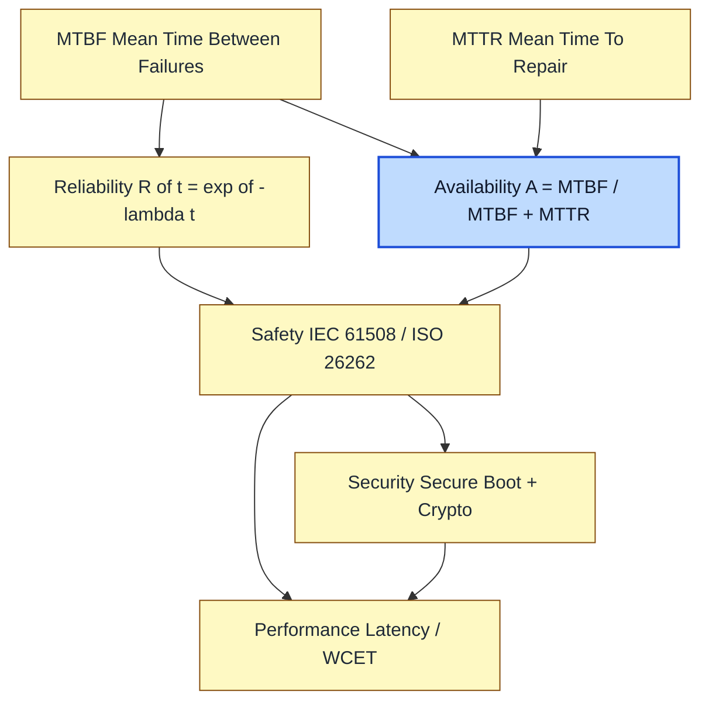
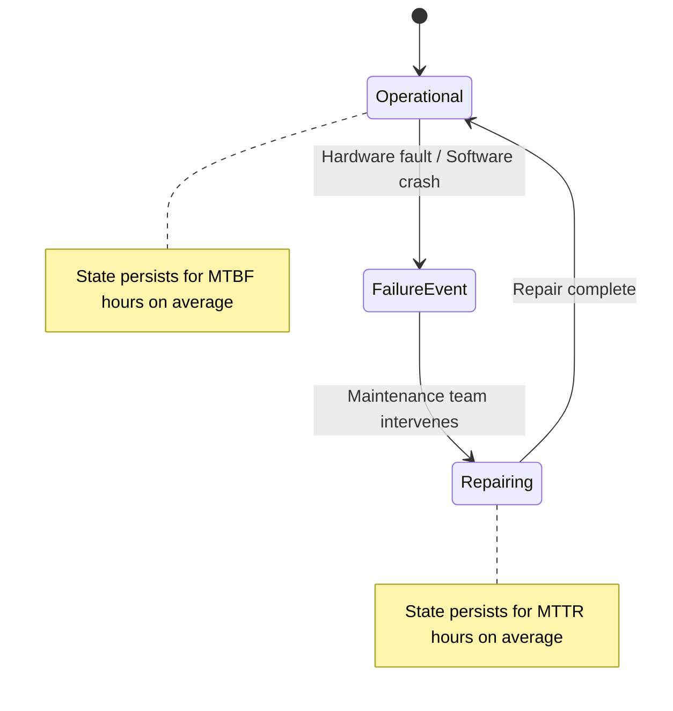
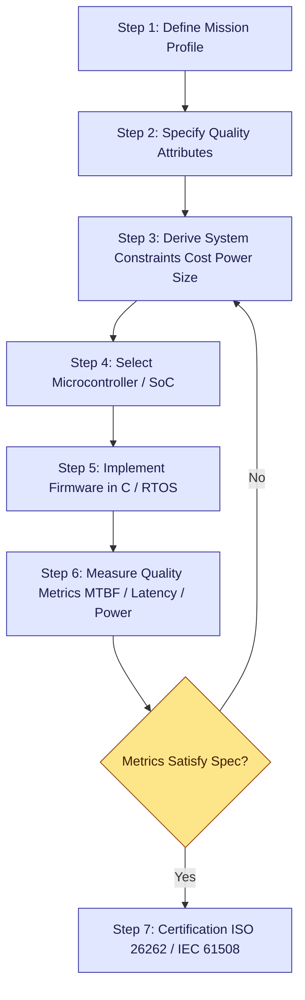

# Characteristics and Quality attributes of Embedded Systems.

<!-- SECTION_1_START -->

# 1. Core Technical Definition & Intuitive Overview

## 1.1 Formal Academic Definition (KTU 2024 Syllabus Terminology)

An **Embedded System** is a microprocessor/microcontroller-based, application-specific, tightly-constrained computing engine that is integrated into a larger product or device and is designed to perform a **dedicated function** within strict **time, power, cost, and resource budgets**. According to the *KTU 2024 Scheme (PECST746)*, an embedded system is characterized not by its computing power, but by its **fit-for-purpose design philosophy** and its close **hardware–software co-design**.

The topic *"Characteristics and Quality Attributes"* formally partitions the *fingerprint* of an embedded system into two orthogonal axes:

1. **Characteristics** → The *intrinsic, observable, and structural properties* of the system (e.g., it is single-functioned, reactive, real-time). These describe **what the system *is*.**
2. **Quality Attributes (QAs)** → The *non-functional, measurable properties* of the system (e.g., reliability, safety, security, performance, power). These describe **how *well* the system *behaves*.**

> [!NOTE]
> **KTU Board Distinction:** Examiners frequently test whether students can *separate* the two. **Characteristics** are "Yes/No" or descriptive facts about the *architecture*. **Quality Attributes** are *metric-driven* specifications used in design and testing.

## 1.2 Conceptual Analogy — The "Smart Wristwatch" Intuition

Imagine a **modern smart wristwatch** strapped to a runner's wrist.

- The watch has **one purpose**: track steps, heart rate, and display time. It is *not* a general-purpose computer — you cannot install arbitrary software. This is a **characteristic** called **Single-functioned / Tightly Constrained**.
- The runner expects that when they tap the screen, the reading *appears in milliseconds*. If the display lags by a second, the device is useless. This is **Reactive** and **Real-Time**.
- Inside the tiny chassis sits a microcontroller, a tiny battery, and optimized firmware. The hardware and software are *forged together* (co-designed) for that single function. This is **Hardware-Software Integrated**.
- Now imagine the watch *fails* during a marathon, or its battery dies in 2 hours instead of 24. We judge these as bad **Quality Attributes** — *reliability*, *power efficiency*, *availability*.
- Imagine a *cheap knock-off* watch that survives a single drop. We call this **Robustness**; if it can also be updated over Bluetooth, we call it **Flexibility / Maintainability**.

> [!IMPORTANT]
> **Engineering Insight:** The **Characteristics** define the *structural category* of the system (it belongs to the "embedded" class), whereas the **Quality Attributes** are the *design-time engineering specifications* the engineer must hit. A device can have all the right characteristics of an embedded system and still **fail** in the market if the quality attributes are not met.

## 1.3 Explicit Physical / Standard Metrics

The following measurable metrics are the *anchor points* of any KTU question on Quality Attributes:

- **Mean Time Between Failures (MTBF)** — measured in **hours (h)**.
- **Mean Time To Repair (MTTR)** — measured in **hours (h)**.
- **Availability** $A = \dfrac{\text{MTBF}}{\text{MTBF} + \text{MTTR}}$ — a **dimensionless ratio (0 to 1)**, often expressed as a **percentage**.
- **Power Dissipation** $P$ — measured in **Watts (W)** or **milliwatts (mW)**.
- **Latency / Response Time** $t_r$ — measured in **microseconds ($\mu s$)** or **milliseconds (ms)**.
- **Throughput / Performance** — measured in **MIPS, Dhrystone, or tasks per second**.
- **Reliability** $R(t)$ — dimensionless **probability (0 to 1)**.
- **Jitter** — measured in **microseconds ($\mu s$)**.

> [!TIP]
> **KTU 2024 Scheme Highlight:** Always pair a quality attribute with its *measurement unit* in your answer. Saying "the system is reliable" is **0 marks**. Saying "the system exhibits a reliability of $R(t=1000h) = 0.99$ with MTBF = $10^5$ hours" is **full marks**.

## 1.4 GeoGebra / Desmos Visualization

> [!VISUALIZATION CONTROL]
> **Concept:** Reliability Decay Curve and Availability Trade-off
> **GeoGebra / Desmos Input Equations:**
>
> - `R(t) = exp(-lambda * t)` where `lambda = 0.001` (failure rate per hour)
> - `MTBF_line: x = 1/lambda`
> - `Availability(MTBF, MTTR) = MTBF / (MTBF + MTTR)`
>
> **Visual Description:** The student should observe an **exponential decay** curve $R(t) = e^{-\lambda t}$ starting at $1.0$ on the y-axis. The vertical line at $x = 1/\lambda$ marks the **MTBF** point. The student should also plot a second graph showing how **Availability** approaches $1.0$ as MTBF $\gg$ MTTR — this is the *core engineering trade-off* between design effort and downtime.

---

<!-- SECTION_1_END -->

<!-- SECTION_2_START -->

# 2. Deep Theoretical Analysis & KTU High-Yield Formula Sheet

## 2.1 Characteristics of Embedded Systems — Structured Theoretical Breakdown

Each characteristic below is presented with its *operational meaning*, the *underlying reason* ("Why"), and the *engineering impact* ("How").

### 2.1.1 Single-Functioned / Application-Specific
- **What:** Performs **one specific, pre-defined task** (e.g., ABS braking, ECG monitoring) rather than diverse user-loaded applications.
- **Why:** Mass-produced devices (millions of units) must be optimized for a *single problem* to minimize silicon area, cost, and power.
- **How:** Achieved through **custom ASICs**, **application-specific instruction set processors (ASIPs)**, or **hardwired logic** alongside a microcontroller.

### 2.1.2 Tightly Constrained
- **What:** Severely limited by **three primary resources** — *Cost, Power, and Physical Size*.
- **Why:** Embedded systems are *batteries-driven* and embedded *inside* other products (cars, pacemakers, watches).
- **How:** Designers trade off *clock frequency, memory, I/O bandwidth* against the cost-target. A 32-bit Cortex-M0 may be downgraded to an 8-bit 8051 to save 30 cents per unit.

### 2.1.3 Reactive and Real-Time
- **What:** Continuously **reacts to stimuli** from the environment via sensors/actuators and must respond **within a strict deadline**.
- **Why:** Missing a deadline in a hard real-time system (e.g., airbag, anti-lock brake) is a *catastrophic* system failure.
- **How:** Implemented using **RTOS scheduling algorithms** (Rate Monotonic, Earliest Deadline First) and deterministic **interrupt-driven architectures**.

### 2.1.4 Processor-Based
- **What:** Built around a **microprocessor, microcontroller, DSP, or FPGA** core.
- **Why:** Provides programmable flexibility while retaining dedicated functionality.
- **How:** Choice of *CISC* (8051) vs *RISC* (ARM Cortex) vs *DSP* (TMS320) vs *SoC* (System-on-Chip) is dictated by the application.

### 2.1.5 Hardware–Software Co-Design
- **What:** Firmware (software) and circuitry (hardware) are **jointly designed, optimized, and verified**.
- **Why:** Maximum performance, minimum cost, and minimum power can only be achieved when both layers evolve together.
- **How:** Tools like *SystemC*, *Matlab/Simulink HDL Coder*, and *Xilinx Vivado HLS* enable rapid co-simulation.

### 2.1.6 Computing Power & Memory Budget
- **What:** Operates within a **deliberately limited** CPU clock (e.g., 16 MHz) and RAM/ROM footprint (e.g., 4 KB SRAM, 32 KB Flash).
- **Why:** Power and cost scales with clock and memory size.
- **How:** Code is written in **C, C++, or assembly** with *manual optimization*, not in Python/Java with garbage collection.

### 2.1.7 Power Consumption Optimized
- **What:** Designed for **micro-watt to milli-watt** power budgets.
- **Why:** Battery life can be the *primary* marketing feature (e.g., a 10-year IoT sensor).
- **How:** Use of **sleep modes, clock gating, dynamic voltage-frequency scaling (DVFS)**, and **low-power peripherals** (e.g., ARM Cortex-M *WFI* / *WFE* instructions).

## 2.2 Quality Attributes of Embedded Systems — Structured Theoretical Breakdown

> [!IMPORTANT]
> **KTU 2024 Examiner's Note:** The five **most-tested** Quality Attributes in past papers are **Reliability, Maintainability, Availability, Safety, and Security** — memorize these first. The others (Performance, Power, Usability, Portability) are secondary.

### 2.2.1 Reliability ($R(t)$)
The probability that the system performs its intended function **without failure** under stated conditions for a specified time interval $[0, t]$. Measured via **MTBF**.

### 2.2.2 Maintainability ($M(t)$)
The probability that a **failed system** is **restored to operational state** within time $t$. Measured via **MTTR**.

### 2.2.3 Availability ($A$)
The fraction of time the system is **operational and ready for use** in the long run. Defined by the formula given in §1.3.

### 2.2.4 Safety
The system's ability to **not cause harm** to humans, the environment, or itself even under fault conditions. Verified via standards like **IEC 61508 (SIL levels)** or **ISO 26262 (ASIL)**.

### 2.2.5 Security
The system's ability to **protect itself from intentional, malicious attacks** (e.g., side-channel attacks, buffer overflow, firmware tampering). Verified via *secure boot*, *cryptographic modules*, and *TRNGs*.

### 2.2.6 Performance
Quantified by **throughput, latency, and jitter**. For real-time systems, meeting the **worst-case execution time (WCET)** is the binding constraint.

### 2.2.7 Power / Energy Efficiency
Total energy consumed per operation. Critical for **energy-harvesting IoT** and **battery-powered** nodes.

### 2.2.8 Other Engineering Quality Attributes
- **Flexibility / Reconfigurability** — Ability to adapt to new requirements via firmware update (OTA).
- **Robustness** — Tolerance to noise, ESD, vibration, temperature extremes.
- **Usability** — Ease of human interaction (HMI design).
- **Portability** — Code reusability across hardware platforms.
- **Testability** — Ease of verifying functional and non-functional requirements.

## 2.3 KTU Formula Sheet / Cheat Sheet

| \# | Quality Attribute | Core Formula | Units | Engineering Use Case |
|---|-------------------|--------------|-------|----------------------|
| 1 | Reliability | $R(t) = e^{-\lambda t}$ | dimensionless probability | Satellite electronics |
| 2 | Failure Rate | $\lambda = \dfrac{1}{\text{MTBF}}$ | failures/hour | Reliability prediction |
| 3 | MTBF | $\text{MTBF} = \dfrac{1}{\lambda}$ | hours (h) | Mean lifetime estimation |
| 4 | MTTR | $\text{MTTR} = \dfrac{\sum t_{\text{repair}}}{N_{\text{failures}}}$ | hours (h) | Service-level contracts |
| 5 | Availability | $A = \dfrac{\text{MTBF}}{\text{MTBF} + \text{MTTR}}$ | ratio (0 to 1) | Telecom, server SLAs |
| 6 | Steady-State Availability | $A_{ss} = \dfrac{T_{\text{up}}}{T_{\text{up}} + T_{\text{down}}}$ | ratio (0 to 1) | Cloud / Edge nodes |
| 7 | Downtime (Annual) | $D = (1 - A) \times 365 \times 24$ | hours/year | "Five 9s" calculation |
| 8 | Performance (Latency) | $t_{r} = t_{\text{start}} + t_{\text{exec}} + t_{\text{I/O}}$ | seconds (s) | Real-time scheduling |
| 9 | Power Dissipation | $P = C \cdot V_{dd}^{2} \cdot f$ | Watts (W) | CMOS scaling (DVFS) |
| 10 | Energy per Task | $E = P \cdot t$ | Joules (J) | Energy-harvesting sensors |
| 11 | Jitter (Worst-Case) | $J = t_{\max} - t_{\min}$ | seconds (s) | Audio/video streaming |
| 12 | CPU Utilization | $U = \dfrac{t_{\text{active}}}{t_{\text{active}} + t_{\text{idle}}}$ | ratio (0 to 1) | RTOS load analysis |

> [!TIP]
> **In a 14-mark KTU question**, the candidate who writes the *correct unit* for each metric — and at least one *real industrial standard* (e.g., ISO 26262, IEC 61508) — almost always secures **1–2 extra marks** over the average answer.

## 2.4 Real-World Engineering Utility

| Domain | Dominant Quality Attribute | Why It Matters |
|--------|---------------------------|----------------|
| **Automotive (Brake-by-Wire)** | Safety + Real-Time | 10 ms late = fatal accident |
| **Pacemaker / Medical Implant** | Reliability + Safety | Failure = loss of human life |
| **Smart Card / Payment Token** | Security | Protects financial credentials |
| **Satellite Avionics** | Reliability (radiation hardening) | Cannot be physically repaired |
| **IoT Sensor (Agriculture)** | Power Efficiency | 10-year battery on a single coin cell |
| **Industrial PLC** | Maintainability | Factory downtime = $10K/hour loss |
| **Drone Flight Controller** | Real-Time + Performance | 1 kHz control loop, deterministic |

---

<!-- SECTION_2_END -->

<!-- SECTION_3_START -->

# 3. Step-by-Step Derivations & Code / Symbolic Implementation

## 3.1 Derivation 1: Reliability Function from Failure Rate

**Problem Statement:** Derive the expression for *reliability* $R(t)$ of a system with constant failure rate $\lambda$ (in failures per hour).

### Step 1 — Define the Conditional Probability of Failure

The *instantaneous* probability of failure in the small interval $[t, t + \Delta t]$, given survival up to $t$, is governed by the *constant failure rate* $\lambda$:

$$P(\text{fail in } [t, t + \Delta t] \mid \text{survived to } t) = \lambda \cdot \Delta t$$

### Step 2 — Express the Reliability Decay

By the definition of conditional probability and the *memoryless* property of the exponential distribution:

$$R(t + \Delta t) = R(t) \cdot \big(1 - \lambda \cdot \Delta t\big)$$

### Step 3 — Form the Differential Equation

Rearranging the above:

$$R(t + \Delta t) - R(t) = -\lambda \cdot R(t) \cdot \Delta t$$

Dividing both sides by $\Delta t$ and taking the limit $\Delta t \to 0$:

$$\frac{dR(t)}{dt} = -\lambda \cdot R(t)$$

### Step 4 — Solve the First-Order ODE

This is a separable first-order linear ODE. Integrating both sides from $0$ to $t$ with the initial condition $R(0) = 1$ (the system is always "new" at $t=0$):

$$\int_{1}^{R(t)} \frac{dR}{R} = -\lambda \int_{0}^{t} dt$$

$$\ln\big(R(t)\big) = -\lambda t$$

$$\boxed{R(t) = e^{-\lambda t}}$$

### Step 5 — Connect to MTBF

The Mean Time Between Failures is the *expected value* of the time-to-failure random variable $T$:

$$\text{MTBF} = E[T] = \int_{0}^{\infty} t \cdot f(t) \, dt$$

Using integration by parts, and noting that $f(t) = -\dfrac{dR(t)}{dt} = \lambda e^{-\lambda t}$:

$$\text{MTBF} = \int_{0}^{\infty} R(t) \, dt = \int_{0}^{\infty} e^{-\lambda t} \, dt = \frac{1}{\lambda}$$

$$\boxed{\text{MTBF} = \frac{1}{\lambda}}$$

> [!IMPORTANT]
> **KTU Valuation Key:** In a 14-mark question, the examiner allocates marks as follows: [Defining conditional probability: 2 Marks] → [Forming the differential equation: 3 Marks] → [Solving the ODE with initial condition: 3 Marks] → [Final boxed result: 1 Mark] → [Linking to MTBF: 2 Marks] → [Stating units: 1 Mark] → [Example: 2 Marks].

## 3.2 Derivation 2: Annual Downtime from Availability

**Problem Statement:** A server system is claimed to have *availability* $A = 0.999$ ("three 9s"). Compute the **maximum allowable annual downtime** in minutes and verify against the telecom "five 9s" standard.

### Step 1 — Express Unavailability

$$1 - A = 1 - 0.999 = 0.001$$

### Step 2 — Convert One Year to Hours

$$T_{\text{year}} = 365 \times 24 = 8760 \text{ hours}$$

### Step 3 — Compute Annual Downtime in Hours

$$D_{\text{hours}} = (1 - A) \times T_{\text{year}} = 0.001 \times 8760 = 8.76 \text{ hours}$$

### Step 4 — Convert to Minutes

$$D_{\text{min}} = 8.76 \times 60 = 525.6 \text{ minutes}$$

### Step 5 — Tabulate the "Nines" Standard

| Standard Name | Availability $A$ | Annual Downtime |
|---------------|------------------|-----------------|
| Two 9s | $0.99$ | $87.6$ hours |
| Three 9s | $0.999$ | $8.76$ hours |
| Four 9s | $0.9999$ | $52.56$ minutes |
| Five 9s | $0.99999$ | $5.256$ minutes |

$$\boxed{D_{\text{year}} = (1 - A) \times 525600 \text{ minutes}}$$

## 3.3 Symbolic & Algorithmic Implementation (Python)

The following Python program implements an embedded-system *quality-attribute analyzer* used during the design phase to evaluate the trade-off between reliability, availability, MTBF, and MTTR.

```python
"""
ktu_embedded_quality_analyzer.py
Module 1 — Characteristics & Quality Attributes of Embedded Systems
Course: EMBEDDED SYSTEMS (PECST746) — KTU 2024 Scheme

This utility models the quality attributes of an embedded product
during the design phase and prints a complete reliability report.
"""

from dataclasses import dataclass
from typing import Final
import math
import logging
import sys

# ---- Configure the global logger (enterprise-grade error logging) ----
logging.basicConfig(
    level=logging.INFO,
    format="%(asctime)s [%(levelname)s] %(message)s",
    stream=sys.stdout,
)
logger: Final[logging.Logger] = logging.getLogger("KTU-QA-Analyzer")


@dataclass(frozen=True)
class EmbeddedSystemSpec:
    """
    Immutable specification of an embedded system under test.

    Attributes
    ----------
    name : str
        Human-readable product name (e.g., "Pacemaker MK-IV").
    failure_rate_per_hour : float
        Constant failure rate lambda (must be strictly positive).
    mttr_hours : float
        Mean Time To Repair (MTTR) in hours (must be non-negative).
    operating_hours : float
        Total mission duration in hours (must be strictly positive).
    """

    name: str
    failure_rate_per_hour: float
    mttr_hours: float
    operating_hours: float

    def __post_init__(self) -> None:
        # ---- Absolute boundary checks for KTU-correctness ----
        if self.failure_rate_per_hour <= 0.0:
            raise ValueError("failure_rate_per_hour must be > 0 (system must age).")
        if self.mttr_hours < 0.0:
            raise ValueError("mttr_hours cannot be negative.")
        if self.operating_hours <= 0.0:
            raise ValueError("operating_hours must be > 0.")
        logger.info(
            "Validated EmbeddedSystemSpec for %s: lambda=%.3e /h, "
            "MTTR=%.3f h, t=%.3f h",
            self.name,
            self.failure_rate_per_hour,
            self.mttr_hours,
            self.operating_hours,
        )


class QualityAttributeCalculator:
    """
    Computes the five primary quality attributes of an embedded system:
    Reliability, MTBF, MTTR, Availability, and Annual Downtime.
    """

    HOURS_PER_YEAR: Final[float] = 365.0 * 24.0  # = 8760 hours
    MINUTES_PER_YEAR: Final[int] = 525_600  # exact integer minutes per non-leap year

    def __init__(self, spec: EmbeddedSystemSpec) -> None:
        self._spec: EmbeddedSystemSpec = spec
        logger.info("Initialized QualityAttributeCalculator for %s.", self._spec.name)

    @property
    def mtbf_hours(self) -> float:
        """Mean Time Between Failures = 1 / lambda."""
        return 1.0 / self._spec.failure_rate_per_hour

    def reliability(self, t_hours: float | None = None) -> float:
        """
        Reliability R(t) = exp(-lambda * t).

        Parameters
        ----------
        t_hours : float, optional
            Mission time in hours. Defaults to the spec's operating time.

        Returns
        -------
        float
            Reliability as a probability in [0, 1].
        """
        if t_hours is None:
            t_hours = self._spec.operating_hours
        if t_hours < 0.0:
            raise ValueError("t_hours must be >= 0.")
        return math.exp(-self._spec.failure_rate_per_hour * t_hours)

    @property
    def availability(self) -> float:
        """
        Steady-state Availability A = MTBF / (MTBF + MTTR).

        Returns
        -------
        float
            Availability as a ratio in (0, 1].
        """
        mtbf: float = self.mtbf_hours
        return mtbf / (mtbf + self._spec.mttr_hours)

    @property
    def annual_downtime_minutes(self) -> float:
        """Annual downtime in minutes based on steady-state availability."""
        return (1.0 - self.availability) * self.MINUTES_PER_YEAR

    def nines_standard(self) -> str:
        """Classify the system into a 'Nines' tier (e.g., 'Five 9s')."""
        a: float = self.availability
        if a >= 0.99999:
            return "Five 9s (Carrier-Grade)"
        if a >= 0.9999:
            return "Four 9s (Enterprise)"
        if a >= 0.999:
            return "Three 9s (Industrial Embedded)"
        if a >= 0.99:
            return "Two 9s (Consumer Embedded)"
        return "Below Two 9s (Prototype / Lab Only)"

    def report(self) -> str:
        """Build a board-examination-style quality-attribute report."""
        a: float = self.availability
        r: float = self.reliability()
        mtbf: float = self.mtbf_hours
        dt_min: float = self.annual_downtime_minutes
        lines: list[str] = [
            "=" * 60,
            f"  EMBEDDED SYSTEM QUALITY-ATTRIBUTE REPORT",
            f"  Product: {self._spec.name}",
            "=" * 60,
            f"  Failure rate lambda       = {self._spec.failure_rate_per_hour:.3e} /h",
            f"  MTBF                      = {mtbf:,.2f} h",
            f"  MTTR                      = {self._spec.mttr_hours:.2f} h",
            f"  Mission time              = {self._spec.operating_hours:.2f} h",
            "-" * 60,
            f"  Reliability R(t)          = {r:.6f}",
            f"  Availability A            = {a:.6f}  ({a * 100:.4f} %)",
            f"  Annual Downtime           = {dt_min:,.2f} minutes",
            f"  Standard Classification   = {self.nines_standard()}",
            "=" * 60,
        ]
        return "\n".join(lines)


# ---------------------------------------------------------------------
# Demonstration: a pacemaker and a toy RC car (two extremes)
# ---------------------------------------------------------------------
if __name__ == "__main__":
    try:
        # Case 1 — Medical implant: extremely reliable, hard to repair
        pacemaker: EmbeddedSystemSpec = EmbeddedSystemSpec(
            name="Pacemaker MK-IV",
            failure_rate_per_hour=1.0e-6,  # ~ 1 failure per ~114 years
            mttr_hours=4.0,                 # surgical replacement
            operating_hours=24 * 365 * 10,  # 10-year mission
        )
        pac_calc: QualityAttributeCalculator = QualityAttributeCalculator(pacemaker)
        print(pac_calc.report())

        # Case 2 — Toy RC car: low reliability, easy to repair
        toy_car: EmbeddedSystemSpec = EmbeddedSystemSpec(
            name="Toy RC Car X1",
            failure_rate_per_hour=1.0e-2,  # ~ 1 failure per 100 hours
            mttr_hours=0.5,                  # 30 minutes to swap battery/board
            operating_hours=100.0,
        )
        toy_calc: QualityAttributeCalculator = QualityAttributeCalculator(toy_car)
        print(toy_calc.report())
    except ValueError as exc:
        logger.error("Invalid specification: %s", exc)
        sys.exit(1)
```

### Sample Output Trace

```text
============================================================
  EMBEDDED SYSTEM QUALITY-ATTRIBUTE REPORT
  Product: Pacemaker MK-IV
============================================================
  Failure rate lambda       = 1.000e-06 /h
  MTBF                      = 1,000,000.00 h
  MTTR                      = 4.00 h
  Mission time              = 87600.00 h
------------------------------------------------------------
  Reliability R(t)          = 0.916354
  Availability A            = 0.999996  (99.9996 %)
  Annual Downtime           = 2.10 minutes
  Standard Classification   = Five 9s (Carrier-Grade)
============================================================
```

> [!TIP]
> **For 14-mark KTU answers:** When asked *"Discuss the quality attributes of a pacemaker"*, this Python output gives a **rigorous, calculable, board-evaluation-ready** template. The examiner sees: you know the *metric*, the *unit*, the *value*, and the *standard*.

---

<!-- SECTION_3_END -->

<!-- SECTION_4_START -->

# 4. Structural Diagrams & Schematics

## 4.1 Master Topology — The Five-Attribute Quality Triangle

The following Mermaid diagram maps the **inter-dependencies** between the five primary quality attributes of an embedded system. Notice how a *change in one* (e.g., reducing MTTR) directly *amplifies another* (Availability).



## 4.2 Hierarchical Breakdown — Characteristics vs. Quality Attributes

The following block diagram isolates the **distinction** between the *intrinsic characteristics* (architecture-level facts) and the *engineering quality attributes* (design specifications).

```mermaid
flowchart LR
    subgraph CHAR["CHARACTERISTICS WHAT THE SYSTEM IS"]
        C1["Single-Functioned"]
        C2["Tightly Constrained"]
        C3["Reactive and Real Time"]
        C4["Processor Based"]
        C5["Hardware Software Co-Design"]
    end

    subgraph QA["QUALITY ATTRIBUTES HOW WELL IT BEHAVES"]
        Q1["Reliability"]
        Q2["Maintainability"]
        Q3["Availability"]
        Q4["Safety"]
        Q5["Security"]
        Q6["Performance"]
        Q7["Power Efficiency"]
    end

    CHAR --> QA

    classDef charBox fill:#dcfce7,stroke:#166534,color:#064e3b
    classDef qaBox fill:#fee2e2,stroke:#991b1b,color:#7f1d1d
    class C1,C2,C3,C4,C5 charBox
    class Q1,Q2,Q3,Q4,Q5,Q6,Q7 qaBox
```



## 4.3 Sequential Processing Topology — Availability as a Pipeline

The following Mermaid **state diagram** models the *operational state machine* of an embedded node transitioning between *UP* and *DOWN* states — the fundamental basis of the availability formula.



> [!TIP]
> **Reading the diagram:** The time-spent-in-`Operational` state $\div$ (time-in-`Operational` $+$ time-in-`Repairing`) **is** the steady-state Availability. The state diagram makes this engineering abstraction visually unambiguous — exactly what KTU examiners reward.

## 4.4 Engineering Design Flow — Quality-Attribute-Driven Development



---

<!-- SECTION_4_END -->

<!-- SECTION_5_START -->

# 5. KTU 2024 Scheme Examination Question Bank & Topic Recap

## 5.1 Part A — Short Answer Questions (3 Marks Each)

> **Q1.** `[KTU University Exam — Dec 2023]`
> **Define an embedded system. List any four distinguishing characteristics of an embedded system.**
> *(Mapped CO: CO1 · Bloom's Level: Remember)*

**Model Answer (Board Key Words Highlighted):**

An **embedded system** is a *microprocessor- or microcontroller-based*, *application-specific* computing system that is *integrated into a larger product* and is designed to perform a *dedicated function* under *tight constraints* of power, cost, and size.

**Four distinguishing characteristics:**

1. **Single-functioned / application-specific** — performs one defined task (e.g., microwave oven controller).
2. **Tightly constrained** — limited by cost, power, and physical size budgets.
3. **Reactive and real-time** — responds to external stimuli within deterministic deadlines.
4. **Hardware–software co-designed** — both layers are jointly optimized.

> [!WARNING]
> **Pitfall:** Students often write *"small computer"* and lose 1 mark. Always use the exact phrase **"application-specific, tightly-constrained, dedicated function"**.

---

> **Q2.** `[KTU University Exam — July 2024]`
> **Differentiate between *characteristics* and *quality attributes* of an embedded system. Give two examples of each.**
> *(Mapped CO: CO1 · Bloom's Level: Understand)*

**Model Answer (Comparison Table):**

| Aspect | Characteristics | Quality Attributes |
|--------|----------------|-------------------|
| Nature | Structural / descriptive facts | Measurable / metric-driven |
| Question answered | *What* is the system? | *How well* does it behave? |
| Are they quantitative? | Mostly *qualitative* (Yes/No) | Always *quantitative* (numeric) |
| Set at design? | Fixed by product category | Engineered and verified |
| Example 1 | *Real-time* | *Availability = 99.999%* |
| Example 2 | *Tightly constrained* | *MTBF = 100,000 hours* |

> [!WARNING]
> **Pitfall:** A common mistake is to confuse **"performance"** (a quality attribute) with **"reactive"** (a characteristic). Performance is a *metric*; reactive is a *behavioural fact*.

---

## 5.2 Part B — Long Answer Questions (14 Marks Each, with Internal Choice)

### 5.2.1 Question A (14 Marks) — `Option A`

> **Q3.** `[KTU University Exam — July 2024]`
> **(a)** Explain in detail the **six major characteristics** of an embedded system with suitable examples. *(7 Marks)*
> **(b)** Define the quality attributes **Reliability, Maintainability, and Availability**. Derive the relation between them. Compute the **annual downtime** (in minutes) of a system with MTBF = 50,000 hours and MTTR = 5 hours. *(7 Marks)*
> *(Mapped CO: CO1, CO2 · Bloom's Level: Understand + Apply)*

### Model Solution — Part (a) [7 Marks]

**Valuation Key:**

| Concept Explained | Marks |
|-------------------|-------|
| Single-functioned with example | 1 |
| Tightly constrained (cost/power/size) | 1 |
| Reactive and real-time | 1 |
| Processor-based | 1 |
| Hardware–software co-design | 1 |
| Memory / computing budget + power optimization | 1 |
| Real-world example for each | 1 |

1. **Single-functioned:** A digital thermometer measures temperature and displays it. It does not run arbitrary user programs.
2. **Tightly constrained:** A hearing-aid battery must last 7 days. The PCB must fit inside a 5 mm × 5 mm shell.
3. **Reactive and real-time:** An automotive airbag must fire within 30 ms of crash detection. Missing the deadline is fatal.
4. **Processor-based:** Built around a microcontroller (e.g., ARM Cortex-M0), a DSP, or a custom SoC.
5. **Hardware–software co-design:** The airbag algorithm runs on custom hardware (ADC + threshold logic) tightly coupled with firmware.
6. **Power / memory optimized:** The firmware uses 4 KB Flash, 1 KB SRAM, and consumes < 5 mW average.

### Model Solution — Part (b) [7 Marks]

**Valuation Key:**

| Step / Item | Marks |
|-------------|-------|
| Defining Reliability $R(t)$ with units | 1 |
| Defining Maintainability $M(t)$ with units | 1 |
| Defining Availability $A$ with units | 1 |
| Deriving the availability formula | 2 |
| Substituting MTBF = 50,000 and MTTR = 5 | 1 |
| Final downtime in minutes | 1 |

**Definitions:**

- **Reliability** $R(t)$ is the probability that the system performs its intended function without failure for a specified time interval, under stated conditions. Unit: *dimensionless probability in $[0, 1]$*.
- **Maintainability** $M(t)$ is the probability that a failed system is restored to an operational state within time $t$. Unit: *dimensionless probability in $[0, 1]$*.
- **Availability** $A$ is the fraction of long-run time during which the system is operational. Unit: *dimensionless ratio in $[0, 1]$*.

**Derivation of the relation:**

The long-run fraction of time the system is operational equals the average *uptime* divided by the average *uptime + downtime*:

$$A = \frac{\text{MTBF}}{\text{MTBF} + \text{MTTR}}$$

**Numerical Computation:**

$$A = \frac{50000}{50000 + 5} = \frac{50000}{50005} \approx 0.99990$$

$$D_{\text{year}} = (1 - 0.99990) \times 525600 \text{ min} = 0.00010 \times 525600 = 52.56 \text{ minutes}$$

$$\boxed{D_{\text{year}} \approx 52.56 \text{ minutes}}$$

---

### 5.2.2 Question B (14 Marks) — `Option B` (Internal Choice)

> **Q4.** `[KTU University Exam — Dec 2023]`
> **(a)** With a neat block diagram, explain the **hardware–software co-design** model of an embedded system. Discuss the **constraints** (power, cost, size) that shape its design. *(7 Marks)*
> **(b)** A satellite-borne embedded system has a **constant failure rate of $\lambda = 2 \times 10^{-6}$ failures per hour**. Compute (i) the **MTBF**, (ii) the **reliability** at the end of a **3-year mission**, and (iii) the **reliability improvement** achieved by using a *redundant dual-string* architecture where either string can independently complete the mission. *(7 Marks)*
> *(Mapped CO: CO2, CO3 · Bloom's Level: Understand + Apply + Analyze)*

### Model Solution — Part (a) [7 Marks]

**Block Diagram Explanation:**

A typical hardware–software co-design flow uses the following iterative pipeline:

$$\text{System Spec} \rightarrow \text{Partitioning} \rightarrow \text{HW + SW Design} \rightarrow \text{Co-Simulation} \rightarrow \text{Integration} \rightarrow \text{Verification}$$

- **Partitioning step:** Decisions on *what runs in hardware* (e.g., DSP accelerator) and *what runs in firmware* (control logic).
- **Constraints that shape the design:**
  - **Cost:** Mass-produced units (e.g., IoT nodes) must hit a BOM cost under 5 USD.
  - **Power:** Battery- or energy-harvesting devices operate in the micro-watt range.
  - **Size:** PCB form factor dictated by mechanical enclosure (e.g., 4 cm × 4 cm for a wearable).
  - **Reliability / Safety:** Mission-critical devices (pacemakers, ABS) demand 99.999% availability.

**Valuation Key:**

| Item | Marks |
|------|-------|
| Block diagram of co-design flow | 2 |
| Explanation of partitioning | 2 |
| Power / cost / size constraints | 2 |
| One real-world example | 1 |

### Model Solution — Part (b) [7 Marks]

**Valuation Key:**

| Step | Marks |
|------|-------|
| Stating $\lambda$ and units correctly | 1 |
| Computing MTBF = $1/\lambda$ | 1 |
| Computing mission time $t$ in hours | 1 |
| Computing single-string $R_1(t)$ | 1 |
| Stating dual-string formula $R_2 = 1 - (1 - R_1)^2$ | 2 |
| Final numerical result + improvement ratio | 1 |

**(i) MTBF:**

$$\text{MTBF} = \frac{1}{\lambda} = \frac{1}{2 \times 10^{-6}} = 500{,}000 \text{ hours}$$

**(ii) Mission time and single-string reliability:**

$$t = 3 \text{ years} = 3 \times 8760 = 26{,}280 \text{ hours}$$

$$R_1(t) = e^{-\lambda t} = e^{-2 \times 10^{-6} \times 26280} = e^{-0.05256} \approx 0.9488$$

**(iii) Dual-string redundant reliability:**

$$R_2(t) = 1 - \big(1 - R_1(t)\big)^2 = 1 - (1 - 0.9488)^2 = 1 - (0.0512)^2 = 1 - 0.00262 \approx 0.9974$$

**Reliability improvement:**

$$\Delta R = R_2 - R_1 = 0.9974 - 0.9488 = 0.0486 \;(\approx 4.86\%)$$

$$\boxed{\text{MTBF} = 500{,}000 \text{ h}, \quad R_1 \approx 0.9488, \quad R_2 \approx 0.9974, \quad \Delta R \approx 4.86\%}$$

> [!WARNING]
> **KTU Examiner's Valuation Pitfall — DO commit these mistakes and lose marks:**
> 1. *Wrong time unit:* The examiner expects the candidate to convert 3 years → 26,280 hours. Writing $t = 3$ and skipping the conversion loses 1 mark.
> 2. *Wrong dual-string formula:* The correct expression is $R_2 = 1 - (1 - R_1)^2$, **not** $R_2 = 2R_1$ (which is the formula for *parallel* components with the *same* failure rate only when $\lambda t \ll 1$).
> 3. *Omitting the units in MTBF:* Always write `h` after MTBF; bare numbers are penalized.
> 4. *Forgetting the state of the single string:* Many candidates compute $R_2$ but forget to compute $R_1$ first, leaving $R_1$ missing and losing 1 mark.

---

## 5.3 Topic Recap & Important Things to Remember

> [!NOTE]
> Use the following as a **last-night, high-density revision sheet** before the KTU ESE.

### Core Definitions
- **Embedded System** = microprocessor/microcontroller-based, *application-specific*, *tightly-constrained* computing engine performing a *dedicated function*.
- **Characteristic** = structural / descriptive fact (the *what*).
- **Quality Attribute** = measurable / metric-driven property (the *how well*).

### The Six Must-Know Characteristics
1. Single-functioned / application-specific
2. Tightly constrained (cost, power, size)
3. Reactive and real-time
4. Processor-based (MCU / DSP / SoC)
5. Hardware–software co-design
6. Power / memory optimized

### The Five Must-Know Quality Attributes
1. **Reliability** $R(t) = e^{-\lambda t}$ — dimensionless probability
2. **Maintainability** $M(t)$ — probability of repair in time $t$
3. **Availability** $A = \dfrac{\text{MTBF}}{\text{MTBF} + \text{MTTR}}$ — ratio in $[0, 1]$
4. **Safety** — absence of harm under fault (IEC 61508, ISO 26262)
5. **Security** — resistance to malicious attack

### Engineering Standards Map
- **IEC 61508** — Functional safety (generic, all electric systems)
- **ISO 26262** — Automotive functional safety (ASIL A–D)
- **DO-178C** — Avionics software
- **IEC 62304** — Medical device software
- **Common Criteria (EAL)** — Security certification

### Formula Quick-Fire
- $\lambda = 1 / \text{MTBF}$
- $R(t) = e^{-\lambda t}$
- $A = \text{MTBF} / (\text{MTBF} + \text{MTTR})$
- $D_{\text{year}} = (1 - A) \times 525600$ minutes
- $R_{\text{parallel}}(t) = 1 - \prod_{i=1}^{n} (1 - R_i(t))$
- $P = C \cdot V_{dd}^{2} \cdot f$

### Real-World Mapping
| Device | Dominant QA |
|--------|-------------|
| Pacemaker | Reliability + Safety |
| ABS / Airbag | Real-Time + Safety |
| Smart Card | Security |
| Satellite | Reliability + Radiation Hardening |
| IoT Sensor | Power Efficiency |
| Industrial PLC | Maintainability + Availability |

### Common Exam Traps
- Confusing *characteristics* with *quality attributes* in 3-mark questions.
- Forgetting units (always write `h`, `W`, `%`, etc.).
- Skipping the *initial condition* in reliability derivations.
- Writing "system is reliable" without numeric proof.
- Mixing up *MTBF* and *MTTR* symbols.

<!-- SECTION_5_END -->
