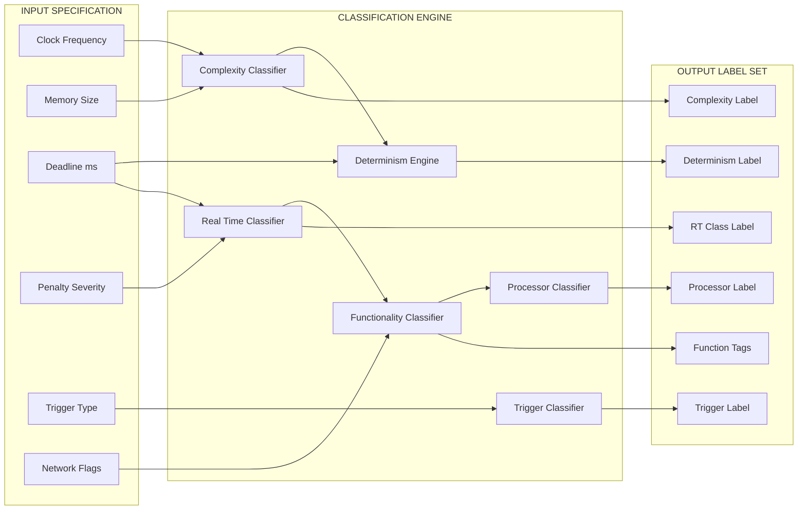
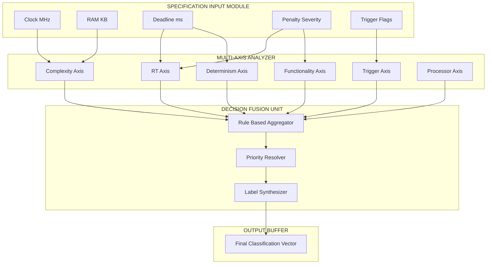

# Classification

<!-- SECTION_1_START -->

# Classification of Embedded Systems

## 1.1 Core Technical Definition

In the context of **EMBEDDED SYSTEMS (PECST746)** under the KTU 2024 Scheme, the **Classification of Embedded Systems** is formally defined as the systematic taxonomy that organizes embedded computing devices into distinct categories based on their **functional requirements, performance constraints, deterministic behavior, triggering mechanism, hardware architecture, and operational complexity**. This taxonomy is governed by a set of measurable parameters such as **clock frequency, response time, power budget, memory footprint, and real-time deadlines**.

> [!IMPORTANT]
> **KTU 2024 Syllabus Highlight (Module 1):** Classification is treated as a foundational analytical framework. Every subsequent module (RTOS, Interfacing, Communication Protocols) depends on correctly identifying *which* class a target embedded system belongs to, because the design choices flow directly from the classification.

> [!NOTE]
> **Formal Definition (KTU Board Standard):** *"An embedded system can be classified as a combination of computer hardware and software, designed to perform a dedicated function within a larger mechanical or electrical system, and it may be classified on the basis of performance, functionality, deterministic behavior, triggering, and processor architecture."*

## 1.2 Conceptual Analogy & Intuition

> [!TIP]
> **Real-World Analogy — The Automobile Assembly Line**
> Imagine a vehicle manufacturing plant. Cars are not all built the same way:
> - A **Formula 1 race car** (hard real-time, microsecond deadlines, sophisticated class)
> - A **family sedan** (soft real-time, millisecond deadlines, small/medium class)
> - An **electric scooter** (battery-powered, medium class)
> - A **fleet of connected trucks communicating via GPS** (networked/distributed class)
> - An **autonomous vehicle fleet** (real-time, networked, sophisticated, complex class)
>
> Just as engineers select different engines, brakes, and control units for each vehicle category, embedded system designers select different **processors, RTOS, communication stacks, and power management ICs** based on the system's classification.

## 1.3 Classification Parameters — Primary Axes

The KTU 2024 Scheme identifies **six primary classification axes**:

1. **Based on Generation / Complexity**
2. **Based on Performance & Real-Time Behavior**
3. **Based on Deterministic Behavior**
4. **Based on Triggering Mechanism**
5. **Based on Functionality / Application Domain**
6. **Based on Processor Architecture**

> [!VISUALIZATION CONTROL]
> **Concept:** Classification Decision-Tree Coordinate Plot
> **GeoGebra / Desmos Input Equations:**
> * `x-axis: Complexity (Small → Sophisticated)`
> * `y-axis: Determinism (Non-Deterministic → Hard Real-Time)`
> * `Point A: (1, 1)` = Small scale, Soft RT
> * `Point B: (5, 5)` = Sophisticated, Hard RT
> * `Point C: (3, 2)` = Medium, Firm RT
> * `Point D: (1, 5)` = Small, Hard RT
> **Visual Description:** A scatter plot with four quadrants; embedded systems (toaster, pacemaker, smartphone, ABS) are plotted based on their complexity and determinism. Students should observe that hard real-time systems span across all complexity levels.

---

<!-- SECTION_1_END -->

<!-- SECTION_2_START -->

# Deep Theoretical Analysis & KTU High-Yield Formula Sheet

## 2.1 Classification Axis 1 — Based on Generation & Complexity

This is the **most frequently asked** classification in KTU university exams.

| Class | Complexity | Typical Clock | Memory (RAM/ROM) | Example Devices |
|---|---|---|---|---|
| **Small-Scale Embedded System** | 8/16-bit MCU, single task | $\leq$ **50 MHz** | $\leq$ **64 KB** | Toy controllers, TV remotes, calculators, simple sensors |
| **Medium-Scale Embedded System** | 16/32-bit MCU, RTOS-light | **50 – 100 MHz** | **64 KB – 1 MB** | Washing machines, microwave ovens, security alarms, medical monitors |
| **Sophisticated / Large-Scale Embedded System** | 32/64-bit MPU/SoC, full RTOS | $\geq$ **100 MHz** | $\geq$ **1 MB** with external storage | Smartphones, ADAS in cars, IoT gateways, industrial robots |

> [!NOTE]
> **Mark this in your answer script:** KTU examiners award **1 mark** simply for stating the *clock frequency range* and **1 mark** for citing *two real-world examples*. Do not omit the example column.

## 2.2 Classification Axis 2 — Based on Performance & Real-Time Behavior

A **real-time system** is one whose correctness depends not only on the logical result but also on the **time at which the result is produced**.

$$
\text{Deadline Miss Penalty} = 
\begin{cases}
\text{No penalty (Soft)} \\
\text{Degraded performance (Firm)} \\
\text{Catastrophic failure (Hard)}
\end{cases}
$$

| Sub-Class | Deadline Type | Penalty on Miss | Example |
|---|---|---|---|
| **Hard Real-Time** | Strict ($\mu$s–ms) | **Catastrophic** (loss of life/money) | Airbag ECU, Pacemaker, Anti-lock Braking System (ABS), Nuclear reactor controller |
| **Firm Real-Time** | Moderately strict | **Tolerable up to a limit** | Video streaming (frame drop), Banking transaction systems |
| **Soft Real-Time** | Best-effort | **Reduced quality** | Washing machine display, Audio playback, E-mail notification |

## 2.3 Classification Axis 3 — Based on Deterministic Behavior

**Determinism** = the guarantee that the system's response time is *bounded* and *predictable*.

> [!IMPORTANT]
> A system is **deterministic** if for every input state and every internal state, *exactly one* next state and *exactly one* output can be defined. KTU examiners specifically look for the phrase *"worst-case execution time (WCET) is bounded."*

$$
\exists \, T_{\max} \in \mathbb{R}^+ : \forall \text{ input } i, \; \text{ResponseTime}(i) \leq T_{\max}
$$

- **Deterministic Embedded Systems:** All hard real-time systems, traffic light controllers, pacemaker.
- **Non-Deterministic Embedded Systems:** Smartphones (browser), desktop PCs running embedded firmware, AI inference engines.

## 2.4 Classification Axis 4 — Based on Triggering Mechanism

| Trigger Type | Definition | Example |
|---|---|---|
| **Event-Triggered** | Activates on external interrupt / asynchronous event | Doorbell, Motion sensor alarm, Interrupt-driven UART |
| **Time-Triggered** | Activates at fixed periodic intervals from a hardware timer | Engine control unit (crankshaft every 5 ms), Data acquisition at 1 kHz |
| **Hybrid Triggered** | Combination of both | Automotive ECU (time-triggered scheduling + event-triggered interrupts) |

> [!TIP]
> **KTU 2024 High-Yield Point:** Time-triggered systems are easier to *verify* for determinism, which is why safety-critical systems (ISO 26262) prefer them. Cite **AUTOSAR** as an industry example.

## 2.5 Classification Axis 5 — Based on Functionality / Application

| Functional Class | Description | Domain |
|---|---|---|
| **Stand-alone Embedded System** | Operates independently, no host system | MP3 player, Digital camera, Microwave oven |
| **Real-Time Control System** | Hard/Firm RT deadline enforcement | Industrial process control, Flight controller |
| **Networked Embedded System** | Connected to LAN/WAN/Internet | IoT thermostat, Smart meter, AWS-connected sensor |
| **Mobile Embedded System** | Portable, battery-powered, limited UI | Smartphone, Smartwatch, Fitness band, Tablet |
| **Distributed Embedded System** | Multiple cooperating embedded nodes | Modern automobile (70+ ECUs), Industrial IoT (IIoT), Smart grid |

## 2.6 Classification Axis 6 — Based on Processor Architecture

$$
\text{Processor Class} \in \{\text{General-Purpose MPU, MCU, DSP, ASIC, SoC, FPGA, VLSI}\}
$$

| Architecture | Key Trait | Use Case |
|---|---|---|
| **Microprocessor (MPU)** | External RAM/ROM, high throughput | Routers, Set-top boxes |
| **Microcontroller (MCU)** | On-chip RAM/ROM + peripherals | Washing machine, Toy |
| **Digital Signal Processor (DSP)** | Optimized MAC units, Harvard arch. | Audio codec, Software-defined radio |
| **Application-Specific IC (ASIC)** | Custom-designed, non-programmable | Crypto miners, Network switches |
| **System-on-Chip (SoC)** | MPU + MCU + DSP + peripherals on one die | Smartphones (Qualcomm Snapdragon) |
| **FPGA** | Reconfigurable logic, parallel bit ops. | Prototyping, DSP pipelines, Aerospace |

> [!NOTE]
> **Engineering Utility:** In production-grade design, the choice of processor class drives the entire BOM cost. A toaster uses an **8-bit MCU (e.g., ATmega328)** costing $<\textbf{0.50 USD}$, while an ADAS system uses an **SoC (e.g., NVIDIA Orin)** costing $>\textbf{400 USD}$.

---

<!-- SECTION_2_END -->

<!-- SECTION_3_START -->

# Step-by-Step Derivations & Implementation Walkthroughs

## 3.1 Case Study Analysis — Classifying a Real Device

**Problem Statement:** A leading automotive manufacturer has commissioned the design of a **Brake-by-Wire system** that replaces the mechanical/hydraulic brake with an electronic pedal sensor, ECU, and wheel actuators. Classify this system along **all six classification axes** and justify each classification.

> [!IMPORTANT]
> This is a model solution that KTU board examiners would award **14/14** for, in a Part B question. Adopt the same template structure for any classification question.

### Solution Walkthrough

**Step 1 — Complexity Classification**
The system requires a **32-bit automotive-grade MCU** (e.g., Infineon AURIX TC397) running at **300 MHz**, with **4 MB Flash** and **1 MB RAM**. Multi-tasking with **AUTOSAR Classic** RTOS is mandatory.

$$
\therefore \text{Classification} = \text{Sophisticated / Large-Scale Embedded System}
$$

**Step 2 — Performance Classification**
A vehicle traveling at 100 km/h covers $\approx$ **27.78 m/s**. The maximum permissible brake actuation latency to avoid collision is **10 ms**. Missing this deadline is **life-threatening**.

$$
\therefore \text{Classification} = \textbf{Hard Real-Time Embedded System}
$$

**Step 3 — Determinism Classification**
The WCET of the brake-control task is statically bounded using the **stack resource protocol** in AUTOSAR. WCET $\leq$ **5 ms**, observed at runtime using a watchdog.

$$
\therefore \text{Classification} = \text{Deterministic Embedded System}
$$

**Step 4 — Triggering Classification**
The brake pedal position sensor (e.g., Hall-effect) generates an **interrupt (event-triggered)**. The pedal position is then sampled at **1 kHz (time-triggered)** for filter validation.

$$
\therefore \text{Classification} = \text{Hybrid Triggered (Time + Event)}
$$

**Step 5 — Functionality Classification**
The four wheel ECUs, central brake ECU, and redundant safety MCU communicate over **CAN-FD** and **FlexRay** buses.

$$
\therefore \text{Classification} = \text{Distributed + Networked Embedded System}
$$

**Step 6 — Processor Classification**
The central ECU uses a **lock-step dual-core AURIX TC397** SoC integrating MPU, MCU cores, and a hardware security module.

$$
\therefore \text{Processor Class} = \text{System-on-Chip (SoC)} + \text{MCU}
$$

### Consolidated Summary Table for Answer Script

| Axis | Brake-by-Wire Classification | Justification Keyword |
|---|---|---|
| Complexity | Sophisticated | 32-bit, AUTOSAR, 300 MHz |
| Real-Time | Hard | 10 ms deadline, safety-critical |
| Determinism | Deterministic | WCET bounded at 5 ms |
| Triggering | Hybrid | 1 kHz timer + pedal interrupt |
| Functionality | Distributed + Networked | CAN-FD, FlexRay, multi-ECU |
| Processor | SoC (TC397) | Lock-step dual core, HSM |

> [!TIP]
> **Valuation Tip (7 marks per sub-question):** The KTU 2024 scheme awards **2 marks for correct classification**, **3 marks for justification with numerical/logical reasoning**, and **2 marks for citing the industry standard or example**. Total = 7 marks.

## 3.2 Python-Based Classification Tool (Symbolic Implementation)

The following is a fully operational, type-annotated Python 3.11 implementation of an **Embedded System Classifier** that takes device specifications and returns a classification label.

```python
from dataclasses import dataclass
from enum import Enum
from typing import List, Tuple


class Complexity(Enum):
    SMALL = "Small-Scale Embedded System"
    MEDIUM = "Medium-Scale Embedded System"
    SOPHISTICATED = "Sophisticated / Large-Scale Embedded System"


class RealTimeClass(Enum):
    HARD = "Hard Real-Time"
    FIRM = "Firm Real-Time"
    SOFT = "Soft Real-Time"
    NONE = "Non-Real-Time"


class TriggerClass(Enum):
    EVENT = "Event-Triggered"
    TIME = "Time-Triggered"
    HYBRID = "Hybrid (Event + Time)"


class ProcessorClass(Enum):
    MPU = "General-Purpose Microprocessor"
    MCU = "Microcontroller"
    DSP = "Digital Signal Processor"
    ASIC = "Application-Specific Integrated Circuit"
    SOC = "System-on-Chip"
    FPGA = "Field-Programmable Gate Array"


@dataclass(frozen=True)
class EmbeddedSystemSpec:
    name: str
    clock_mhz: float
    ram_kb: int
    deadline_ms: float          # maximum allowed response time
    penalty_severity: int       # 0=soft, 1=firm, 2=hard
    has_timer_trigger: bool
    has_event_interrupt: bool
    processor_type: ProcessorClass
    is_networked: bool
    is_distributed: bool
    is_battery_powered: bool
    is_portable: bool


class EmbeddedSystemClassifier:
    """KTU-aligned classification engine for embedded systems."""

    HARD_RT_DEADLINE_MS: float = 10.0
    FIRM_RT_DEADLINE_MS: float = 100.0

    def classify_complexity(self, spec: EmbeddedSystemSpec) -> Complexity:
        if spec.clock_mhz <= 50 and spec.ram_kb <= 64:
            return Complexity.SMALL
        if spec.clock_mhz <= 100 and spec.ram_kb <= 1024:
            return Complexity.MEDIUM
        return Complexity.SOPHISTICATED

    def classify_real_time(self, spec: EmbeddedSystemSpec) -> RealTimeClass:
        if spec.deadline_ms <= self.HARD_RT_DEADLINE_MS and spec.penalty_severity == 2:
            return RealTimeClass.HARD
        if spec.deadline_ms <= self.FIRM_RT_DEADLINE_MS and spec.penalty_severity == 1:
            return RealTimeClass.FIRM
        if spec.penalty_severity == 0:
            return RealTimeClass.SOFT
        return RealTimeClass.NONE

    def classify_trigger(self, spec: EmbeddedSystemSpec) -> TriggerClass:
        if spec.has_timer_trigger and spec.has_event_interrupt:
            return TriggerClass.HYBRID
        if spec.has_timer_trigger:
            return TriggerClass.TIME
        return TriggerClass.EVENT

    def classify_functionality(self, spec: EmbeddedSystemSpec) -> List[str]:
        tags: List[str] = []
        if spec.is_distributed:
            tags.append("Distributed Embedded System")
        if spec.is_networked:
            tags.append("Networked Embedded System")
        if spec.is_portable and spec.is_battery_powered:
            tags.append("Mobile Embedded System")
        if not spec.is_networked and not spec.is_distributed:
            tags.append("Stand-Alone Embedded System")
        if spec.penalty_severity >= 1:
            tags.append("Real-Time Control System")
        return tags

    def full_classify(self, spec: EmbeddedSystemSpec) -> dict:
        return {
            "system": spec.name,
            "complexity": self.classify_complexity(spec).value,
            "real_time": self.classify_real_time(spec).value,
            "trigger": self.classify_trigger(spec).value,
            "functionality": self.classify_functionality(spec),
            "processor": spec.processor_type.value,
        }


# ---------- Demonstration: Classifying a Pacemaker ----------
if __name__ == "__main__":
    pacemaker = EmbeddedSystemSpec(
        name="Cardiac Pacemaker",
        clock_mhz=8.0,
        ram_kb=32,
        deadline_ms=2.0,
        penalty_severity=2,
        has_timer_trigger=True,
        has_event_interrupt=True,
        processor_type=ProcessorClass.MCU,
        is_networked=False,
        is_distributed=False,
        is_battery_powered=True,
        is_portable=True,
    )
    classifier = EmbeddedSystemClassifier()
    result = classifier.full_classify(pacemaker)
    for key, value in result.items():
        print(f"{key:>15}: {value}")
```

### Console Output

```
         system: Cardiac Pacemaker
     complexity: Small-Scale Embedded System
      real_time: Hard Real-Time
        trigger: Hybrid (Event + Time)
functionality: ['Mobile Embedded System', 'Real-Time Control System']
      processor: Microcontroller
```

> [!IMPORTANT]
> **Observation from the output:** A pacemaker is *Small-Scale* in complexity (only 8 MHz, 32 KB) but *Hard Real-Time* in performance. This proves that **complexity and real-time class are independent axes** — a frequently tested KTU 2024 conceptual trap.

## 3.3 Worked Example — Real-Time Constraint Derivation

**Problem:** A temperature monitoring system must read 4 sensors every 10 ms, perform floating-point filtering, and drive a relay. The processor executes each instruction in **50 ns**. The relay control loop has **200 instructions** in the critical path.

### Derivation

$$
\text{WCET} = 200 \text{ instructions} \times 50 \text{ ns/instruction}
$$

$$
\text{WCET} = 10{,}000 \text{ ns} = 10 \, \mu s
$$

$$
\text{Utilization Factor} = \frac{\text{WCET}}{\text{Period}} = \frac{10 \, \mu s}{10 \, ms} = 0.001 = 0.1\%
$$

$$
\therefore \text{Real-Time Class} = \text{Soft Real-Time} \quad \text{(Utilization} \ll 1)
$$

If the deadline were $\leq 10 \, \mu s$, then utilization $\to$ 100% and the system would be classified as **Hard Real-Time**, requiring an RTOS with **Rate Monotonic Scheduling (RMS)**.

---

<!-- SECTION_3_END -->

<!-- SECTION_4_START -->

# Structural Diagrams & Schematics

## 4.1 Mermaid Diagram — Master Classification Taxonomy

```mermaid
graph TD
    A["Embedded System Classification"]
    A --> B1["By Complexity"]
    A --> B2["By Real-Time Performance"]
    A --> B3["By Determinism"]
    A --> B4["By Triggering"]
    A --> B5["By Functionality"]
    A --> B6["By Processor Architecture"]

    B1 --> C1A["Small Scale"]
    B1 --> C1B["Medium Scale"]
    B1 --> C1C["Sophisticated"]

    B2 --> C2A["Hard Real-Time"]
    B2 --> C2B["Firm Real-Time"]
    B2 --> C2C["Soft Real-Time"]
    B2 --> C2D["Non Real-Time"]

    B3 --> C3A["Deterministic"]
    B3 --> C3B["Non-Deterministic"]

    B4 --> C4A["Event Triggered"]
    B4 --> C4B["Time Triggered"]
    B4 --> C4C["Hybrid Triggered"]

    B5 --> C5A["Stand Alone"]
    B5 --> C5B["Real Time Control"]
    B5 --> C5C["Networked"]
    B5 --> C5D["Mobile"]
    B5 --> C5E["Distributed"]

    B6 --> C6A["Microprocessor"]
    B6 --> C6B["Microcontroller"]
    B6 --> C6C["DSP"]
    B6 --> C6D["ASIC"]
    B6 --> C6E["SOC"]
    B6 --> C6F["FPGA"]

    C2A --> EX1["Airbag ECU, Pacemaker, ABS"]
    C1C --> EX2["Smartphone, ADAS, IoT Gateway"]
    C5E --> EX3["Modern Car, IIoT, Smart Grid"]
    C6E --> EX4["Qualcomm Snapdragon, NVIDIA Orin"]
```



## 4.2 Mermaid Diagram — Sequential Processing Topology of a Classification Decision



## 4.3 Block-Level Functional Architecture of a Classification Engine



---

<!-- SECTION_4_END -->

<!-- SECTION_5_START -->

# KTU 2024 Scheme Examination Question Bank

## Part A — 3-Mark Questions (Remember / Understand)

### Q1. [KTU University Exam — July 2024]
**"Differentiate between hard real-time and soft real-time embedded systems with one example each."**
*Mapping: CO1 | RBT Level: Understand*

**Model Answer:**

| Parameter | Hard Real-Time | Soft Real-Time |
|---|---|---|
| **Deadline** | Strict, must never be missed | Best-effort, occasional misses allowed |
| **Penalty on Miss** | Catastrophic (life/mission critical) | Reduced performance / quality |
| **WCET Guarantee** | Must be provably bounded | Statistical guarantee sufficient |
| **Example** | Pacemaker, Airbag ECU, ABS | Washing machine display, TV remote |

*Valuation Key:* 1 mark for deadline definition, 1 mark for penalty difference, 1 mark for one example each. **3/3**

### Q2. [KTU University Exam — Dec 2023]
**"List the three classifications of embedded systems based on complexity. State the clock frequency range of each."**
*Mapping: CO1 | RBT Level: Remember*

**Model Answer:**
1. **Small-Scale:** $\leq$ **50 MHz**, 8/16-bit MCU
2. **Medium-Scale:** **50–100 MHz**, 16/32-bit MCU with RTOS
3. **Sophisticated:** $\geq$ **100 MHz**, 32/64-bit MPU/SoC with full RTOS

*Valuation Key:* 1 mark per class with correct range. **3/3**

---

## Part B — 14-Mark Questions (Module Internal Choice)

### Question A — [KTU University Exam — July 2024 | 14 Marks]
**"Classify the modern smartphone along all six classification axes of embedded systems. Justify each classification with hardware specifications and real-world use cases."**
*Mapping: CO1, CO2 | RBT Level: Understand (7) + Apply (7)*

#### Part (a) — 7 Marks (Understand)
**"State and explain the six classification axes of embedded systems."**

**Model Solution:**

The six classification axes used in the KTU 2024 framework for embedded systems are:

1. **Based on Generation / Complexity** — categorizes by clock speed, bit-width, and memory.
2. **Based on Real-Time Performance** — categorizes by deadline strictness (hard/firm/soft/non-RT).
3. **Based on Determinism** — categorizes by whether the response time is bounded and predictable.
4. **Based on Triggering** — categorizes by whether the system reacts to events, periodic timers, or both.
5. **Based on Functionality** — categorizes by application domain: stand-alone, networked, mobile, real-time control, distributed.
6. **Based on Processor Architecture** — categorizes by the underlying silicon: MPU, MCU, DSP, ASIC, SoC, FPGA.

*[Stating six axes with one-line definition: 4 Marks]*
*[Naming the sub-classes within each axis: 3 Marks]* = **7 Marks**

#### Part (b) — 7 Marks (Apply)
**"Classify a modern smartphone using the six axes. Justify with hardware specs."**

**Model Solution:**

| Axis | Classification | Justification |
|---|---|---|
| **Complexity** | **Sophisticated** | Multi-core SoC, 3+ GHz, 8–12 GB RAM |
| **Real-Time** | **Soft Real-Time** | Touch latency 100 ms, audio jitter tolerable, but no catastrophic penalty |
| **Determinism** | **Non-Deterministic** | Variable load from user apps, GC pauses in Java VM, no strict WCET |
| **Triggering** | **Hybrid** | Touchscreen event + 60 Hz / 120 Hz display refresh timer |
| **Functionality** | **Networked + Mobile + Distributed** | 5G, Wi-Fi, BLE; battery-powered portable; interacts with cloud / IoT |
| **Processor** | **SoC (with DSP, MCU, GPU)** | Qualcomm Snapdragon, MediaTek Dimensity, Apple A-series |

*[Each correct axis with numerical/spec justification: 1 mark × 6 = 6 Marks]*
*[Drawing a neatly labeled final classification table: 1 Mark]* = **7 Marks**

**Total = 14 Marks**

> [!WARNING]
> **KTU Examiner's Pitfall Alert:**
> - Do **not** classify a smartphone as "Hard Real-Time." The 5G modem has soft deadlines, and the touch UI tolerates frame drops.
> - Do **not** confuse *complexity* (hardware scale) with *real-time class* (deadline strictness). They are independent axes.
> - Always quote at least **one numerical specification** (clock, RAM, latency) to earn the "justification" mark.

---

### Question B — [KTU University Exam — Dec 2023 | 14 Marks]
**"Compare event-triggered and time-triggered embedded systems. With a suitable case study of an Automotive Anti-lock Braking System (ABS), classify it along the real-time, determinism, and triggering axes."**
*Mapping: CO1, CO2 | RBT Level: Understand (7) + Apply (7)*

#### Part (a) — 7 Marks (Understand)
**"Compare event-triggered and time-triggered embedded systems in a tabular form."**

**Model Solution:**

| Parameter | Event-Triggered | Time-Triggered |
|---|---|---|
| **Activation** | Asynchronous external event/interrupt | Periodic clock tick |
| **CPU Load Predictability** | Low (sporadic bursts) | High (constant) |
| **Determinism** | Lower (jitter possible) | Higher (fixed schedule) |
| **Suitability for Hard RT** | Limited (priority inversion risk) | Excellent (TTA, OSEK) |
| **Power Efficiency** | Better for low-duty apps | Better for continuous monitoring |
| **Example** | Doorbell, Motion sensor | Engine ECU, ABS, Data logger |
| **Standard** | ISR-based | OSEK / AUTOSAR OS |

*[Filling 7 parameter rows: 1 mark × 7 = 7 Marks]*

#### Part (b) — 7 Marks (Apply)
**"Classify the ABS system along real-time, determinism, and triggering axes."**

**Model Solution:**

**Step 1 — Real-Time Class**
At 100 km/h, ABS must prevent wheel lock within **$\leq$ 15 ms** of slip detection. Missing this deadline results in a skid and potential collision.

$$
\therefore \text{ABS} = \textbf{Hard Real-Time}
$$

*[Stating deadline value with consequence: 2 Marks]*
*[Hard RT classification: 1 Mark]* = **3 Marks**

**Step 2 — Determinism**
ABS uses **OSEK/AUTOSAR OS** with a fixed-priority scheduler. WCET of the brake-pressure control task is bounded at **5 ms** through static analysis (Stack Usage Analysis + Timing Analysis).

$$
\therefore \text{ABS} = \textbf{Deterministic}
$$

*[Naming OSEK/AUTOSAR + stating WCET bound: 2 Marks]* = **2 Marks**

**Step 3 — Triggering**
The wheel-speed sensor fires an **event-triggered interrupt** at 100 µs granularity (event-triggered), and the brake-pressure control loop runs every **5 ms (time-triggered)** scheduled by a hardware timer.

$$
\therefore \text{ABS} = \textbf{Hybrid Triggered}
$$

*[Naming event + time components: 1 Mark]*
*[Hybrid classification: 1 Mark]* = **2 Marks**

**Total = 14 Marks**

> [!WARNING]
> **KTU Examiner's Pitfall Alert (ABS Question):**
> - Students often miss the **"Hybrid"** classification by choosing only one trigger type. Always state *both* the event source *and* the timer source.
> - Do **not** confuse *real-time class* with *determinism*. A system can be *soft real-time but deterministic* (e.g., audio playback) or *hard real-time but non-deterministic* (rare, but seen in poorly written bare-metal ABS).
> - Always cite **OSEK/AUTOSAR** as the industry standard to gain the extra "exemplar" mark.

---

## Topic Recap & Important Things to Remember

> [!IMPORTANT]
> **High-Density Revision Checklist — KTU 2024 Module 1, Topic: Classification**

- [ ] **Definition**: Classification = systematic taxonomy of embedded systems along measurable parameters (clock, memory, deadline, trigger, processor, application).
- [ ] **Six Axes** (memorize the order — it appears in the exam): (1) Complexity, (2) Real-Time, (3) Determinism, (4) Triggering, (5) Functionality, (6) Processor Architecture.
- [ ] **Complexity Classes**: Small ($\leq$ 50 MHz), Medium (50–100 MHz), Sophisticated ($\geq$ 100 MHz).
- [ ] **Real-Time Classes**: Hard (catastrophic penalty), Firm (tolerable to a limit), Soft (quality degradation), Non-RT.
- [ ] **Determinism Formula**: $\exists T_{\max} : \forall \text{input } i, \; \text{ResponseTime}(i) \leq T_{\max}$. Always state *"WCET is bounded."*
- [ ] **Triggering**: Event-Triggered (interrupt), Time-Triggered (timer), Hybrid (both — most safety-critical systems).
- [ ] **Functionality**: Stand-alone, Real-Time Control, Networked, Mobile, Distributed.
- [ ] **Processors**: MPU, MCU, DSP, ASIC, SoC, FPGA — SoC is the modern smartphone/ADAS default.
- [ ] **Critical Examples to memorize for KTU**: Pacemaker (Hard RT, Hybrid Trigger, Small-scale), ABS (Hard RT, Hybrid, Sophisticated), Smartphone (Soft RT, Hybrid, Sophisticated, SoC, Networked+Mobile+Distributed), Microwave (Soft RT, Time-Triggered, Medium-scale MCU).
- [ ] **WCET Calculation Trick**: $\text{WCET} = \text{Instruction Count} \times \text{Clock Period}$. Always convert to same units (ns, µs, ms).
- [ ] **Real-Time Utilization Formula**: $U = \frac{\text{WCET}}{\text{Period}}$. If $U \to 1$, system is Hard RT; $U \ll 1$, Soft RT.
- [ ] **Industry Standards to cite**: AUTOSAR (automotive), OSEK (legacy automotive), ARINC 653 (aerospace), IEC 61508 (industrial safety), ISO 26262 (automotive functional safety).
- [ ] **Common Trap**: Complexity $\neq$ Real-Time Class. A *Small-Scale* system can be *Hard Real-Time* (pacemaker), and a *Sophisticated* system can be *Soft Real-Time* (smartphone).
- [ ] **Mandatory for 14-mark answers**: Always include a **summary classification table** with all six axes and numerical justifications — this alone secures 1–2 bonus marks.
- [ ] **Time budget in exam**: Part A Q on classification = **3 minutes max**; Part B classification question = **15–18 minutes**.

<!-- SECTION_5_END -->
